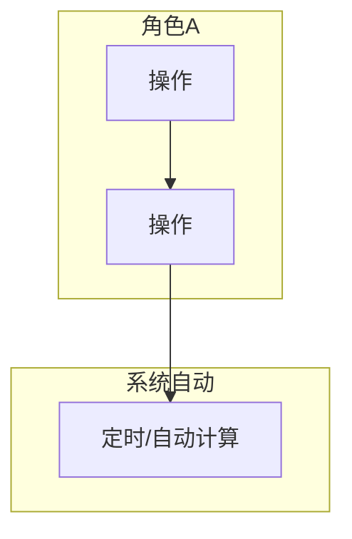
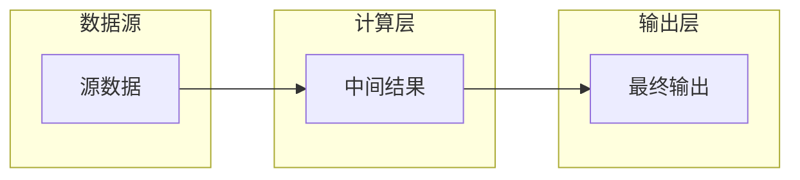

# 产品文档 — 输出模板

> 本模板由 `product-doc-writer` Skill 的 §Output 引用。生成产品文档时按此结构逐章填充。

> ## ⚠️ 生成边界（铁律 · 见 AGENTS.md §文档职责边界）
>
> 本文档是「**需求 + 方案 + 业务规则 + 验收**」的唯一权威。以下内容**正文只在本处**：
> - 需求定义 / 业务全景 / 业务流程 → §1 / §2 / §3
> - 业务规则（R 编号，跟流程走）/ 计算公式 → §3 各流程内
> - 状态机 → §4
> - 功能清单与页面映射（轻索引）→ §5
> - 权限矩阵 → §6
> - 验收标准 AC → §10
>
> 以下内容**不在本处、只引用**：
> - **字段结构 / 类型 / 约束 / 枚举值（TinyInt / 常量名）** → 数据设计 Schema（§3 字段表只写「字段名 + 业务含义」，不逐字段重复定义类型/枚举）
> - **页面交互细节** → 原型（§5 只挂原型链接，不写交互 / 弹窗 / 字段校验）
> - **接口契约（字段级）** → 数据设计（本文档只提接口名 + 一句话用途）

# [模块名] 产品文档

> **文档类型**：产品文档（需求 + 方案合一）｜ **版本**：v1.0 ｜ **状态**：草稿 ｜ **日期**：YYYY-MM-DD ｜ **作者**：AI PM + 业务团队
> **关联**：数据设计 `drafts/[模块]/[日期]-数据设计.md` ｜ 原型 `demo/员工端-demo/`、`demo/货主端-demo/`
> 变更历史见 `变更记录.md`（业务变更）与 `LOG.md`（工作日志）。

## 1. 需求定义

### 1.1 背景与现状

[1-2 段描述 As-Is 流程和痛点，引用数据/案例]

### 1.2 目标与成功口径

**目标**：[一句话]

| 指标 | 当前 | 目标 | 数据来源 | 评估窗口 |
|------|------|------|---------|---------|
| [指标] | [现状] | [目标] | [来源] | [窗口] |

### 1.3 范围与边界

**In Scope（本期 P0）**：[列表]
**Out of Scope**：[排除项 + 原因]

### 1.4 影响范围

- 影响角色 / 影响模块 / 依赖系统

## 2. 业务全景

### 2.1 角色与工作节奏

| 角色 | 核心任务 | 频率 |
|------|---------|------|
| [角色] | [任务] | [日频/周频/按需] |

### 2.2 端到端业务链路

```
【一次性配置】→【按渠道配置】→【每周运维】→【查询使用】→【持续治理】
```

### 2.3 实体依赖关系

```
聚合根
  ├── 1:1 子实体A
  ├── 1:N 子实体B
  └── N:N 关联实体 ← 外部引用
```

### 2.4 核心业务流程图（泳道图）★ 必画



### 2.5 核心数据流图（有复杂计算链路时必画）



## 3. 业务流程（按 N 条流程）

> 每条流程包含：流程概述 → 实体字段定义（字段名 + 业务含义）→ 业务规则（R 编号，跟流程走）→ 核心场景 → 相关 AC。

### 3.1 [流程名]（[频率标签]）

> **触发**：[什么情况启动] ｜ **频率**：[一次性/周频/日频/按需] ｜ **前置依赖**：[依赖哪些外部数据或前置流程]

#### 3.1.1 [实体名] (EntityName) — [1-2 句定位]

> **As a** [角色] **I want to** [做什么] **So that** [业务目的]

| 字段 | 必填 | 业务含义 |
|------|------|---------|
| [字段名] | ✅ / — | [业务含义；类型/枚举值见数据设计 Schema] |

**业务规则**（R 编号按流程分段，格式 `R[流程号].[序号]`，如 `R1.1`）：
- **R1.1 [规则名]**：[触发点] → [条件/公式] → [输出] → [异常处理]
- **R1.2 [规则名]**：……

**相关 AC**：`AC0a` `AC0b`

#### 3.1.2 [下一实体] — [重复以上结构]

#### 3.1.N 核心场景（多实体联动时必写）

```
场景：XXX
  1. 操作 → 结果
  2. 操作 → 结果
```

### 3.2 [下一流程] — [重复流程结构]

## 4. 状态机（★ 研发必读）

> 每个有状态流转的实体单独一节，含状态图 + 触发操作 + 约束。

### 4.1 [实体名] 状态流转

```
[状态A] ──{操作1}──→ [状态B] ──{操作2}──→ [状态C]
  │                    │
  └──{操作3}──→ [状态D] (异常分支)
```

| 当前状态 | 操作 | 目标状态 | 触发角色 | 校验条件 |
|---------|------|---------|---------|---------|
| [状态A] | [操作] | [状态B] | [角色] | [条件] |

## 5. 功能清单与页面映射（轻索引）

> 本表是**页面索引**（原型是交互权威），只挂原型链接、不写交互 / 弹窗 / 字段校验。功能 → AC 验收映射见 §10。

| 功能 | 优先级 | 页面（原型链接） | AC |
|------|--------|-----------------|----|
| [功能] | P0/P1/P2 | [`页面名.html`](demo/…) | ACx |

## 6. 权限矩阵

| 操作 | 角色A | 角色B | 系统 |
|------|-------|-------|------|
| [操作] | ✅/仅查看/❌ | … | — |

## 7. NFR（非功能性需求）

- **性能** / **并发** / **数据保留** / **精度** / **安全** / **外部依赖**

## 8. 计算示例（如有）

## 9. 分期与 MVP

**Phase 1 (MVP)** / **Phase 2** / **Phase 3**

## 10. 验收标准总览（AC）

> 按流程分组，每条 AC 格式：`AC[N]-[简称]：[可测试的完整验收条件]`

**流程一：[流程名]**
- [ ] AC1-[简称]：[验收条件]

**流程二：[流程名]**
- [ ] AC2-[简称]：[验收条件]
