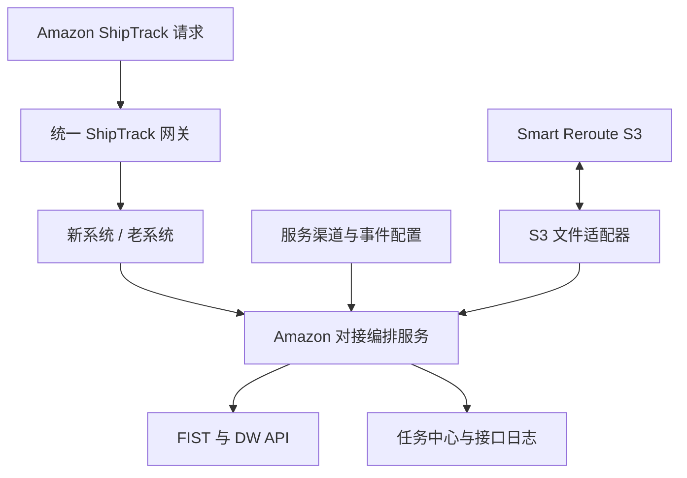
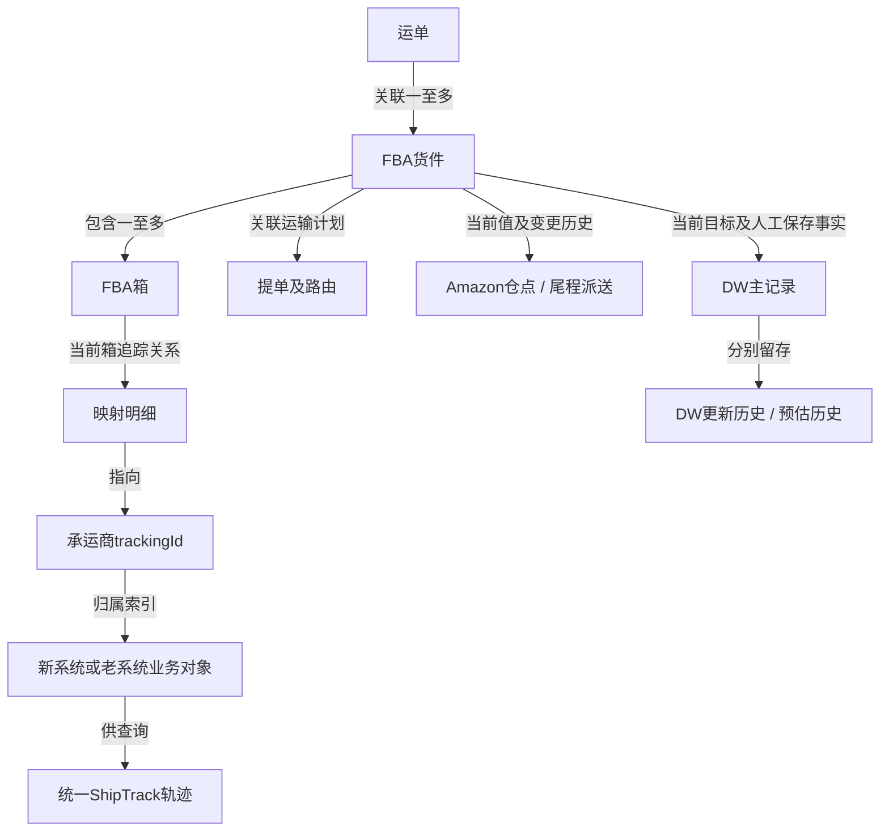
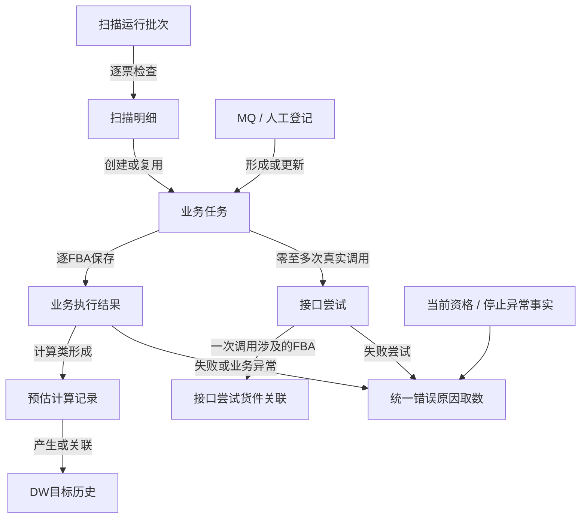
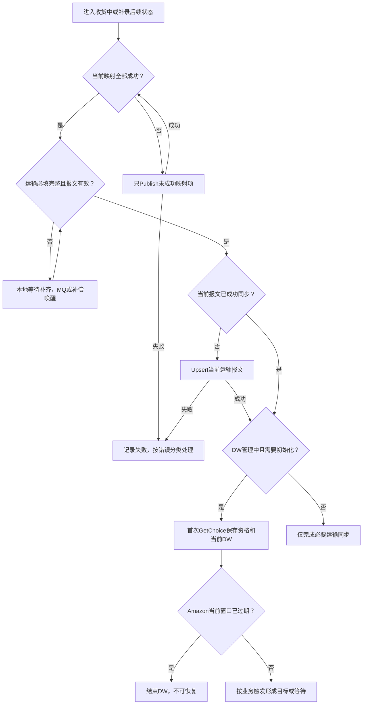
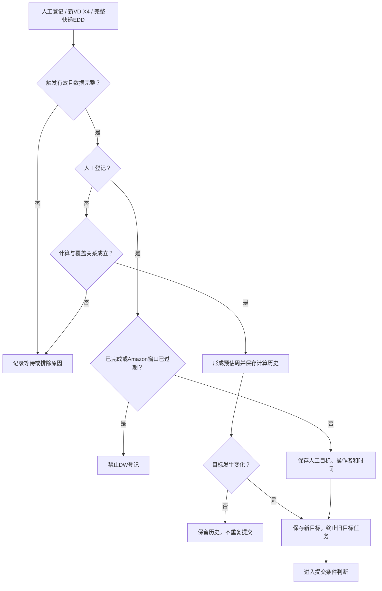
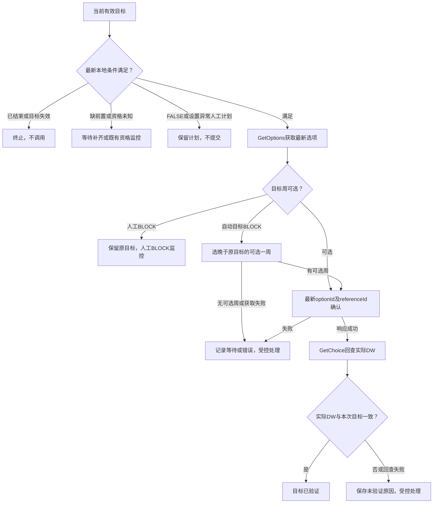
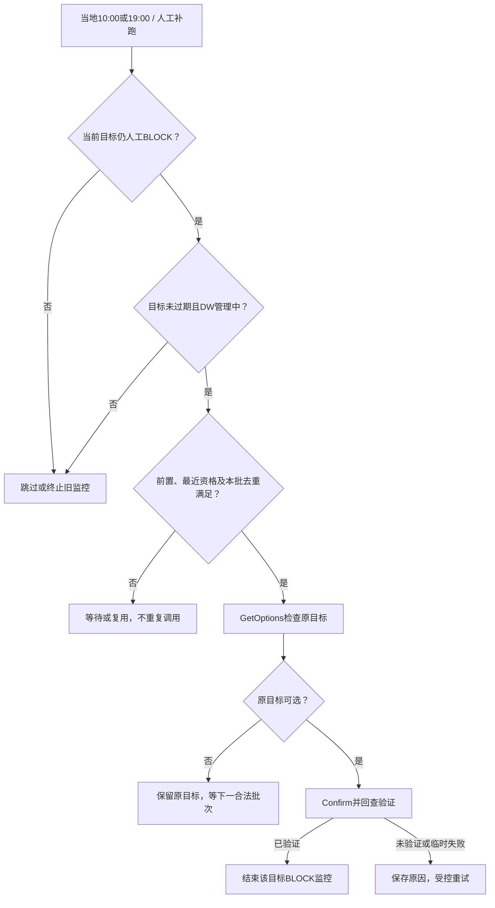
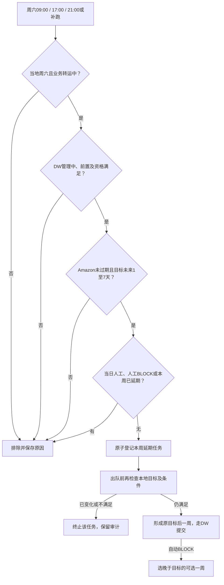
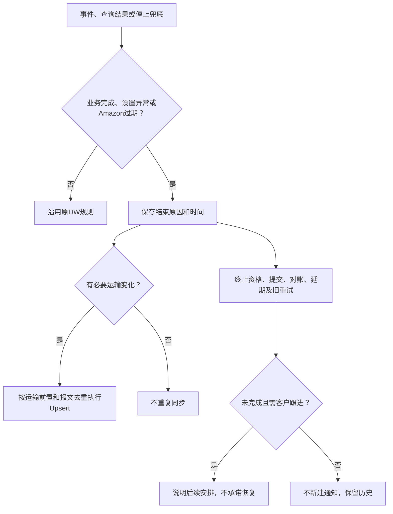
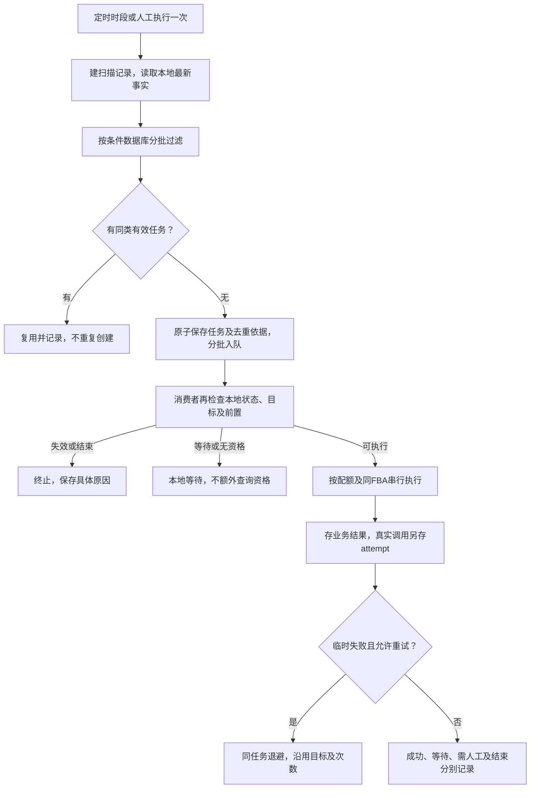

# 亚马逊平台对接及 Delivery Window 管理产品方案

版本：v2.3　日期：2026-10-06　状态：评审稿  
适用系统：新跨境物流系统、老物流系统、亚马逊 FIST / ShipTrack / Smart Reroute

## 交付范围与原型展示边界（2026-10-06整理）

完整产品原型保留全部规划功能，包括智能转仓、通知跟进、自动任务及独立重试队列；一期暂缓开发不等于删除原型。本节仅定义实际开发交付范围，优先于下文完整规划中的页面及通知能力描述。第10章DW生命周期、第21章后台调度继续执行。通知跟进、Smart Reroute、自动任务人工整批补跑和独立重试队列仍按既有分期列为二期；本轮确认了完整原型的展示及交互，不自动变更实际开发范围。

| 能力 | 一期范围 | 二期规划 |
| --- | --- | --- |
| DW货件列表 | 查询、批量DW、有效失败重试；业务阶段/资格/设置异常/目标/实际/来源 | 更完整运营管理 |
| DW提单列表 | 已出发提单+最新仓点；批量DW及简单仓点登记 | 复杂转仓流程 |
| 货件详情 | 当前信息、DW更新及预估记录、错误及接口记录 | 独立资格历史、业务变更和客户跟进页签 |
| 任务中心 | 人工登记批次、逐票结果、接口记录、有效重试、重试时间/截止、统一失败及异常原因导出 | 独立重试队列、自动任务管理/人工整批补跑 |
| 业务主链路 | Publish/Batch、Void、Upsert、两次预估、人工DW、对账、周六延期 | 延续完善 |
| 后台可靠性 | 时区、MQ、增量补偿、目标版本、停止控制、去重限流、受控重试全部保留 | 管理操作可视化 |
| 仓点变更 | 简单登记新FC及来源并Upsert；已有外部智能转仓结果可登记 | S3主动申请、Offer选择、确认及回写 |
| ShipTrack | 优先复用现有统一接口，增加新系统轨迹适配与归属路由 | 按需要完善迁移治理 |
| 客户通知 | 不生成系统通知待办；保留异常展示和导出，运营线下通知 | 通知case、发送、反馈、核实、机器人 |
| 备案物流仓 | 不建设 | 智能转仓上线时建设 |

实际一期交付仅三个Amazon菜单：DW货件列表、DW提单列表、Amazon任务中心；完整演示原型保留所有菜单和页签。服务渠道配置沿用业务基础菜单。完整规划保留用于二期，开发按本节判断交付范围。

一期未授权/设置异常仍可保存人工计划，显示等待人工处理，不隐含调用或恢复。Amazon过期、已完成、货件设置异常停止规则不变，必要仓点Upsert继续。下文通知触发规则作为运营线下跟进指引及二期预留，不产生通知数据库/发送流程。

一期不提供自动任务人工整批补跑页面；后台仍按第21章调度。人工仅逐票/批量重试有效业务任务，货件设置异常与Amazon窗口过期均不可恢复，不提供解除申请或恢复入口，不绕过停止控制。独立重试队列合并在任务结果表显示。

一期生产交付验收：三个主要菜单可用；批量DW可看逐票结果；统一导出覆盖实际已开发任务类型；人工/自动BLOCK区别正确；等待资格不提交、结束不恢复；同版本任务不重复。完整评审原型则保留Smart Reroute（二期）、客户跟进、自动任务、独立重试队列，不能按一期暂缓要求隐藏或删除。

## 1. 文档目的

本方案用于指导新跨境物流系统建设亚马逊平台对接能力，覆盖：

- 运单进入“收货中”后的 FBA 货件与承运商追踪号映射；
- 货件运输信息、尾程方式和计划送仓仓点的维护；
- Delivery Window（下文简称 DW）的计算、修改、核对、自动延期和人工处理；
- 亚马逊通过 ShipTrack 查询我方物流轨迹时，新老系统的统一接入；
- Smart Reroute 通过 S3 CSV 文件完成智能转仓；
- 每个接口任务的执行记录、自动重试、人工重试和异常闭环。

`PutComplianceData` 不在本期范围内，我司当前不开展法国线路合规数据对接。

## 2. 核心方案结论

| 议题 | 方案结论 |
| --- | --- |
| Publish 与 Upsert 的顺序 | 运单变为“收货中”后，先完成 `PublishTrackingId/Batch`；映射全部成功后检查运输信息完整性，齐全再异步执行 `UpsertTransportationInfo`。二者属于同一个业务流程，但不能并发，也不放在同一个数据库事务中。 |
| Upsert 与 DW 的顺序 | 首次Upsert成功后GetChoice初始化；后续提交沿用最近资格，本地条件满足后GetOptions → Confirm → GetChoice验证，不为每次提交重新查询资格。不应长期采用“DW 报错后再补调 Upsert”的方式。 |
| Upsert 是否重复调用 | 服务组合、尾程方式、干线信息、亚马逊仓点、预约信息等导致有效请求内容发生变化时重新调用。使用“成功报文摘要 hash”判断，内容未变化不重复推送。 |
| Void 是否受已开船限制 | 现有官方资料没有给出按物流节点限制取消的规则，也没有说明已开船后一定不能取消。已开船不能被产品写成硬性禁止条件。最终是否能取消由亚马逊接口响应和货件状态决定。 |
| Void 的业务边界 | 仅支持整票货件取消，不支持取消部分箱；需承运商与卖家达成一致；只能取消本承运商的订单。当前接口仅取消亚马逊后台数据，不会取消卖家后台的映射，取消后需要运营核查卖家侧。 |
| DW 日期提交方式 | DW 接口不接受我方任意填写的日期作为确认参数。我方先计算目标日期区间，再从最新一次 `GetDeliveryWindowOptions` 返回结果中匹配该区间，使用其 UUID 格式 `deliveryWindowOptionId` 和 `referenceId` 确认。 |
| DW 数据权威 | 我方数据库保存“期望 DW”，Amazon 返回“实际 DW/最近一次承运商提交 DW”。日常对账以我方期望 DW 为业务基准，并按运行模式选择正确的 Amazon 字段比较。 |
| 新老系统共用 ShipTrack | 建设一个统一 ShipTrack 网关和“追踪号归属索引”。正常情况按索引路由到新系统或老系统；迁移期索引未命中时双查，唯一命中后回填索引，双命中则进入冲突处理。 |
| Smart Reroute | 单独建设 S3 文件适配器和转仓任务台账，自动完成 Step1 至 Step4。转仓成功后回写新 FC/新预约，再以 `SMART_REROUTE` 来源调用 Upsert，已有人工DW不重新预估，等待运营再次登记；无人工目标的处理按第10、21章已确认事件规则。 |

## 3. 官方资料能够确认的边界

### 3.1 VoidTrackingId

官方资料明确说明：

1. 取消表示卖家在承运商处取消了承运订单；承运商和卖家达成一致后应调用接口保持数据一致。
2. 只能取消本承运商的订单。
3. 只能取消整个 FBA 货件，不能取消其中部分箱子。
4. 当前接口仅取消后台数据，不取消卖家后台映射。
5. 通用错误 `INVALID_FBA_SHIPMENT_STATUS` 表示货件当前状态不能再更新，文档举例为“已取消、已到达”。

官方资料没有列出“接货、报关、开船、到港、入海外仓”等节点的 Void 可取消矩阵。因此：

- **无法根据现有文档断言已开船后不能取消。**
- “追踪号在货件进入 `IN_TRANSIT` 后不能被新的追踪号覆盖”是 Publish 更新限制，不能推导为 Void 的限制。
- 初期产品采用可配置规则：开船前正常申请；出现 `VD/NS` 后要求主管确认、取消原因和卖家同意记录，但仍可发起接口调用；亚马逊接口返回货件状态不可更新时，转人工处理。
- 已完成投递或亚马逊明确返回终态不可更新时，不自动反复调用。

### 3.2 Delivery Window

官方资料明确说明：

- 仅支持美国线 FBA；AWD 不使用 DW。
- 前置条件为 `PublishTrackingId/Batch` 和 `UpsertTransportationInfo` 已成功。
- Upsert 至少要提供产品时效 3 个字段和干线运输 5 个字段，共 8 个 DW 必需字段。
- 我方当前按 `ENABLED` 正式启用模式设计，不建设影子模式页面和影子模式专用任务。
- 应依据 `carrierShouldProvideDW` 决定是否继续确认。
- `ConfirmDeliveryWindowOption.success=true` 代表请求被记录，不等同于卖家侧一定实际生效；确认后必须再次查询 Choice 验证。
- `deliveryWindowOptionId` 必须来自最近一次 GetOptions 返回，不能根据 FBA 号和日期自行拼接，也不能长期缓存。

## 4. 系统范围与总体架构

建议拆分为五个可独立部署或逻辑隔离的能力：

1. **Amazon 对接编排服务**：按货件串行组织 Publish、Upsert 和 DW 调用，消费业务事件，生成任务。
2. **DW 规则引擎**：计算期望时间窗、匹配 Amazon option、按事件发生时间及目标版本判断替换，处理自动延期。
3. **统一 ShipTrack 网关**：接收 Amazon 查询，路由新老系统，转换成统一轨迹模型并输出 XML。
4. **Smart Reroute S3 适配器**：上传、轮询、下载、解析和归档四步 CSV 文件。
5. **Amazon 任务中心**：承载任务、调用尝试、错误分类、重试、告警和人工操作。

## 5. 业务对象与数据源

### 5.1 业务对象关系

一张我方运单可关联一个或多个 FBA 货件；一个 FBA 货件包含多个 FBA 箱；每个箱可共享同一个追踪号，也可拥有独立追踪号。DW 的管理粒度是 **FBA 货件**，Publish 和部分 Upsert 数据的粒度可到 **FBA 箱**，ShipTrack 的查询主键是 **此前映射给 Amazon 的 trackingId**。

### 5.2 从业务系统哪里取数

| 业务数据 | 取数位置 | 关键关联路径 | 使用场景 |
| --- | --- | --- | --- |
| 运单号、状态、服务组合、目的国、仓库代码、提单号 | 新系统“头程管理 → 运单管理” | 运单号 | 触发已收货、展示 DW、人工检索 |
| FBA 货件号、FBA 箱号、箱数 | 订单/装箱明细/面单采集 | 运单 → FBA 货件 → 箱 | Publish / Batch、ShipTrack 归属 |
| 自有追踪号、箱号与追踪号关系 | 运单制单或箱级标签数据 | FBA 箱 → trackingId | Publish、ShipTrack 查询 |
| 服务组合 | “服务管理 → 服务组合” | 运单.service_combination_id | 确定服务渠道、主运输方式和尾程派送方式 |
| Amazon 服务等级、运输最小/最大天数 | “服务管理 → 服务渠道 → 预估运输时效” | 服务组合 → 服务渠道 | Upsert 的 `middleLegServiceLevel`、`minTransitDays`、`maxTransitDays` |
| VD/X4 后送仓预计天数 | “服务管理 → 服务渠道 → 送仓预估时效” | 服务渠道 + 尾程方式 + Amazon 仓库代码/邮编前缀 | VD/NS、X4/FN 两次 DW 预估 |
| `transportMode`、ETD、ETA、起运港、目的港 | 路由、订舱、船期/航班、提单数据 | 运单 → 提单号 → 路由/班次 | Upsert 干线信息 |
| 尾程派送方式、尾程 SCAC、子单号 | 服务组合、尾程派送/标签数据 | 运单箱 → 尾程方案 | Upsert 尾程信息 |
| ISA、Amazon Freight Order ID | 预约管理、运营登记、Smart Reroute 结果 | FBA 货件/箱 → 预约 | Upsert 预约信息、Smart Reroute |
| 初始和当前 Amazon FC | 订单原始资料、面单扫描、运营变更、Smart Reroute | FBA 货件 → FC 变更历史 | Upsert `carrierIntendedFc`、DW 配置查找 |
| 内部物流事件及时间地点 | “事件管理 → 物流事件”及各事件源系统 | 运单/箱 → 事件 | ShipTrack 输出、VD/X4 DW 触发 |
| Amazon 事件码映射 | “事件管理 → 亚马逊物流事件”及绑定配置 | 内部事件 → Amazon status/reason | ShipTrack 标准化、DW 事件触发 |
| 老系统/新系统归属 | 追踪号归属索引 | trackingId → source_system + source_key | ShipTrack 请求路由 |

### 5.3 对现有原型和产品文档的调整

1. 当前“预估运输时效”在服务渠道下是 1:1 配置，没有仓库维度。因此 Upsert 的产品 SLA 默认从“服务组合 → 服务渠道 → 预估运输时效”取得；仓库代码用于校验和查找“送仓预估时效”。如果产品 SLA 确实因 FC 不同而变化，需要新增“仓库级 SLA 覆盖配置”，不能直接按现有表实现“服务组合 + 仓库”查询。
2. 当前“送仓预估时效”的字段名称是“开船至送仓天数、提柜至送仓天数”，与本次确定的 `VD/NS`、`X4/FN` 触发不完全一致。建议改为：
   - `vd_to_delivery_days`：VD/NS 事件发生日至预计送仓日天数；
   - `x4_to_delivery_days`：X4/FN 事件发生日至预计送仓日天数。
   原“提柜至送仓”数据不能未经业务复核直接迁移为 X4 配置。
3. 一个“FBA 运单同步”开关不足以覆盖 FIST 与 DW。建议拆分：
   - `fist_enabled`：开启 Publish、Upsert、ShipTrack 数据准备；
   - `dw_enabled`：开启 DW，且必须依赖 `fist_enabled=true`。
   这样可兼容只做 FIST 但不做 DW 的场景。
4. 现有 Amazon 物流事件配置应按官方事件清单重新初始化，至少正确配置 `AF/NS`、`K2/O1`、`VD/NS`、`VA/NS` 或 `K1/AJ`、`K2/RD`、`X4/FN`、`AG/AG`、`D1/NS`。禁止仅凭页面中文名称手工猜代码。
5. 当前后台任务只有“处理中/完成”不足以支持 Amazon 接口。建议增加独立的“Amazon 任务中心”，或扩展任务模型支持等待前置、等待重试、被阻塞、需人工、已跳过、已验证等状态。

## 6. 核心数据模型

### 6.1 FBA 映射台账 `amazon_shipment_binding`

| 字段 | 说明 |
| --- | --- |
| `fba_shipment_id` | FBA 货件号 |
| `waybill_id` | 我方运单 ID |
| `box_id`、`tracking_id` | 箱号和映射追踪号 |
| `source_system` | `NEW` / `LEGACY` |
| `mapping_status` | 待推送、推送中、成功、取消中、已取消、失败 |
| `publish_version`、`last_success_at` | 映射版本和最近成功时间 |
| `amazon_region`、`scac`、`transport_mode` | 接口路由参数 |

### 6.2 运输信息快照 `amazon_transportation_snapshot`

保存每次 Upsert 的业务来源版本、完整标准化报文、报文 hash、成功时间和 Amazon 返回。相同 `fbaShipmentId + payload_hash` 已成功时不重复调用。

### 6.3 DW 主记录 `amazon_dw_record`

| 字段 | 说明 |
| --- | --- |
| `fba_shipment_id` | DW 管理主键 |
| `desired_start_date`、`desired_end_date` | 我方当前期望 DW |
| `desired_source` | `RECEIVED_SAFETY`、`VD_ESTIMATE`、`X4_ESTIMATE`、`MANUAL`、`WEEKLY_EXTENSION` |
| `desired_source_ref` | 事件 ID、人工登记单 ID 或延期任务 ID |
| `desired_version` | 当前目标版本，失效任务终止 |
| `manual_saved_at` | 人工登记时间，周六当天登记排除自动延期 |
| `automation_control` | 管理中、已结束；设置异常/Amazon过期/业务完成写入独立结束原因 |
| `amazon_actual_start/end` | Amazon 当前实际 DW |
| `carrier_last_start/end` | 最近一次承运商确认的 DW |
| `enrollment_at_publish/latest` | 运行模式状态 |
| `seller_allow`、`carrier_should_provide` | Amazon 控制字段 |
| `sync_status` | 等待前置、待同步、同步中、已验证、卖家管理、阻塞待重试、失败待人工、已关闭 |
| `next_retry_at`、`consecutive_drift_count` | 重试和连续不一致次数 |

### 6.4 DW变更与预估历史

DW更新历史独立保存旧目标、新目标、目标来源、保存人/时间、提交/验证结果及关联业务任务。人工保存、自动延期和实际修改分别留存；纯查询且窗口一致只记录执行结果，不制造DW变更。

预估历史独立保存节点或EDD输入快照、实际发生/查询时间、计算时间、配置及计算规则、计算基准日、原预估周、BLOCK调整后的结果、形成状态和关联目标。人工修改或新预估不能覆盖已有预估历史。节点未发生显示“尚未触发”；节点发生但没有明细显示“暂无该节点预估记录”。两类历史内部可关联目标版本，运营页面不展示版本号。

### 6.5 接口任务和调用尝试

- `amazon_integration_task`：一次业务意图，例如“已收货初始化”“X4 第二次预估”“每日对账修复”。
- `amazon_api_attempt_log`：一次真实网络调用。记录接口、请求摘要、响应摘要、HTTP 状态、Amazon 错误码、耗时、尝试次数、correlationId 和下次重试时间。
- 一个任务可产生多次 attempt；人工重试创建新的 attempt，并关联原任务和操作者。

### 6.6 追踪号归属索引 `amazon_tracking_owner`

| 字段 | 说明 |
| --- | --- |
| `tracking_id_normalized` | 精确查询索引；保留原值用于响应 |
| `source_system` | `NEW` / `LEGACY` |
| `source_business_key` | 对应系统的运单/箱 ID |
| `active` | 当前是否有效 |
| `ownership_source` | Publish 注册、历史回填、查询修复 |
| `conflict_status` | 无冲突、双系统重复、待人工 |

### 6.7 业务对象关联图

提单号不是DW管理主键；同号多箱通过当前有效箱追踪关系管理。提单+最新仓点是汇总键，不另建覆盖逐FBA目标的DW记录。

### 6.8 扫描、业务、接口与预估记录关联图

MQ/人工登记不要求先有扫描批次；不同扫描明细可复用同一任务。计算无调用则attempt为零；批量接口通过货件关联对应多FBA，不把一条响应伪造为多次调用。字段见26章。

## 7. PublishTrackingId / Batch 功能设计

### 7.1 触发条件

运单状态首次变为 **收货中** 时触发。若运单已在“收货中”之后的状态补录进入系统，也要通过补偿扫描创建任务。

### 7.2 接口选择

- 同一 FBA 货件所有箱共用同一 trackingId，可调用 `PublishTrackingId`。
- 箱级 trackingId 不同，调用 `PublishTrackingIdBatch`。
- Batch 每次最多 500 个箱映射；超过 500 箱按稳定排序拆批，同一 FBA 货件的批次串行执行。
- 同一 trackingId 关联多个 FBA 货件时，按 FBA 货件分别调用。

### 7.3 前置校验

必须校验 FBA 货件号、箱号、trackingId、SCAC、运输方式、发货国和 UTC 时间戳。箱号缺失、箱与货件不匹配或追踪号不满足已登记正则时，任务进入“数据待修正”，不生成伪数据。

### 7.4 成功后的动作

1. 更新映射台账；
2. 在追踪号归属索引中登记新系统归属；
3. 当该 FBA 货件所有预期映射均成功后，发布 `AMAZON_MAPPING_COMPLETED`；
4. 编排服务收到事件后立即创建 Upsert 初始任务。

## 8. VoidTrackingId 功能设计

### 8.1 业务入口

在 FBA 货件详情提供“取消 Amazon 映射”。操作人必须填写取消原因，并确认已与卖家达成一致。若业务运单本身取消，可由运单取消事件自动生成待确认任务，不直接静默调用。

### 8.2 初始控制策略

| 我方进度 | 页面处理 | 接口处理 |
| --- | --- | --- |
| 尚未 Publish 成功 | 不显示 Void；仅取消本地待推送任务 | 不调用 |
| Publish 成功，尚无 VD/NS | 普通权限可申请 | 调用 Void |
| 已有 VD/NS，尚未完整投递 | 主管权限、卖家同意记录、二次确认 | 仍允许调用；以 Amazon 响应为准 |
| 已完整投递、已关闭，或 Amazon 返回终态不可更新 | 默认禁止自动取消，开放异常申请 | 不自动重试，人工联系 Amazon/卖家 |

以上是我方风险控制，不代表 Amazon 官方节点限制。后续如 Amazon 给出正式取消矩阵，应转为配置，不修改核心流程。

### 8.3 结果处理

- 成功：标记 Amazon 后台映射已取消，停止新的 DW 自动任务，ShipTrack 索引保留审计但标记 inactive；页面提示运营核查卖家后台映射。
- `INVALID_FBA_SHIPMENT_STATUS`：标记“Amazon 状态不可取消”，不自动重试。
- 超时：先查询本地最近调用和后续状态，延迟重试；不得立即连续重复取消。
- 不支持部分箱取消。部分箱退出运输需走业务异常流程，由运营与卖家决定是否整票取消及重新建货件。

## 9. UpsertTransportationInfo 功能设计

### 9.1 正确编排顺序

- Upsert 在映射成功且运输信息完整时自动执行；缺项本地等待增量批次补偿（见第21章），不依赖是否关联提单。
- 不与 Publish 并发，因为官方错误 `MISSING_INIT_CALL` 明确要求先完成映射。
- 不把两次外部调用包在同一事务内。每一步独立落任务和状态，可恢复、可重放。
- DW 返回 `MISSING_TRANSPORTATION_INFO` 时，允许执行一次“强制 Upsert → 重新发起 DW”的自愈流程，但该流程只作为异常兜底。

### 9.2 初次调用取数

| Amazon 数据 | 我方来源 |
| --- | --- |
| `middleLegServiceLevel`、`minTransitDays`、`maxTransitDays` | 运单服务组合 → 服务渠道 → 预估运输时效 |
| `transportMode` | 服务组合主运输方式/运单路由 |
| ETD、ETA、起运港、目的港 | 提单与路由计划；缺失时任务等待数据补齐 |
| `lastLegDeliveryMode` | 服务组合内的尾程派送方式 |
| 尾程 SCAC/子单号、ISA、Amazon Freight Order ID | 尾程派送和预约数据 |
| `carrierIntendedFc` | 运单当前 Amazon 仓库代码 |
| FC 来源 | 初始 `SELLER`，面单核实 `LABEL_SCAN`，转仓使用相应 reroute 枚举 |

产品 SLA 需要满足：`minTransitDays > 0`、`maxTransitDays <= 75`、最大值大于最小值、差值不超过 20 天。

### 9.3 重新调用触发矩阵

| 变化 | 是否重调 | 规则 |
| --- | --- | --- |
| 服务组合变化 | 是 | 重新解析产品 SLA、运输方式和尾程方式；新报文 hash 与最近成功 hash 不同才调用 |
| 服务组合中的尾程方式变化 | 是 | 属于 Amazon 业务信息实质变化；按受影响箱更新，可支持卡派/快递混派 |
| Amazon 仓库代码变化 | 是 | 更新 `carrierIntendedFc` 及来源；已有人工DW不重估，等待运营再登记。后续有效新节点/快递EDD使用最新仓点，不因换仓重新处理旧节点 |
| 运营登记智能转仓 | 是 | 来源传 `SMART_REROUTE` |
| 运营登记“亚马逊自提” | 是 | 官方资料对应枚举写作 `AF_REROUTE`，其含义是 Amazon Freight 转仓决定；上线前需与业务确认“亚马逊自提”是否确实等同于该枚举 |
| 面单仓点与卖家资料不一致并核实采用面单 | 是 | 来源传 `LABEL_SCAN` |
| ETD/ETA、起运港、目的港实质变化 | 是 | 初版与最终版不同才调用；开船/起飞/陆运出发后 24 小时内提供最终版 |
| 新增/取消 ISA、尾程子单号产生 | 是 | 按官方 ADD/REMOVE 和箱级信息调用 |
| 仅修改备注、页面显示名 | 否 | 不影响标准化请求报文 |

## 10. DW生命周期与任务筛选规则（2026-10-05确认）

本章为我方业务规则。DW归周、临期、过期、周六及当天人工登记按目的Amazon仓点当地日期判断，自动处理夏令时；页面默认显示北京时间。DW为周日至周六。接口配额按官方契约联调，不猜测频率。

### 10.1 业务阶段与运行控制

| 业务阶段 | 原始状态 |
| --- | --- |
| 收货中 | 收货中、已收货 |
| 转运中 | 转运中、已到港、一清关、已到仓 |
| 已完成 | 已签收、退件、取消 |

已签收表示整票全部签收，一期没有部分签收。阶段与接口结果分开。运行控制为管理中、货件设置异常结束、Amazon当前DW过期结束、业务完成结束。未授权停止提交但仍查询资格；缺运输信息为本地等待，不是货件设置异常。货件设置仅“--”“货件设置异常”。列表不再显示同步状态，期望DW来源表示当前计划来源，DW货件主列表不展示“系统下次动作”；等待、暂停和结束原因放在货件详情，任务状态、下次执行时间及截止时间放在任务中心。

### 10.2 节点处理矩阵

| 触发 | 动作 | 边界 |
| --- | --- | --- |
| 首次收货中 | Publish成功→本地检查→Upsert→查询资格及当前DW | 缺信息等待，不硬性要求关联提单 |
| 数据补齐/有效变化MQ | 读最新业务快照，hash变化才Upsert | 早、下午、晚增量补偿漏事件，已排队/执行不重复 |
| 已收货 | 前置完成后首次安全检查 | 已有人工/VD/X4目标不覆盖；Amazon过期结束自动处理 |
| VD/NS | 第一次预估 | 新真实节点可覆盖更早人工计划 |
| X4/FN | 第二次预估 | 以发生时间判断，旧事件迟到不能覆盖后登记计划 |
| 人工登记 | 保存目标版本，终止旧任务 | 未授权/设置异常可保存并通知，不绕过暂停/结束 |
| 人工登记后仓点/派送方式变化 | 同步必要运输信息；换仓点不重新预估，等待运营登记；卡派改快递派等待Track123定时预估 | MQ必须传快递单号；DW仍受停止控制 |
| 授权恢复 | 重评目标和当前窗口再处理 | 不直接重放旧窗口 |
| 已签收/退件/取消 | 结束DW任务与旧重试 | 不生成通知，关闭未完成跟进，保留历史 |

### 10.3 运输信息补偿

8个DW必需字段为Amazon服务等级、运输最小/最大天数、运输方式、ETD、ETA、起运港、目的港。分别从服务渠道、路由/订舱/提单计划取数。未关联提单不等于必然缺字段，有完整路由计划可正常Upsert。

映射成功后校验缺项和格式，未完整则等待运输信息，列出具体缺项。每日三个批次仅本地检查，未补齐不调用Upsert或DW，不重复生成同类失败日志。MQ补齐立即唤醒，早、下午、晚增量补偿兜底。有效报文hash不变不重复Upsert。

参数错误等业务修正；429、超时、临时故障进统一退避队列，已有任务不重建。DW返回MISSING_TRANSPORTATION_INFO先检查8字段、补Upsert，成功再恢复。它不是货件设置异常。迟至已收货之后才补齐时，安全检查以执行日为准，不追溯提交过期窗口。

### 10.4 已收货首次安全检查

映射、Upsert完成，允许修改且未暂停/结束，没有人工或VD/X4目标时检查Amazon窗口：未来临期（开始日距今天≤7天）后一周；当周但未过期改下一完整周；不临期不改；已过期结束自动处理。“已成功并验证”不作为筛选条件，回查是执行步骤。

### 10.5 两次预估与覆盖规则

事件发生日+服务组合关联渠道、尾程方式、最新FC的送仓预估天数，归入完整周。当周或过去至少选下一完整周。缺配置VD从第4周、X4从第2周开始（当前周不计，下一完整周为第1周，基准为首次补偿计算日的目的仓当地日期）；BLOCK只选择晚于原目标的可选一周，不进入人工BLOCK每日监控。

快递派当地08:00/16:00刷新Track123，完整整票取最晚日期（未妥投EDD、已妥投实际日期），部分缺失保留原目标；保存查询时间及预测依据。新VD/X4可覆盖此前人工目标并结束旧重试；事件ID及发生时间去重，早于人工登记的迟到旧事件不能覆盖。相同结果不重复提交。

### 10.5.1 目标形成与覆盖流程

VD/X4按实际发生时间判断，迟到旧事件不覆盖后人工计划；EDD须关联当前单号，查询期间新人工计划不能被旧结果覆盖。人工登记后换仓点不进入重新预估分支；卡派改快递派等待Track123批次。配置零命中排除当前周，VD从第4周、X4从第2周起取可选完整周；重试沿用首次基准。

### 10.5.2 DW提交与回查流程

提交前仅读本地最近成功资格，不额外GetChoice校验；回查属于验证。Confirm前再检查本地目标和结束事实，不使用取Options期间失效的目标。无选项或回查失败不能显示修改成功。

### 10.6 人工登记及BLOCK

货件列表勾选FBA；提单列表多选“提单号+最新仓点”，最终均逐FBA处理。只填写开始/结束，无人工原因、锁定、允许周六延期开关。

保存新版本、操作者和时间，结束旧队列。区分已保存、已排队、缺运输信息等待、待通知客户、设置异常结束、窗口过期永久结束，不能统称修改成功。未授权/设置异常允许登记但不Confirm；Amazon当前DW过期后不可恢复，不再登记或提交DW。已完成禁止更新。

人工BLOCK每天两个批次重取Options，资格沿用最近结果，原目标监控至结束日（含）。成功、新人工目标、新VD/X4替换、目标过期、Amazon当前DW过期、设置异常、业务完成均终止旧监控，不自动换周。

### 10.6.1 人工BLOCK监控流程

截止目标当地结束日，含当日两批；新人工目标或有效新VD/X4替换即终止旧监控。人工BLOCK允许人工更新，但不参与周六延期，不自动换周。

### 10.7 周六延期条件（全部满足）

1. 业务阶段转运中，映射及必需Upsert成功；
2. 允许修改且carrierShouldProvideDW=true，无设置异常结束/自动结束；
3. Amazon当前DW未过期；
4. 我方目标开始日大于今天且距今天≤7天；
5. 当天无人工登记（不论提交成功与否）；
6. 无人工BLOCK监控、无相同FBA同业务周延期任务。

我方目标当周或过期不延期。符合条件后一周，BLOCK选择晚于原目标的可选一周。执行重查版本和当日人工登记标记，避免先排队后人工改期仍执行旧任务。

### 10.7.1 周六延期流程

业务周按仓点当地周日日期；本任务自身预留的去重记录不能误判为别人重复任务。三个时段同票同周最多形成一次延期意图，失败重试不再延后一周。历史人工来源本身不排除。

### 10.8 每日两批DW对账

本地先排除暂停、结束、完成、无未来有效目标。目标当周不自动修复，目标过期不再对账旧计划；新有效计划可以重新参与管理。Amazon当前DW过期则结束全部DW自动处理。

08:00/18:00筛选后GetChoice读取当前窗口及返回资格，过期结束、资格不允许不提交；Amazon不一致按我方目标改回，包含比我方早或当周未过期；一致不Confirm。只称“检测到DW不一致/提前”，不证明是客户所改。对账保留原目标来源。已有BLOCK/执行/重试任务复用，不每日重复建队列。失败按11.1分类。授权恢复先重评有效性，不重放旧目标。

### 10.9 全局停止与不可恢复条件

| 条件 | 停止范围 | 恢复 |
| --- | --- | --- |
| INVALID_FBA_SHIPMENT_STATUS | 全部DW自动任务：资格、对账、延期、预估提交、BLOCK/失败重试 | 根据客户真实反馈，卖家或承运商无法恢复。结束该货件全部DW自动处理和旧任务，不提供申请解除、核实恢复或补跑恢复入口；必要运输同步独立继续 |
| Amazon当前DW结束日早于今天 | 同上，结束自动处理、旧队列 | 不可恢复。考核货物是否按原DW窗口按时送达；结束全部DW自动处理，不提供恢复入口，不每日探测 |
| 已签收/退件/取消 | 全部DW及未完成通知跟进 | 保留终态历史 |

不停止ShipTrack和必须更新的运输信息。事件及计算可留存但不绕过控制提交。我方目标过期不属于全局终止，也不单独通知客户。

### 10.9.1 结束控制与运输独立处理

设置异常可存人工DW供通知；Amazon过期/业务完成不可登记DW。结束跟进、运输同步成功及客户反馈不恢复DW。我方旧目标过期只停止该目标，不等于货件全局结束。

### 10.10 调用去重与限流

初始化：Publish→完整性校验→Upsert→GetChoice。后续提交：本地条件检查→GetOptions最新optionId/referenceId→Confirm→GetChoice验证。Confirm响应成功与业务回查一致分开存储。

人工提交沿用最近保存的资格结果，不再新增GetChoice资格校验任务；只做本地业务状态、停止标记、前置和目标版本检查。FBA串行，MQ合并最新快照，执行前校验版本；失效版本终止。hash未变不Upsert，窗口一致不Confirm；资格监控与对账各自按已确认批次GetChoice，对账读取实时窗口；其他提交不额外查资格。统一按接口/区域/承运商配额排队退避，限流值按官方联调确认。

## 11. 异常、重试、任务中心与客户跟进

### 11.1 分类处理

| 情况 | 动作 |
| --- | --- |
| 人工BLOCK | 每日10:00/19:00监控原目标至当地结束日（含） |
| 自动预估/延期BLOCK | 晚于原目标的可选一周 |
| 缺运输信息 | 本地检查、补Upsert |
| 卖家未授权 | 停提交，保留资格查询，通知客户 |
| INVALID_FBA_SHIPMENT_STATUS | 设置异常，结束全部DW自动处理，通知客户 |
| option过期 | 重新取最新选项，受控重试 |
| 超时/429/5xx | 统一退避，不重复建立对账任务 |
| 参数错误/不可编辑 | 数据修正或人工，不盲重试 |
| 替换/过期/全局停止 | 结束旧版本队列 |

人工/批量重试校验最新业务意图，禁止直接重放HTTP。完成、暂停、结束、失效目标、无资格不可直接重试；设置异常与Amazon窗口过期均不可恢复。

INVALID_FBA_SHIPMENT_STATUS的既有错误示例包括状态WORKING、货件尚未完整确认。根据客户真实反馈，本产品将已确认的货件设置异常视为不可恢复，不再提供卖家确认后重调Publish/DW的恢复流程。本期不建设影子模式。

### 11.2 六个任务中心页签与展示范围

顺序固定为：业务任务/批次 → 接口执行记录 → 预估计算记录 → 重试队列 → 客户跟进 → 自动任务。完整原型保留全部页签，分期按开头范围表实施。

| 页签 | 数据来源与默认范围 | 查询与操作 |
| --- | --- | --- |
| 业务任务/批次 | 所有已保存的业务执行批次及逐FBA明细，不限当天；包含人工登记、系统延期、对账修复、节点预估等实际已开发业务类型 | 批次号/FBA/运单/提单独立多值查询，任务类型、逐票结果、创建日期；无顶部统计。可看逐票结果、当前货件及关联接口；有效失败可重试 |
| 接口执行记录 | 已发生的真实接口尝试，包括成功、失败；不限当天，不把业务计算或本地等待伪装成接口记录 | 任务号/批次号/FBA/运单/提单独立多值查询，接口、结果、创建日期；请求响应、错误、重试时间及关联业务任务 |
| 预估计算记录 | 已发生的节点/EDD计算历史，记录形成后不可被当前人工DW或其他计划覆盖；不是接口日志 | FBA、计算任务号、触发节点查询；计算时间、结果、依据、计算状态、计算明细。详细字段见第25章 |
| 重试队列 | 当前有效的重试、等待事项及需保留查看的停止原因，不按当天截断；已经完成的历史尝试在前两页查看 | FBA/运单多值、等待或停止原因；当前原因、下一次重试时间/截止、有效重试。版本号不展示 |
| 客户跟进（二期） | 当前待办及跟进历史；独立于DW任务的终止状态 | FBA/运单/问题、跟进状态；保留人工DW，登记发送/反馈/后续安排。设置异常及窗口过期不能恢复 |
| 自动任务（二期管理页面） | 全部自动任务配置与每项最近一次运行结果；不是当天货件流水 | 不设置顶部时区或筛选条件；展示执行频率/仓点当地时刻、最近开始/结束、结果/数量、执行明细；“执行一次”默认全范围按业务规则过滤 |

业务任务/批次、接口执行记录的查询条件默认展开，支持收起/展开；点击查询应用条件后自动收起，重新展开保留输入。重置清除条件，恢复默认查询范围。查询条件折叠不改变数据权限或已应用过滤。

无立即对账、运行健康检查入口，不展示固定成功率、固定任务数或没有真实依据的“巡检正常”结论。某条记录接口成功、DW已验证和等待客户修改分别展示。只有真实执行记录才能展示实际完成时间，计划时间不能写成“最近执行”。

### 11.3 统一失败及异常原因导出

入口放在Amazon任务中心顶部：“导出全部失败及异常原因”。不受当前页签折叠查询条件隐式限制。导出任务覆盖全部实际已开发业务来源：人工DW、系统延期、VD/X4预估、快递EDD、对账、资格查询、BLOCK监控、映射、Void、Upsert、ShipTrack对接异常；二期上线后再纳入通知发送和Smart Reroute。运输、内部计算及平台接口异常均可追溯，不只导出人工批次。

全量导出包含以下三类，必须分别标识，不混称接口失败：

1. **接口失败尝试**：接口超时、429、5xx、参数错误、货件设置异常等；失败尝试后重试成功也仍可导出历史失败原因。
2. **业务计算/执行异常**：预估所需数据缺失、无法形成有效目标、未匹配可选周、前置未满足、BLOCK、回查不一致及重试耗尽等。没有网络调用时接口字段为空。
3. **业务资格或停止原因**：修改资格FALSE、货件设置异常、Amazon当前DW过期等。FALSE是成功查询得到的业务值，不是HTTP失败；首次未查询/查询异常不是FALSE。正常完成、窗口已一致、同类任务复用、自动BLOCK已成功顺延不列为执行失败。

记录粒度：接口失败为FBA+一次真实调用；业务异常为FBA+一次业务执行结果；当前未解除资格/停止事项为FBA+异常事实。三类使用各自记录ID，关联任务/批次，不能靠错误文案去重或拼成同一失败。一次批量接口涉及多FBA时逐FBA拆出相关行；同一次失败不得因多个页签重复导出。

导出字段：FBA货件号、运单号、提单号、仓点、任务编号、业务批次号、任务类型、触发来源、异常环节、异常分类、接口名称（如有）、错误码、业务返回值（如FALSE）、错误原因、执行时我方目标DW、执行时Amazon DW、目标来源、业务阶段、修改资格、货件设置、任务创建时间、失败或发现时间、最近执行时间、操作人。无对应数据留空或明确“未记录”，不得以当前快照冒充历史值。

不输出重试次数、下次重试时间、允许重试、处理状态及人工原因。当前未解除异常如无历史任务号应留空，不制造虚假任务编号。业务异常类别用于说明原因，不作为待处理/已处理状态。

批次和接口页签可保留“导出当前查询异常”，必须明确受当前查询范围限制。全量按钮始终表示全部已保存失败历史及当前业务异常；正式系统由后台生成导出任务并按权限读取全记录，不能只导出浏览器当前页。原型仅演示已有数据，不代表历史记录已经实际建设。数据模型见第26章。

### 11.4 通知触发规则（二期；一期仅作为线下指引）

先判断完成：已签收（整票）、退件、取消不新建，已有未完成跟进自动关闭并保留历史。未完成如下：

| 情况 | 待办与内容 |
| --- | --- |
| 首次卖家不允许修改 | 开启授权；有有效目标一并告知，或请卖家自行修改 |
| 设置异常，即便显示允许修改 | 告知货件设置异常不可恢复、DW自动处理已结束，线下跟进实际送仓及后续安排 |
| 未授权/异常期间人工新DW | 更新同一跟进：新窗口+待处理动作 |
| 未解决期间系统新有效目标 | 更新通知，不能绕过暂停提交 |
| 人工BLOCK持续/近截止，需客户协助 | 协调后续计划，不承诺可绕过BLOCK；自动阈值待确定，二期运营判断 |
| 不可自动恢复/重试耗尽且需客户协助 | 障碍+有效计划+客户动作，内部技术错误不转嫁 |
| Amazon当前DW过期且未完成 | 告知自动更新已结束，请反馈实际送仓及后续安排；有未来有效目标一并告知 |
| 客户说已处理但核实未解决 | 剩余障碍和最新动作 |

不通知：我方目标/VD/X4预估过期、运输信息等待、单次临时故障/限流、自动BLOCK成功顺延、对账成功、Amazon过期但货件已完成。我方目标过期可能由授权/设置异常未解决或计划未生效导致，不代表部分签收，本期无该动作。

### 11.5 跟进闭环与后续机器人预留（二期）

可恢复的授权问题可按待通知→待客户处理→待核实→已完成管理；业务完成或运营关闭→已关闭。设置异常、Amazon窗口过期仅登记后续安排并结束跟进，不显示“核实已解决/恢复货件”操作。跟进结束与DW恢复分开，结束跟进永远不改变DW结束标记。复制不等于发送，客户反馈不等于解决。

未发送的新目标更新同一草稿；已发送再变化重新待通知，发送内容和版本不可覆盖。持续同类问题不每日堆叠，多障碍合并客户行动说明。只用当前有效日期，无有效计划仅说明修正动作。无授权且无法查询Amazon显示无法获取，允许人工证据。Amazon当前窗口过期后不可恢复，客户反馈仅用于线下跟进后续交付。

二期复制、登记发送渠道/发送人/时间、客户反馈、后续安排、授权问题核实、结束/关闭跟进。通知case与发送attempt独立：case保存FBA、客户/负责人、问题集合、当前目标版本、状态、反馈及证据；attempt保存内容快照、版本、人工/机器人、渠道、发送时间/人、结果、外部消息ID。后续机器人只消费当前版本待通知，不发过时内容；通知重试与Amazon API队列分开。

### 11.6 模型补充

DW新增business_stage、automation_control、stop_reason、desired_version、desired_event_occurred_at、manual_saved_at、missing_transport_fields、transport_payload_hash、saturday_extension_business_week。取消manual_lock、allow_auto_extension与固定来源优先级，改事件发生时间/目标版本。

任务保存FBA、任务类型、目标版本、来源、等待原因、下次执行时间、截止时间和替换关系。目标版本仅后台使用。执行前检查最新本地事实，不新增资格查询；attempt只保存真实调用。业务执行明细及失败尝试均保存不可变结果快照，见第26章。

## 12. ShipTrack API 与新老系统路由

### 12.1 接口方向和查询键

接口方向为 **Amazon → 我方统一 ShipTrack 网关**。Amazon 请求中的 `TrackingNumber` 等于我方在 Publish 中提交的 `trackingId`。网关不得擅自替换为提单号、FBA 号或尾程子单号。

官方手册示例使用 XML：请求包含 Validation、`APIVersion=4.0`、TrackingNumber；响应通过 `PackageTrackingInfo` 返回 TrackingNumber、最新预计送达日期和 `TrackingEventHistory`。最终 URL、认证、完整 XSD 和错误结构仍需 Amazon 提供独立的 `AmazonRTTVApiSpec` 后固化。

### 12.2 新老系统判断方案

**主方案：追踪号归属索引，而不是按单号格式猜测。**

1. 新系统每次 Publish 成功时写入 `trackingId → NEW + source_business_key`。
2. 上线前从老系统导出仍可能被 Amazon 查询的有效 trackingId，批量回填为 `LEGACY`。
3. 网关收到请求后先精确查询归属索引，并调用对应适配器。
4. 迁移期索引未命中时，在受控超时内并行查询新老系统：
   - 仅一个系统命中：返回结果，并以“查询修复”来源回填索引；
   - 两个系统都未命中：返回协议规定的未知追踪号错误；
   - 两个系统同时命中：不拼接两票数据，进入冲突告警并按已配置的权威归属处理。
5. 不建议“先查新系统，查不到再查老系统”长期运行，这会增加尾延迟并掩盖重复单号。

### 12.3 统一轨迹模型

新老系统适配器都转换为统一结构：追踪号、事件源 ID、内部事件码、Amazon 状态码/原因码、发生时间及时区、地点、当时 EDD。网关统一完成去重、排序和 XML 输出。

至少覆盖：`AF/NS`、`K2/O1`、`VD/NS`、海运到港 `VA/NS` 或空运到港 `K1/AJ`、`K2/RD`、`X4/FN`、卡派预约 `AG/AG`、完整投递 `D1/NS`。一期不建设部分签收，不用部分箱事件关闭整票DW。

### 12.4 可用性和日志

- 按资料目标支持大于 40 TPS，并设置超时、熔断和短时缓存；缓存键必须包含完整 trackingId。
- 记录请求时间、来源校验结果、路由系统、命中业务键、事件数量、耗时和错误；不记录访问凭证。
- 新老系统均不可用时返回明确的临时错误，不用空轨迹冒充成功。

## 13. Smart Reroute S3 功能设计

### 13.1 官方流程

| 步骤 | 发起方 | S3 目录 | 文件与动作 |
| --- | --- | --- | --- |
| Step1 | 我方 | `step1-Request/` | 上传 `<SCAC>_<MMDDHHMM>.csv`，包含 ISA、SCAC、海外仓、PO 列表和可选轨迹状态 |
| Step2 | Amazon | `step2-AmazonFeedback/` | 约 1–2 分钟后生成 `<ISA>.csv`，返回多个新 FC + 可约时间 offer |
| Step3 | 我方 | `step3-CarrierFeedback/` | 在 Step2 文件中且仅在一个 offer 行填 `confirmed=yes`，可填写新 CRDD，上传 `<ISA>.csv` |
| Step4 | Amazon | `step4-ProcessingResult/` | 约 1–2 分钟后返回原 ISA、确认 offer、新预约 Reference Code 或错误 |

offer 自生成起 4 小时有效，且不会锁定仓位；上传之间至少间隔 5 分钟，每文件最多 20 条预约，只接受 UTF-8 CSV。错误目录只保留最新错误文件，因此我方必须下载并归档每个版本。

### 13.2 产品页面

“Smart Reroute”页面包含：申请列表、原 ISA/FC、海外仓、PO、当前轨迹、Step 状态、offer 数、失效倒计时、已选 offer、新 FC、新 Reference Code、错误原因和操作人。

操作流程：

1. 本章为二期。SCAC默认GUHD；业务系统未存原ISA时由运营登记ISA和区域。当前物流仓从备案清单选择；关联FBA/PO从业务货件解析。物流仓备案编号不是Amazon FC代码。原FC是在申请录入还是Step2返回，需对照Smart Reroute官方文件核定；原型暂展示Step2返回，不作为接口契约。
2. 二期维护备案物流仓名称、认可编号、区域。distance属于距离备案文件还是每次申请字段，需核对官方文件；不得按尚未确认的描述开发。原型暂展示备案文件版本，不维护距离明细。
3. 生成 Step1 文件并排队上传；
4. 轮询 Step2，解析 offer，按额外里程和最早可约日展示；
5. 运营在 4 小时内选择唯一 offer，系统生成 Step3；
6. 轮询 Step4，成功后回写新 FC 和新预约 Reference Code；
7. 自动触发 Upsert，FC 来源为 `SMART_REROUTE`；
8. 已有人工DW时，换仓点不重新预估、不覆盖人工目标，等待运营再次登记；必要Upsert继续。

### 13.3 技术与权限

- 使用 Amazon 提供的 `CarrierFileAccessRole` 通过 STS AssumeRole 获取临时凭证。
- 仅使用 `ListObjects`、`GetObject`、`PutObject`，我方对 S3 文件无删除权限。
- US 和 EU 使用不同 bucket/region，并按 SCAC 和 UTC 日期访问专属前缀。
- 本地保存文件内容 hash、S3 key、etag、上传/下载时间和解析结果，保证重复轮询不重复处理。

## 14. 任务状态、日志和监控

### 14.1 任务状态

`WAITING_PREREQUISITE` 等待业务数据或前置接口；`PENDING` 待执行；`PROCESSING` 执行中；`WAITING_RETRY` 等待自动重试；`BLOCKED` 被 Amazon 可用性阻塞；`MANUAL_ACTION_REQUIRED` 需人工；`SUCCEEDED` 接口成功；`VERIFIED` 业务结果已验证；`SKIPPED` 因卖家管理/规则跳过；`CLOSED` 货件终止。

### 14.2 接口日志展示

每次调用展示：任务 ID、业务触发、接口、环境和区域、FBA 货件号、trackingId、请求时间、请求字段摘要、响应时间、HTTP 状态、Amazon 错误码、耗时、尝试次数、下次重试、前后任务关系。凭证、签名和敏感头信息必须脱敏。

### 14.3 后台监控指标（不直接铺在运营页面）

- 进入收货中至 Publish 成功时长；
- Publish 至 Upsert 成功时长；
- VD/X4 事件至 DW 确认与验证时长；
- Publish、Upsert、DW 各接口成功率和错误分布；
- BLOCKED 数量、平均解除天数、临期未解决数；
- 我方期望 DW 与 Amazon 值的日对账差异率；
- DW 修改成功率、回查一致率和货件设置异常数量；
- ShipTrack QPS、P95/P99、未知追踪号率、新老系统路由冲突数；
- Smart Reroute offer 超时率和 Step 错误率。

## 15. 接口与触发矩阵

| 接口/能力 | 方向 | 主要触发 | 前置条件 | 成功后的下一步 |
| --- | --- | --- | --- | --- |
| PublishTrackingId / Batch | 我方 → Amazon | 运单变为收货中 | FBA/箱/追踪号完整 | Upsert 初始版 |
| VoidTrackingId | 我方 → Amazon | 整票取消并与卖家一致 | 已映射成功 | 停止 DW，核查卖家后台 |
| UpsertTransportationInfo | 我方 → Amazon | 映射成功；服务/路由/尾程/FC/预约变化 | Publish 成功 | DW 计算与同步 |
| GetDeliveryWindowChoice | 我方 → Amazon | 初始检查、每日资格监控、确认后验证及必要对账读取（复用有效结果；人工提交前不新增资格查询） | 美国线且 FIST 开启 | 判断是否继续/验证结果 |
| GetDeliveryWindowOptions | 我方 → Amazon | 有期望 DW 且应提供 | Upsert 必需字段完整 | 匹配最新 option |
| ConfirmDeliveryWindowOption | 我方 → Amazon | 匹配 option 非 BLOCKED | 最新 optionId/referenceId | 再次 GetChoice 验证 |
| ShipTrack API | Amazon → 我方 | Amazon 按 trackingId 查询 | 归属索引和轨迹数据可用 | 返回标准 XML |
| Smart Reroute S3 | 双向 | 运营申请智能转仓 | ISA/PO/海外仓距离齐全 | 更新FC/ISA、Upsert；已有人工DW等运营再登记 |

## 16. 验收用例

1. 运单首次进入收货中，只创建一次 Publish 任务；重复状态事件不重复推送。
2. 一票多箱共号与箱级不同号分别正确选择 Publish/Batch；超过 500 箱正确拆批。
3. 全部映射成功后自动 Upsert；Upsert 未成功前不执行 GetOptions/Confirm。
4. DW 返回缺运输信息时可自愈一次，且不形成无限 Publish/Upsert/DW 循环。
5. 2026-09-26 已收货、现有窗口为 09-27 至 10-03 时，计算目标为 10-04 至 10-10。
6. VD/NS 按服务渠道、尾程方式、仓库配置生成第一次完整周窗口。
7. X4/FN生成第二次窗口，可覆盖此前人工；迟到旧事件不得覆盖。
8. 人工从货件/提单勾选后登记，保存后按逐票前置及资格提交或等待；保存不等于Amazon修改成功，关闭弹窗并留在原列表，不跳转任务中心。无匹配option不得显示成功。
9. 人工目标BLOCK：保留原目标，每票每日两个批次监控，直到目标当地结束日（含）；自动预估目标BLOCK：只选择晚于原目标的可选一周，不选择连续两周，不进入人工BLOCK监控。可用后使用最新optionId/referenceId确认。
10. DW 返回 `INVALID_FBA_SHIPMENT_STATUS` 时标记“货件设置异常”，根据客户真实反馈不可恢复，结束该货件全部DW自动处理，不提供解除入口。
11. Enabled 且卖家未授权时停止 Confirm，状态显示卖家管理。
12. 每日发现Amazon窗口不一致且我方为未来有效目标时修复；当周不修复，目标过期不对账，Amazon当前窗口过期则结束自动处理。
13. 服务组合尾程方式、仓库代码、智能转仓结果变化时生成新的 Upsert；报文无变化时不调用。
14. VD 后发起 Void 需要主管确认，但系统不因“已开船”自行断言 Amazon 禁止；正确展示接口结果。
15. ShipTrack 已回填老单路由到老系统，新单路由到新系统；未命中双查唯一命中后修复索引；双命中告警。
16. Smart Reroute 完成 Step4 后回写新 FC/预约，触发 `SMART_REROUTE` Upsert；已有人工DW不重新预估，等待运营再次登记。

## 17. 上线顺序

1. **P0 配置与数据治理**：清理 Amazon 事件码、补服务渠道 SLA 和 VD/X4 配置、建立 FBA 箱关系和追踪号归属索引。
2. **P1 FIST 主链路**：Publish、Void、Upsert、任务中心、日志和基础重试。
3. **P2 ShipTrack 网关**：老单回填、新老适配器、XML 契约、容量和安全联调。
4. **P3 DW Enabled**：四步流程、VD/X4 估算、人工登记、周六延期、每日对账、卖家授权处理、实际生效验证和运营告警。
5. **P4 Smart Reroute**：S3 权限、距离数据、四步任务、FC/Upsert/DW 闭环。

## 18. 已闭环规则与仍需外部核实事项

已闭环：人工登记后的仓点/派送方式处理、第2/4周不计当前周、人工BLOCK与周六延期互斥、多次调度、即时本地事实过滤、不可恢复停止控制、完整原型保留。以下未定事项不改变上述规则：
1. 人工BLOCK持续通知的次数/临近截止阈值尚未定；原型用运营判断场景，不假设自动阈值。
2. Amazon真实接口限流、ShipTrack XSD/认证及各区域参数需完整官方契约联调。
3. 产品SLA仓点覆盖、AF_REROUTE与亚马逊自提业务对应关系、Void节点约束需进一步确认。

## 19. 资料依据

- 《FIST承运商对接单号API开发文档 0814》：Publish、Void、Upsert、通用错误码和调用顺序。
- 《FIST承运商管理送达时段API试运行/正式启用模式开发文档》：GetChoice、GetOptions、Confirm、Shadow/Enabled 行为及错误码。
- 《FIST-ShipTrack服务商轨迹对接手册-20250226》及事件清单：ShipTrack XML 查询方向和事件代码。
- 《Smart Reroute服务商智能转仓1113》：S3 四步文件流程、路径、时限、文件格式和 IAM 访问方式。
- 当前产品原型：运单管理、物流事件、亚马逊物流事件、服务组合、服务渠道及后台任务。
- 当前产品文档：头程管理、超级运价、服务渠道数据设计及后台任务设计。
- 产品原型：https://pp-demo.freedomscm.com/staff/index.html
- 产品文档：https://pp-demo.freedomscm.com/luna-prd/oss-site/index.html

本文将官方接口事实、当前系统设计和本次业务规则分开表达。官方资料未定义的内容以“我方产品规则”或“待确认项”标识，开发不得把推测写成 Amazon 接口限制。
## 20. 最新原型交付与验收补充

原型：https://amazon-dw-control.wen82926.chatgpt.site 。本轮已确认列表查询、批量人工计划、详情分栏、六个任务中心页签、统一异常导出及完整二期功能展示。页面交互要求见第25章，后台记录建设见第26章。交互数据为演示，未实际对接Amazon、Track123、MQ或机器人；刷新后演示状态重置。

验收重点：未授权/设置异常仍能保存计划，待办内容带最新DW；人工BLOCK换目标终止旧重试；新VD/X4按发生时间替换；预估当周选下周；周六转运中且未来临期、当天无人工、无BLOCK才延期；Amazon过期结束自动处理；本地旧目标过期不对账、不通知；已完成不通知；复制不改变待通知，已发送才进入待客户处理，反馈后必须核实。

## 21. 后台事实数据、任务筛选与多批次调度（2026-10-06确认）

本章替换旧调度设计。采用任务启动时读取本地事实、数据库过滤、分批入队，执行前检查最新本地状态的方式；不提前保存“可参加延期”等任务分类标记，不把系统下次动作文案作为执行依据。下列字段是开发必须建设或明确复用的数据，不能假定当前系统已存在。

### 21.1 时间与公共事实

所有启动时刻、DW归周、过期、当天人工登记、BLOCK截止均按目的仓当地日期；周窗口为周日～周六，使用IANA时区并处理夏令时，页面默认北京时间并展示当地时间和时区。时区缺失不能默认北京时区放行日期任务。启动时间不是完成时间，后一任务到点不能越过前置。

DW以FBA货件关联运单、箱、追踪号、提单及接口记录；映射最小项为当前所需箱/追踪号关系。业务原始状态映射：收货中/已收货→收货中；转运中/已到港/一清关/已到仓→转运中；已签收/退件/取消→已完成。未知状态按数据异常处理。整票全部签收才算已签收，一期无部分签收。

| 事实字段/记录 | 来源及更新 | 精确用途与失效规则 |
| --- | --- | --- |
| 原始状态、DW业务阶段 | 状态MQ保存成功后更新 | 按上述映射，阶段不是接口状态 |
| DW处理状态、结束原因/时间 | 已完成、已确认设置异常、Amazon窗口过期任一发生 | 管理中/已结束；不可恢复，清理旧DW任务；必要Upsert独立继续 |
| 当前所需映射清单、每项映射结果 | 箱/追踪关系变更更新清单，Publish结果更新项 | 清单不为空且当前每项成功才完成；历史成功不能代表新项 |
| 运输必填完整性、当前报文摘要、最近成功摘要 | 取最新业务快照生成当前摘要，Upsert成功保存所提交摘要 | 数据完整且摘要相同才同步完成；旧请求迟到成功仅更新其成功版本，不把新版本误标已同步 |
| 最近资格原始值、查询结果状态、成功读取时间 | GetChoice成功更新有效值，失败单独保存查询异常及时间 | carrierShouldProvideDW=true/false转换为允许修改/卖家管理；首次无成功为待查询/查询异常；失败不覆盖上次成功值。展示状态与可供执行使用的最近成功事实分开 |
| Amazon窗口开始/结束、成功读取时间 | GetChoice成功更新 | 空值不当过期；结束日早于当地今天即结束 |
| 当前目标开始/结束、来源、版本、形成时间 | 人工保存或预估形成新计划 | 替换增加版本并终止旧修改/BLOCK/重试；结果不变不重复Confirm |
| 最近人工保存时间 | 保存成功更新，接口是否成功无关 | 转目的仓当地日期判断当天登记 |
| BLOCK结果、关联目标版本、检查时间 | GetOptions结果更新 | 只对对应目标版本生效，新版本不继承旧BLOCK |
| 首次安全检查结果/完成时间 | 安全检查完成更新 | 未完成/无需调整/目标已生成；提交验证另存 |
| VD/X4事件编号/代码/实际发生时间/时区/补录时间/处理结果 | 节点MQ更新 | 同事件去重，以发生时间判断覆盖，迟到旧事件不覆盖后人工 |
| 当前派送方式、单号列表/关联/版本、EDD及妥投结果 | 业务MQ及Track123结果更新 | 旧号退出；同号去重；完整整票结果才能形成新DW |
| 任务记录、尝试记录、当地日期及批次时段 | 建任务与真实调用更新 | 去重、次数、在途、等待原因、下次执行、截止；扫描不是接口尝试 |
| 周六延期记录 | 原子建延期任务时写入 | FBA+当地业务周唯一；业务周用当地周六所属周的周日日期 |

运输DW必填为Amazon服务等级、运输最小/最大天数、运输方式、ETD、ETA、起运港、目的港；完整性与格式均校验，未关联提单不必然缺数据。

### 21.2 统一过滤定义

| 名称 | 判断 |
| --- | --- |
| DW管理中 | 状态为管理中且本地最新事实未出现任何结束条件 |
| 映射完成 | 当前所需清单非空且每项成功 |
| 当前运输同步完成 | 必填完整、当前摘要非空且等于成功摘要 |
| 允许修改 | 最近一次GetChoice成功的carrierShouldProvideDW=true，转换为“允许修改”；FALSE为卖家管理，首次未知不得提交。查询失败另标“查询异常”并保留最近成功值，不能以失败推断FALSE |
| 未过期目标 | 当前版本日期完整，结束日≥当地今天 |
| 未来目标 | 未过期且开始日>当地今天 |
| 当前人工BLOCK | 当前目标来源人工，BLOCK关联版本等于目标版本且结果为BLOCK |
| 同目标有效任务 | 同FBA同版本有待执行/执行中/等待重试/人工BLOCK监控；监控业务记录持续存在不阻止下一合法监控批次，只阻止重复建同意图及并发调用 |
| 本批已处理 | 同任务类型+当地日期+计划时段+FBA+对应事件/报文/目标版本已有批次记录 |

### 21.3 实时MQ与内部触发

MQ在业务保存成功后可靠发布，仅通知变化，对接取最新事实再去重建任务。通用字段：消息编号、业务对象编号、FBA/运单关联、变更类型、数据版本、业务发生及保存时间；节点另带事件编号、代码、实际发生时间及时区。不新增未经确认的VD/X4修正撤销流程。

| 变化/内部结果 | 处理 |
| --- | --- |
| 首次进入收货中 | 缺映射则Publish/Batch，成功检查运输信息 |
| 已收货 | 首次安全检查前置满足才执行，否则等待 |
| 业务终态、设置异常或Amazon过期 | 结束DW，不提供解除/恢复入口 |
| 新VD/X4及补录 | 同事件去重，按发生时间计算覆盖，不因补录时间晚而覆盖人工 |
| 运输补齐或报文变化 | 当前映射完成、完整且摘要不同才Upsert，成功唤醒有效等待目标 |
| 已人工登记后换仓点 | 必要Upsert；不重估，等运营再次人工登记 |
| 已人工登记后卡派改快递派 | MQ须带快递服务商、当前单号列表、箱/包裹关联、版本；必要Upsert，等既有EDD批次；缺号本地等待 |
| 单号补齐/变更 | 更新当前版本供定时EDD读取，不使用旧号EDD |
| 人工目标保存 | 新版本、终止旧任务；按最新本地条件提交/等待，不额外查资格 |
| Upsert成功 | 未结束且初始化需要时查询资格/当前DW；运输更新不能恢复已结束DW，不为每次提交额外查询资格 |
| 有效EDD | 形成整票预估，DW周变化才建立修改意图 |
| Confirm响应成功 | GetChoice验证实际结果，响应成功与生效分开 |

### 21.4 定时任务精确筛选、动作与启动时刻

同一行条件全部满足；DW任务先排除已结束。缺数据本地等待；未修正参数错误及重试耗尽不能被补偿重置。运输Upsert独立。第1项停止兜底专门处理已结束残留，不受“先排除已结束”限制。第2项映射与第3项运输不是DW修改，不用DW结束标记一刀切；仍按各自业务要求与明确的不可恢复平台限制处理。所有DW候选须为开启DW的适用美国FBA货件，未知状态/缺时区均本地等待，不使用默认值放行。

| 序号/任务 | 读取及精确过滤 | 执行/更新 | 当地频率/时间 |
| --- | --- | --- | --- |
| 1 停止兜底 | 尚未正确结束且阶段已完成/设置异常/已知Amazon结束日<今天，或已结束仍残留DW有效任务 | 结束原因/时间，终止旧任务；不探测已结束货件 | 每日1次06:00 |
| 2 映射补偿 | 需映射、阶段收货中/转运中；当前清单有未成功项，所需数据完整；无同项有效任务；非设置异常不可恢复、未修正参数错误或重试耗尽 | 仅补未成功项，不重推成功项；Amazon过期是否仍需映射按映射业务要求，不恢复DW | 每日3次06:10/14:10/20:10 |
| 3 Upsert补偿 | 映射完成、报文完整且摘要与成功摘要不同；无同报文有效同步/重试；非未修正参数错误或耗尽 | 提交当前报文，保存成功摘要；必要运输同步不受DW结束限制 | 每日3次06:20/14:20/20:20 |
| 4 资格及当前DW查询 | DW管理中、映射和当前运输同步完成；本批未成功完成监控且无同类有效查询；包含卖家管理/未知 | GetChoice更新资格及当前DW；过期立即结束；失败受控重试 | 每日2次07:00/15:00 |
| 5 首次安全检查 | 管理中；原始状态已收货/转运中/已到港/一清关/已到仓；检查未完成；前置完成、最近资格允许；无人工或有效预估目标；有窗口结果；无同类任务 | 当周未过期→下完整周；未来距开始1～7天→原周后一周；>7天→无需调整并完成检查；过期结束 | 每日3次07:20/14:30/20:30 |
| 6 VD/X4预估补偿 | 管理中、有效事件未处理；事件时间/时区、服务渠道/派送/仓点取数完整；无同事件任务 | 预估及覆盖判断；迟到旧事件不覆盖人工；换仓点/派送不重算旧节点；前置不足只存结果 | 每日3次07:30/14:40/20:40 |
| 7 快递EDD补偿 | 管理中、当前快递派；当前有效单号及关联完整；本批未查询，无同号有效查询；有完整未处理结果则直接处理不重复查 | 刷新未妥投号，已妥投保留实际日期；完整整票取最晚日期归周，周变才修改 | 每日2次08:00/16:00 |
| 8 人工DW补偿 | 管理中、当前目标人工且未过期；前置完成、最近资格允许；未验证成功；无同版本有效执行/BLOCK/重试；非未处理参数错误/耗尽 | 补漏建或前置刚满足的当前版本任务；当周未过期人工目标可执行 | 每日3次08:10/14:50/20:50 |
| 9 周六延期 | 管理中、当地周六、业务阶段转运中、前置完成、资格允许；Amazon日期完整未过期；目标未来且开始距今天1～7天；当天无人工保存；无当前人工BLOCK；同FBA同业务周未建延期；无冲突在途任务 | 原子生成后一周目标与延期记录，BLOCK选晚于目标的可选一周；以前人工来源不单独排除 | 周六3次09:00/17:00/21:00；每票每业务周最多生成一次 |
| 10 DW对账 | 管理中、前置完成、最近资格允许、我方未来有效目标；无同目标执行/BLOCK/重试；本批未处理 | 本批GetChoice读取当前窗口和资格：过期结束、卖家管理不提交、一致不改、不一致按我方目标修改 | 每日2次08:00/18:00 |
| 11 人工BLOCK | 管理中、当前版本人工BLOCK；目标结束日≥今天；前置完成、最近资格允许；本批未发起且无在途同版本监控尝试 | 沿用资格GetOptions检查原目标，可选提交，不可选保留；含结束日，不换周 | 每日2次10:00/19:00 |
| 12 临时重试 | 状态等待重试、到执行时间、错误可重试、次数未超限、关联版本有效、无重复尝试；DW另需管理中/前置/允许 | 同任务下一尝试，失败间隔5分钟/30分钟/2小时，首次失败后最多3次；429遵守配额和等待要求 | 按到期队列 |
| 13 通知补偿（二期） | 业务未完成且已确认通知事项漏建/内容改变，无同内容版本任务；不要求DW管理中 | 更新同跟进，已发内容保留，新版本重新待通知；不恢复DW | 每日1次21:30 |

### 21.4.1 各任务实际读取的数据及不符合时的处理

下表列出读取对象，避免“读取阶段”“Upsert成功”成为没有数据来源的抽象条件。第21.2的“前置完成”明确等于当前所需映射全部成功、运输必填完整、当前摘要等于最近成功摘要；不是历史任意一次成功。字段名称可按现有系统映射，但事实必须可落库或查询，不新增“参加某定时任务”标记。

| 任务 | 实际读取对象/字段 | 不满足时处理 |
| --- | --- | --- |
| 停止兜底 | 货件业务阶段/原始状态、设置异常事实、最近成功Amazon窗口、仓点时区、DW结束事实、残留有效DW任务 | 无停止事实不更新；已结束且无残留不重复处理；不调用Amazon探测已结束货件 |
| 映射补偿 | FBA/箱/当前trackingId清单、每项映射状态、业务阶段、FIST开关、接口必填数据、同项在途及失败记录 | 数据缺失等待；已经成功项跳过；同项在途复用；未修正错误/耗尽等待人工，不自动清零 |
| Upsert补偿 | 当前映射清单结果、业务最新运输快照、8字段完整性、当前标准化报文摘要、成功摘要、同摘要运输任务及失败记录 | 缺字段本地等待；摘要相同跳过；旧版本成功不代表新报文成功；已结束DW仍按必要运输规则执行 |
| 资格/当前DW查询 | DW开关及结束事实、业务阶段、当前映射/运输同步事实、当前仓点时区、本批资格查询记录及在途查询 | 前置未成等待；本批已成功不重复；未知/卖家管理仍纳入；读到Amazon过期立即结束 |
| 首次安全检查 | 原始业务状态、首次检查记录、有效目标来源、最近资格及Amazon窗口、当前前置、仓点日期、同类任务 | 未收货跳过；人工/有效VD/X4目标存在不覆盖；Amazon无窗口结果等待资格查询；完成检查事实与Confirm结果分别保存 |
| VD/X4补偿 | 原始事件ID/代码/实际发生时间/时区、处理结果、服务渠道/派送/FC取数、命中配置、最近人工计划时间、已有计算任务 | 旧迟到事件不覆盖后人工计划；配置零命中按第2/4周补偿；查询键缺失不能假装配置零命中；运输前置不足可保存计算，不提交 |
| 快递EDD | 当前派送方式、服务商、当前单号/箱包关联版本、每号妥投事实及当前批EDD、仓点日期、有效查询任务、查询前当前目标版本 | 缺号/缺一项EDD/异常日期口径等待；旧号结果丢弃；本批已取得完整结果复用；查询期间新人工计划出现时不覆盖 |
| 人工DW补偿 | 当前目标来源/日期/版本、人工保存事实、该目标提交及验证结果、DW结束事实、前置、最近资格、有效提交/BLOCK/重试任务 | 同目标已验证或有在途任务跳过；卖家管理等待客户；资格未知等既有资格任务；当周未过期人工目标仍可提交 |
| 周六延期 | 业务阶段字段及对应原始状态、DW结束事实、仓点时区/当地日期、前置、最近资格、Amazon窗口、当前目标、人工保存时间、目标关联BLOCK、同业务周延期记录、在途任务 | 必须映射为转运中；当周目标/当天人工/人工BLOCK/同周已延期分别排除；不能以“来源是人工”独立排除；出队前再读同样本地事实 |
| 每日DW对账 | 当前目标/日期/版本、前置、最近成功资格、DW结束事实、本批对账记录、同目标有效提交/BLOCK/重试 | 最近资格不允许先等待资格任务；本批符合后GetChoice读取最新值，成功但FALSE不Confirm；旧窗口快照不能当作本批对账结果 |
| 人工BLOCK | 当前目标及来源、BLOCK关联目标、前置、最近资格、当地今天、目标结束日、本批检查记录、同版本在途调用 | 原目标截止日仍监控，次日停止；新目标已替换即终止旧监控；BLOCK不触发周六换周，不再额外GetChoice查询资格 |
| 临时重试 | 原任务类型/结果、错误分类、次数、到期时间、有效事件/报文/目标、DW结束/前置/最近资格、同任务在途attempt | 未到期不取出；版本失效/结束终止；次数耗尽不再取；不修改目标或重算第2/4周 |
| 通知补偿（二期） | 业务完成事实、需通知问题事实、有效人工/系统计划、现有case及已发送内容快照、内容变化、重复任务 | 完成不通知；设置异常/过期仍可说明后续安排，不能恢复DW；我方旧预估过期不单独通知；不因每日扫描重复建相同问题 |

业务阶段直接读取货件保存的映射结果，按10.1已定义状态集合判断；不把提单阶段或接口任务状态当作货件业务阶段。人工登记日期必须由实际保存时间转目的仓时区计算，不能用“保存是否成功提交Amazon”替代。

### 21.5 接口职责、批次与去重

资格监控每批GetChoice；对账每批对筛选货件GetChoice读取当前窗口并更新资格，此为对账读取，不增加提交前资格校验任务。人工/预估提交及BLOCK使用最近资格，GetOptions取最新option/reference再Confirm；Confirm成功后GetChoice验证，失败不冒充成功。

扫描批次键为任务类型+目的仓时区+当地业务日期+计划时段；明细另关联FBA及事件/报文/目标版本。07:00成功不阻止15:00资格查询；10:00仍BLOCK不阻止19:00监控。某批失败的临时尝试复用该任务重试，不制造重复业务执行；上一批仍在途时不并发，保留后批待补偿，前批已无效则终止。人工重试复用适用批次，不因版本变化绕过已执行的同批接口操作。周六业务去重另按FBA+业务周，三个扫描时段不能延期三次。

所有任务按接口配额分批消费，同FBA的DW任务串行；获取完旧版本Options后目标变化不得继续Confirm。建任务与去重记录须原子提交，防两个批次同时通过“尚未建任务”。运输更新与已结束DW分开。

### 21.5.1 定时扫描与执行流程

扫描不等于全量接口调用，读取一批即可入队；扫描完成、接口成功、DW验证分别保存。补跑共用原规则，不设置参与标签，不新增提交前资格查询。

### 21.6 执行前本地检查与验收

| 任务类别 | 实际调用前检查 |
| --- | --- |
| DW修改/BLOCK | 最新未结束、关联目标版本仍当前、前置完整、最近资格允许、未重复调用 |
| 周六延期 | 上述条件及仍为当地周六、当天无人工、无人工BLOCK、同周未延期；已预留本任务记录不误当别人重复任务 |
| 节点预估 | 事件未处理且有效，覆盖关系仍成立 |
| Track123 | 当前仍快递派、单号版本未替换、未妥投；取得结果后整票目标也检查版本，不能覆盖查询期间新人工计划 |
| 映射/Upsert | 当前所需项或报文仍有效，尚未成功完成 |
| 临时重试 | 次数/等待时间满足，关联意图有效，无并发尝试 |

以上读取本地，不新增资格查询任务。更新人工目标/结束业务与执行任务串行衔接。

验收：旧运输版本成功不能放行新版本；资格/对账/BLOCK上午成功不阻止下午合法批次；周六三批同票同周只延一次；当天人工登记终止旧延期；BLOCK当天两批可执行但同批不重复；目标结束日含两批、次日停止；已结束不可恢复；多号EDD不完整不改DW；计周排除当前周；失败重试不因跨周重算兜底目标；耗尽不由次日扫描重置；各接口数量由实际符合货件与有效变化决定，扫描频率不等于全量调用。

## 22. 自动任务页签与人工补跑（二期管理能力）

后台定时任务属于一期可靠性要求；“执行一次”的管理页面与手动整批补跑沿用二期范围。完整原型保留在任务中心最后一个页签，Admin用于交互演示。

### 22.1 列表

直接展示全部自动任务，无顶部仓点/时区下拉，无任务类型/状态筛选。字段为任务名称与顺序、适用条件摘要、频率/仓点当地启动时刻、最近开始/结束时间、结果/检查或执行数量、执行一次/执行明细。时区由后台仓点配置决定，不能让运营切换页面时区改变调度范围。

列表所列顺序用于理解流程，不表示到点强行执行后续接口；每票实际执行仍依赖前置。07:00、15:00等均为各目的仓当地启动时间，后台分别换算，处理夏令时。运行详情可显示北京时间及涉及仓点的当地时间；不把某个时区的最近批次冒充全部地区已运行。

### 22.2 执行一次

点击后展示简短确认弹窗：任务名称、默认范围“全部货件，系统按本任务业务条件过滤”、规则说明和“确认执行一次”。不输入货件号、不选择仓点、不设置额外筛选条件。指定单票的有效失败重试在货件列表/重试队列操作。

确认后创建一个人工补跑扫描批次。系统按第21章读取事实、过滤、分批入队，分别记录符合条件、排除、等待、复用已有任务的逐票原因；“检查了N票”不等于“N票接口执行成功”。实际网络调用关联原业务任务和接口尝试记录。

补跑只覆盖发起时可读取的数据范围，不改定时计划、不重置重试次数、不重建失效目标，不对完成/设置异常/Amazon过期货件恢复DW。运输Upsert与DW终止独立。

### 22.3 并发、日期和结果

同类扫描有未完成批次时拒绝重复发起并提供已有明细；对已生成的逐FBA任务使用原有事件/报文/目标版本去重与串行控制。定时扫描与人工补跑共用锁和去重事实，不能因人工来源重复执行同一业务结果。

手动发起时间不是任意改期依据。资格/对账/BLOCK按既有业务条件与批次控制执行；周六延期逐票按其仓点当地日期判断。某地区尚未到周六时该地区货件排除，不把其他地区已经周六的货件一并拦截。当前周已延期、当日人工登记、当前人工BLOCK、当周目标等仍排除。任务无有效候选时结果为“无符合条件货件”，不制造接口失败。

时区缺失的日期相关任务逐票本地等待，不默认为北京时间执行。任何新有效目标或结束状态在出队前再次本地检查，不额外发起资格查询。

验收：无需输入直接发起；重复发起被拦截；全部货件按规则过滤；不同仓点日期分别判断；业务已完成/设置异常不参加DW任务；卖家管理可参加资格查询但不提交；必要运输同步独立；明细可见逐票原因；日志可追溯操作人和触发来源。本原型仅模拟筛选，不执行真实接口。

## 23. 完整原型保留与分期开发说明

完整原型已恢复并保留：Smart Reroute及备案物流仓、通知跟进、自动任务人工补跑、独立重试队列、完整货件详情及原任务中心。上述设计供整体评审和二期规划使用，展示在原型不代表一期必须实现。

一期实际开发按文档开头的一期交付范围收敛；三个主要菜单、必要业务链路和后台可靠性保留，暂缓能力仅在文档备注，不删除或隐藏完整原型。完整原型仍使用演示数据，不连接真实接口。

## 24. 最新确认规则与本次自检（2026-10-06）

第21章已替换旧调度版本，明确后台事实字段、读取来源、失效规则、逐任务过滤、接口职责及执行前本地检查。五种总状态与按任务参与标记方案不采用；DW只保留管理中/已结束。完整原型保留，主列表无系统下次动作、操作区无不可恢复文案与解除入口。

### 24.1 快递EDD与业务变更

人工登记后换仓点只同步运输，不重估，等待运营再人工登记。卡派改快递派MQ传服务商、单号列表、箱/包裹关联及版本，等待当地08:00/16:00既有Track123任务，缺号本地等待。当前未妥投单号即使已有EDD仍每批刷新；同号多箱去重。已妥投部分使用可靠实际送达日期，不再刷EDD；未妥投使用本批有效EDD，整票取最晚日期归完整周。部分结果缺失、空值或查询失败，不用部分数据修改整票DW，保留原计划与历史。旧号及旧EDD退出。DW周不变不重复提交，整票完成停止。有效EDD须对应当前单号，日期可解析并有明确时区/目的仓归日口径；未知日期口径等待核对不猜测。

### 24.2 缺配置补偿计周

有配置仍按节点实际发生日+天数。当周/过去至少下一完整周。只有配置零条命中才兜底：以首次补偿计算时的目的仓当地日期为基准，当前周不计，第一个未来完整周为第1周。X4第2周=当前周日+14天；VD第4周=当前周日+28天。记录基准日期和目标版本，失败重试不因跨日跨周重算。BLOCK仅选晚于原目标的可选一周，不选连续两周。

| 当地日期2026-10-06 | 周窗口 |
| --- | --- |
| 当前周，不计 | 10-04～10-10 |
| 第1周 | 10-11～10-17 |
| X4第2周 | 10-18～10-24 |
| 第3周 | 10-25～10-31 |
| VD第4周 | 11-01～11-07 |

### 24.3 频率、分期与验证

资格07:00/15:00，对账08:00/18:00，BLOCK10:00/19:00，周六延期09:00/17:00/21:00，均为仓点当地启动时刻。资格及BLOCK按批次，不按每日一次拦截；周六同FBA同业务周仍只延期一次。设置异常与Amazon窗口过期不可恢复，结束资格/对账/延期/BLOCK/失败重试，必要Upsert独立继续。货件设置异常仍允许保存运营人工DW供后续通知；Amazon当前DW过期或业务已完成禁止登记DW。保存计划不恢复已结束DW。通知说明异常及后续送仓安排，不承诺恢复。

本轮自检修正旧每日一次频率、旧BLOCK次数、对账只用快照、旧补偿案例、预估变更重新处理旧节点等描述。页面仍为演示，不具备生产任务调度、真实Track123或Amazon接口。智能转仓原FC与distance契约仍为二期待核实项，不影响一期已确认后台调度规则。

## 25. 已确认产品页面与交互（2026-10-06）

本章与第11、22章共同定义完整原型，不把后台字段直接铺在运营页面。页面不展示“系统下次动作”“系统指令”“是否应提交”“目标版本”“当前生效”标记；版本号、carrierShouldProvideDW等在后台和必要的接口原始日志保留。

### 25.0 菜单层级

原型合并到本地系统后采用以下层级，不另建顶级Amazon分组：

| 一级 | 二级 | 三级 |
| --- | --- | --- |
| 头程管理 | Amazon管理 | DW货件列表 |
| 头程管理 | Amazon管理 | DW提单列表 |
| 头程管理 | Amazon管理 | Amazon任务中心 |
| 头程管理 | Amazon管理 | Smart Reroute（二期） |

二期入口保留完整功能。服务渠道仍在现有服务管理位置，不作为第五个三级菜单；任务中心页签不是侧边栏菜单。

### 25.1 查询统一规则

货件列表、提单列表、业务批次、接口记录均使用紧凑单行号码输入框；支持多个号码，以换行、逗号、中文逗号、分号、空白分隔，去除首尾空格、重复项，统一大小写。单行框粘贴多行号码仍保留多值。每个字段内任一值命中，不同字段之间全部满足；号码精确匹配，不与FBA/提单共用混合输入。

仓点使用可搜索的多选下拉，收起时只显示选中数量，不把全部仓点排列在页面上；正式系统取仓点数据源，不写死演示仓点。号码为空、选择“全部”、仓点未选均不限制该条件。

上述四处查询区均支持展开/收起，初始展开；点击查询应用输入后自动收起，再展开保留输入。重置清空已应用条件并恢复该页面默认范围，不自动触发业务任务。收起时可显示已应用条件数量，不隐藏仍生效的过滤事实。

### 25.2 DW货件列表与详情

列表字段：FBA货件号/运单号、提单号/仓点、服务组合/尾程方式、业务阶段、当前修改资格及最近查询时间、货件设置、我方期望DW、Amazon当前DW、期望来源、操作。去掉顶部统计和资格监控概览，不展示同步状态、系统下次动作或不可恢复的操作按钮。

查询：运单号、FBA货件号、提单号三个独立多值条件，仓点多选，业务阶段、货件设置、修改资格。默认不限业务阶段，完成货件可以查询和查看，不能登记DW或执行DW重试。

勾选后“批量更新DW”，单票也从同一入口登记。保存按钮为“保存DW计划（N票）”；只填写目标开始/结束，保留人工登记时间、登记人及原目标。逐票提示：
- 正常且前置满足：保存后排队提交。
- 缺运输信息：保存后等待补齐。
- 待查询/查询异常：保存后等待已安排的资格监控，不额外创建提交前资格查询。
- 卖家管理：保存计划用于通知客户自行修改，不Confirm。
- 货件设置异常：仅保存人工计划用于通知和后续安排，不恢复、不提交。
- Amazon当前DW过期或业务完成：不可勾选登记，给出对应原因，不能统称“已完成不可登记”。

保存关闭弹窗并留在原列表，不出现“查看批次”按钮、不自动跳转任务中心。列表更新我方目标、来源及保存事实，Amazon当前DW保持真实查询值；仅真实验证一致后显示业务成功。

详情顶部对照我方期望DW及来源、Amazon当前DW。页签为修改资格、概览、DW更新记录、业务变更记录、DW预估记录、接口执行记录、客户跟进。概览保留业务阶段、自动处理状态/必要结束原因、运输信息缺项、服务组合、尾程方式、当前仓点、货件设置；删除重复“卖家允许更新”、目标版本及原始业务状态。原始状态在需要解释的业务变更记录查看。

修改资格展示当前结果、最近查询时间和真实变化历史，不显示Upsert技术说明、系统指令或“是否应提交”。待查询/查询异常不能拼造成卖家管理历史；接口原始返回仅在日志中查看。

DW更新记录只展示真实保存、提交和验证历史，无明细显示“暂无更新记录”，不以当前数据生成伪历史。保留人工登记DW及时间用于后续通知。

预估记录按VD、X4分别展示实际预估时间、输入事件、预估结果和计算依据；没有事件显示“尚未触发”，已有节点但无历史明细显示“暂无该节点预估记录”。不标当前生效，不把人工DW拷贝进X4结果。历史预估与当前DW可不同，这是正常业务变化。

接口记录使用紧凑表格：任务编号/接口、触发来源、执行结果、尝试次数、错误信息、查看日志。错误换行，无记录空状态；任务号可打开实际请求/响应。运输信息缺失提示不能代替或屏蔽已经发生的Publish日志。没有真实调用不得写“Publish已成功”。历史日志不跟随当前货件状态重新生成。

### 25.3 DW提单列表与仓点变更

只展示存在实际出发时间或已确认出发事件的提单，按“提单号+最新仓点”组合汇总。同一提单多个仓点分行，仓点变更后按新仓点重新归组，货件与提单共享同一数据来源。

查询为提单号独立多值、仓点多选、业务状态及出发日期区间。保留FBA数量、业务数量、仅按当前资格统计的“允许修改”数量、异常数量；去掉服务组合及把计划时刻写成结果的“最近自动对账”列。

混合组合包含已完成/窗口过期/正常货件时，支持选组合，弹窗按逐票动作范围勾选，禁用不符合对应操作的货件。DW登记和仓点变更分别判断，不能共用资格：
- DW登记：未完成且Amazon窗口未过期；设置异常/卖家管理允许仅保存计划。
- 必要仓点登记和Upsert：按运输业务要求；未完成的设置异常/窗口过期货件仍可同步，不因此恢复DW。
- 全部已完成组合仍可查看，不能批量登记DW；本期仓点变更也不对已完成货件执行。

同一新仓点批量登记：保留原仓点、新仓点及来源；新旧相同的票排除，不生成同步任务。保存后留在原提单列表，按逐FBA生成运输同步任务；保存不等于Upsert成功。无回包不能显示成功，部分失败逐票查看。

已有人工DW的货件换仓点后不重算、不覆盖、不重新处理旧VD/X4，等待运营再登记。卡派改快递派另按Track123现有批次更新，不在仓点弹窗即时重估；业务MQ必须带当前快递单号及关联版本。

### 25.4 任务中心、通知和智能转仓

六页签顺序及范围见11.2。业务批次顶部不显示统计卡片，每个真实批次的总数、成功、待执行、等待前置/资格、等待客户修改、BLOCK、失败、已结束应由逐票结果汇总；不把等待客户修改计为接口失败。

批次保存当时目标、登记时间、逐票原因和关联接口记录，不随当前计划覆盖；当前货件详情链接展示当前值。旧目标被替换后不能重放旧批次，新重试指向当前有效业务目标。

预估计算记录与货件预估历史使用同一计算记录ID，表格显示计算任务号/FBA、节点或EDD来源、事件时间、计算时间、输入/配置依据、原目标和调整后结果、计算结果、明细。计算成功后Confirm失败：计算记录保持计算成功，提交失败在业务任务及接口记录展示，不互相改写。预估未形成、零配置命中已补偿、等待完整EDD和计算错误分别展示原因。

自动任务无时区/筛选、全范围补跑交互见22章。重试队列按当前事项，不限当天，完成尝试保留在历史记录；货件设置异常/Amazon窗口过期只有原因查看，没有恢复或重试入口。

客户跟进保留人工DW、登记时间和发送内容快照；不可恢复问题只“登记后续安排/结束跟进”，不使用“核实已解决”暗示货件恢复。发送记录与当前人工计划分开保存，变更不改写已发送文本。

Smart Reroute（二期）菜单和完整四步、Offer、备案物流仓交互继续展示，不隐藏。二期标签用于分期说明，不改变一期仓点登记功能。SCAC统一默认GUHD，物流仓备案编号与Amazon FC区分。字段契约尚未确认的原FC、distance仍按18章核实，不把演示值当正式平台契约。

服务渠道沿用配置页面，保留运输时效、VD/X4时效配置及保存校验。只按实际输入及9.2规则提示校验结果，不显示固定“符合Amazon校验”；迁移提醒放文档5.3，不长期展示在日常配置页面。

## 26. 完整执行记录与错误原因建设要求

### 26.1 四类记录及关联

| 记录 | 保存时机与主键 | 不可替代关系 |
| --- | --- | --- |
| 扫描运行批次 | 定时/人工补跑启动，批次号；任务类型、计划时段/当地日期、触发方式、操作人、开始/结束、读取数量及分类数量 | 扫描完成不等于所有接口成功；不能只保留最近一次 |
| 业务任务及逐FBA执行结果 | 人工登记、有效节点、延期、对账修复等形成意图；业务任务号+执行明细号 | 保存目标及依据快照；本地等待/规则排除有明细，不伪造调用 |
| 接口尝试 | 每次真实出站或入站调用；尝试ID关联业务任务/批次/FBA或trackingId | 请求、响应、资格值、错误、HTTP、时间、区域/关联码；一次调用一个尝试，后来成功不覆盖失败 |
| 预估计算 | 实际计算或完整EDD形成结果；计算记录ID关联节点或单号版本、FBA、业务任务 | 保存输入、时间、配置、基准、补偿、BLOCK调整及结果；不从当前目标反推历史 |

所有结果使用来源记录ID关联，不通过当前FBA列表中相同任务文案推断。后到的旧版本成功不能把新目标标成功。运营页面不展示目标版本，但后台必须保存用于失效、去重与追溯。

### 26.2 异常事实与FALSE

接口失败和业务异常独立。一次GetChoice成功返回FALSE，接口记录是成功，业务事实是修改资格不允许；首次未知、超时或查询错误不能写FALSE。货件设置异常保存Amazon错误码及原始错误内容，并形成不可恢复停止事实。当前窗口过期是业务停止事实，不制造平台错误码。缺运输字段是本地等待事实，不每天生成同一错误。

业务任务、计算结果及资格异常在首次发现或原因/内容发生变化时留存事件；不变的持续状态保持同一当前异常事实，正常的每日扫描可以另留扫描结果，但不每天重复生成同一客户问题。资格变为允许保留历史FALSE并更新当前事实，不自动提交已失效目标。

当前全量导出读取失败尝试、业务执行异常和当前异常事实三种来源。历史值取记录时快照；当前异常另明确为当前快照。失败后成功、目标替换、业务完成不能删除已经发生的失败历史。用户只看错误原因时不混入处理状态或重试列。

### 26.3 后台读取及性能

定时任务启动时按21章本地事实过滤，使用任务类型的分批查询；不提前打“参加某任务”标签。映射完成通过当前箱/追踪清单每项结果判断，运输同步通过当前报文摘要等于成功摘要判断，不假设货件已有一个万能“upsert成功”布尔标识。

扫描获取ID和必要筛选事实，按稳定主键游标分批；队列消费者在实际调用前再检查当前本地状态和版本。批次时刻不要求先加载所有货件才开始执行，读取一批即可入队；同票串行、去重与平台限流独立控制。读取批量大小及索引由实际数据量压测确定，不在产品中承诺固定扫描耗时。

“资格未知”进入07:00/15:00监控范围；失败受控重试，不因为手工保存目标再生成额外资格校验任务。扫描、本地执行检查与网络查询三者分别记录，避免把本地判断写成多次GetChoice请求。

### 26.4 自检验收

1. 当前映射新增一个未成功箱，旧映射成功不能放行；运输报文变化后旧成功摘要不能放行新DW提交。
2. 人工BLOCK可被新人工计划替换，但周六延期排除当前人工BLOCK；普通历史人工来源若满足条件可周六延期。
3. 当地周六当天人工登记即使未提交也排除延期；三个周六批次同票同业务周仅生成一次延期目标。
4. 资格、对账、BLOCK每日各两批；前批成功不能误挡后批，仍在途不得并发。人工提交没有额外资格查询。
5. 当地2026-10-06当前周10-04～10-10不计；X4第2周10-18～10-24、VD第4周11-01～11-07；重试跨周不重算基准。
6. 人工BLOCK不换周；自动预估BLOCK只选晚于目标的可选一周，不选择连续两周。没有可选结果时记录等待/异常，不声称成功。
7. 设置异常不可恢复但可存通知计划；Amazon当前DW过期/业务完成禁止DW登记及恢复。必要仓点Upsert独立可执行。
8. 人工保存后的仓点变化不重新预估；卡派改快递派等待Track123，MQ缺号等待；整票多号EDD缺一项不修改DW。
9. 人工登记更新当前目标，不覆盖旧VD/X4记录；没有历史明细不拼造；接口日志只来自真实调用。
10. 统一导出至少验收人工提交失败、系统延期失败、VD/X4计算异常、EDD缺失、对账失败、设置异常、资格FALSE、Amazon过期；FALSE成功接口不标失败，历史失败后来成功仍保留。
11. 四处紧凑查询和折叠交互一致；仓点可搜索多选；保存后不跳任务中心；混合组合逐票限制正确；Smart Reroute二期完整可见。
12. 自动任务顶部无时区/筛选；执行一次无输入、按各仓点日期过滤全范围，不绕过结束、去重及重试限制。

### 26.5 本次自检结论与实现边界

本次已统一页面和后台术语，删除旧的“仅失败接口导出”“五页签”“指定范围补跑”“每次提交重新查询资格”等冲突说明。第21章为后台精确过滤主规则，第25章为页面交互，第26章为执行历史和导出数据要求；三者分别约束执行、展示和取数，不能互相替代。

产品原型仅演示交互，不代表生产MQ、Track123、Amazon调用、自动调度或完整执行历史已经开发。正式开发须按本章建设统一记录后才能实现全量历史导出。外部契约待核实事项仍集中于18章，不新增VD/X4修正撤销、解除设置异常或窗口过期恢复流程。

## 27. Amazon模块的唯一文档依据与本地纳入规则

本方案是Amazon模块业务规则、流程、页面交互、数据保存要求及验收的唯一依据。原样纳入用户本地仓库，保留完整正文和流程图；不拆分重写到既有产品文档与数据设计，不复制规则形成第二套正文。

| 文档 | 职责 | 本次处理 |
| --- | --- | --- |
| 本Amazon方案 | 模块规则、流程、交互、验收和数据建设要求的唯一依据 | 原样保存完整文件，建立稳定引用路径，更新时替换同一路径 |
| 仓库原产品文档 | 全系统产品目录和其他模块说明 | 在头程管理/Amazon管理下加简短模块说明、菜单层级及相对链接；已有重复Amazon规则改为引用 |
| 仓库原数据设计 | 已确定或实际落库的表、字段、关联和约束 | 加Amazon方案第6、21、26章链接；仅保留或补充有真实实施依据的实现细节，不抄写业务规则，不虚构已经落库 |

方案中的数据模型作为建设要求继续完整保留，不删除或迁移。数据设计回答实际“具体怎么存”，方案回答“需要保存什么、业务如何执行”；尚未确定的落库细节不能被Codex改写成既成事实。本次纳入不要求开发真实接口、后台任务或数据库迁移。

本地只维护一个当前有效的Amazon方案，建议使用不含版本号的稳定文件路径；文件正文保留版本号，历史由Git或既有版本机制管理。旧版本如需留档不得在导航中作为另一份当前方案并列。

以后Amazon变更先更新本方案；只有真实表、字段或约束变化才同步数据设计对应实现细节，并引用方案规则。原产品文档通常只维护链接和模块入口。文档链接使用仓库相对路径，不能指向临时下载目录或在线演示替代正式规则。

菜单按25.0：头程管理→Amazon管理→DW货件列表、DW提单列表、Amazon任务中心、Smart Reroute（二期）。完整原型保留二期功能；分期以本方案开头为准。

### 27.1 图文一致性要求

完整保留本方案10张Mermaid流程和关系图，不拆走、重新表述或再画一份含不同规则的副本。仓库文档站需支持这些图的正确渲染；如暂不支持，补渲染适配，不改业务内容以迁就展示。

核对：初始化与后续提交分开；人工BLOCK不换周；周六排除当天人工和人工BLOCK；不可恢复无恢复分支；必要运输Upsert独立；本地过滤不新增参与标记或提交前资格查询；扫描、计算、网络调用和资格FALSE分别记录。

若发现现有仓库文档、实现或原型与本方案冲突，列明位置及影响，不自行折中修改本方案。清理被本方案替代的原文时只处理Amazon重复内容，保留其他模块。
