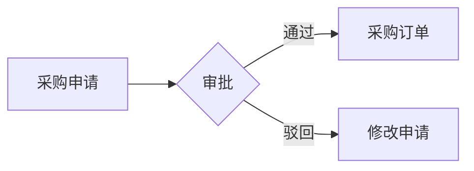

# 业务分析区 (Analysis)

本文件夹用于存放**业务分析、需求分析等相关内容**。这是产品经理的"思考工作区"。

---

## 📍 使用场景

### 什么时候用这个文件夹？

- ✅ 需求评审前，想推演业务流程是否闭环
- ✅ 要分析需求变更对现有系统的影响范围
- ✅ 需要对数据进行预估和推演（如：预计订单量、库存周转率）
- ✅ 业务调研后，整理原始材料和分析结论
- ✅ 复杂业务逻辑需要拆解和可视化

### 为什么独立于drafts/?

> [!NOTE]
> **analysis/** 是长期积累的业务知识库，不绑定特定需求。  
> **drafts/** 是针对具体需求的临时工作区。

**举例**：

- "采购流程分析"放在 **analysis/**（通用知识）
- "2026-02-01的采购订单需求"放在 **drafts/**（具体需求）

---

## 📁 文件夹说明

### data-analysis/

**数据分析与推演**

存放内容：

- 数据推演（成品或草稿）
- 数据统计分析
- 数据趋势分析
- 原始数据记录

**使用场景**：

- 预估系统上线后的数据量
- 分析历史数据趋势
- 评估存储和性能需求

---

### process-simulation/

**业务流程分析**

存放内容：

- 业务流程梳理（确认版或待确认版）
- 流程节点分析
- 流程优化方案
- 业务调研原始记录

**使用场景**：

- 梳理As-Is流程（现状）
- 设计To-Be流程（目标）
- 分析流程瓶颈和优化点

---

### scope-analysis/

**影响范围分析**

存放内容：

- 需求变更影响范围分析
- 系统模块影响分析
- 数据结构影响分析
- 变更评估原始材料

**使用场景**：

- 需求变更前，评估影响范围
- 技术选型决策的影响分析
- 系统重构的风险评估

---

## 📋 文件命名规范

格式：`YYYY-MM-DD-[主题].md`

**示例**：

- `2026-01-31-采购流程分析.md`
- `2026-01-31-库存数据推演.md`
- `2026-01-31-订单变更影响分析.md`

---

## 🎯 如何使用

### 方法1: 使用Workflow（推荐）

在Phase 2（方案架构）阶段，使用：

```
/2-design-solution
```

该workflow会：

1. 调用`data-modeler` Skill设计数据模型
2. 调用`edge-case-detector` Skill分析风险
3. 输出到`drafts/YYYY-MM-DD-方案设计/`

**如果分析内容具有通用性**，可从drafts复制到analysis:

```
drafts/2026-02-01-方案设计/RiskReport.md
→ analysis/scope-analysis/2026-02-01-库存变更风险分析.md
```

### 方法2: 直接创建

对于独立的业务分析（非绑定需求），直接在analysis中创建：

```
analysis/process-simulation/2026-02-01-采购全流程梳理.md
```

### 方法3: AI辅助分析

```
@context/04-business-logic.md
@templates/business-process-template.md

请帮我分析"采购申请-采购订单-收货"的完整流程，
输出到 analysis/process-simulation/
```

---

## 💡 最佳实践

### 1. 结论先行

分析文档开头就给出核心结论：

```markdown
## 核心结论

- 现有采购流程存在3个断点
- 预计影响5个下游模块
- 建议分2期实施，风险可控
```

### 2. 使用可视化

复杂逻辑用Mermaid流程图：



### 3. 引用模板

使用`templates/business-process-template.md`确保分析结构完整。

### 4. 保持更新

业务变化时，及时更新analysis中的分析文档，保持知识库的时效性。

---

## 🔄 与其他文件夹的关系

| 文件夹       | 关系                                                |
| :----------- | :-------------------------------------------------- |
| **context/** | context/定义业务规则，analysis/基于规则进行深度分析 |
| **drafts/**  | drafts/是特定需求的工作区，analysis/是通用知识库    |
| **prds/**    | PRD引用analysis/中的流程分析和数据推演作为依据      |

---

## 📊 分析文档结构建议

### 流程分析类

```markdown
# [流程名称]分析

## 1. 现状流程 (As-Is)

[Mermaid流程图]

## 2. 痛点识别

- 痛点1: ...
- 痛点2: ...

## 3. 优化方案 (To-Be)

[Mermaid流程图]

## 4. 影响分析

- 涉及模块: ...
- 数据变更: ...
- 风险评估: ...
```

### 数据推演类

```markdown
# [主题]数据推演

## 1. 推演目标

明确要推演什么数据

## 2. 基础假设

- 假设1: 每天新增100个订单
- 假设2: 平均每个订单5个SKU

## 3. 推演过程

[计算过程]

## 4. 结论与建议

- 预计数据量: ...
- 存储需求: ...
- 性能要求: ...
```

---

## ⚠️ 注意事项

- **不要混淆**：analysis/是通用知识，drafts/是具体需求
- **及时归档**：过时的分析文档移至`analysis/archive/`
- **版本管理**：重要分析文档记录修订历史

---

## 🎓 参考资源

- **模板**：`templates/business-process-template.md`
- **Workflow**：`/2-design-solution`（方案架构阶段）
- **Skills**：`edge-case-detector`（风险分析）、`data-modeler`（数据推演）
