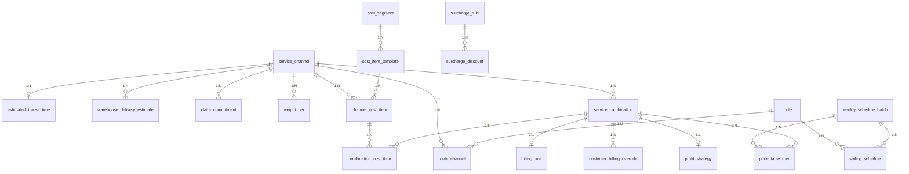
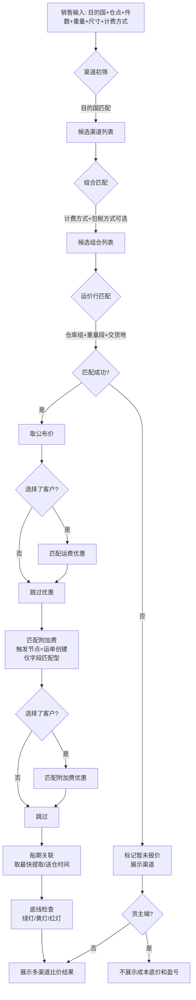
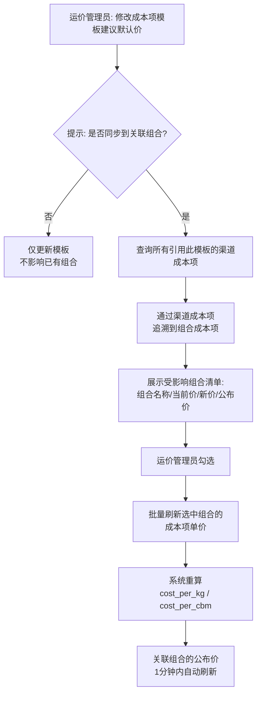
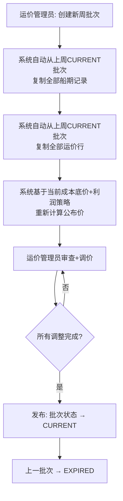
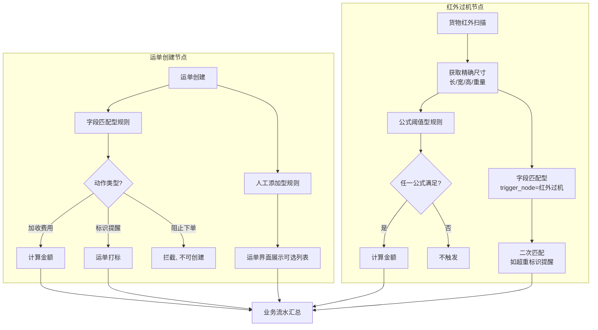

# 核心方案设计草稿 — 超级运价模块

> Phase 2：方案架构 | 基于 RDD v3.4 | 2026-05-27

---

## 1. 实体 × 表映射

| # | RDD 实体 | 表名 | 类型 | 说明 |
|---|---------|------|------|------|
| 1 | 服务渠道 | `service_channel` | 主表 | |
| 2 | 预估运输时效 | `estimated_transit_time` | 子表 | 1:1 挂 service_channel |
| 3 | 送仓预估时效 | `warehouse_delivery_estimate` | 子表 | 1:N 挂 service_channel |
| 4 | 理赔承诺时效 | `claim_commitment` | 子表 | 1:N 挂 service_channel |
| 5 | 港口 | — | 引用 | 基础数据模块，不在本模块建表 |
| 6 | 航线 | `route` | 主表 | |
| 7 | 航线-渠道关联 | `route_channel` | 关联表 | N:N |
| 8 | 周船期批次 | `weekly_schedule_batch` | 主表 | |
| 9 | 船期 | `sailing_schedule` | 子表 | 1:N 挂 weekly_schedule_batch |
| 10 | 重量段配置 | `weight_tier` | 子表 | 1:N 挂 service_channel |
| 11 | 运价行 | `price_table_row` | 子表 | 挂 weekly_schedule_batch + combination |
| 12 | 成本段 | `cost_segment` | 主表 | 全局目录 |
| 13 | 成本项模板 | `cost_item_template` | 子表 | 1:N 挂 cost_segment |
| 14 | 渠道成本项 | `channel_cost_item` | 子表 | 1:N 挂 service_channel |
| 15 | 服务组合 | `service_combination` | 主表 | 笛卡尔积生成 |
| 16 | 组合成本项 | `combination_cost_item` | 子表 | 1:N 挂 service_combination |
| 17 | 计费规则 | `billing_rule` | 子表 | 1:1 挂 service_combination |
| 17b | 客户计费规则覆盖 | `customer_billing_override` | 子表 | 1:N 挂 service_combination |
| 18 | 利润策略 | `profit_strategy` | 子表 | 1:1 挂 service_combination |
| 19 | 附加费规则 | `surcharge_rule` | 主表 | |
| 20 | 运费优惠规则 | `freight_discount` | 主表 | |
| 21 | 附加费优惠规则 | `surcharge_discount` | 主表 | |
| 22 | 操作审计日志 | `audit_log` | 主表 | |
| 23 | 询价日志 | `query_log` | 主表 | |

> Port（港口）由基础数据模块维护，超级运价通过 `port_code` 引用，不在本模块建表。

---

## 2. ER 图（核心）



---

## 3. 核心实体 Schema

> 以下 Schema 按 RDD Section 2 数据实体 + Epic 顺序列出。所有业务主表包含标准管理字段（id / tenant_id / created_at / created_by / updated_at / updated_by / is_deleted / version），下文仅标注业务字段。

### 3.1 服务渠道 `service_channel`

> 超级运价模块的聚合根。所有组合、成本、定价、优惠均挂在渠道之下。

| 字段名 | 中文名 | 类型 | 必填 | 约束/索引 | 备注 |
|--------|--------|------|------|----------|------|
| `name` | 渠道名称 | String(50) | ✅ | | 如"美森360" |
| `origin_country` | 起运国 | String(10) | ✅ | | 引用基础资料-国家 |
| `dest_countries` | 目的国 | JSON | ✅ | | 多选，存储国家代码数组 |
| `transport_mode` | 运输方式 | TinyInt | ✅ | Index | 10:海运 20:空运 30:洲际火车 40:洲际卡车 |
| `last_mile_methods` | 尾程派送方式 | JSON | ✅ | | 多选，如["卡派","快递派"] |
| `tax_methods` | 包税方式 | JSON | ✅ | | 多选，如["包税","不包税"] |
| `billing_units` | 计费方式 | JSON | ✅ | | 多选，如["KG","CBM"] |
| `service_types` | 服务类型 | JSON | ✅ | | 多选，如["散货","整柜"] |
| `need_claim` | 是否需要时效理赔 | Boolean | ✅ | | |
| `channel_type` | 渠道类型 | TinyInt | ✅ | | 10:全段服务（一期） 20:分段服务（三期预留） |
| `status` | 状态 | TinyInt | ✅ | Index | 10:正常 20:已冻结；冻结后关联组合不参与运价查询 |

**子表**：见下方 3.1a ~ 3.1c。

---

### 3.1a 预估运输时效 `estimated_transit_time`

> 1:1 挂在 service_channel 下。控制是否向亚马逊推送 FBA 运单 DW 及对应的服务等级和运输天数。

| 字段名 | 中文名 | 类型 | 必填 | 约束/索引 | 备注 |
|--------|--------|------|------|----------|------|
| `channel_id` | 服务渠道 | BigInt | ✅ | Unique, FK | 1:1 |
| `fba_sync` | FBA运单同步 | Boolean | ✅ | | 默认=false；控制是否向亚马逊推送 DW |
| `amazon_service_level` | 亚马逊服务等级 | TinyInt | 条件 | | FBA同步=是时必填；10:标准 20:加急 30:快速 |
| `transport_min_days` | 运输最小天数 | Int | 条件 | | FBA同步=是时必填 |
| `transport_max_days` | 运输最大天数 | Int | 条件 | | FBA同步=是时必填，须 ≥ 最小天数 |

**业务规则**：`fba_sync`=false 时，另三个字段不存储（非 disabled）。切换为 true 时必须重新填写，避免过期数据静默激活。

---

### 3.1b 送仓预估时效 `warehouse_delivery_estimate`

> 1:N 挂在 service_channel 下。分两阶段滚动更新 DW（运单创建→首次推送 / 提柜后→二次修正）。

| 字段名 | 中文名 | 类型 | 必填 | 约束/索引 | 备注 |
|--------|--------|------|------|----------|------|
| `channel_id` | 服务渠道 | BigInt | ✅ | Index, FK | |
| `fba_warehouse_code` | FBA仓库代码 | String(10) | ✅ | | 受目的国过滤，下拉仅展示 `仓库.country ∈ 渠道.目的国` |
| `sail_to_warehouse_days` | 开船至送仓（天） | Int | ✅ | | 第一阶段：DW = 开船日 + 此值 |
| `cabinet_to_warehouse_days` | 提柜至送仓（天） | Int | ✅ | | 第二阶段：DW = 提柜日 + 此值 |

**校验规则**：`cabinet_to_warehouse_days ≤ sail_to_warehouse_days`，否则阻止保存。
**FBA仓库过滤**：仓库下拉仅展示 `仓库.country ∈ 服务渠道.目的国` 的仓库。
**目的国修改校验**：减少目的国时，如已有该国 FBA 仓库的时效配置，阻止操作。

---

### 3.1c 理赔承诺时效 `claim_commitment`

> 1:N 挂在 service_channel 下。按派送方式 + FBA 仓库分组配置。运单模块根据实际送达天数 vs 理赔承诺时效自动判定是否需要理赔。

| 字段名 | 中文名 | 类型 | 必填 | 约束/索引 | 备注 |
|--------|--------|------|------|----------|------|
| `channel_id` | 服务渠道 | BigInt | ✅ | Index, FK | |
| `delivery_method` | 派送方式 | TinyInt | ✅ | | 10:快递派 20:卡派；从渠道的尾程派送方式中取值 |
| `fba_warehouse_codes` | FBA仓库代码 | JSON | 条件 | | 卡派必填（不同仓点可配不同理赔时效）；快递派非必填 |
| `claim_working_days` | 理赔时效（工作日） | Int | ✅ | | 实际送达天数 > 此值 → 触发理赔判定 |

**业务规则**：
- `service_channel.need_claim` = false → 理赔承诺时效配置不可编辑，已有数据清空
- 卡派未选仓库 → 阻止保存并提示"卡派必须指定 FBA 仓库"
- 同一仓点不可重复出现在多条理赔规则中

---

### 3.2 航线 `route`

| 字段名 | 中文名 | 类型 | 必填 | 约束/索引 | 备注 |
|--------|--------|------|------|----------|------|
| `route_code` | 航线代码 | String(20) | | | 如"AAC/AAC2"，默认可为空 |
| `origin_port_code` | 出发港代码 | String(10) | ✅ | Index | 引用港口主数据 |
| `origin_port_name` | 出发港名称 | String(50) | ✅ | | 冗余存储，展示用 |
| `dest_port_code` | 目的港代码 | String(10) | ✅ | Index | 引用港口主数据 |
| `dest_port_name` | 目的港名称 | String(50) | ✅ | | 冗余存储，展示用 |
| `supplier_id` | 船司 | String(20) | ✅ | | 引用 SRM 供应商 |
| `estimated_transit_days` | 预计运输天数 | Int | | | 航线级别，船期可覆盖 |

**关联表** `route_channel`：`route_id` + `channel_id`（N:N）

---

### 3.3 周船期批次 `weekly_schedule_batch`

| 字段名 | 中文名 | 类型 | 必填 | 约束/索引 | 备注 |
|--------|--------|------|------|----------|------|
| `batch_name` | 批次名称 | String(30) | ✅ | | 如"2026-W05（1/26-2/1）" |
| `week_code` | 周次标识 | String(10) | ✅ | **Unique** | ISO 周次，如"2026-W05" |
| `week_start` | 周起始日 | Date | ✅ | | |
| `week_end` | 周结束日 | Date | ✅ | | |
| `status` | 状态 | TinyInt | ✅ | Index | 10:预告 20:当前 30:已过期 |
| `remark` | 备注 | String(200) | | | |

> 状态流转：每周日 24:00，CURRENT→EXPIRED，PREVIEW→CURRENT。同时仅一条 CURRENT。

---

### 3.4 船期 `sailing_schedule`

| 字段名 | 中文名 | 类型 | 必填 | 约束/索引 | 备注 |
|--------|--------|------|------|----------|------|
| `batch_id` | 周批次 | BigInt | ✅ | Index, FK | |
| `route_id` | 航线 | BigInt | ✅ | Index, FK | |
| `cutoff_times` | 截单时间 | JSON | ✅ | | {"广州仓":"2026-02-01","汕头仓":"2026-02-01"} |
| `etd` | 预计开船时间 | Date | ✅ | | |
| `eta` | 预计到港时间 | Date | ✅ | | |
| `voyage_days` | 航程 | Int | ✅ | | ETD→ETA 自然日 |
| `fastest_pickup` | 最快提取/送仓时间 | Date | | | 开船后第 X 天 |

---

### 3.5 重量段 `weight_tier`

| 字段名 | 中文名 | 类型 | 必填 | 约束/索引 | 备注 |
|--------|--------|------|------|----------|------|
| `channel_id` | 服务渠道 | BigInt | ✅ | Index, FK | |
| `unit` | 计价单位 | TinyInt | ✅ | | 10:KG 20:CBM |
| `tier_name` | 段名称 | String(20) | ✅ | | 如"8KG+"、"2CBM+" |
| `start_value` | 起始值 | Decimal(10,2) | ✅ | | KG 或 m³ |
| `end_value` | 结束值 | Decimal(10,2) | | | null=以上 |

**设计说明**：`end_value` 为 null 表示"以上"（如 101KG+）。CBM 段同理（如 2CBM+）。段之间不应有间隙或重叠——由应用层校验保证。

---

### 3.6 运价行 `price_table_row`

| 字段名 | 中文名 | 类型 | 必填 | 约束/索引 | 备注 |
|--------|--------|------|------|----------|------|
| `batch_id` | 周批次 | BigInt | ✅ | Index, FK | |
| `combination_id` | 服务组合 | BigInt | ✅ | Index, FK | |
| `warehouse_group` | 仓库组 | String(200) | ✅ | | 逗号分隔，如"ONT8,LAX9,LGB8" |
| `weight_tier_id` | 重量段 | BigInt | ✅ | FK | |
| `pickup_region` | 交货地 | String(20) | ✅ | Index | 如"珠三角""汕头""义乌" |
| `price_per_kg` | 公布价-per-KG | Decimal(10,2) | 条件 | | 计费方式含 KG 时必填 |
| `price_per_cbm` | 公布价-per-CBM | Decimal(10,2) | 条件 | | 计费方式含 CBM 时必填 |

**设计说明**：仓库组用逗号存储（设计决策见 RDD）。参考签收时效和理赔时效不存储在运价行上——查询时从船期和理赔承诺时效实时计算。

---

### 3.7 成本段 `cost_segment`（全局目录）

| 字段名 | 中文名 | 类型 | 必填 | 约束/索引 | 备注 |
|--------|--------|------|------|----------|------|
| `name` | 段名称 | String(20) | ✅ | | 如"揽收段""干线运输段" |
| `is_enabled` | 是否启用 | Boolean | ✅ | | 禁用后不可在新渠道中选择 |

---

### 3.8 成本项模板 `cost_item_template`（全局目录）

| 字段名 | 中文名 | 类型 | 必填 | 约束/索引 | 备注 |
|--------|--------|------|------|----------|------|
| `segment_id` | 成本段 | BigInt | ✅ | Index, FK | |
| `name` | 项名称 | String(30) | ✅ | | 如"海运费""报关费" |
| `formula_type` | 公式类型 | TinyInt | ✅ | | 10:人民币直接计算 20:美元换汇计算 |
| `default_price` | 建议默认价 | Decimal(10,2) | ✅ | | 渠道关联时自动带出 |
| `currency` | 币种 | TinyInt | ✅ | | 10:RMB 20:USD |
| `sort_order` | 排序 | Int | ✅ | | |

---

### 3.9 渠道成本项 `channel_cost_item`（纯数据层）

| 字段名 | 中文名 | 类型 | 必填 | 约束/索引 | 备注 |
|--------|--------|------|------|----------|------|
| `channel_id` | 服务渠道 | BigInt | ✅ | Index, FK | |
| `segment_id` | 成本段 | BigInt | ✅ | FK | |
| `template_id` | 成本项模板 | BigInt | ✅ | FK | |
| `unit_price` | 原始单价 | Decimal(10,2) | ✅ | | 继承模板默认价，渠道可覆盖 |
| `currency` | 币种 | TinyInt | ✅ | | 继承模板币种 |
| `pickup_region` | 交货地 | String(20) | 条件 | | 成本段=揽收段时必填 |
| `delivery_quote_source` | 派送报价来源 | TinyInt | 条件 | | 10:拆送价 20:组合一口价 30:整柜直送价 |

> 无独立管理页面，在服务渠道编辑页中配置。修改此处不自动影响已有组合。

---

### 3.10 服务组合 `service_combination`

| 字段名 | 中文名 | 类型 | 必填 | 约束/索引 | 备注 |
|--------|--------|------|------|----------|------|
| `channel_id` | 服务渠道 | BigInt | ✅ | Index, FK | |
| `combination_code` | 组合编码 | String(50) | ✅ | **Unique** | 如"USMS360-SEA-TRUCK-KG-TAX-LCL" |
| `transport_mode` | 运输方式 | TinyInt | ✅ | | 继承自渠道 |
| `last_mile_method` | 尾程派送方式 | String(10) | ✅ | | 笛卡尔积展开后的单值 |
| `tax_method` | 包税方式 | String(10) | ✅ | | 笛卡尔积展开后的单值 |
| `billing_unit` | 计费方式 | String(5) | ✅ | | 笛卡尔积展开后的单值，KG/CBM |
| `service_type` | 服务类型 | String(10) | ✅ | | 散货/整柜 |
| `is_enabled` | 是否启用 | Boolean | ✅ | | 禁用后不在运价查询中出现 |

**设计说明**：服务组合由渠道属性笛卡尔积自动生成。`combination_code` 系统自动拼接。

---

### 3.11 组合成本项 `combination_cost_item`

| 字段名 | 中文名 | 类型 | 必填 | 约束/索引 | 备注 |
|--------|--------|------|------|----------|------|
| `combination_id` | 服务组合 | BigInt | ✅ | Index, FK | |
| `channel_cost_item_id` | 来源渠道成本项 | BigInt | | FK | 可追溯到渠道默认值 |
| `segment_id` | 成本段 | BigInt | ✅ | FK | |
| `item_name` | 项名称 | String(30) | ✅ | | 复制自模板 |
| `unit_price` | 原始单价 | Decimal(10,2) | ✅ | | 继承渠道默认值 |
| `currency` | 币种 | TinyInt | ✅ | | |
| `exchange_rate` | 汇率 | Decimal(10,4) | 条件 | | 币种=USD 时必填 |
| `cost_per_kg` | 每公斤成本 | Decimal(10,4) | | | 系统自动计算 |
| `cost_per_cbm` | 每方成本 | Decimal(10,4) | | | 系统自动计算 |
| `pickup_region` | 交货地 | String(20) | 条件 | | 揽收段必填 |
| `delivery_quote_source` | 派送报价来源 | TinyInt | 条件 | | 派送段必填 |
| `fba_warehouse_code` | FBA仓库代码 | String(10) | 条件 | | 派送段必填 |
| `is_enabled` | 是否启用 | Boolean | ✅ | Default:1 | 禁用后计算时跳过 |
| `effective_from` | 生效时间 | DateTime | | | 一期预留 |

---

### 3.12 计费规则 `billing_rule`

| 字段名 | 中文名 | 类型 | 必填 | 约束/索引 | 备注 |
|--------|--------|------|------|----------|------|
| `combination_id` | 服务组合 | BigInt | ✅ | FK(1:1) | |
| `volume_factor` | 计泡系数 | Int | ✅ | | 默认 6000 |
| `weight_method` | 计重方式 | TinyInt | ✅ | | 10:按实重 20:按材重 30:取大 |
| `weight_precision` | 计重精度 | Decimal(2,1) | ✅ | | 默认 0.1 |
| `round_method` | 进位规则 | TinyInt | ✅ | | 10:四舍五入 20:向上 30:向下 |
| `dimension_precision` | 尺寸精度 | Int | ✅ | | 默认 1cm |
| `min_box_weight` | 最低箱收费重 | Decimal(6,2) | ✅ | | |
| `min_shipment_weight` | 最低票收费重 | Decimal(6,2) | ✅ | | |
| `min_pieces` | 最小承运件数 | Int | | | |
| `max_pieces` | 最大承运件数 | Int | | | |

---

### 3.12b 客户计费规则覆盖 `customer_billing_override`

| 字段名 | 中文名 | 类型 | 必填 | 约束/索引 | 备注 |
|--------|--------|------|------|----------|------|
| `combination_id` | 服务组合 | BigInt | ✅ | Index, FK | |
| `customer_id` | 客户 | String(20) | ✅ | Index | 同一组合+客户唯一 |
| `volume_factor` | 计泡系数 | Int | | | NULL=继承默认 |
| `weight_method` | 计重方式 | TinyInt | | | NULL=继承默认 |
| `weight_precision` | 计重精度 | Decimal(2,1) | | | NULL=继承默认 |
| `dimension_precision` | 尺寸精度 | Int | | | NULL=继承默认 |
| `min_box_weight` | 最低箱收费重 | Decimal(6,2) | | | NULL=继承默认 |
| `min_shipment_weight` | 最低票收费重 | Decimal(6,2) | | | NULL=继承默认 |
| `min_pieces` | 最小承运件数 | Int | | | NULL=继承默认 |
| `max_pieces` | 最大承运件数 | Int | | | NULL=继承默认 |

> 唯一约束：`(combination_id, customer_id)`。查询时先取 billing_rule 默认值，再用此表非 NULL 字段覆盖。

---

### 3.13 利润策略 `profit_strategy`

| 字段名 | 中文名 | 类型 | 必填 | 约束/索引 | 备注 |
|--------|--------|------|------|----------|------|
| `combination_id` | 服务组合 | BigInt | ✅ | FK(1:1) | |
| `method` | 加成方式 | TinyInt | ✅ | | 10:固定金额 20:百分比 |
| `value` | 加成值 | Decimal(10,2) | ✅ | | 元 或 % |
| `currency` | 币种 | TinyInt | 条件 | | 固定金额时必填 |
| `scope_type` | 适用范围 | TinyInt | ✅ | | 10:组合级 20:段级(预留) 30:项级(预留) |

---

### 3.14 附加费规则 `surcharge_rule`

| 字段名 | 中文名 | 类型 | 必填 | 约束/索引 | 备注 |
|--------|--------|------|------|----------|------|
| `name` | 规则名称 | String(50) | ✅ | **Unique** | |
| `rule_type` | 规则类型 | TinyInt | ✅ | | 10:字段匹配 20:公式阈值 30:人工添加 |
| `action_type` | 动作类型 | TinyInt | ✅ | | 10:加收费用 20:标识提醒 30:阻止下单 |
| `trigger_node` | 触发节点 | TinyInt | ✅ | | 10:运单创建 20:红外过机 |
| `fee_label` | 费用类型标签 | String(20) | ✅ | | 如"出口费用" |
| `fee_direction` | 费用方向 | TinyInt | ✅ | | 10:应收(+) 20:客户优惠(-) |
| `discountable_level` | 可优惠级别 | TinyInt | 条件 | | 10:可全免 20:部分可优惠 30:不可优惠 |
| `scope_type` | 生效范围 | TinyInt | ✅ | | 10:全局 20:指定渠道 30:指定组合 |
| `scope_ids` | 生效范围ID列表 | JSON | 条件 | | |
| `pricing_unit` | 计价单位 | TinyInt | 条件 | | 10:按票 20:按箱 30:按KG 40:按CBM 50:按数量 60:按申报价值% |
| `unit_price` | 单价 | Decimal(10,2) | 条件 | | |
| `currency` | 币种 | TinyInt | 条件 | | |
| `status` | 状态 | TinyInt | ✅ | | 10:生效中 20:已禁用 |
| `match_conditions` | 字段匹配条件 | JSON | 条件 | | 规则类型=字段匹配时必填 |
| `formula_list` | 公式列表 | JSON | 条件 | | 规则类型=公式阈值时必填 |
| `manual_input_fields` | 人工输入字段 | JSON | 条件 | | 规则类型=人工添加时必填 |
| `supplier_cost_price` | 供应商成本单价 | Decimal(10,2) | | | 二期预留 |
| `supplier_id` | 关联供应商 | String(20) | | | 二期预留 |

**设计说明**：三种规则类型的专属配置分别存储在 JSON 字段中（`match_conditions` / `formula_list` / `manual_input_fields`），不拆分子表，因为每种类型配置结构固定且不需要独立查询。

---

### 3.15 运费优惠规则 `freight_discount`

| 字段名 | 中文名 | 类型 | 必填 | 约束/索引 | 备注 |
|--------|--------|------|------|----------|------|
| `name` | 规则名称 | String(50) | ✅ | | |
| `target_type` | 优惠对象类型 | TinyInt | ✅ | | 10:客户等级 20:客户特批 |
| `target_level` | 目标客户等级 | String(20) | 条件 | | |
| `target_customer_id` | 目标客户 | String(20) | 条件 | | |
| `discount_mode` | 优惠方式 | TinyInt | ✅ | | 10:折扣率 20:固定减免 |
| `discount_value` | 优惠值 | Decimal(6,4) | ✅ | | |
| `scope_channel` | 适用范围-渠道 | TinyInt | ✅ | | 10:全局 20:指定渠道 |
| `scope_channel_ids` | 渠道列表 | JSON | 条件 | | |
| `scope_warehouse` | 适用范围-仓点 | TinyInt | ✅ | | 10:全局 20:指定仓点 |
| `scope_warehouse_codes` | 仓点列表 | JSON | 条件 | | |
| `validity_type` | 有效期类型 | TinyInt | ✅ | | 10:永久有效 20:固定期限 30:单次有效 |
| `valid_from` | 有效期起 | Date | 条件 | | |
| `valid_to` | 有效期止 | Date | 条件 | | |
| `approval_no` | 飞书审批编号 | String(30) | 条件 | | 客户特批时必填 |
| `status` | 状态 | TinyInt | ✅ | | 10:生效中 20:已过期 |

---

### 3.16 附加费优惠规则 `surcharge_discount`

| 字段名 | 中文名 | 类型 | 必填 | 约束/索引 | 备注 |
|--------|--------|------|------|----------|------|
| `name` | 规则名称 | String(50) | ✅ | | |
| `target_type` | 优惠对象类型 | TinyInt | ✅ | | 10:客户等级 20:客户特批 |
| `target_level` | 目标客户等级 | String(20) | 条件 | | |
| `target_customer_id` | 目标客户 | String(20) | 条件 | | |
| `surcharge_rule_id` | 目标附加费规则 | BigInt | ✅ | FK | |
| `discount_mode` | 优惠方式 | TinyInt | ✅ | | 10:折扣率 20:固定减免 |
| `discount_value` | 优惠值 | Decimal(6,4) | ✅ | | |
| `validity_type` | 有效期类型 | TinyInt | ✅ | | 10:永久有效 20:固定期限 30:单次有效 |
| `valid_from` | 有效期起 | Date | 条件 | | |
| `valid_to` | 有效期止 | Date | 条件 | | |
| `status` | 状态 | TinyInt | ✅ | | 10:生效中 20:已过期 |

---

### 3.17 审计日志 `audit_log`

| 字段名 | 中文名 | 类型 | 必填 | 约束/索引 | 备注 |
|--------|--------|------|------|----------|------|
| `operator_id` | 操作人 | String(20) | ✅ | Index | |
| `operated_at` | 操作时间 | DateTime | ✅ | Index | |
| `entity_type` | 变更对象 | String(30) | ✅ | | 实体类型 |
| `entity_id` | 变更对象ID | String(20) | ✅ | Index | |
| `field_name` | 变更字段 | String(30) | ✅ | | |
| `old_value` | 旧值 | Text | | | |
| `new_value` | 新值 | Text | | | |

> 审计日志不可物理删除。不设软删除标识，保留 ≥ 2 年。

---

### 3.18 询价日志 `query_log`

| 字段名 | 中文名 | 类型 | 必填 | 约束/索引 | 备注 |
|--------|--------|------|------|----------|------|
| `operator_id` | 操作人 | String(20) | ✅ | Index | |
| `queried_at` | 查询时间 | DateTime | ✅ | Index | |
| `query_params` | 查询条件 | JSON | ✅ | | 目的国/仓点/件数/重量/尺寸/产品类型/交货地/客户 |
| `results` | 返回结果 | JSON | ✅ | | 命中渠道列表 + 各渠道报价 |

> 一期仅记录不做分析。软删除后可清理，保留 ≥ 1 年。

---

## 4. 外部接口依赖

超级运价模块依赖以下基础资料/外部模块的接口，本模块不维护这些数据，仅通过接口调用：

| 依赖模块 | 接口用途 | 调用场景 |
|---------|---------|---------|
| 基础资料-国家 | 获取国家列表 | 服务渠道.起运国/目的国下拉、港口.国家下拉 |
| 基础资料-邮编库 | 查询邮编是否偏远 | 附加费规则：邮编∈偏远地区列表 |
| 商业地址接口 | 传入地址 → 返回商业/私人/偏远 | 附加费规则：地址类型匹配 |
| SRM 供应商管理 | 获取干线运输供应商列表 | 航线.船司下拉 |
| 港口主数据 | 获取港口列表（名称+代码） | 航线.出发港/目的港下拉 |
| 仓库列表 | 获取本地仓库列表（代码+名称+邮编） | 船期.截单时间按仓库、附加费.本地仓、交货地下拉 |
| 商品管理 | 获取 SKU 属性标签 | 附加费规则：SKU属性匹配 |
| 客户管理 | 获取客户信息（编号+等级） | 运费优惠、附加费优惠、运价查询 |
| 等级管理 | 获取客户等级列表 | 运费优惠、附加费优惠 |

---

## 5. 关键设计决策

| 决策 | 方案 | 原因 |
|------|------|------|
| 仓库组存储 | 逗号分隔 String | 分组稳定，避免过度设计独立表 |
| 附加费三类型 | 单表 + JSON 子字段 | 共享字段多，子配置不需要独立查询 |
| 渠道成本项无管理页 | 纯数据层 | 避免额外页面，在渠道编辑页内嵌配置 |
| 运价行挂周批次 | batch_id 外键 | 与船期同生命周期，查询/复制/归档一致 |
| 港口/国家/船司 | 引用外部模块 | 不在超级运价内维护主数据 |

---

## 5. 核心业务流程

### 5.1 运价查询完整链路



### 5.2 成本批量更新流程



### 5.3 新建周批次（每周运维入口）



### 5.4 附加费规则匹配（分节点）



---

## 6. 风险探测报告

| 风险维度 | 场景描述 | 风险等级 | 建议解决方案 |
|---------|---------|---------|------------|
| **并发冲突** | 运价管理员 A 和 B 同时修改同一条运价行 | P1 | 乐观锁 version 字段，后提交者提示"数据已被他人修改" |
| **并发冲突** | 成本批量更新时，某组合正在被另一个管理员单独调价 | P1 | 更新前校验 version，冲突的组合跳过并在结果中标注 |
| **数据一致性** | 批量更新中途失败（部分组合更新成功、部分失败） | P0 | 放在事务中执行，任一失败则全部回滚；数量过多时分批提交 |
| **数据一致性** | 删除已被渠道引用的成本项模板 | P0 | 删除前校验引用计数，有关联渠道时禁止删除，提示"已被 X 个渠道引用" |
| **数据一致性** | 周批次从上周复制时，某个渠道已被删除 | P1 | 复制时校验渠道状态，已删除渠道的运价行不复制 |
| **逆向异常** | 运价已发布到 CURRENT 批次，发现错误需要撤回 | P2 | 一期不做版本回滚（Phase 3），运价管理员手动覆盖正确的价格 |
| **逆向异常** | 特批价生效后客户关系终止，优惠需要立即失效 | P1 | 提供"手动过期"按钮，运价管理员可提前终止优惠规则 |
| **权限安全** | 销售查看运价时通过接口参数猜出成本底价 | P0 | 货主端接口不返回 cost_per_kg/cost_per_cbm；运营端接口校验角色权限 |
| **权限安全** | 运价管理员 A 修改了运价管理员 B 配置的渠道 | P1 | 暂不做操作级权限隔离（一期 5-10 人团队），依赖审计日志追溯 |
| **时间边界** | 周批次自动流转时（周日 24:00），有人正在编辑本周运价 | P2 | 流转前检查是否有未保存的编辑，弹窗提示"系统即将切换批次" |
| **时间边界** | `effective_from` 到期自动切换时，存在未完成的运单 | P2 | 一期手动切换，运价管理员确认当前无在途业务后操作 |

---

## 7. 信息架构（IA 设计）

### 7.1 菜单结构

```
├── 🏠 首页（运价更新工作台）
│   ├── 本周船期主列表
│   └── 本周运价行一览
│
├── 🔍 查价订舱
│   ├── 运营端运价查询
│   └── 货主端在线询价
│
├── 📋 基础配置
│   ├── 服务渠道
│   │   ├── 渠道列表
│   │   ├── 运输时效配置（预估/送仓/理赔）
│   │   └── 重量段配置
│   ├── 航线 & 船期
│   │   ├── 航线管理
│   │   ├── 周船期批次
│   │   └── 船期维护
│   ├── 成本管理
│   │   ├── 成本段（全局目录）
│   │   ├── 成本项模板（全局目录）
│   │   └── 渠道成本项（渠道编辑页内嵌）
│   └── 计费规则 & 利润策略（组合编辑页内嵌）
│
├── 🔄 运价运维
│   ├── 服务组合管理
│   ├── 运价表维护
│   └── 批量更新
│
├── ⚙️ 规则引擎
│   ├── 附加费规则
│   ├── 运费优惠规则
│   └── 附加费优惠规则
│
├── 📊 审计与日志
│   ├── 操作审计日志
│   └── 询价日志
│
└── ⚙️ 企业设置（基础资料模块）
    ├── 港口管理
    ├── 仓库列表
    ├── 客户管理
    ├── 等级管理
    └── 商品管理
```

### 7.2 页面清单

| 页面名称 | 所属菜单 | 对应实体/功能 | 类型 |
|---------|---------|-------------|------|
| 运价更新工作台-首页 | 首页 | 周船期批次 + 运价行 | 工作台 |
| 运营端运价查询 | 查价订舱 | Epic 7 匹配引擎 | 查询页 |
| 货主端在线询价 | 查价订舱 | Epic 7（隐藏成本底价） | 查询页 |
| 服务渠道列表 | 基础配置 | ServiceChannel | 列表页 |
| 服务渠道详情/编辑 | 基础配置 | ServiceChannel + 时效配置 + 重量段 + 渠道成本项 | 编辑页 |
| 航线列表 | 基础配置 | Route | 列表页 |
| 周船期批次列表 | 基础配置 | WeeklyScheduleBatch | 列表页 |
| 船期维护（周批次内） | 基础配置 | SailingSchedule | 编辑页 |
| 成本段管理 | 基础配置 | CostSegment | 列表页 |
| 成本项模板管理 | 基础配置 | CostItemTemplate | 列表页 |
| 服务组合列表 | 运价运维 | ServiceCombination | 列表页 |
| 服务组合详情/成本项 | 运价运维 | CombinationCostItem + 计费规则 + 利润策略 + 客户计费规则覆盖 | 编辑页 |
| 运价表维护 | 运价运维 | PriceTableRow（按周批次） | 编辑页 |
| 附加费规则列表 | 规则引擎 | SurchargeRule | 列表页 |
| 附加费规则新增/编辑 | 规则引擎 | SurchargeRule（三类型表单） | 编辑页 |
| 运费优惠规则列表 | 规则引擎 | FreightDiscount | 列表页 |
| 附加费优惠规则列表 | 规则引擎 | SurchargeDiscount | 列表页 |
| 操作审计日志 | 审计与日志 | AuditLog | 列表页 |
| 询价日志 | 审计与日志 | QueryLog | 列表页 |