# 亚马逊平台对接及 Delivery Window 管理产品方案

版本：v2.25　日期：2026-10-08　状态：评审稿
适用系统：新跨境物流系统、老物流系统、亚马逊 FIST / ShipTrack / Smart Reroute

## 本次统一版本与阅读顺序（v2.25）

本次按2026-10-08最新确认统一全文：第10章负责目标初始化、形成、覆盖及停止；第11章负责四类执行事项、五种执行状态、失败/编号/历史及13列导出；第21章是九项定时任务、实际读取、过滤、全部时刻及人工计划补漏的唯一后台规则表；第25章保留已确认UI交互，第16及26章按同规则验收。旧的修改后即时回查、额外人工计划补漏时刻、综合等待资料状态及设置异常停止Track123规则不再适用。接口资料语义与我方成功判定分开，不新增正式接口契约或声称后台已经实现。

| 本次确认 | 统一结果 |
| --- | --- |
| 时间排列 | DW对账每日09:00/18:00；周六延期10:00/17:00/21:00；人工BLOCK每日11:00/19:00；其他时刻及频率不变 |
| 人工计划防遗漏 | 并入每日07:00/15:00资格任务的本地检查；无执行记录补首试，已有事项不重复，资格失败只在真实恢复时新编号 |
| 运输补同步 | 明确缺运输允许补相同完整报文；来源DW修改失败补同步，关联运输编号，原DW编号继续 |
| 接口成功口径 | 按现有程序对业务响应判断，不即时回查，平台窗口及成功查询时间仅真实查询更新 |

## 交付范围与原型展示边界（2026-10-06整理）

完整产品原型保留全部规划功能，包括智能转仓、客户跟进和九项自动任务；一期暂缓开发不等于删除原型。本节仅定义实际开发交付范围，优先于下文完整规划中的页面及通知能力描述。第10章DW生命周期、第21章后台调度继续执行。客户跟进、Smart Reroute和自动任务人工整批补跑仍按既有分期列为二期；本轮确认了完整原型的展示及交互，不自动变更实际开发范围。

| 能力 | 一期范围 | 二期规划 |
| --- | --- | --- |
| DW货件列表 | 查询、批量DW、有效失败重试；业务阶段/资格/设置异常/目标/实际/来源 | 更完整运营管理 |
| DW提单列表 | 已出发提单+最新仓点+尾程派送方式；批量DW及简单仓点登记 | 复杂转仓流程 |
| 货件详情 | 当前信息、DW更新及预估记录、错误及关联执行记录追溯 | 独立资格历史、业务变更和客户跟进页签 |
| 任务中心 | 执行记录、逐次历史及其中的接口请求响应、明细人工重试、统一失败及异常原因导出；登记批次归集 | 客户跟进、九项自动任务管理/人工整批补跑 |
| 业务主链路 | Publish/Batch、Void、Upsert、两次预估、人工DW、对账、周六延期 | 延续完善 |
| 后台可靠性 | 时区、MQ、增量补偿、目标版本、停止控制、去重限流、受控重试全部保留 | 管理操作可视化 |
| 仓点变更 | 简单登记新FC及来源并Upsert；已有外部智能转仓结果可登记 | S3主动申请、Offer选择、确认及回写 |
| ShipTrack | 优先复用现有统一接口，增加新系统轨迹适配与归属路由 | 按需要完善迁移治理 |
| 客户通知 | 不生成系统通知待办；保留异常展示和导出，运营线下通知 | 通知case、发送、反馈、核实、机器人 |
| 备案物流仓 | 不建设 | 智能转仓上线时建设 |

实际一期交付仅三个Amazon菜单：DW货件列表、DW提单列表、Amazon任务中心；完整演示原型保留所有菜单和页签。服务渠道配置沿用业务基础菜单。完整规划保留用于二期，开发按本节判断交付范围。

一期人工新目标和整票完整快递查询形成的新目标，目标有效且未触发完成/Amazon窗口过期停止条件时，执行一次实际DW修改尝试；最近资格不允许或已知设置异常不能直接跳过首次尝试。设置异常不解除、不恢复常规自动DW管理；同目标设置异常失败不重试。具体首次尝试、资格恢复和数据缺失处理见10.5.2及11.1。客户通知保持现有分期，不产生新增通知字段或流程。

一期不提供自动任务人工整批补跑页面；后台仍按第21章调度。人工仅在执行明细重试有效执行事项，货件设置异常与Amazon窗口过期均不可恢复，不提供解除申请或恢复入口，不绕过停止控制。重试沿用原执行编号，逐次历史及人工重试入口在执行明细查看。

一期生产交付验收：三个主要菜单可用；逐票登记及排除结果可查；人工与自动BLOCK区别正确；同目标首次尝试去重，资格恢复按新编号保留旧失败，接口修改成功与后续平台窗口查询分开。完整评审原型保留Smart Reroute（二期）、客户跟进及九项自动任务。

## 1. 文档目的

本方案用于指导新跨境物流系统建设亚马逊平台对接能力，覆盖：

- 运单进入“收货中”后的 FBA 货件与承运商追踪号映射；
- 货件运输信息、尾程方式和计划送仓仓点的维护；
- Delivery Window（下文简称 DW）的计算、修改、核对、自动延期和人工处理；
- 亚马逊通过 ShipTrack 查询我方物流轨迹时，新老系统的统一接入；
- Smart Reroute 通过 S3 CSV 文件完成智能转仓；
- 每个接口任务的执行记录、自动重试、人工重试和异常闭环。

`PutComplianceData` 不在本期范围内，我司当前不开展法国线路合规数据对接。

## 2. 核心方案结论

| 议题 | 方案结论 |
| --- | --- |
| Publish 与 Upsert 的顺序 | 运单变为“收货中”后，先完成 `PublishTrackingId/Batch`；映射全部成功后检查运输信息完整性，齐全再异步执行 `UpsertTransportationInfo`。二者属于同一个业务流程，但不能并发，也不放在同一个数据库事务中。 |
| Upsert 与 DW 的顺序 | 首次Upsert成功后GetChoice初始化；后续提交沿用最近资格，本地条件满足后GetOptions → Confirm，按业务返回判断，不即时回查、不额外提交前查询。实际DW明确报运输缺失时补Upsert，成功后原DW编号接续。 |
| Upsert 是否重复调用 | 服务组合、尾程方式、干线信息、亚马逊仓点、预约信息等导致有效请求内容发生变化时重新调用。使用“成功报文摘要 hash”判断，内容未变化通常不重复推送；实际DW明确返回运输信息缺失时，允许同完整报文补同步。 |
| Void 是否受已开船限制 | 现有官方资料没有给出按物流节点限制取消的规则，也没有说明已开船后一定不能取消。已开船不能被产品写成硬性禁止条件。最终是否能取消由亚马逊接口响应和货件状态决定。 |
| Void 的业务边界 | 仅支持整票货件取消，不支持取消部分箱；需承运商与卖家达成一致；只能取消本承运商的订单。当前接口仅取消亚马逊后台数据，不会取消卖家后台的映射，取消后需要运营核查卖家侧。 |
| DW 日期提交方式 | DW 接口不接受我方任意填写的日期作为确认参数。我方先计算目标日期区间，再从最新一次 `GetDeliveryWindowOptions` 返回结果中匹配该区间，使用其 UUID 格式 `deliveryWindowOptionId` 和 `referenceId` 确认。 |
| DW 数据权威 | 我方数据库保存“期望 DW”，Amazon 返回“实际 DW/最近一次承运商提交 DW”。日常对账以我方期望 DW 为业务基准，并按运行模式选择正确的 Amazon 字段比较。 |
| 新老系统共用 ShipTrack | 建设一个统一 ShipTrack 网关和“追踪号归属索引”。正常情况按索引路由到新系统或老系统；迁移期索引未命中时双查，唯一命中后回填索引，双命中则进入冲突处理。 |
| Smart Reroute | 单独建设 S3 文件适配器和转仓任务台账，自动完成 Step1 至 Step4。转仓成功后回写新 FC/新预约，再以 `SMART_REROUTE` 来源调用 Upsert，已有人工DW不重新预估，等待运营再次登记；无人工目标的处理按第10、21章已确认事件规则。 |

## 3. 官方资料能够确认的边界

### 3.1 VoidTrackingId

官方资料明确说明：

1. 取消表示卖家在承运商处取消了承运订单；承运商和卖家达成一致后应调用接口保持数据一致。
2. 只能取消本承运商的订单。
3. 只能取消整个 FBA 货件，不能取消其中部分箱子。
4. 当前接口仅取消后台数据，不取消卖家后台映射。
5. 通用错误 `INVALID_FBA_SHIPMENT_STATUS` 表示货件当前状态不能再更新，文档举例为“已取消、已到达”。

官方资料没有列出“接货、报关、开船、到港、入海外仓”等节点的 Void 可取消矩阵。因此：

- **无法根据现有文档断言已开船后不能取消。**
- “追踪号在货件进入 `IN_TRANSIT` 后不能被新的追踪号覆盖”是 Publish 更新限制，不能推导为 Void 的限制。
- 初期产品采用可配置规则：开船前正常申请；出现 `VD/NS` 后要求主管确认、取消原因和卖家同意记录，但仍可发起接口调用；亚马逊接口返回货件状态不可更新时，转人工处理。
- 已完成投递或亚马逊明确返回终态不可更新时，不自动反复调用。

### 3.2 Delivery Window

官方资料明确说明：

- 仅支持美国线 FBA；AWD 不使用 DW。
- 前置条件为 `PublishTrackingId/Batch` 和 `UpsertTransportationInfo` 已成功。
- Upsert 至少要提供产品时效 3 个字段和干线运输 5 个字段，共 8 个 DW 必需字段。
- 我方当前按 `ENABLED` 正式启用模式设计，不建设影子模式页面和影子模式专用任务。
- 官方资格依据为 `carrierShouldProvideDW`；本系统常规后台提交沿用该控制，新人工/完整快递目标实际首试并保留返回的业务取舍见10.5.2，不声称平台已允许该操作。
- 原资料中的 `ConfirmDeliveryWindowOption.success=true` 不能单独证明卖家侧窗口已实际生效；如需核实平台窗口需通过查询获取。**本系统采用的执行成功口径**为现有程序对修改接口业务响应的判定，本期不做每次修改后的即时回查，平台当前DW由正常查询/每日对账更新；不能把该产品取舍写成官方保证窗口一致。
- `deliveryWindowOptionId` 必须来自最近一次 GetOptions 返回，不能根据 FBA 号和日期自行拼接，也不能长期缓存。

## 4. 系统范围与总体架构

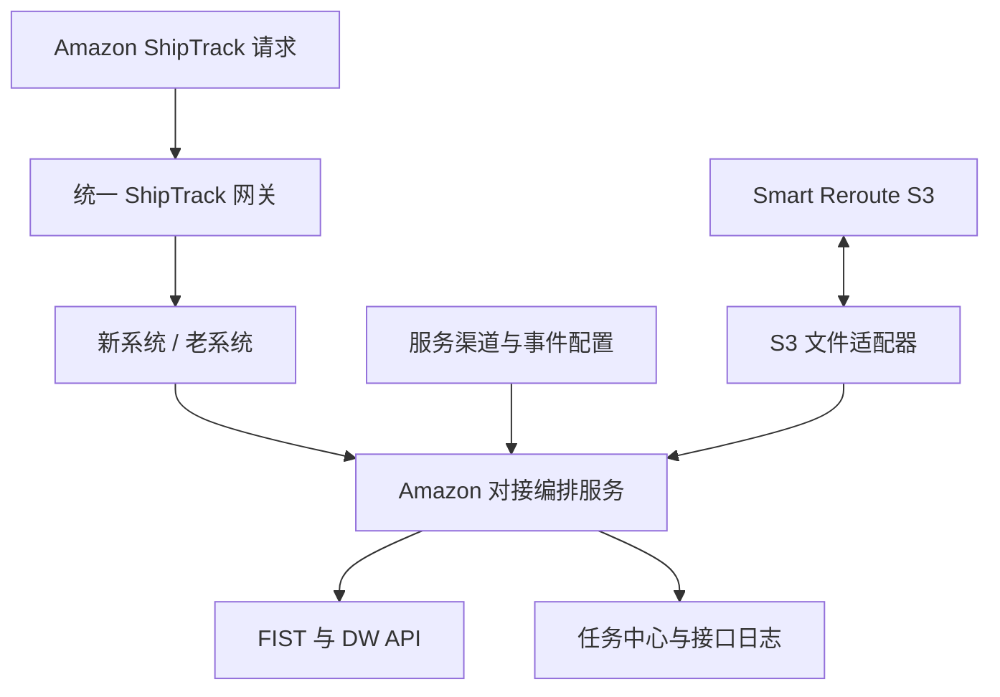

建议拆分为五个可独立部署或逻辑隔离的能力：

1. **Amazon 对接编排服务**：按货件串行组织 Publish、Upsert 和 DW 调用，消费业务事件，生成任务。
2. **DW 规则引擎**：计算期望时间窗、匹配 Amazon option、按事件发生时间及目标版本判断替换，处理自动延期。
3. **统一 ShipTrack 网关**：接收 Amazon 查询，路由新老系统，转换成统一轨迹模型并输出 XML。
4. **Smart Reroute S3 适配器**：上传、轮询、下载、解析和归档四步 CSV 文件。
5. **Amazon 任务中心**：承载任务、调用尝试、错误分类、重试、告警和人工操作。

## 5. 业务对象与数据源

### 5.1 业务对象关系

一张我方运单可关联一个或多个 FBA 货件；一个 FBA 货件包含多个 FBA 箱；每个箱可共享同一个追踪号，也可拥有独立追踪号。DW 的管理粒度是 **FBA 货件**，Publish 和部分 Upsert 数据的粒度可到 **FBA 箱**，ShipTrack 的查询主键是 **此前映射给 Amazon 的 trackingId**。

### 5.2 从业务系统哪里取数

| 业务数据 | 取数位置 | 关键关联路径 | 使用场景 |
| --- | --- | --- | --- |
| 运单号、状态、服务组合、目的国、仓库代码、提单号 | 新系统“头程管理 → 运单管理” | 运单号 | 触发已收货、展示 DW、人工检索 |
| FBA 货件号、FBA 箱号、箱数 | 订单/装箱明细/面单采集 | 运单 → FBA 货件 → 箱 | Publish / Batch、ShipTrack 归属 |
| 自有追踪号、箱号与追踪号关系 | 运单制单或箱级标签数据 | FBA 箱 → trackingId | Publish、ShipTrack 查询 |
| 服务组合 | “服务管理 → 服务组合” | 运单.service_combination_id | 确定服务渠道、主运输方式和尾程派送方式 |
| Amazon 服务等级、运输最小/最大天数 | “服务管理 → 服务渠道 → 预估运输时效” | 服务组合 → 服务渠道 | Upsert 的 `middleLegServiceLevel`、`minTransitDays`、`maxTransitDays` |
| VD/X4 后送仓预计天数 | “服务管理 → 服务渠道 → 送仓预估时效” | 服务渠道 + 尾程方式 + Amazon 仓库代码/邮编前缀 | VD/NS、X4/FN 两次 DW 预估 |
| `transportMode`、ETD、ETA、起运港、目的港 | 路由、订舱、船期/航班、提单数据 | 运单 → 提单号 → 路由/班次 | Upsert 干线信息 |
| 尾程派送方式、尾程 SCAC、子单号 | 服务组合、尾程派送/标签数据 | 运单箱 → 尾程方案 | Upsert 尾程信息 |
| ISA、Amazon Freight Order ID | 预约管理、运营登记、Smart Reroute 结果 | FBA 货件/箱 → 预约 | Upsert 预约信息、Smart Reroute |
| 初始和当前 Amazon FC | 订单原始资料、面单扫描、运营变更、Smart Reroute | FBA 货件 → FC 变更历史 | Upsert `carrierIntendedFc`、DW 配置查找 |
| 内部物流事件及时间地点 | “事件管理 → 物流事件”及各事件源系统 | 运单/箱 → 事件 | ShipTrack 输出、VD/X4 DW 触发 |
| Amazon 事件码映射 | “事件管理 → 亚马逊物流事件”及绑定配置 | 内部事件 → Amazon status/reason | ShipTrack 标准化、DW 事件触发 |
| 老系统/新系统归属 | 追踪号归属索引 | trackingId → source_system + source_key | ShipTrack 请求路由 |

### 5.3 对现有原型和产品文档的调整

1. 当前“预估运输时效”在服务渠道下是 1:1 配置，没有仓库维度。因此 Upsert 的产品 SLA 默认从“服务组合 → 服务渠道 → 预估运输时效”取得；仓库代码用于校验和查找“送仓预估时效”。如果产品 SLA 确实因 FC 不同而变化，需要新增“仓库级 SLA 覆盖配置”，不能直接按现有表实现“服务组合 + 仓库”查询。
2. 当前“送仓预估时效”的字段名称是“开船至送仓天数、提柜至送仓天数”，与本次确定的 `VD/NS`、`X4/FN` 触发不完全一致。建议改为：
   - `vd_to_delivery_days`：VD/NS 事件发生日至预计送仓日天数；
   - `x4_to_delivery_days`：X4/FN 事件发生日至预计送仓日天数。
   原“提柜至送仓”数据不能未经业务复核直接迁移为 X4 配置。
3. 一个“FBA 运单同步”开关不足以覆盖 FIST 与 DW。建议拆分：
   - `fist_enabled`：开启 Publish、Upsert、ShipTrack 数据准备；
   - `dw_enabled`：开启 DW，且必须依赖 `fist_enabled=true`。
   这样可兼容只做 FIST 但不做 DW 的场景。
4. 现有 Amazon 物流事件配置应按官方事件清单重新初始化，至少正确配置 `AF/NS`、`K2/O1`、`VD/NS`、`VA/NS` 或 `K1/AJ`、`K2/RD`、`X4/FN`、`AG/AG`、`D1/NS`。禁止仅凭页面中文名称手工猜代码。
5. Amazon执行记录仅展示待执行、处理中、成功、失败、已终止。终止依据属于系统说明，不冒充原始平台返回；已成功记录保持成功。目标失效或业务停止时，尚未成功的旧事项可终止，但历史失败及原始返回仍可按历史时间导出。缺条件的后台过程不创建占位执行，人工及完整快递新目标首次尝试见10.5.2。

## 6. 核心数据模型

### 6.1 FBA 映射台账 `amazon_shipment_binding`

| 字段 | 说明 |
| --- | --- |
| `fba_shipment_id` | FBA 货件号 |
| `waybill_id` | 我方运单 ID |
| `box_id`、`tracking_id` | 箱号和映射追踪号 |
| `source_system` | `NEW` / `LEGACY` |
| `mapping_status` | 待推送、推送中、成功、取消中、已取消、失败 |
| `publish_version`、`last_success_at` | 映射版本和最近成功时间 |
| `amazon_region`、`scac`、`transport_mode` | 接口路由参数 |

### 6.2 运输信息快照 `amazon_transportation_snapshot`

保存每次 Upsert 的业务来源版本、完整标准化报文、报文 hash、成功时间和 Amazon 返回。相同 `fbaShipmentId + payload_hash` 已成功时通常不重复调用；实际DW明确返回运输信息缺失时按恢复需求允许补同步同完整报文，记录原DW关联并防重复在途。

### 6.3 DW 主记录 `amazon_dw_record`

| 字段 | 说明 |
| --- | --- |
| `fba_shipment_id` | DW 管理主键 |
| `desired_start_date`、`desired_end_date` | 我方当前期望 DW |
| `desired_source` | 来源语义为Amazon初始DW、人工登记、VD预估、X4预估、快递预计送达、收货安全调整、周六延期；生产枚举按实际设计映射，不漏初始/快递来源 |
| `desired_source_ref` | 事件 ID、人工登记单 ID 或延期任务 ID |
| `desired_version` | 当前目标版本，失效任务终止 |
| `manual_saved_at` | 人工登记时间，周六当天登记排除自动延期 |
| `automation_control` | 管理中、已结束；设置异常/Amazon过期/业务完成写入独立结束原因 |
| `amazon_actual_start/end` | Amazon 当前实际 DW |
| `carrier_last_start/end` | 最近一次承运商确认的 DW |
| `enrollment_at_publish/latest` | 运行模式状态 |
| `seller_allow`、`carrier_should_provide` | Amazon 控制字段 |
| 目标关联执行及停止事实 | 关联执行记录的五种状态，目标/资格/BLOCK/停止事实分别保存，不建立重复的综合同步状态或运营等待资料状态 |
| `next_retry_at`、`consecutive_drift_count` | 重试和连续不一致次数 |

### 6.4 DW变更与预估历史

DW登记历史按一次目标登记或调整保留一行，保存原新目标、目标来源、登记人/时间、原因及说明、登记批次及精确执行关联。监控、提交与重试不新增DW更新行；资格恢复新建执行后，原登记行关联最新恢复编号，仍可追溯旧失败编号。没有修改执行时编号、状态和修改返回为“—”；资格查询返回不能冒充修改返回。页面字段见25.2，执行及导出规则见11.2、11.3。

VD/X4预估历史独立保存节点输入快照、事件时间、实际计算时间、配置、首次补偿基准日、原目标及BLOCK调整结果；VD、X4分别保存后台计算事实，不作为执行主表独立事项。人工修改或新预估不能覆盖既有历史，空状态及页面字段见25.2。快递查询保存后台逐单号结果和整票完整性，查询失败或缺EDD在自动任务运行明细可查并纳入异常导出；人工目标存在、整票不完整或DW周不变时不生成DW修改，未改变DW不生成更新行。

### 6.5 执行事项、逐次历史与真实调用

一个执行编号对应一个FBA的一次明确事项，种类见11.2。首次、自动重试、人工重试沿用同一编号，逐次历史分别留存；新DW目标、新运输内容、下一次正常定时查询是新的事项。批次号用于集中操作或运行归集，不建立运营可见的父任务、子任务或事项编号。

一次真实接口调用只保存一份请求与响应，通过关联明细指向各FBA及执行历史；一票事项可经历多次调用，一次批量映射也可涉及多票。箱号/追踪号结果、接口步骤是执行明细，不另设运营编号。预估成功表示形成目标；符合条件后创建独立DW修改执行，与来源预估或快递查询关联，必要关联在对应历史行查看，不建立父子层级或独立前后过程区域。

以上为产品建设要求和本地演示结构，生产表、错误识别、接口及调度实施均待实际依据，不声明现有系统已建成。

### 6.6 追踪号归属索引 `amazon_tracking_owner`

| 字段 | 说明 |
| --- | --- |
| `tracking_id_normalized` | 精确查询索引；保留原值用于响应 |
| `source_system` | `NEW` / `LEGACY` |
| `source_business_key` | 对应系统的运单/箱 ID |
| `active` | 当前是否有效 |
| `ownership_source` | Publish 注册、历史回填、查询修复 |
| `conflict_status` | 无冲突、双系统重复、待人工 |

### 6.7 业务对象关联图

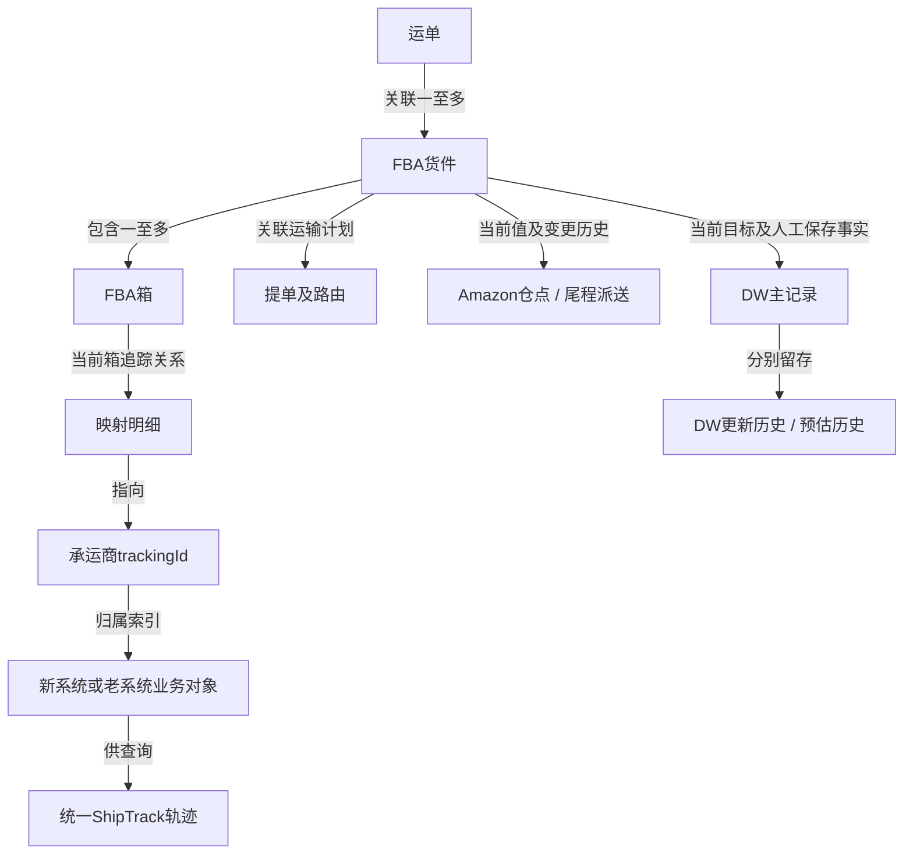

提单号不是DW管理主键；同号多箱通过当前有效箱追踪关系管理。提单+最新仓点+尾程派送方式是汇总键，不另建覆盖逐FBA目标的DW记录。

### 6.8 扫描、业务、接口与预估记录关联图

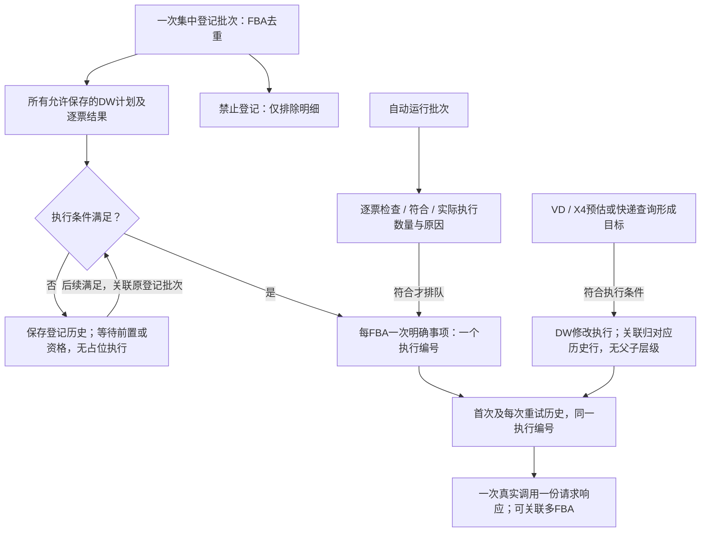

登记100票、或选同一提单两个仓点卡派共300票，均为一个登记批次；重复FBA先去重。所有允许保存票有DW登记历史及原批次，仅符合条件的票创建相应事项执行；待条件恢复接续原批次。扫描货件数量不等于执行数量，扫描完成不等于接口成功。

## 7. PublishTrackingId / Batch 功能设计

### 7.1 触发条件

运单状态首次变为 **收货中** 时触发。若运单已在“收货中”之后的状态补录进入系统，也要通过补偿扫描创建任务。

### 7.2 接口选择

- 同一 FBA 货件所有箱共用同一 trackingId，可调用 `PublishTrackingId`。
- 箱级 trackingId 不同，调用 `PublishTrackingIdBatch`。
- Batch 每次最多 500 个箱映射；超过 500 箱按稳定排序拆批，同一 FBA 货件的批次串行执行。
- 同一 trackingId 关联多个 FBA 货件时，按 FBA 货件分别调用。

### 7.3 前置校验

必须校验 FBA 货件号、箱号、trackingId、SCAC、运输方式、发货国和 UTC 时间戳。箱号缺失、箱与货件不匹配或追踪号不满足已登记正则时，任务进入“数据待修正”，不生成伪数据。

### 7.4 成功后的动作

1. 更新映射台账；
2. 在追踪号归属索引中登记新系统归属；
3. 当该 FBA 货件所有预期映射均成功后，发布 `AMAZON_MAPPING_COMPLETED`；
4. 编排服务收到事件后立即创建 Upsert 初始任务。

## 8. VoidTrackingId 功能设计

### 8.1 业务入口

在 FBA 货件详情提供“取消 Amazon 映射”。操作人必须填写取消原因，并确认已与卖家达成一致。若业务运单本身取消，可由运单取消事件自动生成待确认任务，不直接静默调用。

### 8.2 初始控制策略

| 我方进度 | 页面处理 | 接口处理 |
| --- | --- | --- |
| 尚未 Publish 成功 | 不显示 Void；仅取消本地待推送任务 | 不调用 |
| Publish 成功，尚无 VD/NS | 普通权限可申请 | 调用 Void |
| 已有 VD/NS，尚未完整投递 | 主管权限、卖家同意记录、二次确认 | 仍允许调用；以 Amazon 响应为准 |
| 已完整投递、已关闭，或 Amazon 返回终态不可更新 | 默认禁止自动取消，开放异常申请 | 不自动重试，人工联系 Amazon/卖家 |

以上是我方风险控制，不代表 Amazon 官方节点限制。后续如 Amazon 给出正式取消矩阵，应转为配置，不修改核心流程。

### 8.3 结果处理

- 成功：标记 Amazon 后台映射已取消，停止新的 DW 自动任务，ShipTrack 索引保留审计但标记 inactive；页面提示运营核查卖家后台映射。
- `INVALID_FBA_SHIPMENT_STATUS`：标记“Amazon 状态不可取消”，不自动重试。
- 超时：先查询本地最近调用和后续状态，延迟重试；不得立即连续重复取消。
- 不支持部分箱取消。部分箱退出运输需走业务异常流程，由运营与卖家决定是否整票取消及重新建货件。

## 9. UpsertTransportationInfo 功能设计

### 9.1 正确编排顺序

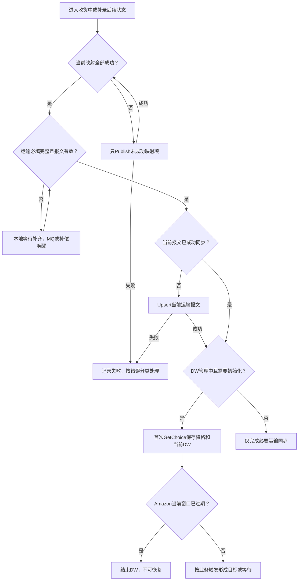

- Upsert 在映射成功且运输信息完整时自动执行；缺项本地等待增量批次补偿（见第21章），不依赖是否关联提单。
- 不与 Publish 并发，因为官方错误 `MISSING_INIT_CALL` 明确要求先完成映射。
- 不把两次外部调用包在同一事务内。每一步独立落任务和状态，可恢复、可重放。
- DW 返回 `MISSING_TRANSPORTATION_INFO` 时，允许执行一次“强制 Upsert → 重新发起 DW”的自愈流程，但该流程只作为异常兜底。

### 9.2 初次调用取数

| Amazon 数据 | 我方来源 |
| --- | --- |
| `middleLegServiceLevel`、`minTransitDays`、`maxTransitDays` | 运单服务组合 → 服务渠道 → 预估运输时效 |
| `transportMode` | 服务组合主运输方式/运单路由 |
| ETD、ETA、起运港、目的港 | 提单与路由计划；缺失时任务等待数据补齐 |
| `lastLegDeliveryMode` | 服务组合内的尾程派送方式 |
| 尾程 SCAC/子单号、ISA、Amazon Freight Order ID | 尾程派送和预约数据 |
| `carrierIntendedFc` | 运单当前 Amazon 仓库代码 |
| FC 来源 | 初始 `SELLER`，面单核实 `LABEL_SCAN`，转仓使用相应 reroute 枚举 |

产品 SLA 需要满足：`minTransitDays > 0`、`maxTransitDays <= 75`、最大值大于最小值、差值不超过 20 天。

### 9.3 重新调用触发矩阵

| 变化 | 是否重调 | 规则 |
| --- | --- | --- |
| 服务组合变化 | 是 | 重新解析产品 SLA、运输方式和尾程方式；新报文 hash 与最近成功 hash 不同才调用 |
| 我方尾程分类或派送信息变化 | 按报文判断 | 仅实际接口字段变化才同步；我方卡派/快递派分类变化本身不构成调用条件，不把内部lastMile作为正式接口字段 |
| Amazon 仓库代码变化 | 是 | 更新 `carrierIntendedFc` 及来源；已有人工DW不重估，等待运营再登记。后续有效新节点使用最新仓点；快递EDD按最新仓点归日并保存历史，已有人工DW时不覆盖目标，不因换仓重新处理旧节点 |
| 运营登记智能转仓 | 是 | 来源传 `SMART_REROUTE` |
| 运营登记“亚马逊自提” | 是 | 官方资料对应枚举写作 `AF_REROUTE`，其含义是 Amazon Freight 转仓决定；上线前需与业务确认“亚马逊自提”是否确实等同于该枚举 |
| 面单仓点与卖家资料不一致并核实采用面单 | 是 | 来源传 `LABEL_SCAN` |
| ETD/ETA、起运港、目的港实质变化 | 是 | 初版与最终版不同才调用；开船/起飞/陆运出发后 24 小时内提供最终版 |
| 新增/取消 ISA、尾程子单号产生 | 是 | 按官方 ADD/REMOVE 和箱级信息调用 |
| 仅修改备注、页面显示名 | 否 | 不影响标准化请求报文 |

### 9.4 运输缺数据及DW失败衔接

调用前检查关联提单及运输必填字段：缺项显示在货件概览，不调用运输接口，不生成占位执行记录，定时补偿跳过未补齐的内容。已调用并返回明确缺数据错误，保留运输同步失败与原始返回，停止旧失败内容自动重试，不套用5分钟、30分钟、2小时临时错误退避。数据补齐后按最新完整内容产生新的同步事项，旧失败记录与历史保留；这不等于永久停止该货件同步。

正常DW修改前检查当前完整运输信息及同步事实。只有明确发现运输信息缺失或未同步的DW失败，才进入补齐业务数据→运输同步成功→原有效DW编号继续修改。数据仍缺则等待，不盲调Upsert；其他DW失败不一律补调运输。保留原目标、原DW修改编号及失败历史，不新增人工登记行；运输同步另为一个事项，在DW明细可点击关联编号，接续时追加原DW执行历史。恢复前再次检查最新目标、资格、前置、目的仓当地日期及停止条件，旧目标失效不得继续。

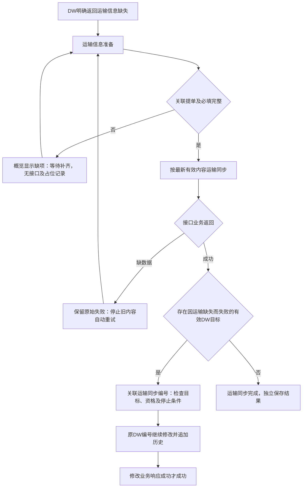

## 10. DW生命周期与任务筛选规则（2026-10-05确认）

本章为我方业务规则。DW归周、临期、过期、周六及当天人工登记按目的Amazon仓点当地日期判断，自动处理夏令时；页面默认显示北京时间。DW为周日至周六。接口配额按官方契约联调，不猜测频率。

### 10.1 业务阶段与运行控制

| 业务阶段 | 原始状态 |
| --- | --- |
| 收货中 | 收货中、已收货 |
| 转运中 | 转运中、已到港、一清关、已到仓 |
| 已完成 | 已签收、退件、取消 |

已签收表示整票全部签收，一期没有部分签收。阶段与执行状态分开；目标截止仅结束旧目标，不永久结束货件。Amazon当前窗口过期和业务完成停止DW；设置异常停止常规自动DW但不停止Track123查询，允许新人工或完整快递目标首试一次，不清除异常。同目标资格不允许失败等待既有查询发现恢复变化，不反复提交。缺运输报文时按运输同步流程补齐、同步，再继续原有效DW目标，不增设DW等待资料状态或监控。

### 10.2 节点处理矩阵

| 触发 | 动作 | 边界 |
| --- | --- | --- |
| 首次收货中 | Publish成功→本地检查→Upsert→查询资格及当前DW | 缺信息等待，不硬性要求关联提单 |
| 数据补齐/有效变化MQ | 读最新业务快照，hash变化才Upsert | 早、下午、晚增量补偿漏事件，已排队/执行不重复 |
| 已收货 | 前置完成后首次安全检查 | 已有人工/有效VD/X4/快递预计送达等目标不覆盖；Amazon过期结束自动处理 |
| VD/NS | 第一次预估 | 新真实节点可覆盖更早人工计划 |
| X4/FN | 第二次预估 | 以发生时间判断，旧事件迟到不能覆盖后登记计划 |
| 人工登记 | 保存目标版本及人/时/原因，终止旧未成功事项 | 按新目标首试规则；设置异常不解除，通知沿二期范围 |
| 人工登记后仓点/派送方式变化 | 同步必要运输信息；换仓点不重新预估，等待运营登记；卡派改快递派等待Track123定时查询；已有人工目标仅保存历史 | MQ必须传快递单号；DW仍受停止控制 |
| 资格恢复 | 正常成功查询由不允许变为允许，检查原目标及前置有效性 | 资格失败创建新恢复编号并关联旧失败，不重新登记，不额外查询窗口 |
| 已签收/退件/取消 | 结束DW任务与旧重试 | 不生成通知，关闭未完成跟进，保留历史 |

### 10.3 运输信息补偿

8个DW必需字段为Amazon服务等级、运输最小/最大天数、运输方式、ETD、ETA、起运港、目的港。分别从服务渠道、路由/订舱/提单计划取数。未关联提单不等于必然缺字段，有完整路由计划可正常Upsert。

映射成功后校验缺项和格式，未完整则等待运输信息，列出具体缺项。每日三个批次仅本地检查，未补齐不调用Upsert或DW，不重复生成同类失败日志。MQ补齐立即唤醒，早、下午、晚增量补偿兜底。有效报文hash不变通常不重复Upsert；实际DW明确返回缺运输信息时允许补同步同完整报文并去重。

参数错误等业务修正；429、超时、临时故障进统一退避队列，已有任务不重建。DW返回MISSING_TRANSPORTATION_INFO先检查8字段、补Upsert，成功再恢复。它不是货件设置异常。迟至已收货之后才补齐时，安全检查以执行日为准，不追溯提交过期窗口。

### 10.4 已收货首次安全检查

首次初始化沿用单号映射成功→当前完整运输信息同步成功→既有GetChoice取得修改资格及Amazon当前DW→保存查询结果→确定我方初始目标及安全处理结果的顺序。后台须保存首次成功取得的完整Amazon窗口、取得时间、初始化处理结果及关联查询/运行记录；这是建设要求，不假定现有生产字段或调度已经存在。查询失败、缺开始/结束日期或未取得完整窗口不编造DW、不标记初始化完成，保留原始返回，通过既有资格查询及补偿继续，不新增自动任务或提交前查询。

没有有效我方目标且Amazon窗口未过期：不需要安全调整时，沿用首次取得的窗口形成我方初始期望DW，目标来源Amazon初始DW，追加一条目标形成记录，取得时间为更新时间，原/新目标如实保存；不调用DW修改、不创建修改执行记录，执行编号、任务状态和修改返回为“—”。来源名不使用客户维护，当前窗口返回不能证明最后维护人身份。

安全调整沿用既有日期规则：已收货、映射及Upsert完成且未暂停/结束时，未来临期（开始日距目的仓当地今天≤7天）取后一周，当周但未过期取下一完整周，不临期不调整。没有有效我方目标且需要调整时，来源收货安全调整；资格不允许仍保留安全目标，满足既有条件后修改。未收货沿用既有前置；后续处理不重复接纳初始窗口。Amazon窗口已过期按停止规则结束DW，不通过初始化恢复。修改业务响应成功后不即时回查，Amazon当前DW仅来自后续成功查询。

已有人工登记、有效VD/X4、快递预计送达等有效我方目标时，首次查询只更新Amazon当前窗口和资格，保存“已有有效目标，保留”的初始化事实，不覆盖目标、登记人、时间或原因；现有有效目标继续按原流程处理。初始化查询与人工登记、节点处理串行衔接，保存目标前基于最新有效目标及版本判断，查询期间形成的新目标不能被旧查询覆盖。后续正常查询只更新Amazon当前DW与资格，不重复接纳初始窗口，不新增初始DW更新行，不每天以Amazon窗口覆盖我方目标。首次运输同步后的查询归该次同步历史，其他查询归既有运行/查询明细，原始查询返回不冒充DW修改返回。

安全调整实际执行沿用DW修改及受控重试；资格恢复时使用已保存安全目标，不重复形成目标历史。Amazon初始DW只是目标来源，不新增执行事项或触发来源。

### 10.5 两次预估与覆盖规则

事件发生日+服务组合关联渠道、尾程方式、最新FC的送仓预估天数，归入完整周。当周或过去至少选下一完整周。缺配置VD从第4周、X4从第2周开始（当前周不计，下一完整周为第1周，基准为首次补偿计算日的目的仓当地日期）；BLOCK只选择晚于原目标的最近可选一周，不进入人工BLOCK每日监控。

快递派默认通过Track123获取预计送达时间；预估延迟或误差时可人工登记DW纠正。人工登记后以人工目标为准，后续Track123结果仍查询并保存历史，但不覆盖人工DW，跨周变化也不重新提交或替换人工DW。本限制仅针对Track123覆盖人工目标，不扩大至VD/X4或其他任务，不增加“恢复自动预估”入口。快递派当地08:00/16:00刷新Track123，完整整票取最晚日期（未妥投EDD、已妥投实际日期），部分缺失保留原目标；保存查询时间及预测依据。新VD/X4可覆盖此前人工目标并结束旧重试；事件ID及发生时间去重，早于人工登记的迟到旧事件不能覆盖。相同结果不重复提交。

### 10.5.1 目标形成与覆盖流程

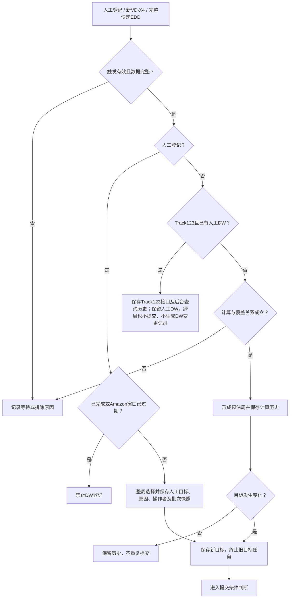

VD/X4按实际发生时间判断，迟到旧事件不覆盖后人工计划；EDD须关联当前单号；快递派人工登记DW后，后续Track123结果仅保存后台查询及运行历史，不覆盖人工目标，即使预计送达日期跨周也不重新提交或替换人工DW。人工登记后换仓点不进入重新预估分支；卡派改快递派等待Track123批次。配置零命中排除当前周，VD从第4周、X4从第2周起取可选完整周；重试沿用首次基准。

### 10.5.2 DW首次尝试、修改响应与后续查询

人工新目标、当前快递单号整票完整结果形成的新周目标，在目标有效、映射等必要业务前置满足、未完成且Amazon当前窗口未过期时，必须实际尝试一次；不因最近资格不允许或已知设置异常直接跳过。不扩大到VD/X4、安全调整、周六延期及对账等后台来源。同一目标、重复消息、同结果扫描或重复保存不重复创建首次尝试。人工纠正后Track123不得覆盖；不完整或同周结果不创建修改。

DW修改仅根据实际接口业务响应判断成功，HTTP成功不足以证明业务成功。成功表示修改接口返回成功，不宣称已核实Seller Central窗口；修改响应之后不追加GetDeliveryWindowChoice，也不修改Amazon当前DW或其成功查询时间。Confirm前检查目标有效性、并发及重复确认控制，超时按受控重试处理，不新增即时查询。首次初始化、既有资格/当前DW查询及每日对账继续运行。

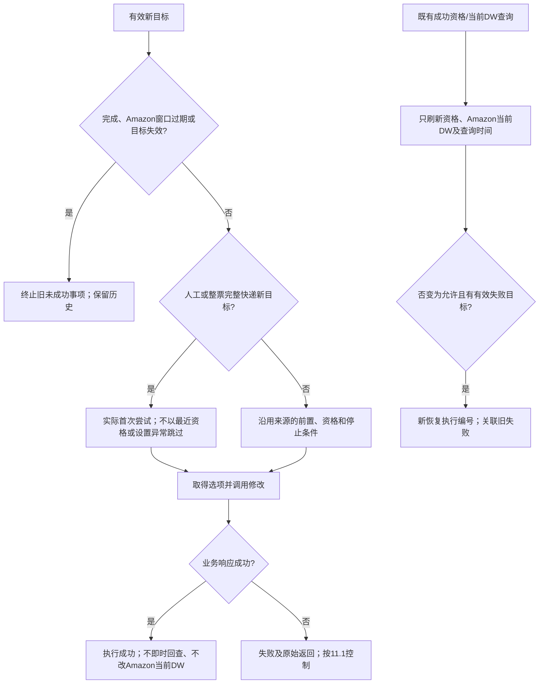

### 10.6 人工登记及BLOCK

货件列表勾选FBA；提单列表多选“提单号+最新仓点+尾程派送方式”，最终均逐FBA处理。统一使用单个“DW周窗口”选择器，默认仅展示目的仓当地当周及未来7周，共8个快捷窗口；货件单票、批量弹窗与提单行内选择复用周窗口规则，不一次列几十周。选项为完整周日到周六，显示严格采用 `2026-10-11～2026-10-17`，不附加星期文字；选中后自动保存对应开始与结束日期，不能任意组合。按目的仓当地日期，允许当周尚未过期的完整周，禁止已过去的周；多仓批量登记逐票校验，不满足既有登记资格的货件不执行。“选择更远周”打开日历，支持切换月份和选择日期；日期自动归入所在周日～周六的完整窗口，按整周高亮，面板展示完整窗口，明确选中后自动保存，无额外保存按钮。打开日历、切换月份、填写原因不触发保存；更远周无新增业务期限限制，仍按既有登记条件逐票判断。选择的是我方计划周，Amazon是否允许提交仍由窗口匹配及人工BLOCK监控决定。

两个列表使用相同的非必填“变更原因”下拉：海外仓调整送仓安排、预约调整、Track123预估延迟或误差、客户要求、其他。选择其他显示非必填说明；清空原因同步清空其他说明，非其他原因不保存说明。批量登记将同一原因及说明应用到本次选中的货件。每次保存分别追加DW更新记录，并保存到业务批次及逐票快照，明细可查，不覆盖历史。记录应包含本次目标、登记时间、操作者、原因和其他说明，为后续按原因统计送仓时间调整预留依据；本次不新增统计报表。DW时间变更原因与实际仓点变更记录分别保存、分别统计，不混用口径。不提供锁定或恢复自动预估入口。

保存人工目标、登记人、时间、原因及批次。有效新目标按10.5.2实际首试；重新登记不同目标使用新编号，旧未成功事项终止，已成功记录保持成功。同目标重复事件不重复登记；原因及说明仅在选择DW时随登记保存，保存后不可补填或修改。Amazon当前DW过期或已完成禁止登记；目标本身过期只结束该目标，允许按规则登记新有效目标。

人工BLOCK每天两个批次重取Options，资格沿用最近结果，原目标监控至结束日（含）。成功、新人工目标、新VD/X4替换、目标过期、Amazon当前DW过期、设置异常、业务完成均终止旧监控，不自动换周。

### 10.6.1 人工BLOCK监控流程

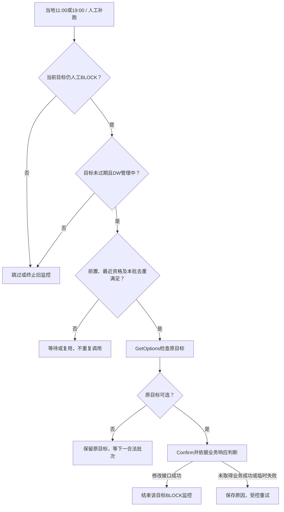

截止目标当地结束日，含当日两批；新人工目标或有效新VD/X4替换即终止旧监控。人工BLOCK允许人工更新，但不参与周六延期，不自动换周。

### 10.7 周六延期条件（全部满足）

1. 业务阶段转运中，映射及必需Upsert成功；
2. 允许修改且carrierShouldProvideDW=true，无设置异常结束/自动结束；
3. Amazon当前DW未过期；
4. 我方目标开始日大于今天且距今天≤7天；
5. 当天无人工登记（不论提交成功与否）；
6. 无人工BLOCK监控、无相同FBA同业务周延期任务。

我方目标当周或过期不延期。符合条件后一周，BLOCK选择晚于原目标的可选一周。执行重查版本和当日人工登记标记，避免先排队后人工改期仍执行旧任务。

### 10.7.1 周六延期流程

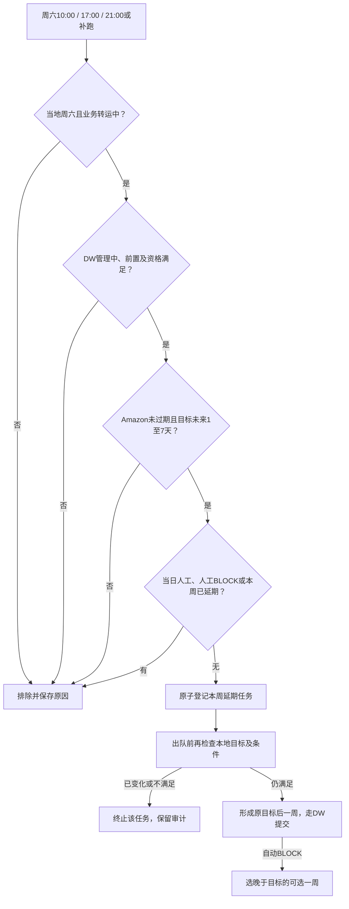

业务周按仓点当地周日日期；本任务自身预留的去重记录不能误判为别人重复任务。三个时段同票同周最多形成一次延期意图，失败重试不再延后一周。历史人工来源本身不排除。

### 10.8 每日两批DW对账

本地先排除暂停、结束、完成、无未来有效目标。目标当周不自动修复，目标过期不再对账旧计划；新有效计划可以重新参与管理。Amazon当前DW过期则结束全部DW自动处理。

09:00/18:00筛选后GetChoice读取当前窗口及返回资格，过期结束、资格不允许不提交；Amazon不一致按我方目标改回，包含比我方早或当周未过期；一致不Confirm。只称“检测到DW不一致/提前”，不证明是客户所改。对账保留原目标来源。已有BLOCK/执行/重试任务复用，不每日重复建队列。失败按11.1分类。授权恢复先重评有效性，不重放旧目标。

### 10.9 全局停止与不可恢复条件

| 条件 | 停止范围 | 恢复 |
| --- | --- | --- |
| 已确认货件设置异常 | 停止常规资格、对账、延期、自动预估提交、BLOCK及同目标重试；Track123继续，新人工/完整快递新目标按首试规则 | 异常不可解除，不恢复常规管理；必要运输同步独立继续 |
| Amazon当前DW结束日早于今天 | 同上，结束自动处理、旧队列 | 不可恢复。考核货物是否按原DW窗口按时送达；结束全部DW自动处理，不提供恢复入口，不每日探测 |
| 已签收/退件/取消 | 全部DW及未完成通知跟进 | 保留终态历史 |

不停止ShipTrack和必须更新的运输信息。事件及计算可留存但不绕过控制提交。我方目标过期不属于全局终止，也不单独通知客户。

### 10.9.1 结束控制与运输独立处理

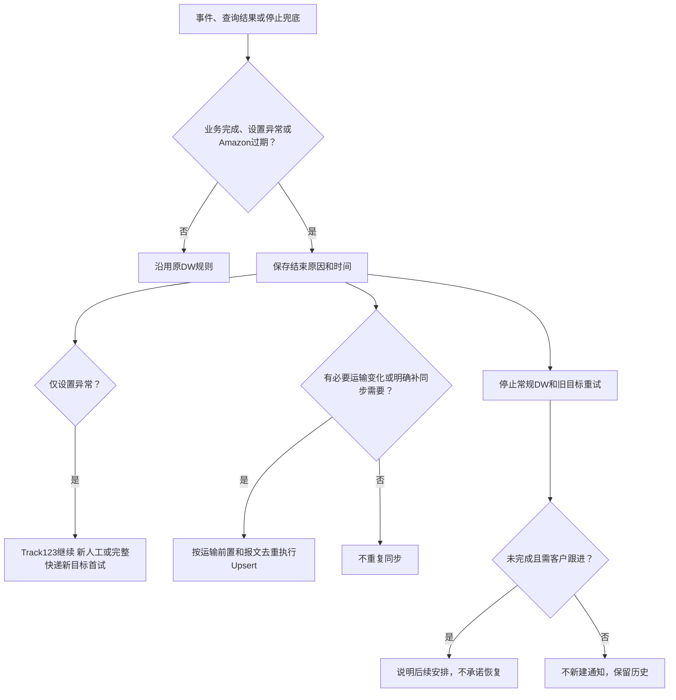

设置异常可存新人工DW并按首试规则尝试，Track123查询继续；Amazon过期/业务完成不可登记DW。结束跟进、运输同步成功及客户反馈不恢复DW。我方旧目标过期只停止该目标，不等于货件全局结束。

### 10.10 调用去重与限流

初始化：Publish→运输报文完整性校验→Upsert→既有GetChoice→保存资格、Amazon当前DW及初始化处理事实。正常首次窗口接纳规则保持；已有有效目标不覆盖。后续修改：有效性控制→GetOptions→Confirm业务响应，不即时GetChoice；后续正常成功查询才刷新Amazon当前DW。

人工提交沿用最近保存的资格结果，不再新增GetChoice资格校验任务；只做本地业务状态、停止标记、前置和目标版本检查。FBA串行，MQ合并最新快照，执行前校验版本；失效版本终止。hash未变通常不Upsert，明确缺运输的补同步例外见21章；窗口一致的对账不Confirm；资格监控与对账各自按已确认批次GetChoice，对账读取实时窗口；其他提交不额外查资格。统一按接口/区域/承运商配额排队退避，限流值按官方联调确认。

## 11. 异常、重试、任务中心与客户跟进

### 11.1 后台受控处理与重试规则

后台依据网络异常、HTTP状态、结构化错误码、资格及可选窗口结果识别临时故障、限流、资格、运输缺失、设置异常等控制事实，保存可重试性、累计次数、下次时间及有效性关联；不新增运营错误分类或翻译映射。未知错误保留原始返回，不自动反复重试。示例错误字段为本地模拟，不视为平台正式契约；生产识别、字段及调度仍是建设要求。

| 识别结果 | 处理 |
| --- | --- |
| 网络超时、连接失败、平台临时服务错误 | 首次失败后最多自动重试3次，分别在上一轮失败结束后5分钟、30分钟、2小时执行；沿用原执行编号 |
| 平台限流 | 遵守平台等待要求及统一配额，不立即重试 |
| 参数错误、必填缺失、状态不允许 | 不自动重试；未修正不得人工重试 |
| 无法识别的错误 | 保存原始返回，暂不自动重试；需先明确和修正原因 |
| DW实际业务响应资格不允许 | 原DW编号失败，保留原始返回，不反复修改；正常成功资格查询由不允许变为允许且目标/前置有效时新建恢复编号，关联旧失败，原登记不变。恢复执行再次不允许后等待下一次真实恢复变化，不因重复允许查询重复创建 |
| 成功取得人工窗口BLOCK | 窗口检查成功，保留人工目标交给BLOCK监控，不消耗临时失败重试次数，不自动换周 |
| 设置异常 / Amazon窗口过期 / 完成 | 完成及Amazon窗口过期停止DW；设置异常停止常规自动DW及同目标重试，但新人工/完整快递新目标允许实际首试，Track123查询继续，不清除异常或恢复常规管理；必要运输同步独立判断 |
| 新目标替换、目标过期、追踪号或运输内容有效变化 | 原内容失效，旧事项不再确认或重放；新事项使用新执行编号 |

次数耗尽保持失败，次日扫描不得清零或重新赠送次数。人工BLOCK监控至目的仓当地目标截止日，包含当天；新目标替换或停止DW处理时结束旧监控。停止重试由后台规则执行，不设置人工终止按钮。

人工重试仅对有效、前置满足、无在途、具备重试资格的事项开放，每次一次、原编号追加历史，不重置自动次数，重复点击拦截且遵守配额。临时错误首次失败后最多自动3次，间隔从上轮结束后5分钟、30分钟、2小时；限流优先遵守平台等待。超时不增加即时窗口查询，依既有并发、去重与重复Confirm保护控制重放。

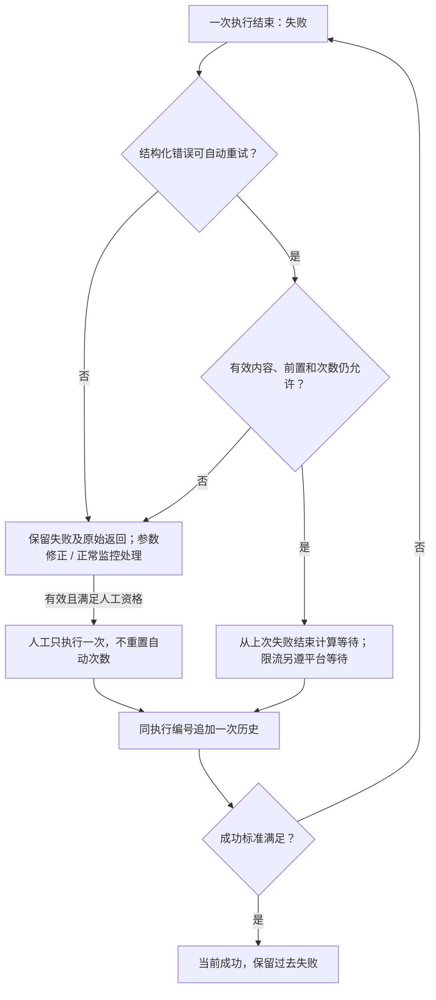

限流通过HTTP状态及平台错误码识别，不靠文字猜测。首次限流失败保留失败与原始返回，在历史明细展示已安排下次重试及累计自动重试次数；没有安排不显示待重试。遵守平台等待要求和统一配额，未明确要求时沿用5分钟、30分钟、2小时退避，从上次失败结束算，最多自动3次，次日不清零。到期入队才为待执行，开始为处理中；同编号追加历史。人工重试一次不重置自动次数。BLOCK业务监控不消耗临时失败次数；参数缺失、状态不允许、未知错误不自动反复重试。无效目标、停止DW或过期目标不继续处理。原型的到期入队与执行均为明确模拟，不代表真实调度。

### 11.2 三个任务中心页签与展示范围

顺序固定为执行记录、客户跟进、自动任务。执行记录合并事项与接口展示；预估、接口和重试历史保留在同一执行明细及后台记录，不设独立预估计算、接口或重试队列页签。

| 页签 | 范围与交互 |
| --- | --- |
| 执行记录 | 所有已形成的逐票事项及逐次历史，不限当天；号码多值查询、紧凑折叠，查询后自动收起；点击执行编号查看明细，人工重试只在明细 |
| 客户跟进 | 沿用既有待办/历史与二期开发范围；设置异常和窗口过期只能登记后续安排或结束，不提供恢复 |
| 自动任务 | 独立九项及既有当地启动时刻，无顶部时区或筛选；执行一次检查全范围，不输入货件号或仓点；运行明细可看逐票原因及对应执行结果 |

执行主表只展示单号映射、取消映射、运输信息同步、DW修改四类。VD/X4计算、快递预计送达查询、修改资格及当前DW查询、人工BLOCK监控不单独铺入主表；后台过程、原始返回、运行与异常事实继续保存；运行明细查看后台过程，不把后台内部记录号当作运营执行编号。DW目标来源、执行触发来源、执行方式分别保存。期望DW/目标来源及DW更新变更来源统一为Amazon初始DW、人工登记、VD预估、X4预估、快递预计送达、收货安全调整、周六延期。次数、缺配置补偿和BLOCK调整仅写预估依据，不拼接到来源。人工BLOCK监控、MQ消息、定时补偿及DW对账属于执行触发或渠道，不作为目标来源；人工BLOCK后目标来源仍人工登记，对账修复同一目标保留原目标来源。名称统一不新增DW变化、执行或接口调用，不改变历史目标日期。

| 执行事项 | 触发来源 |
| --- | --- |
| 单号映射 | MQ消息、定时补偿 |
| 取消映射 | MQ消息 |
| 运输信息同步 | 首次映射完成、MQ消息、定时补偿、DW修改失败补同步 |
| DW修改 | 人工登记、VD预估、X4预估、快递预计送达、收货安全调整、DW对账、周六延期、人工BLOCK监控 |

运输同步首次/有效报文变化时调用，另有实际DW明确缺运输的补同步例外；具体仓点、派送信息、提单更新或补齐原因放明细；报文未变不重复同步。内部lastMile分类不是已确认接口字段。首次映射后先检查运输完整性，取消映射仅业务取消MQ，不设定时取消补偿。VD/X4在我方本地计算，ShipTrack不执行预估；条件满足后才显示DW修改及对应来源，计算依据留货件预估记录。快递整票不完整、周未变、人工纠正目标存在时不创建DW修改。

人工BLOCK归入原DW修改编号：首次来源人工登记，后续监控及原周可选后的修改来源人工BLOCK监控，目标来源保持人工登记。每次查询保存原始返回；不可选不反复提交，可选后修改业务响应成功才标DW成功。监控至当地目标截止日（含），不自动换周、不消耗临时重试次数；替换或停止后终止旧未成功事项，保留历史。资格恢复另建编号，运输补同步与BLOCK仍沿原编号。

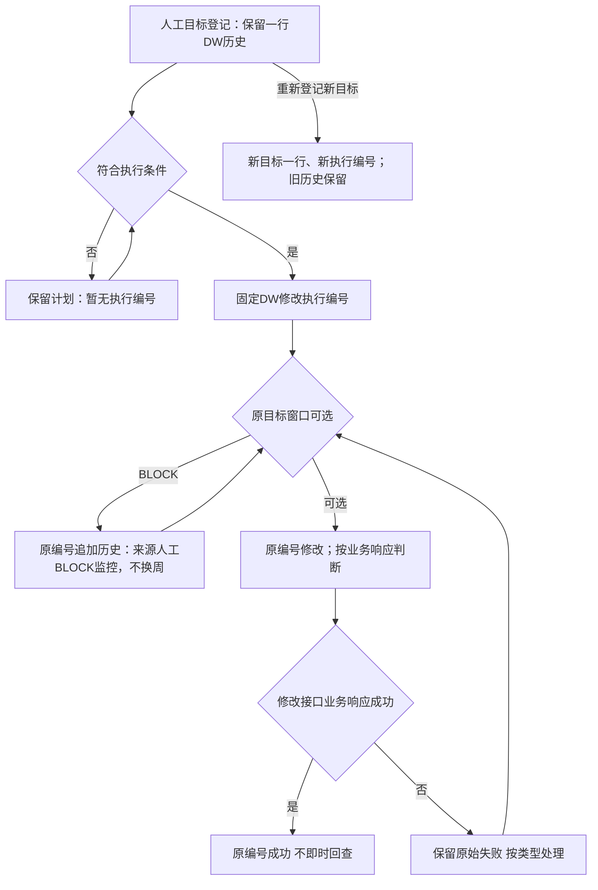

执行事项与主表触发来源固定如下；具体业务原因和消息渠道放明细，不扩展模糊来源。

| 执行事项 | 触发来源 |
| --- | --- |
| 单号映射 | MQ消息、定时补偿 |
| 取消映射 | MQ消息 |
| 运输信息同步 | 首次映射完成、MQ消息、定时补偿、DW修改失败补同步 |
| 修改资格及当前DW查询（后台） | 首次运输同步完成、定时查询 |
| 人工BLOCK监控（归原DW修改） | 定时监控 |
| DW修改 | 人工登记、VD预估、X4预估、快递预计送达、收货安全调整、DW对账、周六延期、人工BLOCK监控 |

“DW修改失败补同步”仅由实际DW修改返回明确运输信息缺失触发，覆盖人工登记、首次收货安全调整、VD/X4预估、快递预计送达、每日对账及周六延期等来源，不归为MQ消息。该运输同步使用独立执行编号，明细记录原DW目标来源、失败返回及关联DW编号；运输必填资料未齐不发送不完整报文，补齐后的补偿发起仍保留对应实际触发来源及原DW关联。同步成功且原目标仍有效、符合既有前置时，沿原DW执行编号追加继续执行历史；原目标来源、目标快照和创建批次不变。无明确运输信息错误，不为其他失败盲调运输接口。

运输同步MQ的原因可为仓点变更、派送信息变化、提单更新或补齐。只比较实际Amazon运输报文有效内容，未变化不重复调用。卡派改快递派不固定触发同步；仅我方内部分类变化不调用，确实改变接口字段才同步。原型内部lastMile是本地分类，不是已确认正式接口字段。取消映射仅由业务取消MQ触发，不设取消补偿；临时失败的受控重试沿用原编号。

首次映射完成且运输完整才同步，首次运输同步成功后的资格及当前DW初始化归该次运输同步历史，之后正常定时查询只归后台运行明细，不新建主表记录，不为每次DW提交额外查询。人工计划前置补齐后来源仍为人工登记，VD/X4补偿形成的DW来源仍为VD预估/X4预估；渠道另存明细。BLOCK原周可选沿原DW编号接续，目标来源人工登记、最新执行来源人工BLOCK监控，不将窗口查询成功视为DW修改成功。

### 11.2.1 执行主表与查询

主表依次为执行事项、执行编号、批次号、FBA、触发来源、我方期望DW、创建时间、最近执行时间、执行状态、返回结果。DW列取执行创建时的目标快照，其他事项显示“—”。运单、昵称、提单、仓点保留明细及创建快照；昵称来自运单关联数据，未找到留空。无操作列和重复批次区。状态为待执行、处理中、成功、失败、已终止；主表取最近执行来源/时间/状态/原始返回，创建时间与创建批次固定。

状态仅待执行、处理中、成功、失败、已终止。待执行表示条件已满足并入队；缺条件计划不建占位执行。创建时间固定，最近执行时间按实际执行/重试更新，未执行显示“—”；原始历史缺失显示未记录，不能用计划时间冒充执行时间。返回结果为最近一次对方原始返回；后台本地预估计算结果不写入主表接口返回；无响应注明超时等实际情况。停止、暂停、有效性及监控安排属于明细系统说明，不冒充对方返回。

查询仅支持执行编号、批次号、执行事项、触发来源、执行状态和时间范围（创建/最近执行）；不提供FBA、运单号、昵称、提单号及仓点查询入口，主表FBA、详情入口与历史快照仍保留。号码支持多值，沿用紧凑布局、展开/收起、点击查询自动收起；重置清空条件，不影响业务准入和后台权限。

#### 11.2.2 执行明细与历史

点击执行编号只展示基本信息和执行历史表。基本信息为事项、货件信息、触发来源及具体业务原因，DW修改显示目标窗口；暂停、停止等系统说明归对应历史行，不重复铺独立区域。历史字段依次为执行次数、触发来源、执行方式、开始时间、结束时间、结果、原始返回。每次历史关联本轮运行批次，创建时批次号与创建时间固定；主表展示最近执行来源、时间、状态和原始返回，成功不覆盖历史失败。执行方式区分首次执行、人工补跑、自动重试、人工重试；业务触发来源不写成重试，普通重试沿用本轮来源；BLOCK后的业务触发来源为人工BLOCK监控，目标来源仍人工登记。首次及每次重试独立成行，后来成功不覆盖过去失败。该次涉及的接口名称、调用时间、结果、请求响应放在该次历史明细内，不设独立接口页签或“关联调用”字段。

批量映射一次真实调用共用一份请求响应、关联各FBA，每票查看本票箱号、追踪号及逐项结果，整体HTTP成功不代表各票成功。人工重试条件见11.1。货件DW记录的执行编号可打开对应记录并返回货件详情或列表，不保留孤立演示编号。必要的执行关联仅在对应历史行提供可点击编号，不设独立前后过程区域或父子任务层级；例如DW缺运输失败的历史行关联补做运输同步编号，后续接续仍沿原DW编号。

本地固定演示包含资格恢复新编号、设置异常新目标首试、限流同编号重试及耗尽、运输补同步接续、BLOCK监控与终止、替换旧目标、修改成功而当前窗口仍旧、对账查询失败不修改和逐次历史导出，编号见25.2演示清单。所有原始返回明确为模拟，不连接真实接口或调度。

后台处理归属：货件详情展示最新成功资格、查询时间及Amazon当前DW；失败保留最近成功值与时间。首次运输同步后的资格查询归运输同步历史/运行明细；修改后不追加资格或窗口即时回查。VD/X4依据归货件预估，补偿过程归运行明细；快递逐单号结果及不完整/错误归运行明细。每日对账查询失败不创建DW失败、不以旧窗口判断修复；成功一致只保存运行结果，成功不一致且符合既有条件才修改。

自动任务“最新运行明细”打开该项任务最近一次运行批次，包括定时执行或人工执行；展示本批检查、排除、实际执行及原始返回，不是历次汇总。运行批次原始返回逐批保存，不读取同编号最新返回覆盖过去；后续批次只关联历史，不覆盖创建批次号。

#### 11.2.3 成功标准及前后关系

| 执行事项 | 成功标准与后续 |
| --- | --- |
| 单号映射 | 本票本次必需项全部成功；部分成功仅重试未成功项 |
| 取消映射、运输信息同步 | 按接口业务返回判断 |
| VD预估、X4预估（后台处理） | 成功形成目标DW；不代表Amazon修改成功，条件满足后主表创建DW修改，来源分别为VD预估、X4预估，依据留货件预估记录与明细 |
| 快递预计送达查询（后台处理） | 逐单号结果、整票完整性及原始返回保留后台与自动任务运行明细；失败或缺EDD纳入导出。完整数据形成有效新目标并符合条件才创建DW修改，来源快递预计送达，查询依据在明细；不完整、周未变化、人工纠正目标存在均不创建DW修改 |
| 修改资格及当前DW查询 | 成功取得Amazon返回；资格不允许不是接口失败 |
| 人工BLOCK监控 | 成功取得可选窗口结果；BLOCK为业务结果，保留原目标监控 |
| DW修改 | 以实际接口业务响应判断成功；HTTP成功不等于业务成功。不即时回查、不更新Amazon当前DW，后续正常查询/对账取得平台窗口；查询可选或资格允许不等于修改成功 |

快递人工纠正后，Track123不覆盖人工DW。VD/X4依据仍在货件预估记录，实际目标形成或变化在DW更新记录；未改变DW的查询不新增更新行。

### 11.3 按执行历史筛选导出

执行记录表格标题右侧提供紧凑的“导出执行记录”按钮，悬停说明按当前条件筛选每次执行历史后导出，不在查询区和列表之间另占一行。主表展示最近状态，导出按当前查询条件匹配每次实际执行历史；时间、状态、来源取该次尝试，不因主表后来成功或已终止漏掉原时段失败。一次失败、两次重试失败可导出同编号三行；未选择失败状态时不默认仅失败。没有实际执行历史的占位/本地计划不拼造导出行，不增加最近/历史切换。

字段严格为：执行事项、执行编号、批次号、FBA货件号、运单号、昵称、提单号、仓点、我方期望DW、创建时间、最近执行时间、执行状态、返回结果。创建批次及创建时间、货件信息与目标取执行形成时快照；导出的最近执行时间为该次历史时间，状态及原始返回来自同次历史，不能用最新返回替换。非DW事项的期望DW为“—”。不增加运营错误分类、通知或处理状态列，原始字段和值不翻译。

后台资格查询、快递查询、本地计算和扫描排除不混入四类执行记录CSV，其原始返回及异常仍保存在相关货件记录或自动任务运行明细，既有异常取数能力保留。真实后台按权限从完整历史取数，本地仅演示内联数据，不代表已实际落库。

### 11.4 通知触发规则（二期；一期仅作为线下指引）

先判断完成：已签收（整票）、退件、取消不新建，已有未完成跟进自动关闭并保留历史。未完成如下：

| 情况 | 待办与内容 |
| --- | --- |
| 首次卖家不允许修改 | 开启授权；有有效目标一并告知，或请卖家自行修改 |
| 设置异常，即便显示允许修改 | 告知货件设置异常不可恢复、DW自动处理已结束，线下跟进实际送仓及后续安排 |
| 未授权/异常期间人工新DW | 更新同一跟进：新窗口+待处理动作 |
| 未解决期间系统新有效目标 | 更新通知，不能绕过暂停提交 |
| 人工BLOCK持续/近截止，需客户协助 | 协调后续计划，不承诺可绕过BLOCK；自动阈值待确定，二期运营判断 |
| 不可自动恢复/重试耗尽且需客户协助 | 障碍+有效计划+客户动作，内部技术错误不转嫁 |
| Amazon当前DW过期且未完成 | 告知自动更新已结束，请反馈实际送仓及后续安排；有未来有效目标一并告知 |
| 客户说已处理但核实未解决 | 剩余障碍和最新动作 |

不通知：我方目标/VD/X4预估过期、运输信息等待、单次临时故障/限流、自动BLOCK成功顺延、对账成功、Amazon过期但货件已完成。我方目标过期可能由授权/设置异常未解决或计划未生效导致，不代表部分签收，本期无该动作。

### 11.5 跟进闭环与后续机器人预留（二期）

可恢复的授权问题可按待通知→待客户处理→待核实→已完成管理；业务完成或运营关闭→已关闭。设置异常、Amazon窗口过期仅登记后续安排并结束跟进，不显示“核实已解决/恢复货件”操作。跟进结束与DW恢复分开，结束跟进永远不改变DW结束标记。复制不等于发送，客户反馈不等于解决。

未发送的新目标更新同一草稿；已发送再变化重新待通知，发送内容和版本不可覆盖。持续同类问题不每日堆叠，多障碍合并客户行动说明。只用当前有效日期，无有效计划仅说明修正动作。无授权且无法查询Amazon显示无法获取，允许人工证据。Amazon当前窗口过期后不可恢复，客户反馈仅用于线下跟进后续交付。

二期复制、登记发送渠道/发送人/时间、客户反馈、后续安排、授权问题核实、结束/关闭跟进。通知case与发送attempt独立：case保存FBA、客户/负责人、问题集合、当前目标版本、状态、反馈及证据；attempt保存内容快照、版本、人工/机器人、渠道、发送时间/人、结果、外部消息ID。后续机器人只消费当前版本待通知，不发过时内容；通知重试与Amazon API队列分开。

### 11.6 模型补充

DW新增business_stage、automation_control、stop_reason、desired_version、desired_event_occurred_at、manual_saved_at、missing_transport_fields、transport_payload_hash、saturday_extension_business_week。取消manual_lock、allow_auto_extension与固定来源优先级，改事件发生时间/目标版本。

任务保存FBA、任务类型、目标版本、来源、等待原因、下次执行时间、截止时间和替换关系。目标版本仅后台使用。执行前检查最新本地事实，不新增资格查询；attempt只保存真实调用。业务执行明细及失败尝试均保存不可变结果快照，见第26章。

## 12. ShipTrack API 与新老系统路由

### 12.1 接口方向和查询键

接口方向为 **Amazon → 我方统一 ShipTrack 网关**。Amazon 请求中的 `TrackingNumber` 等于我方在 Publish 中提交的 `trackingId`。网关不得擅自替换为提单号、FBA 号或尾程子单号。

官方手册示例使用 XML：请求包含 Validation、`APIVersion=4.0`、TrackingNumber；响应通过 `PackageTrackingInfo` 返回 TrackingNumber、最新预计送达日期和 `TrackingEventHistory`。最终 URL、认证、完整 XSD 和错误结构仍需 Amazon 提供独立的 `AmazonRTTVApiSpec` 后固化。

### 12.2 新老系统判断方案

**主方案：追踪号归属索引，而不是按单号格式猜测。**

1. 新系统每次 Publish 成功时写入 `trackingId → NEW + source_business_key`。
2. 上线前从老系统导出仍可能被 Amazon 查询的有效 trackingId，批量回填为 `LEGACY`。
3. 网关收到请求后先精确查询归属索引，并调用对应适配器。
4. 迁移期索引未命中时，在受控超时内并行查询新老系统：
   - 仅一个系统命中：返回结果，并以“查询修复”来源回填索引；
   - 两个系统都未命中：返回协议规定的未知追踪号错误；
   - 两个系统同时命中：不拼接两票数据，进入冲突告警并按已配置的权威归属处理。
5. 不建议“先查新系统，查不到再查老系统”长期运行，这会增加尾延迟并掩盖重复单号。

### 12.3 统一轨迹模型

新老系统适配器都转换为统一结构：追踪号、事件源 ID、内部事件码、Amazon 状态码/原因码、发生时间及时区、地点、当时 EDD。网关统一完成去重、排序和 XML 输出。

至少覆盖：`AF/NS`、`K2/O1`、`VD/NS`、海运到港 `VA/NS` 或空运到港 `K1/AJ`、`K2/RD`、`X4/FN`、卡派预约 `AG/AG`、完整投递 `D1/NS`。一期不建设部分签收，不用部分箱事件关闭整票DW。

### 12.4 可用性和日志

- 按资料目标支持大于 40 TPS，并设置超时、熔断和短时缓存；缓存键必须包含完整 trackingId。
- 记录请求时间、来源校验结果、路由系统、命中业务键、事件数量、耗时和错误；不记录访问凭证。
- 新老系统均不可用时返回明确的临时错误，不用空轨迹冒充成功。

## 13. Smart Reroute S3 功能设计

### 13.1 官方流程

| 步骤 | 发起方 | S3 目录 | 文件与动作 |
| --- | --- | --- | --- |
| Step1 | 我方 | `step1-Request/` | 上传 `<SCAC>_<MMDDHHMM>.csv`，包含 ISA、SCAC、海外仓、PO 列表和可选轨迹状态 |
| Step2 | Amazon | `step2-AmazonFeedback/` | 约 1–2 分钟后生成 `<ISA>.csv`，返回多个新 FC + 可约时间 offer |
| Step3 | 我方 | `step3-CarrierFeedback/` | 在 Step2 文件中且仅在一个 offer 行填 `confirmed=yes`，可填写新 CRDD，上传 `<ISA>.csv` |
| Step4 | Amazon | `step4-ProcessingResult/` | 约 1–2 分钟后返回原 ISA、确认 offer、新预约 Reference Code 或错误 |

offer 自生成起 4 小时有效，且不会锁定仓位；上传之间至少间隔 5 分钟，每文件最多 20 条预约，只接受 UTF-8 CSV。错误目录只保留最新错误文件，因此我方必须下载并归档每个版本。

### 13.2 产品页面

“Smart Reroute”页面包含：申请列表、原 ISA/FC、海外仓、PO、当前轨迹、Step 状态、offer 数、失效倒计时、已选 offer、新 FC、新 Reference Code、错误原因和操作人。

操作流程：

1. 本章为二期。SCAC默认GUHD；业务系统未存原ISA时由运营登记ISA和区域。当前物流仓从备案清单选择；关联FBA/PO从业务货件解析。物流仓备案编号不是Amazon FC代码。原FC是在申请录入还是Step2返回，需对照Smart Reroute官方文件核定；原型暂展示Step2返回，不作为接口契约。
2. 二期维护备案物流仓名称、认可编号、区域。distance属于距离备案文件还是每次申请字段，需核对官方文件；不得按尚未确认的描述开发。原型暂展示备案文件版本，不维护距离明细。
3. 生成 Step1 文件并排队上传；
4. 轮询 Step2，解析 offer，按额外里程和最早可约日展示；
5. 运营在 4 小时内选择唯一 offer，系统生成 Step3；
6. 轮询 Step4，成功后回写新 FC 和新预约 Reference Code；
7. 自动触发 Upsert，FC 来源为 `SMART_REROUTE`；
8. 已有人工DW时，换仓点不重新预估、不覆盖人工目标，等待运营再次登记；必要Upsert继续。

### 13.3 技术与权限

- 使用 Amazon 提供的 `CarrierFileAccessRole` 通过 STS AssumeRole 获取临时凭证。
- 仅使用 `ListObjects`、`GetObject`、`PutObject`，我方对 S3 文件无删除权限。
- US 和 EU 使用不同 bucket/region，并按 SCAC 和 UTC 日期访问专属前缀。
- 本地保存文件内容 hash、S3 key、etag、上传/下载时间和解析结果，保证重复轮询不重复处理。

## 14. 任务状态、日志和监控

### 14.1 任务状态

执行状态统一为待执行、处理中、成功、失败、已终止。待执行只表示实际事项已入队；无执行记录的计划不造占位。资格、BLOCK、缺运输及下次重试为独立控制事实，不扩展状态枚举。成功表示本事项接口业务返回按现有程序判定成功，非HTTP成功或已回查窗口一致；目标后来替换不改写过去成功。终止只停止旧未成功事项，系统说明与原始返回分别保存。

### 14.2 接口日志展示

每次调用展示：任务 ID、业务触发、接口、环境和区域、FBA 货件号、trackingId、请求时间、请求字段摘要、响应时间、HTTP 状态、Amazon 错误码、耗时、尝试次数、下次重试、前后任务关系。凭证、签名和敏感头信息必须脱敏。

### 14.3 后台监控指标（不直接铺在运营页面）

- 进入收货中至 Publish 成功时长；
- Publish 至 Upsert 成功时长；
- VD/X4事件至DW修改业务响应的处理时长；
- Publish、Upsert、DW 各接口成功率和错误分布；
- BLOCKED 数量、平均解除天数、临期未解决数；
- 我方期望 DW 与 Amazon 值的日对账差异率；
- DW 修改成功率、后续查询窗口一致率和货件设置异常数量；
- ShipTrack QPS、P95/P99、未知追踪号率、新老系统路由冲突数；
- Smart Reroute offer 超时率和 Step 错误率。

## 15. 接口与触发矩阵

| 接口/能力 | 方向 | 主要触发 | 前置条件 | 成功后的下一步 |
| --- | --- | --- | --- | --- |
| PublishTrackingId / Batch | 我方 → Amazon | 运单变为收货中 | FBA/箱/追踪号完整 | Upsert 初始版 |
| VoidTrackingId | 我方 → Amazon | 整票取消并与卖家一致 | 已映射成功 | 停止 DW，核查卖家后台 |
| UpsertTransportationInfo | 我方 → Amazon | 映射成功；服务/路由/尾程/FC/预约变化 | Publish 成功 | DW 计算与同步 |
| GetDeliveryWindowChoice | 我方 → Amazon | 首次初始化、日常资格及当前DW查询、每日对账读取；无修改后即时回查和提交前额外查询 | 美国线且 FIST 开启 | 保存查询事实并按来源规则接续 |
| GetDeliveryWindowOptions | 我方 → Amazon | 有期望 DW 且应提供 | Upsert 必需字段完整 | 匹配最新 option |
| ConfirmDeliveryWindowOption | 我方 → Amazon | 匹配 option 非 BLOCKED | 最新 optionId/referenceId | 保存本次业务返回；平台窗口后续正常查询更新 |
| ShipTrack API | Amazon → 我方 | Amazon 按 trackingId 查询 | 归属索引和轨迹数据可用 | 返回标准 XML |
| Smart Reroute S3 | 双向 | 运营申请智能转仓 | ISA/PO/海外仓距离齐全 | 更新FC/ISA、Upsert；已有人工DW等运营再登记 |

## 16. 验收用例

1. 运单首次进入收货中，只创建一次 Publish 任务；重复状态事件不重复推送。
2. 一票多箱共号与箱级不同号分别正确选择 Publish/Batch；超过 500 箱正确拆批。
3. 全部映射成功后自动 Upsert；Upsert 未成功前不执行 GetOptions/Confirm。
4. DW 返回缺运输信息时可自愈一次，且不形成无限 Publish/Upsert/DW 循环。
5. 2026-09-26 已收货、现有窗口为 09-27 至 10-03 时，计算目标为 10-04 至 10-10。
6. VD/NS 按服务渠道、尾程方式、仓库配置生成第一次完整周窗口。
7. X4/FN生成第二次窗口，可覆盖此前人工；迟到旧事件不得覆盖。
8. 人工从货件/提单勾选后登记，保存后按逐票前置及资格提交或等待；保存不等于Amazon修改成功，关闭弹窗并留在原列表，不跳转任务中心。无匹配option不得显示成功。
9. 人工目标BLOCK：保留原目标，每票每日两个批次监控，直到目标当地结束日（含）；自动预估目标BLOCK：只选择晚于原目标的可选一周，不选择连续两周，不进入人工BLOCK监控。可用后使用最新optionId/referenceId确认。
10. DW返回明确设置异常时保存异常及原始返回，不可恢复；停止常规DW及同目标重试，但Track123查询继续、新人工/完整快递目标首试按10.5.2；不提供解除入口。
11. 常规后台修改沿最近资格判断；新人工/完整快递目标按首试例外调用并保留真实失败。资格不允许失败由正常查询发现真实恢复后新编号接续，不新增人工通知字段。
12. 每日发现Amazon窗口不一致且我方为未来有效目标时修复；当周不修复，目标过期不对账，Amazon当前窗口过期则结束自动处理。
13. 服务组合尾程方式、仓库代码、智能转仓结果变化时生成新的 Upsert；报文无变化时不调用。
14. VD 后发起 Void 需要主管确认，但系统不因“已开船”自行断言 Amazon 禁止；正确展示接口结果。
15. ShipTrack 已回填老单路由到老系统，新单路由到新系统；未命中双查唯一命中后修复索引；双命中告警。
16. Smart Reroute 完成 Step4 后回写新 FC/预约，触发 `SMART_REROUTE` Upsert；已有人工DW不重新预估，等待运营再次登记。

17. 两个DW列表尾程方式均为多选且默认卡派；货件业务阶段多选默认收货中、转运中。初始数据实际应用默认值；清空表示不限，重置恢复默认；同条件OR、跨条件AND，查询后收起。
18. 同提单同仓点的两种派送方式分别成行，数量与统计独立；批量DW及仓点变更仅取所选分组，仓点或方式变化按最新值归组，单号不参与分组。整提单状态按舱单管理既有定义，同号各行一致，分组货件状态变化不改写提单状态；仍仅展示已出发提单，状态不代替逐票资格。
19. 两个DW弹窗仅可选择完整周；显示如 `2026-10-11～2026-10-17`；当地当周尚未过期可选，已过去周不可选；窗口过期/业务完成等限制及人工BLOCK规则保持。
20. 原因可不填；其他说明可不填，清空原因清空说明；批量同一原因和说明保存至每票DW历史及业务批次快照，再次登记不改历史。仓点变更记录独立，不混入DW原因统计。
21. 快递派默认Track123；人工登记后同周及跨周EDD均只保存查询历史，不覆盖、不重新提交人工DW；VD/X4及其他任务沿用既有规则，无恢复自动预估入口。

22. 提单查询仅已出发、已到站、已清关、已完成；清空及重置仍受已出发准入约束；列表采用真实提单状态，删除存在DW异常筛选与对应逻辑，不增加异常快捷筛选；原异常数量、具体原因、详情及导出保持。
23. 固定演示案例的时间、原/目标/实际DW、业务阶段、仓点、操作人、原因、批次及接口快照一致；完成后无DW修改，BLOCK旧监控终止，仓点变更不自动改人工DW。
24. 货件DW预估记录以同一四列表展示VD/X4及最终DW，依据覆盖命中配置、X4第2周、VD第4周；缺配置明确首次补偿基准日期并排除当前周，BLOCK注明原目标并取最近可选单周，未形成注明原因，保留两类空状态；快递预计送达形成或跨周改变DW在DW更新记录展示，计算依据保留后台事实，未改变DW或人工优先拦截后的查询只有接口/后台查询历史，不制造DW更新记录；任务中心记录职责保留。

25. 同一目标只保留一条DW更新，监控/提交/重试不重复变化。修改成功以业务响应为准，没有即时回查，不改写Amazon当前DW及成功查询时间；资格查询返回不作为修改返回。
26. DW更新主表九列，登记人与原因分列，不展示计算及执行过程字段；基本信息变更仅真实字段差异，六列、系统操作人如实显示，演示涵盖方式、仓点、服务组合、提单、当前快递单号，不混入执行过程；详情无接口页签，所有任务链接能在任务中心查到并返回详情或列表。
27. 100/300票集中登记各为一个批次，所有允许保存票有登记历史，FBA去重；仅符合条件建相应执行事项，基础前置不足无占位/伪调用，后续满足接续原批次，禁止登记仅排除明细；扫描检查/符合/实际数量独立。
28. 一次批量调用请求响应一份、关联多FBA，各票按所需项判断成功，只重试未成功项；同执行编号逐次历史保留，新目标/运输/正常查询另建事项；旧DW失效不得继续确认，重复消息及相同有效内容去重。
29. 任务中心只三页签，执行主表10列和五种状态，历史7字段、创建批次固定、监控复用原DW编号且最新来源人工BLOCK监控、原始返回逐次保存，四类事项来源按11.2表逐项匹配；查询仅编号、批次、事项、来源、状态及时间，详情仅基本信息和可展开历史，关联仅在对应历史行，无操作列/重复批次区；昵称取运单真实关联并快照，未匹配留空，未执行最近时间与返回为“—”，系统说明不冒充返回。
30. 首次及自动/人工重试独立历史；间隔从上一失败结束计5分钟/30分钟/2小时，最多自动3次，限流遵平台等待；人工一次不清零，重复点击及同FBA并发拦截，未知及未修正参数不自动重试，耗尽次日不赠送。
31. 人工运行保存人工执行、当前操作人及运行时间，批次号可打开运行信息；周六人工补跑来源仍周六延期，首次历史人工补跑；当地周六成功、当天登记排除、同周去重及无候选不造执行记录均可追溯。自动页仅九项、频率和当地时刻与21.4一致，VD/X4后台分别计算、MQ为消息渠道，主表仅展示符合条件的DW修改及对应预估来源；首次安全处理在资格返回后接续，DW计划前置恢复关联原批次，无顶部时区/筛选或指定单号；执行一次全范围过滤，不把排队当成功。
32. 快递逐号及整票完整性在运行明细可查；数据不完整、周不变、人工目标三类不创建DW修改且有系统说明。预估成功与Amazon修改成功分开；13列执行历史CSV仅四类事项，查询/计算异常留对应运行记录及既有异常取数，不混入CSV或虚构执行编号。

33. 人工新目标最近资格不允许仍实际首次尝试，失败原始返回保留；后续成功查询由不允许恢复允许，新建恢复编号而不重登，原人/时/原因不变。设置异常新人工或完整快递目标首试但不解除异常；同目标不重试。行内明确选周保存、批次逐票排除去重、原因随登记保存且不可后补、排序及换仓归组并发保持既有规则。

34. 首次完整正常窗口形成Amazon初始DW且无DW修改执行；安全目标保存和修改分开，资格不允许仍保留目标并恢复后接续。首次失败/缺完整窗口不标完成，后续既有查询成功再初始化；已有人工/有效预估目标及查询期间新目标不覆盖；过期停止；再次查询不新增初始目标行。首次窗口、取得时间、处理结果与查询返回可追溯，未修改时编号/状态/返回为“—”。

35. 提单操作列两行常驻控件：周窗口/选填原因、新仓点/必填来源；原因和说明先填、选周即保存，来源先选才可选仓点，两者保存后不可补填，成功清空草稿、失败保留。无单行独立弹窗/保存按钮，批量弹窗保留；周下拉默认当周及未来7周，仅更远周开日历。混合组合逐票排除，完成票不变；首次正常DW演示没有伪造修改编号及返回。

36. 时刻按21.4逐项核对：DW对账09:00/18:00，周六延期10:00/17:00/21:00，人工BLOCK11:00/19:00，其他频率及全部时刻不变；前置未完成不得凭时间到点放行，同票串行且旧版本不能覆盖新目标。

37. 每日07:00/15:00资格任务同时检查有效人工计划遗漏；无执行记录且基础前置满足补首试，已在途/成功/BLOCK不重复，资格失败只在真实FALSE→TRUE后新编号恢复，查询失败不制造变化。不存在额外人工计划补漏时刻、万能标识或重试次数清零。

38. DW明确缺运输，即使当前完整报文摘要等于历史成功摘要也允许补同步，运输来源DW修改失败补同步、独立编号关联原DW。补齐成功且目标仍有效后沿原DW编号追加尝试；替换/过期不接续，未知错误不盲补，历史失败保留。

#### 本轮连贯演示索引

原型仅模拟。以下15组案例用于核对主表、历史、货件记录与运行明细；旧货件有效历史保留，旧辅助演示不重复铺主表，可用原编号查询追溯。日期为固定演示值，运行返回保存本次快照，不动态拼造历史。

| 场景 | 执行编号或运行批次 |
| --- | --- |
| MQ映射→首次运输同步→同步历史中的资格初始化 | EX-DEMO-MAP-FIRST、EX-DEMO-UP-FIRST |
| 批量映射部分失败，仅重试BOX-A2 | EX-DEMO-MAP-PARTIAL-A、EX-DEMO-MAP-PARTIAL-B；共享IR-DEMO-MAP-SHARED，仅一份请求响应 |
| 业务取消MQ整票取消 | EX-DEMO-CANCEL-MQ |
| 首次同步缺提单、旧内容停止重试、补齐后新同步 | EX-TRANSPORT-MISSING-OLD、EX-TRANSPORT-COMPLETE |
| 仓点变更MQ、业务变更记录、不改订单仓点 | EX-DEMO-FC-MQ，FBADEMO_FLOWFC01 |
| VD/X4本地预估后分别修改DW | EX-DEMO-DW-VD、EX-DEMO-DW-X4，依据在FBADEMO_VD01、FBADEMO_X401 |
| 快递完整数据形成修改、另有失败/不完整无修改 | EX-DEMO-DW-EDD、RUN-DEMO-EDD-COMPLETE；RUN-DEMO-EDD-FAIL及原不完整查询运行明细 |
| 人工BLOCK连续监控，原周可选后成功，同编号 | EX-DEMO-BLOCK-CONTINUOUS；RUN-BLOCK-CHAIN-1、RUN-BLOCK-CHAIN-2、RUN-BLOCK-CHAIN-SUCCESS |
| 人工新目标替换BLOCK旧目标 | BT-DEMO-BLOCK-OLD、BT-DEMO-BLOCK-NEW |
| 限流失败安排下次重试及同编号重试成功 | EX-DEMO-DW-RATE-WAIT、EX-DEMO-DW-RATE-RECOVER；首次09:00失败，未要求等待时09:05入队 |
| 自动次数耗尽、人工一次不清零 | EX-DEMO-RETRY-EXHAUST、EX-DEMO-EXHAUST-MANUAL |
| DW缺运输→关联同步→原编号继续修改 | EX-DW-TRANSPORT-CONTINUE、EX-DW-RELATED-TRANSPORT |
| 当地周六成功、人工登记排除、人工补跑、同周去重 | RUN-SATURDAY-SCHEDULED、RUN-SATURDAY-SAME-WEEK、RUN-SATURDAY-MANUAL；沿用2026-10-03当地周六 |
| 人工执行资格查询及之后失败保留成功数据 | RUN-DEMO-QUAL-MANUAL、RUN-DEMO-QUAL-FAIL；FBADEMO_FLOW01保留07:00成功时间，07:30失败未刷新 |
| 对账一致无修改、不一致形成DW修改 | RUN-DEMO-RECONCILE-SAME、RUN-DEMO-RECONCILE-DIFF、EX-DEMO-DW-RECONCILE |

## 17. 上线顺序

1. **P0 配置与数据治理**：清理 Amazon 事件码、补服务渠道 SLA 和 VD/X4 配置、建立 FBA 箱关系和追踪号归属索引。
2. **P1 FIST 主链路**：Publish、Void、Upsert、任务中心、日志和基础重试。
3. **P2 ShipTrack 网关**：老单回填、新老适配器、XML 契约、容量和安全联调。
4. **P3 DW Enabled**：四步流程、VD/X4 估算、人工登记、周六延期、每日对账、卖家授权处理、正常窗口查询与每日对账；通知按既有分期。
5. **P4 Smart Reroute**：S3 权限、距离数据、四步任务、FC/Upsert/DW 闭环。

## 18. 已闭环规则与仍需外部核实事项

已闭环：人工登记后的仓点/派送方式处理、第2/4周不计当前周、人工BLOCK与周六延期互斥、多次调度、即时本地事实过滤、不可恢复停止控制、完整原型保留。以下未定事项不改变上述规则：
1. 人工BLOCK持续通知的次数/临近截止阈值尚未定；原型用运营判断场景，不假设自动阈值。
2. Amazon真实接口限流、ShipTrack XSD/认证及各区域参数需完整官方契约联调。
3. 产品SLA仓点覆盖、AF_REROUTE与亚马逊自提业务对应关系、Void节点约束需进一步确认。

## 19. 资料依据

- 《FIST承运商对接单号API开发文档 0814》：Publish、Void、Upsert、通用错误码和调用顺序。
- 《FIST承运商管理送达时段API试运行/正式启用模式开发文档》：GetChoice、GetOptions、Confirm、Shadow/Enabled 行为及错误码。
- 《FIST-ShipTrack服务商轨迹对接手册-20250226》及事件清单：ShipTrack XML 查询方向和事件代码。
- 《Smart Reroute服务商智能转仓1113》：S3 四步文件流程、路径、时限、文件格式和 IAM 访问方式。
- 当前产品原型：运单管理、物流事件、亚马逊物流事件、服务组合、服务渠道及后台任务。
- 当前产品文档：头程管理、超级运价、服务渠道数据设计及后台任务设计。
- 产品原型：https://pp-demo.freedomscm.com/staff/index.html
- 产品文档：https://pp-demo.freedomscm.com/luna-prd/oss-site/index.html

本文将官方接口事实、当前系统设计和本次业务规则分开表达。官方资料未定义的内容以“我方产品规则”或“待确认项”标识，开发不得把推测写成 Amazon 接口限制。
## 20. 最新原型交付与验收补充

原型：https://amazon-dw-control.wen82926.chatgpt.site 。本轮已确认列表查询、批量人工计划、详情分栏、三个任务中心页签、统一异常导出及完整二期功能展示。页面交互要求见第25章，后台记录建设见第26章。交互数据为演示，未实际对接Amazon、Track123、MQ或机器人；刷新后演示状态重置。

验收重点：未授权/设置异常仍能保存计划，待办内容带最新DW；人工BLOCK换目标终止旧重试；新VD/X4按发生时间替换；预估当周选下周；周六转运中且未来临期、当天无人工、无BLOCK才延期；Amazon过期结束自动处理；本地旧目标过期不对账、不通知；已完成不通知；复制不改变待通知，已发送才进入待客户处理，反馈后必须核实。

## 21. 执行事实、九项定时任务与调度规则（2026-10-08统一）

本章为后台调度唯一规则表，与第10章目标生命周期、第11章执行及重试共同生效。任务启动时读取最新本地事实，按条件分批过滤、入队；实际调用前检查版本及停止条件。不预存“参加某任务”标记，不用“系统下次动作”作为执行依据。数据保存要求不代表现有生产字段、调度或接口已经实现。

### 21.1 时间、事实与前置定义

所有过期、归周、当天人工登记、BLOCK截止及定时启动均按目的仓IANA时区换算，处理夏令时。页面业务时间沿用北京时间；自动任务顶部不设时区切换。时区缺失不得默认北京日期放行。周窗口为周日到周六，结束日包含当天。

| 读取事实 | 来源及有效性 |
| --- | --- |
| 货件阶段、原始状态 | 状态MQ保存的事实；收货中/已收货→收货中，转运中/已到港/一清关/已到仓→转运中，已签收/退件/取消→已完成。未知状态留数据问题，不用提单或执行状态代替 |
| 当前映射清单及逐项结果 | 当前FBA关联箱/追踪号关系；清单非空且当前必需项全部成功才算映射完成。历史成功不能放行新增项 |
| 当前完整运输报文及成功报文 | 最新业务快照产生当前摘要，Upsert成功保存实际提交的摘要；完整且当前摘要等于成功摘要才算当前运输同步完成。旧响应不能把新内容误标成功 |
| 运输必填信息 | 服务渠道、路由/订舱/提单等数据；Amazon服务等级、运输最小/最大天数、运输方式、ETD、ETA、起运港、目的港。未关联提单不必然缺字段；字段完整性和格式必须满足现有要求 |
| 最近成功修改资格及查询记录 | GetChoice成功取得明确资格值；失败留错误但不覆盖成功值，不把未知/失败当FALSE；查询成功FALSE不等于查询失败 |
| Amazon当前窗口及成功查询时间 | 仅真实成功查询更新；空/不完整结果不伪造窗口或过期。DW修改成功不能写作查询成功 |
| 当前我方目标及版本 | 保存日期、来源、形成时间、人工人/时/原因或事件关联；未过期=结束日≥当地今天，未来目标=开始日>当地今天；替换使旧目标任务失效 |
| 首次初始化及安全处理事实 | 首次取得完整平台窗口、取得时间、接纳/保留/安全调整结果及关联查询；安全处理是否完成与修改接口结果分开保存 |
| 当前人工BLOCK | BLOCK所属目标版本必须等于当前人工目标版本；新目标不继承旧BLOCK；查询成功可选不等于修改成功 |
| VD/X4及快递事实 | 有效事件ID、实际发生日/时区、处理结果；当前服务商/单号/关联版本、逐号EDD或妥投日期。旧事件、旧号码结果不能覆盖后续有效目标 |
| 执行、尝试及运行批次 | 保存实际事项、目标/内容版本、在途、结果、累计重试次数/到期时间，以及任务类型/当地日期/时段的逐票检查记录 |
| 周六延期去重 | 同FBA＋目的仓当地业务周唯一，业务周为当地周六所属周的周日日期；预留、入队、失败均不得导致第二次延期 |

“前置完成”必须落实为当前映射完成、当前运输信息完整并成功同步，不写成历史任意一次Upsert成功。新人工/完整快递新目标的首试例外另按10.5.2，不以最近资格或设置异常阻止首试；不能把这个例外扩大到常规后台来源。运输必填报文不完整不发送明显错误的Upsert请求。

### 21.2 停止、去重与统一过滤

1. 业务完成、Amazon当前窗口已过期：停止DW及旧目标处理，保留历史，不提供恢复入口。
2. 设置异常：停止常规资格查询、对账、延期、自动预估提交及同目标重试；不停止Track123查询，允许新人工或完整快递新目标按首试规则尝试一次，不解除异常。
3. 我方目标截止只结束该目标，次日起不再监控/执行；不永久结束整个货件。新有效目标按对应来源判断。
4. 必要运输同步按自身业务前置独立判断，不被DW结束一刀切；ShipTrack轨迹继续按既有规则处理。
5. 同事件、同当前内容、同目标已有有效事项时不重复建任务；同批已处理不重复。同FBA冲突写入串行，读取旧Options后目标已替换不得Confirm。
6. 相同成功运输报文通常跳过；**实际DW返回明确缺运输信息时允许补同步同一完整报文**。保存恢复关联并去重，不为一般DW失败盲调运输接口。
7. 缺条件保存实际计划/问题事实及运行排除原因，不造待执行占位或接口返回。既有失败不通过扫描新编号重置自动次数。

### 21.3 MQ、内部结果及目标接续

MQ由业务数据保存成功后可靠发布，包含消息ID、对象/FBA关联、变更类型、数据版本和发生/保存时间；节点另带有效事件ID、代码及实际发生时间/时区。对接读取最新事实并去重。不新增节点修正撤销业务。

| 触发 | 处理与来源 |
| --- | --- |
| 首次进入收货中 | 映射未完成则创建单号映射，来源MQ消息；全部当前项成功后检查完整报文，来源首次映射完成创建运输同步 |
| 运输内容有效变化或补齐 | 映射完成、报文完整且需要同步时创建运输信息同步，收到业务MQ触发则来源MQ消息；纯内部派送分类变化而报文未变不调用 |
| 新VD/X4 | 我方本地计算，依据事件实际发生时间及覆盖关系形成目标；满足后台修改条件才创建DW修改，来源VD预估/X4预估；ShipTrack不执行预估 |
| 人工登记 | 保存目标与原因，终止旧未成功事项；满足首试条件创建实际DW修改，无额外资格查询；基础前置未完成保存计划，无占位 |
| 完整快递新目标 | 无有效人工纠正目标、整票日期有效且DW周改变，形成快递目标；按首试规则创建修改。人工目标存在时只保存查询事实，不覆盖或重新提交 |
| 首次运输同步成功 | 需要初始化且符合范围时GetChoice，取得完整窗口后接纳初始DW或保存安全目标；已有有效目标不覆盖。查询失败由既有查询继续 |
| DW返回明确缺运输信息 | 创建或复用补运输同步，来源DW修改失败补同步；保留原DW编号、原目标和失败返回，运输完整后同步，成功且原目标仍符合条件时原DW编号继续 |
| 成功资格查询由不允许恢复允许 | 对仍有效且满足前置的资格失败目标，新建恢复DW编号并关联旧失败及原登记；同次恢复去重，不因连续TRUE结果重复创建 |
| 目标替换、过期或停止处理 | 系统终止旧未成功事项，已成功保持成功；原始返回不改成终止原因 |
| 修改接口成功 | 按本系统业务返回判定成功，不追加即时GetChoice；平台窗口由后续正常查询更新 |

仓点变化保留人工DW，不重新预估，等运营再登记。卡派改快递派MQ必须传当前服务商、快递单号及关联版本，等待既有Track123任务；已有人工纠正目标不覆盖。新VD/X4按真实事件发生时间判断，不以补录时间或任务完成先后决定覆盖。

### 21.4 九项定时任务：频率、过滤与动作

| 任务 | 实际读取及过滤条件 | 动作、去向及失败边界 | 目的仓当地启动时间 |
| --- | --- | --- | --- |
| 单号映射补偿 | 需要映射、当前必需清单有未成功项；阶段及接口参数符合映射规则；无同项在途；未修正错误/耗尽限制不绕过 | 仅补未成功项，保存逐项实际返回；实际映射进入执行记录，缺数据只留运行原因 | 每日3次：06:10、14:10、20:10 |
| 运输信息同步补偿 | 当前映射完成、报文完整；首次未同步、有效内容变化或明确DW缺运输的恢复需求；无同内容在途、无未修正/耗尽限制 | 同步当前完整报文，保存成功版本；明确缺运输允许同摘要补同步。关联DW仍有效则原DW接续；不是独立DW等待资料流程 | 每日3次：06:20、14:20、20:20 |
| 修改资格及当前DW查询 | 常规DW管理范围、当前映射/运输完成、仓点日期可用、本批未处理且无同类在途；包含资格未知及不允许 | 保存成功资格/平台窗口；失败不覆盖快照或制造资格恢复；成功接续初始化、安全处理及资格恢复；同批检查有效人工计划遗漏，见21.4.2 | 每日2次：07:00、15:00 |
| VD预估补偿 | 有未处理有效VD事件，输入/实际时间/时区完整，无同事件在途；不能把查找数据缺失当配置零命中 | 本地补计算及覆盖判断；配置零命中第4未来完整周，当前周不计；计算依据进货件预估，符合条件才创建DW修改 | 每日3次：07:30、14:40、20:40 |
| X4预估补偿 | 有未处理有效X4事件，输入/实际时间/时区完整，无同事件在途，独立于VD去重 | 本地补计算；配置零命中第2未来完整周，当前周不计；旧迟到事件不覆盖后人工，重试不重算兜底基准 | 每日3次：07:30、14:40、20:40 |
| 快递预计送达查询 | 当前快递派、仍需查询、号码和关联版本完整，无同号冲突在途、本批未重复；设置异常不排除，其他完成/平台过期停止范围沿现有规则 | 逐号查询，妥投号使用可靠实际日期、未妥投使用本批EDD；整票取最晚有效日期归周。人工目标/不完整/周未变不建DW修改；查询和异常归运行明细 | 每日2次：08:00、16:00 |
| DW对账 | 常规DW管理范围、映射/运输完成、最近资格允许、有效未来目标、本批未处理且无同目标冲突在途 | 本批GetChoice读取窗口及资格；一致不修改，不一致且仍符合才创建DW修改。失败不标DW失败，不用旧窗口修复；平台过期停止，FALSE不提交 | 每日2次：09:00、18:00 |
| 周六延期 | 当地周六、转运中、映射/运输完成、资格允许、平台窗口未过期；当前目标未来1～7天；当日无人登记，无人工BLOCK，同票同业务周未延期 | 原子登记一次延期意图，形成后一周目标；自动BLOCK按晚于目标最近可选周处理。失败沿原任务重试，不再延一周 | 周六3次：10:00、17:00、21:00 |
| 人工BLOCK监控 | 当前有效人工BLOCK，目标未过期含结束日；前置/最近资格满足，无同版本在途及本批重复 | GetOptions检查原周；不可选保留监控，可选后沿原DW编号修改。查询可选不标DW成功，不换周、不消耗临时故障次数 | 每日2次：11:00、19:00 |

预估、Track123及日常查询是后台过程，不扩展执行主表的四类事项。资格FALSE是查询事实；查询成功不等于DW成功。人工BLOCK查询历史归原DW编号及当次批次。

### 21.4.1 调度排列、依赖与并发

上午排列：06:10映射→06:20运输→07:00资格→07:30VD/X4→08:00快递→09:00对账→周六10:00延期→11:00BLOCK。下午/晚间仍按21.4各行全部时刻启动，不把每日2/3次省略为单次。

启动时间不是完成承诺，后一任务必须读取真实成功前置；不能因相隔10分钟/一小时直接放行。映射成功、运输同步成功、资格恢复可以按21.3即时接续有效目标，不强制等下一扫描。任务失败/未完成继续按自身规则处理，不为时间表强制推进接口。

VD与X4同时间启动但同票覆盖按事件实际发生时间处理；快递查询、对账、延期与人工登记按同FBA串行及目标版本检查，旧快照不得覆盖新目标。人工执行一次也共用锁、业务条件和次数限制。扫描按稳定主键游标分批，读取一批即可入队；配额由真实区域/接口/承运商约束控制，不承诺固定扫描耗时。

### 21.4.2 将人工计划漏处理检查并入资格任务

不再单独安排人工计划内部补漏时刻或页面任务。每天07:00、15:00资格任务内，读取当前人工目标、版本、登记记录、映射/运输事实及同目标全部执行关联，进行本地漏处理检查。此检查不等于为已停止货件新增GetChoice查询：常规查询范围按21.4，新人工首试例外按10.5.2独立判断。

| 读取结果 | 处理 |
| --- | --- |
| 人工目标过期、被替换、业务完成或Amazon窗口过期 | 不补执行；旧未成功任务按停止规则终止，保留历史 |
| 有效人工目标没有执行记录，基础前置满足 | 原子补建首次DW修改，来源人工登记，关联原登记批次，不因最近FALSE/未知跳过首试；设置异常仅按新目标首试例外，不恢复常规管理 |
| 没有执行记录但基础前置不足 | 保留计划及具体缺项，不建待执行占位；前置成功即时接续，下一批继续检查 |
| 已有待执行、处理中、成功或有效BLOCK关联 | 不重复创建，不把扫描当作实际调用 |
| 原DW资格失败，本次成功查询由不允许恢复允许 | 目标/前置仍有效且无恢复事项在途时，新建恢复编号，关联原失败及登记；重复TRUE不再次恢复 |
| 查询失败或资格未知 | 不当作资格恢复；已有成功资格事实不被失败覆盖；无执行新人工计划仍按独立首试规则判断 |
| 其他失败或重试耗尽 | 沿原临时重试、补同步或人工处理规则，不通过补漏新编号清零或绕过限制 |

后台通过目标/版本与执行关联识别遗漏，不新增一个“应执行”标记。登记、接续、补漏须使用相同去重依据并原子建任务，防止同时发现遗漏生成两条。目标首试遗漏与资格失败恢复是两个分支，编号规则不能混用。资格失败目标仅监控到截止日含当天，正常货件资格查询是否继续按货件自身规则判断。

### 21.5 接口职责、批次与去重

首次初始化、日常资格查询、每日对账职责分开：第一次取得完整窗口保存初始化事实；日常资格查询刷新当前事实并处理变化；对账读取本批窗口比较有效未来目标。日常查询不以平台窗口覆盖已有目标。GetOptions取得最新匹配选项后Confirm；修改成功不即时GetChoice，不能声称已核实卖家端窗口。

扫描键为任务类型＋目的仓时区＋当地日期＋时段；逐票另关联事件、报文或目标版本。07:00成功不阻挡15:00，11:00仍BLOCK不阻挡19:00。上批仍在途不并发，后批保存复用/排除原因；同周延期有独立业务去重。运行批次、执行创建批次和每次历史批次分别关联，不互相覆盖。

同一运输缺失需求仅一个有效补同步在途，多DW关联可复用当前完整报文的有效同步。恢复后检查原DW目标有效性及前置；迟到成功不能复活替换目标。临时失败次数只在对应实际自动重试中累加，不因扫描、BLOCK或运输接续耗用/重置。人工重试一次追加原编号历史，不重置自动次数。

### 21.5.1 扫描与执行流程

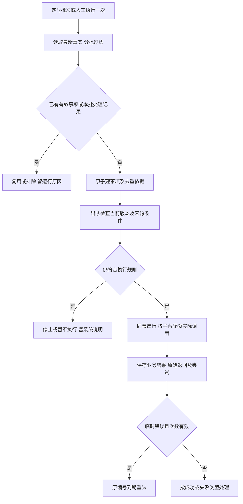

扫描完成、真实调用结果、目标登记分开保存。没有实际请求不伪造attempt；已成功记录保持成功，系统终止原因与对方返回分开。

### 21.6 执行前检查与验收

| 类别 | 调用前必须再核对 |
| --- | --- |
| 人工/完整快递新目标首试 | 基础映射、目标及关联仍有效，无完成/平台过期或重复在途；最近资格/设置异常不作首试否决，不扩展为同目标无限重试 |
| 其他DW修改/人工BLOCK | 目标版本、常规停止事实、当前映射/运输完整同步、最近资格和冲突在途符合来源规则 |
| 周六延期 | 当地仍周六、转运中、未来临期、当天无人工、无人工BLOCK、同周去重；自身预留记录不误判为其他任务 |
| VD/X4计算 | 当前事件未处理且有效，计算输入及覆盖关系成立；不按完成先后覆盖 |
| Track123 | 当前仍快递派、号码版本未换、未妥投项需要查询；设置异常不阻断；返回后检查整票关联及当前人工目标 |
| 映射/运输 | 当前项/报文有效、参数完整、无重复在途；运输缺失恢复允许同完整报文补同步 |
| 临时重试 | 原事项有效、错误可重试、到期、累计次数符合且无并发，不改变目标或兜底计周基准 |

验收同时覆盖：九项全部时刻；新人工首次尝试；无执行记录人工漏处理被07:00/15:00发现；资格失败真实恢复新编号；运输缺失同摘要补同步及原DW接续；查询失败不制造恢复或对账修复；设置异常Track123继续；BLOCK截止含当天及次日停止；同票同周延期一次；历史成功不覆盖失败；平台当前值仅查询更新。没有新增补漏时间、提交前资格查询、即时回查或万能任务标记。

## 22. 自动任务页签与人工补跑（二期管理能力）

后台定时任务属于一期可靠性要求；“执行一次”的管理页面与手动整批补跑沿用二期范围。完整原型保留在任务中心最后一个页签，Admin用于交互演示。

### 22.1 列表

直接展示全部自动任务，无顶部仓点/时区下拉，无任务类型/状态筛选。字段为任务名称与顺序、适用条件摘要、频率/仓点当地启动时刻、最近开始/结束时间、结果/检查或执行数量、执行一次/执行明细。时区由后台仓点配置决定，不能让运营切换页面时区改变调度范围。

列表所列顺序用于理解流程，不表示到点强行执行后续接口；每票实际执行仍依赖前置。07:00、15:00等均为各目的仓当地启动时间，后台分别换算，处理夏令时。运行详情可显示北京时间及涉及仓点的当地时间；不把某个时区的最近批次冒充全部地区已运行。

### 22.2 执行一次

点击后展示简短确认弹窗：任务名称、默认范围“全部货件，系统按本任务业务条件过滤”、规则说明和“确认执行一次”。不输入货件号、不选择仓点、不设置额外筛选条件。有效失败的人工重试在执行明细操作；货件列表既有DW重试入口仍按相同资格检查接入同执行编号。

确认后创建一个人工补跑扫描批次。系统按第21章读取事实、过滤、分批入队，分别记录符合条件、排除、等待、复用已有任务的逐票原因；“检查了N票”不等于“N票接口执行成功”。实际网络调用关联对应执行编号及该次执行历史。

补跑只覆盖发起时可读取的数据范围，不改定时计划、不重置重试次数、不重建失效目标，不对完成/设置异常/Amazon过期货件恢复DW。运输Upsert与DW终止独立。

### 22.3 并发、日期和结果

同类扫描有未完成批次时拒绝重复发起并提供已有明细；对已生成的逐FBA任务使用原有事件/报文/目标版本去重与串行控制。定时扫描与人工补跑共用锁和去重事实，不能因人工来源重复执行同一业务结果。

手动发起时间不是任意改期依据。资格/对账/BLOCK按既有业务条件与批次控制执行；周六延期逐票按其仓点当地日期判断。某地区尚未到周六时该地区货件排除，不把其他地区已经周六的货件一并拦截。当前周已延期、当日人工登记、当前人工BLOCK、当周目标等仍排除。任务无有效候选时结果为“无符合条件货件”，不制造接口失败。

时区缺失的日期相关任务逐票本地等待，不默认为北京时间执行。任何新有效目标或结束状态在出队前再次本地检查，不额外发起资格查询。

验收：无需输入直接发起；重复发起被拦截；全部货件按规则过滤；不同仓点日期分别判断；业务已完成/设置异常不参加DW任务；卖家管理可参加正常资格查询；常规后台不提交，新人工/完整快递目标按首试例外；必要运输同步独立；明细可见逐票原因；日志可追溯操作人和触发来源。本原型仅模拟筛选，不执行真实接口。

## 23. 完整原型保留与分期开发说明

完整原型保留Smart Reroute及备案物流仓、客户跟进、九项自动任务人工补跑和完整货件详情；任务中心按11.2为执行记录、客户跟进、自动任务三个页签。上述设计供整体评审和二期规划使用，展示在原型不代表一期必须实现。

一期实际开发按文档开头的一期交付范围收敛；三个主要菜单、必要业务链路和后台可靠性保留，暂缓能力仅在文档备注，不删除或隐藏完整原型。完整原型仍使用演示数据，不连接真实接口。

## 24. 覆盖、计周与频率统一规则（2026-10-08）

第21章已替换旧调度版本，明确后台事实字段、读取来源、失效规则、逐任务过滤、接口职责及执行前本地检查。五种总状态与按任务参与标记方案不采用；DW只保留管理中/已结束。完整原型保留，主列表无系统下次动作、操作区无不可恢复文案与解除入口。

### 24.1 快递EDD与业务变更

人工登记后换仓点只同步运输，不重估，等待运营再人工登记。卡派改快递派MQ传服务商、单号列表、箱/包裹关联及版本，等待当地08:00/16:00既有Track123任务，缺号本地等待。当前未妥投单号即使已有EDD仍每批刷新；同号多箱去重。已妥投部分使用可靠实际送达日期，不再刷EDD；未妥投使用本批有效EDD，整票取最晚日期归完整周。部分结果缺失、空值或查询失败，不用部分数据修改整票DW，保留原计划与历史。旧号及旧EDD退出。人工DW存在时，Track123仅保留结果及历史，不修改或重新提交人工目标；非人工目标DW周不变不重复提交，整票完成停止。有效EDD须对应当前单号，日期可解析并有明确时区/目的仓归日口径；未知日期口径等待核对不猜测。

### 24.2 缺配置补偿计周

有配置仍按节点实际发生日+天数。当周/过去至少下一完整周。只有配置零条命中才兜底：以首次补偿计算时的目的仓当地日期为基准，当前周不计，第一个未来完整周为第1周。X4第2周=当前周日+14天；VD第4周=当前周日+28天。记录基准日期和目标版本，失败重试不因跨日跨周重算。BLOCK仅选晚于原目标的可选一周，不选连续两周。

| 当地日期2026-10-06 | 周窗口 |
| --- | --- |
| 当前周，不计 | 10-04～10-10 |
| 第1周 | 10-11～10-17 |
| X4第2周 | 10-18～10-24 |
| 第3周 | 10-25～10-31 |
| VD第4周 | 11-01～11-07 |

### 24.3 频率、分期与执行口径

资格07:00/15:00，对账09:00/18:00，BLOCK11:00/19:00，周六延期10:00/17:00/21:00，均为仓点当地启动时刻。频率与九项完整列表见21.4。设置异常停止常规DW，Track123继续且新人工/完整快递目标有首试例外；平台过期/业务完成禁止登记。人工计划漏处理检查并入资格任务，不另排时刻；扫描不重置失败次数、不新增资格查询。

本轮自检修正旧每日一次频率、旧BLOCK次数、对账只用快照、旧补偿案例、预估变更重新处理旧节点等描述。页面仍为演示，不具备生产任务调度、真实Track123或Amazon接口。智能转仓原FC与distance契约仍为二期待核实项，不影响一期已确认后台调度规则。

## 25. 已确认产品页面与交互（2026-10-06）

本章与第11、22章共同定义完整原型，不把后台字段直接铺在运营页面。页面不展示“系统下次动作”“系统指令”“是否应提交”“目标版本”“当前生效”标记；版本号、carrierShouldProvideDW等在后台和必要的接口原始日志保留。

### 25.0 菜单层级

原型合并到本地系统后采用以下层级，不另建顶级Amazon分组：

| 一级 | 二级 | 三级 |
| --- | --- | --- |
| 头程管理 | Amazon管理 | DW货件列表 |
| 头程管理 | Amazon管理 | DW提单列表 |
| 头程管理 | Amazon管理 | Amazon任务中心 |
| 头程管理 | Amazon管理 | Smart Reroute（二期） |

二期入口保留完整功能。服务渠道仍在现有服务管理位置，不作为第五个三级菜单；任务中心页签不是侧边栏菜单。

### 25.1 查询统一规则

货件列表、提单列表、业务批次、接口记录均使用紧凑单行号码输入框；支持多个号码，以换行、逗号、中文逗号、分号、空白分隔，去除首尾空格、重复项，统一大小写。单行框粘贴多行号码仍保留多值。每个字段内任一值命中，不同字段之间全部满足；号码精确匹配，不与FBA/提单共用混合输入。

仓点使用可搜索的多选下拉，收起时只显示选中数量，不把全部仓点排列在页面上；正式系统取仓点数据源，不写死演示仓点。号码为空、选择“全部”、仓点未选均不限制该条件。

上述四处查询区均支持展开/收起，初始展开；点击查询应用输入后自动收起，再展开保留输入。重置清空已应用条件并恢复该页面默认范围，不自动触发业务任务。收起时可显示已应用条件数量，不隐藏仍生效的过滤事实。

### 25.2 DW货件列表与详情

列表字段：FBA货件号/运单号、提单号/仓点、服务组合/尾程方式、业务阶段、当前修改资格及最近查询时间、货件设置、我方期望DW、Amazon当前DW、期望来源、操作。去掉顶部统计和资格监控概览，不展示同步状态、系统下次动作或不可恢复的操作按钮。

查询：运单号、FBA货件号、提单号三个独立多值条件，仓点多选，货件设置、修改资格沿用既有条件。尾程派送方式为多选（卡派、快递派），默认卡派；业务阶段为多选（收货中、转运中、已完成），默认收货中与转运中。两个多选条件均无“全部”选项，清空表示不限制该条件；重置恢复上述默认值。同一条件内任一选中值命中，不同条件同时满足。首次进入列表即实际应用默认条件，不只显示默认勾选。沿用紧凑查询布局及展开/收起交互，点击查询自动收起。完成货件可通过选择已完成或清空阶段条件查询和查看，不能登记DW或执行DW重试。列表行内操作保留详情、更新DW，不提供行内重试入口；顶部批量重试及任务中心执行明细中的人工重试入口保留，资格和执行规则沿用11.1。

勾选后“批量更新DW”，单票也从同一入口登记。同一周选择器默认8个快捷窗口并提供更远周日历，先填写可选原因，明确选中周窗口后自动保存，不增加保存按钮；弹窗字段及保存要求统一见10.6：DW周窗口、非必填变更原因与其他说明，保留人工登记时间、登记人及原目标。逐票提示：
- 正常且前置满足：保存后排队提交。
- 缺运输信息：不新增DW等待资料状态；实际修改明确返回运输信息缺失后走补同步流程，同目标沿原编号接续，运输报文缺必填项不盲调。
- 待查询/查询异常：不把未知当作不允许；新人工目标按首次尝试规则处理，不增加提交前资格查询。
- 卖家管理：有效新人工目标首次实际调用修改，保留失败原始返回；既有查询发现真实恢复允许后新编号接续，不自动通知。
- 货件设置异常：保留常规停止控制；新人工或完整快递新目标首试一次，不恢复常规自动管理。
- Amazon当前DW过期或业务完成：不可勾选登记，给出对应原因，不能统称“已完成不可登记”。

保存关闭弹窗并留在原列表，不出现“查看批次”按钮、不自动跳转任务中心。列表更新我方目标、来源及保存事实，Amazon当前DW保持真实查询值；修改执行状态按修改接口业务返回判定，不追加即时回查。

详情顶部对照我方期望DW及来源、Amazon当前DW。页签为修改资格、概览、DW更新记录、业务变更记录、DW预估记录、客户跟进。概览保留业务阶段、自动处理状态/必要结束原因、运输信息缺项、服务组合、尾程方式、当前仓点、货件设置；删除重复“卖家允许更新”、目标版本及原始业务状态。业务阶段及物流节点由概览和实际业务事实表达，不混入基本信息变更历史。

修改资格页顶部仅展示当前修改资格和最近成功查询时间；“卖家管理”在此表达为“不允许修改”。下方使用表格展示修改资格变化记录：变更时间、变更前、变更后。只从成功查询取得明确资格布尔值；第一次已知结果标“首次查询”，之后仅记录真实变化，相同结果不重复。失败或未知不作为不允许、不制造变化。最近查询失败时简短提醒当前保留最近成功值，不在本页堆放查询原始返回、来源、首次DW初始化或重复Amazon当前DW；首次取得DW窗口与时间仍保留在初始化记录。没有保存的历史不推造。

DW更新记录依次为更新时间、变更来源、原DW、新DW、登记人、变更原因、执行编号、任务状态、原始返回结果。一次目标形成/调整一行，不因提交、监控、重试增行；来源保持七类真实目标来源。状态及原始返回精确关联同目标DW修改记录的最新结果，沿用五种执行状态；无修改/返回为“—”，长内容折叠，不按FBA取最近其他接口结果。资格恢复新编号后登记行关联最新编号，旧失败编号在执行历史可追溯；BLOCK、运输补同步及临时重试沿原编号。登记人、时间和原因不变。修改业务响应成功不即时回查，Amazon当前DW与查询时间仅成功查询更新。没有独立计划/提交/验证字段、BLOCK提示或当前处理状态；点击编号进入两部分明细并可返回详情/列表。

业务变更记录仅保存尾程派送方式、仓点、服务组合、关联提单、当前快递单号等基本信息的真实变化；字段为变更时间、变更字段、变更前、变更后、变更来源、操作人。系统接收的变更显示系统，不虚构人工；原新值一致不生成记录。形成预估、接口同步成功、物流节点推进不作为基本信息变化，不展示系统处理或关联任务列。

货件详情的DW预估记录将VD、X4放在同一张表，仅保留预估类型、节点发生时间、计算依据、预估结果；类型仅VD、X4，结果为最终形成的DW窗口，未形成结果明确显示原因；没有事件显示“尚未触发”，已有节点但无历史明细显示“暂无该节点预估记录”。不标当前生效，不把人工DW拷贝进X4结果。历史预估与当前DW可不同，这是正常业务变化。货件详情不展示Track123查询历史区域。

Track123实际形成或改变DW时，DW更新记录来源显示“快递预计送达”，展示更新时间及原、新DW；单号、EDD、归周依据仍随后台事实保存，不在精简主表新增计算说明；未改变DW的查询不生成DW更新记录。人工纠正后的Track123查询不覆盖人工DW，不制造DW变更记录。真实Track123调用仍保留对应执行历史中的接口记录，后台查询及计算历史和对应预估/查询执行历史继续按职责保存；本次仅调整货件详情展示归属，不删除查询能力或后台历史。

执行明细按11.2.2展示每次历史中的接口名称、调用时间、业务结果及唯一请求响应；批量映射整体结果与本票逐项结果分开。没有真实调用不得写“Publish已成功”，等待资格不伪造调用，历史日志不从当前货件状态重新生成。

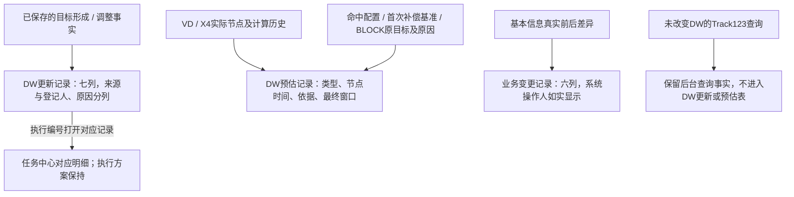

### 25.2.1 固定演示时间线

六条案例明确标记“演示”，由固定记录组成，不根据当前货件字段动态拼造历史。DW更新记录按目标展示真实形成或变化，主表字段见25.2；实际修改响应及正常查询事实分别关联对应目标，不因精简展示删除后台历史；保留人工登记人、时间及变更原因，关联任务与请求/响应使用当次快照。基本信息变更与DW记录分开保存；业务阶段和物流节点保持实际事实，运输同步执行过程在对应执行历史追溯。演示日期使用目的仓当地日期。

| 案例 | 演示货件 | 时间线与最终事实 |
| --- | --- | --- |
| 卡派全链路 | FBADEMO_CARD01 | 09-14 VD形成09-27～10-03；09-21 X4改为10-04～10-10；09-22运营李明因客户要求改回09-27～10-03，修改业务返回成功；10-02签收完成，完成后无DW修改。 |
| 快递跨周与人工纠正 | FBADEMO_EXP01 | 09-20卡派变快递派，当前快递单号EXP-DEMO-00变为EXP-DEMO-01；09-21预计送达2026-09-29形成2026-09-27～2026-10-03；09-22 08:00预计送达跨周到2026-10-13，系统更新为2026-10-11～2026-10-17；09-22 10:00运营王婷因预估误差人工纠正为2026-10-04～2026-10-10；09-23后续Track123查询仅保存查询事实，人工DW及来源保持不变，不新增DW更新；10-06签收完成。 |
| 人工BLOCK重新登记 | FBADEMO_BLOCK01 | 09-24人工目标09-27～10-03被BLOCK；09-25因预约调整重新登记10-04～10-10，终止旧目标监控，修改接口业务返回成功；当前仍转运中。 |
| 仓点变更后重新登记 | FBADEMO_FC01 | 09-22人工10-04～10-10修改接口业务返回成功；09-23 SMF3变为SBD1并Upsert成功，保留原人工目标；09-24运营王婷因海外仓安排重新登记10-11～10-17并按修改接口返回判断；当前仍转运中。 |
| 预估落当周改选下周 | FBADEMO_WEEK01 | 目的仓当地计算日期2026-10-07；VD节点2026-10-05＋配置2天＝2026-10-07，预计日期落在当前完整周2026-10-04～2026-10-10，因此不选当周，最终计划为下一完整周2026-10-11～2026-10-17；当前仅保存计划，未伪造修改调用或查询。 |
| 基本信息变更全场景 | FBADEMO_CHANGE01 | 五类基本信息变化集中展示，时间和最终值见下文；当前转运中、快递派，等待预计送达查询形成DW，不拼造DW更新或预估记录。 |

基本信息完整演示货件为FBADEMO_CHANGE01：2026-10-06 09:00卡派变快递派；09:15仓点SMF3变SBD1；09:30服务组合普船海卡变空派特快；09:45关联提单MAEU266711945变COSU6389753000；10:00当前快递单号CHANGE-EXP-01变CHANGE-EXP-02。五类真实变化集中在同一票，最终值与概览、提单、仓点及当前单号一致，操作人按系统MQ如实显示，不包含接口同步、节点推进或形成预估的执行过程。其他既有货件的历史继续保留。

演示货件沿用原货件列表及筛选入口，不设置独立演示区域或快捷链接。查看FBADEMO_EXP01、FBADEMO_CHANGE01时，尾程派送方式选择快递派或清空；查看已完成的FBADEMO_EXP01时，业务阶段选择已完成或清空；可同时按FBA货件号精确查询。默认卡派、收货中/转运中及逐票操作资格保持，已完成货件只能查看历史，不能登记DW。

预估演示：FBADEMO_WEEK01明确展示节点日期加配置天数得到的预计日期落在计算当周，按既有规则选择下一完整周，区别于缺配置的第2/第4未来周补偿；FBADEMO_CARD01命中VD/X4配置，按节点实际日期加14天归完整周；FBA1Z6C4K2MR的X4缺配置、FBA1H5R2V8JD的VD缺配置，首次补偿计算基准均为目的仓当地2026-10-06，排除2026-10-04～2026-10-10当前周，分别取第2个未来完整周2026-10-18～2026-10-24、第4个未来完整周2026-11-01～2026-11-07，不从节点发生日期计周。FBA1P8M6Y3KC演示X4原目标2026-10-04～2026-10-10被BLOCK，取晚于原目标的最近可选一周2026-10-11～2026-10-17，依据说明原目标及调整原因，结果只显示最终一周，不选连续两周。窗口统一完整显示为 `2026-10-11～2026-10-17` 格式。

已完成货件保留完成前全部历史，签收完成更新当前业务阶段和完成事实，不作为基本信息变更行，不再生成DW修改。DW原因与实际仓点变更分开保存，旧批次快照不随新目标改变。

DW提单主表展示提单号、提单状态、最新Amazon仓点、尾程派送方式、DW周窗口、仓点变更、FBA货件数及操作；不展示当前路由／实际出发、收货中、已收货、允许修改、DW异常五列。实际出发仍用于准入，提单号＋最新仓点＋尾程派送方式分组和逐票操作资格保持不变，删除展示列不删除后台统计及异常事实。

#### 首次初始化演示定位

| 场景 | 货件与运行记录 |
| --- | --- |
| 正常未来窗口直接接纳；后续查询不重复 | FBADEMO_INIT_NORMAL01为卡派、收货中，初次加载按默认查询即可看到，初始列表优先展示；RUN-INIT-NORMAL、RUN-INIT-NORMAL-AGAIN；来源Amazon初始DW，无DW修改编号 |
| 安全调整并后续查询成功 | FBADEMO_INIT_SAFETY01；RUN-INIT-SAFETY；EX-DEMO-INIT-SAFETY |
| 资格不允许仍沿用正常窗口 | FBADEMO_INIT_DENIED01；RUN-INIT-DENIED；无需DW修改 |
| 资格不允许保存安全目标，恢复后执行 | FBADEMO_INIT_SAFETYWAIT01；RUN-INIT-SAFETY-WAIT；可通过现有资格查询运行恢复并接续原安全目标 |
| 失败、缺完整窗口，等待下一次成功 | FBADEMO_INIT_PENDING01；RUN-INIT-FIRST-FAIL、RUN-INIT-INCOMPLETE；无虚假目标或修改编号 |
| 失败→缺窗口→完整成功 | FBADEMO_INIT_RECOVER01；RUN-INIT-RECOVER-FAIL、RUN-INIT-RECOVER-EMPTY、RUN-INIT-RECOVER-SUCCESS |
| 已有人工/有效预估目标不覆盖 | FBADEMO_INIT_KEEP_MANUAL01、FBADEMO_INIT_KEEP_VD01；原目标及来源保持，查询事实另存 |
| 首次取得过期窗口停止 | FBADEMO_INIT_EXPIRED01；RUN-INIT-EXPIRED；无初始化目标或修改执行 |

首次正常窗口案例FBADEMO_INIT_NORMAL01初次加载为卡派、收货中，默认可见并已沿用首次Amazon窗口，无需先运行任务；未修改则编号/状态/修改返回为“—”。初始化、8周快捷及更远周日历交互保持既有方案，不新增缓存清空或源码构建。

演示固定使用北京时间与ONT8的America/Los_Angeles当地口径：北京10-07 22:00对应当地10-07 07:00，北京10-08 06:00对应当地10-07 15:00。所有响应仅为模拟，不表示正式平台契约。查询原始返回保存在查询历史/运行明细，初始DW更新行不展示为修改返回。

#### 本版连贯模拟案例与关联

| 场景 | 货件 / 执行或运行编号 |
| --- | --- |
| 人工资格首试失败、恢复新编号成功 | FBADEMO_MERGE_QUAL_MANUAL；EX-MERGE-QUAL-MANUAL-FIRST / RESTORE；RUN-MERGE-QUAL-MANUAL |
| 完整快递目标资格恢复及重复去重 | FBADEMO_MERGE_QUAL_COURIER；EX-MERGE-QUAL-COURIER-FIRST / RESTORE；RUN-MERGE-QUAL-COURIER |
| 设置异常新人工首试、不重试 | FBADEMO_MERGE_SETTING_MANUAL；EX-MERGE-SETTING-MANUAL-FIRST |
| 设置异常仍查快递、新周首试、同周不重复 | FBADEMO_MERGE_SETTING_COURIER；EX-MERGE-SETTING-COURIER-NEW；RUN-MERGE-SETTING-EDD-NEW / SAME |
| 限流等待、同编号失败两次后成功 | EX-MERGE-RATE-WAIT；EX-MERGE-RATE-SUCCESS |
| 自动3次耗尽、人工一次不重置 | EX-MERGE-RATE-EXHAUST；EX-MERGE-MANUAL-RETRY |
| 明确运输缺失、补同步、原编号接续 | FBADEMO_MERGE_TRANSPORT；EX-MERGE-DW-TRANSPORT；EX-MERGE-TRANSPORT-SYNC |
| BLOCK监控成功及截止终止 | EX-MERGE-BLOCK-SUCCESS；EX-MERGE-BLOCK-CUTOFF；RUN-MERGE-BLOCK-RECOVER |
| 人工替换旧目标 | FBADEMO_MERGE_REPLACE；EX-MERGE-REPLACE-OLD / NEW |
| 修改成功无即时回查、旧平台窗口 | FBADEMO_MERGE_SUCCESS_OLD_WINDOW；EX-MERGE-SUCCESS-OLD-WINDOW |
| 后续正常查询更新平台窗口 | FBADEMO_MERGE_NO_VERIFY；EX-MERGE-NO-VERIFY；RUN-MERGE-QUERY-LATER |
| 对账查询失败、不创建DW失败 | FBADEMO_MERGE_RECONCILE_QUERY_FAIL；RUN-MERGE-RECONCILE-FAIL |
| 历史失败、终止及多次失败逐行导出 | EX-MERGE-RATE-SUCCESS / RATE-EXHAUST / MANUAL-RETRY / REPLACE-OLD / BLOCK-CUTOFF：按原历史日期和失败条件取得各次返回 |

验收：首试有真实模拟调用且不以本地资格跳过；恢复新编号可追溯原失败；相同资格变化/目标不重复；没有即时GetChoice；平台当前值仅查询更新；BLOCK/运输接续原编号；停止依据与原始返回分开；13列CSV按同次历史时间、状态、返回取数，未选失败不自动只导失败。初始化及已确认UI交互继续保持。以上仅原型模拟，不代表正式错误码、接口或后台实现。

### 25.3 DW提单列表与仓点变更

#### 行内自动保存与登记范围

行内操作取当前“提单号＋最新仓点＋尾程派送方式”组合，逐FBA去重；批量DW弹窗与批量仓点变更入口继续保留。操作列固定两行：第一行“选择DW周窗口、变更原因（选填）”；第二行“选择新仓点、计划仓点数据来源”。四个控件直接常驻主列表，采用紧凑布局，不使用单行独立弹窗或保存、确认按钮。DW周窗口列只展示当前值，不一致显示“多个窗口”，无目标显示“—”。周窗口下拉保持完整日期2026-10-11～2026-10-17，仅提供当周及未来7周；仅选择“选择更远周”打开周日到周六日历。展开、搜索和辅助信息输入不保存。默认排序卡派在前、快递派在后，同方式仓点A→Z，同仓点按提单实际出发时间由近到远，同时间按提单号升序。

登记前按既有逐票规则计算可登记/排除数量，无可登记票禁用。已完成、Amazon当前窗口过期、目标周已过去或DW处理结束的票排除；资格不允许或设置异常的新人工目标保存登记事实并实际首试，失败按11.1处理，不解除常规停止控制。一次组合登记使用一个登记批次，重复事件不重复登记。另选一周为新人工登记，保留旧历史，使旧目标未执行事项失效；计划保存成功不等于Amazon修改成功。

原因下拉非必填，分类沿用10.6。需要原因时先选择原因，再选择DW周窗口；“其他”在行内展开非必填说明框。原因和说明仅暂存，选择周窗口后将当时原因及说明一起自动保存，未填留空。保存后不可补填或修改本次原因；成功清空本行原因、说明及选择草稿，后续输入仅用于下一次登记。另选不同周形成新登记，按原目标替换、逐票资格及历史规则处理。

仓点列展示当前值；新仓点控件直接位于操作列第二行，使用可搜索下拉，搜索输入置于下拉内，不设独立搜索框。计划仓点数据来源必填，沿用智能转仓结果SMART_REROUTE、面单扫描LABEL_SCAN、卖家指定SELLER、Amazon Freight转仓AF_REROUTE、SEND转仓SEND_REROUTE，无默认值。先选择来源再选择新仓点；未选来源禁用新仓点。选中后两者一起自动保存，不允许保存后补填或修改来源；成功清空来源及选择草稿，下一次重新选择。正式来源值同时保存到货件业务变更历史和模拟运输同步报文，不以操作位置文案替代。按当前组合逐FBA处理，排除已完成；新旧相同不写变更或同步。保存时间、字段、原值、新值、来源、操作人，不改客户原始下单信息；按最新仓点重新归组排序、相同组合合并，排除票留原组，再次有效变化独立留历史。

Amazon运输报文有效内容变化且资料完整才同步；缺数据沿用停止旧失败内容重试、补齐后处理。同FBA运输同步串行，未执行旧内容失效；已经实际发出的请求无法撤回，旧响应不覆盖最新本地仓点，之后同步最新报文。仓点变化不重新预估或覆盖人工DW，等待运营再登记。

行内自动保存期间禁用该行全部相关写入，防止重复或交叉提交，不锁整个列表。成功只给简短提示，结束本次上下文；保存失败保留本次选择、原因/说明或来源草稿，可重新选择或点击“重新操作”，不显示成功。仓点变化归组后旧行上下文结束，不向旧组合继续提交，不修改已保存历史。批量操作原弹窗及逐票范围规则不变。

#### 人工目标首次尝试及资格恢复

人工登记保留原计划、人/时间/原因/批次，有效新目标先实际尝试一次，不以最近资格不允许直接跳过。实际资格失败保留旧编号和原始返回；既有正常查询由不允许变为允许，且目标/映射/运输/停止/并发条件均有效时新建恢复编号，关联旧失败。相同恢复变化只创建一次；恢复再失败需等待下一次真实否→是变化。查询失败或未知不制造变化，不新增查询或自动任务。登记行关联最新执行，旧失败仍可追溯。

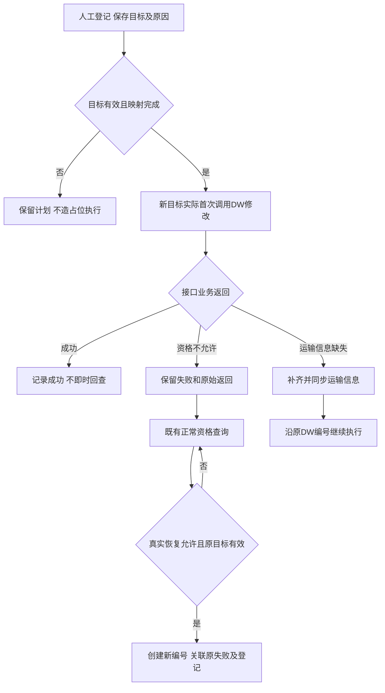

#### 本轮复核演示定位

| 演示 | 位置与记录 |
| --- | --- |
| 资格恢复自动成功 | FBADEMO_QUALRECOVER01；REG-DEMO-QUAL-RECOVER；RUN-DEMO-QUAL-RECOVER；EX-DEMO-QUAL-RECOVER。北京时间10-07 21:30登记、22:00不允许、10-08 06:00定时查询允许、06:01后续正常查询一致，对应ONT8当地10-07 06:30、07:00、15:00、15:01，沿用当地07:00/15:00查询时刻。 |
| 待资格恢复交互 | FBADEMO_QUALWAIT01，REG-DEMO-QUAL-WAIT；自动任务资格查询执行一次后，正常查询允许，原目标自动接续；人工补跑只描述运行方式。 |
| 当前组合多窗口、立即保存、包含完成票 | 提单DEMOINLINE261008＋ONT8＋卡派；FBADEMO_INLINE01/02及FBADEMO_INLINE_COMPLETE01，两个不同目标，完成票排除；可选择周窗口查看同批次逐票登记。 |
| 原因先填及留空登记 | DEMOINLINE261008组合，先选原因再选DW或原因空白直接选DW；“其他”行内说明随登记保存。成功清空草稿，后续原因只用于下一笔；FBADEMO_REASON01展示登记时原因，不提供后补。 |
| 仓点来源必填及重新归组 | DEMOINLINE261008；来源为空时不可选新仓点，选择来源后选新仓点立即保存，历史与运输报文来源一致。FBADEMO_INLINEFC01保留ONT8→LGB8→SMF3历史；再次变更重新选来源，归组并关闭旧上下文。 |
| 保存失败与重新操作 | DEMOFAIL261008＋LGB8＋卡派，FBADEMO_INLINEFAIL01；本地首次自动保存模拟失败，数据不变，保留输入并支持重新操作。 |

所有返回和保存失败均为明确的本地演示；本方案定义后台接续、串行与日志建设要求，不宣称真实接口或调度已开发。

登记仓点变更只调整实际计划派送仓点，不改写客户原始下单信息。逐票在业务变更记录保存变更时间、字段、原值、新值、来源和操作人；没有真实值变化不写记录。页面不增加客户下单仓点/当前派送仓点两套字段，沿用提单已有变更前信息。按最新仓点重新归组三维组合，人工DW目标不因换仓点重新预估或覆盖。业务变更记录写我方字段变化，运输执行记录写实际接口调用过程。

只展示存在实际出发时间或已确认出发事件的提单，按“提单号+最新仓点+尾程派送方式”组合汇总。同一提单、同一仓点下卡派与快递派分别成行，关联货件数量及其他统计分别计算。仓点或尾程派送方式变化后按最新值重新归组，不增加快递单号作为分组维度。批量登记DW和仓点变更按所选三维分组取货件，保留逐票资格判断；货件与提单共享同一数据来源。

查询为提单号独立多值、仓点多选、尾程派送方式多选（卡派、快递派，默认卡派）、真实提单状态及出发日期区间。尾程方式无“全部”选项，清空表示不限，重置恢复卡派；初始列表实际应用默认卡派。条件内任选命中、不同条件同时满足；沿用紧凑布局及展开/收起，点击查询自动收起。列表展示尾程派送方式及提单状态。提单状态查询仅提供[舱单管理下的舱位管理原型](../../demo/员工端-demo/舱位管理.html)整提单 `spaces.status` 中与已出发提单相符的已出发、已到站、已清关、已完成；不提供待配载、配载中、已配载、已装柜、已作废，不新增状态枚举。清空或重置状态只放开已出发范围内的状态限制，不突破存在实际出发时间或已确认出发事件的准入。状态由提单主数据/业务状态变更事实提供，同提单各三维拆分行保持一致，不从分组内货件阶段、签收情况或异常数量推算。演示使用单独的整提单状态快照，不声明已经接入生产主数据。

提单状态替换原混合业务状态分类；删除“存在DW异常”筛选及对应筛选逻辑，不新增仅看异常、异常数量跳转或异常专用弹窗。保留原异常数量和具体异常信息，货件列表、详情、任务中心、异常导出继续展示实际原因。FBA数量、业务数量、“允许修改”数量等仍分别按组计算。提单状态不代替货件操作资格，登记DW和仓点变更继续逐票判断。

混合组合包含已完成/窗口过期/正常货件时，支持选组合；行内控件按各动作逐票判断并禁用无可处理票的动作，批量弹窗按逐票动作范围勾选，禁用不符合对应操作的货件。DW登记和仓点变更分别判断，不能共用资格：
- DW登记：未完成且Amazon窗口未过期；设置异常/卖家管理允许新人工目标首次实际尝试。
- 必要仓点登记和Upsert：按运输业务要求；未完成的设置异常/窗口过期货件仍可同步，不因此恢复DW。
- 全部已完成组合仍可查看，不能批量登记DW；本期仓点变更也不对已完成货件执行。

同一新仓点批量登记：保留原仓点、新仓点及来源；新旧相同的票排除，不生成同步任务。保存后留在原提单列表，重新归组并按有效报文变化及资料完整性逐FBA创建运输同步；保存不等于Upsert成功。无回包不能显示成功，部分失败逐票查看。

已有人工DW的货件换仓点后不重算、不覆盖、不重新处理旧VD/X4，等待运营再登记。卡派改快递派另按Track123现有批次查询并记录历史；已有人工DW时不覆盖、不重新提交人工目标，不在仓点弹窗即时重估；业务MQ必须带当前快递单号及关联版本。

### 25.3.1 查询与分组数据流

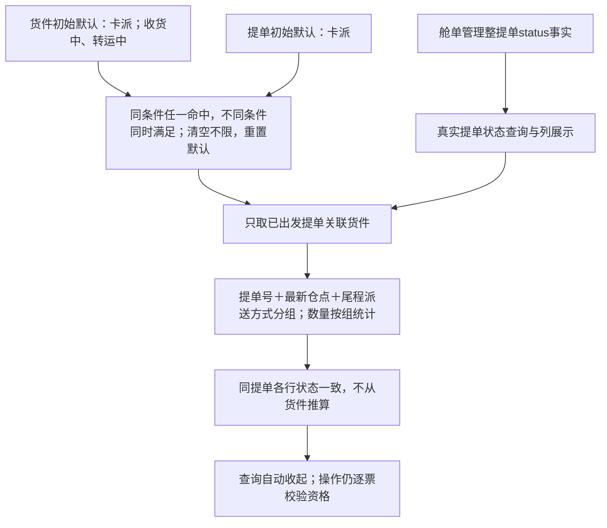

周六固定演示均按SMF3当地2026-10-03（周六）：RUN-SATURDAY-SCHEDULED定时运行，FBADEMO_SATURDAY01将10-04～10-10顺延至10-11～10-17，DW来源周六延期，更新行、执行编号与后续正常查询一致；FBADEMO_SATURDAY_EXCLUDE01当地当日08:30已人工登记，运行明细排除、不创建延期事项；RUN-SATURDAY-SAME-WEEK当地17:00再次检查同业务周2026-09-27，排除重复延期；RUN-SATURDAY-MANUAL当地21:00由Admin人工执行，FBADEMO_SATURDAY_MANUAL01来源仍为周六延期，首次历史人工补跑。当前人工BLOCK、当周目标、结束与资格条件沿用既有规则。

BT-AMZ-UP-260927-0176为首次运输同步，来源首次映射完成，展开历史行查看明确的模拟UpsertTransportationInfo请求与原始响应，不标成业务字段变更；没有保存的历史时间仍显示未记录。

演示关联：FBADEMO_TRANSPORT01保留首次缺提单同步失败与补齐后新完整内容同步成功；FBADEMO_TRANSPORT_WAIT01调用前缺关联提单与运输字段，概览列缺项、不建同步占位；FBADEMO_DW_TRANSPORT01保留DW失败、关联运输同步及原DW编号后续查询成功；FBADEMO_QUERY_FAIL01查询失败但无DW修改，在快递自动运行明细与统一异常导出可查。所有原始返回明确为模拟数据，历史逐次保留。

### 25.4 任务中心、通知和智能转仓

任务中心三个页签、主表、查询、执行明细及成功标准见11.2；重试唯一口径见11.1；九项自动任务及当地时刻见21.4。主表无操作列、下方无重复批次区域，历史请求响应归入各次执行明细，系统暂停/停止说明与返回结果分开。

登记及运行批次保存当时逐票范围、目标、登记时间和原因，不随当前值覆盖；所有允许保存票保留DW登记历史，新人工目标按首次实际尝试规则创建执行，基础映射未完成不造占位；资格失败恢复时使用新执行编号并关联原失败及登记批次。编号链接可在执行列表定位并返回货件；旧内容失效停止重放，历史失败继续保存。

客户跟进沿用原二期方案，保留人工DW、登记时间、发送内容及反馈历史；设置异常、窗口过期只登记后续安排或结束，不提供恢复，不改写已发送快照。

Smart Reroute（二期）菜单及四步、Offer、备案物流仓交互保持，SCAC默认GUHD、物流仓编号与Amazon FC区分；原FC、distance契约仍按18章核实，演示不代表正式平台契约。服务渠道配置、VD/X4时效及保存校验按9.2保留。

本节行内登记及资格恢复验收见第16章第33项。

## 26. 完整执行记录与错误原因建设要求

### 26.1 登记、执行历史、接口与计算关联

运行批次保存发起方式（定时执行/人工执行）、发起人（系统/当前操作人）及运行时间，原型在运行明细展示，执行主表不加两列，点击批次号可查看对应运行信息。人工点击执行一次后实际形成执行事项，其首次历史方式为人工补跑；后续尝试为自动或人工重试。周六补跑的业务来源仍是周六延期。无符合条件货件只保存批次及逐票排除，不造占位执行记录。

已核对现有头程数据设计：只有实体最后操作人operator，未发现Amazon运行批次发起方式、发起人Schema；不能把最后操作人字段当作已实现的批次发起信息。本段为运行日志建设要求，原型仅模拟保存，不声明新增数据库、接口或调度已开发。

| 记录 | 保存粒度及关联 | 边界 |
| --- | --- | --- |
| DW登记批次及逐票计划 | 一次集中操作一个批次，FBA去重；允许保存均留目标、时间、原因及原批次，禁止登记留排除明细 | 缺前置/资格不创建占位执行；后续符合关联原登记批次 |
| 自动运行批次 | 任务类型、当地业务日期/时段及运行批次，保存检查、符合、实际执行数量与逐票原因 | 扫描完成不等于每票执行或接口成功 |
| 执行事项及逐次历史 | 一个FBA一次明确事项一个执行编号；首次及重试沿用编号，历史保存触发、起止、结果、返回、当次接口引用 | 新目标、新内容、下一正常查询另建记录；不设运营父/子/事项编号 |
| 真实接口调用与关联 | 一次调用一份请求响应，明细关联多FBA/多执行历史；保留HTTP、平台码、请求、响应和逐项结果 | 不复制同一批量调用，不以HTTP成功代替本票成功 |
| 预估及业务异常事实 | 独立保存VD/X4事件、计算输入及目标；逐单号EDD和整票完整性；错误/资格/停止事实及发现记录 | 无实际DW变化不造更新行，历史与当前异常分开，不从当前字段拼造历史 |

昵称、运单、提单、仓点与目标在执行形成时保存快照。后台保存五种执行状态、终止依据、错误控制类别、重试次数/时间、目标及内容有效性、资格成功变化和恢复去重关联、原新执行关联；目标来源/触发来源/执行方式分开。一次真实请求响应仅保存一份，通过历史关联多个FBA。生产字段、迁移、正式接口编码及调度尚无实施依据，不宣称已落库。

### 26.2 异常事实、FALSE与历史保留

后台识别及重试控制见11.1，历史CSV取数见11.3。货件、自动运行明细继续保存资格、计算、查询及异常原始事实，不增加运营错误分类。资格查询成功返回不允许不是查询接口失败；人工BLOCK查询成功不等于DW修改成功。

失败后成功、内容替换、货件完成均不删除过去失败；当前未解除异常另存，不混为同次历史。重复消息及相同有效内容去重；参数未修正、内容失效或次数耗尽不得通过扫描新建相同事项重置限制。

### 26.3 后台读取及性能

定时任务启动时按21章本地事实过滤，使用任务类型的分批查询；不提前打“参加某任务”标签。映射完成通过当前箱/追踪清单每项结果判断，运输同步通过当前报文摘要等于成功摘要判断，不假设货件已有一个万能“upsert成功”布尔标识。

扫描获取ID和必要筛选事实，按稳定主键游标分批；队列消费者在实际调用前再检查当前本地状态和版本。批次时刻不要求先加载所有货件才开始执行，读取一批即可入队；同票串行、去重与平台限流独立控制。读取批量大小及索引由实际数据量压测确定，不在产品中承诺固定扫描耗时。

“资格未知”进入07:00/15:00监控范围；失败受控重试，不因为手工保存目标再生成额外资格校验任务。扫描、本地执行检查与网络查询三者分别记录，避免把本地判断写成多次GetChoice请求。

### 26.4 自检验收

1. 当前映射新增一个未成功箱，旧映射成功不能放行；运输报文变化后旧成功摘要不能放行新DW提交。
2. 人工BLOCK可被新人工计划替换，但周六延期排除当前人工BLOCK；普通历史人工来源若满足条件可周六延期。
3. 当地周六当天人工登记即使未提交也排除延期；三个周六批次同票同业务周仅生成一次延期目标。
4. 资格、对账、BLOCK每日各两批；前批成功不能误挡后批，仍在途不得并发。人工提交没有额外资格查询。
5. 当地2026-10-06当前周10-04～10-10不计；X4第2周10-18～10-24、VD第4周11-01～11-07；重试跨周不重算基准。
6. DW更新行按固定执行编号核对同FBA同目标：主表九个字段顺序一致，状态与原始返回逐值匹配执行明细、无返回显示“—”、长返回展开；其他资格/运输/目标的结果不能串入。同一人工目标BLOCK后监控和重试编号不变、历史不被成功覆盖，仅窗口可选不得显示DW修改成功；新人工登记的新旧编号及更新行分别保留，模拟返回明确标识。人工BLOCK不换周；自动预估BLOCK只选晚于目标的可选一周，不选择连续两周。没有可选结果时记录等待/异常，不声称成功。
7. 设置异常不可恢复但Track123继续、新人工/完整快递目标按首试规则；Amazon窗口过期/业务完成禁止DW登记，必要Upsert独立。
8. 人工保存后的仓点变化不重新预估；卡派改快递派等待Track123，MQ缺号等待；整票多号EDD缺一项不修改DW。
9. 人工登记更新当前目标，不覆盖旧VD/X4记录；没有历史明细不拼造；接口日志只来自真实调用。
10. 13列执行历史导出验收人工DW失败、周六DW失败、运输失败及先失败后成功，按同次历史状态/时间/返回筛选；VD/X4计算、EDD、对账查询异常与资格FALSE留运行记录及既有异常取数，不混入四类CSV。FALSE不标查询失败，不虚构编号。
11. 四处紧凑查询和折叠交互一致；仓点可搜索多选；保存后不跳任务中心；混合组合逐票限制正确；Smart Reroute二期完整可见。
12. 自动任务顶部无时区/筛选；执行一次无输入、按各仓点日期过滤全范围，不绕过结束、去重及重试限制。

### 26.5 本次自检结论与实现边界

本次已统一页面和后台术语，删除旧的“仅失败接口导出”“五页签”“指定范围补跑”“每次提交重新查询资格”等冲突说明。第21章为后台精确过滤主规则，第25章为页面交互，第26章为执行历史和导出数据要求；三者分别约束执行、展示和取数，不能互相替代。

产品原型仅演示交互，不代表生产MQ、Track123、Amazon调用、自动调度或完整执行历史已经开发。正式开发须按本章建设统一记录后才能实现全量历史导出。外部契约待核实事项仍集中于18章，不新增VD/X4修正撤销、解除设置异常或窗口过期恢复流程。

## 27. Amazon模块的唯一文档依据与本地纳入规则

本方案是Amazon模块业务规则、流程、页面交互、数据保存要求及验收的唯一依据。原样纳入用户本地仓库，保留完整正文和流程图；不拆分重写到既有产品文档与数据设计，不复制规则形成第二套正文。

| 文档 | 职责 | 本次处理 |
| --- | --- | --- |
| 本Amazon方案 | 模块规则、流程、交互、验收和数据建设要求的唯一依据 | 原样保存完整文件，建立稳定引用路径，更新时替换同一路径 |
| 仓库原产品文档 | 全系统产品目录和其他模块说明 | 在头程管理/Amazon管理下加简短模块说明、菜单层级及相对链接；已有重复Amazon规则改为引用 |
| 仓库原数据设计 | 已确定或实际落库的表、字段、关联和约束 | 加Amazon方案第6、21、26章链接；仅保留或补充有真实实施依据的实现细节，不抄写业务规则，不虚构已经落库 |

方案中的数据模型作为建设要求继续完整保留，不删除或迁移。数据设计回答实际“具体怎么存”，方案回答“需要保存什么、业务如何执行”；尚未确定的落库细节不能被Codex改写成既成事实。本次纳入不要求开发真实接口、后台任务或数据库迁移。

本地只维护一个当前有效的Amazon方案，建议使用不含版本号的稳定文件路径；文件正文保留版本号，历史由Git或既有版本机制管理。旧版本如需留档不得在导航中作为另一份当前方案并列。

以后Amazon变更先更新本方案；只有真实表、字段或约束变化才同步数据设计对应实现细节，并引用方案规则。原产品文档通常只维护链接和模块入口。文档链接使用仓库相对路径，不能指向临时下载目录或在线演示替代正式规则。

菜单按25.0：头程管理→Amazon管理→DW货件列表、DW提单列表、Amazon任务中心、Smart Reroute（二期）。完整原型保留二期功能；分期以本方案开头为准。

### 27.1 图文一致性要求

完整保留本方案Mermaid流程和关系图，不拆走、重新表述或再画一份含不同规则的副本。仓库文档站需支持这些图的正确渲染；如暂不支持，补渲染适配，不改业务内容以迁就展示。

核对：初始化与后续提交分开；人工BLOCK不换周；周六排除当天人工和人工BLOCK；不可恢复无恢复分支；必要运输Upsert独立；本地过滤不新增参与标记或提交前资格查询；扫描、计算、网络调用和资格FALSE分别记录。

若发现现有仓库文档、实现或原型与本方案冲突，列明位置及影响，不自行折中修改本方案。清理被本方案替代的原文时只处理Amazon重复内容，保留其他模块。

### 27.2 v2.24运输补同步演示补充

新增FBADEMO_MERGE_SAFETY_TRANSPORT：首次收货安全调整的DW修改返回明确运输信息缺失，运输同步来源为“DW修改失败补同步”；其独立编号与原DW编号互相关联，补同步成功后原DW编号继续执行并成功，保留首次失败。该案例仅为模拟，不改变官方接口返回契约。现有人工登记补同步案例同步使用新来源；仓点MQ、首次映射和定时补偿案例保持各自真实场景来源。
