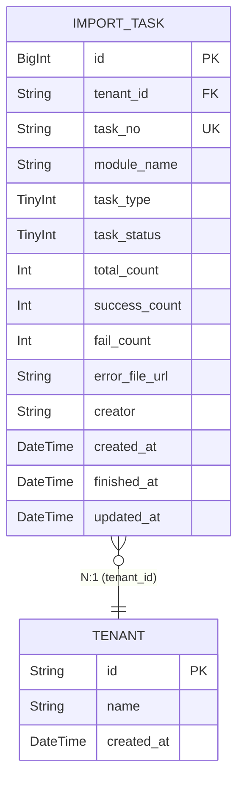

# 数据设计 — 后台任务

> **文档版本**: v1.0 | **日期**: 2026-08-28 | **作者**: AI PM
> **上游文档**: [2026-08-28-用户需求.md](./2026-08-28-用户需求.md)

---

## 一、实体清单 x 表映射

| 实体名称 | 对应表/子表 | 映射方式 | 说明 |
|----------|------------|---------|------|
| ImportTask | `import_task` | 独立表 | 导入任务，公共模块，各子应用导入任务统一记录 |
| Tenant/User | `tenant` / `user` | 外部引用 | 货主租户和用户数据，不在本模块管理 |

---

## 二、逐表字段清单

### 2.1 导入任务表

**表名**: `import_task` | **对应实体**: ImportTask

> **设计说明**: 公共导入任务监控表。各子应用模块发起导入时写入任务记录，导入完成后更新任务状态和结果。任务编号 EXP + 年月日 + 时间戳（精确到毫秒）保证全局唯一。错误数据通过 error_file_url 指向错误结果文件。

| 字段名 (En) | 字段名 (Cn) | 类型 (Type) | 必填 | 约束/索引 | 枚举/备注 |
|:---|:---|:---|:---|:---|:---|
| `id` | 主键 | BigInt | Yes | **PK** | 雪花ID |
| `tenant_id` | 租户ID | String(32) | Yes | **Index** | SaaS数据隔离，货主端按此过滤 |
| `task_no` | 任务编号 | String(32) | Yes | **Unique** | EXP + 年月日 + 时间戳，全局唯一 |
| `module_name` | 模块名称 | String(50) | Yes | — | 各菜单名，如"商品管理""地址管理" |
| `task_type` | 任务类型 | TinyInt | Yes | — | 10:导入 |
| `task_status` | 任务状态 | TinyInt | Yes | **Index** | 10:处理中, 20:完成 |
| `total_count` | 导入总数 | Int | Yes | — | 默认0 |
| `success_count` | 成功数 | Int | Yes | — | 默认0 |
| `fail_count` | 失败数 | Int | Yes | — | 默认0 |
| `error_file_url` | 错误文件URL | String(512) | No | — | 仅 fail_count > 0 时有值 |
| `creator` | 创建人 | String(64) | Yes | — | 员工端=本公司员工姓名；货主端=客户公司名称 |
| `created_at` | 创建时间 | DateTime | Yes | **Index** | 任务开始时间 |
| `finished_at` | 完成时间 | DateTime | No | — | 任务完成时间，处理中为空 |
| `updated_at` | 更新时间 | DateTime | Yes | — | 自动维护 |

**关联关系**:
- `Many-to-One` with `tenant` (通过 `tenant_id`)

---

## 三、ER 关系图



---

## 四、关键设计说明

### 任务编号生成规则
- 格式：`EXP` + `YYYYMMDD` + `时间戳(毫秒)`，如 `EXP20260828143052123`
- 全局唯一，时间戳精确到毫秒避免并发冲突

### 状态说明
- 任务状态仅两态：处理中(10) / 完成(20)
- 只要导入流程结束（无论是否有失败数据），状态即为"完成"
- 失败信息通过 fail_count 和 error_file_url 承载，不单独设"部分失败"状态

### 任务结果展示
- 由 total_count / success_count / fail_count 拼接展示："导入X条，失败Y条，成功Z条"

### 数据隔离
- 员工端：不过滤 tenant_id，查看所有任务
- 货主端：按 tenant_id 过滤，仅查看本租户任务

---

## 五、枚举字典

**任务类型 (import_task.task_type)**：
| 值 | 常量名 | 中文 | 说明 |
|----|--------|------|------|
| 10 | IMPORT | 导入 | 当前唯一类型，导出暂不监控 |

**任务状态 (import_task.task_status)**：
| 值 | 常量名 | 中文 | 说明 |
|----|--------|------|------|
| 10 | PROCESSING | 处理中 | 任务进行中 |
| 20 | COMPLETED | 完成 | 导入流程结束（无论是否有失败数据） |

---

## 六、状态机

### 6.1 导入任务状态流转

```
[处理中(10)] ──{导入流程结束}──> [完成(20)]
```

| 当前状态 | 操作 | 目标状态 | 触发角色 | 校验条件 |
|---------|------|---------|---------|---------|
| (新建) | 发起导入 | 处理中(10) | 系统 | — |
| 处理中(10) | 导入完成 | 完成(20) | 系统 | 导入流程结束（无论是否有失败数据） |

> **说明**：状态仅单向流转（处理中→完成），不支持回退。失败数据通过 fail_count + error_file_url 承载，不影响任务状态。

---
