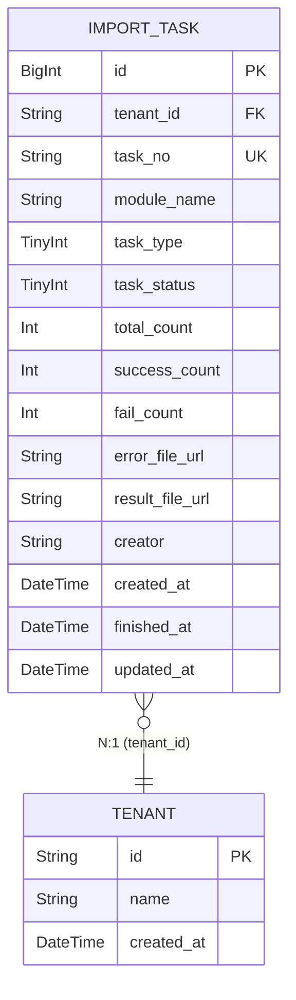

# 数据设计 — 后台任务

> **文档版本**: v1.1 | **日期**: 2026-09-16 | **作者**: AI PM
> **上游文档**: [2026-09-16-用户需求.md](./2026-09-16-用户需求.md)

---

## 一、实体清单 x 表映射

| 实体名称 | 对应表/子表 | 映射方式 | 说明 |
|----------|------------|---------|------|
| ImportTask | `import_task` | 独立表 | **任务**（导入 + 导出），公共模块，各子应用任务统一记录 —— **导出任务由财务「账单导出」写入** |
| Tenant/User | `tenant` / `user` | 外部引用 | 货主租户和用户数据，不在本模块管理 |

---

## 二、逐表字段清单

> 字段业务含义与需求背景见 RDD；页面校验规则与交互见 PRD。本 Schema 是字段结构（类型/约束/枚举值）的唯一权威。

### 2.1 导入任务表

**表名**: `import_task` | **对应实体**: ImportTask

> **设计说明**: 公共任务监控表（**导入 + 导出**）。导入：各子应用模块发起导入时写入任务记录，导入完成后更新状态和结果，错误数据通过 `error_file_url` 指向错误结果文件。导出：财务「账单管理 → 已发送 → 导出」提交时写入（`task_type = 20`），完成后 `result_file_url` 指向打包结果文件（**一个 zip，内含 N 个账单 Excel**；只导出 1 张时直出 xlsx）。任务编号 EXP + 年月日 + 时间戳（精确到毫秒）保证全局唯一，两类任务共用。

| 字段名 (En) | 字段名 (Cn) | 类型 (Type) | 必填 | 约束/索引 | 枚举/备注 |
|:---|:---|:---|:---|:---|:---|
| `id` | 主键 | BigInt | Yes | **PK** | 雪花ID |
| `tenant_id` | 租户ID | String(32) | Yes | **Index** | SaaS数据隔离，货主端按此过滤 |
| `task_no` | 任务编号 | String(32) | Yes | **Unique** | EXP + 年月日 + 时间戳，全局唯一 |
| `module_name` | 模块名称 | String(50) | Yes | — | 各菜单名，如"商品管理""地址管理" |
| `task_type` | 任务类型 | TinyInt | Yes | **Index** | 10:导入 / **20:导出**（导出只在员工端展示） |
| `task_status` | 任务状态 | TinyInt | Yes | **Index** | 10:处理中, 20:完成 |
| `total_count` | 总数 | Int | Yes | — | 默认0；导入 = 导入条数，**导出 = 账单张数** |
| `success_count` | 成功数 | Int | Yes | — | 默认0 |
| `fail_count` | 失败数 | Int | Yes | — | 默认0 |
| `error_file_url` | 错误文件URL | String(512) | No | — | 仅**导入**任务且 `fail_count > 0` 时有值 |
| `result_file_url` | **结果文件URL** | String(512) | No | — | 仅**导出**任务完成时有值（**一个 zip，内含 N 个账单 Excel**；1 张时直出 xlsx）；与 `error_file_url` 互斥使用。**物理文件保留 7 天**（任务记录长期保留）—— 过期清理后本字段置空或保留 URL 但下载返回 400 |
| `creator` | 创建人 | String(64) | Yes | — | 员工端=本公司员工姓名；货主端=客户公司名称；**导出任务 = 提交导出的财务专员** |
| `created_at` | 创建时间 | DateTime | Yes | **Index** | 任务开始时间 |
| `finished_at` | 完成时间 | DateTime | No | — | 任务完成时间，处理中为空 |
| `updated_at` | 更新时间 | DateTime | Yes | — | 自动维护 |

**关联关系**:
- `Many-to-One` with `tenant` (通过 `tenant_id`)

---

## 三、ER 关系图



---

## 四、建模约定（表结构设计理由）

- **单表承载导入 + 导出**：两类任务共用 `import_task` 一张表（`task_type` 区分），导出任务由财务「账单导出」写入，**不新增任何业务表**（导出范围与结果文件都挂在 `total_count` / `result_file_url` 上）。
- **不设「部分失败」状态**：任务状态仅「处理中 / 完成」两态，失败信息通过 `fail_count` + 文件字段承载（导入落 `error_file_url`，导出落 `result_file_url`）。
- **`task_no` 建 Unique 索引**：编号时间戳精确到毫秒，保证全局唯一、避免并发冲突。

> 任务编号生成规则、状态判定、结果展示文案、数据隔离的业务规则见 PRD §6（R01 / R03 / R04 / R06 / R08）。

---

## 五、枚举字典

**任务类型 (import_task.task_type)**：
| 值 | 常量名 | 中文 | 说明 |
|----|--------|------|------|
| 10 | IMPORT | 导入 | — |
| 20 | EXPORT | 导出 | 财务「账单导出」发起；**只在员工端展示**，结果文件打包下载 |

**任务状态 (import_task.task_status)**：
| 值 | 常量名 | 中文 | 说明 |
|----|--------|------|------|
| 10 | PROCESSING | 处理中 | 任务进行中 |
| 20 | COMPLETED | 完成 | 导入：流程结束（无论是否有失败数据）；导出：全部账单处理完毕 |

---

## 六、状态机

### 6.1 任务状态流转（导入 / 导出共用）

```
[处理中(10)] ──{导入流程结束}──> [完成(20)]
```

| 当前状态 | 操作 | 目标状态 | 触发角色 | 校验条件 |
|---------|------|---------|---------|---------|
| (新建) | 发起任务（导入 / 导出） | 处理中(10) | 系统 / 财务提交导出 | — |
| 处理中(10) | 任务处理结束 | 完成(20) | 系统 | 导入：流程结束；导出：成功 + 失败 = 总数 |

> **说明**：状态仅单向流转（处理中→完成），不支持回退，**导入与导出共用**。失败数据通过 `fail_count` + 文件字段承载，不影响任务状态。**导出不新增任何业务表** —— 导出范围（财务账单管理的查询结果）与结果文件都挂在任务的 `total_count` / `result_file_url` 上。

---
