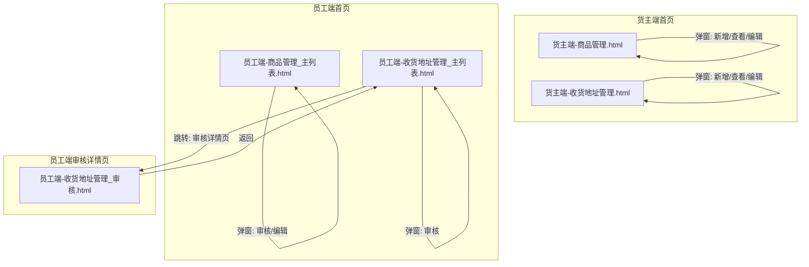

# 产品需求文档 (PRD) — 基础资料

---

## 0. 文档基础信息

- **文档标题**：基础资料模块
- **版本号**：v2.1
- **状态**：草稿
- **作者**：AI PM
- **评审人**：产品/研发/测试/业务代表
- **计划里程碑**：评审 TBD / 提测 TBD / 上线 TBD

### 0.1 变更记录

| 版本 | 变更日期 | 变更内容 | 变更人 |
|------|---------|---------|--------|
| v1.0 | 2026-06-06 | 初稿，基于 Demo 反向生成 | AI PM |
| v2.0 | 2026-06-06 | 基于 Excel 需求输入完整重写：产品重量改为必填、地址唯一性约束、货主端子账户共享、5分区表单结构、二期标识 | AI PM |
| v2.1 | 2026-06-06 | 三源融合（Demo+Excel+Drafts）：补充 default_currency 字段、添加 weight/地址按钮/预警/员工编辑 4 处 Demo 与 Excel 不一致标注 | AI PM |

### 0.2 关联链接

- 用户需求(RDD)：`drafts/基础资料/2026-06-06-用户需求.md`
- 数据设计：`drafts/基础资料/2026-06-06-数据设计.md`
- 需求背景：无（本模块基于Excel需求输入）
- 原型：
  - 员工端-商品管理_主列表.html
  - 员工端-收货地址管理_主列表.html
  - 员工端-收货地址管理_审核.html
  - 货主端-商品管理.html
  - 货主端-收货地址管理.html

### 0.3 评审记录

| 日期 | 参会人 | 主要问题/结论 | 待办 |
|------|--------|-------------|------|

---

## 1. 需求定义

### 1.1 背景与现状

跨境物流TMS处于0-1建设阶段。当前货主的商品资料（SKU、HS编码、申报单价、重量）和收货地址依赖邮件/微信传递，员工需人工逐单沟通确认。信息缺失导致报关退回、妥投失败等问题频发。需要搭建基础资料模块实现：货主端自助录入和维护，员工端统一审核管理。

### 1.2 目标与成功口径

- **目标**：搭建商品管理和收货地址管理的完整CRUD+审核链路，货主可自助提交资料，员工可集中审核
- **成功口径**：货主提交商品/地址后24小时内完成审核的比例 > 90%（数据来源：系统操作日志，评估窗口：上线后4周）

### 1.3 范围与边界

**In Scope（本期 P0）**：
- 货主端商品管理（新增/查看/编辑已拒绝/列表分Tab/图片预览）
- 货主端收货地址管理（新增/查看/编辑已拒绝/列表分Tab）
- 员工端商品管理（列表+搜索/审核/编辑/列表分Tab）
- 员工端收货地址管理（列表+搜索/审核/编辑/列表分Tab）
- 多币种申报单价（币种取自业务国币种配置）

**Out of Scope**：
- 包材方式配置（P1 — 仓储模块未上线，表单标注"二期"）
- 产品条码独立管理（P1 — 表单标注"二期"，一期仅预留字段）
- 库存与库龄预警阈值设置（P2）
- 批量审核（P1）
- Excel批量导入商品（P1）
- 操作审计日志（P2）
- 地址智能校验（邮编/国家联动）（P2）

### 1.4 影响范围

- **影响角色**：货主、员工/运营
- **依赖系统**：用户/租户服务（外部引用 tenant_id, user_id）；业务国配置（提供可选币种列表、国家列表）
- **被依赖**：运价计算模块引用商品数据；发货模块引用收货地址数据

---

## 2. 枚举字典

> 所有枚举字段的键值对集中定义，研发以此为准。

| 枚举名 | 值 | 常量名 | 中文 | 适用实体/表 |
|--------|----|--------|------|---------|
| AuditStatus | 10 | PENDING | 待审核 | product.status, shipping_address.status |
| AuditStatus | 20 | APPROVED | 已通过 | product.status, shipping_address.status |
| AuditStatus | 30 | REJECTED | 已拒绝 | product.status, shipping_address.status |
| Currency | USD | USD | 美元 | product_price.currency |
| Currency | EUR | EUR | 欧元 | product_price.currency |
| Currency | CNY | CNY | 人民币 | product_price.currency |
| Currency | GBP | GBP | 英镑 | product_price.currency |
| ProductAttribute | — | — | 普货 | product.attributes (JSON Array) |
| ProductAttribute | — | — | 内置电池 (可拆) | product.attributes |
| ProductAttribute | — | — | 内置电池 (不可拆) | product.attributes |
| ProductAttribute | — | — | 纯电池 | product.attributes |
| ProductAttribute | — | — | 带磁 | product.attributes |
| ProductAttribute | — | — | 危险品 | product.attributes |
| ProductAttribute | — | — | 液体 | product.attributes |
| ProductAttribute | — | — | 粉末 | product.attributes |
| ProductAttribute | — | — | 膏体 | product.attributes |
| ProductAttribute | — | — | 木制品 | product.attributes |
| ProductAttribute | — | — | 纺织品 | product.attributes |
| PackageMethod | 10 | CARTON | 方式1 — 常规纸箱 | product_package.method (二期) |
| PackageMethod | 20 | WOODEN | 方式2 — 木架加固 | product_package.method (二期) |
| PackageMethod | 30 | BUBBLE | 方式3 — 气泡膜缠绕 | product_package.method (二期) |

> **币种说明**：申报币种选项取自业务国配置的币种列表，上表为基础币种集合，实际可用币种以后端接口返回为准。

---

## 3. 状态机

### 3.1 商品状态流转

```
                    ┌─── 货主提交 ───→ [待审核(10)]
                    │                     │
    [已拒绝(30)] ←──┘         员工审核通过 │ 员工审核拒绝
        │                                  │
        └── 货主编辑后重提 ──→ [待审核(10)] │
                                           ↓
                                    [已通过(20)]
```

| 当前状态 | 操作 | 目标状态 | 触发角色 | 校验条件 |
|---------|------|---------|---------|---------|
| (新建) | 提交 | 待审核(10) | 货主 | 必填字段完整（含图片+至少1条单价） |
| 待审核(10) | 审核通过 | 已通过(20) | 员工 | `ElMessageBox.confirm`二次确认，type: success |
| 待审核(10) | 审核拒绝 | 已拒绝(30) | 员工 | `ElMessageBox.prompt`输入拒绝原因，原因不为空 |
| 已拒绝(30) | 编辑后提交 | 待审核(10) | 货主 | 必填字段完整 |

### 3.2 收货地址状态流转

```
                    ┌─── 货主确定 ───→ [待审核(10)]
                    │                     │
    [已拒绝(30)] ←──┘         员工审核通过 │ 员工审核拒绝
        │                                  │
        └── 货主编辑后重提 ──→ [待审核(10)] │
                                           ↓
                                    [已通过(20)]
```

| 当前状态 | 操作 | 目标状态 | 触发角色 | 校验条件 |
|---------|------|---------|---------|---------|
| (新建) | 确定 | 待审核(10) | 货主 | 7个必填字段均有值；联系人-详细地址不重复(同客户) |
| 待审核(10) | 审核通过 | 已通过(20) | 员工 | `ElMessageBox.confirm`二次确认，type: success |
| 待审核(10) | 审核拒绝 | 已拒绝(30) | 员工 | `ElMessageBox.prompt`输入拒绝原因，原因不为空 |
| 已拒绝(30) | 编辑后提交 | 待审核(10) | 货主 | 7个必填字段均有值；联系人-详细地址不重复(同客户) |

---

## 4. 功能清单与页面映射

| 模块 | 功能点 | 优先级 | 对应页面 | 页面类型 |
|------|--------|--------|---------|---------|
| 商品管理 | 货主端商品列表+Tab筛选+图片预览 | P0 | 货主端-商品管理.html | 列表页 |
| 商品管理 | 货主端新增商品（5分区表单） | P0 | 货主端-商品管理.html (弹窗) | 编辑页 |
| 商品管理 | 货主端查看商品详情(只读) | P0 | 货主端-商品管理.html (弹窗) | 详情页 |
| 商品管理 | 货主端编辑已拒绝商品 | P0 | 货主端-商品管理.html (弹窗) | 编辑页 |
| 商品管理 | 员工端商品列表+搜索+Tab+用户名称列 | P0 | 员工端-商品管理_主列表.html | 列表页 |
| 商品管理 | 员工端审核商品(通过/拒绝) | P0 | 员工端-商品管理_主列表.html (弹窗) | 审核页 |
| 商品管理 | 员工端编辑商品(SKU不可修改) | P0 | 员工端-商品管理_主列表.html (弹窗) | 编辑页 |
| 收货地址管理 | 货主端地址列表+Tab筛选 | P0 | 货主端-收货地址管理.html | 列表页 |
| 收货地址管理 | 货主端新增收货地址(返回二次确认/确定) | P0 | 货主端-收货地址管理.html (弹窗) | 编辑页 |
| 收货地址管理 | 货主端查看地址详情(只读) | P0 | 货主端-收货地址管理.html (弹窗) | 详情页 |
| 收货地址管理 | 货主端编辑已拒绝地址 | P0 | 货主端-收货地址管理.html (弹窗) | 编辑页 |
| 收货地址管理 | 员工端地址列表+搜索+Tab+用户名称列 | P0 | 员工端-收货地址管理_主列表.html | 列表页 |
| 收货地址管理 | 员工端审核地址(通过/拒绝) | P0 | 员工端-收货地址管理_主列表.html (弹窗) / 收货地址管理_审核.html | 审核页 |
| 收货地址管理 | 员工端编辑地址 | P0 | 员工端-收货地址管理_主列表.html | 编辑页 |

### 4.1 页面导航关系图



---

## 5. 页面规格

---

### 5.1 货主端-商品管理

**页面信息**：
- **路径**：货主端 > 基础资料 > 商品管理
- **类型**：列表页
- **访问角色**：货主

**搜索条件**：商品SKU、商品中文名称、商品英文名称

**操作按钮**：查询、重置、新增商品

**Tab切换**：
- 待审核（默认激活）
- 已通过
- 已拒绝
- 全部

**列表页字段表**：

| 字段名 | 中文名 | 类型 | 数据来源 | 备注 |
|--------|--------|------|---------|------|
| image_url | 商品图片 | 图片 | product.image_url | 60x60缩略图，点击可预览大图 |
| sku | 商品SKU | 文本 | product.sku | — |
| cn_name | 商品中文名称 | 文本 | product.cn_name | 超长省略+tooltip |
| en_name | 商品英文名称 | 文本 | product.en_name | 超长省略+tooltip |
| attributes | 商品属性 | 文本(逗号分隔) | product.attributes | 显示为逗号分隔的标签文本 |
| volume | 体积 | 文本 | 计算字段 | 格式："{长}cm x {宽}cm x {高}cm"，尺寸为空则显示"—" |
| weight | 重量 | 文本 | product.weight | 格式："{weight} kg" |
| material | 材质 | 文本 | product.material | — |
| model | 型号 | 文本 | product.model | — |
| usage | 用途 | 文本 | product.usage | — |
| status | 状态 | 枚举 | product.status | 待审核→warning标签, 已通过→success标签, 已拒绝→danger标签 |
| operation | 操作 | 按钮 | — | 待审核/已通过→"查看"；已拒绝→"编辑" |

**新增/编辑/查看弹窗** — pageMode 控制三种展示模式（add / edit / view）：

弹窗按5个分区组织表单：

---

**分区一：核心基础信息**

| 字段名 | 中文名 | 类型 | 必填 | 默认值 | 校验规则 | 备注 |
|--------|--------|------|------|--------|---------|------|
| sku | 商品SKU | 文本 | ✅ | — | 非空，同客户唯一 | 创建后不可修改(disabled)，带CollectionTag图标前缀 |
| attributes | 产品属性 | 多选枚举 | ✅ | ['普货'] | 至少选1个 | collapse-tags显示，选项见枚举字典 |
| cn_name | 申报中文名 | 文本 | ✅ | — | 非空 | — |
| en_name | 申报英文名 | 文本 | ✅ | — | 非空 | — |
| image_url | 产品图片 | 图片URL | ✅ | — | 必传 | 虚线框上传区，220px高，支持预览，支持JPG/PNG/WebP |
| default_currency | 默认币种 | Radio | ✅ | USD | — | Radio选择，对应product_price中is_default=true的行 |
| prices[].currency | 申报币种 | 单选枚举 | ✅ | USD | 不可重复 | 币种选项取自业务国币种配置；已选用币种在下拉中排除 |
| prices[].price | 申报单价 | Decimal(20,6) | ✅ | — | >0，精度2位 | InputNumber，step=0.1，controls-position=right |

---

**分区二：详细属性与海关信息**

| 字段名 | 中文名 | 类型 | 必填 | 校验规则 | 备注 |
|--------|--------|------|------|---------|------|
| hs_code | 海关编码 | 文本 | ✅ | 非空 | HS Code |
| material | 材质 | 文本 | ✅ | 非空 | — |
| brand | 品牌 | 文本 | ✅ | 非空 | — |
| model | 型号 | 文本 | ✅ | 非空 | — |
| usage | 用途 | 文本 | ✅ | 非空 | — |
| sales_link | 销售链接 | 文本 | — | URL格式(选填) | 非必填，带Link图标前缀 |

---

**分区三：规格与重量**

| 字段名 | 中文名 | 类型 | 必填 | 备注 |
|--------|--------|------|------|------|
| length | 长(cm) | Decimal(10,2) | — | 组合输入框，分隔符× |
| width | 宽(cm) | Decimal(10,2) | — | — |
| height | 高(cm) | Decimal(10,2) | — | — |
| weight | 重量(KG) | Decimal(10,2) | — | InputNumber，min=0，append显示"KG"，非必填 |

---

**分区四：仓储包材（二期）**

> 标注"二期"标识，字段非必填，可跳过不影响提交。（⚠ Demo 此分区标题为"仓储包材与预警"，额外包含库存/库龄预警阈值设置（invWarning/ageWarning），Excel 未提及预警功能，本 PRD 仅收录包材部分，预警归属二期）

| 字段名 | 中文名 | 类型 | 必填 | 备注 |
|--------|--------|------|------|------|
| need_package | 是否需要包材 | Boolean | — | checkbox，带Box图标 |
| packages[].warehouse | 仓库名称 | 文本 | — | 条件展示（need_package=true时） |
| packages[].method | 包材方式 | 枚举 | — | 方式1/2/3 |

---

**分区五：产品条码（二期）**

> 标注"二期"标识，字段非必填，可跳过不影响提交。

| 字段名 | 中文名 | 类型 | 必填 | 备注 |
|--------|--------|------|------|------|
| ean | 产品条码(EAN/UPC) | 文本 | — | 带FullScreen图标前缀 |
| other_barcode | 其他条码 | 文本 | — | 内部编码或其他体系 |

---

**交互行为**：
- **[列表操作]**：待审核和已通过状态→"查看"按钮（只读）；已拒绝状态→"编辑"按钮
- **[新增]**：点击"新增商品"按钮 → pageMode=add弹窗，标题"新增商品"，SKU可输入，所有字段可编辑，默认币种=USD
- **[查看]**：点击行"查看"按钮 → pageMode=view弹窗，标题"查看商品 {SKU}"，所有字段disabled，footer仅"关闭"按钮
- **[编辑已拒绝]**：点击行"编辑"按钮 → pageMode=edit弹窗，标题"编辑商品 {SKU}"，SKU不可改(disabled)，其余字段可编辑
- **[申报单价]**：支持添加多币种（币种取自业务国配置），同币种不可重复；选过的币种在下拉选项中排除；可删除非默认行；删除默认币种行时系统回退defaultCurrency='USD'
- **[提交]**：pageMode=add/edit时 → 校验所有必填项（含图片+至少1条单价）→ 成功Toast + 关闭弹窗；失败Toast"请检查并完善必填项信息"

**关联接口**：
- 查询列表：`GET /api/shipper/products` (params: sku, cn_name, en_name, status, page, size)
- 商品详情：`GET /api/shipper/products/{id}`
- 新增商品：`POST /api/shipper/products` (body: Product + ProductPrice[])
- 编辑商品：`PUT /api/shipper/products/{id}` (body: Product + ProductPrice[])

---

### 5.2 员工端-商品管理

**页面信息**：
- **路径**：员工端 > 基础资料 > 商品管理
- **类型**：列表页
- **访问角色**：员工/运营

**搜索条件**：商品SKU、商品中文名称、商品英文名称、用户名称

**操作按钮**：查询、重置

**Tab切换**：待审核(默认)、已通过、已拒绝、全部

**列表页字段表**：

| 字段名 | 中文名 | 类型 | 数据来源 | 备注 |
|--------|--------|------|---------|------|
| image_url | 商品图片 | 图片 | product.image_url | 60x60缩略图，点击可预览大图 |
| sku | 商品SKU | 文本 | product.sku | — |
| cn_name | 商品中文名称 | 文本 | product.cn_name | 超长省略+tooltip |
| en_name | 商品英文名称 | 文本 | product.en_name | 超长省略+tooltip |
| attributes | 商品属性 | 文本(逗号分隔) | product.attributes | — |
| volume | 体积 | 文本 | 计算字段 | 尺寸为空显示"—" |
| weight | 重量 | 文本 | product.weight | 格式："{weight} kg" |
| material | 材质 | 文本 | product.material | — |
| model | 型号 | 文本 | product.model | — |
| usage | 用途 | 文本 | product.usage | — |
| customer_name | 用户名称 | 文本 | tenant.name | **员工端独有列**，显示货主公司名 |
| status | 状态 | 枚举 | product.status | 待审核→warning, 已通过→success, 已拒绝→danger |
| operation | 操作 | 按钮 | — | 待审核→"审核"+"编辑"；已通过/已拒绝→"编辑" |

**弹窗**：与货主端使用相同表单结构（5个分区），但pageMode增加"audit"模式

**交互行为（员工端特有）**：
- **[编辑]**：所有状态的商品均可点击"编辑"（员工权限），pageMode=edit，SKU不可修改
- **[审核]**：仅待审核状态显示"审核"按钮 → pageMode=audit弹窗，标题"审核商品 {SKU}"
- **[审核弹窗footer]**：显示"保存"、"审核拒绝"、"审核通过"三个按钮
- **[审核通过]**：`ElMessageBox.confirm('确认该商品资料信息无误并审核通过？', '审核通过', { type: 'success' })` → 确认后 status=已通过 + Toast成功
- **[审核拒绝]**：`ElMessageBox.prompt('请输入拒绝原因', '审核拒绝', { inputPattern: /\S+/, inputErrorMessage: '拒绝原因不能为空' })` → 确认后 status=已拒绝 + Toast错误 + 关闭弹窗

**关联接口**：
- 查询列表：`GET /api/admin/products` (params: customerName, sku, cn_name, en_name, status, page, size)
- 商品详情：`GET /api/admin/products/{id}`
- 审核通过：`POST /api/admin/products/{id}/approve`
- 审核拒绝：`POST /api/admin/products/{id}/reject` (body: { reason })
- 编辑商品：`PUT /api/admin/products/{id}` (body: Product + ProductPrice[])

---

### 5.3 货主端-收货地址管理

**页面信息**：
- **路径**：货主端 > 基础资料 > 收货地址管理
- **类型**：列表页
- **访问角色**：货主

**搜索条件**：联系人、联系电话

**操作按钮**：查询、重置、新增收货地址

**Tab切换**：待审核(默认)、已通过、已拒绝、全部

**列表页字段表**：

| 字段名 | 中文名 | 类型 | 数据来源 | 备注 |
|--------|--------|------|---------|------|
| contact | 联系人 | 文本 | shipping_address.contact | — |
| phone | 联系电话 | 文本 | shipping_address.phone | — |
| country | 国家 | 文本 | shipping_address.country | 格式："US - 美国" |
| state | 省州 | 文本 | shipping_address.state | — |
| city | 城市 | 文本 | shipping_address.city | — |
| zip | 邮编 | 文本 | shipping_address.zip | — |
| address | 详细地址 | 文本 | shipping_address.address | 超长省略+tooltip |
| status | 审核状态 | 枚举 | shipping_address.status | 待审核→"未审核"(warning), 已通过→"已审核"(success), 已拒绝→"已拒绝"(danger) |
| operation | 操作 | 按钮 | — | 待审核/已通过→"查看"；已拒绝→"编辑" |

**新增/编辑/查看弹窗** — pageMode 控制三种展示模式：

**弹窗字段表**（新增/编辑模式）：

| 字段名 | 中文名 | 类型 | 必填 | 校验规则 | 备注 |
|--------|--------|------|------|---------|------|
| contact | 联系人 | 文本 | ✅ | 非空 | — |
| phone | 联系电话 | 文本 | ✅ | 非空，数字格式 | 支持国际号码格式 |
| country | 国家 | 文本 | ✅ | 非空 | 取自业务国配置 |
| state | 省/州 | 文本 | ✅ | 非空 | 来自行政区划数据 |
| city | 城市 | 文本 | ✅ | 非空 | 来自行政区划数据 |
| zip | 邮编 | 文本 | ✅ | 非空，数字格式 | — |
| address | 详细地址 | 文本 | ✅ | 非空 | 街道门牌号 |

**弹窗footer按钮**：
- 新增模式：显示"返回"和"确定"按钮
- 编辑模式：显示"返回"和"确定"按钮（功能同提交）
- 查看模式：仅显示"关闭"按钮

**查看模式**：按"收货人信息"和"地址详情"两个分区展示，字段只读，使用 detail-value 样式（灰色背景块）。

**交互行为**：
- **[列表操作]**：待审核和已通过→"查看"按钮；已拒绝→"编辑"按钮
- **[新增]**：点击"新增收货地址" → pageMode=add弹窗，表单所有字段可编辑
- **[查看]**：点击"查看" → pageMode=view弹窗，详情样式只读展示，footer仅"关闭"按钮
- **[编辑已拒绝]**：点击"编辑" → pageMode=edit弹窗，预填当前数据，所有字段可编辑
- **[确定]**：校验全部7个必填项 + 联系人-详细地址不重复(同客户) → 成功Toast"提交成功！" + 关闭弹窗 + 状态流转至待审核；失败Toast对应错误信息
- **[返回]**：点击"返回"按钮 → `ElMessageBox.confirm('确定要放弃编辑吗？', '提示', { type: 'warning' })` → 确认后关闭弹窗，不保存；取消留在弹窗

**货主端地址共享规则**：
- 货主端不区分root/子账户，同一tenant_id下所有用户共享地址池
- 地址列表查询仅按tenant_id过滤，不按created_by过滤
- 任何子账户新增的地址，同客户下其他子账户均可见

**关联接口**：
- 查询列表：`GET /api/shipper/addresses` (params: contact, phone, status, page, size)
- 地址详情：`GET /api/shipper/addresses/{id}`
- 新增地址：`POST /api/shipper/addresses` (body: ShippingAddress)
- 编辑地址：`PUT /api/shipper/addresses/{id}` (body: ShippingAddress)

---

### 5.4 员工端-收货地址管理

**页面信息**：
- **路径**：员工端 > 基础资料 > 收货地址管理
- **类型**：列表页
- **访问角色**：员工/运营

**搜索条件**：联系人、联系电话、用户名称

**操作按钮**：查询、重置

**Tab切换**：待审核(默认)、已通过、已拒绝、全部

**列表页字段表**：

| 字段名 | 中文名 | 类型 | 数据来源 | 备注 |
|--------|--------|------|---------|------|
| contact | 联系人 | 文本 | shipping_address.contact | — |
| phone | 联系电话 | 文本 | shipping_address.phone | — |
| country | 国家 | 文本 | shipping_address.country | — |
| state | 省州 | 文本 | shipping_address.state | — |
| city | 城市 | 文本 | shipping_address.city | — |
| zip | 邮编 | 文本 | shipping_address.zip | — |
| address | 详细地址 | 文本 | shipping_address.address | 超长省略+tooltip |
| status | 审核状态 | 枚举 | shipping_address.status | 待审核→"未审核"(warning), 已通过→"已审核"(success), 已拒绝→"已拒绝"(danger) |
| customer_name | 用户名称 | 文本 | tenant.name | **员工端独有列** |
| operation | 操作 | 按钮 | — | 待审核→"审核"+"编辑"；已通过/已拒绝→"编辑" |

**交互行为**：
- **[审核按钮]**：仅待审核状态显示"审核"按钮
- **[编辑按钮]**：所有状态的地址均可点击"编辑"（员工权限），pageMode=edit，所有字段可编辑
- **[审核弹窗]**：弹出式（`收货地址管理_主列表.html` 内嵌弹窗），展示详情（可编辑），footer显示"返回"/"审核拒绝"/"审核通过"
- **[审核详情页]**：亦可跳转至独立审核页 `收货地址管理_审核.html`，全页展示地址详情 + 底部悬浮栏（返回/审核拒绝/审核通过）
- **[返回]**：审核弹窗中点击"返回" → 二次确认"确定要放弃编辑吗？" → 确认后关闭弹窗，不保存；取消留在弹窗
- **[审核通过]**：`ElMessageBox.confirm('确认该收货地址信息无误并审核通过？', '审核通过', { type: 'success' })` → 确认后 status=已通过 + Toast成功
- **[审核拒绝]**：`ElMessageBox.prompt('请输入拒绝原因', '审核拒绝', { inputPattern: /\S+/, inputErrorMessage: '拒绝原因不能为空' })` → 确认后 status=已拒绝 + Toast错误
- **[编辑]**：所有状态的地址均可点击"编辑"（员工权限）

**关联接口**：
- 查询列表：`GET /api/admin/addresses` (params: customerName, contact, phone, status, page, size)
- 地址详情：`GET /api/admin/addresses/{id}`
- 审核通过：`POST /api/admin/addresses/{id}/approve`
- 审核拒绝：`POST /api/admin/addresses/{id}/reject` (body: { reason })
- 编辑地址：`PUT /api/admin/addresses/{id}` (body: ShippingAddress)

---

## 6. 业务规则

| 编号 | 触发点 | 条件/公式 | 输出 | 异常处理 |
|------|--------|----------|------|---------|
| R01 | 商品SKU创建 | SKU在同客户下唯一，创建后不可修改 | 前端disabled+后端拒绝修改 | 重复SKU → Toast"SKU已存在" |
| R03 | 申报单价添加 | 同一商品下currency不可重复；币种选项取自业务国币种配置 | 可选币种=业务国币种全集-已选币种 | 无可选币种→Toast"已添加所有支持的币种" |
| R04 | 申报单价默认币种 | 删除默认币种行时 | defaultCurrency回退为'USD'，第一条单价行is_default=true | 至少保留1条单价记录（前端禁止删除最后一条） |
| R05 | 商品提交 | 必填项校验(sku/cn_name/en_name/hs_code/attributes/material/brand/model/usage + image_url + 至少1条price) | 提交成功→status=10 | 校验失败→Toast"请检查并完善必填项信息" |
| R06 | 商品审核通过 | 员工点击"审核通过"→二次确认 | status=20 | 取消→关闭确认框 |
| R07 | 商品审核拒绝 | 员工点击"审核拒绝"→输入原因 | status=30，原因保存 | 原因为空→Toast"拒绝原因不能为空" |
| R08 | 货主端商品操作按钮 | status=10或20→"查看"；status=30→"编辑" | 按钮条件渲染 | — |
| R09 | 员工端商品编辑 | 所有状态可编辑，但SKU字段disabled | 前端SKU输入框disabled，后端忽略SKU更新 | — |
| R10 | 地址提交校验 | 7个必填项(contact/phone/country/state/city/zip/address)均非空 | 校验通过 | 校验失败→高亮空字段+Toast"请填写必填项" |
| R11 | 地址简称唯一性 | 同客户下"联系人-详细地址"拼接值不重复 | 校验通过 | 重复→Toast"该联系人与地址已存在，请勿重复添加" |
| R12 | 地址新增/编辑返回 | 点击"返回"按钮 | 二次确认弹窗"确定要放弃编辑吗？" | 确认→关闭弹窗，不保存；取消→留在弹窗 |
| R13 | 地址审核通过 | 员工点击"审核通过"→二次确认 | status=20 | 取消→关闭确认框 |
| R14 | 地址审核拒绝 | 员工点击"审核拒绝"→输入原因 | status=30 | 原因为空→Toast"拒绝原因不能为空" |
| R15 | 货主端地址操作按钮 | status=10或20→"查看"；status=30→"编辑" | 按钮条件渲染 | — |
| R16 | 状态展示映射(地址) | 列表status列的display逻辑 | 10→"未审核"(warning); 20→"已审核"(success); 30→"已拒绝"(danger) | 商品列表直接显示"待审核/已通过/已拒绝" |
| R17 | 货主端数据隔离 | 货主仅查看自己tenant_id的数据 | 后端按tenant_id过滤 | — |
| R18 | 员工端数据访问 | 员工可查看所有货主的数据，列表含"用户名称"列 | 后端不过滤tenant_id，返回tenant.name | — |
| R19 | 货主端地址共享 | 同tenant_id下所有用户(含子账户)共享地址池 | 后端查询仅按tenant_id过滤，不按created_by过滤 | — |

---

## 7. 计算公式

本模块无复杂计算。单价/尺寸/重量均为直接输入。

- **体积展示**：`${length}cm x ${width}cm x ${height}cm`（字符串拼接，任一尺寸为空则显示"—"）
- **单价精度**：Decimal(20,6)，显示取2位小数，前端InputNumber precision=2
- **重量精度**：Decimal(10,2)，显示取2位小数，前端InputNumber precision=2
- **尺寸精度**：Decimal(10,2)，显示取2位小数，前端InputNumber precision=2

---

## 8. 权限矩阵

| 操作 | 货主 | 员工/运营 |
|------|------|-----------|
| 查看自己的商品列表 | ✅ | — |
| 查看所有货主的商品列表 | — | ✅ |
| 新增商品 | ✅ | — |
| 编辑商品 | 仅已拒绝状态 | ✅ 所有状态(SKU不可修改) |
| 审核商品(通过/拒绝) | — | ✅ |
| 查看自己的收货地址列表 | ✅ (同客户所有子账户共享) | — |
| 查看所有货主的地址列表 | — | ✅ |
| 新增收货地址 | ✅ | — |
| 编辑收货地址 | 仅已拒绝状态 | ✅ 所有状态 |
| 审核收货地址(通过/拒绝) | — | ✅ |

---

## 9. 接口清单

| 接口 | 方法 | 路径 | 触发页面 | 请求参数 | 返回字段 | 失败处理 |
|------|------|------|---------|---------|---------|---------|
| 货主商品列表 | GET | /api/shipper/products | 货主端-商品管理 | sku, cn_name, en_name, status, page, size | 分页商品列表(按tenant_id过滤) | Toast错误信息 |
| 货主商品详情 | GET | /api/shipper/products/{id} | 货主端-商品管理(弹窗) | id(path) | Product + ProductPrice[] | Toast错误信息 |
| 货主新增商品 | POST | /api/shipper/products | 货主端-商品管理(弹窗) | Product + ProductPrice[] | 创建后的Product | Toast错误信息 |
| 货主编辑商品 | PUT | /api/shipper/products/{id} | 货主端-商品管理(弹窗) | id(path) + Product + ProductPrice[] | 更新后的Product | Toast错误信息 |
| 员工商品列表 | GET | /api/admin/products | 员工端-商品管理 | customerName, sku, cn_name, en_name, status, page, size | 分页商品列表(含tenant.name) | Toast错误信息 |
| 员工商品详情 | GET | /api/admin/products/{id} | 员工端-商品管理(弹窗) | id(path) | Product + ProductPrice[] + tenant | Toast错误信息 |
| 员工审核通过 | POST | /api/admin/products/{id}/approve | 员工端-商品管理(弹窗) | id(path) | updated Product | Toast错误信息 |
| 员工审核拒绝 | POST | /api/admin/products/{id}/reject | 员工端-商品管理(弹窗) | id(path) + { reason } | updated Product | Toast错误信息 |
| 员工编辑商品 | PUT | /api/admin/products/{id} | 员工端-商品管理(弹窗) | id(path) + Product + ProductPrice[] | 更新后的Product（SKU不可修改） | Toast错误信息 |
| 货主地址列表 | GET | /api/shipper/addresses | 货主端-收货地址管理 | contact, phone, status, page, size | 分页地址列表(按tenant_id过滤，不过滤created_by) | Toast错误信息 |
| 货主地址详情 | GET | /api/shipper/addresses/{id} | 货主端-收货地址管理(弹窗) | id(path) | ShippingAddress | Toast错误信息 |
| 货主新增地址 | POST | /api/shipper/addresses | 货主端-收货地址管理(弹窗) | ShippingAddress | 创建后的ShippingAddress | Toast错误信息 |
| 货主编辑地址 | PUT | /api/shipper/addresses/{id} | 货主端-收货地址管理(弹窗) | id(path) + ShippingAddress | 更新后的ShippingAddress | Toast错误信息 |
| 员工地址列表 | GET | /api/admin/addresses | 员工端-收货地址管理 | customerName, contact, phone, status, page, size | 分页地址列表(含tenant.name) | Toast错误信息 |
| 员工地址详情 | GET | /api/admin/addresses/{id} | 员工端-收货地址管理 | id(path) | ShippingAddress + tenant | Toast错误信息 |
| 员工地址审核通过 | POST | /api/admin/addresses/{id}/approve | 员工端-收货地址管理 | id(path) | updated ShippingAddress | Toast错误信息 |
| 员工地址审核拒绝 | POST | /api/admin/addresses/{id}/reject | 员工端-收货地址管理 | id(path) + { reason } | updated ShippingAddress | Toast错误信息 |
| 员工编辑地址 | PUT | /api/admin/addresses/{id} | 员工端-收货地址管理 | id(path) + ShippingAddress | 更新后的ShippingAddress | Toast错误信息 |
| 业务国币种列表 | GET | /api/common/currencies | 新增商品弹窗(申报币种) | — | Currency[] | Toast错误信息（降级使用默认USD/EUR/CNY/GBP） |

---

## 10. 错误提示文案汇总

| 编号 | 触发条件 | 文案 | 类型 |
|------|---------|------|------|
| E01 | 商品提交校验失败 | "请检查并完善必填项信息" | 警告 |
| E02 | 商品SKU为空 | "请输入商品SKU" | 阻断 |
| E03 | 商品SKU重复(同客户) | "SKU已存在" | 阻断 |
| E04 | 产品图片为空 | "请上传产品图片" | 阻断 |
| E05 | 申报中文名为空 | "请输入申报中文名" | 阻断 |
| E06 | 申报英文名为空 | "请输入申报英文名" | 阻断 |
| E07 | 海关编码为空 | "请输入海关编码" | 阻断 |
| E08 | 产品属性未选择 | "请至少选择一个产品属性" | 阻断 |
| E09 | 材质为空 | "请输入材质" | 阻断 |
| E10 | 品牌为空 | "请输入品牌" | 阻断 |
| E11 | 型号为空 | "请输入型号" | 阻断 |
| E12 | 用途为空 | "请输入用途" | 阻断 |
| E14 | 申报单价为空 | "单价必填" | 阻断 |
| E15 | 单价输入负数 | InputNumber阻止负号/e/E输入 | 阻断(前端) |
| E16 | 添加币种已用完 | "已添加所有支持的币种" | 警告 |
| E17 | 商品保存成功 | "商品 SKU 信息保存成功！" | 提示 |
| E18 | 商品审核通过确认 | "确认该商品资料信息无误并审核通过？" | 确认(二次) |
| E19 | 商品审核拒绝输入 | "请输入拒绝原因" | 提示(输入) |
| E20 | 拒绝原因为空 | "拒绝原因不能为空" | 阻断 |
| E21 | 商品审核已通过 | "审核已通过！" | 提示(success) |
| E22 | 商品审核已拒绝 | "已拒绝该商品申请，原因：{reason}" | 提示(error) |
| E23 | 地址提交校验失败 | "请填写必填项" | 警告 |
| E24 | 地址简称重复 | "该联系人与地址已存在，请勿重复添加" | 阻断 |
| E25 | 地址提交成功 | "提交成功！" | 提示 |
| E26 | 地址放弃编辑确认 | "确定要放弃编辑吗？" | 确认(二次) |
| E-ADDR-CANCEL | 地址弹窗取消 | "确定要放弃编辑吗？" | 确认(二次) |
| E27 | 地址审核通过确认 | "确认该收货地址信息无误并审核通过？" | 确认(二次) |
| E28 | 地址审核已通过 | "地址审核已通过！" | 提示(success) |
| E29 | 地址审核已拒绝 | "地址审核已拒绝，原因：{reason}" | 提示(error) |
| E30 | 接口调用失败 | 后端返回的错误信息 | 提示(error) |

---

## 11. 验收标准

| 编号 | 验收项 | 验收方式 | 通过标准 | 关联 AC |
|------|--------|---------|---------|---------|
| A01 | 货主可新增商品并提交审核 | 手动 | 填写必填项（含图片+至少1条单价）后提交，商品出现在待审核列表 | AC01 |
| A02 | 商品SKU创建后不可修改 | 手动 | 编辑模式下SKU输入框为disabled | AC04 |
| A03 | 多币种单价币种不可重复 | 手动 | 已选币种在下拉中不出现；全部添加后提示"已添加所有支持的币种" | AC02, AC02b |
| A04 | 删除默认币种行时回退默认币种 | 手动 | 删除isDefault=true的行后，defaultCurrency='USD'，第一条记录is_default=true | AC02a |
| A05 | 币种选项来自业务国配置 | 手动/接口 | 调用/api/common/currencies获取币种列表，下拉选项=接口返回 | AC02 |
| A06 | 员工审核商品通过 | 手动 | 点击审核通过 → 二次确认 → status=已通过 + success Toast | AC05 |
| A07 | 员工审核商品拒绝 | 手动 | 点击审核拒绝 → 输入原因 → status=已拒绝 + error Toast(含原因) | AC05 |
| A08 | 货主端商品查看(只读) | 手动 | 待审核/已通过商品仅显示"查看"，弹窗所有字段disabled | AC06 |
| A09 | 货主端商品编辑(已拒绝) | 手动 | 已拒绝商品显示"编辑"，修改后提交 → status=待审核 | AC06 |
| A11 | 图片上传与预览 | 手动 | 新增商品上传图片成功；列表缩略图显示；点击可预览大图 | AC03 |
| A12 | 货主可新增收货地址 | 手动 | 填写7个必填项后点击"确定"，地址出现在待审核列表 | AC08 |
| A13 | 地址返回二次确认 | 手动 | 新增/编辑地址点击"返回" → 弹窗"确定要放弃编辑吗？" → 确认关闭不保存/取消留弹窗 | AC08 |
| A14 | 地址简称唯一性 | 手动 | 同一货主新增"联系人+地址"已存在的地址 → 阻断提示"该联系人与地址已存在，请勿重复添加" | AC09 |
| A15 | 员工审核地址通过 | 手动 | 二次确认 → status=已通过 + success Toast | AC10 |
| A16 | 员工审核地址拒绝 | 手动 | 输入原因 → status=已拒绝 + error Toast(含原因) | AC10 |
| A17 | 货主端地址查看/编辑 | 手动 | 待审核/已通过→查看(只读)；已拒绝→编辑(可修改) | AC11 |
| A18 | 货主端地址子账户共享 | 手动 | 同一客户下子账户A新增的地址，子账户B在列表中可见 | AC11 |
| A19 | 员工端列表显示货主名称 | 手动 | 商品列表和地址列表均含"用户名称"列 | AC13 |
| A20 | 搜索功能正确过滤 | 手动 | 各搜索条件输入后，列表正确过滤 | AC12 |
| A21 | Tab切换正确筛选 | 手动 | 4个Tab切换后列表按status正确筛选，默认激活"待审核" | AC14 |
| A22 | 员工端编辑商品SKU保护 | 手动 | 员工编辑商品时SKU字段disabled，提交后SKU不变 | AC05 |
| A23 | 二期分区非阻断 | 手动 | 分区四(包材)和分区五(条码)字段为空不影响商品提交 | AC07 |

---

## 12. 附录

- **术语表**：
  - SKU：Stock Keeping Unit，商品库存单位，跨境物流中作为商品唯一标识
  - HS Code：Harmonized System Code，海关编码，用于商品归类报关
  - 申报单价：向海关申报的商品单价，支持多币种
  - 货主：使用TMS系统的跨境卖家/贸易商
  - 员工/运营：物流服务商的内部运营人员
  - 业务国：系统中已配置的目标市场国家，其币种列表决定申报币种可选范围
  - 子账户：同一货主租户下的多个用户账号，共享地址数据

- **原型链接**：
  - `demo/员工端-demo/商品管理_主列表.html`
  - `demo/员工端-demo/收货地址管理_主列表.html`
  - `demo/员工端-demo/收货地址管理_审核.html`
  - `demo/货主端-demo/商品管理.html`
  - `demo/货主端-demo/收货地址管理.html`

- **用户需求(RDD)**（完整业务流程+字段表）：`drafts/基础资料/2026-06-06-用户需求.md`
- **数据设计**（完整 Schema+ER 图）：`drafts/基础资料/2026-06-06-数据设计.md`

---
