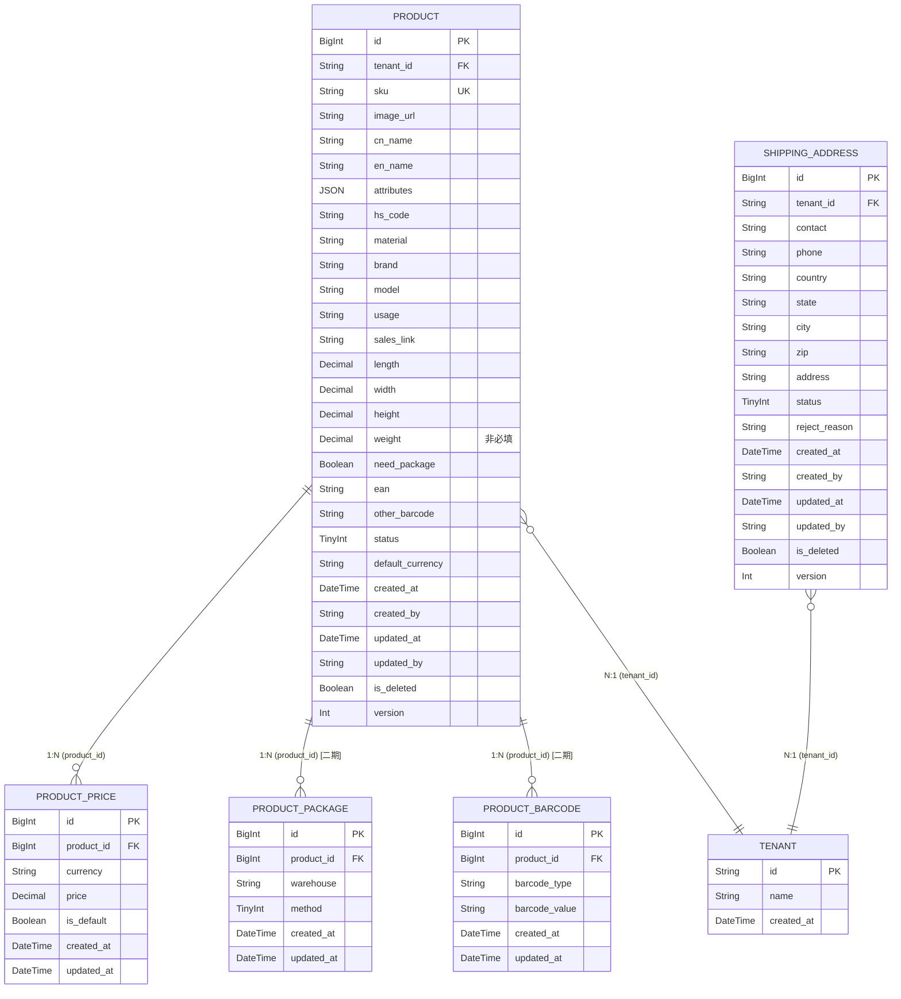

# 数据设计 — 基础资料

> **版本**: v2.1 | **日期**: 2026-06-06 | **作者**: AI PM
> **上游文档**: [2026-06-06-用户需求.md](./2026-06-06-用户需求.md)

---

## 一、实体清单 x 表映射

| 实体名称 | 对应表/子表 | 映射方式 | 说明 |
|----------|------------|---------|------|
| Product | `product` | 独立表 | 商品聚合根，存储SKU核心信息 |
| ProductPrice | `product_price` | 1:N 子表 | 通过 `product_id` 关联，存储多币种申报单价（币种取自业务国） |
| ProductPackage | `product_package` | 1:N 子表 | **二期**。通过 `product_id` 关联，条件存在（need_package=true） |
| ProductBarcode | `product_barcode` | 1:N 子表 | **二期**。通过 `product_id` 关联，产品条码管理（一期预留 `ean`/`other_barcode` 字段于主表） |
| ShippingAddress | `shipping_address` | 独立表 | 收货地址独立实体，租户隔离 |
| Tenant/User | `tenant` / `user` | 外部引用 | 货主租户和用户数据，不在本模块管理 |

---

## 二、逐表字段清单

### 2.1 商品主表

**表名**: `product` | **对应实体**: Product

> **设计说明**: 商品聚合根，承载SKU全生命周期数据。SKU创建后不可修改，同客户下唯一。product_weight 非必填。

| 字段名 (En) | 字段名 (Cn) | 类型 (Type) | 必填 | 约束/索引 | 枚举/备注 |
|:---|:---|:---|:---|:---|:---|
| `id` | 主键 | BigInt | Yes | **PK** | 雪花ID |
| `tenant_id` | 租户ID | String(32) | Yes | **Index** | SaaS数据隔离，关联货主 |
| `sku` | 商品SKU | String(64) | Yes | **Unique(tenant_id)** | 创建后不可修改，租户内唯一 |
| `image_url` | 产品图片 | String(512) | Yes | — | 图片URL，列表缩略图可预览大图 |
| `cn_name` | 申报中文名 | String(128) | Yes | — | 品名中文 |
| `en_name` | 申报英文名 | String(128) | Yes | — | 品名英文 |
| `attributes` | 产品属性 | JSON | Yes | — | 多选数组，见枚举字典，至少选1个 |
| `hs_code` | 海关编码 | String(20) | Yes | — | HS Code |
| `material` | 材质 | String(64) | Yes | — | — |
| `brand` | 品牌 | String(64) | Yes | — | — |
| `model` | 型号 | String(64) | Yes | — | — |
| `usage` | 用途 | String(64) | Yes | — | — |
| `sales_link` | 销售链接 | String(512) | No | — | 非必填 |
| `length` | 长(cm) | Decimal(10,2) | No | — | 非必填 |
| `width` | 宽(cm) | Decimal(10,2) | No | — | 非必填 |
| `height` | 高(cm) | Decimal(10,2) | No | — | 非必填 |
| `weight` | 重量(KG) | Decimal(10,2) | No | — | 非必填 |
| `need_package` | 是否需要包材 | Boolean | Yes | — | Default: false（二期功能，一期预留字段） |
| `ean` | 产品条码(EAN/UPC) | String(64) | No | — | 二期功能，一期预留字段 |
| `other_barcode` | 其他条码 | String(64) | No | — | 二期功能，一期预留字段 |
| `status` | 状态 | TinyInt | Yes | **Index** | 10:待审核, 20:已通过, 30:已拒绝 |
| `default_currency` | 默认币种 | String(8) | Yes | — | Default: 'USD'，对应product_price中is_default=true的币种 |
| `created_at` | 创建时间 | DateTime | Yes | — | 自动生成 |
| `created_by` | 创建人 | String(64) | Yes | — | 当前用户ID |
| `updated_at` | 更新时间 | DateTime | Yes | — | 自动维护 |
| `updated_by` | 更新人 | String(64) | Yes | — | 当前用户ID |
| `is_deleted` | 软删除标识 | Boolean | Yes | — | Default: false |
| `version` | 乐观锁版本 | Int | Yes | — | 并发控制，每次更新+1 |

> ⚠ **融合标注**：Demo 表单分区四"仓储包材与预警"含库存/库龄预警阈值（invWarning / ageWarning），Excel 未提及此功能，本设计不建 product_warning 表，预警功能归属二期。

**关联关系**:
- `One-to-Many` with `product_price` (通过 `id` → `product_id`)
- `One-to-Many` with `product_package` (通过 `id` → `product_id`) — 二期
- `One-to-Many` with `product_barcode` (通过 `id` → `product_id`) — 二期
- `Many-to-One` with `tenant` (通过 `tenant_id`)

---

### 2.2 申报单价子表

**表名**: `product_price` | **对应实体**: ProductPrice

> **设计说明**: 商品的多币种申报单价，一个商品可有多条记录，同一商品下币种不可重复。币种选项动态取自业务国币种配置。

| 字段名 (En) | 字段名 (Cn) | 类型 (Type) | 必填 | 约束/索引 | 枚举/备注 |
|:---|:---|:---|:---|:---|:---|
| `id` | 主键 | BigInt | Yes | **PK** | 雪花ID |
| `product_id` | 商品ID | BigInt | Yes | **Index(FK)** | 关联 `product.id` |
| `currency` | 申报币种 | String(8) | Yes | — | 取自业务国币种配置（默认含USD/EUR/CNY/GBP） |
| `price` | 申报单价 | Decimal(20,6) | Yes | — | 精度6位小数，前端显示2位 |
| `is_default` | 是否默认 | Boolean | Yes | — | Default: false，每商品仅1条=true |
| `created_at` | 创建时间 | DateTime | Yes | — | 自动生成 |
| `updated_at` | 更新时间 | DateTime | Yes | — | 自动维护 |

**关联关系**:
- `Many-to-One` with `product` (通过 `product_id`)

**约束**:
- `[UNIQUE]` `product_id` + `currency` — 同一商品下币种不可重复

---

### 2.3 收货地址表

**表名**: `shipping_address` | **对应实体**: ShippingAddress

> **设计说明**: 收货地址独立实体，货主自助维护，员工审核。同客户下"联系人-详细地址"拼接唯一。货主端不区分root/子账户，同一tenant_id下所有用户共享地址池。

| 字段名 (En) | 字段名 (Cn) | 类型 (Type) | 必填 | 约束/索引 | 枚举/备注 |
|:---|:---|:---|:---|:---|:---|
| `id` | 主键 | BigInt | Yes | **PK** | 雪花ID |
| `tenant_id` | 租户ID | String(32) | Yes | **Index** | SaaS数据隔离，关联货主 |
| `contact` | 联系人 | String(64) | Yes | — | — |
| `phone` | 联系电话 | String(32) | Yes | — | 数字格式，支持国际号码 |
| `country` | 国家 | String(64) | Yes | — | 取自业务国配置，格式："US - 美国" |
| `state` | 省/州 | String(64) | Yes | — | 来自行政区划数据，格式："FL - 佛罗里达州" |
| `city` | 城市 | String(64) | Yes | — | 来自行政区划数据 |
| `zip` | 邮编 | String(16) | Yes | — | 数字格式 |
| `address` | 详细地址 | String(256) | Yes | — | 街道门牌号等 |
| `status` | 状态 | TinyInt | Yes | **Index** | 10:待审核, 20:已通过, 30:已拒绝 |
| `reject_reason` | 拒绝原因 | String(256) | No | — | 审核拒绝时填写 |
| `created_at` | 创建时间 | DateTime | Yes | — | 自动生成 |
| `created_by` | 创建人 | String(64) | Yes | — | 当前用户ID |
| `updated_at` | 更新时间 | DateTime | Yes | — | 自动维护 |
| `updated_by` | 更新人 | String(64) | Yes | — | 当前用户ID |
| `is_deleted` | 软删除标识 | Boolean | Yes | — | Default: false |
| `version` | 乐观锁版本 | Int | Yes | — | 并发控制，每次更新+1 |

**关联关系**:
- `Many-to-One` with `tenant` (通过 `tenant_id`)

**约束**:
- `[UNIQUE]` `tenant_id` + `contact` + `address` — 同客户下"联系人-详细地址"拼接唯一（应用层组合校验）

---

### 2.4 二期 — 包材配置子表

**表名**: `product_package` | **对应实体**: ProductPackage

> **设计说明**: 二期功能。仅当 product.need_package=true 时有效，按仓库配置包材处理方式。一期不建此表，仅预留 product.need_package 字段。

| 字段名 (En) | 字段名 (Cn) | 类型 (Type) | 必填 | 约束/索引 | 枚举/备注 |
|:---|:---|:---|:---|:---|:---|
| `id` | 主键 | BigInt | Yes | **PK** | 雪花ID |
| `product_id` | 商品ID | BigInt | Yes | **Index(FK)** | 关联 `product.id` |
| `warehouse` | 仓库名称 | String(128) | Yes | — | — |
| `method` | 包材方式 | TinyInt | Yes | — | 10:常规纸箱, 20:木架加固, 30:气泡膜缠绕 |
| `created_at` | 创建时间 | DateTime | Yes | — | 自动生成 |
| `updated_at` | 更新时间 | DateTime | Yes | — | 自动维护 |

---

### 2.5 二期 — 产品条码子表

**表名**: `product_barcode` | **对应实体**: ProductBarcode

> **设计说明**: 二期功能。产品条码独立管理，支持多类型条码。一期不建此表，仅在 product 表预留 `ean` / `other_barcode` 字段。

| 字段名 (En) | 字段名 (Cn) | 类型 (Type) | 必填 | 约束/索引 | 枚举/备注 |
|:---|:---|:---|:---|:---|:---|
| `id` | 主键 | BigInt | Yes | **PK** | 雪花ID |
| `product_id` | 商品ID | BigInt | Yes | **Index(FK)** | 关联 `product.id` |
| `barcode_type` | 条码类型 | String(16) | Yes | — | EAN / UPC / INTERNAL |
| `barcode_value` | 条码值 | String(64) | Yes | — | 条码数字/字符串 |
| `created_at` | 创建时间 | DateTime | Yes | — | 自动生成 |
| `updated_at` | 更新时间 | DateTime | Yes | — | 自动维护 |

---

## 三、ER 关系图



---

## 四、关键设计说明

### 软删除策略
- `product` 和 `shipping_address` 使用软删除（`is_deleted` = true），核心业务数据不可物理删除
- 子表 `product_price` 随主表应用层级联软删除（Phase 1 在应用层处理，不依赖数据库级联）
- 二期子表（`product_package` / `product_barcode`）同样遵循软删除策略

### 乐观锁
- `product` 和 `shipping_address` 需要 `version` 字段，防并发编辑冲突
- 子表 `product_price` 通过主表的乐观锁保护，不单独设 version

### JSON 字段使用场景
- `product.attributes`：产品属性为多选枚举（如"普货+带电+易碎"），使用 JSON Array 存储。原因：属性列表可能在运营中扩展，JSON 比逗号分隔字符串更结构化，比单独的关联表更轻量。

### 纯逻辑实体说明
- Tenant（货主）：引用外部 `tenant` 表，本模块不管理租户数据，仅通过 `tenant_id` 做数据隔离
- User（用户）：引用外部 `user` 表，`created_by` / `updated_by` 记录操作人

### 关键约束
- **SKU唯一性**：`product.sku` + `product.tenant_id` 联合唯一，同客户下SKU不可重复
- **地址简称唯一性**：`shipping_address.tenant_id` + `shipping_address.contact` + `shipping_address.address` 组合在应用层校验唯一（联系人-详细地址拼接），防止重复录入
- **员工端地址编辑**：员工端可编辑所有状态（待审核/已通过/已拒绝）的收货地址
- **币种不重复**：`product_price.product_id` + `product_price.currency` 联合唯一
- **货主端子账户共享**：`shipping_address` 不区分 root/子账户，同一 `tenant_id` 下所有用户共享地址数据；查询时仅按 `tenant_id` 过滤，不按 `created_by` 过滤

### 枚举字典

**商品状态 (product.status)**：
| 值 | 常量名 | 中文 | 说明 |
|----|--------|------|------|
| 10 | PENDING | 待审核 | 货主提交后初始状态 |
| 20 | APPROVED | 已通过 | 员工审核通过 |
| 30 | REJECTED | 已拒绝 | 员工审核拒绝，可编辑后重提 |

**地址状态 (shipping_address.status)**：
| 值 | 常量名 | 中文 | 说明 |
|----|--------|------|------|
| 10 | PENDING | 待审核 | 货主提交后初始状态 |
| 20 | APPROVED | 已通过 | 员工审核通过 |
| 30 | REJECTED | 已拒绝 | 员工审核拒绝，可编辑后重提 |

**申报币种 (product_price.currency)** — 取自业务国币种配置：
| 值 | 常量名 | 中文 |
|----|--------|------|
| USD | USD | 美元 |
| EUR | EUR | 欧元 |
| CNY | CNY | 人民币 |
| GBP | GBP | 英镑 |

**产品属性 (product.attributes)**：
| 值 | 中文 |
|----|------|
| 普货 | 普货 |
| 内置电池 (可拆) | 内置电池 (可拆) |
| 内置电池 (不可拆) | 内置电池 (不可拆) |
| 纯电池 | 纯电池 |
| 带磁 | 带磁 |
| 危险品 | 危险品 |
| 液体 | 液体 |
| 粉末 | 粉末 |
| 膏体 | 膏体 |
| 木制品 | 木制品 |
| 纺织品 | 纺织品 |

**包材方式 (product_package.method)** — 二期：
| 值 | 常量名 | 中文 |
|----|--------|------|
| 10 | CARTON | 方式1 — 常规纸箱 |
| 20 | WOODEN | 方式2 — 木架加固 |
| 30 | BUBBLE | 方式3 — 气泡膜缠绕 |

---

## 五、状态机

### 5.1 商品状态流转

```
                    ┌─── 货主提交 ───→ [待审核(10)]
                    │                     │
    [已拒绝(30)] ←──┘         员工审核通过 │ 员工审核拒绝
        │                                  │
        └── 货主编辑后重提 ──→ [待审核(10)] │
                                           ↓
                                    [已通过(20)]
```

| 当前状态 | 操作 | 目标状态 | 触发角色 | 校验条件 |
|---------|------|---------|---------|---------|
| (新建) | 提交 | 待审核(10) | 货主 | 必填字段完整 |
| 待审核(10) | 审核通过 | 已通过(20) | 员工 | 二次确认 |
| 待审核(10) | 审核拒绝 | 已拒绝(30) | 员工 | 拒绝原因不为空 |
| 已拒绝(30) | 编辑后提交 | 待审核(10) | 货主 | 必填字段完整 |

### 5.2 收货地址状态流转

```
                    ┌─── 货主提交 ───→ [待审核(10)]
                    │                     │
    [已拒绝(30)] ←──┘         员工审核通过 │ 员工审核拒绝
        │                                  │
        └── 货主编辑后重提 ──→ [待审核(10)] │
                                           ↓
                                    [已通过(20)]
```

| 当前状态 | 操作 | 目标状态 | 触发角色 | 校验条件 |
|---------|------|---------|---------|---------|
| (新建) | 确定提交 | 待审核(10) | 货主 | 7个必填字段均有值；联系人-详细地址不重复 |
| 待审核(10) | 审核通过 | 已通过(20) | 员工 | 二次确认 |
| 待审核(10) | 审核拒绝 | 已拒绝(30) | 员工 | 拒绝原因不为空 |
| 已拒绝(30) | 编辑后提交 | 待审核(10) | 货主 | 7个必填字段均有值；联系人-详细地址不重复 |

---
