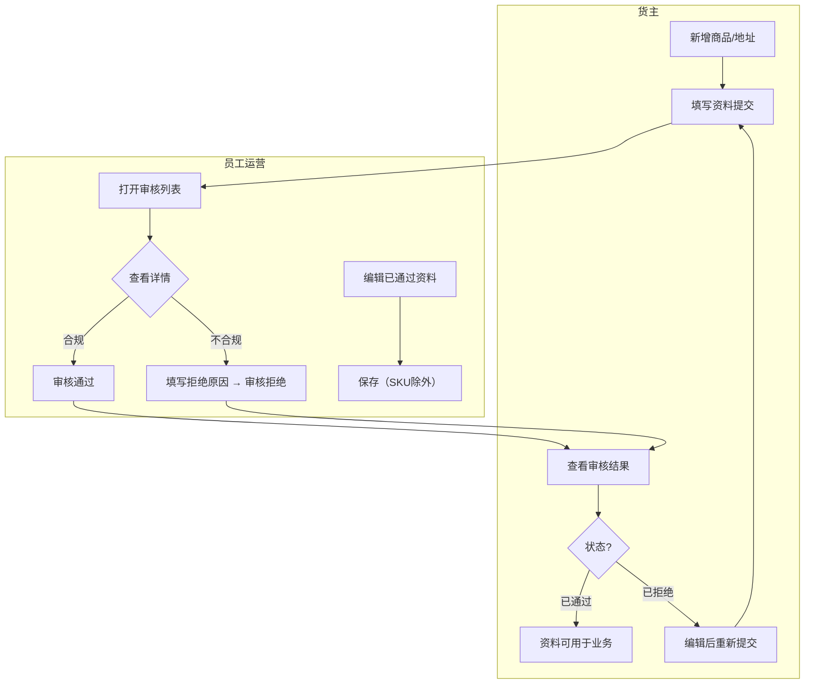
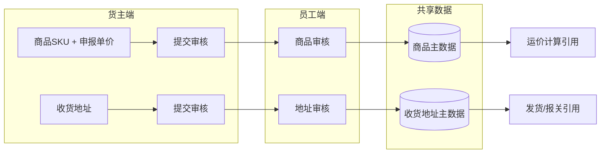

# 需求定义卡片 (RDD) — 基础资料

> **原始需求**：为跨境物流TMS系统搭建基础资料模块，支撑货主自助维护商品信息和收货地址，员工端统一审核管理
> **文档版本**: v2.1 | **日期**: 2026-06-06 | **作者**: AI PM

---

## 1. 核心洞察 (Insight)

**真实痛点**：

当前跨境物流业务中，货主的商品资料（SKU、海关编码、申报单价、重量）和收货地址分散在邮件、Excel、微信中传递，员工需要反复沟通确认信息完整性。商品资料缺失导致报关被退回，地址错误导致妥投失败。员工端缺乏统一的审核入口，货主端缺乏自助维护能力。

货主每次新增商品或更换收货地址都需要联系客服/运营人员代为录入系统，沟通成本高、信息传递易出错、变更无留痕。员工在后台需要逐个处理，无集中审核能力，效率低下。

**JTBD**：
> `货主` 雇佣"基础资料"不是为了"填表单"，而是为了：**当有新商品需要入库或新地址需要发货时，能自助提交资料并在可预期的时间内获得审核结果，不用反复在微信上催运营。**

> `员工/运营` 雇佣"基础资料"不是为了"看列表"，而是为了：**当货主提交了商品或地址申请时，能集中审核、快速通过合规的资料、驳回不合规的并说明原因，不用逐单跟货主来回确认缺失字段。**

**业务价值**：

| 维度 | 当前 | 目标 |
|------|------|------|
| 商品资料提交方式 | 微信/邮件发送 Excel | 货主端自助提交，结构化管理 |
| 审核效率 | 逐单人工沟通确认 | 统一审核列表，一键通过/驳回 |
| 信息完整性 | 申报信息经常缺失海关编码/材质/重量 | 必填校验保证核心字段完整 |
| 地址变更留痕 | 无记录可查 | 全生命周期状态可追溯 |
| 沟通成本 | 每单至少2-3次来回 | 驳回原因一并填写，货主端可查看后修改重提 |

---

## 2. 业务全景图

### 2.1 角色与工作节奏

| 角色 | 核心任务 | 频率 |
|------|---------|------|
| 货主 | 新增/编辑商品SKU，新增/编辑收货地址，查看审核结果 | 按需（每周数次） |
| 员工/运营 | 审核货主提交的商品和地址，编辑已通过资料，驳回不合规申请 | 日频 |

### 2.2 端到端业务链路

```
【货主自助录入 — 按需】
  新增商品SKU → 提交审核 → 状态=待审核
  新增收货地址 → 提交审核 → 状态=待审核
       ↓
【员工集中审核 — 日频】
  审核列表(待审核Tab) → 打开详情 → 通过/驳回
       ↓
【货主查看结果 — 事件驱动】
  已通过 → 可用于后续业务（运价计算/发货）
  已拒绝 → 查看驳回原因 → 编辑后重新提交
       ↓
【员工维护治理 — 按需】
  编辑已通过资料 → 修正信息 → 保存（SKU除外）
```

### 2.3 实体依赖关系

```
货主(Tenant/User) — 外部引用
  ├── 1:N 商品(Product) → 聚合根
  │     ├── 1:N 申报单价(ProductPrice) → 子表（币种取自业务国币种）
  │     ├── 1:N 包材配置(ProductPackage) → 子表（二期，条件：need_package=true）
  │     └── 1:N 产品条码(ProductBarcode) → 子表（二期）
  └── 1:N 收货地址(ShippingAddress) → 独立实体
```

### 2.4 核心业务流程图（泳道图）



### 2.5 核心数据流图



---

## 3. 流程一：商品管理（按需 + 日频审核）

> **触发**：货主有新SKU需要入库，或已有商品信息需修正
> **频率**：货主按需录入，员工日频审核
> **前置依赖**：货主已注册并登录系统；业务国币种已在系统中配置

### 3.1 商品 (Product) — 核心聚合根，承载商品全生命周期数据

> **As a** 货主 **I want to** 提交商品SKU资料（含图片、HS编码、申报单价、重量） **So that** 商品可被系统识别并用于后续运价计算和报关

| 字段 | 类型 | 必填 | 说明 |
|------|------|------|------|
| sku | 文本 | ✅ | 商品SKU，同客户下唯一，创建后不可修改 |
| image_url | 图片URL | ✅ | 产品图片，列表可预览，新增表单上传 |
| cn_name | 文本 | ✅ | 申报中文名称 |
| en_name | 文本 | ✅ | 申报英文名称 |
| attributes | 多选枚举 | ✅ | 产品属性，可多选，至少选1个 |
| hs_code | 文本 | ✅ | 海关HS编码 |
| material | 文本 | ✅ | 材质 |
| brand | 文本 | ✅ | 品牌 |
| model | 文本 | ✅ | 型号 |
| usage | 文本 | ✅ | 用途 |
| sales_link | 文本 | — | 销售链接，非必填 |
| length | Decimal(10,2) | — | 长(cm)，非必填 |
| width | Decimal(10,2) | — | 宽(cm)，非必填 |
| height | Decimal(10,2) | — | 高(cm)，非必填 |
| weight | Decimal(10,2) | — | 产品重量(KG)，非必填 |
| default_currency | String(8) | ✅ | 默认申报币种，初始USD，对应prices中is_default=true的行 |
| need_package | Boolean | — | 是否需要额外包材处理（二期），默认false |
| status | 枚举 | ✅ | 10:待审核, 20:已通过, 30:已拒绝 |
| tenant_id | String | ✅ | 所属货主(租户) |

**业务规则**：
- R01：SKU在同客户下唯一，创建后不可修改，作为商品唯一标识
- R03：产品属性为必填多选，至少选1个
- R04：申报单价至少保留1条记录（默认USD），支持多币种但不能重复币种，币种选项取自业务国币种
- R05：货主端仅可编辑状态=已拒绝的商品，其他状态仅可查看
- R06：员工端可编辑任何状态的商品（SKU除外）；审核中/通过后的商品员工可编辑，SKU字段不可修改
- ⚠ **融合标注**：Demo 表单分区四"仓储包材与预警"含库存/库龄预警阈值设置，Excel 未提及此功能，已在 RDD 中归属二期

**相关 AC**：`AC01`, `AC02`, `AC03`, `AC04`, `AC05`, `AC06`

### 3.2 申报单价 (ProductPrice) — 商品的多币种申报单价子表

> **As a** 货主 **I want to** 为商品设置多种申报币种的单价 **So that** 不同目的国报关时使用对应币种单价

| 字段 | 类型 | 必填 | 说明 |
|------|------|------|------|
| product_id | String | ✅ | 关联商品ID |
| currency | 枚举 | ✅ | 币种，取自业务国币种（默认USD） |
| price | Decimal(20,6) | ✅ | 申报单价 |
| is_default | Boolean | ✅ | 是否默认币种，每商品仅1条为true |

**业务规则**：
- R07：同一商品下币种不可重复
- R08：默认币种通过Radio单选切换，初始默认USD
- R09：删除默认币种行时，系统回退默认币种为USD
- R10：币种选项动态取自业务国配置的币种列表，不硬编码固定4种

**相关 AC**：`AC02a`, `AC02b`

### 3.3 二期 — 仓储包材 (ProductPackage)

> 二期功能，详见 `drafts/二期功能/`。一期仅在商品表中预留 `need_package` 字段。

**相关 AC**：`AC07`

### 3.4 二期 — 产品条码 (ProductBarcode)

> 二期功能，详见 `drafts/二期功能/`。一期在商品表中预留 `ean` / `other_barcode` 字段。

### 3.5 核心场景

```
场景：货主新增商品并提交审核
  1. 货主点击"新增商品" → 弹窗打开，5个分区表单
  2. 核心基础信息区：填写SKU/产品属性/中英文名/上传图片/选择默认币种/添加申报币种+单价
  3. 详细属性与海关信息区：填写HS编码/材质/品牌/型号/用途/销售链接
  4. 规格与重量区：选填长宽高，选填重量
  5. 点击"提交" → 校验必填项 → 商品状态=待审核

场景：员工审核商品
  1. 员工打开商品管理 → 默认"待审核"Tab → 看到各货主待审核商品列表
  2. 点击某商品的"审核" → 弹窗展示全部信息（可编辑，SKU除外）
  3. 审核通过 → 二次确认弹窗 → 状态=已通过
  4. 审核拒绝 → 输入拒绝原因 → 状态=已拒绝

场景：货主修改被拒绝的商品
  1. 货主切换到"已拒绝"Tab → 找到被拒商品 → 点击"编辑"
  2. 修正问题字段 → 提交 → 状态重新变为待审核
```

**相关 AC**：`AC01`, `AC05`, `AC06`

---

## 4. 流程二：收货地址管理（按需 + 日频审核）

> **触发**：货主新增海外仓地址或修改已有收货地址
> **频率**：货主按需录入，员工日频审核
> **前置依赖**：货主已注册并登录系统

### 4.1 收货地址 (ShippingAddress) — 独立实体，承载收货地址全生命周期

> **As a** 货主 **I want to** 提交海外收货地址（含联系人、电话、国家/州/城市/邮编/详细地址） **So that** 后续发货时可选择正确的收货地址

| 字段 | 类型 | 必填 | 说明 |
|------|------|------|------|
| contact | 文本 | ✅ | 联系人姓名 |
| phone | 文本 | ✅ | 联系电话，数字格式 |
| country | 文本 | ✅ | 国家，取自业务国配置 |
| state | 文本 | ✅ | 省/州，来自行政区划数据 |
| city | 文本 | ✅ | 城市，来自行政区划数据 |
| zip | 文本 | ✅ | 邮编，数字格式 |
| address | 文本 | ✅ | 详细地址（街道门牌号） |
| status | 枚举 | ✅ | 10:待审核, 20:已通过, 30:已拒绝 |
| tenant_id | String | ✅ | 所属货主(租户) |

**业务规则**：
- R11：同客户下地址简称唯一（联系人-详细地址拼接），防止重复录入
- R12：货主端不区分root/子账户，同一客户下所有子账户共享地址数据
- R13：货主端仅可编辑状态=已拒绝的地址，其他状态仅可查看
- R14：员工端可编辑任何状态的地址，并可执行审核操作
- R15：员工审核拒绝时需填写拒绝原因，拒绝原因不能为空
- R16：员工审核通过时需二次确认（`ElMessageBox.confirm`，type: success）
- R17：新增地址时点击"确定"流转至待审核状态；点击"返回"弹出二次确认"确定要放弃编辑吗？"，确认后关闭弹窗，不保存
- R18：员工端可编辑所有状态的收货地址（待审核/已通过/已拒绝），并可执行审核操作

**相关 AC**：`AC08`, `AC09`, `AC10`, `AC11`

### 4.2 核心场景

```
场景：货主新增收货地址
  1. 货主点击"新增收货地址" → 弹窗表单打开
  2. 填写联系人/电话/国家/省州/城市/邮编/详细地址 → 全部必填
  3. 点击"确定" → 状态=待审核，出现在员工审核列表
  4. 点击"返回" → 二次确认"确定要放弃编辑吗？" → 确认后关闭弹窗

场景：员工审核收货地址
  1. 员工打开收货地址管理 → 默认"待审核"Tab → 看到待审核地址列表
  2. 点击"审核" → 弹窗展示详情（可编辑）
  3. 审核通过 → 二次确认 → 状态=已通过
  4. 审核拒绝 → 输入拒绝原因 → 状态=已拒绝

场景：货主查看/编辑地址
  1. 待审核/已通过状态 → "查看"按钮 → 弹窗详情只读展示
  2. 已拒绝状态 → "编辑"按钮 → 弹窗表单可编辑 → 修改后提交 → 状态重新变为待审核
```

**相关 AC**：`AC08`, `AC09`, `AC10`, `AC11`

---

## 5. 验收标准总览 (AC)

**流程一：商品管理**
- [ ] **AC01-新增商品(货主端)**：货主点击"新增商品"，填写SKU/图片/中英文名/HS编码/属性/材质/品牌/型号/用途后可提交，成功后状态=待审核
- [ ] **AC02-申报单价管理**：支持添加多币种单价（币种取自业务国币种），同币种不可重复，可切换默认币种，可删除非默认行
- [ ] **AC02a-默认币种**：默认币种初始为USD，用户可通过Radio切换；删除默认币种行时系统回退默认币种为USD
- [ ] **AC02b-币种去重**：已选币种在下拉选项中不重复出现；所有可用币种添加完毕后按钮提示无可用币种
- [ ] **AC03-图片上传与预览**：新增商品时上传产品图片；列表页图片展示为缩略图（60x60），点击可预览大图
- [ ] **AC04-SKU唯一性**：同客户下SKU不可重复，创建后不可修改（前端disabled + 后端拒绝修改）
- [ ] **AC05-员工审核商品**：员工可查看/编辑待审核商品详情（SKU不可修改），点击"审核通过"二次确认后状态变为已通过；点击"审核拒绝"输入原因后状态变为已拒绝
- [ ] **AC06-货主查看和编辑商品**：货主端待审核/已通过商品仅可"查看"（只读），已拒绝商品可"编辑"后重新提交
- [ ] **AC07-二期包材与条码**：包材配置和产品条码为二期功能，一期表单中对应区域标注"二期"标识，字段可跳过不影响提交

**流程二：收货地址管理**
- [ ] **AC08-新增收货地址(货主端)**：货主新增地址填写联系人/电话/国家/省州/城市/邮编/详细地址（全部必填），点击"确定"提交后状态=待审核；点击"返回"二次确认"确定要放弃编辑吗？"后关闭弹窗
- [ ] **AC09-地址简称唯一性**：同客户下"联系人-详细地址"拼接值不可重复，重复时阻断提示
- [ ] **AC10-员工审核地址**：员工点击"审核"查看地址详情，通过/拒绝流程同商品审核（拒绝需原因，通过需二次确认）
- [ ] **AC11-货主端查看和编辑地址**：待审核/已通过仅可"查看"（只读），已拒绝可"编辑"后重新提交；同一客户下root/子账户共享地址数据

**通用**
- [ ] **AC12-货主端数据隔离**：货主仅能查看/操作自己租户的商品和地址（tenant_id隔离）
- [ ] **AC13-员工端无隔离**：员工可查看所有货主的数据，列表含"用户名称"列标识货主
- [ ] **AC14-分Tab筛选**：待审核/已通过/已拒绝/全部4个Tab，切换后列表按status正确筛选，默认激活"待审核"

---

## 6. NFR（非功能性需求）

- **性能**：列表查询 < 1s，弹窗打开 < 500ms
- **并发**：同时操作员工数 ≤ 50
- **数据保留**：商品和地址数据长期保留，软删除
- **精度**：申报单价 Decimal(20,6)，重量 Decimal(10,2)，尺寸 Decimal(10,2)
- **安全**：货主仅能查看/操作自己的数据（tenant_id隔离）；员工可查看所有货主的数据
- **图片**：商品图片支持预览，单张图片 ≤ 5MB，支持常见格式（JPG/PNG/WebP）

---

## 7. 功能清单

> 基于 2 条业务流程，共 **2 个模块、14 项功能**。P0 = MVP，P1 = 二期。

**模块 A：商品管理**

| 编号 | 功能 | 优先级 | AC |
|------|------|--------|-----|
| A1 | 货主端商品列表（分Tab：待审核/已通过/已拒绝/全部） | P0 | AC06, AC14 |
| A2 | 货主端新增商品（含5大分区表单 + 图片上传） | P0 | AC01, AC03 |
| A3 | 货主端查看商品详情（只读） | P0 | AC06 |
| A4 | 货主端编辑已拒绝商品并重新提交 | P0 | AC06 |
| A5 | 员工端商品列表（含搜索：用户名称/SKU/中英文名 + 用户名称列） | P0 | AC13, AC14 |
| A6 | 员工端审核商品（通过/拒绝+原因） | P0 | AC05 |
| A7 | 员工端编辑商品（SKU不可修改） | P0 | AC05 |
| A8 | 多币种申报单价管理（币种取自业务国） | P0 | AC02, AC02a, AC02b |

**模块 B：收货地址管理**

| 编号 | 功能 | 优先级 | AC |
|------|------|--------|-----|
| B1 | 货主端地址列表（分Tab：待审核/已通过/已拒绝/全部） | P0 | AC11, AC14 |
| B2 | 货主端新增收货地址（返回二次确认/确定提交） | P0 | AC08, AC09 |
| B3 | 货主端查看地址详情（只读） | P0 | AC11 |
| B4 | 货主端编辑已拒绝地址并重新提交 | P0 | AC11 |
| B5 | 员工端地址列表（含搜索：用户名称/联系人/电话 + 用户名称列） | P0 | AC13, AC14 |
| B6 | 员工端审核地址（通过/拒绝+原因） | P0 | AC10 |
| B7 | 员工端编辑地址 | P0 | AC10 |

**分期汇总**

| 分期 | 模块范围 | 功能数 |
|------|----------|--------|
| **Phase 1 (MVP)** | 商品管理(A1-A8) + 收货地址管理(B1-B7) | **14** |
| **Phase 2** | 包材配置 + 产品条码 + 库存预警 + 批量审核 + Excel导入 | 待规划 |

---

## 8. MVP 方案与建议

**MVP 方案（Phase 1 — 基础资料核心CRUD+审核流程）**

```
货主端
├── 商品管理
│   ├── 新增商品（5分区表单：核心基础信息/详细属性/规格重量/二期包材/二期条码）
│   ├── 分Tab列表（待审核/已通过/已拒绝/全部）
│   ├── 商品图片预览
│   ├── 查看（只读）/ 编辑（已拒绝）
│   └── 多币种申报单价（币种取自业务国）
├── 收货地址管理
│   ├── 新增地址（返回二次确认/确定提交）
│   ├── 分Tab列表（待审核/已通过/已拒绝/全部）
│   └── 查看（只读）/ 编辑（已拒绝）

员工端
├── 商品管理
│   ├── 分Tab列表 + 用户名称/SKU/中英文名搜索 + 用户名称列
│   ├── 审核商品（通过/拒绝+原因）
│   └── 编辑商品（SKU不可修改）
└── 收货地址管理
    ├── 分Tab列表 + 用户名称/联系人/电话搜索 + 用户名称列
    ├── 审核地址（通过/拒绝+原因）
    └── 编辑地址
```

**MVP 明确不做**：
- 包材方式配置（P1 — 仓储模块未上线，表单标注"二期"）
- 产品条码管理（P1 — 表单标注"二期"，一期仅预留字段）
- 库存与库龄预警阈值设置（P1 — 仓储模块未上线）
- 批量审核（P1）
- Excel批量导入商品（P1）
- 操作审计日志（P2）

**二期表单区处理**：一期新增商品表单中，"仓储包材"和"产品条码"两个分区正常展示但标注"二期"标识，字段非必填、可跳过，不影响商品提交。

**专家建议**：
- **S01 — 频次驱动设计**：商品新增和地址新增是货主高频操作（每周数次），应放在一级菜单；员工的审核操作是日频操作，也应独立入口、待审核Tab默认激活。两个模块按角色拆分菜单项。
- **S02 — SKU不可修改**：SKU作为跨境物流核心标识贯穿全链路，创建后不可修改，避免下游数据关联断裂。员工端编辑商品时SKU字段disabled。
- **S03 — 地址唯一性约束**：联系人+详细地址拼接作为业务唯一键，防止同一货主重复录入相同地址。此约束在应用层校验，不依赖数据库唯一索引（因拼接逻辑属于业务规则）。
- **S04 — 货主端子账户共享**：收货地址不区分root/子账户，同一tenant_id下所有用户共享地址池。这降低了地址维护成本，子账户无需重复录入。
- **S05 — 币种动态获取**：申报币种选项取自业务国币种配置，避免硬编码固定币种列表。当业务扩展到新国家时无需改代码。

---

### 下一步

Phase 1 需求洞察完成，进入 Phase 2 方案架构（数据建模 + 边界探测）。

---
