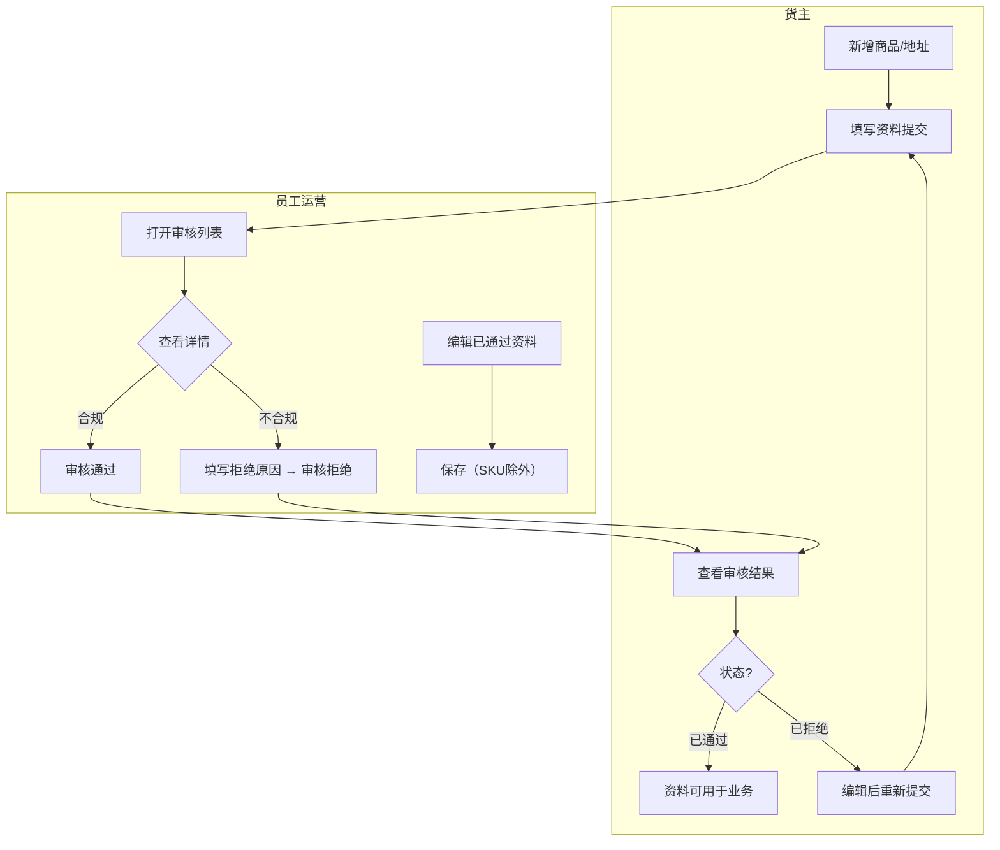
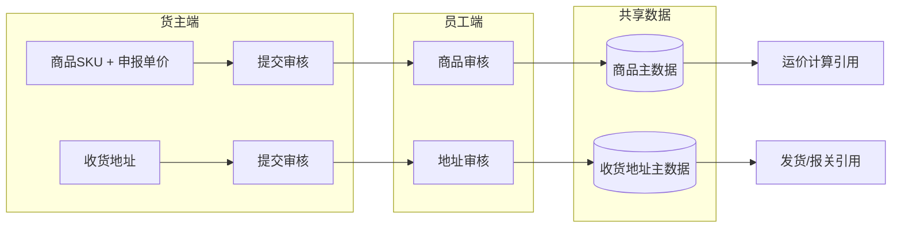
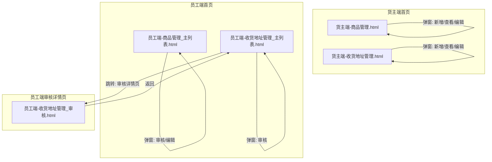

# 基础资料模块 — 产品文档

> **原始需求**：为跨境物流TMS系统搭建基础资料模块，支撑货主自助维护商品信息和地址（收货地址+取件地址），员工端统一审核管理
> **版本**: v2.6 | **日期**: 2026-09-21
> **V2.6 变更**: 地址管理「偏远邮编管理」去掉「导出」按钮（保留导入、删除）
> **★ 文档分工（去哪看）**：字段结构/类型/约束/枚举值 → 数据设计 Schema；页面交互 → 原型。本文档 = 需求 + 业务规则（R 编号按流程分段）+ 状态机 + 功能清单 + 权限 + AC + 分期。

---

## 1. 核心洞察 (Insight)

**真实痛点**：

当前跨境物流业务中，货主的商品资料（SKU、海关编码、申报单价、重量）和收货地址分散在邮件、Excel、微信中传递，员工需要反复沟通确认信息完整性。商品资料缺失导致报关被退回，地址错误导致妥投失败。员工端缺乏统一的审核入口，货主端缺乏自助维护能力。

货主每次新增商品或更换收货地址都需要联系客服/运营人员代为录入系统，沟通成本高、信息传递易出错、变更无留痕。员工在后台需要逐个处理，无集中审核能力，效率低下。

**JTBD**：
> `货主` 雇佣"基础资料"不是为了"填表单"，而是为了：**当有新商品需要入库或新地址需要发货时，能自助提交资料并在可预期的时间内获得审核结果，不用反复在微信上催运营。**

> `员工/运营` 雇佣"基础资料"不是为了"看列表"，而是为了：**当货主提交了商品或地址申请时，能集中审核、快速通过合规的资料、驳回不合规的并说明原因，不用逐单跟货主来回确认缺失字段。**

**业务价值**：

| 维度 | 当前 | 目标 |
|------|------|------|
| 商品资料提交方式 | 微信/邮件发送 Excel | 货主端自助提交，结构化管理 |
| 审核效率 | 逐单人工沟通确认 | 统一审核列表，一键通过/驳回 |
| 信息完整性 | 申报信息经常缺失海关编码/材质/重量 | 必填校验保证核心字段完整 |
| 地址变更留痕 | 无记录可查 | 全生命周期状态可追溯 |
| 沟通成本 | 每单至少2-3次来回 | 驳回原因一并填写，货主端可查看后修改重提 |

---

## 2. 业务全景图

### 2.1 角色与工作节奏

| 角色 | 核心任务 | 频率 |
|------|---------|------|
| 货主 | 新增/编辑商品SKU，新增/编辑收货地址，查看审核结果 | 按需（每周数次） |
| 员工/运营 | 审核货主提交的商品和地址，编辑已通过资料，驳回不合规申请 | 日频 |

### 2.2 端到端业务链路

```
【货主自助录入 — 按需】
  新增商品SKU → 提交审核 → 状态=待审核
  新增收货地址 → 提交审核 → 状态=待审核
       ↓
【员工集中审核 — 日频】
  审核列表(待审核Tab) → 打开详情 → 通过/驳回
       ↓
【货主查看结果 — 事件驱动】
  已通过 → 可用于后续业务（运价计算/发货）
  已拒绝 → 查看驳回原因 → 编辑后重新提交
       ↓
【员工维护治理 — 按需】
  编辑已通过资料 → 修正信息 → 保存（SKU除外）
```

### 2.3 实体依赖关系

```
货主(Tenant/User) — 外部引用
  ├── 1:N 商品(Product) → 聚合根
  │     ├── 1:N 申报单价(ProductPrice) → 子表（币种取自业务国币种）
  │     ├── 1:N 包材配置(ProductPackage) → 子表（二期，条件：need_package=true）
  │     └── 1:N 产品条码(ProductBarcode) → 子表（二期）
  ├── 1:N 收货地址(ShippingAddress) → 独立实体
  ├── 偏远邮编(RemotePostcode) → 独立实体（员工端维护，供附加费规则匹配）
  └── 标识(Tag) → 独立实体（员工端维护，用于运单/提单/附加费打标）
```

### 2.4 核心业务流程图（泳道图）



### 2.5 核心数据流图



---

## 3. 流程一：商品管理（按需 + 日频审核）

> **触发**：货主有新SKU需要入库，或已有商品信息需修正
> **频率**：货主按需录入，员工日频审核
> **前置依赖**：货主已注册并登录系统；业务国币种已在系统中配置

### 3.1 商品 (Product) — 核心聚合根，承载商品全生命周期数据

> **As a** 货主 **I want to** 提交商品SKU资料（含图片、HS编码、申报单价、重量） **So that** 商品可被系统识别并用于后续运价计算和报关

| 字段 | 必填 | 说明 |
|------|------|------|
| sku | ✅ | 商品SKU，同客户下唯一，创建后不可修改 |
| image_url | ✅ | 产品图片，列表可预览，新增表单上传 |
| cn_name | ✅ | 申报中文名称 |
| en_name | ✅ | 申报英文名称 |
| attributes | ✅ | 产品属性，可多选，至少选1个 |
| hs_code | ✅ | 海关HS编码 |
| material | ✅ | 材质 |
| brand | ✅ | 品牌，下拉选择（数据源=客户品牌库，可输入创建，客户内去重） |
| model | ✅ | 型号 |
| usage | ✅ | 用途 |
| sales_link | — | 销售链接，非必填 |
| length | — | 长(cm)，非必填 |
| width | — | 宽(cm)，非必填 |
| height | — | 高(cm)，非必填 |
| weight | — | 产品重量(KG)，非必填 |
| is_dropshipping | ✅ | 是否用于一件代发，下拉选择：是/否 |
| default_currency | ✅ | 默认申报币种，固定为第一条申报单价（USD），不提供切换 |
| need_package | — | 是否需要额外包材处理（二期），默认false |
| attachments | — | 附件，支持多文件上传 |
| status | ✅ | 10:待审核, 20:已通过, 30:已拒绝 |
| tenant_id | ✅ | 所属货主(租户) |

**业务规则**（权威编号见本文档「业务规则」章节）：
- SKU在同客户下唯一，创建后不可修改，作为商品唯一标识
- 产品属性为必填多选，至少选1个
- 申报单价至少保留1条记录（默认USD），支持多币种但不能重复币种，币种选项取自业务国币种
- 货主端仅可编辑状态=已拒绝的商品，其他状态仅可查看
- 员工端可编辑任何状态的商品（SKU除外）；审核中/通过后的商品员工可编辑，SKU字段不可修改
- 是否用于一件代发为必填，下拉选择是/否
- 品牌从客户品牌库下拉选择，可输入创建；输入新品牌自动存入客户品牌库，客户内去重（不区分大小写）
- 商品支持上传多个附件文件（可选）
- ⚠ **融合标注**：Demo 表单分区四"仓储包材与预警"含库存/库龄预警阈值设置，Excel 未提及此功能，已归属二期

**相关 AC**：`AC01`, `AC02`, `AC03`, `AC04`, `AC05`, `AC06`

### 3.2 申报单价 (ProductPrice) — 商品的多币种申报单价子表

> **As a** 货主 **I want to** 为商品设置多种申报币种的单价 **So that** 不同目的国报关时使用对应币种单价

| 字段 | 必填 | 说明 |
|------|------|------|
| product_id | ✅ | 关联商品ID |
| currency | ✅ | 币种，取自业务国币种（默认USD） |
| price | ✅ | 申报单价 |
| is_default | ✅ | 是否默认币种，每商品仅1条为true |

**业务规则**（权威编号见本文档「业务规则」章节）：
- 同一商品下币种不可重复
- 默认币种固定为第一条申报单价（USD），不提供切换
- 默认币种行（第一条）不可删除
- 币种选项动态取自业务国配置的币种列表，不硬编码固定4种

**相关 AC**：`AC02a`, `AC02b`

### 3.3 二期 — 仓储包材 (ProductPackage)

> 二期功能，详见 `drafts/二期功能/`。一期仅在商品表中预留 `need_package` 字段。

**相关 AC**：`AC07`

### 3.4 二期 — 产品条码 (ProductBarcode)

> 二期功能，详见 `drafts/二期功能/`。一期在商品表中预留 `ean` / `other_barcode` 字段。

### 3.5 核心场景

```
场景：货主新增商品并提交审核
  1. 货主点击"新增商品" → 弹窗打开，6个分区表单
  2. 核心基础信息区：填写SKU/产品属性/中英文名/上传图片/选择默认币种/添加申报币种+单价
  3. 详细属性与海关信息区：填写HS编码/材质/品牌/型号/用途/销售链接
  4. 规格与重量区：选填长宽高，选填重量
  5. 点击"提交" → 校验必填项 → 商品状态=待审核

场景：员工审核商品
  1. 员工打开商品管理 → 默认"待审核"Tab → 看到各货主待审核商品列表
  2. 点击某商品的"审核" → 弹窗展示全部信息（可编辑，SKU除外）
  3. 审核通过 → 二次确认弹窗 → 状态=已通过
  4. 审核拒绝 → 输入拒绝原因 → 状态=已拒绝

场景：货主修改被拒绝的商品
  1. 货主切换到"已拒绝"Tab → 找到被拒商品 → 点击"编辑"
  2. 修正问题字段 → 提交 → 状态重新变为待审核
```

**相关 AC**：`AC01`, `AC05`, `AC06`

---

## 4. 流程二：地址管理 — 收货地址 + 取件地址（按需 + 日频审核）

> **触发**：货主新增收货地址或取件地址
> **频率**：货主按需录入，员工日频审核
> **前置依赖**：货主已注册并登录系统

地址管理统一承载两类地址：
- **收货地址**（address_type=10）：海外仓/本地仓收货地址，走审核流程（待审核→通过/拒绝）
- **取件地址**（address_type=20）：客户取件地址，无需审核（默认已通过），数据来源为 ① 客户入驻时自动带入 ② 货主端手工新增

### 4.1 地址实体 (ShippingAddress) — 统一实体，address_type 区分类型

> **As a** 货主 **I want to** 维护收货地址和取件地址 **So that** 后续发货/取件时可直接选择

**共有字段**（收货地址 & 取件地址）：

| 字段 | 必填 | 说明 |
|------|------|------|
| address_type | ✅ | 10:收货地址, 20:取件地址 |
| contact | ✅ | 联系人姓名。取件地址初次入驻时从客户档案物流联系人自动带入 |
| phone | ✅ | 联系电话，数字格式。取件地址初次入驻时从客户档案物流联系人自动带入 |
| country | ✅ | 国家，取自业务国配置 |
| state | ✅ | 省/州，来自行政区划数据 |
| city | ✅ | 城市，来自行政区划数据 |
| zip | ✅ | 邮编，数字格式 |
| address | ✅ | 详细地址（街道门牌号） |
| status | ✅ | 10:待审核, 20:已通过, 30:已拒绝。取件地址默认=已通过(20)，不走审核 |
| tenant_id | ✅ | 所属货主(租户) |

**业务规则**（权威编号见本文档「业务规则」章节）：
- 同客户同类型下地址唯一（address_type + 联系人 + 详细地址拼接），防止重复录入
- 货主端不区分root/子账户，同一客户下所有子账户共享地址数据
- 货主端仅可编辑状态=已拒绝的收货地址，其他状态仅可查看；取件地址始终可编辑（无需审核，无已拒绝状态）
- 员工端可编辑任何状态的收货地址，并可执行审核操作；取件地址员工端可直接编辑
- 员工审核拒绝时需填写拒绝原因，拒绝原因不能为空（仅收货地址）
- 员工审核通过时需二次确认（仅收货地址）
- 新增收货地址点击"确定"流转至待审核；新增取件地址点击"确定"直接已通过
- 取件地址无需审核（status 默认=已通过），不走审核流程
- 客户入驻时取件地址自动同步：联系人/电话取自客户档案物流联系人，其余字段取自入驻表单取件地址信息

**相关 AC**：`AC08`, `AC09`, `AC10`, `AC11`, `AC12`, `AC13`

### 4.2 核心场景

```
场景：货主新增收货地址
  1. 货主在"收货地址管理"Tab点击"新增收货地址" → 弹窗表单打开
  2. 填写联系人/电话/国家/省州/城市/邮编/详细地址 → 全部必填
  3. 点击"确定" → 状态=待审核，出现在员工审核列表
  4. 点击"返回" → 二次确认"确定要放弃编辑吗？" → 确认后关闭弹窗

场景：货主新增取件地址
  1. 货主在"取件地址管理"Tab点击"新增取件地址" → 弹窗表单打开
  2. 填写联系人/电话/国家/省州/城市/邮编/详细地址 → 全部必填
  3. 点击"确定" → 状态直接=已通过，出现在取件地址列表
  4. 点击"返回" → 二次确认后关闭弹窗

场景：员工审核收货地址
  1. 员工打开地址管理 → "收货地址管理"Tab
  2. 点击"审核" → 弹窗展示详情（可编辑）
  3. 审核通过 → 二次确认 → 状态=已通过
  4. 审核拒绝 → 输入拒绝原因 → 状态=已拒绝

场景：员工查看取件地址
  1. 员工打开地址管理 → "取件地址管理"Tab
  2. 取件地址平铺列表，可编辑，无需审核

场景：员工维护偏远邮编
  1. 员工打开地址管理 → "偏远邮编管理"Tab
  2. 查看偏远邮编列表（国家/邮编/创建时间/创建人）
  3. 点击"导入" → 下载模板 → 填写国家+邮编 → 上传批量写入
  4. 勾选若干行 → 点击"删除" → 二次确认 → 删除
```

**相关 AC**：`AC08`, `AC09`, `AC10`, `AC11`, `AC12`, `AC13`

---

## 5. 流程三：标识管理（按需维护）

> **触发**：员工需要为运单、提单、附加费等业务场景配置新的标识
> **频率**：运维低频（新增标识类型/模块范围时）
> **前置依赖**：员工已登录系统

### 5.1 标识 (Tag) — 独立实体，用于业务打标

> **As a** 运营人员 **I want to** 维护标识库（含名称、颜色、类型、模块范围） **So that** 运单打标、附加费规则引用等场景可使用统一标识

| 字段 | 必填 | 说明 |
|------|------|------|
| name | ✅ | 标识名称，全局唯一，如"国内贴标费""超重费" |
| color | ✅ | 标识颜色，HEX色值如 `#00FFFF`，用于列表/运单上的视觉区分 |
| tag_type | ✅ | 10:自定义标识 20:附加费标识。自定义标识用于运单/提单人工打标；附加费标识可被超级运价附加费规则引用 |
| module_scope | ✅ | 模块范围，如"运单""提单"，决定标识在哪些业务场景下可选 |
| status | ✅ | 10:正常 20:已冻结 |

**业务规则**（权威编号见本文档「业务规则」章节）：
- 标识名称全局唯一，新增时校验
- `tag_type`=附加费标识(20)的标识可被超级运价附加费规则引用，自定义标识(10)仅用于运单/提单人工打标
- 已被业务单据引用的标识不可删除，仅可冻结
- 冻结后的标识在新增引用下拉中不可选，已有引用不受影响

**相关 AC**：`AC15`, `AC16`, `AC17`

### 5.2 核心场景

```
场景：员工新增标识
  1. 员工打开标识管理 → 点击"新增"
  2. 填写标识名称、选择标识类型（自定义/附加费）、选择模块范围、选择颜色
  3. 保存 → 标识创建成功，状态=正常

场景：附加费规则引用标识
  1. 运价管理员编辑附加费规则 → 在"附加费标识"下拉中选择 tag_type=附加费标识 的标识
  2. 规则触发时 → 运单自动打上对应标识（动作类型=标识提醒 时）
```

**相关 AC**：`AC15`, `AC16`, `AC17`

---

## 6. 验收标准总览 (AC)

**流程一：商品管理**
- [ ] **AC01-新增商品(货主端)**：货主点击"新增商品"，填写SKU/图片/中英文名/HS编码/属性/材质/品牌/型号/用途后可提交，成功后状态=待审核
- [ ] **AC02-申报单价管理**：支持添加多币种单价（币种取自业务国币种），同币种不可重复，默认币种固定第一条（USD），可删除非默认行
- [ ] **AC02a-默认币种**：默认币种固定为第一条申报单价（USD），不提供切换；默认币种行不可删除
- [ ] **AC02b-币种去重**：已选币种在下拉选项中不重复出现；所有可用币种添加完毕后按钮提示无可用币种
- [ ] **AC03-图片上传与预览**：新增商品时上传产品图片；列表页图片展示为缩略图（60x60），点击可预览大图
- [ ] **AC04-SKU唯一性**：同客户下SKU不可重复，创建后不可修改（前端disabled + 后端拒绝修改）
- [ ] **AC05-员工审核商品**：员工可查看/编辑待审核商品详情（SKU不可修改），点击"审核通过"二次确认后状态变为已通过；点击"审核拒绝"输入原因后状态变为已拒绝
- [ ] **AC06-货主查看和编辑商品**：货主端待审核/已通过商品仅可"查看"（只读），已拒绝商品可"编辑"后重新提交
- [ ] **AC07-二期包材与条码**：包材配置和产品条码为二期功能，一期表单中对应区域标注"二期"标识，字段可跳过不影响提交
- [ ] **AC18-是否用于一件代发**：新增商品时"是否用于一件代发"为必填下拉（是/否），未选择时阻断提交
- [ ] **AC19-品牌下拉与品牌库**：品牌字段为可输入下拉，数据源为客户品牌库；输入新品牌自动存入品牌库，客户内重复品牌去重（不区分大小写）
- [ ] **AC20-附件上传**：商品表单末尾支持上传多个附件文件
- [ ] **AC21-货主端商品导入**：货主端商品管理点击"商品导入"→ 打开"选择文件"弹窗（可下载模板）→ 点击"导入" → 弹窗"导入任务创建成功，是否跳转后台任务菜单监控进度？"→ 确定跳转后台任务（左），关闭不跳转（右）

**流程二：收货地址管理**
- [ ] **AC08-新增收货地址(货主端)**：货主新增地址填写联系人/电话/国家/省州/城市/邮编/详细地址（全部必填），点击"确定"提交后状态=待审核；点击"返回"二次确认"确定要放弃编辑吗？"后关闭弹窗
- [ ] **AC09-地址简称唯一性**：同客户下"联系人-详细地址"拼接值不可重复，重复时阻断提示
- [ ] **AC10-员工审核地址**：员工点击"审核"查看地址详情，通过/拒绝流程同商品审核（拒绝需原因，通过需二次确认）
- [ ] **AC11-货主端查看和编辑地址**：待审核/已通过仅可"查看"（只读），已拒绝可"编辑"后重新提交；同一客户下root/子账户共享地址数据
- [ ] **AC22-偏远邮编管理**：员工端地址管理新增「偏远邮编管理」Tab，列表含国家/邮编/创建时间/创建人；支持导入(Excel模板+批量写入)、删除(勾选+二次确认)；邮编字段不限类型（数字开头如 32256 或字母开头如 SW1A 1AA 均可）

**通用**
- [ ] **AC12-货主端数据隔离**：货主仅能查看/操作自己租户的商品和地址（tenant_id隔离）
- [ ] **AC13-员工端无隔离**：员工可查看所有货主的数据，列表含"用户名称"列标识货主
- [ ] **AC14-分Tab筛选**：待审核/已通过/已拒绝/全部4个Tab，切换后列表按status正确筛选，默认激活"待审核"

**流程三：标识管理**
- [ ] **AC15-新增标识**：员工新增标识，填写名称/选择类型（自定义标识/附加费标识）/选择模块范围/选择颜色后保存，标识出现在列表
- [ ] **AC16-标识类型筛选**：附加费规则编辑页中"附加费标识"下拉仅展示 `tag_type`=附加费标识(20) 的正常标识
- [ ] **AC17-标识冻结保护**：已被业务单据引用的标识 → [删除]按钮隐藏，仅显示[冻结]

---

## 7. NFR（非功能性需求）

- **性能**：列表查询 < 1s，弹窗打开 < 500ms
- **并发**：同时操作员工数 ≤ 50
- **数据保留**：商品和地址数据长期保留，软删除
- **精度**：申报单价 Decimal(20,6)，重量 Decimal(10,2)，尺寸 Decimal(10,2)
- **安全**：货主仅能查看/操作自己的数据（tenant_id隔离）；员工可查看所有货主的数据
- **图片**：商品图片支持预览，单张图片 ≤ 5MB，支持常见格式（JPG/PNG/WebP）

---

## 8. 功能清单

> 基于 2 条业务流程，共 **2 个模块、14 项功能**。P0 = MVP，P1 = 二期。

**模块 A：商品管理**

| 编号 | 功能 | 优先级 | AC |
|------|------|--------|-----|
| A1 | 货主端商品列表（分Tab：待审核/已通过/已拒绝/全部） | P0 | AC06, AC14 |
| A2 | 货主端新增商品（含6大分区表单 + 图片上传） | P0 | AC01, AC03 |
| A3 | 货主端查看商品详情（只读） | P0 | AC06 |
| A4 | 货主端编辑已拒绝商品并重新提交 | P0 | AC06 |
| A5 | 员工端商品列表（含搜索：用户名称/SKU/中英文名 + 用户名称列） | P0 | AC13, AC14 |
| A6 | 员工端审核商品（通过/拒绝+原因） | P0 | AC05 |
| A7 | 员工端编辑商品（SKU不可修改） | P0 | AC05 |
| A8 | 多币种申报单价管理（币种取自业务国） | P0 | AC02, AC02a, AC02b |
| A9 | 货主端商品导入（Excel导入 + 跳转后台任务监控） | P0 | AC21 |

**模块 B：收货地址管理**

| 编号 | 功能 | 优先级 | AC |
|------|------|--------|-----|
| B1 | 货主端地址列表（分Tab：待审核/已通过/已拒绝/全部） | P0 | AC11, AC14 |
| B2 | 货主端新增收货地址（返回二次确认/确定提交） | P0 | AC08, AC09 |
| B3 | 货主端查看地址详情（只读） | P0 | AC11 |
| B4 | 货主端编辑已拒绝地址并重新提交 | P0 | AC11 |
| B5 | 员工端地址列表（含搜索：用户名称/联系人/电话 + 用户名称列） | P0 | AC13, AC14 |
| B6 | 员工端审核地址（通过/拒绝+原因，走独立审核页） | P0 | AC10 |
| B7 | 员工端编辑地址 | P0 | AC10 |
| B8 | 员工端偏远邮编管理（导入/删除） | P0 | AC22 |

**模块 C：标识管理**

| 编号 | 功能 | 优先级 | AC |
|------|------|--------|-----|
| C1 | 标识列表（搜索+状态筛选） | P0 | AC15, AC14 |
| C2 | 新增/编辑标识（名称+类型+模块范围+颜色） | P0 | AC15 |
| C3 | 冻结/启用标识 | P0 | AC17 |
| C4 | 附加费规则引用附加费标识 | P0 | AC16 |

**分期汇总**

| 分期 | 模块范围 | 功能数 |
|------|----------|--------|
| **Phase 1 (MVP)** | 商品管理(A1-A8) + 收货地址管理(B1-B8) + 标识管理(C1-C4) | **19** |
| **Phase 2** | 包材配置 + 产品条码 + 库存预警 + 批量审核 + Excel导入 | 待规划 |

---

## 9. MVP 方案与建议

**MVP 方案（Phase 1 — 基础资料核心CRUD+审核流程）**

```
货主端
├── 商品管理
│   ├── 新增商品（6分区表单：核心基础信息/详细属性/规格重量/二期包材/二期条码/附件）
│   ├── 分Tab列表（待审核/已通过/已拒绝/全部）
│   ├── 商品图片预览
│   ├── 查看（只读）/ 编辑（已拒绝）
│   └── 多币种申报单价（币种取自业务国）
├── 收货地址管理
│   ├── 新增地址（返回二次确认/确定提交）
│   ├── 分Tab列表（待审核/已通过/已拒绝/全部）
│   └── 查看（只读）/ 编辑（已拒绝）

员工端
├── 商品管理
│   ├── 分Tab列表 + 用户名称/SKU/中英文名搜索 + 用户名称列
│   ├── 审核商品（通过/拒绝+原因）
│   └── 编辑商品（SKU不可修改）
├── 收货地址管理
│   ├── 分Tab列表 + 用户名称/联系人/电话搜索 + 用户名称列
│   ├── 审核地址（通过/拒绝+原因）
│   └── 编辑地址
└── 标识管理
    ├── 列表（名称/模块范围搜索 + 状态筛选）
    ├── 新增/编辑标识（名称+类型+模块范围+颜色）
    └── 冻结/启用标识
```

**MVP 明确不做**：
- 包材方式配置（P1 — 仓储模块未上线，表单标注"二期"）
- 产品条码管理（P1 — 表单标注"二期"，一期仅预留字段）
- 库存与库龄预警阈值设置（P1 — 仓储模块未上线）
- 批量审核（P1）
- Excel批量导入商品（P1）
- 操作审计日志（P2）

**二期表单区处理**：一期新增商品表单中，"仓储包材"和"产品条码"两个分区正常展示但标注"二期"标识，字段非必填、可跳过，不影响商品提交。

**专家建议**：
- **S01 — 频次驱动设计**：商品新增和地址新增是货主高频操作（每周数次），应放在一级菜单；员工的审核操作是日频操作，也应独立入口、待审核Tab默认激活。两个模块按角色拆分菜单项。
- **S02 — SKU不可修改**：SKU作为跨境物流核心标识贯穿全链路，创建后不可修改，避免下游数据关联断裂。员工端编辑商品时SKU字段disabled。
- **S03 — 地址唯一性约束**：联系人+详细地址拼接作为业务唯一键，防止同一货主重复录入相同地址。此约束在应用层校验，不依赖数据库唯一索引（因拼接逻辑属于业务规则）。
- **S04 — 货主端子账户共享**：收货地址不区分root/子账户，同一tenant_id下所有用户共享地址池。这降低了地址维护成本，子账户无需重复录入。
- **S05 — 币种动态获取**：申报币种选项取自业务国币种配置，避免硬编码固定币种列表。当业务扩展到新国家时无需改代码。

---

### 下一步

Phase 1 需求洞察完成，进入 Phase 2 方案架构（数据建模 + 边界探测）。

---

---

## 需求定义

### 1.1 背景与现状

跨境物流TMS处于0-1建设阶段。当前货主的商品资料（SKU、HS编码、申报单价、重量）和收货地址依赖邮件/微信传递，员工需人工逐单沟通确认。信息缺失导致报关退回、妥投失败等问题频发。需要搭建基础资料模块实现：货主端自助录入和维护，员工端统一审核管理。

### 1.2 目标与成功口径

- **目标**：搭建商品管理和收货地址管理的完整CRUD+审核链路，货主可自助提交资料，员工可集中审核
- **成功口径**：货主提交商品/地址后24小时内完成审核的比例 > 90%（数据来源：系统操作日志，评估窗口：上线后4周）

### 1.3 范围与边界

**In Scope（本期 P0）**：
- 货主端商品管理（新增/查看/编辑已拒绝/列表分Tab/图片预览）
- 货主端收货地址管理（新增/查看/编辑已拒绝/列表分Tab）
- 员工端商品管理（列表+搜索/审核/编辑/列表分Tab）
- 员工端收货地址管理（列表+搜索/审核/编辑/列表分Tab）
- 多币种申报单价（币种取自业务国币种配置）

**Out of Scope**：
- 包材方式配置（P1 — 仓储模块未上线，表单标注"二期"）
- 产品条码独立管理（P1 — 表单标注"二期"，一期仅预留字段）
- 库存与库龄预警阈值设置（P2）
- 批量审核（P1）
- Excel批量导入商品（P1）
- 操作审计日志（P2）
- 地址智能校验（邮编/国家联动）（P2）

### 1.4 影响范围

- **影响角色**：货主、员工/运营
- **依赖系统**：用户/租户服务（外部引用 tenant_id, user_id）；业务国配置（提供可选币种列表、国家列表）
- **被依赖**：运价计算模块引用商品数据；发货模块引用收货地址数据

---


---

## 状态机 ★ 研发必读

### 3.1 商品状态流转

```
                    ┌─── 货主提交 ───→ [待审核(10)]
                    │                     │
    [已拒绝(30)] ←──┘         员工审核通过 │ 员工审核拒绝
        │                                  │
        └── 货主编辑后重提 ──→ [待审核(10)] │
                                           ↓
                                    [已通过(20)]
```

| 当前状态 | 操作 | 目标状态 | 触发角色 | 校验条件 |
|---------|------|---------|---------|---------|
| (新建) | 提交 | 待审核(10) | 货主 | 必填字段完整（含图片+至少1条单价） |
| 待审核(10) | 审核通过 | 已通过(20) | 员工 | `ElMessageBox.confirm`二次确认，type: success |
| 待审核(10) | 审核拒绝 | 已拒绝(30) | 员工 | `ElMessageBox.prompt`输入拒绝原因，原因不为空 |
| 已拒绝(30) | 编辑后提交 | 待审核(10) | 货主 | 必填字段完整 |

### 3.2 收货地址状态流转

```
                    ┌─── 货主确定 ───→ [待审核(10)]
                    │                     │
    [已拒绝(30)] ←──┘         员工审核通过 │ 员工审核拒绝
        │                                  │
        └── 货主编辑后重提 ──→ [待审核(10)] │
                                           ↓
                                    [已通过(20)]
```

| 当前状态 | 操作 | 目标状态 | 触发角色 | 校验条件 |
|---------|------|---------|---------|---------|
| (新建) | 确定 | 待审核(10) | 货主 | 7个必填字段均有值；联系人-详细地址不重复(同客户) |
| 待审核(10) | 审核通过 | 已通过(20) | 员工 | `ElMessageBox.confirm`二次确认，type: success |
| 待审核(10) | 审核拒绝 | 已拒绝(30) | 员工 | `ElMessageBox.prompt`输入拒绝原因，原因不为空 |
| 已拒绝(30) | 编辑后提交 | 待审核(10) | 货主 | 7个必填字段均有值；联系人-详细地址不重复(同客户) |

### 3.3 标识状态流转

```
正常(10) ──{冻结}──→ 已冻结(20)
已冻结(20) ──{启用}──→ 正常(10)
```

| 当前状态 | 操作 | 目标状态 | 触发角色 | 校验条件 |
|---------|------|---------|---------|---------|
| 正常 | 冻结 | 已冻结 | 员工 | 已被业务单据引用时弹窗提示"该标识已被 X 个规则/单据引用，冻结后不可新增引用，已有引用不受影响" |
| 已冻结 | 启用 | 正常 | 员工 | — |

> 已被业务单据引用的标识不可删除，仅可冻结。冻结后新增引用下拉中不可选，已有引用不受影响。

---


---

## 功能清单与页面映射（轻索引）

> 功能→AC 验收映射与分期见本文档「验收标准总览 (AC)」；本表专注功能→页面映射。

| 模块 | 功能点 | 优先级 | 对应页面 | 页面类型 |
|------|--------|--------|---------|---------|
| 商品管理 | 货主端商品列表+Tab筛选+图片预览 | P0 | 货主端-商品管理.html | 列表页 |
| 商品管理 | 货主端新增商品（6分区表单） | P0 | 货主端-商品管理.html (弹窗) | 编辑页 |
| 商品管理 | 货主端商品导入（Excel导入 + 跳转后台任务） | P0 | 货主端-商品管理.html | 导入弹窗 |
| 商品管理 | 货主端查看商品详情(只读) | P0 | 货主端-商品管理.html (弹窗) | 详情页 |
| 商品管理 | 货主端编辑已拒绝商品 | P0 | 货主端-商品管理.html (弹窗) | 编辑页 |
| 商品管理 | 员工端商品列表+搜索+Tab+用户名称列 | P0 | 员工端-商品管理_主列表.html | 列表页 |
| 商品管理 | 员工端审核商品(通过/拒绝) | P0 | 员工端-商品管理_主列表.html (弹窗) | 审核页 |
| 商品管理 | 员工端编辑商品(SKU不可修改) | P0 | 员工端-商品管理_主列表.html (弹窗) | 编辑页 |
| 地址管理 | 货主端收货地址列表+Tab筛选 | P0 | 货主端-地址管理.html（收货地址管理Tab） | 列表页 |
| 地址管理 | 货主端新增收货地址(返回二次确认/确定) | P0 | 货主端-地址管理.html（弹窗） | 编辑页 |
| 地址管理 | 货主端取件地址列表 | P0 | 货主端-地址管理.html（取件地址管理Tab） | 列表页 |
| 地址管理 | 货主端新增取件地址(直接已通过) | P0 | 货主端-地址管理.html（弹窗） | 编辑页 |
| 地址管理 | 员工端收货地址列表+搜索+Tab+审核 | P0 | 员工端-地址管理_主列表.html（收货地址管理Tab） | 列表页+审核 |
| 地址管理 | 员工端审核收货地址(通过/拒绝) | P0 | 员工端-地址管理_主列表.html（弹窗） / 地址管理_审核.html | 审核页 |
| 地址管理 | 员工端取件地址列表+编辑 | P0 | 员工端-地址管理_主列表.html（取件地址管理Tab） | 列表页 |
| 标识管理 | 标识列表+搜索+状态筛选 | P0 | 员工端-标识管理.html | 列表页 |
| 标识管理 | 新增/编辑标识（名称+类型+模块范围+颜色） | P0 | 员工端-标识管理.html (弹窗) | 编辑页 |
| 标识管理 | 冻结/启用标识 | P0 | 员工端-标识管理.html | — |

### 4.1 页面导航关系图



---


---

## 业务规则 ★ 研发必读（按流程分组，R 编号 = 流程号.序号）

### 6.1 流程一：商品管理

| 编号 | 触发点 | 条件/公式 | 输出 | 异常处理 |
|------|--------|----------|------|---------|
| R1.1 | 商品SKU创建 | SKU在同客户下唯一，创建后不可修改 | 前端disabled+后端拒绝修改 | 重复SKU → Toast"SKU已存在" |
| R1.2 | 申报单价添加 | 同一商品下currency不可重复；币种选项取自业务国币种配置 | 可选币种=业务国币种全集-已选币种 | 无可选币种→Toast"已添加所有支持的币种" |
| R1.3 | 申报单价默认币种 | 默认币种固定为第一条单价(USD) | 默认行(第一条)不可删除；至少保留1条单价记录 | — |
| R1.4 | 商品提交 | 必填项校验(sku/cn_name/en_name/hs_code/attributes/material/brand/model/usage + image_url + 至少1条price) | 提交成功→status=10 | 校验失败→Toast"请检查并完善必填项信息" |
| R1.5 | 商品审核通过 | 员工点击"审核通过"→二次确认 | status=20 | 取消→关闭确认框 |
| R1.6 | 商品审核拒绝 | 员工点击"审核拒绝"→输入原因 | status=30，原因保存 | 原因为空→Toast"拒绝原因不能为空" |
| R1.7 | 货主端商品操作按钮 | status=10或20→"查看"；status=30→"编辑" | 按钮条件渲染 | — |
| R1.8 | 员工端商品编辑 | 所有状态可编辑，但SKU字段disabled | 前端SKU输入框disabled，后端忽略SKU更新 | — |
| R1.9 | 是否用于一件代发 | 新增/编辑商品提交 | 必选（是/否），未选择阻断提交 | Toast"请选择是否用于一件代发" |
| R1.10 | 品牌库去重 | 输入新品牌 | 客户内品牌名唯一，不区分大小写 | 重复→自动匹配已有品牌，不新增 |
| R1.11 | 附件上传 | 新增/编辑商品 | 支持多文件，可选 | — |

### 6.2 流程二：地址管理

| 编号 | 触发点 | 条件/公式 | 输出 | 异常处理 |
|------|--------|----------|------|---------|
| R2.1 | 地址提交校验 | 7个必填项(contact/phone/country/state/city/zip/address)均非空 | 校验通过 | 校验失败→高亮空字段+Toast"请填写必填项" |
| R2.2 | 地址简称唯一性 | 同客户下"联系人-详细地址"拼接值不重复 | 校验通过 | 重复→Toast"该联系人与地址已存在，请勿重复添加" |
| R2.3 | 地址新增/编辑返回 | 点击"返回"按钮 | 二次确认弹窗"确定要放弃编辑吗？" | 确认→关闭弹窗，不保存；取消→留在弹窗 |
| R2.4 | 地址审核通过 | 员工点击"审核通过"→二次确认 | status=20 | 取消→关闭确认框 |
| R2.5 | 地址审核拒绝 | 员工点击"审核拒绝"→输入原因 | status=30 | 原因为空→Toast"拒绝原因不能为空" |
| R2.6 | 货主端地址操作按钮 | status=10或20→"查看"；status=30→"编辑" | 按钮条件渲染 | — |
| R2.7 | 状态展示映射(地址) | 列表status列的display逻辑 | 10→"未审核"(warning); 20→"已审核"(success); 30→"已拒绝"(danger) | 商品列表直接显示"待审核/已通过/已拒绝" |
| R2.8 | 货主端数据隔离 | 货主仅查看自己tenant_id的数据 | 后端按tenant_id过滤 | — |
| R2.9 | 员工端数据访问 | 员工可查看所有货主的数据，列表含"用户名称"列 | 后端不过滤tenant_id，返回tenant.name | — |
| R2.10 | 货主端地址共享 | 同tenant_id下所有用户(含子账户)共享地址池 | 后端查询仅按tenant_id过滤，不按created_by过滤 | — |

### 6.3 流程三：标识管理

| 编号 | 触发点 | 条件/公式 | 输出 | 异常处理 |
|------|--------|----------|------|---------|
| R3.1 | 标识名称唯一性 | tag.name 全局唯一，新增时校验 | 重复 → Toast"标识名称已存在" | — |
| R3.2 | 标识类型区分 | tag_type=10(自定义标识)用于运单/提单人工打标；tag_type=20(附加费标识)可被超级运价附加费规则引用 | 附加费规则下拉仅展示 tag_type=20 的正常标识 | — |
| R3.3 | 标识删除保护 | 已被业务单据引用 → 隐藏[删除]，仅显示[冻结] | 冻结时弹窗提示引用数 | — |
| R3.4 | 标识冻结影响 | 冻结后新增引用下拉不可选，已有引用不受影响 | — | — |

## 权限矩阵

| 操作 | 货主 | 员工/运营 |
|------|------|-----------|
| 查看自己的商品列表 | ✅ | — |
| 查看所有货主的商品列表 | — | ✅ |
| 新增商品 | ✅ | — |
| 编辑商品 | 仅已拒绝状态 | ✅ 所有状态(SKU不可修改) |
| 审核商品(通过/拒绝) | — | ✅ |
| 查看自己的收货地址列表 | ✅ (同客户所有子账户共享) | — |
| 查看所有货主的地址列表 | — | ✅ |
| 新增收货地址 | ✅ | — |
| 编辑收货地址 | 仅已拒绝状态 | ✅ 所有状态 |
| 审核收货地址(通过/拒绝) | — | ✅ |
| 查看标识列表 | ❌ | ✅ |
| 新增/编辑/冻结标识 | ❌ | ✅ |

---


---

## 错误提示文案汇总

| 编号 | 触发条件 | 文案 | 类型 |
|------|---------|------|------|
| E01 | 商品提交校验失败 | "请检查并完善必填项信息" | 警告 |
| E02 | 商品SKU为空 | "请输入商品SKU" | 阻断 |
| E03 | 商品SKU重复(同客户) | "SKU已存在" | 阻断 |
| E04 | 产品图片为空 | "请上传产品图片" | 阻断 |
| E05 | 申报中文名为空 | "请输入申报中文名" | 阻断 |
| E06 | 申报英文名为空 | "请输入申报英文名" | 阻断 |
| E07 | 海关编码为空 | "请输入海关编码" | 阻断 |
| E08 | 产品属性未选择 | "请至少选择一个产品属性" | 阻断 |
| E09 | 材质为空 | "请输入材质" | 阻断 |
| E10 | 品牌为空 | "请输入品牌" | 阻断 |
| E11 | 型号为空 | "请输入型号" | 阻断 |
| E12 | 用途为空 | "请输入用途" | 阻断 |
| E14 | 申报单价为空 | "单价必填" | 阻断 |
| E15 | 单价输入负数 | InputNumber阻止负号/e/E输入 | 阻断(前端) |
| E16 | 添加币种已用完 | "已添加所有支持的币种" | 警告 |
| E17 | 商品保存成功 | "商品 SKU 信息保存成功！" | 提示 |
| E18 | 商品审核通过确认 | "确认该商品资料信息无误并审核通过？" | 确认(二次) |
| E19 | 商品审核拒绝输入 | "请输入拒绝原因" | 提示(输入) |
| E20 | 拒绝原因为空 | "拒绝原因不能为空" | 阻断 |
| E21 | 商品审核已通过 | "审核已通过！" | 提示(success) |
| E22 | 商品审核已拒绝 | "已拒绝该商品申请，原因：{reason}" | 提示(error) |
| E23 | 地址提交校验失败 | "请填写必填项" | 警告 |
| E24 | 地址简称重复 | "该联系人与地址已存在，请勿重复添加" | 阻断 |
| E25 | 地址提交成功 | "提交成功！" | 提示 |
| E26 | 地址放弃编辑确认 | "确定要放弃编辑吗？" | 确认(二次) |
| E-ADDR-CANCEL | 地址弹窗取消 | "确定要放弃编辑吗？" | 确认(二次) |
| E27 | 地址审核通过确认 | "确认该收货地址信息无误并审核通过？" | 确认(二次) |
| E28 | 地址审核已通过 | "地址审核已通过！" | 提示(success) |
| E29 | 地址审核已拒绝 | "地址审核已拒绝，原因：{reason}" | 提示(error) |
| E30 | 接口调用失败 | 后端返回的错误信息 | 提示(error) |
| E31 | 标识名称为空 | "请输入标识名称" | 阻断 |
| E32 | 标识名称重复 | "标识名称已存在" | 阻断 |
| E33 | 标识被引用冻结确认 | "该标识已被 X 个规则/单据引用，冻结后不可新增引用，已有引用不受影响" | 警告(弹窗确认) |
| E34 | 一件代发未选择 | "请选择是否用于一件代发" | 阻断 |
| E35 | 品牌为空 | "请选择或输入品牌" | 阻断 |

---


---

## 附录

- **术语表**：
  - SKU：Stock Keeping Unit，商品库存单位，跨境物流中作为商品唯一标识
  - HS Code：Harmonized System Code，海关编码，用于商品归类报关
  - 申报单价：向海关申报的商品单价，支持多币种
  - 货主：使用TMS系统的跨境卖家/贸易商
  - 员工/运营：物流服务商的内部运营人员
  - 业务国：系统中已配置的目标市场国家，其币种列表决定申报币种可选范围
  - 子账户：同一货主租户下的多个用户账号，共享地址数据

- **原型链接**：
  - `demo/员工端-demo/商品管理_主列表.html`
  - `demo/员工端-demo/收货地址管理_主列表.html`
  - `demo/员工端-demo/收货地址管理_审核.html`
  - `demo/货主端-demo/商品管理.html`
  - `demo/货主端-demo/收货地址管理.html`

- **产品文档**（需求+业务规则+状态机+AC）：本文件
- **数据设计**（完整 Schema+ER 图）：`drafts/基础资料/2026-09-10-数据设计.md`

---