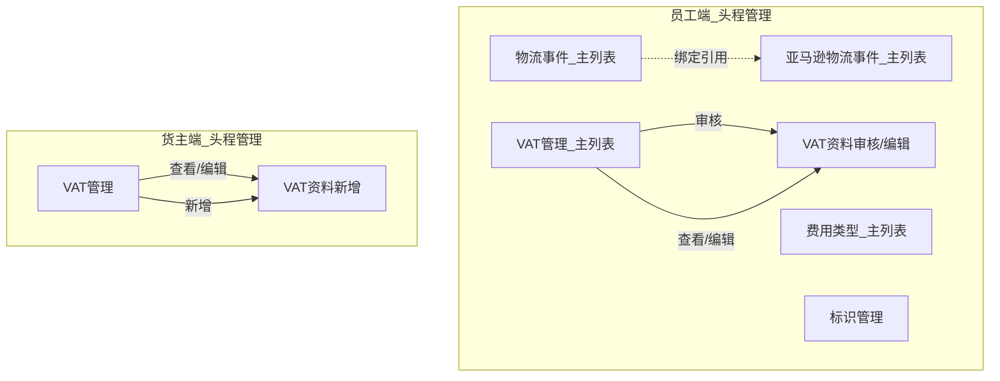

# PRD -- 头程管理

---

## 0. 文档基础信息

- 文档标题：头程管理
- 版本号：v2.1
- 状态：草稿
- 作者：飞点跨境产品经理
- 评审人：待定（产品/研发/测试/业务代表）
- 计划里程碑：评审 / 提测 / 上线 待定

### 0.1 变更记录

| 版本 | 变更日期 | 变更内容 | 变更人 |
|------|---------|---------|--------|
| v0.1 | 2026-06-06 | 初稿，基于 Demo 反向生成 | 飞点跨境产品经理 |
| v2.0 | 2026-06-06 | 基于 Excel 源数据完整重写：修正 VAT 唯一约束/员工权限/国家差异化附件、费用类型同方向唯一、物流事件名称唯一+Ship Track集成、亚马逊物流事件状态启停+查询接口、标识查询接口 | 飞点跨境产品经理 |
| v2.1 | 2026-06-06 | Demo + Excel + Draft 三方数据融合：标记3个待确认项、1个Demo内部BUG、标识模块范围确认(舱单/运单)、异常处理池归属判定 | 飞点跨境产品经理 |
| v2.1-final | 2026-06-06 | 确认3个待确认项：(1) event_template notify=否时不必填；(2) 物流事件名称全局唯一跨租户不重复；(3) 标识模块范围舱单/运单。同步更新R11/R13/R19/R21等业务规则及所有⚠️标记 | 飞点跨境产品经理 |

### 0.2 关联链接

- 用户需求(RDD)：`drafts/头程管理/2026-06-06-用户需求.md` (v2.1)
- 数据设计：`drafts/头程管理/2026-06-06-数据设计.md` (v2.1)
- 需求背景：待补充
- 原型：待更新

### 0.3 评审记录

| 日期 | 参会人 | 主要问题/结论 | 待办 |
|------|--------|-------------|------|

---

## 1. 需求定义

### 1.1 背景与现状

跨境头程物流涉及多个基础配置的维护：VAT/EORI税务资料的提交与审核、费用类型定义（用于运单应收应付流水）、物流事件模板（用于运单跟踪通知+Ship Track对接）、亚马逊标准物流事件代码以及标识体系（用于舱单/运单打标）。当前这些配置缺乏统一的结构化管理和系统间调用接口。

### 1.2 目标与成功口径

- 目标：为TMS平台上线头程管理5个基础配置子模块，提供标准化的配置维护和下游查询接口
- 成功口径：VAT审核周期从3-5个工作日缩短至2个工作日内；下游模块（运单/提单/Ship Track/计费）可通过接口实时获取配置数据

### 1.3 范围与边界

- In Scope（本期 P0）：VAT管理（货主端+员工端，含国家差异化附件）、费用类型管理（同方向唯一）、物流事件管理（名称唯一+Ship Track绑定+查询接口）、亚马逊物流事件管理（状态启停+查询接口）、标识管理（查询接口供舱单/运单打标）
- Out of Scope：物流事件触发到运单/提单路由（二期）、Ship Track联调对接（二期）、标识动态分配（二期）、VAT第三方API校验（三期）

### 1.4 影响范围

- 影响角色：运营员工、货主
- 依赖系统：用户模块（VAT引用 user_id）、运单模块（调用查询接口）、Ship Track（调用亚马逊事件代码）

---

## 2. 枚举字典

| 枚举名 | 值 | 常量名 | 中文 | 适用实体 |
|--------|----|--------|------|---------|
| NotifyCustomer | 10 | YES | 是 | LogisticsEvent |
| NotifyCustomer | 20 | NO | 否 | LogisticsEvent |
| EventStatus | 10 | ACTIVE | 正常 | LogisticsEvent, FeeType, Tag, AmazonLogisticsEvent |
| EventStatus | 20 | FROZEN | 已冻结 | LogisticsEvent, FeeType, Tag, AmazonLogisticsEvent |
| AuditStatus | 10 | PENDING | 待审核 | VATRegistration |
| AuditStatus | 20 | APPROVED | 已通过 | VATRegistration |
| AuditStatus | 30 | REJECTED | 已拒绝 | VATRegistration |
| FeeDirection | 10 | RECEIVABLE | 应收 | FeeType |
| FeeDirection | 20 | PAYABLE | 应付 | FeeType |
| ModuleScope | 10 | MANIFEST | 舱单 | Tag（⚠️ Demo误用"提单"，以本表为准） |
| ModuleScope | 20 | WAYBILL | 运单 | Tag |
| AttachmentType | 10 | VAT_CERT | VAT证书 | VATAttachment |
| AttachmentType | 20 | EORI_CERT | EORI证书 | VATAttachment |
| AttachmentType | 30 | POA | POA授权文件 | VATAttachment |
| AttachmentType | 40 | PVA | PVA授权文件 | VATAttachment |
| AttachmentType | 50 | BUSINESS_LICENSE | 营业执照 | VATAttachment |
| AttachmentType | 60 | ID_CARD | 法人身份证/护照 | VATAttachment |
| AttachmentType | 70 | TAX_PROOF | 缴税证明 | VATAttachment |
| AttachmentType | 80 | OTHER | 其他文件 | VATAttachment |
| Country | GB | GB | 英国 | VATRegistration |
| Country | DE | DE | 德国 | VATRegistration |
| Country | FR | FR | 法国 | VATRegistration |

---

## 3. 状态机

### 3.1 物流事件 / 费用类型 / 标识 / 亚马逊物流事件 通用状态流转

> ⚠️ **Demo差异**：亚马逊物流事件在Demo中无状态字段。草案按标准配置治理设计增加状态启停。

```
[正常] --{冻结}--> [已冻结] --{启用}--> [正常]
```

| 当前状态 | 操作 | 目标状态 | 触发角色 | 校验条件 |
|---------|------|---------|---------|---------|
| 正常 | 冻结 | 已冻结 | 运营员工 | 二次确认弹窗 (ElMessageBox.confirm, type: warning) |
| 已冻结 | 启用 | 正常 | 运营员工 | 二次确认弹窗 (ElMessageBox.confirm, type: warning) |

> 附加规则：编辑已冻结实体时，弹窗自动切换只读模式（标题变为"查看XX"，确定按钮隐藏，仅显示关闭/取消）。

### 3.2 VAT资料审核状态流转

```
[待审核] --{审核通过}--> [已通过]
   |                       
   +--{审核拒绝}--> [已拒绝] --{货主重新提交}--> [待审核]
```

| 当前状态 | 操作 | 目标状态 | 触发角色 | 校验条件 |
|---------|------|---------|---------|---------|
| 待审核 | 审核通过 | 已通过 | 运营员工 | 二次确认弹窗 |
| 待审核 | 审核拒绝 | 已拒绝 | 运营员工 | 拒绝原因不能为空 (/\S+/) |
| 已拒绝 | 编辑保存 | 待审核 | 货主 | 所有必填项+按国家附件校验通过 |

> 补充规则：员工端可修改VAT资料的全部字段，修改操作不改变审核状态。

---

## 4. 功能清单与页面映射

| 模块 | 功能点 | 优先级 | 对应页面 | 页面类型 |
|------|--------|--------|---------|---------|
| VAT管理(货主端) | 列表+Tab搜索+新增/编辑/查看 | P0 | VAT管理 (货主端) | 列表页 |
| VAT资料新增(货主端) | 表单+国家差异化附件+提交审核 | P0 | VAT资料新增 (货主端) | 编辑页 |
| VAT管理(员工端) | 列表+Tab搜索+审核/查看/编辑 | P0 | VAT管理_主列表 (员工端) | 列表页 |
| VAT资料审核/编辑(员工端) | 只读审核+全字段编辑 | P0 | VAT资料审核/编辑 (员工端) | 编辑页 |
| 费用类型 | 列表+搜索+新增/编辑+冻结启用 | P0 | 费用类型_主列表 | 列表页+弹窗 |
| 物流事件 | 列表+搜索+新增/编辑(含占位符)+冻结启用 | P0 | 物流事件_主列表 | 列表页+弹窗 |
| 亚马逊物流事件 | 列表+新增/编辑+冻结启用 | P0 | 亚马逊物流事件_主列表 | 列表页+弹窗 |
| 标识管理 | 列表+搜索+新增/编辑(含颜色选择器)+冻结启用 | P0 | 标识管理 | 列表页+弹窗 |

### 4.1 页面导航关系图



---

## 5. 页面规格

### 5.1 VAT管理（货主端）

**页面信息**：
- 路径：货主端 > VAT管理
- 类型：列表页
- 访问角色：货主（仅查看自己的数据，按 user_id 隔离）

**字段表（列表）**：

| 字段名 | 中文名 | 类型 | 备注 |
|--------|--------|------|------|
| vat_no | VAT号 | 文本 | — |
| eori_no | EORI号 | 文本 | — |
| legal_person | 法人姓名 | 文本 | — |
| country | 注册国家 | 文本 | GB-英国 / DE-德国 / FR-法国 |
| company_name | 公司名称 | 文本 | — |
| audit_status | 审核状态 | 标签 | 待审核=warning, 已通过=success, 已拒绝=danger |

**搜索条件**：VAT号（文本输入）、EORI号（文本输入）

**Tab页签**：待审核 / 已通过 / 已拒绝 / 全部

**交互行为**：
- [新增]：点击"新增VAT" → 跳转 VAT资料新增.html
- [查看]：已通过/待审核行显示"查看"按钮 → 跳转 VAT资料新增.html?mode=view
- [编辑]：已拒绝行显示"编辑"按钮 → 跳转 VAT资料新增.html?mode=edit

**关联接口**：
- 查询：`GET /api/vat-registrations` (params: vatNo, eoriNo, auditStatus, page, pageSize) -- 自动过滤当前 user_id

---

### 5.2 VAT资料新增（货主端）

**页面信息**：
- 路径：货主端 > VAT管理 > VAT资料新增/编辑/查看
- 类型：编辑页
- 访问角色：货主

**字段表（基本信息）**：

| 字段名 | 中文名 | 类型 | 必填 | 校验规则 | 备注 |
|--------|--------|------|------|---------|------|
| vat_no | VAT号 | 文本输入 | 是 | 非空，同客户下VAT号+EORI号联合唯一 | — |
| eori_no | EORI号 | 文本输入 | 是 | 非空，同客户下VAT号+EORI号联合唯一 | — |
| business_license_no | 营业执照编码 | 文本输入 | 是 | 非空 | — |
| legal_person | 公司法人 | 文本输入 | 是 | 非空 | — |
| company_name | 公司名 | 文本输入 | 是 | 非空 | — |
| company_en_name | 公司英文名 | 文本输入 | 是 | 非空 | — |
| country | 注册国家 | 下拉选择 | 是 | 必选 | GB/DE/FR，选择后动态切换附件必填规则 |
| province | 注册省份 | 文本输入 | 否 | — | 英文 |
| city | 注册城市 | 文本输入 | 否 | — | 英文 |
| zip_code | 注册邮编 | 文本输入 | 是 | 非空 | — |
| address | 注册地址 | 文本输入 | 是 | 非空 | — |

**字段表（电商平台信息）**：

| 字段名 | 中文名 | 类型 | 必填 | 备注 |
|--------|--------|------|------|------|
| amazon_shop_link | 亚马逊店铺链接 | 文本输入 | 是 | — |
| shop_vat_screenshot | 电商店铺绑定VAT截图 | 文件上传 | 是 | 限制1个文件，需清晰展示店铺名称及VAT税号 |

**资料附件（按注册国家差异化展示）**：

| 附件类型 | 英国(GB) 必填 | 其他欧洲国家(DE/FR等) 必填 |
|----------|:---:|:---:|
| VAT证书 | 是 | 是 |
| EORI证书 | 是 | 是 |
| POA授权文件 | 是 | 是 |
| PVA授权文件 | 是 | — |
| 营业执照 | — | 是 |
| 法人身份证/护照 | — | 是 |
| 缴税证明 | — | 是 |
| 其他文件 | 否 | 否 |

**签署日期**：日期选择器，必填，格式 YYYY-MM-DD

**交互行为**：
- [新增模式]：表单可编辑，底部"取消"+ "提交审核"，提交后 Toast"VAT资料提交成功，请等待平台审核！"，跳转回列表
- [查看模式]（mode=view）：整个表单 `:disabled="true"`，底部"返回列表"按钮
- [编辑模式]（mode=edit）：已拒绝状态可编辑，底部"取消"+ "提交审核"
- [注册国家切换]：选择不同国家时，附件区域动态显示对应的必传项（红色星号标记），非必传项隐藏或灰色标记"该国家不需要此项"

**关联接口**：
- 新增：`POST /api/vat-registrations` (body: 完整表单数据)
- 编辑：`PUT /api/vat-registrations/{id}` (body: 完整表单数据)
- 附件上传：`POST /api/vat-attachments/upload` (multipart/form-data)

---

### 5.3 VAT管理_主列表（员工端）

**页面信息**：
- 路径：员工端 > 头程管理 > VAT管理
- 类型：列表页
- 访问角色：运营员工（可查看和操作所有货主的VAT资料，无权限管控）

> ⚠️ **Demo UX BUG**：Demo中已通过/已拒绝行的"查看"按钮实际跳转 `mode=edit`（编辑模式），按钮标签与行为不一致。本PRD中正确区分"查看"(mode=view)和"编辑"(mode=edit)。Demo需修正按钮标签。

**字段表（列表）**：

| 字段名 | 中文名 | 类型 | 备注 |
|--------|--------|------|------|
| vat_no | VAT号 | 文本 | — |
| eori_no | EORI号 | 文本 | — |
| legal_person | 法人姓名 | 文本 | — |
| country | 注册国家 | 文本 | GB-英国 / DE-德国 / FR-法国 |
| company_name | 公司名称 | 文本 | — |
| customer_name | 用户名称 | 文本 | 货主用户名称（员工端特有列） |
| audit_status | 审核状态 | 标签 | 待审核=warning, 已通过=success, 已拒绝=danger |

**搜索条件**：用户名称（文本输入）、VAT号（文本输入）、EORI号（文本输入）

**Tab页签**：待审核 / 已通过 / 已拒绝 / 全部

**交互行为**：
- [审核]：待审核行显示"审核"按钮（warning色） → 跳转 VAT资料审核/编辑.html?mode=audit
- [查看]：已通过/已拒绝行显示"查看"按钮 → 跳转 VAT资料审核/编辑.html?mode=view
- [编辑]：已通过/已拒绝行显示"编辑"按钮 → 跳转 VAT资料审核/编辑.html?mode=edit（员工可修改全部字段）

**关联接口**：
- 查询：`GET /api/vat-registrations/all` (params: customerName, vatNo, eoriNo, auditStatus, page, pageSize) -- 返回所有货主数据，无 user_id 过滤

---

### 5.4 VAT资料审核/编辑（员工端）

**页面信息**：
- 路径：员工端 > 头程管理 > VAT管理 > VAT资料审核/查看/编辑
- 类型：编辑页
- 访问角色：运营员工

**字段表**：与 5.2 货主端表单字段完全一致

**交互行为**：
- [审核模式]（mode=audit）：所有字段只读展示；底部"取消"+ "审核通过"（success色）+ "审核拒绝"（danger色）
  - 审核通过：`ElMessageBox.confirm`（"确认该VAT资料信息无误并审核通过？"）→ 确认后 Toast "审核已通过！"，跳转回列表
  - 审核拒绝：`ElMessageBox.prompt`（"请输入拒绝原因"，校验 `/\S+/`，不能为空）→ 确认后 Toast "已拒绝该VAT申请，原因：{reason}"，跳转回列表
- [查看模式]（mode=view）：所有字段只读，底部只有"返回列表"按钮
- [编辑模式]（mode=edit）：所有字段可编辑（员工可修改全部信息），修改不改变审核状态；底部"取消"+ "保存"，保存后 Toast "保存成功"，返回列表

**关联接口**：
- 审核：`PATCH /api/vat-registrations/{id}/audit` (body: action=pass/reject, rejectReason)
- 编辑保存：`PUT /api/vat-registrations/{id}` (body: 完整表单数据)

---

### 5.5 费用类型_主列表

**页面信息**：
- 路径：员工端 > 头程管理 > 费用类型
- 类型：列表页
- 访问角色：运营员工（无权限管控）

**搜索条件**：费用名称（文本输入）、费用方向（下拉：应收/应付）

**字段表（列表）**：

| 字段名 | 中文名 | 类型 | 备注 |
|--------|--------|------|------|
| fee_name | 费用名称 | 文本 | — |
| fee_direction | 费用方向 | 标签 | 应收=success绿色, 应付=warning橙色 |
| status | 状态 | 标签 | 正常=success, 已冻结=danger |
| operator | 操作人 | 文本 | 最后操作人 |

**字段表（新增/编辑弹窗）**：

| 字段名 | 中文名 | 类型 | 必填 | 校验规则 | 备注 |
|--------|--------|------|------|---------|------|
| fee_name | 费用名称 | 文本输入 | 是 | 非空 + 同方向名称唯一 | — |
| fee_direction | 费用方向 | 下拉选择 | 是 | 必选 | 应收 / 应付 |

**交互行为**：
- [查询]：支持按费用名称+费用方向组合搜索
- [重置]：清空搜索条件
- [新增]：弹窗"新增费用类型"，费用名称+费用方向均为必填
- [编辑]：弹窗"编辑费用类型"；若状态=已冻结→"查看费用类型"只读模式（确定按钮隐藏）
- [冻结/启用]：二次确认弹窗 `ElMessageBox.confirm`（type: warning），确认后切换状态并Toast提示
- [保存校验]：提交时校验"同方向费用名称唯一"——相同费用方向下不允许重复名称，不同方向之间允许同名

**关联接口**：
- 查询：`GET /api/fee-types` (params: feeName, feeDirection, page, pageSize)
- 新增：`POST /api/fee-types` (body: feeName, feeDirection)
- 编辑：`PUT /api/fee-types/{id}` (body: feeName, feeDirection)
- 切换状态：`PATCH /api/fee-types/{id}/toggle-status`

---

### 5.6 物流事件_主列表

**页面信息**：
- 路径：员工端 > 头程管理 > 物流事件
- 类型：列表页
- 访问角色：运营员工（无权限管控）

**搜索条件**：物流事件名称（文本输入）、绑定亚马逊物流事件（下拉选择）

**字段表（列表）**：

| 字段名 | 中文名 | 类型 | 备注 |
|--------|--------|------|------|
| event_name | 物流事件名称 | 文本 | 全局唯一 |
| amazon_event_name | 绑定亚马逊物流事件 | 关联显示 | logistics_event -> amazon_logistics_event.event_name，可空 |
| notify_customer | 是否需要通知客户 | 标签 | 是=success绿色, 否=info灰色 |
| status | 状态 | 标签 | 正常=success, 已冻结=danger |
| created_at | 创建时间 | DateTime | — |
| updated_at | 更新时间 | DateTime | — |

**字段表（新增/编辑弹窗）**：

| 字段名 | 中文名 | 类型 | 必填 | 校验规则 | 默认值 | 备注 |
|--------|--------|------|------|---------|--------|------|
| event_name | 物流事件名称 | 文本输入 | 是 | 非空 + 全局唯一 | — | — |
| amazon_event_id | 绑定亚马逊物流事件 | 下拉选择 | 否 | — | — | 选项来自 amazon_logistics_event 查询接口（仅正常状态） |
| notify_customer | 是否需要通知客户 | 下拉选择 | 是 | 必选 | 是 | 是/否 |
| event_template | 事件话术模板 | 多行文本 | 条件必填 | notify_customer=是时必填 | — | 支持占位符 |
| event_placeholders | 事件占位符可选项 | 复选框组 | 否 | — | — | 本地仓名称/海外仓代码/预计到港时间等 |
| notify_template | 通知话术模板 | 多行文本 | 条件必填 | notify_customer=是时必填 | — | 支持占位符 |
| notify_placeholders | 通知占位符可选项 | 复选框组 | 否 | — | — | 客户名称/订单号/本地仓名称/海外仓代码等 |

**交互行为**：
- [查询]：支持按物流事件名称+绑定亚马逊物流事件搜索
- [重置]：清空搜索条件
- [新增]：点击"新增"按钮 → 弹窗，标题"新增物流事件"
- [编辑]：点击行"编辑" → 弹窗；若 status=已冻结，弹窗标题变为"查看物流事件"，所有字段只读，隐藏"确定"按钮，仅显示"关闭"
- [冻结/启用]：点击行"冻结"/"启用" → `ElMessageBox.confirm`（type: warning）→ 确认后切换状态并 Toast
- [占位符]：勾选复选框时自动将 `[占位符名]` 追加到对应模板文本框末尾，重复勾选需判断避免重复追加

**关联接口**：
- 查询：`GET /api/logistics-events` (params: eventName, amazonEventId, page, pageSize)
- 新增：`POST /api/logistics-events`
- 编辑：`PUT /api/logistics-events/{id}`
- 切换状态：`PATCH /api/logistics-events/{id}/toggle-status`
- 供下游查询：`GET /api/logistics-events/query` (params: eventName, amazonEventId) -- 运单/提单路由更新时调用

---

### 5.7 亚马逊物流事件_主列表

**页面信息**：
- 路径：员工端 > 头程管理 > 亚马逊物流事件
- 类型：列表页
- 访问角色：运营员工（无权限管控）

> ⚠️ **Demo差异**：Demo中此页面无状态列、无搜索功能（仅新增+编辑+分页）。本PRD按标准配置治理设计增加状态启停和搜索功能。Demo需补充。

**字段表（列表）**：

| 字段名 | 中文名 | 类型 | 备注 |
|--------|--------|------|------|
| event_name | 亚马逊物流事件名称 | 文本 | — |
| event_code | 亚马逊物流事件代码 | 文本 | 全局唯一，如 K1/O1, D1 |
| status | 状态 | 标签 | 正常=success, 已冻结=danger |

**字段表（新增/编辑弹窗）**：

| 字段名 | 中文名 | 类型 | 必填 | 校验规则 | 备注 |
|--------|--------|------|------|---------|------|
| event_name | 亚马逊物流事件名称 | 文本输入 | 是 | 非空 | — |
| event_code | 亚马逊物流事件代码 | 文本输入 | 是 | 非空 + 全局唯一 | 如 K1/O1 |

**交互行为**：
- [新增]：点击"新增"按钮 → 弹窗，标题"新增亚马逊物流事件"
- [编辑]：点击行"编辑" → 弹窗，标题"编辑亚马逊物流事件"；若 status=已冻结→"查看亚马逊物流事件"只读模式
- [冻结/启用]：二次确认弹窗 → 确认后切换状态并 Toast
- 保存：校验 event_name 和 event_code 非空、event_code 全局唯一

**关联接口**：
- 查询：`GET /api/amazon-logistics-events` (params: eventName, eventCode, status, page, pageSize)
- 新增：`POST /api/amazon-logistics-events` (body: eventName, eventCode)
- 编辑：`PUT /api/amazon-logistics-events/{id}` (body: eventName, eventCode)
- 切换状态：`PATCH /api/amazon-logistics-events/{id}/toggle-status`
- 供下游查询：`GET /api/amazon-logistics-events/query` (params: eventCode, status) -- 物流事件模块和Ship Track调用

---

### 5.8 标识管理

**页面信息**：
- 路径：员工端 > 头程管理 > 标识管理
- 类型：列表页
- 访问角色：运营员工（无权限管控）

> ⚠️ **Demo差异**：Demo中模块范围下拉选项为"运单/提单"，本PRD按Excel需求使用"舱单/运单"。舱单(Manifest)是物流专业术语。Demo需修正。

**搜索条件**：标识名称（文本输入）、模块范围（下拉：舱单/运单）

**字段表（列表）**：

| 字段名 | 中文名 | 类型 | 备注 |
|--------|--------|------|------|
| tag_name | 标识名称 | 文本 | — |
| color | 颜色 | 色块圆点 | 显示为圆形色块，颜色来自 HEX 色值 |
| module_scope | 模块范围 | 文本 | 舱单 / 运单 |
| updated_at | 更新时间 | DateTime | — |
| created_by | 创建人 | 文本 | — |
| status | 状态 | 标签 | 正常=success, 已冻结=danger |

**字段表（新增/编辑弹窗）**：

| 字段名 | 中文名 | 类型 | 必填 | 备注 |
|--------|--------|------|------|------|
| tag_name | 标识名称 | 文本输入 | 是 | — |
| module_scope | 模块范围 | 下拉选择 | 是 | 舱单 / 运单 |
| color | 颜色 | 颜色选择器 | 是 | 10个预设色块 + 自定义取色器 |

**预设颜色**：`#00FFFF`(青), `#FFC0CB`(粉), `#FFFF00`(黄), `#FFA500`(橙), `#D3D3D3`(灰), `#98FB98`(绿), `#DDA0DD`(紫), `#FF6B6B`(红), `#2DA44E`(深蓝), `#CD853F`(棕)

**交互行为**：
- [查询]：支持按标识名称+模块范围搜索
- [搜索/重置]：查询按钮+重置按钮
- [新增]：弹窗"标识新增"
- [编辑]：弹窗"标识编辑"；若已冻结→"查看标识"只读模式
- [颜色选择]：点击预设色块选中（加粗边框高亮），或使用 `el-color-picker` 自定义取色
- [冻结/启用]：二次确认弹窗 → Toast 反馈

**关联接口**：
- 查询：`GET /api/tags` (params: tagName, moduleScope, page, pageSize)
- 新增：`POST /api/tags` (body: tagName, color, moduleScope)
- 编辑：`PUT /api/tags/{id}` (body: tagName, color, moduleScope)
- 切换状态：`PATCH /api/tags/{id}/toggle-status`
- 供下游查询：`GET /api/tags/query` (params: moduleScope, status) -- 舱单/运单打标调用

---

## 6. 业务规则

| 编号 | 触发点 | 条件/公式 | 输出 | 异常处理 |
|------|--------|----------|------|---------|
| R01 | VAT货主新增/编辑 | 同客户(user_id)下 VAT号+EORI号联合唯一 | 保存成功 | 重复时提示"该客户下VAT号+EORI号已存在" |
| R02 | VAT货主提交 | 注册国家=英国时，必传附件: VAT证书+EORI证书+POA+PVA | 提交成功，audit_status=待审核 | 缺少任一必传附件时阻断并提示 |
| R03 | VAT货主提交 | 注册国家=其他欧洲国家(DE/FR等)时，必传附件: VAT证书+EORI证书+POA+营业执照+法人身份证/护照+缴税证明 | 提交成功，audit_status=待审核 | 缺少任一必传附件时阻断并提示 |
| R04 | VAT货主端数据隔离 | 查询时自动追加 user_id=当前用户 | 仅返回自己的VAT资料 | — |
| R05 | VAT员工端查询 | 不过滤 user_id，返回全部货主数据 | 全量数据 | — |
| R06 | VAT员工端编辑 | 可修改全部字段（基本信息+电商信息+附件+签署日期），保存不改变审核状态 | 保存成功 | — |
| R07 | VAT员工审核通过 | 二次确认弹窗"确认该VAT资料信息无误并审核通过？" | audit_status=已通过, audited_at=now | 取消时不做任何变更 |
| R08 | VAT员工审核拒绝 | 拒绝原因不能为空 (/\S+/) | audit_status=已拒绝, reject_reason=输入值 | 为空时阻断并提示"拒绝原因不能为空" |
| R09 | VAT货主重新提交 | 已拒绝状态可编辑 → 保存后 audit_status 重置为待审核 | audit_status=待审核 | — |
| R10 | 费用类型新增/编辑 | 同费用方向(fee_direction)下 fee_name 唯一；不同方向可同名 | 保存成功 | 重复时提示"该费用方向下费用名称已存在" |
| R11 | 物流事件新增/编辑 | event_name 全局唯一，跨租户不重复 | 保存成功 | 重复时提示"物流事件名称已存在" |
| R12 | 物流事件新增/编辑 | notify_customer=是 时，event_template 和 notify_template 均不可为空 | 保存成功 | 任一为空时阻断并提示 |
| R13 | 物流事件新增/编辑 | notify_customer=否 时，event_template 不必填 | — | — |
| R14 | 物流事件/费用类型/标识/亚马逊事件 状态切换 | 二次确认弹窗 `ElMessageBox.confirm`(type: warning) 确认后执行 | 状态取反 | 取消时不做任何变更 |
| R15 | 编辑已冻结实体（全部子模块通用） | status=已冻结 → 弹窗标题变"查看XX"，所有字段只读，确定按钮隐藏 | 只读弹窗 | — |
| R16 | 亚马逊物流事件新增/编辑 | event_code 在 tenant 内全局唯一 | 保存成功 | 重复时提示"事件代码已存在" |
| R17 | 占位符复选框点击 | 勾选时自动追加 `[占位符名]` 到对应模板文本框末尾 | 模板文本更新 | 重复勾选需判断避免重复追加 |
| R18 | 标识颜色选择 | 预设10色 或 自定义取色器 HEX色值 | color 字段更新 | — |

---

## 7. 计算公式

> 头程管理模块不涉及金额计算，此章节暂无内容。（待二期计费模块接入后补充费用计算公式）

---

## 8. 权限矩阵

| 操作 | 运营员工 | 货主 |
|------|---------|------|
| 亚马逊物流事件 -- 查看 | 是 | 否 |
| 亚马逊物流事件 -- 新增/编辑/冻结启用 | 是（无权限管控） | 否 |
| 物流事件 -- 查看 | 是 | 否 |
| 物流事件 -- 新增/编辑/冻结启用 | 是（无权限管控） | 否 |
| VAT管理 -- 查看自己的资料 | — | 是 |
| VAT管理 -- 提交/编辑（仅已拒绝） | — | 是 |
| VAT管理 -- 查看全部货主资料 | 是（无权限管控） | 否 |
| VAT管理 -- 修改全部字段 | 是（无权限管控） | 否 |
| VAT管理 -- 审核（通过/拒绝） | 是（无权限管控） | 否 |
| 费用类型 -- 查看/新增/编辑/冻结启用 | 是（无权限管控） | 否 |
| 标识管理 -- 查看/新增/编辑/冻结启用 | 是（无权限管控） | 否 |

---

## 9. 接口清单

| 接口 | 方法 | 路径 | 触发页面 | 请求参数 | 返回字段 | 失败处理 |
|------|------|------|---------|---------|---------|---------|
| 查亚马逊物流事件列表 | GET | /api/amazon-logistics-events | 亚马逊物流事件_主列表 | eventName, eventCode, status, page, pageSize | 分页列表 | Toast 错误信息 |
| 新增亚马逊物流事件 | POST | /api/amazon-logistics-events | 弹窗 | eventName, eventCode | 实体 | Toast |
| 编辑亚马逊物流事件 | PUT | /api/amazon-logistics-events/{id} | 弹窗 | eventName, eventCode | 实体 | Toast |
| 切换亚马逊事件状态 | PATCH | /api/amazon-logistics-events/{id}/toggle-status | 列表行 | — | 新状态 | Toast |
| 查亚马逊事件（下游） | GET | /api/amazon-logistics-events/query | 物流事件/Ship Track | eventCode, status | 事件列表 | Toast |
| 查物流事件列表 | GET | /api/logistics-events | 物流事件_主列表 | eventName, amazonEventId, page, pageSize | 分页列表 | Toast |
| 新增物流事件 | POST | /api/logistics-events | 弹窗 | 全部字段 | 实体 | Toast |
| 编辑物流事件 | PUT | /api/logistics-events/{id} | 弹窗 | 全部字段 | 实体 | Toast |
| 切换物流事件状态 | PATCH | /api/logistics-events/{id}/toggle-status | 列表行 | — | 新状态 | Toast |
| 查物流事件（下游） | GET | /api/logistics-events/query | 运单/提单路由 | eventName, amazonEventId | 事件模板列表 | Toast |
| 查VAT列表（货主端） | GET | /api/vat-registrations | VAT管理(货主端) | vatNo, eoriNo, auditStatus, page, pageSize | 分页列表（仅当前用户） | Toast |
| 查VAT列表（员工端） | GET | /api/vat-registrations/all | VAT管理_主列表(员工端) | customerName, vatNo, eoriNo, auditStatus, page, pageSize | 分页列表（全部货主） | Toast |
| 新增VAT资料 | POST | /api/vat-registrations | VAT资料新增 | 完整表单数据 | 实体 | Toast + 跳转 |
| 编辑VAT资料 | PUT | /api/vat-registrations/{id} | VAT资料新增/编辑/员工编辑 | 完整表单数据 | 实体 | Toast + 跳转 |
| 审核VAT资料 | PATCH | /api/vat-registrations/{id}/audit | VAT资料审核 | action(pass/reject), rejectReason(拒绝时) | 实体 | Toast + 跳转 |
| 上传VAT附件 | POST | /api/vat-attachments/upload | VAT资料新增/编辑 | multipart file + attachment_type | file_url | Toast |
| 查费用类型列表 | GET | /api/fee-types | 费用类型_主列表 | feeName, feeDirection, page, pageSize | 分页列表 | Toast |
| 新增费用类型 | POST | /api/fee-types | 弹窗 | feeName, feeDirection | 实体 | Toast |
| 编辑费用类型 | PUT | /api/fee-types/{id} | 弹窗 | feeName, feeDirection | 实体 | Toast |
| 切换费用类型状态 | PATCH | /api/fee-types/{id}/toggle-status | 列表行 | — | 新状态 | Toast |
| 查费用类型（下游） | GET | /api/fee-types/query | 运单计费 | feeDirection, status | 费用类型列表 | Toast |
| 查标识列表 | GET | /api/tags | 标识管理 | tagName, moduleScope, page, pageSize | 分页列表 | Toast |
| 新增标识 | POST | /api/tags | 弹窗 | tagName, color, moduleScope | 实体 | Toast |
| 编辑标识 | PUT | /api/tags/{id} | 弹窗 | tagName, color, moduleScope | 实体 | Toast |
| 切换标识状态 | PATCH | /api/tags/{id}/toggle-status | 列表行 | — | 新状态 | Toast |
| 查标识（下游） | GET | /api/tags/query | 舱单/运单打标 | moduleScope, status | 标识列表 | Toast |
| 查VAT（下游） | GET | /api/vat-registrations/query | 运单查询 | vatNo, eoriNo, userId | VAT信息 | Toast |

---

## 10. 错误提示文案汇总

| 编号 | 触发条件 | 文案 | 类型 |
|------|---------|------|------|
| E01 | VAT号+EORI号在同客户下重复 | "该客户下VAT号+EORI号已存在" | 阻断 |
| E02 | VAT英国提交 -- 缺少必传附件(VAT/EORI/POA/PVA) | "注册国家为英国时，VAT证书、EORI证书、POA授权文件、PVA授权文件为必传项" | 阻断 |
| E03 | VAT其他欧洲国家提交 -- 缺少必传附件 | "注册国家为{国家}时，VAT证书、EORI证书、POA授权文件、营业执照、法人身份证/护照、缴税证明为必传项" | 阻断 |
| E04 | VAT货主提交未填必填项 | "请检查必填项及相关资料是否上传完整" | 阻断 |
| E05 | VAT审核拒绝 -- 拒绝原因为空 | "拒绝原因不能为空" | 阻断 |
| E06 | VAT审核通过确认 | "确认该VAT资料信息无误并审核通过？" | 提示(二次确认) |
| E07 | VAT货主提交成功 | "VAT资料提交成功，请等待平台审核！" | 提示 |
| E08 | 费用类型 -- 同方向费用名称重复 | "该费用方向下费用名称已存在" | 阻断 |
| E09 | 费用类型 -- 费用名称/方向为空 | "请输入费用名称" / "请选择费用方向" | 阻断 |
| E10 | 物流事件 -- 名称重复 | "物流事件名称已存在" | 阻断 |
| E11 | 物流事件 -- event_name 为空 | "请输入物流事件名称" | 阻断 |
| E12 | 物流事件 -- notify_customer 未选 | "请选择是否需要通知客户" | 阻断 |
| E13 | 物流事件 -- notify_customer=是且event_template为空 | "当【是否需要通知客户】为是时，【事件话术模板】必填" | 阻断 |
| E14 | 物流事件 -- notify_customer=是且notify_template为空 | "当【是否需要通知客户】为是时，【通知话术模板】必填" | 阻断 |
| E15 | 亚马逊物流事件 -- 代码重复 | "事件代码已存在" | 阻断 |
| E16 | 冻结/启用操作 | "确定要{冻结/启用}该{实体名}吗？" | 警告(二次确认) |
| E17 | 标识名称/颜色为空 | "请输入标识名称" / "请选择颜色" | 阻断 |

---

## 11. 验收标准

| 编号 | 验收项 | 验收方式 | 通过标准 | 关联 AC |
|------|--------|---------|---------|---------|
| A01 | 货主端VAT Tab过滤 | 手动 | 4个Tab正确过滤对应状态数据 | AC01-VS01 |
| A02 | 货主端VAT新增 -- 国家差异化附件 | 手动 | 选择英国时仅显示4项必传；选择德国时显示7项必传；非必传项隐藏或灰色标记 | AC01-VS02 |
| A03 | 货主端VAT新增 -- 联合唯一校验 | 手动 | 同客户下VAT号+EORI号重复时阻断并提示 | AC01-VS03 |
| A04 | 货主端查看模式只读 | 手动 | 表单disabled，仅显示"返回列表" | AC01-VS04 |
| A05 | 员工端VAT全量查看 | 手动 | 列表展示所有货主资料，"用户名称"列和搜索条件正常 | AC02-VE01 |
| A06 | 员工端VAT全字段编辑 | 手动 | 编辑模式下所有字段可修改，保存不改变审核状态 | AC02-VE02 |
| A07 | 员工端审核拒绝含原因 | 手动 | 拒绝原因不能为空校验生效 /\S+/ | AC02-VE03 |
| A08 | 员工端审核通过确认 | 手动 | 二次确认弹窗正确显示和交互 | AC02-VE03 |
| A09 | 费用类型同方向唯一校验 | 手动 | 相同方向+同名→阻断；不同方向+同名→通过 | AC03-FT02 |
| A10 | 费用类型冻结后只读 | 手动 | 弹窗标题变为"查看费用类型"，确定按钮隐藏 | AC03-FT03 |
| A11 | 物流事件名称唯一校验 | 手动 | 重复名称新增时阻断并提示 | AC04-LE02 |
| A12 | 物流事件条件必填 | 手动 | notify_customer=是时event_template+notify_template均必填 | AC04-LE02 |
| A13 | 物流事件占位符自动追加 | 手动 | 勾选占位符复选框时自动追加[占位符名]到模板末尾 | AC04-LE03 |
| A14 | 物流事件冻结后只读 | 手动 | 同 A10 | AC04-LE04 |
| A15 | 亚马逊物流事件代码唯一校验 | 手动 | 重复代码新增时阻断 | AC05-AE02 |
| A16 | 亚马逊物流事件状态启停 | 手动 | 冻结/启用操作二级确认 | AC05-AE02 |
| A17 | 亚马逊事件查询接口 | 手动 | GET /api/amazon-logistics-events/query 按code/status返回 | AC05-AE03 |
| A18 | 标识颜色选择器 | 手动 | 预设10色+自定义取色器均可正常使用 | AC06-TG02 |
| A19 | 标识查询接口 | 手动 | GET /api/tags/query 按moduleScope/status返回 | AC06-TG03 |

---

## 12. 附录

- 术语表：
  - **头程 (First Mile)**：货物从国内本地仓到海外目的港/仓的运输过程
  - **VAT** (Value Added Tax)：欧盟增值税，清关必需
  - **EORI** (Economic Operators Registration and Identification)：欧盟经济运营商注册识别号
  - **FBA** (Fulfilled by Amazon)：亚马逊物流，商家将货物发至亚马逊仓库由亚马逊配送
  - **POA** (Power of Attorney)：海关授权委托书
  - **PVA** (Postponed VAT Accounting)：延期增值税核算
  - **Ship Track**：亚马逊物流轨迹跟踪系统
  - **舱单 (Manifest)**：海运/空运货物清单（⚠️ 区别于提单 B/L：提单是运输合同凭证，舱单是货物清单）
  - **提单 (B/L, Bill of Lading)**：海运提单，货物运输合同的凭证
  - **运单 (Waybill)**：物流运输单据
- 原型链接：见 0.2 关联链接
- 用户需求(RDD)（完整业务流程+字段表）：`drafts/头程管理/2026-06-06-用户需求.md`
- 数据设计（完整 Schema+ER 图）：`drafts/头程管理/2026-06-06-数据设计.md`

---

## 13. 数据融合附录：Demo vs PRD 差异总览

> v2.1 融合日期：2026-06-06 | 覆盖9个Demo页面 | 融合原则：Demo字段名/交互为真相源，Excel业务规则为需求源

### 13.1 Demo 页面与 PRD 页面映射

| Demo 页面 | PRD 章节 | 状态 |
|-----------|---------|------|
| VAT管理_主列表.html (员工端) | 5.3 VAT管理_主列表（员工端） | 已对齐，标注1个UX BUG |
| VAT资料新增-优化版.html (员工端) | 5.4 VAT资料审核/编辑（员工端） | 已对齐 |
| VAT管理.html (货主端) | 5.1 VAT管理（货主端） | 已对齐 |
| VAT资料新增.html (货主端) | 5.2 VAT资料新增（货主端） | 已对齐 |
| 费用类型_主列表.html | 5.5 费用类型_主列表 | 已对齐 |
| 物流事件_主列表.html | 5.6 物流事件_主列表 | 已对齐（event_template条件已确认：notify=否时不必填） |
| 亚马逊物流事件_主列表.html | 5.7 亚马逊物流事件_主列表 | Demo缺失status/搜索，PRD已补充 |
| 标识管理.html | 5.8 标识管理 | Demo module_scope值偏差(提单→舱单)，已标注 |
| 异常处理池.html | **无对应** | 归入运单管理模块，非头程管理范畴 |

### 13.2 Demo 中需修正的已知问题

| # | 问题 | 位置 | 影响 | 修正建议 |
|:---|------|------|------|---------|
| BUG-1 | Vue模板 `formData.amazonLink` 与 JS data model `shopLink` 变量名不一致 | VAT资料新增-优化版.html / VAT资料新增.html | 运行时字段数据无法绑定，输入值丢失 | 统一为 `amazonLink` 或 `shopLink` |
| BUG-2 | 员工端VAT列表"查看"按钮实际跳转编辑模式 (`mode=edit`) | VAT管理_主列表.html (员工端) | 按钮标签误导用户，应拆分为"查看"和"编辑"两个按钮 | 待审核→"审核"；已通过/已拒绝→"查看"+"编辑" |
| FIX-1 | 标识模块范围下拉选项为"运单/提单" | 标识管理.html | "提单"应为"舱单"(Manifest)，与Excel需求不一致 | 改为"舱单/运单" |
| FIX-2 | 亚马逊物流事件列表缺少状态列和搜索 | 亚马逊物流事件_主列表.html | 无法冻结/启停事件，无法按条件搜索 | 增加status列、搜索区 |

### 13.3 待确认项（已全部确认，v2.1-final）

| # | 原待确认内容 | 涉及实体 | 决议 |
|:---|-----------|---------|------|
| Q1 | 物流事件 `event_template` 是否始终必填？ | 物流事件 | notify=否时不必填，notify=是时必填 |
| Q2 | 物流事件名称是否全局唯一？ | 物流事件 | 全局唯一，跨租户不重复 |
| Q3 | 标识模块范围"舱单"vs"提单" | 标识 | 采用"舱单/运单" |
