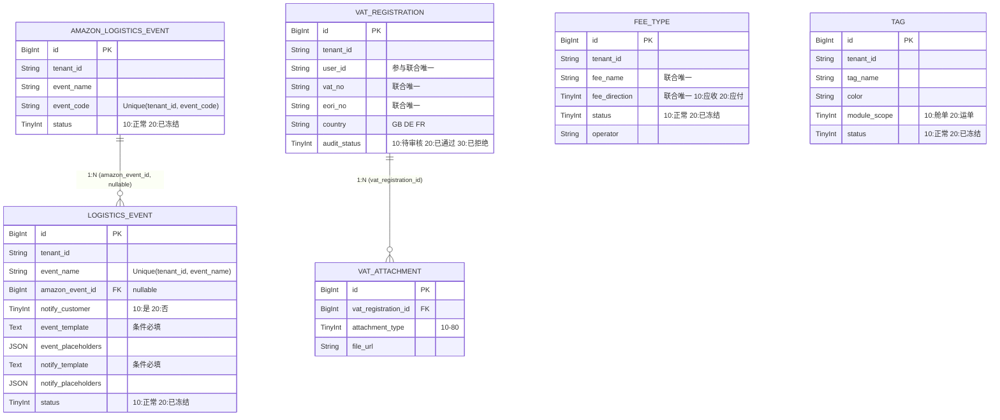

# 数据设计 -- 头程管理

> **文档版本**: v2.1 | **日期**: 2026-06-06 | **作者**: 飞点跨境产品经理
> **上游文档**: `2026-06-06-用户需求.md` (RDD v2.1)
> **本次更新**: Demo + Excel + Draft 三方数据融合，标注设计层与Demo的差异点

---

## 一、实体清单 x 表映射

| 实体名称 | 对应表/子表 | 映射方式 | 说明 |
|----------|------------|---------|------|
| VATRegistration (VAT注册资料) | `vat_registration` | 聚合根 | 基本信息+电商平台信息，员工端可修改全部字段 |
| VATAttachment (VAT附件) | `vat_attachment` | 1:N 子表 | 通过 `vat_registration_id` 关联，附件类型按注册国家差异化 |
| FeeType (费用类型) | `fee_type` | 独立表 | 费用科目字典，同方向费用名称唯一 |
| LogisticsEvent (物流事件) | `logistics_event` | 独立表 | 自定义物流事件模板，N:1 关联 AmazonLogisticsEvent，配合Ship Track |
| AmazonLogisticsEvent (亚马逊物流事件) | `amazon_logistics_event` | 独立表 | 亚马逊标准物流事件代码字典，含状态启停 |
| Tag (标识) | `tag` | 独立表 | 标识定义，供舱单/运单打标引用 |

---

## 二、逐表字段清单

### 2.1 表: `vat_registration` | 对应实体: VATRegistration (聚合根)

> **设计说明**: VAT注册资料的聚合根，含基本信息和电商平台信息。同客户下 VAT号+EORI号联合唯一。文件附件拆到 `vat_attachment` 子表。员工端可修改全部字段。提供查询接口供运单模块调用。
> ⚠️ **Demo BUG**：Demo中Vue模板引用 `formData.amazonLink`，但JS data model定义为 `formData.shopLink`，变量名不一致。本设计使用 `amazon_shop_link`。

| 字段名 (En) | 字段名 (Cn) | 类型 (Type) | 必填 | 约束/索引 | 枚举/备注 |
|:---|:---|:---|:---|:---|:---|
| `id` | 主键 | BigInt | Yes | **PK** | 雪花ID |
| `tenant_id` | 租户ID | String | Yes | Index | SaaS数据隔离 |
| `user_id` | 提交用户ID | String | Yes | Index | 货主端数据隔离，参与联合唯一 |
| `vat_no` | VAT号 | String(50) | Yes | **Unique** (tenant_id, user_id, vat_no, eori_no) | 如 GB286484751 |
| `eori_no` | EORI号 | String(50) | Yes | **Unique** (tenant_id, user_id, vat_no, eori_no) | 如 GB286484750001 |
| `business_license_no` | 营业执照编码 | String(100) | Yes | — | — |
| `legal_person` | 公司法人 | String(100) | Yes | — | 法人姓名 |
| `company_name` | 公司名 | String(200) | Yes | — | 营业执照公司名 |
| `company_en_name` | 公司英文名 | String(200) | Yes | — | 英文名称 |
| `country` | 注册国家 | String(10) | Yes | Index | GB:英国, DE:德国, FR:法国，可扩展 |
| `province` | 注册省份 | String(100) | No | — | 英文 |
| `city` | 注册城市 | String(100) | No | — | 英文 |
| `zip_code` | 注册邮编 | String(20) | Yes | — | 如 SG18 8NH |
| `address` | 注册地址 | String(300) | Yes | — | 如 UNIT 19 ELDON WAY |
| `amazon_shop_link` | 亚马逊店铺链接 | String(500) | Yes | — | 店铺URL |
| `shop_vat_screenshot` | 电商店铺绑定VAT截图 | String(500) | Yes | — | 文件URL（单文件） |
| `sign_date` | 签署日期 | Date | Yes | — | YYYY-MM-DD |
| `audit_status` | 审核状态 | TinyInt | Yes | Index | 10:待审核, 20:已通过, 30:已拒绝 |
| `audit_reject_reason` | 拒绝原因 | Text | No | — | 当 audit_status=30 时必填 |
| `audited_at` | 审核时间 | DateTime | No | — | 通过/拒绝时记录 |
| `audited_by` | 审核人 | String | No | — | 员工端操作用户 |
| `created_at` | 创建时间 | DateTime | Yes | — | 自动生成 |
| `created_by` | 创建人 | String | Yes | — | 货主端当前用户 |
| `updated_at` | 更新时间 | DateTime | Yes | — | 自动维护 |
| `updated_by` | 更新人 | String | Yes | — | 当前用户（货主或员工） |
| `is_deleted` | 软删除标识 | Boolean | Yes | — | Default: false |
| `version` | 乐观锁版本 | Int | Yes | — | 并发控制，防止员工审核与货主编辑冲突 |

**关联关系**:
- `One-to-Many` with `vat_attachment` (通过 `id` → `vat_registration_id`)

**查询接口**:
- 供运单模块查询：按 vat_no / eori_no / user_id 检索VAT注册信息

---

### 2.2 表: `vat_attachment` | 对应实体: VATAttachment

> **设计说明**: VAT注册资料的附件子表，每个附件记录对应一个文件上传项。通过 `attachment_type` 区分8种附件类型。注册国家=英国时必传 VAT证书/EORI证书/POA/PVA；其他欧洲国家加传营业执照/法人身份证/缴税证明。

| 字段名 (En) | 字段名 (Cn) | 类型 (Type) | 必填 | 约束/索引 | 枚举/备注 |
|:---|:---|:---|:---|:---|:---|
| `id` | 主键 | BigInt | Yes | **PK** | 雪花ID |
| `tenant_id` | 租户ID | String | Yes | Index | SaaS数据隔离 |
| `vat_registration_id` | VAT资料ID | BigInt | Yes | Index, FK→vat_registration.id | 关联聚合根 |
| `attachment_type` | 附件类型 | TinyInt | Yes | Index | 10:VAT证书, 20:EORI证书, 30:POA授权文件, 40:PVA授权文件, 50:营业执照, 60:法人身份证/护照, 70:缴税证明, 80:其他文件 |
| `file_name` | 文件名 | String(200) | Yes | — | 原始文件名 |
| `file_url` | 文件URL | String(500) | Yes | — | 文件存储路径 |
| `file_size` | 文件大小 | BigInt | No | — | 字节数 |
| `sort_order` | 排序 | Int | No | — | 同类型多文件时的排序 |
| `created_at` | 创建时间 | DateTime | Yes | — | 自动生成 |
| `created_by` | 创建人 | String | Yes | — | 当前用户 |
| `updated_at` | 更新时间 | DateTime | Yes | — | 自动维护 |
| `updated_by` | 更新人 | String | Yes | — | 当前用户 |
| `is_deleted` | 软删除标识 | Boolean | Yes | — | Default: false |
| `version` | 乐观锁版本 | Int | Yes | — | 并发控制 |

**关联关系**:
- `Many-to-One` with `vat_registration` (通过 `vat_registration_id`)

**业务约束**:
- 注册国家=英国(GB)时：attachment_type=10,20,30,40 至少各一条记录
- 注册国家=其他(DE/FR)时：attachment_type=10,20,30,50,60,70 至少各一条记录

---

### 2.3 表: `fee_type` | 对应实体: FeeType

> **设计说明**: 费用类型字典表，供下游运单计费模块引用。同方向（应收/应付）费用名称唯一——不同方向可有同名费用（如"应收-超重费"和"应付-超重费"）。无权限管控。提供查询接口供运单计费调用。

| 字段名 (En) | 字段名 (Cn) | 类型 (Type) | 必填 | 约束/索引 | 枚举/备注 |
|:---|:---|:---|:---|:---|:---|
| `id` | 主键 | BigInt | Yes | **PK** | 雪花ID |
| `tenant_id` | 租户ID | String | Yes | Index | SaaS数据隔离 |
| `fee_name` | 费用名称 | String(100) | Yes | **Unique** (tenant_id, fee_name, fee_direction) | 如"周六派送费""超重费" |
| `fee_direction` | 费用方向 | TinyInt | Yes | **Unique** (tenant_id, fee_name, fee_direction) | 10:应收, 20:应付 |
| `status` | 状态 | TinyInt | Yes | Index | 10:正常, 20:已冻结 |
| `operator` | 操作人 | String | Yes | — | 最后操作人标识 |
| `created_at` | 创建时间 | DateTime | Yes | — | 自动生成 |
| `created_by` | 创建人 | String | Yes | — | 当前用户 |
| `updated_at` | 更新时间 | DateTime | Yes | — | 自动维护 |
| `updated_by` | 更新人 | String | Yes | — | 当前用户 |
| `is_deleted` | 软删除标识 | Boolean | Yes | — | Default: false |
| `version` | 乐观锁版本 | Int | Yes | — | 并发控制 |

**关联关系**:
- 无外部关联（独立字典表）

**查询接口**:
- 供运单计费模块调用：按 fee_direction / status 过滤，返回费用类型列表

---

### 2.4 表: `logistics_event` | 对应实体: LogisticsEvent

> **设计说明**: 存储自定义物流事件模板，含事件话术和通知话术模板。物流事件名称全局唯一。绑定亚马逊物流事件代码以配合Ship Track。供运单/提单更新路由时调用查询接口获取匹配的事件模板。
> ⚠️ **Demo差异**：(1) Demo以字符串直接存储亚马逊事件名称，本设计用FK `amazon_event_id`（正确做法）；(2) Demo中 `event_template` 始终必填，本设计按R20/R21区分条件（notify=是时必填，notify=否时不必填）

| 字段名 (En) | 字段名 (Cn) | 类型 (Type) | 必填 | 约束/索引 | 枚举/备注 |
|:---|:---|:---|:---|:---|:---|
| `id` | 主键 | BigInt | Yes | **PK** | 雪花ID |
| `tenant_id` | 租户ID | String | Yes | Index | SaaS数据隔离 |
| `event_name` | 物流事件名称 | String(100) | Yes | **Unique** (tenant_id, event_name) | 如"已开船""货物已入仓"，全局唯一 |
| `amazon_event_id` | 绑定亚马逊物流事件ID | BigInt | No | Index, FK→amazon_logistics_event.id | 可空，关联亚马逊事件 |
| `notify_customer` | 是否需要通知客户 | TinyInt | Yes | — | 10:是, 20:否 |
| `event_template` | 事件话术模板 | Text | No | — | notify_customer=10时必填；含占位符文本模板 |
| `event_placeholders` | 事件占位符选择 | JSON | No | — | 数组: ["本地仓名称","海外仓代码","预计到港时间"] |
| `notify_template` | 通知话术模板 | Text | No | — | 当 notify_customer=10 时必填 |
| `notify_placeholders` | 通知占位符选择 | JSON | No | — | 数组: ["客户名称","订单号","本地仓名称","海外仓代码"] |
| `status` | 状态 | TinyInt | Yes | Index | 10:正常, 20:已冻结 |
| `created_at` | 创建时间 | DateTime | Yes | — | 自动生成 |
| `created_by` | 创建人 | String | Yes | — | 当前用户 |
| `updated_at` | 更新时间 | DateTime | Yes | — | 自动维护 |
| `updated_by` | 更新人 | String | Yes | — | 当前用户 |
| `is_deleted` | 软删除标识 | Boolean | Yes | — | Default: false |
| `version` | 乐观锁版本 | Int | Yes | — | 并发控制 |

**关联关系**:
- `Many-to-One` with `amazon_logistics_event` (通过 `amazon_event_id`)

**业务约束**:
- `event_name` 在 tenant_id 内全局唯一
- `notify_customer` = 10（是）时，`notify_template` 和 `event_template` 均不可为空
- `notify_customer` = 20（否）时，`event_template` 不必填

**查询接口**:
- 供运单/提单更新路由时调用：按 event_name / amazon_event_id 查询，返回事件模板+话术+占位符
- 配合Ship Track：通过关联的 AmazonLogisticsEvent.event_code 传递给Ship Track

---

### 2.5 表: `amazon_logistics_event` | 对应实体: AmazonLogisticsEvent

> **设计说明**: 存储亚马逊标准物流事件代码字典，作为物流事件绑定的基础数据。含状态启停机制。提供查询接口供物流事件模块和Ship Track调用。无权限管控。
> ⚠️ **Demo差异**：Demo中此表无 `status` 字段（仅 eventName + eventCode），草案按标准设计增加状态启停。Excel未明确提及状态字段。

| 字段名 (En) | 字段名 (Cn) | 类型 (Type) | 必填 | 约束/索引 | 枚举/备注 |
|:---|:---|:---|:---|:---|:---|
| `id` | 主键 | BigInt | Yes | **PK** | 雪花ID |
| `tenant_id` | 租户ID | String | Yes | Index | SaaS数据隔离 |
| `event_name` | 亚马逊物流事件名称 | String(100) | Yes | — | 如"出口报关查验""货物已离港" |
| `event_code` | 亚马逊物流事件代码 | String(20) | Yes | **Unique** (tenant_id, event_code) | 如 K1/O1, D1, A1, K2, R1 |
| `status` | 状态 | TinyInt | Yes | Index | 10:正常, 20:已冻结 |
| `created_at` | 创建时间 | DateTime | Yes | — | 自动生成 |
| `created_by` | 创建人 | String | Yes | — | 当前用户 |
| `updated_at` | 更新时间 | DateTime | Yes | — | 自动维护 |
| `updated_by` | 更新人 | String | Yes | — | 当前用户 |
| `is_deleted` | 软删除标识 | Boolean | Yes | — | Default: false |
| `version` | 乐观锁版本 | Int | Yes | — | 并发控制 |

**关联关系**:
- `One-to-Many` with `logistics_event` (通过 `id` → `amazon_event_id`)

**查询接口**:
- 供物流事件模块调用：按 event_code / event_name / status 过滤，返回全部或正常状态的亚马逊事件列表
- 供Ship Track对接：通过 event_code 匹配亚马逊标准事件

---

### 2.6 表: `tag` | 对应实体: Tag

> **设计说明**: 标识定义表，存储可用于舱单/运单打标的彩色标识。颜色通过HEX色值存储，模块范围限定标识的适用场景。提供查询接口供舱单/运单打标功能调用。无权限管控。
> ⚠️ **Demo差异**：Demo中 `module_scope` 使用"运单/提单"，本设计采用"舱单/运单"（与Excel一致）。舱单(Manifest)是物流专业术语，Demo需修正为"舱单"。

| 字段名 (En) | 字段名 (Cn) | 类型 (Type) | 必填 | 约束/索引 | 枚举/备注 |
|:---|:---|:---|:---|:---|:---|
| `id` | 主键 | BigInt | Yes | **PK** | 雪花ID |
| `tenant_id` | 租户ID | String | Yes | Index | SaaS数据隔离 |
| `tag_name` | 标识名称 | String(100) | Yes | — | 如"国内贴标费""超重费""国外查验" |
| `color` | 颜色 | String(10) | Yes | — | HEX色值，如 #00FFFF |
| `module_scope` | 模块范围 | TinyInt | Yes | Index | 10:舱单, 20:运单 |
| `status` | 状态 | TinyInt | Yes | Index | 10:正常, 20:已冻结 |
| `created_at` | 创建时间 | DateTime | Yes | — | 自动生成 |
| `created_by` | 创建人 | String | Yes | — | 当前用户 |
| `updated_at` | 更新时间 | DateTime | Yes | — | 自动维护 |
| `updated_by` | 更新人 | String | Yes | — | 当前用户 |
| `is_deleted` | 软删除标识 | Boolean | Yes | — | Default: false |
| `version` | 乐观锁版本 | Int | Yes | — | 并发控制 |

**关联关系**:
- 将来 N:N 关联舱单/运单（标识分配表，二期）

**查询接口**:
- 供舱单打标调用：按 module_scope=10(舱单) + status=10(正常) 过滤
- 供运单打标调用：按 module_scope=20(运单) + status=10(正常) 过滤

---

## 三、ER 关系图

---

## 四、关键设计说明

### 4.1 软删除策略

所有6张表均启用软删除（`is_deleted` 字段），业务数据不可物理删除。查询时自动过滤 `is_deleted = false`。

- 级联规则：删除 `vat_registration` 时级联软删除其 `vat_attachment` 子表记录
- 其他表无级联删除需求

### 4.2 乐观锁

所有6张表均启用乐观锁（`version` 字段）。核心并发场景：
- VAT资料：员工审核时防止货主同时编辑（员工修改时也需乐观锁保护）
- 标识/费用类型/物流事件/亚马逊事件：多运营同时编辑时的并发保护

### 4.3 JSON 字段使用场景

- `logistics_event.event_placeholders`：事件占位符选择列表，选项有限且不需要独立查询，JSON数组存储
- `logistics_event.notify_placeholders`：同上
- **不使用JSON的场景**：VAT附件（`vat_attachment`）拆为独立子表，因需单独管理文件的上传/下载/删除

### 4.4 纯逻辑实体说明

- **货主用户**：VAT资料表中的 `user_id` 引用外部用户模块，不建独立用户表
- **运单 (Waybill)**：通过查询接口获取VAT/费用类型/物流事件/标识数据，头程管理不持有运单数据
- **Ship Track系统**：通过物流事件的 `amazon_event_id` 关联获取亚马逊事件代码，传递给Ship Track

### 4.5 查询接口对外暴露

| 表 | 接口用途 | 调用方 | 关键参数 |
|----|---------|--------|---------|
| `amazon_logistics_event` | 查询亚马逊事件列表 | 物流事件模块、Ship Track | event_code, status |
| `logistics_event` | 查询物流事件模板 | 运单/提单路由更新 | event_name, amazon_event_id |
| `fee_type` | 查询费用类型列表 | 运单计费模块 | fee_direction, status |
| `tag` | 查询标识列表 | 舱单/运单打标 | module_scope, status |
| `vat_registration` | 查询VAT信息 | 运单查询模块 | vat_no, eori_no, user_id |

### 4.6 状态枚举汇总

| 枚举名 | 值 | 常量名 | 中文 | 适用实体 |
|--------|----|--------|------|---------|
| NotifyCustomer | 10 | YES | 是 | LogisticsEvent |
| NotifyCustomer | 20 | NO | 否 | LogisticsEvent |
| EventStatus | 10 | ACTIVE | 正常 | LogisticsEvent, FeeType, Tag, AmazonLogisticsEvent |
| EventStatus | 20 | FROZEN | 已冻结 | LogisticsEvent, FeeType, Tag, AmazonLogisticsEvent |
| AuditStatus | 10 | PENDING | 待审核 | VATRegistration |
| AuditStatus | 20 | APPROVED | 已通过 | VATRegistration |
| AuditStatus | 30 | REJECTED | 已拒绝 | VATRegistration |
| FeeDirection | 10 | RECEIVABLE | 应收 | FeeType |
| FeeDirection | 20 | PAYABLE | 应付 | FeeType |
| ModuleScope | 10 | MANIFEST | 舱单 | Tag |
| ModuleScope | 20 | WAYBILL | 运单 | Tag |
| AttachmentType | 10 | VAT_CERT | VAT证书 | VATAttachment |
| AttachmentType | 20 | EORI_CERT | EORI证书 | VATAttachment |
| AttachmentType | 30 | POA | POA授权文件 | VATAttachment |
| AttachmentType | 40 | PVA | PVA授权文件 | VATAttachment |
| AttachmentType | 50 | BUSINESS_LICENSE | 营业执照 | VATAttachment |
| AttachmentType | 60 | ID_CARD | 法人身份证/护照 | VATAttachment |
| AttachmentType | 70 | TAX_PROOF | 缴税证明 | VATAttachment |
| AttachmentType | 80 | OTHER | 其他文件 | VATAttachment |
| Country | GB | GB | 英国 | VATRegistration |
| Country | DE | DE | 德国 | VATRegistration |
| Country | FR | FR | 法国 | VATRegistration |

---

## 五、数据融合附记：Demo vs 数据设计 差异点

> v2.1 融合日期：2026-06-06

| # | 差异点 | Demo | 本设计 | 决策 |
|:---|--------|------|--------|------|
| 1 | VAT `amazon_shop_link` 字段名 | Demo中Vue模板用 `amazonLink`，JS data model 用 `shopLink`（不一致） | `amazon_shop_link` | Demo内部BUG需修正，本设计字段名正确 |
| 2 | 物流事件绑定亚马逊事件 | Demo存字符串名称 | FK `amazon_event_id` | Demo为原型简化，正式设计用FK |
| 3 | 物流事件 `event_template` 必填条件 | Demo始终必填 | notify=是时必填，否时不必填 | **已确认**：notify=否时不必填 |
| 4 | 亚马逊物流事件 `status` | Demo无此字段 | status(TinyInt): 10正常/20已冻结 | Demo需补充，本设计保留 |
| 5 | 标识 `module_scope` | Demo用"运单/提单" | 10:舱单(MANIFEST) / 20:运单(WAYBILL) | 以本设计为准（Excel确认舱单/运单），Demo需修正 |
| 6 | 物流事件 `openScope` | Demo mock数据中有 `['提单','运单']` 但未展示 | 不存在此字段 | Demo废弃字段，不纳入设计 |
| 7 | 异常处理池 | Demo有完整页面 | 不在此模块（属运单管理） | 异常处理池归入运单管理模块 |
