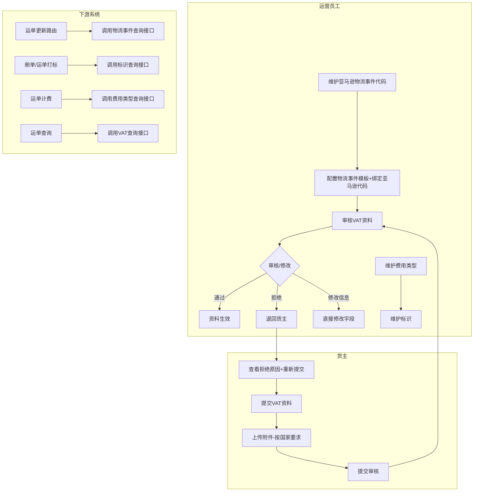
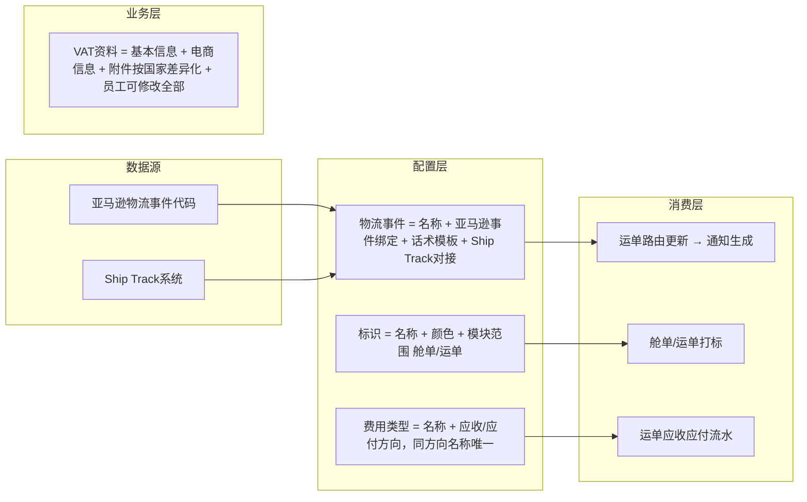

# 需求定义卡片 (RDD) -- 头程管理

> **原始需求**：为TMS平台构建头程（First Mile）物流管理模块，覆盖VAT税务管理、费用类型字典、物流事件模板、亚马逊物流事件代码及标识管理等5个基础配置子模块，支撑运单/提单/清关等下游业务
> **文档版本**: v2.1 | **日期**: 2026-06-06 | **作者**: 飞点跨境产品经理
> **本次更新**: Demo + Excel + Draft 三方数据融合（对照9个Demo页面 + Excel需求要点 + v2.0草稿）

---

## 1. 核心洞察 (Insight)

**真实痛点**：

跨境头程物流涉及多个基础配置的维护：VAT/EORI税务资料的提交与审核、费用类型的定义（用于运单应收应付流水）、物流事件模板（用于运单跟踪通知）、亚马逊标准物流事件代码（用于对接Ship Track）以及标识体系（用于舱单/运单打标）。当前这些配置分散在飞书表格和线下沟通中，缺乏统一的结构化管理和系统间调用接口。

货主提交VAT资料后，运营员工需要审核并可能直接修改信息。不同注册国家（英国 vs 其他欧洲国家）对资料附件的要求不同，当前缺乏系统化的差异化校验，导致反复沟通。VAT号和EORI号需要在同一客户下保持唯一，避免重复注册。

物流事件需要配合Ship Track调用亚马逊物流事件代码，并在运单/提单更新路由时触发通知模板。费用类型的唯一性应基于"同方向"（应收/应付）而非全局名称，避免"应收-超重费"和"应付-超重费"被误判为重复。

**JTBD**：
> `运营员工` 雇佣"头程管理"不是为了"配置字典"，而是为了：**当运单/提单流转时，能在系统中查找到标准化的物流事件模板、费用科目和标识，且VAT资料能在2个工作日内完成审核，配置数据能被下游模块可靠调用。**

> `货主` 雇佣"头程管理"不是为了"填表单"，而是为了：**当需要提交VAT税务资料时，能在10分钟内完成资料上传并提交审核，系统自动按注册国家校验必传附件，不用反复和运营沟通格式要求。**

**业务价值**：

| 维度 | 当前 | 目标 |
|------|------|------|
| VAT资料审核效率 | 线下沟通，平均3-5个工作日 | 线上提交+审核+修改，目标2个工作日内完成 |
| 配置数据一致性 | 分散存储，下游无法引用 | 统一结构化存储，提供查询接口供下游调用 |
| 物流事件标准化 | 各运营手动编辑消息 | 事件模板绑定亚马逊代码+话术模板，对接Ship Track |
| 费用类型唯一性 | 无系统管控 | 同方向费用名称唯一，支撑运单应收应付流水 |

---

## 2. 业务全景图

### 2.1 角色与工作节奏

| 角色 | 核心任务 | 频率 |
|------|---------|------|
| 运营员工 | 维护亚马逊物流事件代码、配置物流事件模板（含话术+占位符）、审核和修改VAT资料、维护费用类型字典、管理标识 | 日频 |
| 货主 | 提交和查看自己的VAT注册资料 | 按需（新增/变更时） |
| 下游系统 | 调用查询接口获取物流事件代码、费用类型、标识数据 | 实时 |

### 2.2 端到端业务链路

```
【一次性配置】
  亚马逊物流事件代码定义 → 物流事件模板配置（含Ship Track绑定） → 费用类型定义 → 标识定义
      ↓
【按需提交】
  货主提交VAT资料 → 员工审核/修改VAT资料（通过/拒绝）
      ↓
【实时调用】
  运单路由更新 → 调用物流事件接口 → 匹配亚马逊事件代码 → 生成通知
  运单/提单打标 → 调用标识查询接口 → 选择标识
  运单计费 → 调用费用类型接口 → 获取应收/应付科目

【持续治理】
  事件模板迭代 → 费用类型启停 → 标识颜色/范围调整 → VAT资料回查
```

### 2.3 实体依赖关系

```
物流事件 (LogisticsEvent)
  ├── N:1 亚马逊物流事件 (AmazonLogisticsEvent) ← 可空关联
  ├── 事件话术模板 (含占位符)
  ├── 通知话术模板 (含占位符)
  └── 配合Ship Track调用亚马逊物流事件代码

VAT注册资料 (VATRegistration)
  ├── 1:1 基本信息（VAT号/EORI号/法人/公司等）
  ├── 1:1 电商平台信息（亚马逊店铺链接/VAT截图）
  ├── 1:N 附件（证书/授权文件/营业执照等，按注册国家差异化要求）
  ├── 审核流转（待审核→已通过/已拒绝，员工端可修改全部信息）
  └── 同客户 VAT号+EORI号 联合唯一

费用类型 (FeeType)
  └── 费用方向枚举（应收/应付），同方向费用名称唯一

标识 (Tag)
  └── 模块范围枚举（舱单/运单），提供查询接口供打标
```

### 2.4 核心业务流程图（泳道图）



### 2.5 核心数据流图



---

## 3. 流程一：VAT管理 -- 货主端（按需提交）

> **触发**：货主需要新增或修改VAT税务资料 **频率**：按需 **前置依赖**：货主已有亚马逊店铺

### 3.1 VAT注册资料 -- 货主端 (VATRegistration)

> **As a** 货主 **I want to** 提交VAT/EORI注册资料给平台审核 **So that** 我的货物可以在欧洲合规清关

**基本信息**

| 字段 | 类型 | 必填 | 说明 |
|------|------|------|------|
| VAT号 | 文本 | 是 | 如 GB286484751，同客户下VAT号+EORI号联合唯一 |
| EORI号 | 文本 | 是 | 如 GB286484750001，同客户下VAT号+EORI号联合唯一 |
| 营业执照编码 | 文本 | 是 | 企业营业执照编号 |
| 公司法人 | 文本 | 是 | 法人姓名 |
| 公司名 | 文本 | 是 | 营业执照公司名 |
| 公司英文名 | 文本 | 是 | 使用英文 |
| 注册国家 | 单选 | 是 | GB-英国 / DE-德国 / FR-法国（可扩展），决定附件差异化要求 |
| 注册省份 | 文本 | 否 | 英文 |
| 注册城市 | 文本 | 否 | 英文 |
| 注册邮编 | 文本 | 是 | 如 SG18 8NH |
| 注册地址 | 文本 | 是 | 如 UNIT 19 ELDON WAY |

**电商平台信息**

| 字段 | 类型 | 必填 | 说明 |
|------|------|------|------|
| 亚马逊店铺链接 | 文本 | 是 | 店铺URL |
| 电商店铺绑定VAT截图 | 文件 | 是 | 截图需清晰展示店铺名称及绑定的VAT税号，限制1个文件 |

**资料附件（按注册国家差异化）**

| 附件类型 | 英国(GB) | 其他欧洲国家(DE/FR等) |
|----------|:---:|:---:|
| VAT证书 | 必传 | 必传 |
| EORI证书 | 必传 | 必传 |
| POA授权文件 | 必传 | 必传 |
| PVA授权文件 | 必传 | — |
| 营业执照 | — | 必传 |
| 法人身份证/护照 | — | 必传 |
| 缴税证明 | — | 必传 |
| 其他文件 | 可选 | 可选 |

**签署日期**：日期选择器，必填，格式 YYYY-MM-DD

**审核状态**：

| 状态 | 说明 | 货主端操作 |
|------|------|-----------|
| 待审核 | 已提交，等待运营审核 | 可查看 |
| 已通过 | 运营审核通过 | 可查看 |
| 已拒绝 | 运营审核拒绝 | 可编辑重新提交 |

**业务规则**：
- R01: 同客户（user_id）下 **VAT号+EORI号** 联合唯一，不允许重复注册
- R02: 注册国家=英国时，必须上传 VAT证书、EORI证书、POA授权文件、PVA授权文件
- R03: 注册国家=其他欧洲国家（DE/FR等）时，在上传VAT/EORI/POA基础上，加传营业执照、法人身份证/护照、缴税证明
- R04: 货主端提交后状态为"待审核"，跳转回列表页
- R05: "已通过"和"待审核"状态的资料仅可查看（整个表单disabled）
- R06: "已拒绝"状态的资料可编辑重新提交，重新提交后状态重置为"待审核"
- R07: 货主只能查看和操作自己的VAT资料（数据范围隔离：按 user_id 过滤）

**相关 AC**：`AC01-VS01` `AC01-VS02` `AC01-VS03` `AC01-VS04`

---

## 4. 流程二：VAT管理 -- 员工端（审核管理 + 信息修改）

> **触发**：货主提交VAT资料后 **频率**：按需 **前置依赖**：货主已提交VAT资料

### 4.1 VAT注册资料 -- 员工端 (VATRegistration)

> **As a** 运营员工 **I want to** 审核货主提交的VAT资料并根据需要修改信息 **So that** 确保税务信息真实合规且完整

**列表字段**（员工端）：
- 除货主端字段外，增加"用户名称"列（标识资料所属货主）
- 搜索条件增加"用户名称"搜索（因员工端需要跨货主管理）
- **无权限管控**（员工端可查看和操作所有货主的VAT资料）

**操作按钮**：

| 状态 | 员工端操作 |
|------|-----------|
| 待审核 | **审核**按钮（跳转审核页） |
| 已通过 | **查看**按钮 / **编辑**按钮 |
| 已拒绝 | **查看**按钮 / **编辑**按钮 |

**员工端编辑权限**：
- 员工端可修改 **所有信息**（基本信息 + 电商平台信息 + 资料附件 + 签署日期）
- 修改后直接保存，不改变审核状态
- 无权限管控，所有员工均可操作

**审核页面交互**：
- 所有字段只读展示
- 底部按钮: **审核通过**（二次确认弹窗）+ **审核拒绝**（需输入拒绝原因，不能为空）

**业务规则**：
- R08: 员工端可查看和操作所有货主的VAT资料，无权限管控（不做数据范围隔离）
- R09: 员工端可修改VAT资料的所有字段（基本信息+电商信息+附件+签署日期），修改不改变审核状态
- R10: 审核通过需二次确认："确认该VAT资料信息无误并审核通过？"
- R11: 审核拒绝必须填写拒绝原因（不能为空），格式校验 `/\S+/`
- R12: 审核操作后跳转回员工端VAT列表页
- R13: 提供VAT信息查询接口供运单查询使用：按VAT号/EORI号/用户ID查询

**相关 AC**：`AC02-VE01` `AC02-VE02` `AC02-VE03`

---

## 5. 流程三：费用类型配置（一次性配置）

> **触发**：系统初始化 / 业务需要新增费用科目 **频率**：一次性配置，偶尔新增 **前置依赖**：无

### 5.1 费用类型 (FeeType)

> **As a** 运营员工 **I want to** 维护费用类型字典 **So that** 下游运单计费模块可以引用标准应收/应付费用科目，支撑运单应收应付业务流水

| 字段 | 类型 | 必填 | 说明 |
|------|------|------|------|
| 费用名称 | 文本 | 是 | 如"周六派送费""超重费" |
| 费用方向 | 单选 | 是 | 应收 / 应付 |
| 状态 | 单选 | 自动 | 正常 / 已冻结 |
| 操作人 | 文本 | 自动 | 当前操作用户 |
| 创建时间 | DateTime | 自动 | — |
| 更新时间 | DateTime | 自动 | — |

**业务规则**：
- R14: **同方向费用名称唯一**——相同费用方向（应收/应付）下费用名称不可重复，不同方向之间可以有同名费用（如"应收-超重费"和"应付-超重费"可共存）
- R15: 状态"正常"↔"已冻结"切换需二次确认弹窗
- R16: 已冻结的费用类型编辑时弹窗自动切换为只读模式
- R17: 提供费用类型查询接口供运单计费模块调用（按费用方向筛选）
- R18: 无权限管控，所有运营员工均可操作

**相关 AC**：`AC03-FT01` `AC03-FT02` `AC03-FT03`

---

## 6. 流程四：物流事件配置（一次性配置 + 按需调整）

> **触发**：完成亚马逊物流事件配置后 / 新增物流节点通知 **频率**：一次性配置，偶尔调整 **前置依赖**：亚马逊物流事件（可选）

### 6.1 物流事件 (LogisticsEvent)

> **As a** 运营员工 **I want to** 定义物流事件模板（含话术和占位符）并绑定亚马逊物流事件代码 **So that** 运单/提单更新路由时，系统可调用物流事件接口匹配亚马逊事件代码，生成标准化的通知消息

| 字段 | 类型 | 必填 | 说明 |
|------|------|------|------|
| 物流事件名称 | 文本 | 是 | 如"已开船""货物已入仓"，**全局唯一** |
| 绑定亚马逊物流事件 | 下拉单选 | 否 | 可选绑定亚马逊物流事件，下拉选项来自 AmazonLogisticsEvent 查询接口 |
| 是否需要通知客户 | 单选 | 是 | 枚举: "是" / "否" |
| 事件话术模板 | 文本(多行) | 条件必填 | 当"是否需要通知客户"="是"时必填，当"否"时不必填 |
| 事件占位符可选项 | 多选 | 否 | 可选: 本地仓名称、海外仓代码、预计到港时间等 |
| 通知话术模板 | 文本(多行) | 条件必填 | 当"是否需要通知客户"="是"时必填。如"尊敬的[客户名称]，您的订单[订单号]已开船。" |
| 通知占位符可选项 | 多选 | 否 | 可选: 客户名称、订单号、本地仓名称、海外仓代码等 |
| 状态 | 单选 | 自动 | 正常 / 已冻结 |
| 创建时间 | DateTime | 自动 | 系统自动 |
| 更新时间 | DateTime | 自动 | 系统自动 |

**业务规则**：
- R19: 物流事件名称全局唯一，跨租户不重复
- R20: "是否需要通知客户"="是"时，"通知话术模板"和"事件话术模板"均必填
- R21: "是否需要通知客户"="否"时，"事件话术模板"不必填
- R22: 状态"正常"↔"已冻结"切换需二次确认弹窗
- R23: 已冻结的物流事件编辑时弹窗自动切换为只读模式（标题"查看物流事件"，仅显示"关闭"按钮）
- R24: 占位符通过复选框选择，勾选后自动追加到对应模板文本框末尾（格式: `[占位符名]`），重复勾选需防重
- R25: 配合Ship Track调用亚马逊物流事件代码，将亚马逊事件代码传递给Ship Track系统
- R26: 运单/提单更新路由时调用物流事件查询接口，匹配对应物流事件模板生成通知

**相关 AC**：`AC04-LE01` `AC04-LE02` `AC04-LE03` `AC04-LE04`

---

## 7. 流程五：亚马逊物流事件配置（一次性配置）

> **触发**：系统初始化 / 新增亚马逊物流事件代码 **频率**：一次性配置，偶尔新增 **前置依赖**：无

### 7.1 亚马逊物流事件 (AmazonLogisticsEvent)

> **As a** 运营员工 **I want to** 维护亚马逊标准物流事件代码字典 **So that** 物流事件可以绑定到标准亚马逊节点，并通过查询接口支撑Ship Track对接

| 字段 | 类型 | 必填 | 说明 |
|------|------|------|------|
| 亚马逊物流事件名称 | 文本 | 是 | 如"出口报关查验""货物已离港""货物已到港"等 |
| 亚马逊物流事件代码 | 文本 | 是 | 如 K1/O1, D1, A1, K2, R1 等，全局唯一 |
| 状态 | 单选 | 自动 | ⚠️ Demo中无此字段，草案按"正常/已冻结"标准设计，Demo需补充 |
| 创建时间 | DateTime | 自动 | 系统自动生成 |
| 更新时间 | DateTime | 自动 | 系统自动 |

**业务规则**：
- R27: 亚马逊物流事件代码全局唯一（同租户下），不允许重复
- R28: 已使用的亚马逊物流事件不可删除，仅可编辑名称和冻结/启用
- R29: 状态"正常"↔"已冻结"切换需二次确认弹窗
- R30: 提供查询接口供物流事件模块调用（按事件代码/名称查询，全部/按状态过滤）
- R31: 无权限管控，所有运营员工均可操作

**相关 AC**：`AC05-AE01` `AC05-AE02` `AC05-AE03`

---

## 8. 流程六：标识管理配置（一次性配置）

> **触发**：系统初始化 / 业务需要新增标识 **频率**：一次性配置，偶尔新增 **前置依赖**：无

### 8.1 标识 (Tag)

> **As a** 运营员工 **I want to** 维护可分配给舱单/运单的彩色标识 **So that** 舱单和运单可以通过标识查询接口获取可选标识列表，进行直观的属性标注

| 字段 | 类型 | 必填 | 说明 |
|------|------|------|------|
| 标识名称 | 文本 | 是 | 如"国内贴标费""超重费""国外查验" |
| 颜色 | 颜色选择 | 是 | HEX色值，如 #00FFFF，预设10色 + 自定义取色器 |
| 模块范围 | 单选 | 是 | 舱单/运单 |
| 状态 | 单选 | 自动 | 正常 / 已冻结 |
| 创建时间 | DateTime | 自动 | — |
| 更新时间 | DateTime | 自动 | — |
| 创建人 | 文本 | 自动 | 当前操作用户 |

**业务规则**：
- R32: 颜色选择提供10个预设色块（青/粉/黄/橙/灰/绿/紫/红/深蓝/棕）+ 自定义取色器
- R33: 状态"正常"↔"已冻结"切换需二次确认弹窗
- R34: 已冻结标识编辑时弹窗自动切换为只读模式
- R35: 提供标识查询接口供舱单/运单打标功能调用（按模块范围+状态过滤）
- R36: 无权限管控，所有运营员工均可操作

**相关 AC**：`AC06-TG01` `AC06-TG02` `AC06-TG03`

---

## 9. 验收标准总览 (AC)

### 流程一-二：VAT管理
- [ ] **AC01-VS01**: 货主端：支持按VAT号/EORI号搜索，Tab过滤（待审核/已通过/已拒绝/全部），待审核/已通过→查看，已拒绝→编辑
- [ ] **AC01-VS02**: 货主端：新增表单含基本信息+电商平台信息+资料附件+签署日期，附件要求按注册国家差异化展示（英国4项必传 vs 其他国家7项必传）
- [ ] **AC01-VS03**: 货主端：提交校验——同客户下VAT号+EORI号联合唯一，重复时提示阻断
- [ ] **AC01-VS04**: 货主端：查看模式下整个表单disabled，仅显示"返回列表"按钮
- [ ] **AC02-VE01**: 员工端：列表增加"用户名称"列和搜索条件，无tenant_id之外的权限隔离（可查看全部货主资料）
- [ ] **AC02-VE02**: 员工端：可修改VAT资料的所有字段（基本信息+电商信息+附件+签署日期），修改直接保存不改变审核状态
- [ ] **AC02-VE03**: 员工端审核页：所有字段只读，审核通过需二次确认，审核拒绝须填写拒绝原因（非空校验 /\S+/）

### 流程三：费用类型配置
- [ ] **AC03-FT01**: 列表页正确展示费用名称、费用方向（应收=success绿色标签/应付=warning橙色标签）、状态（正常/已冻结）、操作人，支持费用名称和费用方向搜索
- [ ] **AC03-FT02**: 新增/编辑弹窗：费用名称+费用方向均为必填，提交时校验"同方向费用名称唯一"——不同方向可同名，同方向不允许重复
- [ ] **AC03-FT03**: 冻结/启用操作需二次确认弹窗，冻结后编辑弹窗自动切换为只读模式

### 流程四：物流事件配置
- [ ] **AC04-LE01**: 列表页正确展示物流事件名称、绑定亚马逊物流事件、是否需要通知客户（标签样式）、状态（标签样式）、创建时间、更新时间
- [ ] **AC04-LE02**: 新增/编辑弹窗：事件名称必填+唯一校验，绑定亚马逊事件可选（下拉选项来自查询接口），通知客户必选（是/否），通知话术模板和事件话术模板条件必填
- [ ] **AC04-LE03**: 占位符复选框点击自动追加到模板文本框末尾，重复勾选防重
- [ ] **AC04-LE04**: 冻结/启用操作需二次确认弹窗，冻结后编辑弹窗自动切换为只读模式（标题"查看物流事件"）

### 流程五：亚马逊物流事件配置
- [ ] **AC05-AE01**: 列表页正确展示亚马逊物流事件名称、事件代码、状态，支持分页
- [ ] **AC05-AE02**: 新增/编辑弹窗：事件名称+事件代码均为必填，事件代码全局唯一校验
- [ ] **AC05-AE03**: 提供查询接口供物流事件模块调用（按事件代码/名称查询，按状态过滤）

### 流程六：标识管理
- [ ] **AC06-TG01**: 列表页正确展示标识名称、颜色圆点（对应HEX色值）、模块范围、更新时间、创建人、状态
- [ ] **AC06-TG02**: 新增/编辑弹窗：标识名称必填、模块范围必填下拉（舱单/运单）、颜色必填（10个预设色块+自定义取色器）
- [ ] **AC06-TG03**: 提供查询接口供舱单/运单打标功能调用（按模块范围+状态过滤）

---

## 10. NFR（非功能性需求）

- **性能**：列表页查询响应 < 2s，配置查询接口（供下游调用）响应 < 500ms
- **并发**：同租户下10个运营同时操作无冲突
- **数据保留**：VAT资料长期保留，费用类型/物流事件/标识/亚马逊事件操作记录保留3年
- **精度**：无特殊精度要求
- **安全**：货主端VAT资料只能查看自己的数据（user_id 隔离）；员工端VAT无权限管控；费用类型/物流事件/亚马逊物流事件/标识无权限管控，所有运营员工均可操作

---

## 11. 功能清单

> 基于6条业务流程，共 **5个模块、15项功能**。P0 = MVP，P1 = 二期，P2 = 三期。

### 模块 A：VAT管理 -- 货主端

| 编号 | 功能 | 优先级 | AC |
|------|------|--------|-----|
| A1 | VAT列表页（搜索+Tab过滤） | P0 | AC01-VS01 |
| A2 | VAT资料新增/编辑表单（含国家差异化附件要求） | P0 | AC01-VS02, AC01-VS03 |
| A3 | VAT资料查看模式（只读） | P0 | AC01-VS04 |

### 模块 B：VAT管理 -- 员工端

| 编号 | 功能 | 优先级 | AC |
|------|------|--------|-----|
| B1 | VAT列表页（含用户名称搜索+全量查看） | P0 | AC02-VE01 |
| B2 | VAT资料编辑（员工可修改全部字段） | P0 | AC02-VE02 |
| B3 | VAT资料审核（通过/拒绝含原因） | P0 | AC02-VE03 |

### 模块 C：费用类型管理

| 编号 | 功能 | 优先级 | AC |
|------|------|--------|-----|
| C1 | 费用类型列表页（含搜索/分页） | P0 | AC03-FT01 |
| C2 | 新增/编辑费用类型（同方向名称唯一校验） | P0 | AC03-FT02 |
| C3 | 冻结/启用（二次确认+只读切换） | P0 | AC03-FT03 |

### 模块 D：物流事件管理

| 编号 | 功能 | 优先级 | AC |
|------|------|--------|-----|
| D1 | 物流事件列表页（含搜索/分页） | P0 | AC04-LE01 |
| D2 | 新增/编辑物流事件（名称唯一+条件必填+占位符） | P0 | AC04-LE02, AC04-LE03 |
| D3 | 冻结/启用（二次确认+只读切换） | P0 | AC04-LE04 |

### 模块 E：亚马逊物流事件管理

| 编号 | 功能 | 优先级 | AC |
|------|------|--------|-----|
| E1 | 亚马逊物流事件列表页（含搜索/分页） | P0 | AC05-AE01 |
| E2 | 新增/编辑亚马逊物流事件（代码唯一校验） | P0 | AC05-AE02 |
| E3 | 查询接口（供物流事件调用） | P0 | AC05-AE03 |

### 模块 F：标识管理

| 编号 | 功能 | 优先级 | AC |
|------|------|--------|-----|
| F1 | 标识列表页（含搜索/分页） | P0 | AC06-TG01 |
| F2 | 新增/编辑标识（含颜色选择器+模块范围） | P0 | AC06-TG02 |
| F3 | 查询接口（供舱单/运单打标调用） | P0 | AC06-TG03 |

### 分期汇总

| 分期 | 模块范围 | 功能数 |
|------|----------|--------|
| **Phase 1 (MVP)** | 全部6个模块 | **18** |
| **Phase 2** | 物流事件触发到运单/提单路由、Ship Track对接联调、标识动态分配 | +4 |
| **Phase 3** | VAT对接第三方税务系统API校验、批量VAT导入 | +2 |

---

## 12. MVP 方案与建议

### MVP 方案（Phase 1 -- 头程管理基础配置上线）

```
运营端 头程管理
├── 基础配置（一次性）
│   ├── 亚马逊物流事件（代码定义+查询接口）
│   ├── 物流事件（模板+话术+占位符+Ship Track绑定）
│   ├── 费用类型（应收/应付，同方向唯一+查询接口）
│   └── 标识管理（名称+颜色+模块范围+查询接口）
└── VAT管理
    ├── 货主端：提交/查看/重提交（国家差异化附件）
    └── 员工端：审核/查看/修改全部字段/全量可见
```

### MVP 明确不做

- 物流事件触发到运单/提单的具体路由逻辑（MVP只定义模板和查询接口，触发链路二期）
- Ship Track系统联调对接（MVP预留接口和字段，实际对接二期）
- 标识动态分配到舱单/运单的具体打标逻辑（MVP只定义标识池和查询接口，分配逻辑二期）
- VAT第三方税务系统API校验（MVP人工审核，三期API校验）
- 批量VAT资料导入/导出（三期）

### 专家建议

1. **频次驱动设计**：5个配置子模块均为一次性/低频配置操作，可放入"基础配置"二级菜单。VAT审核为按需操作，可纳入"日常工作"区域。
2. **接口优先设计**：物流事件、亚马逊物流事件、费用类型、标识均需提供查询接口供下游调用。建议MVP阶段完成接口定义和数据填充，下游模块（运单/提单/Ship Track）可按需接入。
3. **同方向唯一 vs 全局唯一**：费用类型的"同方向唯一"设计更贴合业务语义——应收和应付是两个独立域，同名费用在不同方向下语义不同。物流事件名称则应全局唯一，避免混淆。
4. **VAT国家差异化**：注册国家字段驱动附件必填规则，建议后端配置化而非前端硬编码。新增国家时只需追加配置，无需改前端代码。
5. **员工端VAT权限**：当前无权限管控，所有员工可操作所有货主资料。若未来需要权限精细化（按国家/按客户分配），预留 `operator_scope` 字段即可。
6. **标识颜色预设**：10个预设色块覆盖常用色，自定义取色器满足个性化需求，平衡了标准化和灵活性。

---

## 下一步

当前 v2.1-final 更新：Demo + Excel + Draft 三方数据融合。3个待确认项已全部确认（event_template条件必填、名称全局唯一跨租户、标识舱单/运单）+ 1个Demo内部BUG。可进入 Phase 2 方案架构（数据建模+边界探测）。

---

## 13. 数据融合附录：Demo vs Excel vs Draft 对照

> v2.1 数据融合日期：2026-06-06 | 融合原则：Demo字段名/交互为真相源，Excel业务规则为需求源，Draft为基线增补

### 13.1 字段与枚举对照总表

| # | 实体 | 字段/枚举 | Demo | Excel | Draft v2.1 | 决策 |
|:---|------|----------|------|-------|-----------|------|
| 1 | VAT | 基本信息字段（vatNo/eoriNo/businessLicenseNo/legalPerson/companyName/companyEnName/country/province/city/zipCode/address） | 均有，Demo JS formData 中 `shopLink` 但模板引用 `amazonLink` | 提到VAT号/EORI号/营业执照/公司/注册国家 | 使用 `amazon_shop_link` | **一致**，Demo内部变量名不一致是BUG（formData.shopLink vs v-model="formData.amazonLink"） |
| 2 | VAT | 电商平台信息 | amazonLink + shopVatScreenshot | — | amazon_shop_link + shop_vat_screenshot | **一致** |
| 3 | VAT | 附件类型（8种） | VAT证书/EORI证书/POA/PVA/营业执照/法人身份证护照/缴税证明/其他文件 | — | VAT_CERT/EORI_CERT/POA/PVA/BUSINESS_LICENSE/ID_CARD/TAX_PROOF/OTHER | **一致** |
| 4 | VAT | 附件差异化 | GB需4项 / DE/FR需7项 | 注册国家差异化附件规则 | GB=4项 / DE/FR等=7项 | **一致** |
| 5 | VAT | 审核状态枚举 | 待审核/已通过/已拒绝 | — | PENDING(10)/APPROVED(20)/REJECTED(30) | **一致** |
| 6 | VAT | 唯一约束 | Demo演示数据未体现 | 同客户VAT号+EORI号联合唯一 | (tenant_id, user_id, vat_no, eori_no) 联合唯一 | **一致** |
| 7 | VAT | 员工端权限 | Demo员工端无权限过滤（查看全部数据） | 员工端可修改全部字段 | 员工端无权限管控 + 可修改全部字段 | **一致** |
| 8 | VAT | 员工端操作按钮 | 待审核→"审核"，其他→"查看"（但"查看"按钮实际跳转 mode=edit） | — | 待审核→审核，已通过/已拒绝→查看+编辑 | ⚠️ **Demo UX BUG**：按钮显示"查看"但跳转编辑模式。Draft正确区分查看/编辑。Demo需修正按钮标签 |
| 9 | 费用类型 | 费用方向枚举 | 应收/应付 | 应收/应付 | RECEIVABLE(10)/PAYABLE(20) | **一致** |
| 10 | 费用类型 | 唯一约束 | Demo演示数据未体现 | 同方向名称唯一 | (tenant_id, fee_name, fee_direction) 联合唯一 | **一致** |
| 11 | 物流事件 | 名称唯一 | Demo演示数据未体现 | — | 全局唯一 event_name | **已确认**：物流事件名称全局唯一，跨租户不重复 |
| 12 | 物流事件 | event_template 必填条件 | Demo始终必填（代码注释确认） | — | notify=是时必填，notify=否时不必填 | **已确认**：notify=否时 event_template 不必填，Demo需修正校验逻辑 |
| 13 | 物流事件 | 占位符类型 | 事件: 本地仓名称/海外仓代码/预计到港时间；通知: 客户名称/订单号/本地仓名称/海外仓代码 | — | 同上（JSON数组存储） | **一致** |
| 14 | 物流事件 | 绑定亚马逊事件方式 | Demo以字符串存储名称（如"已开船/已起飞-VD/NS"） | — | FK `amazon_event_id` 关联 | Demo简化为字符串（原型无后端），Draft用FK是正确设计 |
| 15 | 物流事件 | openScope 字段 | Demo数据中有 `openScope: ['提单','运单']` 但未展示 | — | 不存在此字段 | Demo中为废弃字段（可能从旧版遗留），不纳入正式设计 |
| 16 | 亚马逊物流事件 | 状态字段 | **Demo无此字段** | — | 正常/已冻结 | ⚠️ **Demo缺失**：草案按标准设计加了状态启停。Excel未明确提及。Demo需补充 |
| 17 | 亚马逊物流事件 | 搜索功能 | **Demo无搜索**（仅新增+编辑+分页） | — | 草案PRD描述了搜索 | Demo简化，搜索功能合理保留 |
| 18 | 标识 | 模块范围枚举 | **运单/提单**（Demo显示为"运单""提单"） | 舱单/运单 | **舱单/运单** MANIFEST(10)/WAYBILL(20) | **已确认**：采用"舱单/运单"，Demo需修正 |
| 19 | 标识 | 预设颜色 | 10色: #00FFFF/#FFC0CB/#FFFF00/#FFA500/#D3D3D3/#98FB98/#DDA0DD/#FF6B6B/#2DA44E/#CD853F | — | 同左 | **一致** |
| 20 | 标识 | 列表列 | name/color/moduleScope/createTime/status | — | tag_name/color/module_scope/updated_at/created_by/status | Draft增加 `created_by` 和 `updated_at`（标准字段），Demo简化仅显示 createTime |

### 13.2 演示页面覆盖状态

| Demo 页面 | 对应子模块 | Draft覆盖 | 说明 |
|-----------|----------|----------|------|
| VAT管理_主列表.html (员工端) | VAT管理-员工端 | 已覆盖 (流程二) | — |
| VAT资料新增-优化版.html (员工端) | VAT资料审核/编辑 | 已覆盖 (流程二) | — |
| VAT管理.html (货主端) | VAT管理-货主端 | 已覆盖 (流程一) | — |
| VAT资料新增.html (货主端) | VAT资料新增/编辑 | 已覆盖 (流程一) | — |
| 费用类型_主列表.html | 费用类型管理 | 已覆盖 (流程三) | — |
| 物流事件_主列表.html | 物流事件管理 | 已覆盖 (流程四) | — |
| 亚马逊物流事件_主列表.html | 亚马逊物流事件管理 | 已覆盖 (流程五) | — |
| 标识管理.html | 标识管理 | 已覆盖 (流程六) | — |
| 异常处理池.html | 异常处理池 | **未覆盖** | 属于"运单管理"模块（运单异常监控），非"头程管理基础配置"范畴。建议归入运单管理模块单独设计 |

### 13.3 最终决策清单

| 决策项 | 决策 | 理由 |
|--------|------|------|
| 标识模块范围 | 采用 **舱单/运单**（非提单） | Excel为需求源，舱单(Manifest)是物流专业术语。Demo中"提单"为误用 |
| 物流事件 `event_template` 条件 | **已确认**：notify=否时不必填 | notify=否时不需要话术模板，Demo需修正校验逻辑 |
| 物流事件名称唯一性 | **已确认**：全局唯一，跨租户不重复 | 避免不同租户间物流事件名称混淆 |
| 亚马逊物流事件 `status` | **保留草案设计** | 虽Demo无此字段，但状态启停是标准配置治理需求。Excel未反对 |
| 物流事件 `openScope` | **不纳入** | Demo数据中遗留字段，未在UI展示/交互，非有效需求 |
| VAT 员工端 Demo 按钮标签 | **Demo修正** | "查看"按钮实际执行编辑操作，应拆分为"查看"(mode=view)和"编辑"(mode=edit) |
| 异常处理池 | **归入运单管理模块** | 内容为运单异常监控（送仓block/时间更新预警/临期预警），非基础配置 |
| Demo `shopLink` vs `amazonLink` | **Demo修正** | Vue模板引用 `formData.amazonLink` 但 data model 定义为 `shopLink`，变量名不一致导致运行时数据不绑定
