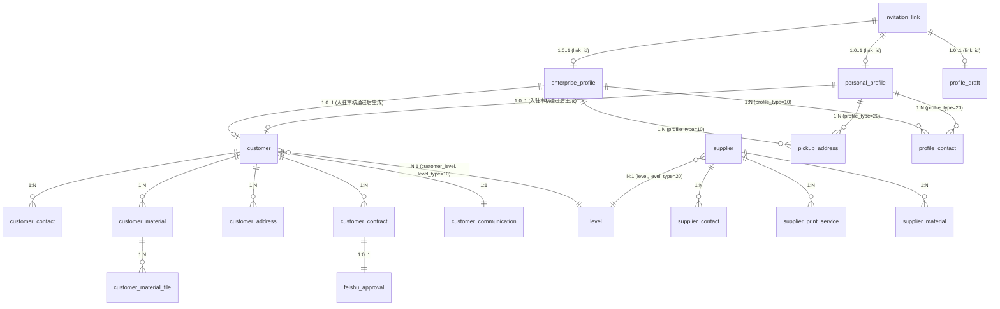

# 数据设计 — 客商中心

> **文档版本**: v1.6 | **日期**: 2026-06-22 | **作者**: AI PM（v1.6: customer_contract新增is_primary主合同标记+termination_date解约时间+sign_status新增50:已解约；v1.5: customer表新增sales_assistant字段；v1.4: 合同1:1→1:N多主体签约——customer_contract去Unique约束+新增contract_company+账期下沉至合同表，customer表移除账期字段）
> **上游文档**: `2026-06-22-用户需求.md`

---

## 一、实体清单 x 表映射

| 实体名称 | 对应表/子表 | 映射方式 | 说明 |
|----------|------------|---------|------|
| 客户 | `customer` | 独立表 | 聚合根 |
| 客户联系人 | `customer_contact` | 1:N 子表 | 通过 `customer_id` 关联，固定3角色 |
| 客户资料 | `customer_material` | 1:N 子表 | 通过 `customer_id` 关联 |
| 客户资料文件 | `customer_material_file` | 1:N 子表 | 通过 `material_id` 关联 |
| 客户地址 | `customer_address` | 1:N 子表 | 通过 `customer_id` 关联，只读 |
| 客户关联账户 | — | 纯逻辑实体 | 引用账户模块，按合同/所属公司关联，客商中心只读展示 |
| 客户账期 | `customer_contract` 内联 | 合同表字段 | 与合同1:1，跟随合同而非客户 |
| 客户合同 | `customer_contract` | 1:N 子表 | 通过 `customer_id` 关联，一个客户可有多份合同（不同所属公司） |
| 客户通信信息 | `customer_communication` | 1:1 子表 | 通过 `customer_id` 关联 |
| 合同所属公司 | `customer_contract` 内联 | 合同表字段 | 每份合同挂一个主体公司 |
| 供应商 | `supplier` | 独立表 | 聚合根 |
| 供应商联系人 | `supplier_contact` | 1:N 子表 | 通过 `supplier_id` 关联 |
| 供应商打单服务 | `supplier_print_service` | 1:N 子表 | 通过 `supplier_id` 关联 |
| 供应商资料 | `supplier_material` | 1:N 子表 | 通过 `supplier_id` 关联 |
| 等级 | `level` | 独立表 | 客户等级和供应商等级通过 `level_type` 区分 |
| 入驻链接 | `invitation_link` | 独立表 | 含token、过期时间、使用状态 |
| 入驻草稿 | `profile_draft` | 独立表 | 暂存并退出时保存的JSON快照 |
| 企业客户档案 | `enterprise_profile` | 独立表 | 入驻端写入 |
| 自然人客户档案 | `personal_profile` | 独立表 | 入驻端写入 |
| 取货地址（档案） | `pickup_address` | 1:N 子表 | 通过 `profile_type + profile_id` 多态关联 |
| 联系人（档案） | `profile_contact` | 1:N 子表 | 通过 `profile_type + profile_id` 多态关联 |
| 飞书审批记录 | `feishu_approval` | 1:1 子表 | 通过 `contract_id` 关联，记录审批流水 |

---

## 二、逐表字段清单

### 表1: `customer` | 对应实体: 客户 (Customer)

> **设计说明**: V1.4 合同1:1→1:N。`sign_status`、账期相关字段（`billing_cycle`/`payment_term`/`settlement_type`/`days_or_date`）下沉至 `customer_contract` 表，客户级合同状态和账期通过关联合同表获取，不再在 customer 表冗余。

| 字段名 (En) | 字段名 (Cn) | 类型 (Type) | 必填 | 约束/索引 | 枚举/备注 |
|:---|:---|:---|:---|:---|:---|
| `id` | 主键 | BigInt | Yes | **PK** | 雪花ID |
| `tenant_id` | 租户ID | String | Yes | Index | SaaS 数据隔离 |
| `customer_code` | 客户编号 | String(32) | Yes | **Unique** | 规则: K + 1 + 4位自增序号，如 K10001 |
| `customer_type` | 客户类型 | TinyInt | Yes | Index | 10:自然人, 20:企业 |
| `customer_name` | 客户名称 | String(200) | Yes | Index | — |
| `nickname` | 客户昵称 | String(64) | Yes | — | 客户自定义昵称 |
| `credit_code` | 统一社会信用代码 | String(18) | 条件 | **Unique** | 企业类型必填 + 全局唯一，自然人NULL |
| `enterprise_attribute` | 客户属地 | TinyInt | Yes | — | 10:中国大陆, 20:中国香港 |
| `is_peer` | 是否同行 | TinyInt | Yes | — | 10:是, 20:否 |
| `customer_level` | 客户等级 | String(4) | Yes | Index | SS/S/A/B/C/D/E/F/G，默认G |
| `cs_representative` | 客服代表 | JSON | Yes | — | 多选，如 `["张客服","王客服"]` |
| `sales_representative` | 销售代表 | String(50) | Yes | — | 单选 |
| `sales_assistant` | 销售助理 | String(50) | Yes | — | 单选 |
| `sales_source` | 销售来源 | String(200) | — | — | — |
| `business_types` | 开通业务 | JSON | Yes | — | 多选，如 `["TMS","WMS"]` |
| `service_status` | 服务状态 | TinyInt | — | Index | 10:正常, 20:已冻结 |
| `first_order_time` | 首次下单时间 | DateTime | — | — | — |
| `days_without_order` | 未下单天数 | Int | — | — | — |
| `created_at` | 创建时间 | DateTime | Yes | — | 自动生成 |
| `created_by` | 创建人 | String | Yes | — | 当前用户 |
| `updated_at` | 更新时间 | DateTime | Yes | — | 自动维护 |
| `updated_by` | 更新人 | String | Yes | — | 当前用户 |
| `is_deleted` | 软删除标识 | Boolean | Yes | — | Default: false |
| `version` | 乐观锁版本 | Int | Yes | — | 并发控制，每次更新+1 |

**唯一约束**: `credit_code` 全局唯一（当 customer_type=20 时）。

> **变更说明**：移除 `sign_status`、`billing_cycle`、`payment_term`、`settlement_type`、`days_or_date` 5 个字段。合同签署状态和账期信息从 `customer_contract` 表按合同查询。货主端登录时的合同状态校验改为检查该客户是否有任一有效合同（`sign_status=30` 且 `contract_end_date >= now()`）。

### 表2: `customer_contact` | 对应实体: 客户联系人 (CustomerContact)

| 字段名 (En) | 字段名 (Cn) | 类型 (Type) | 必填 | 约束/索引 | 枚举/备注 |
|:---|:---|:---|:---|:---|:---|
| `id` | 主键 | BigInt | Yes | **PK** | 雪花ID |
| `tenant_id` | 租户ID | String | Yes | Index | — |
| `customer_id` | 客户ID | BigInt | Yes | **FK**, Index | 关联 `customer.id` |
| `role` | 角色标签 | TinyInt | Yes | — | 10:公司负责人, 20:物流联系人, 30:财务负责人 |
| `name` | 姓名 | String(50) | Yes | — | — |
| `phone` | 联系电话 | String(20) | Yes | — | — |
| `email` | 邮箱 | String(100) | Yes | — | — |
| `is_contract_contact` | 是否合同对接人 | Boolean | Yes | — | Default: false（3条中仅1条可为true） |
| `is_account_receiver` | 是否系统账号接收人 | Boolean | Yes | — | Default: false（3条中仅1条可为true） |
| `created_at` | 创建时间 | DateTime | Yes | — | — |
| `updated_at` | 更新时间 | DateTime | Yes | — | — |
| `is_deleted` | 软删除标识 | Boolean | Yes | — | Default: false |

### 表3: `customer_material` | 对应实体: 客户资料 (CustomerMaterial)

| 字段名 (En) | 字段名 (Cn) | 类型 (Type) | 必填 | 约束/索引 | 枚举/备注 |
|:---|:---|:---|:---|:---|:---|
| `id` | 主键 | BigInt | Yes | **PK** | 雪花ID |
| `tenant_id` | 租户ID | String | Yes | Index | — |
| `customer_id` | 客户ID | BigInt | Yes | **FK**, Index | 关联 `customer.id` |
| `label` | 资料名称 | String(100) | Yes | — | 如：营业执照、法人身份证正反面、天眼查风险信息 |
| `material_type` | 资料类型 | TinyInt | Yes | — | 10:营业执照, 20:法人身份证正反面, 30:天眼查风险信息PDF, 99:自定义 |
| `is_required` | 是否必传 | Boolean | — | — | 营业执照根据客户类型动态判断 |
| `sort_order` | 排序 | Int | — | — | 默认项固定在前 |
| `created_at` | 创建时间 | DateTime | Yes | — | — |
| `updated_at` | 更新时间 | DateTime | Yes | — | — |
| `is_deleted` | 软删除标识 | Boolean | Yes | — | Default: false |

### 表4: `customer_material_file` | 文件附件子表

| 字段名 (En) | 字段名 (Cn) | 类型 (Type) | 必填 | 约束/索引 | 枚举/备注 |
|:---|:---|:---|:---|:---|:---|
| `id` | 主键 | BigInt | Yes | **PK** | 雪花ID |
| `material_id` | 资料ID | BigInt | Yes | **FK**, Index | 关联 `customer_material.id` |
| `file_name` | 文件名 | String(200) | Yes | — | — |
| `file_url` | 文件地址 | String(500) | Yes | — | — |
| `file_type` | 文件类型 | String(20) | — | — | pdf/image |
| `file_size` | 文件大小 | BigInt | — | — | 字节 |
| `card_side` | 身份证面 | TinyInt | — | — | 仅 material_type=20 时: 10:人像面, 20:国徽面 |
| `source` | 来源 | TinyInt | — | — | 10:手工上传, 20:E签宝回传, 30:OCR识别, 40:天眼查自动生成 |
| `created_at` | 创建时间 | DateTime | Yes | — | — |

### 表5: `customer_address` | 对应实体: 客户地址库 (CustomerAddress)

| 字段名 (En) | 字段名 (Cn) | 类型 (Type) | 必填 | 约束/索引 | 枚举/备注 |
|:---|:---|:---|:---|:---|:---|
| `id` | 主键 | BigInt | Yes | **PK** | 雪花ID |
| `tenant_id` | 租户ID | String | Yes | Index | — |
| `customer_id` | 客户ID | BigInt | Yes | **FK**, Index | 关联 `customer.id` |
| `address_type` | 地址类型 | TinyInt | — | — | 10:取件地址, 20:收货地址 |
| `contact_name` | 联系人名称 | String(50) | — | — | — |
| `phone` | 联系电话 | String(20) | — | — | — |
| `zipcode` | 邮编 | String(10) | — | — | — |
| `address` | 详细地址 | String(500) | — | — | — |
| `created_at` | 创建时间 | DateTime | Yes | — | — |
| `is_deleted` | 软删除标识 | Boolean | Yes | — | Default: false |

### 表6: `customer_contract` | 对应实体: 客户合同 (Contract)

> **设计说明**: V1.4 合同1:1→1:N。`customer_id` 去掉 Unique 约束，允许一个客户多份合同。新增 `contract_company` 标识每份合同所属主体公司。账期字段（`billing_cycle`/`payment_term`/`settlement_type`/`days_or_date`）从 `customer` 表下沉至此表——每份合同独立账期。

| 字段名 (En) | 字段名 (Cn) | 类型 (Type) | 必填 | 约束/索引 | 枚举/备注 |
|:---|:---|:---|:---|:---|:---|
| `id` | 主键 | BigInt | Yes | **PK** | 雪花ID |
| `tenant_id` | 租户ID | String | Yes | Index | — |
| `customer_id` | 客户ID | BigInt | Yes | **FK**, Index | 1:N 关联 `customer.id`（去掉 Unique 约束） |
| `contract_company` | 所属公司 | TinyInt | ✅ | — | 10:广州飞点, 20:深圳飞点, 30:广东飞点, 40:香港富力顿, 50:墨链 |
| `sign_status` | 合同签署状态 | TinyInt | ✅ | Index | 10:未签署, 20:签署中, 30:已签署, 40:已过期, 50:已解约 |
| `is_primary` | 是否生效主合同 | Boolean | — | — | Radio 单选，同一客户同时仅一份；无标记时默认第一份已签署合同为主合同；Default: false |
| `billing_cycle` | 账单周期 | TinyInt | ✅ | — | 10:固定, 20:不固定 |
| `payment_term` | 签约账期 | TinyInt | ✅ | — | 101:月结, 102:双月结, 103:三月结, 201:周结, 202:到港前结, 203:签收月结, 204:到海外仓结, 205:签收结 |
| `settlement_type` | 结算类型 | TinyInt | — | — | 10:按月, 20:按天（由账期自动推导） |
| `days_or_date` | 天数/号 | Int | — | — | >=0 整数 |
| `settlement_month` | 结算月 | TinyInt | — | — | 0:月结, 1:双月结, 2:三月结；仅 settlement_type=10 时有效 |
| `is_simple` | 是否简易合同 | Boolean | — | — | true:是, false:否 |
| `is_standard` | 是否标准合同 | Boolean | — | — | true:是, false:否 |
| `company_title` | 我司合同抬头 | String(200) | — | — | 根据域名和所属公司自动填充 |
| `contract_years` | 合同有效期限(年) | TinyInt | — | — | 1/2/3 |
| `contract_start_date` | 合同开始日期 | Date | — | — | 默认当天 |
| `contract_end_date` | 合同结束日期 | Date | — | — | 开始日期 + 合同期限，自动计算 |
| `termination_date` | 解约时间 | Date | — | — | 可选；填写后定时任务扫描：termination_date ≤ today 且 sign_status=30 → 自动变更为50(已解约)。删除时按 end_date 恢复：end_date > today→30, end_date ≤ today→40 |
| `sign_date` | 签订日期 | Date | — | — | 默认当天（简易合同场景） |
| `modify_content` | 合同修改内容 | Text | — | — | 非标合同场景 |
| `signing_mode` | 签约方式 | TinyInt | — | — | 10:大陆线上签约, 20:香港线下签约 |
| `feishu_approval_type` | 飞书审批类型 | TinyInt | — | — | 10:简易, 20:墨线, 30:美线（大陆线上签约时路由） |
| `feishu_instance_id` | 飞书审批实例ID | String(100) | — | — | 发起审批后回填 |
| `esign_contract_id` | E签宝合同ID | String(100) | — | — | E签宝生成合同后回填 |
| `esign_file_url` | E签宝回传附件 | String(500) | — | — | 审批通过后E签宝回传的合同文件地址 |
| `is_contract_auto_sync` | 是否标准合同自动回写 | Boolean | — | — | true:标准合同取签约值自动回写, false:非标合同手工维护 |
| `created_at` | 创建时间 | DateTime | Yes | — | — |
| `updated_at` | 更新时间 | DateTime | Yes | — | — |
| `is_deleted` | 软删除标识 | Boolean | Yes | — | Default: false |

**唯一约束**: 同一客户在飞点租户下，有且仅能有一份处于"已签约"或"签约中"状态的合同（全局唯一有效合同）。旧合同过期/作废后，方可签署新合同。实现方式：签约时校验该客户下是否已存在 `sign_status IN ('已签约', '签约中')` 的合同记录，若存在则阻止新签。

**主合同与当前生效判定**：
- `is_primary` 由用户手动单选，同一客户同时仅一份生效主合同（Radio 互斥）。无标记时默认第一份已签署合同为主合同
- "当前生效主合同"校验规则：
  ① `is_primary=true`
  ② `sign_status=30(已签署)`
  ③ `contract_start_date ≤ today ≤ contract_end_date`
  ④ `termination_date IS NULL OR today < termination_date`
  → 全部满足 → 该合同为当前生效主合同；任一不满足 → 无生效合同（主合同身份保留，状态如实展示，能否登录由信控决定）
- 主合同是身份标记，不对签约唯一性产生约束

**解约时间与已解约状态**：
- 填写 `termination_date` 后不立即改变 `sign_status`，由每日定时任务扫描 `termination_date ≤ today AND sign_status=30` 的记录 → 自动变更为 `50(已解约)`
- 删除 `termination_date` 时实时恢复：`contract_end_date > today → 30(已签署)`，`contract_end_date ≤ today → 40(已过期)`

### 表7: `customer_communication` | 对应实体: 通信信息 (Communication)

| 字段名 (En) | 字段名 (Cn) | 类型 (Type) | 必填 | 约束/索引 | 枚举/备注 |
|:---|:---|:---|:---|:---|:---|
| `id` | 主键 | BigInt | Yes | **PK** | 雪花ID |
| `tenant_id` | 租户ID | String | Yes | Index | — |
| `customer_id` | 客户ID | BigInt | Yes | **FK**, **Unique** | 1:1 关联 `customer.id` |
| `comm_type` | 工具类型 | TinyInt | Yes | — | 10:企业微信（当前仅支持企业微信） |
| `group_id` | 群聊ID | String(100) | Yes | — | — |
| `created_at` | 创建时间 | DateTime | Yes | — | — |
| `updated_at` | 更新时间 | DateTime | Yes | — | — |
| `is_deleted` | 软删除标识 | Boolean | Yes | — | Default: false |

---

### 表8: `supplier` | 对应实体: 供应商 (Supplier)

| 字段名 (En) | 字段名 (Cn) | 类型 (Type) | 必填 | 约束/索引 | 枚举/备注 |
|:---|:---|:---|:---|:---|:---|
| `id` | 主键 | BigInt | Yes | **PK** | 雪花ID |
| `tenant_id` | 租户ID | String | Yes | Index | SaaS 数据隔离 |
| `supplier_code` | 供应商编号 | String(32) | Yes | **Unique** | 规则: G + 10001自增序号，如 G10001 |
| `supplier_name` | 供应商名称 | String(200) | Yes | **Unique** | 全局唯一 |
| `supplier_short_name` | 供应商简称 | String(100) | Yes | — | — |
| `supplier_category` | 供应商大类 | JSON | Yes | — | 多选，枚举：干线运输供应商/揽货服务商/仓储供应商/关务供应商/尾程运输供应商/综合代理/其他 |
| `supplier_detail` | 供应商明细 | JSON | Yes | — | 多选，跟随大类联动 |
| `scac` | SCAC代码 | String(20) | 条件 | — | 明细含"快递"时必填 |
| `level` | 供应商等级 | String(4) | Yes | Index | SS~G（默认G），下拉取level表level_type=20且status=10的数据 |
| `is_peer` | 是否同行 | TinyInt | Yes | — | 10:是, 20:否 |
| `service_status` | 服务状态 | TinyInt | — | Index | 10:正常, 20:已冻结 |
| `source_type` | 来源类型 | TinyInt | — | — | 10:手工创建, 20:客户转换 |
| `source_customer_id` | 来源客户ID | BigInt | — | — | 互转时记录来源客户 |
| `created_at` | 创建时间 | DateTime | Yes | — | — |
| `created_by` | 创建人 | String | Yes | — | — |
| `updated_at` | 更新时间 | DateTime | Yes | — | — |
| `updated_by` | 更新人 | String | Yes | — | — |
| `is_deleted` | 软删除标识 | Boolean | Yes | — | Default: false |
| `version` | 乐观锁版本 | Int | Yes | — | 并发控制 |

### 表9: `supplier_contact` | 对应实体: 供应商联系人

| 字段名 (En) | 字段名 (Cn) | 类型 (Type) | 必填 | 约束/索引 | 枚举/备注 |
|:---|:---|:---|:---|:---|:---|
| `id` | 主键 | BigInt | Yes | **PK** | 雪花ID |
| `tenant_id` | 租户ID | String | Yes | Index | — |
| `supplier_id` | 供应商ID | BigInt | Yes | **FK**, Index | 关联 `supplier.id` |
| `name` | 姓名 | String(50) | Yes | — | — |
| `phone` | 联系电话 | String(20) | Yes | — | 仅限数字 |
| `email` | 邮箱 | String(100) | Yes | — | — |
| `is_contract_contact` | 是否合同对接人 | Boolean | Yes | — | Default: false |
| `is_account_receiver` | 是否系统账号接收人 | Boolean | Yes | — | Default: false |
| `created_at` | 创建时间 | DateTime | Yes | — | — |
| `updated_at` | 更新时间 | DateTime | Yes | — | — |
| `is_deleted` | 软删除标识 | Boolean | Yes | — | Default: false |

### 表10: `supplier_print_service` | 对应实体: 打单服务

| 字段名 (En) | 字段名 (Cn) | 类型 (Type) | 必填 | 约束/索引 | 枚举/备注 |
|:---|:---|:---|:---|:---|:---|
| `id` | 主键 | BigInt | Yes | **PK** | 雪花ID |
| `tenant_id` | 租户ID | String | Yes | Index | — |
| `supplier_id` | 供应商ID | BigInt | Yes | **FK**, Index | — |
| `receive_channel` | 收货渠道 | String(200) | — | — | — |
| `status` | 状态 | TinyInt | — | — | 10:正常, 20:已冻结 |
| `created_at` | 创建时间 | DateTime | Yes | — | — |
| `updated_at` | 更新时间 | DateTime | Yes | — | — |
| `is_deleted` | 软删除标识 | Boolean | Yes | — | Default: false |

### 表11: `supplier_material` | 对应实体: 供应商资料

| 字段名 (En) | 字段名 (Cn) | 类型 (Type) | 必填 | 约束/索引 | 枚举/备注 |
|:---|:---|:---|:---|:---|:---|
| `id` | 主键 | BigInt | Yes | **PK** | 雪花ID |
| `tenant_id` | 租户ID | String | Yes | Index | — |
| `supplier_id` | 供应商ID | BigInt | Yes | **FK**, Index | — |
| `label` | 资料名称 | String(100) | — | — | 可自定义 |
| `file_name` | 文件名 | String(200) | — | — | — |
| `file_url` | 文件地址 | String(500) | — | — | — |
| `created_at` | 创建时间 | DateTime | Yes | — | — |
| `is_deleted` | 软删除标识 | Boolean | Yes | — | Default: false |

---

### 表12: `level` | 对应实体: 等级 (Level)

| 字段名 (En) | 字段名 (Cn) | 类型 (Type) | 必填 | 约束/索引 | 枚举/备注 |
|:---|:---|:---|:---|:---|:---|
| `id` | 主键 | BigInt | Yes | **PK** | 雪花ID |
| `tenant_id` | 租户ID | String | Yes | Index | — |
| `level_type` | 等级类型 | TinyInt | Yes | Index | 10:客户等级, 20:供应商等级 |
| `level_code` | 级别代码 | String(4) | Yes | — | SS/S/A/B/C/D/E/F/G |
| `status` | 状态 | TinyInt | — | Index | 10:正常, 20:已冻结 |
| `operator` | 操作人 | String(50) | Yes | — | 创建/最后编辑人 |
| `created_at` | 创建时间 | DateTime | Yes | — | — |
| `updated_at` | 更新时间 | DateTime | Yes | — | — |
| `is_deleted` | 软删除标识 | Boolean | Yes | — | Default: false |

**唯一约束**: `(tenant_id, level_type, level_code)` 联合唯一。

**设计说明**：
- 冻结保护：冻结操作前需检查 `customer` 或 `supplier` 表中引用该等级的记录数，若 > 0 则阻止冻结并返回提示
- 查询接口：提供 `GET /api/level/query?level_type=10|20` 公开查询接口，供CRM/SRM等外部系统调用
- 无权限管控：等级管理对所有运营角色开放，接口层不校验操作权限

---

### 表13: `invitation_link` | 对应实体: 入驻链接 (InvitationLink)

> **设计说明**: V1.1 新增。销售生成唯一入驻链接发送给客户，客户点击后进入入驻流程。

| 字段名 (En) | 字段名 (Cn) | 类型 (Type) | 必填 | 约束/索引 | 枚举/备注 |
|:---|:---|:---|:---|:---|:---|
| `id` | 主键 | BigInt | Yes | **PK** | 雪花ID |
| `tenant_id` | 租户ID | String | Yes | Index | — |
| `token` | 链接Token | String(64) | Yes | **Unique** | UUID生成，保证唯一 |
| `customer_id` | 预关联客户ID | BigInt | — | Index | 如销售已预创建客户记录则关联 |
| `expire_time` | 过期时间 | DateTime | Yes | — | 创建时间 + 14天 |
| `status` | 链接状态 | TinyInt | Yes | Index | 10:有效, 20:已使用, 30:已过期 |
| `used_at` | 使用时间 | DateTime | — | — | 客户点击链接并进入入驻时记录 |
| `created_by` | 创建人 | String | Yes | — | 销售代表 |
| `created_at` | 创建时间 | DateTime | Yes | — | 自动生成 |
| `updated_at` | 更新时间 | DateTime | Yes | — | 自动维护 |
| `is_deleted` | 软删除标识 | Boolean | Yes | — | Default: false |

---

### 表14: `profile_draft` | 对应实体: 入驻草稿 (ProfileDraft)

> **设计说明**: V1.1 新增。客户暂存并退出时，整个表单数据保存为JSON快照，与正式档案数据隔离。

| 字段名 (En) | 字段名 (Cn) | 类型 (Type) | 必填 | 约束/索引 | 枚举/备注 |
|:---|:---|:---|:---|:---|:---|
| `id` | 主键 | BigInt | Yes | **PK** | 雪花ID |
| `tenant_id` | 租户ID | String | Yes | Index | — |
| `link_id` | 链接ID | BigInt | Yes | **FK**, Index | 关联 `invitation_link.id` |
| `profile_type` | 档案类型 | TinyInt | Yes | — | 10:企业档案, 20:自然人档案 |
| `draft_data` | 草稿数据 | JSON | Yes | — | 整个表单的JSON快照 |
| `created_at` | 创建时间 | DateTime | Yes | — | 首次暂存时间 |
| `updated_at` | 最后暂存时间 | DateTime | Yes | — | 每次暂存更新 |
| `is_deleted` | 软删除标识 | Boolean | Yes | — | Default: false |

---

### 表15: `enterprise_profile` | 对应实体: 企业客户档案 (EnterpriseProfile)

> **设计说明**: V1.1 重构。企业客户自助入驻档案表。新增完整的注册地址拆分（省/市/详细）、渠道含老板介绍、平台与业务国级联、天眼查风险信息。入驻提交后生成 `customer` 记录。

| 字段名 (En) | 字段名 (Cn) | 类型 (Type) | 必填 | 约束/索引 | 枚举/备注 |
|:---|:---|:---|:---|:---|:---|
| `id` | 主键 | BigInt | Yes | **PK** | 雪花ID |
| `tenant_id` | 租户ID | String | Yes | Index | — |
| `link_id` | 关联链接ID | BigInt | — | Index | 关联 `invitation_link.id` |
| `enterprise_attribute` | 企业属地 | TinyInt | Yes | — | 10:中国大陆, 20:中国香港（默认10） |
| `company_name` | 公司名称 | String(200) | Yes | — | OCR自动识别，可修改 |
| `registration_no` | 公司注册号码 | String(50) | Yes | — | OCR自动识别，可修改 |
| `credit_code` | 统一社会信用代码 | String(18) | Yes | **Unique** | 全局唯一校验 |
| `license_url` | 营业执照地址 | String(500) | — | — | OCR识别源文件 |
| `company_province` | 公司注册地址-省 | String(20) | Yes | — | 如"广东省" |
| `company_city` | 公司注册地址-市 | String(20) | Yes | — | 如"深圳市" |
| `company_detail_address` | 公司注册地址-详细 | String(500) | Yes | — | — |
| `channel` | 添加渠道 | TinyInt | Yes | — | 10:探迹, 20:展会, 30:老板介绍, 40:朋友推荐 |
| `main_country` | 主营业务国 | String(5) | Yes | — | US/UK/DE 等 |
| `main_platform` | 主要经营平台 | JSON | Yes | — | 多选，与业务国级联 |
| `id_card_front_url` | 法人身份证人像面 | String(500) | Yes | — | — |
| `id_card_back_url` | 法人身份证国徽面 | String(500) | Yes | — | — |
| `tianyancha_risk_pdf_url` | 天眼查风险信息PDF | String(500) | — | — | 提交后自动生成 |
| `remarks` | 客户备注 | Text | — | — | — |
| `status` | 审核状态 | TinyInt | — | Index | 10:草稿(暂存), 20:待审核(已提交), 30:已通过, 40:已驳回 |
| `submitted_at` | 提交时间 | DateTime | — | — | 点击入驻时记录 |
| `created_at` | 创建时间 | DateTime | Yes | — | — |
| `updated_at` | 更新时间 | DateTime | Yes | — | — |
| `is_deleted` | 软删除标识 | Boolean | Yes | — | Default: false |

### 表16: `personal_profile` | 对应实体: 自然人客户档案 (PersonalProfile)

> **设计说明**: V1.1 重构。新增个人联系地址拆分、身份证号唯一校验。

| 字段名 (En) | 字段名 (Cn) | 类型 (Type) | 必填 | 约束/索引 | 枚举/备注 |
|:---|:---|:---|:---|:---|:---|
| `id` | 主键 | BigInt | Yes | **PK** | 雪花ID |
| `tenant_id` | 租户ID | String | Yes | Index | — |
| `link_id` | 关联链接ID | BigInt | — | Index | — |
| `personal_region_type` | 所属地 | TinyInt | Yes | — | 10:中国大陆, 20:中国香港 |
| `full_name` | 个人姓名全称 | String(50) | Yes | — | OCR自动识别，可修改 |
| `id_card_no` | 身份证号 | String(18) | Yes | **Unique** | 全局唯一校验 |
| `id_card_front_url` | 身份证人像面 | String(500) | Yes | — | — |
| `id_card_back_url` | 身份证国徽面 | String(500) | Yes | — | — |
| `personal_province` | 个人联系地址-省 | String(20) | Yes | — | — |
| `personal_city` | 个人联系地址-市 | String(20) | Yes | — | — |
| `personal_detail_address` | 个人联系地址-详细 | String(500) | Yes | — | — |
| `channel` | 添加渠道 | TinyInt | Yes | — | 10:探迹, 20:展会, 30:老板介绍, 40:朋友推荐 |
| `business_country` | 主营业务国 | String(5) | Yes | — | US/UK/DE 等 |
| `main_platform` | 主要经营平台 | JSON | Yes | — | 多选，与业务国级联 |
| `remarks` | 客户备注 | Text | — | — | — |
| `status` | 审核状态 | TinyInt | — | Index | 10:草稿, 20:待审核, 30:已通过, 40:已驳回 |
| `submitted_at` | 提交时间 | DateTime | — | — | — |
| `created_at` | 创建时间 | DateTime | Yes | — | — |
| `updated_at` | 更新时间 | DateTime | Yes | — | — |
| `is_deleted` | 软删除标识 | Boolean | Yes | — | Default: false |

### 表17: `pickup_address` | 对应实体: 取货地址（档案端）

| 字段名 (En) | 字段名 (Cn) | 类型 (Type) | 必填 | 约束/索引 | 枚举/备注 |
|:---|:---|:---|:---|:---|:---|
| `id` | 主键 | BigInt | Yes | **PK** | 雪花ID |
| `tenant_id` | 租户ID | String | Yes | Index | — |
| `profile_type` | 档案类型 | TinyInt | Yes | Index | 10:企业档案, 20:自然人档案 |
| `profile_id` | 档案ID | BigInt | Yes | Index | 关联 `enterprise_profile.id` 或 `personal_profile.id` |
| `province` | 省份 | String(20) | Yes | — | 如"广东省" |
| `city` | 城市 | String(20) | Yes | — | 如"深圳市" |
| `detail` | 详细地址 | String(500) | Yes | — | — |
| `created_at` | 创建时间 | DateTime | Yes | — | — |
| `is_deleted` | 软删除标识 | Boolean | Yes | — | Default: false |

### 表18: `profile_contact` | 对应实体: 档案联系人

| 字段名 (En) | 字段名 (Cn) | 类型 (Type) | 必填 | 约束/索引 | 枚举/备注 |
|:---|:---|:---|:---|:---|:---|
| `id` | 主键 | BigInt | Yes | **PK** | 雪花ID |
| `tenant_id` | 租户ID | String | Yes | Index | — |
| `profile_type` | 档案类型 | TinyInt | Yes | Index | 10:企业档案, 20:自然人档案 |
| `profile_id` | 档案ID | BigInt | Yes | Index | — |
| `role` | 角色标签 | TinyInt | Yes | — | 10:公司负责人, 20:物流联系人, 30:财务负责人 |
| `name` | 姓名 | String(50) | Yes | — | — |
| `phone` | 联系电话 | String(20) | Yes | — | — |
| `email` | 邮箱地址 | String(100) | Yes | — | — |
| `is_contract_contact` | 是否合同对接人 | Boolean | — | — | — |
| `is_account_receiver` | 是否系统账号接收人 | Boolean | — | — | — |
| `created_at` | 创建时间 | DateTime | Yes | — | — |
| `is_deleted` | 软删除标识 | Boolean | Yes | — | Default: false |

---

### 表19: `feishu_approval` | 对应实体: 飞书审批记录 (FeishuApproval)

> **设计说明**: V1.1 新增。记录每笔合同签约的飞书审批流程状态，与合同1:1关联。

| 字段名 (En) | 字段名 (Cn) | 类型 (Type) | 必填 | 约束/索引 | 枚举/备注 |
|:---|:---|:---|:---|:---|:---|
| `id` | 主键 | BigInt | Yes | **PK** | 雪花ID |
| `tenant_id` | 租户ID | String | Yes | Index | — |
| `contract_id` | 合同ID | BigInt | Yes | **FK**, Index | 关联 `customer_contract.id` |
| `approval_type` | 审批类型 | TinyInt | Yes | — | 10:简易, 20:墨线, 30:美线 |
| `feishu_instance_id` | 飞书审批实例ID | String(100) | Yes | Index | 发起审批后飞书返回 |
| `approval_status` | 审批状态 | TinyInt | Yes | — | 10:审批中, 20:已通过, 30:已驳回, 40:已撤销 |
| `approval_result` | 审批结果详情 | JSON | — | — | 审批节点、审批人、意见等 |
| `requested_at` | 发起时间 | DateTime | Yes | — | — |
| `completed_at` | 完成时间 | DateTime | — | — | 审批通过/驳回/撤销时记录 |
| `created_at` | 创建时间 | DateTime | Yes | — | — |
| `updated_at` | 更新时间 | DateTime | Yes | — | — |
| `is_deleted` | 软删除标识 | Boolean | Yes | — | Default: false |

---

## 三、ER 关系图



---

## 四、关键设计说明

### 新增表说明（V1.1）

- **`invitation_link`**: 入驻链接管理表。销售生成链接时创建记录（token=UUID, expire_time=now+14天）。客户点击链接时校验 status=有效且未过期。链接过期后定时任务可将 status 更新为"已过期"。
- **`profile_draft`**: 入驻草稿表。客户暂存并退出时，前端将整个表单数据序列化为JSON存入 `draft_data`。客户下次打开链接时从草稿恢复。正式提交入驻后，草稿记录软删除。
- **`feishu_approval`**: 飞书审批记录表。与合同1:0..1关联（仅大陆线上签约产生审批记录）。审批状态变化由飞书回调更新。审批通过后触发E签宝生成合同。

### 软删除策略
- **启用表**: 所有19张表均启用软删除
- **级联规则**: 逻辑删除 `customer` 时，同步软删除其下所有子表记录
- **逻辑删除 `supplier` 时**: 同步软删除 supplier_contact, supplier_print_service, supplier_material
- **档案表**: enterprise_profile 和 personal_profile 不支持物理删除

### 乐观锁
- **启用表**: `customer`、`supplier` — 存在并发修改风险
- **不需要**: 子表通过主表乐观锁间接保护；等级表（低频）

### JSON 字段使用场景
- **`supplier_category` / `supplier_detail`**: 多选固定枚举，JSON存储避免多对多关联表
- **`cs_representative` / `business_types`**: 多选值，JSON数组存储
- **`main_platform`**: 多选平台，JSON数组。与 `main_country` 级联逻辑在前端实现
- **`profile_draft.draft_data`**: 整个草稿表单的JSON快照
- **`feishu_approval.approval_result`**: 飞书审批节点详情，JSON存储

### 纯逻辑实体说明
- **客户关联账户 (CustomerAccount)**: 无独立表，数据来自统一账户模块

### 多态关联说明
- **`pickup_address` 和 `profile_contact`**: 通过 `profile_type` + `profile_id` 关联企业或自然人档案

### 唯一性约束
- **`customer.credit_code`**: 企业客户统一社会信用代码全局唯一（customer_type=20时约束生效）
- **`personal_profile.id_card_no`**: 自然人身份证号全局唯一
- **`supplier.supplier_name`**: 供应商名称全局唯一
- **`invitation_link.token`**: UUID生成保证全库唯一
- **`level (tenant_id, level_type, level_code)`**: 联合唯一

### 等级冻结保护（新增）
- 冻结等级（level.status 10→20）前，后端校验：
  - `SELECT COUNT(*) FROM customer WHERE customer_level = level.level_code AND is_deleted = false`
  - `SELECT COUNT(*) FROM supplier WHERE level = level.level_code AND is_deleted = false`
  - 若任一 COUNT > 0，返回错误：`"该等级已被N个客户/供应商绑定，无法冻结"`
- 此校验为业务层逻辑，不在数据库层实现外键约束

### 供应商转客户数据流（新增）
```
选中供应商 → 打开转客户弹窗 → 继承 supplierName → customerName (disabled)
  → 补充 customerType / creditCode / enterpriseAttribute / isPeer / customerLevel
     / csRepresentative / salesRepresentative / salesSource / businessTypes
  → 补充联系人（固定3角色）+ 资料 + 通信信息
  → 提交 → 创建 customer 记录 + 关联子表
  → 自动生成 ROOT 账户（调用账户模块 API）
  → 发送邮件通知（含账号密码）
  → 不删除 source supplier 记录
```

### 签约流程数据流（新增）

```
customer_contract.signing_mode = 10 (大陆线上)
  → 创建 feishu_approval 记录 (approval_type=简易/墨线/美线, approval_status=审批中)
  → 飞书回调 approval_status=已通过
  → 触发 E签宝生成合同 → esign_contract_id 回填
  → 客户签署完成后 E签宝回调 → esign_file_url 回填
  → is_contract_auto_sync = true → 自动回写 customer_contract.sign_status=已签署 + 日期字段
  → is_contract_auto_sync = false → 销售手工在合同管理Tab维护

customer_contract.signing_mode = 20 (香港线下)
  → 上传合同附件 → 保存 → customer_contract.sign_status=已签署
```

### 入驻数据流（新增）

```
销售创建 invitation_link (status=有效, expire_time=now+14天)
  → 客户点击链接（校验token有效性+过期）
  → 客户填写档案表单
  → 暂存并退出 → 写入 profile_draft (draft_data=JSON快照)
  → 客户再次打开 → 从 profile_draft 恢复表单
  → 点击入驻提交 → 校验必填 + OCR识别结果
  → 调用天眼查API → 生成 risk PDF → 存入 tianyancha_risk_pdf_url
  → 写入 enterprise_profile/personal_profile (status=待审核)
  → 创建 customer 记录
  → 创建初始 customer_contract 记录 (sign_status=未签署, contract_company=默认)
  → 在用户管理-待签约中生成签约流程数据
  → 页面置灰 + 显示审核提示
```

---
## 五、跨模块数据融合：客商中心 × 货主端

> **设计原则**：客商中心是客户主数据的 System of Record，所有客户状态变更（创建/冻结/启用/等级变更）均通过接口同步至货主端。货主端不直接修改 `customer` 表，只读引用。

### 5.1 跨模块实体依赖

```
客商中心（主数据源）
  ├── customer                      ──→ 货主端 sub_account.customer_id (FK)
  ├── customer_contract.sign_status ──→ 货主端登录准入校验（检查是否有任一有效合同：sign_status=30 AND end_date>=now()）
  ├── customer.service_status       ──→ 货主端冻结联动
  ├── customer.customer_name        ──→ 货主端首页欢迎语
  └── customer_contact              ──→ 货主端 ROOT 账号邮箱/手机号来源

货主端（消费者）
  ├── sub_account           ──→ 通过 customer_id 关联客户
  ├── sub_account.is_root   ──→ 标记 ROOT 账户（入驻自动创建）
  └── role (引用系统设置)   ──→ ROOT 角色入驻自动创建
```

### 5.2 跨模块数据流

**DS1 — 客户入驻→子账号自动开通**：

```
enterprise_profile/personal_profile 审核通过 (status: 10→30)
  → 创建 customer 记录
  → 创建初始 customer_contract 记录 (sign_status=未签署, contract_company=默认公司)
  → 触发: POST /api/shipper/sub-account/create-root
    body: {
      customer_id: <customer.id>,
      contract_id: <contract.id>,
      customer_name: <customer.customer_name>,
      contact_email: <customer_contact.email WHERE is_account_receiver=true>,
      contact_phone: <customer_contact.phone WHERE is_account_receiver=true>
    }
  → 货主端:
    1. 创建 sub_account (is_root=true, account='admin', password=随机8位)
    2. 创建 role (role_code='ROOT', role_name='主账号默认角色')
       - 若该 tenant 下已存在 ROOT 角色则跳过
    3. 创建 sub_account_role (关联 ROOT 角色)
    4. 发送邮件（含账号+密码+登录地址）
  → 返回: { sub_account_id, account, temp_password }
  → 客商中心记录日志
```

**DS2 — 手工创建客户+生成账户**：

```
运营端点击"保存并生成账户"
  → 创建 customer 记录
  → 创建初始 customer_contract 记录 (sign_status=未签署, contract_company=所选公司)
  → 触发: 同 DS1
  → Toast "保存成功，并已为该客户生成系统账户！"
```

**DS3 — 客户冻结→子账号同步冻结**：

```
customer.service_status: 10→20 (正常→已冻结)
  → 触发: POST /api/shipper/sub-account/batch-freeze
    body: { customer_id: <id> }
  → 货主端:
    UPDATE sub_account SET status = 20, updated_at = NOW()
    WHERE customer_id = <id> AND is_deleted = false
  → 返回: { frozen_count: N }
  → 失败处理: 部分子账号冻结失败→记录异常日志+告警运维+继续

注意: ROOT 账号也被冻结（系统级操作），但企业管理员不可在货主端单独操作 ROOT
```

> **V1.4 变更**：签约完成后不再更新 `customer.sign_status`（字段已移除），改为更新对应 `customer_contract.sign_status`。

**DS4 — 客户启用→子账号同步启用**：

```
customer.service_status: 20→10 (已冻结→正常)
  → 触发: POST /api/shipper/sub-account/batch-enable
    body: { customer_id: <id> }
  → 货主端:
    UPDATE sub_account SET status = 10, updated_at = NOW()
    WHERE customer_id = <id> AND is_deleted = false
```

**DS5 — 供应商转客户→ROOT账户开通**：

```
转客户弹窗提交 → 创建 customer 记录
  → 触发: 同 DS1（创建 ROOT 子账号 + ROOT 角色 + 邮件通知）
  → source_type=20 (客户转换)，记录 source_supplier_id
```

### 5.3 跨模块接口契约

| 接口 | 方法 | 路径 | 调用方 | 提供方 | 幂等性 |
|------|------|------|--------|--------|--------|
| 创建ROOT子账号 | POST | /api/shipper/sub-account/create-root | 客商中心 | 货主端 | ✅ (customer_id去重) |
| 批量冻结子账号 | POST | /api/shipper/sub-account/batch-freeze | 客商中心 | 货主端 | ✅ (已冻结跳过) |
| 批量启用子账号 | POST | /api/shipper/sub-account/batch-enable | 客商中心 | 货主端 | ✅ (已启用跳过) |
| 查询客户状态 | GET | /api/customer/{id}/status | 货主端 | 客商中心 | — |
| 查询客户信息 | GET | /api/customer/{id}/profile | 货主端 | 客商中心 | — |

### 5.4 事务与一致性保证

- **创建客户+ROOT账户**：先创建 `customer` 记录（本地事务），再调用货主端接口。若货主端接口失败，`customer` 记录已创建但 ROOT 账户未创建 → 异步重试3次 → 失败后记录到 `pending_sync` 队列 → 定时任务补推。
- **冻结/启用联动**：客商中心冻结成功后，同步调用货主端批量接口。若失败 → 不回滚客商中心操作（冻结本身已生效）→ 记录异常日志 → 运维告警。
- **最终一致性**：货主端登录时实时校验 `customer.service_status` 和 `sign_status`，作为兜底。即使同步延迟，不影响安全性。

### 5.5 货主端登录时的状态校验

```
货主端登录 → 校验流程:
  1. 校验 sub_account.status = 10 (正常)
  2. 校验 sub_account 所属 customer 是否存在 (is_deleted = false)
  3. 调用 GET /api/customer/{customer_id}/status
     → 检查 customer.service_status = 10 (正常)
     → 若 customer.service_status = 20 → 拒绝登录："您的企业账户已被冻结，请联系客服"
  4. 检查该客户是否有任一有效合同：
     → SELECT COUNT(*) FROM customer_contract 
       WHERE customer_id = <id> AND sign_status = 30 AND contract_end_date >= NOW()
     → 均可登录（查价不限制）
     → 若无任何有效合同（sign_status != 30）且尝试下单 → 提示"请先完成合同签约"
```

### 5.6 共享实体字段对齐

| 字段 | 客商中心来源 | 货主端使用 | 对齐状态 |
|------|------------|-----------|---------|
| customer_name | `customer.customer_name` | 首页欢迎语、子账号所属企业展示 | ✅ 已对齐 |
| service_status | `customer.service_status` (10:正常, 20:已冻结) | 登录校验、冻结联动 | ✅ 已对齐 |
| sign_status | `customer_contract.sign_status` (10:未签署, 20:签署中, 30:已签署, 40:已过期) | 登录/下单准入（检查是否有任一有效合同） | ✅ 已对齐 |
| customer_level | `customer.customer_level` (SS~G) | 货主端暂不展示 | ⚠️ 待确认是否需展示 |
| credit_code | `customer.credit_code` | 不引用 | ✅ 无冲突 |
| contact.email | `customer_contact.email` (is_account_receiver=true) | ROOT 账户创建时作为通知邮箱 | ✅ 已对齐 |
| contract_company | `customer_contract.contract_company` (10:广州飞点~50:墨链) | 虚拟账户按公司分离 | ✅ 新增 |
