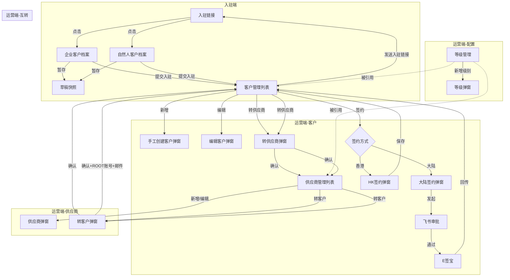

# 客商中心 — 产品需求文档（PRD）

---

## 0. 文档基础信息

- 文档标题：客商中心（客户入驻 + 客户管理 + 合同签约 + 供应商管理 + 等级管理）
- 版本号：v2.0
- 状态：草稿
- 作者：AI PM（v2.0: 合同开始日期+结束日期改为条件必填；v1.9: 签订日期改为条件必填；v1.8: 供应商签约弹窗移除是否新客户+老客户代码；v1.7: 供应商新增签约+合同信息Tab）
- 评审人：产品/研发/测试/业务代表
- 计划里程碑：评审 待定 / 提测 待定 / 上线 待定

### 0.1 变更记录

| 版本 | 变更日期 | 变更内容 | 变更人 |
|------|---------|---------|--------|
| v0.1 | 2026-06-06 | 初稿，基于 Demo 反向生成 | AI PM |
| v1.1 | 2026-06-06 | 基于 V1.1.2 客户入驻需求调研完整更新：新增入驻流程、飞书审批+E签宝签约链路、天眼查风险信息、暂存机制、信用代码/身份证号唯一校验、入驻链接管理 | AI PM |
| v1.3 | 2026-06-06 | 客商中心×货主端数据融合：新增 §13 融合业务规则 + 跨模块接口契约 + 联动验收标准 | AI PM |
| v1.4 | 2026-06-16 | 合同1:1→1:N多主体签约：合同新增所属公司枚举、账期下沉至合同表、签约弹窗增加所属公司、客户管理弹窗3Tab(合同管理/合同信息/账期)、用户管理合同三列→合同数量Popover、主列表操作列增加签约按钮、业务规则/数据设计同步更新 | AI PM |
| v1.5 | 2026-06-18 | 新增客户/编辑客户界面新增"销售助理"字段；销售代表/销售助理/销售来源字段重组；开通业务移至第四排首位。数据设计customer表新增sales_assistant字段 | AI PM |
| v1.6 | 2026-06-22 | 主合同标记(is_primary)+合同解约时间(termination_date)+sign_status新增50:已解约+当前生效主合同自动判定规则。合同管理Tab新增"主合同"和"解约时间"列。数据设计customer_contract表新增is_primary+termination_date字段 | AI PM |
| v1.7 | 2026-07-03 | 供应商管理新增签约+合同信息Tab。新增supplier_contract表。数据设计/原型同步更新 | AI PM |
| v1.8 | 2026-07-06 | 供应商签约弹窗移除"是否新客户"+"老客户代码"，supplier_contract表同步移除对应字段 | AI PM |
| v1.9 | 2026-07-06 | 签订日期(sign_date)改为条件必填——简易合同时显示+必填，默认当天 | AI PM |
| v2.0 | 2026-07-06 | 合同开始日期+结束日期改为条件必填——非简易+标准合同时显示+必填 | AI PM |

### 0.2 关联链接

- 用户需求(RDD)：`drafts/客商中心/2026-07-06-用户需求.md`
- 数据设计：`drafts/客商中心/2026-07-06-数据设计.md`
- 需求背景：无
- 原型：`demo/员工端-demo/客户管理.html` 等

### 0.3 评审记录

| 日期 | 参会人 | 主要问题/结论 | 待办 |
|------|--------|-------------|------|

---

## 1. 需求定义

### 1.1 背景与现状

飞点跨境供应链的客户入驻当前依赖销售手工发送链接+微信跟进，入驻进度不可追踪。客户和供应商信息分散在多个渠道，合同签约流程未标准化——中国大陆客户走线上（飞书审批+E签宝），中国香港客户走线下，但两种流程均缺乏系统承载。

### 1.2 目标与成功口径

- 目标：建立统一的客商中心，覆盖客户入驻→签约→开户的完整链路，实现客户/供应商全生命周期管理
- 成功口径：入驻提交到待签约数据生成 < 5分钟，客户查询 30 秒内完成，互转 1 分钟内完成

### 1.3 范围与边界

- In Scope（本期 P0）：入驻链接管理、企业/自然人客户档案（含暂存、OCR、天眼查、唯一校验）、客户管理（含账期/资料/联系人/通信/关联账户）、合同签约（大陆线上飞书+E签宝 / 香港线下）、供应商管理、等级管理、客户与供应商互转
- Out of Scope：先开户再签约特殊流程（二期）、评分详情（二期）、开票抬头（二期）、Excel批量导入导出

### 1.4 影响范围

- 影响角色：销售代表、客服代表、销售助理、供应商管理专员、运营管理员、客户（入驻端）
- 依赖系统：统一账户模块、飞书开放平台（审批）、E签宝（电子签约）、天眼查API（企业风险信息）、OCR服务

---

## 2. 枚举字典

> 所有枚举字段的键值对集中定义，研发以此为准。与数据设计 Schema 中的 TinyInt 值保持一致。

| 枚举名 | 值 | 常量名 | 中文 | 适用实体/字段 |
|--------|----|--------|------|-------------|
| 客户类型 | 10 | PERSONAL | 自然人 | customer 表 customer_type 字段 |
| 客户类型 | 20 | ENTERPRISE | 企业 | 同上 |
| 企业属地 | 10 | MAINLAND | 中国大陆 | customer 表 enterprise_attribute、企业档案表、自然人档案表 |
| 企业属地 | 20 | HONGKONG | 中国香港 | 同上 |
| 是否 | 10 | YES | 是 | customer 表 is_peer、supplier 表 is_peer、customer_contract 表 is_new_customer |
| 是否 | 20 | NO | 否 | 同上 |
| 是否新客户 | 10 | YES | 是 | customer_contract 表 is_new_customer 字段 |
| 是否新客户 | 20 | NO | 否 | 同上（选"否"时老客户代码 old_customer_code 必填） |
| 合同签署状态 | 10 | UNSIGNED | 未签署 | customer_contract 表 sign_status 字段 |
| 合同签署状态 | 20 | SIGNING | 签署中 | 同上 |
| 合同签署状态 | 30 | SIGNED | 已签署 | 同上 |
| 合同签署状态 | 40 | EXPIRED | 已过期 | 同上 |
| 合同签署状态 | 50 | TERMINATED | 已解约 | 同上（主动提前终止，与已过期区分） |
| 服务状态 | 10 | NORMAL | 正常 | customer、supplier、supplier_print_service、level 表的 service_status/status 字段 |
| 服务状态 | 20 | FROZEN | 已冻结 | 同上 |
| 账单周期 | 10 | FIXED | 固定 | customer_contract 表 billing_cycle 字段 |
| 账单周期 | 20 | UNFIXED | 不固定 | 同上 |
| 签约账期 | 101 | MONTHLY | 月结 | customer_contract 表 payment_term 字段（账单周期=固定） |
| 签约账期 | 102 | BIMONTHLY | 双月结 | 同上 |
| 签约账期 | 103 | TRIMONTHLY | 三月结 | 同上 |
| 签约账期 | 201 | WEEKLY | 周结 | customer_contract 表 payment_term 字段（账单周期=不固定） |
| 签约账期 | 202 | PRE_PORT | 到港前结 | 同上 |
| 签约账期 | 203 | SIGN_MONTHLY | 签收月结 | 同上 |
| 签约账期 | 204 | OVERSEAS_WAREHOUSE | 到海外仓结 | 同上 |
| 签约账期 | 205 | SIGN_SETTLE | 签收结 | 同上 |
| 结算类型 | 10 | BY_MONTH | 按月 | customer_contract 表 settlement_type 字段 |
| 结算类型 | 20 | BY_DAY | 按天 | 同上 |
| 等级代码 | — | SS/S/A/B/C/D/E/F/G | SS~G | customer 表 customer_level、supplier 表 level、level 表 level_code |
| 等级类型 | 10 | CUSTOMER | 客户等级 | level 表 level_type 字段 |
| 等级类型 | 20 | SUPPLIER | 供应商等级 | 同上 |
| 供应商大类 | 100 | MAINLINE | 干线运输供应商 | supplier 表 supplier_category 字段（多选JSON） |
| 供应商大类 | 200 | CARGO_COLLECTION | 揽货服务商 | 同上 |
| 供应商大类 | 300 | WAREHOUSE | 仓储供应商 | 同上 |
| 供应商大类 | 400 | CUSTOMS | 关务供应商 | 同上 |
| 供应商大类 | 500 | LAST_MILE | 尾程运输供应商 | 同上 |
| 供应商大类 | 600 | AGENCY | 综合代理 | 同上 |
| 供应商大类 | 900 | OTHER | 其他 | 同上 |
| 供应商明细 | 101 | TRUCKING | 汽运 | supplier 表 supplier_detail 字段（多选JSON，跟随大类联动） |
| 供应商明细 | 102 | SEA | 海运 | 同上 |
| 供应商明细 | 103 | AIR | 空运 | 同上 |
| 供应商明细 | 104 | RAILWAY | 铁运 | 同上 |
| 供应商明细 | 201 | HUOLALA | 货拉拉 | 同上 |
| 供应商明细 | 202 | TRAILER | 拖车行 | 同上 |
| 供应商明细 | 301 | OVERSEAS_TRANSIT | 海外中转仓 | 同上 |
| 供应商明细 | 302 | BONDED | 保税仓 | 同上 |
| 供应商明细 | 303 | LOCAL | 本地仓 | 同上 |
| 供应商明细 | 401 | DECLARATION | 报关行 | 同上 |
| 供应商明细 | 402 | CLEARANCE | 清关行 | 同上 |
| 供应商明细 | 403 | INSPECTION | 查验代理 | 同上 |
| 供应商明细 | 501 | EXPRESS | 快递 | 同上 |
| 供应商明细 | 502 | TRUCK | 卡车 | 同上 |
| 供应商明细 | 601 | PEER | 同行 | 同上 |
| 供应商明细 | 901 | OTHER_DETAIL | 其他 | 同上 |
| 联系人角色 | 10 | COMPANY_HEAD | 公司负责人 | customer_contact 表 role 字段、profile_contact 表 role 字段 |
| 联系人角色 | 20 | LOGISTICS_CONTACT | 物流联系人 | 同上 |
| 联系人角色 | 30 | FINANCE_HEAD | 财务负责人 | 同上 |
| 资料类型 | 10 | BUSINESS_LICENSE | 营业执照 | customer_material 表 material_type 字段 |
| 资料类型 | 20 | ID_CARD | 法人身份证正反面 | 同上 |
| 资料类型 | 30 | TIANYANCHA | 天眼查风险信息PDF | 同上 |
| 资料类型 | 99 | CUSTOM | 自定义 | 同上 |
| 地址类型 | 10 | PICKUP | 取件地址 | customer_address 表 address_type 字段 |
| 地址类型 | 20 | RECEIVE | 收货地址 | 同上 |
| 通信工具类型 | 10 | WECOM | 企业微信 | customer_communication 表 comm_type 字段 |
| 添加渠道 | 10 | TANJI | 探迹 | 企业档案表、自然人档案表 channel 字段 |
| 添加渠道 | 20 | EXHIBITION | 展会 | 同上 |
| 添加渠道 | 30 | BOSS_INTRO | 老板介绍 | 同上 |
| 添加渠道 | 40 | FRIEND | 朋友推荐 | 同上 |
| 身份证面 | 10 | FRONT | 人像面 | customer_material_file 表 card_side 字段 |
| 身份证面 | 20 | BACK | 国徽面 | 同上 |
| 档案审核状态 | 10 | DRAFT | 草稿 | 企业档案表、自然人档案表 status 字段 |
| 档案审核状态 | 20 | PENDING | 待审核 | 同上 |
| 档案审核状态 | 30 | APPROVED | 已通过 | 同上 |
| 档案审核状态 | 40 | REJECTED | 已驳回 | 同上 |
| 档案类型 | 10 | ENTERPRISE | 企业档案 | pickup_address 表、profile_contact 表 profile_type 字段 |
| 档案类型 | 20 | PERSONAL | 自然人档案 | 同上 |
| 入驻链接状态 | 10 | VALID | 有效 | invitation_link 表 status 字段 |
| 入驻链接状态 | 20 | USED | 已使用 | 同上 |
| 入驻链接状态 | 30 | EXPIRED | 已过期 | 同上 |
| 所属公司 | 10 | GZ_FEIDIAN | 广州飞点 | customer_contract 表 contract_company 字段 |
| 所属公司 | 20 | SZ_FEIDIAN | 深圳飞点 | 同上 |
| 所属公司 | 30 | GD_FEIDIAN | 广东飞点 | 同上 |
| 所属公司 | 40 | HK_FULIDUN | 香港富力顿 | 同上 |
| 所属公司 | 50 | MOLIAN | 墨链 | 同上 |
| 签约方式 | 10 | MAINLAND_ONLINE | 大陆线上签约 | customer_contract 表 signing_mode 字段 |
| 签约方式 | 20 | HK_OFFLINE | 香港线下签约 | 同上 |
| 飞书审批类型 | 10 | SIMPLE | 简易 | feishu_approval 表、customer_contract 表 feishu_approval_type 字段 |
| 飞书审批类型 | 20 | MOXIAN | 墨线 | 同上 |
| 飞书审批类型 | 30 | MEIXIAN | 美线 | 同上 |
| 审批状态 | 10 | IN_PROGRESS | 审批中 | feishu_approval 表 approval_status 字段 |
| 审批状态 | 20 | APPROVED | 已通过 | 同上 |
| 审批状态 | 30 | REJECTED | 已驳回 | 同上 |
| 审批状态 | 40 | CANCELLED | 已撤销 | 同上 |
| 文件来源 | 10 | MANUAL | 手工上传 | customer_material_file 表 source 字段 |
| 文件来源 | 20 | ESIGN | E签宝回传 | 同上 |
| 文件来源 | 30 | OCR | OCR识别 | 同上 |
| 文件来源 | 40 | TIANYANCHA | 天眼查生成 | 同上 |

---

## 3. 状态机

### 3.1 入驻链接状态流转

```
[有效] ──{客户点击链接}──→ [已使用]
[有效] ──{超过14天}──→ [已过期]
```

| 当前状态 | 操作 | 目标状态 | 触发角色 | 校验条件 |
|---------|------|---------|---------|---------|
| 有效 | 客户点击链接进入入驻 | 已使用 | 客户 | — |
| 有效 | 超过expire_time | 已过期 | 系统自动 | 定时任务 |

### 3.2 档案审核状态流转

```
[草稿] ──{暂存并退出}──→ [草稿]（更新快照）
[草稿] ──{点击入驻提交}──→ [待审核]
[待审核] ──{审核通过}──→ [已通过] ──→ 生成 customer 记录 + 待签约数据
[待审核] ──{审核驳回}──→ [已驳回]
```

### 3.3 客户/供应商/等级 服务状态流转

```
[正常] ──{冻结}──→ [已冻结] ──{启用}──→ [正常]
```

客户冻结/启用联动关联账户同步变更；供应商和等级独立操作。

### 3.4 合同签署状态流转

> V1.4：合同签署状态从 customer 级下沉至 customer_contract 级。一个客户可有多份合同，每份合同独立流转。签约时新增合同记录（不为同一所属公司重复签约）。
> V1.6：新增"已解约"状态（50），与"已过期"区分——已解约是主动提前终止，已过期是自然到期。解约时间到期后由定时任务自动变更状态。

```
[未签署] ──{发起签约}──→ [签署中]
[签署中] ──{大陆: 飞书审批通过+E签宝签署完成 / 香港: 上传附件保存}──→ [已签署]
[已签署] ──{contract_end_date < now()}──→ [已过期]
[已签署] ──{termination_date ≤ today（定时任务）}──→ [已解约]
[已解约] ──{删除 termination_date + end_date > today}──→ [已签署]
[已过期] ──{重新签约（生成新合同，不覆盖旧合同）}──→ [签署中]
```

| 当前状态 | 操作 | 目标状态 | 触发角色 | 校验条件 |
|---------|------|---------|---------|---------|
| 未签署 | 发起签约（含所属公司） | 签署中 | 销售/客服 | serviceStatus=正常；该客户在租户下不能已有"已签约"或"签约中"合同（一个客户全局只能有一个有效合同） |
| 已过期 | 发起签约（新合同） | 签署中 | 销售/客服 | serviceStatus=正常；生成新合同记录 |
| 签署中 | 大陆：飞书审批通过+E签宝签署完成 | 已签署 | 系统自动 | — |
| 签署中 | 香港：上传合同附件+保存 | 已签署 | 销售/客服 | 附件至少1个 |
| 已签署 | 合同到期（end_date < now()） | 已过期 | 系统定时任务 | contract_end_date < now() |
| 已签署 | 解约时间到期（termination_date ≤ today） | 已解约 | 系统定时任务 | termination_date IS NOT NULL |
| 已解约 | 删除解约时间 + end_date > today | 已签署 | 手动操作 | 用户手动删除termination_date字段 |
| 已解约 | 删除解约时间 + end_date ≤ today | 已过期 | 手动操作 | 用户手动删除termination_date字段 |

### 3.5 飞书审批状态流转

```
[审批中] ──{飞书回调: 通过}──→ [已通过]
[审批中] ──{飞书回调: 驳回}──→ [已驳回]
[审批中] ──{撤销审批}──→ [已撤销]
[已通过] ──→ 触发 E签宝 生成合同
```

---

## 4. 功能清单与页面映射

| 模块 | 功能点 | 优先级 | 对应页面 | 页面类型 |
|------|--------|--------|---------|---------|
| 入驻链接 | 生成/发送入驻链接 | P0 | 客户管理列表（按钮） | 弹窗 |
| 企业客户档案 | 企业入驻表单（含暂存/提交/OCR/天眼查） | P0 | 企业客户档案.html | 表单页 |
| 自然人客户档案 | 个人入驻表单（含暂存/提交/OCR） | P0 | 自然人客户档案.html | 表单页 |
| 客户管理 | 客户列表 + 17列 + 搜索过滤 + Tab | P0 | 客户管理.html | 列表页 |
| 客户管理 | 手工创建客户（7个Tab） | P0 | 客户管理.html（弹窗） | 编辑页 |
| 客户管理 | 编辑/查看客户（冻结态只读） | P0 | 客户管理.html（弹窗） | 编辑页 |
| 客户管理 | 保存并生成账户（权限+邮件通知） | P0 | 客户管理.html（弹窗） | 按钮 |
| 客户管理 | 冻结/启用客户（关联账户联动） | P0 | 客户管理.html | 列表操作 |
| 客户管理 | 转供应商 | P0 | 客户管理.html（弹窗） | 弹窗 |
| 合同签约 | 大陆线上签约（4分支+飞书审批+E签宝） | P0 | 签约弹窗 | 弹窗 |
| 合同签约 | 香港线下签约（简化+保存即签约） | P0 | HK签约弹窗 | 弹窗 |
| 供应商管理 | 供应商列表 + 搜索过滤（名称/大类/明细/是否同行） | P0 | 供应商管理.html | 列表页 |
| 供应商管理 | 新增/编辑供应商 — 5个Tab（基本信息/合同信息/联系人/资料/打单服务） | P0 | 供应商管理.html（弹窗） | 编辑页 |
| 供应商管理 | 供应商签约弹窗 + 合同同步至合同信息Tab | P0 | 供应商管理.html（签约弹窗） | 弹窗 |
| 供应商管理 | 大类明细级联 + SCAC条件必填（快递） | P0 | 供应商管理.html（弹窗） | 表单联动 |
| 供应商管理 | 供应商名称唯一校验 | P0 | 供应商管理.html（弹窗） | 校验 |
| 供应商管理 | 冻结/启用 | P0 | 供应商管理.html | 列表操作 |
| 供应商管理 | 转客户（继承+补充+ROOT账号+邮件通知） | P0 | 转客户弹窗 | 弹窗 |
| 等级管理 | 等级列表（分客户/供应商Tab + 查询+新增级别按钮） | P0 | 等级管理.html | 列表页 |
| 等级管理 | 新增级别（级别代码底纹+状态单选） | P0 | 等级管理.html（弹窗） | 弹窗 |
| 等级管理 | 冻结/启用（绑定保护） | P0 | 等级管理.html | 列表操作 |
| 等级管理 | 查询接口供CRM/SRM调用 | P0 | — | API |

### 4.1 页面导航关系图



---

## 5. 页面规格

### 5.1 入驻链接弹窗

**页面信息**：
- 路径：客户管理列表 > 点击"发送入驻链接"
- 类型：弹窗（400px）
- 访问角色：销售代表、管理员

**表单字段**：

| 字段 | 类型 | 必填 | 默认值 | 校验规则 | 备注 |
|------|------|------|--------|---------|------|
| 关联客户 | Select | — | — | — | 可选，关联已有客户记录 |
| 有效天数 | Select | — | 14 | — | 7/14/30天 |

**交互行为**：
- 点击"生成链接" → 创建 invitation_link 记录（token=UUID, expire_time=now+expireDays）
- 显示链接 + 复制按钮 + "发送给客户"提示
- 链接格式：`https://{domain}/onboarding?token={uuid}`

**关联接口**：
- 生成链接：`POST /api/invitation-link/create` (body: `{customerId, expireDays}`)

---

### 5.2 企业客户档案页面

**页面信息**：
- 路径：客户端 > 入驻链接进入
- 类型：表单页（1100px宽卡片布局）
- 访问角色：未登录客户（通过token校验）
- **页面入口校验**：token有效性+过期时间，过期显示"链接已过期，请联系您的销售代表重新发送入驻邀请"

**模块化卡片布局**：

**卡片1 — 基础认证信息**：

| 字段 | 类型 | 必填 | 说明 |
|------|------|------|------|
| 企业属地 | Select | ✅ | 中国大陆/中国香港（默认大陆） |
| 营业执照 | Upload | — | 上传后触发OCR自动识别公司名称、注册号、信用代码 |
| 公司名称 | Input | ✅ | OCR自动填充，可修改 |
| 公司注册号码 | Input | ✅ | OCR自动填充，可修改 |
| 统一社会信用代码 | Input | ✅ | OCR自动填充，可修改；提交时全局唯一校验 |
| 公司注册地址-省 | Select | ✅ | — |
| 公司注册地址-市 | Select | ✅ | 与省级联 |
| 公司注册地址-详细 | Input | ✅ | — |

**卡片2 — 取货地址**：

| 字段 | 类型 | 必填 |
|------|------|------|
| 取货地址-省份 | Select | ✅ |
| 取货地址-城市 | Select | ✅ |
| 取货地址-详细 | Input | ✅ |

- 支持动态新增/删除行，至少保留1条

**卡片3 — 联系人与权限配置**：
- 固定3角色行（公司负责人/物流联系人/财务负责人）
- 每行：姓名(✅) / 电话(✅) / 邮箱(✅)
- 合同对接人：3人中单选1人
- 接收系统账号：3人中单选1人

**卡片4 — 业务与渠道**：

| 字段 | 类型 | 必填 | 联动 |
|------|------|------|------|
| 添加渠道 | Select | ✅ | 探迹/展会/老板介绍/朋友推荐 |
| 主营业务国 | Select | ✅ | 美国/英国/德国等 |
| 主要经营平台 | Select(multiple) | ✅ | 与业务国级联选择 |

**卡片5 — 法人证件上传**：

| 字段 | 类型 | 必填 | 校验 |
|------|------|------|------|
| 法人身份证人像面 | Upload(大图) | ✅ | ≤2MB, jpg/png/jpeg |
| 法人身份证国徽面 | Upload(大图) | ✅ | ≤2MB, jpg/png/jpeg |
| 客户备注 | Textarea | — | — |

**底栏按钮**：

| 按钮 | 行为 |
|------|------|
| 暂存并退出 | 校验无需全部填写 → 序列化表单为JSON → 写入 profile_draft → Toast "信息已暂存，您可在有效期内继续填写" |
| 入驻 | 校验必填项 + 信用代码唯一性 → 调用天眼查API生成风险信息PDF → 提交后页面置灰 → 显示"您的入驻申请已提交，我们将在1-3个工作日内完成审核" |

**交互行为**：
- [暂存恢复]：每次打开链接时检查是否有 `profile_draft` 记录，有则自动恢复表单数据
- [OCR识别]：营业执照上传完成 → 调用OCR API → 自动回填公司名称/注册号/信用代码 → Toast "营业执照上传成功，已自动识别信息，如有误可手动修改"
- [页面置灰]：点击入驻提交后，整个页面变为不可编辑状态，仅显示审核提示
- [天眼查降级]：天眼查API调用失败 → Toast "企业风险信息获取失败，不影响入驻提交，稍后系统将自动补采"，入驻流程不阻断

**关联接口**：
- 加载草稿：`GET /api/profile/draft/{token}`
- 暂存草稿：`POST /api/profile/draft/save` (body: `{token, profileType, draftData}`)
- 入驻提交：`POST /api/profile/enterprise/submit` (body: 全量表单)
- OCR营业执照：`POST /api/ocr/business-license` (body: `{file}`)
- 天眼查风险信息：`POST /api/tianyancha/risk-check` (body: `{creditCode, companyName}`)

---

### 5.3 自然人客户档案页面

**页面信息**：
- 路径：客户端 > 入驻链接进入
- 类型：表单页
- 与企业的差异：
  - 无营业执照，改为身份证正反面OCR识别姓名+身份证号
  - 无"法人证件上传"独立卡片（身份证已在基础认证中）
  - 身份证号全局唯一校验
  - 字段：personalRegionType(所属地)、fullName、idCardNo、personalProvince、personalCity、personalDetailAddress
- 其余卡片（取货地址、联系人、业务与渠道）与企业版相同

**关联接口**：
- OCR身份证：`POST /api/ocr/id-card` (body: `{file}`)

---

### 5.4 客户管理列表页

**页面信息**：
- 路径：运营端 > 客户管理
- 类型：列表页
- 访问角色：销售代表、客服代表、销售助理、管理员

**搜索区**：

| 字段 | 类型 |
|------|------|
| 客户名称 | Input（模糊搜索） |
| 客户类型 | Select(multiple)：企业/自然人 |
| 客户属地 | Select(multiple)：中国大陆/中国香港 |
| 是否同行 | Select(multiple)：是/否 |

**按钮**：查询、重置、新增客户、转供应商、发送入驻链接

**Tab页签**：正常 / 已冻结 / 全部

**列表字段**：

| 列 | 字段 | 类型/格式 |
|----|------|----------|
| 1 | 客户编号 | 文本，K+序号 |
| 2 | 客户名称 | 文本，超长省略+tooltip |
| 3 | 客户类型 | 文本：企业/自然人 |
| 4 | 客户属地 | 文本：中国大陆/中国香港 |
| 5 | 是否同行 | 文本：是/否 |
| 6 | 客服代表 | 文本，多选用"、"连接 |
| 7 | 客户等级 | 文本：SS~G |
| 8 | 合同数量 | 按钮：N份合同，点击弹出Popover（签约主体/合同状态/起止日期/账期/天数号） |
| 9 | 服务状态 | Tag：正常(success)/已冻结(danger) |
| 10 | 首次下单时间 | 文本 |
| 11 | 未下单天数 | 文本 |
| 12 | 操作 | 按钮：编辑 / 签约 / 冻结或启用 |

> V1.4：合同签署状态/开始日期/结束日期/账期从列表列中移除（一个客户多份合同无法单行展示），改为"合同数量"列。

**操作列按钮**：

| 按钮 | 显示条件 | 行为 |
|------|---------|------|
| 编辑 | 始终 | 打开编辑弹窗（已冻结→只读"查看客户"） |
| 签约 | serviceStatus=正常 | 大陆→线上签约弹窗（选我司合同抬头）；香港→HK线下签约弹窗（我司合同抬头=香港富力顿）。确定时校验签约主体唯一 |
| 冻结 | serviceStatus=正常 | 二次确认弹窗 → 冻结 + 关联账户同步冻结 |
| 启用 | serviceStatus=已冻结 | 二次确认弹窗 → 启用 + 关联账户同步启用 |

---

### 5.5 手工创建客户弹窗

**页面信息**：
- 路径：客户管理列表 > 点击"新增客户"
- 类型：编辑弹窗（900px宽）
- 弹窗标题："手工创建客户"

**基本信息**：

| 字段 | 类型 | 必填 | 默认值 | 备注 |
|------|------|------|--------|------|
| 客户编号 | Input(disabled) | — | K+1+0001自增 | 编辑时不可改 |
| 客户类型 | Select | ✅ | — | 编辑时不可改 |
| 客户名称 | Input | ✅ | — | 编辑时不可改 |
| 客户昵称 | Input | ✅ | — | placeholder: "请填写客户昵称，举例：qyjskj"，位于是否同行前 |
| 统一社会信用代码 | Input | 条件 | — | 企业必填+唯一校验；自然人禁用；编辑时不可改 |
| 客户属地 | Select | ✅ | — | 编辑时不可改 |
| 是否同行 | Select | ✅ | — | — |
| 客户等级 | Select | ✅ | G | SS~G，来源等级管理 |
| 客服代表 | Select(multiple) | ✅ | — | — |
| 销售代表 | Select | ✅ | — | — |
| 销售助理 | Select | ✅ | — | — |
| 销售来源 | Input | — | — | — |
| 开通业务 | Select(multiple) | ✅ | — | TMS/WMS |

**更多信息 Tab（7个有效+2个占位）**：

1. **合同管理 Tab**（原服务合同+账期合并）：合同列表（所属公司/签署状态/起止日期/账期/结算类型/虚拟账户）+ 新增合同按钮 + 查看详情/签约操作按钮。见下方 §5.5.1 合同管理明细
2. **资料 Tab**：营业执照（企业必填）+ 法人身份证正反面（始终必传）+ 天眼查风险信息（选传）+ 自定义附件
3. **地址库 Tab**：只读表格，来源于客户档案，空数据显示空状态
4. **联系人 Tab**：固定3行（公司负责人/物流联系人/财务负责人），每行含姓名/电话/邮箱，指定合同对接人+系统账号接收人
5. **通信信息 Tab**：commType（固定"企业微信"）+ groupId（必填）
6. **关联账户 Tab**：只读表格（账户名称/所属公司/账户角色/绑定邮箱/账户状态/最近登录时间），数据来源于账户模块。一个客户可能有多套虚拟账户分别对应不同所属公司
7. **评分详情 Tab**（占位）：空状态
8. **开票抬头 Tab**（占位）：空状态

**底栏按钮**：

| 按钮 | 行为 |
|------|------|
| 返回 | 二次确认 → 关闭弹窗 |
| 保存 | 校验必填 → 保存 → Toast "手工创建客户成功！" |
| 保存并生成账户 | 需权限 → 额外校验身份证完整性+营业执照(企业) → 保存 + 开通账户 + 邮件通知 → Toast "保存成功，并已为该客户生成系统账户！" → 自动创建一条初始合同（合同状态=未签署，所属公司=默认） |

##### 5.5.1 合同管理 Tab（列表形式）

> V1.4 新增。编辑弹窗中展示该客户下所有合同列表，支持行内编辑日期和上传服务协议。
> V1.6 更新：新增"主合同"Radio列 + "解约时间"DatePicker列；合同状态Tag新增"已解约(danger)"。

**合同列表字段**（8 列）：

| 列 | 字段 | 类型 | 说明 |
|----|------|------|------|
| 1 | 主合同 | Radio | 手动标记该合同是否为主合同。允许标记多份。当前生效主合同（唯一）由系统按日期规则自动判定，在列表顶部以 Tag "当前生效" 标注 |
| 2 | 签约主体 | Select | 下拉选择；大陆客户可选4家（广州飞点/深圳飞点/广东飞点/墨链），香港仅香港富力顿；编辑态置灰 |
| 3 | 合同状态 | Tag(只读) | 已签署(success)/签署中(warning)/已过期(info)/已解约(danger)/未签署(info) |
| 4 | 合同开始日期 | DatePicker | 行内日期选择器，编辑态置灰 |
| 5 | 合同结束日期 | DatePicker | 行内日期选择器，编辑态置灰 |
| 6 | 解约时间 | DatePicker | 行内日期选择器，可编辑。填写后由定时任务到期自动将状态变更为已解约；删除时按结束日期自动恢复状态 |
| 7 | 服务协议 | Upload + 链接 | 上传按钮 + 已上传文件的可点击链接 |

**交互规则**：
- **合同来源**：所有合同统一通过主列表「签约」按钮创建，签约完成后自动同步至本 Tab。合同管理 Tab 不提供「新增合同」按钮
- **编辑态保护**：编辑已有客户时，"签约主体""合同开始日期""合同结束日期"三列置灰不可编辑
- **主合同标记**：Radio 单选互斥，同一客户同时仅一份生效主合同，点击即切换。无标记时默认第一份已签署合同为主合同
- **当前生效主合同**：系统在列表顶部 Tag 标注"当前生效"（仅一份）。校验 isPrimary=true 且已签署+在有效期内+未解约，任一不满足则无生效合同
- **解约时间**：可填可删。填写后不立即改变状态，定时任务处理。删除时实时恢复状态
- **服务协议上传**：行内 `el-upload` 选择文件后自动回显文件名
- **签约唯一校验**：发起签约时校验——该客户在飞点租户下是否已有"已签约"或"签约中"的合同。**一个客户全局只能有一个有效合同**。若已存在有效合同则拦截，旧合同过期/作废后方可签新合同

##### 5.5.2 账期 Tab（列表形式）

> V1.4。以表格列表形式展示每份合同的完整账期明细，每行可独立编辑。

**列表字段**（每行 = 一个所属分公司）：

| 列 | 字段 | 类型 | 说明 |
|----|------|------|------|
| 1 | 所属分公司 | 只读文本 | 来自合同管理 Tab 的签约主体 |
| 2 | 账单周期 | Select | 固定 / 不固定，切换时清空账期 |
| 3 | 账期 | Select | 联动账单周期动态可选值 |
| 4 | 结算类型 | 只读文本 | 按月/按天，由账单周期+账期自动推导 |
| 5 | 结算月 | 只读文本 | 仅按月时显示：月结=0, 双月结=1, 三月结=2 |
| 6 | 天数/号 | InputNumber | ≥0 整数，行内编辑 |

**新增合同→签约流程**：
```
客户管理列表 → 点击"签约"按钮 → 选择所属公司 + 填写合同信息
  → 签约成功 → 编辑弹窗「合同管理」Tab 自动新增一条合同记录
  → 在「合同管理」Tab 补充日期和服务协议
  → 在「账期」Tab 编辑完整账期明细
```

---

### 5.6 编辑客户弹窗

与手工创建共用组件，差异：
- 标题：serviceStatus=正常 → "编辑客户"；已冻结 → "查看客户"
- 已冻结：全部字段只读，底栏仅"关闭"按钮
- 编辑态：customerType/name/creditCode/enterpriseAttribute 均 disabled

---

### 5.7 大陆线上签约弹窗

**页面信息**：
- 路径：客户管理列表 > 签约（大陆客户）或合同管理Tab > 新增合同 > 签约
- 类型：弹窗（550px）
- 前置条件：enterpriseAttribute=中国大陆

**V1.7 新增签约共有字段**：

| 字段 | 类型 | 必填 | 说明 |
|------|------|------|------|
| 是否新客户 | Select | ✅ | 是 / 否。选"否"时老客户代码必填 |
| 老客户代码 | Input | 条件 | 是否新客户=否 时显示 + 必填，写入 customer_contract.old_customer_code |
| 所属公司 | Select | ✅ | 若从合同管理Tab新增合同流入，则默认带入且不可改；若从列表直接签约，则需选择 |

**4分支字段组合**（除共有 是否新客户+老客户代码 + 所属公司 + 我司合同抬头 外）：

| isSimple | isStandard | 表单字段 |
|----------|-----------|---------|
| 否 | 是 | 签约账期(域名+属地联动) + 合同期限(1/2/3年) + 开始日期(必填，默认当天) + 结束日期(必填，自动计算) |
| 否 | 否 | 合同修改内容(textarea) + 附件 |
| 是 | 是 | 签约账期 + 合同期限(1/2/3年) + 签订日期(必填，默认当天) |
| 是 | 否 | 合同期限(1/2/3年) + 签订日期(必填，默认当天) + 合同修改内容 + 附件 |

**提交后流程**：
1. 创建/更新 customer_contract 记录（sign_status=签署中）
2. 调用飞书审批 → 创建 feishu_approval 记录
3. 飞书审批根据合同类型路由到简易/墨线/美线审批流
4. 审批通过回调 → 调用 E签宝 API 生成合同
5. E签宝签署完成回调 → esign_file_url 回填 → 合同信息回写

**合同信息回写规则**：
- 标准合同（is_contract_auto_sync=true）：customer_contract.sign_status=已签署 + contract_start_date/end_date 取签约值自动写入
- 非标合同（is_contract_auto_sync=false）：销售手工在合同管理Tab中点击"查看详情"后维护

---

### 5.8 香港线下签约弹窗

**页面信息**：
- 路径：客户管理列表 > 签约（香港客户）
- 类型：弹窗（400px）

| 字段 | 类型 | 必填 | 校验 |
|------|------|------|------|
| 是否新客户 | Select | ✅ | 是 / 否。选"否"时老客户代码必填 |
| 老客户代码 | Input | 条件 | 是否新客户=否 时显示 + 必填 |
| 我司合同抬头 | Input(disabled) | ✅ | 只读，默认"香港富力顿" |
| 合同开始日期 | DatePicker | ✅ | — |
| 合同结束日期 | DatePicker | ✅ | 不可早于开始日期 |
| 服务合同协议 | Upload | ✅ | PDF/图片，至少1个附件 |

**提交后**：保存 → customer_contract.sign_status=已签署 → Toast "合同签约成功！"

---

### 5.9 转供应商弹窗

| 字段 | 必填 | 备注 |
|------|------|------|
| 供应商名称 | — | disabled，继承自客户名称 |
| 供应商大类 | ✅ | 多选 |
| 供应商明细 | ✅ | 多选，跟随大类联动 |
| SCAC | 条件 | 明细含快递时必填 |
| 供应商等级 | ✅ | SS~G |

更多信息 Tab — 联系人：动态增删行 + 对接人指派。

---

### 5.10 供应商管理列表页

**页面信息**：
- 路径：运营端 > 供应商管理
- 类型：列表页
- 访问角色：无权限管控，所有运营角色可访问

**搜索区**：

| 字段 | 类型 |
|------|------|
| 供应商名称 | Input（模糊搜索） |
| 供应商大类 | Select(multiple) |
| 供应商明细 | Select(multiple)（跟随大类联动） |
| 是否同行 | Select(multiple)：是/否 |

**按钮**：查询、重置、新增供应商、转客户

**Tab页签**：正常 / 已冻结 / 全部

**列表字段（6列）**：

| 列 | 字段 | 类型/格式 |
|----|------|----------|
| 1 | 供应商名称 | 文本，超长省略+tooltip |
| 2 | 供应商大类 | 文本，多选用"、"连接 |
| 3 | 供应商明细 | 文本，多选用"、"连接 |
| 4 | 供应商等级 | 文本：SS~G |
| 5 | 服务状态 | Tag：正常(success)/已冻结(danger) |
| 6 | 操作 | 按钮：编辑 / 冻结或启用 |

**操作列按钮**：

| 按钮 | 显示条件 | 行为 |
|------|---------|------|
| 编辑 | 始终 | 打开编辑弹窗（已冻结→只读"查看供应商"） |
| 冻结 | serviceStatus=正常 | 二次确认弹窗（type:warning）→ 冻结 |
| 启用 | serviceStatus=已冻结 | 二次确认弹窗 → 启用 |

---

### 5.11 新增/编辑供应商弹窗

**页面信息**：
- 路径：供应商管理列表 > 点击"新增供应商"或"编辑"
- 类型：编辑弹窗（900px宽），Tab切换布局
- Tab列表：基本信息 / 联系人 / 资料 / 打单服务

**Tab1 — 基本信息**：

| 字段 | 类型 | 必填 | 默认值 | 校验规则 | 备注 |
|------|------|------|--------|---------|------|
| 供应商编号 | Input(disabled) | — | G+10001自增 | — | 编辑时不可改 |
| 是否同行 | Select | ✅ | 否 | — | 是/否 |
| 供应商名称 | Input | ✅ | — | 全局唯一 | 编辑时不可改 |
| 供应商简称 | Input | ✅ | — | — | — |
| 供应商大类 | Select(multiple) | ✅ | — | — | 7大类：干线运输供应商/揽货服务商/仓储供应商/关务供应商/尾程运输供应商/综合代理/其他 |
| 供应商明细 | Select(multiple) | ✅ | — | 与大类级联 | 跟随大类联动，大类切换→明细清空 |
| SCAC代码 | Input | 条件 | — | — | 明细含"快递"时必填 |
| 供应商等级 | Select | ✅ | G | — | 下拉取等级管理-供应商等级Tab中状态=正常的等级 |

**大类 → 明细级联映射**：

| 供应商大类 | 供应商明细 |
|-----------|-----------|
| 干线运输供应商 | 汽运、海运、空运、铁运 |
| 揽货服务商 | 货拉拉、拖车行 |
| 仓储供应商 | 海外中转仓、保税仓、本地仓 |
| 关务供应商 | 报关行、清关行、查验代理 |
| 尾程运输供应商 | 快递、卡车 |
| 综合代理 | 同行 |
| 其他 | 其他 |

**Tab2 — 联系人**：
- 支持动态增删行
- 字段：姓名(✅) / 电话(✅,仅限数字) / 邮箱(✅)
- 合同对接人：多联系人中单选1人
- 系统账号接收人：多联系人中单选1人
- 保存校验：未指定合同对接人或系统账号接收人时阻止保存

**Tab3 — 资料**：
- 支持新增自定义资料名称
- 每条资料支持上传附件（PDF/图片）
- 支持动态增删资料行

**Tab4 — 打单服务**：
- 字段：收货渠道(文本) + 状态(正常/已冻结) + 操作(冻结/启用按钮)
- 支持动态增删行
- 每条可独立冻结/启用

**底栏按钮**：

| 按钮 | 行为 |
|------|------|
| 返回 | 二次确认 → 关闭弹窗 |
| 保存 | 校验必填（含供应商名称唯一性+联系人对接人指派+SCAC条件必填）→ 保存 → Toast "供应商保存成功！" |

---

### 5.12 转客户弹窗

**页面信息**：
- 路径：供应商管理列表 > 选中1条记录 > 点击"转客户"
- 类型：编辑弹窗（900px宽），Tab切换布局
- Tab列表：基本信息 / 联系人 / 资料 / 通信信息

**Tab1 — 基本信息**：

| 字段 | 类型 | 必填 | 默认值 | 校验规则 | 备注 |
|------|------|------|--------|---------|------|
| 客户类型 | Select | ✅ | — | — | 自然人/企业 |
| 客户名称 | Input(disabled) | — | 取供应商名称 | — | 不可修改 |
| 统一社会信用代码 | Input | 条件 | — | 全局唯一 | 企业必填，自然人禁用 |
| 客户属地 | Select | ✅ | — | — | 中国大陆/中国香港 |
| 是否同行 | Select | ✅ | 取供应商值 | — | 是/否 |
| 客户等级 | Select | ✅ | G | — | SS~G |
| 客服代表 | Select(multiple) | ✅ | — | — | — |
| 销售代表 | Select | ✅ | — | — | — |
| 销售助理 | Select | ✅ | — | — | — |
| 销售来源 | Input | — | — | — | — |
| 开通业务 | Select(multiple) | ✅ | — | — | TMS/WMS |

**Tab2 — 联系人**：固定3角色行（同客户新增），需指定合同对接人+系统账号接收人。

**Tab3 — 资料**：营业执照（企业必填）+ 法人身份证正反面（始终必填）+ 自定义附件。

**Tab4 — 通信信息**：通信工具类型（固定"企业微信"）+ 群聊ID（必填）。

**底栏按钮**：

| 按钮 | 行为 |
|------|------|
| 返回 | 二次确认 → 关闭弹窗 |
| 确认转换 | 校验必填 → 创建客户记录 + 关联子表 → 调用账户模块自动生成ROOT账户 → 发送邮件通知（含账号密码）→ Toast "已成功将供应商 [名称] 转换为客户，ROOT账户已生成并邮件通知！" |

---

### 5.13 等级管理页面

**页面信息**：
- 路径：运营端 > 等级管理
- 类型：列表页（双Tab）
- 访问角色：无权限管控，所有运营角色可访问

**Tab结构**：【客户等级】+【供应商等级】两个Tab，各自独立维护。

**按钮**：查询、新增级别

**主列表字段**：

| 列 | 字段 | 类型/格式 |
|----|------|----------|
| 1 | 级别代码 | 文本：SS/S/A/B/C/D/E/F/G |
| 2 | 操作人 | 文本 |
| 3 | 状态 | Tag：正常(success)/已冻结(danger) |
| 4 | 操作 | 按钮：启用 / 冻结 |

**操作列按钮**：

| 按钮 | 显示条件 | 行为 |
|------|---------|------|
| 启用 | status=已冻结 | 二次确认弹窗 → 启用 |
| 冻结 | status=正常 | 二次确认弹窗(type:warning) → 若该等级已被客户/供应商绑定则阻止冻结并提示；否则执行冻结 |

**新增级别弹窗**（400px）：

| 字段 | 类型 | 必填 | 校验规则 | 备注 |
|------|------|------|---------|------|
| 级别代码 | Select | ✅ | 同Tab内级别代码唯一 | 底纹提示A/B/C/D/E/F/G/S/SS |
| 状态 | Radio | ✅ | — | 启用(正常) / 冻结 |

**交互行为**：
- [新增]：点击"新增级别" → 弹窗 → 选择级别代码(底纹提示可选值) + 状态 → 确定 → 列表新增
- [冻结]：点击正常级别"冻结" → 二次确认：`ElMessageBox.confirm`(type:warning) → 确认 → 后端校验该等级是否被客户/供应商绑定 → 已绑定则Toast "该等级已被N个客户/供应商绑定，无法冻结" → 未绑定则执行冻结
- [启用]：点击已冻结级别"启用" → 二次确认 → 执行启用
- [外部查询接口]：`GET /api/level/query?level_type=10|20` 供CRM/SRM调用，无需鉴权

---

## 6. 业务规则

| 编号 | 触发点 | 条件/公式 | 输出 | 异常处理 |
|------|--------|----------|------|---------|
| R01 | 入驻链接过期 | now() > expire_time AND status=有效 | status→已过期 | 客户点击提示"链接已过期，请联系您的销售代表重新发送入驻邀请" |
| R02 | 入驻链接已使用 | status=已使用 | 不可再次使用 | 客户点击提示"该链接已被使用" |
| R03 | 暂存并退出 | — | 写入 profile_draft（JSON快照）| Toast "信息已暂存" |
| R04 | 点击入驻提交 | 校验必填 + credit_code全局唯一 | status→待审核 + 页面置灰 | 必填未填→Toast "请完善必填信息" |
| R05 | 入驻提交后 | 调用天眼查API | 生成风险信息PDF | API失败→Toast提示但不阻断入驻 |
| R06 | 信用代码重复 | credit_code 已存在于 customer.credit_code 或 enterprise_profile.credit_code | — | 阻止提交，"该统一社会信用代码已被使用" |
| R07 | 身份证号重复 | id_card_no 已存在 | — | 阻止提交，"该身份证号已被使用" |
| R08 | 入驻提交后 | — | 在用户管理-待签约中生成待提交签约流程数据 | — |
| R09 | 客户编号生成 | K + 1 + 4位自增序号 | K10001 | 编辑时不可修改 |
| R10 | 客户类型=自然人 | creditCode 自动清空+disabled | creditCode=NULL | — |
| R11 | 客户类型=企业 | creditCode 必填+全局唯一校验 | — | Toast "企业客户必须输入统一社会信用代码" |
| R12 | 编辑客户 | customerType/name/creditCode/enterpriseAttribute disabled | — | — |
| R13 | 冻结客户 | 二次确认(type:warning) | serviceStatus→已冻结 + 关联账户同步冻结 | 用户取消不执行 |
| R14 | 启用客户 | 二次确认 | serviceStatus→正常 + 关联账户同步启用 | 用户取消不执行 |
| R15 | 已冻结客户编辑 | dialogTitle="查看客户" | 全部字段只读，仅"关闭"按钮 | — |
| R16 | 联系人固定 | 3行（公司负责人/物流联系人/财务负责人） | 不允许增删 | — |
| R17 | 未指定合同对接人 | contractContact 为空 | 阻止保存 | Toast "请指定一名联系人作为合同对接人" |
| R18 | 未指定系统账号接收人 | accountReceiver 为空 | 阻止保存 | Toast "请指定一名联系人作为系统账号接收人" |
| R19 | 企业客户保存 | 营业执照未上传 | 阻止保存 | Toast "企业客户必须上传营业执照" |
| R20 | 保存并生成账户 | 身份证正反面未完整上传 | 阻止 | Toast "请上传完整的身份证正反面照片" |
| R21 | 保存并生成账户 | → 生成账户 + 邮件通知 + 创建初始合同 | 初始合同状态=未签署（所属公司=默认） | Toast "保存成功，并已为该客户生成系统账户！" |
| R22 | 新增合同 | 同客户同所属公司不可重复 | 阻止创建 | Toast "该客户已存在 [{所属公司}] 的合同" |
| R23 | 合同管理Tab-签约 | 已签署合同不显示"签约"按钮；已过期合同点"签约"=生成新合同 | — | — |
| R24 | 大陆签约 | isSimple x isStandard 4分支 + 共有字段 contractCompany | 显示不同字段组合 | — |
| R25 | 我司合同抬头 | 根据域名 + 所属公司自动填充 | — | — |
| R26 | 签约账期可选值 | 根据域名和企业属地动态计算 | — | — |
| R27 | 合同开始日期 | 默认当天 | — | — |
| R28 | 合同结束日期 | 开始日期 + 合同期限(1/2/3年) | 自动计算 | — |
| R29 | 签订日期 | 默认当天 | — | — |
| R30 | 发起签约 | 调用飞书审批 | feishu_approval 创建 | 审批类型根据合同自动路由(简易/墨线/美线) |
| R31 | 飞书审批通过 | 调用E签宝生成合同 | esign_contract_id 回填 | — |
| R32 | E签宝签署完成 | esign_file_url 回填 | 合同附件回传 | — |
| R33 | 合同信息回写 | 标准合同→取签约值自动写入 customer_contract；非标合同→手工维护 | customer_contract.sign_status=已签署 | — |
| R34 | 香港签约 | 上传合同附件+保存 | customer_contract.sign_status=已签署 | 附件至少1个 |
| R36 | 供应商大类切换 | supplierDetail 清空+联动 | — | — |
| R37 | 明细含快递 | scac 必填 | — | Toast "选择快递时，此项必填" |
| R38 | 等级唯一 | 同一 level_type + level_code 不可重复 | — | Toast "该级别代码已存在" |
| R39 | 主经营平台与业务国 | 级联选择 | 选业务国→平台下拉仅显示该国平台 | — |
| R40 | 互转名称继承 | 来源名称自动填充到目标 | — | disabled不可修改 |
| R41 | 等级冻结保护 | level.status 变更时检查 customer/supplier 表中引用数 | 若 > 0 则阻止冻结 | Toast "该等级已被N个客户/供应商绑定，无法冻结" |
| R42 | 供应商名称唯一 | supplier_name 全局唯一 | 阻止保存 | Toast "该供应商名称已存在" |
| R43 | 供应商转客户-ROOT账号 | 提交转客户后调用账户模块 | 自动生成ROOT账户+邮件通知 | 账户生成失败→Toast提示但不阻断客户创建 |
| R44 | 供应商大类切换 | supplierCategory 变更 → supplierDetail 清空+联动 | — | — |
| R44 | 供应商联系人 | 必须指定合同对接人和系统账号接收人 | 阻止保存 | Toast "请指定合同对接人" 或 "请指定系统账号接收人" |
| R45 | 等级查询接口 | GET /api/level/query | 返回指定level_type的等级列表 | 供CRM/SRM调用，无权限校验 |
| R46 | 全局唯一有效合同 | 同一客户在租户下只能有一个"已签约"或"签约中"的合同 | 阻止签约 | Toast "该客户已存在有效合同，请先作废旧合同后再签新合同" |
| R47 | 合同账期 | billingCycle固定→settlementType按月；不固定→settlementType按天 | 自动推导 | 切换周期→联动重置 |
| R48 | daysOrDate | 必须≥0整数 | — | Toast "必须为大于等于0的整数" |
| R49 | 主合同标记 | Radio 单选互斥，同一客户同时仅一份生效主合同 | 点击即切换 | 无标记时默认第一份已签署合同为主合同 |
| R50 | 当前生效主合同判定 | 校验：① is_primary=true ② sign_status=30 ③ start_date ≤ today ≤ end_date ④ termination_date IS NULL OR today < termination_date | 全部满足→该合同为当前生效；任一不满足→无生效合同（主合同身份保留，状态如实展示，信控决定能否登录） | 列表顶部Tag标注"当前生效" |
| R51 | 解约时间到期处理 | 定时任务每日扫描：termination_date ≤ today AND sign_status=30 | sign_status → 50(已解约) | — |
| R52 | 删除解约时间恢复 | 删除 termination_date → 判断 end_date vs today | end_date > today → 30(已签署)；end_date ≤ today → 40(已过期) | 实时处理 |
| R53 | 签约-是否新客户 | 签约弹窗必填，默认"是" | 选"是"→老客户代码隐藏；选"否"→老客户代码显示+必填 | 大陆+香港签约均适用 |
| R54 | 签约-老客户代码 | is_new_customer=false 时必填 | 写入 customer_contract.old_customer_code | Toast "请填写老客户代码" |

---

## 7. 计算公式

### 7.1 合同结束日期自动计算

```
变量定义:
  contractYears = 签约时选择的合同期限（1/2/3）
  contractStartDate = 用户选择或默认当天的开始日期

公式:
  contractEndDate = contractStartDate + contractYears 年

示例:
  开始日期 2026-06-06 + 1年 = 结束日期 2027-06-05
  开始日期 2026-06-06 + 2年 = 结束日期 2028-06-05
```

### 7.2 账期-结算类型自动推导

```
IF billingCycle = 10 (固定) THEN
    settlementType = 10 (按月)
    IF paymentTerm = 101 THEN  月结
    IF paymentTerm = 102 THEN  双月结
    IF paymentTerm = 103 THEN  三月结
ELSE IF billingCycle = 20 (不固定) THEN
    settlementType = 20 (按天)
```

### 7.3 签约弹窗分支逻辑

```
IF enterpriseAttribute = "中国香港" THEN
    显示 HK 线下签约弹窗
ELSE
    显示大陆线上签约弹窗
    IF isSimple = false AND isStandard = true  → 分支1（标准非简易）
    IF isSimple = false AND isStandard = false → 分支2（非标非简易）
    IF isSimple = true AND isStandard = true   → 分支3（简易标准）
    IF isSimple = true AND isStandard = false  → 分支4（简易非标）
```

### 7.4 当前生效主合同判定

```
输入：某客户的所有 customer_contract 记录
输出：当前生效主合同 或 null

判定流程（4 条件 AND）：
  ① is_primary = true                    — 用户手动单选的主合同
  ② sign_status = 30（已签署）             — 合同已签署
  ③ contract_start_date ≤ today ≤ contract_end_date  — 在有效期内
  ④ termination_date IS NULL OR today < termination_date  — 未被解约

  IF 全部满足 THEN 该合同 = 当前生效主合同
  ELSE 无生效合同 → 主合同身份保留，状态如实展示，能否登录由信控决定
```

**示例**：

| 合同 | 有效期 | 解约时间 | is_primary | 今天 | 结果 |
|------|--------|---------|-----------|------|------|
| A | 2025-05-01 ~ 2028-04-30 | 2026-03-31 | false | 2026-06-22 | — (非主合同) |
| B | 2026-04-01 ~ 2027-03-31 | — | true | 2026-06-22 | ✅ 当前生效 |
| B | 2026-04-01 ~ 2027-03-31 | — | true | 2027-04-01 | ❌ 无生效合同（已过期） |
| A | 2027-05-01 ~ 2030-04-31 | 2028-03-31 | true | 2028-04-01 | ❌ 无生效合同（已解约） |

---

## 8. 权限矩阵

| 操作 | 销售代表 | 客服代表 | 销售助理 | 供应商专员 | 运营管理员 |
|------|---------|---------|---------|-----------|-----------|
| 客户列表查看 | ✅ | ✅ | ✅ | 仅查看 | ✅ |
| 发送入驻链接 | ✅ | — | — | — | ✅ |
| 手工创建客户 | ✅ | ✅ | — | — | ✅ |
| 编辑客户 | 仅自己名下 | ✅ | 仅自己名下 | — | ✅ |
| 保存并生成账户 | 需权限 | 需权限 | — | — | ✅ |
| 冻结/启用客户 | — | ✅ | — | — | ✅ |
| 合同签约 | ✅ | ✅ | — | — | ✅ |
| 转供应商 | — | — | — | ✅ | ✅ |
| 供应商列表查看 | 仅查看 | 仅查看 | 仅查看 | ✅ | ✅ |
| 新增/编辑供应商 | — | — | — | ✅ | ✅ |
| 冻结/启用供应商 | — | — | — | ✅ | ✅ |
| 转客户 | — | — | — | ✅ | ✅ |
| 等级管理 | — | — | — | — | ✅ |
| 入驻 | — | — | — | — | 客户自助 |

---

## 9. 接口清单

| 接口 | 方法 | 路径 | 触发页面 | 请求参数 | 返回 | 失败处理 |
|------|------|------|---------|---------|------|---------|
| 生成入驻链接 | POST | /api/invitation-link/create | 入驻链接弹窗 | customerId, expireDays | linkUrl + token | Toast "生成失败" |
| 校验入驻链接 | GET | /api/invitation-link/validate | 入驻档案页 | token | isValid + profileType | 过期→提示；已使用→提示 |
| 加载草稿 | GET | /api/profile/draft/{token} | 入驻档案页 | token | draftData | 无草稿→正常空表单 |
| 暂存草稿 | POST | /api/profile/draft/save | 入驻档案页 | token, profileType, draftData | — | — |
| 企业入驻提交 | POST | /api/profile/enterprise/submit | 企业客户档案 | 全量表单字段 | profileId | 校验失败→Toast |
| 自然人入驻提交 | POST | /api/profile/personal/submit | 自然人客户档案 | 全量表单字段 | profileId | 校验失败→Toast |
| OCR营业执照 | POST | /api/ocr/business-license | 企业客户档案 | file | companyName, registrationNo, creditCode | 识别失败→Toast手动填写 |
| OCR身份证 | POST | /api/ocr/id-card | 自然人客户档案 | file | fullName, idCardNo | 识别失败→Toast手动填写 |
| 天眼查风险检查 | POST | /api/tianyancha/risk-check | 入驻提交后 | creditCode, companyName | riskPdfUrl | 失败→降级提示 |
| 信用代码唯一校验 | GET | /api/customer/check-credit-code | 入驻/创建客户 | creditCode | exists | — |
| 身份证号唯一校验 | GET | /api/customer/check-id-card | 自然人入驻 | idCardNo | exists | — |
| 客户列表 | GET | /api/customer/list | 客户管理列表 | 搜索条件+tab+分页 | 分页列表+17列 | Toast "查询失败" |
| 客户详情 | GET | /api/customer/{id} | 编辑弹窗 | id | 客户全量+子表 | — |
| 创建客户 | POST | /api/customer/create | 手工创建弹窗 | 全量表单 | customerId | Toast 错误信息 |
| 创建客户并生成账户 | POST | /api/customer/create-with-account | 手工创建弹窗 | 全量+account字段 | customerId + accountId | Toast 错误信息 |
| 更新客户 | PUT | /api/customer/{id} | 编辑弹窗 | 可编辑字段 | — | Toast 错误信息 |
| 冻结客户 | POST | /api/customer/{id}/freeze | 列表操作 | id | — | — |
| 启用客户 | POST | /api/customer/{id}/enable | 列表操作 | id | — | — |
| 大陆签约 | POST | /api/contract/sign-mainland | 大陆签约弹窗 | 签约表单 | contractId | — |
| 香港签约 | POST | /api/contract/sign-hk | HK签约弹窗 | 签约表单+附件 | contractId | — |
| 飞书审批回调 | POST | /api/feishu/approval-callback | 飞书回调 | approvalResult | — | — |
| E签宝回调 | POST | /api/esign/callback | E签宝回调 | contractId, fileUrl | — | — |
| 客户转供应商 | POST | /api/supplier/transfer-from-customer | 转供应商弹窗 | customerId+补充字段 | supplierId | — |
| 供应商列表 | GET | /api/supplier/list | 供应商管理 | 搜索条件 | 分页列表 | — |
| 供应商CRUD | POST/PUT | /api/supplier | 供应商弹窗 | 全量字段 | supplierId | — |
| 供应商转客户 | POST | /api/customer/transfer-from-supplier | 转客户弹窗 | supplierId+补充字段 | customerId | — |
| 等级列表 | GET | /api/level/list | 等级管理 | levelType, page, pageSize | {list, total} | — |
| 新增等级 | POST | /api/level | 等级管理 | {levelType, levelCode, status} | — | Toast "该级别代码已存在" |
| 冻结等级 | POST | /api/level/{id}/freeze | 等级管理 | id | — | 绑定检查失败→Toast |
| 启用等级 | POST | /api/level/{id}/enable | 等级管理 | id | — | — |
| 等级查询(外部) | GET | /api/level/query | CRM/SRM | {levelType} | [{levelCode, status}] | 无权限校验 |
| 供应商列表 | GET | /api/supplier/list | 供应商管理 | {supplierName, supplierCategory, supplierDetail, isPeer, status, page, pageSize} | {list, total} | — |
| 新增供应商 | POST | /api/supplier | 供应商管理 | 全量字段（基本信息+联系人+资料+打单服务） | supplierId | 名称重复→Toast |
| 编辑供应商 | PUT | /api/supplier/{id} | 供应商管理 | 可编辑字段 | — | — |
| 冻结/启用供应商 | POST | /api/supplier/{id}/freeze | 供应商管理 | id | — | — |
| 供应商转客户 | POST | /api/customer/transfer-from-supplier | 转客户弹窗 | supplierId + 客户独有字段 + 联系人/资料/通信 | customerId + accountId | — |
| 供应商名称校验 | GET | /api/supplier/check-name | 供应商管理 | supplierName | exists | — |

---

## 10. 错误提示文案汇总

| 编号 | 触发条件 | 文案 | 类型 |
|------|---------|------|------|
| E01 | 链接过期 | "链接已过期，请联系您的销售代表重新发送入驻邀请" | 阻断 |
| E02 | 链接已使用 | "该链接已被使用，如需重新入驻请联系销售代表" | 阻断 |
| E03 | 信用代码重复 | "该统一社会信用代码已被使用" | 阻断 |
| E04 | 身份证号重复 | "该身份证号已被使用" | 阻断 |
| E05 | 企业未输入信用代码 | "企业客户必须输入统一社会信用代码" | 阻断 |
| E06 | 未指定合同对接人 | "请指定一名联系人作为合同对接人" | 阻断 |
| E07 | 未指定系统账号接收人 | "请指定一名联系人作为系统账号接收人" | 阻断 |
| E08 | 企业未上传营业执照 | "企业客户必须上传营业执照" | 阻断 |
| E09 | 身份证未上传完整 | "请上传完整的身份证正反面照片" | 阻断 |
| E10 | 暂存成功 | "信息已暂存，您可在有效期内继续填写" | 提示 |
| E11 | 入驻提交成功 | "您的入驻申请已提交，我们将在1-3个工作日内完成审核" | 提示 |
| E12 | 天眼查调用失败 | "企业风险信息获取失败，不影响入驻提交，稍后系统将自动补采" | 警告 |
| E13 | OCR识别成功 | "营业执照上传成功，已自动识别信息，如有误可手动修改" | 提示 |
| E14 | OCR身份证识别成功 | "身份证人像面上传成功，已自动识别信息，如有误可手动修改" | 提示 |
| E15 | 返回确认 | "返回后，当前已填写的数据将丢失。确认返回？" | 警示 |
| E16 | 冻结客户确认 | "确定要冻结 [客户名称] 吗？关联的 [账户名] 等账户也会同步冻结，请谨慎操作。" | 警示 |
| E17 | 启用客户确认 | "确定要启用 [客户名称] 吗？关联的 [账户名] 等账户也会同步启用，请谨慎操作。" | 警示 |
| E18 | 签约成功 | "合同签约成功！" | 提示 |
| E19 | 保存并生成账户成功 | "保存成功，并已为该客户生成系统账户！" | 提示 |
| E20 | 手工创建客户成功 | "手工创建客户成功！" | 提示 |
| E21 | 必填项未填 | "请完善必填信息！" | 阻断 |
| E22 | daysOrDate负数 | "必须为大于等于0的整数" | 阻断 |
| E23 | SCAC必填 | "选择快递时，此项必填" | 阻断 |
| E24 | 转供应商成功 | "已成功将客户 [名称] 插入至供应商管理中！" | 提示 |
| E25 | 级别代码重复 | "该级别代码已存在" | 阻断 |
| E26 | 合同结束日期早于开始 | "合同结束日期不可早于开始日期" | 阻断 |
| E27 | 冻结成功 | "客户 XX 及关联账户已冻结" | 提示 |
| E28 | 启用成功 | "客户 XX 及关联账户已启用，转入正常状态" | 提示 |
| E29 | 等级已被绑定 | "该等级已被{N}个客户/供应商绑定，无法冻结" | 阻断 |
| E30 | 供应商名称已存在 | "该供应商名称已存在" | 阻断 |
| E31 | SCAC条件必填（快递） | "选择快递时，此项必填" | 阻断 |
| E32 | 未指定供应商合同对接人 | "请指定一名联系人作为合同对接人" | 阻断 |
| E33 | 未指定供应商系统账号接收人 | "请指定一名联系人作为系统账号接收人" | 阻断 |
| E34 | 供应商保存成功 | "供应商保存成功！" | 提示 |
| E35 | 转客户成功 | "已成功将供应商 [{名称}] 转换为客户，ROOT账户已生成并邮件通知！" | 提示 |
| E36 | 等级查询接口 | "该等级已被{N}个客户/供应商绑定，无法冻结" | 阻断 |

---

## 11. 验收标准

| 编号 | 验收项 | 验收方式 | 通过标准 | 关联 AC |
|------|--------|---------|---------|---------|
| A01 | 入驻链接生成+过期+使用状态流转 | 手动 | 生成链接→14天后过期→客户点击验证 | AC0a AC0b |
| A02 | 暂存并退出+恢复 | 手动 | 填部分信息→暂存→关闭→重新打开链接→数据恢复 | AC0c |
| A03 | 入驻提交+页面置灰+天眼查 | 手动 | 提交→页面置灰+审核提示+天眼查PDF生成 | AC0d AC0e |
| A04 | 信用代码/身份证号唯一校验 | 手动 | 重复时阻止提交并提示 | AC4d AC5b |
| A05 | 营业执照OCR自动填充 | 手动 | 上传营业执照→公司名称/注册号/信用代码自动回填 | AC4a |
| A06 | 入驻提交→待签约数据生成 | 手动 | 提交后在用户管理-待签约中可查到数据 | AC0f |
| A07 | 客户列表17列+多条件筛选+Tab | 手动 | 搜索条件+Tab过滤正确叠加，分页正常 | AC1a |
| A08 | 手工创建客户+7个Tab完整 | 手动 | 基本信息+7Tab完整填写→保存成功 | AC1b |
| A09 | 保存并生成账户→邮件通知+未签署 | 手动 | 点击按钮→校验身份证+执照→生成账户+邮件通知→合同状态=未签署 | AC1c |
| A10 | 联系人固定3行+对接人指派 | 手动 | 不可增删行；未指派→阻止保存 | AC1d |
| A11 | 冻结/启用关联账户同步 | 手动 | 冻结客户→关联账户状态同步变化 | AC1e |
| A12 | 大陆签约4分支 | 手动 | 4种(isSimple x isStandard)组合展示正确字段 | AC2a |
| A13 | 合同日期自动计算 | 手动 | 开始日期默认当天+结束日期=开始+期限 | AC2d |
| A14 | 飞书审批流程 | 手动 | 发起签约→飞书审批创建→审批类型正确路由 | AC2b |
| A15 | E签宝回传 | 手动 | 审批通过→E签宝生成合同→回传附件 | AC2b |
| A16 | 合同信息回写：标准/非标 | 手动 | 标准合同→自动回写；非标→手工维护 | AC2c |
| A17 | 香港线下签约 | 手动 | 填写起止日期+上传附件→保存→状态=已签署 | AC2e |
| A18 | 供应商大类明细级联+SCAC | 手动 | 大类切换→明细联动；含快递→SCAC必填 | AC3b |
| A19 | 客户转供应商+供应商转客户 | 手动 | 名称继承+独有字段补充→确认→目标列表出现新记录 | AC6b AC6c |

---

---
## 13. 数据融合：客商中心 × 货主端

> **核心原则**：客商中心是客户主数据的 System of Record，所有客户生命周期事件（创建/冻结/启用/等级变更）驱动货主端数据同步。货主端不直接写 `customer` 表。

### 13.1 融合业务规则

| 编号 | 触发点 | 条件/公式 | 输出 | 异常处理 |
|------|--------|----------|------|---------|
| R-F01 | 入驻审核通过 | enterprise_profile.status=30 | 创建customer + 初始customer_contract(sign_status=未签署) + 调用货主端 `POST /api/shipper/sub-account/create-root` 创建ROOT子账号+ROOT角色+邮件通知 | 创建失败→异步重试3次→告警运维 |
| R-F02 | 手工创建+生成账户 | 点击"保存并生成账户" | 同上 | 失败→Toast提示但不阻断客户创建，进入pending_sync队列 |
| R-F03 | 冻结客户 | customer.service_status: 10→20 | 调用货主端 `POST /api/shipper/sub-account/batch-freeze` 批量冻结该客户下所有子账号 | 部分失败→记录异常日志+告警运维 |
| R-F04 | 启用客户 | customer.service_status: 20→10 | 调用货主端 `POST /api/shipper/sub-account/batch-enable` 批量启用 | 同上 |
| R-F05 | 供应商转客户 | 转客户弹窗提交成功 | 创建ROOT子账号+ROOT角色+邮件通知 | 失败→Toast提示+记录日志 |
| R-F06 | 货主端登录校验 | 实时查询 | GET /api/customer/{id}/status → 返回service_status, sign_status | — |
| R-F07 | 客户等级变更 | customer_level 更新 | 货主端仅展示 | — |
| R-F08 | ROOT账户初始密码 | 入驻/创建时随机生成8位 | 含大小写字母+数字 | 邮件通知客户，首次登录建议修改 |

### 13.2 跨模块接口清单（客商中心→货主端）

| 接口 | 方法 | 路径 | 触发时机 | 请求参数 | 返回 | 幂等性 |
|------|------|------|---------|---------|------|--------|
| 创建ROOT子账号 | POST | /api/shipper/sub-account/create-root | 入驻审核通过/手工创建+生成账户/转客户 | {customer_id, customer_name, contact_email, contact_phone} | {sub_account_id, account, temp_password} | ✅ customer_id去重 |
| 批量冻结子账号 | POST | /api/shipper/sub-account/batch-freeze | 客户冻结 | {customer_id} | {frozen_count} | ✅ 已冻结跳过 |
| 批量启用子账号 | POST | /api/shipper/sub-account/batch-enable | 客户启用 | {customer_id} | {enabled_count} | ✅ 已启用跳过 |

### 13.3 跨模块接口清单（货主端→客商中心）

| 接口 | 方法 | 路径 | 触发时机 | 请求参数 | 返回 |
|------|------|------|---------|---------|------|
| 查询客户状态 | GET | /api/customer/{id}/status | 货主端登录/Token刷新 | customer_id (path) | {service_status, sign_status, customer_name} |
| 查询客户信息 | GET | /api/customer/{id}/profile | 货主端首页加载 | customer_id (path) | {customer_name, enterprise_attribute} |

### 13.4 融合验收标准

| 编号 | 验收项 | 验收方式 | 通过标准 | 关联 AC |
|------|--------|---------|---------|---------|
| A-F01 | 入驻→ROOT账户自动创建 | 自动化/手动 | 企业入驻审核通过→货主端 sub_account 表中出现 is_root=true 记录→邮件发送成功 | AC0f |
| A-F02 | 手工创建+生成账户→ROOT账户 | 手动 | 运营端点击"保存并生成账户"→货主端出现ROOT子账号+ROOT角色→Toast+邮件通知 | AC1c |
| A-F03 | 客户冻结→子账号同步冻结 | 自动化 | 运营端冻结客户→该客户下所有 sub_account.status 变为20(已冻结)→货主端登录被拒 | AC1e |
| A-F04 | 客户启用→子账号同步启用 | 自动化 | 运营端启用客户→该客户下所有 sub_account.status 变为10(正常)→货主端可正常登录 | AC1e |
| A-F05 | 转客户→ROOT账户创建 | 手动 | 供应商转客户→货主端出现ROOT子账号+邮件通知 | AC3e |
| A-F06 | 冻结失败不影响主流程 | 自动化 | 货主端接口超时/故障→客商中心冻结操作仍成功→异常日志记录→运维告警 | — |
| A-F07 | ROOT账户创建幂等 | 自动化 | 重复调用 create-root 同一 customer_id→不创建重复记录→返回已有 sub_account_id | — |

### 13.5 失败降级策略

```
创建ROOT账户失败:
  T+0s: 首次调用失败 → 记录日志
  T+10s: 第1次重试
  T+30s: 第2次重试
  T+60s: 第3次重试 → 仍失败 → 写入 pending_sync 表
  T+5min: 定时任务扫描 pending_sync → 批量重试
  T+1h: 仍未成功 → 运维告警（企微/邮件）

冻结/启用联动失败:
  不回滚客商中心操作
  记录异常日志包含: customer_id, 操作类型, 失败reason, timestamp
  运维告警触发条件: 连续失败≥3次 或 失败后1h内未恢复
```

---
## 12. 附录

- 术语表：
  - 客商中心：客户+供应商统一管理中心
  - SCAC：Standard Carrier Alpha Code，美国海关承运人标准代码
  - E签宝：电子签约第三方服务
  - 天眼查：企业工商信息查询平台
  - 飞书审批：飞书开放平台审批流
  - 入驻链接：销售生成发给客户的唯一注册链接
  - ROOT账户：企业入驻时自动生成的主账号（account='admin'），拥有货主端全部权限
  - 所属公司：每份合同挂靠的主体公司（广州飞点/深圳飞点/广东飞点/香港富力顿/墨链），一个客户可签多份对应不同公司的合同
- 用户需求(RDD)：`drafts/客商中心/2026-07-06-用户需求.md`
- 数据设计：`drafts/客商中心/2026-07-06-数据设计.md`
