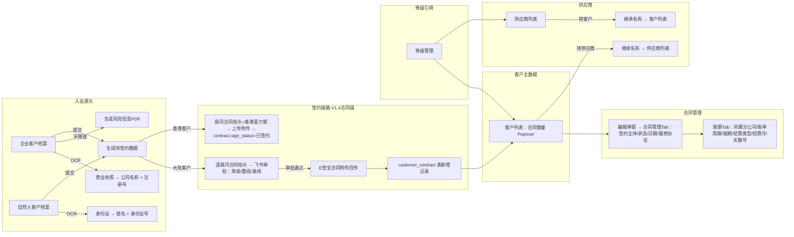

# 需求定义卡片 (RDD) — 客商中心

> **原始需求**：为飞点跨境供应链建立统一的客商中心，覆盖客户入驻、客户管理、供应商管理、合同签约、等级体系的完整生命周期。
> **文档版本**: v1.9 | **日期**: 2026-07-06 | **作者**: AI PM（v1.9: 合同开始日期+结束日期改为条件必填；v1.8: 签订日期改为条件必填；v1.7: 供应商签约弹窗移除是否新客户+老客户代码）

## 1. 核心洞察 (Insight)

**真实痛点**：

当前飞点跨境供应链的客户和供应商信息分散在多个渠道（销售 Excel、客服微信聊天、财务对账表），缺乏统一的管理入口。客户入驻依赖销售手工发送链接+微信跟进，无法追踪入驻进度。合同签约流程未标准化——中国大陆客户走线上（飞书审批+E签宝），中国香港客户走线下，但当前两种流程均缺乏系统承载。

客户与供应商之间存在互转需求（同行既可能是客户也可能是供应商），当前完全依赖手工在两个 Excel 之间复制粘贴。等级管理缺乏统一看板，冻结/启用操作的关联影响（如冻结客户时关联账户需同步冻结）依赖人工通知，有遗漏风险。

**JTBD**：
> `销售/客服` 雇佣"客商中心"不是为了"管理客户档案"，而是为了：**当需要查询客户签约状态/等级/账期时，能在30秒内完成检索，且冻结操作自动同步关联账户状态，不用再通知运维手动处理。**

> `客户（入驻方）` 雇佣"客商中心"不是为了"填表单"，而是为了：**当收到入驻链接后，能在一次会话内完成信息提交+签约+开户，不用反复切换页面和沟通渠道。**

> `供应商管理专员` 雇佣"客商中心"不是为了"录入供应商信息"，而是为了：**当需要将同行客户转为供应商时，能在1个弹窗内完成信息继承+补充，不用在两个系统间切换复制。**

**业务价值**：

| 维度 | 当前 | 目标 |
|------|------|------|
| 客户入驻 | 销售手工发链接+微信跟进，无法追踪 | 链接邀请→签约→开户→生成账号密码，全链路线上化 |
| 客户查询 | Excel/微信聊天，平均5分钟 | 列表页搜索+tab过滤，30秒内 |
| 客户<->供应商互转 | 手动复制粘贴，易出错 | 弹窗内继承已有信息+补充，1分钟完成 |
| 合同签约 | 无统一入口，大陆/香港流程混用 | 大陆走飞书审批+E签宝线上签，香港走线下简化流程 |
| 等级管理 | 无集中看板 | 统一列表，支持新增/冻结/启用 |
| 冻结/启用的关联处理 | 运维手动通知，有遗漏风险 | 系统自动同步关联账户状态 |

## 2. 业务全景图

### 2.1 角色与工作节奏

| 角色 | 核心任务 | 频率 |
|------|---------|------|
| 销售代表 | 新增客户、发送入驻链接、维护客户信息、查看签约状态 | 日频 |
| 客服代表 | 管理客户服务状态、处理冻结/启用 | 日频 |
| 销售助理 | 协助维护客户信息、跟进资料补齐 | 日频 |
| 供应商管理专员 | 新增供应商、维护供应商信息、处理互转 | 周频 |
| 运营管理员 | 管理等级体系、查看审计日志 | 按需 |
| 客户（企业/自然人） | 自助入驻：填写档案→签约→开户 | 一次性 |

### 2.2 端到端业务链路

```
【客户入驻】
  链接邀请 → 填写客户档案（支持暂存） → 提交入驻 → 签约 → 开户 → 生成账号密码
      特殊场景：先开户再签约（客户管理新增→用户管理新增账户→发起合同签约）
          ↓
【日常录入】
  客户管理 → 手工创建客户（销售代填）/ 客户档案入驻 → 补充资料+联系人+地址
  供应商管理 → 新增供应商 → 补充大类+明细+SCAC+打单服务
      ↓
【业务互动】
  客户签约：
    中国大陆 → 线上：飞书审批（简易/墨线/美线）→ E签宝回传合同
    中国香港 → 线下：上传服务合同协议 → 保存后状态=已签约
  合同信息回传：标准合同取签约值，非标合同手工维护
      ↓
【高频运维】
  冻结/启用客户 → 自动同步关联账户状态
  冻结/启用供应商 → 独立操作
      ↓
【互转】
  客户 ↔ 供应商互转（同行场景） → 继承基本信息 + 补充对端独有字段
      ↓
【查询使用】
  列表搜索 + 状态Tab过滤 + 客户类型/属地/签约状态筛选
```

### 2.3 实体依赖关系

```
客户 (Customer) — 聚合根
  ├── 1:N 客户联系人 (CustomerContact) — 固定3角色：公司负责人/物流联系人/财务负责人
  ├── 1:N 客户取货地址 (CustomerAddress)
  ├── 1:N 客户资料 (CustomerMaterial)
  ├── 1:N 客户关联账户 (CustomerAccount) — 从账户模块引用，按合同/所属公司关联
  ├── 1:N 合同 (customer_contract) — 单表，内含三段：
  │     ├─ 签约段：签约主体(contract_company) + 合同状态(sign_status) + 起止日期 + 服务协议附件
  │     ├─ 账期段：账单周期(billing_cycle) + 账期(payment_term) + 结算类型(settlement_type) + 结算月(settlement_month) + 天数/号(days_or_date)
  │     └─ 生命周期段：主合同标记(is_primary) + 解约时间(termination_date)
  ├── 1:1 通信信息 (Communication)
  └── N:1 客户等级 (CustomerLevel) — 引用等级管理

供应商 (Supplier) — 聚合根
  ├── 1:N 供应商联系人 (SupplierContact)
  ├── 1:N 供应商打单服务 (SupplierPrintService)
  ├── 1:N 供应商资料 (SupplierMaterial)
  ├── 1:1 供应商大类/明细映射 (Category-Detail Map)
  └── N:1 供应商等级 (SupplierLevel) — 引用等级管理

等级 (Level)
  ├── 客户等级 (CustomerLevel) — 每个等级代码一条记录，含状态
  └── 供应商等级 (SupplierLevel) — 每个等级代码一条记录，含状态

客户档案 — 入驻端
  ├── 企业客户档案 (EnterpriseProfile) — 营业执照OCR + 天眼查风险信息PDF + 法人证件
  ├── 自然人客户档案 (PersonalProfile) — 身份证OCR
  └── 入驻链接 (InvitationLink) — 含过期时间、状态

签约流程
  ├── 中国大陆签约 (MainlandSigning) — 飞书审批(简易/墨线/美线) + E签宝回传
  ├── 中国香港签约 (HKSigning) — 线下签约，上传附件即完成
  └── 所属公司 (ContractCompany) — 每份合同挂一个主体公司（广州飞点/深圳飞点/广东飞点/香港富力顿/墨链）
```

### 2.4 核心业务流程图（泳道图）

```mermaid
flowchart TD
    subgraph 销售与客服
        A1["发送入驻链接"] --> A2["客户点击链接填写档案"]
        A2 --> A3{"大陆/香港企业?"}
        A3 -->|大陆企业| A4["线上签约：选我司合同抬头 → 飞书审批 → E签宝回传"]
        A3 -->|香港企业| A5["线下签约：我司合同抬头=香港富力顿 → 上传合同协议"]
        A4 --> A6["开户：生成账号密码"]
        A5 --> A6
    end
    subgraph 客户入驻端
        D1["填写企业档案"] --> D2["营业执照OCR自动填充"]
        D2 --> D3["补充取货地址 + 联系人 + 业务渠道"]
        D3 --> D4{"暂存或提交?"}
        D4 -->|暂存并退出| D5["信息暂存，无需全部填写"]
        D4 -->|点击入驻| D6["校验必填 → 页面置灰 → 显示审核提示"]
        D6 --> D7["调用天眼查生成风险信息PDF"]
        D7 --> D8["生成待签约数据"]
    end
    subgraph 运营端-客户管理-V1.4多合同
        C1["客户列表"] --> C2["手工创建客户"]
        C2 --> C3["保存并生成账户 → 邮件通知"]
        C1 --> C4["编辑 / 冻结 / 启用"]
        C1 --> C5["签约 → 选我司合同抬头 → 校验签约主体唯一"]
        C5 --> C6{"该客户已有有效合同?"}
        C6 -->|否| C7["飞书审批 → 合同表新增记录 → 合同管理Tab同步"]
        C6 -->|是| C8["拦截提示：已存在有效合同，不可重复签约"]
        C4 --> C9["编辑弹窗：合同管理Tab + 账期Tab"]
    end
    subgraph 供应商专员
        B1["新增供应商"] --> B2["选择大类 + 明细"]
        B2 --> B3{"明细含快递?"}
        B3 -->|是| B4["SCAC必填"]
        B3 -->|否| B5["SCAC选填"]
        B4 --> B6["补充联系人 + 打单服务"]
        B5 --> B6
    end
    subgraph 互转流程
        E1["客户 → 转供应商"] --> E2["继承客户名称"]
        E2 --> E3["补充大类 / 明细 / SCAC"]
        F1["供应商 → 转客户"] --> F2["继承供应商名称"]
        F2 --> F3["补充客户类型 / 属地 / 等级 / 联系人"]
    end
```



### 2.5 核心数据流图



---

> 以下按 **7 条业务流程** 组织，每条流程包含：流程概述 → 实体字段定义 → 业务规则 → 核心场景 → 相关 AC。

## 3. 流程一：客户入驻流程（一次性 / 按需）

> **触发**：销售/客服发送入驻链接，客户点击链接进入 **频率**：一次性 **前置依赖**：销售已在客户管理中创建客户记录或客户自行注册

### 3.1 入驻链接 (InvitationLink)

> **As a** 销售代表 **I want to** 生成客户入驻链接并发送给客户 **So that** 客户能自助完成档案填写和签约

| 字段 | 类型 | 必填 | 说明 |
|------|------|------|------|
| 链接地址 | 文本 | ✅ | 唯一入驻链接，含token |
| 关联客户 | 关联 | ✅ | 关联客户ID（如已预创建） |
| 过期时间 | 时间 | ✅ | 链接过期时间，默认14天 |
| 链接状态 | 枚举 | ✅ | 有效、已使用、已过期 |

**业务规则**：
- R01：链接过期后客户点击提示"链接已过期，请联系您的销售代表重新发送入驻邀请"
- R02：链接被使用后（客户已提交入驻），不可再次使用

**相关 AC**：`AC0a` `AC0b`

### 3.2 入驻主流程

```
正常流程：
  销售发送链接 → 客户填写档案(支持暂存) → 点击入驻 → 校验必填 → 提交
  → 页面置灰 + 显示审核提示 → 生成待签约数据 → 自动触发天眼查生成风险信息PDF

特殊场景（先开户再签约）：
  客户管理新增 → 用户管理新增账户 → 发起合同签约

大陆企业：线上签约（飞书审批 + E签宝回传）
香港企业：线下签约（上传合同附件）
```

**业务规则**：
- R03：暂存并退出 = 信息暂存无需全部填写，下次打开链接可继续填写
- R04：点击入驻 = 校验必填 + 提交后页面置灰 + 显示"您的入驻申请已提交，我们将在1-3个工作日内完成审核"
- R05：提交后系统调用天眼查接口生成风险信息PDF，存入客户资料
- R06：自然人客户以身份证号做唯一校验，企业客户以统一社会信用代码做唯一校验，重复时提示"该统一社会信用代码/身份证号已被使用"
- R07：提交入驻后，在用户管理-待签约中生成待提交签约流程数据。

**相关 AC**：`AC0c` `AC0d` `AC0e` `AC0f`

---

## 4. 流程二：客户档案 — 企业入驻（按需）

> **触发**：企业客户点击入驻链接进入 **频率**：一次性 **前置依赖**：有效的入驻链接

### 4.1 企业客户档案 (EnterpriseProfile)

> **As a** 企业客户 **I want to** 提交企业认证信息 **So that** 系统创建企业客户账户

| 字段 | 类型 | 必填 | 说明 |
|------|------|------|------|
| 企业属地 | 单选 | ✅ | 中国大陆、中国香港（默认大陆） |
| 公司名称 | 文本 | ✅ | 营业执照OCR自动填充，可修改 |
| 公司注册号码 | 文本 | ✅ | 营业执照OCR自动填充，可修改 |
| 统一社会信用代码 | 文本 | ✅ | 全局唯一校验 |
| 营业执照 | 文件 | — | 上传后触发OCR+天眼查 |
| 注册地址-省 | 单选 | ✅ | — |
| 注册地址-市 | 单选 | ✅ | — |
| 注册地址-详细 | 文本 | ✅ | — |

**取货地址 (1:N)**：

| 字段 | 类型 | 必填 | 说明 |
|------|------|------|------|
| 取货地址-省份 | 单选 | ✅ | — |
| 取货地址-城市 | 单选 | ✅ | — |
| 取货地址-详细 | 文本 | ✅ | — |

**联系人 (1:N)**：

| 字段 | 类型 | 必填 | 说明 |
|------|------|------|------|
| 角色标签 | 文本(固定) | ✅ | 公司负责人、物流联系人、财务负责人 |
| 姓名 | 文本 | ✅ | — |
| 联系电话 | 文本 | ✅ | — |
| 邮箱 | 文本 | ✅ | — |
| 合同对接人 | 单选 | — | 3人中单选1人 |
| 系统账号接收人 | 单选 | — | 3人中单选1人 |

**业务与渠道**：

| 字段 | 类型 | 必填 | 说明 |
|------|------|------|------|
| 添加渠道 | 单选 | ✅ | 探迹、展会、老板介绍、朋友推荐 |
| 主营业务国 | 单选 | ✅ | 美国、英国、德国等 |
| 主要经营平台 | 多选 | ✅ | Amazon、eBay、Walmart 等（与业务国级联） |

**附件**：

| 字段 | 类型 | 必填 | 说明 |
|------|------|------|------|
| 身份证人像面 | 文件 | ✅ | 法人身份证人像面照片 |
| 身份证国徽面 | 文件 | ✅ | 法人身份证国徽面照片 |
| 天眼查风险PDF | 文件 | — | 提交后自动生成 |
| 客户备注 | 文本 | — | — |

**业务规则**：
- R08：上传营业执照后触发OCR自动识别公司名称、注册号码、统一社会信用代码，识别后可手动修改
- R09：取货地址至少保留1条，支持新增/删除，最后一条不可删除
- R10：联系人默认3个固定角色（公司负责人/物流联系人/财务负责人），不可增减行
- R11：合同对接人必须从3个联系人中选1人
- R12：系统账号接收人必须从3个联系人中选1人
- R13：法人身份证正反面均必传，支持jpg/png/jpeg，单张不大于2MB
- R14：主要经营平台与主营业务国级联：选择业务国后，平台下拉仅显示该国的主流平台
- R15：提交入驻后系统调用天眼查接口，自动生成风险信息PDF并存入客户资料
- R16：暂存并退出时无需校验必填项，信息保留在草稿状态

**相关 AC**：`AC4a` `AC4b` `AC4c` `AC4d`

---

## 5. 流程三：客户档案 — 自然人入驻（按需）

> **触发**：自然人客户点击入驻链接进入 **频率**：一次性 **前置依赖**：有效的入驻链接

### 5.1 自然人客户档案 (PersonalProfile)

> **As a** 自然人客户 **I want to** 提交个人认证信息 **So that** 系统创建自然人客户账户

| 字段 | 类型 | 必填 | 说明 |
|------|------|------|------|
| 所属地 | 单选 | ✅ | 中国大陆、中国香港 |
| 个人姓名 | 文本 | ✅ | 身份证OCR自动识别，可修改 |
| 身份证号 | 文本 | ✅ | 身份证OCR自动识别 + 全局唯一校验 |
| 身份证人像面 | 文件 | ✅ | — |
| 身份证国徽面 | 文件 | ✅ | — |
| 联系地址-省 | 单选 | ✅ | — |
| 联系地址-市 | 单选 | ✅ | — |
| 联系地址-详细 | 文本 | ✅ | — |

**取货地址 (1:N)**：与企业客户档案相同（省份、城市、详细地址）。

**联系人 (1:N)**：与企业客户档案相同（3固定角色）。

**业务与渠道**：与企业客户档案相同（渠道、业务国、经营平台级联）。

**附件**：法人身份证正反面（与企业档案相同）。

**业务规则**：
- R17：上传身份证人像面后触发OCR自动识别姓名和身份证号，识别后可手动修改
- R18：身份证号全局唯一校验，重复时提示"该身份证号已被使用"
- R19：提交后用户管理-待签约中生成待提交签约流程数据
- R20：其余规则（取货地址、联系人、渠道）与企业档案相同

**相关 AC**：`AC5a` `AC5b` `AC5c`

---

## 6. 流程四：客户管理（日频）

> **触发**：销售/客服需要新增或维护客户 **频率**：日频 **前置依赖**：等级管理已完成初始化

### 6.1 客户列表 (CustomerList)

> **As a** 销售代表 **I want to** 在统一列表中检索和管理客户 **So that** 快速定位目标客户并执行操作

**查询条件**：

| 字段 | 类型 | 说明 |
|------|------|------|
| 客户名称 | 文本输入 | 模糊搜索 |
| 客户类型 | 多选 | 企业、自然人 |
| 客户属地 | 多选 | 中国大陆、中国香港 |
| 是否同行 | 多选 | 是、否 |

**按钮**：查询、重置、新增客户、转供应商

**Tab页签**：正常 / 已冻结 / 全部

**列表字段（15列）**：

| 列 | 字段 | 说明 |
|----|------|------|
| 1 | 客户编号 | 规则：K+1+0001自增，如 K10001 |
| 2 | 客户名称 | 超长省略+tooltip |
| 3 | 客户类型 | 自然人 / 企业 |
| 4 | 客户属地 | 中国大陆 / 中国香港 |
| 5 | 是否同行 | 是 / 否 |
| 6 | 客服代表 | 多选用"、"连接 |
| 7 | 客户等级 | SS~G（默认G） |
| 8 | 合同数量 | 已签N份合同，点击可展开合同列表 |
| 9 | 服务状态 | 正常 / 已冻结 |
| 10 | 首次下单时间 | 获取运单管理中，该客户首次下单时间 |
| 11 | 未下单天数 | 获取运单管理中，该客户最新一次下单时间，然后用当前日期相减得到未下单天数 |
| 12 | 操作 | 编辑、签约、冻结/启用 |

> **变更说明**：合同签署状态/开始日期/结束日期/账期从客户列表列中移除（一个客户多份合同无法在单行展示），改为"合同数量"列可点击展开查看各合同详情。账期跟随合同，不再在客户列表展示。

**操作按钮**：

| 按钮 | 显示条件 | 行为 |
|------|---------|------|
| 编辑 | 始终显示 | 打开编辑弹窗（已冻结客户弹窗只读） |
| 签约 | serviceStatus=正常 | 打开签约弹窗，可选择新增一份合同（不限于未签署状态，支持多份并行合同） |
| 冻结 | serviceStatus=正常 | 二次确认后执行，关联账户同步冻结 |
| 启用 | serviceStatus=已冻结 | 二次确认后执行，关联账户同步启用 |

**相关 AC**：`AC1a`

### 6.2 客户 (Customer) — 新增界面

> **As a** 销售代表 **I want to** 录入和维护客户基本信息、等级、签约状态 **So that** 团队能快速查询客户全貌

**基本信息**：

| 字段 | 类型 | 必填 | 说明 |
|------|------|------|------|
| 客户编号 | 文本(自动生成) | — | 规则：K + 1 + 0001自增，编辑时不可修改 |
| 客户类型 | 单选 | ✅ | 自然人、企业 |
| 客户名称 | 文本 | ✅ | — |
| 客户昵称 | 文本 | ✅ | 底纹"举例：qyjskj"，位于是否同行前 |
| 统一社会信用代码 | 文本 | 条件 | 企业必填+全局唯一校验，自然人禁用 |
| 客户属地 | 单选 | ✅ | 中国大陆、中国香港 |
| 是否同行 | 单选 | ✅ | 是、否 |
| 客户等级 | 单选 | ✅ | SS~G（默认G） |
| 客服代表 | 多选 | ✅ | — |
| 销售代表 | 单选 | ✅ | — |
| 销售助理 | 单选 | ✅ | — |
| 销售来源 | 文本 | — | — |
| 开通业务 | 多选 | ✅ | TMS、WMS |

**更多信息 Tab 区**：

> V1.4：合同管理 + 账期（原服务合同和账期合并重构），其余 Tab 保持不变。

**【合同管理】Tab**（列表形式，行内可编辑）：

| 列 | 字段 | 说明 |
|----|------|------|
| 1 | 主合同 | Radio 单选，同一客户同时仅一份生效主合同，点击即切换。未标记时默认第一份已签署合同为主合同 |
| 2 | 签约主体 | 下拉选择；大陆全部4家，香港仅香港富力顿；编辑态置灰 |
| 3 | 合同状态 | Tag：已签署/签署中/已过期/已解约/未签署 |
| 4 | 合同开始日期 | 行内日期选择器，编辑态置灰 |
| 5 | 合同结束日期 | 行内日期选择器，编辑态置灰 |
| 6 | 解约时间 | 行内日期选择器。填写后系统每日凌晨扫描，termination_date ≤ today 且 sign_status=已签署 → 自动变更为已解约；若删除解约时间，根据 contract_end_date vs today 恢复：end_date > today → 已签署，end_date ≤ today → 已过期 |
| 7 | 服务协议 | 上传按钮 + 已上传文件链接 |

> 合同通过主列表「签约」按钮创建，Tab 内不提供新增/删除按钮。

**【账期】Tab**（列表形式，行内可编辑）：

| 列 | 字段 | 说明 |
|----|------|------|
| 1 | 所属分公司 | 只读，来自签约主体 |
| 2 | 账单周期 | 下拉：固定、不固定 |
| 3 | 账期 | 下拉，联动账单周期 |
| 4 | 结算类型 | 只读，按月/按天自动推导 |
| 5 | 结算月 | 只读，月结=0/双月结=1/三月结=2 |
| 6 | 天数/号 | 数字输入，≥0整数 |

**【资料】Tab**：

| 默认资料 | 必填条件 |
|---------|---------|
| 营业执照 | 客户类型=企业时必填 |
| 法人身份证正反面 | 始终必填 |
| 天眼查风险信息PDF | 入驻提交后自动生成，手工创建客户时可上传 |
| 自定义附件 | 选填，支持新增自定义资料名称+上传 |

**【地址库】Tab**：只读展示，数据来源于客户档案和客户端地址，不可手动新增。

**【联系人】Tab**：

| 角色标签 | 姓名 | 电话 | 邮箱 | 合同对接人 | 系统账号接收人 |
|---------|------|------|------|-----------|-------------|
| 公司负责人 | ✅ | ✅ | ✅ | 单选 | 单选 |
| 物流联系人 | ✅ | ✅ | ✅ | 单选 | 单选 |
| 财务负责人 | ✅ | ✅ | ✅ | 单选 | 单选 |

**【通信信息】Tab**：

| 字段 | 类型 | 必填 | 说明 |
|------|------|------|------|
| 工具类型 | 文本(固定) | — | 企业微信（默认不可修改） |
| 群聊ID | 文本 | ✅ | — |

**【关联账户】Tab**：只读展示（账户名称、所属公司/合同、账户角色、绑定邮箱、账户状态、最近登录时间），数据来源于账户模块。一个客户可能有多套虚拟账户，分别对应不同所属公司下的合同。

**底栏按钮**：

| 按钮 | 行为 |
|------|------|
| 返回 | 二次确认"返回后已填写数据将丢失" → 关闭 |
| 保存 | 校验必填 → 保存 → Toast "手工创建客户成功！" |
| 保存并生成账户 | 需权限 → 额外校验身份证正反面完整性 + 营业执照（企业）→ 保存 + 开通账户 + 邮件通知 → 合同状态=未签约 |

**业务规则**：
- R21：客户编号 K+1+0001 自增，编辑时不可修改
- R22：客户类型选择"自然人"时，统一社会信用代码自动清空并禁用；营业执照为非必填
- R23：客户类型选择"企业"时，统一社会信用代码必填 + 全局唯一校验
- R24：编辑客户弹窗中，客户类型、客户名称、统一社会信用代码、客户属地不可修改
- R25：冻结客户时，二次确认弹窗 + 关联账户同步冻结
- R26：启用客户时，二次确认弹窗 + 关联账户同步启用
- R27：已冻结客户弹窗切换为只读模式，标题"查看客户"，仅有"关闭"按钮
- R28：联系人固定3行（公司负责人/物流联系人/财务负责人），不允许增删行
- R29：保存前必须指定合同对接人和系统账号接收人（各选1人），否则阻止保存
- R30：保存并生成账户 → 生成账户 + 邮件通知。该客户的首份合同为未签署，后续可通过合同管理Tab新增合同
- R31：统一社会信用代码全局唯一校验，重复时阻止保存
- R32：客户等级默认G
- R32-1：一个客户在飞点租户下有且仅能有一份处于"已签约"或"签约中"状态的有效合同。旧合同过期/作废后方可签署新合同。每份合同独立管理账期和关联账户
- R32-2：**主合同标记**：Radio 单选互斥，同一客户同时仅一份生效主合同（is_primary=true），点击即切换。无标记时默认第一份已签署合同为主合同。主合同是身份标记，不对签约唯一性产生约束
- R32-3：**当前生效主合同判定**（系统实时计算）：校验 is_primary=true 且 sign_status=已签署(30) 且 contract_start_date ≤ today ≤ contract_end_date 且 (termination_date IS NULL 或 today < termination_date)。全部满足 → 该合同为当前生效主合同；任一不满足 → 无生效合同，主合同身份保留但状态如实展示（已过期/已解约），是否允许登录系统由信控管理模块决定
- R32-4：**解约时间管理**：每份合同可填写解约时间（termination_date）。填写后不立即改变签状态——由每日定时任务扫描：termination_date ≤ today 且 sign_status=已签署 → 自动变更为已解约(50)。删除解约时间时，按 contract_end_date 恢复：end_date > today → 已签署(30)，end_date ≤ today → 已过期(40)
- R32-5：**合同状态新增"已解约"**：sign_status 枚举新增 50:已解约。已解约 ≠ 已过期——已解约是主动提前终止，已过期是自然到期。两者是不同的终态，供信控模块区分风控策略

**相关 AC**：`AC1b` `AC1c` `AC1d` `AC1e`

---

## 7. 流程五：合同签约（按需）

> **触发**：客户列表点击"签约"按钮 或 入驻完成后进入签约流程 **频率**：按需 **前置依赖**：客户已存在且服务状态=正常

### 7.1 中国大陆客户签约 (MainlandSigning)

> **As a** 销售代表 **I want to** 为客户发起合同签约 **So that** 通过飞书审批+E签宝完成法律有效签约

**签约表单字段**：

| 字段 | 类型 | 必填 | 说明 |
|------|------|------|------|
| 是否新客户 | 单选 | ✅ | 是、否。选"否"时，老客户代码必填 |
| 老客户代码 | 文本 | 条件 | 是否新客户=否 时显示+必填 |
| 我司合同抬头 | 单选 | ✅ | 广州飞点 / 深圳飞点 / 广东飞点 / 墨链。确定时校验：该客户在飞点租户下是否已有"已签约"或"签约中"的合同，若已有则阻止（一个客户全局只能有一个有效合同） |
| 是否简易合同 | 单选 | ✅ | 是、否 |
| 是否标准合同 | 单选 | ✅ | 是、否 |
| 账期 | 单选 | 条件 | 根据域名和企业属地不同可选值 |
| 合同有效期限 | 单选 | ✅ | 1年、2年、3年 |
| 合同开始日期 | 日期 | 条件（必填） | 非简易+标准合同时显示+必填，默认当天 |
| 合同结束日期 | 日期 | 条件（必填） | 非简易+标准合同时显示+必填，自动计算 |
| 签订日期 | 日期 | 条件（必填） | 简易合同时显示+必填，默认当天 |
| 合同修改内容 | 文本域 | 条件 | 非标合同场景 |
| 附件 | 文件 | 条件 | 非标合同场景，支持上传后动态回显和删除 |

**4分支签约字段组合**：

> 所有分支共有字段：是否新客户 + 老客户代码（联动）+ 我司合同抬头。各分支差异字段见下表：

| 是否简易 | 是否标准 | 展示字段（除共有字段 我司合同抬头 外） |
|----------|---------|---------|
| 否 | 是 | 账期 + 合同有效期限 + 合同开始日期 + 合同结束日期 |
| 否 | 否 | 合同修改内容 + 附件 |
| 是 | 是 | 账期 + 合同有效期限 + 签订日期 |
| 是 | 否 | 合同有效期限 + 签订日期 + 合同修改内容 + 附件 |

**签约审批流程**：

```
发起签约 → 飞书审批（简易/墨线/美线三种审批流，根据合同类型路由）
         → 审批通过 → E签宝生成合同 → 客户签署 → E签宝合同附件回传
         → 合同信息回写至客户信息
```

**业务规则**：
- R33：中国大陆企业支持线上签约（飞书审批+E签宝）
- R34：我司合同抬头根据当前域名自动填充
- R35：账期可选值根据域名和企业属地动态计算
- R36：合同开始日期默认当天，合同结束日期 = 开始日期 + 合同期限(1/2/3年)，自动计算
- R37：签订日期默认当天
- R38：是否新客户=是 → 老客户代码隐藏；=否 → 老客户代码显示+必填。发起签约时一并写入 customer_contract 表
- R38-1：发起签约后调用飞书审批流程（简易/墨线/美线三种，根据合同类型自动路由）
- R39：监听飞书审批通过后，触发E签宝生成合同 → 客户签署 → E签宝回传合同附件
- R40：合同信息回传：标准合同取签约值自动回写至 customer_contract 表；非标合同由销售手工在客户编辑页的合同管理Tab中维护
- R41：签约完成后合同签署状态更新为"已签约"

**相关 AC**：`AC2a` `AC2b` `AC2c` `AC2d`

### 7.2 中国香港客户签约 (HKSigning)

> **As a** 销售代表 **I want to** 为香港客户记录线下签约信息 **So that** 签约状态在系统中有据可查

**签约表单字段**：

| 字段 | 类型 | 必填 | 说明 |
|------|------|------|------|
| 是否新客户 | 单选 | ✅ | 是、否。选"否"时，老客户代码必填 |
| 老客户代码 | 文本 | 条件 | 是否新客户=否 时显示+必填 |
| 我司合同抬头 | 文本(只读) | ✅ | 默认"香港富力顿"，置灰不可编辑 |
| 合同开始日期 | 日期 | ✅ | — |
| 合同结束日期 | 日期 | ✅ | 不可早于开始日期 |
| 服务合同协议 | 文件 | ✅ | PDF/图片，至少1个附件 |

**业务规则**：
- R42：中国香港企业走线下签约流程
- R43：保存后合同状态直接更新为"已签约"
- R44：服务合同协议必须上传至少1个附件
- R44-1：是否新客户=是 → 老客户代码隐藏；=否 → 老客户代码显示+必填

**相关 AC**：`AC2e`

---

## 8. 流程六：供应商管理（周频）

> **触发**：供应商专员需要新增或维护供应商 **频率**：周频 **前置依赖**：等级管理已完成初始化、供应商大类/明细枚举已定义

### 8.1 供应商列表 (SupplierList)

> **As a** 供应商专员 **I want to** 在统一列表中检索和管理供应商 **So that** 快速定位目标供应商并执行操作

**查询条件**：

| 字段 | 类型 | 说明 |
|------|------|------|
| 供应商名称 | 文本输入 | 模糊搜索 |
| 供应商大类 | 多选 | — |
| 供应商明细 | 多选 | 跟随大类联动 |
| 是否同行 | 多选 | 是、否 |

**按钮**：查询、重置、新增供应商、转客户、签约

**Tab页签**：正常 / 已冻结 / 全部

**列表字段（7列）**：

| 列 | 字段 | 说明 |
|----|------|------|
| 1 | 供应商名称 | 超长省略+tooltip |
| 2 | 供应商大类 | 多选用"、"连接 |
| 3 | 供应商明细 | 多选用"、"连接 |
| 4 | 供应商等级 | SS~G（默认G） |
| 5 | 合同数量 | Popover展示合同明细（签约主体/状态/起止日期/解约时间），含生效中标记，逻辑同客户管理 |
| 6 | 服务状态 | 正常 / 已冻结 |
| 7 | 操作 | 编辑 / 签约 / 冻结或启用（带图标） |

**操作按钮**：

| 按钮 | 显示条件 | 行为 |
|------|---------|------|
| 签约 | serviceStatus=正常 | 打开签约弹窗 |
| 编辑 | 始终显示 | 打开编辑弹窗（已冻结供应商弹窗只读） |
| 冻结 | serviceStatus=正常 | 二次确认后执行 |
| 启用 | serviceStatus=已冻结 | 二次确认后执行 |

**相关 AC**：`AC3a`

### 8.2 供应商 (Supplier) — 新增/编辑界面（Tab切换布局）

> **As a** 供应商专员 **I want to** 录入和维护供应商信息 **So that** 运价配置和订单分发有准确的供应商主数据

**Tab：基本信息**：

| 字段 | 类型 | 必填 | 说明 |
|------|------|------|------|
| 供应商编号 | 文本(自动生成) | — | 规则：G + 10001自增，编辑时不可修改 |
| 是否同行 | 单选 | ✅ | 是、否 |
| 供应商名称 | 文本 | ✅ | 全局唯一 |
| 供应商简称 | 文本 | ✅ | — |
| 供应商大类 | 多选 | ✅ | 干线运输供应商、揽货服务商、仓储供应商、关务供应商、尾程运输供应商、综合代理、其他 |
| 供应商明细 | 多选 | ✅ | 根据大类动态联动可选值 |
| SCAC代码 | 文本 | 条件 | 明细包含"快递"时必填 |
| 供应商等级 | 单选 | ✅ | SS~G（默认G），下拉取等级管理-供应商等级Tab数据 |
| 服务状态 | 文本(自动) | — | 正常、已冻结 |

**大类 → 明细映射表**：

| 供应商大类 | 供应商明细 |
|-----------|-----------|
| 干线运输供应商 | 汽运、海运、空运、铁运 |
| 揽货服务商 | 货拉拉、拖车行 |
| 仓储供应商 | 海外中转仓、保税仓、本地仓 |
| 关务供应商 | 报关行、清关行、查验代理 |
| 尾程运输供应商 | 快递、卡车 |
| 综合代理 | 同行 |
| 其他 | 其他 |

**Tab：联系人**：

| 字段 | 类型 | 必填 | 说明 |
|------|------|------|------|
| 姓名 | 文本 | ✅ | — |
| 联系电话 | 文本 | ✅ | 仅限数字 |
| 邮箱 | 文本 | ✅ | — |
| 合同对接人 | 单选 | ✅ | — |
| 系统账号接收人 | 单选 | ✅ | — |

**Tab：资料**：自定义附件上传，支持新增资料名称+上传文件。

**Tab：打单服务**：

| 字段 | 类型 | 必填 | 说明 |
|------|------|------|------|
| 收货渠道 | 文本 | — | — |
| 状态 | 文本 | — | 正常、已冻结 |
| 操作 | 按钮 | — | 冻结/启用（每条独立操作） |

**Tab：合同信息**（阅读模式，数据来源于签约弹窗）：

| 字段 | 类型 | 必填 | 说明 |
|------|------|------|------|
| 主合同 | 单选 | — | 同一供应商仅一份主合同，默认首份已签署合同 |
| 签约主体 | 文本(自动) | — | 取签约时填写的我司合同抬头 |
| 合同状态 | 标签 | — | 签约中 / 已签署 / 已过期 / 已解约 |
| 合同开始日期 | 日期(自动) | — | 取签约时填写 |
| 合同结束日期 | 日期(自动) | — | 取签约时填写 |
| 解约时间 | 日期(自动) | — | 已签署状态解约后自动填入 |
| 服务协议 | 附件(自动) | — | 取签约时上传 |

### 8.2b 供应商签约弹窗

> 字段：我司合同抬头（下拉选择，根据域名枚举——飞点域名：广州飞点/深圳飞点/广东飞点，墨链域名：墨链）、合同开始日期、合同结束日期、服务合同协议。签约完成后合同自动同步到编辑弹窗的合同信息Tab。

**业务规则**：
- R45：供应商编号 G+10001 自增，编辑时不可修改
- R46：供应商大类与明细级联：选择大类后，明细下拉仅显示对应子项
- R47：供应商大类切换时，明细自动清空
- R48：明细包含"快递"时，SCAC必填
- R49：供应商冻结/启用为独立操作，不关联其他实体
- R50：供应商名称全局唯一，重复时阻止保存
- R51：供应商级别默认G，下拉选项来源于等级管理-供应商等级Tab中状态=正常的等级
- R52：联系人支持动态增删行，电话仅限数字，保存前必须指定合同对接人和系统账号接收人
- R53：打单服务支持动态增删，每条可独立冻结/启用
- R54：无权限管控——供应商管理对所有运营角色开放

**相关 AC**：`AC3b` `AC3c` `AC3d`

### 8.3 转客户弹窗 (SupplierToCustomer)

> **触发**：选中1个供应商 → 点击"转客户"

| 字段分组 | 字段 | 类型 | 必填 | 说明 |
|---------|------|------|------|------|
| **基本信息** | 客户类型 | 单选 | ✅ | 自然人、企业 |
| | 客户名称 | 文本(disabled) | — | 取供应商名称，不可修改 |
| | 客户昵称 | 文本 | ✅ | 底纹"举例：qyjskj" |
| | 统一社会信用代码 | 文本 | 条件 | 企业必填+全局唯一校验 |
| | 客户属地 | 单选 | ✅ | 中国大陆、中国香港 |
| | 是否同行 | 单选 | ✅ | 是、否（取供应商值） |
| | 客户等级 | 单选 | ✅ | SS~G（默认G） |
| | 客服代表 | 多选 | ✅ | — |
| | 销售代表 | 单选 | ✅ | — |
| | 销售助理 | 单选 | ✅ | — |
| | 销售来源 | 文本 | — | — |
| | 开通业务 | 多选 | ✅ | TMS、WMS |
| **联系人Tab** | 联系人列表 | — | — | 同客户新增页联系人Tab（固定3角色+对接人指派） |
| **资料Tab** | 资料列表 | — | — | 同客户新增页资料Tab |
| **通信信息Tab** | 通信信息 | — | — | 同客户新增页通信信息Tab |

**业务规则**：
- R55：转客户时客户名称自动取供应商名称，disabled不可修改
- R56：转客户提交后，自动生成ROOT账户+邮件通知（含账号密码）
- R57：转客户后不删除供应商记录——在客户列表新增一条记录
- R58：转客户时必须指定合同对接人和系统账号接收人
- R59：企业类型必须上传营业执照+信用代码

---

## 9. 流程七：等级管理 & 互转

### 9.1 等级管理（按需配置）

> **As a** 运营管理员 **I want to** 管理客户等级和供应商等级的启用/冻结 **So that** 等级体系变更可控可追溯

**页面结构**：【客户等级】+【供应商等级】两个Tab，各自独立维护。

**按钮**：查询（客户等级Tab和供应商等级Tab各自独立）+ 新增级别

**主列表字段**：

| 列 | 字段 | 说明 |
|----|------|------|
| 1 | 级别代码 | SS、S、A、B、C、D、E、F、G |
| 2 | 操作人 | 创建/最后编辑人 |
| 3 | 状态 | 正常 / 已冻结 |
| 4 | 操作 | 启用 / 冻结 |

**新增级别弹窗**：

| 字段 | 类型 | 必填 | 说明 |
|------|------|------|------|
| 级别代码 | 单选 | ✅ | 底纹提示A/B/C/D/E/F/G/S/SS |
| 状态 | 单选 | ✅ | 启用(正常)、冻结 |

**业务规则**：
- R60：客户等级和供应商等级分Tab独立维护，各自9级（SS~G）
- R61：同一分类下级别代码不可重复
- R62：若某等级已被客户/供应商绑定，则不可冻结该等级，提示"该等级已被N个客户/供应商绑定，无法冻结"
- R63：等级管理提供查询接口供CRM/SRM系统调用（GET /api/level/query）
- R64：无权限管控——等级管理对所有运营角色开放
- R65：状态流转：正常 ↔ 已冻结（冻结需二次确认，启用需二次确认）
- R66：已冻结等级在客户/供应商创建时仍可被选择（冻结仅控制等级状态，不影响已有绑定）

### 9.2 客户转供应商

> **触发**：选中1个客户 → 点击"转供应商"

| 继承字段 | 补充字段（供应商独有） |
|---------|---------------------|
| 供应商名称 ← 客户名称 | 供应商大类、供应商明细、SCAC代码、供应商等级 |

### 9.3 供应商转客户

> **触发**：选中1个供应商 → 点击"转客户"

弹窗详细字段见 §8.3 转客户弹窗 (SupplierToCustomer)。

**业务规则**：
- R67：互转时弹窗中名称自动填充且不可修改
- R68：互转后不删除源端数据——在目标端新增一条记录
- R69：转客户时必须指定合同对接人和系统账号接收人
- R70：转客户时企业类型必须上传营业执照+信用代码
- R71：转客户提交后自动生成ROOT账户+邮件通知（含账号密码）

---

## 10. 验收标准总览 (AC)

**流程一：客户入驻流程**
- [ ] **AC0a-入驻链接生成**：销售可生成唯一入驻链接并发送给客户，默认14天过期
- [ ] **AC0b-链接过期提示**：客户点击过期链接时提示"链接已过期，请联系您的销售代表重新发送入驻邀请"
- [ ] **AC0c-暂存并退出**：客户填写部分信息后可暂存退出，下次打开链接信息保留，无需全部填写
- [ ] **AC0d-入驻提交**：点击入驻→校验必填→页面置灰→显示审核提示"您的入驻申请已提交，我们将在1-3个工作日内完成审核"
- [ ] **AC0e-天眼查风险信息**：入驻提交后自动调用天眼查接口生成风险信息PDF
- [ ] **AC0f-待签约数据生成**：入驻提交后在用户管理-待签约中生成待提交签约流程数据
- [ ] **AC0g-先开户再签约**：客户管理新增→用户管理新增账户→发起合同签约

**流程二：企业客户档案**
- [ ] **AC4a-营业执照OCR**：上传营业执照→自动识别公司名称、注册号码、统一社会信用代码，识别后可手动修改
- [ ] **AC4b-取货地址**：支持动态新增/删除，至少保留1条
- [ ] **AC4c-联系人配置**：固定3角色，合同对接人和系统账号接收人各单选1人
- [ ] **AC4d-统一社会信用代码唯一校验**：重复时阻止提交并提示

**流程三：自然人客户档案**
- [ ] **AC5a-身份证OCR**：上传身份证人像面→自动识别姓名+身份证号，可修改
- [ ] **AC5b-身份证号唯一校验**：重复时阻止提交并提示
- [ ] **AC5c-待签约数据生成**：提交后用户管理-待签约中生成数据

**流程四：客户管理**
- [ ] **AC1a-列表查询**：支持客户名称/类型/属地/是否同行筛选+Tab过滤；列表含是否同行列+合同数量Popover（签约主体+状态+起止日期+账期+天数号）
- [ ] **AC1b-新增客户**：弹窗900px，基本信息（含客户昵称必填）+更多信息（合同管理Tab+账期Tab+资料/地址库/联系人/通信信息/关联账户）
- [ ] **AC1c-客户昵称必填**：新增/编辑时客户昵称必填，底纹"举例：qyjskj"，位于是否同行前
- [ ] **AC1d-保存并生成账户**：校验身份证+营业执照→生成账户+邮件通知
- [ ] **AC1e-联系人校验**：固定3行不可增减；未指定合同对接人/账号接收人时阻止保存
- [ ] **AC1f-冻结/启用联动**：冻结客户时关联账户同步冻结，启用时同步启用，均需二次确认
- [ ] **AC1g-编辑态保护**：编辑已有客户时，合同管理Tab中签约主体/合同起止日期置灰不可编辑

**流程五：合同签约**
- [ ] **AC2a-签约按钮常显**：主列表签约按钮（serviceStatus=正常即可），点确定时校验唯一性
- [ ] **AC2b-大陆签约弹窗**：我司合同抬头(下拉4家)+是否简易+是否标准+条件字段；4分支组合正确
- [ ] **AC2c-签约唯一校验**：确定时校验该客户在租户下是否已有"已签约"或"签约中"的合同，若已有则拦截（一个客户全局只能有一个有效合同）
- [ ] **AC2d-签约成功→合同表新增**：customer_contract 新增记录，合同管理Tab自动同步
- [ ] **AC2e-大陆日期联动**：开始日期默认当天，结束日期=开始+期限自动计算，签订日期默认当天
- [ ] **AC2f-非标合同附件**：上传后动态回显文件名，支持删除
- [ ] **AC2g-香港线下签约**：我司合同抬头置灰只读"香港富力顿"，确定时校验唯一→合同表新增
- [ ] **AC2h-合同管理Tab**：列表形式（签约主体下拉+状态Tag+日期Picker+服务协议上传/链接）；编辑态签约主体/日期置灰；不提供新增/删除按钮
- [ ] **AC2i-账期Tab**：列表形式（所属分公司只读+账单周期+账期联动+结算类型自动+结算月自动+天数号）
- [ ] **AC2j-合同数量Popover**：列表点击弹出（签约主体+合同状态+起止日期+账期+天数号）

**流程六：供应商管理**
- [ ] **AC3a-供应商列表**：支持按供应商名称、大类、明细、是否同行筛选，正常/已冻结/全部Tab
- [ ] **AC3b-大类明细级联+SCAC条件必填**：大类切换→明细清空+联动；明细含"快递"→SCAC必填
- [ ] **AC3c-供应商新增/编辑5个Tab**：基本信息(含大类明细级联、SCAC条件必填、级别默认G)、合同信息(主合同/签约主体/合同状态/合同日期/解约时间/服务协议，只读同步)、联系人(动态增删行+对接人指派)、资料(自定义附件)、打单服务(收货渠道+独立冻结/启用)
- [ ] **AC3d-供应商名称唯一校验**：重复时阻止保存并Toast提示
- [ ] **AC3e-供应商签约**：主列表点击签约→弹出签约弹窗(我司合同抬头/合同日期/服务协议)→保存后合同同步至编辑弹窗合同信息Tab
- [ ] **AC3e-转客户弹窗**：继承供应商名称→补充客户昵称/客户类型/属地/信用代码/是否同行/等级/客服代表/销售代表/销售来源/开通业务+联系人+资料+通信信息→确认→客户列表新增+自动ROOT账户+邮件通知

**流程七：等级管理 & 互转**
- [ ] **AC6a-等级分Tab管理**：客户等级和供应商等级各自9级独立维护，各Tab独立查询+新增级别按钮
- [ ] **AC6b-新增级别**：级别代码底纹提示A/B/C、状态单选启用/冻结
- [ ] **AC6c-等级冻结保护**：已绑定客户/供应商的等级不可冻结，提示"该等级已被N个客户/供应商绑定，无法冻结"
- [ ] **AC6d-客户转供应商**：继承名称→补充大类/明细/SCAC→确认→供应商列表新增记录
- [ ] **AC6e-供应商转客户**：继承名称→补充客户昵称+客户独有字段→确认→客户列表新增+自动ROOT账户+邮件通知

---

## 11. 功能清单

> 基于7条业务流程，共 **5 个模块、38 项功能**。P0 = MVP，P1 = 二期，P2 = 三期。

**模块A：客户入驻**

| 编号 | 功能 | 优先级 | AC |
|------|------|--------|-----|
| A1 | 入驻链接生成与发送 | P0 | AC0a |
| A2 | 链接过期校验与提示 | P0 | AC0b |
| A3 | 入驻表单-暂存并退出 | P0 | AC0c |
| A4 | 入驻表单-提交+页面置灰+审核提示 | P0 | AC0d |
| A5 | 天眼查风险信息自动生成 | P0 | AC0e |
| A6 | 入驻提交-生成待签约数据 | P0 | AC0f |
| A7 | 先开户再签约特殊流程 | P1 | AC0g |

**模块B：客户档案**

| 编号 | 功能 | 优先级 | AC |
|------|------|--------|-----|
| B1 | 企业基础认证（营业执照OCR+地区级联） | P0 | AC4a |
| B2 | 企业取货地址管理（动态增删） | P0 | AC4b |
| B3 | 企业联系人配置（固定3角色+对接人指派） | P0 | AC4c |
| B4 | 企业业务与渠道（平台与业务国级联） | P0 | — |
| B5 | 企业法人证件上传 | P0 | — |
| B6 | 企业信用代码唯一校验 | P0 | AC4d |
| B7 | 自然人基础认证（身份证OCR+地区级联） | P0 | AC5a |
| B8 | 自然人身份证号唯一校验 | P0 | AC5b |
| B9 | 自然人业务与渠道 | P0 | — |

**模块C：客户管理**

| 编号 | 功能 | 优先级 | AC |
|------|------|--------|-----|
| C1 | 客户列表页（17列+搜索+Tab过滤） | P0 | AC1a |
| C2 | 手工创建客户（基本信息+7个Tab） | P0 | AC1b |
| C3 | 保存并生成账户（权限+邮件通知） | P0 | AC1c |
| C4 | 编辑客户（冻结态只读） | P0 | — |
| C5 | 联系人管理（固定3角色+对接人指派） | P0 | AC1d |
| C6 | 客户冻结/启用（关联账户同步） | P0 | AC1e |
| C7 | 账期设置（账单周期联动） | P0 | — |
| C8 | 资料管理（营业执照联动+自定义+身份证） | P0 | — |
| C9 | 地址库（只读展示） | P0 | — |
| C10 | 通信信息（企业微信群聊ID） | P0 | — |
| C11 | 关联账户（只读展示） | P0 | — |

**模块D：合同签约**

| 编号 | 功能 | 优先级 | AC |
|------|------|--------|-----|
| D1 | 大陆签约4分支表单 | P0 | AC2a |
| D2 | 飞书审批流程（简易/墨线/美线路由） | P0 | AC2b |
| D3 | E签宝合同回传监听 | P0 | AC2b |
| D4 | 合同信息回写（标准/非标规则） | P0 | AC2c |
| D5 | 大陆日期自动计算（开始/结束/签订） | P0 | AC2d |
| D6 | 香港线下签约简化流程 | P0 | AC2e |

**模块E：供应商管理 + 等级 + 互转**

| 编号 | 功能 | 优先级 | AC |
|------|------|--------|-----|
| E1 | 供应商列表 + 搜索过滤（名称/大类/明细/是否同行 + 3Tab） | P0 | AC3a |
| E2 | 供应商新增/编辑（5个Tab：基本信息/合同信息/联系人/资料/打单服务） | P0 | AC3c |
| E3 | 大类明细级联 + SCAC条件必填（快递） | P0 | AC3b |
| E4 | 供应商名称唯一校验 | P0 | AC3d |
| E5 | 供应商签约弹窗 + 合同同步至合同信息Tab | P0 | AC3e |
| E5 | 供应商联系人管理（动态增删+对接人指派） | P0 | — |
| E6 | 供应商资料管理（自定义附件） | P0 | — |
| E7 | 打单服务管理（收货渠道+独立冻结/启用） | P0 | — |
| E8 | 转客户弹窗（继承+补充+ROOT账号+邮件通知） | P0 | AC3e |
| E9 | 等级管理（客户/供应商分Tab + 新增级别+冻结保护） | P0 | AC6a AC6b AC6c |
| E10 | 客户转供应商 | P0 | AC6d |
| E11 | 供应商转客户 | P0 | AC6e |

**分期汇总**

| 分期 | 模块范围 | 功能数 |
|------|----------|--------|
| **Phase 1 (MVP)** | 入驻(A1-A6)、档案(B1-B9)、客户管理(C1-C11)、签约(D1-D6)、供应商+等级+互转(E1-E11) | **41** |
| **Phase 2** | 先开户再签约(A7)、评分详情、开票抬头、Excel批量导入 | **+4** |
| **Phase 3** | 客户/供应商合并去重、智能等级推荐、第三方征信对接 | **+3** |

---

## 12. MVP 方案与建议

**MVP 方案（Phase 1 — 客商中心 v1.1）**

```
运营端 客商中心
├── 客户入驻
│   ├── 入驻链接生成与管理
│   ├── 企业客户档案（营业执照OCR + 天眼查 + 信用代码唯一校验）
│   ├── 自然人客户档案（身份证OCR + 身份证号唯一校验）
│   ├── 暂存并退出 + 提交校验 + 页面置灰
│   └── 待签约数据自动生成
├── 客户管理（日频）
│   ├── 客户列表（17列 + 搜索过滤 + 状态Tab）
│   ├── 手工创建客户（基本信息 + 7个Tab）
│   ├── 编辑客户（冻结态只读）
│   ├── 保存并生成账户（权限 + 邮件通知）
│   ├── 冻结/启用（联动关联账户）
│   └── 转供应商（继承+补充）
├── 合同签约
│   ├── 大陆线上签约（4分支 + 飞书审批 + E签宝回传）
│   └── 香港线下签约（简化流程 + 保存即签约）
├── 供应商管理（周频）
│   ├── 供应商列表 + 搜索过滤（名称/大类/明细/是否同行）+ 状态Tab（正常/已冻结/全部）
│   ├── 新增/编辑供应商 — 4个Tab：基本信息（大类明细级联 + SCAC条件必填快递 + 级别默认G）、联系人、资料（自定义附件）、打单服务
│   ├── 冻结/启用
│   └── 转客户（继承+补充 + 自动ROOT账户+邮件通知）
└── 等级管理（按需）
    ├── 客户等级 + 供应商等级分Tab独立维护
    ├── 新增级别（级别代码底纹A/B/C + 状态单选）
    ├── 冻结/启用（已绑定不可冻结保护）
    └── 查询接口供CRM/SRM调用
```

**MVP 明确不做**：
- 先开户再签约特殊流程（二期，等入驻主流程跑通后再补充）
- 评分详情（二期，依赖业务指标体系建立）
- 开票抬头（二期，依赖财务系统对接）
- Excel批量导入（二期，MVP手工录入）

**专家建议**：

1. **签合流程审批解耦**：飞书审批（简易/墨线/美线）三种流程的后台路由逻辑建议拆分为独立服务，合同模块只关注"发起审批"和"接收审批结果"两个节点，降低与飞书开放平台的耦合。未来如果切换OA系统，只需替换审批服务。

2. **信用代码唯一性校验的时机**：唯一性校验建议在 OCR 识别完成、用户提交入驻时触发，而非实时输入校验。实时校验会产生大量 API 调用，且 OCR 识别后用户可能修改识别结果。

3. **暂存机制的数据一致性**：暂存数据应存为独立的 `draft` 表或 JSON 快照，与正式档案数据分离。客户每次打开链接时从草稿恢复，提交入驻后才写入正式档案表。避免"半成品数据"混入正式表中影响统计和查询。

4. **接入天眼查的降级策略**：天眼查接口调用可能失败或超时，应有降级策略：失败时提示"企业风险信息获取失败，不影响入驻提交，稍后系统将自动补采"，入驻流程不卡在天眼查环节。

---

## 13. NFR（非功能性需求）

- **性能**：列表页首次加载 < 2s，搜索筛选响应 < 500ms；OCR识别 < 3s
- **并发**：支持50人同时操作客户列表
- **数据保留**：客户/供应商数据永久保留（软删除）；合同文件保留5年
- **精度**：无特殊精度要求
- **安全**：角色级权限控制——销售可编辑自己名下客户，运营可编辑等级，管理员可操作全部

---

---
## 14. 数据融合：客商中心 × 货主端

> **融合原则**：客商中心是客户主数据的唯一真相源（System of Record），货主端是客户的自助操作端。两端通过 `customer.id` 建立关联，ROOT账户/角色自动同步，状态变更双向联动。

### 14.1 融合实体关系

```
客商中心 (System of Record)
  customer (聚合根 — 客户主数据唯一源)
    ├── sign_status      → 货主端登录准入校验
    ├── service_status   → 货主端冻结联动（冻结客户→冻结全部子账号）
    ├── customer_level   → 货主端等级展示（引用）
    └── credit_code      → 全局唯一（企业入驻校验）
      │
      │ 1:N (customer_id)
      ▼
货主端 (Consumer)
  sub_account
    ├── is_root = true   → ROOT账户，入驻/手工创建时自动生成
    ├── status           → 与 customer.service_status 联动
    └── customer_id      → FK → customer.id
  role (引用系统设置模块)
    └── role_code=ROOT   → 入驻时自动生成，拥有货主端全部资源权限
```

### 14.2 关键融合链路

**链路F1 — 客户入驻→自动开通货主端账户**：
```
企业/自然人提交入驻 → 审核通过 → 创建 customer 记录
  → 自动调用货主端接口创建 ROOT 子账号
    ├── is_root = true
    ├── account = 'admin'
    ├── password = 随机生成8位（邮件通知客户）
    └── role = ROOT角色（自动生成，拥有货主端全部资源）
  → 发送邮件通知（含账号+密码+登录地址）
  → 合同状态 = 未签署，客户可登录货主端但不能下单
```

**链路F2 — 手工创建客户→保存并生成账户**：
```
运营端手工创建客户 → 点击"保存并生成账户"
  → 校验身份证+营业执照 → 创建 customer 记录
  → 调用货主端接口创建 ROOT 子账号（同F1）
  → 邮件通知 → Toast "保存成功，并已为该客户生成系统账户！"
```

**链路F3 — 客户冻结/启用→子账号同步**：
```
运营端冻结客户（customer.service_status: 正常→已冻结）
  → 同步冻结该客户下所有 sub_account（status: 正常→已冻结）
  → ROOT账号也冻结（但不可单独在货主端操作）
  → 货主端登录时校验 customer.service_status + sub_account.status

运营端启用客户（customer.service_status: 已冻结→正常）
  → 同步启用该客户下所有 sub_account（status: 已冻结→正常）
  → 恢复子账号登录能力
```

**链路F4 — 转客户→ROOT账户自动开通**：
```
供应商转客户 → 创建 customer 记录
  → 自动调用货主端接口创建 ROOT 子账号（同F1）
  → 邮件通知（含账号密码）
  → 不删除源供应商记录
```

**链路F5 — 合同状态准入校验**：
```
货主端登录/查价时校验：
  customer.sign_status ∈ {未签署, 签署中, 已签署, 已过期}
  customer.service_status = 正常

准入规则：
  - sign_status = 未签署/签署中/已签署/已过期 AND service_status = 正常 → 可登录，可查价
  - sign_status = 未签署 AND 尝试下单 → 提示"请先完成合同签约"
  - service_status = 已冻结 → 不可登录，提示"您的企业账户已被冻结，请联系客服"
```

### 14.3 融合业务规则

| 编号 | 触发点 | 条件/公式 | 输出 | 异常处理 |
|------|--------|----------|------|---------|
| R-F01 | 客户入驻审核通过 | enterprise_profile.status 10→30 | 自动创建 ROOT 子账号 + ROOT 角色 + 邮件通知 | 子账号创建失败→重试3次→告警运维 |
| R-F02 | 手工创建客户+生成账户 | 点击"保存并生成账户" | 同上 | 子账号创建失败→Toast提示但不阻断客户创建 |
| R-F03 | 冻结客户 | customer.service_status: 10→20 | 同步冻结该客户下所有 sub_account（status: 10→20） | 部分子账号冻结失败→记录异常日志+继续 |
| R-F04 | 启用客户 | customer.service_status: 20→10 | 同步启用该客户下所有 sub_account（status: 20→10） | 同上 |
| R-F05 | 供应商转客户 | 创建 customer 记录后 | 自动创建 ROOT 子账号 + ROOT 角色 + 邮件通知 | 创建失败→Toast提示+记录日志 |
| R-F06 | 货主端登录 | 校验 customer.service_status + sign_status | service_status=已冻结→拒绝登录 | 提示"账户已冻结，请联系客服" |
| R-F07 | 客户等级变更 | customer_level 更新 | 货主端仅展示，不做权限控制 | — |
| R-F08 | ROOT账号密码 | 入驻/创建时随机生成8位 | 邮件通知客户 | 客户首次登录后建议修改密码 |

### 14.4 跨模块接口依赖

| # | 方向 | 接口 | 触发时机 | 说明 |
|---|------|------|---------|------|
| IF1 | 客商中心→货主端 | `POST /api/shipper/sub-account/create-root` | 客户入驻审核通过 | 创建ROOT子账号+ROOT角色 |
| IF2 | 客商中心→货主端 | `POST /api/shipper/sub-account/batch-freeze` | 客户冻结 | 按customer_id批量冻结子账号 |
| IF3 | 客商中心→货主端 | `POST /api/shipper/sub-account/batch-enable` | 客户启用 | 按customer_id批量启用子账号 |
| IF4 | 货主端→客商中心 | `GET /api/customer/{id}/status` | 货主端登录 | 校验customer.service_status+是否有任一有效合同(customer_contract.sign_status=30) |
| IF5 | 货主端→客商中心 | `GET /api/customer/{id}/profile` | 货主端首页 | 获取企业名称用于欢迎语 |

### 14.5 不一致处理标注

| # | 不一致点 | 客商中心 | 货主端 | 处理 |
|---|---------|---------|--------|------|
| D1 | 联系人邮箱必填 | 客户联系人.email 为必填（RDD中写"✅"） | 子账号.email 为非必填（"邮箱非必填"） | **待确认**：ROOT账户从3个联系人中选系统账号接收人，其邮箱必填；手动创建的子账号邮箱非必填 |
| D2 | 冻结时ROOT账户处理 | R25说"关联账户同步冻结" | 货主端说ROOT不可冻结 | **已解决**：ROOT不可**单独**冻结，但随客户冻结联动（属于系统级操作，非企业管理员操作） |
| D3 | 客户等级枚举 | SS/S/A/B/C/D/E/F/G（9级，含E） | 不直接引用 | **已对齐**：货主端不做等级权限控制，仅展示 |

---

## 下一步

当前状态：RDD v1.4 — 合同1:1→1:N多主体签约改造完成。原型同步完成：客户管理列表+弹窗3Tab(合同管理/合同信息/账期)+签约弹窗+用户管理合同列→合同数量。数据设计和PRD已同步。

---

> **输出原则**：先搭结构再填内容。数据实体是骨架，Epic 是血肉，功能清单是索引。避免"一上来就写功能列表"——没有实体关系认知的功能列表 = 无源之水。
