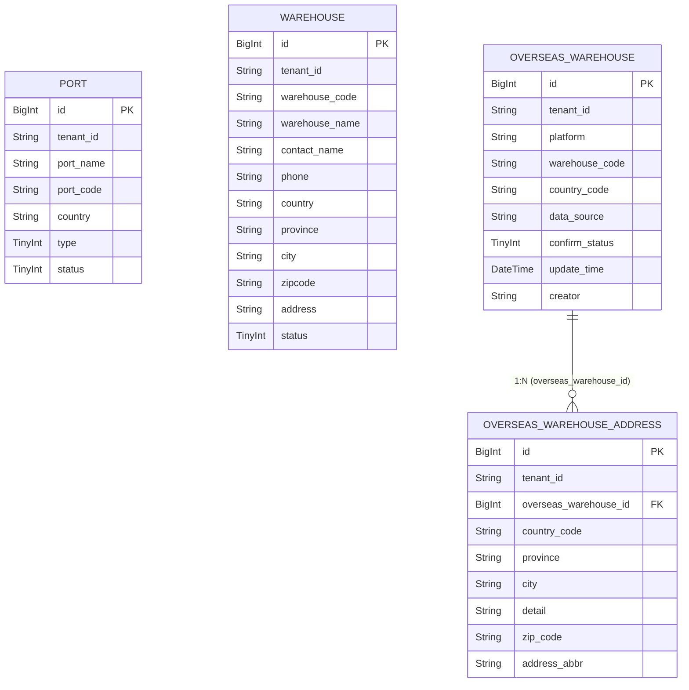

# 数据设计 — 仓库管理

> **文档版本**: v2.1 | **日期**: 2026-06-06 | **作者**: AI PM
> **上游文档**: `2026-06-06-用户需求.md`
> **数据来源**: Demo 原型（真相源）+ Excel 表单 "平台仓库列表" + "仓库列表"

---

### 一、实体清单 × 表映射

| 实体名称 | 对应表/子表 | 映射方式 | 说明 |
|----------|------------|---------|------|
| Port (港口) | `port` | 独立表 | 海运港口和空运港口基础数据，供运单系统引用 |
| LocalWarehouse (本地仓) | `warehouse` | 独立表 | 国内集货仓/中转仓，地址内联在单表中。海外仓Tab待二期实现 |
| OverseasWarehouse (海外平台仓库) | `overseas_warehouse` | 独立表 | FBA/其他平台仓库主记录，1:N 地址 |
| WarehouseAddress (仓库地址) | `overseas_warehouse_address` | 子表 | 通过 `overseas_warehouse_id` 关联父表 |

> **已恢复实体**：Port (港口) — v2.0 曾基于 Excel 源数据缺失而移除。v2.1 经 Demo+Excel 数据融合后恢复：Demo `港口管理_主列表.html` 中存在完整的港口管理功能，Excel 无港口 Sheet 但不代表不需要。港口管理为运单系统的基础依赖数据。

---

### 二、逐表字段清单

#### 表0: `port` | 对应实体: Port (港口)

> **设计说明**: 存储海运港口和空运港口的基础数据。港口代码根据类型有不同长度约束（海港5位、空港3位），前后端均需校验。港口为运单系统的基础依赖数据，供起运港/目的港选择引用。

| 字段名 (En) | 字段名 (Cn) | 类型 (Type) | 必填 | 约束/索引 | 枚举/备注 |
| :---------- | :---------- | :----------- | :--- | :-------- | :-------- |
| `id` | 主键 | BigInt | Yes | **PK** | 雪花ID |
| `tenant_id` | 租户ID | String | Yes | Index | SaaS 数据隔离 |
| `port_name` | 港口名称 | String(100) | Yes | — | 如"深圳港""上海港""杭州" |
| `port_code` | 港口代码 | String(10) | Yes | Index | 海港5位字符，空港3位字符 |
| `country` | 国家 | String(50) | Yes | — | 如"中国""美国""英国" |
| `type` | 港口类型 | TinyInt | Yes | — | 10:海港, 20:空港 |
| `status` | 状态 | TinyInt | Yes | Index | 10:正常, 20:已冻结 |
| `created_at` | 创建时间 | DateTime | Yes | — | 自动生成 |
| `created_by` | 创建人 | String | Yes | — | 当前用户 |
| `updated_at` | 更新时间 | DateTime | Yes | — | 自动维护 |
| `updated_by` | 更新人 | String | Yes | — | 当前用户 |
| `is_deleted` | 软删除标识 | Boolean | Yes | — | Default: false |
| `version` | 乐观锁版本 | Int | Yes | — | 并发控制，每次更新 +1 |

**关联关系**:
- 无内部关联。被运单系统引用（起运港/目的港），但引用关系在运单模块侧维护。

---

#### 表1: `warehouse` | 对应实体: LocalWarehouse (本地仓)

> **设计说明**: 存储国内本地仓库信息，地址字段内联在单表中（一个仓库一个地址），含收货人联系方式。支持冻结/启用状态管理。列表页含"本地仓"和"海外仓"两个Tab，当前仅本地仓Tab有数据，海外仓Tab为占位（二期实现）。

| 字段名 (En) | 字段名 (Cn) | 类型 (Type) | 必填 | 约束/索引 | 枚举/备注 |
| :---------- | :---------- | :----------- | :--- | :-------- | :-------- |
| `id` | 主键 | BigInt | Yes | **PK** | 雪花ID |
| `tenant_id` | 租户ID | String | Yes | Index | SaaS 数据隔离 |
| `warehouse_code` | 仓库代码 | String(50) | Yes | Index | 如"huadu""baiyun" |
| `warehouse_name` | 仓库名称 | String(100) | Yes | — | 如"花都仓""白云仓" |
| `contact_name` | 收货人 | String(50) | Yes | — | — |
| `phone` | 手机号 | String(11) | Yes | — | 11位数字，前后端均需校验 |
| `country` | 国家 | String(50) | Yes | — | 新增时默认"中国" |
| `province` | 省份 | String(50) | Yes | — | 如"广东省""浙江省" |
| `city` | 城市 | String(50) | Yes | — | 如"广州市""深圳市" |
| `zipcode` | 邮编 | String(20) | Yes | — | — |
| `address` | 详细地址 | String(255) | Yes | — | — |
| `status` | 状态 | TinyInt | Yes | Index | 10:正常, 20:已冻结 |
| `created_at` | 创建时间 | DateTime | Yes | — | 自动生成 |
| `created_by` | 创建人 | String | Yes | — | 当前用户 |
| `updated_at` | 更新时间 | DateTime | Yes | — | 自动维护 |
| `updated_by` | 更新人 | String | Yes | — | 当前用户 |
| `is_deleted` | 软删除标识 | Boolean | Yes | — | Default: false |
| `version` | 乐观锁版本 | Int | Yes | — | 并发控制，每次更新 +1 |

**关联关系**:
- 无内部关联

---

#### 表2: `overseas_warehouse` | 对应实体: OverseasWarehouse (海外平台仓库)

> **设计说明**: 存储FBA和其他海外平台的仓库主记录。`country_code` 冗余存储便于列表展示和搜索，与首个地址的国家代码保持同步。`warehouse_code` 需唯一性约束，防止重复录入。运单系统通过接口查询和新增此表数据。

| 字段名 (En) | 字段名 (Cn) | 类型 (Type) | 必填 | 约束/索引 | 枚举/备注 |
| :---------- | :---------- | :----------- | :--- | :-------- | :-------- |
| `id` | 主键 | BigInt | Yes | **PK** | 雪花ID |
| `tenant_id` | 租户ID | String | Yes | Index | SaaS 数据隔离 |
| `platform` | 仓库所属平台 | String(50) | Yes | — | FBA Tab下默认"FBA"；其他平台手动输入如"WALMART" |
| `warehouse_code` | 仓库代码 | String(50) | Yes | **Unique** (tenant_id + warehouse_code 联合唯一索引) | 如"BWI1""MEM1s""IND2"。唯一性校验 |
| `country_code` | 国家代码 | String(10) | Yes | — | 如 US/GB/DE/CN，列表展示和搜索用 |
| `data_source` | 数据来源 | String(20) | No | — | 系统同步 / 客户录入 |
| `confirm_status` | 确认状态 | TinyInt | Yes | Index | 10:未确认, 20:已确认。运单新建时默认10 |
| `update_time` | 更新时间 | DateTime | Yes | — | 最后更新时间 |
| `creator` | 操作人 | String(50) | No | — | 创建/更新人 |
| `created_at` | 创建时间 | DateTime | Yes | — | 自动生成 |
| `created_by` | 创建人 | String | Yes | — | 当前用户 |
| `updated_at` | 更新时间 | DateTime | Yes | — | 自动维护 |
| `updated_by` | 更新人 | String | Yes | — | 当前用户 |
| `is_deleted` | 软删除标识 | Boolean | Yes | — | Default: false |
| `version` | 乐观锁版本 | Int | Yes | — | 并发控制，每次更新 +1 |

**关联关系**:
- `One-to-Many` with `overseas_warehouse_address` (通过 `id` → `overseas_warehouse_id`)

---

#### 表3: `overseas_warehouse_address` | 对应实体: WarehouseAddress (仓库地址)

> **设计说明**: 海外平台仓库的物理地址子表。一个仓库可绑定多个地址。`address_abbr` 为派生字段（仓库代码-邮编），由前端实时计算并提交存储。

| 字段名 (En) | 字段名 (Cn) | 类型 (Type) | 必填 | 约束/索引 | 枚举/备注 |
| :---------- | :---------- | :----------- | :--- | :-------- | :-------- |
| `id` | 主键 | BigInt | Yes | **PK** | 雪花ID |
| `tenant_id` | 租户ID | String | Yes | Index | SaaS 数据隔离 |
| `overseas_warehouse_id` | 仓库ID | BigInt | Yes | Index, FK | 关联 `overseas_warehouse.id` |
| `country_code` | 国家代码 | String(10) | Yes | — | 如 US/UK/CN |
| `province` | 州/省 | String(50) | Yes | — | 如 CA/TX/GD |
| `city` | 城市 | String(50) | Yes | — | — |
| `detail` | 详细地址 | String(255) | Yes | — | 街道、门牌号 |
| `zip_code` | 邮编 | String(20) | Yes | — | — |
| `address_abbr` | 地址简称 | String(100) | No | — | 派生字段：warehouse_code-zip_code，自动生成。前后端均存储 |
| `created_at` | 创建时间 | DateTime | Yes | — | 自动生成 |
| `created_by` | 创建人 | String | Yes | — | 当前用户 |
| `updated_at` | 更新时间 | DateTime | Yes | — | 自动维护 |
| `updated_by` | 更新人 | String | Yes | — | 当前用户 |
| `is_deleted` | 软删除标识 | Boolean | Yes | — | Default: false |
| `version` | 乐观锁版本 | Int | Yes | — | 并发控制，每次更新 +1 |

**关联关系**:
- `Many-to-One` with `overseas_warehouse` (通过 `overseas_warehouse_id`)

---

### 三、ER 关系图

### 四、关键设计说明

- **已恢复表**：`port`（港口）表在 v2.1 中恢复。v2.0 因 Excel 源数据未包含港口管理而移除，v2.1 经 Demo+Excel 数据融合后恢复——Demo `港口管理_主列表.html` 中有完整的港口 CRUD 功能，港口数据为运单系统的起运港/目的港基础依赖。
- **软删除策略**：4张表均使用 `is_deleted` 软删除。冻结（status=20）不等于删除——冻结是状态变更，被冻结的数据仍可查询但不可编辑；软删除是完全不可见。级联规则：删除 `overseas_warehouse` 时级联软删除其下所有 `overseas_warehouse_address` 记录。
- **乐观锁**：4张表均需 `version` 字段，用于并发编辑控制。
- **唯一约束**：`overseas_warehouse` 表在 `(tenant_id, warehouse_code)` 上建立联合唯一索引，确保同一租户下仓库代码不重复。前端提交前校验 + 后端唯一索引双重保障。
- **派生字段说明**：`address_abbr` 由前端根据 `warehouse_code + zip_code` 实时计算，后端同时存储一份便于列表展示和搜索。更新仓库代码或邮编时需同步更新所有关联地址的 `address_abbr`。
- **country_code 冗余**：`overseas_warehouse.country_code` 与首个地址的 `country_code` 保持同步，支持列表级别的国家代码搜索，避免每次查询都需要 JOIN 地址表。
- **状态分离**：`warehouse.status` 的"正常/已冻结"是生命周期控制；`overseas_warehouse.confirm_status` 的"已确认/未确认"是数据质量标记。两者互不干扰，各自独立流转。
- **手机号约束**：`warehouse.phone` 限定为 `String(11)`，前端校验11位数字格式，后端 API 层同步校验。
- **外部接口**：运单系统需通过 `GET /api/overseas-warehouses` 查询仓库列表，通过 `POST /api/overseas-warehouses` 新增仓库。新增接口需做幂等处理（基于 warehouse_code 去重），防止网络重试导致重复创建。
