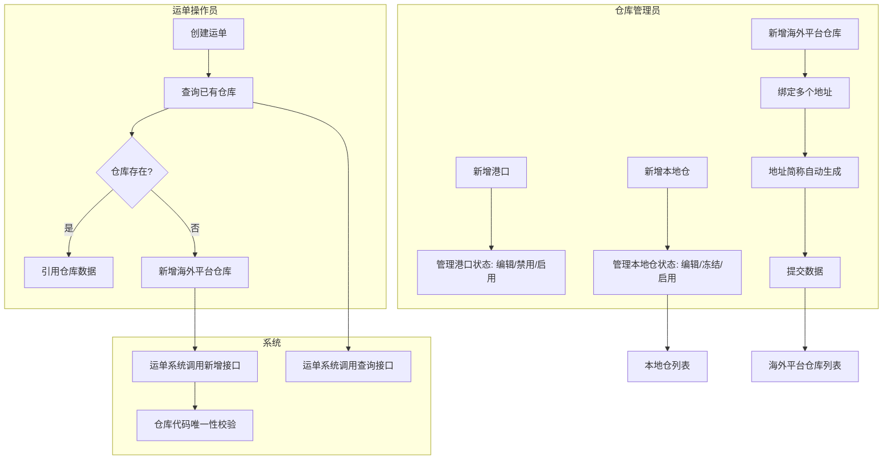

# 需求定义卡片 (RDD) — 仓库管理

> **原始需求**：为飞点TMS搭建仓库基础数据管理模块，支持港口管理、本地仓和海外平台仓库(FBA/其他)的结构化管理，供运单系统查询和引用
> **文档版本**: v2.1 | **日期**: 2026-06-06 | **作者**: AI PM
> **数据来源**: Demo 原型（真相源）+ Excel 表单 "平台仓库列表" + "仓库列表"

---

### 1. 核心洞察 (Insight)

**真实痛点**：跨境物流业务中，海外平台仓库(FBA/Walmart等)的地址信息复杂，一个仓库代码可能对应多个物理地址。当前数据分散管理在各业务人员的Excel表格和即时通讯记录中，没有统一的结构化管理入口。运单系统需要查询和新增仓库数据，但缺乏标准化的数据接口和唯一性校验，容易出现重复录入和数据不一致。

国内本地仓（集货仓/中转仓）的基础信息（收货人、手机号、地址）散落在不同业务人员手中，信息查找成本高。仓库名称、收货人、手机号等关键字段缺乏强制校验，录入不规范导致发货时联系不到收货人。

海外平台仓库的数据确认机制缺失：新入库的数据无法快速标记为"已确认"，导致下游系统引用到未经核实的数据。

**JTBD**：
> `仓库管理员` 雇佣"仓库管理"不是为了"填表单存数据"，而是为了：**当客户问"货到了哪个仓"时，能在一个系统里查到所有平台仓库的地址和归属，不用在Excel和网页后台之间来回切换。**

> `运单操作员` 雇佣"仓库管理"不是为了"管理仓库"，而是为了：**创建运单时能直接查询已有仓库并新增新仓库，不用跳出运单页面去翻表格。**

**业务价值**：当前 vs 目标 的量化对比表

| 维度 | 当前 | 目标 |
|------|------|------|
| 海外仓库地址查询 | 翻Excel/聊天记录，平均3-5分钟 | 列表检索，30秒内 |
| 仓库代码重复率 | 无校验，约10%重复录入 | 唯一性校验，重复率接近0 |
| 数据确认状态 | 无标记，靠人工记忆 | 已确认/未确认标签，批量确认 |
| 本地仓信息规范性 | 手机号无格式校验，收货人常漏填 | 11位手机号强制校验，必填字段全覆盖 |

### 2. 业务全景图

> **目的**：给读者一张地图，在深入细节前先建立全局认知。

**2.1 角色与工作节奏**

| 角色 | 核心任务 | 频率 |
|------|---------|------|
| 仓库管理员 | 维护本地仓基础信息、管理海外平台仓库及地址 | 按需（新开仓或地址变更时） |
| 运单操作员 | 创建运单时查询/新增海外平台仓库 | 日频（每次创建运单时） |
| 系统 | 运单系统通过接口查询和新增仓库数据 | 实时 |

**2.2 端到端业务链路**

```
【一次性配置】（低频）
  港口基础数据录入 → 海港/空港 → 港口代码(5位/3位)
  本地仓录入 → 仓库代码/名称/收货人/手机号/地址
      ↓
【按需配置】（中频）
  海外平台仓库录入 → 平台选择(FBA/其他) → 多地址绑定 → 地址简称自动生成
      ↓
【数据确认】（按需）
  勾选未确认数据 → 二次弹窗确认 → 标记为"已确认"
      ↓
【查询使用】（高频）
  运单系统调用接口 → 查询已有仓库 → 新增新仓库
      ↓
【持续治理】
  港口冻结/启用 → 停用港口标记冻结，防止误引用
  本地仓冻结/启用 → 停用仓库标记冻结，防止误引用
```

**2.3 实体依赖关系**

```
Port (港口)
  └── 独立实体，港口基础数据
      ├── 类型: 海港 / 空港
      └── 状态: 正常 / 已冻结

LocalWarehouse (本地仓)
  └── 独立实体，地址内联在单表中
      └── 状态: 正常 / 已冻结

OverseasWarehouse (海外平台仓库)
  ├── 1:N WarehouseAddress (仓库地址)
  │     └── 地址简称自动生成: warehouseCode-zipCode
  └── 独立实体，按平台区分(FBA / 其他平台)
      └── 确认状态: 已确认 / 未确认
```

**2.4 核心业务流程图（泳道图）**



---

> 以下按 **2 条业务流程** 组织，每条流程包含：流程概述 → 实体字段定义 → 业务规则 → 核心场景 → 相关 AC。

### 3. 流程一：海外平台仓库管理（平台仓库列表）

> **触发**：新接入海外平台(FBA/Walmart等)需要录入仓库数据，或运单创建时需要引用/新增仓库 **频率**：按需 **前置依赖**：无

**3.1 海外平台仓库 (OverseasWarehouse)** — FBA或其他海外平台的仓库主记录，含确认状态管理

> **As a** 仓库管理员 / 运单操作员 **I want to** 维护FBA和其他平台的仓库信息，一个仓库代码绑定多个收货地址 **So that** 运单创建时可以准确引用仓库数据，数据经确认后可信

| 字段 | 类型 | 必填 | 说明 |
|------|------|------|------|
| platform | 文本 | ✅ | 仓库所属平台。FBA Tab下只读默认"FBA"；其他平台Tab下手动输入 |
| warehouseCode | 文本 | ✅ | 仓库代码，如"BWI1""MEM1s""IND2"。唯一性校验 |
| countryCode | 文本 | ✅ | 国家代码，如 US/GB/DE/CN。列表展示和搜索用 |
| dataSource | 文本 | — | 数据来源，如"系统同步""客户录入" |
| confirmStatus | 枚举 | — | 确认状态：已确认 / 未确认。运单新建时默认"未确认" |
| updateTime | 文本 | — | 最后更新时间 |
| creator | 文本 | — | 操作人 |

**业务规则**：
- R01：仓库代码唯一性校验，新增/编辑时检查是否与已有记录重复，重复时Toast提示"仓库代码已存在"
- R02：FBA Tab下platform字段只读，值固定为"FBA"；其他平台Tab下platform字段为文本框手动输入
- R03：确认状态初始值：运单系统通过接口新建时默认为"未确认"；手动新增时默认"未确认"
- R04：确认数据操作：需先勾选表格行（checkbox），且仅"未确认"状态的行可被勾选确认；点击"确认数据"按钮后弹出二次确认弹窗（`ElMessageBox.confirm`，type: warning）
- R05：列表查询条件：仓库代码(模糊搜索)、国家代码(下拉选择)、确认状态(下拉选择)
- R06：运单系统可通过接口查询已有仓库列表，也可通过接口新增仓库

**相关 AC**：`AC01` `AC02` `AC03` `AC04` `AC05`

**3.2 仓库地址 (WarehouseAddress)** — 一个海外平台仓库可绑定多个物理地址

> **As a** 仓库管理员 **I want to** 为一个仓库代码绑定多个收货地址 **So that** 发货时可以根据实际派送地址选择对应仓库地址

| 字段 | 类型 | 必填 | 说明 |
|------|------|------|------|
| countryCode | 单选 | ✅ | 国家代码，如 US/GB/CN |
| province | 单选 | ✅ | 州/省，如 CA/TX/GD |
| city | 文本 | ✅ | 城市 |
| detail | 文本 | ✅ | 详细地址，含街道门牌号 |
| zipCode | 文本 | ✅ | 邮编 |
| addressAbbr | 文本 | — | 地址简称，自动生成：`warehouseCode-zipCode` |

**业务规则**：
- R07：地址简称自动生成规则：`warehouseCode + "-" + zipCode`，仓库代码或邮编变化时实时更新；任一方为空时addressAbbr为空
- R08：新增弹窗默认含1个空地址行；支持"添加新地址"追加地址；地址数量≤1时隐藏"删除地址"按钮（至少保留1个地址）
- R09：FBA Tab新增弹窗：platform只读"FBA"；其他平台Tab新增弹窗：platform手动输入文本框

**3.3 核心场景**

```
场景：新增FBA仓库
  1. 在"平台仓库列表"页面 → 选中"FBA仓库列表"Tab
  2. 点击"新增" → 弹窗标题"新增FBA平台仓库"
  3. 基础信息：仓库所属平台只读"FBA"，输入仓库代码"BWI2"
  4. 地址信息：选择国家US → 州CA → 城市LA → 详细地址 → 邮编90001
  5. 地址简称自动生成为"BWI2-90001"
  6. 确定 → 校验仓库代码唯一性 → Toast"新增成功" → 关闭弹窗，列表刷新

场景：新增其他平台仓库(Walmart)
  1. 切换到"其他平台仓库列表"Tab → 点击"新增"
  2. 弹窗标题"新增其他平台仓库"
  3. 基础信息：输入平台"WALMART"，仓库代码"IND2"
  4. 地址1：填写基本信息
  5. 点击"添加新地址" → 地址2出现
  6. 确定 → Toast"新增成功"

场景：确认数据(批量)
  1. 勾选2条"未确认"的数据行
  2. 点击"确认数据" → 二次确认弹窗"确定要确认选中的2条仓库数据吗？"
  3. 确认 → 选中行的确认状态变为"已确认"

场景：确认数据(校验拦截)
  1. 勾选1条"已确认"的数据 + 1条"未确认"的数据
  2. 点击"确认数据" → Toast提示"只能勾选'未确认'状态的数据进行确认操作"
  3. 操作被拦截

场景：仓库代码重复校验
  1. 新增仓库，输入仓库代码"BWI1"（已存在）
  2. 点击确定 → Toast"仓库代码已存在，请核对后重新输入"
  3. 提交被阻断
```

**相关 AC**：`AC01` `AC02` `AC03` `AC04` `AC05` `AC06`

---

### 4. 流程二：本地仓管理（仓库列表）

> **触发**：业务需要新增国内集货仓或中转仓 **频率**：按需 **前置依赖**：无

**4.1 本地仓 (LocalWarehouse)** — 国内仓库基础信息，含收货人联系方式和完整地址

> **As a** 仓库管理员 **I want to** 维护本地仓库信息 **So that** 发货时可以准确填写收货地址和联系人

| 字段 | 类型 | 必填 | 说明 |
|------|------|------|------|
| warehouseCode | 文本 | ✅ | 仓库代码 |
| warehouseName | 文本 | ✅ | 仓库名称，如"花都仓""白云仓" |
| contactName | 文本 | ✅ | 收货人姓名 |
| phone | 文本 | ✅ | 收货人手机号，11位数字校验 |
| country | 单选 | ✅ | 国家，新增时默认"中国" |
| province | 单选 | ✅ | 省份/州 |
| city | 单选 | ✅ | 城市 |
| zipcode | 文本 | ✅ | 邮编 |
| address | 文本 | ✅ | 详细地址 |
| status | 枚举 | — | 状态：正常 / 已冻结 |

**业务规则**：
- R10：页面以Tab区分"本地仓"（默认激活）和"海外仓"。海外仓Tab现阶段显示空状态"待梳理，敬请期待"
- R11：新增时所有字段均为必填：仓库代码、仓库名称、收货人、手机号、国家、省份、城市、邮编、详细地址
- R12：手机号校验：必须为11位数字，不符合时Toast提示"请输入11位手机号"
- R13：新增时国家默认"中国"
- R14：已冻结仓库点击编辑 → 弹窗标题变为"查看本地仓"，表单只读（is-readonly），仅显示"关闭"按钮，隐藏"确定"按钮
- R15：状态启停操作：点击"冻结"或"启用"按钮 → 二次弹窗确认（`ElMessageBox.confirm`，type: warning）→ 确认后状态切换
- R16：列表支持按仓库代码、仓库名称搜索
- R17：列表操作列包含：编辑（始终显示）、冻结（正常状态显示）/ 启用（已冻结状态显示）

**4.2 核心场景**

```
场景：新增本地仓
  1. 点击"新增仓库" → 弹出"新增本地仓"弹窗（800px宽）
  2. 基本信息区：输入仓库代码、仓库名称、收货人、手机号
  3. 地址详情区：国家(默认"中国") → 选择省份 → 城市 → 输入邮编和详细地址
  4. 确定 → 校验必填项 + 手机号11位 → Toast"保存成功" → 关闭弹窗，列表刷新

场景：手机号校验失败
  1. 新增弹窗中，手机号输入"1381234"（7位）
  2. 点击确定 → Toast"请输入11位手机号"
  3. 提交被阻断，弹窗不关闭

场景：冻结仓库
  1. 点击"白云仓"行的"冻结"按钮 → 二次确认弹窗"确定要冻结该仓库吗？"
  2. 确认 → 状态变为"已冻结"，tag变红
  3. 操作列"冻结"按钮变为"启用"按钮

场景：编辑已冻结仓库
  1. 点击已冻结仓库的"编辑"按钮 → 弹窗标题"查看本地仓"
  2. 表单所有字段只读（is-readonly样式）
  3. 底部仅显示"关闭"按钮，无"确定"按钮
```

**相关 AC**：`AC07` `AC08` `AC09` `AC10` `AC11`

---

### 5. 流程三：港口管理（港口管理_主列表）

> **触发**：业务需要新增海运/空运港口基础数据 **频率**：按需（新开航线时） **前置依赖**：无

**5.1 港口 (Port)** — 海运港口和空运港口的基础数据管理，供运单系统引用

> **As a** 仓库管理员 **I want to** 维护港口基础数据（海港/空港），包括港口名称、代码、所属国家 **So that** 运单创建时可以准确选择起运港和目的港

| 字段 | 类型 | 必填 | 说明 |
|------|------|------|------|
| portName | 文本 | ✅ | 港口名称，如"深圳港""上海港""杭州" |
| portCode | 文本 | ✅ | 港口代码。海港5位字符，空港3位字符 |
| country | 单选 | ✅ | 所属国家，filterable下拉选择 |
| type | 枚举 | ✅ | 港口类型：海港 / 空港 |
| status | 枚举 | — | 状态：正常 / 已冻结 |

**业务规则**：
- R18：海港代码必须为5位字符，空港代码必须为3位字符；保存时校验，不符合时Toast提示
- R19：类型切换（海港↔空港）时自动清空港口代码，需重新输入
- R20：列表搜索支持按港口名称（模糊）、港口代码（模糊）、类型（下拉：海港/空港）筛选
- R21：状态启停操作：点击"禁用"或"启用"按钮 → 二次弹窗确认（`ElMessageBox.confirm`，type: warning）→ 确认后状态切换（正常↔已冻结）
- R22：已冻结港口点击编辑 → 弹窗标题变为"查看港口（已禁用）"，表单只读（is-readonly），仅显示"关闭"按钮，隐藏"确定"按钮
- R23：新增/编辑弹窗中：类型（必选下拉）、国家（必选、filterable下拉）、港口名称（必填）、港口代码（必填，maxlength根据类型动态切换：海港5/空港3，show-word-limit）

**5.2 核心场景**

```
场景：新增海港
  1. 在"港口管理_主列表"页面 → 点击"新增港口"
  2. 弹窗标题"新增港口" → 宽度500px
  3. 类型选择"海港" → 港口代码placeholder变为"请输入五位港口代码"，maxlength=5
  4. 选择国家"中国" → 输入港口名称"宁波港" → 输入港口代码"nbg"(5位)
  5. 确定 → 校验类型+名称+代码（5位）+国家全部必填 → Toast"新增成功" → 关闭弹窗，列表刷新

场景：新增空港
  1. 类型选择"空港" → 港口代码placeholder变为"请输入三位港口代码"，maxlength=3
  2. 输入港口代码"hgh"(3位)
  3. 确定 → 校验通过 → Toast"新增成功"

场景：切换类型清空代码
  1. 新增弹窗中，选择"海港"，输入代码"nbg"
  2. 切换类型为"空港" → 港口代码自动清空
  3. 重新输入3位代码

场景：禁用港口
  1. 点击"深圳港"行的"禁用"按钮 → 二次确认弹窗"确定禁用港口【深圳港】？"
  2. 确认 → 状态变为"已冻结"，tag变红，操作列按钮切换为"启用"

场景：编辑已冻结港口
  1. 点击已冻结港口的"编辑"按钮 → 弹窗标题"查看港口（已禁用）"
  2. 表单所有字段只读 → 底部仅显示"关闭"按钮
```

**相关 AC**：`AC12` `AC13` `AC14` `AC15`

---

### 6. 验收标准总览 (AC)

> 按流程分组，每条 AC 格式：`AC[N]-[简称]：[可测试的完整验收条件]`

**流程一：海外平台仓库管理**
- [ ] **AC01-海外仓库列表与Tab**：页面含"FBA仓库列表""其他平台仓库列表"两个Tab；FBA Tab表格含仓库所属平台(文本)、仓库代码、国家代码、数据来源、确认状态、操作人、操作列；其他平台Tab含相同列（仓库所属平台列显示文本）；均有checkbox选择列用于批量确认数据
- [ ] **AC02-海外仓库搜索**：查询区含仓库代码(输入框)、国家代码(下拉)、确认状态(下拉)；支持模糊搜索和精确筛选；点击"重置"清空所有条件
- [ ] **AC03-海外仓库新增(FBA)**：FBA Tab点击"新增"→弹窗标题"新增FBA平台仓库"→平台字段只读默认"FBA"→输入仓库代码→填写地址(国家代码/州省/城市/详细地址/邮编)→地址简称自动生成(仓库代码-邮编)→支持"添加新地址"追加地址行→确定前校验仓库代码唯一性
- [ ] **AC04-海外仓库新增(其他平台)**：其他平台Tab点击"新增"→弹窗标题"新增其他平台仓库"→平台字段为文本框手动输入→其余同FBA新增
- [ ] **AC05-确认数据(批量)**：勾选未确认行→点击"确认数据"→二次确认弹窗→确认状态变为"已确认"；勾选已确认行→Toast"只能勾选'未确认'状态的数据进行确认操作"；未勾选→Toast"请先勾选需要确认的数据"
- [ ] **AC06-仓库代码唯一校验**：新增/编辑时输入已存在的仓库代码→确定时Toast"仓库代码已存在，请核对后重新输入"→提交被阻断

**流程二：本地仓管理**
- [ ] **AC07-仓库列表与Tab**：页面含"本地仓""海外仓"两个Tab；本地仓Tab显示仓库列表含仓库代码/名称/国家/省份/城市/邮编/详细地址/收货人/手机号/状态十列+操作列(编辑/冻结/启用)；海外仓Tab显示空状态"待梳理，敬请期待"
- [ ] **AC08-本地仓新增**：点击"新增仓库"→弹窗800px宽→含"基本信息"区(仓库代码/名称/收货人/手机号)和"地址详情"区(国家默认中国/省份/城市/邮编/详细地址)→全部必填→手机号校验11位数字→确定后Toast"保存成功"
- [ ] **AC09-本地仓编辑与冻结只读**：正常状态仓库点击编辑→弹窗回显数据可修改；已冻结仓库点击编辑→弹窗标题"查看本地仓"→表单只读→仅"关闭"按钮
- [ ] **AC10-本地仓冻结/启用**：操作列显示"冻结"(正常状态)或"启用"(已冻结状态)→点击二次弹窗确认(ElMessageBox.confirm type:warning)→确认后状态切换→操作列按钮同步切换
- [ ] **AC11-本地仓搜索**：支持按仓库代码、仓库名称搜索；点击"重置"清空条件

**流程三：港口管理**
- [ ] **AC12-港口列表展示**：列表展示港口名称、港口代码、国家、类型（海港/空港，el-tag区分）、状态（正常/已冻结，el-tag区分）五列 + 操作列（编辑/禁用或启用）；列表按港口代码排序；支持分页
- [ ] **AC13-港口搜索**：支持按港口名称（输入框）、港口代码（输入框）、类型（下拉：海港/空港）搜索；点击"重置"清空条件
- [ ] **AC14-港口新增/编辑**：新增弹窗500px宽，含类型（下拉必选）、国家（下拉filterable必选）、港口名称（输入必填）、港口代码（输入必填，海港maxlength=5,空港maxlength=3,show-word-limit）；类型切换时清空代码；编辑时回显数据；已冻结港口编辑弹窗只读
- [ ] **AC15-港口禁用/启用**：操作列显示"禁用"（正常状态）或"启用"（已冻结状态）→ 点击二次弹窗确认（ElMessageBox.confirm type:warning）→ 确认后状态切换 → 按钮同步切换

### 7. NFR（非功能性需求）

- **性能**：列表查询响应时间 < 1秒；分页加载
- **并发**：支持5人同时操作
- **数据保留**：仓库数据长期保留，冻结=逻辑停用（不物理删除），软删除标识做数据回收
- **安全**：按租户隔离数据（tenant_id）；无角色级权限管控（当前阶段所有登录用户均可操作）
- **外部接口**：运单系统需调用查询接口(GET)和新增接口(POST)获取/创建海外平台仓库数据

### 7. 功能清单

> 基于 2 条业务流程，共 **2 个模块、10 项功能**。P0 = MVP。

**模块 A：海外平台仓库管理**

| 编号 | 功能 | 优先级 | AC |
|------|------|--------|-----|
| A1 | FBA/其他平台仓库Tab及列表展示 | P0 | AC01 |
| A2 | 搜索与筛选（仓库代码/国家代码/确认状态） | P0 | AC02 |
| A3 | 新增FBA仓库（多地址+地址简称自动生成） | P0 | AC03, AC06 |
| A4 | 新增其他平台仓库（多地址+自由输入平台） | P0 | AC04, AC06 |
| A5 | 批量确认数据 | P0 | AC05 |
| A6 | 仓库代码唯一性校验 | P0 | AC06 |

**模块 B：本地仓管理**

| 编号 | 功能 | 优先级 | AC |
|------|------|--------|-----|
| B1 | 本地仓Tab列表及搜索 | P0 | AC07, AC11 |
| B2 | 新增本地仓（含地址分区表单+手机号校验） | P0 | AC08 |
| B3 | 编辑本地仓与冻结/启用 | P0 | AC09, AC10 |

**模块 C：港口管理**

| 编号 | 功能 | 优先级 | AC |
|------|------|--------|-----|
| C1 | 港口列表展示及搜索 | P0 | AC12, AC13 |
| C2 | 新增/编辑港口（含类型切换清空代码+代码长度校验） | P0 | AC14 |
| C3 | 港口禁用/启用 | P0 | AC15 |

**分期汇总**

| 分期 | 模块范围 | 功能数 |
|------|----------|--------|
| **Phase 1 (MVP)** | 海外平台仓库管理 + 本地仓管理 + 港口管理 | **12** |
| **Phase 2** | 海外仓Tab实际内容（仓库列表页的海外仓Tab） | +? |

### 8. MVP 方案与建议

**MVP 方案（Phase 1 — 仓库基础数据管理）**

```
运营端 仓库管理
├── 港口管理（一次性配置）
│   ├── 港口列表：搜索 + 分页
│   ├── 新增/编辑港口：类型(海港/空港) + 代码长度校验(5位/3位)
│   └── 禁用/启用
├── 海外平台仓库管理（按需配置 + 确认流程）
│   ├── FBA仓库Tab：列表 + 搜索 + 新增(多地址)
│   ├── 其他平台仓库Tab：列表 + 搜索 + 新增(多地址+自由平台)
│   ├── 仓库代码唯一性校验
│   └── 批量确认数据
├── 本地仓管理（按需配置）
│   ├── 本地仓Tab：列表 + 搜索 + 新增
│   ├── 编辑 + 冻结/启用
│   └── 手机号11位校验
└── 外部接口
    ├── 运单系统 → 查询仓库接口
    └── 运单系统 → 新增仓库接口
```

**MVP 明确不做**：
- 海外仓Tab的实际内容（仓库列表页的海外仓Tab显示空状态"显示后期提供"）
- Excel批量导入仓库数据
- 仓库地址地图可视化
- 供应商专用地址标记（`isSupplierOnly`/`supplier`）：经确认不纳入本期。Demo `其他平台仓库新增.html` 中 `isSupplierOnly`/`supplier` 为预埋字段，本期暂不启用，后续需从 Demo 中移除
- 角色级权限管控（Excel源数据标注"无权限管控"）

**理想方案（Phase 2-3）**
- **Phase 2**：海外仓Tab实际内容、Excel批量导入、操作审计日志
- **Phase 3**：仓库地址地图可视化、供应商管理独立模块

**专家建议**：
- **建议1 — 仓库代码唯一性后端校验**：前端校验配合后端数据库唯一索引，防止并发场景下重复插入
- **建议2 — 确认状态与冻结状态分离**：海外仓库的confirmStatus（确认状态，数据质量标记）和本地仓的status（正常/已冻结，生命周期控制）是两个不同维度的状态，不要混淆
- **建议3 — 运单接口幂等性**：运单系统调用新增接口时需做幂等处理（基于仓库代码去重），防止网络重试导致重复创建
- **建议4 — 手机号校验后端同步**：前端11位校验是UX优化，后端也需校验，防止API直调绕过

### 下一步

当前阶段：Phase 1 RDD v2.1 完成（Demo+Excel数据融合，恢复港口管理），进入数据设计联动更新阶段。

---
