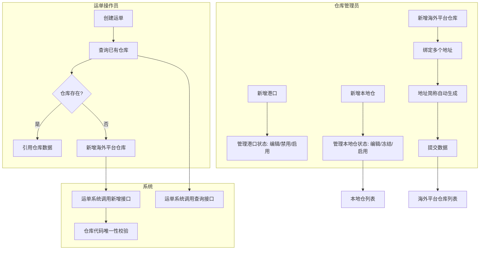
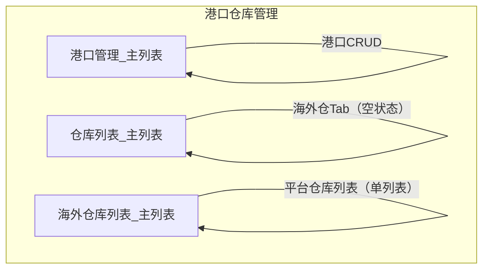

# 港口仓库模块 — 产品文档

> **原始需求**：为飞点TMS搭建仓库基础数据管理模块，支持港口管理、本地仓和海外平台仓库(FBA/其他)的结构化管理，供运单系统查询和引用
> **文档版本**: v2.2 | **日期**: 2026-08-28 | **作者**: AI PM
> **数据来源**: Demo 原型（真相源）+ Excel 表单 "平台仓库列表" + "仓库列表"
> **★ 文档分工（去哪看）**：字段结构/类型/约束/枚举值 → 数据设计 Schema；页面交互 → 原型。本文档 = 需求 + 业务规则（R 编号按流程分段）+ 状态机 + 功能清单 + 权限 + AC + 分期。

---

### 1. 核心洞察 (Insight)

**真实痛点**：跨境物流业务中，海外平台仓库(FBA/Walmart等)的地址信息复杂，一个仓库代码可能对应多个物理地址。当前数据分散管理在各业务人员的Excel表格和即时通讯记录中，没有统一的结构化管理入口。运单系统需要查询和新增仓库数据，但缺乏标准化的数据接口和唯一性校验，容易出现重复录入和数据不一致。

国内本地仓（集货仓/中转仓）的基础信息（收货人、手机号、地址）散落在不同业务人员手中，信息查找成本高。仓库名称、收货人、手机号等关键字段缺乏强制校验，录入不规范导致发货时联系不到收货人。

**JTBD**：
> `仓库管理员` 雇佣"仓库管理"不是为了"填表单存数据"，而是为了：**当客户问"货到了哪个仓"时，能在一个系统里查到所有平台仓库的地址和归属，不用在Excel和网页后台之间来回切换。**

> `运单操作员` 雇佣"仓库管理"不是为了"管理仓库"，而是为了：**创建运单时能直接查询已有仓库并新增新仓库，不用跳出运单页面去翻表格。**

**业务价值**：当前 vs 目标 的量化对比表

| 维度 | 当前 | 目标 |
|------|------|------|
| 海外仓库地址查询 | 翻Excel/聊天记录，平均3-5分钟 | 列表检索，30秒内 |
| 仓库代码重复率 | 无校验，约10%重复录入 | 唯一性校验，重复率接近0 |
| 本地仓信息规范性 | 手机号无格式校验，收货人常漏填 | 11位手机号强制校验，必填字段全覆盖 |

### 2. 业务全景图

> **目的**：给读者一张地图，在深入细节前先建立全局认知。

**2.1 角色与工作节奏**

| 角色 | 核心任务 | 频率 |
|------|---------|------|
| 仓库管理员 | 维护本地仓基础信息、管理海外平台仓库及地址 | 按需（新开仓或地址变更时） |
| 运单操作员 | 创建运单时查询/新增海外平台仓库 | 日频（每次创建运单时） |
| 系统 | 运单系统通过接口查询和新增仓库数据 | 实时 |

**2.2 端到端业务链路**

```
【一次性配置】（低频）
  港口基础数据录入 → 海港/空港 → 港口代码(5位/3位)
  本地仓录入 → 仓库代码/名称/收货人/手机号/地址
      ↓
【按需配置】（中频）
  海外平台仓库录入 → 平台选择(下拉枚举) → 多地址绑定 → 地址简称自动生成
      ↓
【查询使用】（高频）
  运单系统调用接口 → 查询已有仓库 → 新增新仓库
      ↓
【持续治理】
  港口冻结/启用 → 停用港口标记冻结，防止误引用
  本地仓冻结/启用 → 停用仓库标记冻结，防止误引用
```

**2.3 实体依赖关系**

```
Port (港口)
  └── 独立实体，港口基础数据
      ├── 类型: 海港 / 空港
      └── 状态: 正常 / 已冻结

LocalWarehouse (本地仓)
  └── 独立实体，地址内联在单表中
      └── 状态: 正常 / 已冻结

OverseasWarehouse (海外平台仓库)
  ├── 1:N WarehouseAddress (仓库地址)
  │     └── 地址简称自动生成: warehouseCode-zipCode
  └── 独立实体，按平台区分（11 个电商平台枚举）
```

**2.4 核心业务流程图（泳道图）**



---

> 以下按 **2 条业务流程** 组织，每条流程包含：流程概述 → 实体字段定义 → 业务规则 → 核心场景 → 相关 AC。

### 3. 流程一：海外平台仓库管理（平台仓库列表）

> **触发**：新接入海外平台(FBA/Walmart等)需要录入仓库数据，或运单创建时需要引用/新增仓库 **频率**：按需 **前置依赖**：无

**3.1 海外平台仓库 (OverseasWarehouse)** — FBA或其他海外平台的仓库主记录

> **As a** 仓库管理员 / 运单操作员 **I want to** 维护FBA和其他平台的仓库信息，一个仓库代码绑定多个收货地址 **So that** 运单创建时可以准确引用仓库数据

| 字段 | 必填 | 说明 |
|------|------|------|
| platform | ✅ | 仓库所属平台。枚举：Amazon/Walmart/eBay/SHEIN/Temu/TikTok Shop/AliExpress/Mercado Libre/OTTO/Newegg/Shopify |
| warehouseCode | ✅ | 仓库代码，如"BWI1""MEM1s""IND2"。唯一性校验 |
| countryCode | ✅ | 国家代码，如 US/GB/DE/CN。列表展示和搜索用 |
| updateTime | — | 最后更新时间 |
| creator | — | 操作人 |

**业务规则**（权威编号见本文档「业务规则」章节）：
- 仓库代码唯一性校验，新增/编辑时检查是否与已有记录重复，重复时Toast提示"仓库代码已存在"
- platform字段为下拉选择，枚举11个平台（Amazon/Walmart/eBay/SHEIN/Temu/TikTok Shop/AliExpress/Mercado Libre/OTTO/Newegg/Shopify）
- 列表查询条件：仓库代码(模糊搜索)、国家代码(下拉选择)
- 运单系统可通过接口查询已有仓库列表，也可通过接口新增仓库

**相关 AC**：`AC01` `AC02` `AC03` `AC04`

**3.2 仓库地址 (WarehouseAddress)** — 一个海外平台仓库可绑定多个物理地址

> **As a** 仓库管理员 **I want to** 为一个仓库代码绑定多个收货地址 **So that** 发货时可以根据实际派送地址选择对应仓库地址

| 字段 | 必填 | 说明 |
|------|------|------|
| countryCode | ✅ | 国家代码，如 US/GB/CN |
| province | ✅ | 州/省，如 CA/TX/GD |
| city | ✅ | 城市 |
| detail | ✅ | 详细地址，含街道门牌号 |
| zipCode | ✅ | 邮编 |
| addressAbbr | — | 地址简称，自动生成：`warehouseCode-zipCode` |
| isCarrierDedicated | ✅ | 是否快递承运商专用地址：是/否 |
| carrierScac | — | 快递承运商SCAC数组，非必填；选项来自供应商明细含快递的供应商名称 |

**业务规则**（权威编号见本文档「业务规则」章节）：
- 地址简称自动生成规则：`warehouseCode + "-" + zipCode`，仓库代码或邮编变化时实时更新；任一方为空时addressAbbr为空
- 新增弹窗默认含1个空地址行；支持"添加新地址"追加地址；地址数量≤1时隐藏"删除地址"按钮（至少保留1个地址）
- 新增/编辑弹窗中platform为下拉选择（11平台枚举）；地址信息含"是否快递承运商专用地址"（必填，是/否）和"快递承运商SCAC"（非必填，多选，选项来自供应商明细含快递的供应商）

**3.3 核心场景**

```
场景：新增平台仓库(Amazon)
  1. 在"平台仓库列表"页面 → 点击"新增"
  2. 弹窗标题"新增平台仓库"
  3. 基础信息：仓库所属平台下拉选择"Amazon"，输入仓库代码"BWI2"
  4. 地址信息：选择国家US → 州CA → 城市LA → 详细地址 → 邮编90001 → 是否快递承运商专用地址"否"
  5. 地址简称自动生成为"BWI2-90001"
  6. 确定 → 校验仓库代码唯一性 → Toast"新增成功" → 关闭弹窗，列表刷新

场景：新增平台仓库(Walmart)
  1. 点击"新增" → 弹窗标题"新增平台仓库"
  2. 基础信息：平台下拉选择"Walmart"，仓库代码"IND2"
  3. 地址1：填写基本信息，是否快递承运商专用地址"是"，快递承运商SCAC多选"UPS"
  4. 点击"添加新地址" → 地址2出现
  5. 确定 → Toast"新增成功"

场景：仓库代码重复校验
  1. 新增仓库，输入仓库代码"BWI1"（已存在）
  2. 点击确定 → Toast"仓库代码已存在，请核对后重新输入"
  3. 提交被阻断
```

**相关 AC**：`AC01` `AC02` `AC03` `AC04` `AC06`

---

### 4. 流程二：本地仓管理（仓库列表）

> **触发**：业务需要新增国内集货仓或中转仓 **频率**：按需 **前置依赖**：无

**4.1 本地仓 (LocalWarehouse)** — 国内仓库基础信息，含收货人联系方式和完整地址

> **As a** 仓库管理员 **I want to** 维护本地仓库信息 **So that** 发货时可以准确填写收货地址和联系人

| 字段 | 必填 | 说明 |
|------|------|------|
| warehouseCode | ✅ | 仓库代码 |
| warehouseName | ✅ | 仓库名称，如"花都仓""白云仓" |
| contactName | ✅ | 收货人姓名 |
| phone | ✅ | 收货人手机号，11位数字校验 |
| country | ✅ | 国家，新增时默认"中国" |
| province | ✅ | 省份/州 |
| city | ✅ | 城市 |
| zipcode | ✅ | 邮编 |
| address | ✅ | 详细地址 |
| status | — | 状态：正常 / 已冻结 |

**业务规则**（权威编号见本文档「业务规则」章节）：
- 页面以Tab区分"本地仓"（默认激活）和"海外仓"。海外仓Tab现阶段显示空状态"待梳理，敬请期待"
- 新增时所有字段均为必填：仓库代码、仓库名称、收货人、手机号、国家、省份、城市、邮编、详细地址
- 手机号校验：必须为11位数字，不符合时Toast提示"请输入11位手机号"
- 新增时国家默认"中国"
- 已冻结仓库点击编辑 → 弹窗标题变为"查看本地仓"，表单只读（is-readonly），仅显示"关闭"按钮，隐藏"确定"按钮
- 状态启停操作：点击"冻结"或"启用"按钮 → 二次弹窗确认（`ElMessageBox.confirm`，type: warning）→ 确认后状态切换
- 列表支持按仓库代码、仓库名称搜索
- 列表操作列包含：编辑（始终显示）、冻结（正常状态显示）/ 启用（已冻结状态显示）

**4.2 核心场景**

```
场景：新增本地仓
  1. 点击"新增仓库" → 弹出"新增本地仓"弹窗（800px宽）
  2. 基本信息区：输入仓库代码、仓库名称、收货人、手机号
  3. 地址详情区：国家(默认"中国") → 选择省份 → 城市 → 输入邮编和详细地址
  4. 确定 → 校验必填项 + 手机号11位 → Toast"保存成功" → 关闭弹窗，列表刷新

场景：手机号校验失败
  1. 新增弹窗中，手机号输入"1381234"（7位）
  2. 点击确定 → Toast"请输入11位手机号"
  3. 提交被阻断，弹窗不关闭

场景：冻结仓库
  1. 点击"白云仓"行的"冻结"按钮 → 二次确认弹窗"确定要冻结该仓库吗？"
  2. 确认 → 状态变为"已冻结"，tag变红
  3. 操作列"冻结"按钮变为"启用"按钮

场景：编辑已冻结仓库
  1. 点击已冻结仓库的"编辑"按钮 → 弹窗标题"查看本地仓"
  2. 表单所有字段只读（is-readonly样式）
  3. 底部仅显示"关闭"按钮，无"确定"按钮
```

**相关 AC**：`AC07` `AC08` `AC09` `AC10` `AC11`

---

### 5. 流程三：港口管理（港口管理_主列表）

> **触发**：业务需要新增海运/空运港口基础数据 **频率**：按需（新开航线时） **前置依赖**：无

**5.1 港口 (Port)** — 海运港口和空运港口的基础数据管理，供运单系统引用

> **As a** 仓库管理员 **I want to** 维护港口基础数据（海港/空港），包括港口名称、代码、所属国家 **So that** 运单创建时可以准确选择起运港和目的港

| 字段 | 必填 | 说明 |
|------|------|------|
| portName | ✅ | 港口名称，如"深圳港""上海港""杭州" |
| portCode | ✅ | 港口代码。海港5位字符，空港3位字符。创建后不可修改（编辑只读） |
| country | ✅ | 所属国家，filterable下拉选择。创建后不可修改（编辑只读） |
| type | ✅ | 港口类型：海港 / 空港。创建后不可修改（编辑只读） |
| status | — | 状态：正常 / 已冻结 |

**业务规则**（权威编号见本文档「业务规则」章节）：
- 海港代码必须为5位字符，空港代码必须为3位字符；保存时校验，不符合时Toast提示
- 类型切换（海港↔空港）时自动清空港口代码，需重新输入
- 列表搜索支持按港口名称（模糊）、港口代码（模糊）、类型（下拉：海港/空港）筛选
- 状态启停操作：点击"禁用"或"启用"按钮 → 二次弹窗确认（`ElMessageBox.confirm`，type: warning）→ 确认后状态切换（正常↔已冻结）
- 已冻结港口点击编辑 → 弹窗标题变为"查看港口（已禁用）"，表单只读（is-readonly），仅显示"关闭"按钮，隐藏"确定"按钮
- 新增/编辑弹窗中：类型（必选下拉）、国家（必选、filterable下拉）、港口名称（必填）、港口代码（必填，maxlength根据类型动态切换：海港5/空港3，show-word-limit）
- 编辑弹窗中港口代码、所属国家、港口类型三个字段只读（disabled），仅港口名称可编辑；新增时所有字段均可编辑

**5.2 核心场景**

```
场景：新增海港
  1. 在"港口管理_主列表"页面 → 点击"新增港口"
  2. 弹窗标题"新增港口" → 宽度500px
  3. 类型选择"海港" → 港口代码placeholder变为"请输入五位港口代码"，maxlength=5
  4. 选择国家"中国" → 输入港口名称"宁波港" → 输入港口代码"nbg"(5位)
  5. 确定 → 校验类型+名称+代码（5位）+国家全部必填 → Toast"新增成功" → 关闭弹窗，列表刷新

场景：新增空港
  1. 类型选择"空港" → 港口代码placeholder变为"请输入三位港口代码"，maxlength=3
  2. 输入港口代码"hgh"(3位)
  3. 确定 → 校验通过 → Toast"新增成功"

场景：切换类型清空代码
  1. 新增弹窗中，选择"海港"，输入代码"nbg"
  2. 切换类型为"空港" → 港口代码自动清空
  3. 重新输入3位代码

场景：禁用港口
  1. 点击"深圳港"行的"禁用"按钮 → 二次确认弹窗"确定禁用港口【深圳港】？"
  2. 确认 → 状态变为"已冻结"，tag变红，操作列按钮切换为"启用"

场景：编辑已冻结港口
  1. 点击已冻结港口的"编辑"按钮 → 弹窗标题"查看港口（已禁用）"
  2. 表单所有字段只读 → 底部仅显示"关闭"按钮
```

**相关 AC**：`AC12` `AC13` `AC14` `AC15`

---

### 6. 验收标准总览 (AC)

> 按流程分组，每条 AC 格式：`AC[N]-[简称]：[可测试的完整验收条件]`

**流程一：海外平台仓库管理**
- [ ] **AC01-海外仓库列表**：单一列表（无Tab表头），表格列含仓库所属平台、仓库代码、国家代码、更新时间、操作人、操作列
- [ ] **AC02-海外仓库搜索**：查询区含仓库代码(输入框)、国家代码(下拉)；支持模糊搜索和精确筛选；点击"重置"清空所有条件
- [ ] **AC03-海外仓库新增**：点击"新增"→弹窗标题"新增平台仓库"→平台字段为下拉选择(11平台枚举)→输入仓库代码→填写地址(国家代码/州省/城市/详细地址/邮编/是否快递承运商专用地址/快递承运商SCAC)→地址简称自动生成(仓库代码-邮编)→支持"添加新地址"追加地址行→确定前校验仓库代码唯一性
- [ ] **AC04-海外仓库编辑**：点击"编辑"→弹窗标题"编辑平台仓库"→回显数据可修改→平台下拉可改→其余同新增
- [ ] **AC06-仓库代码唯一校验**：新增/编辑时输入已存在的仓库代码→确定时Toast"仓库代码已存在，请核对后重新输入"→提交被阻断

**流程二：本地仓管理**
- [ ] **AC07-仓库列表与Tab**：页面含"本地仓""海外仓"两个Tab；本地仓Tab显示仓库列表含仓库代码/名称/国家/省份/城市/邮编/详细地址/收货人/手机号/状态十列+操作列(编辑/冻结/启用)；海外仓Tab显示空状态"待梳理，敬请期待"
- [ ] **AC08-本地仓新增**：点击"新增仓库"→弹窗800px宽→含"基本信息"区(仓库代码/名称/收货人/手机号)和"地址详情"区(国家默认中国/省份/城市/邮编/详细地址)→全部必填→手机号校验11位数字→确定后Toast"保存成功"
- [ ] **AC09-本地仓编辑与冻结只读**：正常状态仓库点击编辑→弹窗回显数据可修改；已冻结仓库点击编辑→弹窗标题"查看本地仓"→表单只读→仅"关闭"按钮
- [ ] **AC10-本地仓冻结/启用**：操作列显示"冻结"(正常状态)或"启用"(已冻结状态)→点击二次弹窗确认(ElMessageBox.confirm type:warning)→确认后状态切换→操作列按钮同步切换
- [ ] **AC11-本地仓搜索**：支持按仓库代码、仓库名称搜索；点击"重置"清空条件

**流程三：港口管理**
- [ ] **AC12-港口列表展示**：列表展示港口名称、港口代码、国家、类型（海港/空港，el-tag区分）、状态（正常/已冻结，el-tag区分）五列 + 操作列（编辑/禁用或启用）；列表按港口代码排序；支持分页
- [ ] **AC13-港口搜索**：支持按港口名称（输入框）、港口代码（输入框）、类型（下拉：海港/空港）搜索；点击"重置"清空条件
- [ ] **AC14-港口新增/编辑**：新增弹窗500px宽，含类型（下拉必选）、国家（下拉filterable必选）、港口名称（输入必填）、港口代码（输入必填，海港maxlength=5,空港maxlength=3,show-word-limit）；类型切换时清空代码；编辑时回显数据，港口代码/所属国家/港口类型只读（仅港口名称可编辑）；已冻结港口编辑弹窗只读
- [ ] **AC15-港口禁用/启用**：操作列显示"禁用"（正常状态）或"启用"（已冻结状态）→ 点击二次弹窗确认（ElMessageBox.confirm type:warning）→ 确认后状态切换 → 按钮同步切换

### 7. NFR（非功能性需求）

- **性能**：列表查询响应时间 < 1秒；分页加载
- **并发**：支持5人同时操作
- **数据保留**：仓库数据长期保留，冻结=逻辑停用（不物理删除），软删除标识做数据回收
- **安全**：按租户隔离数据（tenant_id）；无角色级权限管控（当前阶段所有登录用户均可操作）
- **外部接口**：运单系统需调用查询接口(GET)和新增接口(POST)获取/创建海外平台仓库数据

### 7. 功能清单

> 基于 2 条业务流程，共 **2 个模块、11 项功能**。P0 = MVP。

**模块 A：海外平台仓库管理**

| 编号 | 功能 | 优先级 | AC |
|------|------|--------|-----|
| A1 | 平台仓库单一列表展示（平台下拉枚举） | P0 | AC01 |
| A2 | 搜索与筛选（仓库代码/国家代码） | P0 | AC02 |
| A3 | 新增平台仓库（多地址+地址简称自动生成+平台下拉枚举） | P0 | AC03, AC06 |
| A4 | 编辑平台仓库（回显+地址维护） | P0 | AC04, AC06 |
| A6 | 仓库代码唯一性校验 | P0 | AC06 |

**模块 B：本地仓管理**

| 编号 | 功能 | 优先级 | AC |
|------|------|--------|-----|
| B1 | 本地仓Tab列表及搜索 | P0 | AC07, AC11 |
| B2 | 新增本地仓（含地址分区表单+手机号校验） | P0 | AC08 |
| B3 | 编辑本地仓与冻结/启用 | P0 | AC09, AC10 |

**模块 C：港口管理**

| 编号 | 功能 | 优先级 | AC |
|------|------|--------|-----|
| C1 | 港口列表展示及搜索 | P0 | AC12, AC13 |
| C2 | 新增/编辑港口（含类型切换清空代码+代码长度校验） | P0 | AC14 |
| C3 | 港口禁用/启用 | P0 | AC15 |

**分期汇总**

| 分期 | 模块范围 | 功能数 |
|------|----------|--------|
| **Phase 1 (MVP)** | 海外平台仓库管理 + 本地仓管理 + 港口管理 | **11** |
| **Phase 2** | 海外仓Tab实际内容（仓库列表页的海外仓Tab） | +? |

### 8. MVP 方案与建议

**MVP 方案（Phase 1 — 仓库基础数据管理）**

```
运营端 仓库管理
├── 港口管理（一次性配置）
│   ├── 港口列表：搜索 + 分页
│   ├── 新增/编辑港口：类型(海港/空港) + 代码长度校验(5位/3位)
│   └── 禁用/启用
├── 海外平台仓库管理（按需配置）
│   ├── 平台仓库单一列表：搜索 + 新增(多地址) + 平台下拉枚举
│   └── 仓库代码唯一性校验
├── 本地仓管理（按需配置）
│   ├── 本地仓Tab：列表 + 搜索 + 新增
│   ├── 编辑 + 冻结/启用
│   └── 手机号11位校验
└── 外部接口
    ├── 运单系统 → 查询仓库接口
    └── 运单系统 → 新增仓库接口
```

**MVP 明确不做**：
- 海外仓Tab的实际内容（仓库列表页的海外仓Tab显示空状态"显示后期提供"）
- Excel批量导入仓库数据
- 仓库地址地图可视化
- 供应商专用地址标记：已从「明确不做」调整为「本期纳入」——地址信息新增「是否快递承运商专用地址」（必填）+「快递承运商SCAC」（非必填）两字段
- 角色级权限管控（Excel源数据标注"无权限管控"）

**理想方案（Phase 2-3）**
- **Phase 2**：海外仓Tab实际内容、Excel批量导入、操作审计日志
- **Phase 3**：仓库地址地图可视化、供应商管理独立模块

**专家建议**：
- **建议1 — 仓库代码唯一性后端校验**：前端校验配合后端数据库唯一索引，防止并发场景下重复插入
- **建议2 — 运单接口幂等性**：运单系统调用新增接口时需做幂等处理（基于仓库代码去重），防止网络重试导致重复创建
- **建议3 — 手机号校验后端同步**：前端11位校验是UX优化，后端也需校验，防止API直调绕过

### 下一步

当前阶段：Phase 1 产品文档完成（Demo+Excel数据融合，恢复港口管理），进入数据设计联动更新阶段。

---

## 需求定义

### 1.1 背景与现状

跨境物流业务中，海外平台仓库(FBA/Walmart等)地址信息复杂，一个仓库代码对应多个物理地址，数据分散在Excel和即时通讯记录中。运单系统创建运单时需要引用仓库数据，但缺乏标准化的数据接口和唯一性校验，容易出现重复录入。国内本地仓的基础信息（收货人、手机号、地址）录入不规范，手机号无格式校验，收货人常漏填。海外仓库数据确认机制缺失，下游系统可能引用到未经核实的数据。

### 1.2 目标与成功口径

- 目标：为飞点TMS搭建仓库基础数据管理模块，实现本地仓和海外平台仓库的结构化管理，支持运单系统查询和新增
- 成功口径：海外仓库查询耗时从3-5分钟降至30秒内；仓库代码重复率从约10%降至接近0；手机号格式合规率100%

### 1.3 范围与边界

- In Scope（本期 P0）：港口管理(海港/空港，CRUD+禁用/启用)、海外平台仓库管理(单列表+平台下拉枚举、多地址)、本地仓管理(Tab切换、CRUD+冻结/启用)、运单接口(查询+新增)
- Out of Scope：海外仓Tab实际内容（仓库列表页的海外仓Tab为空状态占位）、Excel批量导入、地址地图可视化、角色级权限管控（Excel源数据标注"无权限管控"）

### 1.4 影响范围

- 影响角色：仓库管理员、运单操作员
- 依赖系统：无外部系统依赖（本模块为被引用方，被运单模块依赖）
- 数据来源：Excel 表单 "平台仓库列表" + "仓库列表"

---

---

## 状态机 ★ 研发必读

### 1 LocalWarehouse (本地仓) 状态流转

```
[正常] ──{冻结}──> [已冻结]
  ^                  │
  └────{启用}────────┘
```

| 当前状态 | 操作 | 目标状态 | 触发角色 | 校验条件 |
|---------|------|---------|---------|---------|
| 正常 | 冻结 | 已冻结 | 仓库管理员 | 二次弹窗确认 (ElMessageBox.confirm, type:warning) |
| 已冻结 | 启用 | 正常 | 仓库管理员 | 二次弹窗确认 (ElMessageBox.confirm, type:warning) |

### 2 Port (港口) 状态流转

```
[正常] ──{禁用}──> [已冻结]
  ^                 │
  └────{启用}───────┘
```

| 当前状态 | 操作 | 目标状态 | 触发角色 | 校验条件 |
|---------|------|---------|---------|---------|
| 正常 | 禁用 | 已冻结 | 仓库管理员 | 二次弹窗确认 (ElMessageBox.confirm, type:warning) |
| 已冻结 | 启用 | 正常 | 仓库管理员 | 二次弹窗确认 (ElMessageBox.confirm, type:warning) |

> **说明**：港口状态与本地仓状态一致，均为双向往返流转（正常↔已冻结）。已冻结港口编辑弹窗自动切换为只读模式。

---

---

## 功能清单与页面映射（轻索引）

> 功能→AC 验收映射与分期见本文档「验收标准总览 (AC)」；本表专注功能→页面映射。

| 模块 | 功能点 | 优先级 | 对应页面 | 页面类型 |
|------|--------|--------|---------|---------|
| 港口管理 | 港口列表与搜索 | P0 | 港口管理_主列表 | 列表页 |
| 港口管理 | 新增/编辑港口(海港/空港) | P0 | 港口管理_主列表 (弹窗) | 弹窗表单 |
| 港口管理 | 禁用/启用港口 | P0 | 港口管理_主列表 (行内操作) | 确认弹窗 |
| 海外平台仓库管理 | 平台仓库单一列表 | P0 | 海外仓库列表_主列表 | 列表页 |
| 海外平台仓库管理 | 新增平台仓库(多地址) | P0 | 海外仓库列表_主列表 (弹窗) | 弹窗表单 |
| 海外平台仓库管理 | 编辑平台仓库(多地址) | P0 | 海外仓库列表_主列表 (弹窗) | 弹窗表单 |
| 海外平台仓库管理 | 仓库代码唯一性校验 | P0 | 海外仓库列表_主列表 (弹窗) | 前端校验+后端接口 |
| 本地仓管理 | 本地仓列表与Tab | P0 | 仓库列表_主列表 | 列表页 |
| 本地仓管理 | 新增本地仓 | P0 | 仓库列表_主列表 (弹窗) | 弹窗表单 |
| 本地仓管理 | 编辑本地仓 | P0 | 仓库列表_主列表 (弹窗) | 弹窗表单 |
| 本地仓管理 | 冻结/启用本地仓 | P0 | 仓库列表_主列表 (行内操作) | 确认弹窗 |

### 1 页面导航关系图



> **说明**：本模块共3个页面，页面间无跳转关系，各自独立。港口管理页为独立列表页；仓库列表页通过Tab切换本地仓/海外仓视图；海外仓库列表页为单一列表（无Tab，平台字段下拉筛选）。

---

---

## 业务规则 ★ 研发必读（按流程分组，R 编号 = 流程号.序号）

### 1 流程一：海外平台仓库管理（平台仓库列表）

| 编号 | 触发点 | 条件/公式 | 输出 | 异常处理 |
|------|--------|----------|------|---------|
| R1.1 | 海外仓库仓库代码提交 | 前端校验: warehouseCode 与已有记录重复; 后端: tenant_id+warehouse_code 联合唯一索引冲突 | 阻断提交 | Toast "仓库代码已存在，请核对后重新输入" |
| R1.2 | 海外仓库新增/编辑 | 弹窗内 | platform 字段为下拉选择(11平台枚举)，必选 | — |
| R1.3 | 地址快递承运商字段 | 弹窗地址信息内 | isCarrierDedicated(是否快递承运商专用地址)必填(是/否)；carrierScac(快递承运商SCAC)非必填，多选，选项来自供应商明细含快递的供应商 | — |
| R1.4 | 地址简称生成 | warehouseCode 或 zipCode 变化 | addressAbbr = warehouseCode + "-" + zipCode | 任一方为空时 addressAbbr 为空字符串 |
| R1.5 | 地址数量控制 | form.addresses.length <= 1 | 隐藏"删除地址"按钮，至少保留1个地址 | — |

### 2 流程二：本地仓管理（仓库列表）

| 编号 | 触发点 | 条件/公式 | 输出 | 异常处理 |
|------|--------|----------|------|---------|
| R2.1 | 本地仓手机号校验 | phone.length !== 11 或 非数字 | Toast "请输入11位手机号" | 提交被阻断，弹窗不关闭 |
| R2.2 | 本地仓新增国家默认 | dialogType === 'add' | country 默认"中国" | — |
| R2.3 | 本地仓编辑(已冻结) | row.status === '已冻结' | 弹窗只读，标题"查看本地仓"，仅显示"关闭"按钮 | — |
| R2.4 | 本地仓冻结/启用 | 点击行内冻结/启用按钮 | 二次弹窗确认(ElMessageBox.confirm type:warning) → 状态切换 | 取消不做任何操作 |
| R2.5 | 表单必填校验 | 提交时 | 所有标记required字段非空 | Toast "请完善必填信息" |

### 3 流程三：港口管理（港口管理_主列表）

| 编号 | 触发点 | 条件/公式 | 输出 | 异常处理 |
|------|--------|----------|------|---------|
| R3.1 | 港口代码长度校验-海港 | port.type === '海港' 且 portCode.length !== 5 | 阻断提交 | Toast "海港代码必须为5位" |
| R3.2 | 港口代码长度校验-空港 | port.type === '空港' 且 portCode.length !== 3 | 阻断提交 | Toast "空港代码必须为3位" |
| R3.3 | 港口类型切换清空代码 | 弹窗内type改变 | portCode = ''；placeholder和maxlength同步更新 | — |
| R3.4 | 港口禁用 | 点击行内"禁用"按钮 | 二次弹窗确认 → status变为"已冻结" | 取消不做任何操作 |
| R3.5 | 港口启用 | 点击行内"启用"按钮 | 二次弹窗确认 → status变为"正常" | 取消不做任何操作 |
| R3.6 | 港口编辑(已冻结) | row.status === '已冻结' | 弹窗只读，标题"查看港口（已禁用）"，仅显示"关闭"按钮 | — |
| R3.7 | 港口编辑字段只读 | 编辑弹窗（status=正常） | portCode/country/type 三字段 disabled，仅 portName 可编辑 | — |

---

## 计算公式 ★ 研发必读

### 1 地址简称生成

```
变量定义:
  warehouseCode = overseas_warehouse.warehouse_code（来源：表单输入）
  zipCode = overseas_warehouse_address.zip_code（来源：表单输入）

公式:
  addressAbbr = IF(warehouseCode != '' AND zipCode != '') THEN warehouseCode + '-' + zipCode ELSE ''

触发时机: warehouseCode 或 zipCode 变化时实时计算（前端 watch）
精度: 字符串拼接，无精度要求
条件分支: 任一方为空时不生成简称
```

---

---

## 权限矩阵

> 根据 Excel 源数据标注："无权限管控"。当前阶段所有登录用户均可操作所有功能，暂不区分角色权限。

| 操作 | 仓库管理员 | 运单操作员 |
|------|-----------|-----------|
| 港口管理-查看 | ✅ | ✅ |
| 港口管理-新增/编辑 | ✅ | ✅ |
| 港口管理-禁用/启用 | ✅ | ✅ |
| 海外仓库列表-查看 | ✅ | ✅ |
| 海外仓库列表-新增/编辑 | ✅ | ✅ |
| 本地仓管理-查看 | ✅ | ✅ |
| 本地仓管理-新增/编辑 | ✅ | ✅ |
| 本地仓管理-冻结/启用 | ✅ | ✅ |

> **说明**：未来如需引入权限控制，可在本表基础上增加角色并调整权限分配。

---

---

## 错误提示文案汇总

| 编号 | 触发条件 | 文案 | 类型（阻断/警告/提示） |
|------|---------|------|----------------------|
| E01 | 仓库代码重复 | "仓库代码已存在，请核对后重新输入" | 阻断 |
| E02 | 手机号非11位 | "请输入11位手机号" | 阻断 |
| E03 | 必填字段为空 | "请完善必填信息" | 阻断 |
| E07 | 仓库冻结确认 | "确定要冻结该仓库吗？" | 确认 |
| E08 | 仓库启用确认 | "确定要启用该仓库吗？" | 确认 |
| E09 | 海外仓Tab | "待梳理，敬请期待" | 提示 |
| E10 | 海港代码非5位 | "海港代码必须为5位" | 阻断 |
| E11 | 空港代码非3位 | "空港代码必须为3位" | 阻断 |
| E12 | 港口禁用确认 | "确定禁用港口【{portName}】？" | 确认 |
| E13 | 港口启用确认 | "确定启用港口【{portName}】？" | 确认 |

---

---

## 附录

- 术语表：
  - 海外平台仓库：Amazon(原FBA)、Walmart、eBay、SHEIN、Temu、TikTok Shop、AliExpress、Mercado Libre、OTTO、Newegg、Shopify 等第三方平台的仓库，由平台管理地址
  - 本地仓：国内集货仓/中转仓，由飞点自行管理
- 原型链接：`demo/员工端-demo/`
- 产品文档（需求+业务规则+状态机+AC）：本文件
- 数据设计（完整 Schema+ER 图）：`drafts/港口仓库/2026-09-10-数据设计.md`

> **完整原型文件清单（4个页面）**：
> - `demo/员工端-demo/港口管理_主列表.html` — 港口CRUD + 禁用/启用
> - `demo/员工端-demo/仓库列表_主列表.html` — 本地仓Tab(含CRUD) + 海外仓Tab(空状态)
> - `demo/员工端-demo/海外仓库列表_主列表.html` — 平台仓库单列表 + 多地址管理（含快递承运商专用地址/SCAC字段）
> - `demo/员工端-demo/其他平台仓库新增.html` — 其他平台仓库新增独立页（已废弃，合并进主列表）
