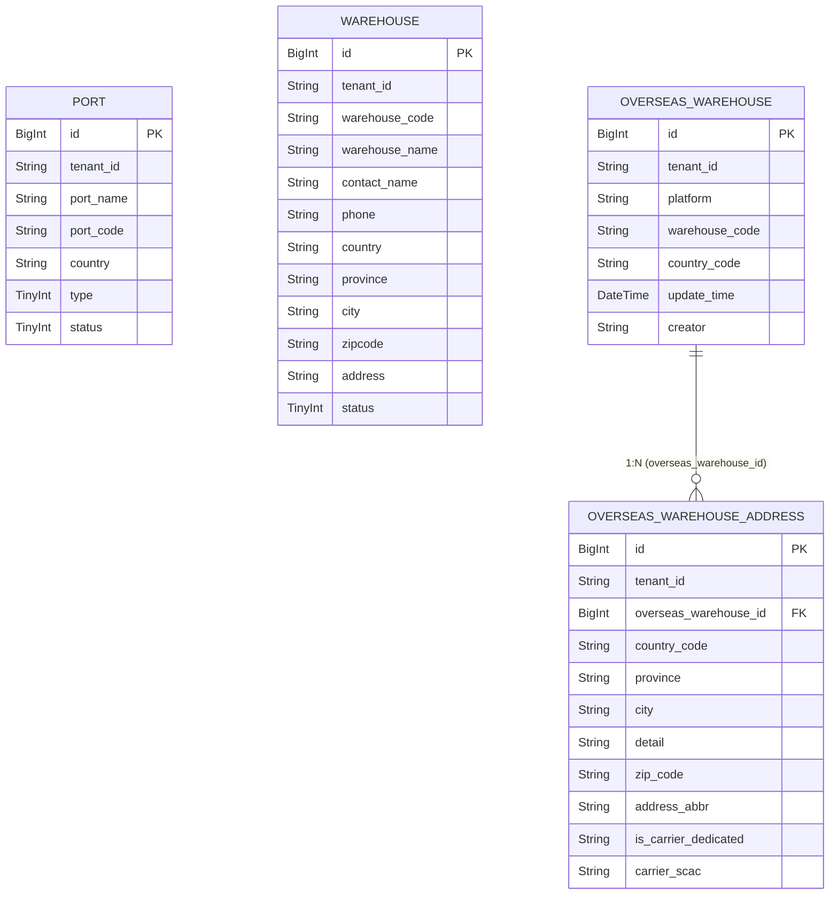

# 数据设计 — 仓库管理

> **文档版本**: v2.3 | **日期**: 2026-09-10 | **作者**: AI PM
> **上游文档**: `2026-09-10-产品文档.md`
> **数据来源**: Demo 原型（真相源）+ Excel 表单 "平台仓库列表" + "仓库列表"

---

### 一、实体清单 × 表映射

| 实体名称 | 对应表/子表 | 映射方式 | 说明 |
|----------|------------|---------|------|
| Port (港口) | `port` | 独立表 | 海运港口和空运港口基础数据，供运单系统引用 |
| LocalWarehouse (本地仓) | `warehouse` | 独立表 | 国内集货仓/中转仓，地址内联在单表中。海外仓Tab待二期实现 |
| OverseasWarehouse (海外平台仓库) | `overseas_warehouse` | 独立表 | 各电商平台仓库主记录（平台下拉枚举），1:N 地址 |
| WarehouseAddress (仓库地址) | `overseas_warehouse_address` | 子表 | 通过 `overseas_warehouse_id` 关联父表 |

> Port (港口) 为运单系统起运港/目的港的基础依赖数据，Demo 原型含完整港口管理功能，故保留独立表。

---

### 二、逐表字段清单

> 字段业务含义与需求背景见产品文档；业务规则与状态机见产品文档；页面交互见原型。本 Schema 是字段结构（类型/约束/枚举值）的唯一权威。

#### 表0: `port` | 对应实体: Port (港口)

> **设计说明**: 存储海运港口和空运港口的基础数据。港口代码按类型区分长度（海港5位、空港3位），校验规则见产品文档。港口为运单系统的基础依赖数据，供起运港/目的港选择引用。

| 字段名 (En) | 字段名 (Cn) | 类型 (Type) | 必填 | 约束/索引 | 枚举/备注 |
| :---------- | :---------- | :----------- | :--- | :-------- | :-------- |
| `id` | 主键 | BigInt | Yes | **PK** | 雪花ID |
| `tenant_id` | 租户ID | String | Yes | Index | SaaS 数据隔离 |
| `port_name` | 港口名称 | String(100) | Yes | — | 如"深圳港""上海港""杭州" |
| `port_code` | 港口代码 | String(10) | Yes | Index | 海港5位字符，空港3位字符；创建后不可修改（编辑只读） |
| `country` | 国家 | String(50) | Yes | — | 如"中国""美国""英国"；创建后不可修改（编辑只读） |
| `type` | 港口类型 | TinyInt | Yes | — | 10:海港, 20:空港；创建后不可修改（编辑只读） |
| `status` | 状态 | TinyInt | Yes | Index | 10:正常, 20:已冻结 |
| `created_at` | 创建时间 | DateTime | Yes | — | 自动生成 |
| `created_by` | 创建人 | String | Yes | — | 当前用户 |
| `updated_at` | 更新时间 | DateTime | Yes | — | 自动维护 |
| `updated_by` | 更新人 | String | Yes | — | 当前用户 |
| `is_deleted` | 软删除标识 | Boolean | Yes | — | Default: false |
| `version` | 乐观锁版本 | Int | Yes | — | 并发控制，每次更新 +1 |

**关联关系**:
- 无内部关联。被运单系统引用（起运港/目的港），但引用关系在运单模块侧维护。

---

#### 表1: `warehouse` | 对应实体: LocalWarehouse (本地仓)

> **设计说明**: 存储国内本地仓库信息，地址字段内联在单表中（一个仓库一个地址），含收货人联系方式。支持冻结/启用状态管理。列表页含"本地仓"和"海外仓"两个Tab，当前仅本地仓Tab有数据，海外仓Tab为占位（二期实现）。

| 字段名 (En) | 字段名 (Cn) | 类型 (Type) | 必填 | 约束/索引 | 枚举/备注 |
| :---------- | :---------- | :----------- | :--- | :-------- | :-------- |
| `id` | 主键 | BigInt | Yes | **PK** | 雪花ID |
| `tenant_id` | 租户ID | String | Yes | Index | SaaS 数据隔离 |
| `warehouse_code` | 仓库代码 | String(50) | Yes | Index | 如"huadu""baiyun" |
| `warehouse_name` | 仓库名称 | String(100) | Yes | — | 如"花都仓""白云仓" |
| `contact_name` | 收货人 | String(50) | Yes | — | — |
| `phone` | 手机号 | String(11) | Yes | — | 11位数字；校验规则见产品文档 |
| `country` | 国家 | String(50) | Yes | — | 新增时默认"中国" |
| `province` | 省份 | String(50) | Yes | — | 如"广东省""浙江省" |
| `city` | 城市 | String(50) | Yes | — | 如"广州市""深圳市" |
| `zipcode` | 邮编 | String(20) | Yes | — | — |
| `address` | 详细地址 | String(255) | Yes | — | — |
| `status` | 状态 | TinyInt | Yes | Index | 10:正常, 20:已冻结 |
| `created_at` | 创建时间 | DateTime | Yes | — | 自动生成 |
| `created_by` | 创建人 | String | Yes | — | 当前用户 |
| `updated_at` | 更新时间 | DateTime | Yes | — | 自动维护 |
| `updated_by` | 更新人 | String | Yes | — | 当前用户 |
| `is_deleted` | 软删除标识 | Boolean | Yes | — | Default: false |
| `version` | 乐观锁版本 | Int | Yes | — | 并发控制，每次更新 +1 |

**关联关系**:
- 无内部关联

---

#### 表2: `overseas_warehouse` | 对应实体: OverseasWarehouse (海外平台仓库)

> **设计说明**: 存储各电商平台（Amazon/Walmart/eBay等）的海外仓库主记录。`country_code` 冗余存储便于列表展示和搜索，与首个地址的国家代码保持同步。`warehouse_code` 需唯一性约束，防止重复录入。运单系统通过接口查询和新增此表数据。

| 字段名 (En) | 字段名 (Cn) | 类型 (Type) | 必填 | 约束/索引 | 枚举/备注 |
| :---------- | :---------- | :----------- | :--- | :-------- | :-------- |
| `id` | 主键 | BigInt | Yes | **PK** | 雪花ID |
| `tenant_id` | 租户ID | String | Yes | Index | SaaS 数据隔离 |
| `platform` | 仓库所属平台 | String(50) | Yes | — | 下拉枚举：Amazon/Walmart/eBay/SHEIN/Temu/TikTok Shop/AliExpress/Mercado Libre/OTTO/Newegg/Shopify |
| `warehouse_code` | 仓库代码 | String(50) | Yes | **Unique** (tenant_id + warehouse_code 联合唯一索引) | 如"BWI1""MEM1s""IND2"。唯一性校验 |
| `country_code` | 国家代码 | String(10) | Yes | — | 如 US/GB/DE/CN，列表展示和搜索用 |
| `update_time` | 更新时间 | DateTime | Yes | — | 最后更新时间 |
| `creator` | 操作人 | String(50) | No | — | 创建/更新人 |
| `created_at` | 创建时间 | DateTime | Yes | — | 自动生成 |
| `created_by` | 创建人 | String | Yes | — | 当前用户 |
| `updated_at` | 更新时间 | DateTime | Yes | — | 自动维护 |
| `updated_by` | 更新人 | String | Yes | — | 当前用户 |
| `is_deleted` | 软删除标识 | Boolean | Yes | — | Default: false |
| `version` | 乐观锁版本 | Int | Yes | — | 并发控制，每次更新 +1 |

**关联关系**:
- `One-to-Many` with `overseas_warehouse_address` (通过 `id` → `overseas_warehouse_id`)

---

#### 表3: `overseas_warehouse_address` | 对应实体: WarehouseAddress (仓库地址)

> **设计说明**: 海外平台仓库的物理地址子表。一个仓库可绑定多个地址。`address_abbr` 为派生字段（仓库代码-邮编），由前端实时计算并提交存储。`is_carrier_dedicated` 标记该地址是否为快递承运商专用地址；`carrier_scac` 存储快递承运商 SCAC 数组（来源供应商明细含快递的供应商）。

| 字段名 (En) | 字段名 (Cn) | 类型 (Type) | 必填 | 约束/索引 | 枚举/备注 |
| :---------- | :---------- | :----------- | :--- | :-------- | :-------- |
| `id` | 主键 | BigInt | Yes | **PK** | 雪花ID |
| `tenant_id` | 租户ID | String | Yes | Index | SaaS 数据隔离 |
| `overseas_warehouse_id` | 仓库ID | BigInt | Yes | Index, FK | 关联 `overseas_warehouse.id` |
| `country_code` | 国家代码 | String(10) | Yes | — | 如 US/UK/CN |
| `province` | 州/省 | String(50) | Yes | — | 如 CA/TX/GD |
| `city` | 城市 | String(50) | Yes | — | — |
| `detail` | 详细地址 | String(255) | Yes | — | 街道、门牌号 |
| `zip_code` | 邮编 | String(20) | Yes | — | — |
| `address_abbr` | 地址简称 | String(100) | No | — | 派生字段：warehouse_code-zip_code，自动生成。前后端均存储 |
| `is_carrier_dedicated` | 是否快递承运商专用地址 | String(10) | Yes | — | 是/否 |
| `carrier_scac` | 快递承运商SCAC | String(255) | No | — | 数组，逗号分隔存储；选项来自供应商明细含快递的供应商 |
| `created_at` | 创建时间 | DateTime | Yes | — | 自动生成 |
| `created_by` | 创建人 | String | Yes | — | 当前用户 |
| `updated_at` | 更新时间 | DateTime | Yes | — | 自动维护 |
| `updated_by` | 更新人 | String | Yes | — | 当前用户 |
| `is_deleted` | 软删除标识 | Boolean | Yes | — | Default: false |
| `version` | 乐观锁版本 | Int | Yes | — | 并发控制，每次更新 +1 |

**关联关系**:
- `Many-to-One` with `overseas_warehouse` (通过 `overseas_warehouse_id`)

---

### 三、ER 关系图

### 四、建模约定（表结构设计理由）

- **port 表独立存在**：港口数据为运单系统的起运港/目的港基础依赖，Demo 原型含完整港口 CRUD 功能，故保留独立表而非并入其他表。
- **软删除策略**：4张表均使用 `is_deleted` 软删除。冻结（status=20）不等于删除——冻结是状态变更，被冻结的数据仍可查询但不可编辑；软删除是完全不可见。级联规则：删除 `overseas_warehouse` 时级联软删除其下所有 `overseas_warehouse_address` 记录。
- **乐观锁**：4张表均需 `version` 字段，用于并发编辑控制。
- **唯一约束**：`overseas_warehouse` 表在 `(tenant_id, warehouse_code)` 上建立联合唯一索引，确保同一租户下仓库代码不重复；前端校验规则见产品文档 R1.1。
- **派生字段**：`address_abbr` 后端冗余存储一份便于列表展示和搜索，生成公式见产品文档 §计算公式；更新仓库代码或邮编时需同步更新所有关联地址的 `address_abbr`。
- **country_code 冗余**：`overseas_warehouse.country_code` 与首个地址的 `country_code` 保持同步，支持列表级别的国家代码搜索，避免每次查询都需要 JOIN 地址表。
- **状态分离**：`warehouse.status` 的"正常/已冻结"是生命周期控制，独立流转。
- **手机号约束**：`warehouse.phone` 限定为 `String(11)`；11位数字校验规则见产品文档 R2.1。
- **外部接口**：运单系统需通过 `GET /api/overseas-warehouses` 查询仓库列表，通过 `POST /api/overseas-warehouses` 新增仓库。新增接口需做幂等处理（基于 warehouse_code 去重），防止网络重试导致重复创建。

---

## 枚举字典 ★ 研发必读

> 所有枚举字段的键值对集中定义，研发以此为准。与数据设计 Schema 中的 TinyInt 值保持一致。

| 枚举名 | 值 | 常量名 | 中文 | 适用实体 |
|--------|----|--------|------|---------|
| PortType | 10 | SEA_PORT | 海港 | port |
| PortType | 20 | AIR_PORT | 空港 | port |
| PortStatus | 10 | NORMAL | 正常 | port |
| PortStatus | 20 | FROZEN | 已冻结 | port |
| WarehouseStatus | 10 | NORMAL | 正常 | warehouse |
| WarehouseStatus | 20 | FROZEN | 已冻结 | warehouse |
| ConfirmStatus | 10 | UNCONFIRMED | 未确认 | overseas_warehouse |
| ConfirmStatus | 20 | CONFIRMED | 已确认 | overseas_warehouse |
| Platform | — | — | 仓库所属平台(String)，取值：Amazon/Walmart/eBay/SHEIN/Temu/TikTok Shop/AliExpress/Mercado Libre/OTTO/Newegg/Shopify | overseas_warehouse |
| CarrierDedicated | — | — | 是否快递承运商专用地址：是/否 | overseas_warehouse_address |

---

---

## 接口契约（字段级）

| 接口 | 方法 | 路径 | 触发页面 | 请求参数 | 返回字段 | 失败处理 |
|------|------|------|---------|---------|---------|---------|
| 海外仓库列表查询 | GET | /api/overseas-warehouses | 海外仓库列表_主列表 / 运单系统 | warehouseCode, countryCode, platform, page, pageSize | id, platform, warehouseCode, countryCode, updateTime, creator, 分页信息 | Toast提示错误 |
| 海外仓库新增 | POST | /api/overseas-warehouses | 海外仓库列表_主列表(弹窗) / 运单系统 | platform, warehouseCode, countryCode, addresses[] | id | Toast提示错误 |
| 海外仓库编辑 | PUT | /api/overseas-warehouses/{id} | 海外仓库列表_主列表(弹窗) | platform, warehouseCode, addresses[] | — | Toast提示错误 |
| 仓库列表查询 | GET | /api/warehouses | 仓库列表_主列表 | warehouseCode, warehouseName, page, pageSize | id, 完整字段, 分页信息 | Toast提示错误 |
| 仓库新增 | POST | /api/warehouses | 仓库列表_主列表(弹窗) | 完整字段 | id | Toast提示错误 |
| 仓库编辑 | PUT | /api/warehouses/{id} | 仓库列表_主列表(弹窗) | 完整字段 | — | Toast提示错误 |
| 仓库状态变更 | PUT | /api/warehouses/{id}/status | 仓库列表_主列表(行内) | status (10:正常, 20:已冻结) | — | Toast提示错误 |
| 港口列表查询 | GET | /api/ports | 港口管理_主列表 | portName, portCode, type, page, pageSize | id, portName, portCode, country, type, status, 分页信息 | Toast提示错误 |
| 港口新增 | POST | /api/ports | 港口管理_主列表(弹窗) | portName, portCode, country, type | id | Toast提示错误 |
| 港口编辑 | PUT | /api/ports/{id} | 港口管理_主列表(弹窗) | portName（portCode/country/type 编辑只读，不参与更新） | — | Toast提示错误 |
| 港口状态变更 | PUT | /api/ports/{id}/status | 港口管理_主列表(行内) | status (10:正常, 20:已冻结) | — | Toast提示错误 |

---
