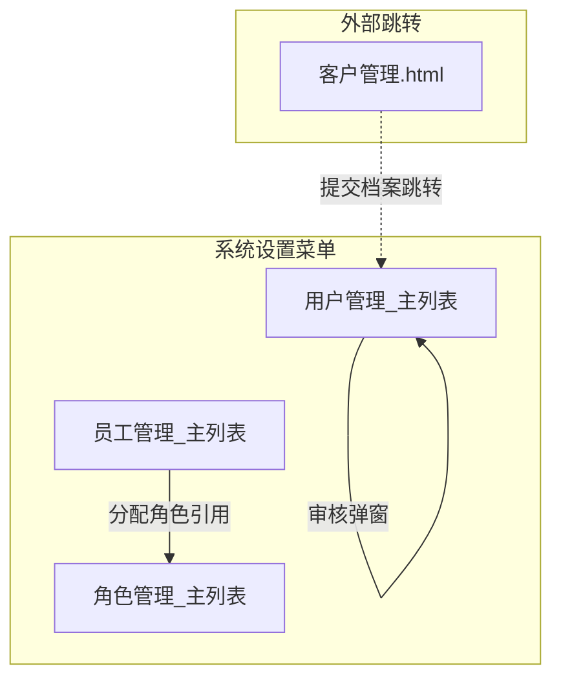

# 产品需求文档 (PRD) — 系统设置

---

### 0. 文档基础信息

- **文档标题**：系统设置
- **版本号**：v1.0
- **状态**：草稿
- **作者**：AI PM
- **评审人**：产品/研发/测试/业务代表
- **计划里程碑**：评审 2026-06-10 / 提测 2026-06-30 / 上线 2026-07-15

**0.1 变更记录**

| 版本 | 变更日期 | 变更内容 | 变更人 |
|------|---------|---------|--------|
| v0.1 | 2026-06-06 | 初稿，基于 Demo 反向生成 | AI PM |
| v1.0 | 2026-06-06 | 基于 Excel 原始需求重写用户管理 + 开户申请页面规格；新增属地主路由/虚拟账户/邮件通知/审核参考资料/操作按钮矩阵 | AI PM |

**0.2 关联链接**

- 用户需求(RDD)：`drafts/系统设置/2026-06-06-用户需求.md` v2.0
- 数据设计：`drafts/系统设置/2026-06-06-数据设计.md` v2.0
- 需求背景：无（0-1新建模块）
- 原型：`demo/员工端-demo/用户管理_主列表.html` / `demo/员工端-demo/员工管理_主列表.html` / `demo/员工端-demo/角色管理_主列表.html`

**0.3 评审记录**（进入评审后补齐）

| 日期 | 参会人 | 主要问题/结论 | 待办 |
|------|--------|-------------|------|

---

### 1. 需求定义

**1.1 背景与现状**

飞点跨境供应链平台处于0到1阶段，当前缺少统一的客户入驻管理和内部员工权限管控。客户入驻面临两个核心差异：大陆企业需先签约后开户，香港企业跳过签约直接开户。当前这两条路径完全依赖人工判断和线下协调，没有系统自动分流。此外，审核通过后的邮件通知、客户管理数据同步、签约完成后的财务代办确认，全部靠人工口头传递，漏发、漏通知频繁。

**1.2 目标与成功口径**

- **目标**：搭建系统设置模块，实现客户入驻全流程线上化（含属地主路由/虚拟账户生成/邮件通知/客户管理数据同步），以及员工-角色-资源三级权限管控体系
- **成功口径**：
  - 大陆/香港企业自动识别并路由到正确的入驻路径，无需人工判断
  - 客户从创建账号到正常使用全流程在系统中完成，审核通过后自动发送邮件通知
  - 每个 Tab 页签展示正确的列组合和操作按钮，按钮按状态条件显示/隐藏
  - 新员工入职后10分钟内完成账号配置和角色分配
  - 所有管理操作受角色-资源权限控制，无越权风险

**1.3 范围与边界**

- **In Scope（本期 P0）**：
  - 用户管理（客户入驻全流程）：属地主路由 / 虚拟账户生成 / 6 Tab页签（动态列+操作矩阵）/ 合同签约 / 开户申请（18字段）/ 开户审核（含参考资料列表）/ 审核通过邮件通知 / 审核通过客户管理自动插入 / 直接新增正常账户 / 冻结/启用/编辑/删除
  - 员工管理：列表查询/编辑/分配角色/同步
  - 角色管理：CRUD/分配资源（菜单+按钮）/批量删除
  - 合同过期自动判断
- **Out of Scope**：
  - 签约后代办推送财务（P1，待工单系统）
  - 香港特殊签约流程（P1）
  - Excel导出（P1）
  - 邮件手动重发界面（P1）
  - 操作审计日志（P2）
  - 客户主数据管理（由客户管理模块承载）

**1.4 影响范围**

- **影响角色**：销售/客服、开户审核员、系统管理员、财务
- **依赖系统**：客户主数据模块（客户名称列表选择、属地判断）、邮件服务（异步发送）、文件存储服务（附件上传）、工单系统（签约代办，P1）

---

### 2. 枚举字典

> 所有枚举字段的键值对集中定义，研发以此为准。与数据设计 Schema 中的 TinyInt 值保持一致。

| 枚举名 | 值 | 常量名 | 中文 | 适用实体 |
|--------|----|--------|------|---------|
| AccountStatus | 10 | PENDING_SIGN | 待签约 | customer_account |
| AccountStatus | 20 | PENDING_OPEN | 待开户 | customer_account |
| AccountStatus | 30 | PENDING_AUDIT | 待审核 | customer_account |
| AccountStatus | 40 | REJECTED | 已拒绝 | customer_account |
| AccountStatus | 50 | NORMAL | 正常 | customer_account |
| AccountStatus | 60 | FROZEN | 已冻结 | customer_account |
| ContractStatus | 10 | UNSIGNED | 未签约 | customer_account |
| ContractStatus | 20 | SIGNING | 签约中 | customer_account |
| ContractStatus | 30 | SIGNED | 已签约 | customer_account |
| ContractStatus | 40 | EXPIRED | 已过期 | customer_account (动态) |
| CustomerRegion | 10 | MAINLAND | 大陆 | customer_account, account_application |
| CustomerRegion | 20 | HK | 香港 | customer_account, account_application |
| FreezeReason | 10 | CUSTOMER_FREEZE | 客户关联冻结 | customer_account |
| FreezeReason | 20 | MANUAL_FREEZE | 人为冻结 | customer_account |
| FreezeReason | 30 | CREDIT_FREEZE | 信控逾期冻结 | customer_account |
| UserType | 10 | CUSTOMER | 客户 | customer_account |
| BusinessType | TMS | TMS | TMS运输管理 | customer_account, account_application |
| BusinessType | WMS | WMS | WMS仓储管理 | customer_account, account_application |
| YesNo | 10 | YES | 是 | customer_contract, account_application |
| YesNo | 20 | NO | 否 | customer_contract, account_application |
| PaymentTerm | 10 | MONTHLY | 月结 | customer_contract |
| PaymentTerm | 20 | WEEKLY | 周结 | customer_contract |
| ContractType | 10 | NORMAL | 普通合同 | customer_contract |
| ContractType | 20 | HK_SPECIAL | 香港特殊合同 | customer_contract |
| CompanyType | 10 | STARTUP | 初创企业（注册资金低于10万） | account_application |
| CompanyType | 20 | AFFILIATE | 关联公司（注册资金低于10万） | account_application |
| CompanyType | 30 | REGISTERED_10W | 注册资金大于等于10万 | account_application |
| CompanyType | 40 | INDIVIDUAL | 个人 | account_application |
| PriceSensitivity | 10 | HIGH | 高 | account_application |
| PriceSensitivity | 20 | MEDIUM | 中 | account_application |
| PriceSensitivity | 30 | LOW | 低 | account_application |
| AcquaintanceMethod | 10 | TANJI | 探迹 | account_application |
| AcquaintanceMethod | 20 | REFERRAL | 转介绍 | account_application |
| AcquaintanceMethod | 30 | EXHIBITION | 展会 | account_application |
| AcquaintanceMethod | 40 | TELEMARKETING | 电销 | account_application |
| AcquaintanceMethod | 50 | WECHAT_MP | 公众号推广 | account_application |
| AcquaintanceMethod | 60 | COLD_VISIT | 陌拜 | account_application |
| AcquaintanceMethod | 70 | BOSS_GROUP | 老板拉群 | account_application |
| AcquaintanceMethod | 80 | EVENT | 活动 | account_application |
| AcquaintanceMethod | 90 | OTHER | 其他 | account_application |
| SendStatus | 10 | PENDING | 待发送 | email_notification |
| SendStatus | 20 | SENT | 已发送 | email_notification |
| SendStatus | 30 | FAILED | 发送失败 | email_notification |
| TriggerEvent | 10 | AUDIT_PASS | 审核通过 | email_notification |
| EmployeeStatus | 0 | DISABLED | 禁用 | employee |
| EmployeeStatus | 1 | ENABLED | 启用 | employee |
| Department | 10 | R_D | 研发部 | employee |
| Department | 20 | PRODUCT | 产品部 | employee |
| Department | 30 | DESIGN | 设计部 | employee |
| Department | 40 | MARKETING | 市场部 | employee |
| Department | 50 | SALES | 销售部 | employee |
| Department | 60 | HR | 人事部 | employee |
| Department | 70 | FINANCE | 财务部 | employee |
| Department | 80 | OPS | 运维部 | employee |
| Department | 90 | CS | 客服部 | employee |
| Branch | 10 | GZ_FD | 广州飞点供应链管理有限公司 | employee |
| Branch | 20 | GD_FD | 广东省飞点跨境供应链有限公司 | employee |
| Branch | 30 | SZ_FD | 飞点跨境供应链（深圳）有限公司 | employee |
| Branch | 40 | GD_ML | 广东墨链跨境供应链有限公司 | employee |
| RoleType | 10 | SUPER_ADMIN | 超级管理员 | role |
| RoleType | 20 | ADMIN | 管理员 | role |
| RoleType | 30 | STAFF | 员工 | role |
| RoleStatus | 10 | NORMAL | 正常 | role |
| RoleStatus | 20 | FROZEN | 冻结 | role |
| ResourceType | 10 | MENU | 菜单 | resource |
| ResourceType | 20 | BUTTON | 按钮 | resource |
| Country | US | US | 美国 | account_application |
| Country | UK | UK | 英国 | account_application |
| Country | DE | DE | 德国 | account_application |
| Country | FR | FR | 法国 | account_application |
| Country | CA | CA | 加拿大 | account_application |
| Country | JP | JP | 日本 | account_application |
| Country | AU | AU | 澳大利亚 | account_application |
| PhoneCode | +86 | CN | 中国 | employee |
| PhoneCode | +852 | HK | 香港 | employee |
| PhoneCode | +886 | TW | 台湾 | employee |
| PhoneCode | +1 | US | 美国 | employee |

---

### 3. 状态机

**3.1 客户账号状态流转（含属地主路由）**

```
               ┌──{提交档案(大陆)}──→ [待签约] ──{签约确认}──→ [待开户]
               │                         │                       │
[起始] ───{提交档案}──┤                     └──{删除}──→ (删除)      │
               │                                                  │
               └──{提交档案(香港)}────────────────────────────────→┘
                                                                  │
                                            ┌──{提交开户申请}──────┘
                                            ↓
                                        [待审核]
                                           │
                              ┌──{审核通过}──┘
                              │             └──{审核拒绝}──→ [已拒绝]
                              ↓                               │
                           [正常] ←──{启用}── [已冻结]          │
                              │               ↑                │
                              └──{冻结}──────→┘    ┌──────────┘
                                                    │
                              直接新增 ─────────→ [正常]       │
                                                    └──{重新开户}──┘
```

| 当前状态 | 操作 | 目标状态 | 触发角色 | 校验条件 |
|---------|------|---------|---------|---------|
| (起始) | 提交档案(大陆) | 待签约 | 销售/客服 | 客户属地=大陆 |
| (起始) | 提交档案(香港) | 待开户 | 销售/客服 | 客户属地=香港，contractStatus=未签约 |
| (起始) | 直接新增 | 正常 | 管理员 | 跳过签约和审核 |
| 待签约 | 签约确认 | 待开户 | 销售/客服 | contractStatus 从"未签约"→"签约中"→"已签约" |
| 待签约 | 删除 | — | 销售/客服 | contractStatus != 签约中 |
| 待开户 | 提交开户申请 | 待审核 | 客服 | 18个必填项全部填写 |
| 待审核 | 审核通过 | 正常 | 审核员 | 资料审查合格 + 触发邮件通知和客户管理插入 |
| 待审核 | 审核拒绝 | 已拒绝 | 审核员 | — |
| 已拒绝 | 重新开户 | 待审核 | 客服 | 修改/补充资料并提交 |
| 正常 | 冻结 | 已冻结 | 管理员 | 二次确认；记录 freeze_reason |
| 已冻结 | 启用 | 正常 | 管理员 | 二次确认 |

**3.2 合同状态流转**

```
[未签约] ──{发起签约}──→ [签约中] ──{签约完成}──→ [已签约]
                                                      │
                                            (当前日期 > end_date)
                                                      ↓
                                                  [已过期]
```

| 当前状态 | 操作 | 目标状态 | 触发角色 | 校验条件 |
|---------|------|---------|---------|---------|
| 未签约 | 发起签约 | 签约中 | 销售/客服 | 根据签约方式填写对应表单 |
| 签约中 | 签约完成 | 已签约 | 销售/客服 | 确认签约（触发代办推送财务，P1） |
| 已签约 | (系统自动) | 已过期 | 系统 | 当前日期 > 合同结束日期 |

**3.3 角色状态流转**

```
[正常] ──{冻结(手动)}──→ [冻结]
   ↑                      │
   └──{启用(手动)}────────┘
```

---

### 4. 功能清单与页面映射

| 模块 | 功能点 | 优先级 | 对应页面 | 页面类型 |
|------|--------|--------|---------|---------|
| 用户管理 | 客户账号列表查询与6 Tab筛选（动态列组合） | P0 | 用户管理_主列表 | 列表页 |
| 用户管理 | 属地主路由（大陆→待签约 / 香港→待开户） | P0 | 用户管理_主列表 | 系统自动 |
| 用户管理 | 新增客户账号 + 虚拟账户自动生成 | P0 | 用户管理_主列表（弹窗） | 列表页内弹窗 |
| 用户管理 | 直接新增正常账户 | P0 | 用户管理_主列表（弹窗） | 列表页内弹窗 |
| 用户管理 | 合同签约 | P0 | 用户管理_主列表（弹窗） | 列表页内弹窗 |
| 用户管理 | 开户申请（18字段表单） | P0 | 开户申请页面 | 表单页/弹窗 |
| 用户管理 | 开户审核（含参考资料列表） | P0 | 用户管理_主列表（弹窗） | 列表页内弹窗 |
| 用户管理 | 查看开户申请 | P0 | 用户管理_主列表（弹窗·只读） | 列表页内弹窗 |
| 用户管理 | 编辑账号（开通业务） | P0 | 用户管理_主列表（弹窗） | 列表页内弹窗 |
| 用户管理 | 冻结/启用账户 | P0 | 用户管理_主列表 | 列表页内操作 |
| 用户管理 | 删除账号 | P0 | 用户管理_主列表 | 列表页内操作 |
| 员工管理 | 员工列表查询与排序 | P0 | 员工管理_主列表 | 列表页 |
| 员工管理 | 同步员工 | P0 | 员工管理_主列表 | 列表页内操作 |
| 员工管理 | 编辑员工信息 | P0 | 员工管理_主列表（弹窗） | 列表页内弹窗 |
| 员工管理 | 分配角色 | P0 | 员工管理_主列表（弹窗） | 列表页内弹窗 |
| 角色管理 | 角色列表查询与筛选 | P0 | 角色管理_主列表 | 列表页 |
| 角色管理 | 新增角色 | P0 | 角色管理_主列表（弹窗） | 列表页内弹窗 |
| 角色管理 | 编辑角色 | P0 | 角色管理_主列表（弹窗） | 列表页内弹窗 |
| 角色管理 | 分配资源（菜单+按钮） | P0 | 角色管理_主列表（弹窗） | 列表页内弹窗 |
| 角色管理 | 批量删除角色 | P0 | 角色管理_主列表 | 列表页内操作 |

**4.1 页面导航关系图**



---

### 5. 页面规格

#### 5.1 用户管理_主列表

**页面信息**：
- **路径**：系统设置 > 用户管理
- **类型**：列表页（6 Tab页签，各Tab动态列组合 + 动态操作按钮）
- **访问角色**：销售/客服、开户审核员、系统管理员

**列表查询区域**：

| 字段名 | 中文名 | 类型 | 必填 | 默认值 | 校验规则 | 数据来源 | 备注 |
|--------|--------|------|------|--------|---------|---------|------|
| userName | 用户名称 | 文本输入 | — | 空 | 模糊搜索 | 用户输入 | placeholder: "用户名称" |

**工具栏按钮**：

| 按钮 | 行为 |
|------|------|
| 查询 | 按用户名称模糊过滤当前Tab列表 |
| 重置 | 清空查询条件，恢复列表默认数据 |
| 新增账号 | 弹出新增账号弹窗 |

**Tab页签**（6个，切换后按 `accountStatus` 过滤列表）：

| Tab名称 | 对应状态值 | 展示列 |
|---------|-----------|--------|
| 待签约 | 10 (待签约) | 用户名称、账户(虚拟账号)、账户状态、合同状态、操作 |
| 待开户 | 20 (待开户) | 用户名称、账户、账户状态、合同状态、操作 |
| 待审核 | 30 (待审核) | 用户名称、账户、账户状态、合同状态、操作 |
| 已拒绝 | 40 (已拒绝) | 用户名称、账户、账户状态、合同状态、操作 |
| 正常 | 50 (正常) | 用户名称、账户、账户状态、合同状态、注册时间、合同开始日期、合同结束日期、操作 |
| 已冻结 | 60 (已冻结) | 用户名称、账户、账户状态、合同状态、注册时间、操作 |

**列表字段表（所有Tab共用字段池，按Tab动态显隐）**：

| 字段名 | 中文名 | 类型 | 备注 |
|--------|--------|------|------|
| customerName | 用户名称 | 文本 | 始终显示 |
| accountCode | 账户(虚拟账号) | 文本 | 始终显示；格式 K{id}_admin |
| accountStatus | 账户状态 | Enum | 始终显示；标签颜色：正常=success / 已冻结=danger / 其他=warning |
| contractStatus | 合同状态 | Enum | 始终显示；标签颜色：已签约=success / 已过期=danger(#F56C6C) / 其他=info；effect="plain" |
| registerTime | 注册时间 | DateTime | 正常/已冻结Tab时显示 |
| contractStartDate | 合同开始日期 | Date | 仅正常Tab时显示 |
| contractEndDate | 合同结束日期 | Date | 仅正常Tab时显示；已过期时标红(#F56C6C) |

**操作列按钮矩阵（按Tab和条件动态显示）**：

| Tab | 按钮 | 显示条件 | 按钮样式 | 行为 |
|-----|------|---------|---------|------|
| 待签约 | 签约 | contractStatus = 未签约(10) | primary | 弹出合同签约弹窗 |
| 待签约 | 删除 | contractStatus != 签约中(20) | danger | 弹出二次确认 → 确认后删除并Toast |
| 待开户 | 开户 | 始终显示 | primary | 弹出开户申请弹窗（mode=edit） |
| 待审核 | 审核 | 始终显示 | primary | 弹出审核弹窗（mode=audit） |
| 已拒绝 | 开户-重新提交 | 始终显示 | primary | 弹出开户申请弹窗（mode=edit，带出上一份申请内容） |
| 正常 | 查看开户申请 | 始终显示 | info | 弹出查看弹窗（mode=view，只读） |
| 正常 | 编辑 | 始终显示 | default | 弹出编辑账号弹窗 |
| 正常 | 冻结 | 始终显示 | danger | 弹出二次确认 → 确认后状态变为已冻结 |
| 正常 | 签约 | contractStatus = 未签约(10) 或 已过期(40) | primary | 弹出合同签约弹窗 |
| 已冻结 | 查看开户申请 | 始终显示 | info | 弹出查看弹窗（mode=view，只读） |
| 已冻结 | 编辑 | 始终显示 | default | 弹出编辑账号弹窗 |
| 已冻结 | 启用 | 始终显示 | success | 弹出二次确认 → 确认后状态变为正常 |

---

**弹窗1：新增账号**

> 触发：点击"新增账号"按钮。用于直接新增正常状态账户，或提交客户档案。

弹窗标题"账号新增"。

| 字段名 | 中文名 | 类型 | 必填 | 默认值 | 校验规则 | 备注 |
|--------|--------|------|------|--------|---------|------|
| userType | 用户类型 | Select（禁用） | ✅ | 客户 | — | 固定值"客户"，不可修改 |
| customerName | 用户名称 | Select | ✅ | 空 | 必选 | 调客户管理接口，下拉选择客户（如"深圳市大卖科技有限公司" K10001） |
| email | 账号接收邮箱 | 文本（只读） | ✅ | 空 | 邮箱格式 | 选择用户名称后自动带出，取值：客户联系人 → 系统账号接收人邮箱 |
| businessTypes | 开通业务 | Select(多选) | ✅ | 空 | 至少选一项 | 选项：TMS / WMS；选择用户后自动带出默认值 |

交互行为：
- 选择用户名称后，email和businessTypes自动填充，不可手动修改
- 点击"开通账号" → 校验表单 → 系统自动生成虚拟账户(account_code) → 创建customer_account记录
- 如果客户属地=大陆 → accountStatus=待签约；如果客户属地=香港 → accountStatus=待开户(contractStatus=未签约)
- 管理员通过此入口新增时，可直接设置accountStatus=正常（需权限控制）
- 成功后Toast"账号开通成功" → 关闭弹窗 → 刷新列表

---

**弹窗2：编辑账号**

> 触发：正常/已冻结Tab中点击"编辑"按钮。

弹窗标题"编辑账号"。

| 字段名 | 中文名 | 类型 | 必填 | 默认值 | 校验规则 | 备注 |
|--------|--------|------|------|--------|---------|------|
| customerName | 用户名称 | 文本（禁用） | — | 当前值 | — | 只读，不可修改 |
| accountCode | 账户(虚拟账号) | 文本（禁用） | — | 当前值 | — | 只读，不可修改 |
| businessTypes | 开通业务 | Select(多选) | ✅ | 当前值 | 至少选一项 | 可修改，默认带出当前已开通业务 |

交互行为：
- 点击"保存" → 校验表单 → 成功后Toast"账号编辑成功" → 关闭弹窗 → 刷新行数据

---

**弹窗3：合同签约**

> 触发：待签约Tab中点击"签约"按钮，或正常Tab中contractStatus为"未签约"或"已过期"时点击"签约"按钮。

弹窗标题"合同签约"。含"是否简易合同"和"是否标准合同"两个前置Select。

**组合表单**（根据 isSimple + isStandard 的动态组合）：

| 组合 (简易/标准) | 展示字段 |
|-----------------|---------|
| 否/是 | 账期(Select:月结/周结) + 合同有效期限(Select:1/2/3年) + 合同开始日期(Date) + 合同结束日期(Date) |
| 否/否 | 合同修改内容(Textarea) + 附件上传(最多1个,2MB) |
| 是/是 | 账期(Select:月结/周结) + 合同有效期限(Select:1/2/3年) + 签订日期(Date) |
| 是/否 | 合同有效期限(Select:1/2/3年) + 签订日期(Date) + 合同修改内容(Textarea) + 附件上传(最多1个,2MB) |

所有组合均包含：
- 是否简易合同 (Select:是/否)
- 是否标准合同 (Select:是/否)
- 我司合同抬头 (Select: "广东省飞点跨境供应链有限公司")

交互行为：
- 点击"确定" → 校验必填项 → 合同状态→已签约(contractStatus=30)
- 若当前accountStatus=待签约 → accountStatus→待开户
- Toast"合同签约成功" → 关闭弹窗 → 刷新列表
- 签约完成后系统异步：① 推送代办给财务确认账期（P1）；② 记录操作日志

---

**弹窗4：开户申请**

> 触发：待开户Tab中点击"开户"按钮，或已拒绝Tab中点击"开户-重新提交"按钮。

弹窗标题"开户申请"。表单包含18个字段。底部按钮"取消 + 提交"。

| 字段名 | 中文名 | 类型 | 必填 | 默认值 | 校验规则 | 备注 |
|--------|--------|------|------|--------|---------|------|
| companyName | 客户全称 | 文本（只读） | ✅ | 自动带出 | — | 从 customer_account.customer_name 带出，不可修改 |
| customerType | 客户类型 | 文本（只读） | ✅ | 自动带出 | — | 从客户主数据带出，不可修改 |
| customerRegion | 客户属地 | 文本（只读） | ✅ | 自动带出 | — | 大陆/香港，从 customer_account.customer_region 带出 |
| isPeer | 是否同行 | Select | ✅ | 否 | 必选 | 选项：是 / 否 |
| companyScale | 公司规模 | Textarea | ✅ | — | — | placeholder: "注册资本：500万人民币；社保参保人数：109人。" |
| companyType | 公司类型 | Select | ✅ | 注册资金>=10万 | 必选 | 选项：初创企业(注册资金<10万) / 关联公司(注册资金<10万) / 注册资金大于等于10万 / 个人 |
| csRepresentative | 客服代表 | Select(多选) | ✅ | — | 至少选一项 | 从员工列表多选 |
| salesSource | 销售来源 | 文本 | — | — | — | 销售线索来源渠道 |
| mainCountries | 主营国家 | Select(多选) | ✅ | — | 至少选一项 | 选项：美国/英国/德国/法国/加拿大/日本/澳大利亚 |
| commonChannels | 客户常发渠道 | 文本 | ✅ | — | — | 如"空运, 海运" |
| shippingVolume | 发货量 | 文本 | ✅ | — | — | 如"500kg/月" |
| shippingProducts | 发货产品 | 文本 | ✅ | — | — | 如"普货, 带电" |
| priceSensitivity | 价格敏感度 | Select | ✅ | 高 | 必选 | 选项：高 / 中 / 低 |
| currentLogistics | 目前合作物流商 | 文本 | ✅ | — | — | 如"递四方" |
| hasVisited | 是否上门拜访面聊过 | Select | ✅ | 是 | 必选 | 选项：是 / 否 |
| acquaintanceMethod | 客户结实方式 | Select | ✅ | 探迹 | 必选 | 选项：探迹/转介绍/展会/电销/公众号推广/陌拜/老板拉群/活动/其他 |
| remark | 备注 | Textarea | — | — | — | — |
| attachments | 附件 | File[] | — | — | 支持多个文件上传 | — |

**重新开户数据预填**：
- 已拒绝状态下点击"开户-重新提交"时，从最新一条 account_application 记录读取数据预填所有字段
- 用户可修改任意字段后重新提交

**交互行为**：
- 点击"提交" → 校验所有必填项 → 创建 account_application 记录(application_status=已提交) → accountStatus 从"待开户"或"已拒绝"→"待审核"
- 成功后Toast"开户申请已提交，等待审核" → 关闭弹窗 → 刷新列表

---

**弹窗5：开户审核**

> 触发：待审核Tab中点击"审核"按钮。

弹窗标题"开户审核"。左侧/上部分为开户申请表单（只读），下部分为审核参考资料列表。

**表单区域**（只读展示，内容同弹窗4的全部18个字段，所有字段disabled）。

**审核参考资料列表**（审核时参考，系统从客户档案聚合展示）：

| 资料名称 | 来源 | 显示方式 |
|---------|------|---------|
| 客户档案表 | 客户管理模块 | 链接/预览 |
| 天眼查风险信息PDF | 文件存储 | 预览/下载 |
| 营业执照 | 客户档案附件 | 图片预览 |
| 身份证正面 | 客户档案附件 | 图片预览 |
| 身份证反面 | 客户档案附件 | 图片预览 |
| 服务合同 | 合同附件 | 预览/下载 |

**审核操作**：

| 按钮 | 样式 | 行为 |
|------|------|------|
| 拒绝 | danger | 更新 account_application.audit_result=拒绝，accountStatus→已拒绝 |
| 通过 | primary | 更新 account_application.audit_result=通过，accountStatus→正常；异步触发邮件通知和客户管理数据插入 |

交互行为：
- 点击"通过" → 确认弹窗 → accountStatus→正常 → Toast"审核已通过，账户已转为正常状态" → 关闭弹窗 → 刷新列表
- 点击"拒绝" → 确认弹窗 → accountStatus→已拒绝 → Toast"审核已拒绝" → 关闭弹窗 → 刷新列表
- 审核通过后系统异步执行：
  1. 向 email_notification 表插入待发送记录 → 邮件服务异步发送（含虚拟账号和初始密码）
  2. 调用客户管理模块接口插入正常状态数据，附件同步带入

---

**弹窗6：查看开户申请**

> 触发：正常/已冻结Tab中点击"查看开户申请"按钮。

弹窗标题"查看开户申请"。等同于审核弹窗中的表单区域，全部字段只读，底部仅显示"关闭"按钮。不展示参考资料列表。

---

**关联接口**：
- 查询列表：`GET /api/customer-accounts` (params: { status, customerName, page, pageSize })
- 新增账号：`POST /api/customer-accounts` (body: { customerRefId, userType, email, businessTypes })
- 编辑账号：`PUT /api/customer-accounts/{id}` (body: { businessTypes })
- 签约：`POST /api/customer-accounts/{id}/contract` (body: { isSimple, isStandard, companyTitle, paymentTerm, contractYears, startDate, endDate, signDate, modifyContent })
- 提交开户申请：`POST /api/customer-accounts/{id}/application` (body: { isPeer, companyScale, companyType, csRepresentative, salesSource, mainCountries, commonChannels, shippingVolume, shippingProducts, priceSensitivity, currentLogistics, hasVisited, acquaintanceMethod, remark })
- 审核：`POST /api/customer-accounts/{id}/audit` (body: { result: pass/reject, auditRemark })
- 冻结/启用：`PUT /api/customer-accounts/{id}/status` (body: { accountStatus, freezeReason })
- 删除：`DELETE /api/customer-accounts/{id}`
- 获取上一份开户申请：`GET /api/customer-accounts/{id}/applications/latest` (用于已拒绝时预填)

---

#### 5.2 员工管理_主列表

**页面信息**：
- **路径**：系统设置 > 员工管理
- **类型**：列表页
- **访问角色**：系统管理员

**列表查询区域**：

| 字段名 | 中文名 | 类型 | 必填 | 默认值 | 校验规则 | 数据来源 | 备注 |
|--------|--------|------|------|--------|---------|---------|------|
| username | 用户名 | 文本输入 | — | 空 | 模糊搜索 | 用户输入 | 支持回车触发搜索 |
| email | 邮箱 | 文本输入 | — | 空 | 模糊搜索 | 用户输入 | 支持回车触发搜索 |
| phone | 手机号 | 文本输入 | — | 空 | 模糊搜索 | 用户输入 | 支持回车触发搜索 |
| status | 状态 | Select | — | 空 | — | — | 选项：启用(1) / 禁用(0) |
| department | 部门 | 文本输入 | — | 空 | 模糊搜索 | 用户输入 | 高级筛选（默认收起） |
| position | 职位 | 文本输入 | — | 空 | 模糊搜索 | 用户输入 | 高级筛选（默认收起） |

**列表字段表**：

| 字段名 | 中文名 | 类型 | 备注 |
|--------|--------|------|------|
| username | 用户名 | 文本 | show-overflow-tooltip |
| email | 邮箱 | 文本 | show-overflow-tooltip |
| phone | 联系电话 | 文本 | — |
| tenant | 租户 | 文本 | show-overflow-tooltip |
| department | 部门 | 文本 | — |
| branch | 分公司 | 文本 | show-overflow-tooltip |
| position | 职位 | 文本 | show-overflow-tooltip |
| timezone | 时区 | 文本 | — |
| language | 语言 | 文本 | — |
| createdAt | 创建时间 | DateTime | sortable |
| status | 状态 | Enum | 标签：启用=success / 禁用=info |

**操作列按钮**：

| 按钮 | 行为 |
|------|------|
| 编辑 | 弹出编辑员工弹窗 |
| 分配角色 | 弹出分配角色弹窗 |

**弹窗1：编辑员工**

| 字段名 | 中文名 | 类型 | 必填 | 默认值 | 校验规则 | 备注 |
|--------|--------|------|------|--------|---------|------|
| username | 用户名 | 文本（禁用） | — | 当前值 | — | 不可修改 |
| email | 邮箱 | 文本 | ✅ | 当前值 | — | 可修改 |
| phoneCode | 区号 | Select | ✅ | +86 | — | 选项：+86(中国) / +852(香港) / +886(台湾) / +1(美国) |
| phoneNumber | 号码 | 文本 | ✅ | 当前值 | — | 纯号码 |
| department | 部门 | Select | ✅ | 当前值 | — | 9部门可选（研发/产品/设计/市场/销售/人事/财务/运维/客服） |
| tenant | 租户 | Select | ✅ | 当前值 | — | 选项：飞点科技 / 墨链科技 |
| branch | 分公司 | Select | ✅ | 当前值 | — | 4分公司可选 |

交互行为：
- 点击"保存" → 二次确认弹窗："确定保存修改吗？" → 确认后保存 → 将区号和号码合并为 phone 字段（`phoneCode + " " + phoneNumber`）→ Toast"修改成功"

**弹窗2：分配角色**

| 字段名 | 中文名 | 类型 | 必填 | 默认值 | 校验规则 | 备注 |
|--------|--------|------|------|--------|---------|------|
| username | 员工姓名 | 文本（禁用） | — | 当前员工姓名 | — | 不可修改 |
| department | 所属部门 | 文本（禁用） | — | 当前部门 | — | 不可修改 |
| selectedRoles | 选择角色 | Checkbox组 | — | 当前已有角色 | — | 选项来自roleList，border样式 |

角色列表项（默认6个）：
- 超级管理员 (role_super_admin)
- 系统管理员 (role_sys_admin)
- 人事经理 (role_hr)
- 财务专员 (role_finance)
- 销售主管 (role_sales)
- 普通员工 (role_staff)

交互行为：
- 点击"确定" → 二次确认弹窗："确定保存角色分配吗？" → 确认后保存 → Toast"角色分配成功"

**工具栏按钮**：

| 按钮 | 行为 |
|------|------|
| 同步员工 | 二次确认："确定要从外部系统同步最新员工数据吗？" → 确认后loading 1s → Toast"员工数据同步成功" → 刷新列表 |
| 导出Excel | 二次确认："确定要导出当前列表数据吗？" → 确认后导出xlsx（文件名"员工管理_导出数据.xlsx"）→ Toast"导出成功" |

**分页**：支持切换每页条数（10/20/50），默认20条

**关联接口**：
- 查询列表：`GET /api/employees` (params: { username, email, phone, status, department, position, page, pageSize, sortField, sortOrder })
- 编辑：`PUT /api/employees/{id}` (body: { email, phoneCode, phoneNumber, department, tenant, branch })
- 分配角色：`PUT /api/employees/{id}/roles` (body: { roleIds: [...] })
- 同步：`POST /api/employees/sync`
- 导出：`GET /api/employees/export` (params: 同查询)

---

#### 5.3 角色管理_主列表

**页面信息**：
- **路径**：系统设置 > 角色管理
- **类型**：列表页
- **访问角色**：系统管理员

**列表查询区域**：

| 字段名 | 中文名 | 类型 | 必填 | 默认值 | 校验规则 | 数据来源 | 备注 |
|--------|--------|------|------|--------|---------|---------|------|
| roleName | 角色名称 | 文本输入 | — | 空 | 模糊搜索 | 用户输入 | — |
| type | 类型 | Select | — | 空 | — | — | 选项：超级管理员 / 管理员 / 员工 |

**列表字段表**：

| 字段名 | 中文名 | 类型 | 备注 |
|--------|--------|------|------|
| (checkbox) | 多选 | Checkbox | 批量删除用 |
| roleName | 角色名称 | 文本 | — |
| roleCode | 角色代码 | 文本 | — |
| tenant | 租户 | 文本 | — |
| type | 类型 | 文本 | — |
| isBuiltIn | 是否系统内置 | 文本 | 是/否 |
| status | 状态 | Enum | 标签：正常=success / 冻结=danger |
| remark | 备注 | 文本 | show-overflow-tooltip |

**操作列按钮**：

| 按钮 | 行为 |
|------|------|
| 编辑 | 弹出编辑角色弹窗 |
| 分配资源 | 弹出分配资源弹窗（树形checkbox） |

**批量操作**：

| 按钮 | 显示条件 | 行为 |
|------|---------|------|
| 批量删除 | 至少选中1行 | 二次确认："确定要删除选中的 N 个角色吗？此操作不可恢复。" → 确认后删除（跳过系统内置角色）→ Toast"批量删除成功" |

**弹窗1：新增/编辑角色**

| 字段名 | 中文名 | 类型 | 必填 | 默认值 | 校验规则 | 备注 |
|--------|--------|------|------|--------|---------|------|
| roleName | 角色名称 | 文本 | ✅ | 空 | — | — |
| roleCode | 角色代码 | 文本 | ✅ | 空 | — | — |
| tenant | 租户代码 | Select | ✅ | 飞点 | — | 选项：飞点 / 墨链 |
| type | 类型 | Select | ✅ | 员工 | — | 选项：超级管理员 / 管理员 / 员工 |
| isBuiltIn | 是否系统内置 | Select | ✅ | 否 | — | 选项：是 / 否 |
| remark | 备注 | Textarea | — | — | — | — |

交互行为：
- 新增模式：标题"新增角色" → 默认值填充 → 点击"确定" → 校验必填项 → 成功后Toast"新增角色成功" → 新角色自动设置status="正常"
- 编辑模式：标题"编辑角色" → 带出当前行数据 → 点击"确定" → 校验必填项 → 成功后Toast"编辑角色成功"

**弹窗2：分配资源**

| 字段名 | 中文名 | 类型 | 必填 | 默认值 | 校验规则 | 备注 |
|--------|--------|------|------|--------|---------|------|
| roleName | 角色名称 | 文本（禁用） | — | 当前角色名 | — | 只读展示 |
| roleCode | 角色代码 | 文本（禁用） | — | 当前角色代码 | — | 只读展示 |
| resourceTree | 菜单权限分配 | Tree(checkbox) | — | 当前已分配 | — | 树形结构，默认全部展开 |

资源树结构（示例）：

| 层级 | 名称 | 类型 | 子节点 |
|------|------|------|--------|
| 1 | 首页 | menu | 查看统计(button) |
| 1 | 系统设置 | menu | 用户管理(menu)→新增账号(button)/编辑账号(button)/删除账号(button)；角色管理(menu)→新增角色(button)/分配资源(button) |
| 1 | 客户管理 | menu | 新增客户(button)/合同签约(button) |

交互行为：
- 节点显示名称+类型标签（菜单=蓝色标签 / 按钮=橙色标签）
- checkbox勾选后点击"确定" → Toast："成功为角色 [roleName] 分配资源"

**分页**：支持切换每页条数（10/20/50/100），默认10条

**关联接口**：
- 查询列表：`GET /api/roles` (params: { roleName, type, page, pageSize })
- 新增：`POST /api/roles` (body: { roleName, roleCode, tenant, type, isBuiltIn, remark })
- 编辑：`PUT /api/roles/{id}` (body: { roleName, roleCode, tenant, type, isBuiltIn, remark, status })
- 分配资源：`PUT /api/roles/{id}/resources` (body: { resourceIds: [...] })
- 批量删除：`DELETE /api/roles/batch` (body: { ids: [...] })

---

### 6. 业务规则

| 编号 | 触发点 | 条件/公式 | 输出 | 异常处理 |
|------|--------|----------|------|---------|
| R01 | 提交客户档案 | 客户属地=大陆 → accountStatus=10(待签约)；客户属地=香港 → accountStatus=20(待开户)+contractStatus=10(未签约) | 状态自动分流 | 属地未设置时阻断并提示"请先在客户管理中配置客户属地" |
| R02 | 创建账号 | 系统自动生成 account_code = "K" + customerId + "_admin" | 虚拟账户编号 | customerId冲突时追加序号 |
| R03 | 新增账号弹窗 | 选择用户后，email取客户联系人→系统账号接收人邮箱；businessTypes取客户主数据默认业务 | 字段自动填充、不可手动改 | 客户主数据无邮箱时提示"该客户未配置账号接收邮箱" |
| R04 | 待签约Tab | contractStatus=20(签约中)时隐藏"签约"按钮，仅显示"删除" | 按钮动态渲染 | — |
| R05 | 签约完成(大陆) | customerAccount.accountStatus: 10→20, contractStatus: 10→20→30 | 待签约→待开户 | 签约信息校验不通过则拒绝 |
| R06 | 提交开户申请 | accountStatus: 20/40→30; 创建新account_application(application_status=已提交) | 待开户/已拒绝→待审核 | 必填项为空时阻断并Toast"请完善必填信息" |
| R07 | 审核通过 | accountStatus: 30→50; application.audit_result=10; 异步：插入email_notification + 调用客户管理API插入数据+附件带入 | 待审核→正常 | 异步操作失败记录日志，不回滚审核结果 |
| R08 | 审核拒绝 | accountStatus: 30→40; application.audit_result=20 | 待审核→已拒绝 | — |
| R09 | 重新开户 | 已拒绝状态点"开户-重新提交"，从最新account_application读取数据预填表单 | 表单预填 | 无历史申请时展示空白表单 |
| R10 | 审核参考资料 | 审核弹窗聚合展示：客户档案表/天眼查PDF/营业执照/身份证正反面/服务合同 | 资料聚合视图 | 某项资料缺失时显示"暂无" |
| R11 | 直接新增 | 管理员新增→accountStatus直接=50(正常)，跳过签约和审核 | 跳过全流程 | 需管理员权限控制 |
| R12 | 冻结 | 正常状态→已冻结; freeze_reason=20(人为); 二次确认后进行 | 状态切换 | 取消操作无变化 |
| R13 | 启用 | 已冻结状态→正常; 二次确认后进行 | 状态切换 | 取消操作无变化 |
| R14 | 合同过期 | 每次渲染列表时，contractStatus=30且当前日期>contractEndDate→展示为"已过期"(40)且日期标红 #F56C6C | 动态计算，不持久化 | — |
| R15 | 正常态签约 | contractStatus=10(未签约)或40(已过期)时显示"签约"按钮，可重新签约 | 按钮动态渲染 | — |
| R16 | 删除约束 | 仅在待签约Tab且contractStatus≠20(签约中)时显示"删除"按钮 | 按钮条件渲染 | — |
| R17 | 邮件通知 | 审核通过→email_notification表插入send_status=10的记录→邮件服务异步消费发送 | 异步发送 | 发送失败→send_status=30→记录fail_reason；MVP阶段不支持自动重试 |
| R18 | 客户管理数据同步 | 审核通过→调用客户管理API插入正常状态数据+附件带入 | 异步同步 | 失败记录日志，支持手动补偿 |
| R19 | 编辑账号 | 用户名称(只读)+账户(只读)+开通业务(多选可改) | 保存后更新business_types | — |
| R20 | 编辑员工 | 二次确认："确定保存修改吗？" → 合并区号和号码为phone | 保存成功 | 用户名不可修改 |
| R21 | 分配角色 | 二次确认："确定保存角色分配吗？" → 保存role_employee关联 | 保存成功 | — |
| R22 | 同步员工 | 二次确认后从外部系统拉取 → loading → 刷新列表 | Toast"员工数据同步成功" | 网络异常时Toast"网络请求异常" |
| R23 | 新增角色 | 校验必填项 → 自动设置status=10(正常) | 插入新行 | — |
| R24 | 系统内置角色 | isBuiltIn=1的角色，删除操作无效（前端按钮隐藏/后端拦截） | 拒绝删除 | — |
| R25 | 角色冻结 | status从10(正常)→20(冻结) | 该角色对所有员工立即权限失效 | — |
| R26 | 批量删除角色 | 勾选N个角色 → 二次确认 → 删除非内置角色 | Toast"批量删除成功" | 取消无变化 |

---

### 7. 计算公式

本模块不涉及金额计算。合同过期判断逻辑如下：

```
变量定义:
  today = 当前日期 (setHours(0,0,0,0))
  endDate = contractEndDate (Date类型)

过期刊定:
  isExpired = today > endDate

展示规则:
  IF contractStatus === 30(已签约) AND isExpired
     THEN 列表展示 contractStatus = 40(已过期)，日期列标红 (#F56C6C)
  ELSE 展示实际 contractStatus
```

---

### 8. 权限矩阵

| 操作 / 页面 | 超级管理员 | 管理员 | 员工（普通） |
|------------|-----------|--------|------------|
| 用户管理_主列表 - 查看 | ✅ | ✅ | ❌ |
| 用户管理 - 新增账号 | ✅ | ✅ | ❌ |
| 用户管理 - 直接新增正常账户 | ✅ | ❌ | ❌ |
| 用户管理 - 签约 | ✅ | ✅ | ❌ |
| 用户管理 - 开户申请 | ✅ | ✅ | ❌ |
| 用户管理 - 开户审核 | ✅ | ✅ | ❌ |
| 用户管理 - 编辑账号 | ✅ | ✅ | ❌ |
| 用户管理 - 冻结/启用 | ✅ | ❌ | ❌ |
| 用户管理 - 删除账号 | ✅ | ❌ | ❌ |
| 员工管理_主列表 - 查看 | ✅ | ✅ | ❌ |
| 员工管理 - 编辑员工 | ✅ | ✅ | ❌ |
| 员工管理 - 分配角色 | ✅ | ❌ | ❌ |
| 员工管理 - 同步员工 | ✅ | ✅ | ❌ |
| 员工管理 - 导出Excel | ✅ | ✅ | ❌ |
| 角色管理_主列表 - 查看 | ✅ | ❌ | ❌ |
| 角色管理 - 新增角色 | ✅ | ❌ | ❌ |
| 角色管理 - 编辑角色 | ✅ | ❌ | ❌ |
| 角色管理 - 分配资源 | ✅ | ❌ | ❌ |
| 角色管理 - 批量删除 | ✅ | ❌ | ❌ |

---

### 9. 接口清单

| 接口 | 方法 | 路径 | 触发页面 | 请求参数 | 返回字段 | 失败处理 |
|------|------|------|---------|---------|---------|---------|
| 查询客户账号列表 | GET | /api/customer-accounts | 用户管理_主列表 | { status, customerName, page, pageSize } | { data: [...], total } | Toast"获取数据失败" |
| 新增客户账号 | POST | /api/customer-accounts | 新增账号弹窗 | { customerRefId, userType, email, businessTypes } | { id, accountCode } | Toast对应错误信息 |
| 编辑客户账号 | PUT | /api/customer-accounts/{id} | 编辑账号弹窗 | { businessTypes } | { success } | Toast对应错误信息 |
| 签约 | POST | /api/customer-accounts/{id}/contract | 合同签约弹窗 | { isSimple, isStandard, companyTitle, paymentTerm, contractYears, startDate, endDate, signDate, modifyContent } | { success } | 校验失败提示具体字段 |
| 提交开户申请 | POST | /api/customer-accounts/{id}/application | 开户申请弹窗 | { isPeer, companyScale, companyType, csRepresentative, salesSource, mainCountries, commonChannels, shippingVolume, shippingProducts, priceSensitivity, currentLogistics, hasVisited, acquaintanceMethod, remark } | { applicationId } | 校验失败提示具体字段 |
| 获取最新开户申请 | GET | /api/customer-accounts/{id}/applications/latest | 开户申请弹窗（预填） | — | { applicationData } | Toast"获取历史申请失败" |
| 审核开户 | POST | /api/customer-accounts/{id}/audit | 审核弹窗 | { result: "pass"\|"reject", auditRemark } | { success } | Toast提示 |
| 修改客户状态 | PUT | /api/customer-accounts/{id}/status | 冻结/启用操作 | { accountStatus, freezeReason } | { success } | Toast"操作失败" |
| 删除客户账号 | DELETE | /api/customer-accounts/{id} | 删除操作 | — | { success } | Toast"删除失败" |
| 查询员工列表 | GET | /api/employees | 员工管理_主列表 | { username, email, phone, status, department, position, page, pageSize, sortField, sortOrder } | { data: [...], total } | Toast"获取数据失败" |
| 编辑员工 | PUT | /api/employees/{id} | 编辑员工弹窗 | { email, phoneCode, phoneNumber, department, tenant, branch } | { success } | Toast"修改失败" |
| 分配员工角色 | PUT | /api/employees/{id}/roles | 分配角色弹窗 | { roleIds: [...] } | { success } | Toast"角色分配失败" |
| 同步员工 | POST | /api/employees/sync | 同步员工按钮 | — | { success, syncedCount } | Toast"同步失败" |
| 导出员工 | GET | /api/employees/export | 导出按钮 | 同查询参数 | xlsx文件流 | Toast"导出失败" |
| 查询角色列表 | GET | /api/roles | 角色管理_主列表 | { roleName, type, page, pageSize } | { data: [...], total } | Toast"获取数据失败" |
| 新增角色 | POST | /api/roles | 新增角色弹窗 | { roleName, roleCode, tenant, type, isBuiltIn, remark } | { id } | Toast对应错误信息 |
| 编辑角色 | PUT | /api/roles/{id} | 编辑角色弹窗 | { roleName, roleCode, tenant, type, isBuiltIn, remark, status } | { success } | Toast"编辑角色失败" |
| 分配角色资源 | PUT | /api/roles/{id}/resources | 分配资源弹窗 | { resourceIds: [...] } | { success } | Toast"资源分配失败" |
| 批量删除角色 | DELETE | /api/roles/batch | 批量删除按钮 | { ids: [...] } | { deletedCount, skippedBuiltin } | Toast"批量删除失败" |

---

### 10. 错误提示文案汇总

| 编号 | 触发条件 | 文案 | 类型（阻断/警告/提示） |
|------|---------|------|----------------------|
| E01 | 新增账号：未选择用户名称 | "请选择用户名称" | 阻断 |
| E02 | 新增账号：客户未配置账号接收邮箱 | "该客户未配置账号接收邮箱，请先在客户管理中补充" | 阻断 |
| E03 | 新增账号：未选择开通业务 | "请选择开通业务" | 阻断 |
| E04 | 客户属地未配置 | "请先在客户管理中配置客户属地" | 阻断 |
| E05 | 开户申请：未选择是否同行 | "请选择是否同行" | 阻断 |
| E06 | 开户申请：未选择主营国家 | "请选择主营国家" | 阻断 |
| E07 | 开户申请：必填项为空 | "请完善必填信息" | 阻断 |
| E08 | 签约：简易合同时签订日期为空 | "请选择签订日期" | 阻断 |
| E09 | 签约：合同结束日期早于开始日期 | "合同结束日期不可早于开始日期" | 阻断 |
| E10 | 删除客户账号二次确认 | "确认要删除客户 [name] 吗？" | 提示 |
| E11 | 冻结二次确认 | "确定要冻结 [name] 关联的 [account] 吗？" | 警告 |
| E12 | 启用二次确认 | "确定要启用 [name] 关联的 [account] 吗？" | 警告 |
| E13 | 审核通过二次确认 | "确定要审核通过该开户申请吗？通过后将发送邮件通知客户。" | 警告 |
| E14 | 审核拒绝二次确认 | "确定要拒绝该开户申请吗？" | 警告 |
| E15 | 同步员工二次确认 | "确定要从外部系统同步最新员工数据吗？" | 警告 |
| E16 | 编辑员工保存二次确认 | "确定保存修改吗？" | 警告 |
| E17 | 分配角色保存二次确认 | "确定保存角色分配吗？" | 警告 |
| E18 | 导出Excel二次确认 | "确定要导出当前列表数据吗？" | 警告 |
| E19 | 批量删除角色二次确认 | "确定要删除选中的 N 个角色吗？此操作不可恢复。" | 警告 |
| E20 | 新增/编辑角色必填项未填 | "请完善必填信息" | 阻断 |
| E21 | 香港签约未上传文件 | "必须上传服务合同协议" | 阻断 |
| E22 | 发送邮件失败 | "邮件发送失败，请联系管理员重发" | 提示（仅记录日志） |

---

### 11. 验收标准

| 编号 | 验收项 | 验收方式 | 通过标准 | 关联 AC |
|------|--------|---------|---------|---------|
| A01 | 属地主路由 | 手动 | 提交大陆企业档案→待签约；提交香港企业档案→待开户(未签约) | AC01 |
| A02 | 虚拟账户生成 | 手动 | 创建账号后自动生成 K{id}_admin 格式的账户编号 | AC02 |
| A03 | 新增账号 | 手动 | 选择客户→自动带出邮箱和业务→开通成功 | AC03 |
| A04 | 直接新增正常账户 | 手动 | 管理员新增→确认后状态直接为正常 | AC04 |
| A05 | Tab页签动态列 | 手动 | 6个Tab切换后各Tab展示正确的列组合（待签约/待开户/待审核/已拒绝5列，正常8列，已冻结6列） | AC05 |
| A06 | 合同签约4种组合 | 手动 | 4种组合动态表单正确展示和保存 | AC06 |
| A07 | 签约后状态流转 | 手动 | 待签约→待开户，合同→已签约 | AC06 |
| A08 | 签约中按钮隐藏 | 手动 | contractStatus=签约中时，签约按钮隐藏，仅显示删除 | AC07 |
| A09 | 开户申请提交(18字段) | 手动 | 填写18字段必填项→提交→状态→待审核 | AC08 |
| A10 | 审核参考资料展示 | 手动 | 审核弹窗中可看到6项聚合资料（客户档案/天眼查/营业执照/身份证正反面/服务合同） | AC22 |
| A11 | 开户审核通过 | 手动 | 点击"通过"→确认→状态变为正常 + 邮件通知记录插入 | AC09, AC12, AC13 |
| A12 | 开户审核拒绝 | 手动 | 点击"拒绝"→确认→状态变为已拒绝 | AC10 |
| A13 | 重新开户带出数据 | 手动 | 已拒绝→开户→表单预填上一份申请内容 | AC11 |
| A14 | 查看开户申请只读 | 手动 | 弹窗标题"查看开户申请"，表单禁用，仅关闭按钮 | AC14 |
| A15 | 编辑账号 | 手动 | 用户名称+账户只读，开通业务可修改并保存 | AC15 |
| A16 | 冻结/启用 | 手动 | 二次确认后状态切换，Toast提示 | AC16, AC17 |
| A17 | 正常状态下签约 | 手动 | 未签约/已过期时显示签约按钮，可完成签约 | AC18 |
| A18 | 合同过期标红 | 手动 | 已过期行合同状态和日期标红 #F56C6C | AC20 |
| A19 | 删除账号条件 | 手动 | 仅待签约Tab+非签约中时可删除 | AC19 |
| A20 | 员工列表查询与分页 | 手动 | 5个筛选条件生效，支持排序和分页切换 | AC23, AC29 |
| A21 | 员工编辑 | 手动 | 用户名不可改，其他字段可改，区号+号码分离 | AC25 |
| A22 | 分配角色 | 手动 | checkbox勾选→二次确认→保存 | AC26 |
| A23 | 同步员工 | 手动 | 二次确认→loading→成功→刷新 | AC24 |
| A24 | 角色新增/编辑 | 手动 | 填写→保存→列表更新 | AC31, AC32 |
| A25 | 分配资源 | 手动 | 树形checkbox勾选→保存→成功 | AC33, AC34 |
| A26 | 批量删除 | 手动 | 勾选→二次确认→删除（内置跳过） | AC35 |

---

### 12. 附录

- **术语表**：
  - **客户账号 (Customer Account)**：客户在飞点平台的登录账号，承载签约、开户、使用的完整生命周期。账号编码为虚拟账户（如 K10001_admin）
  - **属地主路由**：根据客户属地（大陆/香港）自动分流到不同的入驻路径
  - **开户申请 (Account Application)**：客户签约后提交的18字段业务信息表单，经审核后转为正常
  - **审核参考资料**：审核时自动聚合展示的6项资料（客户档案表、天眼查PDF、营业执照、身份证正反面、服务合同），帮助审核员决策
  - **资源 (Resource)**：系统中的菜单和按钮统称，以树形结构组织，是权限分配的最小粒度
  - **系统内置 (isBuiltIn)**：标记为"是"的角色不可被删除
- **原型链接**：
  - 用户管理：`demo/员工端-demo/用户管理_主列表.html`
  - 员工管理：`demo/员工端-demo/员工管理_主列表.html`
  - 角色管理：`demo/员工端-demo/角色管理_主列表.html`
- **用户需求(RDD)**（完整业务流程+字段表）：`drafts/系统设置/2026-06-06-用户需求.md` v2.0
- **数据设计**（完整 Schema+ER 图）：`drafts/系统设置/2026-06-06-数据设计.md` v2.0

---

> **质量自检**：
> - [x] 文档基础信息完整（版本/状态/评审人）
> - [x] 业务规则已编号（R01-R26）
> - [x] 验收标准可测试（A01-A26）
> - [x] 条件必填章节已填写（计算公式注明"不涉及"）
> - [x] 权限矩阵覆盖三个角色等级
> - [x] 异常处理覆盖（错误文案E01-E22）
> - [x] 枚举字典集中定义（含新增 CustomerRegion / FreezeReason / SendStatus / TriggerEvent）
> - [x] 属地主路由 + 操作按钮矩阵 + 审核参考资料 均写入页面规格
