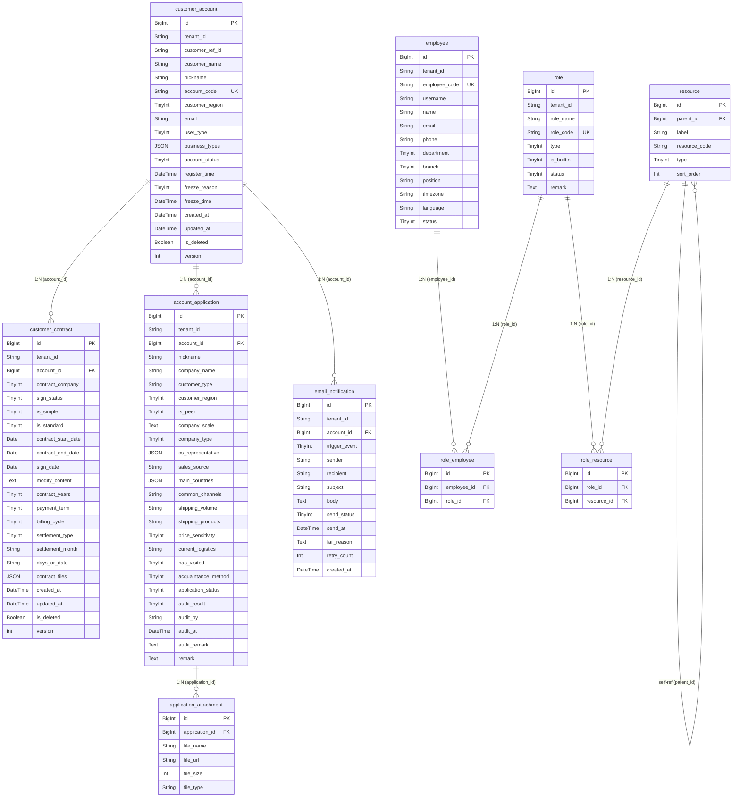

# 数据设计 — 系统设置

> **版本**: v3.1 | **日期**: 2026-06-16 | **作者**: AI PM
> **关联 RDD**: `2026-06-16-用户需求.md` v3.1

---

### 一、实体清单 × 表映射

| 实体名称 | 对应表/子表 | 映射方式 | 说明 |
|----------|------------|---------|------|
| 客户账号 | `customer_account` | 独立表 | 系统设置核心聚合根，管理客户入驻全生命周期 |
| 合同 | `customer_contract` | 1:N 子表 | 通过 `account_id` 关联 customer_account；一个客户可签多份合同 |
| 开户申请 | `account_application` | 1:N 子表 | 通过 `account_id` 关联 customer_account；拒绝后重新提交产生新记录 |
| 开户附件 | `application_attachment` | 1:N 子表 | 通过 `application_id` 关联 account_application |
| 邮件通知记录 | `email_notification` | 1:N 子表 | 通过 `account_id` 关联 customer_account；记录每次邮件发送 |
| 员工 | `employee` | 独立表 | 内部员工管理 |
| 角色 | `role` | 独立表 | RBAC 角色定义 |
| 资源 | `resource` | 独立表 | 菜单+按钮树形结构 |
| 角色-员工关联 | `role_employee` | N:N 关联表 | `role_id` + `employee_id` |
| 角色-资源关联 | `role_resource` | N:N 关联表 | `role_id` + `resource_id` |

---

### 二、逐表字段清单

#### 2.1 客户账号 (customer_account)

**表名**: `customer_account` | **对应实体**: 客户账号

> **设计说明**: 存储客户登录账号信息及生命周期状态。客户公司主体信息从客户主数据（外部模块）引用，本表仅维护账号级属性。customer_region 决定入驻路径分流。合同信息已下沉至 customer_contract 表管理（1:N 关系）。

| 字段名 (En) | 字段名 (Cn) | 类型 (Type) | 必填 | 约束/索引 | 枚举/备注 |
| :---------- | :---------- | :------------ | :--- | :--------- | :------------------------------------- |
| `id` | 主键 | BigInt | Yes | **PK** | 雪花ID |
| `tenant_id` | 租户ID | String(32) | Yes | Index | SaaS 数据隔离 |
| `customer_ref_id` | 客户主数据ID | String(32) | Yes | Index | 引用外部客户主数据模块 |
| `customer_name` | 客户名称 | String(128) | Yes | — | 冗余存储，方便列表展示 |
| `nickname` | 客户昵称 | String(64) | Yes | — | 开户申请时必填，如"qyjskj" |
| `account_code` | 虚拟账户 | String(64) | Yes | **Unique** | 系统自动生成，格式: K{客户ID}_admin |
| `customer_region` | 客户属地 | TinyInt | Yes | — | 10:大陆, 20:香港。决定入驻路径分流 |
| `email` | 账号接收邮箱 | String(128) | Yes | — | 选择客户后自动带出（取客户联系人中系统账号接收人） |
| `user_type` | 用户类型 | TinyInt | Yes | — | 10:客户 |
| `business_types` | 开通业务 | JSON | Yes | — | `["TMS","WMS"]` 格式，多选 |
| `account_status` | 账户状态 | TinyInt | Yes | Index | 10:待签约, 20:待开户, 30:待审核, 40:已拒绝, 50:正常, 60:已冻结 |
| `register_time` | 注册时间 | DateTime | Yes | — | 账号创建时间 |
| `freeze_reason` | 冻结原因 | TinyInt | No | — | 10:客户关联冻结, 20:人为冻结, 30:信控逾期冻结 |
| `freeze_time` | 冻结时间 | DateTime | No | — | 冻结操作时间 |
| `created_at` | 创建时间 | DateTime | Yes | — | 自动生成 |
| `created_by` | 创建人 | String(32) | Yes | — | 操作员工ID |
| `updated_at` | 更新时间 | DateTime | Yes | — | 自动维护 |
| `updated_by` | 更新人 | String(32) | Yes | — | 操作员工ID |
| `is_deleted` | 软删除标识 | Boolean | Yes | — | Default: false |
| `version` | 乐观锁版本 | Int | Yes | — | 并发控制，每次更新 +1 |

**关联关系**:
- `One-to-Many` with `customer_contract` (通过 `id` → `account_id`)
- `One-to-Many` with `account_application` (通过 `id` → `account_id`)
- `One-to-Many` with `email_notification` (通过 `id` → `account_id`)

---

#### 2.2 合同 (customer_contract)

**表名**: `customer_contract` | **对应实体**: 合同

> **设计说明**: 一个客户可在租户下签多份合同（1:N）。通过 `account_id` 关联 customer_account。一个客户在飞点租户下有且仅能有一份处于"已签约"或"签约中"状态的有效合同，过期后方可签新合同。历史合同保留不删除。合同字段对齐客商中心 customer_contract 表。

| 字段名 (En) | 字段名 (Cn) | 类型 (Type) | 必填 | 约束/索引 | 枚举/备注 |
| :---------- | :---------- | :------------ | :--- | :--------- | :------------------------------------- |
| `id` | 主键 | BigInt | Yes | **PK** | 雪花ID |
| `tenant_id` | 租户ID | String(32) | Yes | Index | SaaS 数据隔离 |
| `account_id` | 客户账号ID | BigInt | Yes | **FK**, Index | 关联 customer_account.id；不再 Unique，允许一个账号多份合同 |
| `contract_company` | 签约主体 | TinyInt | Yes | — | 10:广州飞点, 20:深圳飞点, 30:广东飞点, 40:墨链, 50:香港富力顿 |
| `sign_status` | 合同签署状态 | TinyInt | Yes | Index | 10:未签约, 20:签约中, 30:已签约, 40:已过期（过期由系统根据 contract_end_date 动态判断，不持久化） |
| `is_simple` | 是否简易合同 | TinyInt | Yes | — | 10:是, 20:否 |
| `is_standard` | 是否标准合同 | TinyInt | Yes | — | 10:是, 20:否 |
| `contract_start_date` | 合同开始日期 | Date | No | — | 默认当天（非简易+非标准时必填） |
| `contract_end_date` | 合同结束日期 | Date | No | — | 开始日期 + 合同期限自动计算。用于过期自动判断 |
| `sign_date` | 签订日期 | Date | No | — | 默认当天（简易合同时必填） |
| `modify_content` | 合同修改内容 | Text | No | — | 非标准合同时必填 |
| `contract_years` | 合同有效期限 | TinyInt | No | — | 1:1年, 2:2年, 3:3年 |
| `payment_term` | 账期 | TinyInt | No | — | 10:月结, 20:周结。标准合同时必填 |
| `billing_cycle` | 账单周期 | TinyInt | No | — | 10:固定, 20:不固定 |
| `settlement_type` | 结算类型 | TinyInt | No | — | 10:按月, 20:按天 |
| `settlement_month` | 结算月 | String(32) | No | — | 如"月结""双月结""三月结" |
| `days_or_date` | 天数/号 | String(32) | No | — | 如"30""15号" |
| `contract_files` | 合同附件 | JSON | No | — | 存储附件列表，如 `[{"name":"服务合同.pdf","url":"..."}]` |
| `created_at` | 创建时间 | DateTime | Yes | — | 自动生成 |
| `created_by` | 创建人 | String(32) | Yes | — | 操作员工ID |
| `updated_at` | 更新时间 | DateTime | Yes | — | 自动维护 |
| `updated_by` | 更新人 | String(32) | Yes | — | 操作员工ID |
| `is_deleted` | 软删除标识 | Boolean | Yes | — | Default: false |
| `version` | 乐观锁版本 | Int | Yes | — | 并发控制 |

**关联关系**:
- `Many-to-One` with `customer_account` (通过 `account_id`)

**约束说明**:
- 同一客户在飞点租户下有且仅能有一份处于"已签约"（30）或"签约中"（20）状态的有效合同
- 签约时校验该客户下是否已存在 sign_status IN (20, 30) 的合同记录，若存在则阻止新签

---

#### 2.3 开户申请 (account_application)

**表名**: `account_application` | **对应实体**: 开户申请

> **设计说明**: 存储客户开户时填写的表单。每个 account 可能有多条历史申请记录（拒绝后重新提交时创建新记录）。审核通过后此表数据可作为客户画像数据被其他模块引用。company_name、customer_type、customer_region 从 customer_account 带出，存储为只读快照。

| 字段名 (En) | 字段名 (Cn) | 类型 (Type) | 必填 | 约束/索引 | 枚举/备注 |
| :---------- | :---------- | :------------ | :--- | :--------- | :------------------------------------- |
| `id` | 主键 | BigInt | Yes | **PK** | 雪花ID |
| `tenant_id` | 租户ID | String(32) | Yes | Index | SaaS 数据隔离 |
| `account_id` | 客户账号ID | BigInt | Yes | Index | 关联 customer_account.id |
| `nickname` | 客户昵称 | String(64) | Yes | — | 客户自定义昵称，如"qyjskj" |
| `company_name` | 客户全称 | String(128) | Yes | — | 从 customer_account.customer_name 带出，只读快照 |
| `customer_type` | 客户类型 | String(32) | Yes | — | 从客户主数据带出，只读快照 |
| `customer_region` | 客户属地 | TinyInt | Yes | — | 10:大陆, 20:香港。从 customer_account 带出，只读 |
| `is_peer` | 是否同行 | TinyInt | Yes | — | 10:是, 20:否 |
| `company_scale` | 公司规模 | Text | Yes | — | 如"注册资本：500万人民币；社保参保人数：109人" |
| `company_type` | 公司类型 | TinyInt | Yes | — | 10:初创企业, 20:关联公司, 30:注册资金>=10万, 40:个人 |
| `cs_representative` | 客服代表 | JSON | Yes | — | 多选，JSON数组存储员工ID列表，如 `["EMP001","EMP002"]` |
| `sales_source` | 销售来源 | String(64) | No | — | 销售线索来源渠道 |
| `main_countries` | 主营国家 | JSON | Yes | — | `["美国","英国"]` 多选 |
| `common_channels` | 常发渠道 | String(256) | Yes | — | 如"空运, 海运" |
| `shipping_volume` | 发货量 | String(64) | Yes | — | 如"500kg/月" |
| `shipping_products` | 发货产品 | String(128) | Yes | — | 如"普货, 带电" |
| `price_sensitivity` | 价格敏感度 | TinyInt | Yes | — | 10:高, 20:中, 30:低 |
| `current_logistics` | 目前合作物流商 | String(128) | Yes | — | 如"递四方" |
| `has_visited` | 是否上门拜访 | TinyInt | Yes | — | 10:是, 20:否 |
| `acquaintance_method` | 结识方式 | TinyInt | Yes | — | 10:探迹, 20:转介绍, 30:展会, 40:电销, 50:公众号推广, 60:陌拜, 70:老板拉群, 80:活动, 90:其他 |
| `application_status` | 申请状态 | TinyInt | Yes | Index | 10:已提交, 20:已审核（通过/拒绝由 audit_result 区分） |
| `audit_result` | 审核结果 | TinyInt | No | — | 10:通过, 20:拒绝 |
| `audit_by` | 审核人 | String(32) | No | — | 审核员工ID |
| `audit_at` | 审核时间 | DateTime | No | — | 审核操作时间 |
| `audit_remark` | 审核备注 | Text | No | — | 拒绝时可填写原因 |
| `remark` | 备注 | Text | No | — | 申请人填写的备注 |
| `created_at` | 创建时间 | DateTime | Yes | — | 自动生成 |
| `created_by` | 创建人 | String(32) | Yes | — | 操作员工ID |
| `updated_at` | 更新时间 | DateTime | Yes | — | 自动维护 |
| `updated_by` | 更新人 | String(32) | Yes | — | 操作员工ID |
| `is_deleted` | 软删除标识 | Boolean | Yes | — | Default: false |
| `version` | 乐观锁版本 | Int | Yes | — | 并发控制 |

**关联关系**:
- `Many-to-One` with `customer_account` (通过 `account_id`)
- `One-to-Many` with `application_attachment` (通过 `id` → `application_id`)

---

#### 2.4 开户附件 (application_attachment)

**表名**: `application_attachment` | **对应实体**: 开户附件

> **设计说明**: 开户申请的上传附件，支持多个文件上传。审核通过后附件同步至客户管理模块。

| 字段名 (En) | 字段名 (Cn) | 类型 (Type) | 必填 | 约束/索引 | 枚举/备注 |
| :---------- | :---------- | :------------ | :--- | :--------- | :------------------------------------- |
| `id` | 主键 | BigInt | Yes | **PK** | 雪花ID |
| `application_id` | 开户申请ID | BigInt | Yes | **FK**, Index | 关联 account_application.id |
| `file_name` | 文件名 | String(256) | Yes | — | 原始文件名，如"营业执照.jpg" |
| `file_url` | 文件路径 | String(512) | Yes | — | 对象存储URL |
| `file_size` | 文件大小 | Int | Yes | — | 单位：Byte |
| `file_type` | 文件类型 | String(32) | Yes | — | MIME类型，如 image/jpeg |
| `created_at` | 上传时间 | DateTime | Yes | — | 自动生成 |

**关联关系**:
- `Many-to-One` with `account_application` (通过 `application_id`)

---

#### 2.5 邮件通知记录 (email_notification)

**表名**: `email_notification` | **对应实体**: 邮件通知记录

> **设计说明**: 记录每次系统自动发送的邮件通知，便于追溯和失败重发。审核通过后自动插入。MVP阶段可只记录不设重发界面。

| 字段名 (En) | 字段名 (Cn) | 类型 (Type) | 必填 | 约束/索引 | 枚举/备注 |
| :---------- | :---------- | :------------ | :--- | :--------- | :------------------------------------- |
| `id` | 主键 | BigInt | Yes | **PK** | 雪花ID |
| `tenant_id` | 租户ID | String(32) | Yes | Index | SaaS 数据隔离 |
| `account_id` | 客户账号ID | BigInt | Yes | Index | 关联 customer_account.id |
| `trigger_event` | 触发事件 | TinyInt | Yes | — | 10:审核通过, 20:其他通知 |
| `sender` | 发件箱 | String(128) | Yes | — | 注册虚拟邮箱 |
| `recipient` | 收件人 | String(128) | Yes | — | 客户账号接收邮箱 |
| `subject` | 邮件主题 | String(256) | Yes | — | 模板：`【入驻通知】欢迎使用【飞点/墨链】跨境供应链系统 - 账号已开通` |
| `body` | 邮件内容 | Text | Yes | — | 含虚拟账号和初始密码的完整邮件正文，模板详见 RDD §3.5 |
| `send_status` | 发送状态 | TinyInt | Yes | — | 10:待发送, 20:已发送, 30:发送失败 |
| `send_at` | 发送时间 | DateTime | No | — | 实际发送时间 |
| `fail_reason` | 失败原因 | Text | No | — | 发送失败时的错误信息 |
| `retry_count` | 重试次数 | Int | Yes | — | Default: 0 |
| `created_at` | 创建时间 | DateTime | Yes | — | 自动生成 |

**关联关系**:
- `Many-to-One` with `customer_account` (通过 `account_id`)

---

#### 2.6 员工 (employee)

**表名**: `employee` | **对应实体**: 员工

> **设计说明**: 内部员工管理，存储员工基础信息和账号状态。支持多租户。

| 字段名 (En) | 字段名 (Cn) | 类型 (Type) | 必填 | 约束/索引 | 枚举/备注 |
| :---------- | :---------- | :------------ | :--- | :--------- | :------------------------------------- |
| `id` | 主键 | BigInt | Yes | **PK** | 雪花ID |
| `tenant_id` | 租户ID | String(32) | Yes | Index | SaaS 数据隔离 |
| `employee_code` | 员工编号 | String(32) | Yes | **Unique** | 如 EMP10001 |
| `username` | 用户名 | String(64) | Yes | — | 登录名 |
| `name` | 姓名 | String(64) | Yes | — | 员工真实姓名 |
| `email` | 邮箱 | String(128) | Yes | — | — |
| `phone` | 联系电话 | String(32) | Yes | — | 格式: `+86 13800138001` |
| `phone_code` | 区号 | String(8) | Yes | — | `+86` / `+852` / `+886` / `+1` |
| `phone_number` | 号码 | String(20) | Yes | — | 不含区号的纯号码 |
| `department` | 部门 | TinyInt | Yes | — | 10:研发部, 20:产品部, 30:设计部, 40:市场部, 50:销售部, 60:人事部, 70:财务部, 80:运维部, 90:客服部 |
| `branch` | 分公司 | TinyInt | Yes | — | 10:广州飞点供应链管理有限公司, 20:广东省飞点跨境供应链有限公司, 30:飞点跨境供应链（深圳）有限公司, 40:广东墨链跨境供应链有限公司 |
| `position` | 职位 | String(64) | No | — | 如"前端工程师" |
| `timezone` | 时区 | String(16) | No | — | 如"UTC+8" |
| `language` | 语言 | String(8) | No | — | 如"zh-CN" |
| `status` | 状态 | TinyInt | Yes | Index | 0:禁用, 1:启用 |
| `created_at` | 创建时间 | DateTime | Yes | — | 自动生成 |
| `updated_at` | 更新时间 | DateTime | Yes | — | 自动维护 |
| `is_deleted` | 软删除标识 | Boolean | Yes | — | Default: false |
| `version` | 乐观锁版本 | Int | Yes | — | 并发控制 |

**关联关系**:
- `Many-to-Many` with `role` (通过 `role_employee`)

---

#### 2.7 角色 (role)

**表名**: `role` | **对应实体**: 角色

> **设计说明**: RBAC 角色定义。系统内置角色不可删除。角色类型为分类标签，不影响权限范围。

| 字段名 (En) | 字段名 (Cn) | 类型 (Type) | 必填 | 约束/索引 | 枚举/备注 |
| :---------- | :---------- | :------------ | :--- | :--------- | :------------------------------------- |
| `id` | 主键 | BigInt | Yes | **PK** | 雪花ID |
| `tenant_id` | 租户ID | String(32) | Yes | Index | SaaS 数据隔离 |
| `role_name` | 角色名称 | String(64) | Yes | — | 如"超级管理员" |
| `role_code` | 角色代码 | String(32) | Yes | **Unique** | 如"super"、"finance" |
| `type` | 类型 | TinyInt | Yes | — | 10:超级管理员, 20:管理员, 30:员工 |
| `is_builtin` | 是否系统内置 | TinyInt | Yes | — | 0:否（可删除）, 1:是（不可删除） |
| `status` | 状态 | TinyInt | Yes | — | 10:正常, 20:冻结 |
| `remark` | 备注 | Text | No | — | — |
| `created_at` | 创建时间 | DateTime | Yes | — | 自动生成 |
| `created_by` | 创建人 | String(32) | Yes | — | 操作员工ID |
| `updated_at` | 更新时间 | DateTime | Yes | — | 自动维护 |
| `updated_by` | 更新人 | String(32) | Yes | — | 操作员工ID |
| `is_deleted` | 软删除标识 | Boolean | Yes | — | Default: false; 系统内置角色软删除无效 |
| `version` | 乐观锁版本 | Int | Yes | — | 并发控制 |

**关联关系**:
- `Many-to-Many` with `employee` (通过 `role_employee`)
- `Many-to-Many` with `resource` (通过 `role_resource`)

---

#### 2.8 资源 (resource)

**表名**: `resource` | **对应实体**: 资源

> **设计说明**: 系统菜单和按钮的树形结构，通过 parent_id 自引用实现层级关系。

| 字段名 (En) | 字段名 (Cn) | 类型 (Type) | 必填 | 约束/索引 | 枚举/备注 |
| :---------- | :---------- | :------------ | :--- | :--------- | :------------------------------------- |
| `id` | 主键 | BigInt | Yes | **PK** | 雪花ID |
| `parent_id` | 父资源ID | BigInt | No | **FK** (self) | 根节点为 NULL |
| `label` | 资源名称 | String(64) | Yes | — | 如"用户管理"、"新增账号" |
| `resource_code` | 资源代码 | String(64) | Yes | — | 唯一标识，如"user:create" |
| `type` | 资源类型 | TinyInt | Yes | — | 10:菜单, 20:按钮 |
| `sort_order` | 排序号 | Int | No | — | 同级排序，默认0 |
| `created_at` | 创建时间 | DateTime | Yes | — | 自动生成 |
| `updated_at` | 更新时间 | DateTime | Yes | — | 自动维护 |

**关联关系**:
- `Self-referencing` (通过 `parent_id`)
- `Many-to-Many` with `role` (通过 `role_resource`)

---

#### 2.9 角色-员工关联 (role_employee)

**表名**: `role_employee` | **对应实体**: 角色-员工关联 (N:N 关联)

| 字段名 (En) | 字段名 (Cn) | 类型 (Type) | 必填 | 约束/索引 | 枚举/备注 |
| :---------- | :---------- | :------------ | :--- | :--------- | :------------------------------------- |
| `id` | 主键 | BigInt | Yes | **PK** | 雪花ID |
| `employee_id` | 员工ID | BigInt | Yes | **FK**, Index | 关联 employee.id |
| `role_id` | 角色ID | BigInt | Yes | **FK**, Index | 关联 role.id |
| `created_at` | 分配时间 | DateTime | Yes | — | 自动生成 |

**唯一约束**: `(employee_id, role_id)` 联合唯一

---

#### 2.10 角色-资源关联 (role_resource)

**表名**: `role_resource` | **对应实体**: 角色-资源关联 (N:N 关联)

| 字段名 (En) | 字段名 (Cn) | 类型 (Type) | 必填 | 约束/索引 | 枚举/备注 |
| :---------- | :---------- | :------------ | :--- | :--------- | :------------------------------------- |
| `id` | 主键 | BigInt | Yes | **PK** | 雪花ID |
| `role_id` | 角色ID | BigInt | Yes | **FK**, Index | 关联 role.id |
| `resource_id` | 资源ID | BigInt | Yes | **FK**, Index | 关联 resource.id |
| `created_at` | 分配时间 | DateTime | Yes | — | 自动生成 |

**唯一约束**: `(role_id, resource_id)` 联合唯一

---

### 三、ER 关系图

---

### 四、关键设计说明

**1. 软删除策略**

- `customer_account`、`customer_contract`、`account_application`、`employee`、`role` 均采用软删除（`is_deleted`）
- `email_notification` 不设软删除，邮件记录仅用于追溯，保留2年后物理清理
- 纯关联表 `role_employee`、`role_resource` 不设软删除，直接物理删除（解绑即为删除）
- `application_attachment` 不设软删除，直接物理删除
- `resource` 不设软删除，菜单/按钮的增删由超级管理员通过代码或管理后台维护
- 系统内置角色（`is_builtin=1`）标记软删除时后端须拦截，不允许执行

**2. 乐观锁**

- `customer_account`、`customer_contract`、`account_application`、`employee`、`role` 均需 `version` 字段
- 并发场景：多个管理员同时编辑同一客户账号/合同/员工/角色时，后提交者收到版本冲突提示
- 纯关联表（`role_employee`、`role_resource`）不设乐观锁，先删后插即可

**3. JSON 字段使用场景**

- `customer_account.business_types`：开通业务为多选枚举，用 JSON 数组存储（`["TMS","WMS"]`）避免建关联表
- `account_application.cs_representative`：客服代表为多选，用 JSON 数组存储员工ID列表（`["EMP001","EMP002"]`）
- `account_application.main_countries`：主营国家为多选，用 JSON 数组存储（`["美国","英国"]`）
- `customer_contract.contract_files`：合同附件列表，用 JSON 数组存储文件名和URL（`[{"name":"服务合同.pdf","url":"..."}]`）
- 以上 JSON 字段仅用于列表回显，不参与业务查询的 WHERE 条件，因此 JSON 存储无性能问题

**4. 纯逻辑实体说明**

- 客户主数据：`customer_account.customer_ref_id` 引用外部客户管理模块，本系统不存储客户主体信息（如统一社会信用代码、法人等），仅存储账号级属性
- 客户属地（customer_region）：从客户主数据模块获取，在本表中冗余存储以便快速判断入驻路径分流
- 开户申请的 customer_type、customer_region：从 customer_account 和客户主数据带出，作为快照存储，审核时参考

**5. 合同过期自动判断说明**

- `customer_contract.sign_status` 中的"已过期"（40）状态不在签约时写入，而是每次读取列表时由后端或前端根据 `contract_end_date` 与当前日期对比动态判断
- 仅当 `sign_status` 为"已签约"（30）且当前日期 > `contract_end_date` 时，展示为"已过期"
- 不将"已过期"持久化到数据库，避免定时任务维护成本
- 合同过期后的重新签约：在 contract_company 下创建新的 customer_contract 记录

**6. 开户申请历史保留**

- 每个 `customer_account` 可有多条 `account_application` 记录（1:N）
- 当审核拒绝后重新提交开户时，创建新的 `account_application` 记录而非覆盖
- 重新开户时，前端从最新一条 `account_application` 中读取数据预填表单
- 审核通过时，对应的 `account_application` 标记 `application_status=20, audit_result=10`

**7. 审核通过后的自动操作**

- 审核通过后触发以下异步操作：
  1. 更新 `customer_account.account_status` → 50 (正常)
  2. 客户管理模块插入正常状态数据（通过 MQ 或 API 调用），附件从 `application_attachment` 带入
  3. 向 `email_notification` 插入一条待发送记录（send_status=10），异步邮件服务消费此记录发送邮件
- 异步操作失败时记录日志，不回滚审核结果

**8. 客户属地主路由**

- `customer_region` 是入驻路径的关键分流字段
- 提交档案时，大陆企业（10）→ `account_status = 10`（待签约）
- 提交档案时，香港企业（20）→ `account_status = 20`（待开户），同时创建一条初始 `customer_contract` 记录（sign_status = 10 未签约）
- 直接新增 → `account_status = 50`（正常），跳过所有中间状态

**9. 冻结原因枚举**

- `freeze_reason`：10:客户关联冻结（客户主数据冻结时联动）, 20:人为冻结（管理员手动操作）, 30:信控逾期冻结（二期信用控制模块触发）
- 冻结时记录 `freeze_time`，用于统计冻结时长

**10. 邮件通知可靠性**

- `email_notification.send_status` 初始为"待发送"（10），异步邮件服务处理后更新为"已发送"（20）或"发送失败"（30）
- 发送失败时记录 `fail_reason`，`retry_count` 递增
- MVP阶段：失败后不作自动重试，需手动通过后台重发
- Phase 2：支持自动重试3次 + 手动重发界面

**11. 资源树权限继承说明**

- 当前 MVP 阶段不实现父子资源权限继承——勾选父菜单不会自动勾选子菜单/按钮，需逐项勾选
- Phase 2-3 可考虑增加"勾选父节点自动全选子节点"的交互优化
- 权限校验时以 `role_resource` 表中的实际记录为准，不向上递归

**12. 合同多份与唯一有效约束**

- 一个客户通过 `account_id` 可关联多条 `customer_contract` 记录（1:N）
- 约束：同一客户在飞点租户下有且仅能有一份处于"已签约"（30）或"签约中"（20）状态的合同
- 签约时前端+后端双重校验：检查该 account_id 下是否已存在 sign_status IN (20, 30) 的合同记录，若存在则阻止并提示"该客户已存在有效合同"
- 历史合同（已过期/已作废）保留不删除，用于审计追溯

---
