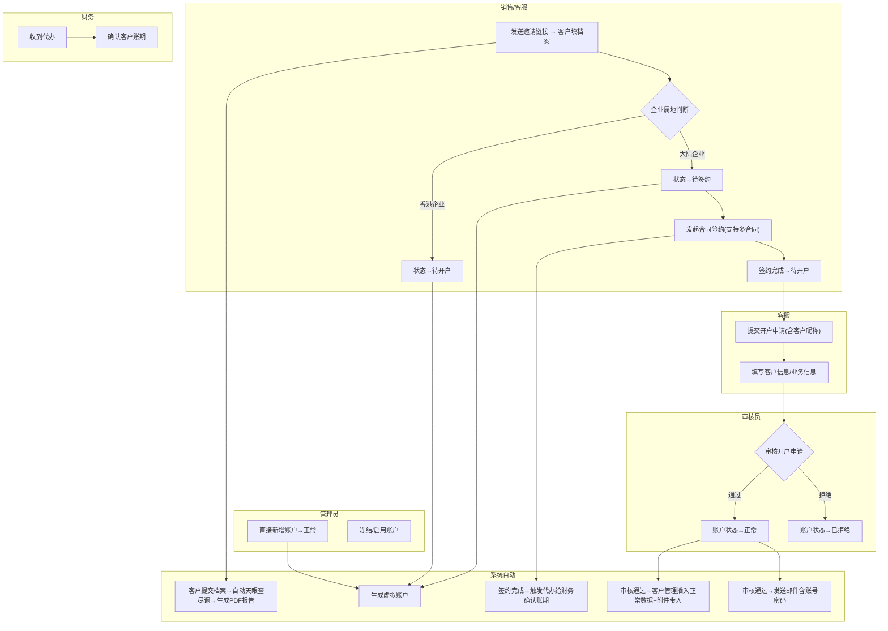

# 需求定义卡片 (RDD) — 系统设置

> **原始需求**：飞点跨境供应链平台需要一套完整的系统设置模块，支撑客户入驻、员工管理和权限控制，从0到1搭建可运营的多租户后台。
> **文档版本**: v3.1 | **日期**: 2026-06-16 | **作者**: AI PM（v3.1: 英文字段全转中文+§3.2合同对齐客商中心签约+§3.5邮件通知模板更新）

---

### 1. 核心洞察 (Insight)

**真实痛点**：

当前飞点跨境供应链平台处于0到1阶段，缺少统一的客户入驻管理和权限管控能力。客户从接触到签约到开户全流程依赖线下沟通和Excel跟踪，信息散落在销售/客服/运营手中，缺乏统一的系统承载。具体痛点包括：

1. **客户入驻链路断裂**：从销售获取线索、合同签约、到后台开户审核，各环节割裂。大陆企业和香港企业走不同入驻路径（大陆需签约后开户；香港跳过签约直接开户），当前无系统自动分流，全靠人工判断。销售不知道签约后开户进度，运营不知道哪些客户待审核，管理层无法看到转化漏斗。
2. **员工权限无管控**：随着业务扩大和多分公司运营，员工账号管理混乱。谁有权限操作什么功能、谁的账号该禁用、新员工入职如何分配角色，全部靠口头沟通或手动配置。
3. **角色与资源无体系化绑定**：不同岗位（销售、财务、客服、管理员）需要不同的菜单和按钮权限，当前缺少角色-资源的灵活配置机制，要么权限过大有安全风险，要么权限不足影响效率。

**JTBD**：

> `平台运营方` 雇佣"系统设置"不是为了"管理页面和表单"，而是为了：**当新客户入驻时，能自动识别大陆/香港企业并走对应入驻路径，在一套系统内完成从线索到正常使用账号的全流程管控，同时自动发送邮件通知、生成虚拟账户、并在签约完成后提醒财务确认账期。**

> `平台运营方` 雇佣"系统设置"不是为了"建十几个后台页面"，而是为了：**在客户增长时，不需要额外招人盯Excel就能管理客户入驻，且入驻流程中的关键通知（邮件、代办）全部自动触发；在员工扩编时，不需要担心手滑删数据或越权操作。**

**业务价值**：

| 维度 | 当前 | 目标 |
|------|------|------|
| 客户入驻周期 | 数天~数周（线下沟通+Excel跟踪） | 1天内完成签约到开户全流程 |
| 企业属地识别 | 人工判断走哪条路径 | 系统根据资料自动识别大陆/香港，分流入驻路径 |
| 开户审核效率 | 人工逐条沟通确认 | 系统流转，一键审核，审核时可查看完整资料列表 |
| 通知自动化 | 人工发邮件、口头通知 | 审批通过自动发邮件（含账号密码），签约完成后自动推送待办给财务 |
| 员工权限分配 | 口头沟通 + 手动逐账号配置 | 分配角色 → 自动继承权限 |
| 权限失控风险 | 无法追踪谁做了什么操作 | 角色-资源绑定，无权限不可见 |

---

### 2. 业务全景图

**2.1 角色与工作节奏**

| 角色 | 核心任务 | 频率 |
|------|---------|------|
| 销售/客服 | 为线索客户创建账号、提交客户档案、发起签约 | 日频 |
| 开户审核员 | 审核客户开户申请（是否同行、资料是否齐全），审核时可查看客户档案/天眼查/营业执照/身份证/合同等资料 | 日频 |
| 财务 | 收到签约代办后确认客户账期 | 按需 |
| 系统管理员 | 管理员工账号、分配角色、维护角色-资源绑定，可直接新增正常状态账户 | 按需（入职/离职/调岗） |
| 普通员工 | 使用被分配功能的业务操作 | 日频 |

**2.2 端到端业务链路**

```
【客户入驻链路 — 大陆企业】
  销售发送邀请链接 → 客户提交档案 → 系统自动触发天眼查尽调+生成PDF报告（邀请入驻模块）
    → 待签约 → 合同签约(支持多份合同/不同所属公司) → 待开户
    → 提交开户申请(含客户昵称) → 待审核 → 审核通过 → 正常
      ↓ 签约完成                                    ↓ 审核拒绝
  触发代办给财务确认账期                          已拒绝 → 重新提交开户

【客户入驻链路 — 香港企业】
  销售发送邀请链接 → 客户提交档案 → 系统自动触发天眼查尽调
    → 直接进入待开户 → 提交开户申请 → 待审核 → 审核通过 → 正常

【直接新增账户】
  管理员新增账号 → 直接进入正常（跳过签约和审核流程）

【账户冻结与恢复】
  正常 → 冻结 → 已冻结 → 启用 → 正常

【内部员工管理链路】
  同步员工 → 编辑员工信息 → 分配角色 → 员工获得对应菜单/按钮权限

【角色权限配置链路】
  创建角色 → 分配资源(菜单/按钮) → 角色关联员工 → 权限生效
```

> V3.0：入驻前置链路（邀请触达 + 客户填档案 + 系统自动尽调）详见 邀请入驻 RDD。本模块聚焦从"待签约"开始的账号生命周期管理。**合同约束**：一个客户在飞点租户下只能有一个有效合同（已签约/签约中），过期后方可签新合同（详见 客商中心 RDD）。

**2.3 实体依赖关系**

```
客户账号 — 聚合根
  ├── 1:N 合同 — V3.0: 一个客户可签多份合同（不同所属公司），合同表含签约段+账期段
  ├── 1:N 开户申请
  │     └── 1:N 附件
  ├── 1:N 邮件通知记录
  └── 引用 客户主数据（外部）← 客户ID
  └── 引用 员工（客服代表）← 外部引用
  └── 引用 邀请记录（邀请入驻模块）← 邀请记录ID

员工
  └── N:N 角色 → 关联表 角色员工关联

角色
  └── N:N 资源 → 关联表 角色资源关联

资源
  └── 树形自引用（菜单/按钮两级）
```

**2.4 核心业务流程图（泳道图）**



---

> 以下按 3 条业务流程组织，每条流程包含：流程概述 → 实体字段定义 → 业务规则 → 核心场景 → 相关 AC。

### 3. 流程一：客户入驻与账号生命周期（日频 / 按需）

> **触发**：销售获取新客户线索，在系统中提交客户档案并推进入驻流程
> **频率**：日频
> **前置依赖**：客户基础信息（公司名称、对接人、邮箱）+ 企业属地（大陆/香港）

**3.1 客户账号** — 客户在平台上的身份标识，承载从档案提交到正常使用的完整生命周期

> **As a** 销售/客服 **I want to** 为客户创建账号并推进入驻全流程 **So that** 客户能顺利入驻并使用平台服务

| 字段 | 类型 | 必填 | 说明 |
|------|------|------|------|
| 客户名称 | 文本 | ✅ | 客户公司名称，新增时从客户主数据接口选择 |
| 客户昵称 | 文本 | ✅ | 开户申请时必填，底纹"举例：qyjskj" |
| 虚拟账号 | 文本 | ✅ | 系统自动生成，格式如 K10001_admin。生成规则：K + 客户ID + _admin |
| 账户状态 | 单选 | ✅ | 生命周期状态：待签约 / 待开户 / 待审核 / 已拒绝 / 正常 / 已冻结 |
| 客户属地 | 单选 | ✅ | 大陆 / 香港 |
| 注册时间 | 日期时间 | ✅ | 账号创建时间 |
| 合同数量 | 关联 | — | V3.0: 引用合同表的合同数量，点击展开 Popover（签约主体+合同状态+起止日期） |
| 邮箱 | 文本 | ✅ | 账号接收邮箱，取客户联系人中系统账号接收人 |
| 开通业务 | 多选 | ✅ | TMS / WMS |
| 用户类型 | 单选 | ✅ | 当前仅支持：客户 |

> V3.0：原 合同状态/合同开始日期/合同结束日期 字段从本表移除——合同信息由合同表管理（一个客户可签多份合同）。列表中以"合同数量"列替代。

**Tab页签与列展示**

各Tab页签展示的列不同：

| Tab页签 | 展示列 |
|---------|--------|
| 待签约 | 用户名称、账户(虚拟账号)、账户状态、合同数量(点开展示签约主体+合同状态+起止日期)、操作 |
| 待开户 | 用户名称、账户、账户状态、合同数量(点开展示6字段)、操作 |
| 待审核 | 用户名称、账户、账户状态、合同数量、操作 |
| 已拒绝 | 用户名称、账户、账户状态、合同状态、操作 |
| 正常 | 用户名称、账户、账户状态、合同状态、注册时间、合同开始日期、合同结束日期、操作 |
| 已冻结 | 用户名称、账户、账户状态、合同状态、注册时间、操作 |

**操作按钮矩阵**：

| Tab | 按钮 | 显示条件 | 行为说明 |
|-----|------|---------|---------|
| 待签约 | 签约 | 合同状态 = 未签约 | 弹出合同签约弹窗 |
| 待签约 | 删除 | 合同状态 ≠ 签约中 | 二次确认后删除账号 |
| 待开户 | 开户 | 始终显示 | 弹出开户申请弹窗 |
| 待审核 | 审核 | 始终显示 | 弹出审核弹窗（表单只读，展示资料列表） |
| 已拒绝 | 开户-重新提交 | 始终显示 | 弹出开户申请弹窗，带出上一份申请内容 |
| 正常 | 查看开户申请 | 始终显示 | 只读查看已提交的开户资料 |
| 正常 | 编辑 | 始终显示 | 弹出编辑弹窗（用户名/账户只读，开通业务可改） |
| 正常 | 冻结 | 始终显示 | 二次确认后冻结 |
| 正常 | 签约 | 始终显示 | 弹出合同签约弹窗 |
| 正常 | 启用 | — （此按钮在已冻结tab） | — |
| 已冻结 | 查看开户申请 | 始终显示 | 只读查看已提交的开户资料 |
| 已冻结 | 编辑 | 始终显示 | 跳转客户管理打开客户编辑弹窗 |
| 已冻结 | 启用 | 始终显示 | 二次确认后启用 |

**业务规则**：

- R01: **企业属地主路由**：客户属地=大陆 → 提交档案后状态为"待签约"；客户属地=香港 → 提交档案后状态直接为"待开户"（合同状态=未签约）
- R02: **虚拟账户生成**：创建账号时系统自动生成虚拟账户编号，格式 K{客户ID}_admin
- R03: **待签约操作约束**：合同状态="签约中"时隐藏"签约"按钮，仅显示"删除"
- R04: **企业签约完成**：客户状态从"待签约" → "待开户"，合同状态 → "已签约"
- R05: **提交开户申请**：待开户状态下，点击"开户"弹出开户申请弹窗，提交后状态流转为"待审核"
- R06: **审核通过**：客户状态从"待审核" → "正常"。同时触发：① 在客户管理模块插入一条正常状态数据（附件带入）；② 发送邮件通知（含账号密码）
- R07: **审核拒绝**：客户状态从"待审核" → "已拒绝"
- R08: **重新开户**：已拒绝状态下点击"开户"，带出上一份申请内容，可修改后重新提交 → 状态流转为"待审核"
- R09: **审核时参考资料**：审核弹窗中展示资料列表（客户档案表、天眼查风险信息PDF、营业执照、身份证正反面、服务合同），供审核员参考
- R10: **直接新增正常账户**：管理员可直接新增账号，跳过签约和审核，直接进入"正常"状态
- R11: **正常→冻结**：三种来源 — ① 客户冻结时关联账户冻结；② 人为操作冻结（二次确认）；③ 二期信控逾期自动冻结
- R12: **已冻结→启用**：二次确认后恢复为"正常"状态
- R13: **合同过期自动判断**：系统根据当前日期与合同结束日期对比，过期时合同状态展示为"已过期"且日期列标红（不持久化到数据库）
- R14: **正常状态下签约**：合同状态为"未签约"或"已过期"时，仍可发起签约
- R15: **删除约束**：仅在"待签约"Tab且合同状态非"签约中"时可删除
- R16: **邮件通知**：审核通过后自动发送邮件，发件箱（系统配置）、主题（模板）、内容含虚拟账号和初始密码
- R17: **签约完成代办**：签约完成后，系统自动推送待办给财务角色人员，确认客户账期（待工单系统）

**3.2 合同签约** — 客户与飞点签订的服务合同，详见 客商中心 RDD §7

> 本模块合同签约复用客商中心的签约流程。一个客户在飞点租户下只能有一个有效合同（已签约/签约中），过期后方可签新合同。

**签约表单字段**（中国大陆客户）：

| 字段 | 类型 | 必填 | 说明 |
|------|------|------|------|
| 我司合同抬头 | 单选 | ✅ | 广州飞点 / 深圳飞点 / 广东飞点 / 墨链。确定时校验：该客户在飞点租户下是否已有"已签约"或"签约中"的合同，若已有则阻止 |
| 是否简易合同 | 单选 | ✅ | 是 / 否 |
| 是否标准合同 | 单选 | ✅ | 是 / 否 |
| 账期 | 单选 | 条件 | 标准合同时必填，可选值根据域名和企业属地动态计算 |
| 合同有效期限 | 单选 | ✅ | 1年 / 2年 / 3年 |
| 合同开始日期 | 日期 | 条件 | 默认当天（非简易+非标准时必填） |
| 合同结束日期 | 日期 | 条件 | 开始日期 + 合同期限自动计算（非简易+非标准时必填） |
| 签订日期 | 日期 | 条件 | 默认当天（简易合同时必填） |
| 合同修改内容 | 文本域 | 条件 | 非标准合同时必填 |
| 附件 | 文件 | 条件 | 非标准合同时上传，支持回显和删除 |

**签约表单字段**（中国香港客户）：

| 字段 | 类型 | 必填 | 说明 |
|------|------|------|------|
| 我司合同抬头 | 文本(只读) | ✅ | 默认"香港富力顿"，置灰不可编辑 |
| 合同开始日期 | 日期 | ✅ | — |
| 合同结束日期 | 日期 | ✅ | 不可早于开始日期 |
| 服务合同协议 | 文件 | ✅ | PDF/图片，至少1个附件 |

**4分支签约字段组合**：

> 所有分支共有字段：我司合同抬头。各分支差异字段见下表：

| 是否简易 | 是否标准 | 展示字段（除共有字段 我司合同抬头 外） |
|----------|---------|---------|
| 否 | 是 | 账期 + 合同有效期限 + 合同开始日期 + 合同结束日期 |
| 否 | 否 | 合同修改内容 + 附件 |
| 是 | 是 | 账期 + 合同有效期限 + 签订日期 |
| 是 | 否 | 合同有效期限 + 签订日期 + 合同修改内容 + 附件 |

**签约审批流程**（中国大陆）：

```
发起签约 → 飞书审批（简易/墨线/美线三种审批流，根据合同类型路由）
        → 审批通过 → E签宝生成合同 → 客户签署 → E签宝合同附件回传
        → 合同信息回写至客户信息
```

**业务规则**：
- R20-1：中国大陆企业支持线上签约（飞书审批+E签宝）
- R20-2：中国香港企业走线下签约流程，保存后合同状态直接更新为"已签约"
- R20-3：一个客户在飞点租户下有且仅能有一份处于"已签约"或"签约中"状态的有效合同
- R20-4：签约完成后，大陆企业状态从"待签约" → "待开户"

**3.3 开户申请** — 客户在待开户/已拒绝状态下提交的开户资料

> 以下为开户申请表单字段：

| 字段 | 类型 | 必填 | 说明 |
|------|------|------|------|
| 客户昵称 | 文本 | ✅ | 底纹提示”请填写客户昵称，举例：qyjskj” |
| 客户全称 | 文本 | ✅ | 从客户账号自动带出，只读 |
| 客户类型 | 文本 | ✅ | 从客户主数据带出，只读 |
| 客户属地 | 单选 | ✅ | 大陆 / 香港，从客户账号带出，只读 |
| 是否同行 | 单选 | ✅ | 是 / 否 |
| 公司规模 | 文本 | ✅ | 公司规模描述，如”注册资本：500万人民币；社保参保人数：109人” |
| 公司类型 | 单选 | ✅ | 初创企业（注册资金低于10万）/ 关联公司（注册资金低于10万）/ 注册资金大于等于10万 / 个人 |
| 客服代表 | 文本 | ✅ | 从员工列表多选 |
| 销售线索来源 | 文本 | — | — |
| 主营国家 | 多选 | ✅ | 美国 / 英国 / 德国 / 法国 / 加拿大 / 日本 / 澳大利亚 |
| 常发渠道 | 文本 | ✅ | 客户常发渠道，如”空运, 海运” |
| 发货量 | 文本 | ✅ | 发货量描述，如”500kg/月” |
| 发货产品 | 文本 | ✅ | 发货产品描述，如”普货, 带电” |
| 价格敏感度 | 单选 | ✅ | 高 / 中 / 低 |
| 当前合作物流商 | 文本 | ✅ | 目前客户合作的物流商，如”递四方” |
| 是否上门拜访 | 单选 | ✅ | 是 / 否 |
| 结识方式 | 单选 | ✅ | 探迹 / 转介绍 / 展会 / 电销 / 公众号推广 / 陌拜 / 老板拉群 / 活动 / 其他 |
| 备注 | 文本 | — | — |
| 附件 | 文件[] | — | 支持多个文件上传 |

**审核时参考资料列表**（审核弹窗中展示，不要求客户提交，系统从客户档案中聚合）：

| 资料名称 | 说明 |
|---------|------|
| 客户档案表 | 客户主数据中的档案信息 |
| 天眼查风险信息PDF | 第三方企业风险查询报告 |
| 营业执照 | 企业营业执照扫描件 |
| 身份证正面 | 法人/联系人身份证正面 |
| 身份证反面 | 法人/联系人身份证反面 |
| 服务合同 | 已签署的服务合同协议 |

**3.4 核心场景**

```
场景1：大陆企业正常入驻全流程
  1. 销售提交客户档案（属地=大陆）→ 系统生成虚拟账户 → 状态 = "待签约"
  2. 点击签约 → 选择合同类型和填写表单 → 确认 → 合同状态="已签约"，状态流转为"待开户"
  3. 签约完成 → 系统自动推送代办给财务确认账期
  4. 点击开户 → 填写开户申请开户申请表单 → 提交 → 状态流转为"待审核"
  5. 审核员查看开户申请+资料列表（客户档案/天眼查/营业执照/身份证/合同）→ 审核通过
  6. 状态流转为"正常" → 系统自动：① 客户管理模块插入正常数据+附件带入 ② 发送邮件通知含账号密码

场景2：香港企业入驻流程
  1. 销售提交客户档案（属地=香港）→ 系统生成虚拟账户 → 状态直接为"待开户"（合同状态=未签约）
  2. 点击开户 → 填写开户申请 → 提交 → 状态流转为"待审核"
  3. 审核员审核 → 审核通过 → 状态流转为"正常" + 邮件通知 + 客户管理插入数据

场景3：直接新增账户（管理后台操作）
  1. 管理员点击"新增账号" → 选择客户名称 → 系统自动填充邮箱和开通业务 → 确认
  2. 系统生成虚拟账户 → 状态直接 = "正常"（跳过签约和审核全流程）

场景4：开户审核被拒与重新提交
  1. 审核员审核开户资料 → 发现资料不全 → 拒绝 → 状态流转为"已拒绝"
  2. 客服选择已拒绝的客户 → 点击"开户-重新提交" → 表单带出上一份申请内容
  3. 修改补充 → 提交 → 状态流转为"待审核"

场景5：客户冻结与恢复
  1. 正常状态客户 → 点击"冻结"（二次确认） → 状态变为"已冻结"
     （冻结来源：客户冻结关联 / 人为操作 / 二期信控逾期自动冻结）
  2. 已冻结客户 → 点击"启用"（二次确认） → 状态变为"正常"

场景6：合同过期后重新签约
  1. 正常状态下，合同已过期（标红）→ 点击"签约"按钮 → 签约流程 → 合同状态更新为"已签约"
```

**3.5 通知与待办**

**邮件通知（审核通过后触发）**：

开户申请审批通过后，通过邮箱形式发送账号密码。接收账号邮箱：取客户档案中"系统账号接收人"的邮箱。

- 发件箱：注册虚拟邮箱
- 邮件主题：`【入驻通知】欢迎使用【飞点/墨链】跨境供应链系统 - 账号已开通`
- 邮件内容：

```
尊敬的客户：

    您好！

    您的 【飞点/墨链】 跨境供应链系统账号已配置完成，现在您可以登录系统进行下单及轨迹查询。

    登录凭证如下：
    1、官网入口： [填入 URL]
    2、用户账号： [填入账号]
    3、初始密码： [填入密码]

    快速开始：
    1、您可以使用批量导入功能快速创建包含多箱、多商品的 FBA 运单。
    2、系统已与亚马逊接口完成对接，您可以直接在后台监控货物的送达准时率。
    3、在使用过程中，如您有任何疑问或需要协助，请勿直接在该邮件上回复，请联系您的专属销售：【发送邀请人的公司邮箱地址】

    我们将持续优化系统体验，致力于为您提供更稳定、透明的跨境派送服务。
```

**代办推送（签约完成后触发）**：
- 触发时机：签约确认完成
- 接收人：财务角色人员
- 内容：确认客户 [客户名称] 的账期
- 承接系统：待工单系统（一期可简化为系统内消息提醒）

**相关 AC**：AC01-AC22

---

### 4. 流程二：员工信息管理（按需 / 低频）

> **触发**：员工入职、离职、调岗、信息变更
> **频率**：按需（入职/离职/调岗时触发）
> **前置依赖**：外部HR系统提供员工基础数据（或手动同步）

**4.1 员工** — 平台内部员工账号，关联角色决定其可访问的功能范围

> **As a** 系统管理员 **I want to** 管理员工信息和角色分配 **So that** 每个员工只能访问其岗位需要的功能

| 字段 | 类型 | 必填 | 说明 |
|------|------|------|------|
| 员工ID | 文本 | ✅ | 员工唯一标识，如 EMP10001 |
| 用户名 | 文本 | ✅ | 用户名/登录名 |
| 员工姓名 | 文本 | ✅ | — |
| 邮箱 | 文本 | ✅ | — |
| 联系电话 | 文本 | ✅ | 含区号，如 "+86 13800138001" |
| 所属租户 | 文本 | ✅ | 如"飞点科技"/"墨链科技" |
| 部门 | 单选 | ✅ | 研发部 / 产品部 / 设计部 / 市场部 / 销售部 / 人事部 / 财务部 / 运维部 / 客服部 |
| 分公司 | 单选 | ✅ | 广州飞点供应链管理有限公司 / 广东省飞点跨境供应链有限公司 / 飞点跨境供应链（深圳）有限公司 / 广东墨链跨境供应链有限公司 |
| 职位 | 文本 | — | 如"前端工程师" |
| 时区 | 文本 | — | 如"UTC+8" |
| 语言偏好 | 文本 | — | 如"zh-CN" |
| 状态 | 单选 | ✅ | 1（启用）/ 0（禁用） |
| 创建时间 | 日期时间 | ✅ | — |
| 最后更新时间 | 日期时间 | — | — |

**业务规则**：
- R18: 支持从外部系统同步员工数据（"同步员工"按钮）
- R19: 编辑员工时，用户名不可修改
- R20: 手机号以"区号 + 空格 + 号码"格式存储，区号支持 +86 / +852 / +886 / +1
- R21: 员工可分配多个角色（多选复选框），保存时二次确认
- R22: 支持导出当前列表为Excel

**4.2 角色分配** — 员工与角色的多对多关联

| 字段 | 类型 | 必填 | 说明 |
|------|------|------|------|
| 员工ID | 文本 | ✅ | — |
| 角色ID | 文本 | ✅ | — |

**核心场景**：
```
场景：新员工入职配置
  1. 管理员点击"同步员工" → 从HR系统拉取最新员工数据
  2. 找到新员工 → 点击"分配角色" → 勾选对应角色 → 保存 → 员工获得角色对应的菜单/按钮权限

场景：员工调岗
  1. 管理员找到该员工 → 编辑 → 修改部门/分公司 → 保存
  2. 重新分配角色 → 勾选新岗位角色 → 保存 → 权限切换
```

**相关 AC**：AC23-AC29

---

### 5. 流程三：角色与权限管理（按需 / 低频）

> **触发**：新岗位设立、权限体系调整
> **频率**：按需（低频，建一次很少动）
> **前置依赖**：菜单/按钮资源已在系统中定义

**5.1 角色** — 权限的集合体，是员工与资源之间的桥梁

> **As a** 系统管理员 **I want to** 创建角色并为其分配菜单和按钮权限 **So that** 不同岗位的员工只能看到和操作被授权的功能

| 字段 | 类型 | 必填 | 说明 |
|------|------|------|------|
| 角色ID | 整数 | ✅ | 系统生成 |
| 角色名称 | 文本 | ✅ | 如"超级管理员"、"财务管理员" |
| 角色代码 | 文本 | ✅ | 如"super"、"finance"、"service" |
| 所属租户 | 文本 | ✅ | 飞点 / 墨链 |
| 类型 | 单选 | ✅ | 超级管理员 / 管理员 / 员工 |
| 是否系统内置 | 单选 | ✅ | 是（不可删除）/ 否（可删除） |
| 状态 | 单选 | ✅ | 正常 / 冻结 |
| 备注 | 文本 | — | — |

**业务规则**：
- R23: 系统内置角色不可删除
- R24: 角色状态为"冻结"时，关联该角色的员工权限立即失效
- R25: 角色支持批量删除（非内置角色），需二次确认
- R26: 新增角色时默认状态为"正常"

**5.2 资源** — 系统中的菜单和按钮，以树形结构组织

> **As a** 系统管理员 **I want to** 看到菜单-按钮的树形结构 **So that** 能按层级勾选要分配给角色的权限范围

| 字段 | 类型 | 必填 | 说明 |
|------|------|------|------|
| 资源ID | 整数 | ✅ | — |
| 资源名称 | 文本 | ✅ | 如"用户管理"、"新增账号" |
| 资源类型 | 单选 | ✅ | 菜单 / 按钮 |
| 父级资源ID | 整数 | — | 根节点为空 |
| 子资源列表 | 数组 | — | 树形结构 |

**5.3 角色资源分配** — 角色与资源的多对多关联

| 字段 | 类型 | 必填 | 说明 |
|------|------|------|------|
| 角色ID | 整数 | ✅ | — |
| 资源ID | 整数 | ✅ | — |

**核心场景**：
```
场景：新建角色并分配权限
  1. 管理员点击"新增角色" → 填写角色名称/代码/类型 → 确定
  2. 点击"分配资源" → 在树形结构中勾选该角色可访问的菜单和按钮 → 确定
  3. 在员工管理中为员工分配该角色 → 权限生效

场景：调整已有角色权限
  1. 找到目标角色 → 点击"分配资源" → 重新勾选/取消勾选 → 确定
  2. 所有已分配该角色的员工权限即时更新
```

**相关 AC**：AC30-AC37

---

### 6. 验收标准总览 (AC)

**流程一：客户入驻与账号生命周期**

- [ ] **AC01-提交档案分流**：提交客户档案时，系统根据客户属地自动路由：大陆→待签约；香港→待开户（合同状态=未签约）
- [ ] **AC02-虚拟账户生成**：创建账号时自动生成虚拟账户编号，格式 K{客户ID}_admin
- [ ] **AC03-新增账号**：点击"新增账号"，弹出表单：用户类型(固定"客户")、用户名称(选择客户)、邮箱(自动带出)、开通业务(自动带出多选)，确认后开通
- [ ] **AC04-直接新增正常账户**：管理员新增账号 → 确认后状态直接为"正常"，跳过签约和审核
- [ ] **AC05-Tab页签切换**：6个Tab（待签约/待开户/待审核/已拒绝/正常/已冻结），各Tab展示不同列组合，点击Tab按状态过滤
- [ ] **AC06-签约流程**：待签约Tab中，未签约的客户显示"签约"按钮，弹出合同签约弹窗（4种组合动态表单），确认后合同状态→已签约、大陆企业状态→待开户
- [ ] **AC07-签约中状态**：合同状态="签约中"时，隐藏"签约"按钮，仅显示"删除"
- [ ] **AC08-开户申请提交**：待开户/已拒绝状态下，点击"开户"弹出开户申请弹窗（开户申请表单），提交后状态→待审核
- [ ] **AC09-开户审核通过**：审核员点击"审核"，弹窗展示开户申请（只读）+ 资料列表（客户档案/天眼查/营业执照/身份证/合同），点击"通过"→状态→正常
- [ ] **AC10-开户审核拒绝**：审核员点击"拒绝"→状态→已拒绝
- [ ] **AC11-重新开户带出数据**：已拒绝状态下点击"开户-重新提交"，表单自动带出上一份申请内容
- [ ] **AC12-审核通过后客户管理插入**：审核通过→自动在客户管理模块插入正常状态数据，附件带入
- [ ] **AC13-审核通过后邮件通知**：审核通过→自动发送邮件通知，含虚拟账号和初始密码
- [ ] **AC14-查看开户申请**：正常/已冻结状态下，点击"查看开户申请"以只读模式查看
- [ ] **AC15-编辑账号**：正常/已冻结状态下，点击"编辑"：用户名称(只读)、账户(只读)、开通业务(多选可改)，保存
- [ ] **AC16-冻结账户**：正常状态下，点击"冻结"弹出二次确认，确认后状态→已冻结
- [ ] **AC17-启用账户**：已冻结状态下，点击"启用"弹出二次确认，确认后状态→正常
- [ ] **AC18-签约按钮**：正常Tab中签约按钮始终可见（服务状态=正常），点击弹出签约弹窗（大陆选我司合同抬头/HK默认香港富力顿），确定时校验签约主体唯一
- [ ] **AC19-删除账号**：待签约Tab中显示"删除"按钮，二次确认后删除
- [ ] **AC20-合同数量Popover**：列表展示合同数量，点击弹出合同明细（签约主体+合同状态+合同开始日期+合同结束日期+账期+天数号）
- [ ] **AC21-签约后代办推送**：签约完成→自动推送待办给财务人员确认账期
- [ ] **AC22-审核参考资料展示**：审核弹窗中聚合展示客户档案、天眼查风险信息PDF（客户提交档案后系统自动生成）、营业执照、身份证正反面、服务合同
- [ ] **AC23-客户昵称必填**：开户申请时客户昵称必填，底纹"举例：qyjskj"

**流程二：员工信息管理**

- [ ] **AC23-员工列表查询**：支持按用户名、邮箱、手机号、状态进行搜索，支持高级筛选（部门、职位），支持按创建时间排序
- [ ] **AC24-同步员工**：点击"同步员工"按钮弹出二次确认，确认后从外部系统拉取最新员工数据并刷新列表
- [ ] **AC25-编辑员工**：点击"编辑"弹出编辑弹窗，用户名不可修改，可编辑邮箱、联系电话（区号+号码分离）、部门、租户、分公司，保存后二次确认
- [ ] **AC26-分配角色**：点击"分配角色"弹出分配弹窗，展示员工姓名和部门（只读），以复选框组形式列出所有可选角色，勾选后保存并二次确认
- [ ] **AC27-导出Excel**：点击"导出Excel"弹出二次确认，确认后导出当前列表数据为xlsx文件
- [ ] **AC28-状态标签**：状态列以标签显示，启用=绿色，禁用=灰色
- [ ] **AC29-分页**：支持分页（默认20条/页），支持切换每页条数（10/20/50）

**流程三：角色与权限管理**

- [ ] **AC30-角色列表查询**：支持按角色名称、类型进行搜索和重置
- [ ] **AC31-新增角色**：点击"新增角色"弹出新增弹窗，填写角色名称、角色代码、租户代码、类型、是否系统内置、备注，保存后创建成功
- [ ] **AC32-编辑角色**：点击"编辑"弹出编辑弹窗，可修改所有字段，保存后更新
- [ ] **AC33-分配资源**：点击"分配资源"弹出分配弹窗，显示角色名称和代码（只读），以树形结构展示所有菜单和按钮（复选框），勾选后保存
- [ ] **AC34-资源树结构**：资源树以菜单-按钮两层结构展示，每个节点标注类型标签（菜单=蓝色/按钮=橙色），默认全部展开
- [ ] **AC35-批量删除**：勾选多个角色后点击"批量删除"，弹出二次确认，确认后删除非内置角色
- [ ] **AC36-角色状态**：列表显示角色状态（正常=绿色/冻结=红色）
- [ ] **AC37-角色类型筛选**：搜索区域支持按类型（超级管理员/管理员/员工）下拉筛选

---

### 7. NFR（非功能性需求）

- **性能**：列表页查询响应 < 2s；开户申请提交 < 3s；邮件发送异步处理不阻塞主流程
- **并发**：支持50个管理员同时操作
- **数据保留**：客户账号和合同数据永久保留，软删除；邮件通知记录保留2年
- **安全**：角色-资源权限控制覆盖所有管理页面；敏感操作（冻结/启用/删除/批量删除）均需二次确认
- **多租户**：角色数据按租户隔离，员工按租户归属
- **通知可靠性**：邮件发送失败需记录日志并支持手动重发；代办推送失败需记录并告警

---

### 8. 功能清单

> 基于 3 条业务流程，共 **3 个模块、25 项功能**。P0 = MVP，P1 = 二期，P2 = 三期。

**模块 A：用户管理（客户入驻）**

| 编号 | 功能 | 优先级 | AC |
|------|------|--------|-----|
| A1 | 提交客户档案与属地主路由 | P0 | AC01 |
| A2 | 虚拟账户自动生成 | P0 | AC02 |
| A3 | 新增客户账号 | P0 | AC03 |
| A4 | 直接新增正常账户 | P0 | AC04 |
| A5 | 6 Tab页签状态筛选（动态列组合） | P0 | AC05 |
| A6 | 合同签约（4种组合方式） | P0 | AC06, AC07 |
| A7 | 开户申请提交（18字段） | P0 | AC08 |
| A8 | 开户审核（通过/拒绝+参考资料列表） | P0 | AC09, AC10, AC22 |
| A9 | 重新开户（带出历史数据） | P0 | AC11 |
| A10 | 审核通过后客户管理自动插入 | P0 | AC12 |
| A11 | 审核通过后邮件通知 | P0 | AC13 |
| A12 | 查看开户申请（只读） | P0 | AC14 |
| A13 | 编辑账号（开通业务修改） | P0 | AC15 |
| A14 | 冻结/启用账户 | P0 | AC16, AC17 |
| A15 | 正常状态下签约/续约 | P0 | AC18 |
| A16 | 删除账号 | P0 | AC19 |
| A17 | 合同过期自动判断与标红 | P0 | AC20 |
| A18 | 签约后代办推送财务 | P1 | AC21 |

**模块 B：员工管理**

| 编号 | 功能 | 优先级 | AC |
|------|------|--------|-----|
| B1 | 员工列表查询与排序 | P0 | AC23 |
| B2 | 同步员工（从外部HR系统） | P0 | AC24 |
| B3 | 编辑员工信息 | P0 | AC25 |
| B4 | 分配角色 | P0 | AC26 |
| B5 | 导出Excel | P1 | AC27 |
| B6 | 状态标签展示 | P0 | AC28 |
| B7 | 分页（含每页条数切换） | P0 | AC29 |

**模块 C：角色管理**

| 编号 | 功能 | 优先级 | AC |
|------|------|--------|-----|
| C1 | 角色列表查询与筛选 | P0 | AC30, AC37 |
| C2 | 新增角色 | P0 | AC31 |
| C3 | 编辑角色 | P0 | AC32 |
| C4 | 分配资源（菜单+按钮树形勾选） | P0 | AC33, AC34 |
| C5 | 批量删除角色 | P0 | AC35 |
| C6 | 角色状态显示 | P0 | AC36 |

**分期汇总**

| 分期 | 模块范围 | 功能数 |
|------|----------|--------|
| **Phase 1 (MVP)** | 用户管理(17项) + 员工管理(5项) + 角色管理(6项) | **28** |
| **Phase 2** | 签约后代办推送 + 导出Excel + 香港特殊签约流程 | +3 |
| **Phase 3** | 操作审计日志 + 角色模板 + 数据看板 | +3 |

---

### 9. MVP 方案与建议

**MVP 方案（Phase 1 — 客户入驻 + 员工权限管控核心闭环）**

```
系统设置
├── 用户管理（日频）
│   ├── 客户入驻全流程（属地主路由 → 签约 → 开户 → 审核 → 正常）
│   ├── 6 Tab页签（动态列组合 + 操作按钮矩阵）
│   ├── 虚拟账户自动生成
│   ├── 审核通过邮件通知 + 客户管理自动插入
│   └── 冻结/启用/编辑/删除
├── 员工管理（按需）
│   ├── 员工列表与搜索
│   ├── 同步员工 / 编辑信息
│   └── 分配角色
└── 角色管理（低频）
    ├── 角色 CRUD
    ├── 资源树分配（菜单+按钮）
    └── 批量删除
```

**MVP 明确不做**：
- 签约后代办推送给财务（P1，待工单系统就绪）
- 香港特殊签约流程（P1）
- Excel导出功能（P1，MVP阶段数据量小，手动查看即可）

**理想方案（Phase 2-3）**：
- **Phase 2**：签约代办推送 + 香港特殊签约 + Excel导出
- **Phase 3**：操作审计日志 + 角色模板 + 数据看板

**专家建议**：

1. **属地主路由是核心分流器**：大陆和香港企业走不同入驻路径，系统必须在提交档案时准确识别属地主并自动分流。建议属地字段在客户主数据中维护，用户管理模块引用。

2. **虚拟账户生成规则要可追溯**：账户格式 K{客户ID}_admin 清晰但需确保客户ID全局唯一。建议用客户主数据的唯一标识而非自增ID，避免ID空洞导致账户号不连续。

3. **开户申请18字段已有客户画像基础**：公司类型、主营国家、价格敏感度、常发渠道等字段是未来运价推荐和客户分层的基础数据，建议结构化存储（非纯文本），便于后续数据分析。

4. **审核资料列表宜采用聚合视图**：审核时展示的6项资料（档案表、天眼查、营业执照等）来自不同数据源（客户管理、文件存储），建议在审核弹窗中做聚合视图，而非要求审核员去多个页面翻找。

5. **邮件通知和代办推送建议异步解耦**：审核通过后的邮件发送和客户管理数据插入应异步执行，不阻塞审核流程。异步失败时记录日志并支持手动重试。

6. **直接新增正常账户有风险，建议加审计日志**：跳过签约和审核直接创建正常账户属于高权限操作，建议至少记录操作人和时间，Phase 2-3 补审计日志。

### 下一步

当前已根据 Excel 原始需求完成 RDD v2.0 更新，下一步重新生成 数据设计 和 PRD 的用户管理部分。

---
