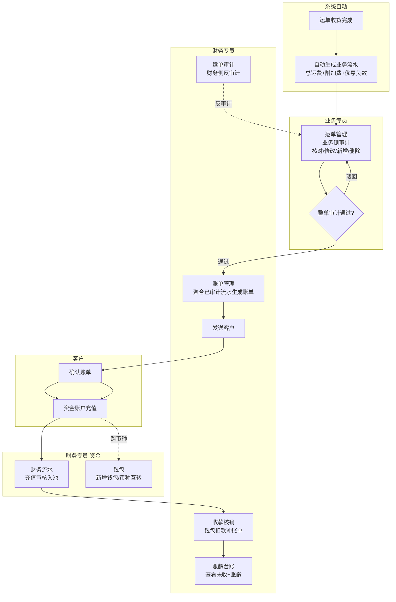
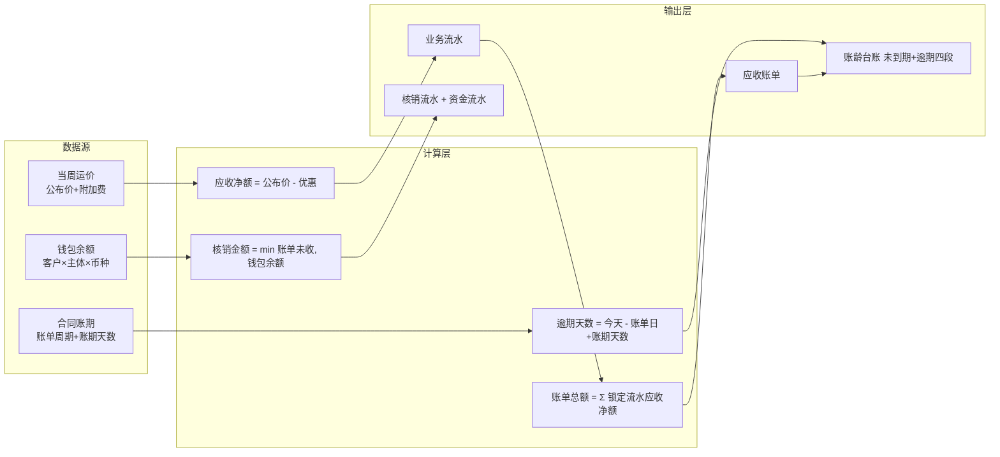
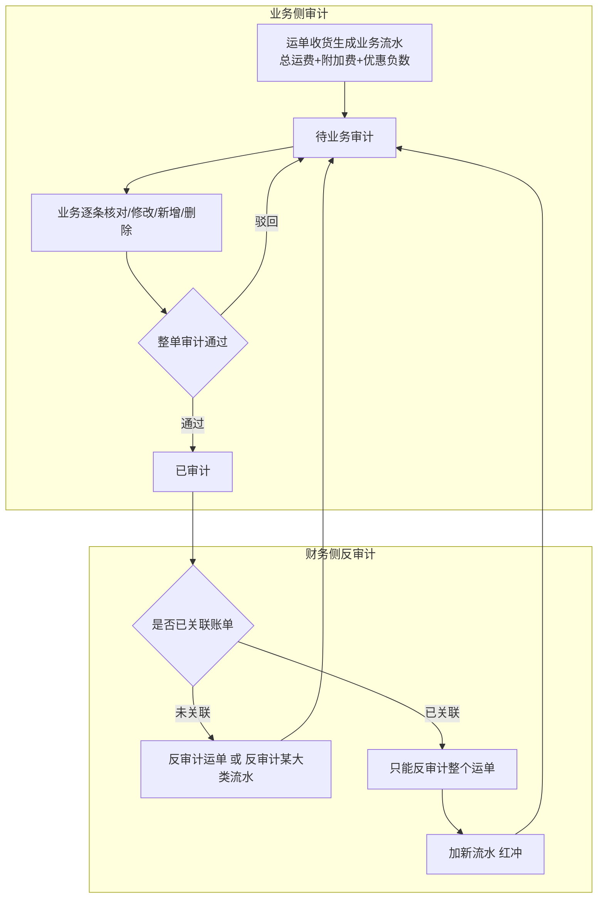
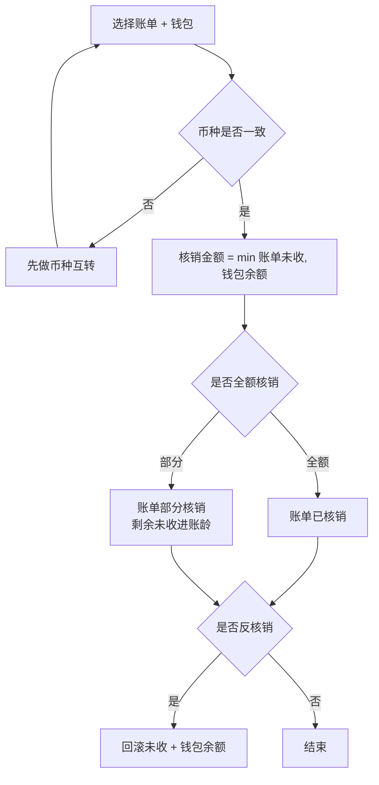

# 需求定义卡片 (RDD) — 财务模块

> **原始需求**：财务是飞点 TMS 的消费方，实现多主体独立核算 + 钱进钱出闭环，消费订单/运单数据完成应收管理、资金账户与账龄管理。
> **文档版本**: v0.4 | **日期**: 2026-08-27 | **作者**: 飞点产品

## 1. 核心洞察 (Insight)

**真实痛点**：

当前飞点 5 家公司（广州飞点、深圳飞点、广东飞点、香港富利顿、墨链）税务上独立法人、实际一个家族，但财务核算完全依赖线下 Excel。客户打款与应收账单之间靠财务手工核对，钱进来不知道冲哪张账单；账期到了不知道哪些客户逾期、逾期多久；多主体、多币种的资金往来靠手工分账，极易混账。

计费依赖运价模块的当周公布价和附加费规则，但运单收货完成后，应收金额、账单、核销、账龄这一整条链路没有系统承载，财务只能线下追着业务要数据、手工算账。

**JTBD**：

> `财务专员` 雇佣"财务模块"不是为了"记流水账"，而是为了：**当运单收货完成后，能在系统内完成业务流水审计→生成账单→收款核销→账龄跟踪的闭环，且每一笔钱都挂到具体主体和币种，不混账、可追溯。**

> `客户（货主端）` 雇佣"财务模块"不是为了"看数字"，而是为了：**当收到账单后，能在线上确认账单并充值，不用线下反复跟财务对账沟通。**

> `业务专员` 雇佣"财务模块"不是为了"录数据"，而是为了：**当运单收货后，能在运单管理侧对业务流水做业务审计（核对/修改/新增），财务侧可反审计，权责清晰。**

**业务价值**：

| 维度 | 当前 | 目标 |
|------|------|------|
| 应收核算 | 线下 Excel 手工算账 | 运单收货自动生成业务流水，业务审计 + 财务反审计 |
| 账单管理 | 财务手工发账单，客户线下对账 | 系统生成账单→发送→客户线上确认 |
| 收款核销 | 钱进来手工找账单冲抵 | 钱包池化 + 同币种核销，min(未收,余额) 防透支 |
| 账龄跟踪 | 人工追账，无逾期预警 | 系统按账单日+账期自动分段，未到期单列+逾期四段 |
| 资金账户 | 多主体多币种手工分账 | 钱包按 客户×主体×币种 隔离，币种互转闭环 |
| 主体隔离 | 打款可能跨主体混打 | 每笔钱强制挂具体主体，钱包层隔离 |

## 2. 业务全景图

### 2.1 角色与工作节奏

| 角色 | 核心任务 | 频率 |
|------|---------|------|
| 财务专员 | 反审计业务流水、生成账单、收款核销、反核销、币种互转、充值审核、提现 | 日频 |
| 业务专员 | 业务侧审计业务流水（运单管理）、确认业务流水 | 日频 |
| 客户（货主端） | 确认账单、发起充值 | 按需/账期周期 |
| 系统自动 | 运单收货自动生成业务流水、账龄实时计算 | 实时 |

### 2.2 端到端业务链路

```
【应收触发】
  创建每周报价 → 创建运单 → 运单收货完成 → 系统自动生成业务流水（取当周公布价+附加费）
      ↓
【业务审计】
  业务在「运单管理」做业务侧审计（核对/修改/新增 → 整单审计通过）→ 财务在「运单审计」可反审计
      ↓
【账单生成】
  财务在「账单管理」按 客户+主体+账期+币种 聚合已锁定流水 → 生成账单 → 发送客户
      ↓
【客户确认】
  客户在货主端「账单管理」确认账单（异议走线下/工单，财务重新生成账单再发）
      ↓
【充值】
  客户在货主端「资金账户」发起充值（金额+币种+打款账户+凭证）→ 财务在「财务流水」核对银行流水审核入池
      ↓
【核销】
  财务在「收款核销」从钱包扣款冲账单（同币种，min(未收,余额)，可部分核销/反核销）
      ↓
【账龄】
  「账龄台账」按 客户×主体×币种 展示未收余额 + 账龄四段（未到期单列）
      ↓
【资金账户】
  钱包开通（入驻自动人民币 + 财务手工开通其他币种）→ 币种互转（跨币种核销前）→ 提现
```

### 2.3 实体依赖关系

```
应收业务流水 (ArFlow) — 应收侧聚合根
  ├── N:1 应收账单 (ArBill)
  ├── N:1 运单 (Waybill) ← 外部引用（运单模块）
  ├── N:1 客户 (Customer) ← 外部引用（客商中心）
  └── N:1 主体 (Entity) ← 外部引用（基础资料）

应收账单 (ArBill)
  ├── 1:N 应收业务流水 (ArFlow)
  └── 1:N 收款核销流水 (ArWriteoff)

客户钱包 (CustomerWallet) — 资金侧聚合根
  ├── N:1 客户 (Customer) ← 外部引用
  ├── N:1 主体 (Entity) ← 外部引用
  └── 1:N 资金流水 (WalletFlow)

资金流水 (WalletFlow)
  ├── 1:1 充值申请 (RechargeApply)
  ├── 1:1 收款核销流水 (ArWriteoff)
  └── 1:2 币种互转 (CurrencyTransfer)

我方银行账户 (BankAccount) — N:1 主体，被充值申请引用
币种互转 (CurrencyTransfer) — 1:2 资金流水（转出/转入）
账龄台账 — 纯视图，基于应收账单实时计算，不建表
```

### 2.4 核心业务流程图（泳道图）



### 2.5 核心数据流图



---

## 3. 流程一：应收业务流水与审计（日频）

> **触发**：运单收货完成 **频率**：实时自动生成 + 日频审计 **前置依赖**：运单模块收货状态、超级运价当周报价、客商中心合同账期

**3.1 应收业务流水 (ArFlow)** — 运单收货自动生成的逐票应收，粒度=运单，按费用类型×币种可拆多条

> **As a** 财务专员 **I want to** 运单收货后系统自动生成应收业务流水 **So that** 每票运单的应收金额有系统记录、可追溯

| 字段 | 类型 | 必填 | 说明 |
|------|------|------|------|
| 运单号 | 引用 | ✅ | 引用运单模块，粒度=运单 |
| 客户 | 引用 | ✅ | 引用客商中心 |
| 主体 | 引用 | ✅ | 5 账套之一，强制挂主体 |
| 业务流水大类 | 枚举 | ✅ | 应收 / 应付 / 销售提成（财务模块管应收大类） |
| 费用类型 | 枚举 | ✅ | 总运费 / 附加费（地址附加/商品附加/报关费…）/ 优惠（负数） |
| 币种 | 枚举 | ✅ | 运费币种来自报价，附加费币种来自附加费规则，可跨币种 |
| 金额 | Decimal | ✅ | 正数=费用，负数=优惠 |
| 数据来源 | 枚举 | ✅ | 报价 / 业务手工新增（记录第一次来源，不随修改变） |
| 账单日 | Date | ✅ | 从合同账期推导，生成时快照锁死 |
| 账期天数 | Integer | ✅ | 合同账期天数快照 |
| 审计状态 | 枚举 | ✅ | 待业务审计 / 已审计 |

**业务规则**：
① 计费触发点 = 运单收货完成，系统主动生成业务流水
② 业务流水类型：总运费（+，来源报价或业务手工新增）+ 各附加费（+，每种一条，如地址附加/商品附加/报关费）+ 优惠（−，每个费用项对应一条负数流水，有优惠才生成）
③ 总运费匹配逻辑：运单绑定服务组合，按 收货地 + 重量段 + 仓库代码 匹配当周报价表；匹配到走报价，匹配不到（私仓未做报价）由业务手工新增
④ 数据来源记录第一次来源（报价/业务手工新增），业务后续修改金额/币种不改变来源
⑤ 审计模型 = 单审计 + 反审计：业务侧正向审计（逐条核对/修改/新增/删除，整单审计通过）；财务侧反审计（撤销审计，退回业务重改）
⑥ 反审计粒度：运单级 + 业务流水大类级（应收/应付/销售提成）；反审计前提是未锁定，不受收货时间限制

**相关 AC**：`AC1-生成` `AC2-审计` `AC3-反审计` `AC4-红冲`

**3.2 核心场景（反审计规则，以是否关联账单为界）**

```
场景：业务流水纠错（财务反审计）
  1. 未关联账单 → 可反审计运单 + 反审计某大类流水（应收/应付/销售提成）→ 业务直改后重新审计
  2. 已关联账单 → 该大类流水不可反审计 → 只能反审计整个运单 → 加新流水（红冲）
                  → 原流水留痕，红冲流水归下一期账单
```

**3.3 关键操作流程图（单审计 + 反审计）**



## 4. 流程二：账单生成与客户确认（账期周期）

> **触发**：财务需要出账单 **频率**：账期周期（月结/双月结等） **前置依赖**：流程一已锁定的业务流水

**4.1 应收账单 (ArBill)** — 财务手工聚合已锁定流水，账期级，按 客户+主体+账期+币种

> **As a** 财务专员 **I want to** 聚合已锁定流水生成账单并发送客户 **So that** 客户能确认应收金额

| 字段 | 类型 | 必填 | 说明 |
|------|------|------|------|
| 账单号 | 文本 | ✅ | 唯一，规则 AR+主体+年月+序号 |
| 客户 | 引用 | ✅ | 引用客商中心 |
| 主体 | 引用 | ✅ | 5 账套之一 |
| 币种 | 枚举 | ✅ | 同币种聚合 |
| 账单日 | Date | ✅ | 账期起始 |
| 账单总额 | Decimal | ✅ | Σ 聚合流水应收净额 |
| 已核销金额 | Decimal | ✅ | 核销累加，默认 0 |
| 未收金额 | Decimal | ✅ | 账单总额 − 已核销 |
| 状态 | 枚举 | ✅ | 已生成/已发送/已确认/部分核销/已核销/已反核销 |

**业务规则**：
① 账单粒度：账单号挂在每条业务流水上（流水级），一个运单多条流水按 币种+账期 拆到多个账单，可跨期跨年
② 账期：消费客商中心 `customer_contract` 表（合同级），财务不重复维护
③ 客户确认账单：一期不做线上异议，异议走线下/工单，财务重新生成账单再发送

**相关 AC**：`AC5-生成` `AC6-发送` `AC7-确认`

## 5. 流程三：收款核销与账龄台账（日频）

> **触发**：客户打款入池、财务核销 **频率**：日频 **前置依赖**：流程二已确认账单、流程四钱包余额

**5.1 收款核销流水 (ArWriteoff)** — 财务核销/反核销记录，留痕可审计

> **As a** 财务专员 **I want to** 从钱包扣款冲抵账单 **So that** 账单未收减少、钱账对应

| 字段 | 类型 | 必填 | 说明 |
|------|------|------|------|
| 账单号 | 引用 | ✅ | 被核销账单 |
| 钱包 | 引用 | ✅ | 扣款钱包（客户×主体×币种） |
| 币种 | 枚举 | ✅ | 强制同币种 |
| 核销金额 | Decimal | ✅ | min(账单未收, 钱包余额) |
| 核销类型 | 枚举 | ✅ | 核销 / 反核销 |
| 核销前/后账单未收 | Decimal | ✅ | 留痕 |
| 核销前/后钱包余额 | Decimal | ✅ | 留痕 |
| 操作人/时间 | 文本/DateTime | ✅ | 财务 |

**业务规则**：
① **核销永远同币种**：账单币种与钱包币种必须一致，跨币种先走钱包互转（流程四）
② 核销金额 = min(账单未收, 钱包余额)，钱包不可透支
③ 支持部分核销 / 一对多 / 多对一；池化模型，不做进账↔账单映射（在线付款上线后再做关系表）
④ 多打留钱包余额、少打留未收进账龄
⑤ 反核销：一期不接做账系统，未做账账单均可反核销，不加审批，留核销/反核销日志

**5.2 账龄台账** — 纯视图，不建表，基于应收账单实时计算

| 字段 | 类型 | 必填 | 说明 |
|------|------|------|------|
| 维度 | 组合 | ✅ | 客户 × 主体 × 币种 |
| 未收总额 | Decimal | ✅ | Σ 未收金额 |
| 未到期金额 | Decimal | ✅ | 单列 |
| 逾期 0-30/31-60/61-90/90+ | Decimal | ✅ | 逾期四段 |

**业务规则**：
① 起算口径：账单日 D + 账期 N 天（含首日）→ 账期内 D～D+N−1，最后支付日 = D+N−1，逾期第 1 天 = D+N
② 分段：未到期单列 + 逾期 0-30 / 31-60 / 61-90 / 90+
③ 分币种不折算（不做汇率折算混总）

**相关 AC**：`AC8-核销` `AC9-部分核销` `AC10-反核销` `AC11-账龄`

**5.3 关键操作流程图（收款核销决策）**



## 6. 流程四：资金账户与钱包（日频）

> **触发**：客户入驻、充值、跨币种结算、提现 **频率**：日频/按需 **前置依赖**：客商中心入驻、财务配置（币种/汇率/银行账户）

**6.1 客户钱包 (CustomerWallet)** — 钱包 = 客户 × 主体 × 币种，钱进池子即混同，只认币种余额

> **As a** 财务专员 **I want to** 管理客户钱包并做币种互转 **So that** 多主体多币种的资金隔离且可跨币种结算

| 字段 | 类型 | 必填 | 说明 |
|------|------|------|------|
| 客户 | 引用 | ✅ | 引用客商中心 |
| 主体 | 引用 | ✅ | 5 账套之一 |
| 币种 | 枚举 | ✅ | 联合唯一 (客户,主体,币种) |
| 余额 | Decimal | ✅ | 不可透支，乐观锁控制 |
| 是否默认钱包 | 布尔 | ✅ | 入驻自动开人民币默认 |

**业务规则**：
① 钱包池化：钱进池子即混同，只认币种余额，不追来源进账
② 入驻成功自动开通默认钱包（人民币，余额 0）；其他币种钱包由财务在钱包菜单手工开通
③ 客户资金账户 = 预存款钱包，与支付渠道解耦（未来在线付款只加渠道，钱包不动）

**6.2 我方银行账户 (BankAccount)** — 每主体各自开户，一主体可多账户

| 字段 | 类型 | 必填 | 说明 |
|------|------|------|------|
| 主体 | 引用 | ✅ | 每主体可多账户 |
| 账户名称/账号/开户行 | 文本 | ✅ | 账号唯一 |
| 币种 | 枚举 | ✅ | 单币种账户 |
| 是否默认 | 布尔 | ✅ | 客户打款默认账户 |

**6.3 资金流水 (WalletFlow)** — 钱包资金进出痕迹，事实记录不可改（出错靠反向流水）

| 字段 | 类型 | 必填 | 说明 |
|------|------|------|------|
| 钱包 | 引用 | ✅ | 关联钱包 |
| 流水类型 | 枚举 | ✅ | 充值/充值退回/提现/核销/核销撤销/转汇 |
| 变动金额 | Decimal | ✅ | 正=入、负=出 |
| 变动前/后余额 | Decimal | ✅ | 留痕 |
| 操作人/时间 | 文本/DateTime | ✅ | — |

**6.4 币种互转 (CurrencyTransfer)** — 独立表，记录转出/转入两币 + 汇率

| 字段 | 类型 | 必填 | 说明 |
|------|------|------|------|
| 转出钱包/币种/金额 | 引用/枚举/Decimal | ✅ | 转出侧 |
| 转入钱包/币种/金额 | 引用/枚举/Decimal | ✅ | 转入侧 |
| 汇率 | Decimal | ✅ | 实时基准 + 手工覆盖 |

**业务规则**：
① 币种互转汇率走财务配置"实时基准 + 手工覆盖"，财务手工操作（钱包菜单），一期汇损暂不记直接转
② 跨币种核销前必须币种互转（转成与账单同币种）

**6.5 充值申请 (RechargeApply)** — 客户货主端发起，财务审核入池

| 字段 | 类型 | 必填 | 说明 |
|------|------|------|------|
| 客户/主体/币种 | 引用/枚举 | ✅ | 充到哪个钱包 |
| 金额 | Decimal | ✅ | — |
| 打款账户 | 引用 | ✅ | 引用我方银行账户 |
| 打款凭证 | 文件 | ✅ | 银行回单截图/PDF |
| 状态 | 枚举 | ✅ | 待审核/已通过/已驳回 |

**业务规则**：
① 充值：客户货主端发起（金额+币种+打款账户+凭证）→ 财务线下查银行流水核对 → 审核通过入池；二期接银行流水自动识别
② 提现：客户线下找财务，财务在财务流水操作台直接操作，无需独立申请表

**相关 AC**：`AC12-钱包开通` `AC13-充值` `AC14-币种互转` `AC15-提现`

---

## 7. 验收标准总览 (AC)

**流程一：应收业务流水与审计**
- [ ] **AC1-生成**：运单收货完成后，系统自动生成应收业务流水，取当周公布价+附加费，金额=公布价−优惠
- [ ] **AC2-审计**：业务侧逐条核对/修改/新增/删除后整单审计通过，流水锁定
- [ ] **AC3-反审计**：仅财务可反审计；业务需通过工单或线下申请
- [ ] **AC4-红冲**：已关联账单的流水，红冲生成负数冲抵+正数重开，原流水留痕，红冲归下一期账单

**流程二：账单生成与客户确认**
- [ ] **AC5-生成**：财务按 客户+主体+账期+币种 聚合已锁定流水生成账单，账单号唯一
- [ ] **AC6-发送**：账单可发送给客户
- [ ] **AC7-确认**：客户在货主端确认账单，异议走线下/工单

**流程三：收款核销与账龄台账**
- [ ] **AC8-核销**：核销强制同币种，金额=min(账单未收,钱包余额)，钱包不可透支
- [ ] **AC9-部分核销**：支持部分核销/一对多/多对一，多打留余额、少打留未收
- [ ] **AC10-反核销**：未做账账单可反核销，留核销/反核销日志
- [ ] **AC11-账龄**：按账单日+账期天数起算，未到期单列+逾期四段，客户×主体×币种三维度，分币种不折算

**流程四：资金账户与钱包**
- [ ] **AC12-钱包开通**：入驻自动开人民币默认钱包；财务可手工开通其他币种钱包（同客户+主体+币种不重复）
- [ ] **AC13-充值**：客户货主端发起充值（金额+币种+打款账户+凭证），财务核对银行流水审核入池
- [ ] **AC14-币种互转**：财务手工互转，实时基准汇率可手工覆盖，汇损暂不记
- [ ] **AC15-提现**：财务在操作台直接为客户提现，钱包余额扣减，不可透支

## 8. NFR（非功能性需求）

- **性能**：账龄台账实时计算，账单量万级内查询响应 < 1s
- **并发**：钱包余额扣减（核销/提现/互转）必须乐观锁，防超扣
- **数据保留**：业务流水、账单、核销、资金流水永久留存（软删除，不物理删除）
- **精度**：所有金额 Decimal(20,6)，禁止 Float/Double；币种不折算混总
- **安全**：反审计、反核销仅财务角色可操作；跨租户数据隔离（tenant_id）

## 9. 计算示例

**示例一：核销金额 min 公式**

```
输入: {账单未收 = ¥1280.50, 钱包余额 = ¥3719.50}

Step 1 [流程三] — 核销金额计算:
          核销金额 = min(账单未收, 钱包余额) = min(1280.50, 3719.50) = ¥1280.50
          → 核销后：账单未收 = 0，钱包余额 = 3719.50 - 1280.50 = ¥2439.00

场景变体（钱包不足）:
  输入 {账单未收 = ¥5000, 钱包余额 = ¥3200}
          → 核销金额 = min(5000, 3200) = ¥3200（部分核销）
          → 账单未收 = 1800 进账龄，钱包余额 = 0
```

**示例二：账龄起算口径**

```
输入: {账单日 = 2026-08-01, 账期 = 15天, 今天 = 2026-08-27}

Step 1 [流程三] — 账期边界:
          账期内 = 08-01 ~ 08-15（含首日，共15天），最后支付日 = 08-15
          逾期第1天 = 08-16（= 账单日 + 账期天数）

Step 2 — 逾期天数:
          逾期天数 = 08-27 - 08-16 = 11 天 → 归属「逾期 0-30天」
```

**示例三：跨币种结算（核销永远同币种）**

```
场景: 账单人民币 ¥1280.50，客户要求用比索结算

Step 1 [流程四] — 财务开通比索钱包（新增钱包）
Step 2 [流程四] — 客户充值比索 → 财务审核入池
Step 3 [流程四] — 币种互转: 比索 → 人民币
          汇率 = 1元 = 7.8比索（实时基准，可手工覆盖）
          转出 ₱10000 → 转入 ¥1282.05
Step 4 [流程三] — 人民币钱包核销人民币账单 ¥1280.50（同币种闭合）
```

## 10. 功能清单

> 基于 4 条业务流程，共 **2 个模块、13 项功能**。P0 = MVP，P1 = 二期，P2 = 三期。

**模块 A：应收管理**

| 编号 | 功能 | 优先级 | AC |
|------|------|--------|-----|
| A1 | 业务流水生成（运单收货自动） | P0 | AC1 |
| A2 | 业务审计 + 财务反审计 | P0 | AC2/AC3 |
| A3 | 反审计/红冲纠错 | P0 | AC3/AC4 |
| A4 | 账单生成（聚合锁定流水） | P0 | AC5 |
| A5 | 账单发送 + 客户确认 | P0 | AC6/AC7 |
| A6 | 收款核销（同币种/部分/反核销） | P0 | AC8/AC9/AC10 |
| A7 | 账龄台账 | P0 | AC11 |

**模块 B：资金账户**

| 编号 | 功能 | 优先级 | AC |
|------|------|--------|-----|
| B1 | 钱包开通（入驻自动+财务手工） | P0 | AC12 |
| B2 | 充值审核 | P0 | AC13 |
| B3 | 币种互转 | P0 | AC14 |
| B4 | 客户提现 | P0 | AC15 |
| B5 | 我方银行账户管理 | P0 | — |
| B6 | 资金流水查询 | P0 | — |

**分期汇总**

| 分期 | 模块范围 | 功能数 |
|------|----------|--------|
| **Phase 1 (MVP)** | 应收管理 + 资金账户 | **13** |
| **Phase 2** | 应付管理、对账中心、毛利分析、开票 | +N |
| **Phase 3** | 实际成本核算 | +N |

## 11. MVP 方案与建议

**MVP 方案（Phase 1 — 应收 + 资金账户闭环）**

```
财务模块
├── 应收管理（账期周期）
│   ├── 业务流水生成（自动）
│   ├── 业务审计 + 财务反审计
│   ├── 账单生成 + 发送 + 客户确认
│   ├── 收款核销（同币种 + 反核销）
│   └── 账龄台账（未到期 + 逾期四段）
├── 资金账户（日频）
│   ├── 钱包（客户×主体×币种，入驻自动 + 财务手工开通）
│   ├── 充值审核
│   ├── 币种互转（实时+手工覆盖）
│   ├── 客户提现
│   └── 资金流水查询
└── 审计 & 留痕
    ├── 核销/反核销日志
    └── 反审计/红冲留痕
```

**MVP 明确不做**：
- 在线付款（未来在线付款只加支付渠道，钱包不动）
- 进账↔账单核销关系表（在线付款上线后再做）
- 银行流水自动识别入账（二期）
- 自动核销（二期）
- 线上账单异议（异议走线下/工单）

**理想方案（Phase 2-3）**
- **Phase 2**：应付管理、对账中心（账实+账账）、毛利分析（基于成本预估）、开票、在线付款 + 核销关系表、自动核销、银行流水自动识别
- **Phase 3**：实际成本核算（实际成本 vs 成本预估对账）

**专家建议**：
① 钱包层隔离主体（客户×主体×币种），从源头拦住跨主体混打，比事后对账纠错成本低
② 核销永远同币种，跨币种先互转，避免汇率折算导致的账实不符；一期互转不记汇损，降低复杂度
③ 账龄台账用实时视图而非快照表，一期账单量不大，实时算足够且无延迟
④ 资金流水为事实记录不可改，出错靠反向流水（充值退回/核销撤销），不做红冲，保证审计链路完整

### 下一步

财务模块应收管理 + 资金账户已完成需求对齐（RDD v0.4 模板化）、数据设计（9 表 + ER 图 + 状态机）、原型（货主端 2 页 + 员工端 7 页）。下一步：应付/对账中心/毛利分析细节待展开对齐，或进入 PRD 定稿。
