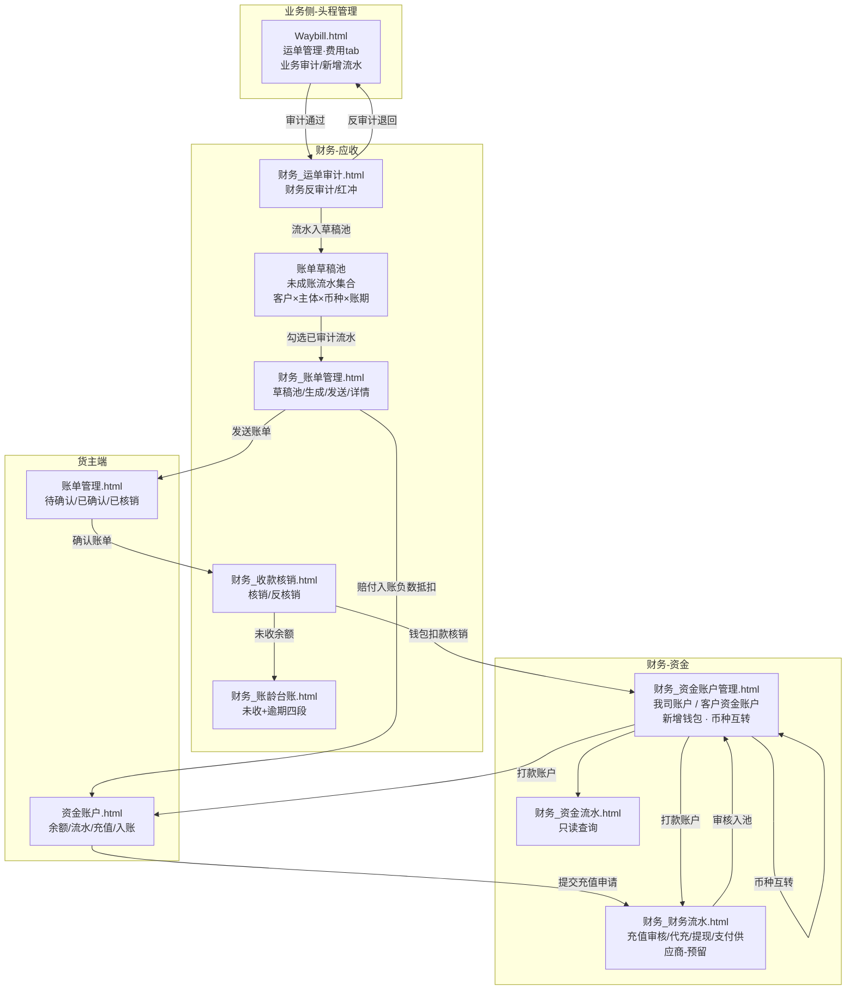

# PRD — 财务模块（Phase 1：应收管理 + 资金账户）

> **文档版本**：v1.1 ｜ **状态**：草稿（待评审） ｜ **作者**：飞点产品 ｜ **日期**：2026-09-14
> **上游**：RDD v1.1（应收 + 资金账户定稿）、数据设计 v0.4
> **范围**：Phase 1 = 应收管理（流程一~三）+ 资金账户（流程四，含入账记录），共 2 模块 16 项功能 / 18 条 AC。应付管理、对账中心、毛利分析、开票归 Phase 2；实际成本核算归 Phase 3。

---

## 0. 文档基础信息

| 项 | 内容 |
|:---|:---|
| 文档标题 | 财务模块产品需求文档（Phase 1：应收管理 + 资金账户） |
| 版本号 | v1.1 |
| 状态 | 草稿（待评审） |
| 作者 | 飞点产品 |
| 评审人 | 产品 / 研发 / 测试 / 财务业务代表 |
| 计划里程碑 | 评审日期、提测日期、上线日期待评审后确定 |

### 0.1 关联链接

| 文档 | 路径 |
|:---|:---|
| 用户需求 (RDD) | `drafts/财务/2026-09-14-用户需求.md`（v1.1 定稿） |
| 数据设计 | `drafts/财务/2026-09-14-数据设计.md`（v0.4） |
| 需求背景 | `analysis/2026-06-16-财务与系统调研结论.md` |
| 原型 · 员工端 | `demo/员工端-demo/` → `财务_运单审计.html`、`财务_账单管理.html`、`财务_收款核销.html`、`财务_账龄台账.html`、`财务_资金账户管理.html`、`财务_资金流水.html`、`财务_财务流水.html`（7 页） |
| 原型 · 货主端 | `demo/货主端-demo/` → `资金账户.html`、`账单管理.html`（2 页） |
| 关联模块 | 头程管理（`Waybill.html` 业务侧审计、`fee_type` 费用类型）、客商中心（合同账期、客户等级）、超级运价（当周批次公布价 + 三张优惠表 + 附加费规则）、基础资料（主体/币种） |

---

## 1. 需求定义

### 1.1 背景与现状

飞点 5 家公司（广州飞点、深圳飞点、广东飞点、香港富力顿、墨链）税务上独立法人、实际一个家族，当前财务核算**完全依赖线下 Excel**：客户打款与应收账单靠财务手工核对，钱进来不知道冲哪张账单；账期到了不知道哪些客户逾期、逾期多久；多主体、多币种的资金往来靠手工分账，极易混账。

计费侧依赖超级运价的当周公布价与附加费规则，但运单收货完成后，**应收金额 → 业务流水审计 → 账单 → 收款核销 → 账龄**这一整条链路没有系统承载，财务只能线下追着业务要数据、手工算账；客户端也缺少线上确认账单与充值的入口。

### 1.2 目标与成功口径

- **目标**：运单收货后，在系统内完成「业务流水审计 → 生成账单 → 客户确认 → 收款核销 → 账龄跟踪」闭环，且每一笔钱强制挂到具体主体与币种，不混账、可追溯。
- **成功口径**：

| 指标 | 数据来源 | 评估窗口 |
|:---|:---|:---|
| 应收流水系统生成率（收货运单中自动生成流水的占比）≥ 95% | `ar_flow` 按运单去重 / 运单模块已收货运单数 | 上线后 1 个月 |
| 账单线上确认率（已发送账单中被客户线上确认的占比）≥ 70% | `ar_bill` status=已确认(30) / status≥已发送(20) | 上线后 2 个月 |
| 核销覆盖率（已确认账单中被核销的金额占比）≥ 90% | `ar_writeoff` 累计金额 / `ar_bill` 已确认总额 | 上线后 2 个月 |
| 逾期未收占比（逾期 90+ 未收金额占比）≤ 5% | 账龄台账 | 上线后 3 个月 |
| 财务手工对账工时下降 ≥ 50% | 财务线下工时统计（人工记录） | 上线后 2 个月 |

### 1.3 范围与边界

**In Scope（本期 P0，16 项）**

- 应收管理：A1 业务流水生成、A2 业务审计 + 财务反审计、A3 反审计/红冲纠错、A4 账单生成、A5 账单发送 + 客户确认、A6 收款核销（同币种/部分/反核销）、A7 账龄台账
- 资金账户：B1 钱包开通、B2 充值审核（含财务代充）、B3 币种互转、B4 客户提现、B5 我方银行账户管理、B6 资金流水查询、B7 入账记录（赔付待入账 → 账单抵扣）

**Out of Scope（本期不做 + 原因）**

| 排除项 | 原因 / 归属 |
|:---|:---|
| 应付管理、对账中心、毛利分析、开票 | Phase 2（`财务_财务流水.html` 已预留「支付供应商」入口空态） |
| 实际成本核算（实际成本 vs 成本预估） | Phase 3 |
| 在线付款（支付渠道） | 钱包与支付渠道解耦，未来只加渠道、钱包不动 |
| 进账↔账单核销关系表、自动核销 | 池化模型一期够用，待在线付款上线后做 |
| 银行流水自动识别入账 | Phase 2（一期财务线下核对银行流水后人工审核） |
| 线上账单异议 | 异议走线下/工单，财务重新生成账单再发 |
| 汇率配置维护与汇率历史表 | 汇率调阿里汇率接口实时获取，不自建汇率表 |
| 汇损记账 | 跨币种互转一期直接转，不记汇损 |
| 导出能力 | 需求已登记、原型入口先出（员工端 7 个财务列表页「导出」按钮，点击提示开发中）；导出页面与字段范围待单独讨论，Phase 2 随对账中心统一实现 |

### 1.4 影响范围

- **影响角色**：财务专员（主）、业务专员（运单侧审计）、运营（赔付流水）、客户/货主端用户（账单确认、充值）、系统自动任务
- **依赖系统/模块**：

| 依赖 | 依赖内容 | 缺失时的影响 |
|:---|:---|:---|
| 头程管理（运单模块） | 收货完成事件、运单号、业务侧审计（`Waybill.html` 费用 tab） | 无法触发生成流水 |
| 超级运价 | 当周批次公布价、附加费规则、三张优惠表（运费优惠 / 泡比优惠 / 附加费优惠）、服务组合成本 | 取价失败 → 走手工新增（数据来源=操作人） |
| 客商中心 | 客户、合同账期（`customer_contract.payment_term` / 账单周期）、签约主体 | 无法推导账单日与账期天数 |
| 头程管理 `fee_type` | 费用类型字典（含 `is_credit` 赔付标记、`credit_type`） | 无法生成分类流水与入账记录 |
| 基础资料 | 主体（5 账套）、币种 | 无法隔离主体 |
| 阿里汇率接口 | 实时汇率（币种互转） | 降级为手工填写（来源=手工覆盖），不阻断业务 |

---

## 2. 枚举字典 ★ 研发必读

> 与数据设计 v0.4 Schema 的 TinyInt 值保持一致；跨模块枚举以来源模块为准，财务不重复定义。

### 2.1 财务自有枚举

| 枚举名 | 值 | 常量名 | 中文 | 适用实体 |
|:---|:---:|:---|:---|:---|
| FlowCategory | 10 | AR | 应收 | `ar_flow.flow_category` |
| FlowCategory | 20 | AP | 应付 | 同上（**Phase 1 仅实现应收，应付为预留枚举**） |
| FlowCategory | 30 | SALES_COMMISSION | 销售提成 | 同上（Phase 1 预留） |
| AuditStatus | 10 | PENDING_BIZ_AUDIT | 待业务审计 | `ar_flow.audit_status` |
| AuditStatus | 20 | AUDITED | 已审计 | 同上 |
| AuditStatus | 30 | REVERSED | 已红冲 | 同上 |
| BillStatus | 10 | GENERATED | 已生成 | `ar_bill.status` |
| BillStatus | 20 | SENT | 已发送 | 同上 |
| BillStatus | 30 | CONFIRMED | 已确认 | 同上 |
| BillStatus | 40 | PARTIAL_WRITEOFF | 部分核销 | 同上 |
| BillStatus | 50 | WRITTEN_OFF | 已核销 | 同上 |
| BillStatus | 60 | WRITEOFF_REVERSED | 已反核销 | 同上 |
| WriteoffType | 10 | WRITEOFF | 核销 | `ar_writeoff.writeoff_type` |
| WriteoffType | 20 | REVERSE_WRITEOFF | 反核销 | 同上 |
| WalletFlowType | 10 | RECHARGE | 充值 | `wallet_flow.flow_type` |
| WalletFlowType | 20 | RECHARGE_REFUND | 充值退回 | 同上 |
| WalletFlowType | 30 | WITHDRAW | 提现 | 同上 |
| WalletFlowType | 40 | WRITEOFF | 核销 | 同上 |
| WalletFlowType | 50 | WRITEOFF_CANCEL | 核销撤销 | 同上 |
| WalletFlowType | 60 | CURRENCY_TRANSFER | 转汇 | 同上 |
| RechargeStatus | 10 | PENDING | 待审核 | `recharge_apply.status` |
| RechargeStatus | 20 | APPROVED | 已通过 | 同上 |
| RechargeStatus | 30 | REJECTED | 已驳回 | 同上 |
| CreditRecordStatus | 10 | PENDING_BOOK | 待入账 | `credit_record.status` |
| CreditRecordStatus | 20 | BOOKED | 已入账 | 同上 |
| RateSource | 10 | API | 接口实时 | `currency_transfer.rate_source` |
| RateSource | 20 | MANUAL | 手工覆盖 | 同上 |
| BankAccountStatus | 10 | ENABLED | 启用 | `bank_account.status` |
| BankAccountStatus | 20 | DISABLED | 停用 | 同上 |
| WalletDefault | true / false | — | 默认钱包 / 非默认 | `customer_wallet.is_default`（系统字段，员工端与货主端均不展示，二期「默认支付钱包」预留） |
| WalletOpenSource | 10 | SYSTEM | 系统自动 | `customer_wallet.open_source`（合同签约完成自动开通） |
| WalletOpenSource | 20 | MANUAL | 财务手工 | 同上（财务补开币种钱包） |

**账单号主体代码**（用于 `ar_bill.bill_no` 拼接，与主体一一对应）：

| 主体 | 主体代码 | 账单号示例 |
|:---|:---:|:---|
| 广州飞点 | GZ | `AR-GZ-202608-001` |
| 深圳飞点 | SZ | `AR-SZ-202608-001` |
| 广东飞点 | GD | `AR-GD-202608-001` |
| 香港富力顿 | HK | `AR-HK-202608-001` |
| 墨链 | ML | `AR-ML-202608-001` |

### 2.2 引用其他模块的枚举（财务不重复定义）

| 枚举名 | 来源 | 值 / 取值 | 适用实体 |
|:---|:---|:---|:---|
| 主体（账套） | 基础资料 / 客商中心 `contract_company` | 10 广州飞点 / 20 深圳飞点 / 30 广东飞点 / 40 香港富力顿 / 50 墨链 | `ar_flow.entity_id`、`ar_bill.entity_id`、`customer_wallet.entity_id`、`bank_account.entity_id`、`credit_record.entity_id` |
| 签约账期类型 | 客商中心 `customer_contract.payment_term` | 101 月结 / 102 双月结 / 103 三月结 / 201 周结 / 202 到港前结 / 203 签收月结 / 204 到海外仓结 / 205 签收结 | `ar_flow.payment_terms_type` |
| 费用类型 | 头程管理 `fee_type`（同方向名称唯一） | 运费 / 周六派送费 / 超重费 / 地址附加费 / 商品附加费 / 报关费 / 库内贴标费… | `ar_flow.fee_type_id` |
| 赔付类型 | 头程管理 `fee_type.credit_type`（引用系统枚举配置，可自定义） | 超时赔付 / 丢件赔付 / 货损赔偿 | `credit_record.credit_type` |
| 客户 | 客商中心 | 按客户档案 | `ar_flow.customer_id` 等 |
| 币种 | 基础资料币种字典 | CNY 人民币 / USD 美元 / HKD 港币 / EUR 欧元 / PHP 比索 / JPY 日元 | 全部金额实体 |
| 汇率 | 阿里汇率接口（实时获取） | 接口返回值，人民币=1 基准 | `ar_flow.rate`、`currency_transfer.api_rate` |

---

## 3. 状态机 ★ 研发必读

### 3.1 业务流水 `ar_flow.audit_status`（单审计 + 反审计）

```
待业务审计(10) ──业务整单审计通过──→ 已审计(20)
已审计(20) ──财务反审计（未关联账单）──→ 待业务审计(10)
已审计(20) ──财务反审计（已关联账单）──→ 已红冲(30)
已红冲(30) ──新增红冲流水（负数冲抵）+ 正数重开──→ 待业务审计(10)
```

| 当前状态 | 操作 | 目标状态 | 触发角色 | 校验条件 |
|:---|:---|:---|:---|:---|
| 待业务审计(10) | 整单审计通过 | 已审计(20) | 业务专员（`Waybill.html` 费用 tab） | 运单下全部流水已逐条核对/修改完成 |
| 已审计(20) | 反审计（运单级 / 大类级） | 待业务审计(10) | 财务专员（`财务_运单审计.html`） | 该流水或该大类**未关联账单**（`bill_id` 为空） |
| 已审计(20) | 反审计（运单级，强制） | 已红冲(30) | 财务专员 | 已关联账单；该大类不可单独反审计，只能反审计整个运单 |
| 已红冲(30) | 新增红冲流水 | 待业务审计(10) | 业务专员 | 原流水留痕，负数冲抵 + 正数重开，红冲流水归下一期账单 |

> **账单草稿池（不新增状态）**：`bill_id` 为空且 `audit_status ≠ 已红冲(30)` 的流水即处于账单草稿池；**只有已审计(20) 可被勾选成账**，待业务审计(10) 的流水在池内可见但不可选（提示「该流水尚未完成业务审计」）。

### 3.2 应收账单 `ar_bill.status`

```
已生成(10) ──发送客户──→ 已发送(20) ──客户确认──→ 已确认(30)
已确认(30) ──核销（部分）──→ 部分核销(40) ──核销（补足）──→ 已核销(50)
部分核销(40) ──反核销──→ 已反核销(60) ──重新核销──→ 部分核销(40) / 已核销(50)
已核销(50) ──反核销──→ 已反核销(60)
```

| 当前状态 | 操作 | 目标状态 | 触发角色 | 校验条件 |
|:---|:---|:---|:---|:---|
| 已生成(10) | 发送客户 | 已发送(20) | 财务专员 | 账单下全部流水已审计（`audit_status=20`） |
| 已发送(20) | 确认账单 | 已确认(30) | 客户（货主端） | 账单为当前客户的账单；确认后回写 `confirmed_at` |
| 已确认(30) | 核销（金额 < 未收） | 部分核销(40) | 财务专员 | 钱包与账单币种一致、钱包余额 > 0 |
| 已确认(30) / 部分核销(40) | 核销（金额 = 未收） | 已核销(50) | 财务专员 | 同上，且核销后 `unreceived_amount = 0` |
| 部分核销(40) / 已核销(50) | 反核销 | 已反核销(60) | 财务专员 | 未做账账单均可反核销，不加审批，留日志 |
| 已反核销(60) | 重新核销 | 部分核销(40) / 已核销(50) | 财务专员 | 同上核销校验 |

### 3.3 充值申请 `recharge_apply.status`

```
待审核(10) ──财务审核通过（核对银行流水到账）──→ 已通过(20)
待审核(10) ──财务驳回──→ 已驳回(30)
```

| 当前状态 | 操作 | 目标状态 | 触发角色 | 校验条件 |
|:---|:---|:---|:---|:---|
| 待审核(10) | 通过并入池 | 已通过(20) | 财务专员（`财务_财务流水.html` 充值审核 tab） | 已线下核对银行流水到账；通过后生成充值资金流水并增加钱包余额 |
| 待审核(10) | 驳回 | 已驳回(30) | 财务专员 | 未到账 / 信息不符；驳回不产生资金流水 |
| 已通过(20) | 充值退回 | 已通过(20)（新增 `wallet_flow` 反向流水） | 财务专员 | 事实记录不可改，靠反向流水纠正 |

### 3.4 入账记录 `credit_record.status`

```
待入账(10) ──账单生成时归最新一期账单、按负数抵扣──→ 已入账(20)
```

| 当前状态 | 操作 | 目标状态 | 触发角色 | 校验条件 |
|:---|:---|:---|:---|:---|
| 待入账(10) | 归入最新一期账单抵扣 | 已入账(20) | 系统自动（账单生成时） | 赔付流水已审计；归入后回写 `bill_id` / `booked_at`，**归入后不可改期** |
| 待入账(10) | 币种纠错 | 待入账(10)（记录被删除重建） | 财务 + 业务 | 财务反审计运单 → 业务删除错误赔付流水 → 重新添加正确币种流水 → 重新整单审计 |
| 待入账(10) | 客户放弃索赔 | 待入账(10)（新增反向负数记录） | 运营 | 加一条反向负数赔付记录冲抵，两条留痕、净额归 0 |

### 3.5 我方银行账户 `bank_account.status`

```
启用(10) ──停用──→ 停用(20) ──启用──→ 启用(10)
```

| 当前状态 | 操作 | 目标状态 | 触发角色 | 校验条件 |
|:---|:---|:---|:---|:---|
| 启用(10) | 停用 | 停用(20) | 财务专员 | 停用后不再作为充值可选的打款账户；历史引用不受影响 |
| 停用(20) | 启用 | 启用(10) | 财务专员 | — |

---

## 4. 功能清单与页面映射

| 模块 | 功能点 | 优先级 | 对应页面 | 页面类型 |
|:---|:---|:---:|:---|:---|
| A 应收管理 | A1 业务流水生成（运单收货自动，逐行生成含优惠行） | P0 | 无页面（系统自动）；结果展示于 `Waybill.html` 费用 tab | 后台任务 |
| A 应收管理 | A2 业务审计 + 财务反审计 | P0 | `财务_运单审计.html`（财务侧）+ `Waybill.html` 费用 tab（业务侧） | 列表页 + 审计台 |
| A 应收管理 | A3 反审计 / 红冲纠错 | P0 | `财务_运单审计.html` | 列表页 |
| A 应收管理 | A4 账单草稿池 + 账单生成（聚合已审计流水） | P0 | `财务_账单管理.html`（草稿池 Tab + 生成弹窗） | 列表页 + 生成弹窗 |
| A 应收管理 | A5 账单发送 + 客户确认 | P0 | `财务_账单管理.html` + 货主端 `账单管理.html` | 列表页 |
| A 应收管理 | A6 收款核销（同币种 / 部分 / 反核销） | P0 | `财务_收款核销.html` | 列表页 + 核销弹窗 |
| A 应收管理 | A7 账龄台账 | P0 | `财务_账龄台账.html` | 查询页（实时视图） |
| B 资金账户 | B1 钱包开通（合同签约自动 + 财务手工补开币种） | P0 | `财务_资金账户管理.html`（客户资金账户 Tab · 新增钱包弹窗） | 列表页 + 新增弹窗 |
| B 资金账户 | B2 充值审核（客户申请审核 + 财务代充） | P0 | `财务_财务流水.html`（充值审核 / 客户充值 tab）+ 货主端 `资金账户.html`（充值） | 工作台 |
| B 资金账户 | B3 币种互转 | P0 | `财务_资金账户管理.html`（客户资金账户 Tab · 币种互转弹窗） | 弹窗 |
| B 资金账户 | B4 客户提现 | P0 | `财务_财务流水.html`（客户提现 tab） | 工作台 |
| B 资金账户 | B5 我司银行账户管理（可见开关 / 默认 / 停用） | P0 | `财务_资金账户管理.html`（我司账户 Tab） | 列表页 + 弹窗 |
| B 资金账户 | B6 资金流水查询 | P0 | `财务_资金流水.html` + 货主端 `资金账户.html`（资金流水 tab） | 查询页 |
| B 资金账户 | B7 入账记录（赔付待入账 → 账单抵扣） | P0 | 无页面（系统自动）；结果展示于货主端 `资金账户.html` 入账记录 tab | 后台任务 |

> **页面构成说明**：B1/B3/B5 由同一页 `财务_资金账户管理.html` 承载（双 Tab：我司账户 / 客户资金账户），员工端「财务 → 资金账户管理」菜单与权限点已注册；原「钱包」菜单已并入本页并下线。

### 4.1 页面导航关系图 ★



---

## 5. 页面规格 ★ 研发必读

> 页面顺序 = 业务流顺序。原型均为 Vue3 + Element Plus 单文件页，主题色 `#2DA44E`，金额统一「千分位 + 强制两位小数」+ 币种符号前缀，币种列显示中文名，无值显示 `—`。
> **导出入口（Phase 1 占位）**：员工端 7 个财务列表页的查询区在「重置」后统一有「导出」按钮，点击提示「导出功能开发中，导出范围待确认」——需求已登记，具体导出页面与字段范围后续单独讨论（见 §1.3 / §12.4 D02）。
> **多 Tab 页面查询区规范**（全模块统一，已写入前端规范 `style-guide.md`）：查询区统一位于 **Tab 上方**（上层独立卡片），条件按当前 Tab 切换、不同 Tab 用各自的筛选状态对象（互不清空）；当前 Tab 无查询条件时整个查询区不渲染。**查询条件 >3 个时默认只显示前 3 个**，其余收进「更多」（展开/收起切换）。按钮顺序统一为：查询 → 重置 → 更多（有则）→ 导出（有则）→ 右侧主操作按钮（新增账户/新增钱包/生成账单等）。

### 5.1 运单审计（员工端 · 财务侧）

**页面信息**

- 路径：财务中心 / 运单审计
- 类型：列表页（单表 + 分页，无 Tab）
- 访问角色：财务专员（反审计仅财务可操作）
- 顶部区域：仅查询筛选条，无统计卡/概览条/提示条

**查询条件**

| 字段名 | 中文名 | 类型 | 默认值 | 选项 / 规则 |
|:---|:---|:---|:---|:---|
| waybillNo | 运单号 | Input（clearable，宽 180） | 空 | 模糊匹配 |
| customerName | 客户名称 | Input（clearable，宽 200） | 空 | 模糊匹配 |
| linked | 是否关联账单 | Select（clearable，宽 150） | 空 | `已关联账单`(linked) / `未关联账单`(unlinked)，精确 |

**列表列**

| 序 | 列标题 | 字段 | 对齐 | 格式化 / 规则 | 宽度 |
|:---:|:---|:---|:---|:---|:---|
| 1 | 运单号 | waybillNo | 左 | — | min 150 |
| 2 | 客户 | customerName | 左 | 溢出 tooltip | min 190 |
| 3 | 主体 | entityName | 左 | — | min 110 |
| 4 | 审计人/时间 | auditBy · auditAt | 左 | 格式 `审计人 · 时间` | min 160 |
| 5 | 关联账单 | linked | 中 | `el-tag`：已关联账单=danger-warning（`warning`）、未关联账单=`success` | min 110 |
| 6 | 操作 | — | 中 | 固定右侧 | 170 |

**交互行为**

- [详情]：打开「运单详情」弹窗（只读）
- [反审计]：打开「反审计」弹窗（默认范围=反审计整个运单）
- [查询 / 重置]：Toast「执行查询」；重置清空三项，无 Toast

**弹窗 1：反审计**（宽 640）

- 只读区「运单信息」（两列）：运单号 / 客户 / 主体 / 审计人（`审计人 · 时间`）
- 表单区「选择反审计范围」（`el-radio-group`）：

| 字段名 | 中文名 | 类型 | 默认值 | 规则 |
|:---|:---|:---|:---|:---|
| reverseScope | 反审计整个运单 | Radio | **选中** | value=`whole` |
| reverseScope | 反审计指定大类 | Radio | 未选 | value=`category`；选中后必须勾选具体大类 |

- 明细表（业务流水大类）：业务流水大类 / 金额（右对齐，无币种符号）/ 关联账单（`el-tag`：已关联账单=warning、未关联账单=success）/ 选择（**仅 `category` 模式显示**）
  - 选择列联动：未关联账单 → 可选 `el-radio`；已关联账单 → 锁图标（`#C0C4CC`）+ tooltip `已关联账单，不可单独反审计`
- 提示条（运单存在已关联账单流水时显示，橙底 `#fdf6ec` / 字色 `#E6A23C`）：`该运单存在已关联账单的业务流水，已关联账单的流水不可反审计，只能反审计整个运单后新增流水（红冲）。`
- 提交校验：`category` 模式未勾选大类 → 警告「请选择要反审计的大类」
- 二次确认（`ElMessageBox.confirm`，type warning）：标题 `反审计`，正文 `确认反审计 {运单号} 的{整个运单 /「{大类}」大类}？反审计后退回业务侧重新审计。`，确认按钮 `确认反审计`
- 成功 Toast：`反审计成功，已退回业务侧重新审计`
- 底部按钮：取消 / 确认反审计（danger）

**弹窗 2：运单详情**（宽 720）

- 只读区「运单信息」：运单号 / 客户 / 主体 / 审计人
- 明细表「业务流水大类」：大类 / 金额（右对齐）/ 关联账单（tag）
- 底部按钮：关 闭

**关联接口**

- 查询：`GET /api/finance/waybill-audits`（params: waybillNo, customerName, linked, page, pageSize）
- 详情：`GET /api/finance/waybill-audits/{waybillId}`（返回各大类金额与关联账单标记）
- 反审计：`POST /api/finance/waybill-audits/{waybillId}/reverse`（body: scope=whole|category, category）

### 5.2 账单管理（员工端 · 财务侧）

**页面信息**

- 路径：财务中心 / 账单管理
- 类型：四 Tab 列表页（草稿池 + 三状态）+ 生成入口
- 访问角色：财务专员
- 顶部区域：`生成账单` 按钮 + 灰色说明 `运单收货生成的应收流水先进入账单草稿池；财务按 客户×主体×账期×币种 聚合已锁定的业务流水生成账单`

**Tab 结构**

| Tab 名称 | 归属规则 | 查询区 | 行操作 |
|:---|:---|:---|:---|
| 草稿池 (N) | `bill_id` 为空且 `audit_status ≠ 已红冲(30)` 的**流水**，按 客户 × 主体 × 币种 × 账期 分组 | 客户（模糊，宽 180） | 生成账单 / 查看流水 |
| 待发送 (N) | `status = 已生成` | 账单号（模糊，宽 180） | 详情 / 发送客户 |
| 已发送 (N) | `status ∈ {已发送, 已确认, 部分核销}` | 无 | 详情 |
| 已核销 (N) | `status = 已核销` | 无 | 详情 |

**列表列**

| Tab | 列 |
|:---|:---|
| 草稿池 | 客户(190, tooltip) / 主体(110) / 币种(中,80,中文名) / 账期（账单日 + 账期天数，160）/ 流水条数(中,90) / 可成账金额(右,130，仅已审计) / 待审计金额(右,120，为 0 时显示「—」) / 操作(150, fixed) |
| 待发送 | 账单号(170) / 客户(190, tooltip) / 主体(110) / 币种(中,80,中文名) / 账单日(100) / 账单金额(右,120) / 操作(170, fixed) |
| 已发送 | 账单号 / 客户 / 主体 / 币种 / 账单日 / 账单金额 / 已核销(右) / 状态(中, tag) / 操作(100, fixed) |
| 已核销 | 账单号 / 客户 / 主体 / 币种 / 账单日 / 账单金额 / 状态(中, tag 固定 success) / 操作(100, fixed) |

状态 tag（已发送 Tab，`statusTag()` 映射）：已发送=primary、已确认=primary、部分核销=warning，兜底 info。

**弹窗 1：生成账单**（宽 680，`label-position: top`，两列布局）

| 字段名 | 中文名 | 类型 | 必填 | 校验文案 | 联动 |
|:---|:---|:---|:---:|:---|:---|
| customerId | 客户 | Select（filterable） | ✅ | 请填写完整的账单信息 | 与主体/币种共同过滤可聚合流水 |
| entityId | 主体 | Select | ✅ | 同上 | 决定账单号主体代码 |
| currency | 币种 | Select | ✅ | 同上 | 决定金额符号，聚合同币种流水 |
| billingDate | 账单日 | Date（`YYYY-MM-DD`） | ✅ | 同上 | 取 `YYYYMM` 生成账单号账期段 |
| paymentTermsDays | 账期天数 | 只读（合同账期存在时）/ InputNumber（合同账期为空时，必填） | 条件 | 合同账期未完善，请补录账期天数 | 来源 = 客商中心合同账期；为空时由财务补录，账单标记「账期手工补录」 |

- 只读区「可聚合业务流水」（表格 `max-height: 240`）：运单号 / 费用类型 / 流水种类 / 金额（右对齐，**带符号**：优惠行显示 `-¥X` / `+¥X`）
- 汇总文案：`聚合流水 {N} 条，账单总额：{币种符号}{金额}`
- 提交校验：① 四项任一为空 → 警告「请填写完整的账单信息」；② 合同账期为空且未补录账期天数 → 警告「该主体合同账期未完善，请补录账期天数」；③ 无可聚合流水 → 警告「该条件下没有可聚合的已锁定业务流水」
- 账期字段联动：合同账期存在 → 「账期天数」只读展示「{N} 天（来自合同账期）」；合同账期为空（如香港线下签约）→ 可编辑必填 + 黄底提示「该客户在该主体下的合同账期未完善（账期主数据在客商中心「客户管理 → 合同/账期」维护）。此处补录的账期天数仅用于本账单的账龄计算，账单将标记为「账期手工补录」。」
- 提交结果：账单号 = `AR-{主体代码}-{YYYYMM}-{3位序号}`；账单总额 = Σ 各行金额（带符号）；已核销=0；状态=已生成；写入 `payment_terms_days` 与 `term_source`（合同账期 / 手工补录）；Toast「账单已生成」或「账单已生成（账期手工补录）」
- 底部按钮：取消 / 确认生成账单

**弹窗 2：账单详情**（宽 720）

- 只读区「账单信息」（两列×4 行）：账单号 / 客户 / 主体 / 币种 / 账单日 / 账单金额 / **账期天数**（格式 `{N} 天`）/ **账期来源**（合同账期 / 手工补录，为手工补录时前置橙 tag「账期手工补录」）
- 明细表「费用明细」：运单号 / 费用类型 / 流水种类 / 单价 / 计费量 / 金额（右，**带符号**：优惠行 `-¥X` / `+¥X`）/ 来源（规则名 / 报价 / 操作人）
- 底部按钮：关 闭

**交互行为**

- [发送客户]：仅「待发送」Tab；二次确认（type warning）：标题 `发送账单`，正文 `确认将账单 {账单号} 发送给客户「{客户}」？`，确认按钮 `发送` → 账单 `status=已发送`，Toast「账单已发送给客户」
- [查询 / 重置]：Toast「执行查询」；重置清空账单号

**关联接口**

- 列表：`GET /api/finance/bills`（params: status, billNo, page, pageSize）
- 账单草稿池：`GET /api/finance/ar-flows/draft-pool`（params: customerId, entityId, currency）→ 按 客户×主体×币种×账期 分组的未成账流水汇总（流水条数 / 可成账金额 / 待审计金额）+ 组内流水明细
- 可聚合流水：`GET /api/finance/ar-flows/generatable`（params: customerId, entityId, currency）→ 返回已审计且未关联账单的流水
- 生成账单：`POST /api/finance/bills`（body: customerId, entityId, currency, billingDate）
- 发送：`POST /api/finance/bills/{billNo}/send`
- 详情：`GET /api/finance/bills/{billNo}/details`

### 5.3 收款核销（员工端 · 财务侧）

**页面信息**

- 路径：财务中心 / 收款核销
- 类型：双 Tab 列表页 + 核销弹窗
- 访问角色：财务专员
- 顶部区域：无操作区/统计卡/提示条，页面直接以 Tab 开始

**Tab 结构**

| Tab 名称 | 归属规则 | 查询区 |
|:---|:---|:---|
| 待核销 (N) | `unreceived_amount > 0` | 账单号（模糊，180）、客户名称（模糊，200） |
| 核销记录 (N) | 全部核销/反核销记录 | 无 |

**待核销列表列**：账单号(170) / 客户(190, tooltip) / 主体(110) / 币种(中,80,中文名) / 账单金额(右,120) / 已核销(右,110) / 未收金额(右,120, 红色 `#F56C6C` 加粗) / 钱包余额(右,120) / 操作(100, fixed)

**核销记录列表列**：核销单号(150) / 账单号(170) / 客户(190, tooltip) / 币种(中,80) / 核销金额(右,120) / 类型(中,90, tag：核销=success、其他=warning) / 操作人(100) / 操作时间(150) / 操作(100, fixed)

**交互行为**

- [核销]：打开「收款核销」弹窗；默认金额 = `min(账单未收, 钱包余额)`
- [反核销]：**仅 `type = 核销` 的记录显示**；二次确认（type warning）：标题 `反核销`，正文 `确认反核销 {账单号} 的 {币种符号}{金额}？反核销后账单未收与钱包余额将回滚。`，确认按钮 `确认反核销` → 回滚账单已核销/未收、回补钱包余额、账单 `已核销 → 部分核销`、该核销记录类型置 `已反核销`，Toast「反核销成功」
- [查询 / 重置]：Toast「执行查询」；重置清空账单号与客户名称

**弹窗：收款核销**（宽 620）

- 只读区「账单信息」（两列×3 行）：账单号 / 客户 / 主体 / 币种 / 未收金额（红色加粗）/ 钱包余额
- 表单区「核销金额」：

| 字段名 | 中文名 | 类型 | 必填 | 默认值 | 校验 |
|:---|:---|:---|:---:|:---|:---|
| amount | 本次核销金额 | InputNumber（min 0.01，max = min(未收, 钱包余额)，precision 2，step 100） | ✅ | `min(未收, 钱包余额)` | 空或 ≤0 → 「请输入核销金额」；超上限 → 「核销金额不能超过 min(账单未收, 钱包余额)」 |

- 说明文案：`核销金额 = min(账单未收, 钱包余额)，钱包不可透支。可部分核销；本次最多可核销 {币种符号}{金额}。`
- 二次确认（type warning）：标题 `确认核销`，正文 `确认核销账单 {账单号} 金额 {币种符号}{金额}？`，确认按钮 `确认核销`
- 提交结果：账单 `已核销金额 += 本次`、`未收金额 -= 本次`（保留 2 位）；未收归零 → 账单 `已核销`；钱包余额扣减；新增核销记录（核销单号 `WO + YYYYMMDD + 序号`，类型=核销，操作人=当前财务）；Toast「核销成功」
- 底部按钮：取消 / 确认核销

**关联接口**

- 待核销列表：`GET /api/finance/bills`（params: unreceivedOnly=true, billNo, customerId）
- 核销记录：`GET /api/finance/writeoffs`（params: billNo, page, pageSize）
- 钱包余额：`GET /api/finance/wallets/balance`（params: customerId, entityId, currency）
- 核销：`POST /api/finance/writeoffs`（body: billId, walletId, amount）
- 反核销：`POST /api/finance/writeoffs/{id}/reverse`

### 5.4 账龄台账（员工端 · 财务侧）

**页面信息**

- 路径：财务中心 / 账龄台账
- 类型：查询/汇总页（客户×主体×币种汇总 + 明细弹窗，无 Tab）
- 访问角色：财务专员
- 顶部区域：查询筛选条，右端内嵌灰色口径说明 `账龄口径：账单日 + 账期天数（含首日），分币种不折算`

**查询条件**

| 字段名 | 中文名 | 类型 | 默认值 | 规则 |
|:---|:---|:---|:---|:---|
| customerName | 客户名称 | Input（clearable，200） | 空 | 模糊匹配 |
| entityId | 主体 | Select（clearable，140） | 空 | 5 主体，精确 |
| currency | 币种 | Select（clearable，130） | 空 | CNY/USD/HKD/EUR，精确 |

**列表列**（一行 = 客户 × 主体 × 币种）

| 序 | 列标题 | 字段 | 对齐 | 格式化 | 宽度 |
|:---:|:---|:---|:---|:---|:---|
| 1 | 客户 | customerName | 左 | 溢出 tooltip | 190 |
| 2 | 主体 | entityName | 左 | — | 110 |
| 3 | 币种 | currency | 中 | 中文名 | 80 |
| 4 | 未收总额 | total | 右 | 加粗 `#303133` | 130 |
| 5 | 未到期 | notDue | 右 | — | 110 |
| 6 | 逾期 0-30天 | due030 | 右 | 红色 `#F56C6C` | 120 |
| 7 | 逾期 31-60天 | due3160 | 右 | 红色 | 120 |
| 8 | 逾期 61-90天 | due6190 | 右 | 红色 | 120 |
| 9 | 逾期 90天以上 | due90 | 右 | 红色 | 120 |
| 10 | 操作 | — | 中 | 「明细」，fixed | 100 |

**交互行为**

- [明细]：打开「账龄明细」弹窗
- [查询 / 重置]：Toast「执行查询」；重置清空三项

**弹窗：账龄明细**（宽 860）

- 区标题（动态拼接）：`{客户} · {主体} · {币种中文名}`
- 明细表：账单号(170) / 账单日(100) / 账期(120，格式 `{N} 天`) / 未收金额(右,120) / 账龄段(中,110, tag：未到期=`success`、各逾期段=`danger`)
- 底部按钮：关 闭

**关联接口**

- 汇总：`GET /api/finance/aging`（params: customerName, entityId, currency）→ 按 客户×主体×币种 返回未收总额与五段金额
- 明细：`GET /api/finance/aging/details`（params: customerId, entityId, currency）→ 返回逐账单账期天数、未收金额与账龄段

### 5.5 资金账户管理（员工端 · 资金账户）★ 双 Tab

**页面信息**

- 路径：财务中心 / 资金账户管理
- 类型：列表页（双 Tab：我司账户 / 客户资金账户）
- 访问角色：财务专员
- 原型：`demo/员工端-demo/财务_资金账户管理.html`
- 设计意图：一个菜单看全「钱从哪进、记在谁名下」—— 「我司账户」= 客户的打款目标账户；「客户资金账户」= 钱到账后记在哪个客户钱包、欠多少、实际可用多少
- 菜单收敛：原「钱包」菜单已并入本页并下线（钱包的新增与币种互转仍在本页 Tab 2 完成），避免同一能力双入口

#### Tab 1「我司账户 (N)」

**查询条件**：账户主体（Select）、币种（Select）、账户名称 / 账号（Input 模糊）、用户是否可见（Select：可见 / 不可见）

**列表列**

| 序 | 列标题 | 字段 | 对齐 | 格式化 / 规则 | 宽度 |
|:---:|:---|:---|:---|:---|:---|
| 1 | 账户主体 | entity_id | 左 | 我司主体名称 | min 110 |
| 2 | 币种 | currency | 中 | 中文名 | 80 |
| 3 | 账户名称 | account_name | 左 | 开户名，溢出 tooltip | min 150 |
| 4 | 开户行 | bank_name | 左 | 溢出 tooltip | min 170 |
| 5 | 账号 | account_no | 左 | — | min 160 |
| 6 | 余额 | balance | 右 | `币种符号 + 千分位两位小数`，字重 500 | 140 |
| 7 | 用户是否可见 | is_visible_to_customer | 中 | `el-switch` 行内切换（停用行显示灰色 tag「已停用」） | 120 |
| 8 | 默认账户 | is_default | 中 | 是 → `el-tag success`「默认」；否 → 灰色 `—` | 100 |
| 9 | 操作 | — | 中 | 编辑 / 停用（停用行显示「启用」），fixed right | 140 |

**顶部提示条**：`我司账户按主体维护，一主体可多账户（单币种）。「用户是否可见」= 是 时，客户在货主端充值时可将该账户作为打款账户；默认打款账户必须可见。「余额」为财务手工维护的账面余额，非银行实时余额。`

**交互行为**

- [新增账户]：打开「新增银行账户」弹窗
- [编辑]：打开「编辑银行账户」弹窗（**账号置灰不可改**，账号为账户唯一标识）
- [用户是否可见]：行内 `el-switch` + 二次确认（设为不可见且该账户为默认 → **自动取消默认标记**并提示）
- [停用/启用]：二次确认（type warning）；停用时同时置 `可见=否`、`默认=否`，历史充值单与资金流水不受影响
- [查询 / 重置]：Toast「执行查询」；重置清空四项

#### Tab 2「客户资金账户 (N)」

**查询条件**

| 字段名 | 中文名 | 类型 | 默认值 | 选项 / 规则 |
|:---|:---|:---|:---|:---|
| customerName | 客户名称 | Input（clearable，宽 220） | 空 | 模糊匹配（`includes`） |
| entityId | 账户主体 | Select（clearable，宽 150） | 空 | 广州飞点 / 深圳飞点 / 广东飞点 / 香港富力顿 / 墨链，精确匹配 |
| currency | 币种 | Select（clearable，宽 140） | 空 | 人民币 / 美元 / 港币 / 欧元 / 比索 / 日元（CNY/USD/HKD/EUR/PHP/JPY），精确匹配 |

**列表列**（一行 = 客户 × 主体 × 币种）

| 序 | 列标题 | 字段 | 对齐 | 格式化 / 规则 | 宽度 |
|:---:|:---|:---|:---|:---|:---|
| 1 | 客户 | customerName | 左 | 溢出 tooltip | min 190 |
| 2 | 账户主体 | entityName | 左 | 我司主体名称 | min 110 |
| 3 | 币种 | currency | 中 | 显示中文名（如「人民币」） | min 80 |
| 4 | 账户名称 | accountName | 左 | `账号编号 + 空格 + 币种代码` | min 140 |
| 5 | 余额 | balance | 右 | `币种符号 + 千分位两位小数`，字重 500 | min 130 |
| 6 | 待核销欠款 | Σ 未收金额 | 右 | 同币种汇总（已确认未核销） | min 130 |
| 7 | 待确认账单 | Σ 账单总额（已发送） | 右 | 同币种汇总（已发客户未确认） | min 130 |
| 8 | 实际金额 | balance − 待核销欠款 | 右 | 负数红色带负号 | min 130 |
| 9 | 开通方式 | openSource | 中 | 系统自动 → `success`；财务手工 → `warning`（财务一眼看出人工补开的钱包） | min 110 |
| 10 | 操作 | — | 中 | 币种互转 / 查看流水，fixed right | 160 |

**顶部提示条**：`客户资金账户 = 客户 × 主体 × 币种，一行一个钱包。「实际金额 = 余额 − 待核销欠款」；客户敞口 = 待核销欠款 + 待确认账单。钱包余额不可透支；跨币种结算请先在行内做「币种互转」。`

**交互行为**

- [查询 / 重置]：Toast「执行查询」；重置清空 客户名称 / 账户主体 / 币种
- [新增钱包]：点击「新增钱包」→ 打开「新增钱包」弹窗（仅用于补开币种，人民币钱包由合同签约完成时系统自动开通）
- [币种互转]：行操作「币种互转」→ 打开「币种互转」弹窗（回填客户/账户主体/转出币种/余额，清空转出金额、转入币种、汇率）
- [查看流水]：行操作「查看流水」→ 打开「资金流水（客户资金账户）」只读弹窗
- [分页]：`el-pagination`（total/prev/pager/next）

**弹窗 1：新增钱包**（宽 560，`label-position: top`）

| 字段名 | 中文名 | 类型 | 必填 | 校验文案 | 联动 / 数据源 |
|:---|:---|:---|:---:|:---|:---|
| customerId | 客户 | Select（filterable） | ✅ | 请选择客户 | 选项 = 客户档案；变更时清空主体与币种 |
| entityId | 账户主体 | Select | ✅ | 请选择账户主体 | 选项 = **该客户签约过的主体**（`contract_company` 去重，`sign_status ∈ {签署中, 已签署, 已过期, 已解约}`）；未选客户时禁用；变更时清空币种 |
| currency | 币种 | Select | ✅ | 请选择币种 | 选项 = 该主体下**尚未开通**的币种（已开通的排除）；未选主体时禁用 |

- 提示文案（固定灰底）：`系统已在合同签约完成时自动开通该主体的人民币钱包，此处用于补开其他币种（如美元、港币）。主体仅可选择该客户签约过的主体（含已过期/已解约，用于存量账单结算与赔付入账）；未签约主体请先前往客商中心完成合同签约。`
- 条件提示（黄底，选中主体合同状态为已过期/已解约时显示）：`该主体的合同状态为「{已过期/已解约}」，本次开通的币种钱包将用于存量账单结算与赔付入账；系统不会自动停用该主体下已有钱包。`
- 提交校验：① 三项任一为空 → 警告「请填写完整信息」；② 主体不在该客户签约过的主体集合内 → 警告「**该客户未与该主体签约，请先在客商中心完成合同签约**」（**不设特批口子**）；③ 已存在同「客户 + 主体 + 币种」钱包 → 警告「该客户在该主体下已有该币种钱包」；④ 通过 → 新增钱包（余额 0、**开通方式=财务手工**）→ Toast「钱包已开通」
- 底部按钮：取消 / 确认开通

**弹窗 2：币种互转**（宽 620，`label-position: top`）

只读区（分区标题「转出信息」）：客户 / 账户主体 / 转出币种（含余额展示，格式 `币种中文名（余额 符号+金额）`）

表单区（分区标题「汇率与转入金额」）：

| 字段名 | 中文名 | 类型 | 必填 | 校验文案 | 备注 |
|:---|:---|:---|:---:|:---|:---|
| fromAmount | 转出金额 | InputNumber（min 0.01，precision 2，step 100） | ✅ | 请输入转出金额 | — |
| toCurrency | 转入币种 | Select | ✅ | 请选择转入币种 | 选项 = 同客户同主体下、币种 ≠ 转出币种的其他钱包；选择后自动以接口汇率预填「手工覆盖汇率」 |
| rate | 手工覆盖汇率 | InputNumber（min 0.000001，precision 6） | ✅ | 请输入汇率 | 默认 = 接口汇率 |
| — | 接口汇率（阿里实时获取） | 只读文本 | — | — | 无值时显示 `—` |
| — | 转入金额（自动计算） | 只读文本 | — | — | `转出金额 ÷ 汇率`，字重 500 |

- 说明文案：`汇率说明：汇率由阿里汇率接口实时获取并以「接口汇率」预填，可手工覆盖（接口超时/异常时手工填写，来源记为手工覆盖）；1 {转入币种} = {汇率} {转出币种}；转入金额 = 转出金额 ÷ 汇率。一期暂不记汇损。`
- 提交校验：① 三项任一为空 → 警告「请填写完整的互转信息」；② 转出金额 > 钱包余额 → 警告「转出金额不能大于钱包余额」；③ 二次确认（`ElMessageBox.confirm`，type warning）：`确认从 {主体} {转出币种} 钱包转出 {金额}，转入 {转入币种} 钱包 {转入金额}？`；④ 确认后转出钱包扣减、转入钱包增加，Toast「币种互转成功」
- 底部按钮：取消 / 确认互转

**弹窗 3：资金流水（客户资金账户）**（宽 720，只读）

- 分区「账户信息」：客户 / 账户主体 / 账户名称 / 币种 / 余额 / 待核销欠款 / 实际金额（负数红色带负号）
- 分区「资金流水」表：时间 / 流水类型（tag：充值=success、充值退回=info、提现=warning、账单核销=danger、账单核销撤销=success、转汇=primary）/ 变动金额（正数绿色前置 `+`，负数红色）/ 变动后余额 / 关联单号
- 底部按钮：关 闭

**关联接口**

- 客户资金账户列表：`GET /api/finance/wallets`（params: customerId, entityId, currency, page, pageSize）
- 新增钱包：`POST /api/finance/wallets`（body: customerId, entityId, currency；主体须为该客户签约过的主体）
- 客户签约主体：`GET /api/customer/contracts`（params: customerId）→ 主体下拉数据源
- 币种互转：`POST /api/finance/wallets/transfer`（body: fromWalletId, fromAmount, toWalletId, rate）
- 接口汇率：`GET /api/finance/exchange-rate`（params: fromCurrency, toCurrency）→ 阿里汇率接口代理
- 我司账户列表：`GET /api/finance/bank-accounts`（params: entityId, currency, keyword, visible, status）
- 我司账户新增 / 编辑：`POST` / `PUT /api/finance/bank-accounts`
- 可见性切换：`POST /api/finance/bank-accounts/{id}/visibility`（body: isVisibleToCustomer；置否时后端同时清空 `is_default`）
- 停用 / 启用：`POST /api/finance/bank-accounts/{id}/status`
- 钱包流水：`GET /api/finance/wallet-flows`（params: customerId, entityId, currency）

### 5.6 资金流水（员工端 · 资金账户）

**页面信息**

- 路径：财务中心 / 资金流水
- 类型：纯查询页（只读，无 Tab、无操作列、无弹窗）
- 访问角色：财务专员
- 顶部区域：无统计卡/概览条，仅一行搜索区

**查询条件**

| 字段名 | 中文名 | 类型 | 默认值 | 选项 / 规则 |
|:---|:---|:---|:---|:---|
| customerName | 客户名称 | Input（clearable，宽 200） | 空 | 模糊匹配 |
| entityId | 主体 | Select（clearable，宽 140） | 空 | 5 主体，精确 |
| currency | 币种 | Select（clearable，宽 130） | 空 | CNY/USD/HKD/EUR，精确 |
| flowType | 流水类型 | Select（clearable，宽 140） | 空 | 充值 / 充值退回 / 提现 / 账单核销 / 账单核销撤销 / 转汇，精确 |
| dateRange | 流水时间 | DatePicker（daterange，`YYYY-MM-DD`，`至`，宽 260） | 空 | 按流水时间日期部分闭区间比较 |

**列表列**

| 序 | 列标题 | 字段 | 对齐 | 格式化 / 规则 | 宽度 |
|:---:|:---|:---|:---|:---|:---|
| 1 | 流水时间 | time | 左 | `YYYY-MM-DD HH:mm` | min 150 |
| 2 | 客户 | customerName | 左 | 溢出 tooltip | min 190 |
| 3 | 主体 | entityName | 左 | — | min 110 |
| 4 | 币种 | currency | 中 | 中文名 | min 80 |
| 5 | 流水类型 | flowType | 中 | `el-tag`：充值=success、充值退回=info、提现=warning、账单核销=danger、账单核销撤销=success、转汇=primary，兜底 info | min 110 |
| 6 | 变动金额 | amount | 右 | 正数前置 `+` 且绿色（`#67C23A`），负数红色（`#F56C6C`） | min 120 |
| 7 | 变动后余额 | balanceAfter | 右 | `币种符号 + 千分位两位小数` | min 120 |
| 8 | 操作人 | operator | 左 | — | min 110 |
| 9 | 关联单号 | relatedNo | 左 | 充值 `FD…` / 核销 `WO…` / 转汇 `TR…` / 提现 `WD…` | min 150 |

**交互行为**

- [查询]：Toast「执行查询」，前端即时过滤（真实实现为服务端查询）
- [重置]：清空 客户名称 / 主体 / 币种 / 流水类型 / 时间范围
- 无行操作、无批量操作、无导出（本期明确不做导出）

**关联接口**

- 查询：`GET /api/finance/wallet-flows`（params: customerId, entityId, currency, flowType, startDate, endDate, page, pageSize）

### 5.7 财务流水（员工端 · 资金账户操作台）

**页面信息**

- 路径：财务中心 / 财务流水
- 类型：Tab 工作台（4 个 Tab）
- 访问角色：财务专员
- 顶部区域：无统计卡/概览条

**Tab 结构**

| Tab 名称 | 角标 | 内容 |
|:---|:---|:---|
| 充值审核 (N) | N = 待审核条数 | 查询区（客户名称 / 状态）+ 充值申请列表（详情 / 通过 / 驳回）+ 分页 |
| 客户充值 | 无 | 说明文字 + 「代客户充值」按钮 + 代充记录列表（无查询、无分页） |
| 客户提现 | 无 | 说明文字 + 「客户提现」按钮 + 提现记录列表（无查询、无分页） |
| 支付供应商 | 无 | **Phase 2 预留**：空态文案 `应付管理细节待展开，支付供应商功能后续上线` |

**Tab 1「充值审核」查询条件**：客户名称（Input，模糊）、状态（Select：待审核 / 已通过 / 已驳回，精确）

**Tab 1 列表列**

| 序 | 列标题 | 字段 | 对齐 | 格式化 / 规则 | 宽度 |
|:---:|:---|:---|:---|:---|:---|
| 1 | 充值单号 | applyNo | 左 | `FD + YYYYMMDD + 3位序号` | min 140 |
| 2 | 客户 | customerName | 左 | 溢出 tooltip | min 190 |
| 3 | 主体 | entityName | 左 | — | min 110 |
| 4 | 币种 | currency | 中 | 中文名 | min 80 |
| 5 | 金额 | amount | 右 | `币种符号 + 金额` | min 120 |
| 6 | 申请时间 | time | 左 | — | min 150 |
| 7 | 状态 | status | 中 | `el-tag`：已通过=success、待审核=warning、已驳回=danger | min 90 |
| 8 | 操作 | — | 中 | 固定右侧：详情 / 通过 / 驳回 | 170 |

**Tab 2「客户充值」列**：流水号 / 客户 / 主体 / 币种 / 金额 / 操作人 / 操作时间
**Tab 3「客户提现」列**：同 Tab 2

**交互行为**

- [详情]：打开「充值申请详情」弹窗（只读）
- [通过]：仅 `status=待审核` 显示；二次确认「充值审核通过 / 确认通过」：`确认已核对银行到账，将 {金额} 入池到「{客户}-{主体}-{币种}」钱包？` → Toast「已通过并入池」（生成充值资金流水 + 钱包加余额）
- [驳回]：仅 `status=待审核` 显示；二次确认「驳回充值 / 确认驳回」：`确认驳回该充值申请？` → Toast「已驳回」（不产生资金流水）
- [代客户充值]：打开「代客户充值」弹窗；说明文字 `客户线下打款到账后，财务在此手动为客户入池`
- [客户提现]：打开「客户提现」弹窗；说明文字 `客户线下申请提现，财务核对后在此扣减钱包余额`

**弹窗 1：充值申请详情**（宽 620，只读）

- 分区「申请信息」：充值单号 / 客户 / 主体 / 币种 / 金额 / 打款账户 / 申请时间 / 状态
- 分区「打款凭证」：凭证文件名 + 小字提示 `财务线下核对银行流水，确认到账后点击「通过」`
- 底部按钮：关闭 / 驳回（仅待审核）/ 通过并入池（仅待审核）

**弹窗 2：代客户充值**（宽 560）

| 字段名 | 中文名 | 类型 | 必填 | 校验文案 |
|:---|:---|:---|:---:|:---|
| customerId | 客户 | Select（filterable） | ✅ | 请选择客户 |
| entityId | 主体 | Select | ✅ | 请选择主体 |
| currency | 币种 | Select | ✅ | 请选择币种 |
| amount | 金额 | InputNumber（min 0.01，precision 2，step 100） | ✅ | 请输入金额 |

- 二次确认：`确认将 {金额} 入池到「{客户}-{主体}-{币种}」钱包？`（标题「确认代充」，确认按钮「确认入池」）→ Toast「已入池」
- 底部按钮：取消 / 确认入池

**弹窗 3：客户提现**（宽 560）

- 字段同「代客户充值」（客户 / 主体 / 币种 / 金额）
- 只读提示（客户+主体+币种均已选时显示）：`当前钱包余额：{币种符号}{金额}`
- 校验：① 四项任一为空 → 警告「请填写完整信息」；② 提现金额 > 当前钱包余额 → 警告「提现金额不能大于钱包余额」
- 二次确认：`确认从「{客户}-{主体}-{币种}」钱包提现 {金额}？`（标题「确认提现」）→ Toast「提现成功」（钱包扣减 + 生成提现资金流水）
- 底部按钮：取消 / 确认提现

**关联接口**

- 充值申请列表：`GET /api/finance/recharge-applies`（params: customerId, status, page, pageSize）
- 审核通过：`POST /api/finance/recharge-applies/{id}/approve`
- 驳回：`POST /api/finance/recharge-applies/{id}/reject`
- 代充：`POST /api/finance/wallets/recharge`（body: customerId, entityId, currency, amount）
- 提现：`POST /api/finance/wallets/withdraw`（body: customerId, entityId, currency, amount）
- 余额查询：`GET /api/finance/wallets/balance`（params: customerId, entityId, currency）
- 记录查询：`GET /api/finance/recharge-records`、`GET /api/finance/withdraw-records`

### 5.8 资金账户（货主端 · 财务中心）

**页面信息**

- 路径：财务中心 / 资金账户
- 类型：工作台 + 列表页（4 个 Tab）
- 访问角色：货主端客户用户

**Tab 结构**

| Tab 名称 | 角标 | 内容 |
|:---|:---|:---|
| 账户余额 | 无 | 概览条（标题「账户余额」+「充值」按钮）+ 钱包表格（客户×主体×币种），无查询、无分页、无行操作 |
| 资金流水 | 无 | 查询区（主体 / 流水类型 / 币种）+ 流水表格 + 分页 |
| 充值记录 (N) | N = 条数 | 充值申请列表（无查询、无分页） |
| 入账记录 (N) | N = 条数 | 我司退款/赔偿入账列表（只读，无查询、无分页） |

**Tab「账户余额」列**：账户主体 / 币种（中文名）/ 账户名称（`账号编号 币种代码`）/ 余额 / 待核销欠款 / 待确认账单 / 实际金额（`余额 − 待核销欠款`，负数红色带负号）

**Tab「资金流水」查询条件**：主体（5 主体）、流水类型（充值/充值退回/提现/账单核销/账单核销撤销/转汇）、币种（CNY/USD/HKD/EUR）
**Tab「资金流水」列**：时间 / 流水类型（tag）/ 主体 / 币种 / 变动金额（正数绿色前置 `+`，负数红色）/ 变动后余额

**Tab「充值记录」列**：充值单号 / 申请时间 / 主体 / 币种 / 充值金额 / 打款账户（溢出 tooltip）/ 状态（已通过=success、待审核=warning、其他=danger）

**Tab「入账记录」列**：记录编号 / 赔付类型 / 关联运单号 / 主体 / 币种 / 赔付金额 / 状态（已入账=success，否则 warning）/ 产生时间 / 入账时间（空显示 `—`）/ 关联账单号（空显示 `—`）

**交互行为**

- [充值]：点击「充值」→ 打开「充值」弹窗（宽 620）
- [查询 / 重置]：仅「资金流水」Tab；Toast「执行查询」，重置清空三项

**弹窗：充值**（宽 620，`label-position: top`）

| 字段名 | 中文名 | 类型 | 必填 | 校验文案 | 联动 |
|:---|:---|:---|:---:|:---|:---|
| entityId | 充值主体 | Select | ✅ | 请选择充值主体 | 选项 = **本人已开通资金账户（钱包）的主体**（去重），**与合同状态无关**（合同过期/解约后仍可充值结算）；无钱包时禁用；变更时清空币种与「打款账户」 |
| currency | 充值币种 | Select | ✅ | 请选择充值币种 | 选项 = 选中主体下**已开通的币种**；未选主体时禁用；变更时清空「打款账户」 |
| amount | 充值金额 | InputNumber（min 0.01，precision 2，step 100） | ✅ | 请输入充值金额 | — |
| bankAccountId | 打款账户 | Select | ✅ | 请选择打款账户 | 未选主体或币种时禁用；选项 = 主体与币种**同时匹配**的我方银行账户 |
| voucher | 打款凭证 | Upload（limit 1，accept `image/*,.pdf`） | ✅ | 请上传打款凭证 | 上传按钮「上传打款凭证」，tip：`请上传银行转账回单截图或 PDF，单个文件不超过 5MB` |

- 提示文案：`温馨提示：提交后财务将线下核对银行流水，审核通过后资金入账到对应钱包。审核通过前不会增加钱包余额。充值主体与币种仅显示您已开通的资金账户；如需开通其他主体或币种，请联系财务。`
- 提交：① 全字段非空兜底校验，任一为空 → 警告「请填写完整的充值信息并上传凭证」；② 生成充值单（`FD + YYYYMMDD + 3位序号`，状态=待审核）并置顶列表；③ Toast「充值申请已提交，等待财务审核」；④ 关闭弹窗并自动切到「充值记录」Tab；⑤ **不增加钱包余额**
- 底部按钮：取消 / 提交充值申请

**关联接口**

- 账户总览：`GET /api/finance/wallets/overview`（主体×币种聚合，含待核销欠款、待确认账单、实际金额）
- 资金流水：`GET /api/finance/wallet-flows`
- 充值记录：`GET /api/finance/recharge-applies`
- 入账记录：`GET /api/finance/credit-records`
- 我方银行账户（下拉）：`GET /api/finance/bank-accounts`（params: entityId, currency）
- 提交充值：`POST /api/finance/recharge-applies`（body: entityId, currency, amount, bankAccountId, voucherUrl）

### 5.9 账单管理（货主端 · 财务中心）

**页面信息**

- 路径：财务中心 / 账单管理
- 类型：列表页 + 详情弹窗
- 访问角色：货主端客户用户

**Tab 结构**

| Tab 名称 | 角标 | 查询区 | 行操作 |
|:---|:---|:---|:---|
| 待确认 (N) | 条数 | 账单号（模糊）+ 币种 | 查看详情 / 确认账单 |
| 已确认 (N) | 条数 | 账单号（模糊） | 查看详情 |
| 已核销 (N) | 条数 | 无 | 查看详情 |

> Tab 归类规则：`待确认` = status 待确认；`已确认` = status 已确认 **或** 部分核销（同一 Tab）；`已核销` = status 已核销。

**列表列**

| Tab | 列 |
|:---|:---|
| 待确认 | 账单号 / 账单日 / 主体 / 币种（中文名）/ 账单金额 / 未收金额（红色）/ 操作 |
| 已确认 | 账单号 / 账单日 / 主体 / 币种 / 账单金额 / 已核销 / 未收金额（红色）/ 状态（tag）/ 操作 |
| 已核销 | 账单号 / 账单日 / 主体 / 币种 / 账单金额 / 已核销 / 状态（tag）/ 操作（无「未收金额」列） |

状态 tag：待确认=warning、已确认=primary、部分核销=primary、已核销=success，兜底 info。

**弹窗：账单详情 / 确认账单**（宽 720，双模式，同一弹窗）

- 标题：`确认账单`（确认模式）/ `账单详情`（只读模式）
- 分区「账单信息」（两列只读）：账单号 / 主体 / 账单日 / 币种 / 账单金额 / 未收金额（红色）
- 分区「费用明细」表：运单号 / 费用类型 / 流水种类 / 单价 / 计费量 / 金额（右，**带符号**：优惠行显示 `-¥X` / `+¥X`）
- 确认模式提示条：`确认后视为认可本账单金额，账单将进入财务核销流程。如对账单有异议，请线下联系业务或提交工单，由财务重新生成账单。`
- 底部按钮：关 闭 / 确认账单（仅确认模式）

**交互行为**

- [查看详情]：只读打开弹窗
- [确认账单]：二次确认 `确认账单` / 正文 `确认后视为认可本账单金额，账单将进入财务核销流程。` → 确认后账单 `status=已确认`、写入确认时间、Toast「账单已确认」；取消 → 静默，弹窗保持打开
- [查询 / 重置]：Toast「执行查询」，前端即时过滤

**关联接口**

- 账单列表：`GET /api/finance/bills`（params: status, billNo, currency, page, pageSize）
- 账单明细：`GET /api/finance/bills/{billNo}/details`
- 确认账单：`POST /api/finance/bills/{billNo}/confirm`

---

## 6. 业务规则 ★ 研发必读

### 6.1 应收管理

| 编号 | 触发点 | 条件/公式 | 输出 | 异常处理 |
|:---|:---|:---|:---|:---|
| R01 | 运单收货完成 | 运单状态进入「已收货」 | 系统自动生成应收业务流水（粒度=运单，**一条费用项一行**）：运费 1 条 + 运费优惠 1 条 + 泡比优惠 1 条 + 各命中附加费各 1 条 + 各命中附加费优惠各 1 条；审计状态=待业务审计(10)，全部进入**账单草稿池** | 生成失败写后台任务失败记录，支持重试；不阻断运单流程 |
| R02 | 流水生成取价 | 运单绑定服务组合 → 按 **交货地（映射到交货地组）+ 重量段 + 仓库组** 匹配**当周批次（CURRENT）**的运价行 | 命中：写入单价（公布价）+ 金额 = 公布价 × 计费量，数据来源=报价、来源规则=运价行 | 未命中（私仓未做报价）：不自动生成运费行，由业务在 `Waybill.html` 手工新增，数据来源=操作人姓名 |
| R03 | 流水构成与费用类型 | 逐行生成，**优惠独立成行** | 费用类型取值：运费行=预置「运费」；运费优惠/泡比优惠/附加费优惠行=**优惠规则上配置的费用类型**；附加费行=**附加费规则计价明细「应收」行的费用类型** | 优惠规则未配置费用类型 → 该优惠行不生成并写后台任务告警；附加费规则缺失 → 不生成该费用行，不阻断 |
| R04 | 金额与应收净额 | 各行金额带符号：费用行为正；优惠行为 `优惠值 × 计费量`（负=减钱、正=加价） | 运单应收净额 = **Σ 各行金额的代数和**（不按「公布价 − 优惠」逐行算） | **自动生成行由计费引擎保证「任一费用项最终金额不得为负」**（超出时对负向优惠按比例截断，与报价侧同口径，见超级运价数据设计 §3.19）；业务**手工新增/调整**导致为负 → 照实写入并标红提示（不阻断） |
| R05 | 数量计费 | 费用类型关联附加费规则（单价，如库内贴标费 0.5 元/张）且业务填写数量 | `金额 = 单价 × 数量` 自动算并写入，计价单位=按数量 | 未填数量 → 阻止保存并提示「请输入数量」 |
| R06 | 数据来源 | 流水首次生成/首次手工创建时 | 记录第一次来源（报价 / 规则名 / 操作人姓名），并留痕**来源规则类型 + 规则ID**（供运单审计下钻） | 后续业务修改金额、币种、数量均**不改变**来源 |
| R07 | 业务侧审计 | 业务在 `Waybill.html` 费用 tab 逐条核对/修改/新增/删除后整单提交 | 整单全部流水置为已审计(20) | 任一流水未核对完成 → 阻断整单审计并定位到该行 |
| R08 | 财务反审计（未关联账单） | 财务在 `财务_运单审计.html` 选择「反审计整个运单」或「反审计指定大类」 | 对应流水回到待业务审计(10)，退回业务侧重改 | 大类级反审计时若该大类的**任一行**已关联账单 → 该大类选择项置灰（锁图标 + tooltip），阻断提交 |
| R09 | 财务反审计（已关联账单） | 运单下存在已关联账单的流水 | 仅允许「反审计整个运单」，且只能通过**红冲**纠错：新增负数流水冲抵 + 正数流水重开，原流水留痕，审计状态置已红冲(30)，红冲流水归下一期账单 | 已关联账单的大类不允许单独反审计，阻断并提示「已关联账单，不可单独反审计」 |
| R10 | 反审计权限 | 反审计操作 | 仅财务角色可执行 | 非财务角色调用 → 403，前端不渲染「反审计」按钮 |
| R51 | 优惠取数（实时匹配） | 流水生成时点 | 运费优惠/泡比优惠/附加费优惠**从超级运价三张优惠表实时匹配**（不进周批次快照）：运费优惠按 服务组合 ×（客户特批 > 客户等级）取一条生效规则；泡比优惠按 泡比 ≥ 密度阈值 取阈值最大档、仅命中 KG 计价行；附加费优惠按 附加费规则 × 目标匹配 | 无命中规则 → 不生成该优惠行；同一规则重复命中 → 按 §6.1 R54 去重 |
| R52 | 分节点生成 | 运单状态推进 | 字段匹配型附加费随**收货完成**生成；**字段&公式型附加费（如超重超长）在拣货实测后追加一行**（`generate_node=20`）；人工添加型由业务在运单费用 tab 手工新增（`generate_node=30`） | 拣货实测数据缺失 → 该费用行不生成，待实测后补生成，不阻断 |
| R53 | 重扫与冻结 | 运单信息变更 | `generate_node ∈ {10,20}` 且未审计的自动行**重算覆盖**（单价/计费量/金额/来源规则一并刷新）；`generate_node=30`（人工添加）**永久豁免重扫** | 业务审计后冻结（只能人工调整或红冲）；已关联账单（`bill_id` 非空）彻底冻结，改动只能走红冲 |
| R54 | 自动行幂等去重 | 流水生成/重扫时 | 自动行按 `UNIQUE(waybill_id, flow_kind, fee_type_id, source_rule_id)` 去重，重复触发只更新不新增 | 重复生成请求 → 返回已存在流水并标记为「已覆盖」，后台任务不报错 |
| R55 | 计价单位来源 | 流水生成时 | **跟着规则走**：运费 / 运费优惠 / 泡比优惠行的 `pricing_unit` = 运单所关联**服务组合的计费方式**（按KG / 按m³）；附加费 / 附加费优惠行的 `pricing_unit` = 该条**附加费规则的计价单位**（按票 / 按箱 / 按KG / 按m³ / 按数量） | 取不到计价单位（组合计费方式缺失 / 附加费规则无计价明细）→ 该行不生成并写后台任务告警；**优惠值量纲 = 元/计价单位**，故优惠行与其父行的计价单位、计费量必须一致 |

### 6.2 账单

| 编号 | 触发点 | 条件/公式 | 输出 | 异常处理 |
|:---|:---|:---|:---|:---|
| R11 | 草稿池与聚合口径 | 流水生成后自动进入**账单草稿池**；财务在「账单管理 → 草稿池」按 客户×主体×币种×账期 查看，或直接选 客户 + 主体 + 币种 + 账单日 点击「确认生成账单」 | 仅聚合 `audit_status=已审计(20)` 且 `bill_id` 为空 的流水，按 客户×主体×账期×币种 成账；草稿池按组展示「流水条数 / 可成账金额（已审计）/ 待审计金额」 | 该条件下无可用流水 → 阻断并提示「该条件下没有可聚合的已锁定业务流水」；只选到待审计流水 → 阻断并提示「该流水尚未完成业务审计」 |
| R12 | 账单号规则 | 生成账单时 | `AR + '-' + 主体代码 + '-' + YYYYMM + '-' + 3 位序号`（主体代码：广州飞点 GZ / 深圳飞点 SZ / 广东飞点 GD / 香港富力顿 HK / 墨链 ML）；全局唯一 | 序号冲突 → 服务端重取序号；主体代码缺失 → 阻断并提示主体配置异常 |
| R13 | 账单金额 | 生成时 | `bill_amount = Σ 聚合流水 amount`（各行金额代数和）；`received_amount = 0`；`unreceived_amount = bill_amount` | 聚合流水含负数（红冲行 / 优惠行）→ 允许账单总额减少，不阻断 |
| R14 | 账期快照与补录 | 生成流水与账单时 | 从客商中心 `customer_contract` 快照 `payment_terms_type`（101~205）与 `payment_terms_days`，写入账单 `term_source=合同账期(10)` | 合同账期未完善（如香港线下签约，账期字段留空待补填）→ 账单生成弹窗要求**财务补录账期天数**，写入 `payment_terms_days` 且 `term_source=手工补录(20)`；**仅影响本账单账龄计算，不回写客商中心合同主数据**（账期主数据仍在客商中心「客户管理 → 合同/账期」维护） |
| R15 | 发送账单 | 财务在「待发送」Tab 点击「发送客户」并二次确认 | 账单状态 已生成(10) → 已发送(20)，写入发送时间 | 账单下仍有未审计流水 → 阻断发送并提示先完成审计 |
| R16 | 客户确认 | 客户在货主端「待确认」Tab 点击「确认账单」并二次确认 | 账单状态 已发送(20) → 已确认(30)，写入客户确认时间 | 取消确认 → 静默返回，状态不变；异议走线下/工单，财务重新生成账单再发 |
| R17 | 已发送 Tab 归类 | 列表查询 | `已发送(20)` / `已确认(30)` / `部分核销(40)` 三状态同处「已发送」Tab | — |

### 6.3 收款核销与账龄

| 编号 | 触发点 | 条件/公式 | 输出 | 异常处理 |
|:---|:---|:---|:---|:---|
| R18 | 核销币种约束 | 点击「核销」 | 账单币种与钱包币种必须一致 | 不一致 → 阻断并提示先做币种互转（跳转「钱包 → 币种互转」） |
| R19 | 核销金额上限 | 核销弹窗与提交时 | `核销金额 = min(账单未收, 钱包余额)`，默认值即该上限，钱包不可透支 | 输入 > 上限 → 阻断并提示「核销金额不能超过 min(账单未收, 钱包余额)」；≤0 → 提示「请输入核销金额」 |
| R20 | 核销结果 | 二次确认后 | 账单 `received_amount += 本次`、`unreceived_amount -= 本次`（保留 2 位）；钱包余额扣减 | 并发核销同一账单/钱包 → 服务端 `version` 乐观锁，冲突返回「数据已变更，请刷新重试」 |
| R21 | 账单状态流转 | 核销后 | 未收 > 0 → 部分核销(40)；未收 = 0 → 已核销(50) | — |
| R22 | 核销资金流水 | 核销成功 | 生成 `wallet_flow`（flow_type=核销(40)，变动金额为负数，记录变动前后余额，关联核销单） | 资金流水写入失败 → 整体事务回滚，核销不生效 |
| R23 | 反核销 | 财务在「核销记录」Tab 点击「反核销」（仅类型=核销的行可反核销）并二次确认 | 回滚账单已核销/未收、回补钱包余额；账单 已核销(50) → 部分核销(40)；该记录类型置已反核销；生成核销撤销资金流水 | 一期不接做账系统，未做账账单均可反核销，不加审批，留日志；已反核销记录不再显示「反核销」 |
| R24 | 账龄起算 | 实时计算 | 逾期第 1 天 = 账单日 + 账期天数；账期内 = `账单日 ~ 账单日+账期天数−1` | 账期天数为空 → 归「未到期」 |
| R25 | 账龄分段 | 实时计算 | 未到期（单列）+ 逾期 0-30 / 31-60 / 61-90 / 90+ 四段 | 分币种不折算，不做汇率混总 |
| R26 | 账龄维度 | 实时计算 | 客户 × 主体 × 币种；仅统计 `unreceived_amount > 0` 的账单 | `payment_terms_days` 取账单级快照，不取合同实时值 |

### 6.4 资金账户

| 编号 | 触发点 | 条件/公式 | 输出 | 异常处理 |
|:---|:---|:---|:---|:---|
| R27 | 钱包唯一性 | 新增钱包 / 自动生成 | `(客户, 主体, 币种)` 联合唯一 | 已存在 → 阻断并提示「该客户在该主体下已有该币种钱包」 |
| R28 | 钱包账户名称 | 生成钱包时 | `账户名称 = 账号编号 + 空格 + 币种代码`（如 `1000001 CNY`）；账号编号 7 位全局递增（1000001 起），跨客户/主体/币种唯一 | 并发开通 → 账号编号由服务端序列生成 |
| R29 | 钱包自动开通（唯一触发点） | 客商中心合同 **签约完成**（`sign_status` 20 签署中 → 30 已签署） | 按 `contract_company` 生成「客户 × 主体 × 人民币」钱包（余额 0，开通方式=系统自动，写入开通时间） | 正常入驻（先签约后开户）与特殊入驻（先开户后签约）**统一卡在签约完成，开户完成不再触发**；续签/重复事件幂等（唯一索引兜底）；每日定时补偿「已签署合同但无对应钱包」的数据 |
| R30 | 钱包池化 | 充值入池后 | 钱进池子即混同，仅认币种余额，不追来源进账，不做进账↔账单映射 | 一期不做核销关系表（在线付款上线后再做） |
| R31 | 充值申请 | 客户在货主端提交（主体+币种+金额+打款账户+凭证） | 生成 `recharge_apply`（状态=待审核），**不增加钱包余额** | 必填缺失 → 阻断并提示「请填写完整的充值信息并上传凭证」；**充值主体下拉 = 本人已开通钱包的主体（与合同状态无关），币种下拉 = 该主体下已开通的币种**；无任何钱包 → 下拉禁用并提示联系财务；打款账户下拉仅在选定主体+币种后可用，且只列该主体+币种下「可见且启用」的账户 |
| R32 | 充值审核通过 | 财务在「充值审核」Tab 核对银行流水后点击「通过并入池」并二次确认 | 状态 → 已通过(20)；生成充值资金流水（flow_type=充值(10)，正数）；钱包余额增加；写入审核人/时间 | 提交并发 → 乐观锁；失败回滚 |
| R33 | 充值驳回 | 财务点击「驳回」并二次确认 | 状态 → 已驳回(30)；**不产生资金流水、不改余额** | — |
| R34 | 代客户充值 | 客户线下打款到账后，财务在「客户充值」Tab 手工入池 | 生成充值资金流水 + 钱包余额增加；记录操作人 | 金额 ≤ 0 → 阻断「请填写完整信息」 |
| R35 | 客户提现 | 财务在「客户提现」Tab 操作（客户线下申请，核对后扣减） | 钱包余额扣减 + 生成提现资金流水（flow_type=提现(30)，负数） | 提现金额 > 当前钱包余额 → 阻断并提示「提现金额不能大于钱包余额」 |
| R36 | 币种互转 | 财务在「钱包」点击「币种互转」 | 同客户同主体内互转；汇率调阿里汇率接口实时获取，页面以接口值预填「手工覆盖汇率」；`转入金额 = 转出金额 ÷ 汇率`；转出钱包扣减、转入钱包增加；生成出/入两条转汇资金流水（flow_type=转汇(60)） | 接口超时/异常 → 降级为手工填写，`rate_source=手工覆盖(20)`，不阻断；转出金额 > 余额 → 阻断「转出金额不能大于钱包余额」；一期不记汇损 |
| R37 | 汇率留痕 | 币种互转提交 | 同时保存 `api_rate`（接口返回值，不可改）、`rate`（实际采用）、`rate_source`（接口实时/手工覆盖） | 接口汇率缺失且未手工填写 → 阻断「请输入汇率」 |
| R38 | 资金流水不可变 | 任何资金变动完成后 | `wallet_flow` 为事实记录，不可修改、不可软删除；出错靠反向流水（充值退回/核销撤销） | 直改流水 → 服务端拒绝；纠错走反向流水 |
| R39 | 银行账户唯一与停用 | 新增/停用我方银行账户 | 账号全局唯一；停用后不再出现在充值可选打款账户下拉，历史引用与已生成充值单不受影响 | 账号重复 → 阻断「账号已存在」；删除改为软删除 |
| R40 | 入账记录生成 | 运营在运单上新增「赔付类型」业务流水（`fee_type.is_credit=true`） | 系统自动挂入账记录（编号 `CR + YYYYMMDD + 序号`），状态=待入账(10)，币种=赔付流水币种 | 赔付类型 `credit_type` 未填 → 阻断该流水保存（头程管理侧校验） |
| R41 | 入账抵扣 | 账单生成时 | 该客户+主体+币种的「待入账」记录自动归入最新一期账单，按**负数**抵扣应收；回写 `bill_id` 与入账时间，状态 → 已入账(20) | 归入后不可改期，任何轧差放下期；无待入账记录则跳过 |
| R42 | 客户放弃索赔 | 运营新增一条反向（负数）赔付记录 | 与原记录两条留痕，净额归 0 | 原记录已入账 → 走红冲路径，不可直改 |
| R43 | 入账记录币种纠错（待入账） | 财务反审计运单 + 流水 → 业务删除错误赔付流水 → 重新添加正确币种流水 → 重新整单审计 | 入账记录随流水重建，币种更正 | 已关联账单 → 只能红冲 |
| R44 | 货主端账户总览 | 实时计算 | 维度=主体×币种；入驻自动开通的人民币钱包（余额 0）也展示；实际金额 = 余额 − 待核销欠款（负数红色带负号） | 客户无任何钱包 → 空态（默认「暂无数据」） |
| R45 | 入账记录只读 | 货主端「入账记录」Tab | 客户只读，不可发起/修改 | — |
| R46 | 手工开通的主体边界 | 财务在「客户资金账户」新增钱包 | 主体下拉 = 该客户**签约过**的主体（`contract_company` 去重，`sign_status ∈ {签署中, 已签署, 已过期, 已解约}`） | 从未签约的主体（无合同记录或 `sign_status=10未签署`）→ 阻断并提示「该客户未与该主体签约，请先在客商中心完成合同签约」，**不设特批口子** |
| R47 | 手工开通的币种边界 | 同上 | 币种下拉仅列该主体下**尚未开通**的币种；新增钱包开通方式=财务手工 | 已开通币种 → 阻断「该客户在该主体下已有该币种钱包」；人民币默认钱包由系统自动开通，手工一般用于补开外币 |
| R48 | 钱包生命周期与合同解耦 | 合同过期/解约（`sign_status` 40/50） | 钱包所有操作照常：查看 / **充值** / 核销 / 反核销 / 提现 / 币种互转 / **新增币种钱包** / 入账抵扣；系统不自动停用钱包 | 依据：合同过期后仍有未结算账单与存量赔付需结算；若强行停用会导致钱无处入池、欠款无法核销 |
| R49 | 默认币种统一 | 自动开通时 | 所有主体（含香港富力顿）默认开通 **人民币** 钱包 | 其他币种均由财务手工开通 |
| R50 | 解约主体的知情提示 | 手工开通时选中主体合同为已过期/已解约 | 不阻断提交，弹窗给黄底提示说明用途（存量账单结算与赔付入账） | — |

> **权限类规则**：反审计(R10)、反核销(R23)、账单生成/发送、资金操作（充值审核/代充/提现/币种互转/银行账户维护）仅财务角色可执行，详见 §8。

---

## 7. 计算公式 ★ 研发必读

### 7.1 流水行金额与运单应收净额

```
变量定义:
  单价 unit_price = 运费行取当周公布价；附加费行取附加费规则「应收」行单价；
                    优惠行取优惠值（带符号，负=减钱、正=加价）
  计费量 quantity = 按KG=计费重量 / 按m³=计费体积 / 按票=1 / 按箱=箱数 / 按数量=人工填入

公式:
  单行金额 amount = unit_price × quantity        （带符号：费用行为正、优惠行为负=减钱）
  运单应收净额     = Σ 各行 amount（代数和；优惠已独立成行，不再逐行做「公布价 − 优惠」）

精度: Decimal(20,6)，展示保留 2 位（四舍五入）；不涉及汇率折算
条件分支:
  无优惠命中 → 不生成优惠行（不是生成金额为 0 的行）
  任一费用项最终金额为负 → 照实写入并标红提示（不阻断）
  红冲行 → 金额取原值负数
```

### 7.2 账单总额

```
变量定义:
  flows = 满足「客户 × 主体 × 币种 × 账期」且 audit_status=已审计(20) 且 bill_id 为空 的流水集合

公式:
  bill_amount       = Σ flows.amount（各行金额代数和，含优惠行的带符号金额）
  received_amount   = 0（生成时）
  unreceived_amount = bill_amount − received_amount

精度: Decimal(20,6)，展示 2 位
```

### 7.3 未收金额（核销后实时）

```
公式:
  unreceived_amount = bill_amount − received_amount

条件分支:
  unreceived_amount > 0 → 账单状态 部分核销(40)
  unreceived_amount = 0 → 账单状态 已核销(50)
```

### 7.4 核销金额

```
变量定义:
  bill_unreceived = 账单未收金额（ar_bill.unreceived_amount）
  wallet_balance  = 钱包余额（customer_wallet.balance）

公式:
  核销金额 = min(bill_unreceived, wallet_balance)     ← 弹窗默认值 = 上限
  提交约束: 0 < 核销金额 ≤ min(bill_unreceived, wallet_balance)

输出:
  ar_bill.received_amount   += 核销金额
  ar_bill.unreceived_amount -= 核销金额
  customer_wallet.balance   -= 核销金额
  wallet_flow(flow_type=40) → amount = −核销金额

精度: 2 位（Number(x.toFixed(2))）；钱包余额不可为负
```

### 7.5 账龄计算

```
变量定义:
  billing_date        = 账单日（ar_bill.billing_date）
  payment_terms_days  = 账期天数（ar_bill.payment_terms_days，账单级快照）
  today               = 系统当前日期

公式:
  逾期起始日 = billing_date + payment_terms_days          ← 逾期第 1 天
  逾期天数   = today − 逾期起始日

条件分支（分段）:
  today <  逾期起始日        → 未到期
  0  ≤ 逾期天数 ≤ 30        → 逾期 0-30天
  31 ≤ 逾期天数 ≤ 60        → 逾期 31-60天
  61 ≤ 逾期天数 ≤ 90        → 逾期 61-90天
  逾期天数 > 90             → 逾期 90天以上

示例: 账单日 2026-08-01 + 账期 15 天 → 账期内 08-01~08-15，最后支付日 08-15，逾期第 1 天 08-16
      今天 2026-08-27 → 逾期天数 11 天 → 归属「逾期 0-30天」
```

### 7.6 币种互转

```
变量定义:
  from_amount = 转出金额
  rate        = 实际采用汇率（默认 = 阿里汇率接口返回值 api_rate，可手工覆盖）

公式:
  to_amount = from_amount ÷ rate

输出:
  转出钱包.balance -= from_amount
  转入钱包.balance += to_amount
  wallet_flow(flow_type=60) × 2（转出为负、转入为正）

精度: 金额 2 位；汇率 6 位；一期不记汇损
条件分支: rate ≤ 0 或为空 → 阻断提交；接口异常 → 手工填写并记 rate_source=20
```

### 7.7 货主端资金账户汇总

```
变量定义:
  balance          = customer_wallet.balance
  pending_writeoff = Σ ar_bill.unreceived_amount  where status ∈ {已确认(30), 部分核销(40)}  按 主体×币种
  pending_confirm  = Σ ar_bill.bill_amount        where status = 已发送(20)                  按 主体×币种

公式:
  实际金额 = balance − pending_writeoff

精度: 2 位
条件分支: 实际金额 < 0 → 红色显示并前置负号；分币种独立计算，不折算混总
```

### 7.8 钱包余额变动（统一口径）

```
变动前余额 → 变动后余额（每次变动均写入 wallet_flow.balance_before / balance_after）

充值 / 代充 / 充值退回  : balance_after = balance_before + |amount|
提现 / 核销            : balance_after = balance_before − |amount|
币种互转（转出侧）      : balance_after = balance_before − from_amount
币种互转（转入侧）      : balance_after = balance_before + to_amount

约束: balance_after ≥ 0（不可透支）；写库带 version 乐观锁
```

---

## 8. 权限矩阵

> 员工端权限走角色管理（系统设置）；货主端仅能访问本人（本企业）数据。

| 操作 | 财务专员 | 业务专员 | 运营 | 客户（货主端） | 系统 |
|:---|:---:|:---:|:---:|:---:|:---:|
| 运单审计 · 查看列表/详情 | ✅ | ✅（仅本模块运单） | ❌ | ❌ | — |
| 运单审计 · 反审计（运单级/大类级） | ✅ | ❌ | ❌ | ❌ | — |
| 业务流水 · 生成 | ❌ | ❌ | ❌ | ❌ | ✅ 自动 |
| 业务流水 · 业务侧审计（`Waybill.html` 费用 tab） | ❌ | ✅ | ❌ | ❌ | — |
| 业务流水 · 新增赔付流水（含赔付类型） | ❌ | ✅ | ✅ | ❌ | — |
| 账单 · 生成 | ✅ | ❌ | ❌ | ❌ | — |
| 账单 · 发送客户 | ✅ | ❌ | ❌ | ❌ | — |
| 账单 · 查看 | ✅ | ✅ | ❌ | ✅（仅本人） | — |
| 账单 · 确认 | ❌ | ❌ | ❌ | ✅ | — |
| 收款核销 · 核销 | ✅ | ❌ | ❌ | ❌ | — |
| 收款核销 · 反核销 | ✅ | ❌ | ❌ | ❌ | — |
| 账龄台账 · 查看 | ✅ | ✅ | ❌ | ❌ | — |
| 钱包 · 查看 | ✅ | ❌ | ❌ | ✅（仅本人） | — |
| 钱包 · 新增（开通币种钱包） | ✅ | ❌ | ❌ | ❌ | ✅ 入驻/签约自动 |
| 钱包 · 币种互转 | ✅ | ❌ | ❌ | ❌ | — |
| 资金流水 · 查看 | ✅ | ❌ | ❌ | ✅（仅本人） | — |
| 财务流水 · 充值审核（通过/驳回） | ✅ | ❌ | ❌ | ❌ | — |
| 财务流水 · 代客户充值 | ✅ | ❌ | ❌ | ❌ | — |
| 财务流水 · 客户提现 | ✅ | ❌ | ❌ | ❌ | — |
| 财务流水 · 支付供应商 | — Phase 2 预留 — | — | — | — | — |
| 银行账户 · 维护（新增/编辑/停用） | ✅ | ❌ | ❌ | ❌ | — |
| 银行账户 · 引用（充值打款账户） | ✅ | ❌ | ❌ | ✅（仅可用账户） | — |
| 入账记录 · 查看 | ✅ | ✅ | ✅ | ✅（仅本人，只读） | ✅ 自动生成/抵扣 |
| 充值与提现 · 发起 | ❌ | ❌ | ❌ | ✅（仅充值） | — |

---

## 9. 接口清单

| 接口 | 方法 | 路径 | 触发页面 | 请求参数 | 返回字段 | 失败处理 |
|:---|:---|:---|:---|:---|:---|:---|
| 业务流水查询 | GET | `/api/finance/ar-flows` | `Waybill.html` 费用 tab | waybillId, auditStatus | 流水列表（费用类型/流水种类/币种/单价/计价单位/计费量/金额（带符号）/审计状态/来源/来源规则） | 提示「查询失败，请重试」 |
| 业务流水新增 | POST | `/api/finance/ar-flows` | `Waybill.html` 费用 tab | waybillId, feeTypeId, currency, unitPrice, pricingUnit, quantity, amount, remark（`generate_node=人工添加(30)`） | 新流水 id | 校验失败返回具体字段错误 |
| 业务流水修改/删除 | PUT/DELETE | `/api/finance/ar-flows/{id}` | `Waybill.html` 费用 tab | amount, currency, quantity, remark | 成功标记 | 已审计流水不可改 → 409 |
| 业务整单审计 | POST | `/api/finance/ar-flows/audit` | `Waybill.html` 费用 tab | waybillId | 成功标记 | 存在未核对流水 → 400 |
| 运单审计列表 | GET | `/api/finance/waybill-audits` | `财务_运单审计.html` | waybillNo, customerName, linked, page, pageSize | 运单号/客户/主体/审计人时间/关联账单标记 | — |
| 运单审计详情 | GET | `/api/finance/waybill-audits/{waybillId}` | 运单审计 · 详情弹窗 | — | 大类列表（名称/金额/是否关联账单） | — |
| 反审计 | POST | `/api/finance/waybill-audits/{waybillId}/reverse` | 运单审计 · 反审计弹窗 | scope=whole\|category, category | 成功标记 | 大类已关联账单 → 400；无权限 → 403 |
| 账单列表 | GET | `/api/finance/bills` | 财务/货主端账单管理 | status, billNo, customerId, currency, page, pageSize | 账单号/客户/主体/币种/账单日/金额/已核销/未收/状态 | — |
| 账单草稿池 | GET | `/api/finance/ar-flows/draft-pool` | 财务账单管理 · 草稿池 Tab | customerId, entityId, currency | 按 客户×主体×币种×账期 分组的未成账流水汇总（条数 / 可成账金额 / 待审计金额）+ 组内流水明细（费用类型/流水种类/金额/来源规则） | 无数据返回空数组 |
| 可聚合流水 | GET | `/api/finance/ar-flows/generatable` | 财务账单管理 · 生成账单 | customerId, entityId, currency | 流水列表 + 合计 | 无数据返回空数组 |
| 生成账单 | POST | `/api/finance/bills` | 财务账单管理 · 生成账单 | customerId, entityId, currency, billingDate, paymentTermsDays（合同账期为空时必填） | 账单号/账单总额/账期天数/账期来源 | 无可聚合流水 → 400「该条件下没有可聚合的已锁定业务流水」；账期为空且未补录 → 400「该主体合同账期未完善，请补录账期天数」 |
| 发送账单 | POST | `/api/finance/bills/{billNo}/send` | 财务账单管理 · 发送客户 | — | 状态/发送时间 | 存在未审计流水 → 400 |
| 账单详情 | GET | `/api/finance/bills/{billNo}/details` | 财务/货主端账单详情弹窗 | — | 账单信息 + 费用明细（运单号/费用类型/流水种类/单价/计费量/金额（带符号）/来源） | — |
| 确认账单 | POST | `/api/finance/bills/{billNo}/confirm` | 货主端账单管理 | — | 状态/确认时间 | 非待确认状态 → 400；非本人账单 → 403 |
| 待核销账单 | GET | `/api/finance/bills` | `财务_收款核销.html` | unreceivedOnly=true, billNo, customerId | 账单 + 钱包余额 | — |
| 核销记录 | GET | `/api/finance/writeoffs` | 收款核销 · 核销记录 Tab | billNo, page, pageSize | 核销单号/账单号/客户/币种/金额/类型/操作人/时间 | — |
| 核销 | POST | `/api/finance/writeoffs` | 收款核销 · 核销弹窗 | billId, walletId, amount | 核销单号/账单未收/钱包余额 | 超上限 → 400；乐观锁冲突 → 409「数据已变更，请刷新重试」 |
| 反核销 | POST | `/api/finance/writeoffs/{id}/reverse` | 收款核销 · 反核销 | — | 回滚后账单与钱包余额 | 已反核销 → 400 |
| 账龄汇总 | GET | `/api/finance/aging` | `财务_账龄台账.html` | customerName, entityId, currency | 客户/主体/币种/未收总额/五段金额 | — |
| 账龄明细 | GET | `/api/finance/aging/details` | 账龄台账 · 明细弹窗 | customerId, entityId, currency | 账单号/账单日/账期天数/未收金额/账龄段 | — |
| 客户资金账户列表 | GET | `/api/finance/wallets` | `财务_资金账户管理.html` · 客户资金账户 Tab | customerId, entityId, currency, page, pageSize | 客户/账户主体/币种/账户名称/余额/待核销欠款/待确认账单/实际金额/**开通方式**/开通时间 | — |
| 新增钱包 | POST | `/api/finance/wallets` | `财务_资金账户管理.html` · 新增钱包弹窗 | customerId, entityId, currency | 账户名称/开通方式=财务手工/开通时间 | 主体未签约 → 400「该客户未与该主体签约，请先在客商中心完成合同签约」；重复 → 400「该客户在该主体下已有该币种钱包」 |
| 客户签约主体查询 | GET | `/api/customer/contracts` | `财务_资金账户管理.html` · 新增钱包弹窗（主体下拉） | customerId | 主体列表（`contract_company` 去重 + `sign_status`，含已过期/已解约） | 客商中心提供；无记录返回空数组（前端阻断提交） |
| 钱包自动开通（事件） | POST | `/api/finance/wallets/auto-open` | 客商中心合同签约完成事件 | customerId, contractCompany | 钱包（主体×人民币，开通方式=系统自动） | 幂等：已存在则不重复创建；失败进补偿任务重试 |
| 接口汇率 | GET | `/api/finance/exchange-rate` | 钱包 · 币种互转弹窗 | fromCurrency, toCurrency | 接口汇率（阿里汇率接口代理） | 超时/异常 → 返回空，前端降级手工填写 |
| 币种互转 | POST | `/api/finance/wallets/transfer` | 钱包 · 币种互转弹窗 | fromWalletId, toWalletId, fromAmount, rate | 转汇单号/转入金额/两侧余额 | 余额不足 → 400；乐观锁冲突 → 409 |
| 资金流水查询 | GET | `/api/finance/wallet-flows` | `财务_资金流水.html`、货主端资金账户 | customerId, entityId, currency, flowType, startDate, endDate, page, pageSize | 流水时间/客户/主体/币种/类型/变动金额/变动后余额/操作人/关联单号 | — |
| 充值申请列表 | GET | `/api/finance/recharge-applies` | 财务流水 · 充值审核、货主端资金账户 | customerId, status, page, pageSize | 充值单号/客户/主体/币种/金额/打款账户/凭证/时间/状态 | — |
| 提交充值申请 | POST | `/api/finance/recharge-applies` | 货主端资金账户 · 充值弹窗 | entityId, currency, amount, bankAccountId, voucherUrl | 充值单号/状态 | 必填缺失 → 400 |
| 审核通过 | POST | `/api/finance/recharge-applies/{id}/approve` | 财务流水 · 充值审核 | — | 状态/资金流水号/钱包余额 | 非待审核 → 400 |
| 审核驳回 | POST | `/api/finance/recharge-applies/{id}/reject` | 财务流水 · 充值审核 | reason（可选） | 状态 | 非待审核 → 400 |
| 代客户充值 | POST | `/api/finance/wallets/recharge` | 财务流水 · 代客户充值弹窗 | customerId, entityId, currency, amount | 流水号/钱包余额 | 金额 ≤ 0 → 400 |
| 客户提现 | POST | `/api/finance/wallets/withdraw` | 财务流水 · 客户提现弹窗 | customerId, entityId, currency, amount | 流水号/钱包余额 | 超余额 → 400「提现金额不能大于钱包余额」 |
| 钱包余额查询 | GET | `/api/finance/wallets/balance` | 提现弹窗、核销弹窗 | customerId, entityId, currency | 余额 | 无钱包返回 0 |
| 银行账户列表 | GET | `/api/finance/bank-accounts` | 货主端充值弹窗、`财务_资金账户管理.html` · 我司账户 Tab | entityId, currency, keyword, visible, status | 账户名称/账号/开户行/币种/SWIFT/余额/用户是否可见/是否默认/状态 | — |
| 银行账户新增/编辑 | POST/PUT | `/api/finance/bank-accounts` | `财务_资金账户管理.html` · 我司账户 Tab | entityId, accountName, accountNo, bankName, currency, swiftCode, balance, isVisibleToCustomer, isDefault | id | 账号重复 → 400「该账号已存在」；不可见却设默认 → 400 |
| 银行账户可见性切换 | POST | `/api/finance/bank-accounts/{id}/visibility` | `财务_资金账户管理.html` · 可见开关 | isVisibleToCustomer | 新可见性 + 是否连带取消默认 | 置否时后端同时清空 `is_default`；失败回归原状态 |
| 银行账户停用/启用 | POST | `/api/finance/bank-accounts/{id}/status` | `财务_资金账户管理.html` · 停用/启用 | status | 状态 | 停用时同时置 `可见=否`、`默认=否`；历史充值单与资金流水不受影响 |
| 入账记录查询 | GET | `/api/finance/credit-records` | 货主端资金账户 · 入账记录 Tab | customerId, status, page, pageSize | 记录编号/赔付类型/运单号/主体/币种/金额/状态/产生时间/入账时间/账单号 | — |

---

## 10. 错误提示文案汇总

> 原型文案逐字沿用，研发按此实现（`ElMessage.warning` 为前置拦截，`ElMessageBox.confirm` 为二次确认，`ElMessage.success` 为结果提示）。

| 编号 | 触发条件 | 文案 | 类型 |
|:---|:---|:---|:---|
| E01 | 反审计选择大类但未勾选 | 请选择要反审计的大类 | 阻断（warning） |
| E02 | 反审计确认 | 确认反审计 {运单号} 的{整个运单 /「{大类}」大类}？反审计后退回业务侧重新审计。 | 二次确认（warning） |
| E03 | 反审计成功 | 反审计成功，已退回业务侧重新审计 | 提示（success） |
| E04 | 生成账单必填缺失 | 请填写完整的账单信息 | 阻断（warning） |
| E05 | 无可聚合流水 | 该条件下没有可聚合的已锁定业务流水 | 阻断（warning） |
| E06 | 生成账单成功 | 账单已生成 | 提示（success） |
| E07 | 发送账单确认 | 确认将账单 {账单号} 发送给客户「{客户}」？ | 二次确认（warning） |
| E08 | 发送账单成功 | 账单已发送给客户 | 提示（success） |
| E09 | 核销金额为空或 ≤0 | 请输入核销金额 | 阻断（warning） |
| E10 | 核销金额超上限 | 核销金额不能超过 min(账单未收, 钱包余额) | 阻断（warning） |
| E11 | 核销确认 | 确认核销账单 {账单号} 金额 {币种符号}{金额}？ | 二次确认（warning） |
| E12 | 核销成功 | 核销成功 | 提示（success） |
| E13 | 反核销确认 | 确认反核销 {账单号} 的 {币种符号}{金额}？反核销后账单未收与钱包余额将回滚。 | 二次确认（warning） |
| E14 | 反核销成功 | 反核销成功 | 提示（success） |
| E15 | 账单确认免责提示 | 确认后视为认可本账单金额，账单将进入财务核销流程。 | 二次确认（warning） |
| E16 | 账单确认弹窗内提示 | 确认后视为认可本账单金额，账单将进入财务核销流程。如对账单有异议，请线下联系业务或提交工单，由财务重新生成账单。 | 提示条（橙） |
| E17 | 账单确认成功 | 账单已确认 | 提示（success） |
| E18 | 钱包新增必填缺失 | 请填写完整信息 | 阻断（warning） |
| E19 | 钱包已存在 | 该客户在该主体下已有该币种钱包 | 阻断（warning） |
| E20 | 钱包开通成功 | 钱包已开通 | 提示（success） |
| E21 | 币种互转必填缺失 | 请填写完整的互转信息 | 阻断（warning） |
| E22 | 转出金额超余额 | 转出金额不能大于钱包余额 | 阻断（warning） |
| E23 | 币种互转确认 | 确认从 {主体} {转出币种} 钱包转出 {金额}，转入 {转入币种} 钱包 {转入金额}？ | 二次确认（warning） |
| E24 | 币种互转成功 | 币种互转成功 | 提示（success） |
| E25 | 充值申请必填缺失 | 请填写完整的充值信息并上传凭证 | 阻断（warning） |
| E26 | 充值申请提交成功 | 充值申请已提交，等待财务审核 | 提示（success） |
| E27 | 充值审核通过确认 | 确认已核对银行到账，将 {金额} 入池到「{客户}-{主体}-{币种}」钱包？ | 二次确认（warning） |
| E28 | 充值审核通过成功 | 已通过并入池 | 提示（success） |
| E29 | 充值驳回确认 | 确认驳回该充值申请？ | 二次确认（warning） |
| E30 | 充值驳回成功 | 已驳回 | 提示（success） |
| E31 | 代充确认 | 确认将 {金额} 入池到「{客户}-{主体}-{币种}」钱包？ | 二次确认（warning） |
| E32 | 代充成功 | 已入池 | 提示（success） |
| E33 | 代充/提现必填缺失 | 请填写完整信息 | 阻断（warning） |
| E34 | 提现金额超余额 | 提现金额不能大于钱包余额 | 阻断（warning） |
| E35 | 提现确认 | 确认从「{客户}-{主体}-{币种}」钱包提现 {金额}？ | 二次确认（warning） |
| E36 | 提现成功 | 提现成功 | 提示（success） |
| E37 | 银行账户账号重复 | 账号已存在 | 阻断（warning） |
| E38 | 银行账户停用确认 | 确认停用该银行账户？停用后客户充值将无法选择该账户。 | 二次确认（warning） |
| E39 | 并发冲突（核销/提现/互转） | 数据已变更，请刷新重试 | 阻断（error） |
| E40 | 核销币种不一致 | 账单币种与钱包币种不一致，请先做币种互转 | 阻断（warning） |
| E41 | 汇率接口异常 | 汇率接口暂不可用，请手工填写汇率 | 警告（warning） |
| E42 | 查询动作（全模块统一） | 执行查询 | 提示（success） |
| E43 | 支付供应商（预留） | 应付管理细节待展开，支付供应商功能后续上线 | 空态 |
| E44 | 无权限操作反审计/反核销 | 无操作权限，请联系财务负责人 | 阻断（error，403） |

---

## 11. 验收标准

| 编号 | 验收项 | 验收方式 | 通过标准 | 关联 AC |
|:---|:---|:---|:---|:---|
| A01 | 业务流水自动生成 | 手动 + 数据核对 | 运单收货后自动生成流水（粒度=运单，一条费用项一行）：运费取当周公布价、运费优惠/泡比优惠/附加费/附加费优惠逐行生成；优惠行的费用类型取自优惠规则配置；流水全部进入账单草稿池 | AC1 |
| A02 | 取价未命中走手工 | 手动 | 未命中报价的运单不自动生成金额，业务可手工新增且数据来源=操作人姓名，后续改金额不变来源 | AC1 |
| A03 | 数量计费 | 手动 | 费用类型关联附加费规则时，金额=单价×数量 | AC1 |
| A04 | 业务侧整单审计 | 手动 | 逐条核对/修改/新增/删除后整单审计通过，流水锁定为已审计 | AC2 |
| A05 | 财务反审计（未关联账单） | 手动 | 运单级与大类级反审计均可执行，流水回到待业务审计并退回业务侧 | AC3 |
| A06 | 反审计权限 | 手动 | 仅财务角色可见/可执行反审计，其他角色 403 | AC3 |
| A07 | 已关联账单红冲 | 手动 + 数据核对 | 只能反审计整个运单，红冲生成负数冲抵 + 正数重开，原流水留痕，红冲流水归下一期账单 | AC4 |
| A08 | 账单草稿池与账单生成 | 手动 + 数据核对 | 草稿池按 客户×主体×币种×账期 分组展示未成账流水（条数 / 可成账金额 / 待审计金额），仅已审计流水可勾选成账；账单号唯一（AR+主体代码+YYYYMM+序号）；总额=Σ 各行金额（带符号）；**合同账期为空时须补录账期天数并标记账期来源** | AC5 |
| A09 | 账单发送 | 手动 | 已生成账单可发送，状态转已发送并记录发送时间；未审计流水时阻断 | AC6 |
| A10 | 客户确认账单 | 手动 | 货主端可确认本人账单，状态转已确认并记录确认时间；异议走线下 | AC7 |
| A11 | 核销同币种 | 手动 | 币种不一致时阻断并提示先做币种互转 | AC8 |
| A12 | 核销金额约束 | 手动 + 边界 | 核销金额默认=min(未收, 余额)，超出即阻断；钱包余额不可为负 | AC8 |
| A13 | 部分核销 / 一对多 | 手动 | 支持部分核销与一对多、多对一；多打留余额、少打留未收进账龄 | AC9 |
| A14 | 反核销 | 手动 + 数据核对 | 未做账账单可反核销，账单未收与钱包余额回滚，核销/反核销均留日志 | AC10 |
| A15 | 账龄口径与分段 | 手动 + 边界 | 按 账单日+账期天数（含首日）推逾期；未到期单列 + 逾期四段；维度=客户×主体×币种；分币种不折算 | AC11 |
| A16 | 钱包自动开通 | 手动 + 数据核对 | 合同**签约完成**时自动开通「客户×主体×人民币」钱包（余额 0、开通方式=系统自动）；正常/特殊入驻流程统一；开户完成不触发；续签幂等 | AC12 |
| A16b | 手工开通边界 | 手动 + 边界 | 主体仅可选该客户签约过的主体（含已过期/已解约），未签约主体一律阻断；币种仅可选未开通的；合同非有效时给黄底提示但不阻断 | AC12 |
| A16c | 钱包与合同解耦 | 手动 | 合同过期/解约后，充值、核销、提现、币种互转、新增币种钱包全部照常，系统不自动停用钱包 | AC12 |
| A17 | 充值审核 | 手动 + 数据核对 | 客户线上发起（金额+币种+打款账户+凭证）→ 财务核对银行流水后通过/驳回；通过生成充值流水并加余额，驳回不产生流水 | AC13 |
| A18 | 币种互转 | 手动 + 数据核对 | 汇率调阿里汇率接口实时获取并可手工覆盖；接口汇率/实际汇率/来源三者留痕；转入金额=转出÷汇率；一期不记汇损 | AC14 |
| A19 | 客户提现 | 手动 + 边界 | 财务操作台直接提现，余额扣减、不可透支、超余额阻断 | AC15 |
| A20 | 银行账户管理 | 手动 | 按主体维护、账号唯一且创建后不可改、单币种；「用户是否可见」= 是 才出现在客户充值打款账户中；默认账户唯一且必须可见；停用账户自动不可见并取消默认 | AC16 |
| A20b | 客户资金账户总览 | 手动 | 客户×主体×币种维度；余额/待核销欠款/待确认账单/实际金额（负数红色带负号）；只读且可下钻流水 | AC12/AC18 |
| A21 | 资金流水 | 手动 + 数据核对 | 6 类流水均有记录，含变动前后余额与关联单据；不可改不可删，纠错靠反向流水 | AC17 |
| A22 | 入账记录 | 手动 + 数据核对 | 赔付流水自动挂入账记录；账单生成时归最新一期按负数抵扣、归入后不可改期；放弃索赔加反向记录、净额归 0 | AC18 |
| A23 | 货主端资金账户总览 | 手动 | 主体×币种维度；系统自动开通的人民币钱包（余额 0）也展示；实际金额=余额−待核销欠款，负数红色带负号；**充值主体仅列本人已开通钱包的主体、币种仅列该主体已开通币种** | AC12/AC18 |
| A24 | 幂等与并发 | 自动化 | 核销/提现/互转并发下不超扣；重复提交同一核销不产生双倍扣减 | AC8/AC15 |
| A25 | 数据保留与精度 | 数据核对 | 流水/账单/核销/资金流水软删除不物理删；金额 Decimal(20,6)；币种不折算混总 | NFR |
| A26 | 导出入口占位 | 手动 | 员工端 7 个财务列表页查询区「导出」按钮存在，点击提示「导出功能开发中，导出范围待确认」；一期不实现真实导出 | —（Phase 1 仅入口） |
| A27 | 优惠独立成行与来源留痕 | 手动 + 数据核对 | 运费优惠/泡比优惠/附加费优惠各自生成一条流水，费用类型取自优惠规则配置的费用类型，金额=优惠值×计费量（带符号）；每条流水可下钻到命中的来源规则（类型 + ID） | AC1 |
| A28 | 分节点生成与重扫 | 手动 + 边界 | 字段匹配型附加费随收货完成生成、字段&公式型在拣货实测后追加、人工添加型手工新增；运单信息变更后未审计自动行重算覆盖、人工添加行豁免、已审计冻结、进账单彻底冻结 | AC1 |

---

## 12. 附录

### 12.1 术语表

| 术语 | 解释 |
|:---|:---|
| 业务流水 | 运单收货后自动生成的逐票应收记录（`ar_flow`），粒度=运单，**一条费用项一行、优惠独立成行** |
| 公布价 | 超级运价当周批次报价，未经任何优惠的销售价（运费行的单价） |
| 应收净额 | **Σ 各行金额的代数和**（含优惠行的带符号金额），应收记账口径 |
| 账单草稿池 | 未成账的应收流水集合（`ar_flow.bill_id` 为空且未红冲），按 客户×主体×币种×账期 分组；财务勾选已审计流水生成账单 |
| 账期 / 账单日 | 账期来自客商中心合同（`payment_term` 101~205 + 账期天数）；账单日为账期起始日 |
| 钱包（预存款账户） | 客户 × 主体 × 币种 的资金池，池化模型只认币种余额 |
| 池化 | 钱进池子即混同，不追来源进账，不做进账↔账单映射 |
| 核销 / 反核销 | 从钱包扣款冲抵账单 / 回滚该次核销 |
| 账龄 | 账单未收按 账单日 + 账期天数 划分的逾期区间（未到期 + 四段） |
| 入账记录 | 我司退款/赔偿（赔付类型流水）的待入账记录，入账时按负数抵扣最新一期账单 |
| 赔付类型 | 头程管理费用类型上的 `is_credit` 标记 + `credit_type`（超时赔付/丢件赔付/货损赔偿等，可自定义） |
| 主体（账套） | 5 家法人：广州飞点 / 深圳飞点 / 广东飞点 / 香港富力顿 / 墨链，财务按主体独立核算 |
| 转汇 | 同客户同主体内的币种互转，汇率走阿里汇率接口 |
| 反审计 | 财务撤销业务侧已完成的审计，退回业务侧重改（未关联账单）或走红冲（已关联账单） |

### 12.2 关联链接

- 用户需求 (RDD)：`drafts/财务/2026-09-14-用户需求.md`（v1.1）
- 数据设计：`drafts/财务/2026-09-14-数据设计.md`（v0.4）
- 变更记录：`drafts/财务/变更记录.md`
- 需求背景：`analysis/2026-06-16-财务与系统调研结论.md`
- 原型：员工端 `demo/员工端-demo/财务_*.html`；货主端 `demo/货主端-demo/资金账户.html`、`账单管理.html`

### 12.3 Demo 与 PRD 差异（研发注意）

| # | 原型现状 | PRD 要求 |
|:---|:---|:---|
| 1 | 所有列表查询仅前端 `computed` 过滤，点「查询」只弹 Toast 无请求 | 一律改为服务端分页查询（参数见 §9） |
| 2 | 货主端「确认账单」只改状态，不联动未收金额/资金账户 | 服务端处理状态流转与账龄实时计算口径 |
| 3 | 员工端账单管理「已生成」状态无 tag 映射（落 info 兜底） | 建议映射为 `primary` |
| 4 | 账龄台账以常量 `TODAY='2026-08-27'` 为基准日 | 取系统当前日期（服务端计算） |
| 5 | 财务流水代充/提现流水号用 `FL+年月日+秒` | 改为统一序号规则 `FL+YYYYMMDD+3位序号` |
| 6 | 币种互转汇率取前端写死的矩阵 | 改为调用阿里汇率接口（`/api/finance/exchange-rate`） |
| 7 | 运单审计页无「红冲」独立入口 | 红冲通过「反审计整个运单 + 新增流水」实现（不新增按钮），运营心智一致 |
| 8 | 银行账户原仅作为充值下拉数据存在（货主端已按「可见 + 启用」过滤） | 并入「资金账户管理」页的「我司账户」Tab（见 §5.5） |
| 9 | `Waybill.html` 费用 tab 应收表列为 费用类型/币种/金额/汇率/数量/备注/业务时间/数据来源 | 补 单价 / 计价单位 / 计费量 / 流水种类 / 来源规则 列；金额列**带符号**展示（优惠行 `-¥X` / `+¥X`） |
| 10 | `财务_账单管理.html` 只有 待发送 / 已发送 / 已核销 三个 Tab | 新增「草稿池」Tab（按 客户×主体×币种×账期 分组）；账单详情费用明细改按 §5.2 新口径 |

### 12.4 决策记录（原待确认项，2026-09-11 已全部确认）

> **已确认决策（2026-09-11）**：① 菜单收敛 —— 原「钱包」与「银行账户管理」合并为单页 **「资金账户管理」**（双 Tab：我司账户 / 客户资金账户），「钱包」菜单下线；钱包的新增与币种互转保留在本页 Tab 2（原 U09 关闭）。② 钱包开通统一卡在**合同签约完成**，手工开通主体边界 = 该客户**签约过**的主体（含已过期/已解约），未签约主体不给特批口子；钱包与合同生命周期**解耦**（过期/解约不影响充值、核销、互转、新增币种钱包）。③ 默认币种统一人民币（香港富力顿不特殊）。④ 「默认钱包」字段保留在库、两端不展示，员工端该列改为**「开通方式」**（系统自动 / 财务手工）（原 U10 关闭）。

| # | 事项 | 结论 |
|:---:|:---|:---|
| U01 | 优惠承载口径 | ✅ **优惠独立成行**：运费优惠 / 泡比优惠 / 附加费优惠各自生成一条应收业务流水，费用类型取**优惠规则上配置的费用类型**，金额 = 优惠值 × 计费量（带符号）；运单应收净额与账单总额按各行金额的**代数和**汇总 |
| U02 | 银行账户管理原型页缺失 | ✅ 已建并合并进单页「资金账户管理」（双 Tab） |
| U03 | 导出能力 | ✅ **一期不实现**，但需求与原型入口先出：员工端 7 个财务列表页查询区加「导出」按钮（点击提示「导出功能开发中，导出范围待确认」）；**导出页面与字段范围后续单独讨论**，Phase 2 随对账中心统一实现 |
| U04 | 报表/统计卡 | ✅ 不做（各页面保持无顶部统计卡） |
| U05 | 汇率精度 | ✅ 跟阿里汇率接口返回，页面展示 **6 位小数** |
| U06 | 香港主体账期为空 | ✅ 采用**方案 C**：账单生成时若合同账期为空 → 财务**补录账期天数**（写入账单快照 + 标记「账期手工补录」）。账期主数据仍在客商中心「客户管理 → 合同/账期」维护，财务侧补录**不回写**合同 |
| U07 | 应付预留入口 | ✅ 保留 `财务_财务流水.html` 的「支付供应商」空态占位至 Phase 2 |
| U08 | 我司账户「余额」数据来源 | ✅ 一期**财务手工维护**（页面已标注「非银行实时余额」），二期接银行流水自动同步 |
| U09 | 菜单命名与钱包页分工 | ✅ 收敛为单页 **「资金账户管理」**（双 Tab），原「钱包」菜单下线 |
| U10 | 货主端默认钱包列 | ✅ 两端**均不展示**该字段（后台保留，二期「默认支付钱包」预留）；员工端该列改为**「开通方式」**（系统自动 / 财务手工） |

> **钱包开通与生命周期（2026-09-11 追加确认）**：① 自动开通**唯一触发点 = 合同签约完成**（开户完成不再触发，统一覆盖正常/特殊入驻）；② 财务手工新增钱包的**主体边界 = 该客户签约过的主体**（含已过期/已解约，用于存量账单与赔付结算），未签约主体一律阻断、**不设特批口子**；③ 钱包与合同生命周期**解耦**（合同过期/解约不影响充值、核销、提现、互转、新增币种钱包）；④ 默认币种**统一人民币**（香港富力顿不特殊）。

---

> **质量自检**：文档基础信息完整 ✅ ｜ 业务规则已编号 R01-R55 ✅ ｜ 验收标准可测试 A01-A28 ✅ ｜ 待确认项已全部关闭并转决策记录（§12.4，10 条）✅ ｜ 权限矩阵覆盖 5 类角色 ✅ ｜ 异常处理覆盖（E01-E44 + R 系列异常列）✅ ｜ RDD 一致性校验：16 项功能 / 18 条 AC 全量映射 ✅ ｜ 页面清单：员工端 7 页（§5.1-§5.7）+ 货主端 2 页（§5.8-§5.9）✅
