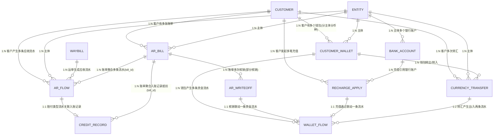

# 数据设计 — 财务模块（应收 + 资金账户）

> **版本**：v0.4 | **日期**：2026-09-14 | **作者**：飞点产品
> **覆盖范围**：应收管理 R1-R5 + 资金账户 W1-W6（含入账记录）；应付/对账/毛利/开票/成本核算待后续对齐后补充
> **上游**：[2026-09-14-用户需求.md](2026-09-14-用户需求.md)（RDD v1.0 定稿）

---

## 一、实体清单 × 表映射

| # | 实体 | 对应表 | 映射方式 | 说明 |
|:---|:---|:---|:---|:---|
| 1 | 应收业务流水 | `ar_flow` | 独立表 | 运单收货自动生成，粒度=运单（R1） |
| 2 | 应收账单 | `ar_bill` | 独立表 | 财务聚合，账期级（R2） |
| 3 | 收款核销流水 | `ar_writeoff` | 独立表 | 核销/反核销留痕（R4） |
| 4 | 账龄台账 | — | **视图** | 实时计算，不落表（R5） |
| 5 | 我方银行账户 | `bank_account` | 独立表 | 每主体可多账户（W1） |
| 6 | 客户预存款钱包 | `customer_wallet` | 独立表 | 客户×主体×币种（W2） |
| 7 | 资金流水 | `wallet_flow` | 独立表 | 6 类流水（W4） |
| 8 | 币种互转 | `currency_transfer` | 独立表 | 转汇明细（W3） |
| 9 | 充值申请 | `recharge_apply` | 独立表 | 客户发起、财务审核（W5） |
| 10 | 入账记录 | `credit_record` | 独立表 | 我司退款/赔偿，待入账→已入账（W6） |
| — | 运单 | — | 逻辑实体 | 引用运单模块，财务不建表 |
| — | 客户 | — | 逻辑实体 | 引用客商中心，财务不建表 |
| — | 主体（账套） | — | 逻辑实体 | 引用基础资料，5 主体 |
| — | 币种 | — | 逻辑实体 | 枚举字典（CNY/USD/HKD…），财务不建表 |
| — | 汇率 | — | 外部接口 | 调**阿里汇率接口**实时获取，不落库、不自建汇率表；币种互转时接口汇率与实际采用汇率随单留痕 |
| — | 费用类型 | — | 逻辑实体 | 引用头程管理 `fee_type` 字典（同方向唯一），财务不建表 |
| — | 账期（合同） | — | 逻辑实体 | 引用客商中心 `customer_contract` |
| — | 账单草稿池 | — | **视图** | **未成账流水集合**（`bill_id` 为空且未红冲的 `ar_flow`），按 客户 × 主体 × 币种 × 账期 分组；由「账单管理 → 草稿池」Tab 展示，财务勾选后生成账单（R11） |

> **账单草稿池（不建表）**：运单收货完成后生成的应收业务流水**全部先进入账单草稿池**；池内以审计状态区分「待业务审计 / 已审计」，**只有已审计(20) 的流水可被勾选成账**，已红冲(30) 的不在池内展示。草稿池是**流水视角的池子**，不新增账单状态机——账单仍由财务手工聚合生成（§4.5）。

---

## 二、逐表字段清单

> 所有表统一含公共字段：`id`(BigInt, PK, 雪花) · `tenant_id`(String, Index) · `created_at` · `created_by` · `updated_at` · `updated_by` · `is_deleted`(Boolean, 默认 false) · `version`(Int, 乐观锁)

### 表 1：应收业务流水 `ar_flow`

> 运单收货完成后系统自动生成，粒度=运单；**一条费用项生成一条流水**（运费 / 运费优惠 / 泡比优惠 / 各附加费 / 各附加费优惠各成一行，**优惠独立成行，不并入费用行**），按「费用类型 × 币种」可拆多条。账期信息生成时从合同快照锁死。费用类型引用头程管理 `fee_type` 字典（同方向名称唯一）。
>
> **自动行去重键**：`UNIQUE(waybill_id, flow_kind, fee_type_id, source_rule_id)`（`is_reversal=false`）——运单信息变更触发**重扫**时覆盖更新已有行而非新增行，保证不重复计费。生成规则与账单草稿池见 §4.7。

| 字段 | 中文 | 类型 | 必填 | 约束/索引 | 枚举/备注 |
|:---|:---|:---|:---|:---|:---|
| waybill_id | 运单ID | BigInt | Yes | Index | 引用运单模块 |
| customer_id | 客户ID | BigInt | Yes | Index | 引用客商中心 |
| entity_id | 主体ID | BigInt | Yes | Index | 5 账套之一 |
| flow_category | 业务流水大类 | TinyInt | Yes | — | 10:应收, 20:应付, 30:销售提成 |
| flow_kind | 流水种类 | TinyInt | Yes | — | 10:运费, 20:运费优惠, 30:泡比优惠, 40:附加费, 50:附加费优惠, 60:手工新增 |
| fee_type_id | 费用类型ID | BigInt | Yes | Index | 引用头程管理 fee_type 字典（运费/周六派送费/超重费/地址附加费/商品附加费/报关费/库内贴标费…）。**取值来源按流水种类**：运费行=预置费用类型「运费」；运费优惠/泡比优惠/附加费优惠行=**优惠规则上配置的 `fee_type`**；附加费行=**附加费规则计价明细「应收」行的费用类型** |
| currency | 币种 | String(8) | Yes | — | CNY/USD/HKD… |
| unit_price | 本行单价 | Decimal(20,6) | Yes | — | 带符号：运费行=当周公布价、附加费行=应收单价、优惠行=优惠值（**负=减钱、正=加价**）；手工新增行可留空（直接填金额） |
| pricing_unit | 计价单位 | TinyInt | No | — | 10:按KG, 20:按m³, 30:按票, 40:按箱, 50:按数量 |
| quantity | 计费量 | Decimal(20,6) | No | — | 计费数量（重量/体积/箱数/张数）；按票计费=1；关联附加费规则按数量计费时由业务填写 |
| amount | 本行金额 | Decimal(20,6) | Yes | — | `amount = unit_price × quantity`，**带符号**：费用行为正；优惠行为负=减钱 / 正=加价；红冲行为原值取负。**运单应收净额与账单金额一律按各行 `amount` 的代数和汇总**（优惠已独立成行） |
| rate | 汇率 | Decimal(20,6) | Yes | — | 生成/手工创建时自动取实时汇率，人民币=1，不参与金额计算 |
| remark | 备注 | String(255) | No | — | 手工备注 |
| biz_time | 业务时间 | DateTime | Yes | — | 业务流水生成时间 |
| source | 数据来源 | String(32) | Yes | — | 报价 / 规则名 / 操作人姓名；只记第一次来源，后续变更不变 |
| source_rule_type | 来源规则类型 | TinyInt | No | — | 10:运价行, 20:运费优惠规则, 30:泡比优惠规则, 40:附加费规则, 50:附加费优惠规则；手工新增行留空 |
| source_rule_id | 来源规则ID | BigInt | No | Index | 命中的规则主键，供运单审计下钻「这笔钱是哪条规则给的」；手工新增行留空 |
| generate_node | 生成节点 | TinyInt | Yes | — | 10:收货完成, 20:拣货完成, 30:人工添加；决定运单信息变更时是否参与重扫（30 永久豁免） |
| billing_date | 账单日 | Date | Yes | Index | 从合同推导，生成时快照 |
| payment_terms_days | 账期天数 | Int | Yes | — | 如 15 天 |
| payment_terms_type | 签约账期类型 | TinyInt | Yes | — | 与客商中心 `customer_contract.payment_term` 同值：101:月结, 102:双月结, 103:三月结, 201:周结, 202:到港前结, 203:签收月结, 204:到海外仓结, 205:签收结 |
| bill_id | 关联账单ID | BigInt | No | Index | 生成账单后回填；**为空即处于「账单草稿池」**（§4.7） |
| audit_status | 审计状态 | TinyInt | Yes | Index | 10:待业务审计, 20:已审计, 30:已红冲 |
| biz_audit_by / biz_audit_at | 业务审计人/时间 | — | No | — | 业务侧「运单管理」操作 |
| fin_audit_by / fin_audit_at | 财务审计人/时间 | — | No | — | 财务侧「运单审计」操作 |
| is_reversal | 是否红冲流水 | Boolean | Yes | — | 默认 false |
| reversal_of_id | 冲抵原流水ID | BigInt | No | — | 红冲时指向原流水 |

> **优惠明细的承载方式**：**每条优惠单独生成一条业务流水**（优惠行），并通过 `source_rule_type` + `source_rule_id` 记录命中的规则，因此**运单审计与客户价格争议可以下钻到「哪条规则给的、减在哪个费用类型上」**，一期不需要额外建优惠明细表。
>
> **仍留二期的缺口**：① 同一费用项上**多条优惠叠加的运算顺序明细**（一期逐条成行、按行金额代数和汇总，不记录运算顺序）；② 浮动优惠（券 / 满减）的**核销载体**。两者由超级运价模块二期营销模块的 `discount_apply_log`（M7）承接，一期历史数据**不做反向拆解**。详见 `drafts/超级运价/2026-09-14-数据设计.md` §3.20.4。

### 表 2：应收账单 `ar_bill`

> 财务手工聚合已锁定流水，按 客户×主体×账期×币种。

| 字段 | 中文 | 类型 | 必填 | 约束/索引 | 枚举/备注 |
|:---|:---|:---|:---|:---|:---|
| bill_no | 账单号 | String(32) | Yes | **Unique** | 规则：AR+主体代码+yyyyMM+SEQ；主体代码：广州GZ/深圳SZ/广东GD/香港HK/墨链ML |
| customer_id | 客户ID | BigInt | Yes | Index | — |
| entity_id | 主体ID | BigInt | Yes | Index | — |
| currency | 币种 | String(8) | Yes | — | — |
| billing_date | 账单日 | Date | Yes | Index | — |
| payment_terms_days | 账期天数 | Int | Yes | — | 账单级账期快照，账龄台账按 billing_date + 本字段推逾期；**合同账期为空时由财务在生成账单时补录** |
| term_source | 账期来源 | TinyInt | Yes | — | 10:合同账期, 20:手工补录（合同账期未完善时财务补录并留痕，不回写客商中心合同） |
| bill_amount | 账单总额 | Decimal(20,6) | Yes | — | 聚合流水应收净额 |
| received_amount | 已核销金额 | Decimal(20,6) | Yes | — | 核销累加，默认 0 |
| unreceived_amount | 未收金额 | Decimal(20,6) | Yes | Index | bill_amount − received_amount |
| status | 状态 | TinyInt | Yes | Index | 10:已生成, 20:已发送, 30:已确认, 40:部分核销, 50:已核销, 60:已反核销 |
| generated_by / generated_at | 生成人/时间 | — | No | — | 财务操作 |
| sent_at | 发送客户时间 | DateTime | No | — | — |
| confirmed_at | 客户确认时间 | DateTime | No | — | 客户货主端确认 |

### 表 3：收款核销流水 `ar_writeoff`

> 财务核销/反核销记录，留痕可审计。

| 字段 | 中文 | 类型 | 必填 | 约束/索引 | 枚举/备注 |
|:---|:---|:---|:---|:---|:---|
| bill_id | 账单ID | BigInt | Yes | Index | — |
| wallet_id | 钱包ID | BigInt | Yes | Index | — |
| currency | 币种 | String(8) | Yes | — | 强制同币种 |
| amount | 核销金额 | Decimal(20,6) | Yes | — | min(账单未收, 钱包余额) |
| writeoff_type | 核销类型 | TinyInt | Yes | — | 10:核销, 20:反核销 |
| bill_before / bill_after | 核销前/后账单未收 | Decimal(20,6) | Yes | — | 留痕 |
| wallet_before / wallet_after | 核销前/后钱包余额 | Decimal(20,6) | Yes | — | 留痕 |
| wallet_flow_id | 关联资金流水ID | BigInt | No | — | 核销→资金流水联动 |
| reversed_of_id | 被反核销的核销ID | BigInt | No | — | 反核销指向原核销 |
| operator_by / operator_at | 操作人/时间 | — | Yes | — | 财务 |

### 视图：账龄台账（不建表）

基于 `ar_bill` 实时计算：`unreceived_amount > 0` 的账单，按 `billing_date + payment_terms_days` 推逾期天数 → 未到期单列 + 逾期 0-30 / 31-60 / 61-90 / 90+；维度 = 客户 × 主体 × 币种；分币种不折算。

### 视图：货主端资金账户（不建表）

基于 `customer_wallet` + `ar_bill` 实时计算，按 主体 × 币种 聚合，货主端「资金账户」页展示：

| 字段 | 说明 |
|:---|:---|
| 账户主体 | `customer_wallet.entity_id` → 主体名称（合同签约主体） |
| 币种 | `customer_wallet.currency`（默认人民币，各主体统一；其他币种财务手工开通） |
| 账户名称 | `customer_wallet.account_name` |
| 余额 | `customer_wallet.balance`（充值入池 − 核销扣减后的剩余） |
| 待核销欠款 | Σ `ar_bill.unreceived_amount`，where `status ∈ {已确认(30), 部分核销(40)}`，按 主体×币种 |
| 待确认账单 | Σ `ar_bill.bill_amount`，where `status = 已发送(20)`，按 主体×币种 |
| 实际金额 | `balance − 待核销欠款`（负数红色带负号，正数正常色） |

### 表 5：我方银行账户 `bank_account`

| 字段 | 中文 | 类型 | 必填 | 约束/索引 | 枚举/备注 |
|:---|:---|:---|:---|:---|:---|
| entity_id | 主体ID | BigInt | Yes | Index | 每主体可多账户 |
| account_name | 账户名称 | String(64) | Yes | — | 开户名 |
| account_no | 账号 | String(32) | Yes | **Unique** | 全局唯一，创建后不可修改 |
| bank_name | 开户行 | String(64) | Yes | — | — |
| swift_code | SWIFT/BIC | String(16) | No | — | 境外打款用，非人民币账户建议填写 |
| currency | 账户币种 | String(8) | Yes | — | 单币种账户 |
| balance | 账面余额 | Decimal(20,6) | Yes | — | 财务手工维护的账面余额，非银行实时余额；默认 0 |
| is_visible_to_customer | 用户是否可见 | Boolean | Yes | Index | 默认 true；为 true 时客户货主端充值的打款账户下拉可见该账户 |
| is_default | 是否默认 | Boolean | Yes | — | 客户打款默认账户；同一主体+币种仅一个，且必须 `is_visible_to_customer=true` |
| status | 状态 | TinyInt | Yes | — | 10:启用, 20:停用；停用同时置 `is_visible_to_customer=false`、`is_default=false` |

### 表 6：客户预存款钱包 `customer_wallet`

> 钱包 = 客户 × 主体 × 币种；余额扣减需乐观锁，不可透支。**生成节点（唯一自动触发点）= 客商中心合同签约完成**（`sign_status` 20 → 30），按 `contract_company` 生成「客户 × 主体 × 人民币」钱包；正常入驻（先签约后开户）与特殊入驻（先开户后签约）统一卡在签约完成，开户完成不触发；续签幂等（唯一索引兜底），每日补偿「已签署合同无对应钱包」。**钱包生命周期与合同解耦**：合同过期/解约不影响钱包任何操作（充值/核销/提现/互转/新增币种钱包照常），系统不自动停用。默认币种统一人民币（各主体一致）。

| 字段 | 中文 | 类型 | 必填 | 约束/索引 | 枚举/备注 |
|:---|:---|:---|:---|:---|:---|
| customer_id | 客户ID | BigInt | Yes | **Unique(联合)** | — |
| entity_id | 主体ID | BigInt | Yes | **Unique(联合)** | — |
| currency | 币种 | String(8) | Yes | **Unique(联合)** | (customer, entity, currency) 唯一 |
| account_name | 账户名称 | String(16) | Yes | **Unique** | 格式=账号编号+空格+币种代码；账号编号 7 位全局递增(1000001 起)，跨客户/主体/币种不重复 |
| balance | 余额 | Decimal(20,6) | Yes | — | 不可透支，默认 0 |
| open_source | 开通方式 | TinyInt | Yes | Index | 10:系统自动(合同签约完成), 20:财务手工 |
| opened_at | 开通时间 | DateTime | Yes | — | 钱包创建时间 |
| is_default | 是否默认钱包 | Boolean | Yes | — | 系统字段，员工端/货主端均不展示；二期「默认支付钱包」预留 |

### 表 7：资金流水 `wallet_flow`

> 钱包资金进出痕迹，事实记录不可改（出错靠反向流水：充值退回/核销撤销）。

| 字段 | 中文 | 类型 | 必填 | 约束/索引 | 枚举/备注 |
|:---|:---|:---|:---|:---|:---|
| wallet_id | 钱包ID | BigInt | Yes | Index | — |
| flow_type | 流水类型 | TinyInt | Yes | Index | 10:充值, 20:充值退回, 30:提现, 40:核销, 50:核销撤销, 60:转汇 |
| currency | 币种 | String(8) | Yes | — | — |
| amount | 变动金额 | Decimal(20,6) | Yes | — | 正=入, 负=出 |
| balance_before / balance_after | 变动前/后余额 | Decimal(20,6) | Yes | — | 留痕 |
| recharge_id | 关联充值 | BigInt | No | — | 充值/充值退回；**财务代充无充值申请单，本字段为空** |
| writeoff_id | 关联核销 | BigInt | No | — | 核销/核销撤销 |
| transfer_id | 关联转汇 | BigInt | No | — | 转汇 |
| operator_by / operator_at | 操作人/时间 | — | Yes | — | — |

### 表 8：币种互转 `currency_transfer`

> 独立表，记录转出/转入两币 + 汇率，可审计。

| 字段 | 中文 | 类型 | 必填 | 约束/索引 | 枚举/备注 |
|:---|:---|:---|:---|:---|:---|
| transfer_no | 转汇单号 | String(32) | Yes | **Unique** | 规则：TR+yyyyMMdd+SEQ |
| customer_id | 客户ID | BigInt | Yes | Index | — |
| entity_id | 主体ID | BigInt | Yes | Index | 同主体内互转 |
| from_wallet_id | 转出钱包ID | BigInt | Yes | Index | — |
| from_currency | 转出币种 | String(8) | Yes | — | — |
| from_amount | 转出金额 | Decimal(20,6) | Yes | — | 正数 |
| to_wallet_id | 转入钱包ID | BigInt | Yes | Index | — |
| to_currency | 转入币种 | String(8) | Yes | — | — |
| to_amount | 转入金额 | Decimal(20,6) | Yes | — | 按汇率换算 |
| api_rate | 接口汇率 | Decimal(20,6) | Yes | — | 阿里汇率接口实时返回值，留痕不可改 |
| rate | 汇率 | Decimal(20,6) | Yes | — | 实际采用汇率，默认=api_rate，可手工覆盖 |
| rate_source | 汇率来源 | TinyInt | Yes | — | 10:接口实时, 20:手工覆盖 |
| operator_by / operator_at | 操作人/时间 | — | Yes | — | 财务手工 |

### 表 9：充值申请 `recharge_apply`

> 客户货主端发起，财务审核后入池。

| 字段 | 中文 | 类型 | 必填 | 约束/索引 | 枚举/备注 |
|:---|:---|:---|:---|:---|:---|
| customer_id | 客户ID | BigInt | Yes | Index | — |
| entity_id | 主体ID | BigInt | Yes | Index | 充到哪个主体钱包 |
| currency | 币种 | String(8) | Yes | — | — |
| amount | 金额 | Decimal(20,6) | Yes | — | — |
| bank_account_id | 打款我方账户 | BigInt | Yes | — | 引用 bank_account |
| voucher_url | 打款凭证 | String(255) | Yes | — | 上传截图 URL |
| status | 状态 | TinyInt | Yes | Index | 10:待审核, 20:已通过, 30:已驳回 |
| audit_by / audit_at | 审核人/时间 | — | No | — | 财务线下查银行流水 |
| wallet_flow_id | 关联资金流水 | BigInt | No | — | 通过后生成充值流水 |

### 表 10：入账记录 `credit_record`

> 我司退款/赔偿（如超时赔付/丢件赔付/货损赔偿）的待入账记录；由运营手工新增「赔付类型」业务流水后，系统自动捕捉挂入账记录。待入账 → 已入账，入账时归最新一期账单抵扣，归入后不可改期。

| 字段 | 中文 | 类型 | 必填 | 约束/索引 | 枚举/备注 |
|:---|:---|:---|:---|:---|:---|
| record_no | 记录编号 | String(32) | Yes | **Unique** | 规则：CR+yyyyMMdd+序号 |
| ar_flow_id | 关联业务流水 | BigInt | Yes | Index | 1:1 关联 ar_flow（赔付类型流水） |
| waybill_id | 关联运单 | BigInt | Yes | Index | 引用运单模块 |
| customer_id | 客户ID | BigInt | Yes | Index | — |
| entity_id | 主体ID | BigInt | Yes | Index | — |
| currency | 币种 | String(8) | Yes | — | — |
| amount | 赔付金额 | Decimal(20,6) | Yes | — | 正数（入账时按负数抵扣账单） |
| credit_type | 赔付类型 | String(32) | Yes | — | 引用系统枚举配置（赔付类型，可自定义），如超时赔付/丢件赔付/货损赔偿 |
| status | 状态 | TinyInt | Yes | Index | 10:待入账, 20:已入账 |
| booked_at | 入账时间 | DateTime | No | — | 已入账回填 |
| bill_id | 关联账单 | BigInt | No | Index | 已入账回填（账单号规则 AR+主体代码+年月+序号） |

---

## 三、ER 关系图



> 注：`CUSTOMER`(客户)、`ENTITY`(主体)、`WAYBILL`(运单) 为外部模块实体，财务不建表，仅以 `_id` 引用。

---

## 四、关键设计说明

### 4.1 金额精度
所有金额字段统一 `Decimal(20,6)`，禁止 Float/Double；币种不折算混总。

### 4.2 乐观锁（并发控制）
- `customer_wallet`：余额扣减（核销/提现/转汇）必须带 `version` 乐观锁，防超扣
- `ar_bill`：核销累加 `received_amount` 需并发控制

### 4.3 软删除策略
核心业务数据（账单、流水、核销、转汇、钱包）一律软删除（`is_deleted`），不物理删除；资金流水为事实记录，**不可软删不可改**，出错靠反向流水。

### 4.4 视图说明
账龄台账为实时视图，不落表；基于 `ar_bill.unreceived_amount` + `billing_date` + `payment_terms_days` 计算。

### 4.5 状态机

**业务流水 `audit_status`**（单审计 + 反审计）：
```
待业务审计(10) --业务整单审计通过--> 已审计(20)
已审计(20) --财务反审计(未关联账单)--> 待业务审计(10)
已审计(20) --财务反审计(已关联账单)--> 已红冲(30)
```

**账单 `status`**：
```
已生成(10) --> 已发送(20) --> 已确认(30) --> 部分核销(40) --> 已核销(50)
                                          ↑ 反核销 ↓
                                       已反核销(60)
```

**充值申请 `status`**：
```
待审核(10) --> 已通过(20) / 已驳回(30)
```

**入账记录 `status`**：
```
待入账(10) --账单生成时归最新一期抵扣--> 已入账(20)
```

### 4.6 外部引用（纯逻辑实体）
- 运单：引用运单模块（`waybill_id`）
- 客户：引用客商中心（`customer_id`）
- 主体：引用基础资料（`entity_id`）
- 账期：引用客商中心 `customer_contract`（合同级），财务生成流水时快照账期字段，不重复维护
- 币种：枚举字典；汇率：调**阿里汇率接口**实时获取（不落库、不自建汇率表），币种互转时以接口值预填、允许财务手工覆盖，`api_rate` + `rate` + `rate_source` 三者随单留痕；接口异常时降级为手工填写（rate_source=20）

### 4.7 应收流水生成与账单草稿池

**触发**：运单状态进入「已收货」→ 系统自动生成应收业务流水（R01）。**分节点增量**：字段匹配型附加费随收货完成生成；**字段&公式型附加费（如超重超长）在拣货实测后追加一行**；人工添加型由业务在运单「费用管理」手工新增。同一运单的流水**可分批长出来**，全部先进入账单草稿池。

**逐行构成（一次收货完成最多生成 5 类行）**：

| 流水行 | `flow_kind` | 费用类型来源 | 单价 | 计费量 | 金额 |
|:---|:---:|:---|:---|:---|:---|
| 运费 | 10 | 预置费用类型「运费」 | 当周公布价（元/计价单位） | 计费重量 / 体积 | `公布价 × 计费量` |
| 运费优惠 | 20 | **优惠规则配置的 `fee_type`** | 优惠值（带符号） | 同运费行 | `优惠值 × 计费量` |
| 泡比优惠 | 30 | **优惠规则配置的 `fee_type`** | 优惠值（带符号） | 同运费行 | `优惠值 × 计费量`（仅命中 KG 计价行） |
| 附加费 | 40 | 附加费规则计价明细「应收」行的费用类型 | 应收单价 | 按票=1 / 按箱=箱数 / 按KG=计费重量 / 按m³=计费体积 / 按数量=人工填 | `应收单价 × 计费量` |
| 附加费优惠 | 50 | **优惠规则配置的 `fee_type`** | 优惠值（单价级、带符号） | 同该附加费行 | `优惠值 × 计费量` |

**取价与优惠取数**：运费取**当周批次（CURRENT）**运价行（仓库组 + 重量段 + 交货地组）的公布价；优惠**从超级运价三张优惠表实时匹配**（不进周批次快照）——运费优惠按 服务组合 ×（客户特批 > 客户等级）取一条生效规则，泡比优惠按 泡比 ≥ 密度阈值 取阈值最大档，附加费优惠按 附加费规则 × 目标匹配。取数链路见 `drafts/超级运价/2026-09-14-数据设计.md` §6.5。

**重扫与冻结**：运单信息变更 → `generate_node ∈ {10,20}` 且未审计的自动行**重算覆盖**；`generate_node=30`（人工添加）**永久豁免重扫**；**业务审计后冻结**（只能人工调整或红冲）、**进账单后彻底冻结**。

**账单草稿池**：`bill_id` 为空的流水即处于草稿池；财务在「账单管理 → 草稿池」按 客户 × 主体 × 币种 × 账期 查看，勾选**已审计**的流水生成账单（R11）。
