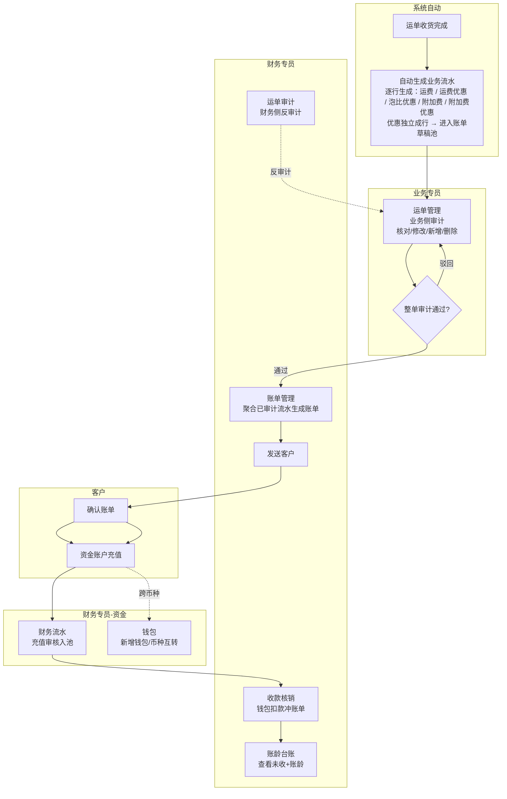
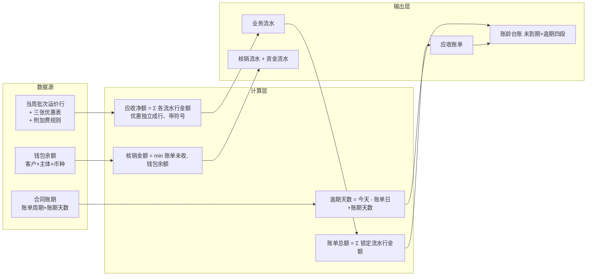
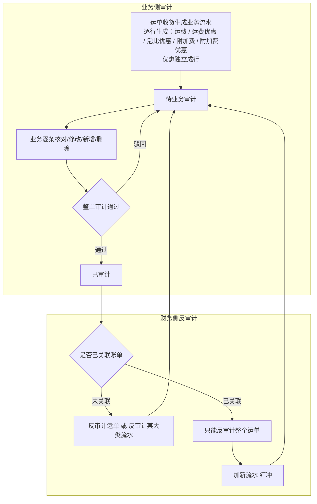

# 需求定义卡片 (RDD) — 财务模块

> **原始需求**：财务是飞点 TMS 的消费方，实现多主体独立核算 + 钱进钱出闭环，消费订单/运单数据完成应收管理、资金账户与账龄管理。
> **文档版本**: v1.1（Phase 1 定稿：应收管理 + 资金账户） | **日期**: 2026-09-14 | **作者**: 飞点产品
> **本期范围**：流程一~三「应收管理」+ 流程四「资金账户（含入账记录）」，共 2 个模块、16 项功能、18 条 AC。
> **分期口径**：Phase 1 = 应收管理 + 资金账户（本期定稿）；Phase 2 = 应付管理、对账中心、毛利分析、开票；Phase 3 = 实际成本核算。
> **汇率口径**：汇率统一调用阿里汇率接口实时获取（人民币=1 基准），币种互转页以接口值预填、允许财务手工覆盖并留痕（接口汇率 + 实际采用汇率 + 汇率来源三者同存）；一期不记汇损，不自建汇率表。

## 1. 核心洞察 (Insight)

**真实痛点**：

当前飞点 5 家公司（广州飞点、深圳飞点、广东飞点、香港富力顿、墨链）税务上独立法人、实际一个家族，但财务核算完全依赖线下 Excel。客户打款与应收账单之间靠财务手工核对，钱进来不知道冲哪张账单；账期到了不知道哪些客户逾期、逾期多久；多主体、多币种的资金往来靠手工分账，极易混账。

计费依赖运价模块的当周公布价和附加费规则，但运单收货完成后，应收金额、账单、核销、账龄这一整条链路没有系统承载，财务只能线下追着业务要数据、手工算账。

**JTBD**：

> `财务专员` 雇佣"财务模块"不是为了"记流水账"，而是为了：**当运单收货完成后，能在系统内完成业务流水审计→生成账单→收款核销→账龄跟踪的闭环，且每一笔钱都挂到具体主体和币种，不混账、可追溯。**

> `客户（货主端）` 雇佣"财务模块"不是为了"看数字"，而是为了：**当收到账单后，能在线上确认账单并充值，不用线下反复跟财务对账沟通。**

> `业务专员` 雇佣"财务模块"不是为了"录数据"，而是为了：**当运单收货后，能在运单管理侧对业务流水做业务审计（核对/修改/新增），财务侧可反审计，权责清晰。**

**业务价值**：

| 维度 | 当前 | 目标 |
|------|------|------|
| 应收核算 | 线下 Excel 手工算账 | 运单收货自动生成业务流水，业务审计 + 财务反审计 |
| 账单管理 | 财务手工发账单，客户线下对账 | 系统生成账单→发送→客户线上确认 |
| 收款核销 | 钱进来手工找账单冲抵 | 钱包池化 + 同币种核销，min(未收,余额) 防透支 |
| 账龄跟踪 | 人工追账，无逾期预警 | 系统按账单日+账期自动分段，未到期单列+逾期四段 |
| 资金账户 | 多主体多币种手工分账 | 钱包按 客户×主体×币种 隔离，币种互转闭环 |
| 主体隔离 | 打款可能跨主体混打 | 每笔钱强制挂具体主体，钱包层隔离 |

## 2. 业务全景图

### 2.1 角色与工作节奏

| 角色 | 核心任务 | 频率 |
|------|---------|------|
| 财务专员 | 反审计业务流水、生成账单、收款核销、反核销、币种互转、充值审核、提现 | 日频 |
| 业务专员 | 业务侧审计业务流水（运单管理）、确认业务流水 | 日频 |
| 客户（货主端） | 确认账单、发起充值 | 按需/账期周期 |
| 系统自动 | 运单收货自动生成业务流水、账龄实时计算 | 实时 |

### 2.2 端到端业务链路

```
【应收触发】
  创建每周报价 → 创建运单 → 运单收货完成 → 系统自动生成业务流水
  （运费取当周公布价；运费优惠 / 泡比优惠 / 附加费 / 附加费优惠逐行生成，优惠独立成行）→ 进入账单草稿池
      ↓
【业务审计】
  业务在「运单管理」做业务侧审计（核对/修改/新增 → 整单审计通过）→ 财务在「运单审计」可反审计
      ↓
【赔付入账】
  运营在运单上新增「赔付类型」业务流水（费用类型 is_credit=true）→ 系统自动挂「入账记录」（待入账）
      ↓
【账单生成】
  未成账流水停留在「账单草稿池」（= 未关联账单的流水）
  财务在「账单管理 → 草稿池」按 客户+主体+账期+币种 勾选已锁定（已审计）流水 → 生成账单 → 发送客户
      ↓
【入账抵扣】
  账单生成时把「待入账」记录按负数抵扣应收，归入最新一期账单（归入后不可改期，任何轧差放下一期）
      ↓
【客户确认】
  客户在货主端「账单管理」确认账单（异议走线下/工单，财务重新生成账单再发）
      ↓
【充值】
  客户在货主端「资金账户」发起充值（金额+币种+打款账户+凭证）→ 财务在「财务流水」核对银行流水审核入池
      ↓
【核销】
  财务在「收款核销」从钱包扣款冲账单（同币种，min(未收,余额)，可部分核销/反核销）
      ↓
【账龄】
  「账龄台账」按 客户×主体×币种 展示未收余额 + 账龄四段（未到期单列）
      ↓
【资金账户】
  钱包开通（入驻自动人民币 + 财务手工开通其他币种）→ 币种互转（跨币种核销前）→ 提现
```

### 2.3 实体依赖关系

```
应收业务流水 (ArFlow) — 应收侧聚合根
  ├── N:1 应收账单 (ArBill)
  ├── N:1 运单 (Waybill) ← 外部引用（运单模块）
  ├── N:1 客户 (Customer) ← 外部引用（客商中心）
  ├── N:1 主体 (Entity) ← 外部引用（基础资料）
  └── 1:1 入账记录 (CreditRecord) ← 赔付类型流水自动挂入账记录

应收账单 (ArBill)
  ├── 1:N 应收业务流水 (ArFlow)
  ├── 1:N 收款核销流水 (ArWriteoff)
  └── 1:N 入账记录 (CreditRecord) ← 赔付入账按负数抵扣

入账记录 (CreditRecord) — 我司退款/赔偿，待入账 → 已入账
  ├── 1:1 应收业务流水 (ArFlow) ← is_credit=true 的赔付流水
  ├── N:1 应收账单 (ArBill) ← 归最新一期账单（bill_id 回填），归入后不可改期
  └── N:1 客户 / 主体 ← 外部引用（客商中心 / 基础资料）

客户钱包 (CustomerWallet) — 资金侧聚合根
  ├── N:1 客户 (Customer) ← 外部引用
  ├── N:1 主体 (Entity) ← 外部引用
  └── 1:N 资金流水 (WalletFlow)

资金流水 (WalletFlow)
  ├── 1:1 充值申请 (RechargeApply)
  ├── 1:1 收款核销流水 (ArWriteoff)
  └── 1:2 币种互转 (CurrencyTransfer)

我方银行账户 (BankAccount) — N:1 主体，被充值申请引用
币种互转 (CurrencyTransfer) — 1:2 资金流水（转出/转入）
账龄台账 — 纯视图，基于应收账单实时计算，不建表
```

### 2.4 核心业务流程图（泳道图）



### 2.5 核心数据流图



---

## 3. 流程一：应收业务流水与审计（日频）

> **触发**：运单收货完成（**分节点增量**：字段匹配型附加费随收货完成生成、字段&公式型附加费在拣货实测后追加、人工添加型由业务手工新增） **频率**：实时自动生成 + 日频审计 **前置依赖**：运单模块收货状态与货物参数、超级运价当周批次运价行 + 三张优惠表 + 附加费规则、客商中心合同账期与客户等级

**3.1 应收业务流水 (ArFlow)** — 运单收货自动生成的逐票应收，粒度=运单，**一条费用项一行（优惠独立成行）**，按费用类型×币种可拆多条

> **As a** 财务专员 **I want to** 运单收货后系统自动生成应收业务流水 **So that** 每票运单的应收金额有系统记录、可追溯

| 字段 | 类型 | 必填 | 说明 |
|------|------|------|------|
| 运单号 | 引用 | ✅ | 引用运单模块，粒度=运单 |
| 客户 | 引用 | ✅ | 引用客商中心 |
| 主体 | 引用 | ✅ | 5 账套之一，强制挂主体 |
| 业务流水大类 | 枚举 | ✅ | 应收 / 应付 / 销售提成；**Phase 1 仅实现应收（10）**，应付/销售提成为预留枚举，Phase 2 随应付管理开放 |
| 流水种类 | 枚举 | ✅ | 运费 / 运费优惠 / 泡比优惠 / 附加费 / 附加费优惠 / 手工新增 —— **一条费用项生成一条流水，优惠独立成行** |
| 费用类型 | 引用 | ✅ | 引用头程管理费用类型字典（运费/周六派送费/超重费/地址附加费/商品附加费/报关费/库内贴标费…），同方向唯一。**取值来源按流水种类**：运费行=预置费用类型「运费」；三类优惠行=**优惠规则上配置的费用类型**；附加费行=**附加费规则计价明细「应收」行的费用类型** |
| 币种 | 枚举 | ✅ | 运费币种来自报价，附加费币种来自附加费规则，可跨币种 |
| 单价 | Decimal | ✅ | 本行单价（带符号）：运费行=当周公布价、附加费行=应收单价、优惠行=优惠值（负=减钱、正=加价）；手工新增行可留空 |
| 计价单位 | 枚举 | 否 | 按KG / 按m³ / 按票 / 按箱 / 按数量。**来源跟着规则走**：运费 / 运费优惠 / 泡比优惠行 = 运单所关联服务组合的计费方式；附加费 / 附加费优惠行 = 该条附加费规则的计价单位 |
| 计费量 | Decimal | 否 | 计费数量（重量/体积/箱数/张数）；按票计费=1；关联附加费规则按数量计费时由业务填写 |
| 金额 | Decimal | ✅ | `金额 = 单价 × 计费量`，**带符号**：费用行为正；优惠行为负=减钱 / 正=加价；红冲行为原值取负。**运单应收净额与账单金额 = 各行金额的代数和** |
| 汇率 | Decimal | ✅ | 调阿里汇率接口实时获取，人民币=1，不参与金额计算 |
| 备注 | 文本 | 否 | 手工备注 |
| 业务时间 | DateTime | ✅ | 业务流水生成时间 |
| 数据来源 | 文本 | ✅ | 报价 / 规则名 / 操作人姓名（只记第一次来源，后续变更不变） |
| 来源规则 | 引用 | 否 | 命中的规则类型 + 规则ID（运价行 / 运费优惠规则 / 泡比优惠规则 / 附加费规则 / 附加费优惠规则），**用于运单审计下钻「这笔钱是哪条规则给的」**；手工新增留空 |
| 生成节点 | 枚举 | ✅ | 收货完成 / 拣货完成 / 人工添加；决定运单信息变更时是否参与重扫（人工添加永久豁免） |
| 账单日 | Date | ✅ | 从合同账期推导，生成时快照锁死 |
| 账期天数 | Integer | ✅ | 合同账期天数快照 |
| 签约账期类型 | 枚举 | ✅ | 引用客商中心 `customer_contract.payment_term` 同值枚举（101月结/102双月结/103三月结/201周结/202到港前结/203签收月结/204到海外仓结/205签收结），生成时合同快照 |
| 审计状态 | 枚举 | ✅ | 待业务审计 / 已审计 / 已红冲 |
| 业务审计人/时间 | 文本/DateTime | 否 | 业务侧「运单管理」整单审计留痕 |
| 财务审计人/时间 | 文本/DateTime | 否 | 财务侧「运单审计」反审计留痕 |
| 关联账单ID | 引用 | 否 | 生成账单后回填（流水级关联，可跨期跨年） |
| 是否红冲流水 | 布尔 | ✅ | 默认否；已关联账单纠错时红冲生成 |
| 冲抵原流水ID | 引用 | 否 | 红冲流水指向被冲抵的原流水 |

**业务规则**：
① 计费触发点 = 运单收货完成，系统主动生成业务流水（**分节点增量**：字段匹配型附加费随收货完成生成；字段&公式型附加费在拣货实测后追加；人工添加型由业务手工新增）
② 业务流水逐行构成：**运费 1 条**（费用类型=预置「运费」）+ **运费优惠 1 条** + **泡比优惠 1 条** + **各命中附加费各 1 条** + **各命中附加费优惠各 1 条**。**优惠独立成行、不并入费用行**：优惠行的费用类型取**优惠规则上配置的费用类型**，单价=优惠值（带符号，负=减钱、正=加价），金额 = 优惠值 × 计费量。同一运单可同时存在多个优惠行（运费优惠与泡比优惠叠加、多条附加费优惠各自成行）
③ 总运费匹配逻辑：运单绑定服务组合，按 仓库组 + 重量段 + 交货地组 匹配**当周批次（CURRENT）**的运价行取公布价；匹配到走报价（数据来源=报价、来源规则=运价行），匹配不到（私仓未做报价）由业务手工新增（数据来源=操作人姓名）。**优惠从超级运价三张优惠表实时匹配**（不进周批次快照）：运费优惠按 服务组合 ×（客户特批 > 客户等级）取一条生效规则；泡比优惠按 泡比 ≥ 密度阈值 取阈值最大档；附加费优惠按 附加费规则 × 目标匹配
④ 数据来源记录第一次来源（报价 / 操作人姓名），业务后续修改金额/币种不改变来源
⑤ 按数量计费：费用类型关联附加费规则（单价，如库内贴标费 0.5元/张），业务新增流水时选费用类型 + 填数量，金额 = 单价×数量 自动算
⑥ 审计模型 = 单审计 + 反审计：业务侧正向审计（逐条核对/修改/新增/删除，整单审计通过）；财务侧反审计（撤销审计，退回业务重改）
⑦ 反审计粒度：运单级 + 业务流水大类级（应收/应付/销售提成）；反审计前提是未锁定，不受收货时间限制

**相关 AC**：`AC1-生成` `AC2-审计` `AC3-反审计` `AC4-红冲`

**3.2 核心场景（反审计规则，以是否关联账单为界）**

```
场景：业务流水纠错（财务反审计）
  1. 未关联账单 → 可反审计运单 + 反审计某大类流水（应收/应付/销售提成）→ 业务直改后重新审计
  2. 已关联账单 → 该大类流水不可反审计 → 只能反审计整个运单 → 加新流水（红冲）
                  → 原流水留痕，红冲流水归下一期账单
```

**3.3 关键操作流程图（单审计 + 反审计）**



## 4. 流程二：账单生成与客户确认（账期周期）

> **触发**：财务需要出账单 **频率**：账期周期（月结/双月结等） **前置依赖**：流程一已锁定的业务流水

**4.1 应收账单 (ArBill)** — 财务手工聚合已锁定流水，账期级，按 客户+主体+账期+币种

> **As a** 财务专员 **I want to** 聚合已锁定流水生成账单并发送客户 **So that** 客户能确认应收金额

| 字段 | 类型 | 必填 | 说明 |
|------|------|------|------|
| 账单号 | 文本 | ✅ | 唯一，规则 AR+主体代码+年月+序号（主体代码：广州GZ/深圳SZ/广东GD/香港HK/墨链ML） |
| 客户 | 引用 | ✅ | 引用客商中心 |
| 主体 | 引用 | ✅ | 5 账套之一 |
| 币种 | 枚举 | ✅ | 同币种聚合 |
| 账单日 | Date | ✅ | 账期起始 |
| 账期天数 | Integer | ✅ | 账单级账期天数快照（账龄台账按 账单日+账期天数 起算）；**合同账期为空时由财务在生成账单时补录** |
| 账期来源 | 枚举 | ✅ | 合同账期 / 手工补录（合同账期未完善时财务补录，留痕） |
| 账单总额 | Decimal | ✅ | Σ 聚合流水应收净额 |
| 已核销金额 | Decimal | ✅ | 核销累加，默认 0 |
| 未收金额 | Decimal | ✅ | 账单总额 − 已核销 |
| 状态 | 枚举 | ✅ | 已生成/已发送/已确认/部分核销/已核销/已反核销 |
| 生成人/时间 | 文本/DateTime | 否 | 财务操作留痕 |
| 发送时间 | DateTime | 否 | 发送客户时间 |
| 客户确认时间 | DateTime | 否 | 货主端确认回填 |

**业务规则**：
① 账单粒度：账单号挂在每条业务流水上（流水级），一个运单多条流水按 币种+账期 拆到多个账单，可跨期跨年
② 账期：消费客商中心 `customer_contract` 表（合同级），财务不重复维护；账期主数据在客商中心「客户管理 → 合同/账期」由财务/销售维护（合同签约完成后处理）
③ **账期补录**：合同账期未完善时（如香港线下签约，账单周期/账期/结算类型等字段留空待补填），财务在「生成账单」时**手工补录账期天数**，写入账单账期快照并标记「账期手工补录」；该补录仅影响本账单的账龄计算，不回写客商中心合同主数据
④ 客户确认账单：一期不做线上异议，异议走线下/工单，财务重新生成账单再发送

**相关 AC**：`AC5-生成` `AC6-发送` `AC7-确认`

## 5. 流程三：收款核销与账龄台账（日频）

> **触发**：客户打款入池、财务核销 **频率**：日频 **前置依赖**：流程二已确认账单、流程四钱包余额

**5.1 收款核销流水 (ArWriteoff)** — 财务核销/反核销记录，留痕可审计

> **As a** 财务专员 **I want to** 从钱包扣款冲抵账单 **So that** 账单未收减少、钱账对应

| 字段 | 类型 | 必填 | 说明 |
|------|------|------|------|
| 账单号 | 引用 | ✅ | 被核销账单 |
| 钱包 | 引用 | ✅ | 扣款钱包（客户×主体×币种） |
| 币种 | 枚举 | ✅ | 强制同币种 |
| 核销金额 | Decimal | ✅ | min(账单未收, 钱包余额) |
| 核销类型 | 枚举 | ✅ | 核销 / 反核销 |
| 核销前/后账单未收 | Decimal | ✅ | 留痕 |
| 核销前/后钱包余额 | Decimal | ✅ | 留痕 |
| 操作人/时间 | 文本/DateTime | ✅ | 财务 |
| 关联资金流水ID | 引用 | 否 | 核销→资金流水联动 |
| 被反核销的核销ID | 引用 | 否 | 反核销指向原核销记录 |

**业务规则**：
① **核销永远同币种**：账单币种与钱包币种必须一致，跨币种先走钱包互转（流程四）
② 核销金额 = min(账单未收, 钱包余额)，钱包不可透支
③ 支持部分核销 / 一对多 / 多对一；池化模型，不做进账↔账单映射（在线付款上线后再做关系表）
④ 多打留钱包余额、少打留未收进账龄
⑤ 反核销：一期不接做账系统，未做账账单均可反核销，不加审批，留核销/反核销日志

**5.2 账龄台账** — 纯视图，不建表，基于应收账单实时计算

| 字段 | 类型 | 必填 | 说明 |
|------|------|------|------|
| 维度 | 组合 | ✅ | 客户 × 主体 × 币种 |
| 未收总额 | Decimal | ✅ | Σ 未收金额 |
| 未到期金额 | Decimal | ✅ | 单列 |
| 逾期 0-30/31-60/61-90/90+ | Decimal | ✅ | 逾期四段 |

**业务规则**：
① 起算口径：账单日 D + 账期 N 天（含首日）→ 账期内 D～D+N−1，最后支付日 = D+N−1，逾期第 1 天 = D+N
② 分段：未到期单列 + 逾期 0-30 / 31-60 / 61-90 / 90+
③ 分币种不折算（不做汇率折算混总）

**相关 AC**：`AC8-核销` `AC9-部分核销` `AC10-反核销` `AC11-账龄`

**5.3 关键操作流程图（收款核销决策）**

```mermaid
flowchart TD
    A[选择账单 + 钱包] --> B{币种是否一致}
    B -->|否| C[先做币种互转] --> A
    B -->|是| D[核销金额 = min 账单未收, 钱包余额]
    D --> E{是否全额核销}
    E -->|全额| F[账单已核销]
    E -->|部分| G[账单部分核销<br/>剩余未收进账龄]
    F --> H{是否反核销}
    G --> H
    H -->|是| I[回滚未收 + 钱包余额]
    H -->|否| J[结束]
```



## 6. 流程四：资金账户与钱包（日频）

> **触发**：客户入驻、充值、跨币种结算、提现 **频率**：日频/按需 **前置依赖**：客商中心入驻、阿里汇率接口（实时汇率）、我方银行账户

**6.1 客户钱包 (CustomerWallet)** — 钱包 = 客户 × 主体 × 币种，钱进池子即混同，只认币种余额

> **As a** 财务专员 **I want to** 管理客户钱包并做币种互转 **So that** 多主体多币种的资金隔离且可跨币种结算

| 字段 | 类型 | 必填 | 说明 |
|------|------|------|------|
| 客户 | 引用 | ✅ | 引用客商中心 |
| 主体 | 引用 | ✅ | 5 账套之一 |
| 币种 | 枚举 | ✅ | 联合唯一 (客户,主体,币种) |
| 账户名称 | 文本 | ✅ | 全局唯一；格式=账号编号+空格+币种代码 |
| 余额 | Decimal | ✅ | 不可透支，乐观锁控制 |
| 开通方式 | 枚举 | ✅ | 系统自动（合同签约完成）/ 财务手工；员工端列表展示 |
| 开通时间 | DateTime | ✅ | 钱包创建时间 |
| 是否默认钱包 | 布尔 | ✅ | 系统字段；**员工端与货主端均不展示**（后台保留），二期在线付款的「默认支付钱包」预留 |

**业务规则**：
① 钱包池化：钱进池子即混同，只认币种余额，不追来源进账
② **钱包生成节点（唯一自动触发点）= 客商中心合同签约完成**（`sign_status` 20 签署中 → 30 已签署）：按 `contract_company` 生成「客户 × 主体 × 人民币」钱包（余额 0，开通方式=系统自动）。正常入驻（先签约后开户）与特殊入驻（先开户后签约）**统一卡在签约完成**，开户完成不再触发；续签/重复事件幂等（靠 (客户,主体,币种) 唯一索引兜底）；每日定时补偿「已签署合同但无对应钱包」的数据
③ **手工开通边界**（「资金账户管理 → 客户资金账户 → 新增钱包」）：
   - 默认人民币钱包由系统自动开通，手工仅用于**补开其他币种**
   - 主体**仅可选择该客户签约过的主体**（`sign_status ∈ {签署中, 已签署, 已过期, 已解约}`）；**从未签约的主体一律阻断**并提示先完成合同签约，不设特批口子
   - 币种仅可选择该主体下**尚未开通**的币种
   - 选中主体合同非有效（已过期/已解约）时**允许提交**，但需提示「本次开通的币种钱包用于存量账单结算与赔付入账」
   - 场景依据：客户先签广州飞点 → 合同到期 → 转签深圳飞点；广州飞点存量运单产生赔付且客户要求美元结算 → 需在广州飞点补开 USD 钱包
④ **钱包生命周期与合同解耦**：合同过期/解约**不影响**钱包的新增与使用（查看 / 充值 / 核销 / 反核销 / 提现 / 币种互转 / 新增币种钱包 / 入账抵扣全部照常）；系统不自动停用钱包（存在未结算账单与存量赔付）
⑤ 默认币种统一为**人民币**（各主体一致，香港富力顿不做特殊）
⑥ 客户资金账户 = 预存款钱包，与支付渠道解耦（未来在线付款只加渠道，钱包不动）
⑦ 账户名称 = 账号编号 + 空格 + 币种代码（如「1000001 CNY」）；账号编号 7 位全局递增（1000001 起），跨客户/主体/币种全局唯一

**6.2 我方银行账户 (BankAccount)** — 每主体各自开户，一主体可多账户

| 字段 | 类型 | 必填 | 说明 |
|------|------|------|------|
| 主体 | 引用 | ✅ | 每主体可多账户 |
| 账户名称 | 文本 | ✅ | 开户名 |
| 账号 | 文本 | ✅ | 全局唯一，创建后不可修改 |
| 开户行 | 文本 | ✅ | — |
| SWIFT/BIC | 文本 | 否 | 境外打款用，非人民币账户建议填写 |
| 币种 | 枚举 | ✅ | 单币种账户 |
| 账面余额 | Decimal | ✅ | 财务手工维护的账面余额，非银行实时余额，默认 0 |
| 用户是否可见 | 布尔 | ✅ | 是 → 客户在货主端充值的打款账户下拉可见该账户 |
| 是否默认 | 布尔 | ✅ | 客户打款默认账户；同一主体+币种仅一个，且必须可见 |
| 状态 | 枚举 | ✅ | 启用 / 停用 |

**业务规则**：
① 客户打款可选账户 = 该主体 + 该币种下「用户是否可见=是」且「状态=启用」的账户；设为不可见或停用后立即从客户下拉消失，历史充值单与资金流水不受影响
② 默认打款账户用于客户充值弹窗预选，同一主体+币种下仅一个；默认账户必须可见，设为不可见时自动取消其默认标记
③ 账号全局唯一、创建后不可修改；账户不做物理删除，仅停用（软删除）
④ 账面余额由财务手工维护（期末对账后更新），非银行实时余额

**6.3 资金流水 (WalletFlow)** — 钱包资金进出痕迹，事实记录不可改（出错靠反向流水）

| 字段 | 类型 | 必填 | 说明 |
|------|------|------|------|
| 钱包 | 引用 | ✅ | 关联钱包 |
| 流水类型 | 枚举 | ✅ | 充值/充值退回/提现/核销/核销撤销/转汇 |
| 币种 | 枚举 | ✅ | 同钱包币种 |
| 变动金额 | Decimal | ✅ | 正=入、负=出 |
| 变动前/后余额 | Decimal | ✅ | 留痕 |
| 关联充值/核销/转汇 | 引用 | 否 | 按流水类型挂载：充值/充值退回↔充值申请，核销/核销撤销↔收款核销（1:1），转汇↔币种互转（1:2 出/入两条） |
| 操作人/时间 | 文本/DateTime | ✅ | — |

**6.4 币种互转 (CurrencyTransfer)** — 独立表，记录转出/转入两币 + 汇率

| 字段 | 类型 | 必填 | 说明 |
|------|------|------|------|
| 转汇单号 | 文本 | ✅ | 唯一，规则 TR+yyyyMMdd+序号 |
| 转出钱包/币种/金额 | 引用/枚举/Decimal | ✅ | 转出侧 |
| 转入钱包/币种/金额 | 引用/枚举/Decimal | ✅ | 转入侧 |
| 接口汇率 | Decimal | ✅ | 阿里汇率接口实时返回值，留痕不可改 |
| 汇率 | Decimal | ✅ | 实际采用汇率，默认=接口汇率，可财务手工覆盖 |
| 汇率来源 | 枚举 | ✅ | 接口实时 / 手工覆盖 |

**业务规则**：
① 币种互转汇率统一调用**阿里汇率接口**实时获取（人民币=1 基准）：页面以接口返回值预填「汇率」，财务可手工覆盖；覆盖时「汇率来源」记「手工覆盖」，接口汇率与实际采用汇率同时留痕。财务手工操作（「资金账户管理 → 客户资金账户」行内币种互转），一期汇损暂不记、直接转，不自建汇率表
② 跨币种核销前必须币种互转（转成与账单同币种）

**6.5 充值申请 (RechargeApply)** — 客户货主端发起，财务审核入池

| 字段 | 类型 | 必填 | 说明 |
|------|------|------|------|
| 客户/主体/币种 | 引用/枚举 | ✅ | 充到哪个钱包 |
| 金额 | Decimal | ✅ | — |
| 打款账户 | 引用 | ✅ | 引用我方银行账户 |
| 打款凭证 | 文件 | ✅ | 银行回单截图/PDF |
| 状态 | 枚举 | ✅ | 待审核/已通过/已驳回 |
| 审核人/时间 | 文本/DateTime | 否 | 财务线下核对银行流水后审核留痕 |
| 关联资金流水 | 引用 | 否 | 审核通过后生成充值流水 |

**业务规则**：
① 充值：客户货主端发起（金额+币种+打款账户+凭证）→ 财务线下查银行流水核对 → 审核通过入池；二期接银行流水自动识别
② 提现：客户线下找财务，财务在财务流水操作台直接操作，无需独立申请表
③ **代客户充值**：客户线下打款到账后，财务在「财务流水 → 客户充值」操作台手工为客户入池（选客户+主体+币种+金额，二次确认后直接生成充值资金流水并增加余额）；代充**不产生充值申请单**（`recharge_apply`），资金流水的关联充值字段为空

**6.6 货主端资金账户页（主体×币种表格）**

> 客户在货主端「资金账户」查看资金账户总览，维度 = 主体 × 币种。页面分页签：账户余额 / 资金流水 / 充值记录 / 入账记录；合同签约完成时系统自动开通的人民币钱包（余额 0）也展示。

| 字段 | 说明 |
|------|------|
| 账户主体 | 生成钱包时的合同签约主体 |
| 币种 | 钱包币种；默认人民币（各主体统一，含香港富力顿），其他币种由财务手工开通 |
| 账户名称 | 账号编号 + 币种代码，全局唯一 |
| 余额 | 充值金额 − 核销扣减后的剩余金额 |
| 待核销欠款 | 客户已确认账单但财务未核销的账单总金额 |
| 待确认账单 | 财务已出账单但客户未确认的账单总金额 |
| 实际金额 | 余额 − 待核销欠款；负数红色带负号，正数正常色 |

**6.7 入账记录（退款/赔偿待入账）**

> 记录我司退款、赔偿金额（如超时赔付/丢件赔付/货损赔偿），单独页签展示，客户只读。赔付不打款到客户银行账户，而是入账时按负数抵扣账单。

**触发**：一期手工 —— 运营在运单上新增「赔付类型」业务流水（费用类型 is_credit=true）→ 系统捕捉后自动挂入账记录。

**入账规则**：
① 入账记录永远在最新一期账单生成时自动归入，按负数抵扣应收
② 一旦归入某期，不可改期（账定了，任何轧差放下一期）
③ 客户放弃索赔：加一条反向（负数）赔付记录冲抵，两条留痕、净额归 0
④ 币种 = 赔付业务流水的币种（报价/附加费规则/手工选择的币种）；跨币种由运营人工折算后手工录入，不做转汇
⑤ 币种纠错（待入账状态）：财务反审计运单及流水 → 业务删除错误赔付流水 → 重新添加正确币种流水 → 重新整单审计；已关联账单则只能红冲

| 字段 | 说明 |
|------|------|
| 记录编号 | CR+年月日+序号，全局唯一 |
| 关联业务流水 | 1:1 关联赔付类型业务流水（is_credit=true），系统自动捕捉 |
| 关联运单号 | 引用运单模块 |
| 客户 | 引用客商中心 |
| 主体 | 5 账套之一 |
| 币种 | 赔付币种 |
| 赔付金额 | 正数（入账时按负数抵扣） |
| 赔付类型 | 超时赔付/丢件赔付/货损赔偿等（费用类型 is_credit=true） |
| 状态 | 待入账 / 已入账 |
| 产生时间 | 入账记录生成时间 |
| 入账时间 | 已入账回填 |
| 关联账单号 | 已入账回填（账单号规则与账单管理一致：AR+主体代码+年月+序号） |

**相关 AC**：`AC12-钱包开通` `AC13-充值` `AC14-币种互转` `AC15-提现` `AC16-银行账户` `AC17-资金流水` `AC18-入账记录`

---

## 7. 验收标准总览 (AC)

**流程一：应收业务流水与审计**
- [ ] **AC1-生成**：运单收货完成后，系统自动生成应收业务流水——**运费 / 运费优惠 / 泡比优惠 / 各命中附加费 / 各命中附加费优惠逐行生成**（优惠独立成行、费用类型取优惠配置的费用类型），金额 = 单价 × 计费量；流水全部进入**账单草稿池**；字段&公式型附加费在拣货实测后追加
- [ ] **AC2-审计**：业务侧逐条核对/修改/新增/删除后整单审计通过，流水锁定
- [ ] **AC3-反审计**：仅财务可反审计；业务需通过工单或线下申请
- [ ] **AC4-红冲**：已关联账单的流水，红冲生成负数冲抵+正数重开，原流水留痕，红冲归下一期账单

**流程二：账单生成与客户确认**
- [ ] **AC5-生成**：财务在「账单管理 → 草稿池」按 客户+主体+账期+币种 查看未成账流水（草稿池 = 未关联账单的流水），勾选**已审计**流水生成账单，账单号唯一；合同账期为空时需补录账期天数，账单标记账期来源
- [ ] **AC6-发送**：账单可发送给客户
- [ ] **AC7-确认**：客户在货主端确认账单，异议走线下/工单

**流程三：收款核销与账龄台账**
- [ ] **AC8-核销**：核销强制同币种，金额=min(账单未收,钱包余额)，钱包不可透支
- [ ] **AC9-部分核销**：支持部分核销/一对多/多对一，多打留余额、少打留未收
- [ ] **AC10-反核销**：未做账账单可反核销，留核销/反核销日志
- [ ] **AC11-账龄**：按账单日+账期天数起算，未到期单列+逾期四段，客户×主体×币种三维度，分币种不折算

**流程四：资金账户与钱包（含入账记录）**
- [ ] **AC12-钱包开通**：合同**签约完成**时系统自动开通「客户×主体×人民币」钱包（余额 0，开通方式=系统自动），开户完成不触发；财务可手工补开其他币种钱包（同客户+主体+币种不重复），手工开通时**主体仅限该客户签约过的主体**（含已过期/已解约）、币种仅限未开通的，未签约主体一律阻断；合同过期/解约不影响钱包任何操作；账户名称全局唯一（账号编号+币种代码）
- [ ] **AC13-充值**：客户货主端发起充值（金额+币种+打款账户+凭证），财务核对银行流水审核入池；财务亦可在「客户充值」操作台代客户手工入池（线下打款到账后），代充不产生充值申请单
- [ ] **AC14-币种互转**：财务手工互转；汇率调阿里汇率接口实时获取并以接口值预填，可手工覆盖（接口汇率/实际采用汇率/汇率来源三者留痕）；一期汇损暂不记
- [ ] **AC15-提现**：财务在操作台直接为客户提现，钱包余额扣减，不可透支
- [ ] **AC16-银行账户**：我方银行账户按主体维护，账号唯一且创建后不可修改、单币种、可设默认打款账户；「用户是否可见」= 是 才出现在客户充值的打款账户下拉中；默认账户唯一且必须可见；停用账户自动置为不可见并取消默认
- [ ] **AC17-资金流水**：资金流水按钱包记录 6 类进出（充值/充值退回/提现/核销/核销撤销/转汇），含变动前后余额与关联单据；事实记录不可改不可删，出错靠反向流水
- [ ] **AC18-入账记录**：赔付类型业务流水（is_credit=true）自动挂入账记录（编号 CR+年月日+序号），账单生成时归最新一期按负数抵扣应收、归入后不可改期；客户放弃索赔时加反向负数记录冲抵，两条留痕、净额归 0

## 8. NFR（非功能性需求）

- **性能**：账龄台账实时计算，账单量万级内查询响应 < 1s
- **并发**：钱包余额扣减（核销/提现/互转）必须乐观锁，防超扣
- **数据保留**：业务流水、账单、核销、资金流水永久留存（软删除，不物理删除）
- **精度**：所有金额 Decimal(20,6)，禁止 Float/Double；币种不折算混总
- **安全**：反审计、反核销仅财务角色可操作；跨租户数据隔离（tenant_id）
- **外部依赖**：汇率调阿里汇率接口实时获取；接口超时/异常时降级为「手工填写 + 来源=手工覆盖」，不阻断币种互转

## 9. 计算示例

**示例一：核销金额 min 公式**

```
输入: {账单未收 = ¥1280.50, 钱包余额 = ¥3719.50}

Step 1 [流程三] — 核销金额计算:
          核销金额 = min(账单未收, 钱包余额) = min(1280.50, 3719.50) = ¥1280.50
          → 核销后：账单未收 = 0，钱包余额 = 3719.50 - 1280.50 = ¥2439.00

场景变体（钱包不足）:
  输入 {账单未收 = ¥5000, 钱包余额 = ¥3200}
          → 核销金额 = min(5000, 3200) = ¥3200（部分核销）
          → 账单未收 = 1800 进账龄，钱包余额 = 0
```

**示例二：账龄起算口径**

```
输入: {账单日 = 2026-08-01, 账期 = 15天, 今天 = 2026-08-27}

Step 1 [流程三] — 账期边界:
          账期内 = 08-01 ~ 08-15（含首日，共15天），最后支付日 = 08-15
          逾期第1天 = 08-16（= 账单日 + 账期天数）

Step 2 — 逾期天数:
          逾期天数 = 08-27 - 08-16 = 11 天 → 归属「逾期 0-30天」
```

**示例三：跨币种结算（核销永远同币种）**

```
场景: 账单人民币 ¥1280.50，客户要求用比索结算

Step 1 [流程四] — 财务开通比索钱包（新增钱包）
Step 2 [流程四] — 客户充值比索 → 财务审核入池
Step 3 [流程四] — 币种互转: 比索 → 人民币
          汇率 = 1元 = 7.8比索（调阿里汇率接口实时获取，页面预填，可手工覆盖）
          转出 ₱10000 → 转入 ¥1282.05
Step 4 [流程三] — 人民币钱包核销人民币账单 ¥1280.50（同币种闭合）
```

## 10. 功能清单

> 基于 4 条业务流程，共 **2 个模块、16 项功能、18 条 AC**。P0 = MVP，P1 = 二期，P2 = 三期。

**模块 A：应收管理**

| 编号 | 功能 | 优先级 | AC |
|------|------|--------|-----|
| A1 | 业务流水生成（运单收货自动） | P0 | AC1 |
| A2 | 业务审计 + 财务反审计 | P0 | AC2/AC3 |
| A3 | 反审计/红冲纠错 | P0 | AC3/AC4 |
| A4 | 账单生成（聚合锁定流水） | P0 | AC5 |
| A5 | 账单发送 + 客户确认 | P0 | AC6/AC7 |
| A6 | 收款核销（同币种/部分/反核销） | P0 | AC8/AC9/AC10 |
| A7 | 账龄台账 | P0 | AC11 |

**模块 B：资金账户**

| 编号 | 功能 | 优先级 | AC |
|------|------|--------|-----|
| B1 | 钱包开通（入驻自动+财务手工） | P0 | AC12 |
| B2 | 充值审核 + 代客户充值 | P0 | AC13 |
| B3 | 币种互转 | P0 | AC14 |
| B4 | 客户提现 | P0 | AC15 |
| B5 | 我方银行账户管理 | P0 | AC16 |
| B6 | 资金流水查询 | P0 | AC17 |
| B7 | 入账记录（赔付待入账 → 账单抵扣） | P0 | AC18 |

**分期汇总**

| 分期 | 模块范围 | 功能数 |
|------|----------|--------|
| **Phase 1 (MVP)** | 应收管理（A1-A7）+ 资金账户（B1-B7） | **16** |
| **Phase 2** | 应付管理、对账中心、毛利分析、开票、**导出能力（范围待细化）** | +N |
| **Phase 3** | 实际成本核算（实际成本 vs 成本预估对账） | +N |

## 11. MVP 方案与建议

**MVP 方案（Phase 1 — 应收 + 资金账户闭环）**

```
财务模块
├── 应收管理（账期周期）
│   ├── 业务流水生成（自动）
│   ├── 业务审计 + 财务反审计
│   ├── 账单生成 + 发送 + 客户确认
│   ├── 收款核销（同币种 + 反核销）
│   └── 账龄台账（未到期 + 逾期四段）
├── 资金账户管理（日频）— 单页双 Tab
│   ├── 我司账户（按主体维护，含 用户是否可见 / 默认打款账户 / 启用停用）
│   ├── 客户资金账户（客户×主体×币种钱包，入驻自动 + 财务手工开通）
│   ├── 币种互转（阿里汇率接口实时 + 手工覆盖留痕）
│   ├── 充值审核 + 代客户充值
│   ├── 客户提现
│   ├── 资金流水查询
│   └── 入账记录（赔付待入账 → 归最新一期账单负数抵扣）
└── 审计 & 留痕
    ├── 核销/反核销日志
    └── 反审计/红冲留痕
```

**MVP 明确不做**：
- 在线付款（未来在线付款只加支付渠道，钱包不动）
- 进账↔账单核销关系表（在线付款上线后再做）
- 银行流水自动识别入账（二期）
- 自动核销（二期）
- 线上账单异议（异议走线下/工单）
- 汇率配置维护与汇率历史表（汇率调阿里汇率接口实时获取，不做本地维护）
- 汇损记账（跨币种互转一期直接转，不记汇损）
- 导出能力（一期仅保留原型入口占位，具体导出页面与字段范围后续单独讨论，二期随对账中心统一实现）

**理想方案（Phase 2-3）**
- **Phase 2**：应付管理、对账中心（账实+账账）、毛利分析（基于成本预估）、开票、在线付款 + 核销关系表、自动核销、银行流水自动识别
- **Phase 3**：实际成本核算（实际成本 vs 成本预估对账）

**专家建议**：
① 钱包层隔离主体（客户×主体×币种），从源头拦住跨主体混打，比事后对账纠错成本低
② 核销永远同币种，跨币种先互转，避免汇率折算导致的账实不符；一期互转不记汇损，降低复杂度
③ 账龄台账用实时视图而非快照表，一期账单量不大，实时算足够且无延迟
④ 资金流水为事实记录不可改，出错靠反向流水（充值退回/核销撤销），不做红冲，保证审计链路完整
⑤ 汇率统一走阿里汇率接口实时获取：互转页以接口值预填、允许财务手工覆盖，接口汇率 + 实际采用汇率 + 汇率来源三者同存。既满足审计留痕，也省掉自建汇率表与人工维护成本，避免口径分歧；接口异常时降级为「手工填写 + 来源=手工覆盖」，不阻断业务

### 下一步

**Phase 1（应收管理 + 资金账户）RDD v1.0 定稿**：需求对齐完成（2 模块 16 项功能 / 18 条 AC）、数据设计（10 表 + ER 图 + 4 个状态机）、原型（货主端 2 页 + 员工端 7 页）。汇率取数口径已定（阿里汇率接口实时获取）。

下一步：
① **Phase 1 进入 PRD 撰写**（财务暂无 PRD，PRD 为开发唯一真相源）
② **Phase 2 细节展开对齐**：应付管理、对账中心、毛利分析、开票
③ **Phase 3**：实际成本核算（实际成本 vs 成本预估对账）
