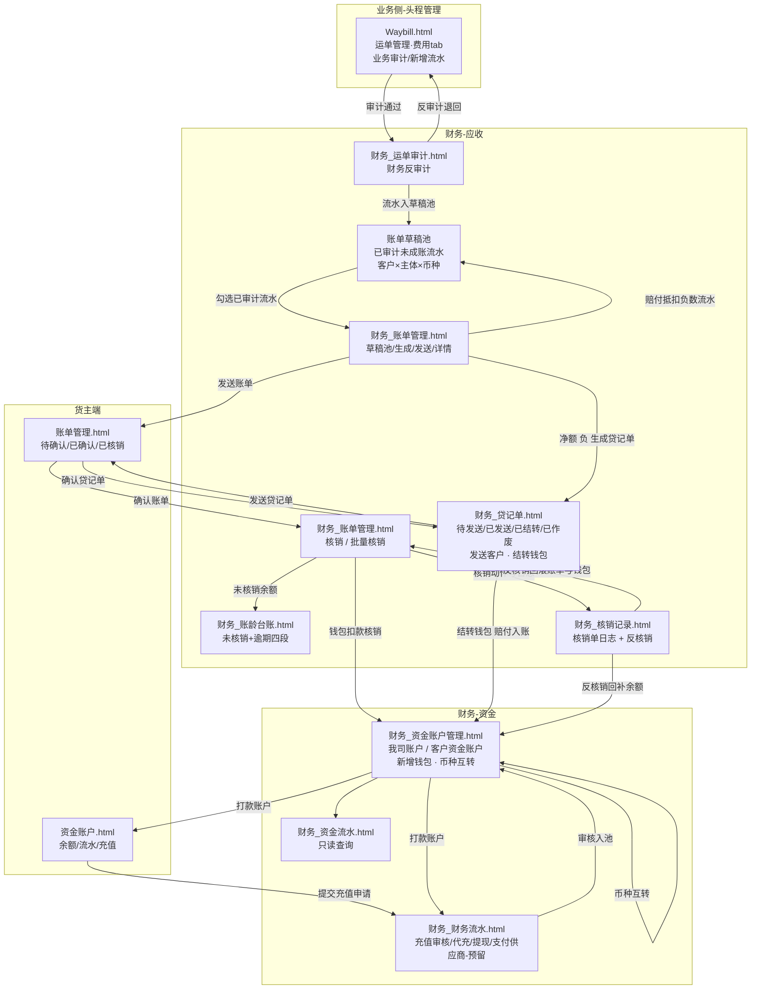

# PRD — 财务模块（Phase 1：应收管理 + 资金账户）

> **文档版本**：v1.8 ｜ **状态**：草稿（待评审） ｜ **作者**：飞点产品 ｜ **日期**：2026-09-16
> **上游**：RDD v1.8（应收 + 资金账户定稿）、数据设计 v0.11
> **范围**：Phase 1 = 应收管理（流程一~三）+ 资金账户（流程四），共 2 模块 14 项功能 / 20 条 AC。应付管理、对账中心、毛利分析、开票、**赔付入账记录（`credit_record`）与赔付管理**归 Phase 2；实际成本核算归 Phase 3。

---

## 0. 文档基础信息

| 项 | 内容 |
|:---|:---|
| 文档标题 | 财务模块产品需求文档（Phase 1：应收管理 + 资金账户） |
| 版本号 | v1.7 |
| 状态 | 草稿（待评审） |
| 作者 | 飞点产品 |
| 评审人 | 产品 / 研发 / 测试 / 财务业务代表 |
| 计划里程碑 | 评审日期、提测日期、上线日期待评审后确定 |

### 0.1 关联链接

| 文档 | 路径 |
|:---|:---|
| 用户需求 (RDD) | `drafts/财务/2026-09-16-用户需求.md`（v1.7 定稿） |
| 数据设计 | `drafts/财务/2026-09-16-数据设计.md`（v0.10） |
| 需求背景 | `analysis/2026-06-16-财务与系统调研结论.md` |
| 原型 · 员工端 | `demo/员工端-demo/` → `财务_运单审计.html`、`财务_账单管理.html`（**含核销与核销记录**）、`财务_账龄台账.html`、`财务_资金账户管理.html`、`财务_资金流水.html`、`财务_财务流水.html`（7 页） |
| 原型 · 货主端 | `demo/货主端-demo/` → `资金账户.html`、`账单管理.html`（2 页） |
| 关联模块 | 头程管理（`Waybill.html` 业务侧审计、`fee_type` 费用类型）、客商中心（合同账期、客户等级）、超级运价（当周批次公布价 + 三张优惠表 + 附加费规则）、基础资料（主体/币种） |

---

## 1. 需求定义

### 1.1 背景与现状

飞点 5 家公司（广州飞点、深圳飞点、广东飞点、香港富力顿、墨链）税务上独立法人、实际一个家族，当前财务核算**完全依赖线下 Excel**：客户打款与应收账单靠财务手工核对，钱进来不知道冲哪张账单；账期到了不知道哪些客户逾期、逾期多久；多主体、多币种的资金往来靠手工分账，极易混账。

计费侧依赖超级运价的当周公布价与附加费规则，但运单收货完成后，**应收金额 → 业务流水审计 → 账单 → 收款核销 → 账龄**这一整条链路没有系统承载，财务只能线下追着业务要数据、手工算账；客户端也缺少线上确认账单与充值的入口。

### 1.2 目标与成功口径

- **目标**：运单收货后，在系统内完成「业务流水审计 → 生成账单 → 客户确认 → 收款核销 → 账龄跟踪」闭环，且每一笔钱强制挂到具体主体与币种，不混账、可追溯。
- **成功口径**：

| 指标 | 数据来源 | 评估窗口 |
|:---|:---|:---|
| 应收流水系统生成率（收货运单中自动生成流水的占比）≥ 95% | `ar_flow` 按运单去重 / 运单模块已收货运单数 | 上线后 1 个月 |
| 账单线上确认率（已发送账单中被客户线上确认的占比）≥ 70% | `ar_bill` confirm_status=已确认(20) / send_status=已发送(20) | 上线后 2 个月 |
| 核销覆盖率（已确认账单中被核销的金额占比）≥ 90% | `ar_writeoff` 累计金额 / `ar_bill` 已确认总额 | 上线后 2 个月 |
| 逾期未核销金额占比（逾期 90+ 未核销金额占比）≤ 5% | 账龄台账 | 上线后 3 个月 |
| 财务手工对账工时下降 ≥ 50% | 财务线下工时统计（人工记录） | 上线后 2 个月 |

### 1.3 范围与边界

**In Scope（本期 P0，13 项）**

- 应收管理：A1 业务流水生成、A2 业务审计 + 财务反审计、A3 反审计 / 费用调整（已进账单的费用靠新增负数流水冲减，下期抵扣）、A4 账单生成（**自动出账跑批 + 草稿池手工成账**）、A5 账单发送 + 客户确认、A6 收款核销（同币种/部分/反核销）、A7 账龄台账
- 资金账户：B1 钱包开通、B2 充值审核（含财务代充）、B3 币种互转、B4 客户提现、B5 我方银行账户管理、B6 资金流水查询

**Out of Scope（本期不做 + 原因）**

| 排除项 | 原因 / 归属 |
|:---|:---|
| 应付管理、对账中心、毛利分析、开票 | Phase 2（`财务_财务流水.html` 已预留「支付供应商」入口空态） |
| 实际成本核算（实际成本 vs 成本预估） | Phase 3 |
| 在线付款（支付渠道） | 钱包与支付渠道解耦，未来只加渠道、钱包不动 |
| 进账↔核销关系表、自动核销 | 池化模型一期够用，待在线付款上线后做 |
| 赔付管理、赔付入账记录（`credit_record`） | Phase 2 —— 一期赔付降级为业务在运单上**手工新增一条「赔付类型」负数应收流水**，随账单抵扣运费 |
| 银行流水自动识别入账 | Phase 2（一期财务线下核对银行流水后人工审核） |
| 线上账单异议 | 异议走线下/工单，财务重新生成账单再发 |
| 汇率配置维护与汇率历史表 | 汇率调阿里汇率接口实时获取，不自建汇率表 |
| 汇损记账 | 跨币种互转一期直接转，不记汇损 |
| 导出文件生成（套模板逐账单出 Excel） | 一期做**可演示的完整链路**：财务在「账单管理 → 已发送」Tab 工具栏点「导出」→ 选模板分类（常规模板 / 出口退税模板）→ 提交后**在「后台任务」看到任务进度并可下载结果**（见 R71 / §5.11）。**真实文件生成（按 `analysis/财务导出模板/` 的两份模板逐张账单填充并打包）随对账中心在 Phase 2 统一实现** —— 一期原型只演示"提交 → 任务可见 → 结果可下载"，不产出真实 Excel |

### 1.4 影响范围

- **影响角色**：财务专员（主）、业务专员（运单侧审计 + 手工新增赔付流水）、客户/货主端用户（账单确认、充值）、系统自动任务（**每月 1 号自动出账跑批**）
- **依赖系统/模块**：

| 依赖 | 依赖内容 | 缺失时的影响 |
|:---|:---|:---|
| 头程管理（运单模块） | **收货完成事件、拣货实测完成事件、运单信息变更事件（带变更字段清单）**、运单号、业务侧审计（`Waybill.html` 费用 tab） | 无法触发生成流水 / 无法触发重算 |
| 超级运价 | 当周批次公布价、附加费规则、三张优惠表（运费优惠 / 泡比优惠 / 附加费优惠）、服务组合成本 | 取价失败 → 走手工新增（数据来源=操作人） |
| 客商中心 | 客户、**账单周期（`customer_contract.billing_cycle` 固定/不固定）**、合同账期（`customer_contract.payment_term`）、签约主体 | 无法判定自动出账资格、无法推导到期日 |
| 头程管理 `fee_type` | 费用类型字典（含 `is_credit` 赔付标记、`credit_type`） | 无法生成分类流水、无法识别赔付（抵扣）行 |
| 基础资料 | 主体（5 账套）、币种 | 无法隔离主体 |
| 阿里汇率接口 | 实时汇率（币种互转） | 降级为手工填写（来源=手工覆盖），不阻断业务 |

---

## 2. 枚举字典 ★ 研发必读

> 与数据设计 v0.10 Schema 的 TinyInt 值保持一致；跨模块枚举以来源模块为准，财务不重复定义。

### 2.1 财务自有枚举

| 枚举名 | 值 | 常量名 | 中文 | 适用实体 |
|:---|:---:|:---|:---|:---|
| FlowCategory | 10 | AR | 应收 | `ar_flow.flow_category` |
| FlowCategory | 20 | AP | 应付 | 同上（**Phase 1 仅实现应收，应付为预留枚举**） |
| FlowCategory | 30 | SALES_COMMISSION | 销售提成 | 同上（Phase 1 预留） |
| SourceType | 10 | SYSTEM_CALC | 系统自动计算 | `ar_flow.source_type`（**只有 20 人工添加的行可编辑**） |
| SourceType | 20 | MANUAL_ADD | 人工添加 | 同上 |
| AuditStatus | 10 | PENDING_BIZ_AUDIT | 待业务审计 | `ar_flow.audit_status` |
| AuditStatus | 20 | AUDITED | 已审计 | 同上 |
| SendStatus | 10 | NOT_SENT | 未发送 | `ar_bill.send_status`（账单生成后默认） |
| SendStatus | 20 | SENT | 已发送 | 同上（财务点「发送客户」） |
| ConfirmStatus | 10 | NOT_CONFIRMED | 未确认 | `ar_bill.confirm_status` |
| ConfirmStatus | 20 | CONFIRMED | 已确认 | 同上（客户在货主端确认） |
| WriteoffStatus | 10 | NOT_WRITEOFF | 未核销 | `ar_bill.writeoff_status`（**账单管理「已发送」Tab 展示本维度**，见 R17；**核销动作、核销记录与反核销也都在「账单管理」页**，见 §5.3） |
| WriteoffStatus | 20 | PARTIAL_WRITEOFF | 部分核销 | 同上 |
| WriteoffStatus | 30 | WRITTEN_OFF | 已核销 | 同上 |
| WriteoffStatus | 40 | WRITEOFF_REVERSED | 已反核销 | 同上 |
| VoidStatus | 10 | NORMAL | 正常 | `ar_bill.void_status` |
| VoidStatus | 20 | VOIDED | 已作废 | 同上（终态，三个维度全部冻结） |
| GenerateSource | 10 | AUTO | 系统自动 | `ar_bill.generate_source`（每月 1 号自动出账跑批生成） |
| GenerateSource | 20 | MANUAL | 财务手工 | 同上（财务在草稿池手工勾选成账） |
| WriteoffType | 10 | WRITEOFF | 核销 | `ar_writeoff.writeoff_type` |
| WriteoffType | 20 | REVERSE_WRITEOFF | 反核销 | 同上 |
| WalletFlowType | 10 | RECHARGE | 充值 | `wallet_flow.flow_type` |
| WalletFlowType | 20 | RECHARGE_REFUND | 充值退回 | 同上 |
| WalletFlowType | 30 | WITHDRAW | 提现 | 同上 |
| WalletFlowType | 40 | WRITEOFF | **收款核销** | 同上 |
| WalletFlowType | 50 | WRITEOFF_CANCEL | **收款核销撤销** | 同上 |
| WalletFlowType | 60 | CURRENCY_TRANSFER | 转汇 | 同上 |
| RechargeStatus | 10 | PENDING | 待审核 | `recharge_apply.status` |
| RechargeStatus | 20 | APPROVED | 已通过 | 同上 |
| RechargeStatus | 30 | REJECTED | 已驳回 | 同上 |
| RateSource | 10 | API | 接口实时 | `currency_transfer.rate_source` |
| RateSource | 20 | MANUAL | 手工覆盖 | 同上 |
| BankAccountStatus | 10 | ENABLED | 启用 | `bank_account.status` |
| BankAccountStatus | 20 | DISABLED | 停用 | 同上 |
| WalletDefault | true / false | — | 默认钱包 / 非默认 | `customer_wallet.is_default`（系统字段，员工端与货主端均不展示，二期「默认支付钱包」预留） |
| WalletOpenSource | 10 | SYSTEM | 系统自动 | `customer_wallet.open_source`（合同签约完成自动开通） |
| WalletOpenSource | 20 | MANUAL | 财务手工 | 同上（财务补开币种钱包） |
| FlowKind | 10 | FREIGHT | 运费 | `ar_flow.flow_kind` |
| FlowKind | 20 | FREIGHT_DISCOUNT | 运费优惠 | 同上 |
| FlowKind | 30 | DENSITY_DISCOUNT | 泡比优惠 | 同上 |
| FlowKind | 40 | SURCHARGE | 附加费 | 同上 |
| FlowKind | 50 | SURCHARGE_DISCOUNT | 附加费优惠 | 同上 |
| FlowKind | 60 | MANUAL | 手工新增 | 同上（人工添加行，`generate_node=30`） |
| PricingUnit | 10 | KG | 按KG | `ar_flow.pricing_unit` |
| PricingUnit | 20 | CBM | 按m³ | 同上 |
| PricingUnit | 30 | PER_SHIPMENT | 按票 | 同上 |
| PricingUnit | 40 | PER_CARTON | 按箱 | 同上 |
| PricingUnit | 50 | PER_QUANTITY | 按数量 | 同上 |
| GenerateNode | 10 | RECEIVED | 收货完成 | `ar_flow.generate_node`（参与重算） |
| GenerateNode | 20 | PICKED | 拣货完成 | 同上（参与重算） |
| GenerateNode | 30 | MANUAL | 人工添加 | 同上（**永久豁免重算**） |
| SourceRuleType | 10 | PRICING_ROW | 运价行 | `ar_flow.source_rule_type` |
| SourceRuleType | 20 | FREIGHT_DISCOUNT_RULE | 运费优惠规则 | 同上 |
| SourceRuleType | 30 | DENSITY_DISCOUNT_RULE | 泡比优惠规则 | 同上 |
| SourceRuleType | 40 | SURCHARGE_RULE | 附加费规则 | 同上 |
| SourceRuleType | 50 | SURCHARGE_DISCOUNT_RULE | 附加费优惠规则 | 同上 |

**账单号主体代码**（用于 `ar_bill.bill_no` 拼接，与主体一一对应；**序号为 5 位零填充、按 主体 × 账期月 每月从 `00001` 重置**）：

| 主体 | 主体代码 | 账单号示例 |
|:---|:---:|:---|
| 广州飞点 | GZ | `AR-GZ-202608-00001` |
| 深圳飞点 | SZ | `AR-SZ-202608-00001` |
| 广东飞点 | GD | `AR-GD-202608-00001` |
| 香港富力顿 | HK | `AR-HK-202608-00001` |
| 墨链 | ML | `AR-ML-202608-00001` |

### 2.2 引用其他模块的枚举（财务不重复定义）

| 枚举名 | 来源 | 值 / 取值 | 适用实体 |
|:---|:---|:---|:---|
| 主体（账套） | 基础资料 / 客商中心 `contract_company` | 10 广州飞点 / 20 深圳飞点 / 30 广东飞点 / 40 香港富力顿 / 50 墨链 | `ar_flow.entity_id`、`ar_bill.entity_id`、`customer_wallet.entity_id`、`bank_account.entity_id` |
| 签约账期类型 | 客商中心 `customer_contract.payment_term` | 101 月结 / 102 双月结 / 103 三月结 / 201 周结 / 202 到港前结 / 203 签收月结 / 204 到海外仓结 / 205 签收结 | `ar_flow.payment_terms_type` |
| 费用类型 | 头程管理 `fee_type`（同方向名称唯一） | 运费 / 周六派送费 / 超重费 / 地址附加费 / 商品附加费 / 报关费 / 库内贴标费… | `ar_flow.fee_type_id` |
| 赔付类型 | 头程管理 `fee_type`（`is_credit` 赔付标记 + `credit_type`，引用系统枚举配置，可自定义） | 超时赔付 / 丢件赔付 / 货损赔偿 | `ar_flow.fee_type_id`（经费用类型判定赔付行） |
| 客户 | 客商中心 | 按客户档案 | `ar_flow.customer_id` 等 |
| 币种 | 基础资料币种字典 | CNY 人民币 / USD 美元 / HKD 港币 / EUR 欧元 / PHP 比索 / JPY 日元 | 全部金额实体 |
| 汇率 | 阿里汇率接口（实时获取） | 接口返回值，人民币=1 基准 | `ar_flow.rate`、`currency_transfer.api_rate` |

---

## 3. 状态机 ★ 研发必读

### 3.1 业务流水 `ar_flow.audit_status`（单审计 + 反审计）

```
待业务审计(10) ──业务整单审计通过──→ 已审计(20) ──财务反审计（未进账单）──→ 待业务审计(10)
```

> **流水只有两个状态**（待业务审计 / 已审计）：**已进账单的流水彻底冻结、不可反审计**；要冲减已出账的费用，一律走「**在该运单上手工新增一条负数流水**（走运单审计）→ 进账单草稿池 → 在**下一期账单**里抵扣」（与赔付抵扣同一套机制，R09 / R40）。

| 当前状态 | 操作 | 目标状态 | 触发角色 | 校验条件 |
|:---|:---|:---|:---|:---|
| 待业务审计(10) | 整单审计通过 | 已审计(20) | 业务专员（「财务中心 → 运单审计」页的运单详情 · 应收 / 应付 Tab） | 运单下全部流水已逐条核对/修改完成 |
| 已审计(20) | 反审计（运单级（按应收 / 应付费用方向）/ 流水级） | 待业务审计(10) | 财务专员（`财务_运单审计.html`） | 该流水（或其所在方向）**未关联账单**（`bill_id` 为空） |
| 已审计(20) | 反审计（运单级 / 流水级） | 待业务审计(10) | 财务专员 | **该方向 / 该条没有已进账单的流水**；已进账单的流水**彻底冻结、不可反审计** → 阻断并提示「已生成账单，彻底冻结；如需调整请在运单上新增一条负数流水，于下一期账单抵扣」 |

> **账单草稿池（不新增状态）**：`audit_status = 已审计(20)` 且 `bill_id` 为空的流水即处于账单草稿池（R11）。

### 3.2 应收账单的状态维度（`ar_bill`）

**账单状态 = 三个独立维度 + 一个作废标记**（三个维度各自流转、互不覆盖，因此「已发送但未确认」「已确认但只核销了一部分」这类组合都能同时表达）：

```
① 发送状态 send_status     ：未发送(10) ──财务点「发送客户」──→ 已发送(20)
② 确认状态 confirm_status  ：未确认(10) ──客户在货主端确认──→ 已确认(20)
③ 核销状态 writeoff_status ：未核销(10) ──部分核销──→ 部分核销(20) ──补足──→ 已核销(30)
                                        ↕ 反核销 ──→ 已反核销(40) ──重新核销──→ 部分核销(20) / 已核销(30)
④ 作废标记 void_status     ：正常(10) ──财务作废（核销状态 = 未核销 时）──→ 已作废(20)（终态）
```

| 维度 | 当前状态 | 操作 | 目标状态 | 触发角色 | 校验条件 |
|:---|:---|:---|:---|:---|:---|
| 发送 | 未发送(10) | 发送客户 | 已发送(20) | 财务专员 | 账单下全部流水已审计（`audit_status=20`）；`void_status = 已作废` 时不可发送 |
| 确认 | 未确认(10) | 确认账单 | 已确认(20) | 客户（货主端） | 账单为当前客户的账单；确认后回写 `confirmed_at` |
| 核销 | 未核销(10) / 部分核销(20) | 核销（金额 ≤ 未核销金额） | 未核销金额 > 0 → 部分核销(20)；未核销金额 = 0 → 已核销(30) | 财务专员 | 钱包与账单币种一致、钱包余额 > 0、不可透支 |
| 核销 | 部分核销(20) / 已核销(30) | 反核销 | 已反核销(40) | 财务专员 | 未做账账单均可反核销，不加审批，留日志 |
| 核销 | 已反核销(40) | 重新核销 | 部分核销(20) / 已核销(30) | 财务专员 | 同上核销校验 |
| 作废 | 正常(10) | 作废账单 | 已作废(20) | 财务专员 | **核销状态 = 未核销(10)**；部分核销 / 已核销 / 已反核销 → 阻断「该账单已有核销记录，请先反核销后再作废」；作废后其下流水 `bill_id` 置空、**释放回草稿池**，写 `voided_by` / `voided_at` / `void_reason` 留痕 |
| 作废 | 已作废(20) | — | 终态 | — | 不再流转：不出现在货主端任何 Tab、不进账龄台账、不参与核销；**账单号保留不回收**，重新出账 = 生成新账单号 |

> **组合示例**：账单刚生成 = 未发送 + 未确认 + 未核销 + 正常；发出后待客户确认 = 已发送 + 未确认 + 未核销 + 正常；客户确认后财务部分收款 = 已发送 + 已确认 + 部分核销 + 正常；错单撤掉 = 已作废（其余三个维度冻结）。
>
> **页面展示分工（员工端）**：账单管理按**发送维度 + 作废标记**分 Tab（§5.2），「已发送」Tab 展示发送状态 / 确认状态，并**只读展示核销维度三列**（核销状态 / 已核销金额 / 未核销金额）；**核销的动作、弹窗、核销记录与反核销全在同一页**（「核销」按钮 + 「核销记录」Tab + 核销明细抽屉，§5.3）；货主端按客户视角展示（待确认 / 已确认，§5.9）并同样只读展示核销三列。

### 3.3 充值申请 `recharge_apply.status`

```
待审核(10) ──财务审核通过（核对银行流水到账）──→ 已通过(20)
待审核(10) ──财务驳回──→ 已驳回(30)
```

| 当前状态 | 操作 | 目标状态 | 触发角色 | 校验条件 |
|:---|:---|:---|:---|:---|
| 待审核(10) | 通过并入池 | 已通过(20) | 财务专员（`财务_财务流水.html` 充值审核 tab） | 已线下核对银行流水到账；通过后生成充值资金流水并增加钱包余额 |
| 待审核(10) | 驳回 | 已驳回(30) | 财务专员 | 未到账 / 信息不符；驳回不产生资金流水 |
| 已通过(20) | 充值退回 | 已通过(20)（新增 `wallet_flow` 反向流水） | 财务专员 | 事实记录不可改，靠反向流水纠正 |

### 3.4 我方银行账户 `bank_account.status`

```
启用(10) ──停用──→ 停用(20) ──启用──→ 启用(10)
```

| 当前状态 | 操作 | 目标状态 | 触发角色 | 校验条件 |
|:---|:---|:---|:---|:---|
| 启用(10) | 停用 | 停用(20) | 财务专员 | 停用后不再作为充值可选的打款账户；历史引用不受影响 |
| 停用(20) | 启用 | 启用(10) | 财务专员 | — |

---

## 4. 功能清单与页面映射

| 模块 | 功能点 | 优先级 | 对应页面 | 页面类型 |
|:---|:---|:---:|:---|:---|
| A 应收管理 | A1 业务流水生成（运单收货自动，逐行生成含优惠行） | P0 | 无页面（系统自动）；结果展示于 `Waybill.html` 费用 tab | 后台任务 |
| A 应收管理 | A2 业务审计 + 财务反审计 | P0 | **业务侧整票审计** = `Waybill.html` 费用 tab（列表勾选运单 → 工具栏「**运单审计**」→ 选费用方向整票审计）；**财务侧** = `财务_运单审计.html`（运单级整票 + 流水级勾选；**反审计仅财务角色，只在本页**） | 列表页 + 审计台 |
| A 应收管理 | A3 反审计 / 费用调整（已进账单的费用靠**新增负数流水**冲减，下期抵扣） | P0 | `财务_运单审计.html` | 列表页 |
| A 应收管理 | A4 账单生成（**每月 1 号自动出账跑批** + 草稿池手工成账；草稿池为**流水级**、只含已审计流水） | P0 | `财务_账单管理.html`（草稿池 Tab + 生成弹窗） | 列表页 + 生成弹窗 |
| A 应收管理 | A5 账单发送 + 客户确认（客户手动确认 / **超期自动确认**） | P0 | `财务_账单管理.html` + 货主端 `账单管理.html` | 列表页 |
| A 应收管理 | A6 收款核销（同币种 / 部分 / 反核销；**核销动作在「账单管理」页**，反核销在「核销记录」页） | P0 | `财务_账单管理.html`（「已发送」Tab 行操作 + 工具栏「批量核销」）+ `财务_核销记录.html`（反核销）；货主端账单管理（只读三列） | 列表页 + 核销弹窗 |
| A 应收管理 | A7 账龄台账 | P0 | `财务_账龄台账.html` | 查询页（实时视图） |
| A 应收管理 | A8 **账单导出**（「已发送」Tab 工具栏 → 选模板分类 → 提交导出任务，进度与结果在「后台任务」；**一期为可演示链路，真实文件生成 Phase 2**） | P0 | `财务_账单管理.html`（「已发送」Tab 工具栏 + 弹窗 7）+ 员工端 `后台任务.html` | 列表页 + 弹窗 + 后台任务 |
| A 应收管理 | A9 **贷记单**（`bill_type = 贷记(20)`：待发送 / 已发送 / 已结转 / 已作废；发送客户 → 客户确认 → 「结转钱包」结清；**不参与核销 / 账龄 / 未核销金额**，无到期日期） | P0 | `财务_贷记单.html`；货主端 `账单管理.html`（客户侧混排展示 + 「贷记单」tag） | 四 Tab 列表页 + 详情弹窗 |
| A 应收管理 | A10 **核销记录**（核销单操作日志：四个快照字段 + 反核销；**另一张表 `ar_writeoff`**） | P0 | `财务_核销记录.html` | 单列表查询页 |
| B 资金账户 | B1 钱包开通（合同签约自动 + 财务手工补开币种） | P0 | `财务_资金账户管理.html`（客户资金账户 Tab · 新增钱包弹窗） | 列表页 + 新增弹窗 |
| B 资金账户 | B2 充值审核（客户申请审核 + 财务代充） | P0 | `财务_财务流水.html`（充值审核 / 客户充值 tab）+ 货主端 `资金账户.html`（充值） | 工作台 |
| B 资金账户 | B3 币种互转 | P0 | `财务_资金账户管理.html`（客户资金账户 Tab · 币种互转弹窗） | 弹窗 |
| B 资金账户 | B4 客户提现 | P0 | `财务_财务流水.html`（客户提现 tab） | 工作台 |
| B 资金账户 | B5 我司银行账户管理（可见开关 / 默认 / 停用） | P0 | `财务_资金账户管理.html`（我司账户 Tab） | 列表页 + 弹窗 |
| B 资金账户 | B6 资金流水查询 | P0 | `财务_资金流水.html` + 货主端 `资金账户.html`（资金流水 tab） | 查询页 |

> **页面构成说明**：B1/B3/B5 由同一页 `财务_资金账户管理.html` 承载（双 Tab：我司账户 / 客户资金账户），员工端「财务 → 资金账户管理」菜单与权限点已注册。**A4/A5/A6/A8 由同一页 `财务_账单管理.html` 承载**（**4 个 Tab**：草稿池 / 待发送 / 已发送 / 已作废 —— **全部是应收账单**）；**A9 独立菜单 `财务_贷记单.html`**（4 个 Tab：待发送 / 已发送 / 已结转 / 已作废）、**A10 独立菜单 `财务_核销记录.html`**（单列表）。**为什么拆**：核销记录是**另一张表**（核销单 `ar_writeoff`）、贷记单是**另一种单据类型**（`bill_type = 贷记(20)`，无核销维度、无到期日、不进账龄）—— 挤在一页会让列语义互相污染（贷记单的核销三列恒为 `—`、核销记录 Tab 永远没有它的行、批量核销候选里它永远是噪音）。原独立菜单「**收款核销**」已下线（核销**动作**留在账单管理）。

### 4.1 页面导航关系图 ★



---

## 5. 页面规格 ★ 研发必读

> 页面顺序 = 业务流顺序。原型均为 Vue3 + Element Plus 单文件页，主题色 `#2DA44E`，金额统一「千分位 + 强制两位小数」+ 币种符号前缀，币种列显示中文名，无值显示 `—`。
> **导出入口（★ 归属「已发送」Tab，不进查询区）**：**账单导出是「账单」这个对象的动作，且只对「已发送」这批账单成立** —— 草稿池是流水级（还没成账）、待发送**尚未形成对客承诺且还可改**（R66）、已作废不该交付、核销记录是另一张表（核销单）。因此「导出」按钮**放在「已发送」Tab 内部的工具栏**，与「批量核销」同排（**导出靠左 = 次要动作、批量核销靠右 = 主操作**）；**查询区不再保留导出按钮**（原则：**同一动作不留两个入口** —— 查询区是 4 个 Tab 共用的，留在那里等于在 3 个点了没意义的 Tab 上摆一个假入口）。**导出的准入 = 先在列表勾选账单**（本 Tab 列表最左加勾选列，未勾选时按钮置灰 + 悬浮说明）—— 不做"点一下就把全量导出去"；勾选后弹「导出账单」弹窗（弹窗 7），财务只选**模板分类**，范围恒等于**勾选的这批账单**（跨客户仍允许，但不默认全量）。规则见 R71，完整规格见 §5.11。
> **其余 5 个财务列表页**（运单审计 / 账龄台账 / 资金流水 / 资金账户管理 / 财务流水）的查询区「导出」按钮**保持原样（Phase 1 占位，点击提示"导出功能开发中，导出范围待确认"）**，它们的对象是流水与台账，范围另议。
> **多 Tab 页面查询区规范**（全模块统一，已写入前端规范 `style-guide.md`）：查询区统一位于 **Tab 上方**（上层独立卡片），条件按当前 Tab 切换、不同 Tab 用各自的筛选状态对象（互不清空）；当前 Tab 无查询条件时整个查询区不渲染。**查询条件 >3 个时默认只显示前 3 个**，其余收进「更多」（展开/收起切换）。**布局统一为「外层一行不换行 + 条件弹性宽度」**：① 外层 `.search-area` 用 `flex-wrap: nowrap` + `align-items: flex-start`；② 条件放进 `.search-conditions`（`flex: 1 1 auto; min-width: 0`），且**每个条件控件用弹性宽度** `.search-control { width: 240px; flex: 1 1 150px; min-width: 140px; max-width: 240px; }` —— **宽屏 240px 统一、窄屏等比收窄，绝不折成「一行一个」**；③ 按钮组放进 `.search-actions`（`flex-shrink: 0`、内部不换行），**永远与第一行条件同排**；④ **日期区间例外**（要显示两个日期，不允许压窄，给 `flex: 0 0 240px`）；⑤ **写操作按钮（生成账单等）不进查询按钮组**（见下）。**宽度基准**：`index.html` 侧边栏固定 240px + 页面 padding 64px → **查询区可用宽 = 视口宽 − 304**（1366 笔记本 ≈ **1022px**），**自检要按这个宽度测**。规范见 `style-guide.md` §多 Tab 页面查询区规范。按钮顺序统一为：查询 → 重置 → 更多（有则）→ 导出（有则）→ 右侧主操作按钮（新增账户/新增钱包/生成账单等）。**注**：导出按钮**是否留在查询区取决于该页的导出对象是否就是当前 Tab 的列表** —— 账单一页的导出对象只有「已发送」一批，故已移入该 Tab 工具栏（见上）；其余页面暂留查询区。

### 5.1 运单审计（员工端 · 财务侧）

**页面信息**

- 路径：财务中心 / 运单审计
- 类型：列表页（**状态 Tab** + 单表 + 分页）
- 访问角色：财务专员（反审计仅财务可操作）
- **列表范围 = 审计范围内的运单状态**：**已收货 / 转运中 / 已到港 / 已清关 / 已到仓 / 已签收 / 退件**（**已下单 / 收货中 / 已取消不在本页** —— 收货完成前不产生任何应收流水，没有可审的费用）；**进入本页默认命中「全部」**。**退件放开**：客户把货送来了但不发货、要退货给客户，收货产生的成本仍需客户承担 → 退件运单**允许新增 / 编辑 / 删除流水与审计**
- **状态分组 = 状态 Tab**（与运单管理一致）：`已收货 (N) / 转运中 (N) / 已到港 (N) / 已清关 (N) / 已到仓 (N) / 已签收 (N) / 退件 (N) / 全部 (N)`（**「全部」在最后**，**默认命中「全部」**），**状态不做成查询条件下的下拉**；**查询区在状态 Tab 上方，上下两层**（原型规范：查询区永远在 Tab 上方，不放进 `el-tab-pane` 内）
- 顶部区域：仅查询筛选条，无统计卡/概览条/提示条
- **本页 = 财务侧审计台**：① **运单级（按方向整票）** —— 列表**勾选运单** → 点「**审计**」/「**反审计**」→ 选应收 / 应付 → 该方向全部流水统一审计 / 反审计；② **流水级** —— 点**运单号**进入详情 → 在**应收 / 应付 Tab** 里**勾选流水** → 点「审计」/「反审计」（**反审计仅财务角色可执行**）。**③ 业务侧整票审计的入口在运单管理页**（`Waybill.html`）费用 tab：列表**勾选运单** → 工具栏「**运单审计**」→ 选应收 / 应付方向 → 该方向全部流水统一审计（**只提供「审计」；反审计仅财务角色，只在本页**）—— 审计后该方向标记置「已审计」、流水冻结、**整票不允许再新增该方向费用**

**查询条件**

| 字段名 | 中文名 | 类型 | 默认值 | 选项 / 规则 |
|:---|:---|:---|:---|:---|
| waybillNo | 运单号 | Input（clearable，宽 240） | 空 | 模糊匹配 —— **默认展示** |
| user | 客户昵称 | Select（multiple，宽 240） | 空 | 多选 —— **默认展示** |
| pickTime | 拣货时间 | DatePicker（daterange，宽 240） | 空 | 区间 —— **默认展示** |
| customerNo | 客户单号 | Input（宽 240） | 空 | 更多查询条件 |
| fbaNo | **FBA 单号** | Input（宽 240） | 空 | 更多查询条件（紧接客户单号；非 FBA 运单留空） |
| blNo | 提单号 | Input（宽 240） | 空 | 更多查询条件（含柜号） |
| service | 服务组合 | Select（multiple，宽 240） | 空 | 更多查询条件 |
| cusNo | 客户编号 | Input（宽 240） | 空 | 更多查询条件 |
| sales | 销售代表 | Select（multiple，宽 240） | 空 | 更多查询条件 |
| exportInspectFirst | 出口先查后装模式 | Select（宽 240） | 空 | 更多查询条件 |
| customMark | 自定义标识 | Select（multiple，宽 240） | 空 | 更多查询条件 |
| linkedBill | 关联账单 | Select（宽 240） | 空 | 更多查询条件（按流水是否已关联账单过滤） |
| auditStatus | 审计状态 | Select（宽 240） | 空 | 更多查询条件。**6 个取值 = 运单级方向两态 + 部分审计**，分两组：① **运单级（整票，按方向两态）** —— `未审计` / `应收已审计` / `应付已审计` / `均已审计`；② **部分审计（该方向有流水已审计、整票未审）** —— `应收部分审计` / `应付部分审计`。判定见下方「审计状态判定」 |
| supplier | 供应商 | Select（宽 240） | 空 | 更多查询条件 |

> **查询区规范**（对齐前端 style-guide）：① **位置 = 状态 Tab 上方**（上下两层，查询区不放进 `el-tab-pane` 内）；② **条件文字写在输入框内（`placeholder`），外部不放 label**；③ **默认只展示 3 个条件（运单号 / 客户昵称 / 拣货时间）**，其余 11 个收进「**更多查询条件**」；④ **点击「查询」后查询条件默认收起**（回到只露 3 个）；⑤ **全部条件控件同宽（240px）** —— 日期区间（拣货时间）不得比其它条件宽一截；⑥ 按钮顺序统一 `查询 → 重置 → 更多查询条件 → 导出`。

> **审计状态判定**（`auditStatus` 六个取值怎么算）：两层审计标记各管一段 —— **运单级方向标记**（`waybill_fee_audit`，整票语义）与**流水级审计标记**（`ar_flow.audit_status`，逐条语义），**流水级审计不动运单级标记**，因此必然出现「该方向已有流水审计通过、但整票还没审」的中间态，本条件把它显性化。
>
> | 取值 | 判定 |
> |:---|:---|
> | 未审计 | **应收、应付两个方向都未整票审计，且两个方向都没有已审计流水** |
> | 应收已审计 | 应收方向**整票已审计**（应付方向不限） |
> | 应付已审计 | 应付方向**整票已审计**（应收方向不限） |
> | 均已审计 | **两个方向都整票已审计** |
> | 应收部分审计 | 应收方向**未整票审计**，但应收流水里**已存在审计通过的行** |
> | 应付部分审计 | 应付方向**未整票审计**，但应付流水里**已存在审计通过的行** |
>
> 口径细节：**「已审计流水」只认 `已审计`**；**整票审计（运单级）必然把该方向全部流水置为已审计**，所以「整票已审计」的方向不会再落进「部分审计」桶；主列表「审计标识」列在出现部分审计时，会在对应方向的标签后追加「**· 部分已审**」并以 tooltip 显示该票的综合判定值（如「应收部分审计」）。

**列表列**

**列数**：**40 个业务列** + 多选列 + 操作列（顺序见下）

> **列顺序（与产品口径一致）**：**运单号 → 客户单号 → FBA 单号 → 客户编号 → 客户昵称 → 销售代表 → 服务组合 → 提单柜号 → 仓库代码 → 收件人 → 国家 → 邮编 → 件数 → 泡比 → 客户重量 → 客户体积 → 实重 → 材重 → 体积 → 收费重 → 报关方式 → 应收 → 应付 → 毛利 → 附加费标识 → **审计标识** → 自定义标识 → 商品主品名 → 产品属性 → 客户备注 → 内部备注 → 下单时间 → 拣货时间 → 签收时间 → 最后路由 → 交货站点 → 进口申报模式 → 出口先查后装模式 → 关联账单 → 供应商**；多选列固定在最左、操作列固定在最右。

| 列 | 字段 / 取值 | 规则 |
|:---|:---|:---|
| 多选 | — | `type="selection"`（左固定），供**运单级审计 / 反审计**与工具栏「**费用管理**」批量入口使用 |
| 运单号 | `orderNo` | **可点击**（打开「运单审计 · 运单详情」做流水级审计 / 费用维护） |
| **FBA 单号** | `fbaNo` | 该运单的 **FBA 货件编号**（如 `FBA15XXXXXXX`），**非 FBA 运单显示「—」**；**紧接「客户单号」之后** |
| 应收 / 应付 / 毛利 | Σ 折合金额（见 R62） | **单元格 = 总额（金额 + 币种）**：单币种且汇率恒为 1 → `CNY 1,265.00`；含外币或汇率 ≠ 1 → `≈ CNY 1,975.00`（折合本位币，前加「≈」）。**悬浮 = 费用明细**：小表列出 **费用类型 / 审计状态 / 金额 / 币种**（**存在汇率 ≠ 1 的流水时追加 汇率 / 折合 CNY 两列**；列序与页面「费用管理」Tab 一致 —— **审计状态紧跟费用类型**，tag 配色 = 已审计 `success` / 已红冲 `danger` / 其他（待业务审计）`warning`），底部给「总额」与多币种时的「原币小计」（如 `CNY 1,265.00 / USD 100.00`）。无流水显示「—」；毛利 = 应收折合 − 应付折合，负值红字 |
| 关联账单 | 该运单流水上的账单号 | `el-tag`（已关联=warning）；无则「—」（不可点）。**有账单时可点击**：新标签页打开「账单管理」并**自动打开该账单详情**（`财务_账单管理.html?billNo={账单号}`，见 §5.2 交互）—— 一票关联多张账单时展示**首张**，tooltip 追加「本票关联 N 张账单」 |
| 审计标识（**紧接「附加费标识」之后**） | `arAuditStatus` / `apAuditStatus` | **应收 / 应付两个方向各一枚 `el-tag`**（已审计=`success` / 未审计=`info`），tooltip 显示「审计人 · 时间」；**该方向未整票审计但已有流水审计通过时，标签后追加「· 部分已审」**，标签 tooltip 额外显示综合判定值（未审计 / 应收部分审计 / 应付部分审计 / 应收已审计 / 应付已审计 / 均已审计） |
| 操作 | — | 固定右侧：**详情** |

**交互行为**

- 工具栏（**共 4 个按钮**）：**[审计]** / **[反审计]** / **[费用管理 ▾]** / **[复制运单号]**
  - **[审计] / [反审计]**：对**勾选的运单**执行（弹窗内选**费用方向**：应收 / 应付；未审计方向在反审计时置灰、已审计方向在审计时置灰）；未勾选运单时置灰
  - **[费用管理 ▾]**：下拉 **添加应收 / 添加应付** —— 上下文 = **勾选的运单**（未勾选 → 阻断「请先勾选需要添加应收的运单」；多票时按「费用 × 票」批量铺开，见 §5.10）；未勾选或状态不支持费用操作时置灰
  - **[复制运单号]**：把**勾选运单**的运单号按行复制到剪贴板（未勾选时复制当前打开详情的运单；都为空 → 提示「请先勾选需要复制运单号的运单」），成功后 Toast「已复制 N 个运单号」
- [详情] / 点运单号：打开「运单审计 · 运单详情」（**应收 / 应付双 Tab + 流水明细 + 勾选 + 新增 / 编辑 / 删除 + 审计 / 反审计**）
- [查询 / 重置]：Toast「执行查询」；重置清空全部查询项，无 Toast
- **列表含未审计运单**（不只列已审计台账）—— 财务可据此看到「还有多少没审」

**弹窗 1：运单级审计 / 反审计**（宽 640，审计与反审计共用，仅标题与可用方向不同）

- 只读区「运单信息」：运单号（多票时「已选 N 票」+ 逐票列出）/ 客户 / 服务组合
- 表单区「选择费用方向」（`el-checkbox-group`，多选）：**应收** / **应付**
  - **审计**模式：仅**未审计**的方向可选（已整票审计的方向置灰 + tooltip「该方向已审计」）
  - **反审计**模式：仅**已审计**的方向可选（未审计的方向置灰），两个方向都已审计时默认全选；**反审计留痕**（原因选填）
- 提交校验：一个方向都没选 → 警告「请选择费用方向」
- 二次确认（`ElMessageBox.confirm`，type warning）：`确认{审计 / 反审计} {运单号} 的{应收 / 应付}费用？{反审计后退回业务侧重新审计。}`
- 成功 Toast：`已{审计 / 反审计} N 票运单的{应收 / 应付}费用`
- 底部按钮：取消 / 确认（反审计为 danger）

**弹窗 2：运单详情**（宽 1180，**结构与运单管理详情一致**；**运单资料类操作按钮全部置灰只读，只有「费用管理」Tab 可写**）

- **Tab 结构同运单管理详情**：运单概览 / 货箱信息 / 商品信息 / 派送标签 / POD管理 / 费用管理 / 工单与日志（**运单资料各 Tab 只读，不做资料编辑；只有费用管理 Tab 可写**）
- **运单资料类操作按钮一律置灰**（本页只做费用核对与纠正，运单资料改动去运单管理 / 对应业务页面）：**编辑运单**（运单概览）、**编辑货箱 / 编辑测量数据 / 编辑快递单 / 取消·退件货箱 / +FBA运单 / +添加SKU**（货箱信息）、**添加标签·比价 / 批量下载标签 / 重新比价 / 打印**（派送标签）、**创建工单 / 上传附件 / 修改附件 / 删除附件**（工单与日志）、**轨迹追踪的 添加 / 编辑 / 复制 / 删除**；编辑态入口置灰后，依赖进了编辑态才出现的控件（保存 / 取消 / 手动添加货箱 / 删除 SKU 行等）自然不可达。**保留可用的只有「查看类」动作**：返回列表、申报信息「查看」、附件「下载」、货箱与轨迹的展开 / 收起、流水「详情」
- 运单概览：运单状态 / 客户名称 / 昵称 / 服务组合 / 地址库编码 / 国家 / 件数 / 实重 · 材重 · 收费重 / 体积 · 泡比 / 报关方式 / 清关方式 / 交货条款 / 商品属性 / 拣货时间 / 签收时间 / 客服代表 · 销售代表 + **费用汇总（应收 / 应付 / 毛利）**
- 货箱信息 / 商品信息 / POD管理 / 附件管理：只读明细表
- **费用管理 Tab 内再分应收 / 应付**（Tab 标题带该方向审计状态 tag）：
  - 顶部指标：该方向**流水条数** + **合计金额**；右侧 **[新增流水]** + **[审计] / [反审计]** 按钮
  - 明细表（多选）：费用类型 / 流水种类 / **币种 / 汇率** / 单价 / 计价单位 / 计费量 / 金额（带符号）/ **关联账单**（有账单显示账单号 tag，无则「—」；**本页集中展示流水的账单归属**）/ 审计状态 / 操作（**编辑 / 删除**）
  - **可写操作按 R61 四层 AND 校验**：新增流水 / 编辑 / 删除随运单状态、运单审计标记（按方向）、账单关联、流水审计标记逐层置灰并给出原因；**已审计的流水不可变更，但该方向未整票审计时仍可新增流水**
  - **流水级审计规则**：勾选后按行执行 —— **已审计的流水允许勾选**（用于反审计）；**该方向已整票审计时两个按钮置灰**并提示改走列表「反审计」；**该条已进账单时流水级反审计被阻断**（提示「已生成账单，彻底冻结；如需调整请新增负数流水」）
  - **流水级审计不改变运单级标记**（这正是「运单未审计 + 个别流水已审计」中间态的来处）

**关联接口**

- 列表：`GET /api/finance/waybill-audits`（params: waybillNo, customerName, **arAuditStatus, apAuditStatus**, linked, page, pageSize）—— 返回**审计范围内的全部运单**（含未审计）
- 详情：`GET /api/finance/waybill-audits/{waybillId}`（返回**各费用方向的审计状态 + 流水条数 + 金额 + 关联账单标记**）
- 运单级审计：`POST /api/finance/waybill-audits`（body: `waybillIds[]`, `feeDirections[]` = `ar`/`ap`）—— 置运单该方向标记为「已审计」+ 该方向全部流水置「已审计」
- 运单级反审计（按方向）：`POST /api/finance/waybill-audits/reverse`（body: `waybillIds[]`, `feeDirections[]` = `ar`/`ap`, `reason`）—— 置运单该方向标记为「未审计」+ 该方向全部流水退回「待业务审计」+ 写反审计留痕
- 流水级审计 / 反审计：`PATCH /api/finance/ar-flows/audit`（body: `flowIds[]`, `auditStatus`）—— **不改动运单级标记**

### 5.2 账单管理（员工端 · 财务侧）

**页面信息**

- 路径：财务中心 / 账单管理
- 类型：**四 Tab 列表页**（草稿池 / 待发送 / 已发送 / 已作废 —— **全部是应收账单**）+ 生成入口 + 核销弹窗（**核销「动作」在本页**，见 §5.3；**核销记录与反核销**在独立菜单 `财务_核销记录.html`，见 §5.13；**贷记单**在独立菜单 `财务_贷记单.html`，见 §5.12）
- 访问角色：财务专员
- 顶部区域：**`生成账单` 按钮位于「草稿池」Tab 内部**（Tab 下方、表格上方、独立一行、右对齐）—— **只有「草稿池」Tab 显示**（它只服务草稿池的成账），切到其它 Tab 时按钮消失且 **Tab 行位置不跳动**。**它服务的是"从条件出账"** —— 点它即以**空态弹窗**打开、由财务逐级选范围（草稿池不设勾选列）。**同一套位置规则**还覆盖另三个 Tab 级动作：**「待发送」Tab 的「批量发送」**（弹窗 6）、**「已发送」Tab 的「批量核销」**（弹窗 5）与**「已发送」Tab 的「导出」**（弹窗 7）—— 都放在各自 `el-tab-pane` 内部、右对齐、不占表格宽度（同一工具栏内多个动作时：**次要动作靠左、主操作靠右**，故「已发送」为 `导出 → 批量核销`）。两条硬约束：① 它属**写操作 / 对外交付动作**，按查询区规范**不进查询按钮组**（查询区只留 查询 / 重置 / 更多查询条件）；② **绝不与 Tab 同一行**（同 Tab 行会让 `el-tabs` 只拿到「卡片宽 − 按钮宽 − 间距」，**表格被切窄 118px、列表无法铺满卡片**）。**页面不放口径说明条**（口径以本 PRD 与原型交互为准）

**Tab 结构**

| Tab 名称 | 归属规则 | 查询区 | 行操作 |
|:---|:---|:---|:---|
| 草稿池 (N) | `bill_id` 为空 **且 `audit_status = 已审计(20)`** 的**流水**（**一行一条流水，不按运单聚合**） | **账期（Select，240）** / **客户昵称（Select multiple，240）** / **客户编号（Input，240）** / 我司主体（Select，240）/ 币种（Select，240）/ 运单号（Input，240）/ 客户单号（Input，240）/ 拣货时间（daterange，240） —— **共 8 个条件**，控件**统一 240px**、条件文字写在 `placeholder`（**外部不放 label**）、**默认只露前 3 个**（账期 / 客户昵称 / 客户编号）其余 5 个收进「**更多查询条件**」、**点「查询」后默认收起**；按钮顺序 `查询 → 重置 → 更多查询条件 → 导出`（**主操作 `生成账单` 在 Tab 行右侧，不在本查询区**）。**布局与「运单审计」页的查询区一致**（见 §5.1 查询区规范） | 勾选流水后「生成账单」 |
| 待发送 (N) | `send_status = 未发送(10)` 且 `void_status = 正常(10)` | **账单编号（Input，240）/ 客户昵称（Select multiple，240）/ 客户编号（Input，240）/ 我司主体（Select，240）** —— **共 4 个条件**（默认只露前 3 个，「我司主体」收进「更多查询条件」；`点查询后收起`） | 详情 / **发送客户** / 作废（`writeoff_status = 未核销(10)`） |
| 已发送 (N) | `send_status = 已发送(20)` 且 `void_status = 正常(10)`（**不管确认与核销**） | **账单编号（Input，240）/ 客户昵称（Select multiple，240）/ 客户编号（Input，240）/ 我司主体（Select，240）/ 核销状态（Select，240）** —— **共 5 个条件**（默认只露前 3 个，后 2 个收进「更多查询条件」；`点查询后收起`）。**「核销状态」用来一步筛出「待核销」那批**（选未核销 / 部分核销），等价于原「收款核销 → 待核销」Tab | 详情 / **核销**（`unreceived_amount > 0` 时显示；**客户未确认时置灰 + 悬浮提示**，见 R67）/ 作废（**已有核销记录的账单不显示作废** —— **核销状态 ≠ 未核销 的账单**，判据 = `writeoff_status = 未核销(10)`，须先反核销）。**Tab 内工具栏另有两个动作：「导出」**（见弹窗 7 / R71；**导出对象就是本 Tab 当前查询结果的这批账单**，所以按钮归本 Tab 而不是查询区）**与「批量核销」**（见弹窗 5 / R68）—— 两者都是 **Tab 级动作，不在操作列**。**列表不做多选列** —— 一次批量只处理**一个钱包**，而列表里同时存在多个钱包的账单，"多选 + 全选"必然要解释"为什么这些行勾不上"，故改为**从钱包进**：按钮 → 弹窗里选钱包 → 默认全选该钱包下全部可核销账单 → 可逐张取消。**导出的准入 = 先勾选**：本 Tab 列表最左有**勾选列(46)**、表头可全选当前页，未勾选时「导出」置灰（**不做"一点就全量导出"**）—— 与「批量核销」的差别在于**导出是只读动作、勾错可以重来**，所以给它勾选这种最省事的交互（核销这类会动钱的动作仍按「从钱包进」，范围由人主动锁定） |
| 已作废 (N) | `void_status = 已作废(20)` | **账单编号（Input，240）/ 客户昵称（Select multiple，240）/ 客户编号（Input，240）/ 我司主体（Select，240）** —— **共 4 个条件**（默认只露前 3 个，「我司主体」收进「更多查询条件」；`点查询后收起`） | 详情（只读；**作废留痕（作废人 / 时间 / 原因）在详情内「操作时间线」的「作废账单」条目里，头部不单列一行**） |

> **Tab 归类口径**：本页 **4 个 Tab 只按「应收账单」自身的发送维度 + 作废标记分**，**不按核销情况分 Tab** —— 账单一旦发送给客户就一直留在「已发送」Tab（含部分核销 / 已核销 / 已反核销），收没收钱由「**核销状态**」列（配合「已核销金额 / 未核销金额」两列）区分，并用「核销」按钮就地核销。**核销记录（核销单，另一张表）与贷记单（另一种单据类型）已各自独立成菜单**（§5.13 / §5.12），不参与本页 Tab 归类。

**列表列**

| Tab | 列 |
|:---|:---|
| 草稿池 | 运单号(150) / 服务组合(140) / 客户单号(150) / **FBA 单号(150)** / 客户编号(110) / 客户昵称(140, tooltip) / **客户名称(190, tooltip)** / **账期(中,130)** / **仓库代码(中,100)** / **收件人(100, tooltip)** / **邮编(中,90)** / **国家(中,80)** / **我司主体(110)** / 运单状态(中,90) / 费用类型(120) / 流水种类(中,90) / 币种(中,80, 中文名) / 汇率(右,90, 6 位小数) / 单价(右,100) / 计价单位(中,90) / 金额(右,120, **带符号**) / 描述(180, tooltip) / 备注(160, tooltip) / 拣货时间(中,140) / 创建时间(中,140) |
| 待发送 | 账单编号(**200**) / 客户名称(190, tooltip) / 客户昵称(140, tooltip) / 客户编号(110) / 我司主体(110) / 币种(中,80, 中文名) / 账单日期(中,110) / **账期(中,150)** / 到期日期(中,110) / 账单金额(右,120) / **发送状态(中,100, tag)** / 操作(170, fixed：详情 / 发送客户 / 作废) |
| 已发送 | **勾选列(46)** / 账单编号(**200**) / 客户名称(190, tooltip) / 客户昵称(140, tooltip) / 客户编号(110) / 我司主体(110) / 币种(中,80, 中文名) / 账单日期(中,110) / **账期(中,150)** / 到期日期(中,110) / 账单金额(右,120) / **发送状态(中,100, tag)** / **确认状态(中,110, tag + 悬浮显示「确认信息」)** / **核销状态(中,110, tag)**/ **已核销金额(右,120)**/ **未核销金额(右,120, > 0 红色)** / 操作(200, fixed：详情 / 核销 / 作废（**已有核销记录的账单置灰 + 悬浮说明原因**）) —— **共 17 列**（含最左勾选列，勾选只服务「导出」） |
| 已作废 | 账单编号(**200**) / 客户名称(190, tooltip) / 客户昵称(140, tooltip) / 客户编号(110) / 我司主体(110) / 币种(中,80, 中文名) / 账单日期(中,110) / **账期(中,150)** / 到期日期(中,110) / 账单金额(右,120) / **作废标记(中,100, tag 固定「已作废」)** / 操作(100, fixed，仅「详情」) |

**状态 tag 按维度各自映射**（每个维度各一枚 tag）：
- **发送状态**：`未发送` = info、`已发送` = primary
- **确认状态**：`未确认` = warning、`已确认` = success
  - **「已确认」不区分手动与自动**（客户确认 / 超期自动确认都置 `confirm_status = 已确认(20)`，两者对后续核销与账龄**等效**）；**要看是哪种确认、什么时间确认的 → 悬浮「确认状态」tag**（内容 = 确认信息，见 R16）；**两端账单详情也展示同一份「确认信息」**
- **核销状态**：`未核销` = info、`部分核销` = warning、`已核销` = success、`已反核销` = danger
- **作废标记**：`已作废` = danger
- **核销状态**：**账单管理「已发送」Tab 只读展示**（一列 tag + 已核销金额 / 未核销金额两列；货主端两个 Tab 同）；**核销动作与核销记录在「收款核销」**

> **三个账单级 Tab 的「账期」列 = 账单快照**：显示 **`{签约账期}+{天数/号}`**（如 **`月结+15`**、`双月结+15`、`周结+7`；`月结+30`）；`+` 直连、无空格 —— **「天数/号」是客商中心合同上的数字字段（1–31），只有数字、没有「月末 / 月初」这类文字值**；`0` / 空 = **未填** → 视为账期未完善，**不允许出账**）。**账期一律来自合同、账单不做补录**，所以账单上必然有账期（否则生成时就被阻断）。**账期天数（`payment_terms_days` = 到期日期 − 账单日期 + 1）是派生值、仅供账龄台账起算，页面不展示**（见 R14 / R57）。

> **草稿池为什么是流水级**：成账颗粒度 = 流水（R11），财务逐条勾选要成账的流水；同一运单的不同流水可以落在不同账单里（后续新审计通过的流水、赔付抵扣流水天然进下一期账单），因此**一个运单可关联多张账单**。
>
> **草稿池的「创建时间」** = 该条流水的创建时间（`ar_flow.created_at`）。该字段在运单费用流水页两端都不展示，**只在本页露出**（财务对账取数用）。
>
> **草稿池不含未审计流水、也不做任何未审提示**：入池门槛 = 已审计（R11）。财务要看未审计流水请走「运单审计」（§5.1）。
>
> **草稿池是「实时视图」、不建表；其中「账期」列也是实时取合同账期（★）**：草稿池 = `ar_flow` 上「`audit_status = 已审计` 且 `bill_id` 为空」的**实时查询结果**，每一列都取**当下的实时值**、**不落任何快照**。其中**「账期」列实时取该「客户 × 我司主体」的合同账期 `customer_contract.payment_term`**：合同账期段齐全 → 显示签约账期名（`月结` / `双月结` / `三月结` / `周结` …）；**合同账期段为空 → 显示「待补录」**。客户在「客商中心 → 客户管理 → 合同/账期」补齐后，**该列自动变成正常账期名，无需任何同步动作**。
> **账期为「待补录」时页面不给提示条**：跑批跳过与手工成账阻断都是**逐次动作的阻断**，不做成页面常驻提示 —— 财务看草稿池的「账期」列即可定位（**账单不做账期补录**，补录唯一入口 = 客商中心，见 R11 / R14 / U06）。
>
> **核销维度展示边界（★）**：**核销的「状态与金额」是账单自身的属性** → 在「已发送」Tab 展示三列；**核销的「动作 / 弹窗 / 核销记录 / 反核销」也全部在本页**（「核销」按钮 + 「核销记录」Tab + 核销明细抽屉，§5.3）—— **不再有第二个菜单、也不再有跨页跳转**。
> 因此 **「待发送」与「已作废」两个 Tab 不加核销三列** —— 未发送的账单必然未核销（0 / 全额），已作废的前置判据就是「未核销」，两者都是恒值。
> **「核销状态」tag 可点击** → **就地打开该账单的「核销明细」抽屉**（该账单的核销单子集，含反核销）—— 同一页内的下钻，**不是跨页跳转**。
>
> **查询区分工（★）**：**草稿池 = 8 个条件**（账期 / 客户昵称 / 客户编号 / 我司主体 / 币种 / 运单号 / 客户单号 / 拣货时间，默认露前 3 个）；**待发送 / 已发送 / 已作废 三个账单级 Tab 统一 4 个条件** —— **账单编号 / 客户昵称 / 客户编号 / 我司主体**（默认露前 3 个，「我司主体」收进「更多查询条件」）。全部控件宽 **240px**、条件文字写在 `placeholder`（**外部不放 label**）、**点「查询」后默认收起**；按钮顺序 `查询 → 重置 → 更多查询条件 → 导出`。**「账期」条件**按签约账期名筛选（含 `待补录`）；**客户编号**支持模糊匹配。
>
> **草稿池的「账期」列 = 签约账期（实时取合同，非快照）**：取值 = 该行「客户 × 我司主体」合同上的 `payment_term` → 显示 **`月结` / `双月结` / `三月结` / `周结` / `到港前结` / `签收月结` / `到海外仓结` / `签收结`** —— **草稿池只显示签约账期名，不带「+ 天数/号」**（账单侧才带，见上）；**合同账期段为空 → 显示 `待补录`**。
>
> **草稿池为什么是实时的**：草稿池不是表，而是 `ar_flow` 上「已审计 + 未成账（`bill_id` 为空）」的**实时查询结果** —— 所以它的「账期」也只能实时读合同；**一旦成账，账期与到期日就以账单上的快照为准**（合同后续变更不影响已生成账单，见 R14 / 数据设计 表 2）。
>
> **账期为空 = 不能出账（★）**：显示 `待补录` 的客户组**不允许生成账单**（点「生成账单」即阻断，见交互行为），**账单不做账期补录** —— 账期唯一入口是客商中心「客户管理 → 合同/账期」（R14 / R11）。

**弹窗 1：生成账单**（宽 880，`label-position: top`；**净额 < 0 时弹窗标题、二次确认标题与底部按钮一并切换为「生成贷记单 / 确认生成贷记单」**，见下方提交校验 ④）

- **排版**：两个区块 —— 「**账单信息**」（`section-title`，与弹窗 2、弹窗 4 同一套分区样式）+ 「**可成账流水**」；账单信息 = **两列 × 3 行**（`el-row :gutter="24"` + `el-col :span="12"`，六个字段等宽、左右两列对齐）：**客户 / 我司主体** → **币种 / 账单日期** → **账期 / 到期日期**；条件类字段给 `required` 红星

| 字段名 | 中文名 | 类型 | 必填 | 校验文案 | 联动 |
|:---|:---|:---|:---:|:---|:---|
| customerId | 客户 | **Select（可搜索）** | ✅ | 请选择客户 | **逐级联动第 1 级**；**`filterable` 模糊搜索** —— 客户名称 / 客户昵称 / 客户编号 三字段任一命中即出（下拉项 = `{客户名称}` + 右侧灰字 `{昵称} · {编号}`）；**选项只列「有可成账流水」的组合**（已审计 · 未成账 · 账期可推导）；**改客户 → 清空我司主体与币种**（不代填） |
| entityId | 我司主体 | **Select** | ✅ | 请选择我司主体 | 第 2 级，未选客户时禁用；选项 = 该客户下**有可成账流水**的主体；**改主体 → 清空币种**；决定账单号主体代码 |
| currency | 币种 | **Select（显示中文名，如「人民币」）** | ✅ | 请选择币种 | 第 3 级，未选主体时禁用；选项 = 该组合下**有可成账流水**的币种；**三条件选齐即锁定唯一组合**，决定金额符号 |
| billingDate | **账单日期** | Date（`YYYY-MM-DD`） | ✅ | 请选择账单日期 | **可编辑**，默认 = **生成当月的自然月末**（手工出账口径）；取 `YYYYMM` 生成账单号账期段 |
| paymentTerm + daysOrDate | **账期** | **只读文本** | — | — | 显示 **`{签约账期}+{天数/号}`**（如 **`月结+15`**；`月结+30`）；`+` 直连、无空格），取值 = 合同 `payment_term` + 合同账期天数/号 `days_or_date`；**未锁定组合时显示「—」**；**锁定组合后必然可推导**（账期为空 / 事件型的组合不进条件候选，见下方「两种进入方式」） |
| dueDate | **到期日期** | **只读文本** | — | — | **派生只读**，按「签约账期 + 天数/号」推导（按月类当**「号」**、按天类当**「天数」**，见下方规则与 R57）；随账单日期 / 账期实时刷新；**不可编辑** |

- **进入方式（唯一）**：草稿池点「生成账单」→ 弹窗**空态起步**（候选区显示虚线空态 `请逐级选择 客户 → 我司主体 → 币种`、底部按钮置灰），由财务逐级选条件锁定组合；**草稿池不设勾选列** —— 要只出其中几条时，在弹窗里逐条取消勾选即可
- **到期日期（只读）**：按「签约账期 + 天数/号」推导，**随账单日期 / 账期实时刷新**（口径见 R14 / R57）：① **按月类（月结 / 双月结 / 三月结）** —— 「天数/号」当**「号」**用，账单月 = 账单日所在月 + 结算月（月结 0 / 双月结 1 / 三月结 2），到期日 = **账单月第 N 号**（N = 合同「天数/号」，**1–31 的数字**；该号**不晚于账单日**（含当天）→ **顺延到下一月同一号**；该月无该号 → 取月末）；② **按天类（周结）** —— 「天数/号」当**「天数」**用，到期日 = 账单日 + 天数 − 1；③ **事件型（到港前结 / 签收月结 / 到海外仓结 / 签收结）** 推不出到期日 → **不允许出账**（这类组合不进条件候选；从草稿池勾选路径进入时给具体原因并阻断）。**字段名统一叫「到期日期」**
- 可勾选区（表格 `max-height: 260`）：**候选 = 锁定组合下的全部可成账流水**；**锁定组合后默认全部勾选**，可逐条取消 / 重新勾选来微调（表格勾选态与汇总始终一致）；未锁定组合时该区域显示虚线空态。列 = 勾选框 / 运单号 / 费用类型 / 流水种类 / 币种 / 单价 / 计价单位 / 金额（右，**带符号**）/ 描述
- 汇总文案：`已选 {N} 条流水，账单总额：{币种符号}{金额}`；**账单总额为负时追加黄底提示**（按净额分支给不同措辞）：**净额 > 0** → `本账单总额为负（负数流水多于正数流水，含赔付抵扣行），确认后将以负数金额生成。`；**净额 < 0** → `本账单总额为负（赔付抵扣行多于正数流水）：将生成「贷记单」（我司应付客户的款项）—— 不参与收款核销、不进账龄。生成后由财务发送给客户、客户确认这笔赔付金额，再由财务「结转钱包」把这笔钱计入客户可用额度，本单即结清。`
- 提交校验：① **未锁定组合**（客户 / 我司主体 / 币种 未选齐）→ 警告「请先选定一个客户 × 我司主体 × 币种」；② **账单日期为空** → 警告「请选择账单日期」；③ **未勾选任何流水** → 警告「请至少勾选 1 条流水」；**④ 净额 = 0 → 阻断**（警告「勾选流水的净额合计为 0，无可出账金额」—— 正负相抵后没有可结算的钱，不出空账单）；**⑤ 净额 < 0 → 本单为「贷记单」**（二次确认整段切换：标题 `生成贷记单`、正文 `确认按「{客户} · {主体} · {币种}」生成贷记单：共 {N} 条流水，贷记金额 {币种符号}{金额}（我司应付客户）。本单不参与收款核销、不进账龄。生成后三步走：① 财务把本单发送给客户；② 客户确认这笔赔付金额（发送满 7 个自然日未确认，系统自动确认）；③ 财务点「结转钱包」，把这笔钱计入客户的可用额度 —— 本单到此结清（我司欠款兑付完毕，不是客户付款）。结清后，这笔额度在客户钱包里与充值款一样使用：可抵扣他其他账单，也可申请提现。`、确认按钮 `确认生成贷记单`；**弹窗内的负数黄底提示同步为** `本账单总额为负（赔付抵扣行多于正数流水）：将生成「贷记单」（我司应付客户的款项）—— 不参与收款核销、不进账龄。生成后由财务发送给客户、客户确认这笔赔付金额，再由财务「结转钱包」把这笔钱计入客户可用额度，本单即结清。`）；⑥ **二次确认**（type warning）：标题 `生成账单`，正文 `确认按「{客户} · {我司主体} · {币种}」生成账单：已选 {N} 条流水，账单金额 {币种符号}{金额}。生成后账单进入「待发送」——发送前可移出单条流水或作废重开；发送后改动需作废 + 重开（账单号不回收）。`，确认按钮 `确认生成`。**账期为空 / 事件型的组合不进条件候选**（不会出现"选了才被拦"的死路）；**从草稿池勾选走进来**的按老口径给具体原因（见交互行为）
- 提交结果：账单号 = `AR-{主体代码}-{YYYYMM}-{5位序号}`（**5 位零填充，序号按 主体 × 账期月 每月从 `00001` 重置**）；账单总额 = Σ 勾选流水的 `amount`（代数和，含优惠行与赔付抵扣行的带符号金额）；**签约账期 + 天数/号（`payment_terms_type` / `days_or_date`）与派生账期天数（`payment_terms_days`，仅供账龄、页面不展示）一并写入账单快照**；`generate_source = 财务手工(20)`；**发送状态 = 未发送、确认状态 = 未确认、核销状态 = 未核销、作废标记 = 正常**；被勾选流水的 `bill_id` 回填；Toast「账单已生成」
- 底部按钮：取消 / **确认生成账单 + 账单总额**（如 `确认生成账单 ¥820.00` —— 把金额写进按钮）；**净额 < 0 时按钮文案切换为 `确认生成贷记单 ¥-300.00`**（单据类型一眼可见）；**未锁定组合或未勾选流水时置灰** + 悬浮说明原因（未锁定 → `请先选定一个 客户 × 我司主体 × 币种`；已锁定但未勾 → `请至少勾选 1 条流水`）

**弹窗 2：账单详情**（宽 1240）

- 头部「账单信息」（两列 × 5 行）：账单编号 / **账单日期**（**仅「待发送」Tab 可编辑** —— Date 选择器，改动**只进编辑草稿、不立即落库**；其余 Tab 只读文本）/ **账期**（`{签约账期}+{天数/号}`，如 **`月结+15`**、`月结+30`）/ 到期日期（**改了账单日期、未保存前即为实时预览值**，并带 `未保存` 黄 tag；点「保存」后连同账期天数一起落库）/ 客户名称 / 我司主体 / 币种 / 账单金额 / **发送状态**（tag）/ **确认状态**（tag）；**核销状态与核销金额只在「已发送」Tab 的列表列展示，详情内不重复**（见 R17）
- 明细表「费用明细」（**待发送 / 已发送 / 已作废 三个 Tab 共用同一弹窗，已作废时整表只读**；**仅「待发送」Tab** 的明细行末多一列「操作 · 删除」，用于把单条流水移出账单，见交互行为与 R66）；「**费用明细**」标题右侧另有「**添加流水**」按钮（**仅「待发送」Tab**，打开弹窗 2b 从草稿池补入流水，见 R66））：**序号 / 拣货日期 / 运单号 / 客户单号 / FBA 单号 / 转单号 / 服务组合 / 邮编 / 国家 / 收件人 / 仓库代码 / 件数 / 产品数量 / 收费重（KG/m³）/ 体积（立方米）/ 费用类型 / 单价 / 金额 / 币种 / 描述 / 报关方式 / 运单状态 / 商品主品名 / 实重 / 材重 / 泡比**（共 **26 列**；**「待发送」Tab 额外多一列「操作 · 删除」= 27 列**，其余两个 Tab 26 列）
  - **金额带符号**：优惠行 `-¥X`、赔付抵扣行 `-¥X`、加价行 `+¥X`
  - **「FBA 单号」** = 该运单的 **FBA 货件编号**（非 FBA 运单显示「—」）；**「产品数量」** = 该运单商品数量合计；两者均取自运单，随账单生成时快照
  - **明细不带审计状态列**（账单里的行必然都是已审计流水）；金额**带符号**，优惠行与手工新增的负数流水行显示为负数
- 明细底部「金额构成」（R64）：正数行合计 / 负数行合计（优惠行、手工新增的负数流水、赔付抵扣行）/ **账单总额（净额）**
- 已作废账单的详情：头部加红 tag「已作废」，明细区只读、不提供任何按钮；**作废留痕（作废人 / 作废时间 / 作废原因）不单列一行，统一由「操作时间线」的「作废账单」条目承载**
- **操作时间线**：生成 → 发送 → 确认 → 历次核销 / 反核销 → **编辑账单**（待发送阶段的编辑留痕，只记时间 / 操作人 / 动作类型）→ 作废；只读、按时间排序；「生成」用真实生成时间戳 `generated_at`，不用可被修改的账单日
- 底部按钮：关 闭 / **保存**（**仅「待发送」Tab 显示**；**账单日期有改动时才可用**，无改动置灰 + 悬浮「账单日期未修改」）—— 点保存才真正落库：**到期日期与账期天数同步重算**、跨月时账单号按新账期月重新分配、并写编辑留痕；**未保存直接关弹窗 = 丢弃改动**

**弹窗 2b：添加流水**（宽 900；从「待发送」Tab 的账单详情内部打开，`append-to-body`）

- 摘要条（只读）：账单编号 / 客户 / 我司主体 / 币种 / 账单金额
- 候选表 = **草稿池里「同 客户 × 我司主体 × 币种」的已审计 · 未成账流水**（该客户在该主体下的合同账期推不出到期日时不给加，候选为空）；列 = 勾选框 / 运单号 / 费用类型 / 流水种类 / 单价 / 计价单位 / 金额（右，**带符号**）/ 描述
- **默认全选**（与「生成账单」一致）—— 需要挑其中几条时逐条取消；**候选为空时「确认添加」置灰**
- 候选为空 → 虚线空态 `该客户在该主体名下的草稿池暂无可用流水`
- 小结：`已选 {N} 条流水，新增金额：{币种符号}{金额}`
- 底部按钮：取消 / **确认添加**（未勾选时置灰）→ 二次确认（type warning）：标题 `添加流水`，正文 `确认将 {N} 条流水并入账单 {账单号}（新增金额 {币种符号}{金额}）？并入后账单金额重算、这些流水从草稿池移除。`，确认按钮 `确认添加`
- 提交结果：这些流水 `bill_id` 回填、从草稿池移除；**账单金额重算** = Σ 全部明细各行 `amount`（代数和）；Toast `已添加 {N} 条流水，账单金额已重算为 {金额}`

**弹窗 3：作废账单**（宽 620）

- 只读区「账单信息」（两列 × 2 行）：账单编号 / 客户名称 / 我司主体 / 账单金额
- 风险提示条（红底 `.void-block`）：`作废后其下 {N} 条流水将释放回「账单草稿池」；账单不可恢复、账单号不回收（如需重新出账请重新生成，会得到新账单号）。`
- 表单区「作废原因」：

| 字段名 | 中文名 | 类型 | 必填 | 校验 | 去处 |
|:---|:---|:---|:---:|:---|:---|
| voidReason | 作废原因 | Textarea（3 行，maxlength 200，`show-word-limit`） | ✅ | 空或纯空格 → 阻断「请填写作废原因」，弹窗不关、账单状态不变 | 写入 `ar_bill.void_reason`，与 `voided_by` / `voided_at` 一起在**账单详情的「操作时间线」**（「作废账单」条目）里展示，详情头部不单列一行 |

- 底部按钮：取消 / 确认作废（danger）。**本弹窗即作废的二次确认**（含风险提示 + 原因必填），不再叠加一层确认框
- **为什么必填**：作废是**不可恢复**的动作（流水释放回池、账单号不回收、客户侧消失），事后只能靠留痕复盘「为什么废的」；此前字段与展示都在、**但作废操作本身不采集原因**（原型还写死「手工作废」），属实现漏洞 —— 现补齐为**原因必填 + 作废人 / 时间自动记录**

**交互行为**

- [发送客户]：仅「待发送」Tab；二次确认（type warning）：标题 `发送账单`，正文 `确认将账单 {账单号}（{币种符号}{金额}）发送给客户「{客户}」？发送后客户即在货主端看到本单并需要确认（发送满 7 个自然日未确认，系统自动确认）。发送不可撤回，发错了只能作废重开。`，确认按钮 `确认发送` → 账单 `send_status = 已发送(20)`，Toast「账单已发送给客户」
- [作废账单]：仅「待发送」「已发送」Tab 显示，且**核销状态 = 未核销**（`writeoff_status = 未核销(10)`；部分核销 / 已核销 / 已反核销都不显示作废入口）→ 打开「**作废账单**」弹窗（见弹窗 3，**作废原因必填**）→ 确认后账单 `void_status = 已作废(20)`、其下流水 `bill_id` 置空回草稿池，Toast「账单已作废，流水已释放回草稿池」
- [生成账单]：**点按钮不要求先在草稿池勾选** —— ① **未勾选** → 直接打开弹窗（**空态起步**，由财务逐级选 客户 → 我司主体 → 币种 锁定组合）；② **已勾选且同一组合** → 先校验该「客户 × 我司主体」的**合同账期不能为空、也不能是事件型**（账期为空 → 「该客户在该主体下的合同账期未完善，请先在客商中心补全合同账期」；事件型 → 「该客户合同账期为事件型（{账期名}），无法推导到期日期，暂不支持出账」；**不允许出账，也不提供补录**），通过后打开弹窗并把**勾选的这批**作为范围（快路径）；③ **已勾选但跨多个组合** → 提示「勾选的流水跨了 {N} 个组合，请先选定一个「客户 × 我司主体 × 币种」」后同样打开**空态**弹窗（不硬拦）。确认生成时二次确认（见弹窗 1 提交校验 ④）
- [批量发送]：**仅「待发送」Tab** 的工具栏按钮 → 打开弹窗 6（见 R69）；**不是"给不同客户各发一张"** —— 一次只发一个客户名下的账单
- [移除流水]：**仅「待发送」Tab** 的账单详情明细行末「删除」；二次确认（type warning）：标题 `移除流水`，正文 `确认将流水从本账单移除？移除后该流水回到账单草稿池。`，确认按钮 `确认移除` → 该流水 `bill_id` 置空回草稿池、**账单金额重算**（= 剩余明细各行金额代数和）、**账单号不变**，Toast `流水已移除，账单金额已重算为 {金额}`；**账单只剩 1 条流水时不允许再移除**（阻断并提示「账单至少保留 1 条流水；如需整张作废请用『作废』」，见 R66）
- [改账单日期]：**仅「待发送」Tab** 的账单详情头部「账单日期」可选（改动只进草稿）→ **到期日期实时显示重算预览 + `未保存` tag** → 点底部「保存」才落库：**到期日期与账期天数（`payment_terms_days`）同步重算**、**账期月（账单号中段）变化时账单号按新账期月重新分配序号**（Toast 提示新旧账单号）、写编辑留痕；账单日为空或该合同账期推不出到期日 → 阻断；**未保存关弹窗即丢弃**
- [添加流水]：**仅「待发送」Tab** 的账单详情「费用明细」标题右侧「添加流水」→ 打开弹窗 2b（候选 = 草稿池里同 客户 × 我司主体 × 币种 的已审计 · 未成账流水）→ 确认后流水 `bill_id` 回填、**账单金额重算**、这些流水从草稿池移除
- [核销] / [反核销] / [核销状态 tag] / [点账单编号（核销记录 Tab）]：见 §5.3
- [查询 / 重置]：Toast「执行查询」；重置清空**当前 Tab** 全部查询条件（五个 Tab 各用独立的筛选状态对象，切换 Tab **互不清空**）
- [从运单审计跳入]：以 `财务_账单管理.html?billNo={账单号}` 打开本页时（来源 = 运单审计页的可点击账单号），自动**切到该账单所在的 Tab** 并**打开「账单详情」**；**账单号若属于「贷记单」（本页只应收账单）→ 用 `window.location.replace` 转到 `财务_贷记单.html?billNo={账单号}`**（同一标签页替换、不新开第二个标签；因为本页已不含贷记单，静默忽略会让财务"点了没反应"）；未传参 → 停在默认态（草稿池 Tab）。**反方向不做跳转**（账单详情里不提供「去运单审计」入口，避免环形跳转）
- [自动出账被跳过的客户]：**页面不给提示** —— 被跳过的客户组，其流水仍留在**草稿池**，靠**草稿池「账期」列的实时值「待补录」**定位（见上）；补录入口在客商中心，本页不做任何补救动作（见 R65 / U06）

**关联接口**

- 列表：`GET /api/finance/bills`（params: tab, billNo, customerNick, cusNo, entityId, page, pageSize）
- 账单草稿池：`GET /api/finance/ar-flows/draft-pool`（params: **customerNick（客户昵称）**, **cusNo（客户编号）**, **customerTerm（账期：签约账期名 / 待补录）**, entityId, currency, waybillNo, customerNo, **fbaNo（FBA 单号）**, pickTimeStart, pickTimeEnd, page, pageSize）→ **流水级列表**（只含已审计、未成账的流水）+ 总条数 + 金额合计
- 可聚合流水：`GET /api/finance/ar-flows/generatable`（params: customerId, entityId, currency）→ 生成弹窗可勾选区数据源（同草稿池过滤口径）
- 生成账单：`POST /api/finance/bills`（body: customerId, entityId, currency, billingDate, flowIds[]（**账期与账期天数由服务端按合同快照写入，不作为入参**））
- 移除流水（仅待发送）：`POST /api/finance/bills/{billNo}/remove-flows`（body: flowIds[]）→ 流水回草稿池 + 账单金额重算；仅 `send_status = 未发送(10)` 且 `void_status = 正常(10)` 可调用，剩 1 条时 400
- 发送：`POST /api/finance/bills/{billNo}/send`
- 作废：`POST /api/finance/bills/{billNo}/void`
- 详情：`GET /api/finance/bills/{billNo}/details`
- **核销记录 / 核销 / 反核销**：见 §5.3（同一页面，`/api/finance/writeoffs`）

### 5.3 账单管理 · 核销动作（员工端 · 财务侧，与 §5.2 同一页面）

> **核销「动作」在 §5.2「账单管理」页**（原独立菜单「收款核销」**已下线**，原型 `财务_收款核销.html` 撤页）：行内「核销」按钮 + 「已发送」Tab 工具栏「批量核销」。**核销「记录」与「反核销」已独立成菜单 `财务_核销记录.html`**（§5.13）—— **动作跟着记录走**：扣钱的动作在账单页（要看实时额度决定核多少），日志与撤销在记录页。本节只定义**核销动作的规格**；页面信息、4 个 Tab 的归属与查询区见 §5.2。
>
> **为什么合并**：「待核销」= `已发送 ∩ 客户已确认 ∩ 未核销金额 > 0`，它**本来就是「已发送」Tab 的一个筛选视图**，不是另一批数据。拆成两个菜单的代价是同一批账单的静态属性在两页各摆一遍、还要互相跳转（此前已把两边列表从 15/20 列收到 8/12 列，重复只是变小、没有消失）。合并后：**核销就地做、零跨页跳转、账单静态属性只出现在一处**。

**「待核销」视图（不占独立 Tab）**

- **定义** = 「已发送」Tab 中满足 **`confirm_status = 已确认(20)`** 且 **`unreceived_amount > 0`** 且 **`void_status = 正常(10)`** 的行（见 R67）。财务在「已发送」Tab 用查询条件「**核销状态**」即可收窄到这批（选未核销 / 部分核销）。
- **行操作「核销」按钮的可用性**：
  - `unreceived_amount > 0` 且 `confirm_status = 已确认(20)` → **可点**，打开核销弹窗（见下）
  - `unreceived_amount > 0` 且 `confirm_status = 未确认(10)` → **置灰**，悬浮提示 `客户未确认，暂不能核销；账单发送满 7 个自然日自动确认后可核销`（口径见 R67 / R16）
  - `unreceived_amount = 0`（已核销）→ **不显示**「核销」按钮（已结清）
- **表格就是「已发送」Tab 的表**，不另建第二张：列 = §5.2 已发送 16 列（含 **核销状态 / 已核销金额 / 未核销金额** 三列）；**「未核销金额 + 钱包余额」= 核销上限 `min(未核销金额, 钱包余额)`**，其中钱包余额在核销弹窗内展示（列表不占列）。

> **核销记录（核销单操作日志）与反核销已独立成菜单** —— 原型 `财务_核销记录.html`，**完整规格见 §5.13**（列 / 查询条件 / 四个快照字段 / 校验关系 / 反核销）。本节只定义**核销动作**（行内核销 + 批量核销 + 账单详情的「核销明细」抽屉）。

**交互行为（核销相关，其余见 §5.2）**

- [核销]：「已发送」Tab 行末按钮 → 打开「收款核销」弹窗；默认金额 = `min(账单未核销金额, 钱包余额)`；客户未确认时按钮置灰并给出提示（见上）
- [批量核销]：「已发送」Tab **工具栏按钮**（**Tab 级批量动作，不在操作列**；**当前查询结果里没有"可核销账单"时置灰** + 悬浮「当前没有可核销的账单（需「客户已确认 + 未核销金额 > 0」）」）→ 打开**弹窗 5：批量核销**。范围在**弹窗里以"钱包"为单位**给定 —— **打开时是空态、不预选任何钱包**（核销会实时扣减钱包余额、撤销要走反核销，"默认为哪一本"没有正确答案），由财务**逐级选 客户 → 我司主体 → 币种**主动锁定一本钱包（下面实时列出它的可核销账单），**锁定后默认全选该钱包下全部可核销账单**（可逐张取消）→ 按**到期日期从早到晚**逐单从同一钱包扣，`本次核销 = min(本单未核销金额, 钱包可用余额)`，钱包不够则部分核销、扣完后的单本次不核销（见 R68 与弹窗 5）
- [行内「核销」按钮的钱包前置]：账单「客户已确认 + 未核销金额 > 0」但**该钱包余额为 0** 时，按钮**置灰** + 悬浮「该客户在这本钱包（主体 × 币种）的余额为 0，无法核销；请先等客户充值或走币种互转」（否则弹窗上限是 0、点了没意义）
- [核销状态 tag]：点击打开「**核销明细**」抽屉 —— 该账单的核销单列表（共 **7 列**：核销单号 / 核销金额 / 未核销金额（前 → 后）/ 类型 / 操作人 / 操作时间 / 操作）+ 小结条（账单金额 / 已核销金额 / 未核销金额 / **钱包余额 = 该钱包当前余额**，钱包信息只在这里出现一次）；**抽屉只读** —— 反核销在「核销记录」菜单里做；**不再跳转任何页面**
- [反核销]：**已移到「核销记录」菜单**（§5.13）—— 反核销是"对某张核销单"的动作，跟着记录走；**本页的「核销明细」抽屉不再提供该入口**
- [点账单编号]（核销记录页）：**新标签页打开「账单管理」并带 `?billNo=` 定位该账单**（§5.13）

**弹窗 4：收款核销**（宽 620；从「已发送」Tab 就地打开）

- 只读区「账单信息」（两列×3 行）：账单编号 / 客户名称 / 我司主体 / 币种 / 未核销金额（红色加粗）/ 钱包余额
- 表单区「核销金额」：

| 字段名 | 中文名 | 类型 | 必填 | 默认值 | 校验 |
|:---|:---|:---|:---:|:---|:---|
| amount | 本次核销金额 | InputNumber（min 0.01，max = min(未核销金额, 钱包余额)，precision 2，step 100） | ✅ | `min(未核销金额, 钱包余额)` | 空或 ≤0 → 「请输入核销金额」；超上限 → 「核销金额不能超过 min(账单未核销金额, 钱包余额)」 |

- 说明文案：`核销金额 = min(账单未核销金额, 钱包余额)，钱包不可透支。可部分核销；本次最多可核销 {币种符号}{金额}。`
- 二次确认（type warning）：标题 `确认核销`，正文 `确认从客户钱包（{客户} · {我司主体}）扣款 {币种符号}{金额} 核销账单 {账单号}？核销后：本单未核销金额 {前} → {后}，钱包余额 {前} → {后}。核销不可逆，如需撤回请到「核销记录」菜单做反核销。`，确认按钮 `确认核销`
- 提交结果：账单 `已核销金额 += 本次`、`未核销金额 -= 本次`（保留 2 位）；未核销金额归零 → 账单 `writeoff_status = 已核销(30)`，否则 `部分核销(20)`；钱包余额扣减；新增核销记录（核销单号 `WO + YYYYMMDD + 3 位序号`，类型=核销，操作人=当前财务，**四个快照字段同时落库**）；Toast「核销成功」
- 底部按钮：取消 / 确认核销

**弹窗 6：批量发送账单**（宽 900；从「待发送」Tab 工具栏就地打开）

- **客户**（宽 300，`filterable` 模糊搜索：客户名称 / 客户昵称 / 客户编号三字段任一命中；下拉项 = `{客户名称}` + 右侧灰字 `{昵称} · {编号}`）；选项只列**当前查询结果里「有待发送账单」的客户**
- 未选客户 → 表格位置显示虚线空态 `请选择要发送账单的客户`
- 候选表（选定客户后）：勾选框(46) / **账单编号(200)** / 我司主体(110) / 币种(中,80, 中文名) / 账单日期(中,110) / 到期日期(中,110) / **账单金额(右,170)**（**贷记单在金额右侧带「贷记单」黄 tag**）；**候选含贷记单**；**选定客户即默认全选**，可逐条取消
- 小结条：`本次发送 {N} 张`（含贷记单时追加 `（其中贷记单 {k} 张）`）+ **按币种分两段分别合计** —— `应收合计（人民币）¥4,155.00` / `应收合计（美元）$100.00` / `贷记单合计（人民币）¥-450.00`（**不跨币种合计，且应收单与贷记单分开** —— 应收是我司要收的钱、贷记单是我司要付的钱，两者代数相加会让"本次发送合计"失去意义）+ 取消勾选时提示「（另有 {m} 张已取消勾选、本次不发送）」
- 红底风险提示：`发送后客户即在货主端看到这些账单，不可撤回 —— 发错了只能作废重开（账单号不回收）。`
- 底部按钮：取消 / **确认发送 {N} 张**（一张未勾时置灰 + 悬浮「请至少勾选 1 张账单」）→ 二次确认（type warning）：标题 `批量发送账单`，正文 `确认将 {N} 张账单发送给客户「{客户}」？账单号：{账单号清单}。发送后客户即可在货主端看到并需要逐张确认（发送满 7 个自然日未确认，系统自动确认）。发送不可撤回，发错了只能作废重开。`，确认按钮 `确认发送`
- 提交结果：逐张 `send_status = 已发送(20)` + 写 `sent_at`（同批同一时刻），Toast `已发送 {N} 张账单给客户「{客户}」`；账单随即从「待发送」Tab 消失、进入「已发送」Tab

**弹窗 5：批量核销**（宽 1040；从「已发送」Tab 工具栏就地打开）

- **第 1 行「钱包前置条件」（★ 三个逐级联动的 `el-select`，不用一个拼接好的长下拉）**：
  - **客户**（宽 300，**`filterable` 模糊搜索**：**客户名称 / 客户昵称 / 客户编号** 三字段任一命中即出，大小写不敏感；下拉项 = `{客户名称}` + 右侧灰字 `{昵称} · {编号}`）→ **我司主体**（宽 200，未选客户时禁用）→ **币种**（宽 160，未选主体时禁用）
  - **候选范围口径（关键）**：三级条件的候选**一律从「有可核销账单」的账单反推**（即当前查询结果里 `可核销 = R67 且 send_status = 已发送` 的账单），**不查客户主数据、不按客户启用状态过滤** —— 客户被**禁用**、或合同**已过期 / 已解约**，只要名下还有可核销账单，**照样搜得到、核得了**（口径若错成"只列启用中的客户"，禁用客户的存量欠款就永远收不回来）。与 R31「充值主体下拉与合同状态无关」同一口径
  - **逐级联动（一律清空、绝不代填）**：改客户 → 清空主体与币种（并复位客户搜索关键词）；改主体 → 清空币种。**即使下级只剩一个选项也不代填** —— 代填会让财务读成"条件没清空"（华美 · 广州飞点 → 迅达：迅达的唯一主体 / 币种恰好同名，界面上看着没变），下级若本就没有该值还会残留一个无效值；下级只有 1 项时点一下就好，不值得用"看起来没清空"去换
  - **选齐三项目即锁定唯一一本钱包**（客户 × 主体 × 币种），**下面实时列出该钱包下的可核销账单**；未选齐时表格位置显示虚线空态：① `请逐级选择 要核的那一本钱包：客户 → 我司主体 → 币种`；② **当前只有 1 本可核销钱包时追加一行** `当前只有 1 本可核销钱包：{客户} · {主体} · {币种}`（**提示，而不是代填**）
  - **打开弹窗时不预选任何钱包**：核销会实时扣减钱包余额、撤销要走反核销，"默认为哪一本"没有正确答案（列表第一本只是排序的偶然结果，与财务这次要核谁无关）→ **空态起步，由财务主动锁定**要核的那一本。**没有例外**：不预选、也不代填（当前只有一本可核销钱包时，空态里把它写出来 —— 提示，而不是代填）
- **第 2 行范围摘要**：钱包（`{客户} · {主体} · {币种中文}`）/ **钱包余额** / **可核销 N 张**（**未锁定钱包时三项分别显示** `未选定` / `—` / `—`）；**钱包余额为 0 时追加红字「⚠️ 钱包余额为 0，暂不可核销」**
- **逐行表**（该钱包下**全部可核销账单**，按到期日期排序）：勾选框(50) / **序**(56, 居中) / 账单编号(200) / **到期日期**(110, 居中) / 未核销金额(130, 右) / **钱包可用余额（本单核销前）**(210, 右，随顺序递减) / **本次核销**(130, 右，＝ `min(未核销金额, 钱包可用余额)`，为 0 显示「—」) / **核销结果**(150, 居中，tag：**全额核销**=success、**部分核销**=warning、**未核销（钱包不足）**=info)。**锁定钱包后默认全部勾选**（不设「全选」控件 —— 默认即全选，需要勾回时逐行点）；**取消勾选的行**：序显示「—」、钱包可用与本次核销显示「—」、结果显示「本次不核销」，**其余行的顺序与分配实时重算**
- 小结条：`本次核销 {done} 张 / 全额核销 {a} 张 / 部分核销 {b} 张 / 未核销（钱包不足）{c} 张`（+ 若取消了勾选：`（另有 {m} 张已取消勾选、本次不核销）`）
- 底部按钮：取消 / **确认批量核销 + 本次核销合计金额**（如 `确认批量核销 ¥800.00` —— 同一钱包同币种可直接合计，把金额写进按钮、让手指落在按钮上就看到钱数）；**未锁定钱包或本次核销张数 = 0 时置灰，并悬浮说明原因**（未锁定 → `请先锁定一本钱包 —— 批量核销不预选钱包`；已锁定但无金额 → `本次没有可核销的账单（未勾选，或钱包可用余额为 0）`）→ 二次确认：`确认按到期日期从早到晚核销 {N} 张账单（全额 {a} 张 / 部分 {b} 张[ / 本次不核销 {c} 张（钱包余额不足）]）？核销从「{客户} · {我司主体} · {币种}」这本钱包逐张扣款，账单未核销金额减少、钱包余额扣减；核销不可逆，如需撤回请到「核销记录」菜单逐笔反核销。`
- 提交结果：**按上表顺序逐张执行**（同单笔核销）—— 账单 `已核销金额 += 本次`、`未核销金额 -= 本次`、`writeoff_status` 按剩余重算（> 0 → 部分核销 / = 0 → 已核销）、钱包余额扣减、**`本次核销 > 0` 的每张各新增一条核销记录**（核销单号按顺序递增）；**`本次核销 = 0` 的账单不生成记录、状态不变**；关弹窗并清空勾选；Toast `已核销 {N} 张账单（全额 {a} / 部分 {b}）[, {c} 张因钱包余额不足本次未核销]`

**关联接口**

- 待核销筛选（复用账单列表接口）：`GET /api/finance/bills`（params: tab=sent, writeoffStatus, unreceivedOnly=true → 服务端同时限定 `confirm_status = 已确认(20)` 且 `void_status = 正常(10)`，见 R67）
- 核销记录（「核销记录」菜单）：`GET /api/finance/writeoffs`（params: writeoffNo, billNo, customerNick, cusNo, entityId, writeoffType, page, pageSize）
- 某账单的核销明细（抽屉）：`GET /api/finance/writeoffs`（params: billNo）
- 钱包余额：`GET /api/finance/wallets/balance`（params: customerId, entityId, currency）
- 核销：`POST /api/finance/writeoffs`（body: billId, walletId, amount）
- 反核销：`POST /api/finance/writeoffs/{id}/reverse`
### 5.4 账龄台账（员工端 · 财务侧）

**页面信息**

- 路径：财务中心 / 账龄台账
- 类型：查询/汇总页（客户×主体×币种汇总 + 明细弹窗，无 Tab）
- 访问角色：财务专员
- 顶部区域：查询筛选条，右端内嵌灰色口径说明 `账龄口径：账单日 + 账期天数（含首日），分币种不折算`
- **列表范围 = 已发送（`send_status = 已发送(20)`）+ 未核销金额 > 0 + 未作废的账单** —— **「待发送」账单不计入账龄**（未发给客户，客户不知道这笔钱）；已发送但未确认的账单**照常计入**

**查询条件**

| 字段名 | 中文名 | 类型 | 默认值 | 规则 |
|:---|:---|:---|:---|:---|
| customerName | 客户名称 | Input（clearable，200） | 空 | 模糊匹配 |
| entityId | 主体 | Select（clearable，140） | 空 | 5 主体，精确 |
| currency | 币种 | Select（clearable，130） | 空 | CNY/USD/HKD/EUR，精确 |

**列表列**（一行 = 客户 × 主体 × 币种）

| 序 | 列标题 | 字段 | 对齐 | 格式化 | 宽度 |
|:---:|:---|:---|:---|:---|:---|
| 1 | 客户 | customerName | 左 | 溢出 tooltip | 190 |
| 2 | 主体 | entityName | 左 | — | 110 |
| 3 | 币种 | currency | 中 | 中文名 | 80 |
| 4 | 未核销总额 | total | 右 | 加粗 `#303133` | 130 |
| 5 | 未到期 | notDue | 右 | — | 110 |
| 6 | 逾期 0-30天 | due030 | 右 | 红色 `#F56C6C` | 120 |
| 7 | 逾期 31-60天 | due3160 | 右 | 红色 | 120 |
| 8 | 逾期 61-90天 | due6190 | 右 | 红色 | 120 |
| 9 | 逾期 90天以上 | due90 | 右 | 红色 | 120 |
| 10 | 操作 | — | 中 | 「明细」，fixed | 100 |

**交互行为**

- [明细]：打开「账龄明细」弹窗
- [查询 / 重置]：Toast「执行查询」；重置清空三项

**弹窗：账龄明细**（宽 860）

- 区标题（动态拼接）：`{客户} · {主体} · {币种中文名}`
- 明细表：账单号(170) / 账单日(100) / 账期天数(120，格式 `{N} 天`，= 到期日 − 账单日 + 1) / 未核销金额(右,120) / 账龄段(中,110, tag：未到期=`success`、各逾期段=`danger`)
- 底部按钮：关 闭

**关联接口**

- 汇总：`GET /api/finance/aging`（params: customerName, entityId, currency）→ 按 客户×主体×币种 返回未核销总额与五段金额
- 明细：`GET /api/finance/aging/details`（params: customerId, entityId, currency）→ 返回逐账单账期天数、未核销金额与账龄段

### 5.5 资金账户管理（员工端 · 资金账户）★ 双 Tab

**页面信息**

- 路径：财务中心 / 资金账户管理
- 类型：列表页（双 Tab：我司账户 / 客户资金账户）
- 访问角色：财务专员
- 原型：`demo/员工端-demo/财务_资金账户管理.html`
- 设计意图：一个菜单看全「钱从哪进、记在谁名下」—— 「我司账户」= 客户的打款目标账户；「客户资金账户」= 钱到账后记在哪个客户钱包、欠多少、实际可用多少
- 钱包的新增与币种互转在本页 Tab 2 完成，避免同一能力双入口

#### Tab 1「我司账户 (N)」

**查询条件**：账户主体（Select）、币种（Select）、账户名称 / 账号（Input 模糊）、用户是否可见（Select：可见 / 不可见）

**列表列**

| 序 | 列标题 | 字段 | 对齐 | 格式化 / 规则 | 宽度 |
|:---:|:---|:---|:---|:---|:---|
| 1 | 账户主体 | entity_id | 左 | 我司主体名称 | min 110 |
| 2 | 币种 | currency | 中 | 中文名 | 80 |
| 3 | 账户名称 | account_name | 左 | 开户名，溢出 tooltip | min 150 |
| 4 | 开户行 | bank_name | 左 | 溢出 tooltip | min 170 |
| 5 | 账号 | account_no | 左 | — | min 160 |
| 6 | 余额 | balance | 右 | `币种符号 + 千分位两位小数`，字重 500 | 140 |
| 7 | 用户是否可见 | is_visible_to_customer | 中 | `el-switch` 行内切换（停用行显示灰色 tag「已停用」） | 120 |
| 8 | 默认账户 | is_default | 中 | 是 → `el-tag success`「默认」；否 → 灰色 `—` | 100 |
| 9 | 操作 | — | 中 | 编辑 / 停用（停用行显示「启用」），fixed right | 140 |

**顶部提示条**：`我司账户按主体维护，一主体可多账户（单币种）。「用户是否可见」= 是 时，客户在货主端充值时可将该账户作为打款账户；默认打款账户必须可见。「余额」为财务手工维护的账面余额，非银行实时余额。`

**交互行为**

- [新增账户]：打开「新增银行账户」弹窗
- [编辑]：打开「编辑银行账户」弹窗（**账号置灰不可改**，账号为账户唯一标识）
- [用户是否可见]：行内 `el-switch` + 二次确认（设为不可见且该账户为默认 → **自动取消默认标记**并提示）
- [停用/启用]：二次确认（type warning）；停用时同时置 `可见=否`、`默认=否`，历史充值单与资金流水不受影响
- [查询 / 重置]：Toast「执行查询」；重置清空四项

**弹窗：新增 / 编辑银行账户**（宽 600，`label-position: top`）

| 字段名 | 中文名 | 类型 | 必填 | 校验文案 | 联动 / 规则 |
|:---|:---|:---|:---:|:---|:---|
| entityId | 账户主体 | Select | ✅ | 请选择账户主体 | 5 主体之一 |
| currency | 币种 | Select | ✅ | 请选择币种 | 单币种账户 |
| accountName | 账户名称 | Input | ✅ | 请输入开户名（银行账户名称） | 开户名 |
| bankName | 开户行 | Input | ✅ | 请输入开户行 | — |
| accountNo | 账号 | Input | ✅ | 请输入银行账号 | **全局唯一；编辑态置灰不可改** |
| swiftCode | SWIFT / BIC | Input | 否 | — | **仅币种 ≠ CNY 时显示**；境外打款用 |
| balance | 账面余额 | InputNumber（min 0，precision 2，无步进器） | 否 | — | 财务手工维护，非银行实时余额；默认 0 |
| isVisibleToCustomer | 用户是否可见 | Switch | ✅ | — | 说明 `可见时客户充值可选该账户`；默认开 |
| isDefault | 是否默认打款账户 | Switch | ✅ | — | 说明 `不可见账户不可设为默认`；`isVisibleToCustomer=false` 时置灰 |

- 弹窗内说明块：`用户是否可见 = 是 时，客户在货主端「资金账户 → 充值」中选择打款账户时可看到该账户；同一主体 + 币种下仅允许一个默认打款账户，默认账户必须可见。账号为账户唯一标识，创建后不可修改。`
- 提交校验：账号重复 → 警告「该账号已存在」；`isDefault=true` 且 `isVisibleToCustomer=false` → 阻断（不可见账户不可设为默认）
- 底部按钮：取消 / 保存（编辑态）/ 确认新增（新增态）

#### Tab 2「客户资金账户 (N)」

**查询条件**

| 字段名 | 中文名 | 类型 | 默认值 | 选项 / 规则 |
|:---|:---|:---|:---|:---|
| customerName | 客户名称 | Input（clearable，宽 240） | 空 | 模糊匹配（`includes`） |
| entityId | 账户主体 | Select（clearable，宽 150） | 空 | 广州飞点 / 深圳飞点 / 广东飞点 / 香港富力顿 / 墨链，精确匹配 |
| currency | 币种 | Select（clearable，宽 140） | 空 | 人民币 / 美元 / 港币 / 欧元 / 比索 / 日元（CNY/USD/HKD/EUR/PHP/JPY），精确匹配 |

**列表列**（一行 = 客户 × 主体 × 币种）

| 序 | 列标题 | 字段 | 对齐 | 格式化 / 规则 | 宽度 |
|:---:|:---|:---|:---|:---|:---|
| 1 | 客户 | customerName | 左 | 溢出 tooltip | min 190 |
| 2 | 账户主体 | entityName | 左 | 我司主体名称 | min 110 |
| 3 | 币种 | currency | 中 | 显示中文名（如「人民币」） | min 80 |
| 4 | 账户名称 | accountName | 左 | `账号编号 + 空格 + 币种代码` | min 140 |
| 5 | 余额 | balance | 右 | `币种符号 + 千分位两位小数`，字重 500 | min 130 |
| 6 | 未核销金额 | Σ 未核销金额 | 右 | 同币种汇总（**`bill_type = 应收(10)` 且已确认未核销 且 `unreceived_amount > 0`** —— **贷记单不计入**，否则会把未核销金额冲小） | min 130 |
| 7 | 待确认账单 | Σ 账单总额（已发送） | 右 | 同币种汇总（已发客户未确认） | min 130 |
| 8 | 实际金额 | balance − 未核销金额 | 右 | 负数红色带负号 | min 130 |
| 9 | 开通方式 | openSource | 中 | 系统自动 → `success`；财务手工 → `warning`（财务一眼看出人工补开的钱包） | min 110 |
| 10 | 操作 | — | 中 | 币种互转 / 查看流水，fixed right | 160 |

**顶部提示条**：`客户资金账户 = 客户 × 主体 × 币种，一行一个钱包。「实际金额 = 余额 − 未核销金额」；客户敞口 = 未核销金额 + 待确认账单。钱包余额不可透支；跨币种结算请先在行内做「币种互转」。`

**交互行为**

- [查询 / 重置]：Toast「执行查询」；重置清空 客户名称 / 账户主体 / 币种
- [新增钱包]：点击「新增钱包」→ 打开「新增钱包」弹窗（仅用于补开币种，人民币钱包由合同签约完成时系统自动开通）
- [币种互转]：行操作「币种互转」→ 打开「币种互转」弹窗（回填客户/账户主体/转出币种/余额，清空转出金额、转入币种、汇率）
- [查看流水]：行操作「查看流水」→ 打开「资金流水（客户资金账户）」只读弹窗
- [分页]：`el-pagination`（total/prev/pager/next）

**弹窗 1：新增钱包**（宽 560，`label-position: top`）

| 字段名 | 中文名 | 类型 | 必填 | 校验文案 | 联动 / 数据源 |
|:---|:---|:---|:---:|:---|:---|
| customerId | 客户 | Select（filterable） | ✅ | 请选择客户 | 选项 = 客户档案；变更时清空主体与币种 |
| entityId | 账户主体 | Select | ✅ | 请选择账户主体 | 选项 = **该客户签约过的主体**（`contract_company` 去重，`sign_status ∈ {签署中, 已签署, 已过期, 已解约}`）；未选客户时禁用；变更时清空币种 |
| currency | 币种 | Select | ✅ | 请选择币种 | 选项 = 该主体下**尚未开通**的币种（已开通的排除）；未选主体时禁用 |

- 提示文案（固定灰底）：`系统已在合同签约完成时自动开通该主体的人民币钱包，此处用于补开其他币种（如美元、港币）。主体仅可选择该客户签约过的主体（含已过期/已解约，用于存量账单结算与赔付抵扣）；未签约主体请先前往客商中心完成合同签约。`
- 条件提示（黄底，选中主体合同状态为已过期/已解约时显示）：`该主体的合同状态为「{已过期/已解约}」，本次开通的币种钱包将用于存量账单结算与赔付抵扣；系统不会自动停用该主体下已有钱包。`
- 提交校验：① 三项任一为空 → 警告「请填写完整信息」；② 主体不在该客户签约过的主体集合内 → 警告「**该客户未与该主体签约，请先在客商中心完成合同签约**」（**不设特批口子**）；③ 已存在同「客户 + 主体 + 币种」钱包 → 警告「该客户在该主体下已有该币种钱包」；④ 通过 → 新增钱包（余额 0、**开通方式=财务手工**）→ Toast「钱包已开通」
- 底部按钮：取消 / 确认开通

**弹窗 2：币种互转**（宽 620，`label-position: top`）

只读区（分区标题「转出信息」）：客户 / 账户主体 / 转出币种（含余额展示，格式 `币种中文名（余额 符号+金额）`）

表单区（分区标题「汇率与转入金额」）：

| 字段名 | 中文名 | 类型 | 必填 | 校验文案 | 备注 |
|:---|:---|:---|:---:|:---|:---|
| fromAmount | 转出金额 | InputNumber（min 0.01，precision 2，step 100） | ✅ | 请输入转出金额 | — |
| toCurrency | 转入币种 | Select | ✅ | 请选择转入币种 | 选项 = 同客户同主体下、币种 ≠ 转出币种的其他钱包；选择后自动以接口汇率预填「手工覆盖汇率」 |
| rate | 手工覆盖汇率 | InputNumber（min 0.000001，precision 6） | ✅ | 请输入汇率 | 默认 = 接口汇率 |
| — | 接口汇率（阿里实时获取） | 只读文本 | — | — | 无值时显示 `—` |
| — | 汇率来源 | 只读文本 | — | — | **只读展示**：`接口实时` / `手工覆盖`（与 `rate_source` 同值；汇率与接口值一致时显示「接口实时」，手工改过则显示「手工覆盖」） |
| — | 转入金额（自动计算） | 只读文本 | — | — | `转出金额 ÷ 汇率`，字重 500 |

- 说明文案：`汇率说明：汇率由阿里汇率接口实时获取并以「接口汇率」预填，可手工覆盖（接口超时/异常时手工填写，来源记为手工覆盖）；1 {转入币种} = {汇率} {转出币种}；转入金额 = 转出金额 ÷ 汇率。一期暂不记汇损。`
- 提交校验：① 三项任一为空 → 警告「请填写完整的互转信息」；② 转出金额 > 钱包余额 → 警告「转出金额不能大于钱包余额」；③ 二次确认（`ElMessageBox.confirm`，type warning）：`确认从 {主体} {转出币种} 钱包转出 {金额}，转入 {转入币种} 钱包 {转入金额}？`；④ 确认后转出钱包扣减、转入钱包增加，Toast「币种互转成功」
- 底部按钮：取消 / 确认互转

**弹窗 3：资金流水（客户资金账户）**（宽 720，只读）

- 分区「账户信息」：客户 / 账户主体 / 账户名称 / 币种 / 余额 / 未核销金额 / 实际金额（负数红色带负号）
- 分区「资金流水」表：时间 / 流水类型（tag：充值=success、充值退回=info、提现=warning、收款核销=danger、收款核销撤销=success、转汇=primary）/ 变动金额（正数绿色前置 `+`，负数红色）/ 变动后余额 / 关联单号
- 底部按钮：关 闭

**关联接口**

- 客户资金账户列表：`GET /api/finance/wallets`（params: customerId, entityId, currency, page, pageSize）
- 新增钱包：`POST /api/finance/wallets`（body: customerId, entityId, currency；主体须为该客户签约过的主体）
- 客户签约主体：`GET /api/customer/contracts`（params: customerId）→ 主体下拉数据源
- 币种互转：`POST /api/finance/wallets/transfer`（body: fromWalletId, fromAmount, toWalletId, rate）
- 接口汇率：`GET /api/finance/exchange-rate`（params: fromCurrency, toCurrency）→ 阿里汇率接口代理
- 我司账户列表：`GET /api/finance/bank-accounts`（params: entityId, currency, keyword, visible, status）
- 我司账户新增 / 编辑：`POST` / `PUT /api/finance/bank-accounts`
- 可见性切换：`POST /api/finance/bank-accounts/{id}/visibility`（body: isVisibleToCustomer；置否时后端同时清空 `is_default`）
- 停用 / 启用：`POST /api/finance/bank-accounts/{id}/status`
- 钱包流水：`GET /api/finance/wallet-flows`（params: customerId, entityId, currency）

### 5.6 资金流水（员工端 · 资金账户）

**页面信息**

- 路径：财务中心 / 资金流水
- 类型：纯查询页（只读，无 Tab、无操作列、无弹窗）
- 访问角色：财务专员
- 顶部区域：无统计卡/概览条，仅一行搜索区
- **赔付入账行（贷记单结转）**：本页**只读事实** —— 类型 tag 悬浮 `贷记单结转（我司应付客户）：入客户钱包后即终态、不可撤销；如需冲正请在运单侧新增反向流水、于下一期账单抵扣`；**关联单号 = 贷记单号，可点击** → 新标签页打开「**贷记单**」菜单并定位该单据（与贷记单详情时间线里的「结转钱包（含资金流水号）」构成双向互查）。**本页没有任何行操作**（撤销入账已取消、反核销在「核销记录」菜单）

**查询条件**

| 字段名 | 中文名 | 类型 | 默认值 | 选项 / 规则 |
|:---|:---|:---|:---|:---|
| customerName | 客户名称 | Input（clearable，宽 200） | 空 | 模糊匹配 |
| entityId | 账户主体 | Select（clearable，宽 140） | 空 | 5 主体，精确 |
| currency | 币种 | Select（clearable，宽 130） | 空 | CNY/USD/HKD/EUR，精确 |
| flowType | 流水类型 | Select（clearable，宽 140） | 空 | 充值 / 充值退回 / 提现 / 收款核销 / 收款核销撤销 / 转汇 / **赔付入账**，精确 |
| dateRange | 流水时间 | DatePicker（daterange，`YYYY-MM-DD`，`至`，宽 260） | 空 | 按流水时间日期部分闭区间比较 |

**列表列**

| 序 | 列标题 | 字段 | 对齐 | 格式化 / 规则 | 宽度 |
|:---:|:---|:---|:---|:---|:---|
| 1 | 流水时间 | time | 左 | `YYYY-MM-DD HH:mm` | min 150 |
| 2 | 客户 | customerName | 左 | 溢出 tooltip | min 190 |
| 3 | 账户主体 | entityName | 左 | — | min 110 |
| 4 | 币种 | currency | 中 | 中文名 | min 80 |
| 5 | 账户名称 | accountName | 左 | `账号编号 币种代码` —— 按「客户 × 账户主体 × 币种」反查钱包（该钱包对客户可见的唯一标识；本页是**跨客户跨账户**流水，与「资金账户管理 → 客户资金账户」同源） | min 130 |
| 6 | 流水类型 | flowType | 中 | `el-tag`：充值=success、充值退回=info、提现=warning、收款核销=danger、收款核销撤销=success、转汇=primary，兜底 info | min 110 |
| 7 | 变动金额 | amount | 右 | 正数前置 `+` 且绿色（`#67C23A`），负数红色（`#F56C6C`） | min 120 |
| 8 | 变动后余额 | balanceAfter | 右 | `币种符号 + 千分位两位小数` | min 120 |
| 9 | 操作人 | operator | 左 | — | min 110 |
| 10 | 关联单号 | relatedNo | 左 | 充值 `FD…` / 核销 `WO…` / 转汇 `TR…` / 提现 `WD…` | min 150 |

**交互行为**

- [查询]：Toast「执行查询」，前端即时过滤（真实实现为服务端查询）
- [重置]：清空 客户名称 / 主体 / 币种 / 流水类型 / 时间范围
- 无行操作、无批量操作

**关联接口**

- 查询：`GET /api/finance/wallet-flows`（params: customerId, entityId, currency, flowType, startDate, endDate, page, pageSize）

### 5.7 财务流水（员工端 · 资金账户操作台）

**页面信息**

- 路径：财务中心 / 财务流水
- 类型：Tab 工作台（4 个 Tab）
- 访问角色：财务专员
- 顶部区域：无统计卡/概览条

**Tab 结构**

| Tab 名称 | 角标 | 内容 |
|:---|:---|:---|
| 充值审核 (N) | N = 待审核条数 | 查询区（客户名称 / 状态）+ 充值申请列表（详情 / 通过 / 驳回）+ 分页 |
| 客户充值 | 无 | 说明文字 + 「代客户充值」按钮 + 代充记录列表（无查询、无分页） |
| 客户提现 | 无 | 说明文字 + 「客户提现」按钮 + 提现记录列表（无查询、无分页） |
| 支付供应商 | 无 | **Phase 2 预留**：空态文案 `应付管理细节待展开，支付供应商功能后续上线` |

**Tab 1「充值审核」查询条件**：客户名称（Input，模糊）、状态（Select：待审核 / 已通过 / 已驳回，精确）

**Tab 1 列表列**

| 序 | 列标题 | 字段 | 对齐 | 格式化 / 规则 | 宽度 |
|:---:|:---|:---|:---|:---|:---|
| 1 | 充值单号 | applyNo | 左 | `FD + YYYYMMDD + 3位序号` | min 140 |
| 2 | 客户 | customerName | 左 | 溢出 tooltip | min 190 |
| 3 | 主体 | entityName | 左 | — | min 110 |
| 4 | 币种 | currency | 中 | 中文名 | min 80 |
| 5 | 金额 | amount | 右 | `币种符号 + 金额` | min 120 |
| 6 | 申请时间 | time | 左 | — | min 150 |
| 7 | 状态 | status | 中 | `el-tag`：已通过=success、待审核=warning、已驳回=danger | min 90 |
| 8 | 操作 | — | 中 | 固定右侧：详情 / 通过 / 驳回 | 170 |

**Tab 2「客户充值」列**：流水号 / 客户 / 主体 / 币种 / 金额 / 操作人 / 操作时间
**Tab 3「客户提现」列**：同 Tab 2

**交互行为**

- [详情]：打开「充值申请详情」弹窗（只读）
- [通过]：仅 `status=待审核` 显示；二次确认「充值审核通过 / 确认通过」：`确认已核对银行到账，将 {金额} 入池到「{客户}-{主体}-{币种}」钱包？` → Toast「已通过并入池」（生成充值资金流水 + 钱包加余额）
- [驳回]：仅 `status=待审核` 显示；二次确认「驳回充值 / 确认驳回」：`确认驳回该充值申请？` → Toast「已驳回」（不产生资金流水）
- [代客户充值]：打开「代客户充值」弹窗；说明文字 `客户线下打款到账后，财务在此手动为客户入池`
- [客户提现]：打开「客户提现」弹窗；说明文字 `客户线下申请提现，财务核对后在此扣减钱包余额`

**弹窗 1：充值申请详情**（宽 620，只读）

- 分区「申请信息」：充值单号 / 客户 / 主体 / 币种 / 金额 / 打款账户 / 申请时间 / 状态
- 分区「打款凭证」：凭证文件名 + 小字提示 `财务线下核对银行流水，确认到账后点击「通过」`
- 底部按钮：关闭 / 驳回（仅待审核）/ 通过并入池（仅待审核）

**弹窗 2：代客户充值**（宽 560）

| 字段名 | 中文名 | 类型 | 必填 | 校验文案 |
|:---|:---|:---|:---:|:---|
| customerId | 客户 | Select（filterable） | ✅ | 请选择客户 |
| entityId | 主体 | Select | ✅ | 请选择主体 |
| currency | 币种 | Select | ✅ | 请选择币种 |
| amount | 金额 | InputNumber（min 0.01，precision 2，step 100） | ✅ | 请输入金额 |

- 二次确认：`确认将 {金额} 入池到「{客户}-{主体}-{币种}」钱包？`（标题「确认代充」，确认按钮「确认入池」）→ Toast「已入池」
- 底部按钮：取消 / 确认入池

**弹窗 3：客户提现**（宽 560）

- 字段同「代客户充值」（客户 / 主体 / 币种 / 金额）
- 只读提示（客户+主体+币种均已选时显示）：`当前钱包余额：{币种符号}{金额}`
- 校验：① 四项任一为空 → 警告「请填写完整信息」；② 提现金额 > 当前钱包余额 → 警告「提现金额不能大于钱包余额」
- 二次确认：`确认从「{客户}-{主体}-{币种}」钱包提现 {金额}？`（标题「确认提现」）→ Toast「提现成功」（钱包扣减 + 生成提现资金流水）
- 底部按钮：取消 / 确认提现

**关联接口**

- 充值申请列表：`GET /api/finance/recharge-applies`（params: customerId, status, page, pageSize）
- 审核通过：`POST /api/finance/recharge-applies/{id}/approve`
- 驳回：`POST /api/finance/recharge-applies/{id}/reject`
- 代充：`POST /api/finance/wallets/recharge`（body: customerId, entityId, currency, amount）
- 提现：`POST /api/finance/wallets/withdraw`（body: customerId, entityId, currency, amount）
- 余额查询：`GET /api/finance/wallets/balance`（params: customerId, entityId, currency）
- 记录查询：`GET /api/finance/recharge-records`、`GET /api/finance/withdraw-records`

### 5.8 资金账户（货主端 · 财务中心）

**页面信息**

- 路径：财务中心 / 资金账户
- 类型：工作台 + 列表页（3 个 Tab）
- 访问角色：货主端客户用户

**Tab 结构**

| Tab 名称 | 角标 | 内容 |
|:---|:---|:---|
| 账户余额 | 无 | 概览条（标题「账户余额」+「充值」按钮）+ 钱包表格（客户×主体×币种），无查询、无分页、无行操作 |
| 资金流水 | 无 | 查询区（主体 / 流水类型 / 币种）+ 流水表格 + 分页 |
| 充值记录 (N) | N = 条数 | 充值申请列表（无查询、无分页） |

**Tab「账户余额」列**：账户主体 / 币种（中文名）/ 账户名称（`账号编号 币种代码`）/ 余额 / 未核销金额 / 待确认账单 / 实际金额（`余额 − 未核销金额`，负数红色带负号）

**Tab「资金流水」查询条件**：账户主体（5 主体）、流水类型（充值/充值退回/提现/收款核销/收款核销撤销/转汇）、币种（CNY/USD/HKD/EUR）
**Tab「资金流水」列**：时间 / 流水类型（tag）/ **账户主体** / 币种 / **账户名称**（`账号编号 币种代码`，与「账户余额」Tab 同源，按「账户主体 × 币种」反查钱包）/ 变动金额（正数绿色前置 `+`，负数红色）/ 变动后余额
> **本表是跨账户的全量流水**（同一客户在我司多个主体、多个币种下都可能有钱包），所以**必须标出是哪本账户**：「账户主体 + 币种 + 账户名称」三项合起来唯一确定一个钱包。

**Tab「充值记录」列**：充值单号 / 申请时间 / **账户主体** / 币种 / **账户名称**（**入账到哪本钱包** = 申请时选的主体 × 币种）/ 充值金额 / 打款账户（**客户从哪个银行账户打款**，溢出 tooltip）/ 状态（已通过=success、待审核=warning、其他=danger）

**交互行为**

- [充值]：点击「充值」→ 打开「充值」弹窗（宽 620）
- [查询 / 重置]：仅「资金流水」Tab；Toast「执行查询」，重置清空三项

**弹窗：充值**（宽 620，`label-position: top`）

| 字段名 | 中文名 | 类型 | 必填 | 校验文案 | 联动 |
|:---|:---|:---|:---:|:---|:---|
| entityId | 充值主体 | Select | ✅ | 请选择充值主体 | 选项 = **本人已开通资金账户（钱包）的主体**（去重），**与合同状态无关**（合同过期/解约后仍可充值结算）；无钱包时禁用；变更时清空币种与「打款账户」 |
| currency | 充值币种 | Select | ✅ | 请选择充值币种 | 选项 = 选中主体下**已开通的币种**；未选主体时禁用；变更时清空「打款账户」 |
| amount | 充值金额 | InputNumber（min 0.01，precision 2，step 100） | ✅ | 请输入充值金额 | — |
| bankAccountId | 打款账户 | Select | ✅ | 请选择打款账户 | 未选主体或币种时禁用；选项 = 主体与币种**同时匹配**的我方银行账户 |
| voucher | 打款凭证 | Upload（limit 1，accept `image/*,.pdf`） | ✅ | 请上传打款凭证 | 上传按钮「上传打款凭证」，tip：`请上传银行转账回单截图或 PDF，单个文件不超过 5MB` |

- 提示文案：`温馨提示：提交后财务将线下核对银行流水，审核通过后资金入账到对应钱包。审核通过前不会增加钱包余额。充值主体与币种仅显示您已开通的资金账户；如需开通其他主体或币种，请联系财务。`
- 提交：① 全字段非空兜底校验，任一为空 → 警告「请填写完整的充值信息并上传凭证」；② 生成充值单（`FD + YYYYMMDD + 3位序号`，状态=待审核）并置顶列表；③ Toast「充值申请已提交，等待财务审核」；④ 关闭弹窗并自动切到「充值记录」Tab；⑤ **不增加钱包余额**
- 底部按钮：取消 / 提交充值申请

**关联接口**

- 账户总览：`GET /api/finance/wallets/overview`（主体×币种聚合，含未核销金额、待确认账单、实际金额）
- 资金流水：`GET /api/finance/wallet-flows`
- 充值记录：`GET /api/finance/recharge-applies`
- 我方银行账户（下拉）：`GET /api/finance/bank-accounts`（params: entityId, currency）
- 提交充值：`POST /api/finance/recharge-applies`（body: entityId, currency, amount, bankAccountId, voucherUrl）

### 5.9 账单管理（货主端 · 财务中心）

**页面信息**

- 路径：财务中心 / 账单管理
- 类型：列表页 + 详情弹窗
- 访问角色：货主端客户用户

**Tab 结构**

| Tab 名称 | 角标 | 查询区 | 行操作 |
|:---|:---|:---|:---|
| 待确认 (N) | 条数 | **账单编号（Input，240）/ 所属主体（Select，240）/ 币种（Select，240）** | 查看详情 / 确认账单 |
| 已确认 (N) | 条数 | **账单编号（Input，240）/ 所属主体（Select，240）/ 币种（Select，240）** | 查看详情 |

> **「待确认」Tab 内、主列表上方的一行提示文字**（**不用 `el-alert`：无图标、无边框、无底色** —— 就是一行 13px 浅灰文字，`margin-bottom: 12px`）：`账单自发送日起 7 个自然日内未确认的，系统将在第 8 天 00:30 自动确认（与您手动确认等效）。如对账单有疑问，请在自动确认前联系您的对账专员。` —— **客户有权知道"不确认会怎样"**（自动确认口径见 R16）。**它只属于「待确认」这个 Tab**（「已确认」Tab 不出现）—— 未确认的账单才需要这条截止线；逐单的自动确认时间另由「账单详情 → 确认信息」逐单给出（见下）。**为什么既不带框、也没有图标**：带 `el-alert` 的框会在 Tab 行与表格之间多出一个"方框"、把列表"包裹"起来；而 `el-alert` 的 `show-icon` 图标**固定贴在最左边缘**，正好落在主列表左上角，观感像一个图标单独杵在列表前面 —— 两者都不要。
> **Tab 归类规则 = 按状态维度映射**（与员工端同一套维度，§3.2）：**只有 2 个 Tab** —— `待确认` = **发送状态 已发送 + 确认状态 未确认**；`已确认` = **确认状态 已确认**（**之后进入部分核销 / 已核销的账单仍留在本 Tab**，客户端不体现核销维度）。**`void_status = 已作废` 的账单不下发客户**（不出现在任何 Tab）；账单被作废后，重新出账会以**新账单号**再次发送，客户端不会看到同一账单号的金额变动。

**列表列**

| Tab | 列 |
|:---|:---|
| 待确认 | **账单编号 / 账单日期 / 到期日期 / 所属主体 / 币种（中文名）/ 账单金额 / 核销状态 / 已核销金额 / 未核销金额 / 操作**（共 **10 列**） |
| 已确认 | **账单编号 / 账单日期 / 到期日期 / 所属主体 / 币种（中文名）/ 账单金额 / 核销状态 / 已核销金额 / 未核销金额 / 操作**（共 **10 列**，与「待确认」完全一致） |

**两个 Tab 自带状态语义，列表不再额外挂确认状态 tag**；**核销维度以只读三列呈现**（核销状态 tag + 已核销金额 + 未核销金额，> 0 红色）；**核销动作、核销记录与核销单号都不在客户侧**。

**弹窗：账单详情 / 确认账单**（宽 1240，双模式，同一弹窗；**明细 26 列较宽，横向滚动**）

- 标题：`确认账单`（确认模式）/ `账单详情`（只读模式）
- 分区「账单信息」（两列只读，共 **8 字段**）：账单编号 / 账单日期 / 到期日期 / 客户名称 / **所属主体** / 币种 / 账单金额 / **确认信息** —— **账期属内部口径，不对客户展示**
  - **「确认信息」取值**：`已确认 · {确认方式} · {确认时间}`（确认方式 = 客户确认 / 系统自动确认）；或 `待确认 · 将于 {自动确认时间} 自动确认` —— **待确认的账单把"自动确认时间"直接写进详情**，客户不用自己算 7 天（该值 = 发送日 + 7 天 00:30）

- 分区「费用明细」表（**与员工端账单详情同一份明细**）：序号 / 拣货日期 / 运单号 / 客户单号 / FBA 单号 / 转单号 / 服务组合 / 邮编 / 国家 / 收件人 / **仓库代码** / 件数 / 产品数量 / 收费重（KG/m³）/ 体积（立方米）/ 费用类型 / 单价 / 金额（右，**带符号**）/ 币种 / 描述 / 报关方式 / 运单状态 / 商品主品名 / 实重 / 材重 / 泡比；明细底部给**金额构成**（正数行合计 / 负数行合计 / **账单总额净额**）（口径与员工端一致，见 R64）
- 确认模式提示条：`确认后视为认可本账单金额，财务将据此账单收款。如对账单有异议，请线下联系业务或提交工单，由财务重新生成账单。`
- 底部按钮：关 闭 / 确认账单（仅确认模式）

**交互行为**

- [查看详情]：只读打开弹窗
- [确认账单]：二次确认 `确认账单` / 正文 `确认后视为认可本账单金额，财务将据此账单收款。` → 确认后账单 `confirm_status = 已确认(20)`、`confirm_type = 客户确认(10)`、写入确认时间、Toast「账单已确认」；取消 → 静默，弹窗保持打开
- [查询 / 重置]：Toast「执行查询」，前端即时过滤

**关联接口**

- 账单列表：`GET /api/finance/bills`（params: tab, billNo, entityId, currency, page, pageSize）
- 账单明细：`GET /api/finance/bills/{billNo}/details`
- 确认账单：`POST /api/finance/bills/{billNo}/confirm`

---

### 5.10 运单费用流水（**运单管理只读展示** + **运单审计内维护**）

> **页面归属**：页面本体属**头程管理-运单管理**，本节只定义**流水字段与两端可见性口径**（财务实体口径在本模块）；页面交互（添加/编辑/删除/审计按钮）按本节与 §6.1 规则实现。
> **★ 主列表「应收 / 应付」悬浮小窗（两端一致）**：**运单管理**与**运单审计**两张主列表的「应收 / 应付」单元格用**同一套展示与悬浮明细** —— 单元格 = 总额（金额 + 币种，见 R62 ②）；**悬浮小窗 = 费用类型 / 审计状态 / 金额 / 币种（有外币时追加 汇率 / 折合 CNY）** + 底部总额与原币小计，宽 720。**同一票运单两端必须同源同数**（演示数据共用一份流水：两端同一票的应收 / 应付 / 逐行明细 / 审计状态完全一致）。**运单管理侧只读** —— 小窗只展示，不带任何审计 / 编辑动作（动作在运单审计）。

**员工端**：**应收 / 应付两个 Tab**，各是一张流水表（粒度=运单，一条费用项一行）；**货主端**：**只看应收**（应付为我司成本，不对外）且整页**只读**：

| 列 | 员工端 | 货主端（`WaybillShipper.html`） | 说明 |
|:---|:---:|:---:|:---|
| 费用类型 / 流水种类 / 币种 | ✅ | ✅ | |
| 币种 / 汇率 / 单价 / 计价单位 / 计费量 / 金额 | ✅ | ✅ | 金额**带符号**（优惠行负=减钱，红字）；**「汇率」紧跟「币种」展示（币种 → 汇率）**，外币才有换算意义（人民币 = 1） |
| **描述** | ✅ | ✅ | 面向客户的说明 |
| **拣货时间** | ✅ | ✅ | 该行所属运单的**拣货实测完成时间**（运单级属性）；未拣货显示「—」，拣货完成回填（见 R59） |
| **创建日期** | ❌ | ❌ | 后台字段（后端自动写入）。**运单费用流水页两端都不展示**（见 R59）；**财务「账单草稿池」会展示**（对账取数用） |
| **到期日期** | ❌ | ❌ | 属**账单级**字段（`ar_bill.due_date`），流水上没有到期日；展示于「账单管理」列表与详情（见 R14 / R57） |
| **备注** | ✅ | ❌ | 内部备注，客户不可见 |
| 数据来源 | ✅ | ❌ | 含内部规则名 / 操作人姓名 |
| 来源规则 | ⚙️ **列表不占位，收进行详情** | ❌ | 规则类型 + ID + 规则名快照 |
| **创建人** | ✅ | ❌ | 系统生成显示「系统自动」 |
| 操作（编辑 / 删除） | ❌ 运单管理侧只读（应收仅「详情」、应付无操作列） | ❌ 只读 | 弹窗内**系统自动行只放行「描述 / 备注」**（金额口径字段置灰，见 R58）；已审计行只读 |
| 表头汇总 | 流水条数 + **运单应收净额**（各行金额代数和） | 同左 | |

**行详情**（员工端）：点行内「详情」查看 **来源规则（类型 / ID / 规则名快照）、数据来源、创建人、创建时间、生成节点** —— 用于运单审计下钻「这笔钱是哪条规则给的」。

**页面默认态**：从列表进入运单详情 → **默认停在「费用管理」Tab**，右侧**轨迹追踪默认收起**。

> **职责划分**：**运单管理侧 = 只读**——费用 tab 只展示流水（应收仅「详情」，应付无操作列），**不提供新增 / 编辑 / 删除**，工具栏也**没有「费用管理」入口**；**运单审计侧 = 可写**——应收 / 应付 Tab 内提供**新增流水 / 编辑 / 删除**（并按 R60 / R61 校验），另外提供**审计 / 反审计**。两侧的「费用管理」Tab 结构一致，差别只在写操作归属。业务与财务的边界因此清晰：运单管理看结果，运单审计做核对与纠正。

**「添加应收 / 新增流水」弹窗**（在**运单审计 · 运单详情 · 应收 / 应付 Tab** 内触发，见 R60）：

- **入口**：运单审计页 → 点运单号进详情 → **应收 / 应付 Tab** → 「**新增流水**」（上下文 = 该运单）
- 顶部信息条：**运单号（默认带出主运单号；多票时显示「已选 N 票」）** / 客户 / 服务组合（多票显示「多票 · 见各流水」）
- **多票时每张卡片多一个「适用运单」多选字段**（默认全选勾选的运单，可逐票取消），卡片标题显示「× N 票 · 合计」（= 单价 × 计费量 × 票数）；保存时**按票展开**：一条费用 × M 票 = M 条流水，顶栏客户 / 服务组合显示「多票 · 见各流水」
- 逐行录入，**列随费用类型是否带得出来源规则切换**：

| 列 | 有「人工添加型」规则候选的费用类型 | 无规则候选的费用类型 |
|:---|:---|:---|
| 费用类型 | 必选 | 必选 |
| **来源规则** | **选填**（候选 = 该费用类型下生效中的人工添加型附加费规则）；**选了** → 币种 / 单价 / 计价单位按规则带出并锁定 | 显示「—」 |
| 流水种类 | 选了规则=**附加费**；未选=**手工新增**（自动，不可改） | 手工新增 |
| **币种 / 汇率** / 单价 / 计价单位 | 选了规则 → 按规则带出、置灰；未选 → 可填（默认取费用类型字典）；**「汇率」紧跟「币种」**（外币默认取实时汇率，人民币 = 1） | 可填 |
| 计费量 / 金额 | 计费量必填；**金额 = 单价 × 计费量**（自动、只读） | 同左 |
| 汇率 / 描述 / 备注 | 可填；**优惠类手工新增必须填「描述」说明原因** | 同左 |

- **任何费用类型都允许手工新增**（业务认为自动行不对时先删除原行再补录）；通常由系统自动生成的费用类型（运费 / 字段匹配 / 字段&公式 / 优惠类）只在「流水种类」标签上给悬浮提示，**不拦截**
- **打标联动**：选中来源规则后，卡片底部显示「关联标识 xxx · 保存后自动打在运单上」；保存成功后按规则 `tag_id` 为运单打标（**幂等：同一运单上同一标识只打一次**，去重键 = 运单 + 标识 —— 命中多条共用同一标识的规则、或人工添加与自动命中撞在同一标识上，均不重复打、不报错），未选规则的手工行不打标
- **拣货时间与创建日期由服务端自动赋值，弹窗不提供录入**
- 保存校验：费用类型必填 → 计费量 > 0 → 优惠类须填描述 → **与已有自动行命中同一去重键则阻断**（提示先删除原行）

**可编辑权限（四层 AND，见 R61）**：

| 层 | 判据 | 效果 |
|:---|:---|:---|
| ① 运单状态 | 允许 = 已收货 / 转运中 / 已到港 / 已清关 / 已到仓 / 已签收 / **退件** | 运单审计页详情「新增流水」与行内「编辑 / 删除 / 审计 / 反审计」**按当前运单状态置灰**；**已下单 / 收货中 / 已取消 → 一律置灰（仅可查看）**；**退件 → 允许**（客户送货后不发货要退货，但收货产生的成本仍需客户承担） |
| ② **运单审计标记**（按方向） | **`未审计`** → 可新增；**`已审计` → 整票不允许新增该方向费用**，该方向流水全部只读 | 「添加应收」与行内「编辑 / 删除」置灰，提示「运单「应收」已整票审计…请先反审计应收」；**应付方向未审计时不受影响** |
| ③ 账单关联 | `bill_id` 非空 | 行内「编辑 / 删除」置灰，提示「已生成账单，彻底冻结；如需调整请在运单上新增一条负数流水，于下一期账单抵扣」 |
| ④ **流水审计标记** | `待业务审计` 可改；**`已审计` → 该条不可变更，只能新增流水** | 行内「编辑 / 删除」置灰，提示「该条流水已审计，不可变更；如需补收请新增流水」—— **新增不受限**（运单未整单审计时） |

> **关联账单的展示口径**：**员工端费用 tab 的应收流水表直接展示「关联账单」列**（有账单显示账单号 tag、无则「—」），行详情同步保留；**运单审计页另有独立列**集中展示账单归属（财务侧对账用）。**运单审计页的账单号可点击** → 新标签页打开「账单管理」并自动打开该账单详情（§5.2 交互）；**货主端不展示账单号**，也不提供该跳转。

> **费用流水的产生节点（★）**：应收业务流水的生成节点是**收货完成**（以及收货完成之后的人工新增）——因此**已下单 / 收货中的运单没有任何应收 / 应付流水**（原型演示数据同此口径：仅「已收货」及之后的状态带流水）。

> **运单管理主列表的「应收 / 应付」列与运单审计页同口径**（总额 = 金额 + 币种、悬浮看费用明细、含汇率时追加 汇率 / 折合 CNY 列，见 R62）—— 两端的同名字段展示不得分叉。
>
> **运单管理列表默认态**：进入运单管理**默认命中「已收货」状态 Tab**（收货完成才产生应收流水，业务进来看的就是这批待审流水）；主列表**不展示审计标记列**（审计标记只在「财务中心 → 运单审计」页看）。

> **本页（运单管理）无任何写操作**：新增 / 编辑 / 删除流水与审计 / 反审计**统一在「财务中心 → 运单审计」**（`财务_运单审计.html`）执行；本页只展示审计标记（**运单详情 · 费用 tab 的「审计状态」列**）与其冻结状态，供业务查看。

**关联接口**：见 §9「业务流水查询 / 新增 / 修改删除」。

---

### 5.11 账单导出（员工端 · 账单管理 → 已发送）

**入口与归属**

- 位置：「财务中心 → 账单管理 → **已发送**」Tab 工具栏（Tab 下方、表格上方、右对齐），与「批量核销」同排 —— **导出靠左（次要动作）、批量核销靠右（主操作）**
- 可见性：**只有「已发送」Tab 显示**；其余 4 个 Tab 不显示，且**切 Tab 时 Tab 行位置不跳动**
- **勾选前置**：必须先在本列表勾选账单（勾选列在最左、46px，表头可全选当前页）；**未勾选 → 「导出」置灰 + 悬浮「请先在列表勾选要导出的账单」**；已勾选 → 按钮恢复可用（**按钮文案恒为「导出」，不带张数** —— 勾了几张由列表勾选态体现，不在按钮上重复）。**勾选仅对当前列表有效** —— 翻页 / 切 Tab / 改查询条件后已不在结果里的行不计入（避免"勾了 3 张、改了条件、导出的还是那 3 张"）
- **查询区不再保留导出按钮**（见 §5 开头的「导出入口」说明）

**弹窗 7：导出账单**（宽 520；从「已发送」Tab 工具栏就地打开）

- 唯一区块「**模板分类**」：单选按钮组 `常规模板` / `出口退税模板`（**必选，默认常规模板**）
- 底部按钮：取消 / `确认导出 {N} 张`（**N = 已勾选张数**）
- **页面不放任何口径说明文字** —— 不展示"导出范围"说明块、不展示模板字段口径与适用场景；口径以本文档「模板分类与字段口径」为准（与运单审计 / 账单管理既有的"页面不承载口径说明"一致）
- 提交结果：Toast `已提交导出任务（{模板分类} · {N} 张账单），请到「后台任务」查看进度并下载结果`；**本页不等待、不跳转、不改变任何账单状态**

**模板分类与字段口径**（模板文件 = `analysis/财务导出模板/常规模板.xlsx` / `出口退税模板.xlsx`）

两份模板结构一致：**行1 `所属主体名称`**（整行合并）+ **行2 `联系地址`**（整行合并）+ 行3 账单编号 / 行4 账单日期 / 行5 到期日期 / 行6 客户名称 → **行7 明细表头** → 行8 起数据区 → **行9 起「字段描述 / 取值逻辑」说明区**（研发填写规范，**不随导出文件输出**）。

| 分类 | 明细列 | 使用场景 |
|:---|:---|:---|
| **常规模板** | **25 列**：序号 / 拣货日期 / 运单号 / 客户运单号 / FBA 单号 / 转单号 / 服务组合 / 邮编 / 发往国家 / 收件人 / **仓库代码** / 件数 / 产品数量 / 收费重(KG) / 体积(m³) / 费用类型 / 单价 / 金额 / 币种 / 描述 / 报关方式 / 运单状态 / 主品名 / 实重 / 材重 / 泡比 | 出账单后**导出发给客户**（对账） |
| **出口退税模板** | **40 列** = 常规 25 列 + 15 列：出发港 / 运单备注 / 提单号（运单关联）/ **提单柜号** / 流水备注 / 清关方式 / 拣货货站 / 拣货时间 / 签收时间 / 拖车行 / 拖车行开票税点 / 拖车车牌 / 报关行名称 / 报关行开票税点 / 报关行开票金额（**列顺序与常规不同**：产品数量 / 泡比 / 币种位置后移） | 客户拿这份数据**去退税**（退税依据） |

**取值来源**（研发按此取数）

- **账头**：所属主体名称 / 联系地址 → 我司主体主数据；账单编号 / 账单日期 / 到期日期 → `ar_bill`（`bill_no` / `billing_date` / `due_date`）；客户名称 → 客户名称拼昵称
- **运单级列**（拣货日期 / 运单号 / 客户运单号 / FBA 单号 / 转单号 / 服务组合 / 邮编 / 发往国家 / 收件人 / 仓库代码 / 件数 / 产品数量 / 收费重 / 体积 / 实重 / 材重 / 泡比 / 报关方式 / 清关方式 / 运单状态 / 主品名 / 运单备注 / 拣货货站 / 签收时间 / 提单号 / 提单柜号）→ 该行流水所关联的**运单**（及运单关联的提单）
- **流水级列**（费用类型 / 单价 / 金额 / 币种 / 描述 / 流水备注）→ `ar_flow`；**「描述」对外可看、「备注」仅内部**（与货主端字段可见性口径一致，模板说明里也写了这条）
- **出口退税专属列**（出发港 / 拖车行 / 拖车行开票税点 / 拖车车牌 / 报关行名称 / 报关行开票税点 / 报关行开票金额）→ 提单与供应商数据

> **★ 出口退税模板的字段缺口（研发交付前必须闭合）**：① `拖车行开票税点` / `报关行开票税点` / `报关行开票金额` 三个字段**当前系统任何模块都没有**（全仓检索「税点」零命中）；② `拖车行` / `报关行` 现在只在客商中心作为**供应商类型**存在（`TRAILER` / `DECLARATION`），**没有"某票运单关联了哪家拖车行 / 报关行"的落地字段**；③ 模板说明写着"一个运单关联多个提单时可能会有多个"，而系统尚无独立**提单实体**承载多提单。**这三项属 Phase 2，随真实文件生成一起补齐**；一期原型只演示链路。
> **★ 模板文件的待修问题（已与产品确认修正方向）**：① **常规模板表头漏了「仓库代码」列**（说明区有、表头 `A7:Y7` 没有），应补在「收件人」与「件数」之间（与说明区顺序一致）；② 说明区与表头口径不一致 —— 常规说明写「收费重（KG/m³）/ 体积（立方米）」而表头是 `收费重(KG)/体积(m³)`；出口退税说明区「服务类型」对应表头「服务组合」、「描述」的取值逻辑被误写成「取这条业务流水绑定的币种」（该逻辑属「流水备注」那条）、「日期 / 取整个运单创建日期」与表头「拣货时间」冲突；③ 常规说明写「拣货日期 = 取整个运单最终收货完成日期」，而系统对应字段是 `ar_flow.pick_time`（**拣货实测完成时间**）—— **导出取 `pick_time`**，两处口径需统一。
> **说明区不导出**：导出的 Excel 只输出 `账头 6 项 + 表头 + 数据行`，**不含**「字段描述 / 取值逻辑」。

**与后台任务的联动**（详见后台任务 PRD §5.2 / R07 / R08 / R09）

- 提交后写一条导出任务：`task_type = 导出(20)`、`module_name = 账单管理`、`total_count = 本次账单张数`、`task_status = 处理中`
- 完成后写 `success_count` / `fail_count` / `finished_at`，并生成**一个结果文件**供下载（`result_file_url`）
- **结果文件 = 一个 zip 压缩包**（内含每张账单一个 Excel）—— 一条任务**只给一个下载入口**，不在任务行上堆 N 个下载按钮：
  - **zip 命名**：`账单导出_{模板分类}_{提交时间}.zip`（如 `账单导出_常规模板_20260916_1432.zip`）
  - **包内命名**：每张账单一个 `{账单编号}_{客户名称}.xlsx`（如 `AR-GZ-202608-00001_深圳市大卖科技有限公司.xlsx`）；客户名称含 `/ \ : * ? " < > |` 时以 `_` 替换（避免解压失败）
  - **只勾 1 张时不打包**（退化）：直接给 `{账单编号}_{客户名称}.xlsx`，省掉解压这一步
  - **有失败时**：包内除成功的 Excel 外，另附 **`导出失败清单.xlsx`**（账单号 / 客户 / 模板分类 / 失败原因）—— 保证"一次下载拿全"
  - **结果文件保留 7 天**：**任务记录长期保留**，结果文件到期清理；过期后「下载导出结果」置灰 + 悬浮「结果文件已过期，请重新导出」（重复下载不重置计时）
- **导出任务的「失败」语义与导入不同** —— 指某几张账单生成文件失败，**没有"错误数据修正后重导"这条链路**；失败明细以 zip 内的「导出失败清单.xlsx」体现（不是"下载错误数据"那个按钮）

---

### 5.12 贷记单（员工端 · 财务侧）

> **贷记单 = `bill_type = 贷记(20)` 的单据**（生成时净额 < 0，见 R72 / R70）：**我司应付客户**的款项。它与应收账单**共用 `ar_bill` 一张表与同一套发送 / 确认 / 作废 / 留痕机制**，但**流程与列都不同** —— **没有核销维度、没有账期与到期日期、不进账龄、不计入资金账户「未核销金额」**，结清出口是「**结转钱包**」而不是核销。

**页面信息**

- 路径：财务中心 / 贷记单
- 类型：**四 Tab 列表页**（待发送 / 已发送 / 已结转 / 已作废）+ 详情弹窗（待发送阶段可编辑）+ 添加流水弹窗 + 作废弹窗
- 访问角色：财务专员
- **生成入口不在这里**：贷记单由「账单管理 → 草稿池 → 生成账单」产生（勾选的流水净额 < 0 时），生成后落到本菜单；生成成功的 Toast 指路 `贷记单已生成（净额 < 0）：请到「贷记单」菜单发送客户；客户确认后由财务「结转钱包」结清`。**本页没有新增 / 生成按钮**（同一动作不留两个入口）
- **没有工具栏批量动作**：贷记单低频，且发送是**对外承认欠款**的动作 → **逐张发送**（行内「发送客户」），不做批量发送、也不进「账单管理」的批量发送候选；**「结转钱包」同样逐张**（行内按钮）—— 贷记单的"多张待结转"只有"往月漏结转攒下来"一种来源，属低频清账，不值得为它加一个工具栏批量入口 + 三级联动钱包弹窗（2026-09-16 决策，见 §12.4）。相应地 **Tab 标签不带待结转张数**（只写「已发送 (N)」，与其余三个 Tab 同形），页面**不另设"待结转总量"信号** —— 逐行看「结清状态」列与「结转钱包」按钮的可点状态即可
- **客户侧不拆页**：货主端「账单管理」保持应收账单与贷记单**混排**（客户关心的是"我有几张单要处理"），靠「贷记单」黄 tag + 负数金额 + 悬浮说明区分（见货主端 PRD §5.9）

**Tab 结构**（4 个 Tab 的查询条件统一 4 项：贷记单编号 / 客户昵称 / 客户编号 / 我司主体，默认露前 3 个、其余进「更多查询条件」）

| Tab 名称 | 归属规则 | 行操作 |
|:---|:---|:---|
| 待发送 (N) | `send_status = 未发送(10)` 且 `void_status = 正常(10)` | 详情 / **发送客户** / **作废**（客户确认前都可作废 → 赔付流水释放回草稿池、下期重出） |
| 已发送 (N) | `send_status = 已发送(20)` 且 `void_status = 正常(10)` 且**未结转**（**Tab 标签只写「已发送 (N)」**，与其余三个 Tab 同一形态） | 详情 / **结转钱包**（**按钮常显**；`confirm_status = 已确认(20)` 且未结转时**可点**，客户未确认时**置灰 + 悬浮说明原因**「客户还未确认这笔赔付金额；发送满 7 个自然日（{发送日 +7} 00:30）系统自动确认后即可结转」—— **入口要看得见，不要靠"按钮消失"表达不可用**）/ 作废（**客户已确认后置灰** + 悬浮说明原因，见 R63） |
| 已结转 (N) | **派生**：存在活跃的 `wallet_flow(flow_type = 70 赔付入账, related_no = 账单号)` | 详情（只读；**结转是终态**） |
| 已作废 (N) | `void_status = 已作废(20)` | 详情（只读） |

**列表列**

| Tab | 列 |
|:---|:---|
| 待发送 | 贷记单编号(200) / 客户名称(190, tooltip) / 客户昵称(140, tooltip) / 客户编号(110) / 我司主体(110) / 币种(中,80, 中文名) / 账单日期(中,110) / **贷记金额(右,140, 负数红字)** / 发送状态(中,100, tag) / 操作(180, fixed：详情 / 发送客户 / 作废) |
| 已发送 | 上述前 8 列 + 发送状态(中,100, tag) + **确认状态(中,110, tag + 悬浮显示「确认信息」)** + **结清状态(中,110, tag 固定「未结转」)** / 操作(190, fixed：详情 / 结转钱包 / 作废) |
| 已结转 | 上述前 8 列 + 确认状态(中,110, tag) + **结清状态(中,160, tag：`已结转 {日期}`)** / 操作(100, fixed：详情) |
| 已作废 | 上述前 8 列 + **作废标记(中,100, tag 固定「已作废」)** / 操作(100, fixed：详情) |

> **本页不出现的列**：**账期 / 到期日期**（账期只服务账龄催收，而贷记单**不进账龄** —— 生成时不写 `due_date` 快照）、**核销状态 / 已核销金额 / 未核销金额**（贷记单不参与核销，这三个字段对它恒空）。**「结清状态」是贷记单自己的结清维度**（未结转 / 已结转），与应收账单的「核销状态」对称。

**弹窗 1：贷记单详情**（宽 1240；4 个 Tab 共用；**仅「待发送」Tab 可编辑**）

- 头部「单据信息」（两列 × 4 行）：贷记单编号 / **贷记金额（负数红字）** / 客户（名称 + 昵称 + 编号）/ 我司主体 / 币种 / **账单日期**（**仅待发送可编辑**，改动只进编辑草稿、点底部「保存」才落库；其余 Tab 只读文本）/ 发送信息 / 确认信息；标题右侧带「**贷记单**」黄 tag（已结转 / 已作废再各加一枚）
- 顶部提示条（黄底）：`贷记单 = 我司应付客户的款项（负数账单）：不参与收款核销、不进账龄。结清三步走 —— ① 财务把本单发送给客户；② 客户确认这笔赔付金额（发送满 7 个自然日未确认，系统自动确认）；③ 财务点「结转钱包」，把这笔钱计入客户的可用额度，本单即结清（我司欠款兑付完毕）。结清后这笔额度在客户钱包里与充值款一样使用：可抵扣他其他账单，也可申请提现。结转后不可撤销；如需冲正，请在运单侧新增反向流水、于下一期账单抵扣。`
- 「费用明细」（负数赔付抵扣流水）：运单号(150) / 费用类型(120) / 流水种类(中,100) / 币种(中,80) / 汇率(右,100, 6 位小数) / 单价(右,110) / 计价单位(中,100) / **金额(右,120, 带符号)** / 描述(min 200)；**仅待发送** 多一列「操作 · 删除」。标题右侧「**添加流水**」（仅待发送）→ 弹窗 2
- 汇总：`共 {N} 条赔付抵扣流水` + `贷记金额 {币种符号}{金额}`
- 「操作时间线」（只读）：**生成贷记单 → 编辑单据（若有）→ 发送客户 → 客户确认 → 结转钱包 → 作废单据**；「结转钱包」条目写明 **金额 + 钱包余额（前 → 后）+ 资金流水号**；「生成贷记单」条目写明判定依据（`净额 {金额} < 0 → 单据类型 = 贷记单`）
- 底部按钮：关闭 / **保存**（仅待发送；**账单日期有改动时才可用**，无改动置灰 + 悬浮「账单日期未修改」）—— 点保存才落库：写入 `billing_date`、重编跨月的单据号（`AR-{主体代码}-{YYYYMM}-{5位序号}`）、写编辑留痕（只记 时间 + 操作人 + 动作类型）；**未保存直接关弹窗 = 丢弃改动**

**弹窗 2：添加流水**（宽 900；仅「待发送」的详情内部打开，`append-to-body`）

- 候选 = 草稿池里**同 客户 × 我司主体 × 币种** 的**已审计 · 未成账**流水（含负数赔付行）；**默认全选**、可逐条取消；候选为空 → 虚线空态 `草稿池里没有该 客户 × 我司主体 × 币种 的可成账流水`
- 汇总：`已选 {N} 条流水` + `并入后贷记金额 {币种符号}{金额}`（实时预览）
- **可以并入正数流水**（如同期的补收运费）—— **单据类型只看整单净额**；但**并入后净额不得跨 0**：并入后净额 ≥ 0 → **阻断**「并入后本单净额将不再为负，单据类型会变成「应收账单」，请改用「账单管理 → 草稿池 → 生成账单」重新出账」（见 R72）
- 提交结果：流水 `bill_id` 回填、贷记金额重算、流水从草稿池移除、写编辑留痕；Toast `已添加 {N} 条流水，贷记金额已重算为 {金额}`

**弹窗 3：作废贷记单**（宽 620；**作废原因必填**，≤200 字）

- 单据信息（编号 / 客户 / 我司主体 / 贷记金额）+ 红底提示 `作废后其下 {N} 条赔付流水将释放回「账单管理 → 草稿池」；单据不可恢复、单据号不回收`
- 提交结果：`void_status = 已作废(20)`、写 `voided_by / voided_at / void_reason`；其下赔付流水 `bill_id` 置空回草稿池（**本单明细保留为历史快照**，作废单据的明细仍可查）；**作废不出现在货主端任何 Tab**

**交互行为**

- [发送客户]：仅「待发送」；二次确认（type warning）：标题 `发送贷记单`，正文 `确认将贷记单 {单号}（{币种符号}{金额}，我司应付客户）发送给客户「{客户}」？发送后客户即在货主端看到本单，需要客户确认这笔赔付金额（发送满 7 个自然日未确认，系统自动确认）；客户确认后，财务可点「结转钱包」把这笔钱计入客户的可用额度、本单结清。发送不可撤回，发错了只能作废重开。`，确认按钮 `确认发送` → 写 `send_status = 已发送(20)` + `sent_at`，Toast `贷记单已发送给客户`
- [结转钱包]：仅「已发送」且 `confirm_status = 已确认(20)` 且未结转；二次确认（type warning）：标题 `结转钱包`，正文 `确认将贷记单 {单号} 的 {币种符号}{金额} 结转至客户钱包（{客户} · {主体} · {币种}）？钱包余额 {前} → {后}，写一条「赔付入账」资金流水；这笔钱计入客户的可用额度后，本单即结清（我司欠款兑付完毕）；之后客户可抵扣他其他账单，也可申请提现。「结转不可撤销」—— 如需冲正，请在运单侧新增反向流水、于下一期账单抵扣。`，确认按钮 `确认结转` → 写一条 `wallet_flow(flow_type = 70 赔付入账, related_no = 账单号)`、钱包余额 += |净额|、该单派生为「已结转」、Toast `已结转至客户钱包，当前钱包余额 {金额}`
- [移除流水]：仅「待发送」；至少保留 1 条；**移除后净额不得跨 0**（跨 0 → 阻断，指引整张作废重开）；提交后金额重算 + 写编辑留痕
- [改账单日期]：仅「待发送」；改动只进草稿 → 点「保存」落库（跨月则单据号按新月份重编序号）
- **危险操作（发送 / 结转 / 作废）一律进二次确认**；按钮文案、置灰与悬浮说明见上表与 **R70**

**接口**

- 贷记单列表：`GET /api/finance/bills`（**params 增加 `billType = 贷记(20)`**；tab：待发送 / 已发送 / 已结转 / 已作废）
- 贷记单详情：`GET /api/finance/bills/{id}`（含 `bill_type` / 明细流水 / 操作时间线）
- 结转钱包：`POST /api/finance/bills/{id}/settle-wallet` → 资金流水号 / 钱包余额（前 → 后）；未确认 → 400「请先发送给客户并等客户确认」；已结转 → 400「该贷记单已结转」
- 发送 / 作废 / 添加流水 / 移除流水 / 改账单日期：复用 `/api/finance/bills/*` 的对应接口（与应收账单同一套）

---

### 5.13 核销记录（员工端 · 财务侧）

> **核销记录 = 核销动作的操作日志**，数据源是 **`ar_writeoff`（核销单）—— 另一张表**，不是账单。它**已从「账单管理」的 Tab 独立成菜单**（原型 `财务_核销记录.html`）：**核销「动作」留在「账单管理」**（行内核销 + 工具栏批量核销，见 §5.3），**核销「记录」与「反核销」在本页** —— 动作跟着记录走。

**页面信息**

- 路径：财务中心 / 核销记录
- 类型：**单列表查询页**（无 Tab）+ 反核销二次确认
- 访问角色：财务专员（业务专员只读）

**查询条件（6 项，默认露前 3 个，「更多查询条件」放后 3 个）**：核销单号 / 账单编号 / 客户昵称 / 客户编号 / 我司主体 / **类型**（核销 / 已反核销）。**六项全部是核销记录自身的属性，不依赖账单 / 钱包的实时值**。

**列表列（共 11 列，按操作时间倒序）**：核销单号(160) / 账单编号(**200**，**悬浮显示「客户编号 / 客户昵称 / 账单日期 / 账期 / 到期日期 / 账单金额」，点击新标签页打开「账单管理」并定位该账单**) / 客户名称(190, tooltip) / 我司主体(110) / 币种(中,80) / **核销金额**(右,120) / **未核销金额（前 → 后）**(右,180, `bill_before` → `bill_after`) / **类型**(中,110, tag：核销=success、已反核销=warning) / 操作人(中,100) / 操作时间(中,150) / 操作(110, fixed；**仅 `type = 核销` 的行显示「反核销」**，已反核销的行不再显示)。

> **为什么快照「前 → 后」合成一列**：一行要读的就是「**这一笔扣了多少、扣完账单还剩多少**」—— `2,000.00 → 1,280.50` 比拆成两列更易读。**钱包侧的快照不上表**（`wallet_before / wallet_after` 仍在 `ar_writeoff` 上留痕、用于对账与闭合校验）：核销金额与钱包变动**同额**，再摆一列等于把同一个数字说两遍；钱包侧进出另有「资金流水」页专管（`flow_type = 收款核销(40) / 收款核销撤销(50)`）。
> **核销记录是「事实快照表」，不做实时查询（★）** —— 它回答的是"**这一笔当时把账单减到多少**"；「未核销金额 / 钱包余额」的**实时值**留在「账单管理 → 已发送」的三列与核销弹窗里（那里才是工作台，财务要实时判断"这张单还能核销多少、钱包够不够"）。**账单侧只引用"生成即固定"的静态属性**（编号 / 客户 / 主体 / 币种 / 账单日期 / 账期 / 到期日期 / 账单金额），按 `bill_id` 回查，不构成实时查询。
> **核销单 ↔ 账单是 N:1**：一个账单可有多条核销单（多次部分核销），**该账单各条有效核销单的金额之和 = 该账单当前的已核销金额**（被反核销的那条不计入）；同一账单的各行差异只在「核销单号」。
> **校验关系**：① 单笔自洽 —— `type = 核销` 时 `bill_before − amount = bill_after` 且 `wallet_before − amount = wallet_after`（`已反核销` 为加法、金额回补）；② 链式闭合 —— 该账单**时间最新**一条的 `bill_after` = 该账单当前未核销金额，**按钱包聚合**、钱包**时间最新**一条的 `wallet_after` = 该钱包当前余额（钱包是客户级池子、跨账单共用）；③ **同一分钟内的多笔（批量核销）时间戳相同 → 一律以「核销单号」倒序定序**（`WO + YYYYMMDD + 3 位序号`，按发生顺序递增）。

**交互行为**

- [反核销]：**仅 `type = 核销` 的行显示**；二次确认（type warning）：标题 `反核销`，正文 `确认对核销单 {核销单号} 执行反核销？反核销后：账单 {账单号} 的未核销金额由 {前} 回补为 {后}、客户钱包余额回补 {金额}；本页会新增一条「已反核销」记录（原记录保留、不删除）。`，确认按钮 `确认反核销` → 账单 `已核销金额 -= amount`、`未核销金额 += amount`、`writeoff_status` 按未核销金额重算（> 0 → 部分核销 / = 0 → 已核销）、钱包余额回补、**新增一条 `type = 已反核销` 记录**（原记录类型原地置为「已反核销」，不删除），Toast `反核销成功，已新增一条「已反核销」记录`
- [点账单编号]：**新标签页打开「账单管理」并带 `?billNo=` 定位该账单**（账单详情在那一页，本页不重复摆账单字段）
- **本页不做核销**（核销动作在「账单管理 → 已发送」），也不做导出

**接口**

- 核销记录列表：`GET /api/finance/writeoffs`（params: writeoffNo, billNo, customerNick, cusNo, entityId, **writeoffType**, page, pageSize）→ 核销单四快照 + 账单静态属性
- 反核销：`POST /api/finance/writeoffs/{id}/reverse` → 回滚后账单与钱包余额；已反核销 → 400

---

## 6. 业务规则 ★ 研发必读

### 6.1 应收管理

| 编号 | 触发点 | 条件/公式 | 输出 | 异常处理 |
|:---|:---|:---|:---|:---|
| R01 | 运单收货完成 | 运单状态进入「已收货」 | 系统自动生成应收业务流水（粒度=运单，**一条费用项一行**）：运费 1 条 + 运费优惠 1 条 + 泡比优惠 1 条 + 各命中附加费各 1 条 + 各命中附加费优惠各 1 条；审计状态=待业务审计(10)，全部进入**账单草稿池** | 生成失败写后台任务失败记录，支持重试；不阻断运单流程 |
| R02 | 流水生成取价 | 运单绑定服务组合 → 按 **交货地（映射到交货地组）+ 重量段 + 仓库组** 匹配**当周批次（CURRENT）**的运价行 | 命中：写入单价（公布价）+ 金额 = 公布价 × 计费量，数据来源=报价、来源规则=运价行 | 未命中（私仓未做报价）：不自动生成运费行，由业务在 `Waybill.html` 手工新增，数据来源=操作人姓名 |
| R03 | 流水构成与费用类型（含来源与创建人留痕） | 逐行生成，**优惠独立成行** | 费用类型取值：运费行=预置「运费」；运费优惠 / 泡比优惠行=**优惠规则上配置的费用类型**；附加费行与附加费优惠行=**该附加费规则计价明细「应收」行的费用类型**。同时逐行留痕：**来源类型**（10 系统自动 / 20 人工添加）、**数据来源**（报价 / 规则名 / 操作人姓名）、**来源规则**（规则类型 + ID + **规则名快照**）、**创建人**（系统生成=「系统自动」） | 优惠规则未配置费用类型 → 该优惠行不生成并写后台任务告警；附加费规则缺失 → 不生成该费用行，不阻断 |
| R04 | 金额与应收净额 | 各行金额带符号：费用行为正；优惠行为 `优惠值 × 计费量`（负=减钱、正=加价） | 运单应收净额 = **Σ 各行金额的代数和**（含优惠行的带符号金额） | **自动生成行由计费引擎保证「任一费用项最终金额不得为负」**（超出时对负向优惠按比例截断，与报价侧同口径，见超级运价数据设计 §3.19）；业务**手工新增/调整**导致为负 → 照实写入并标红提示（不阻断） |
| R05 | 数量计费 | 费用类型关联附加费规则（单价，如库内贴标费 0.5 元/张）且业务填写数量 | `金额 = 单价 × 数量` 自动算并写入，计价单位=按数量 | 未填数量 → 阻止保存并提示「请输入数量」 |
| R06 | 数据来源 | 流水首次生成/首次手工创建时 | 记录第一次来源（报价 / 规则名 / 操作人姓名），并留痕**来源规则类型 + 规则ID**（供运单审计下钻） | 后续业务修改金额、币种、数量均**不改变**来源 |
| R07 | 业务侧审计 | 业务在「财务中心 → 运单审计」页的运单详情 · 应收 / 应付 Tab 逐条核对 / 修改 / 新增 / 删除后整单提交 | 整单全部流水置为已审计(20) | 任一流水未核对完成 → 阻断整单审计并定位到该行 |
| R08 | 财务反审计（未关联账单） | 财务在 `财务_运单审计.html` 选择「反审计整个运单」或按**费用方向**（应收 / 应付）反审计 | 对应流水回到待业务审计(10)，退回业务侧重改 | 按方向反审计时若该方向**任一行**已关联账单 → 该方向选项置灰（锁图标 + tooltip），阻断提交 |
| R09 | 费用调整（已进账单） | 财务需要冲减已出账的费用 | **不要动原流水** —— 在该运单上**手工新增一条负数流水**（费用类型照原文，金额为负、描述写清原因），走**正常运单审计** → 审计通过后进**账单草稿池** → 在**该客户下一期账单**里抵扣（与赔付抵扣同一机制，R40 / R11）。**已进账单的流水彻底冻结、不可反审计**（原账单金额不追溯调整） | 反审计已进账单的运单 / 流水 → 阻断并提示「已生成账单，彻底冻结；如需调整请在运单上新增一条负数流水，于下一期账单抵扣」 |
| R10 | 反审计权限 | 反审计操作 | 仅财务角色可执行 | 非财务角色调用 → 403，前端不渲染「反审计」按钮 |
| R51 | 优惠取数（实时匹配） | 流水生成时点 | 运费优惠/泡比优惠/附加费优惠**从超级运价三张优惠表实时匹配**（不进周批次快照）：运费优惠按 服务组合 ×（客户特批 > 客户等级）取一条生效规则；泡比优惠按 泡比 ≥ 密度阈值 取阈值最大档、仅命中 KG 计价行；附加费优惠按 附加费规则 × 目标匹配 | 无命中规则 → 不生成该优惠行；同一规则重复命中 → 按 §6.1 R54 去重 |
| R52 | 分节点生成 | 运单状态推进 | 收货完成 → `POST /api/finance/ar-flows/generate`（`trigger=10`）生成运费 / 优惠 / 字段匹配型附加费；**拣货实测完成 → 同接口 `trigger=20`** 追加字段&公式型附加费行（`generate_node=20`）；人工添加型由业务在运单费用 tab 手工新增（`generate_node=30`）。两次都内部调超级运价 `POST /api/pricing/calc` 取数 | 拣货实测数据缺失 → 该费用行不生成，待实测后补生成，不阻断 |
| R53 | 重算与冻结 | 运单信息变更事件（**事件需带变更字段清单**） | 财务 `POST /api/finance/ar-flows/recalculate` → 内部**整单重跑** `calc` → `generate_node ∈ {10,20}` 且未审计的自动行**按去重键覆盖**（单价 / 计价单位 / 计费量 / 金额 / 来源规则一并刷新）；`generate_node=30`（人工添加）**永久豁免重算**。**变更字段 → 受影响行的矩阵见超级运价数据设计 §6.6**（服务组合变更 = 五类全部重算；重量/体积/箱数变化可能**重量段跳档**） | 业务审计后冻结（只能靠新增流水调整）；已关联账单（`bill_id` 非空）彻底冻结，改动只能靠**新增一条负数流水**（于下期账单抵扣）；不阻断运单流程 |
| R54 | 自动行幂等去重 | 流水生成/重扫时 | 自动行按 `UNIQUE(waybill_id, flow_kind, fee_type_id, source_rule_id)` 去重，重复触发只更新不新增 | 重复生成请求 → 返回已存在流水并标记为「已覆盖」，后台任务不报错 |
| R55 | 计价单位来源 | 流水生成时 | **跟着规则走**：运费 / 运费优惠 / 泡比优惠行的 `pricing_unit` = 运单所关联**服务组合的计费方式**（按KG / 按m³）；附加费 / 附加费优惠行的 `pricing_unit` = 该条**附加费规则的计价单位**（按票 / 按箱 / 按KG / 按m³ / 按数量） | 取不到计价单位（组合计费方式缺失 / 附加费规则无计价明细）→ 该行不生成并写后台任务告警；**优惠值量纲 = 元/计价单位**，故优惠行与其父行的计价单位、计费量必须一致 |
| R56 | 取数入参口径 | 调超级运价 `POST /api/pricing/calc` 时 | **运单只传「运单自身字段」**（运单与身份 / 服务与路径 / 货物参数 / 业务开关四组）；**尾程派送方式、计费方式、包税方式、客户等级、可用优惠规则一律由超级运价服务端按 `combinationId`、`customerId` 反查** | 缺必填参数 → 拒绝并回传缺失字段名；参数清单见超级运价数据设计 §6.6 |
| R57 | 账单到期日算法 | 生成账单时（自动出账见 R65） | **到期日是账单级字段**（`ar_bill.due_date`，流水上没有到期日 —— 账单日未定就算不出）：**① 按月类**（101 月结 / 102 双月结 / 103 三月结）→ **账单月 = 账单日所在月 + 结算月**（月结 0 / 双月结 1 / 三月结 2），**到期日 = 账单月的第「天数/号」号**（「天数/号」= 合同上的数字 **1–31**；**算出的日期不晚于账单日（含当天）→ 顺延到下一个月的同一「号」**；该月无该号 → 取该月月末）；**② 按天类**（201 周结）→ **到期日 = 账单日 + 天数/号 − 1 天**；**③ 事件型**（202 到港前结 / 204 到海外仓结 / 205 签收结）与 **203 签收月结** → 出账时**算不出**，该组不允许出账 | 账期段为空 → **自动出账跳过该组、页面不给提示**（R65，仅固定客户组参与跑批；该组流水留在草稿池，「账期」列实时显示「待补录」）、**手工成账直接阻断**；**事件型账期不参与自动出账**，手工成账直接阻断（文案见 R14 异常处理）；`payment_terms_days` 快照 = 到期日 − 账单日 + 1（仅供账龄），**账龄口径不变**（逾期第 1 天 = 账单日 + 账期天数，见 R24 / §7.5） |
| R58 | 编辑字段范围 | 流水编辑 | **按来源类型分档**：`source_type = 系统自动计算(10)` 的行**仅可修改「描述」与「备注」**，金额口径字段（币种 / 单价 / 计价单位 / 计费量 / 金额 / 汇率）只读；`source_type = 人工添加(20)` 的行**可修改全部字段** | 系统自动行提交金额口径字段 → 400「系统自动计算的流水仅可修改描述与备注」；已审计 / 已进账单 → 409 |
| R59 | 拣货时间与创建日期 | 流水生成 / 拣货实测完成 / 人工新增 | **拣货时间**（`pick_time`）= 该行所属运单的**拣货实测完成时间**（运单级属性落在行上）：随收货完成生成的行**先留空**，**拣货实测完成时回填该运单全部应收行**（只回填时间、不动金额，人工添加行同样回填）；人工新增时由后端取运单拣货时间写入。**创建日期**（`created_at`）= 行创建时间，**后端自动写入**（系统生成=生成时间 / 人工新增=提交时间），**运单费用流水页两端不展示**、**财务账单草稿池展示** | 运单未拣货 → 拣货时间留空（页面显示「—」）；这两个字段**不接受前端传值**（传了忽略） |
| R60 | 手工新增应收的取数与规则绑定 | 在**「财务中心 → 运单审计」→ 运单详情 · 应收 / 应付 Tab** 点「**新增流水**」（运单管理侧只读、不提供此入口） | **任何费用类型都允许手工新增**（业务认为系统自动行不对时，**先删除原自动行再手工补录**），差别只在**「来源规则」列是否可填**：① 费用类型被**人工添加型附加费规则**（`surcharge_rule.rule_type=30`）的计价明细「应收」行引用 → 「来源规则」列出现（候选 = 生效中 + 规则类型=人工添加 + 计价明细含该费用类型的应收行），**选填**：**选了** → 币种 / 汇率 / 单价 / 计价单位**按规则带出且只读**（锚定规则 `pricing_rows` 的 `currency` / `price` / `pu`）、流水种类=**附加费**、`flow_kind=40` + `source_rule_type=40` + `source_rule_id/name` + `source=附加费规则`；**不选** → 自由填写、流水种类=**手工新增**、`flow_kind=60`、`source_rule_*` 留空、`source=操作人姓名`；② 费用类型无规则候选（报关费 / 操作费等）→ 「来源规则」列显示「—」，自由填写。**所有费用类型共同**：**金额恒 = 单价 × 计费量**（自动算，不手填金额）、`source_type=20 人工添加`、`generate_node=30 人工添加`、`created_by=当前操作人`，`pick_time` / `created_at` 由服务端赋值（R59）；**打标联动**：**选了来源规则** → 保存后按该规则绑定的**附加费标识**（`surcharge_rule.tag_id`）为运单打标（与规则自动命中时的打标口径一致、**同一标识不重复打**；**打标按「该行所属运单」执行**（多票时逐票判定，同一标识不重复打；打标失败仅写后台任务告警，不回滚流水），**未选来源规则的手工行不打标**。**入口与批量**：从**运单列表工具栏**进入 → 上下文 = **勾选的运单**（未勾选 → 阻断「请先勾选需要添加应收的运单」；勾选 1 票 → 顶部带出该运单号）；从**详情 · 费用管理 tab**进入 → 固定为**该运单**（顶部显示主运单号）。**多票时按「费用 × 票」批量铺开**：每张卡片新增**「适用运单」多选（默认全选勾选的运单，可逐票取消）**，卡片标题显示「× N 票 · 合计 = 单价 × 计费量 × 票数」；**保存时按票展开**——一条费用 × M 票 = **M 条流水**（逐票取值、逐票留痕），顶部客户 / 服务组合显示「多票 · 见各流水」；**打标同样逐票执行** | 通常由系统自动生成的费用类型（运费 / 字段匹配 / 字段&公式 / 优惠类）→ **不拦截**，仅在「流水种类」标签上给悬浮提示「通常由系统自动生成；手工新增的行不参与重算，若原自动行有误请先删除」；**优惠类**手工新增**必须在「描述」中说明原因**（便于审计举证），未填 → 阻断；计费量 ≤ 0 → 阻断；**与已有自动行命中同一去重键 → 阻断**并提示「该费用已存在自动生成的行，请先删除原行再手工补录」（不做静默覆盖） |
| R61 | 费用操作的两层审计标记、两级审计动作与冻结边界 | 费用查看 / 新增 / 编辑 / 删除；**审计与反审计（两级动作，见下）** | **两层审计标记**：① **运单审计标记**（`waybill_fee_audit`，**运单审计页主列表的「审计标识」列**可见）= **只有两态：未审计 / 已审计**，**按费用方向各一条**（应收 / 应付互不影响）；**已审计 → 整票不允许新增该方向费用**（该方向流水全部只读）；② **流水审计标记**（`ar_flow.audit_status`，费用 tab「审计状态」列）= **待业务审计 / 已审计（只有两态）**。**两级审计动作（入口统一在「财务中心 → 运单审计」页；运单管理页既不提供审计动作、也不提供流水增删改）**：**运单级** = 列表**勾选运单** → 「审计」/「反审计」→ 选应收 / 应付 → 该方向**全部流水统一置已审计 / 退回待业务审计** + 写 / 清运单级标记（反审计写留痕）；**流水级** = 点运单号进详情 → **应收 / 应付 Tab 勾选流水** → 「审计 / 反审计」（**已审计的流水允许勾选**用于反审计；**已进账单的流水级反审计被阻断**；**该方向已整票审计时行级按钮置灰**，提示改走整票反审计）。**判定优先级**：运单状态（必须 ∈ 已收货/转运中/已到港/已清关/已到仓/已签收/**退件** —— 退件场景客户送货后不发货要退货，但收货产生的成本仍需客户承担，故退件**允许新增 / 编辑 / 删除与审计**）→ **运单审计标记**（已审计 = 该方向全冻结、不允许新增）→ 账单关联（`bill_id` 非空 = 彻底冻结）→ **流水审计标记**（**该条已审计 = 该条不可变更，但运单未审计时仍可新增流水**） | 置灰按钮给对应原因：运单状态不支持 / 「运单「应收」已整票审计，整票不允许新增应收费用；如需补收请先反审计应收」/ 「该条流水已审计，不可变更；如需补收请新增流水」/「已生成账单，彻底冻结」；**批量新增时，该方向已整票审计的运单在「适用运单」里不可选**，强行提交即阻断；接口侧同样校验（400/409） |
| R62 | **多币种折合与运单级金额展示**（触发点 = 运单级应收 / 应付 / 毛利的汇总与展示） | 一条运单的不同流水**可以有不同的币种与汇率**（`currency` + `rate`，`rate` = 1 个原币折合多少**本位币**，人民币 = 1） | ① **折合口径**：`折合金额 = 行金额 × 行汇率`，运单级应收 / 应付 = **Σ 各行折合金额**（**不可直接相加不同币种的原币金额**），**毛利 = 应收折合 − 应付折合**；**本位币 = 该运单所属账单主体的记账币种**（演示环境为 CNY）；② **单元格展示**：单币种**且**该方向所有行 `rate = 1` → 直接显示 `币种 金额`（如 `CNY 1,265.00`）；**含外币或存在 `rate ≠ 1`** → 显示 `≈ CNY {折合金额}`（前加「≈」表示折算值）；③ **明细展示**：悬浮小表固定 **4 列（费用类型 / 审计状态 / 金额 / 币种）**，**当该方向存在 `rate ≠ 1` 的流水时追加 2 列（汇率 / 折合 CNY）**，底部给总额，多币种时额外给「原币小计」（`CNY 1,265.00 / USD 100.00`）；④ 费用明细表里的**金额列始终是原币金额**（不折算），币种与汇率列紧随其后；⑤ 费用 tab 汇总条的「运单应收净额」按**折合本位币**口径展示并标注「（折合 CNY）」 | 缺 `rate` 或 `rate ≤ 0` → 按 1 处理（本位币）；本位币取不到主体记账币种 → 回退 CNY 并在接口日志告警；**多币种不做汇率合并展示**（不显示把 USD 折成 CNY 后的单一原币小计），避免与账单口径混淆 |

### 6.2 账单

| 编号 | 触发点 | 条件/公式 | 输出 | 异常处理 |
|:---|:---|:---|:---|:---|
| R11 | 草稿池与成账口径 | 流水审计通过后自动进入**账单草稿池**；财务在「账单管理 → 草稿池」按 **客户 × 我司主体 × 币种** 成账 —— 点「生成账单」→ 弹窗里**逐级选 客户 → 我司主体 → 币种 锁定组合**，候选 = 该组合下全部可成账流水、**默认全选**（要只出其中几条就逐条取消）；或由系统按 R65 自动出账 | **① 入池门槛 = 已审计** —— 只有 `audit_status = 已审计(20)` 的流水进池；**未审计流水不进池、页面上也不给未审提示**（要看未审流水请走「运单审计」）；**② 分组键 = 客户 × 我司主体 × 币种**（账单日不参与分组，出账时确定）；**③ 成账颗粒度 = 流水级** —— 财务逐条勾选该组内要成账的流水，**同一运单的不同流水可以拆到不同账单**；因后续新增流水与赔付抵扣流水天然进入下一期账单，**一个运单可关联多张账单**；**④ 币种不折合** —— 只聚合 `currency` 与账单币种一致的流水（混币种运单因此拆成多张账单，如 CNY 1,215.00 + USD 100.00）；**⑤ 池内排除** `bill_id` 非空的流水（已进账单的流水不再回池，只有作废释放或未成账才在池） | 草稿池在查询条件下无流水 → 列表为空，点「生成账单」→ 弹窗空态（候选区为空，选不出组合）；**账期为空 / 天数号未填 / 事件型的组合不进条件候选**（无死路）；账单总额为负 → 弹窗内黄底提示 + 二次确认（不阻断） |
| R12 | 账单号规则 | 生成账单时 | `AR + '-' + 主体代码 + '-' + YYYYMM + '-' + 5 位序号`（主体代码：广州飞点 GZ / 深圳飞点 SZ / 广东飞点 GD / 香港富力顿 HK / 墨链 ML）；**序号零填充 5 位**，取号口径 = **同一 主体 × 账期月（`YYYYMM`）内已有账单数 + 1**，**每月重置（新月份从 `00001` 起）**；全局唯一 | 序号冲突 → 服务端重取序号（**取号按 主体 × 账期月 加锁**）；主体代码缺失 → 阻断并提示主体配置异常 |
| R13 | 账单金额 | 生成时 | `bill_amount = Σ 聚合流水 amount`（各行金额代数和）；`received_amount = 0`；`unreceived_amount = bill_amount` | 聚合流水含负数（优惠行 / 手工新增的负数流水）→ 允许账单总额减少，不阻断 |
| R14 | 账单日、账期与到期日 | 生成账单时（自动出账见 R65） | **① 账单日双轨** —— 自动出账 = **每月 1 号（跑批日）**；手工出账 = 财务在生成弹窗指定，**默认 = 生成当月的自然月末**。**② 账期 = 签约账期 + 天数/号**（取自合同 `customer_contract.payment_term` + `days_or_date`）。**③ 到期日算法（按账期类型区分，★）** —— **按月类**（101 月结 / 102 双月结 / 103 三月结）：**账单月 = 账单日所在月 + 结算月**（月结 0 / 双月结 1 / 三月结 2），**到期日 = 账单月的第「天数/号」号**（「天数/号」= 合同上的数字 **1–31**；**算出的日期不晚于账单日（含当天）→ 顺延到下一个月的同一「号」**；该月无该号 → 取该月月末）；**按天类**（201 周结）：**到期日 = 账单日 + 天数/号 − 1 天**；**事件型**（202 到港前结 / 204 到海外仓结 / 205 签收结）与 **203 签收月结** → **出账时算不出到期日 → 该组不允许出账**。**④ 账期天数快照** `payment_terms_days = 到期日 − 账单日 + 1`（**仅供账龄台账，页面不展示**），**账龄公式不变**（逾期第 1 天 = 账单日 + 账期天数，见 §7.5）。⑤ **账单上快照三个账期字段**：`payment_terms_type`（签约账期）、**`days_or_date`（天数/号）**、`payment_terms_days`（账期天数 = 到期日 − 账单日 + 1）；**账单页「账期」列 = `{签约账期}+{天数/号}`**（如 `月结+15`）。**账期一律来自合同快照，账单不做补录**。**换算示例**（账期天数 = 到期日 − 账单日 + 1）：账单日 09-01 月结+15 → 到期日 **09-15**（15 天）；09-01 月结+30 → **09-30**（30 天）；09-01 双月结+15 → **10-15**（45 天）；09-01 周结+7 → **09-07**（7 天）；09-30 手工出账 + 月结+15 → **10-15**（15 号早于账单日 → 顺延，16 天）；**09-15 + 月结+15 → 10-15**（号 = 账单日当天 → 顺延）；09-30 + 月结+0 → **10-31**（月末 ≤ 账单日 → 顺延） | 账期段为空 → **一律不能出账**：自动出账**跳过该组、页面不给提示**（R65，**仅「账单周期 = 固定」的客户组参与跑批**；该组流水留在草稿池，「账期」列实时显示「待补录」）；财务手工成账时**直接阻断**；**事件型账期属「账单周期 = 不固定」的客户，本就不参与自动出账** —— 账期段为空 → 「该客户在该主体下的合同账期未完善，请先在客商中心补全合同账期」；**事件型账期**（202 / 204 / 205，及 203 签收月结）→ 「该客户合同账期为事件型（{账期名}），无法推导到期日期，暂不支持出账」（见 R11）。**账单不做账期补录**，账期主数据唯一入口 = 客商中心「客户管理 → 合同/账期」 |
| R15 | 发送账单 | 财务在「待发送」Tab 点击「发送客户」并二次确认 | `send_status` 未发送(10) → 已发送(20)，写入发送时间（**只动发送维度**，确认 / 核销 / 作废不受影响） | 账单下仍有未审计流水 → 阻断发送并提示先完成审计 |
| R16 | **账单确认（客户手动确认 + 超期自动确认）** —— **贷记单（负数账单）同样走这条路径**（发送 → 客户确认 / 超期自动确认；结转前置 = 已确认，见 R70） | ① 客户在货主端「待确认」Tab 点「确认账单」并二次确认；② **系统定时任务，每天 00:30 扫描**：账单**发送日（含当日）起满 7 个自然日**仍未确认 → 由系统自动确认 | 两条路径都把 `confirm_status` 未确认(10) → 已确认(20)、写入确认时间，并记 **`confirm_type`**（10:客户确认 / 20:系统自动确认）—— **只动确认维度**，两条路径的后续效果**完全相同**（都表示"客户已认可这张账单"，可核销、计入账龄）。**确认方式与确认时间在员工端「已发送」Tab 的「确认状态」tag 悬浮、以及两端账单详情的「确认信息」字段展示** | ① 客户取消确认 → 静默返回，状态不变；对账单有异议 → 线下 / 工单沟通，由财务重新生成账单再发（**不做"撤回确认"**）。② **自动确认不是"替客户认可"，而是给对账一个截止线** —— 客户侧「待确认」Tab **主列表上方**有常驻提示（见 §5.9），账单详情里也直接给出该单的**自动确认时间**；**自动确认一旦生效不可撤销**（与手动确认同权；账单不可红冲，后续异议按"新增负数流水、下期抵扣"处理）。③ 已作废账单不参与自动确认 |
| R17 | Tab 归类（**只按发送维度 + 作废标记**） | 列表查询 | **待发送** = `send_status = 未发送(10)` 且 `void_status = 正常(10)`；**已发送** = `send_status = 已发送(20)` 且 `void_status = 正常(10)`（**不管确认与核销**）；**已作废** = `void_status = 已作废(20)`。**确认状态与核销状态都不参与分 Tab**（第 5 个 Tab「核销记录」是核销单、非账单，见 §5.3） —— 确认状态在「已发送」Tab 单独成一列；**核销维度在「已发送」Tab 以「核销状态 / 已核销金额 / 未核销金额」三列只读展示**（`writeoff_status` / `received_amount` / `unreceived_amount`），**核销动作与明细仍在「收款核销」**；「待发送」「已作废」两 Tab 不加这三列（恒为未核销 / 0 / 全额） | — |
| R63 | **账单作废与重开** | 财务在「待发送」/「已发送」Tab 点「作废账单」→ **在作废弹窗里填写作废原因（必填，≤200 字）**并确认 | 核销状态 = 未核销(10) 的账单 → `void_status = 已作废(20)`；**其下流水的 `bill_id` 置空、释放回草稿池**（可重新组账）；写 `voided_by` / `voided_at` / `void_reason` 留痕（**`void_reason` 必填**：空或纯空格 → 阻断「请填写作废原因」）；**账单号保留不回收**（避免客户手上旧单号被复用），重新出账生成**新账单号** | **已有核销记录的账单**（`received_amount > 0`，即「部分核销」与「已核销」）→ 作废入口**置灰 + 悬浮说明原因**「该账单已有核销记录，请先反核销后再作废」；**贷记单「客户已确认」（含系统自动确认）后同样置灰** + 悬浮「客户已确认该贷记单（我司应付客户），不可作废；如需冲正请在运单侧新增反向流水、于下一期账单抵扣」（已结转的另加「如需撤回已结转的钱，请在『资金流水』页撤销该笔『赔付入账』」）—— 贷记单是我司对客的付款承诺，客户认账后再删凭据等于单方面撤回承诺、客户侧那张单凭空消失；**未发送 / 已发送未确认的贷记单照常可作废**；已作废 → 400；作废后**不出现在货主端任何 Tab**、**不进账龄台账**、不参与核销；已作废**不可恢复**（纠正 = 重新生成新账单） |
| R64 | **账单详情的金额构成** | 打开账单详情（员工端 / 货主端） | 明细底部给**金额构成**：**正数行合计 / 负数行合计（优惠行、手工新增的负数流水、赔付抵扣行）/ 账单总额（净额）** —— 账单里本来就可能含负数行，财务与客户据此核对净额。**明细不设「审计状态」列**（账单里的行必然是已审计流水） | 账单总额恒等于明细各行 `amount` 的代数和（生成时快照；按 R66 移除流水时重算） |
| R66 | **待发送阶段的账单编辑（删流水 / 加流水 / 改账单日期）** | 财务在「待发送」Tab 的账单详情里操作：明细行「删除」/ 「费用明细」标题右侧「添加流水」/ 头部「账单日期」 | **仅 `send_status = 未发送(10)` 且 `void_status = 正常(10)` 的账单**（即「待发送」Tab）可编辑 —— 判断标准是「**账单还没发给客户，尚未形成对客承诺**」：此时改动只发生在内部、改错的代价最低，应该给足灵活性；一旦发出就是**对客凭证**，只能作废重开。① **删流水** —— 被移除流水的 `bill_id` 置空回草稿池、**账单金额重算** = Σ 剩余明细（代数和）；**只剩 1 条时不允许再删**；② **加流水** —— 从草稿池挑**同 客户 × 我司主体 × 币种**、已审计 · 未成账的流水补入（该合同账期推不出到期日时不给加），这些流水 `bill_id` 回填、**账单金额重算**；弹窗内候选**默认全选**，可逐条取消；③ **改账单日期** —— 只改账单日，**到期日期与账期天数快照同步重算**（派生字段不能各说各话）；**账期月（账单号中段）变了 → 账单号按新账期月重新分配序号**（待发送尚未对外，账单号可重编号）。**每次编辑在「操作时间线」留一条记录** —— 事件 `编辑账单`，只记 **时间（`edited_at`）+ 操作人（`edited_by`）+ 动作类型（`edit_action`：移除流水 / 添加流水 / 修改账单日期）**，**不记增减了几条、具体哪几条流水**（产品口径）；一期只保留**最近一次**编辑（同一张单多次编辑时时间线的该条被最新一次覆盖，完整编辑历史留二期）。**永不开放**：改客户 / 我司主体 / 币种（等价于换一张账单）、手改账单金额（金额恒等于明细代数和） | **只剩 1 条流水时不允许再移除** → 阻断「账单至少保留 1 条流水；如需整张作废请用『作废』」；**改账单日期**时账单日为空 / 该合同账期推不出到期日 → 阻断；**添加流水**候选为空 → 空态提示；已发送 / 已作废账单**不提供**这三个入口（已发送后要调整走 R63 作废重开；费用本身要冲减则新增负数流水，下期抵扣） |
| R65 | **自动出账（每月 1 号跑批）** | 系统定时任务，每月 1 号 00:30 | 对 `billing_cycle = 固定(10)`（月结 / 双月结 / 三月结）的客户，以 **客户 × 我司主体 × 币种** 分组，取组内 `audit_status = 已审计(20)`、`bill_id` 为空的流水生成账单：**账单日 = 跑批日（1 号）**、到期日按 R14 推导、`generate_source = 系统自动(10)`、**发送状态 = 未发送 / 确认状态 = 未确认 / 核销状态 = 未核销 / 作废标记 = 正常** → **直接进「待发送」，无需财务确认**。`billing_cycle = 不固定(20)`（周结 / 到港前结 / 签收月结 / 到海外仓结 / 签收结）的客户**不参与自动出账**，仍由财务在草稿池手工成账（R11）—— 这类客户**不属于「被跳过」**（它们本来就不在跑批范围内）。**月结 / 双月结 / 三月结只影响到期日，不影响出账频率**（固定客户一律每月出账一次） | ① 组内无可成账流水 → **跳过，不生成 0 元空账单**；② 合同账期段为空或 `payment_term` 不在 101/102/103 → **跳过该组**，**不猜账期、页面不给提示**（流水留在草稿池，靠草稿池「账期」列的实时值「待补录」定位，见 §5.2）；组内本来就没有流水的客户按 ① 处理；③ **幂等** —— 同 客户 × 主体 × 币种 同月已自动出账过 → 不重复生成（防跑批重试重复出账）；④ 自动出账之后新审计通过的流水，仍可由财务手工补出后续账单 |
| R71 | **账单导出（员工端「账单管理 → 已发送」工具栏）** | 财务在「已发送」Tab 工具栏点「导出」→ 弹窗 7 里**选模板分类** → 确认提交 | **① 入口唯一** —— 只在「已发送」Tab 工具栏；查询区不留导出入口（**同一动作不留两个入口** —— 查询区是 5 个 Tab 共用的，留在那里等于在 4 个点了没意义的 Tab 上摆假入口）。**② 范围 = 列表里勾选的账单（勾选前置）** —— **未勾选时「导出」置灰**，不做"一点就把全量导出去"；勾选来自「已发送」Tab 列表（判据 `send_status = 已发送(20)` 且 `void_status = 正常(10)`，含未确认 / 部分核销 / 已核销），**允许跨客户勾选**；**勾选仅对当前列表有效** —— 翻页 / 切 Tab / 改查询条件后已不在结果里的行不计入（提交前取交集）。**③ 交付粒度 = 一张账单一个 Excel** —— 不按客户 / 主体 / 币种合并：账单本身就是「单一客户 × 单一主体 × 单一币种」，天然不混装、不需要跨币种折合。**④ 模板分类由财务选**（常规模板 / 出口退税模板），两份模板来自财务（`analysis/财务导出模板/`），账头 6 项 + 明细列与取值逻辑见 §5.11。**⑤ 异步执行、进度与结果归「后台任务」** —— 确认后**只提交任务、不阻塞页面**；任务落「后台任务」页（`task_type = 导出(20)`、`module_name = 账单管理`），结果文案 = `导出 X 张账单（{模板分类}），成功 Y 张，失败 Z 张`，完成后操作列给「**下载导出结果**」（**结果 = 一个 zip 压缩包，内含每张账单一个 Excel** —— 一次导出只给一个下载入口，不在任务上堆 N 个下载按钮；**只勾 1 张时不打包、直出 xlsx**；有失败时包内另附「导出失败清单.xlsx」；**结果文件保留 7 天**，见 §5.11 与后台任务 PRD §5.2 / R09）。**⑥ 导出是纯读动作** —— 不改变任何账单状态（发送 / 确认 / 核销 / 作废四个维度全不动），也不进账单「操作时间线」 | 当前查询结果为空 → 「导出」按钮**置灰 + 悬浮说明**、弹窗不给开；单次导出的张数上限、失败重试与真实文件生成留 **Phase 2**（随对账中心统一实现）；**导出任务只在员工端后台任务列表展示，货主端不展示导出类任务**（导出是内部动作，对客凭证仍以"账单发送"为准） |

### 6.3 收款核销与账龄

| 编号 | 触发点 | 条件/公式 | 输出 | 异常处理 |
|:---|:---|:---|:---|:---|
| R68 | **批量核销（从钱包进：同一钱包 + 到期日优先 + 顺序分配）** | 财务在「账单管理 → 已发送」Tab 点工具栏「批量核销」 | **① 单位 = 钱包**：一次批量只处理**一个钱包**（同一**客户 × 我司主体 × 币种**）—— 弹窗里用**三个逐级联动的条件**（客户 → 我司主体 → 币种；**选项只列「有可核销账单」的组合、一律从账单反推**；**客户下拉支持 名称 / 昵称 / 编号 模糊搜索**；**改上级一律清空下级、即使下级只剩一项也不代填**）选定，**选齐即锁定**并实时列出该钱包的可核销账单；**弹窗打开时不预选、不代填**（空态起步、主按钮置灰，核销不可逆、"默认为哪一本"没有正确答案）；**列表不做多选列**（多个钱包混在一张表里时，"多选 + 全选"必然要解释"为什么勾不上"）。**② 可核销 = R67**（`bill_type = 应收(10)` 且 `confirm_status = 已确认(20)` 且 `unreceived_amount > 0` 且 `void_status = 正常(10)`）—— 不满足的账单**不进弹窗表**；**主动锁定钱包后**默认全选该钱包下全部可核销账单，可逐张取消。**③ 核销顺序 = 到期日期（`due_date`）从早到晚**，同日按账单号升序。**④ 逐单从同一个钱包顺序扣**：每张本次核销 = `min(本单未核销金额, 钱包可用余额)`（钱包可用余额随前面已核销逐单递减）；**轮到某张时钱包不够 → 只核销剩余（部分核销）；钱包扣完后的账单本次不核销、保持未核销**（例：三张各 100、钱包 150 → 第 1 张全额 100、第 2 张部分 50、第 3 张本次不核销）。**⑤ 每张各生成一条核销记录**（各带四个快照字段，核销单号按发生顺序递增；`本次核销 = 0` 的账单**不生成记录**） | 当前查询结果里没有可核销账单 → 按钮置灰 + 悬浮说明；钱包余额为 0 → 该钱包仍在选项里并标注「⚠️ 钱包余额为 0，暂不可核销」，进弹窗后「确认批量核销」置灰；**行内「核销」按钮在钱包余额为 0 时也置灰**（否则弹窗上限为 0）；**不接受逐张改金额**（要改就用单笔「核销」）；**跨币种不做金额合计**（弹窗只报张数）；**同一分钟内多笔核销的时间戳相同 → 列表与校验统一以「核销单号」倒序定序**（见 §5.3 校验关系）；**候选钱包 / 客户不受客户启用状态与合同状态约束**（禁用、已过期、已解约的客户，只要还有可核销账单就能核销 —— 与 R31 充值主体口径一致） |
| R72 | **账单单据类型（应收账单 / 贷记单）** | 生成账单时系统按**勾选流水的净额**自动判定（触发点 = 弹窗 1「确认生成」，改动后待发送阶段增删流水时重判） | **① 净额 > 0 → 应收账单（`bill_type = 应收(10)`）**：正常发送 / 确认 / 核销 / 进账龄；**② 净额 < 0 → 贷记单（`bill_type = 贷记(20)`）**：不参与核销、不进账龄、不计入资金账户「未核销金额」，流程为「发送客户 → 客户确认 → 结转钱包」；**③ 净额 = 0 → 不出账**（阻断「勾选流水的净额合计为 0，无可出账金额」）。**类型是显式字段、不靠金额符号推断** —— 核销准入（R67 / R68）、账龄台账（R24）、资金账户「未核销金额」、待核销清单视图一律以 `bill_type = 应收(10)` 为准；两类单据**共用 `ar_bill` 一张表与同一套流程**（字段与生命周期 90% 重合、成账入口共用草稿池，**不建第二张表**，避免两套代码两套留痕） | **类型由系统判定、不可手改**；待发送阶段编辑后**净额符号跨 0 → 阻断**（「本单流水净额已变为{正/负}，单据类型随之改变，请整张作废后重新生成」）；净额 = 0 → 同样阻断。**明细允许异号流水** —— 应收账单里可以有「赔付抵扣 −N」行（净额仍 > 0），**贷记单里也可以有正数运费行**（净额仍 < 0）：**单据类型只看整单净额符号**，明细是"轧差过程"（同一组合的流水按 客户 × 主体 × 币种 分组，异号天然同组，无法避免，也符合"客户只付差额"的商业习惯）；**经营统计不受轧差影响** —— 分析口径走 `ar_flow`（每条流水金额完整落库），账单只是**结算凭据**；**一期不做「按符号拆单」**（不把同一组合的正数流水出应收账单、负数流水另外出贷记单）：拆单会让**账龄虚高**（应收金额变成未扣赔付的全额，而钱包里可能正躺着可抵的赔付额度，催收看板失真），且客户每期要多确认一张贷记单、单据量与操作量都翻倍 —— 详见 §12.4。**编号规则不变**（两类单据共用 `AR-{主体代码}-{YYYYMM}-{5位序号}` 取号序列） |
| R70 | **贷记单（负数账单）与「结转钱包」** | ① 生成账单时净额 < 0 → 自动成为**贷记单**（`bill_type = 贷记(20)`）；净额 = 0 → 不出账；② 财务在「**贷记单**」菜单（`财务_贷记单.html`）「已发送」Tab 行末点「**结转钱包**」（要先发送客户、客户确认后才出现该按钮） | **负数应收流水 = 业务事实驱动、系统自动产生**（识别到赔付即向运单插一条负应收），**不取决于客户是否合作、也不取决于财务是否出账** —— 所以必须有一个**不依赖"客户后续还有业务"的结清出口**。口径：① **净额 > 0** 的账单是**应收账单**（`bill_type = 应收(10)`），负数流水作账单内一行「赔付抵扣 −N」，随账单**正常发送 / 确认 / 核销**（客户确认这张账单即同时确认赔付）；② **净额 < 0** 的账单是**贷记单**（`bill_type = 贷记(20)`，我司欠客户）：**不参与收款核销**（核销准入以 `bill_type = 应收(10)` 为准）、**照常发送客户、货主端照常展示**（走同一套确认流程，见 ⑤）、不进账龄、不计入资金账户「未核销金额」；③ **结清出口 = 「结转钱包」** —— **"结清"指"我司这笔欠款兑付完毕"（不是客户付款）**：财务一键把贷记单净额的绝对值写入客户钱包：写一条资金流水 **`flow_type = 70 赔付入账`**（`related_no` = 账单号）、钱包余额 += \|净额\|、该贷记单**派生为「已结转」**；④ 结转后两条路都通：**客户还有欠款 → 正常核销**（钱包里已经有这笔钱，等于抵扣）；**客户要现金 → 走「提现」**（钱包扣减、打款）—— **不需要先充值**；⑤ **贷记单照常发送客户、走同一套确认流程** —— 客户在货主端看到这张贷记单（金额为负 + 「贷记单」tag，悬浮说明"我司应付您的款项"）并可**确认**；**发送日（含当日）起满 7 个自然日未确认 → 第 8 天 00:30 系统自动确认**（R16，与普通账单同一条兜底），所以**不会因为客户不合作而卡死**；⑥ **结转前置 = 客户已确认**（与核销对称：客户认了这笔赔付，才把钱入他的账户）；⑦ **结转到钱包 = 终态、没有「撤销入账」** —— 钱进了客户可用额度就可能已被拿去核销别的账单（那笔核销本身有效、不追回），逐笔回滚既不可行也说不清。**纠错统一走对冲**：在**运单侧新增一条正数流水** → 下期账单里作为应收费抵扣，下游账单与核销记录都不动、账面自动轧平；「资金流水」页那笔「赔付入账」是**只读事实**（类型 tag 悬浮说明"入客户钱包即终态、不可撤销"）。**「结转钱包」的二次确认必须写明"结转不可撤销"**（这是本页最需要防呆的一步）；⑧ **结转是结清动作 → 进「操作时间线」**（`结转钱包 {金额}`，含钱包余额前后变化与流水号）。**"已结转"用派生判定**（存在活跃的 70 流水），**不新增账单状态枚举**；金额一律 = 流水 / 账单净额，**不让人手改** | 「待发送」Tab 无待发送账单 → 「批量发送」置灰；贷记单**独立成菜单** `财务_贷记单.html`（4 个 Tab：待发送 / 已发送 / 已结转 / 已作废）—— **不进「账单管理」的批量发送候选、也没有任何批量动作**（低频；且发送是"我司承认欠款"的对外动作，逐张「发送客户」更稳）；**贷记单「客户已确认」（含系统自动确认）后不给作废**（作废入口置灰 + 悬浮说明原因：要冲正走运单侧反向流水、下期抵扣，已结转的指引去「资金流水」撤销该笔「赔付入账」）—— **未发送 / 已发送未确认的贷记单照常可作废**；重复结转 → 提示「该贷记单已结转」；重复撤销 → 提示「该笔赔付入账已撤销」 |
| R69 | **批量发送账单（按客户一次发一批）** | 财务在「账单管理 → 待发送」Tab 点工具栏「批量发送」 | **① 范围单位 = 客户** —— 账单的收件人就是客户，「给这个客户发账单」天然是多张一起发（同一客户名下可能有多张待发送账单：多主体 / 多币种）；弹窗里选**一个客户**（`filterable`，可按 名称 / 昵称 / 编号 搜索，**选项只列「有待发送账单」的客户**），候选 = **当前查询结果里该客户名下全部待发送账单**（`send_status = 未发送(10)` 且 `void_status = 正常(10)`，**含贷记单** —— 与「贷记单照常发送客户」一致）；**② 默认全选、可逐条取消**（选定客户 = 已明确表达范围）；**③ 发送 = 对外且不可撤回** —— 二次确认里**必须列出全部账单号**、确认按钮带张数，弹窗内红底提示「发送后客户即在货主端看到这些账单，不可撤回 —— 发错了只能作废重开（账单号不回收）」；**④ 跨币种不合计**（按币种分别列合计）；**⑤ 逐张各自写 `sent_at`**（同一批取同一时刻），**超期自动确认的 7 天窗口从各自的发送时间起算**（R16） | 当前查询结果里没有待发送账单 → 按钮置灰 + 悬浮「当前没有待发送的账单」；一张都没勾选 → 「确认发送」置灰并悬浮「请至少勾选 1 张账单」；**发送后不可撤回**（要改只能作废重开，R63） |
| R67 | **核销前置条件** | 进入「账单管理 → 已发送」Tab 的「待核销」筛选 / 点「核销」 | **可核销的账单 = ① `bill_type = 应收(10)`（贷记单不参与核销）② `confirm_status = 已确认(20)`（客户确认或超期自动确认，见 R16）③ `unreceived_amount > 0` ④ `void_status = 正常(10)`** —— 四条同时满足才出现在「待核销」Tab。**客户未确认的账单不可核销**（客户尚未认可账单金额，不能扣其钱包余额） | 未确认账单不出现在列表 → 财务到「账单管理 → 已发送」查「确认状态」；客户确认（或发送满 7 个自然日自动确认）后自动进入本 Tab。**不提供"强制核销"入口**（一期不加特批） |
| R18 | 核销币种约束 | 点击「核销」 | 账单币种与钱包币种必须一致 | 不一致 → 阻断并提示先做币种互转（跳转「资金账户管理 → 客户资金账户 → 币种互转」） |
| R19 | 核销金额上限 | 核销弹窗与提交时 | `核销金额 = min(账单未核销金额, 钱包余额)`，默认值即该上限，钱包不可透支 | 输入 > 上限 → 阻断并提示「核销金额不能超过 min(账单未核销金额, 钱包余额)」；≤0 → 提示「请输入核销金额」 |
| R20 | 核销结果 | 二次确认后 | 账单 `received_amount += 本次`、`unreceived_amount -= 本次`（保留 2 位）；钱包余额扣减 | 并发核销同一账单/钱包 → 服务端 `version` 乐观锁，冲突返回「数据已变更，请刷新重试」 |
| R21 | 核销维度流转 | 核销后 | `writeoff_status`：未核销金额 > 0 → 部分核销(20)；未核销金额 = 0 → 已核销(30) | 本维度在账单管理「已发送」Tab 展示（三列，见 R17）；**核销动作、核销记录与反核销也在同一页**（「核销记录」Tab）——「核销状态」tag 点击就地打开该账单的核销明细抽屉 |
| R22 | 核销资金流水 | 核销成功 | 生成 `wallet_flow`（flow_type=收款核销(40)，变动金额为负数，记录变动前后余额，关联核销单） | 资金流水写入失败 → 整体事务回滚，核销不生效 |
| R23 | 反核销 | 财务在「账单管理 → 核销记录」Tab（或账单的核销明细抽屉）点击「反核销」（仅类型=核销的行可反核销）并二次确认 | 回滚账单已核销金额/未核销金额、回补钱包余额；账单 `writeoff_status` 重算（未核销金额 > 0 → 部分核销(20)，未核销金额 = 0 → 已核销(30)，本次反核销后置 已反核销(40)）；该核销记录类型置已反核销；生成收款核销撤销资金流水 | 一期不接做账系统，未做账账单均可反核销，不加审批，留日志；已反核销记录不再显示「反核销」 |
| R24 | 账龄起算与**账龄范围** | 实时计算 | 逾期第 1 天 = 账单日 + 账期天数；账期内 = `账单日 ~ 账单日+账期天数−1`。**账龄范围 = 已发送的应收账单** —— 判据 `bill_type = 应收(10)` 且 `send_status = 已发送(20)` 且 `unreceived_amount > 0` 且 `void_status = 正常(10)` | 账期天数为空 → 归「未到期」；**「待发送」账单不计入账龄**（账单还没发给客户、客户并不知道这笔钱，按账单日起算说它「逾期」不成立 —— 账龄是对客催收口径）；作废账单不计入。**已发送但客户未确认**的账单**仍计入**（账一旦发出就开始跑账期） |
| R25 | 账龄分段 | 实时计算 | 未到期（单列）+ 逾期 0-30 / 31-60 / 61-90 / 90+ 四段 | 分币种不折算，不做汇率混总 |
| R26 | 账龄维度 | 实时计算 | 客户 × 主体 × 币种；仅统计 **已发送（`send_status = 已发送(20)`）** 且 `unreceived_amount > 0` 的账单 | `payment_terms_days` 取账单级快照，不取合同实时值 |

### 6.4 资金账户

| 编号 | 触发点 | 条件/公式 | 输出 | 异常处理 |
|:---|:---|:---|:---|:---|
| R27 | 钱包唯一性 | 新增钱包 / 自动生成 | `(客户, 主体, 币种)` 联合唯一 | 已存在 → 阻断并提示「该客户在该主体下已有该币种钱包」 |
| R28 | 钱包账户名称 | 生成钱包时 | `账户名称 = 账号编号 + 空格 + 币种代码`（如 `1000001 CNY`）；账号编号 7 位全局递增（1000001 起），跨客户/主体/币种唯一 | 并发开通 → 账号编号由服务端序列生成 |
| R29 | 钱包自动开通（唯一触发点） | 客商中心合同 **签约完成**（`sign_status` 20 签署中 → 30 已签署） | 按 `contract_company` 生成「客户 × 主体 × 人民币」钱包（余额 0，开通方式=系统自动，写入开通时间） | 正常入驻（先签约后开户）与特殊入驻（先开户后签约）**统一卡在签约完成，开户完成不再触发**；续签/重复事件幂等（唯一索引兜底）；每日定时补偿「已签署合同但无对应钱包」的数据 |
| R30 | 钱包池化 | 充值入池后 | 钱进池子即混同，仅认币种余额，不追来源进账，不做进账↔账单映射 | 一期不做核销关系表（在线付款上线后再做） |
| R31 | 充值申请 | 客户在货主端提交（主体+币种+金额+打款账户+凭证） | 生成 `recharge_apply`（状态=待审核），**不增加钱包余额** | 必填缺失 → 阻断并提示「请填写完整的充值信息并上传凭证」；**充值主体下拉 = 本人已开通钱包的主体（与合同状态无关），币种下拉 = 该主体下已开通的币种**；无任何钱包 → 下拉禁用并提示联系财务；打款账户下拉仅在选定主体+币种后可用，且只列该主体+币种下「可见且启用」的账户 |
| R32 | 充值审核通过 | 财务在「充值审核」Tab 核对银行流水后点击「通过并入池」并二次确认 | 状态 → 已通过(20)；生成充值资金流水（flow_type=充值(10)，正数）；钱包余额增加；写入审核人/时间 | 提交并发 → 乐观锁；失败回滚 |
| R33 | 充值驳回 | 财务点击「驳回」并二次确认 | 状态 → 已驳回(30)；**不产生资金流水、不改余额** | — |
| R34 | 代客户充值 | 客户线下打款到账后，财务在「客户充值」Tab 手工入池 | 生成充值资金流水 + 钱包余额增加；记录操作人 | 金额 ≤ 0 → 阻断「请填写完整信息」 |
| R35 | 客户提现 | 财务在「客户提现」Tab 操作（客户线下申请，核对后扣减） | 钱包余额扣减 + 生成提现资金流水（flow_type=提现(30)，负数） | 提现金额 > 当前钱包余额 → 阻断并提示「提现金额不能大于钱包余额」 |
| R36 | 币种互转 | 财务在「资金账户管理 → 客户资金账户」点击「币种互转」 | 同客户同主体内互转；汇率调阿里汇率接口实时获取，页面以接口值预填「手工覆盖汇率」；`转入金额 = 转出金额 ÷ 汇率`；转出钱包扣减、转入钱包增加；生成出/入两条转汇资金流水（flow_type=转汇(60)） | 接口超时/异常 → 降级为手工填写，`rate_source=手工覆盖(20)`，不阻断；转出金额 > 余额 → 阻断「转出金额不能大于钱包余额」；一期不记汇损 |
| R37 | 汇率留痕 | 币种互转提交 | 同时保存 `api_rate`（接口返回值，不可改）、`rate`（实际采用）、`rate_source`（接口实时/手工覆盖），并**在互转弹窗只读展示「汇率来源」**（与 `rate_source` 同值） | 接口汇率缺失且未手工填写 → 阻断「请输入汇率」 |
| R38 | 资金流水不可变 | 任何资金变动完成后 | `wallet_flow` 为事实记录，不可修改、不可软删除；出错靠反向流水（充值退回 / 收款核销撤销） | 直改流水 → 服务端拒绝；纠错走反向流水 |
| R39 | 银行账户唯一与停用 | 新增/停用我方银行账户 | 账号全局唯一；停用后不再出现在充值可选打款账户下拉，历史引用与已生成充值单不受影响 | 账号重复 → 阻断「账号已存在」；删除改为软删除 |
| R40 | **赔付（理赔）抵扣** | 业务在运单费用 tab **手工新增一条「赔付类型」应收流水**（费用类型 `is_credit=true`、`credit_type` = 超时赔付 / 丢件赔付 / 货损赔偿），金额为**负数**（= 抵扣应收） | 该流水按普通应收流水流程走：**运单审计通过 → 进账单草稿池 → 随勾选（或按月自动出账）进账单**，在账单明细里以负数行抵扣运费 | 赔付类型 `credit_type` 未填 → 阻断该流水保存（头程管理侧校验）；**「放在下一个账单抵扣」由流水生成时点天然实现** —— 本期账单已生成后再产生的赔付流水自然落进下一期；同一运单因此可出现在多张账单里（R11） |
| R44 | 货主端账户总览 | 实时计算 | 维度=主体×币种；入驻自动开通的人民币钱包（余额 0）也展示；实际金额 = 余额 − 未核销金额（负数红色带负号） | 客户无任何钱包 → 空态（默认「暂无数据」） |
| R46 | 手工开通的主体边界 | 财务在「客户资金账户」新增钱包 | 主体下拉 = 该客户**签约过**的主体（`contract_company` 去重，`sign_status ∈ {签署中, 已签署, 已过期, 已解约}`） | 从未签约的主体（无合同记录或 `sign_status=10未签署`）→ 阻断并提示「该客户未与该主体签约，请先在客商中心完成合同签约」，**不设特批口子** |
| R47 | 手工开通的币种边界 | 同上 | 币种下拉仅列该主体下**尚未开通**的币种；新增钱包开通方式=财务手工 | 已开通币种 → 阻断「该客户在该主体下已有该币种钱包」；人民币默认钱包由系统自动开通，手工一般用于补开外币 |
| R48 | 钱包生命周期与合同解耦 | 合同过期/解约（`sign_status` 40/50） | 钱包所有操作照常：查看 / **充值** / 核销 / 反核销 / 提现 / 币种互转 / **新增币种钱包**；系统不自动停用钱包 | 依据：合同过期后仍有未结算账单与存量赔付需结算；若强行停用会导致钱无处入池、欠款无法核销 |
| R49 | 默认币种统一 | 自动开通时 | 所有主体（含香港富力顿）默认开通 **人民币** 钱包 | 其他币种均由财务手工开通 |
| R50 | 解约主体的知情提示 | 手工开通时选中主体合同为已过期/已解约 | 不阻断提交，弹窗给黄底提示说明用途（存量账单结算与赔付抵扣） | — |

> **权限类规则**：反审计(R10)、反核销(R23)、账单生成/发送、资金操作（充值审核/代充/提现/币种互转/银行账户维护）仅财务角色可执行，详见 §8。
>
> **R 编号说明**：本模块 R 编号跳号 —— **R41 / R42 / R43 / R45 为空号**（历史口径重整时下线的规则留下的编号），**编号不回收**，新规则从 R69 起递增；全仓无引用，研发无需按号补齐。

---

## 7. 计算公式 ★ 研发必读

### 7.1 流水行金额与运单应收净额

```
变量定义:
  单价 unit_price = 运费行取当周公布价；附加费行取附加费规则「应收」行单价；
                    优惠行取优惠值（带符号，负=减钱、正=加价）
  计费量 quantity = 按KG=计费重量 / 按m³=计费体积 / 按票=1 / 按箱=箱数 / 按数量=人工填入

公式:
  单行金额 amount = unit_price × quantity        （带符号：费用行为正、优惠行为负=减钱）
  运单应收净额     = Σ 各行 amount（代数和，含优惠行的带符号金额）

精度: Decimal(20,6)，展示保留 2 位（四舍五入）；不涉及汇率折算
条件分支:
  无优惠命中 → 不生成优惠行（不是生成金额为 0 的行）
  任一费用项最终金额为负 → 照实写入并标红提示（不阻断）
```

### 7.2 账单总额

```
变量定义:
  flows = 满足「客户 × 我司主体 × 币种」且 audit_status=已审计(20)、bill_id 为空 的流水集合
          （账单日不参与分组；只取 currency = 账单币种 的流水，不做折合；
           成账颗粒度 = 流水级、由财务逐条勾选 —— 见 R11）

公式:
  bill_amount       = Σ flows.amount（各行金额代数和，含优惠行、手工新增的负数流水、赔付抵扣行的带符号金额）
  received_amount   = 0（生成时）
  unreceived_amount = bill_amount − received_amount

精度: Decimal(20,6)，展示 2 位
```

### 7.3 未核销金额（核销后实时）

```
公式:
  unreceived_amount = bill_amount − received_amount

条件分支:
  unreceived_amount > 0 → writeoff_status = 部分核销(20)
  unreceived_amount = 0 → writeoff_status = 已核销(30)
```

### 7.4 核销金额

```
变量定义:
  bill_unreceived = 账单未核销金额（ar_bill.unreceived_amount）
  wallet_balance  = 钱包余额（customer_wallet.balance）

公式:
  核销金额 = min(bill_unreceived, wallet_balance)     ← 弹窗默认值 = 上限
  提交约束: 0 < 核销金额 ≤ min(bill_unreceived, wallet_balance)

输出:
  ar_bill.received_amount   += 核销金额
  ar_bill.unreceived_amount -= 核销金额
  customer_wallet.balance   -= 核销金额
  wallet_flow(flow_type=40) → amount = −核销金额

精度: 2 位（Number(x.toFixed(2))）；钱包余额不可为负
```

### 7.5 账龄计算

```
变量定义:
  billing_date        = 账单日（ar_bill.billing_date）
  payment_terms_days  = 账期天数（ar_bill.payment_terms_days，账单级快照）
  today               = 系统当前日期

公式:
  逾期起始日 = billing_date + payment_terms_days          ← 逾期第 1 天
  逾期天数   = today − 逾期起始日

范围（先过滤再分段）:
  send_status = 已发送(20) 且 unreceived_amount > 0 且 void_status = 正常(10)
  ← 「待发送」账单不参与账龄（未发给客户）；已发送未确认的账单照常参与

条件分支（分段）:
  today <  逾期起始日        → 未到期
  0  ≤ 逾期天数 ≤ 30        → 逾期 0-30天
  31 ≤ 逾期天数 ≤ 60        → 逾期 31-60天
  61 ≤ 逾期天数 ≤ 90        → 逾期 61-90天
  逾期天数 > 90             → 逾期 90天以上

示例: 自动出账 · 账单日 2026-09-01 + 月结（天数/号 = 15）→ 到期日 09-15，
      最后支付日 09-15，逾期第 1 天 09-16；今天 2026-10-12 → 逾期天数 26 天 → 归属「逾期 0-30天」
      （账期天数 = 到期日 − 账单日 + 1 = 15 天，派生值、仅供账龄起算，见 R14 / R57）
```

### 7.6 币种互转

```
变量定义:
  from_amount = 转出金额
  rate        = 实际采用汇率（默认 = 阿里汇率接口返回值 api_rate，可手工覆盖）

公式:
  to_amount = from_amount ÷ rate

输出:
  转出钱包.balance -= from_amount
  转入钱包.balance += to_amount
  wallet_flow(flow_type=60) × 2（转出为负、转入为正）

精度: 金额 2 位；汇率 6 位；一期不记汇损
条件分支: rate ≤ 0 或为空 → 阻断提交；接口异常 → 手工填写并记 rate_source=20
```

### 7.7 货主端资金账户汇总

```
变量定义:
  balance          = customer_wallet.balance
  pending_writeoff = Σ ar_bill.unreceived_amount  where confirm_status = 已确认(20)
                                                    且 unreceived_amount > 0 且 void_status = 正常(10)  按 主体×币种
  pending_confirm  = Σ ar_bill.bill_amount        where send_status = 已发送(20)
                                                    且 confirm_status = 未确认(10) 且 void_status = 正常(10)  按 主体×币种

公式:
  实际金额 = balance − pending_writeoff

精度: 2 位
条件分支: 实际金额 < 0 → 红色显示并前置负号；分币种独立计算，不折算混总
```

### 7.8 钱包余额变动（统一口径）

```
变动前余额 → 变动后余额（每次变动均写入 wallet_flow.balance_before / balance_after）

充值 / 代充 / 充值退回  : balance_after = balance_before + |amount|
**赔付入账（贷记单结转）: balance_after = balance_before + |amount|**   ← 钱包"凭空多出来的一条流水"就是它，钱来自我司对客户的应付兑付
提现 / 核销            : balance_after = balance_before − |amount|
币种互转（转出侧）      : balance_after = balance_before − from_amount
币种互转（转入侧）      : balance_after = balance_before + to_amount

约束: balance_after ≥ 0（不可透支）；写库带 version 乐观锁

**「赔付入账」这条流水的口径（★ 研发必读）**:
  来源唯一  = 贷记单「结转钱包」（`flow_type = 70`）；**没有手工入口**，也**没有对向的撤销流水**（`flow_type = 80` 不存在）
  关联单号  = 贷记单号（`related_no`），**`flow_type = 70` + `related_no` 唯一** → 同一张贷记单**只会产生一条**、重复结转被拦
  幂等/事务 = 与本账单的「已结转」派生、钱包 balance、贷记单操作时间线**同一次事务**写入（三者必须同时成功）
  金额      = |贷记单净额|，系统计算、**不让人手改**
  不可撤销  = 钱进客户可用额度即终态（可能已被拿去核销别的账单）；纠错走**对冲凭证**：运单侧新增正数流水 → 下期账单作为应收费抵扣
  混同      = 进钱包后**不区分来源**（核销 / 提现一律按余额扣，不做"哪笔钱核销了哪张单"的逐笔配对）
```

---

## 8. 权限矩阵

> 员工端权限走角色管理（系统设置）；货主端仅能访问本人（本企业）数据。

| 操作 | 财务专员 | 业务专员 | 运营 | 客户（货主端） | 系统 |
|:---|:---:|:---:|:---:|:---:|:---:|
| 运单审计 · 查看列表/详情 | ✅ | ✅（仅本模块运单） | ❌ | ❌ | — |
| 运单审计 · 反审计（运单级 / 按费用方向 / 流水级） | ✅ | ❌ | ❌ | ❌ | — |
| 业务流水 · 生成 | ❌ | ❌ | ❌ | ❌ | ✅ 自动 |
| 业务流水 · 业务侧审计（「财务中心 → 运单审计」页） | ❌ | ✅ | ❌ | ❌ | — |
| 业务流水 · 新增赔付流水（含赔付类型） | ❌ | ✅ | ✅ | ❌ | — |
| 账单 · 生成 | ✅ | ❌ | ❌ | ❌ | — |
| 账单 · 发送客户 | ✅ | ❌ | ❌ | ❌ | — |
| 账单 · 查看 | ✅ | ✅ | ❌ | ✅（仅本人） | — |
| 账单 · 确认 | ❌ | ❌ | ❌ | ✅ | — |
| 账单管理 · 核销 | ✅ | ❌ | ❌ | ❌ | — |
| 核销记录 · 查看（「核销记录」菜单） | ✅ | ✅ | ❌ | ❌ | — |
| 核销记录 · 反核销 | ✅ | ❌ | ❌ | ❌ | — |
| 贷记单 · 查看（「贷记单」菜单） | ✅ | ✅ | ❌ | ✅（仅本人 · 货主端混排展示） | — |
| 贷记单 · 发送客户 / **结转钱包** / 作废 | ✅ | ❌ | ❌ | ❌（客户侧只能「确认」） | — |
| 账单 · **导出**（「已发送」Tab 工具栏 → 后台任务结果下载） | ✅ | ❌ | ❌ | ❌ | — |
| 账龄台账 · 查看 | ✅ | ✅ | ❌ | ❌ | — |
| 钱包 · 查看 | ✅ | ❌ | ❌ | ✅（仅本人） | — |
| 钱包 · 新增（开通币种钱包） | ✅ | ❌ | ❌ | ❌ | ✅ 入驻/签约自动 |
| 钱包 · 币种互转 | ✅ | ❌ | ❌ | ❌ | — |
| 资金流水 · 查看 | ✅ | ❌ | ❌ | ✅（仅本人） | — |
| 财务流水 · 充值审核（通过/驳回） | ✅ | ❌ | ❌ | ❌ | — |
| 财务流水 · 代客户充值 | ✅ | ❌ | ❌ | ❌ | — |
| 财务流水 · 客户提现 | ✅ | ❌ | ❌ | ❌ | — |
| 财务流水 · 支付供应商 | — Phase 2 预留 — | — | — | — | — |
| 银行账户 · 维护（新增/编辑/停用） | ✅ | ❌ | ❌ | ❌ | — |
| 银行账户 · 引用（充值打款账户） | ✅ | ❌ | ❌ | ✅（仅可用账户） | — |
| 充值与提现 · 发起 | ❌ | ❌ | ❌ | ✅（仅充值） | — |

---

## 9. 接口清单

| 接口 | 方法 | 路径 | 触发页面 | 请求参数 | 返回字段 | 失败处理 |
|:---|:---|:---|:---|:---|:---|:---|
| 业务流水查询 | GET | `/api/finance/ar-flows` | `Waybill.html` 费用 tab · 货主端 `WaybillShipper.html` | waybillId, auditStatus, caller（`operator`/`shipper`） | 流水列表（费用类型/流水种类/币种/汇率/单价/计价单位/计费量/金额（带符号）/**描述**/**拣货时间**/审计状态/来源类型/数据来源/来源规则+规则名快照/**创建人**；**`created_at` 不返回**；**到期日期属账单级字段（`ar_bill.due_date`），流水接口不返回**）；**`caller=shipper` 时字段过滤：不返回 备注 / 数据来源 / 来源规则 / 创建人** | 提示「查询失败，请重试」 |
| **运单级审计** | POST | `/api/finance/waybill-audits` | `Waybill.html` 主列表「审计」 | {waybillIds:[], feeDirections:[ar/ap]} | {audited: n} | 运单状态不允许 / 该方向已审计 → 400；**审计通过后写运单级标记并置该方向全部流水为已审计** |
| **运单级反审计** | POST | `/api/finance/waybill-audits/reverse` | `Waybill.html` 主列表「反审计」· `财务_运单审计.html` | {waybillIds:[], feeDirections:[ar/ap], reason} | {reversed: n} | 该方向未审计 → 400；**写反审计留痕 + 该方向全部流水退回待业务审计**；该方向已有流水进账单（`bill_id` 非空）→ 400「已生成账单，彻底冻结；如需调整请在运单上新增一条负数流水，于下一期账单抵扣」 |
| **流水级审计 / 反审计** | PATCH | `/api/finance/ar-flows/audit` | `财务_运单审计.html` 运单详情 · 应收 / 应付 Tab（勾选流水） | {flowIds:[], action:audit/reverse} | {affected: n} | 运单该方向已整票审计 → 409（请走运单级反审计）；已关联账单的流水反审计 → 409 |
| 业务流水新增 | POST | `/api/finance/ar-flows` | `财务_运单审计.html` 运单详情 · 应收 / 应付 Tab | waybillId, feeTypeId, currency, unitPrice, pricingUnit, quantity, amount, description, remark, **ruleId（规则绑定型必填：命中的附加费规则 ID，服务端据此校验费用类型与取值口径并写 `source_rule_type=40` / `source_rule_id` / `source_rule_name`）**（服务端置 `source_type=20 人工添加`、`generate_node=30 人工添加`、`created_by=当前操作人`，并**自动赋值 `pick_time`（取运单拣货时间，未拣货留空）与 `created_at`（提交时间）**） | 新流水 id | 校验失败返回具体字段错误 |
| 业务流水修改/删除 | PUT/DELETE | `/api/finance/ar-flows/{id}` | `财务_运单审计.html` 运单详情 · 应收 / 应付 Tab | description（描述）, remark（备注）**（两种来源类型均可改）**；amount, currency, quantity, unitPrice, pricingUnit, rate **（仅 `source_type=人工添加(20)` 可传）** | 成功标记 | 系统自动行（10）提交金额口径字段 → 400「系统自动计算的流水仅可修改描述与备注」；已审计流水不可改 → 409 |
| 业务流水生成（事件） | POST | `/api/finance/ar-flows/generate` | 运单收货完成 / 拣货实测完成事件 | waybillId, trigger（10 收货完成 / 20 拣货实测完成） | 逐行生成结果（新建 / 覆盖行数与费用类型清单） | 取数失败 → 写后台任务失败记录并支持重试，不阻断运单流程 |
| 业务流水重算（事件） | POST | `/api/finance/ar-flows/recalculate` | 运单信息变更事件 | waybillId, changedFields[]（变更字段清单） | 覆盖行数 + 变更摘要（新增 / 更新 / 跳过的行） | 已审计 / 已进账单的行跳过并在结果中标注；不阻断运单流程 |
| 运单审计列表 | GET | `/api/finance/waybill-audits` | `财务_运单审计.html` | waybillNo, customerName, **arAuditStatus, apAuditStatus**, linked, page, pageSize | **全量运单**：运单号/客户/主体/**应收审计（状态+审计人时间）**/**应付审计（状态+审计人时间）**/关联账单标记 | — |
| 运单审计详情 | GET | `/api/finance/waybill-audits/{waybillId}` | 运单审计 · 详情弹窗 | — | **各费用方向**（应收/应付）：审计状态 + 流水条数 + 金额 + 是否关联账单 | — |
| 反审计 | POST | `/api/finance/waybill-audits/reverse` | 运单审计 · 反审计弹窗 · `Waybill.html` 主列表「反审计」 | waybillIds[], **feeDirections[]（ar/ap）**, reason | 成功标记 | 该方向未审计 → 400；该方向 / 该条已有流水进账单（`bill_id` 非空）→ 400「已生成账单，彻底冻结；如需调整请在运单上新增一条负数流水，于下一期账单抵扣」；无权限 → 403 |
| 账单列表 | GET | `/api/finance/bills` | 财务/货主端账单管理 | **tab（Tab 归属：待发送 / 已发送 / 已作废）**, billNo, **customerNick, cusNo, entityId**, page, pageSize | 账单号/客户名称/客户昵称/客户编号/主体/币种/账单日/到期日/账单金额/**发送状态/确认状态/核销状态/已核销金额/未核销金额/作废标记** | — |
| 账单草稿池 | GET | `/api/finance/ar-flows/draft-pool` | 财务账单管理 · 草稿池 Tab | **customerNick（客户昵称）**, **cusNo（客户编号）**, **customerTerm（账期：签约账期名 / 待补录）**, entityId, currency, waybillNo, customerNo, **fbaNo（FBA 单号）**, pickTimeStart, pickTimeEnd, page, pageSize | **流水级列表**（运单号/服务组合/客户单号/**FBA 单号**/客户编号/客户昵称/主体/运单状态/费用类型/流水种类/币种/汇率/单价/计价单位/金额（带符号）/描述/备注/拣货时间/创建时间）+ 条数 + 金额合计；**只含已审计、未成账的流水** | 无数据返回空数组 |
| 可聚合流水 | GET | `/api/finance/ar-flows/generatable` | 财务账单管理 · 生成账单弹窗（可勾选区） | customerId, entityId, currency | **流水级列表**（运单号/费用类型/流水种类/币种/单价/计价单位/金额（带符号）/描述）+ 合计（过滤口径同草稿池） | 无数据返回空数组 |
| 生成账单 | POST | `/api/finance/bills` | 财务账单管理 · 生成账单 | customerId, entityId, currency, billingDate, **flowIds[]（必填，勾选的流水）** | 账单号/账单总额/账单日/到期日/签约账期+天数·号/账期天数/generateSource | 无可聚合流水（**服务端兜底**，前端已拦截）→ 400「该条件下没有可聚合的已锁定业务流水」；**未勾选流水 → 400「请先勾选需要成账的流水」**；**合同账期为空 / 推不出到期日 → 400「该客户在该主体下的合同账期未完善，请先在客商中心补全合同账期」** |
| 发送账单 | POST | `/api/finance/bills/{billNo}/send` | 财务账单管理 · 发送客户 | — | 状态/发送时间 | 存在未审计流水 → 400 |
| 作废账单 | POST | `/api/finance/bills/{billNo}/void` | 财务账单管理 · 作废 | reason（可选） | 状态 + 释放回池的流水条数 | `received_amount > 0`（部分核销 / 已核销）→ 400「该账单已有核销记录，请先反核销后再作废」；已作废 → 400 |
| 账单详情 | GET | `/api/finance/bills/{billNo}/details` | 财务/货主端账单详情弹窗 | — | 账单信息（账单编号/账单日期/到期日期/客户/主体/币种/账单金额/账期（签约账期+天数·号）/**发送时间 + 确认信息（确认状态 + 确认方式 + 确认时间，或「待确认 + 自动确认时间」）**）+ 费用明细（序号/拣货日期/运单号/客户单号/FBA 单号/转单号/服务组合/邮编/国家/收件人/仓库代码/件数/产品数量/收费重/体积/费用类型/单价/金额（带符号）/币种/描述/报关方式/运单状态/商品主品名/实重/材重/泡比）+ 金额构成（正数合计/负数合计/净额） | — |
| 确认账单 | POST | `/api/finance/bills/{billNo}/confirm` | 货主端账单管理 | — | 状态/确认时间 | 非待确认状态 → 400；非本人账单 → 403 |
| 待核销账单 | GET | `/api/finance/bills` | `财务_账单管理.html`（已发送 Tab 的核销筛选） | unreceivedOnly=true（**服务端同时限定 `confirm_status = 已确认(20)` 且 `void_status = 正常(10)`，见 R67**）, billNo, customerId | 账单 + 钱包余额 | 未确认的账单不返回 |
| 核销记录 | GET | `/api/finance/writeoffs` | `财务_核销记录.html`（含「账单管理」的核销明细抽屉） | **writeoffNo, billNo, customerNick, cusNo, entityId, writeoffType**, page, pageSize | 核销单号 + **核销记录行内快照**（核销金额 / **bill_before → bill_after（页面呈现为「未核销金额（前 → 后）」）/ wallet_before → wallet_after（「钱包余额（前 → 后）」）** / 类型 / 操作人 / 操作时间）+ **该账单「生成即固定」的静态属性**（客户名称 / 我司主体 / 币种摊成列，客户编号 / 客户昵称 / 账单日期 / 账期 / 到期日期 / 账单金额 供账单编号悬浮提示） | — |
| 核销 | POST | `/api/finance/writeoffs` | `财务_账单管理.html` · 已发送 Tab 的核销弹窗 | billId, walletId, amount | 核销单号/账单未核销金额/钱包余额 | 超上限 → 400；乐观锁冲突 → 409「数据已变更，请刷新重试」 |
| 反核销 | POST | `/api/finance/writeoffs/{id}/reverse` | `财务_核销记录.html` · 行内「反核销」 | — | 回滚后账单与钱包余额 | 已反核销 → 400 |
| **提交账单导出任务** | POST | `/api/finance/bills/export-tasks` | `财务_账单管理.html` · 「已发送」Tab 工具栏「导出」· 弹窗 7 | **templateType（常规模板 / 出口退税模板）**, billNos[]（**必填 = 勾选的账单号**）, filter（当前查询条件快照，供留痕） | 任务编号 / 任务状态（处理中） | **未勾选账单 → 400「请先勾选要导出的账单」**（前端已拦截）；同条件重复提交 → 允许（各自成独立任务）；**任务落「后台任务」，进度与结果文件由后台任务接口提供（见后台任务 PRD §8）** |
| **贷记单列表** | GET | `/api/finance/bills`（**新增 `billType` 参数**） | `财务_贷记单.html` | **billType = 贷记(20)**, tab（待发送 / 已发送 / 已结转 / 已作废）, creditNo, customerNick, cusNo, entityId, page, pageSize | 贷记单字段 + 客户 / 主体 / 币种 + 贷记金额 + 发送状态 / 确认状态 / 结清状态 | — |
| **结转钱包** | POST | `/api/finance/bills/{id}/settle-wallet` | `财务_贷记单.html` · 行内「结转钱包」 | — | 资金流水号 / 钱包余额（前 → 后） | 客户未确认 → 400「请先发送给客户并等客户确认」；已结转 → 400「该贷记单已结转」 |
| 账龄汇总 | GET | `/api/finance/aging` | `财务_账龄台账.html` | customerName, entityId, currency | 客户/主体/币种/未核销总额/五段金额 | — |
| 账龄明细 | GET | `/api/finance/aging/details` | 账龄台账 · 明细弹窗 | customerId, entityId, currency | 账单号/账单日/账期天数/未核销金额/账龄段 | — |
| 客户资金账户列表 | GET | `/api/finance/wallets` | `财务_资金账户管理.html` · 客户资金账户 Tab | customerId, entityId, currency, page, pageSize | 客户/账户主体/币种/账户名称/余额/未核销金额/待确认账单/实际金额/**开通方式**/开通时间 | — |
| 新增钱包 | POST | `/api/finance/wallets` | `财务_资金账户管理.html` · 新增钱包弹窗 | customerId, entityId, currency | 账户名称/开通方式=财务手工/开通时间 | 主体未签约 → 400「该客户未与该主体签约，请先在客商中心完成合同签约」；重复 → 400「该客户在该主体下已有该币种钱包」 |
| 客户签约主体查询 | GET | `/api/customer/contracts` | `财务_资金账户管理.html` · 新增钱包弹窗（主体下拉） | customerId | 主体列表（`contract_company` 去重 + `sign_status`，含已过期/已解约） | 客商中心提供；无记录返回空数组（前端阻断提交） |
| 钱包自动开通（事件） | POST | `/api/finance/wallets/auto-open` | 客商中心合同签约完成事件 | customerId, contractCompany | 钱包（主体×人民币，开通方式=系统自动） | 幂等：已存在则不重复创建；失败进补偿任务重试 |
| 接口汇率 | GET | `/api/finance/exchange-rate` | 钱包 · 币种互转弹窗 | fromCurrency, toCurrency | 接口汇率（阿里汇率接口代理） | 超时/异常 → 返回空，前端降级手工填写 |
| 币种互转 | POST | `/api/finance/wallets/transfer` | 钱包 · 币种互转弹窗 | fromWalletId, toWalletId, fromAmount, rate | 转汇单号/转入金额/两侧余额 | 余额不足 → 400；乐观锁冲突 → 409 |
| 资金流水查询 | GET | `/api/finance/wallet-flows` | `财务_资金流水.html`、货主端资金账户 | customerId, entityId, currency, flowType, startDate, endDate, page, pageSize | 流水时间/客户/**账户主体/账户名称**/币种/类型/变动金额/变动后余额/操作人/关联单号 | — |
| 充值申请列表 | GET | `/api/finance/recharge-applies` | 财务流水 · 充值审核、货主端资金账户 | customerId, status, page, pageSize | 充值单号/客户/**账户主体/账户名称（入账钱包）**/币种/金额/打款账户（客户付款的银行账户）/凭证/时间/状态 | — |
| 提交充值申请 | POST | `/api/finance/recharge-applies` | 货主端资金账户 · 充值弹窗 | entityId, currency, amount, bankAccountId, voucherUrl | 充值单号/状态 | 必填缺失 → 400 |
| 审核通过 | POST | `/api/finance/recharge-applies/{id}/approve` | 财务流水 · 充值审核 | — | 状态/资金流水号/钱包余额 | 非待审核 → 400 |
| 审核驳回 | POST | `/api/finance/recharge-applies/{id}/reject` | 财务流水 · 充值审核 | reason（可选） | 状态 | 非待审核 → 400 |
| 代客户充值 | POST | `/api/finance/wallets/recharge` | 财务流水 · 代客户充值弹窗 | customerId, entityId, currency, amount | 流水号/钱包余额 | 金额 ≤ 0 → 400 |
| 客户提现 | POST | `/api/finance/wallets/withdraw` | 财务流水 · 客户提现弹窗 | customerId, entityId, currency, amount | 流水号/钱包余额 | 超余额 → 400「提现金额不能大于钱包余额」 |
| 钱包余额查询 | GET | `/api/finance/wallets/balance` | 提现弹窗、核销弹窗 | customerId, entityId, currency | 余额 | 无钱包返回 0 |
| 银行账户列表 | GET | `/api/finance/bank-accounts` | 货主端充值弹窗、`财务_资金账户管理.html` · 我司账户 Tab | entityId, currency, keyword, visible, status | 账户名称/账号/开户行/币种/SWIFT/余额/用户是否可见/是否默认/状态 | — |
| 银行账户新增/编辑 | POST/PUT | `/api/finance/bank-accounts` | `财务_资金账户管理.html` · 我司账户 Tab | entityId, accountName, accountNo, bankName, currency, swiftCode, balance, isVisibleToCustomer, isDefault | id | 账号重复 → 400「该账号已存在」；不可见却设默认 → 400 |
| 银行账户可见性切换 | POST | `/api/finance/bank-accounts/{id}/visibility` | `财务_资金账户管理.html` · 可见开关 | isVisibleToCustomer | 新可见性 + 是否连带取消默认 | 置否时后端同时清空 `is_default`；失败回归原状态 |
| 银行账户停用/启用 | POST | `/api/finance/bank-accounts/{id}/status` | `财务_资金账户管理.html` · 停用/启用 | status | 状态 | 停用时同时置 `可见=否`、`默认=否`；历史充值单与资金流水不受影响 |

---

## 10. 错误提示文案汇总

> 原型文案逐字沿用，研发按此实现（`ElMessage.warning` 为前置拦截，`ElMessageBox.confirm` 为二次确认，`ElMessage.success` 为结果提示）。

| 编号 | 触发条件 | 文案 | 类型 |
|:---|:---|:---|:---|
| E01 | 反审计未选费用方向 | 请选择要反审计的费用方向（应收 / 应付） | 阻断（warning） |
| E02 | 反审计确认 | 确认反审计 {运单号} 的{整个运单（应收 + 应付）/「{应收}」费用}？反审计后退回业务侧重新审计。 | 二次确认（warning） |
| E03 | 反审计成功 | 反审计成功，已退回业务侧重新审计 | 提示（success） |
| E04 | 生成账单必填缺失 | 请填写完整的账单信息 | 阻断（warning） |
| E05 | 无可聚合流水 | 该条件下没有可聚合的已锁定业务流水 | 阻断（warning）。**服务端兜底**：前端点「生成账单」时已按「同一客户 / 同一我司主体 / 同一币种」拦截，正常流程不会出现；仅当提交的流水在提交瞬间已被他人成账时才返回 |
| E06 | 生成账单成功 | 账单已生成 | 提示（success） |
| E07 | 发送账单确认 | 确认将账单 {账单号}（{币种符号}{金额}）发送给客户「{客户}」？发送后客户即在货主端看到本单并需要确认（发送满 7 个自然日未确认，系统自动确认）。发送不可撤回，发错了只能作废重开。 | 二次确认（warning） |
| E08 | 发送账单成功 | 账单已发送给客户 | 提示（success） |
| E09 | 核销金额为空或 ≤0 | 请输入核销金额 | 阻断（warning） |
| E10 | 核销金额超上限 | 核销金额不能超过 min(账单未核销金额, 钱包余额) | 阻断（warning） |
| E11 | 核销确认 | 确认从客户钱包（{客户} · {我司主体}）扣款 {币种符号}{金额} 核销账单 {账单号}？核销后：本单未核销金额 {前} → {后}，钱包余额 {前} → {后}。核销不可逆，如需撤回请到「核销记录」菜单做反核销。 | 二次确认（warning） |
| E12 | 核销成功 | 核销成功 | 提示（success） |
| E13 | 反核销确认 | 确认反核销 {账单号} 的 {币种符号}{金额}？反核销后账单未核销金额与钱包余额将回滚。 | 二次确认（warning） |
| E14 | 反核销成功 | 反核销成功 | 提示（success） |
| E15 | 账单确认免责提示 | 确认后视为认可本账单金额，财务将据此账单收款。 | 二次确认（warning） |
| E16 | 账单确认弹窗内提示 | 确认后视为认可本账单金额，财务将据此账单收款。如对账单有异议，请线下联系业务或提交工单，由财务重新生成账单。 | 提示条（橙） |
| E17 | 账单确认成功 | 账单已确认 | 提示（success） |
| E18 | 钱包新增必填缺失 | 请填写完整信息 | 阻断（warning） |
| E19 | 钱包已存在 | 该客户在该主体下已有该币种钱包 | 阻断（warning） |
| E20 | 钱包开通成功 | 钱包已开通 | 提示（success） |
| E21 | 币种互转必填缺失 | 请填写完整的互转信息 | 阻断（warning） |
| E22 | 转出金额超余额 | 转出金额不能大于钱包余额 | 阻断（warning） |
| E23 | 币种互转确认 | 确认从 {主体} {转出币种} 钱包转出 {金额}，转入 {转入币种} 钱包 {转入金额}？ | 二次确认（warning） |
| E24 | 币种互转成功 | 币种互转成功 | 提示（success） |
| E25 | 充值申请必填缺失 | 请填写完整的充值信息并上传凭证 | 阻断（warning） |
| E26 | 充值申请提交成功 | 充值申请已提交，等待财务审核 | 提示（success） |
| E27 | 充值审核通过确认 | 确认已核对银行到账，将 {金额} 入池到「{客户}-{主体}-{币种}」钱包？ | 二次确认（warning） |
| E28 | 充值审核通过成功 | 已通过并入池 | 提示（success） |
| E29 | 充值驳回确认 | 确认驳回该充值申请？ | 二次确认（warning） |
| E30 | 充值驳回成功 | 已驳回 | 提示（success） |
| E31 | 代充确认 | 确认将 {金额} 入池到「{客户}-{主体}-{币种}」钱包？ | 二次确认（warning） |
| E32 | 代充成功 | 已入池 | 提示（success） |
| E33 | 代充/提现必填缺失 | 请填写完整信息 | 阻断（warning） |
| E34 | 提现金额超余额 | 提现金额不能大于钱包余额 | 阻断（warning） |
| E35 | 提现确认 | 确认从「{客户}-{主体}-{币种}」钱包提现 {金额}？ | 二次确认（warning） |
| E36 | 提现成功 | 提现成功 | 提示（success） |
| E37 | 银行账户账号重复 | 账号已存在 | 阻断（warning） |
| E38 | 银行账户停用确认 | 确认停用该银行账户？停用后客户充值将无法选择该账户。 | 二次确认（warning） |
| E39 | 并发冲突（核销/提现/互转） | 数据已变更，请刷新重试 | 阻断（error） |
| E40 | 核销币种不一致 | 账单币种与钱包币种不一致，请先做币种互转 | 阻断（warning） |
| E41 | 汇率接口异常 | 汇率接口暂不可用，请手工填写汇率 | 警告（warning） |
| E42 | 查询动作（全模块统一） | 执行查询 | 提示（success） |
| E43 | 支付供应商（预留） | 应付管理细节待展开，支付供应商功能后续上线 | 空态 |
| E44 | 无权限操作反审计/反核销 | 无操作权限，请联系财务负责人 | 阻断（error，403） |
| E45 | 生成账单未勾选流水 | 请先勾选需要成账的流水 | 阻断（warning） |
| E46 | 账单总额为负 | 本账单为负数账单（负数流水多于正数流水），确认生成？ | 二次确认（warning） |
| E47 | 自动出账被跳过（账期未完善） | **页面不给提示**（跑批为后台行为、补录入口在客商中心，本页无法就地处理）：被跳过的客户组流水留在草稿池，**草稿池「账期」列实时显示「待补录」**，据此定位 | 无提示（靠草稿池账期列显性化） |

---

## 11. 验收标准

| 编号 | 验收项 | 验收方式 | 通过标准 | 关联 AC |
|:---|:---|:---|:---|:---|
| A01 | 业务流水自动生成 | 手动 + 数据核对 | 运单收货后自动生成流水（粒度=运单，一条费用项一行）：运费取当周公布价、运费优惠/泡比优惠/附加费/附加费优惠逐行生成；优惠行的费用类型取自优惠规则配置；**同时写入拣货时间（运单拣货实测完成时间，未拣货留空、拣货完成回填）与创建日期（后端自动；运单费用流水页不展示、财务账单草稿池展示），并留痕 来源类型 / 来源规则 + 规则名快照 / 创建人**；流水全部进入账单草稿池（**到期日期是账单级字段，在账单生成时按 R14 推算，不落在流水上**） | AC1 |
| A02 | 取价未命中走手工 | 手动 | 未命中报价的运单不自动生成金额，业务可手工新增且数据来源=操作人姓名，后续改金额不变来源 | AC1 |
| A03 | 数量计费 | 手动 | 费用类型关联附加费规则时，金额=单价×数量 | AC1 |
| A03a | 手工新增应收（含已自动生成费用的补录） | 手动 + 边界 | ① 选「报关费」→ 无规则候选，单价/计价单位/计费量可填、金额自动；② 选「周六派送费 / 库内贴标费」→ 来源规则自动带出唯一候选、单价单位按规则锁定，清空候选后回到自由填写；③ 选「运费」并保存 → **不再拦截**，落库为「手工新增」行（`flow_kind=60`、无来源规则），验证「删除原自动行 → 手工补录」链路可用；④ 选「运费优惠」不写描述 → 阻断，补描述后可保存；⑤ 计费量与金额始终保持 `金额 = 单价 × 计费量`；⑥ 选「周六派送费」并保存 → 运单自动打上该规则配置的**附加费标识**（再次保存不重复打标），未选来源规则的手工行不打标、自由费用型行正常落库；⑦ **列表入口（批量）**：运单列表勾选 1 票 → 顶部带出**该票运单号**（即使此前打开过别的运单详情，也不显示旧值）、客户/服务组合随该票；勾选 2 票 → 顶部「已选 2 票」、卡片「适用运单」**默认全选 2 票**、标题显示「× 2 票 · 合计 = 单价 × 计费量 × 2」→ 保存后**一次生成 2 条流水**（分挂两票）且**标识逐票打上**；在卡片上取消勾选其中一票 → 只落 1 条流水、只给该票打标；一票都不选 → 阻断「请至少选择一票适用运单」；列表未勾选任何运单 → 阻断「请先勾选需要添加应收的运单」 | AC1, AC2 |
| A03b | 费用操作的状态与冻结边界 | 手动 + 边界 | ① 运单状态：在**运单审计页**选中「已下单 / 收货中 / 已取消」运单 → 详情「新增流水」置灰并提示原因；选中「已收货 / 已签收 / **退件**」→ 可用。② **运单审计标记（按方向）**：`未审计` 可新增；`已审计` → **该方向不允许新增费用**、该方向行级全部置灰并提示「运单「应收」已整票审计…请先反审计应收」，**应付方向未审计时不受影响**。③ 账单关联：`已生成账单` 的行置灰并提示「已生成账单，彻底冻结；如需调整请新增一条负数流水，于下一期账单抵扣」。④ **流水审计标记**：`待业务审计` 可改；`已审计` → 该条不可变更、只能新增流水。⑤ 优先级为 AND：运单状态不允许时，即使行是待审计也不可编辑。⑥ 入口：**运单管理页为只读**（费用 tab 仅「详情」，应付无操作列，工具栏既无「费用管理」下拉也无审计按钮）；新增 / 编辑 / 删除与审计 / 反审计**全部在「财务中心 → 运单审计」页** | AC2 |
| A03c | 运单级 / 流水级审计与反审计（全在「财务中心 → 运单审计」页） | 手动 + 接口 | ① **运单级审计**：列表勾选 2 票 → 点「审计」→ 选「应收」→ 确认 → 两票「应收审计」列变「已审计」、该方向全部流水置「已审计」，且**运单管理页不再能新增应收费用**（应付方向不受影响）；② **运单级反审计**：勾选已审计运单 →「反审计」→ 选方向（未审计方向置灰）→ 标记回「未审计」+ 写留痕 + 该方向流水退回「待业务审计」；③ **流水级审计**：点运单号进详情 → 应付 Tab 勾选 2 条 → 「审计」→ 仅这 2 条置已审计，**运单标记仍为「未审计」**、仍可新增流水；④ **流水级反审计**：勾选已审计流水（**允许勾选**）→ 「反审计」→ 回到「待业务审计」；该方向已整票审计时行级按钮置灰并提示走整票反审计；运单已关联账单时流水级反审计被阻断；⑤ **运单管理页无任何写入口与审计入口**（工具栏既无「费用管理」下拉、也无「审计 / 反审计」按钮） | AC2 |
| A04 | 业务侧整单审计与编辑范围 | 手动 + 边界 | 逐条核对/修改/新增/删除后整单审计通过，流水锁定为已审计；**系统自动计算行可打开编辑但仅「描述 / 备注」可改，金额口径字段置灰，提交金额字段被驳回（400）**；人工添加行可改全部字段 | AC2 |
| A05 | 财务反审计（未关联账单） | 手动 | 运单级（按费用方向）与流水级反审计均可执行，流水回到待业务审计并退回业务侧 | AC3 |
| A06 | 反审计权限 | 手动 | 仅财务角色可见/可执行反审计，其他角色 403 | AC3 |
| A07 | **已进账单的费用调整** | 手动 + 数据核对 | 已进账单的流水**彻底冻结、不可反审计**（反审计被阻断并给出提示）；要冲减 → 在该运单**手工新增一条负数流水**（走审计）→ 进草稿池 → **下期账单抵扣**，原账单金额**不追溯调整** | AC4 |
| A08 | 账单草稿池与手工成账 | 手动 + 数据核对 | 草稿池为**流水级列表**（一行一条流水），按 客户×我司主体×币种 过滤；**只列已审计、未成账的流水**（未审计流水不出现、也不给未审提示）；财务逐条勾选后可成账，**同一运单的不同流水可拆到不同账单**；账单号唯一（`AR-{主体代码}-{YYYYMM}-{5位序号}`，**序号按 主体 × 账期月 每月从 00001 重置**）；总额=Σ 勾选流水金额（带符号）；**「待发送」阶段可编辑账单**（删流水 / 从草稿池加流水 / 改账单日期并同步重算到期日与账期天数；跨月改日期则账单号按新账期月重新分配），已发送后只能作废重开；**合同账期为空 / 推不出到期日时不允许出账（阻断，不做补录）**；负数账单二次确认后允许生成 | AC5 |
| A08b | **自动出账（每月 1 号跑批）** | 手动 + 数据核对 | ① 「账单周期 = 固定」的客户在每月 1 号由系统自动生成账单（账单日 = 1 号、`generate_source=系统自动`、**发送状态 = 未发送 / 确认状态 = 未确认 / 核销状态 = 未核销 / 作废标记 = 正常**）并**直接出现在「待发送」Tab**；② 「账单周期 = 不固定」的客户**不自动出账**，仍需财务手工成账；③ 组内无可成账流水 → 不生成 0 元空账单；④ 合同账期段为空或 `payment_term` 不为 101/102/103 → 跳过该组并在「待发送」顶部黄色提示可展开清单；⑤ **幂等**：同 客户×主体×币种 同月重复跑批不产生第二张账单；⑥ 月结 / 双月结 / 三月结只影响账单月（账单日所在月 +0 / +1 / +2 个月），到期日 = 该账单月的「天数/号」号，不影响每月出账一次的频率 | AC5b |
| A09 | 账单发送（单张 + 批量） | 手动 | 已生成账单可发送，`send_status` 转已发送并记录发送时间；**「待发送」Tab 支持按客户批量发送**（选定客户 → 该客户名下待发送账单默认全选 → 二次确认列出账单号 → 逐张写 `sent_at`）；**发送不可撤回**，发错只能作废重开 | AC6 |
| A10 | 客户确认账单 | 手动 | 货主端可确认本人账单，`confirm_status` 转已确认并记录确认时间；异议走线下 | AC7 |
| A11 | 核销同币种 | 手动 | 币种不一致时阻断并提示先做币种互转 | AC8 |
| A12 | 核销金额约束 | 手动 + 边界 | 核销金额默认=min(未核销金额, 余额)，超出即阻断；钱包余额不可为负 | AC8 |
| A13 | 部分核销 / 一对多 | 手动 | 支持部分核销与一对多、多对一；多打留余额、少打留未核销进账龄；**一个账单可有多条核销记录**（多次部分核销）—— 核销记录列表里**同一账单编号出现多行**（差异只在核销单号）、**各条有效核销单金额之和 = 该账单当前已核销金额** | AC9 |
| A14 | 反核销 | 手动 + 数据核对 | 未做账账单可反核销，账单未核销金额与钱包余额回滚，核销/反核销均留日志；**「已反核销」的记录行不再显示「反核销」按钮**；核销记录列表同时展示**账单金额与核销金额**，可区分全额核销（两者相等）与部分核销（核销金额 < 账单金额） | AC10 |
| A15 | 账龄口径与分段 | 手动 + 边界 | 按 账单日+账期天数（含首日）推逾期；未到期单列 + 逾期四段；维度=客户×主体×币种；分币种不折算；**仅已发送账单参与账龄**（待发送账单不计入；作废不计入；已发送未确认照常计入）| AC11 |
| A16 | 钱包自动开通 | 手动 + 数据核对 | 合同**签约完成**时自动开通「客户×主体×人民币」钱包（余额 0、开通方式=系统自动）；正常/特殊入驻流程统一；开户完成不触发；续签幂等 | AC12 |
| A16b | 手工开通边界 | 手动 + 边界 | 主体仅可选该客户签约过的主体（含已过期/已解约），未签约主体一律阻断；币种仅可选未开通的；合同非有效时给黄底提示但不阻断 | AC12 |
| A16c | 钱包与合同解耦 | 手动 | 合同过期/解约后，充值、核销、提现、币种互转、新增币种钱包全部照常，系统不自动停用钱包 | AC12 |
| A17 | 充值审核 | 手动 + 数据核对 | 客户线上发起（金额+币种+打款账户+凭证）→ 财务核对银行流水后通过/驳回；通过生成充值流水并加余额，驳回不产生流水 | AC13 |
| A18 | 币种互转 | 手动 + 数据核对 | 汇率调阿里汇率接口实时获取并可手工覆盖；接口汇率/实际汇率/来源三者留痕；转入金额=转出÷汇率；一期不记汇损 | AC14 |
| A19 | 客户提现 | 手动 + 边界 | 财务操作台直接提现，余额扣减、不可透支、超余额阻断 | AC15 |
| A20 | 银行账户管理 | 手动 | 按主体维护、账号唯一且创建后不可改、单币种；「用户是否可见」= 是 才出现在客户充值打款账户中；默认账户唯一且必须可见；停用账户自动不可见并取消默认 | AC16 |
| A20b | 客户资金账户总览 | 手动 | 客户×主体×币种维度；余额/未核销金额/待确认账单/实际金额（负数红色带负号）；只读且可下钻流水 | AC12 |
| A21 | 资金流水 | 手动 + 数据核对 | 6 类流水均有记录，含变动前后余额与关联单据；不可改不可删，纠错靠反向流水 | AC17 |
| A22 | **赔付（理赔）抵扣** | 手动 + 数据核对 | 业务在运单费用 tab 手工新增「赔付类型」负数应收流水（`is_credit=true`）→ 运单审计通过 → 进账单草稿池 → 随勾选（或按月自动出账）进账单，在账单明细里以**负数行**抵扣运费；**本期账单已生成后再产生的赔付流水自然落进下一期账单**（"放下期抵扣"由流水生成时点实现），同一运单因此可关联多张账单 | AC5/AC5a/**AC18** |
| A23 | 货主端资金账户总览 | 手动 | 主体×币种维度；系统自动开通的人民币钱包（余额 0）也展示；实际金额=余额−未核销金额，负数红色带负号；**充值主体仅列本人已开通钱包的主体、币种仅列该主体已开通币种**；**页签 = 账户余额 / 资金流水 / 充值记录**（入账记录归 Phase 2） | AC12 |
| A24 | 幂等与并发 | 自动化 | 核销/提现/互转并发下不超扣；重复提交同一核销不产生双倍扣减 | AC8/AC15 |
| A25 | 数据保留与精度 | 数据核对 | 流水/账单/核销/资金流水软删除不物理删；金额 Decimal(20,6)；币种不折算混总 | NFR |
| A26 | **账单导出（可演示链路）** | 手动 | 「已发送」Tab 工具栏有「导出」（其余 4 个 Tab 与查询区**都没有**）；**未勾选账单时按钮置灰 + 悬浮「请先在列表勾选要导出的账单」**，勾选后按钮恢复可用（**按钮文案恒为「导出」，不带张数**）；弹窗 7 只有「模板分类」（常规模板 / 出口退税模板）**且页面上没有任何口径说明文字**，确认按钮带张数 `确认导出 N 张`；确认后 Toast 指向「后台任务」，且「后台任务」新增一条 `导出` 任务（模块 = 账单管理、结果 = `导出 X 张账单（{模板分类}），成功 Y 张，失败 Z 张`、完成后可「下载导出结果」）。**一期不产出真实 Excel**（真实文件生成 Phase 2） | AC20 |
| A32 | **导出范围与交付粒度** | 手动 + 边界 | 导出范围恒等于**列表里勾选的账单**（**勾选前置**，未勾选时按钮置灰；可跨客户勾选；翻页 / 切 Tab / 改查询条件后不在结果里的勾选不计入）；**不提供客户选择**；**一张账单一个 Excel**、不按客户 / 主体 / 币种合并；导出后账单的发送 / 确认 / 核销 / 作废四个维度**全部不变**（纯读动作） | AC20 |
| A27 | 优惠独立成行与来源留痕 | 手动 + 数据核对 | 运费优惠 / 泡比优惠 / 附加费优惠各自生成一条流水（运费/泡比优惠的费用类型取优惠规则配置，附加费优惠取所属附加费规则计价明细「应收」行的费用类型），金额=优惠值×计费量（带符号）；每条流水可下钻到命中的来源规则（类型 + ID） | AC1 |
| A28 | 分节点生成与重扫 | 手动 + 边界 | 字段匹配型附加费随收货完成生成、字段&公式型在拣货实测后追加、人工添加型手工新增；运单信息变更后未审计自动行经 `POST /api/finance/ar-flows/recalculate` **整单重跑覆盖**、人工添加行豁免、已审计冻结、进账单彻底冻结（变更字段→受影响行见超级运价数据设计 §6.6） | AC1 |
| A29 | 账单作废与重开 | 手动 + 边界 | 未核销账单可作废 → 其下流水释放回草稿池、可重新组账（**生成新账单号**）；**已有核销记录的账单（部分核销 / 已核销）作废被阻断**并提示先反核销；作废后账单不出现在货主端、不进账龄台账、账单号不回收 | AC5a |
| A31 | **贷记单（负数账单）结转闭环** | 手动 + 数据核对 | 某组合本期只有负数应收流水（赔付抵扣）→ 生成账单净额 < 0 → 成**贷记单**（**照常发送客户并在货主端可见**；不进核销 / 账龄 / 未核销金额；未确认就结转被阻断）；**发送 → 客户确认（或满 7 天自动确认）** → 财务点「**结转钱包**」→ 写一条 `flow_type = 70 赔付入账` 的资金流水、客户钱包余额 += \|净额\|、贷记单派生「已结转」→ 之后**客户有欠款可正常核销、要现金可提现**；**结转即终态、没有「撤销入账」**（钱进客户可用额度后可能已被拿去核销别的账单），纠错走「运单侧新增反向流水 → 下期账单抵扣」；**贷记单在「待发送」阶段照旧可改（加 / 删流水、改账单日期 → 保存）可作废**（流水释放回草稿池），**客户已确认后作废入口置灰**；贷记单**独立成菜单**（`财务_贷记单.html`：待发送 / 已发送 / 已结转 / 已作废），逐张发送、不进批量发送候选 | AC19 |
| A30 | **端到端数字走查（应收 → 账单 → 核销 → 账龄）** | 数据核对 | 同一票**混币种**运单走完整链路：应收 8 条流水（折合 CNY **1,975.00** = CNY 1,265.00 + USD 100.00 × 7.1000）→ **应收 8 条流水全部审计通过**（运单级标记是否整票已审计不影响成账，R11 只要求流水级已审计）→ **按币种拆两张账单**（CNY **1,215.00**（6 条流水，已扣掉已进旧账单的 50.00）+ USD **100.00**（1 条），合计折合 1,925.00 = 1,975.00 − 50.00 闭合）→ 发送 → 客户确认 → 核销 `min(1,215.00, 钱包 1,200.00)` = **1,200.00**、未核销 **15.00** → 部分核销 → 账龄（自动出账账单日 **2026-09-01** + **月结+15** → 到期日 = 最后支付日 **09-15**、逾期第 1 天 **09-16**；2026-09-15 当天**未到期**、09-16 起逾期）→ 已进账单的流水**不可反审计**（彻底冻结）；要冲减则在运单上**新增一条负数流水** → 随下一期账单抵扣，**原账单金额不变** | AC5/AC5a/AC5b/AC6/AC8/AC11 |

---

## 12. 附录

### 12.1 术语表

| 术语 | 解释 |
|:---|:---|
| 业务流水 | 运单收货后自动生成的逐票应收记录（`ar_flow`），粒度=运单，**一条费用项一行、优惠独立成行** |
| 公布价 | 超级运价当周批次报价，未经任何优惠的销售价（运费行的单价） |
| 应收净额 | **Σ 各行金额的代数和**（含优惠行的带符号金额），应收记账口径 |
| 账单草稿池 | 未成账的应收流水集合（`ar_flow.audit_status = 已审计(20)` 且 `bill_id` 为空），**逐条流水展示**，按 客户 × 我司主体 × 币种 过滤；财务勾选流水手工成账，或由系统每月 1 号自动出账 |
| 拣货时间 | 该行所属运单的**拣货实测完成时间**（`ar_flow.pick_time`）——运单级属性落在行上，运单未拣货时为空（显示「—」），拣货实测完成时回填该运单全部应收行；**两端均展示** |
| 创建日期 | 行的创建时间（`ar_flow.created_at`），后端自动写入（系统生成=生成时间 / 人工新增=提交时间）；**运单费用流水页两端都不展示**，**财务账单草稿池展示** |
| 到期日期 | 账单的**最后支付日**（`ar_bill.due_date`），按「签约账期 + 天数/号」推导：**按月类**（月结 / 双月结 / 三月结）= 账单月（账单日所在月 + 结算月）的第「天数/号」号（「天数/号」= 数字 **1–31**；该号不晚于账单日 → 顺延下一月同一号）；**按天类**（周结）= 账单日 + 天数/号 − 1 天；**事件型**推不出 → 不允许出账。账期天数快照 = 到期日 − 账单日 + 1（**仅供账龄**）。**不在运单费用流水页展示**（员工端与货主端一致），展示于「账单管理」列表与详情（算法见 R14 / R57） |
| 来源类型 | `ar_flow.source_type`：系统自动计算 / 人工添加 —— 决定该行的**可编辑字段范围**（系统自动行仅可改 描述 / 备注，人工添加行可改全部字段，见 R58） |
| 账期 / 账单日 / 账单周期 | 三者都在客商中心合同上：**账单周期**（`billing_cycle` 固定/不固定）决定是否自动出账；**账期**（`payment_term` 101 月结 / 102 双月结 / 103 三月结 / 201 周结 / 202~205 事件型）配合合同上的**天数/号**（`days_or_date`）推导到期日 —— 按月类当「号」用、按天类当「天数」用、事件型推不出（R57）；**账单日**为账期起算日（自动出账 = 每月 1 号，手工出账 = 财务指定、默认生成当月自然月末） |
| 自动出账 | 每月 1 号由系统定时任务为「账单周期 = 固定」的客户自动生成账单并直接进入「待发送」（R65） |
| 钱包（预存款账户） | 客户 × 主体 × 币种 的资金池，池化模型只认币种余额 |
| 池化 | 钱进池子即混同，不追来源进账，不做进账↔账单映射 |
| 核销 / 反核销 | 从钱包扣款冲抵账单 / 回滚该次核销 |
| 账龄 | 账单未核销金额按 账单日 + 账期天数 划分的逾期区间（未到期 + 四段） |
| 赔付（理赔）抵扣 | 我司赔付给客户的金额，一期实现为业务在运单上手工新增的一条「赔付类型」**负数应收流水**（费用类型 `is_credit=true`），审计通过后随账单抵扣运费；"放下一个账单抵扣"由流水生成时点实现（本期账单已生成 → 自然落下一期） |
| 赔付类型 | 头程管理费用类型上的 `is_credit` 标记 + `credit_type`（超时赔付/丢件赔付/货损赔偿等，可自定义），用于识别赔付（抵扣）行 |
| 主体（账套） | 5 家法人：广州飞点 / 深圳飞点 / 广东飞点 / 香港富力顿 / 墨链，财务按主体独立核算 |
| 转汇 | 同客户同主体内的币种互转，汇率走阿里汇率接口 |
| 反审计 | 财务撤销业务侧已完成的审计、退回业务侧重改；**只适用于未进账单的流水**（已进账单的彻底冻结，调整靠新增负数流水） |

### 12.2 关联链接

- 用户需求 (RDD)：`drafts/财务/2026-09-16-用户需求.md`（v1.7）
- 数据设计：`drafts/财务/2026-09-16-数据设计.md`（v0.10）
- 变更记录：`drafts/财务/变更记录.md`
- 需求背景：`analysis/2026-06-16-财务与系统调研结论.md`
- 原型：员工端 `demo/员工端-demo/财务_*.html`；货主端 `demo/货主端-demo/资金账户.html`、`账单管理.html`

### 12.3 Demo 与 PRD 差异（研发注意）

| # | 原型现状 | PRD 要求 |
|:---|:---|:---|
| 1 | 所有列表查询仅前端 `computed` 过滤，点「查询」只弹 Toast 无请求 | 一律改为服务端分页查询（参数见 §9） |
| 2 | 货主端「确认账单」只改状态，不联动未核销金额/资金账户 | 服务端处理状态流转与账龄实时计算口径 |
| 3 | 账龄台账以常量 `TODAY='2026-08-27'` 为基准日 | 取系统当前日期（服务端计算） |
| 4 | 财务流水代充/提现流水号用 `FL+年月日+秒` | 改为统一序号规则 `FD+YYYYMMDD+3位序号` |
| 5 | 币种互转汇率取前端写死的矩阵 | 改为调用阿里汇率接口（`/api/finance/exchange-rate`） |
| 6 | 运单审计页不提供「冲抵 / 调整」入口 | **已进账单的费用调整统一走**「在运单上手工新增一条负数流水（走审计）→ 进草稿池 → 下期账单抵扣」，**不提供在原账单上冲抵的功能、也不在原账单上追改金额**（不新增按钮） |
| 7 | 账单管理页已**不承载口径说明条**（原先页级说明与草稿池提示条口径不一） | 口径以本 PRD 与数据设计为准；页面只在必要处给悬浮提示，见 §5.2 |

### 12.4 决策记录

> **已确认决策（2026-09-16 · 成账按净额轧差，不做「按符号拆单」）**：产品追问「应收账单是不是必须 > 0、那贷记单里能不能含正数流水」时，一并明确了成账颗粒度：**同一 客户 × 我司主体 × 币种 的流水打成一张单，单据类型只看整单净额符号**（> 0 应收 / < 0 贷记 / = 0 不出账），**明细允许异号流水**（应收账单里可以有「赔付抵扣 −N」行、贷记单里可以有正数运费行）。**不按流水符号拆成两张单**（正数出应收账单、负数出贷记单）—— 取舍：① **账龄准确**：拆单后应收账单会变成"未扣赔付的全额"，而钱包里可能正躺着那笔赔付额度可抵，账龄台账与催收口径会虚高（如 `+620 运费 −280 赔付`：净额制出 **1 张 ¥340**，拆单出 **2 张 ¥620 + ¥-280**，客户实际都只付 340，但台账上后者显示欠 620）；② **少一张单据、少一轮对客动作**：拆单会让赔付"每期一张贷记单"，客户要逐张确认，而贷记单本来是低频异常单；③ **客户端安静**：净额制下赔付只作为账单内一行抵扣（客户确认账单即同时确认赔付、钱包不动），拆单制下钱包会"先加 280 再被核销"，客户要多问一轮。**代价与兜底**：净额制下"本期赔付总额"不能从单据上看出来 —— 该需求走 **`ar_flow` 报表**（流水金额完整落库，不受轧差影响），不靠拆单解决。**唯一硬闸**：待发送阶段增删流水后**净额符号跨 0 → 阻断**（跨 0 = 单据类型变了，须整张作废重开）。

> **已确认决策（2026-09-16 · 核销记录与贷记单各自独立成菜单）**：产品判定「贷记单、核销记录与应收账单挤在「账单管理」一页**乱七八糟**」，拍板**拆成两个独立菜单**：① **`财务_核销记录.html`**（核销单操作日志 + 反核销）—— 数据源是 `ar_writeoff`、**另一张表**，与账单不是同一对象；② **`财务_贷记单.html`**（`bill_type = 贷记(20)`）—— **另一种单据类型**，没有核销维度、没有账期与到期日期、不进账龄，结清出口是「结转钱包」而不是核销。拆完「账单管理」收敛为 **4 个 Tab 的纯应收账单页**（草稿池 / 待发送 / 已发送 / 已作废），**核销「动作」留在账单页**（行内核销 + 批量核销，因为要看实时额度决定核多少）、**核销「记录」与「反核销」在记录页**（动作跟着记录走）；**生成入口仍唯一**（贷记单由「账单管理 → 草稿池 → 生成账单」产生，净额 < 0 时落到「贷记单」菜单，Toast 指路）。连带回撤三处为"两种对象挤一页"打的补丁（贷记单的核销三列 `—` 与 tag、批量发送的"应收 / 贷记分开合计"、核销记录 Tab）。**货主端不拆**：客户关心的是"我有几张单要处理"，仍混排展示 + 「贷记单」tag。

> **已确认决策（2026-09-16 · 贷记单不做「批量结转」，Tab 标签不带待结转张数）**：产品问「结转钱包能不能做批量」。**结论：不做批量，保留逐张结转**（行内「结转钱包」），连带 **「已发送」Tab 标签从「`已发送 (N) · 可结转 K`」收敛为「`已发送 (N)`」**、页面**不再给"待结转总量"信号**。取舍：① **频次** —— 同一 客户 × 我司主体 × 币种 同月的赔付流水会**轧成一张**贷记单，所以"多张等着结转"**只有"往月漏结转攒下来"一种来源**，属低频清账；而**批量核销必须做**，因为核销要看实时钱包额度决定每张核多少（钱包不足 → 靠后的单少核或不核），逐张点才对得上账 —— 两者不同类，不因"核销有批量"就对称补一个。② **总量信号不迁移** —— 「· 可结转 K」原是页面上唯一的待结转总量，撤掉后**不挪到按钮上**，因「结清状态」列 + 按钮可点状态已逐行表达。③ **与「没有工具栏批量动作」合并为一条口径** —— 该页**发送与结转都不做批量**，但理由不同：发送是**对外承认欠款**（风险动作，见上文），结转为**低频兑付**（频次问题）。**代价与兜底**：真遇积压时逐张结转仍在（每张一次确认框），且结转**只增不改**（只往客户钱包加钱，幂等键 `flow_type = 70 + related_no` 唯一），批量省下的只是点击次数。

> **已确认决策（2026-09-11）**：① 菜单收敛 —— 原「钱包」与「银行账户管理」合并为单页 **「资金账户管理」**（双 Tab：我司账户 / 客户资金账户），「钱包」菜单下线；钱包的新增与币种互转保留在本页 Tab 2。② 钱包开通统一卡在**合同签约完成**，手工开通主体边界 = 该客户**签约过**的主体（含已过期/已解约），未签约主体不给特批口子；钱包与合同生命周期**解耦**（过期/解约不影响充值、核销、互转、新增币种钱包）。③ 默认币种统一人民币（香港富力顿不特殊）。④ 「默认钱包」字段保留在库、两端不展示，员工端该列改为**「开通方式」**（系统自动 / 财务手工）。

| # | 事项 | 结论 |
|:---:|:---|:---|
| U01 | 优惠承载口径 | ✅ **优惠独立成行**：运费优惠 / 泡比优惠 / 附加费优惠各自生成一条应收业务流水，费用类型取**优惠规则上配置的费用类型**（附加费优惠取所属附加费规则计价明细「应收」行的费用类型），金额 = 优惠值 × 计费量（带符号）；运单应收净额与账单总额按各行金额的**代数和**汇总 |
| U02 | 银行账户管理原型页缺失 | ✅ 已建并合并进单页「资金账户管理」（双 Tab） |
| U03 | 导出能力 | ✅ **一期的导出 = 「账单导出」可演示链路**（2026-09-16 定案，取代原「一期不实现」）：**入口唯一** —— 只在「账单管理 → 已发送」Tab 工具栏（查询区不再放导出；其余 5 个财务页的占位导出保持不动）；**范围 = 「已发送」列表里勾选的账单**（**勾选前置**，未勾选时按钮置灰；可跨客户勾选；勾选仅对当前列表有效）；**交付 = 一张账单一个 Excel**（不按客户合并）；**模板分类由财务选**（常规模板 / 出口退税模板，模板来自 `analysis/财务导出模板/`）；**异步执行、进度与结果归「后台任务」**。**真实文件生成（套模板逐账单出 Excel）Phase 2 随对账中心实现** —— 详见 R71 / §5.11 |
| U04 | 报表/统计卡 | ✅ 不做（各页面保持无顶部统计卡） |
| U05 | 汇率精度 | ✅ 跟阿里汇率接口返回，页面展示 **6 位小数** |
| U06 | 合同账期为空 | ✅ **不允许出账**：合同账期段为空 / 推不出到期日的客户组**不能生成账单** —— 自动出账**跳过该组、页面不给提示**（R65），财务手工成账直接阻断「该客户在该主体下的合同账期未完善，请先在客商中心补全合同账期」（R11 / R14）。**账单不做账期补录**，账期主数据唯一入口 = 客商中心「客户管理 → 合同/账期」 |
| U07 | 应付预留入口 | ✅ 保留 `财务_财务流水.html` 的「支付供应商」空态占位至 Phase 2 |
| U08 | 我司账户「余额」数据来源 | ✅ 一期**财务手工维护**（页面已标注「非银行实时余额」），二期接银行流水自动同步 |
| U09 | 菜单命名与钱包页分工 | ✅ 收敛为单页 **「资金账户管理」**（双 Tab），原「钱包」菜单下线 |
| U10 | 货主端默认钱包列 | ✅ 两端**均不展示**该字段（后台保留，二期「默认支付钱包」预留）；员工端该列改为**「开通方式」**（系统自动 / 财务手工） |

> **钱包开通与生命周期（2026-09-11 追加确认）**：① 自动开通**唯一触发点 = 合同签约完成**（开户完成不再触发，统一覆盖正常/特殊入驻）；② 财务手工新增钱包的**主体边界 = 该客户签约过的主体**（含已过期/已解约，用于存量账单与赔付结算），未签约主体一律阻断、**不设特批口子**；③ 钱包与合同生命周期**解耦**（合同过期/解约不影响充值、核销、提现、互转、新增币种钱包）；④ 默认币种**统一人民币**（香港富力顿不特殊）。

> **已确认决策（2026-09-15 · 状态维度与账期口径）**：① **账单状态拆成「三个独立维度 + 一个作废标记」** —— 发送状态（未发送 / 已发送）、确认状态（未确认 / 已确认）、核销状态（未核销 / 部分核销 / 已核销 / 已反核销）、作废标记（正常 / 已作废）；**Tab 只按发送维度与作废标记分**（待发送 / 已发送 / 已作废），**核销的「状态与金额」在账单管理「已发送」Tab 只读展示三列**（核销状态 / 已核销金额 / 未核销金额），**核销的「动作与明细」在「收款核销」**（两页操作菜单分开、可互相跳转），已发送 Tab 另含「发送状态 + 确认状态」两列。② **「账期」= 签约账期 + 天数/号** —— 草稿池实时取合同、**只显示签约账期名**（`月结`；账期段为空显示 `待补录`），账单侧为快照（**`月结+15`** = 签约账期 + 合同上的天数/号）；**到期日按账期类型推导**（按月类当「号」、按天类当「天数」，事件型推不出 → 不允许出账，R57）；**账期天数（`payment_terms_days` = 到期日 − 账单日 + 1）为派生值、仅供账龄、页面不展示**。③ **取消账期补录** —— **合同账期为空则不允许出账**（自动出账跳过该组、页面不给提示，靠草稿池「账期」列的「待补录」定位；手工成账直接阻断），账期主数据唯一入口 = 客商中心；**账单上不存账期来源字段**。
>
> **已确认决策（2026-09-15）**：① **自动出账** —— 账单周期 = 固定的客户由系统**每月 1 号**跑批出账（账单日 = 1 号），账单周期 = 不固定的客户仍由财务手工成账（R65 / R11）；② **成账颗粒度 = 流水级** —— 财务逐条勾选要成账的流水，因此**一个运单可关联多张账单**（后续新增流水与赔付抵扣天然进下一期）；③ **入池门槛 = 已审计** —— 未审计流水不进草稿池、页面也不给未审提示；④ **赔付（理赔）一期不做独立管理** —— 降级为业务在运单上手工新增一条「赔付类型」负数应收流水，审计通过后随账单抵扣；**入账记录（`credit_record`）整条链与货主端「入账记录」Tab 归 Phase 2**；⑤ **账单日 / 到期日口径** —— 自动出账账单日 = 1 号，到期日由「签约账期 + 合同天数/号」推导（按月类当「号」、按天类当「天数」，事件型推不出 → 不允许出账），账期天数快照 = 到期日 − 账单日 + 1（**仅供账龄**），**账龄公式不变**；⑥ **账单管理只到「发送」为止** —— Tab = 待发送 / 已发送 / 已作废，发出后的账单都留在「已发送」Tab 靠「核销状态」列区分，**核销的动作、核销记录与反核销一律不在本页**（在「收款核销」）。

---

> **已确认决策（2026-09-15 · 核销前置与账单确认截止线）**：① **核销必须先有客户确认** —— 「收款核销 → 待核销」准入 = `confirm_status = 已确认(20)` + `unreceived_amount > 0` + `void_status = 正常(10)`（R67）：客户还没认可账单金额时**不能扣它的钱包**，未确认账单留在「账单管理 → 已发送」看确认状态；**不提供强制核销入口**，也与资金账户侧口径（「未核销金额」只统计已确认账单）对齐。② **账单确认加截止线：超期自动确认** —— 账单**发送日（含当日）起满 7 个自然日**客户仍未确认 → **第 8 天 00:30 由定时任务自动确认**，记 `confirm_type`（10 客户确认 / 20 系统自动确认），与手动确认**效力相同、不可撤销**；**客户侧必须被告知**（「待确认」Tab 常驻说明条 + 账单详情「确认信息」字段给出该单的自动确认时间），员工端靠「确认状态」tag 悬浮与详情「确认信息」留痕；后续异议仍按「账单不可红冲 → 运单上加负数流水、下期抵扣」处理。③ **草稿池的「账期」列 = 实时取合同账期**（草稿池不建表、不落快照），取不到显示「待补录」，客户在客商中心补齐后自动变正常；**因此不再需要「跑批被跳过」的页面提示条**（该提示已整条下线，清单接口与异常态 E47 一并收口）。④ **资金流水 / 充值记录必须标明是哪本账户** —— 货主端两个 Tab 补「账户名称」（`账号编号 币种代码`），与「账户主体 + 币种」三列合起来唯一确定钱包；充值记录里「账户名称」= 入账钱包、「打款账户」= 客户付款的银行账户。

> **已确认决策（2026-09-15 · 菜单结构合并）**：**「收款核销」菜单下线，核销全部并入「账单管理」**。缘由：**「待核销」= `已发送 ∩ 客户已确认 ∩ 未核销金额 > 0`，本来就是「已发送」Tab 的一个筛选视图**——把它做成第二个菜单的第二张列表，导致同一批账单的静态属性在两页各摆一遍、还要双向跳转（此前把两边列表从 15/20 列收到 8/12 列，只是把重复变小、没有消灭）。合并后的页面 = **5 个 Tab**：前 4 个（草稿池 / 待发送 / 已发送 / 已作废）是**账单**、按发送维度 + 作废标记分（同一把尺子）；第 5 个「**核销记录**」是**核销单**（`ar_writeoff`，另一张表）= **核销动作的操作日志**，承载反核销入口与跨账单检索，**不参与账单状态归类**。三个关键连接：① 「已发送」Tab 行内「**核销**」按钮（`unreceived_amount > 0` 时显示；**客户未确认则置灰 + 悬浮提示**，即 R67 的闸门从"不在列表里"变成看得见的按钮状态）；② 「**核销状态**」tag → 该账单的「**核销明细**」抽屉（= 核销记录 Tab 的子集，含反核销）；③ 核销记录的「账单编号」→ **同页定位**到该账单并打开详情。**零跨页跳转**。另补 **账单详情的「操作时间线」**（生成 → 发送 → 确认 → 历次核销/反核销 → **编辑账单**（待发送阶段的编辑留痕，只记时间 / 操作人 / 动作类型）→ 作废，只读、按时间排序；核销行只写账单侧变化，钱包侧归「资金流水」页；「生成」用真实生成时间戳 `generated_at`，不用可被修改的账单日）——把 `sent_at / confirm_type / confirmed_at / voided_by / voided_at` 这些此前"文档有、页面无处看"的留痕落到界面上。原型 `财务_收款核销.html` **撤页**、菜单摘除、权限点合并；文档：§5.3 改为「与 §5.2 同一页面的核销部分」。

> **已确认决策（2026-09-15 · 生成账单的入口与范围）**：**生成账单不照搬「收款核销」的"条件 → 直接批量执行"，改为「范围从条件进 + 候选默认全选 + 仍可逐条微调」**。
> 缘由：核销能"条件 → 批量"是因为**钱包天然把范围切好了**（"这本钱包名下所有可核销账单"是唯一合理默认）、且撤销走反核销；**生成账单没有这把尺子** —— 同一客户 × 主体 × 币种下"本期出哪几条流水"是**业务判断**（客户对某票有争议先搁一期、追加费用要不要并到下一期），而一次出账是**对客户的金额承诺**，出错代价远高于核销（发送后改动要作废 + 重开、账单号不回收）。
> 因此：① **草稿池不设勾选列**（产品口径：有了「生成账单」按钮就不再逐条勾流水），要只出其中几条时在弹窗内逐条取消；② **弹窗里的客户 / 我司主体 / 币种从只读改为逐级联动条件**，候选 = 该组合下**全部**可成账流水、**默认全选**（与批量核销同一套联动规则：选项只列「有可成账流水」的组合、改上级清空下级、不代填）；③ **护栏**：主按钮带金额、二次确认写明"发送后改动需作废 + 重开"、负数账单黄底提示；④ **跨组合批量出账（一次拆成 N 张）不做一期** —— 自动出账（R65）已覆盖固定账期客户的每月出账，手工出账属补录 / 例外场景，为低频场景做 N 张账单预览 + 部分成功机制性价比不高，列为**二期候选**。

> **已确认决策（2026-09-15 · 账龄范围）**：**「待发送」账单不计入账龄台账**（关闭 R24 的待确认项）。缘由：账龄是**对客催收口径** —— 账单还没发给客户、客户并不知道这笔钱，按 `账单日 + 账期天数` 硬算会出现在"客户从没见过这张单"的情况下显示逾期；反过来，**账单一旦发出就开始跑账期**，所以**已发送但客户未确认**的账单照常计入（确认只影响能否核销，见 R67）。判据统一为 `send_status = 已发送(20)` 且 `unreceived_amount > 0` 且 `void_status = 正常(10)`，与「待核销清单」视图只差一个确认状态维度。原型账龄台账已剔除 3 张待发送账单（明细 **13 → 10 行**，汇总仍 5 组：华美 · 广州飞点 · CNY 3,295.50 → **2,080.50** / 华美 · 广州飞点 · USD 1,100.00 → **1,000.00** / 华美 · 深圳飞点 · CNY 4,820.00 → **1,880.00** / 迅达 · 广州飞点 · CNY **2,560.50** 与 宏泰 · 广东飞点 · CNY **1,860.00** 不变）。

> **已确认决策（2026-09-15 · 待发送阶段可编辑账单）**：**「待发送」Tab 开放三个编辑动作 —— 删流水（已有）、加流水（新增）、改账单日期（新增）；编辑不留痕**。
> 判断标准一句话：**账单还没发给客户 = 尚未形成对客承诺 → 改动只发生在内部、代价最低，应该给足灵活性；一旦发出就是对客凭证，只能作废重开**。据此：① **删流水** —— 保留原有 R66（只剩 1 条时不给删）；② **加流水** —— 与"减"对称（漏了一条追加费用很常见，过去只能作废重开、白扔一个账单号），候选 = 草稿池里同 客户 × 主体 × 币种 的已审计 · 未成账流水，**默认全选**（与「生成账单」一致，需要挑其中几条时逐条取消；候选为空时按钮置灰）；③ **改账单日期** —— 账期 = 账单日 + 账期，**账单日错了到期日与账龄起算整体错一个月**（实务最常见的是"月底忘了出账、月初补出"），必须能改；因为**待发送账单本来就不参与账龄**（见上条决策），改日期不会动到任何已出的账龄数据；改完**到期日与账期天数同步重算**，**跨月时账单号按新账期月重新分配序号**（待发送尚未对外，可重编号）。④ **永不开放**：改客户 / 主体 / 币种（等于换一张账单）、手改账单金额（金额恒等于明细代数和）。⑤ **编辑要在「操作时间线」留一条**（产品口径）：事件 `编辑账单`，只记 **时间 + 操作人 + 动作类型**（移除流水 / 添加流水 / 修改账单日期），**不记增减了几条、哪几条流水**；一期只留**最近一次**。**顺带修掉一个连带缺陷**：「生成账单」条目原先用**账单日**当生成时间，而账单日恰恰是待发送阶段可改的 → 改成用真实生成时间戳 `ar_bill.generated_at`（回退账单日），否则改完日期会出现"编辑排在生成之前"的荒谬顺序。⑥ 改账单日期的 toast **必须把重算结果写出来**：到期日变了 → `到期日期 {旧} → {新}`；到期日没变 → `按「{账期}」推导，到期日期仍为 {值}`（月结类当"号"早于账单日会顺延到下一月同一号，所以改账单日而到期日不变是正常结果，必须让人看得出来「算了但没变」而不是「没算」）。

> **已确认决策（2026-09-15 · 贷记单与负数应收的结清）**：**负数应收 = 贷记单（我司欠客户），结清出口 = 「结转钱包」（写一条 `flow_type = 70 赔付入账` 的资金流水）→ 之后可正常核销或提现**。
> **本条 ⑦ 已被 2026-09-16 后续决策取代**：**结转钱包即终态、不再提供「撤销入账」**（`flow_type = 80` 取消），纠错统一走「运单侧反向流水 → 下期抵扣」—— 理由与最终口径见 §12.4 末条与 R70。
>
> 起因：产品指出「我们现在能生成负数账单，这种怎么做应收核销？走核销的话客户钱包平白多出钱就是 BUG」。讨论后的定论：① **负数账单本来就走不了核销** —— 核销判据 `未核销金额 > 0` 天然把它排除，所以"核销后钱包多钱"这条路径不存在；② **但负数应收流水是业务事实驱动、系统自动产生的**（识别到赔付就往运单插一条负应收），它**不取决于客户是否合作** —— 所以不能像最初设想的那样"禁止它单独成账、留到下一期抵扣"：客户一不合作，这条负流水就永远躺在草稿池（二期赔付规模化后 = 批量挂账）；③ 也**不能借道"充值 + 提现"**：充值记录是**对客凭证**（客户在货主端「资金账户 → 充值记录」自己看得见），垫一笔"客户从没打过的充值"会直接暴露且对账无据；④ **不再造第二套"贷记台账 / 退款单"** —— 钱包本来就是"客户可用额度"的容器，再造一套会出现两个池子都要轧账（双份口径）。**结论**：结清落点 = 钱包 + 已有的提现通道，**角色是"赔付入账"而不是"充值"**（类型与事实一致、`related_no` 挂得住贷记单号、客户端看到不会误解 —— 与已有的「转汇」一样属于"无现金进出的账务流水"，不是假流水）。**补正（产品反馈）**：① **贷记单必须能发送给客户** —— 最初为"避免客户不合作时卡死"而禁用发送是错的：正确做法是**照常发送 + 走确认流程 + 超期 7 天自动确认兜底**（R16 的现成机制），结转前置改为**客户已确认**（与核销对称），既保住流程闭环、又不会死锁；② **撤销入账必须做余额校验**（钱包不可透支），但**不能只报"余额不足"** —— 存在"入账 300 → 这笔钱已被拿去核销另一张账单"的情形，此时应**列出占用去向并指引先反核销**，且**撤销只能是全额**（不允许部分撤销把账做花）。落地成本：**只新增 2 个 `flow_type` 枚举值（70 赔付入账 / 80 赔付入账撤销）+ 1 个行操作 + 1 个撤销入口**；账单状态机、核销状态枚举、表结构、账龄、货主端页面**全部不动**（"已结转"由"存在活跃的 70 流水"**派生**）。

> **已确认决策（2026-09-16 · 账单导出的入口、范围与交付）**：**导出是「已发送」Tab 内的一个动作，不是查询区的一个通用按钮**。
> ① **入口**：放「已发送」Tab 工具栏、与「批量核销」同排（**导出靠左 = 次要动作、批量核销靠右 = 主操作**），**查询区撤掉导出按钮** —— 原则是**同一动作不留两个入口**（查询区被 5 个 Tab 共用，留在那里等于在草稿池 / 待发送 / 已作废 / 核销记录 4 个点了没意义的 Tab 上摆假入口；核销维度收口、审计入口唯一化用的也是这条原则）。
> ② **范围 = 列表里勾选的账单（勾选前置）**、**可跨客户勾选** —— 产品明确要求"不能点一下就把全量导出去"，故在「已发送」列表加**勾选列**、未勾选时「导出」置灰。**勾选仅对当前列表有效**（翻页 / 切 Tab / 改查询条件后不在结果里的行不计入，提交前取交集），避免"全选 = 全选本页还是全选结果"的歧义。**「跨客户」与「混装」仍是两件事**：账单本身就是「单一客户 × 单一主体 × 单一币种」，所以落盘天然不混装、不需要跨币种折合。**与「批量核销」的分工**：核销是**写动作**（不可逆）→ 范围由人主动锁定、走「从钱包进」；导出是**只读动作**（勾错可以重来）→ 给勾选这种最省事的交互（对齐 style-guide「可撤回 / 只读的给最省事的默认」）。
> ③ **交付 = 一张账单一个 Excel**（不按客户 / 主体 / 币种合并），**模板分类由财务在弹窗里选**（**常规模板** / **出口退税模板**，取自财务提供的两份模板文件 `analysis/财务导出模板/`）。
> ④ **异步任务，进度与结果归「后台任务」** —— 导出走后台任务而不在页面直出：页面只负责"提交"，结果文件统一在「后台任务」下载、进度可见。这也顺带**推翻了后台任务模块原有「导出暂不监控（后续用 BI 工具做导出，无需监控）」的旧口径**。
> ⑤ **一期的边界**：**只做可演示链路**（选模板分类 → 提交 → 后台任务可见 → 结果可下载）；**真实套模板出 Excel、以及出口退税模板缺失字段（拖车行 / 报关行开票税点、报关行开票金额、多提单字段）的补齐留 Phase 2**。

> **质量自检**：文档基础信息完整 ✅ ｜ 业务规则已编号 R01-R71 ✅ ｜ 验收标准可测试 A01-A32 ✅（含 A03a 手工新增应收、A03b 费用操作冻结边界、A08b 自动出账、A31 贷记单结转、A32 导出范围） ｜ 待确认项已全部关闭并转决策记录（§12.4，含 2026-09-16 账单导出）✅ ｜ 权限矩阵覆盖 5 类角色 ✅ ｜ 异常处理覆盖（E01-E47 + R 系列异常列）✅ ｜ RDD 一致性校验：14 项功能 / 20 条 AC 全量映射 ✅ ｜ 页面清单：员工端 **6 页**（§5.1-§5.6，**原「收款核销」独立页已并入「账单管理」，见 §5.3**）+ 货主端 2 页（§5.7-§5.8）✅
