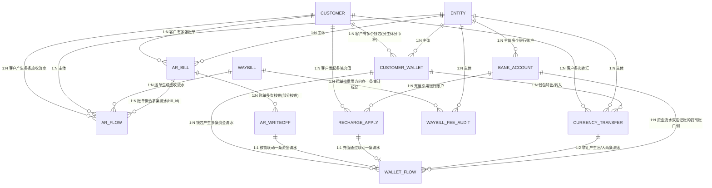

# 数据设计 — 财务模块（应收 + 资金账户）

> **版本**：v0.12 | **日期**：2026-09-18 | **作者**：飞点产品
> **覆盖范围**：应收管理 R1-R5 + 资金账户 W1-W6；**账单导出不建表**（任务与结果文件归后台任务，见「账单导出（不建表）」节）；**入账记录（`credit_record`）随二期赔付管理立项一并落地，本期不建表**；应付/对账/毛利/开票/成本核算待后续对齐后补充
> **上游**：[2026-09-18-用户需求.md](2026-09-18-用户需求.md)（RDD v1.9 定稿）

---

## 一、实体清单 × 表映射

| # | 实体 | 对应表 | 映射方式 | 说明 |
|:---|:---|:---|:---|:---|
| 1 | 应收业务流水 | `ar_flow` | 独立表 | 运单收货自动生成，粒度=运单 |
| 2 | 应收账单 | `ar_bill` | 独立表 | 财务手工成账或**系统每月 1 号自动出账**；**客户 × 我司主体 × 币种** 一张（不跨币种折合） |
| 3 | 收款核销流水 | `ar_writeoff` | 独立表 | 核销/反核销留痕 |
| 4 | 账龄台账 | — | **视图** | 实时计算，不落表 |
| 4b | **业务流水台账（应收 / 应付）** | — | **视图** | 直接查 `ar_flow` 的**全量视图**（跨 待审计 / 已审计未成账 / 已进账单 / 作废释放 全部状态），**不建新表、不建新状态机**；按 `flow_category` 分「应收业务流水（10）/ 应付业务流水（20）」两个菜单；应付流水数据源随 Phase 2 应付管理上线，一期空态。**页面承载「新增流水 / 导入（文件）/ 删除」三个写动作 + 单条「审计 / 反审计」**（`ar_flow` 本表增删 + 流水级审计 / 反审计，走 R60 / R61 / R75 口径：新增流水 = 批量新增流水进运单，导入 = 上传文件批量导入流水，删除 = 删流水，审计 / 反审计 = 单条流水置 已审计 / 退回待业务审计） |
| 5 | 我方银行账户 | `bank_account` | 独立表 | 每主体可多账户 |
| 6 | 客户预存款钱包 | `customer_wallet` | 独立表 | 客户×主体×币种 |
| 7 | 资金流水 | `wallet_flow` | 独立表 | 9 类流水 |
| 8 | 币种互转 | `currency_transfer` | 独立表 | 转汇明细 |
| 9 | 充值申请 | `recharge_apply` | 独立表 | 客户发起、财务审核 |
| 10 | 运单费用审计（**运单级审计标记**） | `waybill_fee_audit` | 独立表 | **两态：未审计 / 已审计**，按费用方向（应收 / 应付）各一条 |
| — | 运单 | — | 逻辑实体 | 引用运单模块，财务不建表 |
| — | 客户 | — | 逻辑实体 | 引用客商中心，财务不建表 |
| — | 主体（账套） | — | 逻辑实体 | 引用基础资料，5 主体 |
| — | 币种 | — | 逻辑实体 | 枚举字典（CNY/USD/HKD…），财务不建表 |
| — | 汇率 | — | 外部接口 | 调**阿里汇率接口**实时获取，不落库、不自建汇率表；币种互转时接口汇率与实际采用汇率随单留痕 |
| — | 费用类型 | — | 逻辑实体 | 引用头程管理 `fee_type` 字典（同方向唯一），财务不建表 |
| — | 账期（合同） | — | 逻辑实体 | 引用客商中心 `customer_contract` |
| — | 账单草稿池 | — | **视图** | **已审计且未成账的流水集合**（`audit_status = 已审计(20)` 且 `bill_id` 为空的 `ar_flow`）；**逐条流水展示**（不按运单聚合），按 **客户 × 我司主体 × 币种** 过滤（账单日不参与分组）；由「账单管理 → 草稿池」Tab 展示，财务**逐条勾选流水**成账，**不跨币种折合**（见 PRD R11） |
| — | 账单管理 · 待核销清单 | — | **视图** | `ar_bill` 上「**`bill_type = 应收(10)`** + **客户已确认（`confirm_status = 已确认(20)`）** + `unreceived_amount > 0` + `void_status = 正常(10)`」的实时查询结果（**没有临时表**）—— **不占独立 Tab**，在「账单管理 → 已发送」Tab 用查询条件「核销状态」筛出、并用行内「核销」按钮处理；客户未确认的账单不进本清单（见 PRD R67）；**本视图不筛客户状态** —— 客户被禁用、或合同已过期 / 已解约，其存量账单照常进清单、照常可核销（钱得收回来）；核销弹窗里的「钱包余额」另按 客户 × 主体 × 币种 实时取 `customer_wallet.balance` |
| — | 货主端资金账户总览 | — | **视图** | 基于 `customer_wallet` + `ar_bill` 实时计算，按 主体 × 币种 聚合，供货主端「资金账户 → 账户余额」展示（见 §二 视图） |

> **FBA 单号（`fba_no`）**：运单级**派生多值**（头程管理侧登记），**财务侧不落库** —— 草稿池列与账单明细列取数时**按运单汇总、以 ` / ` 拼接展示**，非 FBA 运单显示「—」。
>
> **账单草稿池（实时视图，不建表）**：池内成员 = `ar_flow` 里「`audit_status = 已审计(20)` + `bill_id` 为空」的行，**没有临时表**；草稿池展示的「**账期**」= **实时读该 客户 × 我司主体 的合同签约账期**（`customer_contract.payment_term` → 月结 / 双月结 / 三月结 / 周结 …，**只显示签约账期名、不带「+ 天数/号」**；**合同账期段为空时显示 `待补录`**），属**预估值**；成账后以 `ar_bill` 上的**快照**为准。入池门槛 = **已审计** —— 只有 `audit_status = 已审计(20)` 的流水进池，**未审计流水不进池、页面上也不给未审提示**（要看未审流水走「运单审计」）；**成账颗粒度 = 流水级**，财务逐条勾选要成账的流水，**同一运单的不同流水可以拆到不同账单**（后续新增流水、赔付抵扣流水天然进入下一期账单，因此一个运单可关联多张账单）；**不跨币种折合**（只聚合与账单币种一致的流水）；`bill_id` 非空的流水不在池内。草稿池是**流水视角的池子**，财务手工成账仍不新增账单状态机（§4.5）；「账单周期 = 固定」的客户另由系统每月 1 号自动出账（§4.8）。

---

## 二、逐表字段清单

> 所有表统一含公共字段：`id`(BigInt, PK, 雪花) · `tenant_id`(String, Index) · `created_at` · `created_by` · `updated_at` · `updated_by` · `is_deleted`(Boolean, 默认 false) · `version`(Int, 乐观锁)

### 表 1：应收业务流水 `ar_flow`

> 运单收货完成后系统自动生成，粒度=运单；**一条费用项生成一条流水**（运费 / 运费优惠 / 泡比优惠 / 各附加费 / 各附加费优惠各成一行，**优惠独立成行，不并入费用行**），按「费用类型 × 币种」可拆多条。账期与到期日是账单级字段，出账时从合同快照（见 §4.7）。费用类型引用头程管理 `fee_type` 字典（同方向名称唯一）。
>
> **自动行去重键**：`UNIQUE(waybill_id, flow_kind, fee_type_id, source_rule_id)`——运单信息变更触发**重扫**时覆盖更新已有行而非新增行，保证不重复计费。生成规则与账单草稿池见 §4.7。

| 字段 | 中文 | 类型 | 必填 | 约束/索引 | 枚举/备注 |
|:---|:---|:---|:---|:---|:---|
| flow_no | **流水号** | String(32) | Yes | **Unique** | 业务流水唯一编号，规则 `FLW + yyyyMMdd + 序号`（**每天从 `001` 起**，与 `ar_writeoff` 的 `WO+YYYYMMDD+序号` 同一套序列风格）；「应收 / 应付业务流水」主列表第 1 列 |
| waybill_id | 运单ID | BigInt | Yes | Index | 引用运单模块 |
| customer_id | 客户ID | BigInt | Yes | Index | 引用客商中心 |
| entity_id | 主体ID | BigInt | Yes | Index | 5 账套之一 |
| flow_category | 业务流水大类 | TinyInt | Yes | — | 10:应收, 20:应付, 30:销售提成 |
| flow_kind | 流水种类 | TinyInt | Yes | — | 10:运费, 20:运费优惠, 30:泡比优惠, 40:附加费, 50:附加费优惠, 60:手工新增 |
| fee_type_id | 费用类型ID | BigInt | Yes | Index | 引用头程管理 fee_type 字典（运费/周六派送费/超重费/地址附加费/商品附加费/报关费/库内贴标费…）。**取值来源按流水种类**：运费行=预置费用类型「运费」；运费优惠/泡比优惠行=**优惠规则上配置的 `fee_type`**；附加费行与附加费优惠行=**该附加费规则计价明细「应收」行的费用类型** |
| currency | 币种 | String(8) | Yes | — | CNY/USD/HKD… |
| unit_price | 本行单价 | Decimal(20,6) | Yes | — | 带符号：运费行=当周公布价、附加费行=应收单价、优惠行=优惠值（**负=减钱、正=加价**）；**手工新增行同样必填**（金额 = 单价 × 计费量 自动算） |
| pricing_unit | 计价单位 | TinyInt | No | — | 10:按KG, 20:按m³, 30:按票, 40:按箱, 50:按数量。**来源跟着规则走**：运费 / 运费优惠 / 泡比优惠行 = 运单所关联**服务组合的计费方式**（KG / m³）；附加费 / 附加费优惠行 = 该条**附加费规则的计价单位**。同一父行的优惠行与其父行计价单位、计费量一致 |
| quantity | 计费量 | Decimal(20,6) | No | — | 计费数量（重量/体积/箱数/张数）；按票计费=1；关联附加费规则按数量计费时由业务填写 |
| amount | 本行金额 | Decimal(20,6) | Yes | — | `amount = unit_price × quantity`，**带符号**：费用行为正；优惠行为负=减钱 / 正=加价。**运单应收净额与账单金额一律按各行 `amount` 的代数和汇总**（优惠已独立成行） |
| rate | 汇率 | Decimal(20,6) | Yes | — | 生成/手工创建时自动取实时汇率，人民币=1，不参与金额计算 |
| description | 描述 | String(255) | No | — | **面向客户的说明**（货主端可见）；与「备注」分开：备注是内部口径、客户端不展示 |
| remark | 备注 | String(255) | No | — | **仅内部可见**（货主端不展示） |
| pick_time | 拣货时间 | DateTime | No | Index | **该行所属运单的拣货实测完成时间**（运单级属性落在行上）。随收货完成生成的行**先留空**，**拣货实测完成时回填该运单全部应收行**（含人工添加行——只回填时间、不动金额）；人工添加时由后端取运单拣货时间写入。**两端均展示**（为空显示「—」） |
| created_at | 创建日期 | DateTime | Yes | Index | 该行的创建时间，**后端自动写入**（系统生成时=生成时间、人工新增时=提交时间）；**运单费用流水页两端不展示**，**财务「账单草稿池」展示**（对账取数用） |
| source_type | 来源类型 | TinyInt | Yes | Index | **10:系统自动计算**（运单收货 / 拣货实测 / 重算生成）、**20:人工添加**（业务在运单费用 tab 新增）。**决定该行能否被编辑**（见 §4.7 编辑口径） |
| source | 数据来源 | String(32) | Yes | — | 报价 / 规则名 / 人工添加；只记第一次来源，后续变更不变。**货主端不展示** |
| source_rule_type | 来源规则类型 | TinyInt | No | — | 10:运价行, 20:运费优惠规则, 30:泡比优惠规则, 40:附加费规则, 50:附加费优惠规则；手工新增行留空 |
| source_rule_id | 来源规则ID | BigInt | No | Index | 命中的规则主键（**引用，不是快照**），供运单审计下钻「这条规则现在长什么样」；手工新增行留空 |
| source_rule_name | 来源规则名（快照） | String(64) | No | — | **命中时的规则名文本快照** —— 规则改名 / 删除后仍可举证「当时是哪条规则给的」。**列表不展示，收进行详情；货主端不展示** |
| generate_node | 生成节点 | TinyInt | Yes | — | 10:收货完成, 20:拣货完成, 30:人工添加；决定运单信息变更时是否参与重扫（30 永久豁免） |
| bill_id | 关联账单ID | BigInt | No | Index | 生成账单后回填；**为空即处于「账单草稿池」**（§4.7）；**账单作废时置空 → 流水释放回草稿池**（PRD R63） |
| audit_status | 审计状态 | TinyInt | Yes | Index | **10:待业务审计, 20:已审计（只有两态）** |
| biz_audit_by / biz_audit_at | 业务审计人/时间 | — | No | — | 业务侧「运单管理」操作 |
| fin_audit_by / fin_audit_at | 财务审计人/时间 | — | No | — | 财务侧「运单审计」操作 |

> **优惠明细的承载方式**：**每条优惠单独生成一条业务流水**（优惠行），并通过 `source_rule_type` + `source_rule_id` 记录命中的规则，因此**运单审计与客户价格争议可以下钻到「哪条规则给的、减在哪个费用类型上」**，一期不需要额外建优惠明细表。
>
> **仍留二期的缺口**：① 同一费用项上**多条优惠叠加的运算顺序明细**（一期逐条成行、按行金额代数和汇总，不记录运算顺序）；② 浮动优惠（券 / 满减）的**核销载体**。两者由超级运价模块二期营销模块的 `discount_apply_log`（M7）承接，一期历史数据**不做反向拆解**。详见 `drafts/超级运价/2026-09-15-数据设计.md` §3.20.4。

### 表 2：应收账单 `ar_bill`

> 财务在草稿池手工勾选已审计流水成账，或由系统每月 1 号对「账单周期 = 固定」的客户自动出账；**客户 × 我司主体 × 币种** 一张，**不跨币种折合**（§4.8）。**账单生成后、发送前的「待发送」阶段，允许把单条流水移出账单**（`ar_flow.bill_id` 置空回草稿池、账单金额重算、账单号不变、至少保留 1 条 —— 见 PRD R66）。
>
> **账单是快照、草稿池是实时**（★）：账单级字段（账单日期 / 账期（签约账期 + 天数/号）/ 账期天数 / 到期日期 / 金额 / 状态 / 生成来源 / 发送与确认与作废留痕）**一律在 `ar_bill` 上落库存快照**；合同之后改账期，**已生成账单不受影响**。与之相对，**草稿池不建表**，是 `ar_flow` 上「已审计 + `bill_id` 为空」的**实时查询视图**，其中展示的「账期」是**实时读合同**得来的预估值（见 §一 账单草稿池说明）。

| 字段 | 中文 | 类型 | 必填 | 约束/索引 | 枚举/备注 |
|:---|:---|:---|:---|:---|:---|
| bill_no | 账单号 | String(32) | Yes | **Unique** | 规则：`AR-{主体代码}-{yyyyMM}-{5 位序号}`（序号零填充 5 位，**按 主体 × 账期月 每月从 `00001` 重置**，取号 = 同主体同账期月已有账单数 + 1）；主体代码：广州GZ/深圳SZ/广东GD/香港HK/墨链ML |
| customer_id | 客户ID | BigInt | Yes | Index | — |
| entity_id | 主体ID | BigInt | Yes | Index | — |
| currency | 币种 | String(8) | Yes | — | — |
| bill_type | **单据类型** | TinyInt | Yes | Index | **10:应收账单（我司向客户收款）, 20:贷记单（我司应付客户）** —— 生成账单时按**勾选流水的净额符号**判定：净额 > 0 → 10、净额 < 0 → 20、**净额 = 0 → 不出账**（阻断）。**用显式字段而不是靠 `bill_amount` 符号推断**：核销准入 / 账龄台账 / 资金账户「未结清金额」/ 候选筛选一律以它为准，语义比 `bill_amount > 0` 清楚、也不怕"净额刚好为 0"这类边界；**待发送阶段的编辑不允许净额符号跨 0**（跨 0 = 单据类型变了，须作废重开）。**不新建「贷记单表」** —— 两类单据的字段与生命周期 90% 重合（客户 / 主体 / 币种 / 账单日 / 账期 / 明细流水 / 发送 / 确认 / 作废 / 操作时间线），且成账入口共用草稿池 |
| generated_at | 生成时间 | DateTime | No | — | **账单生成的时间戳**（自动出账 = 跑批时刻、手工出账 = 确认生成时刻）；「操作时间线」的「生成账单」条目用它（**回退 `billing_date`**）—— 账单日可被财务在待发送阶段修改，不能当生成时间用 |
| edited_at / edited_by / edit_action | 最近一次编辑时间 / 操作人 / 动作 | DateTime / String(32) / TinyInt | No | — | **待发送阶段的账单编辑留痕**（见 PRD R66）：`edit_action` = 10 移除流水 / 20 添加流水 / 30 修改账单日期；「操作时间线」据此加一条 `编辑账单`（**只记时间 / 操作人 / 动作，不记增减了几条流水**）；一期只保留最近一次，完整编辑历史留二期 |
| billing_date | 账单日 | Date | Yes | Index | 自动出账 = **1 号**（跑批日）；手工出账 = 财务指定，**默认生成当月自然月末**；**「待发送」阶段可改**（R66）—— 改后 `due_date` 与 `payment_terms_days` 同步重算，账期月变了则 `bill_no` 按新账期月重新取号 |
| due_date | 到期日期 | Date | Yes | Index | **最后支付日**，按「签约账期 + 天数/号」推导（算法见 §4.7）；**派生字段，随 `billing_date` 变动实时重算**（待发送阶段改账单日期，见 R66） |
| payment_terms_days | 账期天数 | Int | Yes | — | **账单级账期快照 = 到期日 − 账单日 + 1**（如账单日 09-01、月结+15 → 15 天）；账龄台账按 `billing_date + 本字段` 推逾期；由到期日反推，**合同账期推不出时不允许出账，不做补录** |
| payment_terms_type | **签约账期（快照）** | TinyInt | No | — | **账单页「账期」列的取值来源** —— 生成账单时从合同 `customer_contract.payment_term` 快照：101:月结, 102:双月结, 103:三月结, 201:周结, 202:到港前结, 203:签收月结, 204:到海外仓结, 205:签收结。**合同账期段为空时不允许出账**（页面直接阻断，见 PRD R14 / PRD R11），因此账单上本字段必然有值 |
| days_or_date | **天数/号（快照）** | Int | No | — | 生成账单时从合同 `customer_contract.days_or_date` 快照。**参与到期日计算**：按月类（月结 / 双月结 / 三月结）→ 取账单月的第 N「号」（N 为 **1–31 的数字**；该月无该号 → 取该月月末；算出的日期不晚于账单日则顺延下一月同一号）；按天类（周结）→ 到期日 = 账单日 + N − 1 天。**账单页「账期」列 = `{签约账期}+{天数/号}`**（如 `月结+15`）。**「天数/号」只填数字（1–31），没有「月末 / 月初」这类文字值**（客商中心合同账期字段）；**`0` / 空 = 未填 → 视为账期未完善、不允许出账** |
| generate_source | 生成来源 | TinyInt | Yes | Index | 10:系统自动（每月 1 号跑批，`billing_cycle = 固定(10)` 的客户）、20:财务手工（草稿池勾选流水成账） |
| bill_amount | 账单总额 | Decimal(20,6) | Yes | — | 聚合流水应收净额；**待发送阶段增删流水后重算** = Σ 明细各行 `amount`（代数和，R66），**任何情况下都不手改** |
| received_amount | 已核销金额 | Decimal(20,6) | Yes | — | 核销累加，默认 0 |
| unreceived_amount | 未结清金额 | Decimal(20,6) | Yes | Index | bill_amount − received_amount − written_off_amount（核销与冲账都清减未结清金额；**= 0 即「已结清」**） |
| send_status | 发送状态 | TinyInt | Yes | Index | 10:未发送, 20:已发送（财务点「发送客户」） |
| confirm_status | 确认状态 | TinyInt | Yes | Index | 10:未确认, 20:已确认 —— **两条路径**：① 客户在货主端点「确认账单」；② **发送日（含当日）起满 7 个自然日仍未确认 → 每天 00:30 的定时任务自动确认**。两条路径对后续核销与账龄**等效**，区分靠 `confirm_type` |
| writeoff_status | 核销状态 | TinyInt | Yes | Index | 10:未核销, 20:部分核销, 30:已核销, 40:已反核销（**按未结清金额派生**：未结清金额 = 0 → 已核销（含尾款冲账后归零），未结清金额 > 0 且已核销金额 > 0 → 部分核销，否则未核销；冲账是金额维度、由 `written_off_amount > 0` 表达）；**本维度在账单管理（员工端「已发送」Tab / 货主端「应收账单」Tab）只读展示**，**核销动作与「尾款冲账」在「账单管理」核销弹窗、核销记录与反核销/反冲账在「核销/冲账管理」页**；**作废前置判定改用「未结清金额 = 账单金额」（received = 0 且 written_off = 0），不再看本状态** |
| void_status | 作废标记 | TinyInt | Yes | Index | 10:正常, 20:已作废（终态；作废后其余三个维度冻结，其下流水 `bill_id` 置空回草稿池） |
| generated_by / generated_at | 生成人/时间 | — | No | — | 财务操作 |
| sent_at | 发送客户时间 | DateTime | No | — | — |
| confirm_type | **确认方式** | TinyInt | No | — | 10:客户确认（货主端手动）、20:系统自动确认（超期自动确认）—— **仅用于留痕与展示**（员工端「已发送」Tab 的「确认状态」tag 悬浮、两端账单详情的「确认信息」字段），**不参与任何判定** |
| confirmed_at | 确认时间 | DateTime | No | — | 客户货主端确认，或系统自动确认（写跑批时间）。**自动确认时间 = 发送日 + 7 天 00:30** |
| voided_by / voided_at | 作废人/时间 | — | No | — | 财务操作；作废后其下流水 `bill_id` 置空释放回草稿池 |
| void_reason | 作废原因 | String(200) | No | — | **页面必填**（作废弹窗强制，≤200 字）：作废不可恢复、账单号不回收，必须留痕「为什么废的」；与 `voided_by` / `voided_at` 一起在账单详情的**「操作时间线」**（「作废账单」条目）展示，详情头部另起一行的留痕已撤掉。DB 置 No 只为兼容历史空值，**新作废一律有值** |
| written_off_amount | 已冲账金额 | Decimal(20,6) | Yes | — | 坏账冲销累加，默认 0；冲账 / 反冲账时增减（**冗余自 `ar_writeoff` 冲账记录**，供账单列表直接展示）。**与 `received_amount`（客户付的钱）并列**：`received_amount + written_off_amount + unreceived_amount = bill_amount` |

### 表 3：结清记录 `ar_writeoff`（核销 + 冲账）

> 财务结清记录（核销 / 冲账 / 反核销 / 反冲账），留痕可审计。**本表是「事实快照表」**：一行一条结清单（核销单 / 冲账单），`bill_before/bill_after`、`wallet_before/wallet_after` 记的是**该笔发生时**的账单未结清金额与钱包余额；「核销记录」列表**不 join 账单 / 钱包的实时值**（实时值用于「账单管理 → 已发送」Tab 的三列与核销弹窗）。**页面上只展示账单侧快照**（「未结清金额（前 → 后）」一列）；**贷记单结转（70/80）的 `related_no` 挂的是账单号**；**钱包侧两列仅留痕、不上表** —— 核销金额与钱包变动同额，钱包进出另由 `wallet_flow`（`flow_type` 40/50）专管。**一个账单可以有多条本表记录**（多次部分核销），核销单 ↔ 账单 = N:1。**批量核销 = 同一批次逐张各写一条本表记录**（不是一条汇总记录）：**范围限定为同一个钱包**（同一客户 × 主体 × 币种，**由财务在弹窗里主动锁定 —— 不预选钱包**），**按账单 `due_date` 从早到晚逐张分配该钱包余额**（每张 `min(未结清金额, 钱包可用余额)`），`本次核销 = 0` 的账单不写记录；每张各自带四个快照字段，核销单号按发生顺序递增；同一分钟内的多笔**时间戳相同，排序与"最新一条"判定统一以核销单号为准**。

| 字段 | 中文 | 类型 | 必填 | 约束/索引 | 枚举/备注 |
|:---|:---|:---|:---|:---|:---|
| writeoff_no | 结清单号 | String(32) | Yes | **Unique** | 规则：`WO + YYYYMMDD + 序号`（核销单与冲账单**共用同一序列**）；结清记录列表与接口按本字段回传 |
| bill_id | 账单ID | BigInt | Yes | Index | — |
| wallet_id | 钱包ID | BigInt | Yes | Index | — |
| currency | 币种 | String(8) | Yes | — | 强制同币种 |
| amount | 结清金额（核销金额 / 冲账金额） | Decimal(20,6) | Yes | — | 核销 = min(账单未结清金额, 钱包余额)；冲账 = ≤ 未结清金额（默认全额，不动钱包） |
| writeoff_type | 类型 | TinyInt | Yes | — | 10:核销, 20:已反核销, **30:冲账, 40:已反冲账**（**页面显示名**；「类型」列与「反核销 / 反冲账」按钮的显示条件） |
| reason | 冲账原因 | String(200) | No | — | **仅冲账 / 已反冲账记录有值**（冲账原因必填 ≤200 字，核销记录为空）；「结清记录」列表冲账行展示 / 悬浮 |
| bill_before / bill_after | 核销前/后账单未结清金额 | Decimal(20,6) | Yes | — | 留痕；**「核销记录」列表「未结清金额（前 → 后）」一列的数据源**（该列表是事实快照表，不展示账单的实时未结清金额） |
| wallet_before / wallet_after | 结清前/后钱包余额 | Decimal(20,6) | Yes | — | **留痕字段，页面不展示** —— 用于对账与「链式闭合」校验（每个钱包时间最新一条的 `wallet_after` = 该钱包当前余额）；钱包进出的界面呈现走 `wallet_flow`。**冲账记录恒等**（`wallet_before = wallet_after`，不动钱包） |
| wallet_flow_id | 关联资金流水ID | BigInt | No | — | 核销→资金流水联动 |
| reversed_of_id | 被反核销 / 反冲账的原结清ID | BigInt | No | — | 反核销 / 反冲账指向原结清记录 |
| operator_by / operator_at | 操作人/时间 | — | Yes | — | 财务 |

### 视图：贷记单（负数账单）与「结转钱包」

**负数应收流水 = 业务事实驱动、系统自动产生**（识别到赔付即向运单插一条负应收），它不取决于客户是否合作 —— 所以必须有**不依赖"客户后续业务"的结清出口**。口径：

- **净额 > 0** → 应收账单（负数流水作账单内一行「赔付抵扣 −N」，随账单正常发送 / 确认 / 核销）
- **净额 < 0** → **贷记单**（我司欠客户）：`ar_bill` 上**用 `bill_type = 贷记(20)` 标出单据类型**（**同一张表、同一套流程**，不建第二张表），但：**不参与收款核销**（核销准入以 `bill_type = 应收(10)` 为准）、**照常发送客户**（`ship_status` 走正常发送流转、货主端照常展示并标注「贷记单」）、**不进账龄台账**、**不计入资金账户「未结清金额」**（该指标口径加 `unreceived_amount > 0`）；`writeoff_status` 保持 `未核销(10)` 但**不参与核销状态机流转**
- **明细允许异号流水**（与应收账单同一规则）：贷记单里可以有正数运费行、应收账单里可以有「赔付抵扣 −N」行 —— **`bill_type` 只看整单 `bill_amount` 的符号**；`ar_flow` 每条流水仍按原符号完整落库，**经营分析走流水、结算看账单**
- **结清 = 结转钱包**：写一条 `wallet_flow`（`flow_type = 70`、`related_no` = 账单号、`amount` = 贷记单净额的绝对值、`wallet_before/after` 留痕）；客户钱包余额增加 → **之后可正常核销其他账单，也可提现**
- **「已结转」是派生状态**（**不新增状态枚举**）：判定 = 存在 `wallet_flow(flow_type = 70, related_no = 账单号)`。**结转即终态、不可撤销** —— 钱进了客户可用额度就可能已被拿去核销别的账单，反悔必须走**对冲凭证**（运单侧新增反向流水 → 下期账单作为应收费抵扣），不回滚已发生的资金流水
- **幂等**：`wallet_flow` 上 `flow_type = 70` + `related_no` **唯一**（同一贷记单只能结转一次，且不可逆）
- **照常发送客户、走同一套确认流程**（客户端展示为「贷记单」黄 tag + 悬浮说明；**发送满 7 个自然日未确认 → 系统自动确认**，R16）→ **结转前置 = `confirm_status = 已确认`**（与核销对称；有自动确认兜底，不会因客户不合作而卡死）；
- **不做「撤销入账」**：结转是**结清动作、入钱包即终态** —— 钱包是「客户可用额度」容器，钱一旦进去就与充值款混同、可能已被核销其他账单或提现，逐笔回滚既不可行也说不清（"这笔钱被哪笔核销用掉了"需要资金逐笔配对，一期不做）。**纠错统一走对冲**：运单侧新增一条正数流水（→ 下期账单里作为应收费抵扣），下游账单与核销记录都不动、账面自动轧平。同一理由，**核销也不再从「资金流水」页撤销**（反核销在「核销记录」菜单）
- **结转进「操作时间线」**（结清动作留痕：金额 + 钱包余额前后 + 流水号）；金额一律 = 账单净额，**不让人手改**

> 为什么不做独立的"贷记台账 / 退款单"：钱包（`customer_wallet`）本来就是「客户可用额度」的容器，再造一套会出现**两个池子都要轧账**、客户可能同时在两处有钱 —— 双份口径，长期维护成本更高。

### 视图：账龄台账（不建表）

基于 `ar_bill` 实时计算：**`bill_type = 应收(10)`** 且 **`send_status = 已发送(20)`** 且 `unreceived_amount > 0` **且 `void_status = 正常(10)`** 的账单（**「待发送」账单不计入** —— 未发给客户，账龄是对客催收口径；作废账单不计入），按 `billing_date + payment_terms_days` 推逾期天数 → 未到期单列 + 逾期 0-30 / 31-60 / 61-90 / 90+；维度 = 客户 × 主体 × 币种；分币种不折算。**冲账（坏账冲销）后账单 `unreceived_amount = 0` → 自动出账龄**（不再催收）。

### 视图：业务流水台账（不建表）

**业务流水台账（PRD 功能 A12/A13）本身不新增任何实体 / 表** —— 它就是 `ar_flow` 的**全量查询**，按 `flow_category` 分「应收业务流水（10）/ 应付业务流水（20）」两个菜单（**应收台账本页同时承载「新增流水 / 导入（文件）/ 删除」写动作 + 单条「审计 / 反审计」**，见 PRD §5.14，写动作复用 R60 / R61 / R75，不新增状态机）：

| 环节 | 承载 |
|:---|:---|
| 数据源 | `ar_flow` 全量行（**不筛审计状态、不筛 `bill_id`**）—— 跨 待审计 / 已审计未成账 / 已进账单 / 作废释放 全部状态 |
| 应收台账 | `flow_category = 10 应收`，一期即有数据 |
| 应付台账 | `flow_category = 20 应付`，**Phase 1 空态**（应付管理 Phase 2 上线后才有流水） |
| 账单状态派生 | `bill_id` 为空 → 展示「草稿池」（未成账）；非空 → join `ar_bill.bill_no` 展示账单号（可点击跳账单详情） |
| 关联下钻 | 运单号 → `waybill`（跳运单审计详情）；账单号 → `ar_bill`（跳账单详情）；来源规则 → `source_rule_type / source_rule_id / source_rule_name`（收进行详情） |
| **列表 JOIN 列** | 主列表展示的 **客户编号 / 客户昵称 / 客户名称** join `客商中心·customer`（`customer_id`）、**销售代表** join `waybill`（运单所属销售代表）；**流水号 / 汇率 / 创建人 / 备注 / 描述 / 拣货时间 / 创建时间** 为 `ar_flow` 本表字段（`flow_no` / `rate` / `created_by` / `remark` / `description` / `pick_time` / `created_at`），**不落 `ar_flow` 新列、不建客户快照表** |

> **为什么不建表**：台账是「从流水本身出发」的**跨容器查询视角**，与运单审计（写 + 审计，按运单）、草稿池（成账，只未成账）、账单详情（结算，只已进账单）是**同一张 `ar_flow` 的不同视图** —— 再建一张流水表等于把同一批流水抄两份，必然出现"哪份算数"的口径分裂。台账对 `ar_flow` 的**写动作有「新增流水 / 导入（文件）/ 删除」+ 单条「审计 / 反审计」**（新增 / 删除流水行本身走 R60 / R61，文件批量导入走 R75，审计 / 反审计为流水级 R61 的第二入口），成账 / 结算仍各归原位，不在此页。

### 视图：货主端资金账户（不建表）

基于 `customer_wallet` + `ar_bill` 实时计算，按 主体 × 币种 聚合，货主端「资金账户」页展示：

| 字段 | 说明 |
|:---|:---|
| 账户主体 | `customer_wallet.entity_id` → 主体名称（合同签约主体） |
| 币种 | `customer_wallet.currency`（默认人民币，各主体统一；其他币种财务手工开通） |
| 账户名称 | `customer_wallet.account_name` |
| 余额 | `customer_wallet.balance`（充值入池 − 核销扣减后的剩余） |
| 未结清金额 | Σ `ar_bill.unreceived_amount`，where `bill_type = 应收(10)` 且 `confirm_status = 已确认(20)` 且 `unreceived_amount > 0` 且 `void_status = 正常(10)`，按 主体×币种 |
| 待确认账单 | Σ `ar_bill.bill_amount`，where `send_status = 已发送(20)` 且 `confirm_status = 未确认(10)` 且 `void_status = 正常(10)`，按 主体×币种 |
| 实际金额 | `balance − 未结清金额`（负数红色带负号，正数正常色） |

### 账单导出（不建表）

**账单导出（PRD R71）不新增任何实体 / 表 / 字段** —— 它是"读账单 + 读运单 + 读流水 → 按模板出文件"的动作，落点全部复用既有结构：

| 环节 | 承载 |
|:---|:---|
| 导出范围 | **不落库** —— 等于「已发送」Tab 列表里**勾选的账单**（勾选行本身来自 `ar_bill` 上 `send_status = 已发送(20)` 且 `void_status = 正常(10)` + 查询条件），提交时把 `billNos[]` 快照传给任务 |
| 取数来源 | `ar_bill`（账头 4 项）+ `ar_flow`（流水级列）+ 运单（运单级列，经 `ar_flow.waybill_id` 关联）—— **全部只读** |
| 任务与结果文件 | **归后台任务模块** `import_task`（`task_type = 20 导出`、`result_file_url`）—— 财务侧**不建"导出任务表"、不建"导出记录表"**（避免两处各存一份任务状态） |
| 模板分类 | 任务的 `templateType` 快照（常规模板 / 出口退税模板），模板文件本身是**静态资源**（`analysis/财务导出模板/`），不进库 |

> **为什么不建表**：导出的"记录"本质是**文件交付凭证**，与导入任务的错误文件同性质 —— 后台任务模块已经是"任务进度 + 结果文件"的公共容器，财务再造一张导出记录表会出现两处任务状态、两处下载入口。**导出对 `ar_bill` 只读、不写任何状态**，因此也不进账单「操作时间线」。

### 表 10：运单费用审计 `waybill_fee_audit`（**运单级审计标签**）

> 运单级审计**不是**从流水推导出来的派生值，而是「整单审计通过 / 反审计」这个动作的落库结果 —— 因为它带审计人与时间、并且**决定整票能否再新增费用**（见财务 PRD R61）。流水级的审计标签仍在 `ar_flow.audit_status`（**两层标签，各自独立、各管一摊**：运单标记管「新增」、流水标记管「编辑」）。

| 字段 | 中文名 | 类型 | 必填 | 索引 | 说明 |
|:---|:---|:---|:---:|:---|:---|
| id | 主键 | BigInt | Yes | PK | |
| waybill_id | 运单ID | BigInt | Yes | **Unique** | 一票一条；**运单第一次审计时创建**，未审计的运单**不预置空行**（无记录 = 待审计） |
| waybill_no | 运单号 | String(32) | Yes | Index | 冗余，运单审计列表直接展示 |
| fee_direction | 费用方向 | TinyInt | Yes | **Unique（与 waybill_id 组合）** | **10:应收 / 20:应付** —— 审计按方向独立：应收已审计不影响应付仍可加费用 |
| audit_status | 运单审计标记 | TinyInt | Yes | Index | **只有两态：10:未审计 / 20:已审计**（无"部分审计""已反审计"中间态；反审计即回 `10 未审计`） |
| audit_by / audit_at | 整单审计人 / 时间 | — | No | — | 「该方向整票审计通过」时写入（运单列表与审计页展示） |
| reverse_by / reverse_at / reverse_reason | 最近一次反审计人 / 时间 / 原因 | — | No | — | 反审计留痕（标记回 `10 未审计`，但留痕保留） |
| remark | 备注 | String(255) | No | — | |

> **与流水的联动（★，两层解耦）**：**运单级审计（按方向整票审计）** → ① 写本表该方向 `audit_status=20` + 审计人/时间；② 该运单**该方向全部**流水置 `audit_status=20 已审计`。**反审计（运单级、按方向 × 深度）** → ① **「仅运单」**：本表该方向回 `audit_status=10 未审计`（写反审计留痕），**流水不动**（仍已审计、锁定编辑，只放开新增）；② **「运单及流水」**：本表该方向回 `10 未审计` + 该方向**未进账单的**流水回到 `10 待业务审计`（放开新增 + 编辑），**已进账单的流水保持已审计、不回退**。**流水级审计 / 反审计**（在运单费用 tab 勾选若干流水执行）**只动 `ar_flow.audit_status`、不写本表** —— 因此会出现「运单未审计、个别流水已审计」的中间态：该流水不可编辑，但**运单仍可新增流水**（见 PRD R61）。**唯一键 `(waybill_id, fee_direction)`**：未审计的方向可以不建行（无记录 = 未审计），也可预置 `10`，实现取其一。

### 表 5：我方银行账户 `bank_account`

| 字段 | 中文 | 类型 | 必填 | 约束/索引 | 枚举/备注 |
|:---|:---|:---|:---|:---|:---|
| entity_id | 主体ID | BigInt | Yes | Index | 每主体可多账户 |
| account_name | 账户名称 | String(64) | Yes | — | 开户名 |
| account_no | 账号 | String(32) | Yes | **Unique** | 全局唯一，创建后不可修改 |
| bank_name | 开户行 | String(64) | Yes | — | — |
| swift_code | SWIFT/BIC | String(16) | No | — | 境外打款用，非人民币账户建议填写 |
| currency | 账户币种 | String(8) | Yes | — | 单币种账户 |
| balance | 账面余额 | Decimal(20,6) | Yes | — | **系统自动核算**（由双边资金流水「我司账户侧」`company_amount` 驱动：充值/代充 `+`、提现/充值退回 `−`；核销/冲账/转汇/贷记单结转不动）；初始余额财务新建账户时录入，之后随流水自动增减，不再手工维护 |
| is_visible_to_customer | 用户是否可见 | Boolean | Yes | Index | 默认 true；为 true 时客户货主端充值的打款账户下拉可见该账户 |
| is_default | 是否默认 | Boolean | Yes | — | 客户打款默认账户；同一主体+币种仅一个，且必须 `is_visible_to_customer=true` |
| status | 状态 | TinyInt | Yes | — | 10:启用, 20:停用；停用同时置 `is_visible_to_customer=false`、`is_default=false` |

### 表 6：客户预存款钱包 `customer_wallet`

> 钱包 = 客户 × 主体 × 币种；余额扣减需乐观锁，不可透支。**生成节点（唯一自动触发点）= 客商中心合同签约完成**（`sign_status` 20 → 30），按 `contract_company` 生成「客户 × 主体 × 人民币」钱包；正常入驻（先签约后开户）与特殊入驻（先开户后签约）统一卡在签约完成，开户完成不触发；续签幂等（唯一索引兜底），每日补偿「已签署合同无对应钱包」。**钱包生命周期与合同解耦**：合同过期/解约不影响钱包任何操作（充值/核销/提现/互转/新增币种钱包照常），系统不自动停用。默认币种统一人民币（各主体一致）。

| 字段 | 中文 | 类型 | 必填 | 约束/索引 | 枚举/备注 |
|:---|:---|:---|:---|:---|:---|
| customer_id | 客户ID | BigInt | Yes | **Unique(联合)** | — |
| entity_id | 主体ID | BigInt | Yes | **Unique(联合)** | — |
| currency | 币种 | String(8) | Yes | **Unique(联合)** | (customer, entity, currency) 唯一 |
| account_name | 账户名称 | String(16) | Yes | **Unique** | 格式=账号编号+空格+币种代码；账号编号 7 位全局递增(1000001 起)，跨客户/主体/币种不重复 |
| balance | 余额 | Decimal(20,6) | Yes | — | 不可透支，默认 0 |
| open_source | 开通方式 | TinyInt | Yes | Index | 10:系统自动(合同签约完成), 20:财务手工 |
| opened_at | 开通时间 | DateTime | Yes | — | 钱包创建时间 |
| is_default | 是否默认钱包 | Boolean | Yes | — | 系统字段，员工端/货主端均不展示；二期「默认支付钱包」预留 |

### 表 7：资金流水 `wallet_flow`

> 钱包资金进出痕迹，事实记录不可改（出错靠反向流水：充值退回/核销撤销）。**双边记账**：每条流水同时记录「客户钱包侧」与「我司账户侧」两端 —— 客户钱包侧（`wallet_id` / `amount` / `balance_before/after`）照旧；我司账户侧（`bank_account_id` / `company_amount` / `company_balance_before/after`）**仅充值 / 代充 / 提现 / 充值退回有变动**（核销 / 冲账 / 转汇 / 贷记单结转的我司账户侧金额为 0，见下方「资金流向矩阵」）。

| 字段 | 中文 | 类型 | 必填 | 约束/索引 | 枚举/备注 |
|:---|:---|:---|:---|:---|:---|
| id | 流水ID | BigInt | Yes | **PK** | 自增主键 |
| flow_no | 流水编号 | String(32) | Yes | **Unique** | 规则：`WF + yyyyMMdd + 3位序号`（跨流水类型统一序列、按发生顺序递增）；「资金流水」页「流水号」列、财务流水「代充/提现」流水号、贷记单结转「资金流水号」统一引用本字段 |
| wallet_id | 钱包ID | BigInt | Yes | Index | — |
| flow_type | 流水类型 | TinyInt | Yes | Index | 10:充值, 20:充值退回, 30:提现, 40:收款核销, 50:收款核销撤销, 60:转汇, **70:贷记单入账（贷记单结转）**, **80:冲账（坏账冲销）**, **90:冲账撤销（反冲账）**（40/50 与核销记录 `ar_writeoff` 1:1 对应，靠 `related_no` 关联核销单号；**70 与贷记单 1:1 对应，靠 `related_no` 关联账单号**；**80/90 是账面流水** —— 冲账不动客户钱包，`amount` = 冲账金额、`balance_before = balance_after`（余额不变），只做账务留痕，90 与 80 对称反冲） |
| currency | 币种 | String(8) | Yes | — | — |
| amount | 入账金额 | Decimal(20,6) | Yes | — | 正=入, 负=出 |
| balance_before / balance_after | 变动前/后余额 | Decimal(20,6) | Yes | — | 留痕。**钱包余额 = Σ 本表 amount**（**含 70 贷记单入账；不含 80 冲账 / 90 冲账撤销** —— 冲账是账面流水、不动钱包余额）—— 所以贷记单结转**必须写这条流水**，只改余额不写流水会导致余额与流水对不上账 |
| recharge_id | 关联充值 | BigInt | No | — | 充值/充值退回；**财务代充无充值申请单，本字段为空** |
| pay_time | 支付时间 | Date | No | — | 客户实际打款时间，**仅充值/代充（flow_type=10）落值**：货主端充值审核通过时由 `recharge_apply.pay_time` 回填、代充由财务录入；其余流水类型（提现/核销/转汇/冲账/贷记单入账）无独立支付事件，支付时间 = 创建时间（`operator_at`），本字段留空、资金流水页回退展示创建时间 |
| voucher_url | 打款凭证 | String(255) | No | — | **仅财务代充**上传的回单截图 URL；货主端充值见 `recharge_apply.voucher_url` |
| writeoff_id | 关联核销 | BigInt | No | — | 核销/核销撤销 |
| transfer_id | 关联转汇 | BigInt | No | — | 转汇 |
| operator_by / operator_at | 操作人/时间 | — | Yes | — | — |
| bank_account_id | 我司账户 | BigInt | No | — | **双边记账的我司侧落账账户**（`bank_account`，即「资金账户管理 → 我司账户」）；核销/冲账/转汇/贷记单结转为空 |
| company_amount | 我司账户入账金额 | Decimal(20,6) | No | — | 正=入、负=出；**仅充值/代充/提现/充值退回非 0**，核销/冲账/转汇/贷记单结转 = 0 |
| company_balance_before / company_balance_after | 我司账户余额（前/后） | Decimal(20,6) | No | — | 留痕；**`bank_account.balance` = 时间最新一条的 `company_balance_after`** |

> **资金流向矩阵（双边流水）** —— 一条流水记两侧；「我司账户侧」只在**真实现金进出**时变动，核销 / 冲账 / 转汇 / 贷记单结转**不动我司账户**（客户预存款 ↔ 应收账款的对冲，现金在充值时已入账）：

| 流水类型 | flow_type | 客户钱包侧 `amount` | 我司账户侧 `company_amount` | 说明 |
|:---|:---:|:---:|:---:|:---|
| 充值 / 代充 | 10 | +N | +N | 客户打款进我司账户（`bank_account_id` = 打款/入账账户），同时记客户预存 |
| 充值退回 | 20 | −N | −N | 反向 |
| 提现 | 30 | −N | −N | 客户取回预存，从我司账户出款 |
| 收款核销 | 40 | −N | **0** | 客户预存抵应收，现金不流动 |
| 收款核销撤销 | 50 | +N | 0 | 反向 |
| 转汇 | 60 | 出 −N / 入 +N | 0 | 同客户同主体内币种互转，我司账户不动 |
| 贷记单入账（结转） | 70 | +N | 0 | 我司应付转客户预存，现金不流动 |
| 冲账 | 80 | 0（账面） | 0 | 坏账认亏，无资金进出 |
| 冲账撤销 | 90 | 0（账面） | 0 | 反向 |

### 表 8：币种互转 `currency_transfer`

> 独立表，记录转出/转入两币 + 汇率，可审计。

| 字段 | 中文 | 类型 | 必填 | 约束/索引 | 枚举/备注 |
|:---|:---|:---|:---|:---|:---|
| transfer_no | 转汇单号 | String(32) | Yes | **Unique** | 规则：TR+yyyyMMdd+SEQ |
| customer_id | 客户ID | BigInt | Yes | Index | — |
| entity_id | 主体ID | BigInt | Yes | Index | 同主体内互转 |
| from_wallet_id | 转出钱包ID | BigInt | Yes | Index | — |
| from_currency | 转出币种 | String(8) | Yes | — | — |
| from_amount | 转出金额 | Decimal(20,6) | Yes | — | 正数 |
| to_wallet_id | 转入钱包ID | BigInt | Yes | Index | — |
| to_currency | 转入币种 | String(8) | Yes | — | — |
| to_amount | 转入金额 | Decimal(20,6) | Yes | — | 按汇率换算 |
| api_rate | 接口汇率 | Decimal(20,6) | Yes | — | 阿里汇率接口实时返回值，留痕不可改 |
| rate | 汇率 | Decimal(20,6) | Yes | — | 实际采用汇率，默认=api_rate，可手工覆盖 |
| rate_source | 汇率来源 | TinyInt | Yes | — | 10:接口实时, 20:手工覆盖 |
| operator_by / operator_at | 操作人/时间 | — | Yes | — | 财务手工 |

### 表 9：充值申请 `recharge_apply`

> 客户货主端发起，财务审核后入池。

| 字段 | 中文 | 类型 | 必填 | 约束/索引 | 枚举/备注 |
|:---|:---|:---|:---|:---|:---|
| customer_id | 客户ID | BigInt | Yes | Index | — |
| entity_id | 主体ID | BigInt | Yes | Index | 充到哪个主体钱包 |
| currency | 币种 | String(8) | Yes | — | — |
| amount | 金额 | Decimal(20,6) | Yes | — | — |
| bank_account_id | 打款我方账户 | BigInt | Yes | — | 引用 bank_account |
| voucher_url | 打款凭证 | String(255) | Yes | — | 上传截图 URL |
| pay_time | 支付时间 | Date | Yes | — | 客户实际打款时间（到账日），财务核对银行流水用 |
| status | 状态 | TinyInt | Yes | Index | 10:待审核, 20:已通过, 30:已驳回 |
| audit_by / audit_at | 审核人/时间 | — | No | — | 财务线下查银行流水 |
| wallet_flow_id | 关联资金流水 | BigInt | No | — | 通过后生成充值流水 |

---

## 三、ER 关系图



> 注：`CUSTOMER`(客户)、`ENTITY`(主体)、`WAYBILL`(运单) 为外部模块实体，财务不建表，仅以 `_id` 引用。

---

## 四、关键设计说明

### 4.1 金额精度
所有金额字段统一 `Decimal(20,6)`，禁止 Float/Double；币种不折算混总。

### 4.2 乐观锁（并发控制）
- `customer_wallet`：余额扣减（核销/提现/转汇）必须带 `version` 乐观锁，防超扣
- `bank_account`：余额随充值/提现双边流水自动增减，需 `version` 乐观锁防并发错账
- `ar_bill`：核销累加 `received_amount` 需并发控制

### 4.3 软删除策略
核心业务数据（账单、流水、核销、转汇、钱包）一律软删除（`is_deleted`），不物理删除；资金流水为事实记录，**不可软删不可改**，出错靠反向流水。

### 4.4 视图说明
账龄台账为实时视图，不落表；基于 `ar_bill.unreceived_amount` + `billing_date` + `payment_terms_days` 计算，**范围限 `send_status = 已发送(20)`**（待发送账单不计入）。
资金流水页（`财务_资金流水.html`）拆「客户 / 公司」两个 Tab：**客户 Tab** 展示 `wallet_flow` 的客户钱包侧、**公司 Tab** 展示 `wallet_flow` 的我司账户侧（`company_amount ≠ 0`，即充值/代充入账、提现/充值退回出账）；「资金账户管理 → 我司账户」行操作「流水」查看同一份我司账户侧流水。

### 4.5 状态机

**业务流水 `audit_status`**（单审计 + 反审计）：
```
待业务审计(10) --业务整单审计通过--> 已审计(20)
已审计(20) --财务反审计「运单及流水」(未关联账单)--> 待业务审计(10)
已审计(20) --财务反审计「仅运单」--> 已审计(20)（流水不动，只反运单标记、放开新增）
```

> **两层解耦**：运单级标记（`waybill_fee_audit`）管「新增」、流水级标记（`ar_flow.audit_status`）管「编辑」；「仅运单」反审计只回运单标记、流水保持已审计（原流水仍锁定）。

**账单状态 = 三个独立维度 + 一个作废标记**（三个维度各自流转、互不覆盖）：
```
① send_status     ：未发送(10) --> 已发送(20)            （财务点「发送客户」）
② confirm_status  ：未确认(10) --> 已确认(20)            （客户在货主端确认）
③ writeoff_status ：未核销(10) --> 部分核销(20) --> 已核销(30)
                               ↑ 反核销 ↓ 已反核销(40) --> 重新核销 --> 部分核销(20) / 已核销(30)
   （冲账不占核销状态位 —— 金额维度，见 `written_off_amount`）
④ void_status     ：正常(10) --> 已作废(20)（终态；须 未结清金额 = 账单金额（received = 0 且 written_off = 0），**且不能是「客户已确认的贷记单」** —— 贷记单是我司对客的付款承诺，客户认账后不给作废；未发送 / 已发送未确认仍可作废）
```
> **账单 4 个 Tab 的归属只看 ① 与 ④**：草稿池 = 已审计且未成账的流水；待发送 = 未发送 + 正常；已发送 = 已发送 + 正常（不管确认与核销）；已作废 = 已作废。**核销记录（读 `ar_writeoff` 核销单）与贷记单（`bill_type = 贷记(20)`）都已独立成菜单**，不参与本表的 Tab 归属判定。**③ 核销维度的「状态与金额」在「已发送」Tab 展示三列**（核销状态 / 已核销金额 / 未结清金额），**核销「动作」（行内核销 + 批量核销）在账单管理**、**核销「记录」与「反核销」在「核销记录」菜单**、**贷记单在「贷记单」菜单** —— 三者各自独立，靠 `?billNo=` 互跳。

**充值申请 `status`**：
```
待审核(10) --> 已通过(20) / 已驳回(30)
```

### 4.6 外部引用（纯逻辑实体）
- 运单：引用运单模块（`waybill_id`）
- 客户：引用客商中心（`customer_id`）
- 主体：引用基础资料（`entity_id`）
- 账期与账单周期：引用客商中心 `customer_contract`（合同级）—— **账单周期**（`billing_cycle` 固定/不固定）决定客户是否参与每月 1 号自动出账；**账期**（`payment_term` + 天数/号 `days_or_date`）决定到期日（§4.7）；财务生成账单时快照，不重复维护
- 币种：枚举字典；汇率：调**阿里汇率接口**实时获取（不落库、不自建汇率表），币种互转时以接口值预填、允许财务手工覆盖，`api_rate` + `rate` + `rate_source` 三者随单留痕；接口异常时降级为手工填写（rate_source=20）

### 4.7 应收流水生成与账单草稿池

**触发**：运单状态进入「已收货」→ 财务 `POST /api/finance/ar-flows/generate`（`trigger=10`）自动生成应收业务流水（见 PRD R01）。**分节点增量**：字段匹配型附加费随收货完成生成；**字段&公式型附加费（如超重超长）在拣货实测后追加一行**（同接口 `trigger=20`，`generate_node=20`）；人工添加型由业务在运单「费用管理」手工新增（`generate_node=30`）。同一运单的流水**可分批长出来**，全部先进入账单草稿池。

**逐行构成（一次收货完成最多生成 5 类行）**：

| 流水行 | `flow_kind` | 费用类型来源 | 计价单位（`pricing_unit`） | 单价 | 计费量 | 金额 |
|:---|:---:|:---|:---|:---|:---|:---|
| 运费 | 10 | 预置费用类型「运费」 | 服务组合的计费方式（按KG / 按m³） | 当周公布价（元/计价单位） | 计费重量 / 体积 | `公布价 × 计费量` |
| 运费优惠 | 20 | **优惠规则配置的 `fee_type`** | 同运费行 | 优惠值（带符号） | 同运费行 | `优惠值 × 计费量` |
| 泡比优惠 | 30 | **优惠规则配置的 `fee_type`** | 同运费行（仅按KG） | 优惠值（带符号） | 同运费行 | `优惠值 × 计费量`（仅命中 KG 计价行） |
| 附加费 | 40 | 附加费规则计价明细「应收」行的费用类型 | **该附加费规则的计价单位**（按票/按箱/按KG/按m³/按数量） | 应收单价 | 按票=1 / 按箱=箱数 / 按KG=计费重量 / 按m³=计费体积 / 按数量=人工填 | `应收单价 × 计费量` |
| 附加费优惠 | 50 | **该附加费规则计价明细「应收」行的费用类型**（同附加费行） | 同该附加费行 | 优惠值（单价级、带符号） | 同该附加费行 | `优惠值 × 计费量` |

**取价与优惠取数**：运费取**当周批次（CURRENT）**运价行（仓库组 + 重量段 + 交货地组）的公布价；优惠**从超级运价三张优惠表实时匹配**（不进周批次快照）——运费优惠按 服务组合 ×（客户特批 > 客户等级）取一条生效规则，泡比优惠按 泡比 ≥ 密度阈值 取阈值最大档，附加费优惠按 附加费规则 × 目标匹配。取数链路见 `drafts/超级运价/2026-09-15-数据设计.md` §6.5。

**重扫与冻结**：运单信息变更 → `generate_node ∈ {10,20}` 且未审计的自动行**重算覆盖**；`generate_node=30`（人工添加）**永久豁免重扫**；**业务审计后冻结**（只能靠新增流水调整）、**进账单后彻底冻结**（调整 = 新增负数流水，下期抵扣）。

**账单草稿池**：`audit_status = 已审计(20)` 且 `bill_id` 为空的流水即处于草稿池；财务在「账单管理 → 草稿池」按 **客户 × 我司主体 × 币种** 查看，**逐条勾选流水**生成账单（**成账颗粒度 = 流水级**、**不跨币种折合**，账单日不参与分组，见 PRD R11）；账单作废时其下流水 `bill_id` 置空、回到池中（见 PRD R63）。

**到期日期 `due_date` 算法（★ 账单级，不落在流水上）**：

到期日是**账单级字段**（`ar_bill.due_date`）—— 账单日未确定就算不出到期日，因此**流水上不存 `due_date`**：

```
按月类（101 月结 / 102 双月结 / 103 三月结）：
    账单月 = 账单日所在月 + 结算月（月结 0 / 双月结 1 / 三月结 2）
    到期日 = 账单月的第「天数/号」号（0 → 该月月末；算出的日期不晚于账单日 → 顺延到下一月同一「号」）
按天类（201 周结）：
    到期日 = 账单日 + 天数/号 − 1 天
事件型（202 / 204 / 205）与 203 签收月结：
    出账时算不出 → **该组不允许出账**
账期天数   = 到期日 − 账单日 + 1   ← 存入 ar_bill.payment_terms_days（仅供账龄，页面不展示）
```

| 合同账期（`payment_term` + 天数/号） | 算法 | 到期日（以账单日 09-01 为例） |
|:---|:---|:---|
| 101 月结 + 15 | 账单月 = 9 月，取 15 号 | **09-15**（账期天数 15） |
| 102 双月结 + 15 | 账单月 = 10 月，取 15 号 | **10-15**（45 天） |
| 103 三月结 + 15 | 账单月 = 11 月，取 15 号 | **11-15**（76 天） |
| 101 月结 + 0 | `0` → 该月月末 | **09-30**（30 天） |
| 201 周结 + 7 | 账单日 + 天数 − 1 | **09-07**（7 天） |
| 202 到港前结 / 203 签收月结 / 204 到海外仓结 / 205 签收结 | 事件型 | 算不出 → **不允许出账** |
| 合同账期段为空 / 算不出到期日（含事件型） | — | **一律不能出账**：自动出账**跳过该组、页面不给提示**（§4.8，靠草稿池「账期」列的「待补录」定位）；财务手工成账时**直接阻断**「该客户在该主体下的合同账期未完善，请先在客商中心补全合同账期」。**不做账期补录**，账期主数据唯一入口 = 客商中心 |

> **账单日口径**：自动出账 → 账单日 = **每月 1 号**（跑批日）；手工出账 → 财务在生成弹窗指定，**默认 = 生成当月的自然月末**。
>
> **与账龄口径的关系**：账龄按 **`billing_date + payment_terms_days`** 起算（§4.4；见 PRD R24），而 `payment_terms_days` 由到期日反推（= 到期日 − 账单日 + 1），两套口径天然一致，不需要两套算法。**范围上只算已发送账单** —— `send_status = 已发送(20)` 且 `unreceived_amount > 0` 且 `void_status = 正常(10)`；**待发送账单不计入**（未发给客户，客户不知道这笔钱），已发送未确认的照常计入。

**编辑前置条件（★，两层解耦，新增与编辑分两条线）**：**新增该方向流水** = 运单状态支持费用操作（已收货 / 转运中 / 已到港 / 已清关 / 已到仓 / 已签收 / **退件**）**且**该运单**该方向未整票审计**（`waybill_fee_audit.audit_status = 10`）；**编辑 / 删除某条流水** = 运单状态支持 **且** 该行未审计（`audit_status=10`）**且** 未关联账单（`bill_id` 为空）—— **编辑不再要求该方向未整票审计**（运单标记只管新增、流水标记只管编辑，见财务 PRD R61）。

**编辑口径（★，按字段分档）**：**`source_type = 10 系统自动计算` 的行仅可改 `description`（描述）与 `remark`（备注）** —— 金额口径字段（`currency` / `unit_price` / `pricing_unit` / `quantity` / `amount` / `rate`）**不可手改**，由规则与重算唯一维护；**`source_type = 20 人工添加` 的行可改全部字段**。已审计冻结、已进账单彻底冻结。`pick_time` / `created_at` 由**后端维护**（编辑接口不接受这两个字段）。字段可见性：`description` 两端可见；`remark` / `source` / `source_rule_*` / `created_by` **仅员工端可见**（货主端不展示）；**`due_date` 是账单级字段（`ar_bill.due_date`），流水上没有到期日**，展示于「账单管理」列表与详情。

**取数入参**（调超级运价 `POST /api/pricing/calc`）：按五组传参 —— 调用上下文（`trigger` 10收货完成 / 20拣货实测完成 / 30运单信息变更、`changedFields[]`、`batchId`）、运单与身份、服务与路径、货物参数（含拣货实测值）、业务开关；**运单只传自身字段**，尾程派送方式 / 计费方式 / 包税方式 / 客户等级 / 可用优惠规则由超级运价**服务端反查**。完整参数清单、每类流水行的参数依赖见 `drafts/超级运价/2026-09-15-数据设计.md` **§6.6**。

**手工新增应收的落库口径**：**任何费用类型都可手工新增**（业务认为自动行不对时的标准动作 = **先删除原自动行，再手工补录**；与已有自动行命中同一去重键 → 阻断，不静默覆盖）。落库分两种：① **选了来源规则**（该费用类型有「人工添加型」附加费规则候选且业务选中）→ `flow_kind=40 附加费`、`source_rule_type=40` + `source_rule_id/name`、`source=附加费规则`，单价 / 计价单位 / 币种锚定规则 `pricing_rows`；② **未选来源规则**（无候选或主动清空）→ `flow_kind=60 手工新增`、`source_rule_*` 留空、`source=人工添加`。两者均为 `source_type=20` + `generate_node=30`，`pick_time` / `created_at` 由服务端赋值；**优惠类费用类型的手工新增必须填 `description`（审计举证）**。**打标联动**：选了来源规则的手工行，保存成功后调用头程管理「运单标识」接口，按 `surcharge_rule.tag_id` 为运单打上该**附加费标识**（幂等：同标识不重复打；与规则自动命中时的打标口径一致）；打标失败写后台任务告警，**不回滚流水**；未选规则的手工行不打标。**入口与批量**：手工新增有**两个入口** —— 运单列表工具栏（上下文 = 勾选的运单，可多票）与运单详情 · 费用管理 tab（上下文 = 该运单，单票）。**多票时按「费用 × 票」展开**：卡片上的「适用运单」多选默认全选勾选的运单，保存时一条费用 × M 票 = **M 行 `ar_flow`**（每行带自己的 `waybill_id`，其余字段一致），因此**批量铺费用的本质是 M 条独立流水**；**打标的目标运单永远取行上的 `waybill_id`**（逐票判定，不取「当前打开的运单」）。

**重算触发**：运单模块发「**运单信息变更**」事件（事件带**变更字段清单**）→ 财务 `POST /api/finance/ar-flows/recalculate` → 内部**调一次 `calc` 整单重跑** → 按去重键**覆盖**未审计的自动行（**不新增行**）。**哪些字段变更要重算**见超级运价数据设计 §6.6 的变更重算矩阵（服务组合变更 = 五类全部重算；重量 / 体积 / 箱数变化可能触发**重量段跳档**）。

### 4.8 自动出账跑批（每月 1 号）

**触发**：系统定时任务，**每月 1 号 00:30**（见 PRD R65）。

**筛选与生成**：

```
客户范围 = 合同 billing_cycle = 固定(10) 的客户（月结 / 双月结 / 三月结）
分组键   = 客户 × 我司主体 × 币种
流水范围 = 组内 audit_status = 已审计(20) 且 bill_id 为空 的流水
账单      = 账单日 = 跑批日（1 号）；due_date / payment_terms_days 按 §4.7 推导；
            generate_source = 10 系统自动；send_status = 未发送(10) / confirm_status = 未确认(10) / writeoff_status = 未核销(10) / void_status = 正常(10)  → 直接进「待发送」
bill_type = 组内流水净额 > 0 → 应收账单(10)；净额 < 0 → 贷记单(20)；净额 = 0 → 整组不出账
            **同组流水打成一张单（净额轧差），明细允许异号，不按流水符号拆单**（见 PRD R72 / §12.4）
幂等键    = 客户 × 我司主体 × 币种 × 账期月（已自动出账过则跳过，防跑批重试重复出账）
```

**异常处理**：

| 场景 | 处理 |
|:---|:---|
| 组内无可成账流水 | **跳过**，不生成 0 元空账单 |
| 合同账期段为空 / `payment_term` 不为 101/102/103，**且组内仍有已审计未成账流水** | **跳过该组**，**不猜账期、页面不给提示** —— 该组流水留在草稿池，**草稿池「账期」列实时取合同账期、取不到时显示「待补录」**（草稿池不建表，是实时视图）；客户在客商中心补齐账期后该列自动变为正常账期名，下次跑批即可出账 |
| 跑批重试 / 重复触发 | 按幂等键跳过 |

> **「账单周期 = 不固定」的客户不参与自动出账**，继续由财务在草稿池手工成账（§4.7）；自动出账之后新审计通过的流水，仍可由财务手工补出后续账单。
