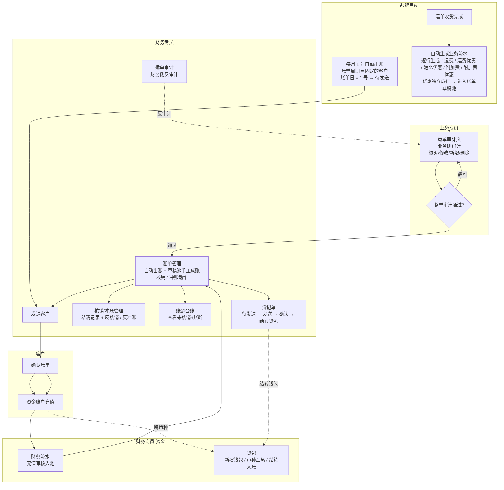
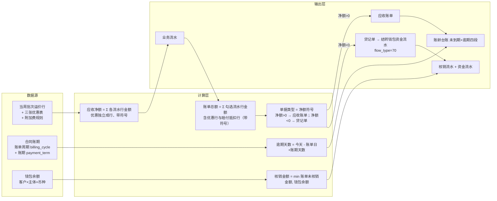
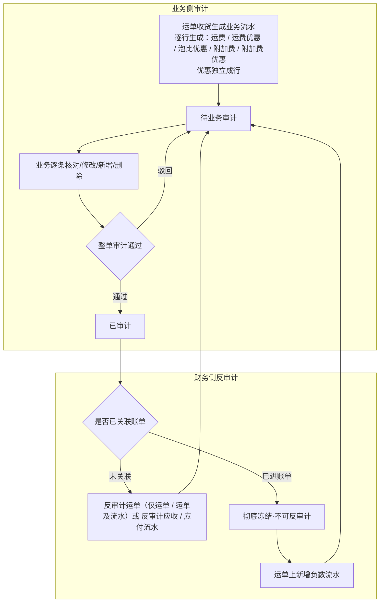
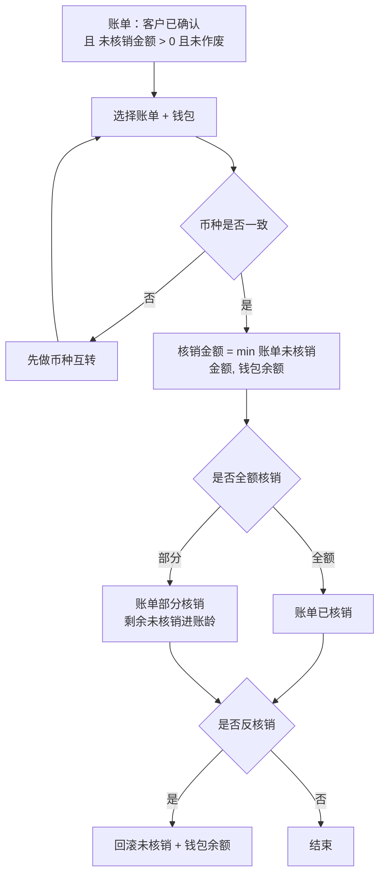

# 需求定义卡片 (RDD) — 财务模块

> **原始需求**：财务是飞点 TMS 的消费方，实现多主体独立核算 + 钱进钱出闭环，消费订单/运单数据完成应收管理、资金账户与账龄管理。
> **文档版本**: v1.9（Phase 1 定稿：应收管理 + 资金账户 + 业务流水台账） | **日期**: 2026-09-18 | **作者**: 飞点产品
> **本期范围**：流程一~三「应收管理」+ 流程四「资金账户」，共 2 个模块、19 项功能、24 条 AC（**赔付入账记录 `credit_record` 随二期赔付管理立项**；**应付业务流水台账已铺开设计（17 字段 + 新增 / 导入（文件）/ 导出 / 删除），数据随 Phase 2 应付管理上线**）。
> **分期口径**：Phase 1 = 应收管理 + 资金账户（本期定稿）；Phase 2 = 应付管理、对账中心、毛利分析、开票；Phase 3 = 实际成本核算。
> **汇率口径**：汇率统一调用阿里汇率接口实时获取（人民币=1 基准），币种互转页以接口值预填、允许财务手工覆盖并留痕（接口汇率 + 实际采用汇率 + 汇率来源三者同存）；一期不记汇损，不自建汇率表。

## 1. 核心洞察 (Insight)

**真实痛点**：

当前飞点 5 家公司（广州飞点、深圳飞点、广东飞点、香港富力顿、墨链）税务上独立法人、实际一个家族，但财务核算完全依赖线下 Excel。客户打款与应收账单之间靠财务手工核对，钱进来不知道冲哪张账单；账期到了不知道哪些客户逾期、逾期多久；多主体、多币种的资金往来靠手工分账，极易混账。

计费依赖运价模块的当周批次公布价、三张优惠表与附加费规则，但运单收货完成后，应收金额、账单、核销、账龄这一整条链路没有系统承载，财务只能线下追着业务要数据、手工算账。

**JTBD**：

> `财务专员` 雇佣"财务模块"不是为了"记流水账"，而是为了：**当运单收货完成后，能在系统内完成业务流水审计→生成账单→收款核销→账龄跟踪的闭环，且每一笔钱都挂到具体主体和币种，不混账、可追溯。**

> `客户（货主端）` 雇佣"财务模块"不是为了"看数字"，而是为了：**当收到账单后，能在线上确认账单并充值，不用线下反复跟财务对账沟通。**

> `业务专员` 雇佣"财务模块"不是为了"录数据"，而是为了：**当运单收货后，能在「财务中心 → 运单审计」页对业务流水做业务审计（核对 / 修改 / 新增 / 删除），财务侧可反审计，权责清晰。**

**业务价值**：

| 维度 | 当前 | 目标 |
|------|------|------|
| 应收核算 | 线下 Excel 手工算账 | 运单收货自动生成业务流水（**一条费用项一行、优惠独立成行**），业务审计 + 财务反审计 |
| 账单管理 | 财务手工发账单，客户线下对账 | 流水先进**账单草稿池** → 财务聚合已审计流水生成账单 → 发送 → 客户线上确认 |
| 收款核销 | 钱进来手工找账单冲抵 | 钱包池化 + 同币种核销，min(未核销,余额) 防透支 |
| 账龄跟踪 | 人工追账，无逾期预警 | 系统按账单日+账期自动分段，未到期单列+逾期四段 |
| 资金账户 | 多主体多币种手工分账 | 钱包按 客户×主体×币种 隔离，币种互转闭环 |
| 主体隔离 | 打款可能跨主体混打 | 每笔钱强制挂具体主体，钱包层隔离 |

## 2. 业务全景图

### 2.1 角色与工作节奏

| 角色 | 核心任务 | 频率 |
|------|---------|------|
| 财务专员 | 反审计业务流水、生成账单、收款核销、反核销、币种互转、充值审核、提现 | 日频 |
| 业务专员 | 业务侧审计业务流水（**「财务中心 → 运单审计」页**）、确认业务流水 | 日频 |
| 客户（货主端） | 确认账单、发起充值 | 按需/账期周期 |
| 系统自动 | 运单收货自动生成业务流水、**每月 1 号自动出账**（账单周期 = 固定的客户）、账龄实时计算 | 实时 / 每月 1 号 |

### 2.2 端到端业务链路

```
【应收触发】
  创建每周报价 → 创建运单 → 运单收货完成 → 系统自动生成业务流水
  （运费取当周公布价；运费优惠 / 泡比优惠 / 附加费 / 附加费优惠逐行生成，优惠独立成行）→ 进入账单草稿池
      ↓
【业务审计】
  业务侧核对 / 修改 / 新增流水后**整单审计**（入口 = 「财务中心 → 运单审计」的运单详情 · 应收 / 应付 Tab）→ 财务在同一页可反审计
      ↓
【赔付抵扣 / 贷记单】（负数应收流水，一期口径）
  业务在运单费用 tab 手工新增一条**负数应收流水**（赔付抵扣，金额为负）→ 走运单审计 → 审计通过后进草稿池
  净额 > 0 → 负数流水作账单内「赔付抵扣 −N」随账单抵扣运费；净额 < 0 → 出**贷记单**（我司欠客户，见末尾「贷记单」）
      ↓
【账单生成】
  草稿池 = **已审计且未成账的流水**（逐条流水展示，不按运单聚合）
  ① 自动：**账单周期 = 固定** 的客户由系统**每月 1 号**自动出账（账单日 = 1 号）→ 直接进「待发送」
  ② 手工：财务在「账单管理 → 草稿池」点「生成账单」→ 弹窗里**逐级选 客户 → 我司主体 → 币种 锁定一个组合**，该组合下全部可成账流水**默认全选**（可逐条取消）；只想出其中几条时，先在草稿池**勾选**再进弹窗（快路径）
      ↓
【发送客户】
  财务在「待发送」点「发送客户」→ 客户在货主端「账单管理」确认（异议走线下/工单，财务作废重开）
      ↓
【充值】
  客户在货主端「资金账户」发起充值（金额+币种+打款账户+支付时间+凭证）→ 财务在「财务流水」核对银行流水审核入池
      ↓
【核销 / 冲账】
  财务在「账单管理 → 已发送」Tab 点行内「核销」从钱包扣款冲账单（同币种，min(未核销,余额)，可部分核销/反核销；**核销只动客户钱包、不动我司账户**（现金在充值时已入账）；**结清记录（核销 + 冲账）与反核销 / 反冲账在独立菜单「核销/冲账管理」**）
  客户不付、钱包没钱 → 财务点行内「冲账」认亏平账（坏账冲销，可反冲账）
      ↓
【账龄】
  「账龄台账」按 客户×主体×币种 展示未核销余额 + 账龄四段（未到期单列）
      ↓
【资金账户】
  钱包开通（入驻自动人民币 + 财务手工开通其他币种）→ 币种互转（跨币种核销前）→ 提现
      ↓
【贷记单】（净额 < 0 的负数应收，我司欠客户）
  生成 → 进「待发送」→ 发送客户 → 客户确认（发送满 7 天未确认自动确认）→ 财务「结转钱包」结清（钱包 += |净额|，入钱包即终态、不可撤销；不进核销 / 账龄）
```

### 2.3 实体依赖关系

```
应收业务流水 (ArFlow) — 应收侧聚合根
  ├── N:1 应收账单 (ArBill)
  ├── N:1 运单 (Waybill) ← 外部引用（运单模块）
  ├── N:1 客户 (Customer) ← 外部引用（客商中心）
  ├── N:1 主体 (Entity) ← 外部引用（基础资料）
  └── 赔付行 = 一条**负数应收流水**（赔付抵扣，金额为负），随账单抵扣运费
      （赔付行是 ArFlow 的一种，不是独立实体：审计、进池、成账、抵扣链路与普通流水完全一致）

应收账单 (ArBill)
  ├── 1:N 应收业务流水 (ArFlow)
  ├── 1:N 收款核销流水 (ArWriteoff)
  └── 备注：**一个运单可关联多张账单**（成账颗粒度 = 流水级；后续新审计通过的流水、赔付抵扣流水天然进下一期）

客户钱包 (CustomerWallet) — 资金侧聚合根
  ├── N:1 客户 (Customer) ← 外部引用
  ├── N:1 主体 (Entity) ← 外部引用
  └── 1:N 资金流水 (WalletFlow)

资金流水 (WalletFlow)
  ├── 1:1 充值申请 (RechargeApply)
  ├── 1:1 收款核销流水 (ArWriteoff)
  └── 1:2 币种互转 (CurrencyTransfer)

我方银行账户 (BankAccount) — N:1 主体，被充值申请引用；同时作为**我司主体资金账户**（「资金账户管理 → 我司账户」）= 双边资金流水的**我司侧落账账户**
币种互转 (CurrencyTransfer) — 1:2 资金流水（转出/转入）
账龄台账 — 纯视图，基于应收账单实时计算，不建表
```

### 2.4 核心业务流程图（泳道图）



### 2.5 核心数据流图



---

## 3. 流程一：应收业务流水与审计（日频）

> **触发**：运单收货完成（**一次性生成**：字段匹配型 + 字段&公式型附加费随收货完成生成、人工添加型由业务手工新增） **频率**：实时自动生成 + 日频审计 **前置依赖**：运单模块收货状态与货物参数、超级运价当周批次运价行 + 三张优惠表 + 附加费规则、客商中心合同账期与客户等级

**3.1 应收业务流水 (ArFlow)** — 运单收货自动生成的逐票应收，粒度=运单，**一条费用项一行（优惠独立成行）**，按费用类型×币种可拆多条

> **As a** 财务专员 **I want to** 运单收货后系统自动生成应收业务流水 **So that** 每票运单的应收金额有系统记录、可追溯

| 字段 | 类型 | 必填 | 说明 |
|------|------|------|------|
| 运单号 | 引用 | ✅ | 引用运单模块，粒度=运单 |
| 客户 | 引用 | ✅ | 引用客商中心 |
| 主体 | 引用 | ✅ | 5 账套之一，强制挂主体 |
| 业务流水大类 | 枚举 | ✅ | 应收 / 应付 / 销售提成；**Phase 1 仅实现应收（10）**，应付/销售提成为预留枚举，Phase 2 随应付管理开放 |
| 流水种类 | 枚举 | ✅ | 运费 / 运费优惠 / 泡比优惠 / 附加费 / 附加费优惠 / 手工新增 —— **一条费用项生成一条流水，优惠独立成行** |
| 费用类型 | 引用 | ✅ | 引用头程管理费用类型字典（运费/周六派送费/超重费/地址附加费/商品附加费/报关费/库内贴标费…），同方向唯一。**取值来源按流水种类**：运费行=预置费用类型「运费」；运费优惠 / 泡比优惠行=**优惠规则上配置的费用类型**；附加费行与附加费优惠行=**该附加费规则计价明细「应收」行的费用类型** |
| 币种 | 枚举 | ✅ | 运费币种来自报价，附加费币种来自附加费规则，可跨币种 |
| 单价 | Decimal | ✅ | 本行单价（带符号）：运费行=当周公布价、附加费行=应收单价、优惠行=优惠值（负=减钱、正=加价）；手工新增行：附加费必填（金额 = 单价 × 计费量）、非附加费留空（直接填金额） |
| 计价单位 | 枚举 | 否 | 票 / 箱 / KG / m³ / 数量。**来源跟着规则走**：运费 / 运费优惠 / 泡比优惠行 = 运单所关联服务组合的计费方式；附加费 / 附加费优惠行 = 该条附加费规则的计价单位 |
| 计费量 | Decimal | 否 | 计费数量（重量/体积/箱数/张数）；按票计费=1；关联附加费规则按数量计费时由业务填写；非附加费手工新增行留空（直接填金额） |
| 金额 | Decimal | ✅ | **金额口径分两种**：附加费 = 单价 × 计费量（自动算）；非附加费手工新增 = 直接填金额（单价 / 计费量留空）。**带符号**：费用行为正；优惠行为负=减钱 / 正=加价。**运单应收净额与账单金额 = 各行金额的代数和** |
| 汇率 | Decimal | ✅ | 调阿里汇率接口实时获取，人民币=1，不参与金额计算 |
| 描述 | 文本 | 否 | **面向客户的说明**（货主端可见），如「超重超长按实测尺寸计收」 |
| 备注 | 文本 | 否 | **仅内部可见**（货主端不展示） |
| 拣货时间 | DateTime | 否 | **该行所属运单的收货完成时间**（运单级属性落在行上）：收货完成生成时直接写入（含人工添加行）；人工添加时后端取运单收货完成时间写入。**两端均展示**（为空显示「—」） |
| 创建日期 | DateTime | ✅ | 该行创建时间，**后端自动写入**（系统生成=生成时间 / 人工新增=提交时间）；**前端不展示**（两端一致），仅后台追溯与取数用 |
| 来源类型 | 枚举 | ✅ | 10 系统自动计算（收货/拣货/重算生成）/ 20 人工添加 —— **决定该行的可编辑字段范围**（系统自动行仅可改 描述 / 备注，人工添加行可改全部字段） |
| 数据来源 | 文本 | ✅ | 报价 / 规则名 / 人工添加（只记第一次来源，后续变更不变）；**货主端不展示** |
| 来源规则 | 引用 | 否 | 命中的规则类型 + 规则ID + **规则名快照**（运价行 / 运费优惠规则 / 泡比优惠规则 / 附加费规则 / 附加费优惠规则），**用于运单审计下钻「这笔钱是哪条规则给的」**；手工新增留空。**员工端列表不展示、收进行详情；货主端不展示** |
| 创建人 | 文本 | ✅ | 系统生成显示「系统自动」、人工添加显示操作人；**货主端不展示** |
| — | — | — | **到期日期 / 账单日 / 账期天数 / 签约账期与天数·号 均为「账单」级字段**（见流程二账单实体表），**流水上不存**；不在运单费用流水页展示（员工端与货主端一致） |
| 审计状态 | 枚举 | ✅ | **待业务审计 / 已审计（只有两态）** |
| 业务审计人/时间 | 文本/DateTime | 否 | 业务侧「运单审计」页整单审计留痕 |
| 财务审计人/时间 | 文本/DateTime | 否 | 财务侧「运单审计」反审计留痕 |
| 关联账单ID | 引用 | 否 | 生成账单后回填（流水级关联，可跨期跨年） |

**业务规则**：
① **计费触发点** = 运单收货完成，系统主动生成业务流水（字段匹配型 + 字段&公式型附加费随收货完成一次性生成；人工添加型由业务手工新增）
② **业务流水逐行构成**：**运费 1 条**（费用类型=预置「运费」）+ **运费优惠 1 条** + **泡比优惠 1 条** + **各命中附加费各 1 条** + **各命中附加费优惠各 1 条**。**优惠独立成行、不并入费用行**：运费优惠 / 泡比优惠行的费用类型取**优惠规则上配置的费用类型**，附加费优惠行取**所属附加费规则计价明细「应收」行的费用类型**；单价=优惠值（带符号，负=减钱、正=加价），金额 = 优惠值 × 计费量。同一运单可同时存在多个优惠行（运费优惠与泡比优惠叠加、多条附加费优惠各自成行）
③ **总运费匹配逻辑**：运单绑定服务组合，按 仓库组 + 重量段 + 交货地组 匹配**当周批次（CURRENT）**的运价行取公布价；匹配到走报价（数据来源=报价、来源规则=运价行），匹配不到（私仓未做报价）由业务手工新增（数据来源=人工添加）。**优惠从超级运价三张优惠表实时匹配**（不进周批次快照）：运费优惠按 服务组合 ×（客户特批 > 客户等级）取一条生效规则；泡比优惠按 泡比 ≥ 密度阈值 取阈值最大档；附加费优惠按 附加费规则 × 目标匹配。**取数入参**：调超级运价 `POST /api/pricing/calc` 时**运单只传自身字段**（运单与身份 / 服务与路径 / 货物参数 / 业务开关），尾程派送方式 / 计费方式 / 包税方式 / 客户等级 / 可用优惠规则由超级运价**服务端反查**
④ **数据来源**：记录第一次来源（报价 / 人工添加），业务后续修改金额/币种不改变来源
⑤ **按数量计费**：费用类型关联附加费规则（单价，如贴标费 2元/数量），业务新增流水时选费用类型 + 填数量，金额 = 单价×数量 自动算
⑥ **审计模型** = 单审计 + 反审计，且**分两层标签**：① **运单审计标记（只有两态：未审计 / 已审计）**，**按费用方向各一条**（应收 / 应付互不影响）：主列表选运单 → 审计 → 选应收 / 应付 → **该方向整票流水统一审计**，运单该方向置「已审计」→ **整票不允许新增该方向费用**；反审计 → **每方向独立选「仅运单 / 运单及流水」**（仅运单 = 只反标记、原流水仍锁定；运单及流水 = 反标记 + 该方向流水回待业务审计）；② **流水审计标记**：在运单详情的应收 / 应付模块**勾选流水**后点审计 / 反审计，逐条生效 —— **运单未审计时，某条流水已审计 → 该条不可编辑、整票仍可新增流水**。业务侧正向审计（逐条核对/修改/新增/删除 → 整单审计通过）；财务侧反审计（撤销审计，退回业务重改）。**入口在「财务中心 → 运单审计」页**（另「应收业务流水」页提供**流水级审计 / 反审计**第二入口，见 §3.4；运单管理页**全程只读**，既不提供流水增删改、也不提供审计动作）：**运单级** = 列表勾选运单 →「审计」→ 选应收 / 应付（该方向整票统一审计）、「反审计」→ 每方向独立选「仅运单 / 运单及流水」；**流水级** = 点运单号进详情 → 应收 / 应付 Tab 勾选流水 →「审计」/「反审计」。**运单审计页的运单详情里，运单资料类操作按钮一律置灰**（编辑运单 / 编辑货箱 / 编辑测量数据 / 编辑快递单 / 取消·退件货箱 / 添加标签比价 / 批量下载标签 / 重新比价 / 打印 / 创建工单 / 上传·修改·删除附件 / 轨迹增删改），本页**只有「费用管理」Tab 可写**，运单资料改动回运单管理或对应业务页面。**反审计仅财务角色可执行**
⑦ **反审计粒度**：**运单级（按费用方向 × 深度「仅运单 / 运单及流水」）+ 流水级（勾选流水逐条）**；「仅运单」只反运单标记（流水保持已审计，可新增、原流水仍锁定），「运单及流水」反标记 + 该方向**未进账单的**流水回待业务审计（可新增 + 未进账单原流水可编辑，**已进账单的流水保持已审计、不回退**）；反审计前提是该条未关联账单（已进账单的流水逐条排除），不受收货时间限制

**业务规则（续）**：
⑧ **编辑权限（按字段分档）**：**系统自动计算行**（`来源类型=10`）**仅可修改「描述」与「备注」**，金额口径字段（币种 / 单价 / 计价单位 / 计费量 / 金额 / 汇率）**不可手改**（由规则与重算唯一维护）；**人工添加行**（`来源类型=20`）可改全部字段。业务审计后冻结、进账单后彻底冻结
⑨ **到期日期算法（账单级）**：到期日只挂在**账单**上（`ar_bill.due_date`），**流水上不存** —— 账单日未定就算不出到期日。口径 = 「**签约账期 + 合同天数/号**」：**按月类**（101 月结 / 102 双月结 / 103 三月结）取「**账单日所在月 + 结算月**（月结 0 / 双月结 1 / 三月结 2）」的**第「天数/号」号**（「天数/号」= 合同上的数字 **1–31**；该号不晚于账单日 → 顺延下一月同一号；该月无该号 → 取该月月末）；**按天类**（201 周结）= **账单日 + 天数/号 − 1 天**；**事件型账期**（202 到港前结 / 203 签收月结 / 204 到海外仓结 / 205 签收结）**推不出到期日 → 该组不允许出账**；合同账期段为空 → 同样不允许出账（手工成账直接阻断、自动出账**跳过该组且页面不给提示**，该组流水留在草稿池、「账期」列实时显示「待补录」），**账单不做账期补录**。**账期天数 = 到期日 − 账单日 + 1**（账单级快照，**仅供账龄**、页面不展示）。**账龄口径不变**（仍按 账单日 + 账期天数 起算）
⑪ **手工新增应收**：**任何费用类型都允许手工新增**（业务认为系统自动行不对 → **先删除原自动行再手工补录**）。**先选「类型」（附加费 / 非附加费）→ 决定字段**：费用类型被**人工添加型附加费规则**的计价明细「应收」行引用 → 可选来源规则，选了则**币种 / 计价单位按规则带出且只读、单价按规则带出但可改（改了单价 → 清空来源规则、退化为手工新增）**、流水种类=附加费并留痕来源规则、**保存时自动匹配该规则的附加费优惠、命中则另生成一条附加费优惠负流水（优惠独立成行）**；不选（有候选但清空）→ 自由填写单价 / 计价单位 / 计费量（**计价单位：运费 / 运费优惠 / 泡比优惠取服务组合计费方式，其余留空**）、流水种类=手工新增、无来源规则；**无候选（非附加费）→ 直接填金额**（币种 / 汇率 / 计价单位（仅作标记）/ 金额（原币）/ 金额（本币）（只读 = 金额（原币）× 汇率）/ 描述 / 备注，无单价 / 计费量）、流水种类=手工新增、无来源规则。**更换费用类型 → 清空单价 / 计费量 / 金额 / 关联标识**（来源规则按新类型重新带出）。通常由系统自动生成的费用类型（运费 / 字段匹配 / 字段&公式 / 优惠类）**不拦截**。共同口径：来源类型 = 人工添加、创建人 = 操作人，拣货时间与创建日期由后台赋值；**金额口径分两种：附加费（有规则候选）= 单价 × 计费量（自动算）、非附加费（无规则候选）= 直接填金额（单价 / 计费量留空）**；与已有自动行命中同一去重键 → 阻断（提示先删除原行）。**打标联动**：选了来源规则的手工行，保存后按规则绑定的**附加费标识**为**该行所属运单**打标（多票逐票判定；与自动命中口径一致、同标识不重复打、失败仅告警不清流水）。**两个入口同口径（都先选类型）+ 批量铺费用**：**运单审计「添加应收」与应收业务流水「新增流水」都先选「类型」（附加费 / 非附加费）→ 附加费选来源规则 + 单价×计费量、非附加费直接填金额**。运单列表工具栏 → 上下文 = 勾选的运单（未勾选阻断；**勾选多票须计费方式一致**（运费 / 运费优惠 / 泡比优惠计价单位随服务组合计费方式，混勾会导致批量铺运费计价单位不一致），按 KG / 按 m³ 混勾 → 阻断）；运单详情 · 费用管理 tab → 上下文 = 该运单。**多票时每张卡片带「适用运单」只读（默认带出主列表勾选的全部运单、不可修改），保存票展开：一条费用 × M 票 = M 条流水**（逐票留痕、逐票打标）
⑭ **负数应收 = 贷记单（我司欠客户）**：负数应收流水由**系统识别到赔付自动插入运单**（不取决于客户是否合作），因此**必须有"不依赖客户后续业务"的结清出口**。口径：① 组合**净额 > 0** → 负数流水作账单内一行「赔付抵扣 −N」，随账单正常发送 / 确认 / 核销；② 组合**净额 < 0** → 出**贷记单**（净额 = 0 → 不出账）（**不参与收款核销、不进账龄、不计入「未核销金额」**，但**照常发送客户并可确认**）；③ 结清 = 财务一键「**结转钱包**」→ 客户可用额度增加（资金流水类型「贷记单入账」）→ 之后**有欠款正常核销、要现金走提现**；**结转前置 = 客户已确认**（发送满 7 天未确认由系统自动确认，不会因客户不合作卡死）；④ **贷记单的生成与作废**：生成后**先进「待发送」**（与普通账单同一套阶段）—— 未发送前**可改内容**（加 / 删流水、改账单日期）**也可整张作废**（赔付流水释放回草稿池、下期重新出账），这是**唯一"改完不用惊动客户"的纠错窗口**；发送客户后进「已发送」等确认（未确认前仍可作废撤回）；**客户已确认（含系统自动确认）后不可作废** —— 我司认账的付款承诺不能单方面撤回，纠错走**运单侧新增反向流水 → 下期账单抵扣**，**已结转的也一样 —— 钱进客户可用额度即终态、不可撤销**（可能已被拿去核销别的账单）；⑤ **不做「撤销入账」**：结转是结清动作，反悔只能走**对冲凭证**（运单侧新增正数流水 → 下期账单抵扣），**不回滚已发生的资金流水** —— 钱包里的钱不区分来源，逐笔回滚需要资金逐笔配对（一期不做）；⑥ **单据类型显式区分**：`bill_type` = **应收账单（我司向客户收款）/ 贷记单（我司应付客户）**，生成时按净额符号自动判定、**不靠金额符号推断** —— 核销准入、账龄台账、资金账户「未核销金额」一律只认**应收账单**；两类单据**同一张表、同一套流程**（成账入口共用草稿池），**不建第二张表**。

⑫ **费用操作的状态与冻结边界（两层解耦）**：**新增与编辑分两条线** —— ① **运单状态**：允许 = 已收货 / 转运中 / 已到港 / 已清关 / 已到仓 / 已签收 / **退件**；已下单 / 收货中（尚未计费）与已取消**不允许新增费用**，仅可查看。**退件放开**：客户把货送来了但不发货、要退货给客户，收货产生的成本仍需客户承担 → 退件运单允许新增 / 编辑 / 删除流水与审计。**新增该方向流水** = 运单状态允许 **且** 该方向**运单审计标记未审计**；**编辑 / 删除某条流水** = 运单状态允许 **且** 该条**未关联账单** **且** 该条**流水审计标记待业务审计**（**不再要求该方向未整票审计** —— 运单标记只管新增、流水标记只管编辑）
⑩ **拣货时间与创建日期**：**拣货时间**取该运单的**收货完成时间**（运单级属性）—— 收货完成生成时直接写入（只动时间、不动金额，人工添加行同样写入）；**创建日期**为行创建时间，**后端自动写入、前端不展示**。**业务手工新增应收**时，这两个字段**由后端自动赋值**（拣货时间取运单收货完成时间、创建日期取提交时间），弹窗不提供录入

**相关 AC**：`AC1-生成` `AC2-审计` `AC3-反审计` `AC4-费用调整`

**3.2 核心场景（反审计规则，以是否关联账单为界）**

```
场景：业务流水纠错（财务反审计）
  1. 未关联账单 → 可反审计运单（仅运单 / 运单及流水）或按方向反审计应收 / 应付流水 → 业务直改后重新审计
  2. 已进账单 → **彻底冻结、不可反审计** → 要冲减则在运单上**新增一条负数流水**（走运单审计）
                  → 于**下一期账单**抵扣，原账单金额不追溯
```

**3.3 关键操作流程图（单审计 + 反审计）**



**3.4 业务流水台账（应收 / 应付两个菜单）**

> **As a** 财务专员 **I want to** 在一个页面按流水本身（而非按运单 / 账单容器）查全量业务流水 **So that** 对账 / 查账 / 追溯不用再跨「运单审计 → 草稿池 → 账单详情」三处拼

**定位**：员工端**全量台账**，跨容器（**待审计 / 已审计未成账 / 已进账单 / 作废释放**）全量展示，**能筛能钻**；**应收台账另承载「新增流水 / 导入（文件）/ 删除」三个写动作 + 勾选批量「审计 / 反审计」**（新增流水 = 批量把流水导入运单、同运单审计「新增流水」R60；导入 = 上传文件批量导入流水、R75；删除 = 删流水、同运单审计「删除」R61，**已进账单 / 已审计不可删**；审计 / 反审计 = 勾选流水批量审计 / 反审计、同运单审计「流水级审计 / 反审计」R61，**已关联账单不可审计 / 反审计、未审计可审计不可反审计**）。成账 / 结算仍各归原位。**分工**：同一张 `ar_flow` 按三种维度打开、各司其职 —— 运单审计（按运单，改账 + 审计）、草稿池（按出账，成账工作台）、应收业务流水（按流水本身，全量查账 + 批量导 / 删 / 补 + 勾选批量审计）；草稿池是本页的「已审计 + 未成账」子集、任务是出账，与本页「字段有重叠、任务不同、不合并」。

**两个菜单**：
- **应收业务流水**（`flow_category = 10 应收`）：一期即有全量数据；工具栏「**新增流水 / 导入 / 审计 / 反审计 / 导出 / 删除**」+ 行操作「**详情**」
- **应付业务流水**（`flow_category = 20 应付`）：**应付管理台账页**（数据随 Phase 2 应付管理上线）；工具栏「**新增应付业务流水 / 导入（文件）/ 导出 / 删除**」+ 行操作「**详情**」

**查询维度**（应收台账）：客户昵称 / 客户编号 / 我司主体 / 币种 / 费用类型 / 审计状态 / 账单状态（未成账 / 已进账单）/ 运单号 / 客户单号 / 拣货时间区间

**列表列**：流水号 → 运单号 → 客户编号 → 客户昵称 → 客户名称 → 销售代表 → 我司主体 → 账单编号 → 费用类型 → 审计状态 → 币种 → 汇率 → 单价 → 计价单位 → 计费量 → 金额（带符号）→ 创建人 → 备注 → 描述 → 拣货时间 → 创建时间；来源规则 / 数据来源收进「行详情」

**查询维度（应付台账）**：供应商 / 运单号 / 费用类型 / OA审批编号 / 币种 / 账单状态 / 提单号 / 转单号 / 业务时间（账单归属月）

**列表列（应付台账）**：流水号 → OA审批编号 → 供应商 → 运单号 → 提单号 → 费用类型 → 审计状态 → 转单号 → 币种 → 汇率 → 费用（原币金额）→ 费用（本币金额）→ 备注 → 描述 → 账单编号 → 创建人 → 业务时间（账单归属月）→ 创建时间；**转单号 = 运单关联的快递主单号**、**业务时间 = 统一账单归属月（YYYY-MM）**

**下钻**：运单号 → 运单审计详情；账单号 → 账单详情；行详情 → 来源规则（「这笔钱哪条规则给的」）；工具栏「审计 / 反审计」= 勾选流水的流水级批量审计 / 反审计（R61）

**数据**：直接查 `ar_flow`，**不建新表、不建新状态机**；与运单审计（写 + 审计）、草稿池（成账）、账单详情（结算）各管一摊，**互不取代**；应收台账的「新增流水 / 导入（文件）/ 删除 / 勾选批量审计与反审计」复用 R60 / R61 / R75，不新增状态机

**相关 AC**：`AC23-应收业务流水台账` `AC24-应付业务流水台账`

## 4. 流程二：账单生成与客户确认（账期周期）

> **触发**：① 系统每月 1 号自动出账（账单周期 = 固定的客户）② 财务手工成账（账单周期 = 不固定的客户） **频率**：每月 / 按需 **前置依赖**：流程一已审计的业务流水

**4.1 应收账单 (ArBill)** — 系统自动出账或财务手工聚合**已审计**流水，**客户 + 我司主体 + 币种** 各一张（不跨币种折合）

> **As a** 财务专员 **I want to** 聚合已锁定流水生成账单并发送客户 **So that** 客户能确认应收金额

| 字段 | 类型 | 必填 | 说明 |
|------|------|------|------|
| 账单号 | 文本 | ✅ | 唯一，规则 `AR-{主体代码}-{年月}-{5 位序号}`，**序号零填充 5 位、按 主体 × 账期月 每月从 `00001` 重置**（主体代码：广州GZ/深圳SZ/广东GD/香港HK/墨链ML） |
| 客户 | 引用 | ✅ | 引用客商中心 |
| 主体 | 引用 | ✅ | 5 账套之一 |
| 币种 | 枚举 | ✅ | 同币种聚合 |
| 账单日 | Date | ✅ | 自动出账 = **每月 1 号**（跑批日）；手工出账 = 财务指定，**默认生成当月自然月末** |
| 到期日期 | Date | ✅ | **最后支付日**，按「签约账期 + 合同天数/号」推导 —— 按月类取账单月（账单日所在月 + 结算月）的第 N 号、按天类 = 账单日 + N − 1 天；事件型推不出 → 不允许出账（见业务规则⑨） |
| 账期天数 | Integer | ✅ | 账单级快照 = **到期日 − 账单日 + 1**（账龄台账按 账单日+账期天数 起算，公式不变）；由到期日反推，**仅供账龄、页面不展示** |
| 签约账期 + 天数/号 | 枚举 + Integer | ✅ | 生成账单时从合同快照：签约账期（101 月结 / 102 双月结 / 103 三月结 / 201 周结 / 202 到港前结 / 203 签收月结 / 204 到海外仓结 / 205 签收结）+「天数/号」；**账单页「账期」列 = `{签约账期}+{天数/号}`**（如 `月结+15`、`月结+30`；**「天数/号」是合同上的数字字段（1–31），只有数字、没有「月末 / 月初」这类文字值**；`0` / 空 = 未填 → 账期视为未完善，不允许出账） |
| 生成来源 | 枚举 | ✅ | 系统自动（每月 1 号跑批）/ 财务手工（草稿池勾选成账） |
| 账单总额 | Decimal | ✅ | Σ 勾选流水各行金额（代数和，含优惠行、赔付抵扣行的带符号金额） |
| 已核销金额 | Decimal | ✅ | 核销累加，默认 0 |
| 未核销金额 | Decimal | ✅ | 账单总额 − 已核销 |
| 发送状态 | 枚举 | ✅ | 未发送 / 已发送 |
| 确认状态 | 枚举 | ✅ | 未确认 / 已确认 |
| 核销状态 | 枚举 | ✅ | 未核销 / 部分核销 / 已核销 / 已反核销 |
| 作废标记 | 枚举 | ✅ | 正常 / 已作废（终态） |
| 生成人/时间 | 文本/DateTime | 否 | 财务操作留痕 |
| 发送时间 | DateTime | 否 | 发送客户时间 |
| 客户确认时间 | DateTime | 否 | 货主端确认回填 |
| 作废人/时间 | 文本/DateTime | 否 | 财务作废留痕 |
| 作废原因 | 文本 | 否 | 作废时可填，备查 |

**业务规则**：
① **账单粒度**：账单号挂在每条业务流水上（流水级），一个运单的多条流水按 **币种** 拆到多个账单（**不跨币种折合**，USD 流水单独出一张 USD 账单），可跨期跨年；**成账颗粒度 = 流水级** —— 财务**逐条勾选**草稿池内的已审计流水成账，**同一运单的不同流水可以拆到不同账单**；因后续新审计通过的流水与赔付抵扣流水天然进下一期，**一个运单可关联多张账单**
② **账单周期与账期**：消费客商中心 `customer_contract` 表（合同级），财务不重复维护 —— **账单周期**（固定/不固定）决定客户是否参与每月 1 号自动出账；**账期**（`payment_term` + 天数/号）决定到期日；主数据在客商中心「客户管理 → 合同/账期」由财务/销售维护（合同签约完成后处理）
③ **取消账期补录**：账期主数据唯一入口 = 客商中心「客户管理 → 合同/账期」。合同账期段为空、或 `payment_term` 为事件型（202~205）导致推不出到期日时，**一律不允许出账** —— 自动出账**跳过该组、页面不给提示**（靠「账单草稿池 → 账期」列的实时值「待补录」定位），财务手工成账直接阻断；**账单页不提供账期补录入口**，账单上的账期与天数/号一律为合同快照
④ **客户确认账单（手动 + 超期自动）**：客户在货主端「待确认」Tab 点「确认账单」；**若发送日（含当日）起满 7 个自然日客户仍未确认 → 系统每天 00:30 的定时任务自动确认**（确认方式记「系统自动确认」，与手动确认**效力相同**，不可撤销）—— 目的是给对账一条截止线，避免账单永远停在「待确认」而卡住核销与账龄；客户侧「待确认」Tab 有常驻说明条、账单详情给出该单的自动确认时间。一期不做线上异议，异议走线下/工单 —— 财务可**作废**该账单（限**核销状态 = 未核销**）后重新出账（生成新账单号）；**已有核销记录（部分核销 / 已核销）的须先反核销再作废**；作废后其下流水**释放回草稿池**、账单号不回收
⑤ **账单草稿池**：**入池门槛 = 已审计** —— 只有已审计流水进池（`bill_id` 为空），**未审计流水不进池、页面也不给未审提示**；草稿池是**流水级列表**（不按运单聚合），财务按 **客户 + 我司主体 + 币种** 筛选后**逐条勾选**成账（**账单日不参与分组**；手工出账账单日默认 = 生成当月自然月末）
⑥ **账单作废**：**核销状态 = 未核销**的账单可作废（「待发送」「已发送」两个 Tab 都提供入口），作废时**必须在弹窗里填写作废原因（必填，≤200 字）**，与作废人 / 作废时间一起留痕，并在**账单详情的「操作时间线」**里展示（详情头部不重复开一行）；作废后其下流水**释放回草稿池**、账单号保留不回收、重新出账生成**新账单号**；**已有核销记录（部分核销 / 已核销）的账单须先反核销再作废**；作废账单**不出现在货主端、不进账龄台账**
⑦ **已进账单的费用调整**：**原账单金额不追溯调整**（保持生成时的快照）；要冲减 → 在该运单**新增一条负数流水**（走运单审计）→ 进账单草稿池 → 于**下一期账单**抵扣（与赔付抵扣同一机制）
⑧ **自动出账（每月 1 号）**：对**账单周期 = 固定**（月结/双月结/三月结）的客户，系统每月 1 号按 客户 × 主体 × 币种 分组取已审计未成账流水自动生成账单（账单日 = 1 号、生成来源 = 系统自动、**发送状态 = 未发送 / 确认状态 = 未确认 / 核销状态 = 未核销 / 作废标记 = 正常**），**直接进「待发送」**；组内无可成账流水 → 跳过不生成空账单；合同账期推不出 → **跳过该组、页面不给提示**（该组流水留在草稿池，「账期」列实时显示「待补录」，补齐后自动消失）；**幂等**：同 客户×主体×币种 同月不重复出账。**月结 / 双月结 / 三月结只影响账单月（+0 / +1 / +2 个月），不影响每月出账一次的频率**
⑨ **账单管理只到「发送」为止**：账单状态拆成**三个独立维度 + 一个作废标记**（发送 / 确认 / 核销 + 作废），**Tab 只按发送维度与作废标记分**（待发送 = 未发送 / 已发送 = 已发送 / 已作废）；**「已发送」Tab 展示「发送状态 + 确认状态 + 核销三列（核销状态 / 已核销金额 / 未核销金额）」**，**核销动作（「核销」按钮 + 工具栏「批量核销」）也在同一页**（+ 账单的核销明细抽屉），**结清记录（核销 + 冲账）与反核销 / 反冲账在独立菜单「核销/冲账管理」**（核销单是另一张表）—— **原独立菜单「收款核销」已下线**，核销不再需要第二个菜单或跨页跳转

⑩ **账单导出（「已发送」Tab 工具栏）**：**导出对象 = 「已发送」这批账单** —— 草稿池是流水级（还没成账）、待发送**尚未形成对客承诺且还能改**、已作废不该交付、结清记录是另一张表（核销单），所以导出入口就放「已发送」Tab 的工具栏，**查询区不再留导出**（同一动作不留两个入口）。**导出范围 = 列表里勾选的账单**（**必须先在「已发送」列表勾选**，未勾选时「导出」置灰 —— 不做"一点就把全量导出去"；勾选仅对当前列表有效，翻页 / 切 Tab / 改查询条件后不在结果里的行不计入；可跨客户勾选）；**交付 = 一张账单一个 Excel**（账单本身即「单一客户 × 单一主体 × 单一币种」，天然不混装、不需要跨币种折合）；**模板分类由财务选**（常规模板 / 出口退税模板，取自财务提供的两份模板文件）；**导出是异步任务 —— 页面只负责提交，进度与结果文件到「后台任务」看/下载**；导出是**纯读动作**，账单的发送 / 确认 / 核销 / 作废四个维度全不变，也不进账单「操作时间线」。

**相关 AC**：`AC5-生成` `AC5a-作废与重开` `AC5b-自动出账` `AC6-发送` `AC7-确认` `AC20-账单导出`

## 5. 流程三：收款核销与账龄台账（日频）

> **落点**：核销的入口在「**账单管理 → 已发送**」Tab 的行内「核销」按钮（+ 工具栏「批量核销」）；**结清记录（核销 + 冲账）与反核销 / 反冲账在独立菜单「核销/冲账管理」**（原独立菜单「收款核销」已下线，见 PRD §5.3 / §5.13）。

> **触发**：客户打款入池、财务核销 **频率**：日频 **前置依赖**：流程二已确认账单、流程四钱包余额

**5.1 结清记录 (ArWriteoff)** — 财务核销/冲账/反核销/反冲账记录，留痕可审计

> **As a** 财务专员 **I want to** 从钱包扣款冲抵账单 **So that** 账单未核销金额减少、钱账对应

| 字段 | 类型 | 必填 | 说明 |
|------|------|------|------|
| 账单号 | 引用 | ✅ | 被核销账单 |
| 钱包 | 引用 | ✅ | 扣款钱包（客户×主体×币种） |
| 币种 | 枚举 | ✅ | 强制同币种 |
| 核销金额 | Decimal | ✅ | min(账单未核销金额, 钱包余额) |
| 核销类型 | 枚举 | ✅ | 核销 / 反核销 |
| 核销前/后账单未核销金额 | Decimal | ✅ | 留痕 |
| 核销前/后钱包余额 | Decimal | ✅ | 留痕 |
| 操作人/时间 | 文本/DateTime | ✅ | 财务 |
| 关联资金流水ID | 引用 | 否 | 核销→资金流水联动 |
| 被反核销 / 反冲账的原结清ID | 引用 | 否 | 反核销 / 反冲账指向原结清记录 |

**业务规则**：
⓪ **核销前置 = 客户已确认（「待核销」清单的准入条件）**：只有「**客户已确认**（手动确认或发送满 7 个自然日自动确认）+ 未核销金额 > 0 + 未作废」的账单才可核销（在「账单管理 → 已发送」Tab 用「核销状态」筛出这批） —— **客户还没认可账单金额时不能扣它的钱包**；未确认的账单请到「账单管理 → 已发送」看「确认状态」，客户确认后自动进入本清单，**不提供"强制核销"入口**
① **核销永远同币种**：账单币种与钱包币种必须一致，跨币种先走钱包互转（流程四）
② **核销金额** = min(账单未核销金额, 钱包余额)，钱包不可透支
③ 支持部分核销 / 一对多 / 多对一；池化模型，不做进账↔账单映射（在线付款上线后再做关系表）
③-2 **批量核销（从钱包进 · 到期日优先 · 顺序分配）**：「账单管理 → 已发送」Tab 点工具栏「批量核销」→ 弹窗里**逐级选钱包**（客户 → 我司主体 → 币种三个联动条件，选项只列"有可核销账单"的组合、**一律从账单反推 —— 不查客户主数据、不看客户启用状态**（客户被禁用或合同过期解约，只要还有账单就得能核）；**客户可按 客户名称 / 昵称 / 编号 模糊搜索**；**改上级一律清空下级、不代填**，选齐即锁定一本钱包），**打开时不预选、不代填**（空态起步、确认按钮置灰，须由财务主动锁定要核的那一本 —— 核销不可逆，"默认为哪一本"没有正确答案；只有一本可核销钱包时在空态里写出来提示）；锁定后下面**实时列出该钱包下的可核销账单**、**默认全选**（可逐张取消）。**核销顺序 = 到期日期从早到晚**（同日按账单号）；**逐单从同一个钱包顺序扣**，每张 = min(本单未核销金额, 钱包可用余额) —— 钱包不够就部分核销，扣完后的账单**本次不核销**（三张各 100、钱包 150 → 全额 / 部分 50 / 不核销）。每张各生成一条核销记录（本次核销为 0 的不生成）；跨币种不合计
④ 多打留钱包余额、少打留未核销进账龄
⑤ **反核销**：一期不接做账系统，未做账账单均可反核销，不加审批，留核销/反核销日志

**5.2 账龄台账** — 纯视图，不建表，基于应收账单实时计算

| 字段 | 类型 | 必填 | 说明 |
|------|------|------|------|
| 维度 | 组合 | ✅ | 客户 × 主体 × 币种 |
| 未核销总额 | Decimal | ✅ | Σ 未核销金额 |
| 未到期金额 | Decimal | ✅ | 单列 |
| 逾期 0-30/31-60/61-90/90+ | Decimal | ✅ | 逾期四段 |

**业务规则**：
① **范围**：**只算已发送账单** —— 待发送账单不计入账龄（还没发给客户），作废账单不计入；已发送但未确认的账单照常计入（账一旦发出就开始跑账期）
② **起算口径**：账单日 D + 账期 N 天（含首日）→ 账期内 D～D+N−1，最后支付日 = D+N−1，逾期第 1 天 = D+N
③ 分段：未到期单列 + 逾期 0-30 / 31-60 / 61-90 / 90+
④ 分币种不折算（不做汇率折算混总）

**相关 AC**：`AC8-核销` `AC9-部分核销` `AC10-反核销` `AC11-账龄`

**5.3 关键操作流程图（收款核销决策）**



**5.4 冲账（坏账冲销）**

> **As a** 财务专员 **I want to** 把客户不付、钱包没钱、收不回来的烂账认亏平掉 **So that** 未核销金额清 0、账龄不再虚高

**业务规则**：
⓪ **准入同核销（见 PRD R67）**：`bill_type = 应收(10)` 且 `confirm_status = 已确认(20)` 且 `unreceived_amount > 0` 且 `void_status = 正常(10)` —— 客户不确认的账单不可冲账（7 天自动确认兜底后即可冲）。
① **冲账金额**：默认 = 未核销全额（可改，≤ 未核销金额）；**冲账原因必填**（≤200 字）。
② **不动客户钱包**：冲账没有钱进出，写一条 `wallet_flow`（`flow_type = 80 冲账`、`amount` = 冲账金额、`balance_before = balance_after` 不变）—— **账面流水，不计入钱包余额**。
③ **冲账后**：账单 `written_off_amount += 本次`、`unreceived_amount -= 本次`、`writeoff_status = 已冲账(50)`；`unreceived_amount = 0` → **自动出账龄**（不再催收）；操作时间线留痕。
④ **反冲账**（可撤销，在「核销/冲账管理」菜单）：已冲账账单的冲账记录可反冲账 → `written_off_amount -= 本次`、`unreceived_amount += 本次`、`writeoff_status` 重算、写 `wallet_flow`（`flow_type = 90 冲账撤销`）、重新进账龄。

**相关 AC**：`AC21-冲账` `AC22-反冲账`

## 6. 流程四：资金账户与钱包（日频）

> **触发**：客户入驻、充值、跨币种结算、提现 **频率**：日频/按需 **前置依赖**：客商中心入驻、阿里汇率接口（实时汇率）、我方银行账户

**6.1 客户钱包 (CustomerWallet)** — 钱包 = 客户 × 主体 × 币种，钱进池子即混同，只认币种余额

> **As a** 财务专员 **I want to** 管理客户钱包并做币种互转 **So that** 多主体多币种的资金隔离且可跨币种结算

| 字段 | 类型 | 必填 | 说明 |
|------|------|------|------|
| 客户 | 引用 | ✅ | 引用客商中心 |
| 主体 | 引用 | ✅ | 5 账套之一 |
| 币种 | 枚举 | ✅ | 联合唯一 (客户,主体,币种) |
| 账户名称 | 文本 | ✅ | 全局唯一；格式=账号编号+空格+币种代码 |
| 余额 | Decimal | ✅ | 不可透支，乐观锁控制 |
| 开通方式 | 枚举 | ✅ | 系统自动（合同签约完成）/ 财务手工；员工端列表展示 |
| 开通时间 | DateTime | ✅ | 钱包创建时间 |
| 是否默认钱包 | 布尔 | ✅ | 系统字段；**员工端与货主端均不展示**（后台保留），二期在线付款的「默认支付钱包」预留 |

**业务规则**：
① **钱包池化**：钱进池子即混同，只认币种余额，不追来源进账
② **钱包生成节点（唯一自动触发点）= 客商中心合同签约完成**（`sign_status` 20 签署中 → 30 已签署）：按 `contract_company` 生成「客户 × 主体 × 人民币」钱包（余额 0，开通方式=系统自动）。正常入驻（先签约后开户）与特殊入驻（先开户后签约）**统一卡在签约完成**，开户完成不再触发；续签/重复事件幂等（靠 (客户,主体,币种) 唯一索引兜底）；每日定时补偿「已签署合同但无对应钱包」的数据
③ **手工开通边界**（「资金账户管理 → 客户资金账户 → 新增钱包」）：
   - 默认人民币钱包由系统自动开通，手工仅用于**补开其他币种**
   - 主体**仅可选择该客户签约过的主体**（`sign_status ∈ {签署中, 已签署, 已过期, 已解约}`）；**从未签约的主体一律阻断**并提示先完成合同签约，不设特批口子
   - 币种仅可选择该主体下**尚未开通**的币种
   - 选中主体合同非有效（已过期/已解约）时**允许提交**，但需提示「本次开通的币种钱包用于存量账单结算与赔付抵扣」
   - 场景依据：客户先签广州飞点 → 合同到期 → 转签深圳飞点；广州飞点存量运单产生赔付且客户要求美元结算 → 需在广州飞点补开 USD 钱包
④ **钱包生命周期与合同解耦**：合同过期/解约**不影响**钱包的新增与使用（查看 / 充值 / 核销 / 反核销 / 提现 / 币种互转 / 新增币种钱包全部照常）；系统不自动停用钱包（存在未结算账单与存量赔付）
⑤ **默认币种**：统一为**人民币**（各主体一致，香港富力顿不做特殊）
⑥ **客户资金账户** = 预存款钱包，与支付渠道解耦（未来在线付款只加渠道，钱包不动）
⑦ **账户名称** = 账号编号 + 空格 + 币种代码（如「1000001 CNY」）；账号编号 7 位全局递增（1000001 起），跨客户/主体/币种全局唯一

**6.2 我方银行账户 (BankAccount)** — 每主体各自开户，一主体可多账户

| 字段 | 类型 | 必填 | 说明 |
|------|------|------|------|
| 主体 | 引用 | ✅ | 每主体可多账户 |
| 账户名称 | 文本 | ✅ | 开户名 |
| 账号 | 文本 | ✅ | 全局唯一，创建后不可修改 |
| 开户行 | 文本 | ✅ | — |
| SWIFT/BIC | 文本 | 否 | 境外打款用，非人民币账户建议填写 |
| 币种 | 枚举 | ✅ | 单币种账户 |
| 账面余额 | Decimal | ✅ | 财务手工维护的账面余额，非银行实时余额，默认 0 |
| 用户是否可见 | 布尔 | ✅ | 是 → 客户在货主端充值的打款账户下拉可见该账户 |
| 是否默认 | 布尔 | ✅ | 客户打款默认账户；同一主体+币种仅一个，且必须可见 |
| 状态 | 枚举 | ✅ | 启用 / 停用 |

**业务规则**：
① **客户打款可选账户** = 该主体 + 该币种下「用户是否可见=是」且「状态=启用」的账户；设为不可见或停用后立即从客户下拉消失，历史充值单与资金流水不受影响
② **默认打款账户**：用于客户充值弹窗预选，同一主体+币种下仅一个；默认账户必须可见，设为不可见时自动取消其默认标记
③ **账号**：全局唯一、创建后不可修改；账户不做物理删除，仅停用（软删除）
④ **账面余额**：系统自动核算（由双边资金流水的我司账户侧驱动：充值/代充 +、提现/充值退回 −，核销/冲账/转汇/贷记单结转不动），初始余额财务录入后随流水自动增减

**6.3 资金流水 (WalletFlow)** — 钱包资金进出痕迹，事实记录不可改（出错靠反向流水）；**双边记账**（客户钱包侧 + 我司账户侧）

| 字段 | 类型 | 必填 | 说明 |
|------|------|------|------|
| 流水编号 | 文本 | ✅ | 唯一，规则 `WF + yyyyMMdd + 3位序号`（跨流水类型统一序列、按发生顺序递增） |
| 钱包 | 引用 | ✅ | 关联钱包 |
| 流水类型 | 枚举 | ✅ | 充值/充值退回/提现/**收款核销/收款核销撤销**/转汇/**贷记单入账**/**冲账/冲账撤销** |
| 币种 | 枚举 | ✅ | 同钱包币种 |
| 入账金额 | Decimal | ✅ | 正=入、负=出 |
| 变动前/后余额 | Decimal | ✅ | 留痕 |
| 我司账户 | 引用 | 否 | **双边记账的我司侧落账账户**（bank_account）；核销/冲账/转汇/贷记单结转为空 |
| 我司账户入账金额 | Decimal | 否 | 正=入负=出；仅充值/代充/提现/充值退回非 0 |
| 我司账户余额（前/后） | Decimal | 否 | 留痕；我司账户余额 = 时间最新一条 |
| 关联充值/核销/转汇 | 引用 | 否 | 按流水类型挂载：充值/充值退回↔充值申请，**收款核销/收款核销撤销**↔收款核销单（1:1），转汇↔币种互转（1:2 出/入两条） |
| 支付时间 | Date | 否 | 客户实际打款时间，仅充值/代充落值（货主端充值审核通过时由充值申请回填、代充财务录入）；其余类型支付时间 = 创建时间，不单独存 |
| 操作人/时间 | 文本/DateTime | ✅ | — |

**6.4 币种互转 (CurrencyTransfer)** — 独立表，记录转出/转入两币 + 汇率

| 字段 | 类型 | 必填 | 说明 |
|------|------|------|------|
| 转汇单号 | 文本 | ✅ | 唯一，规则 TR+yyyyMMdd+序号 |
| 转出钱包/币种/金额 | 引用/枚举/Decimal | ✅ | 转出侧 |
| 转入钱包/币种/金额 | 引用/枚举/Decimal | ✅ | 转入侧 |
| 接口汇率 | Decimal | ✅ | 阿里汇率接口实时返回值，留痕不可改 |
| 汇率 | Decimal | ✅ | 实际采用汇率，默认=接口汇率，可财务手工覆盖 |
| 汇率来源 | 枚举 | ✅ | 接口实时 / 手工覆盖 |

**业务规则**：
① **币种互转汇率**：统一调用**阿里汇率接口**实时获取（人民币=1 基准）：页面以接口返回值预填「汇率」，财务可手工覆盖；覆盖时「汇率来源」记「手工覆盖」，接口汇率与实际采用汇率同时留痕。财务手工操作（「资金账户管理 → 客户资金账户」行内币种互转），一期汇损暂不记、直接转，不自建汇率表
② **跨币种核销**：必须币种互转（转成与账单同币种）

**6.5 充值申请 (RechargeApply)** — 客户货主端发起，财务审核入池

| 字段 | 类型 | 必填 | 说明 |
|------|------|------|------|
| 客户/主体/币种 | 引用/枚举 | ✅ | 充到哪个钱包 |
| 金额 | Decimal | ✅ | — |
| 打款账户 | 引用 | ✅ | 引用我方银行账户 |
| 打款凭证 | 文件 | ✅ | 银行回单截图/PDF |
| 支付时间 | Date | ✅ | 客户实际打款时间（到账日） |
| 状态 | 枚举 | ✅ | 待审核/已通过/已驳回 |
| 审核人/时间 | 文本/DateTime | 否 | 财务线下核对银行流水后审核留痕 |
| 关联资金流水 | 引用 | 否 | 审核通过后生成充值流水 |

**业务规则**：
① **充值**：客户货主端发起（金额+币种+打款账户+支付时间+凭证）→ 财务线下查银行流水核对 → 审核通过入池（**双边流水：客户钱包 +N、我司账户（打款账户）+N**）；二期接银行流水自动识别
② **提现**：客户线下找财务，财务在财务流水操作台直接操作，无需独立申请表（**双边流水：客户钱包 −N、我司账户（出款账户）−N**）
③ **代客户充值**：客户线下打款到账后，财务在「财务流水 → 客户充值」操作台手工为客户入池（选客户+主体+币种+金额+支付时间+凭证+入账账户，二次确认后直接生成**双边充值资金流水**：客户钱包 +N、我司账户（入账账户）+N）；代充**不产生充值申请单**（`recharge_apply`），资金流水的关联充值字段为空

**6.6 货主端资金账户页（主体×币种表格）**

> 客户在货主端「资金账户」查看资金账户总览，维度 = 主体 × 币种。页面分页签：账户余额 / 资金流水 / 充值记录；合同签约完成时系统自动开通的人民币钱包（余额 0）也展示。

| 字段 | 说明 |
|------|------|
| 账户主体 | 生成钱包时的合同签约主体 |
| 币种 | 钱包币种；默认人民币（各主体统一，含香港富力顿），其他币种由财务手工开通 |
| 账户名称 | 账号编号 + 币种代码，全局唯一 |
| 余额 | 充值金额 − 核销扣减后的剩余金额 |
| 未核销金额 | 客户已确认账单但财务未核销的账单总金额 |
| 待确认账单 | 财务已出账单但客户未确认的账单总金额 |
| 实际金额 | 余额 − 未核销金额；负数红色带负号，正数正常色 |

**6.7 赔付（理赔）抵扣**

> 我司赔付给客户的金额（超时赔付 / 丢件赔付 / 货损赔偿）**不打款到客户银行账户**，而是以一条**负数应收流水**随账单抵扣运费。

**触发（一期手工）**：业务在运单费用 tab **手工新增一条负数应收流水**（费用类型选超时赔付 / 丢件赔付 / 货损赔偿等赔付类费用类型），金额填**负数**。

**规则**：
① **赔付流水**：走与普通应收流水**完全相同**的链路：运单审计通过 → 进账单草稿池 → 随勾选（或按月自动出账）进账单，在账单明细里以**负数行**抵扣运费
② **「放在下一个账单抵扣」由流水生成时点天然实现** —— 本期账单已生成后再产生的赔付流水自然落进下一期；同一运单因此可关联多张账单
③ **币种** = 赔付流水自身的币种；跨币种由业务人工折算后手工录入，不做转汇
④ **币种填错**：财务反审计运单 → 业务删除错误赔付流水 → 重新添加正确币种流水 → 重新整单审计；已进账单则新增负数流水抵扣

**相关 AC**：`AC5-生成` `AC5a-作废与重开` `AC5b-自动出账` `AC18-赔付抵扣`
---

## 7. 验收标准总览 (AC)

### 流程一：应收业务流水与审计
#### AC1 生成

运单收货完成后，系统自动生成应收业务流水——**运费 / 运费优惠 / 泡比优惠 / 各命中附加费 / 各命中附加费优惠逐行生成**（优惠独立成行、费用类型取优惠配置的费用类型），金额 = 单价 × 计费量；同时写入**拣货时间**（运单收货完成时间，收货完成直接写入）与**创建日期**（后端自动，运单费用流水页不展示、账单草稿池展示）并留痕**来源类型 / 来源规则（含规则名快照）/ 创建人**；流水全部进入**账单草稿池**（到期日期是账单级字段，在账单生成时按 AC5b 口径推算）
#### AC2 审计

业务侧逐条核对/修改/新增/删除后整单审计通过，该方向流水统一锁定为已审计 + 写运单级标记（整票不允许再新增该方向费用）；流水级审计（勾选逐条）只动该条、不动运单标记
#### AC3 反审计

仅财务可反审计；运单级按方向 × 深度（「仅运单」只反标记、原流水仍锁定，「运单及流水」反标记 + 该方向流水回待业务审计）、流水级勾选逐条反审计；已进账单的流水不可反审计；业务需通过工单或线下申请
#### AC4 已进账单的费用调整

已进账单的流水**彻底冻结、不可反审计**（反审计被阻断并提示）；冲减靠在该运单**新增一条负数流水**（走运单审计）→ 进草稿池 → **下一期账单抵扣**；原账单金额**不追溯调整**
#### AC23 应收业务流水台账

「应收业务流水」菜单按 客户 / 我司主体 / 币种 / 费用类型 / 审计状态 / 账单状态（未成账 / 已进账单）/ 运单号 / 客户单号 / 拣货时间 全维度筛选，**跨容器全量**展示（待审计 / 已审计未成账 / 已进账单 / 作废释放全部流水），列表给出 金额合计 + 按币种小计；运单号可跳「运单审计」详情、账单号可跳「账单管理」详情、行详情可看来源规则；**工具栏「新增流水」批量把流水导入运单（运单「应收」已整票审计的不可新增）、「导入」上传文件批量导入流水（R75，失败行不落库）、「删除」勾选删流水（已进账单 / 已审计不可勾选不可删）、「导出」纯读导出 + 「审计 / 反审计」勾选批量（已关联账单不可勾选，未审计可审计不可反审计、已审计可反审计不可删）**（R60 / R61 / R75）
#### AC24 应付业务流水台账

「应付业务流水」菜单展示 `flow_category = 20 应付` 全量流水（**18 个业务字段**：流水号 / OA审批编号 / 供应商 / 运单号 / 提单号 / 费用类型 / 审计状态 / 转单号 / 币种 / 汇率 / 费用（原币金额）/ 费用（本币金额）/ 备注 / 描述 / 账单编号 / 创建人 / 业务时间（账单归属月）/ 创建时间）+ 工具栏「新增应付业务流水 / 导入（文件）/ 导出 / 删除」（**新增同运单审计、导入可下载模板、导出校验勾选、删除仅限待业务审计**）

### 流程二：账单生成与客户确认
#### AC5 生成

账单管理两条路径 —— ① **自动出账**：账单周期 = 固定的客户由系统每月 1 号自动生成账单并直接进「待发送」（见 AC5b）；② **手工成账**：账单周期 = 不固定的客户由财务在「账单管理 → 草稿池」（**流水级列表**）点「生成账单」→ 弹窗里**逐级选 客户 → 我司主体 → 币种 锁定一个组合**，该组合下全部可成账流水**默认全选**、可逐条取消（要只出其中几条时，在弹窗里逐条取消勾选 —— **草稿池不设勾选列**）。草稿池 = 已审计且未关联账单的流水，**未审计流水不进池、也不给未审提示**；**不跨币种折合**（混币种运单拆多张账单）；账单号唯一、手工出账账单日默认生成当月自然月末；合同账期段为空 / 推不出到期日时**不允许出账**（阻断，**不做补录**）。**待发送阶段可编辑账单**（账单还没发给客户，尚未形成对客承诺）：删流水（只剩 1 条时不给删）/ 从草稿池**加流水**（同客户 × 主体 × 币种、已审计未成账）/**改账单日期**（改动只进草稿 → 到期日**实时预览 + 未保存标记** → 点弹窗底部「保存」才落库，同步重算到期日与账期天数，跨月则账单号按新账期月重新分配）；三种编辑都在**操作时间线**留一条记录（事件「编辑账单」，只记时间 / 操作人 / 动作类型，不记增减了几条流水）；已发送后只能作废重开
#### AC5a 作废与重开

未核销账单可作废 —— **作废弹窗内「作废原因」必填**（留空或纯空格阻断「请填写作废原因」），确认后作废人 / 作废时间 / 作废原因落到账单上并在**账单详情的「操作时间线」**可见 → 其下流水释放回草稿池、可重新组账（生成新账单号）；**已有核销记录（部分核销 / 已核销）的账单作废被阻断**并提示先反核销；作废后账单不出现在货主端、不进账龄台账、账单号不回收；**已进账单的费用调整**按「原金额不追溯 + 新增负数流水 + 下期抵扣」执行
#### AC5b 自动出账

账单周期 = 固定（月结 / 双月结 / 三月结）的客户**每月 1 号**由系统自动出账，账单日 = 1 号、生成来源 = 系统自动、**发送状态 = 未发送 / 确认状态 = 未确认 / 核销状态 = 未核销 / 作废标记 = 正常**，**直接出现在「待发送」（无需财务确认）**；账单周期 = 不固定（周结 / 到港前结 / 签收月结 / 到海外仓结 / 签收结）的客户**不参与自动出账**；组内无可成账流水 → 不生成 0 元空账单；合同账期段为空或 `payment_term` 不为 101/102/103 → **跳过该组、页面不给提示**（该组流水留在草稿池，「账期」列实时显示「待补录」）；同 客户×主体×币种 同月重复跑批**不产生第二张账单**（幂等）；**月结/双月结/三月结只影响账单月**（账单日所在月 +0 / +1 / +2 个月），到期日 = 该账单月的「天数/号」号，不影响每月出账一次的频率
#### AC6 发送

账单可发送给客户；**「待发送」Tab 支持按客户批量发送**（选一个客户 → 该客户名下待发送账单默认全选 → 可逐条取消 → 二次确认列出账单号 → 逐张转「已发送」并写发送时间）；**发送不可撤回**，发错只能作废重开
#### AC7 确认

客户在货主端确认账单，异议走线下/工单；财务处置异议的方式 = **作废账单并重新出账**（见 AC5a），作废账单不下发客户
#### AC20 账单导出

「账单管理 → 已发送」Tab **先在列表勾选要导出的账单**（未勾选时「导出」按钮置灰 + 悬浮「请先在列表勾选要导出的账单」，勾选后按钮恢复可用（**按钮文案恒为「导出」，不带张数**）；**其余 Tab 与查询区都没有这个按钮**）→ 弹窗里**只选模板分类**（常规模板 / 出口退税模板，**页面上没有口径说明文字**）→ 确认后**只提交任务**、页面不等待；「后台任务」出现一条**导出**任务（模块 = 账单管理、结果 = `导出 X 张账单（{模板分类}），成功 Y 张，失败 Z 张`），完成后可**下载导出结果**（**结果 = 一个 zip，内含 X 个账单 Excel、一张账单一个文件**；**只勾 1 张时直出 xlsx 不打包**；有失败时包内另附「导出失败清单.xlsx」；**结果文件保留 7 天**）；**导出范围 = 勾选的这批账单**（勾选前置、可跨客户、勾选仅对当前列表有效）；**一张账单一个 Excel、不按客户合并**；导出前后账单的发送 / 确认 / 核销 / 作废状态**全部不变**

### 流程三：收款核销与账龄台账（核销入口 = 账单管理「已发送」Tab 的行内「核销」按钮 + 工具栏「批量核销」；结清记录（核销 + 冲账）与反核销 / 反冲账在独立菜单「核销/冲账管理」）
#### AC8 核销

① 单笔：在「账单管理 → 已发送」Tab 点行内「核销」；② **批量**：工具栏「批量核销」→ 弹窗**空态起步、不预选钱包**（确认按钮置灰 + 悬浮原因）→ 逐级选 客户 → 我司主体 → 币种**主动锁定**一本钱包 → 按**到期日期从早到晚**列出该钱包每张可核销账单的「钱包可用余额（本单前）/ 本次核销 / 核销结果」→ 确认后顺序核销，钱包不足的单部分核销或本次不核销→ 弹窗（默认金额 = min(未核销金额, 钱包余额)）→ 二次确认后账单已核销金额增加、未核销金额减少、钱包余额扣减、生成一条核销记录；**核销强制同币种、钱包不可透支**；**客户未确认的账单「核销」按钮置灰**（核销前置 = 客户已确认，见业务规则⓪）
#### AC9 部分核销

支持部分核销/一对多/多对一，多打留余额、少打留未核销
#### AC10 反核销

在「**核销/冲账管理**」菜单点 `type = 核销` 行的「反核销」→ 二次确认后回滚账单已核销/未核销金额、回补钱包余额、该条记录类型置「已反核销」；**已反核销的行不再显示「反核销」**；核销与反核销全程留日志
#### AC11 账龄

按账单日+账期天数起算，未到期单列+逾期四段，客户×主体×币种三维度，分币种不折算；**只有已发送账单参与**（待发送账单不计入账龄、作废不计入；已发送未确认照常计入）
#### AC21 冲账

客户已确认的待核销应收账单（未核销金额 > 0），客户不付、钱包没钱 → 财务在「账单管理 → 已发送」点行内「冲账」→ 填金额（默认 = 未核销全额）+ 必填原因 → 二次确认 → 账单未核销金额清 0、核销状态置「已冲账」、自动出账龄、写一条「冲账」账面流水（flow_type 80、不动钱包余额）+ 操作时间线留痕；客户未确认的账单「冲账」按钮置灰（准入同核销）
#### AC22 反冲账

在「核销/冲账管理」菜单点冲账记录行内「反冲账」→ 二次确认后账单回未核销 / 部分核销、未核销金额回补、重新进账龄、写「冲账撤销」账面流水（flow_type 90）

### 流程四：资金账户与钱包
#### AC12 钱包开通

合同**签约完成**时系统自动开通「客户×主体×人民币」钱包（余额 0，开通方式=系统自动），开户完成不触发；财务可手工补开其他币种钱包（同客户+主体+币种不重复），手工开通时**主体仅限该客户签约过的主体**（含已过期/已解约）、币种仅限未开通的，未签约主体一律阻断；合同过期/解约不影响钱包任何操作；账户名称全局唯一（账号编号+币种代码）
#### AC13 充值

客户货主端发起充值（金额+币种+打款账户+支付时间+凭证），财务核对银行流水审核入池；财务亦可在「客户充值」操作台代客户手工入池（线下打款到账后），代充不产生充值申请单
#### AC14 币种互转

财务手工互转；汇率调阿里汇率接口实时获取并以接口值预填，可手工覆盖（接口汇率/实际采用汇率/汇率来源三者留痕）；一期汇损暂不记
#### AC15 提现

财务在操作台直接为客户提现，钱包余额扣减，不可透支
#### AC16 银行账户

我方银行账户按主体维护，账号唯一且创建后不可修改、单币种、可设默认打款账户；「用户是否可见」= 是 才出现在客户充值的打款账户下拉中；默认账户唯一且必须可见；停用账户自动置为不可见并取消默认
#### AC17 资金流水

资金流水**双边记账**——一条流水同时记「客户钱包侧」与「我司账户侧」（充值/代充/提现/充值退回双边，核销/冲账/转汇/贷记单结转不动我司账户）；员工端资金流水页拆「**客户 / 公司**」两个 Tab：客户 Tab = 客户钱包流水、公司 Tab = 我司账户流水（充值/代充入账、提现/充值退回出账）；每条带唯一**流水编号**（`WF + yyyyMMdd + 序号`）、变动前后余额与关联单据；事实记录不可改不可删，出错靠反向流水
#### AC19 贷记单结转

组合净额 < 0 的账单成为**贷记单**（不参与核销 / 不进账龄 / 不计未核销金额；**照常发送客户、货主端可见并可确认**，满 7 天自动确认）→ 客户确认后财务「结转钱包」→ 写一条「贷记单入账」资金流水、客户钱包余额增加 → 之后可正常核销或提现；**结转即终态、没有「撤销入账」**（纠错走运单侧反向流水、下期抵扣）；**贷记单生成后先进「待发送」**（可改内容、可整张作废），**客户已确认后作废入口置灰**（纠错走运单侧反向流水）
#### AC18 赔付（理赔）抵扣

业务在运单费用 tab 手工新增**负数应收流水**（费用类型选超时赔付/丢件赔付/货损赔偿等赔付类，金额为负）→ 走运单审计 → 审计通过后进账单草稿池 → 随勾选（或按月自动出账）进账单，在账单明细里以**负数行**抵扣运费；**赔付不打款到客户银行账户**；「放在下一个账单抵扣」由流水生成时点实现（本期账单已生成后再产生的赔付自然落下一期），同一运单因此可关联多张账单

## 8. NFR（非功能性需求）

- **性能**：账龄台账实时计算，账单量万级内查询响应 < 1s
- **并发**：钱包余额扣减（核销/提现/互转）必须乐观锁，防超扣
- **幂等**：流水自动生成按「运单 × 流水种类 × 费用类型 × 来源规则」去重；运单信息变更**重扫覆盖**已有行而非追加；**人工添加行永久豁免重扫**，业务审计后冻结、进账单后彻底冻结
- **数据保留**：业务流水、账单、核销、资金流水永久留存（软删除，不物理删除）
- **精度**：所有金额 Decimal(20,6)，禁止 Float/Double；币种不折算混总
- **安全**：反审计、反核销仅财务角色可操作；跨租户数据隔离（tenant_id）
- **外部依赖**：汇率调阿里汇率接口实时获取；接口超时/异常时降级为「手工填写 + 来源=手工覆盖」，不阻断币种互转

## 9. 计算示例

**示例一：核销金额 min 公式**

```
输入: {账单未核销金额 = ¥1280.50, 钱包余额 = ¥3719.50}

Step 1 [流程三] — 核销金额计算:
          核销金额 = min(账单未核销金额, 钱包余额) = min(1280.50, 3719.50) = ¥1280.50
          → 核销后：账单未核销金额 = 0，钱包余额 = 3719.50 - 1280.50 = ¥2439.00

场景变体（钱包不足）:
  输入 {账单未核销金额 = ¥5000, 钱包余额 = ¥3200}
          → 核销金额 = min(5000, 3200) = ¥3200（部分核销）
          → 账单未核销金额 = 1800 进账龄，钱包余额 = 0
```

**示例二：自动出账与账龄起算口径**

```
输入: {自动出账账单日 = 2026-09-01, 合同账期 = 月结(101) + 天数/号 15, 今天 = 2026-10-12}

Step 1 [流程二] — 账期与到期日:
          签约账期 + 天数/号 = 月结+15 → 账单月 9 月的第 15 号 → 到期日 = 09-15（= 账单日 09-01 所在月 + 0，取 15 号）
          账期天数快照 = 到期日 − 账单日 + 1 = 15 天

Step 2 [流程三] — 账期边界:
          账期内 = 09-01 ~ 09-15（含首日，共 15 天），最后支付日 = 09-15
          逾期第1天 = 09-16（= 账单日 + 账期天数）

Step 3 — 逾期天数:
          逾期天数 = 10-12 − 10-01 = 11 天 → 归属「逾期 0-30天」
```

**示例三：跨币种结算（核销永远同币种）**

```
场景: 账单人民币 ¥1280.50，客户要求用比索结算

Step 1 [流程四] — 财务开通比索钱包（新增钱包）
Step 2 [流程四] — 客户充值比索 → 财务审核入池
Step 3 [流程四] — 币种互转: 比索 → 人民币
          汇率 = 1元 = 7.8比索（调阿里汇率接口实时获取，页面预填，可手工覆盖）
          转出 ₱10000 → 转入 ¥1282.05
Step 4 [流程三] — 人民币钱包核销人民币账单 ¥1280.50（同币种闭合）
```

## 10. 功能清单

> 基于 4 条业务流程，共 **2 个模块、19 项功能、24 条 AC**。P0 = MVP，P1 = 二期，P2 = 三期。

**模块 A：应收管理**

| 编号 | 功能 | 优先级 | AC |
|------|------|--------|-----|
| A1 | 业务流水生成（运单收货自动 · 逐条费用项各一行） | P0 | AC1 |
| A2 | 业务审计 + 财务反审计 | P0 | AC2/AC3 |
| A3 | 反审计 / 费用调整（负数流水下期抵扣） | P0 | AC3/AC4 |
| A4 | 账单生成（**每月 1 号自动出账** + 草稿池手工成账；草稿池为流水级、只含已审计流水） | P0 | AC5/AC5b |
| A5 | 账单发送 + 客户确认 | P0 | AC6/AC7 |
| A6 | 收款核销（同币种/部分/反核销；**核销动作在「账单管理」页、反核销在「核销/冲账管理」页**） | P0 | AC8/AC9/AC10 |
| A11 | **冲账（坏账冲销）**（客户不付、钱包没钱 → 财务认亏平账：写「冲账」账面流水 + 留痕 + 出账龄；可反冲账） | P0 | AC21/AC22 |
| A9 | **贷记单**（`bill_type = 贷记(20)`：待发送/已发送/已结转/已作废 → 发送客户 → 客户确认 → 「结转钱包」结清；**独立菜单**，不进核销/账龄） | P0 | AC19 |
| A10 | **核销/冲账管理**（核销 + 冲账操作日志 + 反核销 / 反冲账；**独立菜单**，另一张表 `ar_writeoff`） | P0 | AC10 |
| A7 | 账龄台账 | P0 | AC11 |
| A8 | **账单导出**（「已发送」Tab 工具栏 → 选模板分类 → 提交导出任务，进度与结果在「后台任务」；**一期为可演示链路**） | P0 | AC20 |
| A12 | **应收业务流水台账**（跨容器全量、能筛能钻：客户/主体/币种/费用类型/审计状态/账单状态/运单号/时间 全维度筛选 + 下钻运单/账单/来源规则 + **工具栏新增流水 / 导入（文件）/ 审计 / 反审计（勾选批量）/ 删除 / 导出**） | P0 | AC23 |
| A13 | **应付业务流水台账**（**18 个业务字段 + 工具栏「新增应付业务流水 / 导入（文件）/ 导出 / 删除」**；数据随 Phase 2 应付管理上线） | P1 | AC24 |

**模块 B：资金账户**

| 编号 | 功能 | 优先级 | AC |
|------|------|--------|-----|
| B1 | 钱包开通（**合同签约完成自动** + 财务手工补开币种） | P0 | AC12 |
| B2 | 充值审核 + 代客户充值 | P0 | AC13 |
| B3 | 币种互转 | P0 | AC14 |
| B4 | 客户提现 | P0 | AC15 |
| B5 | 我方银行账户管理 | P0 | AC16 |
| B6 | 资金流水查询 | P0 | AC17 |

**分期汇总**

| 分期 | 模块范围 | 功能数 |
|------|----------|--------|
| **Phase 1 (MVP)** | 应收管理（A1-A12）+ 资金账户（B1-B6） | **18** |
| **Phase 2** | 应付管理、对账中心、毛利分析、开票、**应付业务流水台账（A13，17 字段 + 新增 / 导入 / 导出 / 删除）**、**赔付管理与赔付入账记录（`credit_record`）**、**导出文件生成（按财务模板逐账单出 Excel，含出口退税模板缺失字段补齐）** | +N |
| **Phase 3** | 实际成本核算（实际成本 vs 成本预估对账） | +N |

## 11. MVP 方案与建议

**MVP 方案（Phase 1 — 应收 + 资金账户闭环）**

```
财务模块
├── 应收管理（账期周期）
│   ├── 业务流水生成（自动 · 一条费用项一行、优惠独立成行）
│   ├── 业务审计 + 财务反审计
│   ├── 业务流水台账（应收 / 应付两个菜单，跨容器全量、能筛能钻；应收含导入/删除，应付含新增/导入/导出/删除）
│   ├── 账单草稿池 → 账单生成 + 发送 + 客户确认
│   ├── 收款核销（同币种 + 反核销）
│   └── 账龄台账（未到期 + 逾期四段）
├── 资金账户管理（日频）— 单页双 Tab
│   ├── 我司账户（按主体维护，含 用户是否可见 / 默认打款账户 / 启用停用）
│   ├── 客户资金账户（客户×主体×币种钱包，**合同签约完成自动开通人民币** + 财务手工补开其他币种）
│   ├── 币种互转（阿里汇率接口实时 + 手工覆盖留痕）
│   ├── 充值审核 + 代客户充值
│   ├── 客户提现
│   ├── 资金流水查询
│   └── 赔付抵扣（业务手工新增负数应收流水 → 随账单抵扣运费）
└── 审计 & 留痕
    ├── 核销/反核销日志
    └── 反审计留痕
```

**MVP 明确不做**：
- 在线付款（未来在线付款只加支付渠道，钱包不动）
- 进账↔核销关系表（在线付款上线后再做）
- 银行流水自动识别入账（二期）
- 自动核销（二期）
- 线上账单异议（异议走线下/工单）
- 汇率配置维护与汇率历史表（汇率调阿里汇率接口实时获取，不做本地维护）
- 汇损记账（跨币种互转一期直接转，不记汇损）
- 导出文件生成（一期只做「账单导出」的可演示链路：选模板分类 → 提交 → 后台任务可见 → 结果可下载；**真实套模板逐账单出 Excel 留二期**，随对账中心统一实现）

**理想方案（Phase 2-3）**
- **Phase 2**：应付管理、对账中心（账实+账账）、毛利分析（基于成本预估）、开票、在线付款 + 核销关系表、自动核销、银行流水自动识别
- **Phase 3**：实际成本核算（实际成本 vs 成本预估对账）

**专家建议**：
① 钱包层隔离主体（客户×主体×币种），从源头拦住跨主体混打，比事后对账纠错成本低
② 核销永远同币种，跨币种先互转，避免汇率折算导致的账实不符；一期互转不记汇损，降低复杂度
③ 账龄台账用实时视图而非快照表，一期账单量不大，实时算足够且无延迟
④ 资金流水为事实记录不可改，出错靠反向流水（充值退回/核销撤销），不做红冲，保证审计链路完整
⑤ 汇率统一走阿里汇率接口实时获取：互转页以接口值预填、允许财务手工覆盖，接口汇率 + 实际采用汇率 + 汇率来源三者同存。既满足审计留痕，也省掉自建汇率表与人工维护成本，避免口径分歧；接口异常时降级为「手工填写 + 来源=手工覆盖」，不阻断业务

### 下一步

**Phase 1（应收管理 + 资金账户）RDD v1.7 定稿**：需求对齐完成（2 模块 17 项功能 / 22 条 AC）、数据设计（9 表 + 3 视图 + ER 图 + 4 个状态机）、PRD v1.7（开发唯一真相源）、原型（货主端 2 页 + 员工端 **6 页**；核销已并入「账单管理」，原「收款核销」页撤页）。汇率取数口径已定（阿里汇率接口实时获取）；**应收流水生成口径已细化到逐行**（一条费用项一行、优惠独立成行，见 §3.1 与 AC1）。

下一步：
① **Phase 1 细节继续细化**（应收 / 账单），并按需同步 PRD / 数据设计 / 原型
② **Phase 2 细节展开对齐**：应付管理、对账中心、毛利分析、开票
③ **Phase 3**：实际成本核算（实际成本 vs 成本预估对账）
