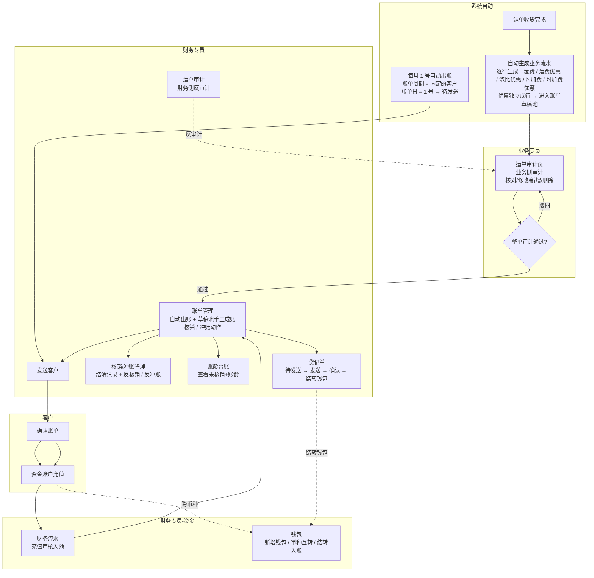
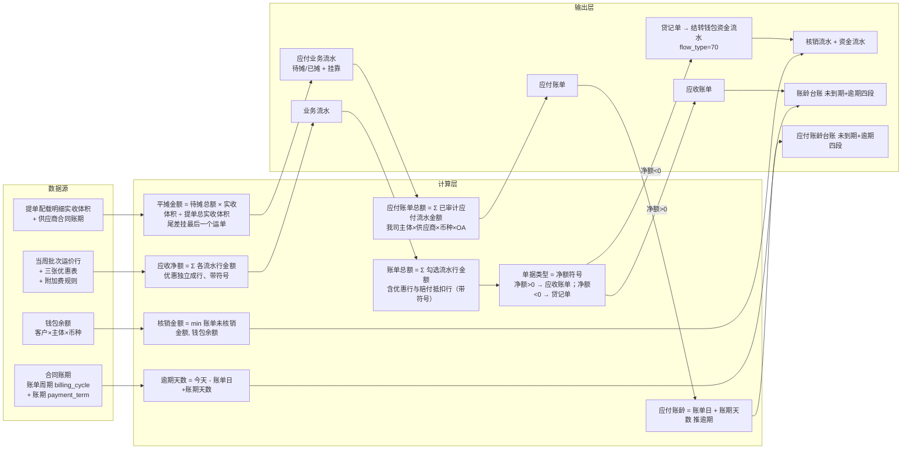
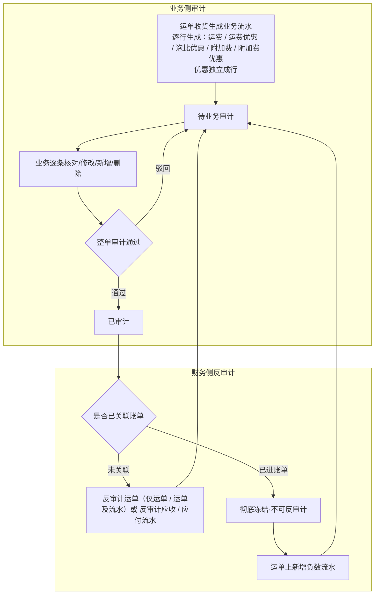
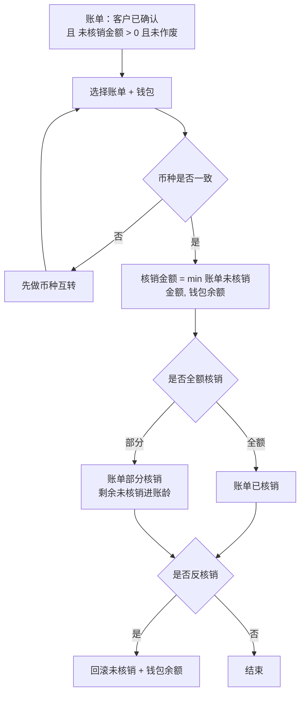
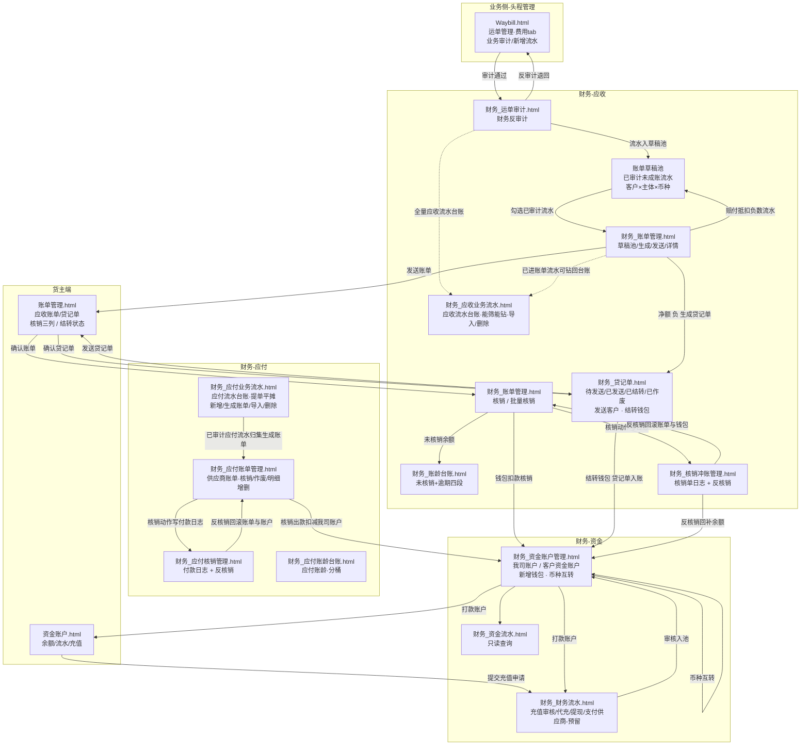

# 财务模块 — 产品文档

> **原始需求**：财务是飞点 TMS 的消费方，实现多主体独立核算 + 钱进钱出闭环，消费订单/运单数据完成应收管理、资金账户与账龄管理。
> **文档版本**: v1.11（应收管理 + 资金账户 + 业务流水台账 + 提单平摊应付 + 应付账单 / 应付核销） | **日期**: 2026-09-23 | **作者**: 飞点产品
> **本期范围**：流程一~三「应收管理」+ 流程四「资金账户」+ **流程五「应付管理」（应付业务流水台账 + 应付账单 + 应付核销 + 应付账龄台账）**，共 3 个模块、22 项功能（**赔付入账记录 `credit_record` 随二期赔付管理立项**；**应付业务流水台账已铺开设计，并新增「提单平摊」来源：提单加应付费用 / 批量导入供应商应付流水 → 按实收体积平摊到运单，待摊 / 已摊两态 + 反分摊**；**应付账单按 我司主体 × 供应商 × 币种 × OA审批编号 归集已审计应付流水生成（账单周期固定每月 1 号自动出账），不发送确认、无冲账/贷记单，生成即核销，核销联动我司银行账户出款**）。
> **分期口径**：**应收管理（运单审计 / 应收业务流水 / 账单管理 / 贷记单 / 核销冲账管理 / 账龄台账）、应付管理（应付业务流水 / 应付账单 / 应付核销 / 应付账龄台账）、资金账户（资金账户管理 / 资金流水 / 财务流水）本期均已上线**；**销售成本（`flow_category=30`）= 应收流水物理复制**（费用类型「费用方向」含销售成本时自动复制，本期落地、不参与审计与成账）；**销售提成（提成计算）归二期**；应付对账（供应商对账单核对）、对账中心、毛利分析、开票、赔付管理与赔付入账记录（`credit_record`）归 Phase 2；实际成本核算归 Phase 3。
> **汇率口径**：汇率统一调用阿里汇率接口实时获取（人民币=1 基准），币种互转页以接口值预填、允许财务手工覆盖并留痕（接口汇率 + 实际采用汇率 + 汇率来源三者同存）；一期不记汇损，不自建汇率表。
> **★ 文档分工（去哪看）**：字段结构/类型/约束/枚举值 → 数据设计 Schema；页面交互 → 原型。本文档 = 需求 + 业务规则（R 编号按流程分段）+ 状态机 + 功能清单 + 权限 + AC + 分期。

## 1. 核心洞察 (Insight)

**真实痛点**：

当前飞点 5 家公司（广州飞点、深圳飞点、广东飞点、香港富力顿、墨链）税务上独立法人、实际一个家族，但财务核算完全依赖线下 Excel。客户打款与应收账单之间靠财务手工核对，钱进来不知道冲哪张账单；账期到了不知道哪些客户逾期、逾期多久；多主体、多币种的资金往来靠手工分账，极易混账。

计费依赖运价模块的当周批次公布价、三张优惠表与附加费规则，但运单收货完成后，应收金额、账单、核销、账龄这一整条链路没有系统承载，财务只能线下追着业务要数据、手工算账。

**JTBD**：

> `财务专员` 雇佣"财务模块"不是为了"记流水账"，而是为了：**当运单收货完成后，能在系统内完成业务流水审计→生成账单→收款核销→账龄跟踪的闭环，且每一笔钱都挂到具体主体和币种，不混账、可追溯。**

> `客户（货主端）` 雇佣"财务模块"不是为了"看数字"，而是为了：**当收到账单后，能在线上确认账单并充值，不用线下反复跟财务对账沟通。**

> `业务专员` 雇佣"财务模块"不是为了"录数据"，而是为了：**当运单收货后，能在「财务中心 → 运单审计」页对业务流水做业务审计（核对 / 修改 / 新增 / 删除），财务侧可反审计，权责清晰。**

**业务价值**：

| 维度 | 当前 | 目标 |
|------|------|------|
| 应收核算 | 线下 Excel 手工算账 | 运单收货自动生成业务流水（**一条费用项一行、优惠独立成行**），业务审计 + 财务反审计 |
| 账单管理 | 财务手工发账单，客户线下对账 | 流水先进**账单草稿池** → 财务聚合已审计流水生成账单 → 发送 → 客户线上确认 |
| 收款核销 | 钱进来手工找账单冲抵 | 钱包池化 + 同币种核销，min(未核销,余额) 防透支 |
| 账龄跟踪 | 人工追账，无逾期预警 | 系统按账单日+账期自动分段，未到期单列+逾期四段 |
| 资金账户 | 多主体多币种手工分账 | 钱包按 客户×主体×币种 隔离，币种互转闭环 |
| 主体隔离 | 打款可能跨主体混打 | 每笔钱强制挂具体主体，钱包层隔离 |
| 应付核算 | 供应商应付靠线下 Excel 手工记 | 应付业务流水（**提单平摊 + 人工添加**）→ 应付账单（我司主体 × 供应商 × 币种 × OA审批编号）→ 应付核销（付款给供应商，联动我司账户出款） |
| 应付账龄 | 供应商账期靠人工追 | 应付账单按账单日 + 账期天数推逾期，未到期单列 + 逾期四段（我司主体 × 供应商 × 币种） |

## 2. 业务全景图

### 2.1 角色与工作节奏

| 角色 | 核心任务 | 频率 |
|------|---------|------|
| 财务专员 | 反审计业务流水、生成账单、收款核销、反核销、币种互转、充值审核、提现 | 日频 |
| 业务专员 | 业务侧审计业务流水（**「财务中心 → 运单审计」页**）、确认业务流水 | 日频 |
| 客户（货主端） | 确认账单、发起充值 | 按需/账期周期 |
| 系统自动 | 运单收货自动生成业务流水、**每月 1 号自动出账**（账单周期 = 固定的客户）、账龄实时计算 | 实时 / 每月 1 号 |

### 2.2 端到端业务链路

```
【应收触发】
  创建每周报价 → 创建运单 → 运单收货完成 → 系统自动生成业务流水
  （运费取当周公布价；运费优惠 / 泡比优惠 / 附加费 / 附加费优惠逐行生成，优惠独立成行）→ 进入账单草稿池
      ↓
【业务审计】
  业务侧核对 / 修改 / 新增流水后**整单审计**（入口 = 「财务中心 → 运单审计」的运单详情 · 应收 / 应付 Tab）→ 财务在同一页可反审计
      ↓
【赔付抵扣 / 贷记单】（负数应收流水，一期口径）
  业务在运单费用 tab 手工新增一条**负数应收流水**（赔付抵扣，金额为负）→ 走运单审计 → 审计通过后进草稿池
  净额 > 0 → 负数流水作账单内「赔付抵扣 −N」随账单抵扣运费；净额 < 0 → 出**贷记单**（我司欠客户，见末尾「贷记单」）
      ↓
【账单生成】
  草稿池 = **已审计且未成账的流水**（逐条流水展示，不按运单聚合）
  ① 自动：**账单周期 = 固定** 的客户由系统**每月 1 号**自动出账（账单日 = 1 号）→ 直接进「待发送」
  ② 手工：财务在「账单管理 → 草稿池」点「生成账单」→ 弹窗里**逐级选 客户 → 我司主体 → 币种 锁定一个组合**，该组合下全部可成账流水**默认全选**（可逐条取消）；只想出其中几条时，先在草稿池**勾选**再进弹窗（快路径）
      ↓
【发送客户】
  财务在「待发送」点「发送客户」→ 客户在货主端「账单管理」确认（异议走线下/工单，财务作废重开）
      ↓
【充值】
  客户在货主端「资金账户」发起充值（金额+币种+打款账户+支付时间+凭证）→ 财务在「财务流水」核对银行流水审核入池
      ↓
【核销 / 冲账】
  财务在「账单管理 → 已发送」Tab 点行内「核销」从钱包扣款冲账单（同币种，min(未核销,余额)，可部分核销/反核销；**核销只动客户钱包、不动我司账户**（现金在充值时已入账）；**结清记录（核销 + 冲账）与反核销 / 反冲账在独立菜单「核销/冲账管理」**）
  客户不付、钱包没钱 → 财务点行内「冲账」认亏平账（坏账冲销，可反冲账）
      ↓
【账龄】
  「账龄台账」按 客户×主体×币种 展示未核销余额 + 账龄四段（未到期单列）
      ↓
【资金账户】
  钱包开通（入驻自动人民币 + 财务手工开通其他币种）→ 币种互转（跨币种核销前）→ 提现
      ↓
【贷记单】（净额 < 0 的负数应收，我司欠客户）
  生成 → 进「待发送」→ 发送客户 → 客户确认（发送满 7 天未确认自动确认）→ 财务「结转钱包」结清（钱包 += |净额|，入钱包即终态、不可撤销；不进核销 / 账龄）
      ↓
【应付触发】
  ① 提单平摊：舱位管理「添加应付费用」/ 应付业务流水「新增应付业务流水」提单级录入落「待摊」→ 按实收体积平摊到运单（已摊）
  ② 人工添加：运单审计「添加应付」/ 应付业务流水手工新增（source=人工添加，走运单审计）
      ↓
【应付审计】
  提单平摊已摊行 → 提单审计（提单级 + 流水级，见本文档业务规则 R1.23）；人工添加 → 运单审计
      ↓
【应付账单】
  应付账单管理按 我司主体 × 供应商 × 币种 × OA审批编号 归集「已审计」应付流水生成供应商账单（不发送确认、无冲账/贷记单）
      ↓
【应付核销】
  应付账单管理「核销」付款给供应商 → 联动我司银行账户出款 → 应付核销管理（付款日志 + 反核销）
      ↓
【应付账龄】
  应付账龄台账按 我司主体 × 供应商 × 币种 展示未结清 + 账龄四段
```

### 2.3 实体依赖关系

```
应收业务流水 (ArFlow) — 应收侧聚合根
  ├── N:1 应收账单 (ArBill)
  ├── N:1 运单 (Waybill) ← 外部引用（运单模块）
  ├── N:1 客户 (Customer) ← 外部引用（客商中心）
  ├── N:1 主体 (Entity) ← 外部引用（基础资料）
  └── 赔付行 = 一条**负数应收流水**（赔付抵扣，金额为负），随账单抵扣运费
      （赔付行是 ArFlow 的一种，不是独立实体：审计、进池、成账、抵扣链路与普通流水完全一致）

应收账单 (ArBill)
  ├── 1:N 应收业务流水 (ArFlow)
  ├── 1:N 收款核销流水 (ArWriteoff)
  └── 备注：**一个运单可关联多张账单**（成账颗粒度 = 流水级；后续新审计通过的流水、赔付抵扣流水天然进下一期）

客户钱包 (CustomerWallet) — 资金侧聚合根
  ├── N:1 客户 (Customer) ← 外部引用
  ├── N:1 主体 (Entity) ← 外部引用
  └── 1:N 资金流水 (WalletFlow)

资金流水 (WalletFlow)
  ├── 1:1 充值申请 (RechargeApply)
  ├── 1:1 收款核销流水 (ArWriteoff)
  └── 1:2 币种互转 (CurrencyTransfer)

我方银行账户 (BankAccount) — N:1 主体，被充值申请引用；同时作为**我司主体资金账户**（「资金账户管理 → 我司账户」）= 双边资金流水的**我司侧落账账户**
币种互转 (CurrencyTransfer) — 1:2 资金流水（转出/转入）
账龄台账 — 纯视图，基于应收账单实时计算，不建表
```

### 2.4 核心业务流程图（泳道图）



### 2.5 核心数据流图



---

## 3. 流程一：应收业务流水与审计（日频）

> **触发**：运单收货完成（**一次性生成**：字段匹配型 + 字段&公式型附加费随收货完成生成、人工添加型由业务手工新增） **频率**：实时自动生成 + 日频审计 **前置依赖**：运单模块收货状态与货物参数、超级运价当周批次运价行 + 三张优惠表 + 附加费规则、客商中心合同账期与客户等级

**3.1 应收业务流水 (ArFlow)** — 运单收货自动生成的逐票应收，粒度=运单，**一条费用项一行（优惠独立成行）**，按费用类型×币种可拆多条

> **As a** 财务专员 **I want to** 运单收货后系统自动生成应收业务流水 **So that** 每票运单的应收金额有系统记录、可追溯

| 字段 | 必填 | 说明 |
|------|------|------|
| 运单号 | ✅ | 引用运单模块，粒度=运单 |
| 客户 | ✅ | 引用客商中心 |
| 主体 | ✅ | 5 账套之一，强制挂主体 |
| 业务流水大类 | ✅ | 应收 / 应付 / 销售成本；**应收（10）、应付（20）均已上线**，**销售成本（30）= 应收流水物理复制**（费用类型「费用方向」含销售成本时自动复制、不参与审计与成账）；销售提成（提成计算）归二期 |
| 流水种类 | ✅ | 运费 / 运费优惠 / 泡比优惠 / 附加费 / 附加费优惠 / 手工新增 —— **一条费用项生成一条流水，优惠独立成行** |
| 费用类型 | ✅ | 引用头程管理费用类型字典（运费/周六派送费/超重费/地址附加费/商品附加费/报关费/库内贴标费…），同方向唯一。**取值来源按流水种类**：运费行=预置费用类型「运费」；运费优惠 / 泡比优惠行=**优惠规则上配置的费用类型**；附加费行与附加费优惠行=**该附加费规则计价明细「应收」行的费用类型** |
| 币种 | ✅ | 运费币种来自报价，附加费币种来自附加费规则，可跨币种 |
| 单价 | ✅ | 本行单价（带符号）：运费行=当周公布价、附加费行=应收单价、优惠行=优惠值（负=减钱、正=加价）；手工新增行：附加费必填（金额 = 单价 × 计费量）、非附加费**选填**（填了 → 金额 = 单价 × 计费量；未填 → 直接填金额） |
| 计价单位 | ✅ | 票 / 箱 / KG / m³ / 数量。**来源跟着规则走**：运费 / 运费优惠 / 泡比优惠行 = 运单所关联服务组合的计费方式；附加费 / 附加费优惠行 = 该条附加费规则的计价单位。**新增应收 / 销售成本手工流水时必填**；应付流水无计价单位（不落此字段） |
| 计费量 | 否 | 计费数量（重量/体积/箱数/张数）；按票计费=1；关联附加费规则按数量计费时由业务填写；非附加费手工新增行计费量必填 |
| 金额 | ✅ | **金额口径分两种**：附加费 = 单价 × 计费量（自动算）；非附加费手工新增 = 计费量必填、单价选填（填了单价 → 金额 = 单价 × 计费量自动算；未填单价 → 直接填金额）。**带符号**：费用行为正；优惠行为负=减钱 / 正=加价。**运单应收净额与账单金额 = 各行金额的代数和** |
| 汇率 | ✅ | 调阿里汇率接口实时获取，人民币=1，不参与金额计算 |
| 描述 | 否 | **面向客户的说明**（货主端可见），如「超重超长按实测尺寸计收」 |
| 备注 | 否 | **仅内部可见**（货主端不展示） |
| 拣货时间 | 否 | **该行所属运单的收货完成时间**（运单级属性落在行上）：收货完成生成时直接写入（含人工添加行）；人工添加时后端取运单收货完成时间写入。**两端均展示**（为空显示「—」） |
| 创建日期 | ✅ | 该行创建时间，**后端自动写入**（系统生成=生成时间 / 人工新增=提交时间）；**前端不展示**（两端一致），仅后台追溯与取数用 |
| 来源类型 | ✅ | 10 系统自动计算（收货/拣货/重算生成）/ 20 人工添加 —— **决定该行的可编辑字段范围**（系统自动行仅可改 描述 / 备注，人工添加行可改全部字段） |
| 数据来源 | ✅ | 报价 / 规则名 / 人工添加（只记第一次来源，后续变更不变）；**货主端不展示** |
| 来源规则 | 否 | 命中的规则类型 + 规则ID + **规则名快照**（运价行 / 运费优惠规则 / 泡比优惠规则 / 附加费规则 / 附加费优惠规则），**用于运单审计下钻「这笔钱是哪条规则给的」**；手工新增留空。**员工端列表不展示、收进行详情；货主端不展示** |
| 创建人 | ✅ | 系统生成显示「系统自动」、人工添加显示操作人；**货主端不展示** |
| — | — | **到期日期 / 账单日 / 账期天数 / 签约账期与天数·号 均为「账单」级字段**（见流程二账单实体表），**流水上不存**；不在运单费用流水页展示（员工端与货主端一致） |
| 审计状态 | ✅ | **待业务审计 / 已审计（只有两态）** |
| 业务审计人/时间 | 否 | 业务侧「运单审计」页整单审计留痕 |
| 财务审计人/时间 | 否 | 财务侧「运单审计」反审计留痕 |
| 关联账单ID | 否 | 生成账单后回填（流水级关联，可跨期跨年） |

> 应收业务流水业务规则见本文档业务规则：R1.1（计费触发点）/ R1.2（流水取价）/ R1.3（流水构成与费用类型）/ R1.4（金额与应收净额）/ R1.5（数量计费）/ R1.6（数据来源）/ R1.7·R1.8·R1.10（审计与反审计）/ R1.11（优惠取数）/ R1.12（一次性生成）/ R1.13（重算与冻结）/ R1.14（幂等去重）/ R1.15（计价单位来源）/ R1.16（取数入参）/ R1.17（到期日算法）/ R1.18（编辑字段范围）/ R1.19（拣货时间与创建日期）/ R1.20（手工新增）/ R1.21（两层审计与冻结边界）/ R1.24（多币种折合）/ R3.3·R3.2（贷记单）。

**相关 AC**：`AC1-生成` `AC2-审计` `AC3-反审计` `AC4-费用调整`

**3.2 核心场景（反审计规则，以是否关联账单为界）**

```
场景：业务流水纠错（财务反审计）
  1. 未关联账单 → 可反审计运单（仅运单 / 运单及流水）或按方向反审计应收 / 应付流水 → 业务直改后重新审计
  2. 已进账单 → **彻底冻结、不可反审计** → 要冲减则在运单上**新增一条负数流水**（走运单审计）
                  → 于**下一期账单**抵扣，原账单金额不追溯
```

**3.3 关键操作流程图（单审计 + 反审计）**



**3.4 业务流水台账（应收 / 应付两个菜单）**

> **As a** 财务专员 **I want to** 在一个页面按流水本身（而非按运单 / 账单容器）查全量业务流水 **So that** 对账 / 查账 / 追溯不用再跨「运单审计 → 草稿池 → 账单详情」三处拼

**定位**：员工端**全量台账**，跨容器（**待审计 / 已审计未成账 / 已进账单 / 作废释放**）全量展示，**能筛能钻**；**应收台账另承载「新增流水 / 导入（文件）/ 删除」三个写动作 + 勾选批量「审计 / 反审计」**（新增流水 = 批量把流水导入运单、同运单审计「新增流水」R1.20；导入 = 上传文件批量导入流水、R1.22；删除 = 删流水、同运单审计「删除」R1.21，**已进账单 / 已审计不可删**；审计 / 反审计 = 勾选流水批量审计 / 反审计、同运单审计「流水级审计 / 反审计」R1.21，**已关联账单不可审计 / 反审计、未审计可审计不可反审计**）。成账 / 结算仍各归原位。**分工**：同一张 `ar_flow` 按三种维度打开、各司其职 —— 运单审计（按运单，改账 + 审计）、草稿池（按出账，成账工作台）、应收业务流水（按流水本身，全量查账 + 批量导 / 删 / 补 + 勾选批量审计）；草稿池是本页的「已审计 + 未成账」子集、任务是出账，与本页「字段有重叠、任务不同、不合并」。

**两个菜单**：
- **应收业务流水**（`flow_category = 10 应收`）：一期即有全量数据；工具栏「**新增流水 / 导入 / 审计 / 反审计 / 导出 / 删除**」+ 行操作「**详情**」
- **应付业务流水**（`flow_category = 20 应付`）：**应付管理台账页**，**一期承载「提单平摊」应付来源**（待摊 / 已摊两态）；工具栏「**新增应付业务流水 / 批量导入分摊 / 导出 / 删除**」+ 行操作「**详情**」

**查询维度**（应收台账）：客户昵称 / 客户编号 / 我司主体 / 币种 / 费用类型 / 审计状态 / 账单状态（未成账 / 已进账单）/ 运单号 / 客户单号 / 拣货时间区间

**列表列**：流水号 → 运单号 → 客户编号 → 客户昵称 → 客户名称 → 销售代表 → 我司主体 → 账单编号 → 费用类型 → 审计状态 → 币种 → 汇率 → 单价 → 计价单位 → 计费量 → 金额（带符号）→ 创建人 → 备注 → 描述 → 拣货时间 → 创建时间；来源规则 / 数据来源收进「行详情」

**查询维度（应付台账）**：供应商 / 运单号 / 费用类型 / OA审批编号 / 币种 / 账单状态 / 提单号 / 转单号 / 业务时间

**列表列（应付台账）**：流水号 → OA审批编号 → 供应商 → 运单号 → 提单号 → 费用类型 → 审计状态 → 转单号 → 币种 → 汇率 → 费用（原币金额）→ 费用（本币金额）→ 备注 → 描述 → 账单编号 → 创建人 → 业务时间→ 创建时间；**转单号 = 运单关联的快递主单号**、**业务时间 = 业务发生日期（YYYY-MM-DD）**

**下钻**：运单号 → 运单审计详情；账单号 → 账单详情；行详情 → 来源规则（「这笔钱哪条规则给的」）；工具栏「审计 / 反审计」= 勾选流水的流水级批量审计 / 反审计（R1.21）

**数据**：直接查 `ar_flow`，**不建新表、不建新状态机**；与运单审计（写 + 审计）、草稿池（成账）、账单详情（结算）各管一摊，**互不取代**；应收台账的「新增流水 / 导入（文件）/ 删除 / 勾选批量审计与反审计」复用 R1.20 / R1.21 / R1.22，不新增状态机

**相关 AC**：`AC23-应收业务流水台账` `AC24-应付业务流水台账` `AC25-提单平摊应付`

**3.5 提单平摊应付（应付业务流水的来源之一）**

> **As a** 财务专员 **I want to** 把按提单（整柜）向供应商结算的应付费用（海运费 / 港杂费等）按实收体积平摊到该提单下各运单 **So that** 每个运单能归集到应摊的应付成本、应付业务流水不用逐票手工录入

**定位**：应付业务流水除「运单审计 / 应付业务流水页手工新增」外，新增「提单平摊」来源 —— 财务先在提单（舱位管理）上记一笔提单级应付费用（**待摊**），再按「各运单实收体积 ÷ 提单总实收体积」批量平摊到运单，生成运单级应付流水（**已摊**）。**金额守恒、只出现一次**：待摊与已摊不并存计金额。

**两条录入路径**：
- **路径 A（提单手工加）**：提单页「财务信息」手工加应付费用（费用类型 × 总额 / 币种 / 汇率 / 供应商 / OA审批编号）→ **默认「自动平摊」保存即摊到运单（可关，关后点「批量平摊」）** → 生成运单应付流水。
- **路径 B（批量导入）**：「应付业务流水」菜单批量导入供应商应付流水到提单（Excel 粒度 = 提单号 × 费用类型 × 金额 / 币种）→ 自动批量分摊 → 生成运单应付流水。

> 平摊 / 反分摊规则见本文档业务规则 R1.23（平摊原子性、三道前置、反分摊条件）。

**数据**：复用 `ar_flow`（`flow_category = 20` + 分摊状态「待摊 / 已摊」），`source_type = 30 提单平摊`，不建新表；平摊取数来源 = 头程管理「提单配载明细」实收体积（见数据设计「提单平摊应付」节）。

**审计归属与冻结边界**：见本文档业务规则 R1.23（审计归属看 `source_type` + 分摊状态、两层审计、平摊 / 撤销平摊三道前置、挂靠编辑权限、成账口径的完整规则）。

## 4. 流程二：账单生成与客户确认（账期周期）

> **触发**：① 系统每月 1 号自动出账（账单周期 = 固定的客户）② 财务手工成账（账单周期 = 不固定的客户） **频率**：每月 / 按需 **前置依赖**：流程一已审计的业务流水

**4.1 应收账单 (ArBill)** — 系统自动出账或财务手工聚合**已审计**流水，**客户 + 我司主体 + 币种** 各一张（不跨币种折合）

> **As a** 财务专员 **I want to** 聚合已锁定流水生成账单并发送客户 **So that** 客户能确认应收金额

| 字段 | 必填 | 说明 |
|------|------|------|
| 账单号 | ✅ | 唯一，规则 `AR-{主体代码}-{年月}-{5 位序号}`，**序号零填充 5 位、按 主体 × 账期月 每月从 `00001` 重置**（主体代码：广州GZ/深圳SZ/广东GD/香港HK/墨链ML） |
| 客户 | ✅ | 引用客商中心 |
| 主体 | ✅ | 5 账套之一 |
| 币种 | ✅ | 同币种聚合 |
| 账单日 | ✅ | 自动出账 = **每月 1 号**（跑批日）；手工出账 = 财务指定，**默认生成当月自然月末** |
| 到期日期 | ✅ | **最后支付日**，按「签约账期 + 合同天数/号」推导 —— 按月类取账单月（账单日所在月 + 结算月）的第 N 号、按天类 = 账单日 + N − 1 天；事件型推不出 → 不允许出账（见业务规则⑨） |
| 账期天数 | ✅ | 账单级快照 = **到期日 − 账单日 + 1**（账龄台账按 账单日+账期天数 起算，公式不变）；由到期日反推，**仅供账龄、页面不展示** |
| 签约账期 + 天数/号 | ✅ | 生成账单时从合同快照：签约账期（101 月结 / 102 双月结 / 103 三月结 / 201 周结 / 202 到港前结 / 203 签收月结 / 204 到海外仓结 / 205 签收结）+「天数/号」；**账单页「账期」列 = `{签约账期}+{天数/号}`**（如 `月结+15`、`月结+30`；**「天数/号」是合同上的数字字段（1–31），只有数字、没有「月末 / 月初」这类文字值**；`0` / 空 = 未填 → 账期视为未完善，不允许出账） |
| 生成来源 | ✅ | 系统自动（每月 1 号跑批）/ 财务手工（草稿池勾选成账） |
| 账单总额 | ✅ | Σ 勾选流水各行金额（代数和，含优惠行、赔付抵扣行的带符号金额） |
| 已核销金额 | ✅ | 核销累加，默认 0 |
| 未核销金额 | ✅ | 账单总额 − 已核销 |
| 发送状态 | ✅ | 未发送 / 已发送 |
| 确认状态 | ✅ | 未确认 / 已确认 |
| 核销状态 | ✅ | 未核销 / 部分核销 / 已核销 / 已反核销 |
| 作废标记 | ✅ | 正常 / 已作废（终态） |
| 生成人/时间 | 否 | 财务操作留痕 |
| 发送时间 | 否 | 发送客户时间 |
| 客户确认时间 | 否 | 货主端确认回填 |
| 作废人/时间 | 否 | 财务作废留痕 |
| 作废原因 | 否 | 作废时可填，备查 |

> 账单业务规则见本文档业务规则 R2.1（草稿池与成账）/ R2.2（账单号）/ R2.3（账单金额）/ R2.4（账单日·账期·到期日）/ R2.5（发送）/ R2.6（确认）/ R2.7（Tab 归类）/ R2.8（作废重开）/ R2.10（待发送编辑）/ R2.11（自动出账）/ R2.12（导出）/ R3.4（批量发送）/ R3.2（单据类型）；已进账单费用调整见 R1.9。

**相关 AC**：`AC5-生成` `AC5a-作废与重开` `AC5b-自动出账` `AC6-发送` `AC7-确认` `AC20-账单导出`

## 5. 流程三：收款核销与账龄台账（日频）

> **落点**：核销的入口在「**账单管理 → 已发送**」Tab 的行内「核销」按钮（+ 工具栏「批量核销」）；**结清记录（核销 + 冲账）与反核销 / 反冲账在独立菜单「核销/冲账管理」**（原独立菜单「收款核销」已下线，见原型）。

> **触发**：客户打款入池、财务核销 **频率**：日频 **前置依赖**：流程二已确认账单、流程四钱包余额

**5.1 结清记录 (ArWriteoff)** — 财务核销/冲账/反核销/反冲账记录，留痕可审计

> **As a** 财务专员 **I want to** 从钱包扣款冲抵账单 **So that** 账单未核销金额减少、钱账对应

| 字段 | 必填 | 说明 |
|------|------|------|
| 账单号 | ✅ | 被核销账单 |
| 钱包 | ✅ | 扣款钱包（客户×主体×币种） |
| 币种 | ✅ | 强制同币种 |
| 核销金额 | ✅ | min(账单未核销金额, 钱包余额) |
| 核销类型 | ✅ | 核销 / 反核销 |
| 核销前/后账单未核销金额 | ✅ | 留痕 |
| 核销前/后钱包余额 | ✅ | 留痕 |
| 操作人/时间 | ✅ | 财务 |
| 关联资金流水ID | 否 | 核销→资金流水联动 |
| 被反核销 / 反冲账的原结清ID | 否 | 反核销 / 反冲账指向原结清记录 |

> 核销业务规则见本文档业务规则 R3.5（前置条件）/ R3.6（币种约束）/ R3.7（金额上限）/ R3.8（结果）/ R3.9（维度流转）/ R3.10（资金流水）/ R3.11（反核销）/ R3.1（批量核销）。

**5.2 账龄台账** — 纯视图，不建表，基于应收账单实时计算

| 字段 | 必填 | 说明 |
|------|------|------|
| 维度 | ✅ | 客户 × 主体 × 币种 |
| 未核销总额 | ✅ | Σ 未核销金额 |
| 未到期金额 | ✅ | 单列 |
| 逾期 0-30/31-60/61-90/90+ | ✅ | 逾期四段 |

> 账龄业务规则见本文档业务规则 R3.14（范围）/ R3.15（分段）/ R3.16（维度），起算公式见本文档计算公式 §7.5。

**相关 AC**：`AC8-核销` `AC9-部分核销` `AC10-反核销` `AC11-账龄`

**5.3 关键操作流程图（收款核销决策）**



**5.4 冲账（坏账冲销）**

> **As a** 财务专员 **I want to** 把客户不付、钱包没钱、收不回来的烂账认亏平掉 **So that** 未核销金额清 0、账龄不再虚高

> 冲账 / 反冲账业务规则见本文档业务规则 R3.12（尾款冲账）/ R3.13（反冲账）；准入同核销见 R3.5。

**相关 AC**：`AC21-冲账` `AC22-反冲账`

## 6. 流程四：资金账户与钱包（日频）

> **触发**：客户入驻、充值、跨币种结算、提现 **频率**：日频/按需 **前置依赖**：客商中心入驻、阿里汇率接口（实时汇率）、我方银行账户

**6.1 客户钱包 (CustomerWallet)** — 钱包 = 客户 × 主体 × 币种，钱进池子即混同，只认币种余额

> **As a** 财务专员 **I want to** 管理客户钱包并做币种互转 **So that** 多主体多币种的资金隔离且可跨币种结算

| 字段 | 必填 | 说明 |
|------|------|------|
| 客户 | ✅ | 引用客商中心 |
| 主体 | ✅ | 5 账套之一 |
| 币种 | ✅ | 联合唯一 (客户,主体,币种) |
| 账户名称 | ✅ | 全局唯一；格式=账号编号+空格+币种代码 |
| 余额 | ✅ | 不可透支，乐观锁控制 |
| 开通方式 | ✅ | 系统自动（合同签约完成）/ 财务手工；员工端列表展示 |
| 开通时间 | ✅ | 钱包创建时间 |
| 是否默认钱包 | ✅ | 系统字段；**员工端与货主端均不展示**（后台保留），二期在线付款的「默认支付钱包」预留 |

> 钱包业务规则见本文档业务规则 R4.1（唯一性）/ R4.2（账户名称）/ R4.3（自动开通）/ R4.4（池化）/ R4.16（手工开通主体边界）/ R4.17（币种边界）/ R4.18（生命周期与合同解耦）/ R4.19（默认币种）/ R4.20（解约主体提示）。

**6.2 我方银行账户 (BankAccount)** — 每主体各自开户，一主体可多账户

| 字段 | 必填 | 说明 |
|------|------|------|
| 主体 | ✅ | 每主体可多账户 |
| 账户名称 | ✅ | 开户名 |
| 账号 | ✅ | 全局唯一，创建后不可修改 |
| 开户行 | ✅ | — |
| SWIFT/BIC | 否 | 境外打款用，非人民币账户建议填写 |
| 币种 | ✅ | 单币种账户 |
| 账面余额 | ✅ | 财务手工维护的账面余额，非银行实时余额，默认 0 |
| 用户是否可见 | ✅ | 是 → 客户在货主端充值的打款账户下拉可见该账户 |
| 是否默认 | ✅ | 客户打款默认账户；同一主体+币种仅一个，且必须可见 |
| 状态 | ✅ | 启用 / 停用 |

> 银行账户业务规则见本文档业务规则 R4.13（账号唯一 / 停用 / 默认打款账户 / 可见开关）；账面余额随双边资金流水自动核算，口径见本文档计算公式 §7.8。

**6.3 资金流水 (WalletFlow)** — 钱包资金进出痕迹，事实记录不可改（出错靠反向流水）；**双边记账**（客户钱包侧 + 我司账户侧）

| 字段 | 必填 | 说明 |
|------|------|------|
| 流水编号 | ✅ | 唯一，规则 `WF + yyyyMMdd + 3位序号`（跨流水类型统一序列、按发生顺序递增） |
| 钱包 | ✅ | 关联钱包 |
| 流水类型 | ✅ | 充值/充值退回/提现/**收款核销/收款核销撤销**/转汇/**贷记单入账**/**冲账/冲账撤销** |
| 币种 | ✅ | 同钱包币种 |
| 入账金额 | ✅ | 正=入、负=出 |
| 变动前/后余额 | ✅ | 留痕 |
| 我司账户 | 否 | **双边记账的我司侧落账账户**（bank_account）；核销/冲账/转汇/贷记单结转为空 |
| 我司账户入账金额 | 否 | 正=入负=出；仅充值/代充/提现/充值退回非 0 |
| 我司账户余额（前/后） | 否 | 留痕；我司账户余额 = 时间最新一条 |
| 关联充值/核销/转汇 | 否 | 按流水类型挂载：充值/充值退回↔充值申请，**收款核销/收款核销撤销**↔收款核销单（1:1），转汇↔币种互转（1:2 出/入两条） |
| 支付时间 | 否 | 客户实际打款时间，仅充值/代充落值（货主端充值审核通过时由充值申请回填、代充财务录入）；其余类型支付时间 = 创建时间，不单独存 |
| 操作人/时间 | ✅ | — |

**6.4 币种互转 (CurrencyTransfer)** — 独立表，记录转出/转入两币 + 汇率

| 字段 | 必填 | 说明 |
|------|------|------|
| 转汇单号 | ✅ | 唯一，规则 TR+yyyyMMdd+序号 |
| 转出钱包/币种/金额 | ✅ | 转出侧 |
| 转入钱包/币种/金额 | ✅ | 转入侧 |
| 接口汇率 | ✅ | 阿里汇率接口实时返回值，留痕不可改 |
| 汇率 | ✅ | 实际采用汇率，默认=接口汇率，可财务手工覆盖 |
| 汇率来源 | ✅ | 接口实时 / 手工覆盖 |

> 币种互转业务规则见本文档业务规则 R4.10（互转）/ R4.11（汇率留痕）；公式见本文档计算公式 §7.6。

**6.5 充值申请 (RechargeApply)** — 客户货主端发起，财务审核入池

| 字段 | 必填 | 说明 |
|------|------|------|
| 客户/主体/币种 | ✅ | 充到哪个钱包 |
| 金额 | ✅ | — |
| 打款账户 | ✅ | 引用我方银行账户 |
| 打款凭证 | ✅ | 银行回单截图/PDF |
| 支付时间 | ✅ | 客户实际打款时间（到账日） |
| 状态 | ✅ | 待审核/已通过/已驳回 |
| 审核人/时间 | 否 | 财务线下核对银行流水后审核留痕 |
| 关联资金流水 | 否 | 审核通过后生成充值流水 |

> 充值 / 提现 / 代充业务规则见本文档业务规则 R4.5（充值申请）/ R4.6（审核通过）/ R4.7（驳回）/ R4.8（代客户充值）/ R4.9（客户提现）。

**6.6 货主端资金账户页（主体×币种表格）**

> 客户在货主端「资金账户」查看资金账户总览，维度 = 主体 × 币种。页面分页签：账户余额 / 资金流水 / 充值记录；合同签约完成时系统自动开通的人民币钱包（余额 0）也展示。

| 字段 | 说明 |
|------|------|
| 账户主体 | 生成钱包时的合同签约主体 |
| 币种 | 钱包币种；默认人民币（各主体统一，含香港富力顿），其他币种由财务手工开通 |
| 账户名称 | 账号编号 + 币种代码，全局唯一 |
| 余额 | 充值金额 − 核销扣减后的剩余金额 |
| 未核销金额 | 客户已确认账单但财务未核销的账单总金额 |
| 待确认账单 | 财务已出账单但客户未确认的账单总金额 |
| 实际金额 | 余额 − 未核销金额；负数红色带负号，正数正常色 |

**6.7 赔付（理赔）抵扣**

> 我司赔付给客户的金额（超时赔付 / 丢件赔付 / 货损赔偿）**不打款到客户银行账户**，而是以一条**负数应收流水**随账单抵扣运费。

**触发（一期手工）**：业务在运单费用 tab **手工新增一条负数应收流水**（费用类型选超时赔付 / 丢件赔付 / 货损赔偿等赔付类费用类型），金额填**负数**。

> 赔付（理赔）抵扣业务规则见本文档业务规则 R4.14。

**相关 AC**：`AC5-生成` `AC5a-作废与重开` `AC5b-自动出账` `AC18-赔付抵扣`
---

## 7. 流程五：应付管理（应付账单 + 应付核销 + 应付账龄，账期周期）

> **落点**：应付管理 = 应付业务流水（§3.4 台账 + §3.5 提单平摊）→ 应付账单（归集生成）→ 应付核销（付款给供应商）→ 应付账龄（催付视图）。**应付流水本身的台账与提单平摊正文见 §3.4 / §3.5**，本节收敛「应付账单 / 应付核销 / 应付账龄」三个环节的实体与规则。

> **触发**：供应商应付流水已审计待成账 → 归集生成应付账单 → 付款核销 **频率**：账期周期（固定账期供应商每月 1 号自动出账）**前置依赖**：流程一~四应收 / 资金账户、头程管理提单平摊应付、客商中心供应商有效合同

**7.1 应付账单 (ApBill)** — 供应商账单，我司应付给供应商的归集单据

> **As a** 财务专员 **I want to** 按 我司主体 × 供应商 × 币种 × OA审批编号 归集「已审计」应付流水生成一张供应商账单 **So that** 应付给供应商的钱有单据凭证、能核销付款、能算账龄

| 字段 | 必填 | 说明 |
|------|------|------|
| 账单号 | ✅ | `AP-{主体代码}-{yyyyMM}-{5 位序号}`，每月按我司主体从 00001 重置 |
| 供应商 | ✅ | 应付流向的供应商 |
| 我司主体 | ✅ | 归集键之一，来源 = 供应商有效合同签约主体 |
| 币种 | ✅ | 不跨币种折合 |
| OA审批编号 | ✅ | 归集键之一，对应财务 OA 审批单 |
| 生成来源 | ✅ | 系统自动（每月 1 号跑批）/ 财务手工（「生成应付账单」弹窗 4 维归集） |
| 账单日 / 到期日 | ✅ | 自动出账 = 1 号；手工默认当月月末；到期日 = 账单日 + 供应商合同账期 |
| 账期快照 | 条件 | 签约账期 + 天数/号，生成时从供应商合同快照；账期段为空不允许出账 |
| 账单金额 / 已核销 / 未结清 | ✅ | 账单金额 = Σ 明细应付流水金额（正数）；未结清金额 = 账单金额 − 已核销金额，= 0 即已核销 |
| 核销状态 | ✅ | 未核销 / 部分核销 / 已核销（按未结清金额派生） |
| 作废标记 | ✅ | 正常 / 已作废（终态，仅未核销可作废） |

> 应付账单业务规则见本文档业务规则 R5.1（生成归集）/ R5.6（自动出账）/ R5.7（明细增删）/ R5.4（作废）。

**相关 AC**：`AC26-应付账单生成` `AC26b-应付业务流水挂我司主体` `AC26c-应付账单自动生成` `AC28-应付账单作废` `AC28b-应付账单明细增删`

**7.2 应付核销 (ApWriteoff)** — 付款给供应商的留痕（核销单）

> **As a** 财务专员 **I want to** 对已生成的应付账单付款给供应商并留痕 **So that** 应付结清、我司银行账户出款有据可查、可反核销纠错

| 字段 | 必填 | 说明 |
|------|------|------|
| 核销单号 | ✅ | `APW + YYYYMMDD + 序号`（与应收核销 WO 分列两套序列） |
| 应付账单 | ✅ | 关联 `ap_bill`，一个账单可多次部分核销 |
| 出款账户 | ✅ | 我司银行账户，按「我司主体 × 币种」过滤启用 |
| 核销金额 | ✅ | ≤ 未结清金额 且 ≤ 出款账户余额（不可透支），默认 = 未结清金额 |
| 类型 | ✅ | 核销 / 已反核销 |
| 四快照 | ✅ | 核销前后账单未结清金额 + 出款账户余额（留痕闭合校验） |
| 凭证 / 备注 | 否 | 银行转账回单 / 内部留痕 |

> 应付核销 / 反核销业务规则见本文档业务规则 R5.2（核销联动资金账户）/ R5.3（反核销）。

**相关 AC**：`AC27-应付核销 + 反核销`

**7.3 应付账龄台账** — 我司欠供应商的账龄视图（实时，不建表）

> **As a** 财务专员 **I want to** 按 我司主体 × 供应商 × 币种 看未结清应付账单的账龄 **So that** 催付 / 安排付款有优先级依据

> 应付账龄口径见本文档业务规则 R5.8（判据 / 分桶 / 维度）。

**相关 AC**：`AC26d-应付账龄台账`

**核心场景**：

- **月结自动出账**：供应商合同 `billing_cycle = 固定` → 每月 1 号 00:30 系统跑批，按 主体×供应商×币种×OA 归集「已审计 + 未成账」应付流水 → 生成应付账单（账单日 = 1 号）→ 财务在「应付账单管理 → 待核销」核对 → 行内「核销」选我司出款账户付款 → 账单未结清金额减少、账户余额扣减 → 未结清金额 = 0 即已核销、自动出账龄。
- **付款纠错**：付款后发现金额错误 → 财务在「应付核销管理」行内「反核销」→ 账单未结清金额回补、账户余额回补、新增一条「已反核销」记录 → 重新核销正确金额。

## 8. 验收标准总览 (AC)

### 流程一：应收业务流水与审计
#### AC1 生成

运单收货完成后，系统自动生成应收业务流水——**运费 / 运费优惠 / 泡比优惠 / 各命中附加费 / 各命中附加费优惠逐行生成**（优惠独立成行、费用类型取优惠配置的费用类型），金额 = 单价 × 计费量；同时写入**拣货时间**（运单收货完成时间，收货完成直接写入）与**创建日期**（后端自动，运单费用流水页不展示、账单草稿池展示）并留痕**来源类型 / 来源规则（含规则名快照）/ 创建人**；流水全部进入**账单草稿池**（到期日期是账单级字段，在账单生成时按 AC5b 口径推算）
#### AC2 审计

业务侧逐条核对/修改/新增/删除后整单审计通过，该方向流水统一锁定为已审计 + 写运单级标记（整票不允许再新增该方向费用）；流水级审计（勾选逐条）只动该条、不动运单标记
#### AC3 反审计

仅财务可反审计；运单级按方向 × 深度（「仅运单」只反标记、原流水仍锁定，「运单及流水」反标记 + 该方向流水回待业务审计）、流水级勾选逐条反审计；已进账单的流水不可反审计；业务需通过工单或线下申请
#### AC4 已进账单的费用调整

已进账单的流水**彻底冻结、不可反审计**（反审计被阻断并提示）；冲减靠在该运单**新增一条负数流水**（走运单审计）→ 进草稿池 → **下一期账单抵扣**；原账单金额**不追溯调整**
#### AC23 应收业务流水台账

「应收业务流水」菜单按 客户 / 我司主体 / 币种 / 费用类型 / 审计状态 / 账单状态（未成账 / 已进账单）/ 运单号 / 客户单号 / 拣货时间 全维度筛选，**跨容器全量**展示（待审计 / 已审计未成账 / 已进账单 / 作废释放全部流水），列表给出 金额合计 + 按币种小计；运单号可跳「运单审计」详情、账单号可跳「账单管理」详情、行详情可看来源规则；**工具栏「新增流水」批量把流水导入运单（运单「应收」已整票审计的不可新增）、「导入」上传文件批量导入流水（R1.22，失败行不落库）、「删除」勾选删流水（已进账单 / 已审计不可勾选不可删）、「导出」纯读导出 + 「审计 / 反审计」勾选批量（已关联账单不可勾选，未审计可审计不可反审计、已审计可反审计不可删）**（R1.20 / R1.21 / R1.22）
#### AC24 应付业务流水台账

「应付业务流水」菜单展示 `flow_category = 20 应付` 全量流水（**18 个业务字段**：流水号 / OA审批编号 / 供应商 / 运单号 / 提单号 / 费用类型 / 审计状态 / 转单号 / 币种 / 汇率 / 费用（原币金额）/ 费用（本币金额）/ 备注 / 描述 / 账单编号 / 创建人 / 业务时间/ 创建时间）+ 工具栏「新增应付业务流水 / 批量导入分摊 / 导出 / 删除」（**新增同运单审计、批量导入分摊见 AC25、导出校验勾选、删除仅限待业务审计**）

#### AC25 提单平摊应付

应付业务流水新增「提单平摊」来源：① **提单手工加**（提单页「财务信息」加应付费用 → 批量平摊）；② **应付业务流水新增**（提单级录入落待摊 → 平摊）；③ **批量导入**（应付业务流水菜单导入供应商应付流水到提单 → 自动批量分摊）。平摊按「各运单实收体积 ÷ 提单总实收体积」分摊提单级应付总额，**尾差挂最后一个运单、该条描述备注「含尾差」**；生成运单应付流水（`source_type = 30 提单平摊`、`amortize_status = 已摊`、审计状态 = **待审计**、走提单审计）；**反分摊** = 该流水未审计（流水级）+ 未关联账单的平摊流水可批量删除、退回提单「待摊」改金额重摊；**金额守恒、待摊与已摊不并存计金额**。**审计归属看 `source_type` + 分摊状态**（`source_type=30` 已摊行走提单审计、待摊行不可审计；`source_type=20 人工添加` 走运单审计，运单审计「添加应付」填了提单号仍属 20、仍走运单审计）；**提单审计两层**（提单级管新增 / 平摊、流水级管撤销 / 删除）；**提单侧只读镜像**（待摊行提单侧可改删、已摊 / 挂靠行提单侧只读、改删回运单侧）

### 流程二：账单生成与客户确认
#### AC5 生成

账单管理两条路径 —— ① **自动出账**：账单周期 = 固定的客户由系统每月 1 号自动生成账单并直接进「待发送」（见 AC5b）；② **手工成账**：账单周期 = 不固定的客户由财务在「账单管理 → 草稿池」（**流水级列表**）点「生成账单」→ 弹窗里**逐级选 客户 → 我司主体 → 币种 锁定一个组合**，该组合下全部可成账流水**默认全选**、可逐条取消（要只出其中几条时，在弹窗里逐条取消勾选 —— **草稿池不设勾选列**）。草稿池 = 已审计且未关联账单的流水，**未审计流水不进池、也不给未审提示**；**不跨币种折合**（混币种运单拆多张账单）；账单号唯一、手工出账账单日默认生成当月自然月末；合同账期段为空 / 推不出到期日时**不允许出账**（阻断，**不做补录**）。**待发送阶段可编辑账单**（账单还没发给客户，尚未形成对客承诺）：删流水（只剩 1 条时不给删）/ 从草稿池**加流水**（同客户 × 主体 × 币种、已审计未成账）/**改账单日期**（改动只进草稿 → 到期日**实时预览 + 未保存标记** → 点弹窗底部「保存」才落库，同步重算到期日与账期天数，跨月则账单号按新账期月重新分配）；三种编辑都在**操作时间线**留一条记录（事件「编辑账单」，只记时间 / 操作人 / 动作类型，不记增减了几条流水）；已发送后只能作废重开
#### AC5a 作废与重开

未核销账单可作废 —— **作废弹窗内「作废原因」必填**（留空或纯空格阻断「请填写作废原因」），确认后作废人 / 作废时间 / 作废原因落到账单上并在**账单详情的「操作时间线」**可见 → 其下流水释放回草稿池、可重新组账（生成新账单号）；**已有核销记录（部分核销 / 已核销）的账单作废被阻断**并提示先反核销；作废后账单不出现在货主端、不进账龄台账、账单号不回收；**已进账单的费用调整**按「原金额不追溯 + 新增负数流水 + 下期抵扣」执行
#### AC5b 自动出账

账单周期 = 固定（月结 / 双月结 / 三月结）的客户**每月 1 号**由系统自动出账，账单日 = 1 号、生成来源 = 系统自动、**发送状态 = 未发送 / 确认状态 = 未确认 / 核销状态 = 未核销 / 作废标记 = 正常**，**直接出现在「待发送」（无需财务确认）**；账单周期 = 不固定（周结 / 到港前结 / 签收月结 / 到海外仓结 / 签收结）的客户**不参与自动出账**；组内无可成账流水 → 不生成 0 元空账单；合同账期段为空或 `payment_term` 不为 101/102/103 → **跳过该组、页面不给提示**（该组流水留在草稿池，「账期」列实时显示「待补录」）；同 客户×主体×币种 同月重复跑批**不产生第二张账单**（幂等）；**月结/双月结/三月结只影响账单月**（账单日所在月 +0 / +1 / +2 个月），到期日 = 该账单月的「天数/号」号，不影响每月出账一次的频率
#### AC6 发送

账单可发送给客户；**「待发送」Tab 支持按客户批量发送**（选一个客户 → 该客户名下待发送账单默认全选 → 可逐条取消 → 二次确认列出账单号 → 逐张转「已发送」并写发送时间）；**发送不可撤回**，发错只能作废重开
#### AC7 确认

客户在货主端确认账单，异议走线下/工单；财务处置异议的方式 = **作废账单并重新出账**（见 AC5a），作废账单不下发客户
#### AC20 账单导出

「账单管理 → 已发送」Tab **先在列表勾选要导出的账单**（未勾选时「导出」按钮置灰 + 悬浮「请先在列表勾选要导出的账单」，勾选后按钮恢复可用（**按钮文案恒为「导出」，不带张数**）；**其余 Tab 与查询区都没有这个按钮**）→ 弹窗里**只选模板分类**（常规模板 / 出口退税模板，**页面上没有口径说明文字**）→ 确认后**只提交任务**、页面不等待；「后台任务」出现一条**导出**任务（模块 = 账单管理、结果 = `导出 X 张账单（{模板分类}），成功 Y 张，失败 Z 张`），完成后可**下载导出结果**（**结果 = 一个 zip，内含 X 个账单 Excel、一张账单一个文件**；**只勾 1 张时直出 xlsx 不打包**；有失败时包内另附「导出失败清单.xlsx」；**结果文件保留 7 天**）；**导出范围 = 勾选的这批账单**（勾选前置、可跨客户、勾选仅对当前列表有效）；**一张账单一个 Excel、不按客户合并**；导出前后账单的发送 / 确认 / 核销 / 作废状态**全部不变**

### 流程三：收款核销与账龄台账（核销入口 = 账单管理「已发送」Tab 的行内「核销」按钮 + 工具栏「批量核销」；结清记录（核销 + 冲账）与反核销 / 反冲账在独立菜单「核销/冲账管理」）
#### AC8 核销

① 单笔：在「账单管理 → 已发送」Tab 点行内「核销」；② **批量**：工具栏「批量核销」→ 弹窗**空态起步、不预选钱包**（确认按钮置灰 + 悬浮原因）→ 逐级选 客户 → 我司主体 → 币种**主动锁定**一本钱包 → 按**到期日期从早到晚**列出该钱包每张可核销账单的「钱包可用余额（本单前）/ 本次核销 / 核销结果」→ 确认后顺序核销，钱包不足的单部分核销或本次不核销→ 弹窗（默认金额 = min(未核销金额, 钱包余额)）→ 二次确认后账单已核销金额增加、未核销金额减少、钱包余额扣减、生成一条核销记录；**核销强制同币种、钱包不可透支**；**客户未确认的账单「核销」按钮置灰**（核销前置 = 客户已确认，见业务规则⓪）
#### AC9 部分核销

支持部分核销/一对多/多对一，多打留余额、少打留未核销
#### AC10 反核销

在「**核销/冲账管理**」菜单点 `type = 核销` 行的「反核销」→ 二次确认后回滚账单已核销/未核销金额、回补钱包余额、该条记录类型置「已反核销」；**已反核销的行不再显示「反核销」**；核销与反核销全程留日志
#### AC11 账龄

按账单日+账期天数起算，未到期单列+逾期四段，客户×主体×币种三维度，分币种不折算；**只有已发送账单参与**（待发送账单不计入账龄、作废不计入；已发送未确认照常计入）
#### AC21 冲账

客户已确认的待核销应收账单（未核销金额 > 0），客户不付、钱包没钱 → 财务在「账单管理 → 已发送」点行内「冲账」→ 填金额（默认 = 未核销全额）+ 必填原因 → 二次确认 → 账单未核销金额清 0、核销状态置「已冲账」、自动出账龄、写一条「冲账」账面流水（flow_type 80、不动钱包余额）+ 操作时间线留痕；客户未确认的账单「冲账」按钮置灰（准入同核销）
#### AC22 反冲账

在「核销/冲账管理」菜单点冲账记录行内「反冲账」→ 二次确认后账单回未核销 / 部分核销、未核销金额回补、重新进账龄、写「冲账撤销」账面流水（flow_type 90）

### 流程四：资金账户与钱包
#### AC12 钱包开通

合同**签约完成**时系统自动开通「客户×主体×人民币」钱包（余额 0，开通方式=系统自动），开户完成不触发；财务可手工补开其他币种钱包（同客户+主体+币种不重复），手工开通时**主体仅限该客户签约过的主体**（含已过期/已解约）、币种仅限未开通的，未签约主体一律阻断；合同过期/解约不影响钱包任何操作；账户名称全局唯一（账号编号+币种代码）
#### AC13 充值

客户货主端发起充值（金额+币种+打款账户+支付时间+凭证），财务核对银行流水审核入池；财务亦可在「客户充值」操作台代客户手工入池（线下打款到账后），代充不产生充值申请单
#### AC14 币种互转

财务手工互转；汇率调阿里汇率接口实时获取并以接口值预填，可手工覆盖（接口汇率/实际采用汇率/汇率来源三者留痕）；一期汇损暂不记
#### AC15 提现

财务在操作台直接为客户提现，钱包余额扣减，不可透支
#### AC16 银行账户

我方银行账户按主体维护，账号唯一且创建后不可修改、单币种、可设默认打款账户；「用户是否可见」= 是 才出现在客户充值的打款账户下拉中；默认账户唯一且必须可见；停用账户自动置为不可见并取消默认
#### AC17 资金流水

资金流水**双边记账**——一条流水同时记「客户钱包侧」与「我司账户侧」（充值/代充/提现/充值退回双边，核销/冲账/转汇/贷记单结转不动我司账户）；员工端资金流水页拆「**客户 / 公司**」两个 Tab：客户 Tab = 客户钱包流水、公司 Tab = 我司账户流水（充值/代充入账、提现/充值退回出账）；每条带唯一**流水编号**（`WF + yyyyMMdd + 序号`）、变动前后余额与关联单据；事实记录不可改不可删，出错靠反向流水
#### AC19 贷记单结转

组合净额 < 0 的账单成为**贷记单**（不参与核销 / 不进账龄 / 不计未核销金额；**照常发送客户、货主端可见并可确认**，满 7 天自动确认）→ 客户确认后财务「结转钱包」→ 写一条「贷记单入账」资金流水、客户钱包余额增加 → 之后可正常核销或提现；**结转即终态、没有「撤销入账」**（纠错走运单侧反向流水、下期抵扣）；**贷记单生成后先进「待发送」**（可改内容、可整张作废），**客户已确认后作废入口置灰**（纠错走运单侧反向流水）
#### AC18 赔付（理赔）抵扣

业务在运单费用 tab 手工新增**负数应收流水**（费用类型选超时赔付/丢件赔付/货损赔偿等赔付类，金额为负）→ 走运单审计 → 审计通过后进账单草稿池 → 随勾选（或按月自动出账）进账单，在账单明细里以**负数行**抵扣运费；**赔付不打款到客户银行账户**；「放在下一个账单抵扣」由流水生成时点实现（本期账单已生成后再产生的赔付自然落下一期），同一运单因此可关联多张账单

### 流程五：应付管理（应付业务流水台账 + 应付账单 + 应付核销 + 应付账龄）
#### AC26 应付账单生成

财务按 **我司主体 × 供应商 × 币种 × OA审批编号** 归集「已审计 + 未成账」的应付流水生成一张供应商账单（`ap_bill`）：生成弹窗逐级选 供应商 → 我司主体 → 币种 → OA审批编号 锁定组合 → 组内可成账应付流水默认全选 → 确认生成（账单号 `AP-{主体代码}-{yyyyMM}-{5 位序号}`、`bill_amount` = Σ 应付流水金额、核销状态 = 未核销）；**成账前置 = 每条应付流水满足「已审计」（流水级）**——提单平摊已摊行、普通应付流水均看 `audit_status = 已审计`；未满足「已审计」的流水不进候选；**不发送供应商确认、无冲账、无贷记单**

#### AC26b 应付业务流水挂我司主体

供应商签约后有其「我司签约主体」，应付业务流水在**新增（运单审计「添加应付」/ 应付业务流水「新增应付业务流水」/ 舱位管理「添加应付费用」三入口）与批量导入分摊**时均需指定「我司主体」（必填下拉）：**可选项 = 该供应商有效合同（已签署 + 有效期内 + 未解约）的签约主体（我司合同抬头）**；供应商无有效合同 → 下拉为空、阻断新增（提示先到供应商管理签约）；「新增应付业务流水」弹窗同时补「业务时间」（必填，默认当天）；应付业务流水主列表新增「我司主体」列 + 查询区「我司主体」筛选

#### AC26c 应付账单自动生成

供应商合同「账单周期 = 固定」的，系统**每月 1 号自动生成应付账单**：按「我司主体 × 供应商 × 币种 × OA审批编号」归集「已审计 + 未成账」应付流水生成账单（账单日 = 1 号、到期日按供应商合同账期推导）；**幂等键 = 我司主体 × 供应商 × 币种 × OA审批编号 × 账期月**；账期段为空（`payment_term` / `days_or_date` 未填）的供应商不自动出账、留财务手工

#### AC26d 应付账龄台账

基于 `ap_bill` 实时计算「未作废 + 未结清金额 > 0」的账单，按 `账单日 + 账期天数` 推逾期天数 → 未到期 + 逾期 0-30 / 31-60 / 61-90 / 90+；维度 = 我司主体 × 供应商 × 币种；分币种不折算；核销（付款）后 `unpaid_amount = 0` 自动出账龄

#### AC27 应付核销 + 反核销

「应付账单管理 → 待核销」行内「核销」→ 选出款账户（我司银行账户，**按「我司主体 × 币种」过滤启用**）+ 核销金额（默认 = 未结清）→ 校验金额 ≤ 未结清 且 ≤ 出款账户余额（不可透支）→ 付款后账单未结清金额递减、出款账户余额同步扣减、写 `wallet_flow`（`flow_type = 100 支付供应商`）与 `ap_writeoff`（四快照）；部分核销 → 账单「部分核销」、补足 → 「已核销」；「应付核销管理」行内「反核销」→ 账单未结清金额回补、账户余额回补、写 `flow_type = 110`、原记录置「已反核销」+ 新增一条「已反核销」记录

#### AC28 应付账单作废

未核销的应付账单可作废 —— 作废原因必填 → 确认后 `void_status = 已作废`（终态、账单号不回收）、其下流水 `ap_bill_id` 置空释放回可成账池；部分核销 / 已核销账单不显示作废入口（须先反核销）

#### AC28b 应付账单明细增删（未核销）

仅「未核销」账单可增删应付明细：**新增** = 从「同 我司主体 × 供应商 × 币种 × OA审批编号」下、已审计 + 未成账的应付流水里勾选加入（维度与账单完全一致、账单金额重算、账单号不变）；**删除** = 明细移除 → 流水释放回可成账池、金额重算、至少保留 1 条；部分核销 / 已核销账单不可增删；增删进「操作时间线」留痕

## 9. NFR（非功能性需求）

- **性能**：账龄台账实时计算，账单量万级内查询响应 < 1s
- **并发**：钱包余额扣减（核销/提现/互转）必须乐观锁，防超扣
- **幂等**：流水自动生成按「运单 × 流水种类 × 费用类型 × 来源规则」去重；运单信息变更**重扫覆盖**已有行而非追加；**人工添加行永久豁免重扫**，业务审计后冻结、进账单后彻底冻结
- **数据保留**：业务流水、账单、核销、资金流水永久留存（软删除，不物理删除）
- **精度**：所有金额 Decimal(20,6)，禁止 Float/Double；币种不折算混总
- **安全**：反审计、反核销仅财务角色可操作；跨租户数据隔离（tenant_id）
- **外部依赖**：汇率调阿里汇率接口实时获取；接口超时/异常时降级为「手工填写 + 来源=手工覆盖」，不阻断币种互转

## 10. 计算示例

**示例一：核销金额 min 公式**

```
输入: {账单未核销金额 = ¥1280.50, 钱包余额 = ¥3719.50}

Step 1 [流程三] — 核销金额计算:
          核销金额 = min(账单未核销金额, 钱包余额) = min(1280.50, 3719.50) = ¥1280.50
          → 核销后：账单未核销金额 = 0，钱包余额 = 3719.50 - 1280.50 = ¥2439.00

场景变体（钱包不足）:
  输入 {账单未核销金额 = ¥5000, 钱包余额 = ¥3200}
          → 核销金额 = min(5000, 3200) = ¥3200（部分核销）
          → 账单未核销金额 = 1800 进账龄，钱包余额 = 0
```

**示例二：自动出账与账龄起算口径**

```
输入: {自动出账账单日 = 2026-09-01, 合同账期 = 月结(101) + 天数/号 15, 今天 = 2026-10-12}

Step 1 [流程二] — 账期与到期日:
          签约账期 + 天数/号 = 月结+15 → 账单月 9 月的第 15 号 → 到期日 = 09-15（= 账单日 09-01 所在月 + 0，取 15 号）
          账期天数快照 = 到期日 − 账单日 + 1 = 15 天

Step 2 [流程三] — 账期边界:
          账期内 = 09-01 ~ 09-15（含首日，共 15 天），最后支付日 = 09-15
          逾期第1天 = 09-16（= 账单日 + 账期天数）

Step 3 — 逾期天数:
          逾期天数 = 10-12 − 10-01 = 11 天 → 归属「逾期 0-30天」
```

**示例三：跨币种结算（核销永远同币种）**

```
场景: 账单人民币 ¥1280.50，客户要求用比索结算

Step 1 [流程四] — 财务开通比索钱包（新增钱包）
Step 2 [流程四] — 客户充值比索 → 财务审核入池
Step 3 [流程四] — 币种互转: 比索 → 人民币
          汇率 = 1元 = 7.8比索（调阿里汇率接口实时获取，页面预填，可手工覆盖）
          转出 ₱10000 → 转入 ¥1282.05
Step 4 [流程三] — 人民币钱包核销人民币账单 ¥1280.50（同币种闭合）
```

## 11. 功能清单

> 基于 5 条业务流程，共 **3 个模块、21 项功能、28 条 AC**。P0 = MVP，P1 = 二期，P2 = 三期。

**模块 A：应收管理**

| 编号 | 功能 | 优先级 | AC |
|------|------|--------|-----|
| A1 | 业务流水生成（运单收货自动 · 逐条费用项各一行） | P0 | AC1 |
| A2 | 业务审计 + 财务反审计 | P0 | AC2/AC3 |
| A3 | 反审计 / 费用调整（负数流水下期抵扣） | P0 | AC3/AC4 |
| A4 | 账单生成（**每月 1 号自动出账** + 草稿池手工成账；草稿池为流水级、只含已审计流水） | P0 | AC5/AC5b |
| A5 | 账单发送 + 客户确认 | P0 | AC6/AC7 |
| A6 | 收款核销（同币种/部分/反核销；**核销动作在「账单管理」页、反核销在「核销/冲账管理」页**） | P0 | AC8/AC9/AC10 |
| A11 | **冲账（坏账冲销）**（客户不付、钱包没钱 → 财务认亏平账：写「冲账」账面流水 + 留痕 + 出账龄；可反冲账） | P0 | AC21/AC22 |
| A9 | **贷记单**（`bill_type = 贷记(20)`：待发送/已发送/已结转/已作废 → 发送客户 → 客户确认 → 「结转钱包」结清；**独立菜单**，不进核销/账龄） | P0 | AC19 |
| A10 | **核销/冲账管理**（核销 + 冲账操作日志 + 反核销 / 反冲账；**独立菜单**，另一张表 `ar_writeoff`） | P0 | AC10 |
| A7 | 账龄台账 | P0 | AC11 |
| A8 | **账单导出**（「已发送」Tab 工具栏 → 选模板分类 → 提交导出任务，进度与结果在「后台任务」；**一期为可演示链路**） | P0 | AC20 |
| A12 | **应收业务流水台账**（跨容器全量、能筛能钻：客户/主体/币种/费用类型/审计状态/账单状态/运单号/时间 全维度筛选 + 下钻运单/账单/来源规则 + **工具栏新增流水 / 导入（文件）/ 审计 / 反审计（勾选批量）/ 删除 / 导出**） | P0 | AC23 |

**模块 B：资金账户**

| 编号 | 功能 | 优先级 | AC |
|------|------|--------|-----|
| B1 | 钱包开通（**合同签约完成自动** + 财务手工补开币种） | P0 | AC12 |
| B2 | 充值审核 + 代客户充值 | P0 | AC13 |
| B3 | 币种互转 | P0 | AC14 |
| B4 | 客户提现 | P0 | AC15 |
| B5 | 我方银行账户管理 | P0 | AC16 |
| B6 | 资金流水查询 | P0 | AC17 |

**模块 C：应付管理**

| 编号 | 功能 | 优先级 | AC |
|------|------|--------|-----|
| A13 | **应付业务流水台账**（**主列表含「我司主体」列 + 工具栏「新增应付业务流水 / 生成应付账单 / 批量导入分摊 / 删除」**；含「提单平摊」待摊 / 已摊两态；新增 / 导入指定我司主体） | P0 | AC24/AC25/AC26b |
| C1 | **应付账单管理**（**我司主体 × 供应商 × 币种 × OA审批编号** 归集「已审计」应付流水生成供应商账单；账单周期固定每月 1 号自动出账；**不发送确认、无冲账/贷记单**；生成即核销 + 未核销可作废 + 未核销明细可增删） | P0 | AC26/AC26c/AC28/AC28b |
| C2 | **应付核销管理**（付款给供应商的核销日志：出款账户（按我司主体 × 币种）/ 四快照 + 反核销；**联动我司银行账户出款**） | P0 | AC27 |
| C3 | **应付账龄台账**（我司主体 × 供应商 × 币种维度，未到期 + 逾期 0-30 / 31-60 / 61-90 / 90+ 分桶） | P0 | AC26d |

**分期汇总**

| 分期 | 模块范围 | 功能数 |
|------|----------|--------|
| **Phase 1 (MVP)** | 应收管理（A1-A12）+ 资金账户（B1-B6）+ **应付管理（A13 应付业务流水台账 + C1 应付账单 + C2 应付核销 + C3 应付账龄台账）** | **22** |
| **Phase 2** | 应付对账（供应商对账单核对）、对账中心、毛利分析、开票、**赔付管理与赔付入账记录（`credit_record`）**、**导出文件生成（按财务模板逐账单出 Excel，含出口退税模板缺失字段补齐）** | +N |
| **Phase 3** | 实际成本核算（实际成本 vs 成本预估对账） | +N |

## 12. MVP 方案与建议

**MVP 方案（Phase 1 — 应收 + 应付 + 资金账户闭环）**

```
财务模块
├── 应收管理（账期周期）
│   ├── 业务流水生成（自动 · 一条费用项一行、优惠独立成行）
│   ├── 业务审计 + 财务反审计（运单审计）
│   ├── 应收业务流水台账（跨容器全量、能筛能钻；含新增流水 / 导入 / 删除 / 勾选批量审计与反审计）
│   ├── 账单草稿池 → 账单生成 + 发送 + 客户确认
│   ├── 收款核销（同币种 + 反核销）
│   ├── 贷记单（负数账单 → 结转钱包）
│   ├── 核销/冲账管理（核销 + 冲账日志 + 反核销 / 反冲账）
│   └── 账龄台账（未到期 + 逾期四段）
├── 应付管理
│   ├── 应付业务流水台账（提单平摊待摊 / 已摊 + 人工添加；新增 / 生成账单 / 批量导入分摊 / 删除）
│   ├── 应付账单管理（我司主体 × 供应商 × 币种 × OA审批编号 归集已审计流水生成；生成即核销 + 未核销可作废）
│   ├── 应付核销管理（付款给供应商 + 反核销，联动我司银行账户出款）
│   └── 应付账龄台账（我司主体 × 供应商 × 币种，未到期 + 逾期四段）
├── 资金账户管理（日频）— 双 Tab
│   ├── 我司账户（按主体维护，含 用户是否可见 / 默认打款账户 / 启用停用）
│   ├── 客户资金账户（客户×主体×币种钱包，**合同签约完成自动开通人民币** + 财务手工补开其他币种）
│   ├── 币种互转（阿里汇率接口实时 + 手工覆盖留痕）
│   ├── 充值审核 + 代客户充值
│   ├── 客户提现
│   ├── 资金流水查询
│   └── 赔付抵扣（业务手工新增负数应收流水 → 随账单抵扣运费）
└── 审计 & 留痕
    ├── 核销/反核销日志
    └── 反审计留痕
```

**MVP 明确不做**：
- 在线付款（未来在线付款只加支付渠道，钱包不动）
- 进账↔核销关系表（在线付款上线后再做）
- 银行流水自动识别入账（二期）
- 自动核销（二期）
- 线上账单异议（异议走线下/工单）
- 汇率配置维护与汇率历史表（汇率调阿里汇率接口实时获取，不做本地维护）
- 汇损记账（跨币种互转一期直接转，不记汇损）
- 导出文件生成（一期只做「账单导出」的可演示链路：选模板分类 → 提交 → 后台任务可见 → 结果可下载；**真实套模板逐账单出 Excel 留二期**，随对账中心统一实现）

**理想方案（Phase 2-3）**
- **Phase 2**：应付对账（供应商对账单核对）、对账中心（账实+账账）、毛利分析（基于成本预估）、开票、在线付款 + 核销关系表、自动核销、银行流水自动识别
- **Phase 3**：实际成本核算（实际成本 vs 成本预估对账）

**专家建议**：
① 钱包层隔离主体（客户×主体×币种），从源头拦住跨主体混打，比事后对账纠错成本低
② 核销永远同币种，跨币种先互转，避免汇率折算导致的账实不符；一期互转不记汇损，降低复杂度
③ 账龄台账用实时视图而非快照表，一期账单量不大，实时算足够且无延迟
④ 资金流水为事实记录不可改，出错靠反向流水（充值退回/核销撤销），不做红冲，保证审计链路完整
⑤ 汇率统一走阿里汇率接口实时获取：互转页以接口值预填、允许财务手工覆盖，接口汇率 + 实际采用汇率 + 汇率来源三者同存。既满足审计留痕，也省掉自建汇率表与人工维护成本，避免口径分歧；接口异常时降级为「手工填写 + 来源=手工覆盖」，不阻断业务

### 下一步

**应收 + 应付 + 资金账户三模块已全部上线（产品文档 v1.11）**：需求对齐完成（3 模块 22 项功能）、数据设计（13 表 + 6 视图 + ER 图 + 状态机）、产品文档 v1.11（开发唯一真相源）、原型（货主端 2 页 + 员工端 13 页）。汇率取数口径已定（阿里汇率接口实时获取）；**应收流水生成口径已细化到逐行**（一条费用项一行、优惠独立成行，见 §3.1 与 AC1）；**应付已闭环**（提单平摊 + 人工添加 → 应付账单 → 应付核销 → 应付账龄，见流程五）。

下一步：
① **销售提成（提成比例 / 归属销售 / 结算）口径待讨论**（归二期；本期已落地「销售成本流水」= 应收流水物理复制，见本文档业务规则 R5.10）
② **Phase 2 展开对齐**：应付对账（供应商对账单核对）、对账中心、毛利分析、开票、赔付管理与赔付入账记录（`credit_record`）、导出文件生成
③ **Phase 3**：实际成本核算（实际成本 vs 成本预估对账）

---

## 需求定义

### 1.1 背景与现状

飞点 5 家公司（广州飞点、深圳飞点、广东飞点、香港富力顿、墨链）税务上独立法人、实际一个家族，当前财务核算**完全依赖线下 Excel**：客户打款与应收账单靠财务手工核对，钱进来不知道冲哪张账单；账期到了不知道哪些客户逾期、逾期多久；多主体、多币种的资金往来靠手工分账，极易混账。

计费侧依赖超级运价的当周公布价与附加费规则，但运单收货完成后，**应收金额 → 业务流水审计 → 账单 → 收款核销 → 账龄**这一整条链路没有系统承载，财务只能线下追着业务要数据、手工算账；客户端也缺少线上确认账单与充值的入口。**应付侧同样无系统承载**：供应商应付（海运费 / 港杂费等）靠线下 Excel 记、按提单手工平摊到运单，付款给供应商后也没法与账龄挂钩。

### 1.2 目标与成功口径

- **目标**：运单收货后，在系统内完成「业务流水审计 → 生成账单 → 客户确认 → 收款核销 → 账龄跟踪」闭环，且每一笔钱强制挂到具体主体与币种，不混账、可追溯；应付侧完成「应付业务流水（提单平摊 + 人工添加）→ 应付账单 → 应付核销（付款给供应商）→ 应付账龄」闭环。
- **成功口径**：

| 指标 | 数据来源 | 评估窗口 |
|:---|:---|:---|
| 应收流水系统生成率（收货运单中自动生成流水的占比）≥ 95% | `ar_flow` 按运单去重 / 运单模块已收货运单数 | 上线后 1 个月 |
| 账单线上确认率（已发送账单中被客户线上确认的占比）≥ 70% | `ar_bill` confirm_status=已确认(20) / send_status=已发送(20) | 上线后 2 个月 |
| 核销覆盖率（已确认账单中被核销的金额占比）≥ 90% | `ar_writeoff` 累计金额 / `ar_bill` 已确认总额 | 上线后 2 个月 |
| 逾期未结清金额占比（逾期 90+ 未结清金额占比）≤ 5% | 账龄台账 | 上线后 3 个月 |
| 财务手工对账工时下降 ≥ 50% | 财务线下工时统计（人工记录） | 上线后 2 个月 |

### 1.3 范围与边界

**In Scope（本期 P0）**

- 应收管理：A1 业务流水生成、A2 业务审计 + 财务反审计、A3 反审计 / 费用调整（已进账单的费用靠新增负数流水冲减，下期抵扣）、A4 账单生成（**自动出账跑批 + 草稿池手工成账**）、A5 账单发送 + 客户确认、A6 收款核销（同币种/部分/反核销）、A7 账龄台账、A8 账单导出、A9 贷记单、A10 核销/冲账管理、A11 尾款冲账、**A12 应收业务流水台账**（跨容器全量、能筛能钻 + **新增流水 / 导入（文件）/ 删除 / 勾选批量审计与反审计**）；**A13 应付业务流水台账**（跨容器全量、含提单平摊，见 §5.15）
- 应付管理：**应付业务流水台账（A13）+ 应付账单管理（C1）+ 应付核销管理（C2）+ 应付账龄台账（C3）** —— 供应商账单按 **我司主体 × 供应商 × 币种 × OA审批编号** 归集「已审计」应付流水生成，账单周期固定每月 1 号自动出账，**不发送供应商确认、无冲账、无贷记单、生成即核销**，核销联动我司银行账户出款（见 §5.16 / §5.17 / §5.18）
- 资金账户：B1 钱包开通、B2 充值审核（含财务代充）、B3 币种互转、B4 客户提现、B5 我方银行账户管理、B6 资金流水查询
- 销售成本：应收流水中费用类型「费用方向」含销售成本的行，**应收落库时物理复制**成 `flow_category=30` 销售成本流水（独立台账），在「运单审计 / 运单管理 → 费用管理」新增「销售成本」Tab 展示，**不参与审计、不参与成账**（见 §5.1 / §5.10 / R5.10）

**Out of Scope（本期不做 + 原因）**

| 排除项 | 原因 / 归属 |
|:---|:---|
| 应付对账（供应商对账单核对）、对账中心、毛利分析、开票 | Phase 2 / 3（`财务_财务流水.html` 已预留「支付供应商」入口空态） |
| 实际成本核算（实际成本 vs 成本预估） | Phase 3 |
| 在线付款（支付渠道） | 钱包与支付渠道解耦，未来只加渠道、钱包不动 |
| 进账↔核销关系表、自动核销 | 池化模型一期够用，待在线付款上线后做 |
| 赔付管理、赔付入账记录（`credit_record`） | Phase 2 —— 一期赔付降级为业务在运单上**手工新增一条负数应收流水（赔付抵扣）**，随账单抵扣运费 |
| 银行流水自动识别入账 | Phase 2（一期财务线下核对银行流水后人工审核） |
| 线上账单异议 | 异议走线下/工单，财务重新生成账单再发 |
| 汇率配置维护与汇率历史表 | 汇率调阿里汇率接口实时获取，不自建汇率表 |
| 汇损记账 | 跨币种互转一期直接转，不记汇损 |
| 导出文件生成（套模板逐账单出 Excel） | 一期做**可演示的完整链路**：财务在「账单管理 → 已发送」Tab 工具栏点「导出」→ 选模板分类（常规模板 / 出口退税模板）→ 提交后**在「后台任务」看到任务进度并可下载结果**（见 R2.12 / §5.11）。**真实文件生成（按 `analysis/财务导出模板/` 的两份模板逐张账单填充并打包）随对账中心在 Phase 2 统一实现** —— 一期原型只演示"提交 → 任务可见 → 结果可下载"，不产出真实 Excel |
| 销售提成（提成比例 / 归属销售 / 结算） | Phase 2 —— 本期只落「销售成本流水」（应收流水的物理复制取数口径，见 R5.10），提成计算另开会确认 |

### 1.4 影响范围

- **影响角色**：财务专员（主）、业务专员（运单侧审计 + 手工新增赔付流水）、客户/货主端用户（账单确认、充值）、系统自动任务（**每月 1 号自动出账跑批**）
- **依赖系统/模块**：

| 依赖 | 依赖内容 | 缺失时的影响 |
|:---|:---|:---|
| 头程管理（运单模块） | **收货完成事件、运单信息变更事件（带变更字段清单）**、运单号、业务侧审计（`Waybill.html` 费用 tab） | 无法触发生成流水 / 无法触发重算 |
| 超级运价 | 当周批次公布价、附加费规则、三张优惠表（运费优惠 / 泡比优惠 / 附加费优惠）、服务组合成本 | 取价失败 → 走手工新增（数据来源=人工添加） |
| 客商中心 | 客户、**账单周期（`customer_contract.billing_cycle` 固定/不固定）**、合同账期（`customer_contract.payment_term`）、签约主体 | 无法判定自动出账资格、无法推导到期日 |
| 头程管理 `fee_type` | 费用类型字典 | 无法生成分类流水 |
| 基础资料 | 主体（5 账套）、币种 | 无法隔离主体 |
| 阿里汇率接口 | 实时汇率（币种互转） | 降级为手工填写（来源=手工覆盖），不阻断业务 |

---


---

## 状态机 ★ 研发必读

### 3.1 业务流水 `ar_flow.audit_status`（单审计 + 反审计）

```
待业务审计(10) ──业务整单审计通过──→ 已审计(20) ──财务反审计（未进账单）──→ 待业务审计(10)
```

> **流水只有两个状态**（待业务审计 / 已审计）：**已进账单的流水彻底冻结、不可反审计**；要冲减已出账的费用，一律走「**在该运单上手工新增一条负数流水**（走运单审计）→ 进账单草稿池 → 在**下一期账单**里抵扣」（与赔付抵扣同一套机制，R1.9 / R4.14）。

| 当前状态 | 操作 | 目标状态 | 触发角色 | 校验条件 |
|:---|:---|:---|:---|:---|
| 待业务审计(10) | 整单审计通过 | 已审计(20) | 业务专员（「财务中心 → 运单审计」页的运单详情 · 应收 / 应付 Tab） | 运单下全部流水已逐条核对/修改完成 |
| 已审计(20) | 反审计（运单级按方向 × 深度「仅运单 / 运单及流水」） | 「仅运单」保持已审计；「运单及流水」→ 待业务审计(10)（仅未进账单的流水） | 财务专员（`财务_运单审计.html`） | 该流水（或其所在方向）**未关联账单**（`bill_id` 为空）；「仅运单」只反运单标记、该条流水不动（仍锁定编辑）；「运单及流水」已进账单的流水**保持已审计、不反** |
| 已审计(20) | 反审计（流水级逐条） | 待业务审计(10) | 财务专员 | **该条没有已进账单的流水**；已进账单的流水**彻底冻结、不可反审计** → 阻断并提示「已生成账单，彻底冻结；如需调整请在运单上新增一条负数流水，于下一期账单抵扣」 |

> **两层解耦（★）**：运单级审计 = 该方向标记置已审计 + 该方向全部流水置已审计（整票锁死）；运单级反审计按方向 × 深度（**仅运单**只反标记、流水保持已审计；**运单及流水**反标记 + 该方向**未进账单的**流水回待业务审计，已进账单的流水保持已审计）；流水级审计 / 反审计只动 `ar_flow.audit_status`、不写运单标记。**新增看运单标记、编辑看流水标记**（见 R1.21）。

> **账单草稿池（不新增状态）**：`audit_status = 已审计(20)` 且 `bill_id` 为空的流水即处于账单草稿池（R2.1）。

### 3.2 应收账单的状态维度（`ar_bill`）

**账单状态 = 三个独立维度 + 一个作废标记**（三个维度各自流转、互不覆盖，因此「已发送但未确认」「已确认但只核销了一部分」这类组合都能同时表达）：

```
① 发送状态 send_status     ：未发送(10) ──财务点「发送客户」──→ 已发送(20)
② 确认状态 confirm_status  ：未确认(10) ──客户在货主端确认──→ 已确认(20)
③ 核销状态 writeoff_status ：未核销(10) ──部分核销──→ 部分核销(20) ──补足──→ 已核销(30)
                                        ↕ 反核销 ──→ 已反核销(40) ──重新核销──→ 部分核销(20) / 已核销(30)
   （冲账不占核销状态位 —— 它是金额维度，见 `written_off_amount`）
④ 作废标记 void_status     ：正常(10) ──财务作废（未结清金额 = 账单金额 时，即 received = 0 且 written_off = 0）──→ 已作废(20)（终态）
```

| 维度 | 当前状态 | 操作 | 目标状态 | 触发角色 | 校验条件 |
|:---|:---|:---|:---|:---|:---|
| 发送 | 未发送(10) | 发送客户 | 已发送(20) | 财务专员 | 账单下全部流水已审计（`audit_status=20`）；`void_status = 已作废` 时不可发送 |
| 确认 | 未确认(10) | 确认账单 | 已确认(20) | 客户（货主端） | 账单为当前客户的账单；确认后回写 `confirmed_at` |
| 核销 | 未核销(10) / 部分核销(20) | 核销（金额 ≤ 未结清金额） | 未结清金额 > 0 → 部分核销(20)；未结清金额 = 0 → 已核销(30) | 财务专员 | 钱包与账单币种一致、钱包余额 > 0、不可透支 |
| 核销 | 部分核销(20) / 已核销(30) | 反核销 | 已反核销(40) | 财务专员 | 未做账账单均可反核销，不加审批，留日志 |
| 核销 | 已反核销(40) | 重新核销 | 部分核销(20) / 已核销(30) | 财务专员 | 同上核销校验 |
| 作废 | 正常(10) | 作废账单 | 已作废(20) | 财务专员 | **未结清金额 = 账单金额（received = 0 且 written_off = 0）**；有核销 / 冲账记录 → 阻断「该账单已有核销或冲账记录，请先反核销 / 反冲账后再作废」；作废后其下流水 `bill_id` 置空、**释放回草稿池**，写 `voided_by` / `voided_at` / `void_reason` 留痕 |
| 作废 | 已作废(20) | — | 终态 | — | 不再流转：不出现在货主端任何 Tab、不进账龄台账、不参与核销；**账单号保留不回收**，重新出账 = 生成新账单号 |

> **组合示例**：账单刚生成 = 未发送 + 未确认 + 未核销 + 正常；发出后待客户确认 = 已发送 + 未确认 + 未核销 + 正常；客户确认后财务部分收款 = 已发送 + 已确认 + 部分核销 + 正常；错单撤掉 = 已作废（其余三个维度冻结）。
>
> **页面展示分工（员工端）**：账单管理按**发送维度 + 作废标记**分 Tab（§5.2），「已发送」Tab 展示发送状态 / 确认状态，并**只读展示核销维度三列**（核销状态 / 已核销金额 / 未结清金额）；**核销的动作、弹窗、核销记录与反核销全在同一页**（「核销」按钮 + 「核销记录」Tab + 核销明细抽屉，§5.3）；货主端按**单据类型**拆「应收账单 / 贷记单」两个 Tab（§5.9）：应收账单只读展示核销三列 + 确认状态筛选，贷记单扁平列表 + 「状态」列（待确认 / 待结转 / 已结转）。

### 3.2b 应付账单的状态维度（`ap_bill`）

**两个独立维度、无发送 / 确认维度**（不发送供应商确认）：
```
① 核销状态 writeoff_status ：未核销(10) ──部分核销──→ 部分核销(20) ──补足──→ 已核销(30)
                                        ↕ 反核销（记录级，见 §3 说明）──→ 重新核销 → 部分核销(20) / 已核销(30)
② 作废标记 void_status     ：正常(10) ──财务作废（未核销）──→ 已作废(20)（终态）
```
> **无冲账 / 贷记单**：应付侧只有「付款核销」一种结清方式，出款联动我司银行账户（R5.2 / R5.3）。**反核销落在核销记录层**（`ap_writeoff.writeoff_type = 已反核销`），账单级 `writeoff_status` 按未结清金额重算回 未核销 / 部分核销 / 已核销，不再设「已反核销」账单态。

| 维度 | 当前状态 | 操作 | 目标状态 | 触发角色 | 校验条件 |
|:---|:---|:---|:---|:---|:---|
| 核销 | 未核销(10) / 部分核销(20) | 核销（金额 ≤ 未结清金额 且 ≤ 出款账户余额） | 未结清金额 > 0 → 部分核销(20)；= 0 → 已核销(30) | 财务专员 | 出款账户与账单币种一致、余额充足、不可透支（R5.2） |
| 核销 | 部分核销(20) / 已核销(30) | 反核销 | 按未结清金额重算（> 0 部分核销 / = 0 已核销） | 财务专员 | 核销单未被反核销；账单未结清金额回补、账户余额回补（R5.3） |
| 作废 | 正常(10) | 作废账单 | 已作废(20) | 财务专员 | `writeoff_status = 未核销(10)`；作废后其下流水 `ap_bill_id` 置空释放回可成账池（R5.4） |
| 作废 | 已作废(20) | — | 终态 | — | 账单号保留不回收；重新出账 = 生成新账单号 |

### 3.3 充值申请 `recharge_apply.status`

```
待审核(10) ──财务审核通过（核对银行流水到账）──→ 已通过(20)
待审核(10) ──财务驳回──→ 已驳回(30)
```

| 当前状态 | 操作 | 目标状态 | 触发角色 | 校验条件 |
|:---|:---|:---|:---|:---|
| 待审核(10) | 通过并入池 | 已通过(20) | 财务专员（`财务_财务流水.html` 充值审核 tab） | 已线下核对银行流水到账；通过后生成充值资金流水并增加钱包余额 |
| 待审核(10) | 驳回 | 已驳回(30) | 财务专员 | 未到账 / 信息不符；驳回不产生资金流水 |
| 已通过(20) | 充值退回 | 已通过(20)（新增 `wallet_flow` 反向流水） | 财务专员 | 事实记录不可改，靠反向流水纠正 |

### 3.4 我方银行账户 `bank_account.status`

```
启用(10) ──停用──→ 停用(20) ──启用──→ 启用(10)
```

| 当前状态 | 操作 | 目标状态 | 触发角色 | 校验条件 |
|:---|:---|:---|:---|:---|
| 启用(10) | 停用 | 停用(20) | 财务专员 | 停用后不再作为充值可选的打款账户；历史引用不受影响 |
| 停用(20) | 启用 | 启用(10) | 财务专员 | — |

---


---

## 功能清单与页面映射（轻索引）

> 功能→AC 验收映射与分期见本文档；本表专注功能→页面映射。

| 模块 | 功能点 | 优先级 | 对应页面 | 页面类型 |
|:---|:---|:---:|:---|:---|
| A 应收管理 | A1 业务流水生成（运单收货自动，逐行生成含优惠行） | P0 | 无页面（系统自动）；结果展示于 `Waybill.html` 费用 tab | 后台任务 |
| A 应收管理 | A2 业务审计 + 财务反审计 | P0 | **业务侧整票审计** = `Waybill.html` 费用 tab（列表勾选运单 → 工具栏「**运单审计**」→ 选费用方向整票审计）；**财务侧** = `财务_运单审计.html`（运单级整票 + 流水级勾选；**反审计仅财务角色，只在本页**） | 列表页 + 审计台 |
| A 应收管理 | A3 反审计 / 费用调整（已进账单的费用靠**新增负数流水**冲减，下期抵扣） | P0 | `财务_运单审计.html` | 列表页 |
| A 应收管理 | A4 账单生成（**每月 1 号自动出账跑批** + 草稿池手工成账；草稿池为**流水级**、只含已审计流水） | P0 | `财务_账单管理.html`（草稿池 Tab + 生成弹窗） | 列表页 + 生成弹窗 |
| A 应收管理 | A5 账单发送 + 客户确认（客户手动确认 / **超期自动确认**） | P0 | `财务_账单管理.html` + 货主端 `账单管理.html` | 列表页 |
| A 应收管理 | A6 收款核销（同币种 / 部分 / 反核销；**核销动作在「账单管理」页**，反核销在「核销/冲账管理」页） | P0 | `财务_账单管理.html`（「已发送」Tab 行操作 + 工具栏「批量核销」）+ `财务_核销冲账管理.html`（反核销）；货主端账单管理（只读三列） | 列表页 + 核销弹窗 |
| A 应收管理 | A7 账龄台账 | P0 | `财务_账龄台账.html` | 查询页（实时视图） |
| A 应收管理 | A8 **账单导出**（「已发送」Tab 工具栏 → 选模板分类 → 提交导出任务，进度与结果在「后台任务」；**一期为可演示链路，真实文件生成 Phase 2**） | P0 | `财务_账单管理.html`（「已发送」Tab 工具栏 + 弹窗 7）+ 员工端 `后台任务.html` | 列表页 + 弹窗 + 后台任务 |
| A 应收管理 | A9 **贷记单**（`bill_type = 贷记(20)`：待发送 / 已发送 / 已结转 / 已作废；发送客户 → 客户确认 → 「结转钱包」结清；**不参与核销 / 账龄 / 未结清金额**，无到期日期） | P0 | `财务_贷记单.html`；货主端 `账单管理.html`（「贷记单」Tab + 「状态」列：待确认 / 待结转 / 已结转） | 四 Tab 列表页 + 详情弹窗 |
| A 应收管理 | A10 **核销/冲账管理**（核销 + 冲账的操作日志：四个快照字段 + 反核销 / 反冲账；**另一张表 `ar_writeoff`**） | P0 | `财务_核销冲账管理.html` | 单列表查询页 |
| A 应收管理 | A11 **尾款冲账**（核销弹窗内勾选：收不上来的尾款认亏平账，写「冲账」账面流水 + 操作时间线留痕 + 出账龄；可反冲账） | P0 | `财务_账单管理.html`（核销弹窗「尾款冲账」）+ `财务_资金流水.html`（冲账 / 冲账撤销类型） | 核销弹窗内选项 |
| A 应收管理 | A12 **应收业务流水台账**（跨容器全量、能筛能钻：客户 / 主体 / 币种 / 费用类型 / 审计状态 / 账单状态 / 运单号 / 时间 全维度筛选 + 下钻运单 / 账单 / 来源规则；**工具栏「新增流水（批量新增流水进运单）/ 导入（上传文件导入流水）/ 审计 / 反审计（勾选批量，已关联账单不可勾选）/ 删除（勾选删流水，已进账单/已审计不可删）/ 导出」**，见 §5.14） | P0 | `财务_应收业务流水.html` | 主列表页（查询 + 新增流水 / 导入 / 审计 / 反审计 / 删除 + 行详情） |
| C 应付管理 | A13 **应付业务流水台账**（跨容器全量、含「提单平摊」待摊 / 已摊两态；**新增应付流水 / 生成应付账单 / 批量导入分摊 / 删除**；主列表含「我司主体」列、新增/导入指定我司主体） | P0 | `财务_应付业务流水.html` | 台账页（查询 + 新增 / 生成账单 / 导入 / 删除） |
| C 应付管理 | C1 **应付账单管理**（供应商账单的核销 / 作废 / 查看；**我司主体 × 供应商 × 币种 × OA审批编号** 归集、账单周期固定自动出账；**不发送供应商确认、无冲账、无贷记单**；生成即核销 + 未核销可作废 + 未核销明细可增删） | P0 | `财务_应付账单管理.html` | 三 Tab 列表页（待核销 / 已核销 / 已作废）+ 核销弹窗 + 明细增删 |
| C 应付管理 | C2 **应付核销管理**（付款给供应商的核销日志：出款账户（按我司主体 × 币种）/ 四快照 + 反核销；**联动我司银行账户出款**） | P0 | `财务_应付核销管理.html` | 单列表查询页 |
| C 应付管理 | C3 **应付账龄台账**（我司主体 × 供应商 × 币种维度，未到期 + 逾期 0-30 / 31-60 / 61-90 / 90+ 分桶） | P0 | `财务_应付账龄台账.html` | 台账查询页（只读） |
| B 资金账户 | B1 钱包开通（合同签约自动 + 财务手工补开币种） | P0 | `财务_资金账户管理.html`（客户资金账户 Tab · 新增钱包弹窗） | 列表页 + 新增弹窗 |
| B 资金账户 | B2 充值审核（客户申请审核 + 财务代充） | P0 | `财务_财务流水.html`（充值审核 / 客户充值 tab）+ 货主端 `资金账户.html`（充值） | 工作台 |
| B 资金账户 | B3 币种互转 | P0 | `财务_资金账户管理.html`（客户资金账户 Tab · 币种互转弹窗） | 弹窗 |
| B 资金账户 | B4 客户提现 | P0 | `财务_财务流水.html`（客户提现 tab） | 工作台 |
| B 资金账户 | B5 我司银行账户管理（可见开关 / 默认 / 停用） | P0 | `财务_资金账户管理.html`（我司账户 Tab） | 列表页 + 弹窗 |
| B 资金账户 | B6 资金流水查询 | P0 | `财务_资金流水.html` + 货主端 `资金账户.html`（资金流水 tab） | 查询页 |

> **页面构成说明**：B1/B3/B5 由同一页 `财务_资金账户管理.html` 承载（双 Tab：我司账户 / 客户资金账户），员工端「财务 → 资金账户管理」菜单与权限点已注册。**A4/A5/A6/A8 由同一页 `财务_账单管理.html` 承载**（**4 个 Tab**：草稿池 / 待发送 / 已发送 / 已作废 —— **全部是应收账单**）；**A9 独立菜单 `财务_贷记单.html`**（4 个 Tab：待发送 / 已发送 / 已结转 / 已作废）、**A10 独立菜单 `财务_核销冲账管理.html`**（单列表）。**为什么拆**：核销记录是**另一张表**（核销单 `ar_writeoff`）、贷记单是**另一种单据类型**（`bill_type = 贷记(20)`，无核销维度、无到期日、不进账龄）—— 挤在一页会让列语义互相污染（贷记单的核销三列恒为 `—`、核销记录 Tab 永远没有它的行、批量核销候选里它永远是噪音）。原独立菜单「**收款核销**」已下线（核销**动作**留在账单管理）。

### 4.1 页面导航关系图 ★



---


---

## 业务规则 ★ 研发必读

### 6.1 流程一：应收业务流水与审计

#### R1.1 运单收货完成

- **触发点**：运单收货完成
- **条件/公式**：运单状态进入「已收货」
- **输出**：系统自动生成应收业务流水（粒度=运单，**一条费用项一行**）：运费 1 条 + 运费优惠 1 条 + 泡比优惠 1 条 + 各命中附加费各 1 条 + 各命中附加费优惠各 1 条；审计状态=待业务审计(10)，全部进入**账单草稿池**
- **异常处理**：生成失败写后台任务失败记录，支持重试；不阻断运单流程

#### R1.2 流水生成取价

- **触发点**：流水生成取价
- **条件/公式**：运单绑定服务组合 → 按 **交货地（映射到交货地组）+ 重量段 + 仓库组** 匹配**当周批次（CURRENT）**的运价行
- **输出**：命中：写入单价（公布价）+ 金额 = 公布价 × 计费量，数据来源=报价、来源规则=运价行
- **异常处理**：未命中（私仓未做报价）：不自动生成运费行，由业务在 `Waybill.html` 手工新增，数据来源=人工添加

#### R1.3 流水构成与费用类型（含来源与创建人留痕）

- **触发点**：流水构成与费用类型（含来源与创建人留痕）
- **条件/公式**：逐行生成，**优惠独立成行**
- **输出**：费用类型取值：运费行=预置「运费」；运费优惠 / 泡比优惠行=**优惠规则上配置的费用类型**；附加费行与附加费优惠行=**该附加费规则计价明细「应收」行的费用类型**。同时逐行留痕：**来源类型**（10 系统自动 / 20 人工添加）、**数据来源**（报价 / 规则名 / 人工添加）、**来源规则**（规则类型 + ID + **规则名快照**）、**创建人**（系统生成=「系统自动」）
- **异常处理**：优惠规则未配置费用类型 → 该优惠行不生成并写后台任务告警；附加费规则缺失 → 不生成该费用行，不阻断

#### R1.4 金额与应收净额

- **触发点**：金额与应收净额
- **条件/公式**：各行金额带符号：费用行为正；优惠行为 `优惠值 × 计费量`（负=减钱、正=加价）
- **输出**：运单应收净额 = **Σ 各行金额的代数和**（含优惠行的带符号金额）
- **异常处理**：**自动生成行由计费引擎保证「任一费用项最终金额不得为负」**（超出时对负向优惠按比例截断，与报价侧同口径，见超级运价数据设计 §3.19）；业务**手工新增/调整**导致为负 → 照实写入并标红提示（不阻断）

#### R1.5 数量计费

- **触发点**：数量计费
- **条件/公式**：费用类型关联附加费规则（单价，如贴标费 2 元/数量）且业务填写数量
- **输出**：`金额 = 单价 × 数量` 自动算并写入，计价单位=数量
- **异常处理**：未填数量 → 阻止保存并提示「请输入数量」

#### R1.6 数据来源

- **触发点**：数据来源
- **条件/公式**：流水首次生成/首次手工创建时
- **输出**：记录第一次来源（报价 / 规则名 / 人工添加），并留痕**来源规则类型 + 规则ID**（供运单审计下钻）
- **异常处理**：后续业务修改金额、币种、数量均**不改变**来源

#### R1.7 业务侧审计

- **触发点**：业务侧审计
- **条件/公式**：业务在「财务中心 → 运单审计」页的运单详情 · 应收 / 应付 Tab 逐条核对 / 修改 / 新增 / 删除后整单提交
- **输出**：整单全部流水置为已审计(20)
- **异常处理**：任一流水未核对完成 → 阻断整单审计并定位到该行

#### R1.8 财务反审计（未关联账单）

- **触发点**：财务反审计（未关联账单）
- **条件/公式**：财务在 `财务_运单审计.html` 按**费用方向 × 深度**反审计：每个方向独立选「**仅运单 / 运单及流水**」
- **输出**：「**仅运单**」= 该方向运单标记回未审计（**可新增、原流水仍锁定**）；「**运单及流水**」= 标记回未审计 + 该方向**未进账单的**流水回待业务审计(10)（**可新增 + 未进账单原流水可编辑**）
- **异常处理**：已进账单的流水**逐条排除、不可反审计**（保持已审计、静默跳过，不阻断整个方向）；如需调整已进账单的费用请在运单上新增一条负数流水，于下一期账单抵扣

#### R1.9 费用调整（已进账单）

- **触发点**：费用调整（已进账单）
- **条件/公式**：财务需要冲减已出账的费用
- **输出**：**不要动原流水** —— 在该运单上**手工新增一条负数流水**（费用类型照原文，金额为负、描述写清原因），走**正常运单审计** → 审计通过后进**账单草稿池** → 在**该客户下一期账单**里抵扣（与赔付抵扣同一机制，R4.14 / R2.1）。**已进账单的流水彻底冻结、不可反审计**（原账单金额不追溯调整）
- **异常处理**：反审计已进账单的运单 / 流水 → 阻断并提示「已生成账单，彻底冻结；如需调整请在运单上新增一条负数流水，于下一期账单抵扣」

#### R1.10 反审计权限

- **触发点**：反审计权限
- **条件/公式**：反审计操作
- **输出**：仅财务角色可执行
- **异常处理**：非财务角色调用 → 403，前端不渲染「反审计」按钮

#### R1.11 优惠取数（实时匹配）

- **触发点**：优惠取数（实时匹配）
- **条件/公式**：流水生成时点
- **输出**：运费优惠/泡比优惠/附加费优惠**从超级运价三张优惠表实时匹配**（不进周批次快照）：运费优惠按 服务组合 ×（客户特批 > 客户等级）取一条生效规则；泡比优惠按 泡比 ≥ 密度阈值 取阈值最大档、仅命中 KG 计价行；附加费优惠按 附加费规则 × 目标匹配
- **异常处理**：无命中规则 → 不生成该优惠行；同一规则重复命中 → 按 §6.1 R1.14 去重

#### R1.12 一次性生成

- **触发点**：一次性生成
- **条件/公式**：运单收货完成
- **输出**：收货完成 → `POST /api/finance/ar-flows/generate`（`trigger=10`）生成运费 / 优惠 / 字段匹配型附加费 + 字段&公式型附加费（超重费）；人工添加型由业务在运单费用 tab 手工新增。内部调超级运价 `POST /api/pricing/calc` 取数
- **异常处理**：收货过机数据缺失 → 该费用行不生成并写后台任务告警，不阻断

#### R1.13 重算与冻结

- **触发点**：重算与冻结
- **条件/公式**：运单信息变更事件（**事件需带变更字段清单**）
- **输出**：财务 `POST /api/finance/ar-flows/recalculate` → 内部**整单重跑** `calc` → `source_type=10`（系统自动计算）且未审计的行**按去重键覆盖**（单价 / 计价单位 / 计费量 / 金额 / 来源规则一并刷新）；`source_type=20`（人工添加）**永久豁免重算**。**变更字段 → 受影响行的矩阵见超级运价产品文档计算公式 §7.5**：服务组合（五类全部重算）、目的仓 / 邮编、交货地、每箱实际过机数据（→ 收费重）、整单收费重、件数 / 箱数、泡比（→ 泡比优惠）、货物属性（SKU）、地址类型 / 偏远、报关方式、自送标识、是否 FBA、出口先查后装模式、客户 ID（→ 优惠 + 用户维度附加费）、我司主体（换合同）、单箱 / 总体录入；备注 / 附件 / 联系人 / 运单号不触发重算
- **异常处理**：业务审计后冻结（只能靠新增流水调整）；已关联账单（`bill_id` 非空）彻底冻结，改动只能靠**新增一条负数流水**（于下期账单抵扣）；不阻断运单流程

#### R1.14 自动行幂等去重

- **触发点**：自动行幂等去重
- **条件/公式**：流水生成/重扫时
- **输出**：自动行按 `UNIQUE(waybill_id, flow_kind, fee_type_id, source_rule_id)` 去重，重复触发只更新不新增
- **异常处理**：重复生成请求 → 返回已存在流水并标记为「已覆盖」，后台任务不报错

#### R1.15 计价单位来源

- **触发点**：计价单位来源
- **条件/公式**：流水生成时
- **输出**：**跟着规则走**：运费 / 运费优惠 / 泡比优惠行的 `pricing_unit` = 运单所关联**服务组合的计费方式**（KG / m³）；附加费 / 附加费优惠行的 `pricing_unit` = 该条**附加费规则的计价单位**（票 / 箱 / KG / m³ / 数量）
- **异常处理**：取不到计价单位（组合计费方式缺失 / 附加费规则无计价明细）→ 该行不生成并写后台任务告警；**优惠值量纲 = 元/计价单位**，故优惠行与其父行的计价单位、计费量必须一致

#### R1.16 取数入参口径

- **触发点**：取数入参口径
- **条件/公式**：调超级运价 `POST /api/pricing/calc` 时
- **输出**：**运单只传「运单自身字段」**（运单与身份 / 服务与路径 / 货物参数 / 业务开关四组）；**尾程派送方式、计费方式、包税方式、客户等级、可用优惠规则一律由超级运价服务端按 `combinationId`、`customerId` 反查**
- **异常处理**：缺必填参数 → 拒绝并回传缺失字段名；参数清单见超级运价产品文档计算公式 §7.5

#### R1.17 账单到期日算法

- **触发点**：账单到期日算法
- **条件/公式**：生成账单时（自动出账见 R2.11）
- **输出**：**到期日是账单级字段**（`ar_bill.due_date`，流水上没有到期日 —— 账单日未定就算不出）：**① 按月类**（101 月结 / 102 双月结 / 103 三月结）→ **账单月 = 账单日所在月 + 结算月**（月结 0 / 双月结 1 / 三月结 2），**到期日 = 账单月的第「天数/号」号**（「天数/号」= 合同上的数字 **1–31**；**算出的日期不晚于账单日（含当天）→ 顺延到下一个月的同一「号」**；该月无该号 → 取该月月末）；**② 按天类**（201 周结）→ **到期日 = 账单日 + 天数/号 − 1 天**；**③ 事件型**（202 到港前结 / 204 到海外仓结 / 205 签收结）与 **203 签收月结** → 出账时**算不出**，该组不允许出账
- **异常处理**：账期段为空 → **自动出账跳过该组、页面不给提示**（R2.11，仅固定客户组参与跑批；该组流水留在草稿池，「账期」列实时显示「待补录」）、**手工成账直接阻断**；**事件型账期不参与自动出账**，手工成账直接阻断（文案见 R2.4 异常处理）；`payment_terms_days` 快照 = 到期日 − 账单日 + 1（仅供账龄），**账龄口径不变**（逾期第 1 天 = 账单日 + 账期天数，见 R3.14 / §7.5）

#### R1.18 编辑字段范围

- **触发点**：编辑字段范围
- **条件/公式**：流水编辑
- **输出**：**按来源类型分档**：`source_type = 系统自动计算(10)` 的行**仅可修改「描述」与「备注」**，金额口径字段（币种 / 单价 / 计价单位 / 计费量 / 金额 / 汇率）只读；`source_type = 人工添加(20)` 的行**可修改全部字段**
- **异常处理**：系统自动行提交金额口径字段 → 400「系统自动计算的流水仅可修改描述与备注」；已审计 / 已进账单 → 409

#### R1.19 拣货时间与创建日期

- **触发点**：拣货时间与创建日期
- **条件/公式**：流水生成 / 人工新增
- **输出**：**拣货时间**（`pick_time`）= 该行所属运单的**收货完成时间**（运单级属性落在行上）：收货完成生成时直接写入（只写时间、不动金额，人工添加行同样写入）；人工新增时由后端取运单收货完成时间写入。**创建日期**（`created_at`）= 行创建时间，**后端自动写入**（系统生成=生成时间 / 人工新增=提交时间），**运单费用流水页两端不展示**、**财务账单草稿池展示**
- **异常处理**：这两个字段**不接受前端传值**（传了忽略）

#### R1.20 手工新增应收的取数与规则绑定

- **触发点**：手工新增应收的取数与规则绑定
- **条件/公式**：在**「财务中心 → 运单审计」→ 运单详情 · 应收 / 应付 Tab** 点「**新增流水**」，或**「财务中心 → 应收业务流水」页工具栏点「新增流水」**（第二入口，批量把流水导入运单，见 §5.14）—— **两个入口同口径，都先选「类型」（附加费 / 非附加费）再填字段**：附加费 → 选来源规则 + 单价 × 计费量；非附加费 → 单价（选填）+ 计费量（必填），填了单价金额自动 = 单价 × 计费量、未填单价金额直接填（运单管理侧只读、不提供此入口）
- **输出**：**任何费用类型都允许手工新增**（业务认为系统自动行不对时，**先删除原自动行再手工补录**），**先选「类型」（附加费 / 非附加费）→ 决定字段**：① 费用类型被**人工添加型附加费规则**（`surcharge_rule.rule_type=50`）的计价明细「应收」行引用 → 「来源规则」列出现（候选 = 生效中 + 规则类型=人工添加 + 计价明细含该费用类型的应收行），**选填**：**选了** → 币种 / 计价单位**按规则带出且只读**（锚定规则 `pricing_rows` 的 `currency` / `pu`）、**单价按规则带出但可改**（`pricing_rows.price` 为默认值，**改了单价 → 清空来源规则留痕、退化为手工新增**，不再记 `source_rule_*`、不打标）、流水种类=**附加费**、`flow_kind=40` + `source_rule_type=40` + `source_rule_id/name` + `source=附加费规则`；**保存时自动匹配该规则的附加费优惠**（`surcharge_discount`，目标 = 当前客户，特批 > 等级），命中则**另生成一条附加费优惠负流水**（`flow_kind=50`、`source_rule_type=50`、优惠值 × 计费量、费用类型同附加费行，**优惠独立成行**）；**不选** → 自由填写（**计价单位：运费 / 运费优惠 / 泡比优惠取服务组合计费方式，其余留空**）、流水种类=**手工新增**、`flow_kind=60`、`source_rule_*` 留空、`source=人工添加`；② 费用类型无规则候选（报关费 / 操作费等）→ 「来源规则」列显示「—」，**单价（选填）+ 计费量（必填）：填了单价 → 金额（原币）= 单价 × 计费量（自动算、只读），未填单价 → 金额（原币）直接填**（币种（必填）/ 汇率（必填）/ 计价单位（必填）/ 金额（原币）（必填）/ 金额（本币）（只读 = 金额（原币）× 汇率）/ 描述 / 备注）。**更换费用类型 → 清空 单价 / 计费量 / 金额 / 关联标识**（来源规则按新类型重新带出）。**金额口径分两种**：**附加费**（有「人工添加型」规则候选，无论是否选中规则）= 单价 × 计费量（自动算，不手填金额）；**非附加费**（无规则候选）= 单价选填 + 计费量必填：填了单价 → 金额 = 单价 × 计费量（自动算），未填单价 → 直接填金额。两者共同：、`source_type=20 人工添加`、`created_by=当前操作人`，`pick_time` / `created_at` 由服务端赋值（R1.19）；**打标联动**：**选了来源规则** → 保存后按该规则绑定的**附加费标识**（`surcharge_rule.tag_id`）为运单打标（与规则自动命中时的打标口径一致、**同一标识不重复打**；**打标按「该行所属运单」执行**（多票时逐票判定，同一标识不重复打；打标失败仅写后台任务告警，不回滚流水），**未选来源规则的手工行不打标**。**入口与批量**：从**运单列表工具栏**进入 → 上下文 = **勾选的运单**（未勾选 → 阻断「请先勾选需要添加应收的运单」；勾选 1 票 → 顶部带出该运单号；勾选多票 → 逐票铺开（计价单位随各票服务组合计费方式：运费 / 运费优惠 / 泡比优惠按各自计费方式取 KG / m³，多票计费方式不一致时该字段留空由操作员手动选））；从**详情 · 费用管理 tab**进入 → 固定为**该运单**（顶部显示主运单号）。**多票时按「费用 × 票」批量铺开**：每张卡片展示**「适用运单」只读（默认带出主列表勾选的全部运单、不可修改）**，卡片标题显示「× N 票 · 合计」（附加费 = 单价 × 计费量 × 票数；非附加费 = 金额 × 票数）；**保存时票展开**——一条费用 × M 票 = **M 条流水**（逐票取值、逐票留痕），顶部客户 / 服务组合显示「多票 · 见各流水」；**打标同样逐票执行**
- **异常处理**：通常由系统自动生成的费用类型（运费 / 字段匹配 / 字段&公式 / 优惠类）→ **不拦截**；计费量 ≤ 0 → 阻断（附加费、非附加费均必填）；非附加费未填单价且金额未填 → 阻断；**与已有自动行命中同一去重键 → 阻断**并提示「该费用已存在自动生成的行，请先删除原行再手工补录」（不做静默覆盖）

#### R1.21 费用操作的两层审计标记、两级审计动作与冻结边界

- **触发点**：费用操作的两层审计标记、两级审计动作与冻结边界
- **条件/公式**：费用查看 / 新增 / 编辑 / 删除（**入口 = 运单审计页；另「应收业务流水」页提供「新增流水（= 新增）/ 导入（文件，R1.22）/ 删除 + 勾选批量审计 / 反审计」第二入口，见 §5.14**）；**审计与反审计（两级动作，见下）**
- **输出**：**两层审计标记（解耦、各管各的）**：① **运单审计标记**（`waybill_fee_audit`，**运单审计页主列表的「审计标识」列**可见）= **只有两态：未审计 / 已审计**，**按费用方向各一条**（应收 / 应付互不影响），**只管「新增」**：该方向已审计 → 整票不允许新增该方向费用；② **流水审计标记**（`ar_flow.audit_status`，费用 tab「审计状态」列）= **待业务审计 / 已审计（只有两态）**，**只管「编辑 / 删除」**：该条已审计 → 该条不可变更（要改先反审计该条）。**两级审计动作（入口统一在「财务中心 → 运单审计」页；另「应收业务流水」页提供**流水级审计 / 反审计**第二入口（**勾选流水 + 工具栏「审计 / 反审计」批量**，见 §5.14）；运单管理页既不提供审计动作、也不提供流水增删改）**：**运单级审计** = 列表**勾选运单** → 「审计」→ 选应收 / 应付 → 该方向**全部流水统一置已审计** + 写运单级标记；**运单级反审计** = 列表勾选运单 → 「反审计」→ **每个方向独立选「仅运单 / 运单及流水」**（**仅运单** = 只反标记、流水保持已审计；**运单及流水** = 反标记 + 该方向流水退回待业务审计）；**流水级** = 点运单号进详情 → **应收 / 应付 Tab 勾选流水** → 「审计 / 反审计」逐条生效（**只动流水标记、不动运单标记**；已审计的流水允许勾选用于反审计；已进账单的流水级反审计被阻断；**不受「该方向已整票审计」限制**——整票审计后仍可单条反审计某条流水）。**判定优先级（新增与编辑分两条线）**：**新增该方向流水** = 运单状态允许（∈ 已收货/转运中/已到港/已清关/已到仓/已签收/**退件**）**且**该方向运单标记未审计；**编辑 / 删除某条流水** = 运单状态允许 **且** 该条未关联账单（`bill_id` 空）**且** 该条 `audit_status = 待业务审计`（**不再要求该方向未整票审计** —— 运单标记只管新增、不管编辑）
- **异常处理**：置灰按钮给对应原因：运单状态不支持 / 「运单「应收」已整票审计，整票不允许新增应收费用；如需补收请先反审计应收」/ 「该条流水已审计，不可变更；如需修改请先反审计该条流水」/「已生成账单，彻底冻结」；**批量新增时，该方向已整票审计的运单在「适用运单」里不可选**，强行提交即阻断；接口侧同样校验（400/409）

#### R1.22 文件导入应收业务流水

- **触发点**：**文件导入应收业务流水**
- **条件/公式**：「财务中心 → 应收业务流水」页工具栏点「**导入**」→ 上传标准模板文件（.xlsx / .xls / .csv）
- **输出**：下载模板 → 按模板填「运单号 / 费用类型（**仅非附加费**）/ 币种 / 汇率 / 计价单位 / 金额 / 描述 / 备注」（**本入口只收非附加费、直接填金额、无单价/计费量；附加费须到「运单审计」选来源规则新增**）→ 上传 → 服务端**逐行校验**（运单存在、该运单「应收」未整票审计（R1.21）、费用类型 / 币种 / 计价单位 / 金额必填（非附加费）、计费量 > 0（附加费）、与已有自动行命中同一去重键 → 报错）→ 校验通过的**逐行生成应收业务流水**（`audit_status = 待业务审计`、进草稿池、`source_type=20 人工添加`、`source=人工添加`、`created_by=当前操作人`，`pick_time` / `created_at` 服务端赋值，R1.19）
- **异常处理**：**校验失败的行不落库**，返回**失败清单**（行号 + 失败原因），成功行照常落库；全部失败 → 整体阻断；**与「新增流水」同口径、同冻结校验**（R1.20 / R1.21），区别只在「文件批量 × 表单逐条」的录入方式

#### R1.23 提单平摊应付（应付业务流水的来源）

- **触发点**：**提单平摊应付**（应付业务流水新增「提单平摊」来源）
- **条件/公式**：三条录入路径 —— ① **提单手工加**：头程管理「舱位管理」提单详情「财务信息」Tab 加应付费用（费用类型 × 总额 / 币种 / 汇率 / 供应商 / OA审批编号）；② **应付业务流水新增**：「应付业务流水」菜单「新增应付业务流水」（提单号必填单选可搜索 + 供应商 / 费用类型 / 币种 / 汇率 / 金额 / OA审批编号 / 备注）；③ **批量导入**：「应付业务流水」菜单工具栏「批量导入分摊」→ 上传模板（粒度 = 提单号 × 费用类型 × 金额 / 币种）→ 落提单「待摊」→ 一键「自动批量分摊」。① ② 弹窗带「**是否自动平摊**」开关（默认勾选）—— 勾选则保存即按实收体积平摊到该提单下各运单（一步），不勾选则落提单「待摊」后手动平摊（两步）；③ 恒自动分摊
- **费用类型唯一性（跨层去重，★）**：应付费用类型在**提单维度**与**运单维度**都唯一——① **提单维度**：同一提单下费用类型不重复（含提单级录入 `source_type=30` + 运单挂靠同步 `source_type=20`）；② **运单维度**：同一运单下费用类型不重复（含运单级录入 + 提单平摊下来的流水）。**双向跨层校验**：**平摊方向**（提单级费用平摊到运单）——任一目标运单已存在该费用类型 → **平摊失败 + 提单侧新增一并取消（整单不落）**；**挂靠方向**（运单级流水挂靠同步到提单）——该提单已存在该费用类型 → **挂靠同步失败 + 运单侧新增一并取消（整单不落）**。新增 / 导入时按各自维度查重，重复即阻断（弹窗内多行之间同样查重）。
- **输出**：不勾选「自动平摊」时，提单级应付费用先落 `ar_flow` **待摊行**（`flow_category=20`、`amortize_status=待摊`、`waybill_id` 空、`bl_amortize` = 提单号、`source_type=30 提单平摊`、审计状态 = 空）；勾选「自动平摊」则保存即平摊、直接生成已摊行（跳过待摊行）。**平摊（手动触发，非自动跑批）** = 按「各运单**实收体积** ÷ 提单总实收体积」把待摊行总额摊到该提单下各运单，生成 N 条运单应付流水（`amortize_status=已摊`、`waybill_id` 回填、`bl_amortize` = 提单号、审计状态 = **待审计（10）**），**尾差挂最后一个运单、该条描述备注「含尾差」**；待摊行转「已摊」、金额由运单行承接（**金额守恒、待摊与已摊不并存计金额**）
- **异常处理**：**平摊是原子操作（整个成功或整个失败，不做部分平摊）**——平摊前校验目标运单「应付」审计状态：**任一目标运单「应付」已整票审计 → 本次平摊整个阻断**并提示「运单 X 应付已整票审计，不可平摊；如需平摊请先反审计应付」；提单下无运单配载（无实收体积）→ 平摊阻断并提示。**反分摊** = 某提单下「未审计 + 未关联账单」的平摊流水可批量删除（或运单审计逐条删）、待摊行退回「待摊」改金额重摊；**该流水已审计（流水级）、已进账单、或目标运单「应付」已整票审计的平摊流水不可反分摊**（反分摊要删已平摊到运单的应付流水，目标运单应付已审计则删不动，须先反审计该运单应付）
- **审计归属与冻结边界（应付统一口径，两层解耦）**：① **审计归属只看 `source_type` + 分摊状态**——`source_type=30 提单平摊` 走提单审计，其中**已摊行**（`amortize_status=已摊`）`audit_status` 两态（待审计 / 已审计）、**待摊行**（待摊）恒空、**不可审计**；`source_type=20 人工添加` 走运单审计（两态），**运单审计「添加应付」填了提单号仍属 20、仍走运单审计**（填提单号只表示同步到该提单、提单侧只读不审）。② **两层审计**——**提单级**（舱位主列表）= 整提单全部已摊应付流水统一审计 / 反审计，提单级标记**只管「新增应付费用 + 平摊」**；**流水级**（财务信息 Tab）= 单条已摊行审计 / 反审计，流水标记**只管「撤销平摊 / 删除」**。③ **反审计前置**——提单级反审计 = 提单未关联账单（一锅端：标记回未审计 + 全部已摊行回待审计）；流水级反审计 = 该流水**未关联账单**，已进账单的流水彻底冻结、不可反审计。④ **提单侧只读镜像（分两种角色）**——**待摊行**（提单级费用、`waybill_id` 空、未平摊）提单侧是主、未审计时可在提单侧改 / 删；**已摊行 / 挂靠行**（已平摊到运单的、或运单侧人工添加同步过来的）运单侧是主、提单侧只读，改 / 删统一回运单侧、同步反映到提单侧。⑤ **挂靠编辑权限**——挂靠流水（`source=人工添加` + 填了提单号）在**运单侧可编辑 / 删除 / 勾选**（走运单审计；判据看 `source`、不看提单号是否为空），提单侧只读（操作列仅「查看」、审计状态「—」）；提单平摊流水（`source=提单平摊`）运单侧不可编辑 / 删除 / 勾选，调整到舱位管理撤销平摊。⑥ **成账口径**——生成应付账单只归集「已审计」（流水级）应付流水：提单平摊已摊行、普通应付均看 `audit_status = 已审计`，待摊行、挂靠行不进候选（见 R5.1）。

#### R1.24 多币种折合与运单级金额展示

- **触发点**：**多币种折合与运单级金额展示**（触发点 = 运单级应收 / 应付 / 毛利的汇总与展示）
- **条件/公式**：一条运单的不同流水**可以有不同的币种与汇率**（`currency` + `rate`，`rate` = 1 个原币折合多少**本位币**，人民币 = 1）
- **输出**：① **折合口径**：`折合金额 = 行金额 × 行汇率`，运单级应收 / 应付 = **Σ 各行折合金额**（**不可直接相加不同币种的原币金额**），**毛利 = 应收折合 − 应付折合**；**本位币 = 该运单所属账单主体的记账币种**（演示环境为 CNY）；② **单元格展示**：单币种**且**该方向所有行 `rate = 1` → 直接显示 `币种 金额`（如 `CNY 1,265.00`）；**含外币或存在 `rate ≠ 1`** → 显示 `≈ CNY {折合金额}`（前加「≈」表示折算值）；③ **明细展示**：悬浮小表固定 **4 列（费用类型 / 审计状态 / 金额（原币）/ 币种）**，**当该方向存在 `rate ≠ 1` 的流水时追加 2 列（汇率 / 金额（本币））**，底部给总额，多币种时额外给「原币小计」（`CNY 1,265.00 / USD 100.00`）；④ 费用明细表里的**金额（原币）列始终是原币金额**（不折算），币种与汇率列紧随其后；⑤ 费用 tab 汇总条的「运单应收净额」按**折合本位币**口径展示并标注「（折合 CNY）」
- **异常处理**：缺 `rate` 或 `rate ≤ 0` → 按 1 处理（本位币）；本位币取不到主体记账币种 → 回退 CNY 并在接口日志告警；**多币种不做汇率合并展示**（不显示把 USD 折成 CNY 后的单一原币小计），避免与账单口径混淆


### 6.2 流程二：账单生成与客户确认

#### R2.1 草稿池与成账口径

- **触发点**：草稿池与成账口径
- **条件/公式**：流水审计通过后自动进入**账单草稿池**；财务在「账单管理 → 草稿池」按 **客户 × 我司主体 × 币种** 成账 —— 点「生成账单」→ 弹窗里**逐级选 客户 → 我司主体 → 币种 锁定组合**，候选 = 该组合下全部可成账流水、**默认全选**（要只出其中几条就逐条取消）；或由系统按 R2.11 自动出账
- **输出**：**① 入池门槛 = 已审计** —— 只有 `audit_status = 已审计(20)` 的流水进池；**未审计流水不进池、页面上也不给未审提示**（要看未审流水请走「运单审计」）；**② 分组键 = 客户 × 我司主体 × 币种**（账单日不参与分组，出账时确定）；**③ 成账颗粒度 = 流水级** —— 财务逐条勾选该组内要成账的流水，**同一运单的不同流水可以拆到不同账单**；因后续新增流水与赔付抵扣流水天然进入下一期账单，**一个运单可关联多张账单**；**④ 币种不折合** —— 只聚合 `currency` 与账单币种一致的流水（混币种运单因此拆成多张账单，如 CNY 1,215.00 + USD 100.00）；**⑤ 池内排除** `bill_id` 非空的流水（已进账单的流水不再回池，只有作废释放或未成账才在池）
- **异常处理**：草稿池在查询条件下无流水 → 列表为空，点「生成账单」→ 弹窗空态（候选区为空，选不出组合）；**账期为空 / 天数号未填 / 事件型的组合不进条件候选**（无死路）；账单总额为负 → 弹窗内黄底提示 + 二次确认（不阻断）

#### R2.2 账单号规则

- **触发点**：账单号规则
- **条件/公式**：生成账单时
- **输出**：`AR + '-' + 主体代码 + '-' + YYYYMM + '-' + 5 位序号`（主体代码：广州飞点 GZ / 深圳飞点 SZ / 广东飞点 GD / 香港富力顿 HK / 墨链 ML）；**序号零填充 5 位**，取号口径 = **同一 主体 × 账期月（`YYYYMM`）内已有账单数 + 1**，**每月重置（新月份从 `00001` 起）**；全局唯一
- **异常处理**：序号冲突 → 服务端重取序号（**取号按 主体 × 账期月 加锁**）；主体代码缺失 → 阻断并提示主体配置异常

#### R2.3 账单金额

- **触发点**：账单金额
- **条件/公式**：生成时
- **输出**：`bill_amount = Σ 聚合流水 amount`（各行金额代数和）；`received_amount = 0`；`unreceived_amount = bill_amount`
- **异常处理**：聚合流水含负数（优惠行 / 手工新增的负数流水）→ 允许账单总额减少，不阻断

#### R2.4 账单日、账期与到期日

- **触发点**：账单日、账期与到期日
- **条件/公式**：生成账单时（自动出账见 R2.11）
- **输出**：**① 账单日双轨** —— 自动出账 = **每月 1 号（跑批日）**；手工出账 = 财务在生成弹窗指定，**默认 = 生成当月的自然月末**。**② 账期 = 签约账期 + 天数/号**（取自合同 `customer_contract.payment_term` + `days_or_date`）。**③ 到期日算法（按账期类型区分，★）** —— **按月类**（101 月结 / 102 双月结 / 103 三月结）：**账单月 = 账单日所在月 + 结算月**（月结 0 / 双月结 1 / 三月结 2），**到期日 = 账单月的第「天数/号」号**（「天数/号」= 合同上的数字 **1–31**；**算出的日期不晚于账单日（含当天）→ 顺延到下一个月的同一「号」**；该月无该号 → 取该月月末）；**按天类**（201 周结）：**到期日 = 账单日 + 天数/号 − 1 天**；**事件型**（202 到港前结 / 204 到海外仓结 / 205 签收结）与 **203 签收月结** → **出账时算不出到期日 → 该组不允许出账**。**④ 账期天数快照** `payment_terms_days = 到期日 − 账单日 + 1`（**仅供账龄台账，页面不展示**），**账龄公式不变**（逾期第 1 天 = 账单日 + 账期天数，见 §7.5）。⑤ **账单上快照三个账期字段**：`payment_terms_type`（签约账期）、**`days_or_date`（天数/号）**、`payment_terms_days`（账期天数 = 到期日 − 账单日 + 1）；**账单页「账期」列 = `{签约账期}+{天数/号}`**（如 `月结+15`）。**账期一律来自合同快照，账单不做补录**。**换算示例**（账期天数 = 到期日 − 账单日 + 1）：账单日 09-01 月结+15 → 到期日 **09-15**（15 天）；09-01 月结+30 → **09-30**（30 天）；09-01 双月结+15 → **10-15**（45 天）；09-01 周结+7 → **09-07**（7 天）；09-30 手工出账 + 月结+15 → **10-15**（15 号早于账单日 → 顺延，16 天）；**09-15 + 月结+15 → 10-15**（号 = 账单日当天 → 顺延）；09-30 + 月结+0 → **10-31**（月末 ≤ 账单日 → 顺延）
- **异常处理**：账期段为空 → **一律不能出账**：自动出账**跳过该组、页面不给提示**（R2.11，**仅「账单周期 = 固定」的客户组参与跑批**；该组流水留在草稿池，「账期」列实时显示「待补录」）；财务手工成账时**直接阻断**；**事件型账期属「账单周期 = 不固定」的客户，本就不参与自动出账** —— 账期段为空 → 「该客户在该主体下的合同账期未完善，请先在客商中心补全合同账期」；**事件型账期**（202 / 204 / 205，及 203 签收月结）→ 「该客户合同账期为事件型（{账期名}），无法推导到期日期，暂不支持出账」（见 R2.1）。**账单不做账期补录**，账期主数据唯一入口 = 客商中心「客户管理 → 合同/账期」

#### R2.5 发送账单

- **触发点**：发送账单
- **条件/公式**：财务在「待发送」Tab 点击「发送客户」并二次确认
- **输出**：`send_status` 未发送(10) → 已发送(20)，写入发送时间（**只动发送维度**，确认 / 核销 / 作废不受影响）
- **异常处理**：账单下仍有未审计流水 → 阻断发送并提示先完成审计

#### R2.6 账单确认（客户手动确认 + 超期自动确认）

- **触发点**：**账单确认（客户手动确认 + 超期自动确认）** —— **贷记单（负数账单）同样走这条路径**（发送 → 客户确认 / 超期自动确认；结转前置 = 已确认，见 R3.3）
- **条件/公式**：① 客户在货主端「待确认」Tab 点「确认账单」并二次确认；② **系统定时任务，每天 00:30 扫描**：账单**发送日（含当日）起满 7 个自然日**仍未确认 → 由系统自动确认
- **输出**：两条路径都把 `confirm_status` 未确认(10) → 已确认(20)、写入确认时间，并记 **`confirm_type`**（10:客户确认 / 20:系统自动确认）—— **只动确认维度**，两条路径的后续效果**完全相同**（都表示"客户已认可这张账单"，可核销、计入账龄）。**确认方式与确认时间在员工端「已发送」Tab 的「确认状态」tag 悬浮、以及两端账单详情的「确认信息」字段展示**
- **异常处理**：① 客户取消确认 → 静默返回，状态不变；对账单有异议 → 线下 / 工单沟通，由财务重新生成账单再发（**不做"撤回确认"**）。② **自动确认不是"替客户认可"，而是给对账一个截止线** —— 客户侧「待确认」Tab **主列表上方**有常驻提示（见 §5.9），账单详情里也直接给出该单的**自动确认时间**；**自动确认一旦生效不可撤销**（与手动确认同权；账单不可红冲，后续异议按"新增负数流水、下期抵扣"处理）。③ 已作废账单不参与自动确认

#### R2.7 只按发送维度 + 作废标记

- **触发点**：Tab 归类（**只按发送维度 + 作废标记**）
- **条件/公式**：列表查询
- **输出**：**待发送** = `send_status = 未发送(10)` 且 `void_status = 正常(10)`；**已发送** = `send_status = 已发送(20)` 且 `void_status = 正常(10)`（**不管确认与核销**）；**已作废** = `void_status = 已作废(20)`。**确认状态与核销状态都不参与分 Tab**（第 5 个 Tab「核销记录」是核销单、非账单，见 §5.3） —— 确认状态在「已发送」Tab 单独成一列；**核销维度在「已发送」Tab 以「核销状态 / 已核销金额 / 未结清金额」三列只读展示**（`writeoff_status` / `received_amount` / `unreceived_amount`），**核销动作与明细仍在「收款核销」**；「待发送」「已作废」两 Tab 不加这三列（恒为未核销 / 0 / 全额）
- **异常处理**：—

#### R2.8 账单作废与重开

- **触发点**：**账单作废与重开**
- **条件/公式**：财务在「待发送」/「已发送」Tab 点「作废账单」→ **在作废弹窗里填写作废原因（必填，≤200 字）**并确认
- **输出**：核销状态 = 未核销(10) 的账单 → `void_status = 已作废(20)`；**其下流水的 `bill_id` 置空、释放回草稿池**（可重新组账）；写 `voided_by` / `voided_at` / `void_reason` 留痕（**`void_reason` 必填**：空或纯空格 → 阻断「请填写作废原因」）；**账单号保留不回收**（避免客户手上旧单号被复用），重新出账生成**新账单号**
- **异常处理**：**已有核销记录的账单**（`received_amount > 0`，即「部分核销」与「已核销」）→ 作废入口**置灰 + 悬浮说明原因**「该账单已有核销记录，请先反核销后再作废」；**贷记单「客户已确认」（含系统自动确认）后同样置灰** + 悬浮「客户已确认该贷记单（我司应付客户），不可作废；如需冲正请在运单侧新增反向流水、于下一期账单抵扣」—— 贷记单是我司对客的付款承诺，客户认账后再删凭据等于单方面撤回承诺、客户侧那张单凭空消失；**未发送 / 已发送未确认的贷记单照常可作废**；已作废 → 400；作废后**不出现在货主端任何 Tab**、**不进账龄台账**、不参与核销；已作废**不可恢复**（纠正 = 重新生成新账单）

#### R2.9 账单详情的金额构成

- **触发点**：**账单详情的金额构成**
- **条件/公式**：打开账单详情（员工端 / 货主端）
- **输出**：明细底部给**金额构成**：**正数行合计 / 负数行合计（优惠行、手工新增的负数流水、赔付抵扣行）/ 账单总额（净额）** —— 账单里本来就可能含负数行，财务与客户据此核对净额。**明细不设「审计状态」列**（账单里的行必然是已审计流水）
- **异常处理**：账单总额恒等于明细各行 `amount` 的代数和（生成时快照；按 R2.10 移除流水时重算）

#### R2.10 待发送阶段的账单编辑（删流水 / 加流水 / 改账单日期）

- **触发点**：**待发送阶段的账单编辑（删流水 / 加流水 / 改账单日期）**
- **条件/公式**：财务在「待发送」Tab 的账单详情里操作：明细行「删除」/ 「费用明细」标题右侧「添加流水」/ 头部「账单日期」
- **输出**：**仅 `send_status = 未发送(10)` 且 `void_status = 正常(10)` 的账单**（即「待发送」Tab）可编辑 —— 判断标准是「**账单还没发给客户，尚未形成对客承诺**」：此时改动只发生在内部、改错的代价最低，应该给足灵活性；一旦发出就是**对客凭证**，只能作废重开。① **删流水** —— 被移除流水的 `bill_id` 置空回草稿池、**账单金额重算** = Σ 剩余明细（代数和）；**只剩 1 条时不允许再删**；② **加流水** —— 从草稿池挑**同 客户 × 我司主体 × 币种**、已审计 · 未成账的流水补入（该合同账期推不出到期日时不给加），这些流水 `bill_id` 回填、**账单金额重算**；弹窗内候选**默认全选**，可逐条取消；③ **改账单日期** —— 只改账单日，**到期日期与账期天数快照同步重算**（派生字段不能各说各话）；**账期月（账单号中段）变了 → 账单号按新账期月重新分配序号**（待发送尚未对外，账单号可重编号）。**每次编辑在「操作时间线」留一条记录** —— 事件 `编辑账单`，只记 **时间（`edited_at`）+ 操作人（`edited_by`）+ 动作类型（`edit_action`：移除流水 / 添加流水 / 修改账单日期）**，**不记增减了几条、具体哪几条流水**（产品口径）；一期只保留**最近一次**编辑（同一张单多次编辑时时间线的该条被最新一次覆盖，完整编辑历史留二期）。**永不开放**：改客户 / 我司主体 / 币种（等价于换一张账单）、手改账单金额（金额恒等于明细代数和）
- **异常处理**：**只剩 1 条流水时不允许再移除** → 阻断「账单至少保留 1 条流水；如需整张作废请用『作废』」；**改账单日期**时账单日为空 / 该合同账期推不出到期日 → 阻断；**添加流水**候选为空 → 空态提示；已发送 / 已作废账单**不提供**这三个入口（已发送后要调整走 R2.8 作废重开；费用本身要冲减则新增负数流水，下期抵扣）

#### R2.11 自动出账（每月 1 号跑批）

- **触发点**：**自动出账（每月 1 号跑批）**
- **条件/公式**：系统定时任务，每月 1 号 00:30
- **输出**：对 `billing_cycle = 固定(10)`（月结 / 双月结 / 三月结）的客户，以 **客户 × 我司主体 × 币种** 分组，取组内 `audit_status = 已审计(20)`、`bill_id` 为空的流水生成账单：**账单日 = 跑批日（1 号）**、到期日按 R2.4 推导、`generate_source = 系统自动(10)`、**发送状态 = 未发送 / 确认状态 = 未确认 / 核销状态 = 未核销 / 作废标记 = 正常** → **直接进「待发送」，无需财务确认**。`billing_cycle = 不固定(20)`（周结 / 到港前结 / 签收月结 / 到海外仓结 / 签收结）的客户**不参与自动出账**，仍由财务在草稿池手工成账（R2.1）—— 这类客户**不属于「被跳过」**（它们本来就不在跑批范围内）。**月结 / 双月结 / 三月结只影响到期日，不影响出账频率**（固定客户一律每月出账一次）
- **异常处理**：① 组内无可成账流水 → **跳过，不生成 0 元空账单**；② 合同账期段为空或 `payment_term` 不在 101/102/103 → **跳过该组**，**不猜账期、页面不给提示**（流水留在草稿池，靠草稿池「账期」列的实时值「待补录」定位，见 §5.2）；组内本来就没有流水的客户按 ① 处理；③ **幂等** —— 同 客户 × 主体 × 币种 同月已自动出账过 → 不重复生成（防跑批重试重复出账）；④ 自动出账之后新审计通过的流水，仍可由财务手工补出后续账单

#### R2.12 账单导出（员工端「账单管理 → 已发送」工具栏）

- **触发点**：**账单导出（员工端「账单管理 → 已发送」工具栏）**
- **条件/公式**：财务在「已发送」Tab 工具栏点「导出」→ 弹窗 7 里**选模板分类** → 确认提交
- **输出**：**① 入口唯一** —— 只在「已发送」Tab 工具栏；查询区不留导出入口（**同一动作不留两个入口** —— 查询区是 5 个 Tab 共用的，留在那里等于在 4 个点了没意义的 Tab 上摆假入口）。**② 范围 = 列表里勾选的账单（勾选前置）** —— **未勾选时「导出」置灰**，不做"一点就把全量导出去"；勾选来自「已发送」Tab 列表（判据 `send_status = 已发送(20)` 且 `void_status = 正常(10)`，含未确认 / 部分核销 / 已核销），**允许跨客户勾选**；**勾选仅对当前列表有效** —— 翻页 / 切 Tab / 改查询条件后已不在结果里的行不计入（提交前取交集）。**③ 交付粒度 = 一张账单一个 Excel** —— 不按客户 / 主体 / 币种合并：账单本身就是「单一客户 × 单一主体 × 单一币种」，天然不混装、不需要跨币种折合。**④ 模板分类由财务选**（常规模板 / 出口退税模板），两份模板来自财务（`analysis/财务导出模板/`），账头 6 项 + 明细列与取值逻辑见 §5.11。**⑤ 异步执行、进度与结果归「后台任务」** —— 确认后**只提交任务、不阻塞页面**；任务落「后台任务」页（`task_type = 导出(20)`、`module_name = 账单管理`），结果文案 = `导出 X 张账单（{模板分类}），成功 Y 张，失败 Z 张`，完成后操作列给「**下载导出结果**」（**结果 = 一个 zip 压缩包，内含每张账单一个 Excel** —— 一次导出只给一个下载入口，不在任务上堆 N 个下载按钮；**只勾 1 张时不打包、直出 xlsx**；有失败时包内另附「导出失败清单.xlsx」；**结果文件保留 7 天**，见 §5.11 与后台任务产品文档 §5.2 / R1.9）。**⑥ 导出是纯读动作** —— 不改变任何账单状态（发送 / 确认 / 核销 / 作废四个维度全不动），也不进账单「操作时间线」
- **异常处理**：当前查询结果为空 → 「导出」按钮**置灰 + 悬浮说明**、弹窗不给开；单次导出的张数上限、失败重试与真实文件生成留 **Phase 2**（随对账中心统一实现）；**导出任务只在员工端后台任务列表展示，货主端不展示导出类任务**（导出是内部动作，对客凭证仍以"账单发送"为准）


### 6.3 流程三：收款核销与账龄台账

#### R3.1 批量核销（从钱包进：同一钱包 + 到期日优先 + 顺序分配）

- **触发点**：**批量核销（从钱包进：同一钱包 + 到期日优先 + 顺序分配）**
- **条件/公式**：财务在「账单管理 → 已发送」Tab 点工具栏「批量核销」
- **输出**：**① 单位 = 钱包**：一次批量只处理**一个钱包**（同一**客户 × 我司主体 × 币种**）—— 弹窗里用**三个逐级联动的条件**（客户 → 我司主体 → 币种；**选项只列「有可核销账单」的组合、一律从账单反推**；**客户下拉支持 名称 / 昵称 / 编号 模糊搜索**；**改上级一律清空下级、即使下级只剩一项也不代填**）选定，**选齐即锁定**并实时列出该钱包的可核销账单；**弹窗打开时不预选、不代填**（空态起步、主按钮置灰，核销不可逆、"默认为哪一本"没有正确答案）；**列表不做多选列**（多个钱包混在一张表里时，"多选 + 全选"必然要解释"为什么勾不上"）。**② 可核销 = R3.5**（`bill_type = 应收(10)` 且 `confirm_status = 已确认(20)` 且 `unreceived_amount > 0` 且 `void_status = 正常(10)`）—— 不满足的账单**不进弹窗表**；**主动锁定钱包后**默认全选该钱包下全部可核销账单，可逐张取消。**③ 核销顺序 = 到期日期（`due_date`）从早到晚**，同日按账单号升序。**④ 逐单从同一个钱包顺序扣**：每张本次核销 = `min(本单未结清金额, 钱包可用余额)`（钱包可用余额随前面已核销逐单递减）；**轮到某张时钱包不够 → 只核销剩余（部分核销）；钱包扣完后的账单本次不核销、保持未核销**（例：三张各 100、钱包 150 → 第 1 张全额 100、第 2 张部分 50、第 3 张本次不核销）。**⑤ 每张各生成一条核销记录**（各带四个快照字段，核销单号按发生顺序递增；`本次核销 = 0` 的账单**不生成记录**）
- **异常处理**：当前查询结果里没有可核销账单 → 按钮置灰 + 悬浮说明；钱包余额为 0 → 该钱包仍在选项里并标注「⚠️ 钱包余额为 0，暂不可核销」，进弹窗后「确认批量核销」置灰；**行内「核销」按钮在钱包余额为 0 时也置灰**（否则弹窗上限为 0）；**不接受逐张改金额**（要改就用单笔「核销」）；**跨币种不做金额合计**（弹窗只报张数）；**同一分钟内多笔核销的时间戳相同 → 列表与校验统一以「核销单号」倒序定序**（见 §5.3 校验关系）；**候选钱包 / 客户不受客户启用状态与合同状态约束**（禁用、已过期、已解约的客户，只要还有可核销账单就能核销 —— 与 R4.5 充值主体口径一致）

#### R3.2 账单单据类型（应收账单 / 贷记单）

- **触发点**：**账单单据类型（应收账单 / 贷记单）**
- **条件/公式**：生成账单时系统按**勾选流水的净额**自动判定（触发点 = 弹窗 1「确认生成」，改动后待发送阶段增删流水时重判）
- **输出**：**① 净额 > 0 → 应收账单（`bill_type = 应收(10)`）**：正常发送 / 确认 / 核销 / 进账龄；**② 净额 < 0 → 贷记单（`bill_type = 贷记(20)`）**：不参与核销、不进账龄、不计入资金账户「未结清金额」，流程为「发送客户 → 客户确认 → 结转钱包」；**③ 净额 = 0 → 不出账**（阻断「勾选流水的净额合计为 0，无可出账金额」）。**类型是显式字段、不靠金额符号推断** —— 核销准入（R3.5 / R3.1）、账龄台账（R3.14）、资金账户「未结清金额」、待核销清单视图一律以 `bill_type = 应收(10)` 为准；两类单据**共用 `ar_bill` 一张表与同一套流程**（字段与生命周期 90% 重合、成账入口共用草稿池，**不建第二张表**，避免两套代码两套留痕）
- **异常处理**：**类型由系统判定、不可手改**；待发送阶段编辑后**净额符号跨 0 → 阻断**（「本单流水净额已变为{正/负}，单据类型随之改变，请整张作废后重新生成」）；净额 = 0 → 同样阻断。**明细允许异号流水** —— 应收账单里可以有「赔付抵扣 −N」行（净额仍 > 0），**贷记单里也可以有正数运费行**（净额仍 < 0）：**单据类型只看整单净额符号**，明细是"轧差过程"（同一组合的流水按 客户 × 主体 × 币种 分组，异号天然同组，无法避免，也符合"客户只付差额"的商业习惯）；**经营统计不受轧差影响** —— 分析口径走 `ar_flow`（每条流水金额完整落库），账单只是**结算凭据**；**一期不做「按符号拆单」**（不把同一组合的正数流水出应收账单、负数流水另外出贷记单）：拆单会让**账龄虚高**（应收金额变成未扣赔付的全额，而钱包里可能正躺着可抵的赔付额度，催收看板失真），且客户每期要多确认一张贷记单、单据量与操作量都翻倍。**编号规则不变**（两类单据共用 `AR-{主体代码}-{YYYYMM}-{5位序号}` 取号序列）

#### R3.3 贷记单（负数账单）与「结转钱包」

- **触发点**：**贷记单（负数账单）与「结转钱包」**
- **条件/公式**：① 生成账单时净额 < 0 → 自动成为**贷记单**（`bill_type = 贷记(20)`）；净额 = 0 → 不出账；② 财务在「**贷记单**」菜单（`财务_贷记单.html`）「已发送」Tab 行末点「**结转钱包**」（要先发送客户、客户确认后才出现该按钮）
- **输出**：**负数应收流水 = 业务事实驱动、系统自动产生**（识别到赔付即向运单插一条负应收），**不取决于客户是否合作、也不取决于财务是否出账** —— 所以必须有一个**不依赖"客户后续还有业务"的结清出口**。口径：① **净额 > 0** 的账单是**应收账单**（`bill_type = 应收(10)`），负数流水作账单内一行「赔付抵扣 −N」，随账单**正常发送 / 确认 / 核销**（客户确认这张账单即同时确认赔付）；② **净额 < 0** 的账单是**贷记单**（`bill_type = 贷记(20)`，我司欠客户）：**不参与收款核销**（核销准入以 `bill_type = 应收(10)` 为准）、**照常发送客户、货主端照常展示**（走同一套确认流程，见 ⑤）、不进账龄、不计入资金账户「未结清金额」；③ **结清出口 = 「结转钱包」** —— **"结清"指"我司这笔欠款兑付完毕"（不是客户付款）**：财务一键把贷记单净额的绝对值写入客户钱包：写一条资金流水 **`flow_type = 70 贷记单入账`**（`related_no` = 账单号）、钱包余额 += \|净额\|、该贷记单**派生为「已结转」**；④ 结转后两条路都通：**客户还有欠款 → 正常核销**（钱包里已经有这笔钱，等于抵扣）；**客户要现金 → 走「提现」**（钱包扣减、打款）—— **不需要先充值**；⑤ **贷记单照常发送客户、走同一套确认流程** —— 客户在货主端看到这张贷记单（金额为负 + 「贷记单」tag，悬浮说明"我司应付您的款项"）并可**确认**；**发送日（含当日）起满 7 个自然日未确认 → 第 8 天 00:30 系统自动确认**（R2.6，与普通账单同一条兜底），所以**不会因为客户不合作而卡死**；⑥ **结转前置 = 客户已确认**（与核销对称：客户认了这笔赔付，才把钱入他的账户）；⑦ **结转到钱包 = 终态、没有「撤销入账」** —— 钱进了客户可用额度就可能已被拿去核销别的账单（那笔核销本身有效、不追回），逐笔回滚既不可行也说不清。**纠错统一走对冲**：在**运单侧新增一条正数流水** → 下期账单里作为应收费抵扣，下游账单与核销记录都不动、账面自动轧平；「资金流水」页那笔「贷记单入账」是**只读事实**（类型 tag 悬浮说明"入客户钱包即终态、不可撤销"）。**「结转钱包」的二次确认必须写明"结转不可撤销"**（这是本页最需要防呆的一步）；⑧ **结转是结清动作 → 进「操作时间线」**（`结转钱包 {金额}`，含钱包余额前后变化与流水号）。**"已结转"用派生判定**（存在活跃的 70 流水），**不新增账单状态枚举**；金额一律 = 流水 / 账单净额，**不让人手改**
- **异常处理**：「待发送」Tab 无待发送账单 → 「批量发送」置灰；贷记单**独立成菜单** `财务_贷记单.html`（4 个 Tab：待发送 / 已发送 / 已结转 / 已作废）—— **不进「账单管理」的批量发送候选、也没有任何批量动作**（低频；且发送是"我司承认欠款"的对外动作，逐张「发送客户」更稳）；**贷记单「客户已确认」（含系统自动确认）后不给作废**（作废入口置灰 + 悬浮说明原因：要冲正走运单侧反向流水、下期抵扣）—— **未发送 / 已发送未确认的贷记单照常可作废**；重复结转 → 提示「该贷记单已结转」

#### R3.4 批量发送账单（按客户一次发一批）

- **触发点**：**批量发送账单（按客户一次发一批）**
- **条件/公式**：财务在「账单管理 → 待发送」Tab 点工具栏「批量发送」
- **输出**：**① 范围单位 = 客户** —— 账单的收件人就是客户，「给这个客户发账单」天然是多张一起发（同一客户名下可能有多张待发送账单：多主体 / 多币种）；弹窗里选**一个客户**（`filterable`，可按 名称 / 昵称 / 编号 搜索，**选项只列「有待发送账单」的客户**），候选 = **当前查询结果里该客户名下全部待发送账单**（`send_status = 未发送(10)` 且 `void_status = 正常(10)`，**含贷记单** —— 与「贷记单照常发送客户」一致）；**② 默认全选、可逐条取消**（选定客户 = 已明确表达范围）；**③ 发送 = 对外且不可撤回** —— 二次确认里**必须列出全部账单号**、确认按钮带张数，弹窗内红底提示「发送后客户即在货主端看到这些账单，不可撤回 —— 发错了只能作废重开（账单号不回收）」；**④ 跨币种不合计**（按币种分别列合计）；**⑤ 逐张各自写 `sent_at`**（同一批取同一时刻），**超期自动确认的 7 天窗口从各自的发送时间起算**（R2.6）
- **异常处理**：当前查询结果里没有待发送账单 → 按钮置灰 + 悬浮「当前没有待发送的账单」；一张都没勾选 → 「确认发送」置灰并悬浮「请至少勾选 1 张账单」；**发送后不可撤回**（要改只能作废重开，R2.8）

#### R3.5 核销前置条件

- **触发点**：**核销前置条件**
- **条件/公式**：进入「账单管理 → 已发送」Tab 的「待核销」筛选 / 点「核销」
- **输出**：**可核销的账单 = ① `bill_type = 应收(10)`（贷记单不参与核销）② `confirm_status = 已确认(20)`（客户确认或超期自动确认，见 R2.6）③ `unreceived_amount > 0` ④ `void_status = 正常(10)`** —— 四条同时满足才出现在「待核销」Tab。**客户未确认的账单不可核销**（客户尚未认可账单金额，不能扣其钱包余额）
- **异常处理**：未确认账单不出现在列表 → 财务到「账单管理 → 已发送」查「确认状态」；客户确认（或发送满 7 个自然日自动确认）后自动进入本 Tab。**不提供"强制核销"入口**（一期不加特批）

#### R3.6 核销币种约束

- **触发点**：核销币种约束
- **条件/公式**：点击「核销」
- **输出**：账单币种与钱包币种必须一致
- **异常处理**：不一致 → 阻断并提示先做币种互转（跳转「资金账户管理 → 客户资金账户 → 币种互转」）

#### R3.7 核销金额上限

- **触发点**：核销金额上限
- **条件/公式**：核销弹窗与提交时
- **输出**：`核销金额 = min(账单未结清金额, 钱包余额)`，默认值即该上限，钱包不可透支
- **异常处理**：输入 > 上限 → 阻断并提示「核销金额不能超过 min(账单未结清金额, 钱包余额)」；≤0 → 提示「请输入核销金额」

#### R3.8 核销结果

- **触发点**：核销结果
- **条件/公式**：二次确认后
- **输出**：账单 `received_amount += 本次`、`unreceived_amount -= 本次`（保留 2 位）；钱包余额扣减
- **异常处理**：并发核销同一账单/钱包 → 服务端 `version` 乐观锁，冲突返回「数据已变更，请刷新重试」

#### R3.9 核销维度流转

- **触发点**：核销维度流转
- **条件/公式**：核销后
- **输出**：`writeoff_status`：未结清金额 > 0 → 部分核销(20)；未结清金额 = 0 → 已核销(30)
- **异常处理**：本维度在账单管理「已发送」Tab 展示（三列，见 R2.7）；**核销动作、核销记录与反核销也在同一页**（「核销记录」Tab）——「核销状态」tag 点击就地打开该账单的核销明细抽屉

#### R3.10 核销资金流水

- **触发点**：核销资金流水
- **条件/公式**：核销成功
- **输出**：生成 `wallet_flow`（flow_type=收款核销(40)，入账金额为负数，记录变动前后余额，关联核销单）
- **异常处理**：资金流水写入失败 → 整体事务回滚，核销不生效

#### R3.11 反核销

- **触发点**：反核销
- **条件/公式**：财务在「账单管理 → 核销记录」Tab（或账单的核销明细抽屉）点击「反核销」（仅类型=核销的行可反核销）并二次确认
- **输出**：回滚账单已核销金额/未结清金额、回补钱包余额；账单 `writeoff_status` 重算（未结清金额 > 0 → 部分核销(20)，未结清金额 = 0 → 已核销(30)，本次反核销后置 已反核销(40)）；该核销记录类型置已反核销；生成收款核销撤销资金流水
- **异常处理**：一期不接做账系统，未做账账单均可反核销，不加审批，留日志；已反核销记录不再显示「反核销」

#### R3.12 尾款冲账（核销弹窗内）

- **触发点**：**尾款冲账（核销弹窗内）**
- **条件/公式**：财务在「账单管理 → 已发送」点「核销」→ 核销弹窗内勾「**尾款冲账**」
- **输出**：**准入同核销（R3.5）**；勾选后 `尾款冲账金额 = 未结清金额 − 本次核销金额`（只读自动算，**本次核销金额 < 未结清金额时才可勾选**），**冲账原因必填**（≤200 字）→ 确认后**同一次操作写两条 `ar_writeoff`**：① 核销单（type = 核销、amount = 本次核销金额、动钱包）；② 冲账单（type = 冲账、amount = 尾款冲账金额、reason、wallet 恒等）+ 一条 `wallet_flow`（flow_type = 80 冲账、amount = 尾款冲账金额、`balance_before = balance_after` 不变）；账单 `written_off_amount += 尾款冲账`、`unreceived_amount -= 尾款冲账`；操作时间线加「冲账」条目
- **异常处理**：**不动客户钱包**（尾款冲账没有钱进出）；冲账后 `unreceived_amount = 0` → 自动出账龄；**冲账是金额维度（`written_off_amount > 0`），不新增「已冲账」状态**；并发 → 服务端 `version` 乐观锁

#### R3.13 反冲账

- **触发点**：**反冲账**
- **条件/公式**：财务在「**核销/冲账管理**」菜单对「冲账」记录点行内「反冲账」
- **输出**：回滚尾款冲账：账单 `written_off_amount -= 本次`、`unreceived_amount += 本次`、`writeoff_status` 重算（未结清金额 = 账单金额 且 received = 0 → 未核销(10)，否则按已核销金额重算部分核销(20)/已核销(30)）、写一条 `ar_writeoff`（type = 已反冲账）+ 一条 `wallet_flow`（flow_type = 90 冲账撤销）、操作时间线加「反冲账」条目、账单重新进账龄；**不影响同一次操作的核销部分**
- **异常处理**：仅「冲账」记录可反冲账；反冲账后原冲账记录与冲账撤销记录都保留（事实记录不可删）

#### R3.14 账龄范围

- **触发点**：账龄起算与**账龄范围**
- **条件/公式**：实时计算
- **输出**：逾期第 1 天 = 账单日 + 账期天数；账期内 = `账单日 ~ 账单日+账期天数−1`。**账龄范围 = 已发送的应收账单** —— 判据 `bill_type = 应收(10)` 且 `send_status = 已发送(20)` 且 `unreceived_amount > 0` 且 `void_status = 正常(10)`
- **异常处理**：账期天数为空 → 归「未到期」；**「待发送」账单不计入账龄**（账单还没发给客户、客户并不知道这笔钱，按账单日起算说它「逾期」不成立 —— 账龄是对客催收口径）；作废账单不计入。**已发送但客户未确认**的账单**仍计入**（账一旦发出就开始跑账期）

#### R3.15 账龄分段

- **触发点**：账龄分段
- **条件/公式**：实时计算
- **输出**：未到期（单列）+ 逾期 0-30 / 31-60 / 61-90 / 90+ 四段
- **异常处理**：分币种不折算，不做汇率混总

#### R3.16 账龄维度

- **触发点**：账龄维度
- **条件/公式**：实时计算
- **输出**：客户 × 主体 × 币种；仅统计 **已发送（`send_status = 已发送(20)`）** 且 `unreceived_amount > 0` 的账单
- **异常处理**：`payment_terms_days` 取账单级快照，不取合同实时值


### 6.4 流程四：资金账户与钱包

#### R4.1 钱包唯一性

- **触发点**：钱包唯一性
- **条件/公式**：新增钱包 / 自动生成
- **输出**：`(客户, 主体, 币种)` 联合唯一
- **异常处理**：已存在 → 阻断并提示「该客户在该主体下已有该币种钱包」

#### R4.2 钱包账户名称

- **触发点**：钱包账户名称
- **条件/公式**：生成钱包时
- **输出**：`账户名称 = 账号编号 + 空格 + 币种代码`（如 `1000001 CNY`）；账号编号 7 位全局递增（1000001 起），跨客户/主体/币种唯一
- **异常处理**：并发开通 → 账号编号由服务端序列生成

#### R4.3 钱包自动开通（唯一触发点）

- **触发点**：钱包自动开通（唯一触发点）
- **条件/公式**：客商中心合同 **签约完成**（`sign_status` 20 签署中 → 30 已签署）
- **输出**：按 `contract_company` 生成「客户 × 主体 × 人民币」钱包（余额 0，开通方式=系统自动，写入开通时间）
- **异常处理**：正常入驻（先签约后开户）与特殊入驻（先开户后签约）**统一卡在签约完成，开户完成不再触发**；续签/重复事件幂等（唯一索引兜底）；每日定时补偿「已签署合同但无对应钱包」的数据

#### R4.4 钱包池化

- **触发点**：钱包池化
- **条件/公式**：充值入池后
- **输出**：钱进池子即混同，仅认币种余额，不追来源进账，不做进账↔账单映射
- **异常处理**：一期不做核销关系表（在线付款上线后再做）

#### R4.5 充值申请

- **触发点**：充值申请
- **条件/公式**：客户在货主端提交（主体+币种+金额+打款账户+支付时间+凭证）
- **输出**：生成 `recharge_apply`（状态=待审核），**不增加钱包余额**
- **异常处理**：必填缺失 → 阻断并提示「请填写完整的充值信息并上传凭证」；**充值主体下拉 = 本人已开通钱包的主体（与合同状态无关），币种下拉 = 该主体下已开通的币种**；无任何钱包 → 下拉禁用并提示联系财务；打款账户下拉仅在选定主体+币种后可用，且只列该主体+币种下「可见且启用」的账户

#### R4.6 充值审核通过

- **触发点**：充值审核通过
- **条件/公式**：财务在「充值审核」Tab 核对银行流水后点击「通过并入池」并二次确认
- **输出**：状态 → 已通过(20)；生成**双边充值资金流水**（flow_type=充值(10)）：客户钱包 +N、**我司账户（打款账户）+N**；写入审核人/时间
- **异常处理**：提交并发 → 乐观锁；失败回滚

#### R4.7 充值驳回

- **触发点**：充值驳回
- **条件/公式**：财务点击「驳回」并二次确认
- **输出**：状态 → 已驳回(30)；**不产生资金流水、不改余额**
- **异常处理**：—

#### R4.8 代客户充值

- **触发点**：代客户充值
- **条件/公式**：客户线下打款到账后，财务在「客户充值」Tab 手工入池
- **输出**：生成**双边充值资金流水**：客户钱包 +N、**我司账户（入账账户）+N**；记录操作人
- **异常处理**：金额 ≤ 0 → 阻断「请填写完整信息」

#### R4.9 客户提现

- **触发点**：客户提现
- **条件/公式**：财务在「客户提现」Tab 操作（客户线下申请，核对后扣减）
- **输出**：生成**双边提现资金流水**（flow_type=提现(30)）：客户钱包 −N、**我司账户（出款账户）−N**
- **异常处理**：提现金额 > 当前钱包余额 → 阻断并提示「提现金额不能大于钱包余额」

#### R4.10 币种互转

- **触发点**：币种互转
- **条件/公式**：财务在「资金账户管理 → 客户资金账户」点击「币种互转」
- **输出**：同客户同主体内互转；汇率调阿里汇率接口实时获取，页面以接口值预填「手工覆盖汇率」；`转入金额 = 转出金额 ÷ 汇率`；转出钱包扣减、转入钱包增加；生成出/入两条转汇资金流水（flow_type=转汇(60)）
- **异常处理**：接口超时/异常 → 降级为手工填写，`rate_source=手工覆盖(20)`，不阻断；转出金额 > 余额 → 阻断「转出金额不能大于钱包余额」；一期不记汇损

#### R4.11 汇率留痕

- **触发点**：汇率留痕
- **条件/公式**：币种互转提交
- **输出**：同时保存 `api_rate`（接口返回值，不可改）、`rate`（实际采用）、`rate_source`（接口实时/手工覆盖），并**在互转弹窗只读展示「汇率来源」**（与 `rate_source` 同值）
- **异常处理**：接口汇率缺失且未手工填写 → 阻断「请输入汇率」

#### R4.12 资金流水不可变

- **触发点**：资金流水不可变
- **条件/公式**：任何资金变动完成后
- **输出**：`wallet_flow` 为事实记录，不可修改、不可软删除；出错靠反向流水（充值退回 / 收款核销撤销）
- **异常处理**：直改流水 → 服务端拒绝；纠错走反向流水

#### R4.13 银行账户唯一与停用

- **触发点**：银行账户唯一与停用
- **条件/公式**：新增/停用我方银行账户
- **输出**：账号全局唯一；停用后不再出现在充值可选打款账户下拉，历史引用与已生成充值单不受影响
- **异常处理**：账号重复 → 阻断「账号已存在」；删除改为软删除

#### R4.14 赔付（理赔）抵扣

- **触发点**：**赔付（理赔）抵扣**
- **条件/公式**：业务在运单费用 tab **手工新增一条负数应收流水**（费用类型选超时赔付 / 丢件赔付 / 货损赔偿等赔付类费用类型），金额为**负数**（= 抵扣应收）
- **输出**：该流水按普通应收流水流程走：**运单审计通过 → 进账单草稿池 → 随勾选（或按月自动出账）进账单**，在账单明细里以负数行抵扣运费
- **异常处理**：**「放在下一个账单抵扣」由流水生成时点天然实现** —— 本期账单已生成后再产生的赔付流水自然落进下一期；同一运单因此可出现在多张账单里（R2.1）

#### R4.15 货主端账户总览

- **触发点**：货主端账户总览
- **条件/公式**：实时计算
- **输出**：维度=主体×币种；入驻自动开通的人民币钱包（余额 0）也展示；实际金额 = 余额 − 未结清金额（负数红色带负号）
- **异常处理**：客户无任何钱包 → 空态（默认「暂无数据」）

#### R4.16 手工开通的主体边界

- **触发点**：手工开通的主体边界
- **条件/公式**：财务在「客户资金账户」新增钱包
- **输出**：主体下拉 = 该客户**签约过**的主体（`contract_company` 去重，`sign_status ∈ {签署中, 已签署, 已过期, 已解约}`）
- **异常处理**：从未签约的主体（无合同记录或 `sign_status=10未签署`）→ 阻断并提示「该客户未与该主体签约，请先在客商中心完成合同签约」，**不设特批口子**

#### R4.17 手工开通的币种边界

- **触发点**：手工开通的币种边界
- **条件/公式**：同上
- **输出**：币种下拉仅列该主体下**尚未开通**的币种；新增钱包开通方式=财务手工
- **异常处理**：已开通币种 → 阻断「该客户在该主体下已有该币种钱包」；人民币默认钱包由系统自动开通，手工一般用于补开外币

#### R4.18 钱包生命周期与合同解耦

- **触发点**：钱包生命周期与合同解耦
- **条件/公式**：合同过期/解约（`sign_status` 40/50）
- **输出**：钱包所有操作照常：查看 / **充值** / 核销 / 反核销 / 提现 / 币种互转 / **新增币种钱包**；系统不自动停用钱包
- **异常处理**：依据：合同过期后仍有未结算账单与存量赔付需结算；若强行停用会导致钱无处入池、欠款无法核销

#### R4.19 默认币种统一

- **触发点**：默认币种统一
- **条件/公式**：自动开通时
- **输出**：所有主体（含香港富力顿）默认开通 **人民币** 钱包
- **异常处理**：其他币种均由财务手工开通

#### R4.20 解约主体的知情提示

- **触发点**：解约主体的知情提示
- **条件/公式**：手工开通时选中主体合同为已过期/已解约
- **输出**：不阻断提交，弹窗给黄底提示说明用途（存量账单结算与赔付抵扣）
- **异常处理**：—


> **权限类规则**：反审计(R1.10)、反核销(R3.11)、账单生成/发送、资金操作（充值审核/代充/提现/币种互转/银行账户维护）仅财务角色可执行，详见 §8。
>

### 6.5 流程五：应付管理

**R5.1 应付账单生成（我司主体 × 供应商 × 币种 × OA审批编号 归集）**

- **触发点**：财务在「应付业务流水」工具栏点「生成应付账单」→ 逐级选 供应商 → 我司主体 → 币种 → OA审批编号 → 确认生成
- **条件/公式**：① 四个条件选齐锁定组合；② 组内存在「已审计 + 未成账」应付流水；③ 每条流水满足「已审计」（流水级）—— 提单平摊已摊行（`source_type=30` + `amortize_status=已摊`）看 `audit_status = 已审计(20)`、普通应付流水（`source_type=20`）看 `audit_status = 已审计(20)`
- **输出**：生成 `ap_bill`（账单号 `AP-{主体代码}-{yyyyMM}-{5 位序号}`、`bill_amount` = Σ 明细应付流水金额（正数）、`writeoff_status = 未核销`、`void_status = 正常`）；被归集流水 `ap_bill_id` 回填
- **异常处理**：未锁定组合 / 未勾选流水 → 阻断；含未满足「已审计」流水的组合不进候选（选项只列有可成账流水的组合）

**R5.2 应付核销（付款给供应商，联动资金账户）**

- **触发点**：「应付账单管理 → 待核销」行内「核销」→ 选出款账户 + 核销金额 + 凭证
- **条件/公式**：账单 `unpaid_amount > 0`；出款账户 = 我司银行账户（`bank_account`，**按「我司主体 × 币种」过滤「启用」**）；核销金额 ≤ 未结清金额 **且** ≤ 出款账户余额（**不可透支**，默认 = 未结清金额）
- **输出**：写 `ap_writeoff` 核销单（四快照 `bill_before/after` + `account_before/after`）+ `wallet_flow`（`flow_type = 100 支付供应商`、`wallet_id` 空、`company_amount = −N`）+ `bank_account.balance −= N` + 账单 `paid_amount += N`、`unpaid_amount` / `writeoff_status` 重算
- **异常处理**：核销金额 > 未结清金额 → 阻断「核销金额不能大于未结清金额」；出款账户余额不足 → 阻断「出款账户余额不足，请更换账户或调整金额」

**R5.3 应付反核销**

- **触发点**：「应付核销管理」行内「反核销」（仅 `type = 核销` 显示）
- **条件/公式**：该核销单未被反核销
- **输出**：账单 `paid_amount −= amount`、`unpaid_amount += amount`、`writeoff_status` 重算；出款账户余额回补；写 `wallet_flow`（`flow_type = 110 支付供应商撤销`）；原记录类型置「已反核销」+ 新增一条「已反核销」记录（原记录保留、不删除）
- **异常处理**：已反核销的记录不显示入口

**R5.4 应付账单作废**

- **触发点**：「应付账单管理 → 待核销」行内「作废」（仅 `writeoff_status = 未核销(10)` 显示）
- **条件/公式**：账单未核销；作废原因必填 ≤200 字
- **输出**：`void_status = 已作废(20)`（终态、账单号不回收）；其下流水 `ap_bill_id` 置空释放回可成账池
- **异常处理**：部分核销 / 已核销的账单不显示作废入口（须先反核销）

**R5.5 应付业务流水挂我司主体**

- **触发点**：应付业务流水新增 / 导入（运单审计「添加应付」/ 应付业务流水「新增应付业务流水」/ 舱位管理「添加应付费用」/ 批量导入分摊四入口）
- **条件/公式**：我司主体必填下拉；**可选项 = 该供应商有效合同（sign_status=已签署 + 有效期内 + 未解约）的签约主体（我司合同抬头）**；供应商无有效合同 → 下拉为空、阻断新增（提示先到供应商管理签约）
- **输出**：流水落 `ar_flow.entity_id`；「新增应付业务流水」弹窗同时落「业务时间」（必填，默认当天，`biz_time`）
- **异常处理**：未选我司主体 → 阻断「请选择我司主体」

**R5.6 应付账单自动生成（每月 1 号）**

- **触发点**：系统定时任务，每月 1 号 00:30 跑批
- **条件/公式**：供应商范围 = 存在「有效合同（已签署 + 有效期内 + 未解约）且 `billing_cycle = 固定(10)`」的「供应商 × 我司主体」；分组键 = 我司主体 × 供应商 × 币种 × OA审批编号；组内「已审计 + 未成账」应付流水；幂等键 = 我司主体 × 供应商 × 币种 × OA审批编号 × 账期月
- **输出**：生成 `ap_bill`（账单日 = 1 号、`generate_source = 10 系统自动`、到期日按供应商合同账期推导、`writeoff_status = 未核销`）；被归集流水 `ap_bill_id` 回填
- **异常处理**：组内无可成账流水 → 跳过（不生成空账单）；账期段为空（`payment_term` / `days_or_date` 未填）→ 跳过该组（留财务手工生成）

**R5.7 应付账单明细增删（仅未核销）**

- **触发点**：「应付账单管理 → 待核销」账单详情「新增明细 / 删除」
- **条件/公式**：仅 `writeoff_status = 未核销(10)` 可增删（部分核销 / 已核销不可改）；**新增** = 从「同 我司主体 × 供应商 × 币种 × OA审批编号」下、已审计 + 未成账（`ap_bill_id` 空）的应付流水勾选加入；**删除** = 明细移除、至少保留 1 条
- **输出**：流水 `ap_bill_id` 回填 / 置空；`bill_amount` 重算；账单号不变；进「操作时间线」（只记 时间 + 操作人 + 动作）
- **异常处理**：候选维度与账单不一致的流水不进候选；删除至仅剩 1 条时删除置灰；部分核销 / 已核销账单不显示增删入口

**R5.8 应付账龄台账**

- **触发点**：财务中心 / 应付管理 / 应付账龄台账（实时视图，不建表）
- **条件/公式**：判据 = `ap_bill.void_status = 正常(10)` 且 `unpaid_amount > 0`；按 `billing_date + payment_terms_days` 推逾期天数 → 未到期 + 逾期 0-30 / 31-60 / 61-90 / 90+；维度 = 我司主体 × 供应商 × 币种；分币种不折算
- **输出**：列表展示；核销（付款）后 `unpaid_amount = 0` → 自动出账龄
- **异常处理**：— 

**R5.9 应付流水编辑字段范围**

- **触发点**：运单审计「编辑应付流水」弹窗
- **条件/公式**：应付流水（`source_type=20 人工添加` / `30 提单平摊`）编辑时，字段对齐「新增应付流水」弹窗；**归属字段不可变更（置灰）** —— 费用类型 / 我司主体 / 提单号（`bl_amortize`）；可编辑字段 = 业务时间 / OA审批编号 / 供应商 / 币种 / 汇率 / 金额（原币）/ 备注；金额（本币）只读派生
- **输出**：保存后回写可编辑字段
- **异常处理**：已审计 / 已进账单的应付流水不可编辑（冻结边界见 R1.21）

**R5.10 销售成本流水（应收流水物理复制）**

- **触发点**：① 应收流水（`flow_category=10`）落库时（收货完成系统生成 / 运单审计「添加应收」/ 应收业务流水「新增流水」/ 文件导入）自动复制；② 「运单审计 → 费用管理 → 销售成本」Tab「新增流水」手工新增
- **条件/公式**：**自动复制** = 读该流水的费用类型 `fee_type.fee_direction`，含「销售成本(30)」→ 自动复制一份 `flow_category=30` 销售成本流水；不含 → 不复制。**一次落库复制一次**，复制后不再跟随来源应收流水变化；**手工新增** = 直接录入销售成本流水（`source_type=20 人工添加`、`source_flow_id` 空）
- **输出**：复制来源应收流水的业务字段（费用类型 / 币种 / 汇率 / 单价 / 计价单位 / 计费量 / 金额（原币）/ 数据来源 / 创建人 / 备注 / 拣货时间等，**不含「描述」**，金额（原币）与来源应收流水同额）；`flow_category=30`、`source_flow_id` = 来源应收流水ID（只读追溯）、`audit_status` 恒空、`bill_id` 恒空、`flow_no` 独立取号
- **独立**：复制后与来源应收流水**完全独立、互不回写**（编辑 / 删除销售成本流水不影响来源应收流水，反之亦然；来源应收流水被删除时，已复制的销售成本流水保留）
- **不参与**：审计（无审计状态、无审计 / 反审计）、应收账单成账、账龄台账、贷记单结转
- **展示**：「运单审计」「运单管理」两页「费用管理 → 销售成本」Tab（顶部「流水条数 + 销售成本净额」；字段 = 应收字段去「审计状态」「关联账单」「描述」三列；运单审计侧「新增流水 / 编辑 / 删除」、运单管理侧只读）
- **异常处理**：费用类型「费用方向」不含销售成本 → 不复制（不生成空行）；销售成本流水的编辑 / 删除不受审计与账单冻结限制（与应收流水解耦）

---


---

## 计算公式 ★ 研发必读

### 7.1 流水行金额与运单应收净额

```
变量定义:
  单价 unit_price = 运费行取当周公布价；附加费行取附加费规则「应收」行单价；
                    优惠行取优惠值（带符号，负=减钱、正=加价）
  计费量 quantity = KG=计费重量 / m³=计费体积 / 票=1 / 箱=箱数 / 数量=人工填入

公式:
  单行金额 amount = unit_price × quantity        （带符号：费用行为正、优惠行为负=减钱）
  运单应收净额     = Σ 各行 amount（代数和，含优惠行的带符号金额）

精度: Decimal(20,6)，展示保留 2 位（四舍五入）；不涉及汇率折算
条件分支:
  无优惠命中 → 不生成优惠行（不是生成金额为 0 的行）
  任一费用项最终金额为负 → 照实写入并标红提示（不阻断）
```

### 7.2 账单总额

```
变量定义:
  flows = 满足「客户 × 我司主体 × 币种」且 audit_status=已审计(20)、bill_id 为空 的流水集合
          （账单日不参与分组；只取 currency = 账单币种 的流水，不做折合；
           成账颗粒度 = 流水级、由财务逐条勾选 —— 见 R2.1）

公式:
  bill_amount       = Σ flows.amount（各行金额代数和，含优惠行、手工新增的负数流水、赔付抵扣行的带符号金额）
  received_amount   = 0（生成时）
  unreceived_amount = bill_amount − received_amount

精度: Decimal(20,6)，展示 2 位
```

### 7.3 未结清金额（核销后实时）

```
公式:
  unreceived_amount = bill_amount − received_amount

条件分支:
  unreceived_amount > 0 → writeoff_status = 部分核销(20)
  unreceived_amount = 0 → writeoff_status = 已核销(30)
```

### 7.4 核销金额

```
变量定义:
  bill_unreceived = 账单未结清金额（ar_bill.unreceived_amount）
  wallet_balance  = 钱包余额（customer_wallet.balance）

公式:
  核销金额 = min(bill_unreceived, wallet_balance)     ← 弹窗默认值 = 上限
  提交约束: 0 < 核销金额 ≤ min(bill_unreceived, wallet_balance)

输出:
  ar_bill.received_amount   += 核销金额
  ar_bill.unreceived_amount -= 核销金额
  customer_wallet.balance   -= 核销金额
  wallet_flow(flow_type=40) → amount = −核销金额

精度: 2 位（Number(x.toFixed(2))）；钱包余额不可为负
```

### 7.5 账龄计算

```
变量定义:
  billing_date        = 账单日（ar_bill.billing_date）
  payment_terms_days  = 账期天数（ar_bill.payment_terms_days，账单级快照）
  today               = 系统当前日期

公式:
  逾期起始日 = billing_date + payment_terms_days          ← 逾期第 1 天
  逾期天数   = today − 逾期起始日

范围（先过滤再分段）:
  send_status = 已发送(20) 且 unreceived_amount > 0 且 void_status = 正常(10)
  ← 「待发送」账单不参与账龄（未发给客户）；已发送未确认的账单照常参与

条件分支（分段）:
  today <  逾期起始日        → 未到期
  0  ≤ 逾期天数 ≤ 30        → 逾期 0-30天
  31 ≤ 逾期天数 ≤ 60        → 逾期 31-60天
  61 ≤ 逾期天数 ≤ 90        → 逾期 61-90天
  逾期天数 > 90             → 逾期 90天以上

示例: 自动出账 · 账单日 2026-09-01 + 月结（天数/号 = 15）→ 到期日 09-15，
      最后支付日 09-15，逾期第 1 天 09-16；今天 2026-10-12 → 逾期天数 26 天 → 归属「逾期 0-30天」
      （账期天数 = 到期日 − 账单日 + 1 = 15 天，派生值、仅供账龄起算，见 R2.4 / R1.17）
```

### 7.6 币种互转

```
变量定义:
  from_amount = 转出金额
  rate        = 实际采用汇率（默认 = 阿里汇率接口返回值 api_rate，可手工覆盖）

公式:
  to_amount = from_amount ÷ rate

输出:
  转出钱包.balance -= from_amount
  转入钱包.balance += to_amount
  wallet_flow(flow_type=60) × 2（转出为负、转入为正）

精度: 金额 2 位；汇率 6 位；一期不记汇损
条件分支: rate ≤ 0 或为空 → 阻断提交；接口异常 → 手工填写并记 rate_source=20
```

### 7.7 货主端资金账户汇总

```
变量定义:
  balance          = customer_wallet.balance
  pending_writeoff = Σ ar_bill.unreceived_amount  where confirm_status = 已确认(20)
                                                    且 unreceived_amount > 0 且 void_status = 正常(10)  按 主体×币种
  pending_confirm  = Σ ar_bill.bill_amount        where send_status = 已发送(20)
                                                    且 confirm_status = 未确认(10) 且 void_status = 正常(10)  按 主体×币种

公式:
  实际金额 = balance − pending_writeoff

精度: 2 位
条件分支: 实际金额 < 0 → 红色显示并前置负号；分币种独立计算，不折算混总
```

### 7.8 钱包余额变动（统一口径）

```
变动前余额 → 变动后余额（每次变动均写入 wallet_flow.balance_before / balance_after）

充值 / 代充 / 充值退回  : balance_after = balance_before + |amount|
**贷记单入账（贷记单结转）: balance_after = balance_before + |amount|**   ← 钱包"凭空多出来的一条流水"就是它，钱来自我司对客户的应付兑付
提现 / 核销            : balance_after = balance_before − |amount|
币种互转（转出侧）      : balance_after = balance_before − from_amount
币种互转（转入侧）      : balance_after = balance_before + to_amount

约束: balance_after ≥ 0（不可透支）；写库带 version 乐观锁

**「贷记单入账」这条流水的口径（★ 研发必读）**:
  来源唯一  = 贷记单「结转钱包」（`flow_type = 70`）；**没有手工入口**，也**没有对向的撤销流水**（`flow_type = 80` 不存在）
  关联单号  = 贷记单号（`related_no`），**`flow_type = 70` + `related_no` 唯一** → 同一张贷记单**只会产生一条**、重复结转被拦
  幂等/事务 = 与本账单的「已结转」派生、钱包 balance、贷记单操作时间线**同一次事务**写入（三者必须同时成功）
  金额      = |贷记单净额|，系统计算、**不让人手改**
  不可撤销  = 钱进客户可用额度即终态（可能已被拿去核销别的账单）；纠错走**对冲凭证**：运单侧新增正数流水 → 下期账单作为应收费抵扣
  混同      = 进钱包后**不区分来源**（核销 / 提现一律按余额扣，不做"哪笔钱核销了哪张单"的逐笔配对）
```

---


---

## 权限矩阵

> 员工端权限走角色管理（系统设置）；货主端仅能访问本人（本企业）数据。

| 操作 | 财务专员 | 业务专员 | 运营 | 客户（货主端） | 系统 |
|:---|:---:|:---:|:---:|:---:|:---:|
| 运单审计 · 查看列表/详情 | ✅ | ✅（仅本模块运单） | ❌ | ❌ | — |
| 运单审计 · 反审计（运单级按方向 × 深度 / 流水级） | ✅ | ❌ | ❌ | ❌ | — |
| 业务流水 · 生成 | ❌ | ❌ | ❌ | ❌ | ✅ 自动 |
| 业务流水 · 业务侧审计（「财务中心 → 运单审计」页） | ❌ | ✅ | ❌ | ❌ | — |
| 业务流水 · 新增赔付流水（负数应收） | ❌ | ✅ | ✅ | ❌ | — |
| 账单 · 生成 | ✅ | ❌ | ❌ | ❌ | — |
| 账单 · 发送客户 | ✅ | ❌ | ❌ | ❌ | — |
| 账单 · 查看 | ✅ | ✅ | ❌ | ✅（仅本人） | — |
| 账单 · 确认 | ❌ | ❌ | ❌ | ✅ | — |
| 账单管理 · 核销 | ✅ | ❌ | ❌ | ❌ | — |
| 核销/冲账管理 · 查看（「核销/冲账管理」菜单） | ✅ | ✅ | ❌ | ❌ | — |
| 核销/冲账管理 · 反核销 / 反冲账 | ✅ | ❌ | ❌ | ❌ | — |
| 账单管理 · 冲账 | ✅ | ❌ | ❌ | ❌ | — |
| 贷记单 · 查看（「贷记单」菜单） | ✅ | ✅ | ❌ | ✅（仅本人 · 货主端「贷记单」Tab） | — |
| 贷记单 · 发送客户 / **结转钱包** / 作废 | ✅ | ❌ | ❌ | ❌（客户侧只能「确认」） | — |
| 账单 · **导出**（「已发送」Tab 工具栏 → 后台任务结果下载） | ✅ | ❌ | ❌ | ❌ | — |
| 账龄台账 · 查看 | ✅ | ✅ | ❌ | ❌ | — |
| **应收业务流水 · 查看**（「应收业务流水」菜单） | ✅ | ❌ | ❌ | ❌ | — |
| **应收业务流水 · 新增流水 / 导入（文件）/ 审计 / 反审计 / 删除**（工具栏；审计 / 反审计 / 删除受 R1.21 冻结边界约束：已关联账单不可勾选，已审计不可删，未审计可审计不可反审计） | ✅ | ❌ | ❌ | ❌ | — |
| **应付业务流水 · 查看**（「应付业务流水」菜单，一期空态） | ✅ | ❌ | ❌ | ❌ | — |
| 钱包 · 查看 | ✅ | ❌ | ❌ | ✅（仅本人） | — |
| 钱包 · 新增（开通币种钱包） | ✅ | ❌ | ❌ | ❌ | ✅ 入驻/签约自动 |
| 钱包 · 币种互转 | ✅ | ❌ | ❌ | ❌ | — |
| 资金流水 · 查看 | ✅ | ❌ | ❌ | ✅（仅本人） | — |
| 财务流水 · 充值审核（通过/驳回） | ✅ | ❌ | ❌ | ❌ | — |
| 财务流水 · 代客户充值 | ✅ | ❌ | ❌ | ❌ | — |
| 财务流水 · 客户提现 | ✅ | ❌ | ❌ | ❌ | — |
| 财务流水 · 支付供应商 | — Phase 2 预留 — | — | — | — | — |
| 银行账户 · 维护（新增/编辑/停用） | ✅ | ❌ | ❌ | ❌ | — |
| 银行账户 · 引用（充值打款账户） | ✅ | ❌ | ❌ | ✅（仅可用账户） | — |
| 充值与提现 · 发起 | ❌ | ❌ | ❌ | ✅（仅充值） | — |

---


---

## 错误提示文案汇总

> 原型文案逐字沿用，研发按此实现（`ElMessage.warning` 为前置拦截，`ElMessageBox.confirm` 为二次确认，`ElMessage.success` 为结果提示）。

#### E01 反审计未选范围

- **触发条件**：反审计未选范围
- **文案**：请至少选择一个方向的反审计方式（仅运单 / 运单及流水）
- **类型**：阻断（warning）

#### E02 反审计确认

- **触发条件**：反审计确认
- **文案**：确认反审计 {运单号} 的{应收-仅运单 / 应收-运单及流水}{、应付-…}？反审计后退回业务侧重改（仅运单 = 只放开新增、原流水仍锁定）。
- **类型**：二次确认（warning）

#### E03 反审计成功

- **触发条件**：反审计成功
- **文案**：反审计成功，已退回业务侧重改
- **类型**：提示（success）

#### E04 生成账单必填缺失

- **触发条件**：生成账单必填缺失
- **文案**：请填写完整的账单信息
- **类型**：阻断（warning）

#### E05 无可聚合流水

- **触发条件**：无可聚合流水
- **文案**：该条件下没有可聚合的已锁定业务流水
- **类型**：阻断（warning）。**服务端兜底**：前端点「生成账单」时已按「同一客户 / 同一我司主体 / 同一币种」拦截，正常流程不会出现；仅当提交的流水在提交瞬间已被他人成账时才返回

#### E06 生成账单成功

- **触发条件**：生成账单成功
- **文案**：账单已生成
- **类型**：提示（success）

#### E07 发送账单确认

- **触发条件**：发送账单确认
- **文案**：确认将账单 {账单号}（{币种符号}{金额}）发送给客户「{客户}」？发送后客户即在货主端看到本单并需要确认（发送满 7 个自然日未确认，系统自动确认）。发送不可撤回，发错了只能作废重开。
- **类型**：二次确认（warning）

#### E08 发送账单成功

- **触发条件**：发送账单成功
- **文案**：账单已发送给客户
- **类型**：提示（success）

#### E09 核销金额为空或 ≤0

- **触发条件**：核销金额为空或 ≤0
- **文案**：请输入核销金额
- **类型**：阻断（warning）

#### E10 核销金额超上限

- **触发条件**：核销金额超上限
- **文案**：核销金额不能超过 min(账单未结清金额, 钱包余额)
- **类型**：阻断（warning）

#### E11 核销确认

- **触发条件**：核销确认
- **文案**：确认从客户钱包（{客户} · {我司主体}）扣款 {币种符号}{金额} 核销账单 {账单号}？核销后：本单未结清金额 {前} → {后}，钱包余额 {前} → {后}。核销不可逆，如需撤回请到「核销/冲账管理」菜单做反核销。
- **类型**：二次确认（warning）

#### E12 核销成功

- **触发条件**：核销成功
- **文案**：核销成功
- **类型**：提示（success）

#### E13 反核销确认

- **触发条件**：反核销确认
- **文案**：确认反核销 {账单号} 的 {币种符号}{金额}？反核销后账单未结清金额与钱包余额将回滚。
- **类型**：二次确认（warning）

#### E14 反核销成功

- **触发条件**：反核销成功
- **文案**：反核销成功
- **类型**：提示（success）

#### E15 账单确认免责提示

- **触发条件**：账单确认免责提示
- **文案**：确认后视为认可本账单金额，财务将据此账单收款。
- **类型**：二次确认（warning）

#### E16 账单确认弹窗内提示

- **触发条件**：账单确认弹窗内提示
- **文案**：确认后视为认可本账单金额，财务将据此账单收款。如对账单有异议，请线下联系业务或提交工单，由财务重新生成账单。
- **类型**：提示条（橙）

#### E17 账单确认成功

- **触发条件**：账单确认成功
- **文案**：账单已确认
- **类型**：提示（success）

#### E18 钱包新增必填缺失

- **触发条件**：钱包新增必填缺失
- **文案**：请填写完整信息
- **类型**：阻断（warning）

#### E19 钱包已存在

- **触发条件**：钱包已存在
- **文案**：该客户在该主体下已有该币种钱包
- **类型**：阻断（warning）

#### E20 钱包开通成功

- **触发条件**：钱包开通成功
- **文案**：钱包已开通
- **类型**：提示（success）

#### E21 币种互转必填缺失

- **触发条件**：币种互转必填缺失
- **文案**：请填写完整的互转信息
- **类型**：阻断（warning）

#### E22 转出金额超余额

- **触发条件**：转出金额超余额
- **文案**：转出金额不能大于钱包余额
- **类型**：阻断（warning）

#### E23 币种互转确认

- **触发条件**：币种互转确认
- **文案**：确认从 {主体} {转出币种} 钱包转出 {金额}，转入 {转入币种} 钱包 {转入金额}？
- **类型**：二次确认（warning）

#### E24 币种互转成功

- **触发条件**：币种互转成功
- **文案**：币种互转成功
- **类型**：提示（success）

#### E25 充值申请必填缺失

- **触发条件**：充值申请必填缺失
- **文案**：请填写完整的充值信息并上传凭证
- **类型**：阻断（warning）

#### E26 充值申请提交成功

- **触发条件**：充值申请提交成功
- **文案**：充值申请已提交，等待财务审核
- **类型**：提示（success）

#### E27 充值审核通过确认

- **触发条件**：充值审核通过确认
- **文案**：确认已核对银行到账，将 {金额} 入池到「{客户}-{主体}-{币种}」钱包？
- **类型**：二次确认（warning）

#### E28 充值审核通过成功

- **触发条件**：充值审核通过成功
- **文案**：已通过并入池
- **类型**：提示（success）

#### E29 充值驳回确认

- **触发条件**：充值驳回确认
- **文案**：确认驳回该充值申请？
- **类型**：二次确认（warning）

#### E30 充值驳回成功

- **触发条件**：充值驳回成功
- **文案**：已驳回
- **类型**：提示（success）

#### E31 代充确认

- **触发条件**：代充确认
- **文案**：确认将 {金额} 入池到「{客户}-{主体}-{币种}」钱包？
- **类型**：二次确认（warning）

#### E32 代充成功

- **触发条件**：代充成功
- **文案**：已入池
- **类型**：提示（success）

#### E33 代充/提现必填缺失

- **触发条件**：代充/提现必填缺失
- **文案**：请填写完整信息
- **类型**：阻断（warning）

#### E34 提现金额超余额

- **触发条件**：提现金额超余额
- **文案**：提现金额不能大于钱包余额
- **类型**：阻断（warning）

#### E35 提现确认

- **触发条件**：提现确认
- **文案**：确认从「{客户}-{主体}-{币种}」钱包提现 {金额}？
- **类型**：二次确认（warning）

#### E36 提现成功

- **触发条件**：提现成功
- **文案**：提现成功
- **类型**：提示（success）

#### E37 银行账户账号重复

- **触发条件**：银行账户账号重复
- **文案**：账号已存在
- **类型**：阻断（warning）

#### E38 银行账户停用确认

- **触发条件**：银行账户停用确认
- **文案**：确认停用该银行账户？停用后客户充值将无法选择该账户。
- **类型**：二次确认（warning）

#### E39 并发冲突（核销/提现/互转）

- **触发条件**：并发冲突（核销/提现/互转）
- **文案**：数据已变更，请刷新重试
- **类型**：阻断（error）

#### E40 核销币种不一致

- **触发条件**：核销币种不一致
- **文案**：账单币种与钱包币种不一致，请先做币种互转
- **类型**：阻断（warning）

#### E41 汇率接口异常

- **触发条件**：汇率接口异常
- **文案**：汇率接口暂不可用，请手工填写汇率
- **类型**：警告（warning）

#### E42 查询动作（全模块统一）

- **触发条件**：查询动作（全模块统一）
- **文案**：执行查询
- **类型**：提示（success）

#### E43 支付供应商（预留）

- **触发条件**：支付供应商（预留）
- **文案**：应付管理细节待展开，支付供应商功能后续上线
- **类型**：空态

#### E44 无权限操作反审计/反核销

- **触发条件**：无权限操作反审计/反核销
- **文案**：无操作权限，请联系财务负责人
- **类型**：阻断（error，403）

#### E45 生成账单未勾选流水

- **触发条件**：生成账单未勾选流水
- **文案**：请先勾选需要成账的流水
- **类型**：阻断（warning）

#### E46 账单总额为负

- **触发条件**：账单总额为负
- **文案**：本账单为负数账单（负数流水多于正数流水），确认生成？
- **类型**：二次确认（warning）

#### E47 自动出账被跳过（账期未完善）

- **触发条件**：自动出账被跳过（账期未完善）
- **文案**：**页面不给提示**（跑批为后台行为、补录入口在客商中心，本页无法就地处理）：被跳过的客户组流水留在草稿池，**草稿池「账期」列实时显示「待补录」**，据此定位
- **类型**：无提示（靠草稿池账期列显性化）

#### E48 生成应付账单未锁定组合

- **触发条件**：生成应付账单弹窗，供应商 / 币种 / OA审批编号 未选齐
- **文案**：请先选定一个 供应商 × 币种 × OA审批编号
- **类型**：警告（warning）

#### E49 生成应付账单未勾选流水

- **触发条件**：生成应付账单弹窗，锁定组合后未勾选任何流水
- **文案**：请至少勾选 1 条流水
- **类型**：警告（warning）

#### E50 应付核销金额超未结清

- **触发条件**：应付核销弹窗，核销金额 > 账单未结清金额
- **文案**：核销金额不能大于未结清金额
- **类型**：警告（warning）

#### E51 出款账户余额不足

- **触发条件**：应付核销弹窗，核销金额 > 出款账户余额
- **文案**：出款账户余额不足，请更换账户或调整金额
- **类型**：警告（warning）

#### E52 应付账单作废原因必填

- **触发条件**：作废应付账单弹窗，作废原因为空
- **文案**：请填写作废原因
- **类型**：警告（warning，弹窗不关）

#### E53 应付账单已有核销记录不可作废

- **触发条件**：对已核销（部分核销 / 已核销）的应付账单操作作废
- **文案**：该账单已有核销记录，请先反核销后再作废
- **类型**：阻断（400）


---


---

## 附录

### 12.1 术语表

| 术语 | 解释 |
|:---|:---|
| 业务流水 | 运单收货后自动生成的逐票应收记录（`ar_flow`），粒度=运单，**一条费用项一行、优惠独立成行** |
| 公布价 | 超级运价当周批次报价，未经任何优惠的销售价（运费行的单价） |
| 应收净额 | **Σ 各行金额的代数和**（含优惠行的带符号金额），应收记账口径 |
| 账单草稿池 | 未成账的应收流水集合（`ar_flow.audit_status = 已审计(20)` 且 `bill_id` 为空），**逐条流水展示**，按 客户 × 我司主体 × 币种 过滤；财务勾选流水手工成账，或由系统每月 1 号自动出账 |
| 拣货时间 | 该行所属运单的**收货完成时间**（`ar_flow.pick_time`）——运单级属性落在行上，收货完成时直接写入；**两端均展示** |
| 创建日期 | 行的创建时间（`ar_flow.created_at`），后端自动写入（系统生成=生成时间 / 人工新增=提交时间）；**运单费用流水页两端都不展示**，**财务账单草稿池展示** |
| 到期日期 | 账单的**最后支付日**（`ar_bill.due_date`），按「签约账期 + 天数/号」推导：**按月类**（月结 / 双月结 / 三月结）= 账单月（账单日所在月 + 结算月）的第「天数/号」号（「天数/号」= 数字 **1–31**；该号不晚于账单日 → 顺延下一月同一号）；**按天类**（周结）= 账单日 + 天数/号 − 1 天；**事件型**推不出 → 不允许出账。账期天数快照 = 到期日 − 账单日 + 1（**仅供账龄**）。**不在运单费用流水页展示**（员工端与货主端一致），展示于「账单管理」列表与详情（算法见 R2.4 / R1.17） |
| 来源类型 | `ar_flow.source_type`：系统自动计算 / 人工添加 —— 决定该行的**可编辑字段范围**（系统自动行仅可改 描述 / 备注，人工添加行可改全部字段，见 R1.18） |
| 账期 / 账单日 / 账单周期 | 三者都在客商中心合同上：**账单周期**（`billing_cycle` 固定/不固定）决定是否自动出账；**账期**（`payment_term` 101 月结 / 102 双月结 / 103 三月结 / 201 周结 / 202~205 事件型）配合合同上的**天数/号**（`days_or_date`）推导到期日 —— 按月类当「号」用、按天类当「天数」用、事件型推不出（R1.17）；**账单日**为账期起算日（自动出账 = 每月 1 号，手工出账 = 财务指定、默认生成当月自然月末） |
| 自动出账 | 每月 1 号由系统定时任务为「账单周期 = 固定」的客户自动生成账单并直接进入「待发送」（R2.11） |
| 钱包（预存款账户） | 客户 × 主体 × 币种 的资金池，池化模型只认币种余额 |
| 池化 | 钱进池子即混同，不追来源进账，不做进账↔账单映射 |
| 核销 / 反核销 | 从钱包扣款冲抵账单 / 回滚该次核销 |
| 账龄 | 账单未结清金额按 账单日 + 账期天数 划分的逾期区间（未到期 + 四段） |
| 赔付（理赔）抵扣 | 我司赔付给客户的金额，一期实现为业务在运单上手工新增的一条**负数应收流水**（费用类型选超时赔付/丢件赔付/货损赔偿等赔付类），审计通过后随账单抵扣运费；"放下一个账单抵扣"由流水生成时点实现（本期账单已生成 → 自然落下一期） |
| 主体（账套） | 5 家法人：广州飞点 / 深圳飞点 / 广东飞点 / 香港富力顿 / 墨链，财务按主体独立核算 |
| 转汇 | 同客户同主体内的币种互转，汇率走阿里汇率接口 |
| 反审计 | 财务撤销业务侧已完成的审计、退回业务侧重改；**只适用于未进账单的流水**（已进账单的彻底冻结，调整靠新增负数流水） |

### 12.2 关联链接

- 产品文档：本文件（2026-09-23）
- 数据设计：`drafts/财务/2026-09-23-数据设计.md`（v0.12）
- 变更记录：`drafts/财务/变更记录.md`
- 需求背景：`analysis/2026-06-16-财务与系统调研结论.md`
- 原型：员工端 `demo/员工端-demo/财务_*.html`；货主端 `demo/货主端-demo/资金账户.html`、`账单管理.html`

### 12.3 Demo 与产品文档差异（研发注意）

| # | 原型现状 | 产品文档要求 |
|:---|:---|:---|
| 1 | 所有列表查询仅前端 `computed` 过滤，点「查询」只弹 Toast 无请求 | 一律改为服务端分页查询（参数见 §9） |
| 2 | 货主端「确认账单」只改状态，不联动未结清金额/资金账户 | 服务端处理状态流转与账龄实时计算口径 |
| 3 | 账龄台账以常量 `TODAY='2026-08-27'` 为基准日 | 取系统当前日期（服务端计算） |
| 4 | 财务流水代充/提现流水号用 `FL+年月日+秒` | 统一为资金流水编号 `WF+YYYYMMDD+3位序号`（`flow_no`，与贷记单结转、资金流水页同一序列） |
| 5 | 币种互转汇率取前端写死的矩阵 | 改为调用阿里汇率接口（`/api/finance/exchange-rate`） |
| 6 | 运单审计页不提供「冲抵 / 调整」入口 | **已进账单的费用调整统一走**「在运单上手工新增一条负数流水（走审计）→ 进草稿池 → 下期账单抵扣」，**不提供在原账单上冲抵的功能、也不在原账单上追改金额**（不新增按钮） |
| 7 | 账单管理页已**不承载口径说明条**（原先页级说明与草稿池提示条口径不一） | 口径以本文档 与数据设计为准；页面只在必要处给悬浮提示，见 §5.2 |
