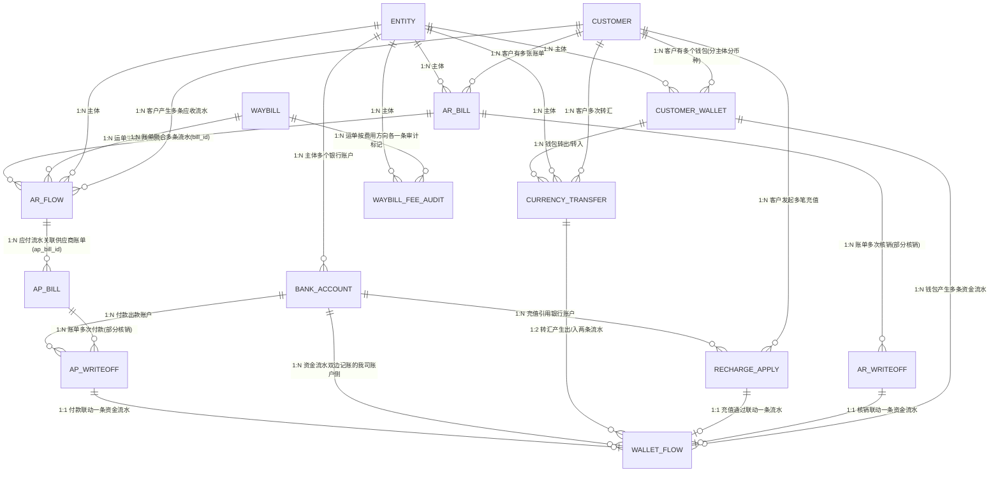

# 数据设计 — 财务模块（应收 + 应付 + 资金账户）

> **版本**：v0.15 | **日期**：2026-09-23 | **作者**：飞点产品
> **覆盖范围**：应收管理 R1-R5 + 资金账户 W1-W6 + **应付管理（应付账单 + 应付核销 + 应付账龄）**；**账单导出不建表**（任务与结果文件归后台任务，见「账单导出（不建表）」节）；**入账记录（`credit_record`）随二期赔付管理立项一并落地，本期不建表**；对账/毛利/开票/成本核算待后续对齐后补充；**销售成本（`flow_category=30`）= 应收流水的物理复制**（费用类型「费用方向」含**销售成本**时，应收流水落库自动复制一份；独立台账、不参与审计与成账，见「销售成本」节）
> **上游**：[2026-09-23-产品文档.md](2026-09-23-产品文档.md)（定稿）

---

## 一、实体清单 × 表映射

| # | 实体 | 对应表 | 映射方式 | 说明 |
|:---|:---|:---|:---|:---|
| 1 | 应收业务流水 | `ar_flow` | 独立表 | 运单收货自动生成，粒度=运单 |
| 2 | 应收账单 | `ar_bill` | 独立表 | 财务手工成账或**系统每月 1 号自动出账**；**客户 × 我司主体 × 币种** 一张（不跨币种折合） |
| 2b | 应付账单 | `ap_bill` | 独立表 | **供应商账单**：财务按 **我司主体 × 供应商 × 币种 × OA审批编号** 归集「已审计且未成账」的应付流水生成（不跨币种折合）；「账单周期 = 固定」的供应商每月 1 号自动出账；**不发送供应商确认、无冲账、无贷记单**；带账期快照供账龄 |
| 3 | 收款核销流水 | `ar_writeoff` | 独立表 | 核销/反核销留痕 |
| 3b | 应付核销流水 | `ap_writeoff` | 独立表 | **付款给供应商**留痕：核销/反核销，联动我司银行账户出款 |
| 4 | 账龄台账 | — | **视图** | 实时计算，不落表（应收账龄：客户 × 主体 × 币种） |
| 4a | **应付账龄台账** | — | **视图** | 实时计算，不落表（我司主体 × 供应商 × 币种），见 §二「视图：应付账龄台账」 |
| 4b | **业务流水台账（应收 / 应付）** | — | **视图** | 直接查 `ar_flow` 的**全量视图**（跨 待审计 / 已审计未成账 / 已进账单 / 作废释放），**不建新表、不建新状态机**；按 `flow_category` 分「应收（10）/ 应付（20）」两个菜单；**应付台账一期承载「提单平摊」**（待摊 / 已摊两态，见「提单平摊应付」节）；写动作复用 R60 / R61 / R75（详见 §二「视图：业务流水台账」） |
| 5 | 我方银行账户 | `bank_account` | 独立表 | 每主体可多账户 |
| 6 | 客户预存款钱包 | `customer_wallet` | 独立表 | 客户×主体×币种 |
| 7 | 资金流水 | `wallet_flow` | 独立表 | 9 类流水 |
| 8 | 币种互转 | `currency_transfer` | 独立表 | 转汇明细 |
| 9 | 充值申请 | `recharge_apply` | 独立表 | 客户发起、财务审核 |
| 10 | 运单费用审计（**运单级审计标记**） | `waybill_fee_audit` | 独立表 | **两态：未审计 / 已审计**，按费用方向（应收 / 应付）各一条 |
| — | 运单 | — | 逻辑实体 | 引用运单模块，财务不建表 |
| — | 客户 | — | 逻辑实体 | 引用客商中心，财务不建表 |
| — | 主体（账套） | — | 逻辑实体 | 引用基础资料，5 主体 |
| — | 币种 | — | 逻辑实体 | 枚举字典（CNY/USD/HKD…），财务不建表 |
| — | 汇率 | — | 外部接口 | 调**阿里汇率接口**实时获取，不落库、不自建汇率表；币种互转时接口汇率与实际采用汇率随单留痕 |
| — | 费用类型 | — | 逻辑实体 | 引用头程管理 `fee_type` 字典（同方向唯一），财务不建表 |
| — | 账期（合同） | — | 逻辑实体 | 引用客商中心 `customer_contract`（应收）/ `supplier_contract`（应付） |
| — | 账单草稿池 | — | **视图** | **已审计且未成账的流水集合**（`audit_status = 已审计(20)` 且 `bill_id` 为空），**逐条流水展示**、按 客户 × 我司主体 × 币种 过滤、**不跨币种折合**（详见下方「账单草稿池」说明） |
| — | 账单管理 · 待核销清单 | — | **视图** | `ar_bill` 上满足「**应收(10)** + **客户已确认** + 未结清金额 > 0 + 未作废」的实时查询结果（**不建临时表、不占独立 Tab**，在「已发送」Tab 用「核销状态」筛出，见产品文档 R67）；**不筛客户状态**——禁用 / 过期 / 解约客户照常可核销 |
| — | 货主端资金账户总览 | — | **视图** | 基于 `customer_wallet` + `ar_bill` 实时计算，按 主体 × 币种 聚合，供货主端「资金账户 → 账户余额」展示（见 §二 视图） |

> **FBA 单号（`fba_no`）**：运单级**派生多值**（头程管理侧登记），**财务侧不落库** —— 草稿池列与账单明细列取数时**按运单汇总、以 ` / ` 拼接展示**，非 FBA 运单显示「—」。
>
> **账单草稿池（实时视图，不建表）**：池内成员 = `ar_flow` 里「`audit_status = 已审计(20)` + `bill_id` 为空」的行，**没有临时表**；草稿池展示的「**账期**」= **实时读该 客户 × 我司主体 的合同签约账期**（`customer_contract.payment_term` → 月结 / 双月结 / 三月结 / 周结 …，**只显示签约账期名、不带「+ 天数/号」**；**合同账期段为空时显示 `待补录`**），属**预估值**；成账后以 `ar_bill` 上的**快照**为准。入池门槛 = **已审计** —— 只有 `audit_status = 已审计(20)` 的流水进池，**未审计流水不进池、页面上也不给未审提示**（要看未审流水走「运单审计」）；**成账颗粒度 = 流水级**，财务逐条勾选要成账的流水，**同一运单的不同流水可以拆到不同账单**（后续新增流水、赔付抵扣流水天然进入下一期账单，因此一个运单可关联多张账单）；**不跨币种折合**（只聚合与账单币种一致的流水）；`bill_id` 非空的流水不在池内。草稿池是**流水视角的池子**，财务手工成账仍不新增账单状态机（产品文档 §状态机）；「账单周期 = 固定」的客户另由系统每月 1 号自动出账（产品文档 R2.11）。

---

## 二、逐表字段清单

> 字段业务含义与需求背景见产品文档；业务规则与状态机见产品文档；页面交互见原型。本 Schema 是字段结构（类型/约束/枚举值）的唯一权威。

> 所有表统一含公共字段：`id`(BigInt, PK, 雪花) · `tenant_id`(String, Index) · `created_at` · `created_by` · `updated_at` · `updated_by` · `is_deleted`(Boolean, 默认 false) · `version`(Int, 乐观锁)

### 表 1：应收业务流水 `ar_flow`

> 运单收货完成后系统自动生成，粒度=运单；**一条费用项生成一条流水**（运费 / 运费优惠 / 泡比优惠 / 各附加费 / 各附加费优惠各成一行，**优惠独立成行，不并入费用行**），按「费用类型 × 币种」可拆多条。账期与到期日是账单级字段，出账时从合同快照（见产品文档 R14/R57）。费用类型引用头程管理 `fee_type` 字典（同方向名称唯一）。
>
> **自动行去重键**：`UNIQUE(waybill_id, flow_kind, fee_type_id, source_rule_id)`——运单信息变更触发**重扫**时覆盖更新已有行而非新增行，保证不重复计费。生成规则与账单草稿池见产品文档 §6.1（R01–R61）。

| 字段 | 中文 | 类型 | 必填 | 约束/索引 | 枚举/备注 |
|:---|:---|:---|:---|:---|:---|
| flow_no | **流水号** | String(32) | Yes | **Unique** | 业务流水唯一编号，规则 `FLW + yyyyMMdd + 序号`（**每天从 `001` 起**，与 `ar_writeoff` 的 `WO+YYYYMMDD+序号` 同一套序列风格）；「应收 / 应付业务流水」主列表第 1 列 |
| waybill_id | 运单ID | BigInt | **条件必填** | Index | 引用运单模块；**待摊应付行（提单平摊前）为空**、分摊后回填；应收行 / 已摊应付行必填 |
| customer_id | 客户ID | BigInt | **条件必填** | Index | 引用客商中心；**待摊应付行（提单平摊前）为空**（拼柜多客户、分摊前不确定），分摊后回填；应收行 / 已摊应付行必填 |
| entity_id | 我司主体ID | BigInt | Yes | Index | 5 账套之一；**应付流水（`flow_category=20`）的取值来源 = 该供应商有效合同（sign_status=已签署 且 有效期内 且 未解约）的签约主体（我司合同抬头），新增 / 导入时必填**；应收流水取运单所属主体 |
| flow_category | 业务流水大类 | TinyInt | Yes | — | 10:应收, 20:应付, **30:销售成本**（= 应收流水物理复制，费用类型 `fee_direction` 含「销售成本(30)」时应收落库自动复制；独立台账、不参与审计与成账；**销售提成（提成计算）归二期，届时另定枚举位**） |
| amortize_status | 分摊状态 | TinyInt | No | — | **应付流水（`flow_category=20`）专属**：10:待摊（提单级，`waybill_id` 为空、`bl_amortize` = 提单号，尚未平摊到运单）, 20:已摊（运单级，分摊后回填 `waybill_id`）；**应收流水不落本字段**（恒视为已摊） |
| flow_kind | 流水种类 | TinyInt | Yes | — | 10:运费, 20:运费优惠, 30:泡比优惠, 40:附加费, 50:附加费优惠, 60:手工新增 |
| fee_type_id | 费用类型ID | BigInt | Yes | Index | 引用头程管理 fee_type 字典（运费/周六派送费/超重费/地址附加费/商品附加费/报关费/库内贴标费…）。**取值来源按流水种类**：运费行=预置费用类型「运费」；运费优惠/泡比优惠行=**优惠规则上配置的 `fee_type`**；附加费行与附加费优惠行=**该附加费规则计价明细「应收」行的费用类型** |
| currency | 币种 | String(8) | Yes | — | CNY/USD/HKD… |
| unit_price | 本行单价 | Decimal(20,6) | Yes | — | 带符号：运费行=当周公布价、附加费行=应收单价、优惠行=优惠值（**负=减钱、正=加价**）；**手工新增行分两种**：附加费（选了来源规则）必填（金额 = 单价 × 计费量 自动算）、非附加费（无规则候选）**选填**（填了 → 金额 = 单价 × 计费量自动算；未填 → 直接填金额） |
| pricing_unit | 计价单位 | TinyInt | **条件必填** | — | 10:票, 20:箱, 30:KG, 40:m³, 50:数量。**来源跟着规则走**：运费 / 运费优惠 / 泡比优惠行 = 运单所关联**服务组合的计费方式**（KG / m³）；附加费 / 附加费优惠行 = 该条**附加费规则的计价单位**。同一父行的优惠行与其父行计价单位、计费量一致。**新增应收 / 销售成本手工流水时必填**；**应付流水（`flow_category=20`）无计价单位 —— 该字段仅应收流水使用，应付流水不落** |
| quantity | 计费量 | Decimal(20,6) | No | — | 计费数量（重量/体积/箱数/张数）；按票计费=1；关联附加费规则按数量计费时由业务填写；非附加费手工新增行计费量必填 |
| amount | 本行金额（原币） | Decimal(20,6) | Yes | — | **金额口径分两种**：附加费 = `unit_price × quantity`（自动算）；非附加费手工新增 = 计费量必填、单价选填（填了单价 → `amount = unit_price × quantity` 自动算；未填单价 → 直接填 `amount`）。**带符号**：费用行为正；优惠行为负=减钱 / 正=加价。**运单应收净额与账单金额一律按各行 `amount` 的代数和汇总**（优惠已独立成行）。**金额（本币）= `amount` × `rate`，为派生展示字段（只读、不落库）** |
| rate | 汇率 | Decimal(20,6) | Yes | — | 生成/手工创建时自动取实时汇率，人民币=1；`amount` 本身不参与汇率计算，**金额（本币）由前端按 `amount × rate` 派生展示（只读、不落库）** |
| description | 描述 | String(255) | No | — | **面向客户的说明**（货主端可见）；与「备注」分开：备注是内部口径、客户端不展示。**应付流水不填**（供应商不登录系统、账单不发给供应商） |
| remark | 备注 | String(255) | No | — | **仅内部可见**（货主端不展示） |
| supplier | 供应商 | String(64) | No | — | **应付流水专属**（`flow_category=20`）：应付流向的供应商（承运 / 拖车 / 报关 / 海运等）；应收流水留空 |
| bl_amortize | 提单号（平摊来源 / 挂靠同步目标） | String(255) | No | — | **应付流水专属**，只承载一个语义 = **这条流水归属 / 同步到哪个提单**：**提单平摊**（`source_type=30`）= 平摊来源提单号（待摊行 `amortize_status=10` 只挂提单、`waybill_id` 空；已摊行 `amortize_status=20` 挂运单 + 记来源提单号）；**人工添加**（`source_type=20`）= 运单审计「添加应付」**选填的同步提单号**（选了即同步到提单侧可见，**仍走运单审计**，不改审计归属）；不挂提单留空 |
| oa_no | OA审批编号 | String(64) | No | — | **应付流水专属**：财务 OA 审批编号，**手工新增应付流水必填**；应收流水留空 |
| pick_time | 拣货时间 | DateTime | No | Index | **该行所属运单的收货完成时间**（运单级属性落在行上）。收货完成生成时直接写入（含人工添加行——只写时间、不动金额）；人工添加时由后端取运单收货完成时间写入。**两端均展示**（为空显示「—」） |
| created_at | 创建日期 | DateTime | Yes | Index | 该行的创建时间，**后端自动写入**（系统生成时=生成时间、人工新增时=提交时间）；**运单费用流水页两端不展示**，**财务「账单草稿池」展示**（对账取数用） |
| source_type | 来源类型 | TinyInt | Yes | Index | **10:系统自动计算**（运单收货 / 重算生成）、**20:人工添加**（运单审计「添加应付」——挂运单，可填提单号挂靠同步、审计仍归运单）、**30:提单平摊**（舱位管理「添加应付费用」/ 应付业务流水「新增」提单级录入落待摊 → 按实收体积平摊到运单）。**是审计归属的唯一判据**（见 `audit_status`）；同时决定该行能否被编辑（见产品文档 R58/R61） |
| source | 数据来源 | String(32) | Yes | — | 报价 / 规则名 / 人工添加；只记第一次来源，后续变更不变。**货主端不展示** |
| source_rule_type | 来源规则类型 | TinyInt | No | — | 10:运价行, 20:运费优惠规则, 30:泡比优惠规则, 40:附加费规则, 50:附加费优惠规则；手工新增行留空 |
| source_rule_id | 来源规则ID | BigInt | No | Index | 命中的规则主键（**引用，不是快照**），供运单审计下钻「这条规则现在长什么样」；手工新增行留空 |
| source_rule_name | 来源规则名（快照） | String(64) | No | — | **命中时的规则名文本快照** —— 规则改名 / 删除后仍可举证「当时是哪条规则给的」。**列表不展示，收进行详情；货主端不展示** |
| source_flow_id | 来源应收流水ID | BigInt | No | Index | **销售成本流水（`flow_category=30`）专属**：指向被复制的来源应收流水（`flow_category=10`）ID，**只读追溯、不回写**；复制后两者**完全独立**（编辑 / 删除互不影响） |
| bill_id | 关联账单ID | BigInt | No | Index | **应收流水专属**：生成应收账单后回填；**为空即处于「账单草稿池」**（产品文档 R2.1）；**账单作废时置空 → 流水释放回草稿池**（产品文档 R2.8）；**销售成本流水（`flow_category=30`）恒空、不参与成账** |
| ap_bill_id | 关联应付账单ID | BigInt | No | Index | **应付流水专属**：生成应付账单后回填；为空即「未成账」，可被「应付账单管理」归集；**应付账单作废时置空 → 流水释放回可成账池** |
| audit_status | 审计状态 | TinyInt | Yes | Index | **10:待审计, 20:已审计（只有两态；运单审计语境称「待业务审计」）**；**审计归属只看 `source_type`，不看提单号是否为空**：`source_type=30 提单平摊` → **已摊行（`amortize_status=20`）走提单审计（两态），待摊行（`amortize_status=10`）恒空、不可审计**；`source_type=20 人工添加` → 走运单审计（两态），**无论是否填了提单号**（填提单号仅表示同步到该提单，不改审计归属）；**销售成本流水（`flow_category=30`）恒空、不参与审计（无审计状态、无审计 / 反审计动作）** |
| biz_audit_by / biz_audit_at | 业务审计人/时间 | — | No | — | 业务侧「运单管理」操作 |
| fin_audit_by / fin_audit_at | 财务审计人/时间 | — | No | — | 财务侧「运单审计」操作 |

> **优惠明细的承载方式**：**每条优惠单独生成一条业务流水**（优惠行），并通过 `source_rule_type` + `source_rule_id` 记录命中的规则，因此**运单审计与客户价格争议可以下钻到「哪条规则给的、减在哪个费用类型上」**，一期不需要额外建优惠明细表。
>
> **仍留二期的缺口**：① 同一费用项上**多条优惠叠加的运算顺序明细**（一期逐条成行、按行金额代数和汇总，不记录运算顺序）；② 浮动优惠（券 / 满减）的**核销载体**。两者由超级运价模块二期营销模块的 `discount_apply_log`（M7）承接，一期历史数据**不做反向拆解**。详见 `drafts/超级运价/2026-09-23-数据设计.md` §3.20.4。

### 提单平摊应付（`flow_category = 20` 的生成来源）

> 应付业务流水**两个来源**：① **人工添加**（`source_type=20`，运单审计「添加应付」——挂运单，可填提单号同步到提单侧、仍走运单审计）；② **提单平摊**（`source_type=30`，舱位管理「添加应付费用」/ 应付业务流水「新增应付业务流水」提单级录入落待摊 → 按实收体积平摊到运单）。**金额守恒、只出现一次**：平摊前是「待摊行」（提单级），平摊后转成「已摊行」（运单级），台账合计只算「当前生效」的行（待摊态算待摊行、已摊态算运单行），**待摊与已摊不并存计金额**。

**两层结构**：

| 分摊状态 | 挂靠 | 关键字段 | 说明 |
|:---|:---|:---|:---|
| 待摊（10） | 只挂提单 | `waybill_id` 空、`customer_id` 空、`bl_amortize` = 提单号 | 提单级应付费用，尚未平摊；提单页「财务信息」与「应付业务流水」菜单可见（标「待摊」） |
| 已摊（20） | 挂运单 | `waybill_id` 回填、`customer_id` 回填、`bl_amortize` = 来源提单号 | 平摊生成的运单级应付流水 |

**生成规则**：

- **待摊行录入（三入口）**：① 提单页「财务信息」手工加应付费用（费用类型 / 总额 / 币种 / 汇率 / 供应商 / OA审批编号 / 描述 / 备注）；② 「应付业务流水」菜单「新增应付业务流水」（**提单号必填、单选可搜索** + 供应商 / 费用类型 / 币种 / 汇率 / 金额 / OA审批编号 / 备注）；③ 「应付业务流水」菜单「批量导入分摊」批量导入供应商应付流水到提单（Excel 粒度 = 提单号 × 费用类型 × 金额 / 币种）。①② 弹窗带「**是否自动平摊**」开关（默认勾选）—— 勾选则保存即平摊、直接生成已摊行（跳过待摊行）；不勾选则逐行校验后落待摊行（**提单已审计的不可新增**），待摊行审计状态恒空、**不可审计**（平摊后转为已摊行才参与提单审计）。
- **平摊（手动触发，非自动跑批）**：财务在提单页 / 应付业务流水页点「批量平摊」（或新增弹窗勾选「自动平摊」、保存即平摊）→ **平摊前校验目标运单「应付」审计状态：任一目标运单「应付」已整票审计 → 本次平摊整个阻断（原子操作，不做部分平摊）**，提示「先反审计应付再平摊」→ 校验通过后把待摊行总额按「各运单实收体积 ÷ 提单总实收体积」摊到该提单下各运单：
  - **分子** = 各运单**实收体积**（取自头程管理「提单配载明细」，见头程管理数据设计）；**分母** = 提单总实收体积（Σ 各运单实收体积）；
  - 每运单应付金额 = 待摊总额 × 该运单实收体积 ÷ 分母；**尾差挂最后一个运单**，该条流水**描述**备注「含尾差」；
  - 生成 N 条运单应付流水（`source_type=30`、`amortize_status=20`、审计状态 = **待审计（10）**、`bl_amortize` = 提单号），待摊行转「已摊」态、金额由运单行承接。
- **反分摊**：某提单下「**未审计 + 未关联账单**」的平摊流水批量删除，待摊行退回「待摊」，财务改金额后重新平摊；**该流水已审计（流水级）、已进账单、或目标运单「应付」已整票审计的流水不可反分摊**。
- **费用类型唯一性（跨层去重）**：应付费用类型在**提单维度**与**运单维度**都唯一——**提单维度**（同一提单下费用类型不重复，含提单级录入 + 运单挂靠同步）、**运单维度**（同一运单下费用类型不重复，含运单级录入 + 提单平摊下来的流水）。**双向跨层校验**：平摊方向（提单级费用平摊到运单）任一目标运单已有该类型 → 平摊失败 + 提单侧新增一并取消；挂靠方向（运单级流水挂靠到提单）该提单已有该类型 → 挂靠同步失败 + 运单侧新增一并取消。新增 / 导入时按各自维度查重（弹窗内多行同样查重）。

**审计与冻结边界**：见财务产品文档 **R76**（审计归属看 `source_type` + 分摊状态、两层审计、平摊 / 撤销平摊三道前置、挂靠编辑权限、成账口径的完整规则）。

### 销售成本（`flow_category = 30` 的生成来源）

> 销售成本流水**以应收流水的物理复制为主、另支持手工新增**：某条应收流水（`flow_category=10`）的**费用类型**在头程管理「费用方向」里勾了**销售成本**，则该应收流水**落库时自动复制一份**成 `flow_category=30` 销售成本流水（独立落库一行，金额、字段与应收流水一致）；此外「运单审计 → 费用管理 → 销售成本」Tab 提供「新增流水」直接手工录入销售成本流水。定位 = **销售成本的取数台账**（哪些应收项计入成本口径），**不参与审计、不参与成账**，与应收流水**复制后完全独立**（互不回写）。**销售提成（提成比例 / 归属销售 / 结算）归二期，本期只落「销售成本流水」这一份取数口径。**

**复制口径**：

- **触发**：① **自动复制**——应收流水（`flow_category=10`）落库时，后端读其费用类型 `fee_type.fee_direction`，含「销售成本(30)」→ 同步复制一份销售成本流水；不含 → 不复制。**一次落库复制一次**，复制后不再跟随来源应收流水变化；② **手工新增**——「运单审计 → 费用管理 → 销售成本」Tab「新增流水」直接录入（`source_type=20 人工添加`、`source_flow_id` 空、不参与审计与成账）。
- **复制字段**：复制来源应收流水的业务字段（运单号 / 客户 / 我司主体 / 费用类型 / 币种 / 汇率 / 单价 / 计价单位 / 计费量 / 金额（原币）/ 数据来源 / 创建人 / 备注 / 拣货时间等；**不含「描述」—— 销售成本流水不填、不展示「描述」**），**金额（原币）与原应收流水同额**；金额（本币）= `amount × rate` 同口径派生展示。
- **差异字段**（销售成本流水专属口径）：
  - `flow_category` = 30 销售成本；`flow_no` 独立取号（沿用 `FLW + yyyyMMdd + 序号` 序列）；
  - `source_flow_id` = 来源应收流水ID（只读追溯，不回写）；
  - `audit_status` **恒空**（不参与审计）；`bill_id` **恒空**（不参与成账 / 不进账单草稿池）；
  - `source_type` = 沿用来源应收流水的值（只读，不作审计归属判据）。
- **独立**：复制后与来源应收流水**完全独立、互不回写** —— 编辑 / 删除销售成本流水不影响来源应收流水，反之亦然（含来源应收流水被删除时，已复制的销售成本流水保留）。
- **不参与**：审计（无审计状态、无审计 / 反审计）、应收账单成账、账龄台账、贷记单结转等应收侧口径一律不纳入。
- **展示**：仅「运单审计」「运单管理」两页的「费用管理 → 销售成本」Tab 按运单展示该票销售成本流水（字段 = 应收字段去「审计状态」「关联账单」「描述」三列，顶部「流水条数 + 销售成本净额」汇总；运单审计侧「新增流水 / 编辑 / 删除」、运单管理侧只读）。

### 表 2：应收账单 `ar_bill`

> 财务在草稿池手工勾选已审计流水成账，或由系统每月 1 号对「账单周期 = 固定」的客户自动出账；**客户 × 我司主体 × 币种** 一张，**不跨币种折合**（产品文档 R2.11）。**账单生成后、发送前的「待发送」阶段，允许把单条流水移出账单**（`ar_flow.bill_id` 置空回草稿池、账单金额重算、账单号不变、至少保留 1 条 —— 见产品文档 R66）。
>
> **账单是快照、草稿池是实时**（★）：账单级字段（账单日期 / 账期（签约账期 + 天数/号）/ 账期天数 / 到期日期 / 金额 / 状态 / 生成来源 / 发送与确认与作废留痕）**一律在 `ar_bill` 上落库存快照**；合同之后改账期，**已生成账单不受影响**。与之相对，**草稿池不建表**，是 `ar_flow` 上「已审计 + `bill_id` 为空」的**实时查询视图**，其中展示的「账期」是**实时读合同**得来的预估值（见 §一 账单草稿池说明）。

| 字段 | 中文 | 类型 | 必填 | 约束/索引 | 枚举/备注 |
|:---|:---|:---|:---|:---|:---|
| bill_no | 账单号 | String(32) | Yes | **Unique** | 规则：`AR-{主体代码}-{yyyyMM}-{5 位序号}`（序号零填充 5 位，**按 主体 × 账期月 每月从 `00001` 重置**，取号 = 同主体同账期月已有账单数 + 1）；主体代码：广州GZ/深圳SZ/广东GD/香港HK/墨链ML |
| customer_id | 客户ID | BigInt | Yes | Index | — |
| entity_id | 主体ID | BigInt | Yes | Index | — |
| currency | 币种 | String(8) | Yes | — | — |
| bill_type | **单据类型** | TinyInt | Yes | Index | **10:应收账单（我司向客户收款）, 20:贷记单（我司应付客户）** —— 生成账单时按**勾选流水的净额符号**判定：净额 > 0 → 10、净额 < 0 → 20、**净额 = 0 → 不出账**（阻断）。**用显式字段而不是靠 `bill_amount` 符号推断**：核销准入 / 账龄台账 / 资金账户「未结清金额」/ 候选筛选一律以它为准，语义比 `bill_amount > 0` 清楚、也不怕"净额刚好为 0"这类边界；**待发送阶段的编辑不允许净额符号跨 0**（跨 0 = 单据类型变了，须作废重开）。**不新建「贷记单表」** —— 两类单据的字段与生命周期 90% 重合（客户 / 主体 / 币种 / 账单日 / 账期 / 明细流水 / 发送 / 确认 / 作废 / 操作时间线），且成账入口共用草稿池 |
| generated_at | 生成时间 | DateTime | No | — | **账单生成的时间戳**（自动出账 = 跑批时刻、手工出账 = 确认生成时刻）；「操作时间线」的「生成账单」条目用它（**回退 `billing_date`**）—— 账单日可被财务在待发送阶段修改，不能当生成时间用 |
| edited_at / edited_by / edit_action | 最近一次编辑时间 / 操作人 / 动作 | DateTime / String(32) / TinyInt | No | — | **待发送阶段的账单编辑留痕**（见产品文档 R66）：`edit_action` = 10 移除流水 / 20 添加流水 / 30 修改账单日期；「操作时间线」据此加一条 `编辑账单`（**只记时间 / 操作人 / 动作，不记增减了几条流水**）；一期只保留最近一次，完整编辑历史留二期 |
| billing_date | 账单日 | Date | Yes | Index | 自动出账 = **1 号**（跑批日）；手工出账 = 财务指定，**默认生成当月自然月末**；**「待发送」阶段可改**（R66）—— 改后 `due_date` 与 `payment_terms_days` 同步重算，账期月变了则 `bill_no` 按新账期月重新取号 |
| due_date | 到期日期 | Date | Yes | Index | **最后支付日**，按「签约账期 + 天数/号」推导（算法见产品文档 R57）；**派生字段，随 `billing_date` 变动实时重算**（待发送阶段改账单日期，见 R66） |
| payment_terms_days | 账期天数 | Int | Yes | — | **账单级账期快照 = 到期日 − 账单日 + 1**（如账单日 09-01、月结+15 → 15 天）；账龄台账按 `billing_date + 本字段` 推逾期；由到期日反推，**合同账期推不出时不允许出账，不做补录** |
| payment_terms_type | **签约账期（快照）** | TinyInt | No | — | **账单页「账期」列的取值来源** —— 生成账单时从合同 `customer_contract.payment_term` 快照：101:月结, 102:双月结, 103:三月结, 201:周结, 202:到港前结, 203:签收月结, 204:到海外仓结, 205:签收结。**合同账期段为空时不允许出账**（页面直接阻断，见产品文档 R14 / 产品文档 R2.1），因此账单上本字段必然有值 |
| days_or_date | **天数/号（快照）** | Int | No | — | 生成账单时从合同 `customer_contract.days_or_date` 快照。**参与到期日计算**：按月类（月结 / 双月结 / 三月结）→ 取账单月的第 N「号」（N 为 **1–31 的数字**；该月无该号 → 取该月月末；算出的日期不晚于账单日则顺延下一月同一号）；按天类（周结）→ 到期日 = 账单日 + N − 1 天。**账单页「账期」列 = `{签约账期}+{天数/号}`**（如 `月结+15`）。**「天数/号」只填数字（1–31），没有「月末 / 月初」这类文字值**（客商中心合同账期字段）；**`0` / 空 = 未填 → 视为账期未完善、不允许出账** |
| generate_source | 生成来源 | TinyInt | Yes | Index | 10:系统自动（每月 1 号跑批，`billing_cycle = 固定(10)` 的客户）、20:财务手工（草稿池勾选流水成账） |
| bill_amount | 账单总额 | Decimal(20,6) | Yes | — | 聚合流水应收净额；**待发送阶段增删流水后重算** = Σ 明细各行 `amount`（代数和，R66），**任何情况下都不手改** |
| received_amount | 已核销金额 | Decimal(20,6) | Yes | — | 核销累加，默认 0 |
| unreceived_amount | 未结清金额 | Decimal(20,6) | Yes | Index | bill_amount − received_amount − written_off_amount（核销与冲账都清减未结清金额；**= 0 即「已结清」**） |
| send_status | 发送状态 | TinyInt | Yes | Index | 10:未发送, 20:已发送（财务点「发送客户」） |
| confirm_status | 确认状态 | TinyInt | Yes | Index | 10:未确认, 20:已确认 —— **两条路径**：① 客户在货主端点「确认账单」；② **发送日（含当日）起满 7 个自然日仍未确认 → 每天 00:30 的定时任务自动确认**。两条路径对后续核销与账龄**等效**，区分靠 `confirm_type` |
| writeoff_status | 核销状态 | TinyInt | Yes | Index | 10:未核销, 20:部分核销, 30:已核销, 40:已反核销（**按未结清金额派生**：未结清金额 = 0 → 已核销（含尾款冲账后归零），未结清金额 > 0 且已核销金额 > 0 → 部分核销，否则未核销；冲账是金额维度、由 `written_off_amount > 0` 表达）；**本维度在账单管理（员工端「已发送」Tab / 货主端「应收账单」Tab）只读展示**，**核销动作与「尾款冲账」在「账单管理」核销弹窗、核销记录与反核销/反冲账在「核销/冲账管理」页**；**作废前置判定改用「未结清金额 = 账单金额」（received = 0 且 written_off = 0），不再看本状态** |
| void_status | 作废标记 | TinyInt | Yes | Index | 10:正常, 20:已作废（终态；作废后其余三个维度冻结，其下流水 `bill_id` 置空回草稿池） |
| generated_by / generated_at | 生成人/时间 | — | No | — | 财务操作 |
| sent_at | 发送客户时间 | DateTime | No | — | — |
| confirm_type | **确认方式** | TinyInt | No | — | 10:客户确认（货主端手动）、20:系统自动确认（超期自动确认）—— **仅用于留痕与展示**（员工端「已发送」Tab 的「确认状态」tag 悬浮、两端账单详情的「确认信息」字段），**不参与任何判定** |
| confirmed_at | 确认时间 | DateTime | No | — | 客户货主端确认，或系统自动确认（写跑批时间）。**自动确认时间 = 发送日 + 7 天 00:30** |
| voided_by / voided_at | 作废人/时间 | — | No | — | 财务操作；作废后其下流水 `bill_id` 置空释放回草稿池 |
| void_reason | 作废原因 | String(200) | No | — | **页面必填**（作废弹窗强制，≤200 字）：作废不可恢复、账单号不回收，必须留痕「为什么废的」；与 `voided_by` / `voided_at` 一起在账单详情的**「操作时间线」**（「作废账单」条目）展示，详情头部另起一行的留痕已撤掉。DB 置 No 只为兼容历史空值，**新作废一律有值** |
| written_off_amount | 已冲账金额 | Decimal(20,6) | Yes | — | 坏账冲销累加，默认 0；冲账 / 反冲账时增减（**冗余自 `ar_writeoff` 冲账记录**，供账单列表直接展示）。**与 `received_amount`（客户付的钱）并列**：`received_amount + written_off_amount + unreceived_amount = bill_amount` |

### 表 3：结清记录 `ar_writeoff`（核销 + 冲账）

> 财务结清记录（核销 / 冲账 / 反核销 / 反冲账），留痕可审计。**本表是「事实快照表」**：一行一条结清单（核销单 / 冲账单），`bill_before/bill_after`、`wallet_before/wallet_after` 记的是**该笔发生时**的账单未结清金额与钱包余额；「核销记录」列表**不 join 账单 / 钱包的实时值**（实时值用于「账单管理 → 已发送」Tab 的三列与核销弹窗）。**页面上只展示账单侧快照**（「未结清金额（前 → 后）」一列）；**贷记单结转（70/80）的 `related_no` 挂的是账单号**；**钱包侧两列仅留痕、不上表** —— 核销金额与钱包变动同额，钱包进出另由 `wallet_flow`（`flow_type` 40/50）专管。**一个账单可以有多条本表记录**（多次部分核销），核销单 ↔ 账单 = N:1。**批量核销 = 同一批次逐张各写一条本表记录**（不是一条汇总记录）：**范围限定为同一个钱包**（同一客户 × 主体 × 币种，**由财务在弹窗里主动锁定 —— 不预选钱包**），**按账单 `due_date` 从早到晚逐张分配该钱包余额**（每张 `min(未结清金额, 钱包可用余额)`），`本次核销 = 0` 的账单不写记录；每张各自带四个快照字段，核销单号按发生顺序递增；同一分钟内的多笔**时间戳相同，排序与"最新一条"判定统一以核销单号为准**。

| 字段 | 中文 | 类型 | 必填 | 约束/索引 | 枚举/备注 |
|:---|:---|:---|:---|:---|:---|
| writeoff_no | 结清单号 | String(32) | Yes | **Unique** | 规则：`WO + YYYYMMDD + 序号`（核销单与冲账单**共用同一序列**）；结清记录列表与接口按本字段回传 |
| bill_id | 账单ID | BigInt | Yes | Index | — |
| wallet_id | 钱包ID | BigInt | Yes | Index | — |
| currency | 币种 | String(8) | Yes | — | 强制同币种 |
| amount | 结清金额（核销金额 / 冲账金额） | Decimal(20,6) | Yes | — | 核销 = min(账单未结清金额, 钱包余额)；冲账 = ≤ 未结清金额（默认全额，不动钱包） |
| writeoff_type | 类型 | TinyInt | Yes | — | 10:核销, 20:已反核销, **30:冲账, 40:已反冲账**（**页面显示名**；「类型」列与「反核销 / 反冲账」按钮的显示条件） |
| reason | 冲账原因 | String(200) | No | — | **仅冲账 / 已反冲账记录有值**（冲账原因必填 ≤200 字，核销记录为空）；「结清记录」列表冲账行展示 / 悬浮 |
| bill_before / bill_after | 核销前/后账单未结清金额 | Decimal(20,6) | Yes | — | 留痕；**「核销记录」列表「未结清金额（前 → 后）」一列的数据源**（该列表是事实快照表，不展示账单的实时未结清金额） |
| wallet_before / wallet_after | 结清前/后钱包余额 | Decimal(20,6) | Yes | — | **留痕字段，页面不展示** —— 用于对账与「链式闭合」校验（每个钱包时间最新一条的 `wallet_after` = 该钱包当前余额）；钱包进出的界面呈现走 `wallet_flow`。**冲账记录恒等**（`wallet_before = wallet_after`，不动钱包） |
| wallet_flow_id | 关联资金流水ID | BigInt | No | — | 核销→资金流水联动 |
| reversed_of_id | 被反核销 / 反冲账的原结清ID | BigInt | No | — | 反核销 / 反冲账指向原结清记录 |
| operator_by / operator_at | 操作人/时间 | — | Yes | — | 财务 |

### 视图：贷记单（负数账单）与「结转钱包」

**负数应收流水 = 业务事实驱动、系统自动产生**（识别到赔付即向运单插一条负应收），它不取决于客户是否合作 —— 所以必须有**不依赖"客户后续业务"的结清出口**。口径：

- **净额 > 0** → 应收账单（负数流水作账单内一行「赔付抵扣 −N」，随账单正常发送 / 确认 / 核销）
- **净额 < 0** → **贷记单**（我司欠客户）：`ar_bill` 上**用 `bill_type = 贷记(20)` 标出单据类型**（**同一张表、同一套流程**，不建第二张表），但：
  - **不参与收款核销**（核销准入以 `bill_type = 应收(10)` 为准）
  - **照常发送客户**（`ship_status` 走正常发送流转、货主端照常展示并标注「贷记单」）
  - **不进账龄台账**、**不计入资金账户「未结清金额」**（该指标口径加 `unreceived_amount > 0`）
  - `writeoff_status` 保持 `未核销(10)` 但**不参与核销状态机流转**
- **明细允许异号流水**（与应收账单同一规则）：贷记单里可以有正数运费行、应收账单里可以有「赔付抵扣 −N」行 —— **`bill_type` 只看整单 `bill_amount` 的符号**；`ar_flow` 每条流水仍按原符号完整落库，**经营分析走流水、结算看账单**
- **结清 = 结转钱包**：写一条 `wallet_flow`（`flow_type = 70`、`related_no` = 账单号、`amount` = 贷记单净额的绝对值、`wallet_before/after` 留痕）；客户钱包余额增加 → **之后可正常核销其他账单，也可提现**
- **「已结转」是派生状态**（**不新增状态枚举**）：判定 = 存在 `wallet_flow(flow_type = 70, related_no = 账单号)`。**结转即终态、不可撤销** —— 钱进了客户可用额度就可能已被拿去核销别的账单，反悔必须走**对冲凭证**（运单侧新增反向流水 → 下期账单作为应收费抵扣），不回滚已发生的资金流水
- **幂等**：`wallet_flow` 上 `flow_type = 70` + `related_no` **唯一**（同一贷记单只能结转一次，且不可逆）
- **照常发送客户、走同一套确认流程**（客户端展示为「贷记单」黄 tag + 悬浮说明；**发送满 7 个自然日未确认 → 系统自动确认**，R16）→ **结转前置 = `confirm_status = 已确认`**（与核销对称；有自动确认兜底，不会因客户不合作而卡死）；
- **不做「撤销入账」**：结转是**结清动作、入钱包即终态** —— 钱包是「客户可用额度」容器，钱一旦进去就与充值款混同、可能已被核销其他账单或提现，逐笔回滚既不可行也说不清（"这笔钱被哪笔核销用掉了"需要资金逐笔配对，一期不做）
  - **纠错统一走对冲**：运单侧新增一条正数流水（→ 下期账单里作为应收费抵扣），下游账单与核销记录都不动、账面自动轧平
  - 同一理由，**核销也不再从「资金流水」页撤销**（反核销在「核销记录」菜单）
- **结转进「操作时间线」**（结清动作留痕：金额 + 钱包余额前后 + 流水号）；金额一律 = 账单净额，**不让人手改**

> 为什么不做独立的"贷记台账 / 退款单"：钱包（`customer_wallet`）本来就是「客户可用额度」的容器，再造一套会出现**两个池子都要轧账**、客户可能同时在两处有钱 —— 双份口径，长期维护成本更高。

### 视图：账龄台账（不建表）

基于 `ar_bill` 实时计算：**`bill_type = 应收(10)`** 且 **`send_status = 已发送(20)`** 且 `unreceived_amount > 0` **且 `void_status = 正常(10)`** 的账单（**「待发送」账单不计入** —— 未发给客户，账龄是对客催收口径；作废账单不计入），按 `billing_date + payment_terms_days` 推逾期天数 → 未到期单列 + 逾期 0-30 / 31-60 / 61-90 / 90+；维度 = 客户 × 主体 × 币种；分币种不折算。**冲账（坏账冲销）后账单 `unreceived_amount = 0` → 自动出账龄**（不再催收）。

### 视图：应付账龄台账（不建表）

基于 `ap_bill` 实时计算：**`void_status = 正常(10)`** 且 **`unpaid_amount > 0`** 的账单（应付账单生成即进入待核销、无「发送 / 确认」阶段，故不筛 `send_status`；作废账单不计入），按 `billing_date + payment_terms_days` 推逾期天数 → 未到期单列 + 逾期 0-30 / 31-60 / 61-90 / 90+；维度 = 我司主体 × 供应商 × 币种；分币种不折算。**核销（付款）后账单 `unpaid_amount = 0` → 自动出账龄**（不再催付）。

### 视图：业务流水台账（不建表）

**业务流水台账（产品文档功能 A12/A13）本身不新增任何实体 / 表** —— 它就是 `ar_flow` 的**全量查询**，按 `flow_category` 分「应收业务流水（10）/ 应付业务流水（20）」两个菜单（**应收台账本页同时承载「新增流水 / 导入（文件）/ 删除」写动作 + 勾选批量「审计 / 反审计」**，见产品文档 §5.14，写动作复用 R60 / R61 / R75，不新增状态机）：

| 环节 | 承载 |
|:---|:---|
| 数据源 | `ar_flow` 全量行（**不筛审计状态、不筛 `bill_id`**）—— 跨 待审计 / 已审计未成账 / 已进账单 / 作废释放 全部状态 |
| 应收台账 | `flow_category = 10 应收`，一期即有数据 |
| 应付台账 | `flow_category = 20 应付`；**列表 17 个业务字段 + 工具栏「新增应付业务流水 / 生成应付账单 / 批量导入分摊 / 删除」**（新增同「运单审计」新增应付流水、生成账单按 供应商×币种×OA审批编号 归集「已审计 + 未成账」流水、删除仅限「普通应付流水待业务审计」，应付侧无导出）；**含「提单平摊」两条录入路径**：① 提单页「财务信息」手工加应付费用 → 批量平摊；② 本页批量导入供应商应付流水到提单 → 自动批量分摊（平摊 / 反分摊口径见「提单平摊应付」节） |
| 账单状态派生 | **应收流水**：`bill_id` 为空 → 「草稿池」（未成账），非空 → join `ar_bill.bill_no` 展示账单号；**应付流水**：`ap_bill_id` 为空 → 「未成账」，非空 → join `ap_bill.bill_no` 展示账单号（均可点击跳对应账单详情） |
| 关联下钻 | 运单号 → `waybill`（跳运单审计详情）；账单号 → `ar_bill`（跳账单详情）；来源规则 → `source_rule_type / source_rule_id / source_rule_name`（收进行详情） |
| **列表 JOIN** | **客户编号 / 客户昵称 / 客户名称** join `客商中心·customer`（`customer_id`）、**销售代表** join `waybill`（运单所属销售代表）、**转单号（快递主单号）** join `waybill`（运单关联的快递主单号） |
| **列表本表字段** | 流水号 / 汇率 / 创建人 / 备注 / 描述 / 拣货时间 / 创建时间（`ar_flow` 本表字段 `flow_no` / `rate` / `created_by` / `remark` / `description` / `pick_time` / `created_at`） |
| **列表列** | **业务时间** = 业务发生日期（`YYYY-MM-DD`） |

> **为什么不建表**：台账是「从流水本身出发」的**跨容器查询视角**，与运单审计（写 + 审计，按运单）、草稿池（成账，只未成账）、账单详情（结算，只已进账单）是**同一张 `ar_flow` 的不同视图** —— 再建一张流水表等于把同一批流水抄两份，必然出现"哪份算数"的口径分裂。
>
> **写动作**：台账对 `ar_flow` 有「新增流水 / 导入（文件）/ 删除」+ 勾选批量「审计 / 反审计」（新增 / 删除走 R60 / R61，文件导入走 R75，审计 / 反审计为流水级 R61 第二入口），成账 / 结算仍各归原位，不在此页。

### 视图：货主端资金账户（不建表）

基于 `customer_wallet` + `ar_bill` 实时计算，按 主体 × 币种 聚合，货主端「资金账户」页展示：

| 字段 | 说明 |
|:---|:---|
| 账户主体 | `customer_wallet.entity_id` → 主体名称（合同签约主体） |
| 币种 | `customer_wallet.currency`（默认人民币，各主体统一；其他币种财务手工开通） |
| 账户名称 | `customer_wallet.account_name` |
| 余额 | `customer_wallet.balance`（充值入池 − 核销扣减后的剩余） |
| 未结清金额 | Σ `ar_bill.unreceived_amount`，where `bill_type = 应收(10)` 且 `confirm_status = 已确认(20)` 且 `unreceived_amount > 0` 且 `void_status = 正常(10)`，按 主体×币种 |
| 待确认账单 | Σ `ar_bill.bill_amount`，where `send_status = 已发送(20)` 且 `confirm_status = 未确认(10)` 且 `void_status = 正常(10)`，按 主体×币种 |
| 实际金额 | `balance − 未结清金额`（负数红色带负号，正数正常色） |

### 账单导出（不建表）

**账单导出（产品文档 R2.12）不新增任何实体 / 表 / 字段** —— 它是"读账单 + 读运单 + 读流水 → 按模板出文件"的动作，落点全部复用既有结构：

| 环节 | 承载 |
|:---|:---|
| 导出范围 | **不落库** —— 等于「已发送」Tab 列表里**勾选的账单**（勾选行本身来自 `ar_bill` 上 `send_status = 已发送(20)` 且 `void_status = 正常(10)` + 查询条件），提交时把 `billNos[]` 快照传给任务 |
| 取数来源 | `ar_bill`（账头 4 项）+ `ar_flow`（流水级列）+ 运单（运单级列，经 `ar_flow.waybill_id` 关联）—— **全部只读** |
| 任务与结果文件 | **归后台任务模块** `import_task`（`task_type = 20 导出`、`result_file_url`）—— 财务侧**不建"导出任务表"、不建"导出记录表"**（避免两处各存一份任务状态） |
| 模板分类 | 任务的 `templateType` 快照（常规模板 / 出口退税模板），模板文件本身是**静态资源**（`analysis/财务导出模板/`），不进库 |

> **为什么不建表**：导出的"记录"本质是**文件交付凭证**，与导入任务的错误文件同性质 —— 后台任务模块已经是"任务进度 + 结果文件"的公共容器，财务再造一张导出记录表会出现两处任务状态、两处下载入口。**导出对 `ar_bill` 只读、不写任何状态**，因此也不进账单「操作时间线」。

### 表 10：运单费用审计 `waybill_fee_audit`（**运单级审计标签**）

> 运单级审计**不是**从流水推导出来的派生值，而是「整单审计通过 / 反审计」这个动作的落库结果 —— 因为它带审计人与时间、并且**决定整票能否再新增费用**（见财务产品文档 R61）。流水级的审计标签仍在 `ar_flow.audit_status`（**两层标签，各自独立、各管一摊**：运单标记管「新增」、流水标记管「编辑」）。

| 字段 | 中文名 | 类型 | 必填 | 索引 | 说明 |
|:---|:---|:---|:---:|:---|:---|
| id | 主键 | BigInt | Yes | PK | |
| waybill_id | 运单ID | BigInt | Yes | **Unique** | 一票一条；**运单第一次审计时创建**，未审计的运单**不预置空行**（无记录 = 待审计） |
| waybill_no | 运单号 | String(32) | Yes | Index | 冗余，运单审计列表直接展示 |
| fee_direction | 费用方向 | TinyInt | Yes | **Unique（与 waybill_id 组合）** | **10:应收 / 20:应付** —— 审计按方向独立：应收已审计不影响应付仍可加费用 |
| audit_status | 运单审计标记 | TinyInt | Yes | Index | **只有两态：10:未审计 / 20:已审计**（无"部分审计""已反审计"中间态；反审计即回 `10 未审计`） |
| audit_by / audit_at | 整单审计人 / 时间 | — | No | — | 「该方向整票审计通过」时写入（运单列表与审计页展示） |
| reverse_by / reverse_at / reverse_reason | 最近一次反审计人 / 时间 / 原因 | — | No | — | 反审计留痕（标记回 `10 未审计`，但留痕保留） |
| remark | 备注 | String(255) | No | — | |

> **与流水的联动（★，两层解耦）**：**运单级审计（按方向整票审计）** → ① 写本表该方向 `audit_status=20` + 审计人/时间；② 该运单**该方向全部**流水置 `audit_status=20 已审计`（**提单平摊应付流水除外 —— `bl_amortize` 非空的流水审计状态恒为空、不随运单审计变动**）。**反审计（运单级、按方向 × 深度）** → ① **「仅运单」**：本表该方向回 `audit_status=10 未审计`（写反审计留痕），**流水不动**（仍已审计、锁定编辑，只放开新增）；② **「运单及流水」**：本表该方向回 `10 未审计` + 该方向**未进账单的**流水回到 `10 待业务审计`（放开新增 + 编辑），**已进账单的流水保持已审计、不回退**。**流水级审计 / 反审计**（在运单费用 tab 勾选若干流水执行）**只动 `ar_flow.audit_status`、不写本表** —— 因此会出现「运单未审计、个别流水已审计」的中间态：该流水不可编辑，但**运单仍可新增流水**（见产品文档 R61）。**唯一键 `(waybill_id, fee_direction)`**：未审计的方向可以不建行（无记录 = 未审计），也可预置 `10`，实现取其一。

### 表 11：应付账单 `ap_bill`（供应商账单）

> 财务按 **我司主体 × 供应商 × 币种 × OA审批编号** 归集「已审计且未成账」的应付流水，生成一张**供应商账单**；「账单周期 = 固定」的供应商另由系统**每月 1 号自动出账**（产品文档 R2.11）。**不发送供应商确认、无冲账、无贷记单**：生成即进入「待核销」，财务直接核销（付款给供应商）。**成账前置**：归集范围内的应付流水必须全部满足「已审计」（流水级）——提单平摊已摊行、普通应付流水均看 `audit_status = 已审计(20)`，未审计流水不进候选。**账单作废（仅未核销时）** → 其下流水 `ap_bill_id` 置空释放回可成账池。
>
> **账单是快照、可成账池是实时**（同应收）：账单级字段（账单日 / 账期快照 / 到期日 / 金额 / 状态 / 生成来源 / 作废留痕）一律在 `ap_bill` 上落库存快照；供应商合同之后改账期，**已生成账单不受影响**。「未成账」= `ar_flow.ap_bill_id` 为空，是实时查询视图（不建表）。

| 字段 | 中文 | 类型 | 必填 | 约束/索引 | 枚举/备注 |
|:---|:---|:---|:---|:---|:---|
| bill_no | 账单号 | String(32) | Yes | **Unique** | 规则 `AP-{主体代码}-{yyyyMM}-{5 位序号}`（序号零填充 5 位，**按 我司主体 × 账期月 每月从 `00001` 重置**）；主体代码：广州GZ/深圳SZ/广东GD/墨链ML |
| supplier | 供应商 | String(64) | Yes | Index | 应付流向的供应商（承运 / 拖车 / 报关 / 海运等） |
| entity_id | 我司主体ID | BigInt | Yes | Index | **归集键之一**；来源 = 该供应商有效合同的签约主体（我司合同抬头） |
| currency | 币种 | String(8) | Yes | — | **不跨币种折合**（只聚合与账单币种一致的流水） |
| oa_no | OA审批编号 | String(64) | Yes | Index | **归集键之一**，对应财务 OA 审批单；一张账单对应一个 OA 审批编号 |
| generate_source | 生成来源 | TinyInt | Yes | Index | 10:系统自动（每月 1 号跑批，供应商合同 `billing_cycle = 固定(10)`）、20:财务手工（「生成应付账单」弹窗 4 维归集） |
| billing_date | 账单日 | Date | Yes | Index | 自动出账 = **1 号**（跑批日）；手工 = 财务指定，**默认生成当月自然月末** |
| due_date | 到期日期 | Date | Yes | Index | **最后付款日**，按供应商合同「签约账期 + 天数/号」推导（算法同应收 产品文档 R2.4）；派生字段，随 `billing_date` 变动实时重算 |
| payment_terms_type | **签约账期（快照）** | TinyInt | No | — | 生成账单时从供应商合同 `supplier_contract.payment_term` 快照：101:月结（账单周期=固定）, 104:半月结, 201:周结（账单周期=不固定）；**账期段为空不允许出账**（与应收同口径） |
| days_or_date | **天数/号（快照）** | Int | No | — | 生成账单时从 `supplier_contract.days_or_date` 快照；**只填数字（1–31），0/空 = 未填 → 不允许出账**；按月类当「号」用、按天类当「天数」用 |
| payment_terms_days | 账期天数 | Int | Yes | — | **账单级账期快照 = 到期日 − 账单日 + 1**；应付账龄台账按 `billing_date + 本字段` 推逾期 |
| bill_amount | 账单总额 | Decimal(20,6) | Yes | — | Σ 明细应付流水金额（**正数**；应付费用均为我司应付款，无负数贷记场景）；**未核销账单增删明细后重算** |
| paid_amount | 已核销金额 | Decimal(20,6) | Yes | — | 核销累加，默认 0 |
| unpaid_amount | 未结清金额 | Decimal(20,6) | Yes | Index | `bill_amount − paid_amount`；**= 0 即「已核销」** |
| writeoff_status | 核销状态 | TinyInt | Yes | Index | **10:未核销, 20:部分核销, 30:已核销**（按未结清金额派生：= 0 → 已核销；> 0 且已核销金额 > 0 → 部分核销；否则未核销） |
| void_status | 作废标记 | TinyInt | Yes | Index | 10:正常, 20:已作废（终态；**前置 = 未核销**，作废后其下流水 `ap_bill_id` 置空释放） |
| generated_by / generated_at | 生成人/时间 | — | No | — | 财务操作（自动出账 = 跑批时刻） |
| voided_by / voided_at / void_reason | 作废人/时间/原因 | — | No | — | 作废原因**必填 ≤200 字**（不可恢复，须留痕） |

### 表 12：应付核销 `ap_writeoff`（付款给供应商）

> 财务付款给供应商的留痕（核销单），**一行一条付款**；**联动我司银行账户出款**——核销时扣减 `bank_account.balance` + 写资金流水 `wallet_flow`（`flow_type = 100 支付供应商 / 110 支付供应商撤销`）。**一个账单可多次部分核销**，核销单 ↔ 账单 = N:1。**反核销**：出款金额回补账单未结清金额 + 我司账户余额回补，原记录置「已反核销」并新增一条「已反核销」记录（原记录保留、不删除）。

| 字段 | 中文 | 类型 | 必填 | 约束/索引 | 枚举/备注 |
|:---|:---|:---|:---|:---|:---|
| writeoff_no | 核销单号 | String(32) | Yes | **Unique** | 规则 `APW + YYYYMMDD + 序号`（与应收核销 `WO` 分列两套序列） |
| bill_id | 应付账单ID | BigInt | Yes | Index | 关联 `ap_bill` |
| bank_account_id | 出款账户 | BigInt | Yes | Index | **核销时财务手动选的我司银行账户**（`bank_account`，按币种过滤「启用」账户） |
| currency | 币种 | String(8) | Yes | — | 强制同币种 |
| amount | 核销金额 | Decimal(20,6) | Yes | — | ≤ 账单未结清金额（默认全额）；核销金额与账户出款金额同额 |
| writeoff_type | 类型 | TinyInt | Yes | — | 10:核销, 20:已反核销 |
| bill_before / bill_after | 核销前/后账单未结清金额 | Decimal(20,6) | Yes | — | 留痕（`bill_before − amount = bill_after`） |
| account_before / account_after | 出款前/后我司账户余额 | Decimal(20,6) | Yes | — | 留痕（`account_before − amount = account_after`）；**按账户聚合、时间最新一条的 `account_after` = 该账户当前余额**（与 `wallet_flow` 我司账户侧闭合校验一致） |
| voucher | 付款凭证 | String(255) | No | — | 银行转账回单截图 / PDF |
| remark | 备注 | String(255) | No | — | 内部留痕 |
| reversed_of_id | 被反核销的原核销ID | BigInt | No | — | 反核销指向原核销记录 |
| operator_by / operator_at | 操作人/时间 | — | Yes | — | 财务 |

### 表 5：我方银行账户 `bank_account`

| 字段 | 中文 | 类型 | 必填 | 约束/索引 | 枚举/备注 |
|:---|:---|:---|:---|:---|:---|
| entity_id | 主体ID | BigInt | Yes | Index | 每主体可多账户 |
| account_name | 账户名称 | String(64) | Yes | — | 开户名 |
| account_no | 账号 | String(32) | Yes | **Unique** | 全局唯一，创建后不可修改 |
| bank_name | 开户行 | String(64) | Yes | — | — |
| swift_code | SWIFT/BIC | String(16) | No | — | 境外打款用，非人民币账户建议填写 |
| currency | 账户币种 | String(8) | Yes | — | 单币种账户 |
| balance | 账面余额 | Decimal(20,6) | Yes | — | **系统自动核算**（由双边资金流水「我司账户侧」`company_amount` 驱动：充值/代充 `+`、提现/充值退回 `−`、**支付供应商（应付核销）`−`、支付供应商撤销 `+`**；核销/冲账/转汇/贷记单结转不动）；初始余额财务新建账户时录入，之后随流水自动增减，不再手工维护 |
| is_visible_to_customer | 用户是否可见 | Boolean | Yes | Index | 默认 true；为 true 时客户货主端充值的打款账户下拉可见该账户 |
| is_default | 是否默认 | Boolean | Yes | — | 客户打款默认账户；同一主体+币种仅一个，且必须 `is_visible_to_customer=true` |
| status | 状态 | TinyInt | Yes | — | 10:启用, 20:停用；停用同时置 `is_visible_to_customer=false`、`is_default=false` |

### 表 6：客户预存款钱包 `customer_wallet`

> 钱包 = 客户 × 主体 × 币种；余额扣减需乐观锁，不可透支。**生成节点（唯一自动触发点）= 客商中心合同签约完成**（`sign_status` 20 → 30），按 `contract_company` 生成「客户 × 主体 × 人民币」钱包；正常入驻（先签约后开户）与特殊入驻（先开户后签约）统一卡在签约完成，开户完成不触发；续签幂等（唯一索引兜底），每日补偿「已签署合同无对应钱包」。**钱包生命周期与合同解耦**：合同过期/解约不影响钱包任何操作（充值/核销/提现/互转/新增币种钱包照常），系统不自动停用。默认币种统一人民币（各主体一致）。

| 字段 | 中文 | 类型 | 必填 | 约束/索引 | 枚举/备注 |
|:---|:---|:---|:---|:---|:---|
| customer_id | 客户ID | BigInt | Yes | **Unique(联合)** | — |
| entity_id | 主体ID | BigInt | Yes | **Unique(联合)** | — |
| currency | 币种 | String(8) | Yes | **Unique(联合)** | (customer, entity, currency) 唯一 |
| account_name | 账户名称 | String(16) | Yes | **Unique** | 格式=账号编号+空格+币种代码；账号编号 7 位全局递增(1000001 起)，跨客户/主体/币种不重复 |
| balance | 余额 | Decimal(20,6) | Yes | — | 不可透支，默认 0 |
| open_source | 开通方式 | TinyInt | Yes | Index | 10:系统自动(合同签约完成), 20:财务手工 |
| opened_at | 开通时间 | DateTime | Yes | — | 钱包创建时间 |
| is_default | 是否默认钱包 | Boolean | Yes | — | 系统字段，员工端/货主端均不展示；二期「默认支付钱包」预留 |

### 表 7：资金流水 `wallet_flow`

> 钱包资金进出痕迹，事实记录不可改（出错靠反向流水：充值退回/核销撤销）。**双边记账**：每条流水同时记录「客户钱包侧」与「我司账户侧」两端 —— 客户钱包侧（`wallet_id` / `amount` / `balance_before/after`）照旧；我司账户侧（`bank_account_id` / `company_amount` / `company_balance_before/after`）**仅充值 / 代充 / 提现 / 充值退回 / 支付供应商（应付核销）有变动**（核销 / 冲账 / 转汇 / 贷记单结转的我司账户侧金额为 0；**支付供应商 / 支付供应商撤销动我司账户、无客户钱包侧**，见下方「资金流向矩阵」）。

| 字段 | 中文 | 类型 | 必填 | 约束/索引 | 枚举/备注 |
|:---|:---|:---|:---|:---|:---|
| id | 流水ID | BigInt | Yes | **PK** | 自增主键 |
| flow_no | 流水编号 | String(32) | Yes | **Unique** | 规则：`WF + yyyyMMdd + 3位序号`（跨流水类型统一序列、按发生顺序递增）；「资金流水」页「流水号」列、财务流水「代充/提现」流水号、贷记单结转「资金流水号」统一引用本字段 |
| wallet_id | 钱包ID | BigInt | No | Index | **应付核销（100/110）时为空**（无客户钱包侧，只有我司账户侧出款）；其余流水类型必填 |
| flow_type | 流水类型 | TinyInt | Yes | Index | 10:充值, 20:充值退回, 30:提现, 40:收款核销, 50:收款核销撤销, 60:转汇, **70:贷记单入账（贷记单结转）**, **80:冲账（坏账冲销）**, **90:冲账撤销（反冲账）**, **100:支付供应商（应付核销）**, **110:支付供应商撤销（应付反核销）**（40/50 与核销记录 `ar_writeoff` 1:1 对应，靠 `related_no` 关联核销单号；**70 与贷记单 1:1 对应，靠 `related_no` 关联账单号**；**80/90 是账面流水** —— 冲账不动客户钱包，`amount` = 冲账金额、`balance_before = balance_after`（余额不变），只做账务留痕，90 与 80 对称反冲；**100/110 与应付核销记录 `ap_writeoff` 1:1 对应，靠 `related_no` 关联核销单号，`wallet_id` 为空、只有我司账户侧出款**） |
| currency | 币种 | String(8) | Yes | — | — |
| amount | 入账金额 | Decimal(20,6) | Yes | — | 正=入, 负=出 |
| balance_before / balance_after | 变动前/后余额 | Decimal(20,6) | Yes | — | 留痕。**钱包余额 = Σ 本表 amount**（**含 70 贷记单入账；不含 80 冲账 / 90 冲账撤销** —— 冲账是账面流水、不动钱包余额）—— 所以贷记单结转**必须写这条流水**，只改余额不写流水会导致余额与流水对不上账 |
| recharge_id | 关联充值 | BigInt | No | — | 充值/充值退回；**财务代充无充值申请单，本字段为空** |
| pay_time | 支付时间 | Date | No | — | 客户实际打款时间，**仅充值/代充（flow_type=10）落值**：货主端充值审核通过时由 `recharge_apply.pay_time` 回填、代充由财务录入；其余流水类型（提现/核销/转汇/冲账/贷记单入账）无独立支付事件，支付时间 = 创建时间（`operator_at`），本字段留空、资金流水页回退展示创建时间 |
| voucher_url | 打款凭证 | String(255) | No | — | **仅财务代充**上传的回单截图 URL；货主端充值见 `recharge_apply.voucher_url` |
| writeoff_id | 关联核销 | BigInt | No | — | 核销/核销撤销 |
| transfer_id | 关联转汇 | BigInt | No | — | 转汇 |
| operator_by / operator_at | 操作人/时间 | — | Yes | — | — |
| bank_account_id | 我司账户 | BigInt | No | — | **双边记账的我司侧落账账户**（`bank_account`，即「资金账户管理 → 我司账户」）；核销/冲账/转汇/贷记单结转为空 |
| company_amount | 我司账户入账金额 | Decimal(20,6) | No | — | 正=入、负=出；**仅充值/代充/提现/充值退回/支付供应商非 0**（支付供应商 −、支付供应商撤销 +），核销/冲账/转汇/贷记单结转 = 0 |
| company_balance_before / company_balance_after | 我司账户余额（前/后） | Decimal(20,6) | No | — | 留痕；**`bank_account.balance` = 时间最新一条的 `company_balance_after`** |

> **资金流向矩阵（双边流水）** —— 一条流水记两侧；「我司账户侧」只在**真实现金进出**时变动，核销 / 冲账 / 转汇 / 贷记单结转**不动我司账户**（客户预存款 ↔ 应收账款的对冲，现金在充值时已入账）；**支付供应商（应付核销）是我司真实付款给供应商，动我司账户、无客户钱包侧**：

| 流水类型 | flow_type | 客户钱包侧 `amount` | 我司账户侧 `company_amount` | 说明 |
|:---|:---:|:---:|:---:|:---|
| 充值 / 代充 | 10 | +N | +N | 客户打款进我司账户（`bank_account_id` = 打款/入账账户），同时记客户预存 |
| 充值退回 | 20 | −N | −N | 反向 |
| 提现 | 30 | −N | −N | 客户取回预存，从我司账户出款 |
| 收款核销 | 40 | −N | **0** | 客户预存抵应收，现金不流动 |
| 收款核销撤销 | 50 | +N | 0 | 反向 |
| 转汇 | 60 | 出 −N / 入 +N | 0 | 同客户同主体内币种互转，我司账户不动 |
| 贷记单入账（结转） | 70 | +N | 0 | 我司应付转客户预存，现金不流动 |
| 冲账 | 80 | 0（账面） | 0 | 坏账认亏，无资金进出 |
| 冲账撤销 | 90 | 0（账面） | 0 | 反向 |
| 支付供应商（应付核销） | 100 | **—（无钱包侧）** | −N | 我司付款给供应商，从我司账户出款（`wallet_id` 为空） |
| 支付供应商撤销（应付反核销） | 110 | **—（无钱包侧）** | +N | 反向 |

### 表 8：币种互转 `currency_transfer`

> 独立表，记录转出/转入两币 + 汇率，可审计。

| 字段 | 中文 | 类型 | 必填 | 约束/索引 | 枚举/备注 |
|:---|:---|:---|:---|:---|:---|
| transfer_no | 转汇单号 | String(32) | Yes | **Unique** | 规则：TR+yyyyMMdd+SEQ |
| customer_id | 客户ID | BigInt | Yes | Index | — |
| entity_id | 主体ID | BigInt | Yes | Index | 同主体内互转 |
| from_wallet_id | 转出钱包ID | BigInt | Yes | Index | — |
| from_currency | 转出币种 | String(8) | Yes | — | — |
| from_amount | 转出金额 | Decimal(20,6) | Yes | — | 正数 |
| to_wallet_id | 转入钱包ID | BigInt | Yes | Index | — |
| to_currency | 转入币种 | String(8) | Yes | — | — |
| to_amount | 转入金额 | Decimal(20,6) | Yes | — | 按汇率换算 |
| api_rate | 接口汇率 | Decimal(20,6) | Yes | — | 阿里汇率接口实时返回值，留痕不可改 |
| rate | 汇率 | Decimal(20,6) | Yes | — | 实际采用汇率，默认=api_rate，可手工覆盖 |
| rate_source | 汇率来源 | TinyInt | Yes | — | 10:接口实时, 20:手工覆盖 |
| operator_by / operator_at | 操作人/时间 | — | Yes | — | 财务手工 |

### 表 9：充值申请 `recharge_apply`

> 客户货主端发起，财务审核后入池。

| 字段 | 中文 | 类型 | 必填 | 约束/索引 | 枚举/备注 |
|:---|:---|:---|:---|:---|:---|
| customer_id | 客户ID | BigInt | Yes | Index | — |
| entity_id | 主体ID | BigInt | Yes | Index | 充到哪个主体钱包 |
| currency | 币种 | String(8) | Yes | — | — |
| amount | 金额 | Decimal(20,6) | Yes | — | — |
| bank_account_id | 打款我方账户 | BigInt | Yes | — | 引用 bank_account |
| voucher_url | 打款凭证 | String(255) | Yes | — | 上传截图 URL |
| pay_time | 支付时间 | Date | Yes | — | 客户实际打款时间（到账日），财务核对银行流水用 |
| status | 状态 | TinyInt | Yes | Index | 10:待审核, 20:已通过, 30:已驳回 |
| audit_by / audit_at | 审核人/时间 | — | No | — | 财务线下查银行流水 |
| wallet_flow_id | 关联资金流水 | BigInt | No | — | 通过后生成充值流水 |

---

## 三、ER 关系图

> 注：`CUSTOMER`(客户)、`ENTITY`(主体)、`WAYBILL`(运单) 为外部模块实体，财务不建表，仅以 `_id` 引用。

---

## 四、关键设计说明

### 4.1 金额精度
所有金额字段统一 `Decimal(20,6)`，禁止 Float/Double；币种不折算混总。

### 4.2 乐观锁（并发控制）
- `customer_wallet`：余额扣减（核销/提现/转汇）必须带 `version` 乐观锁，防超扣
- `bank_account`：余额随充值/提现双边流水自动增减，需 `version` 乐观锁防并发错账
- `ar_bill`：核销累加 `received_amount` 需并发控制

### 4.3 软删除策略
核心业务数据（账单、流水、核销、转汇、钱包）一律软删除（`is_deleted`），不物理删除；资金流水为事实记录，**不可软删不可改**，出错靠反向流水。

### 4.4 视图说明
账龄台账为实时视图，不落表；基于 `ar_bill.unreceived_amount` + `billing_date` + `payment_terms_days` 计算，**范围限 `send_status = 已发送(20)`**（待发送账单不计入）。
资金流水页（`财务_资金流水.html`）拆「客户 / 公司」两个 Tab：**客户 Tab** 展示 `wallet_flow` 的客户钱包侧、**公司 Tab** 展示 `wallet_flow` 的我司账户侧（`company_amount ≠ 0`，即充值/代充入账、提现/充值退回出账、**支付供应商出账 / 支付供应商撤销回补**）；「资金账户管理 → 我司账户」行操作「流水」查看同一份我司账户侧流水。

### 4.5 状态机

> 状态机定义见产品文档 §3（状态机唯一权威，含业务流水审计、账单状态维度、充值申请、银行账户状态）。本数据设计仅在各表字段「枚举/备注」列保留状态枚举值作引用。

### 4.6 外部引用（纯逻辑实体）
- 运单：引用运单模块（`waybill_id`）
- 客户：引用客商中心（`customer_id`）
- 主体：引用基础资料（`entity_id`）
- 账期与账单周期：引用客商中心 `customer_contract`（合同级）—— **账单周期**（`billing_cycle` 固定/不固定）决定客户是否参与每月 1 号自动出账；**账期**（`payment_term` + 天数/号 `days_or_date`）决定到期日（产品文档 R2.4/R14）；财务生成账单时快照，不重复维护
- 币种：枚举字典；汇率：调**阿里汇率接口**实时获取（不落库、不自建汇率表），币种互转时以接口值预填、允许财务手工覆盖，`api_rate` + `rate` + `rate_source` 三者随单留痕；接口异常时降级为手工填写（rate_source=20）

### 4.7 应收流水生成与账单草稿池

> 应收流水生成 / 取价与优惠取数 / 重算与冻结 / 草稿池入池门槛 / 到期日算法 / 编辑口径 / 手工新增落库 / 取数入参等业务规则与计算公式见产品文档 §6.1–6.2（R01–R61、R11–R14）与 §7（计算公式）。
> 数据层要点：自动行去重键 `UNIQUE(waybill_id, flow_kind, fee_type_id, source_rule_id)`；账单草稿池 = `ar_flow` 上「`audit_status = 已审计(20)` + `bill_id` 为空」的实时视图（不建表，入池口径见 §一 账单草稿池说明）。

### 4.8 自动出账跑批（每月 1 号）

> 自动出账跑批（每月 1 号 00:30）的业务规则见产品文档 R65（§6.2）。数据层幂等键：应收 `ar_bill` = 客户 × 我司主体 × 币种 × 账期月；应付 `ap_bill` = 我司主体 × 供应商 × 币种 × OA审批编号 × 账期月。

### 4.9 应付账单生成与核销

> 应付账单生成 / 未核销明细增删 / 核销（付款） / 反核销 / 作废的业务规则见产品文档 §6.5（R77–R83）。

---

## 枚举字典 ★ 研发必读

## 2. 枚举字典 ★ 研发必读

> 与数据设计 v0.10 Schema 的 TinyInt 值保持一致；跨模块枚举以来源模块为准，财务不重复定义。

### 2.1 财务自有枚举

| 枚举名 | 值 | 常量名 | 中文 | 适用实体 |
|:---|:---:|:---|:---|:---|
| FlowCategory | 10 | AR | 应收 | `ar_flow.flow_category` |
| FlowCategory | 20 | AP | 应付 | 同上（**Phase 1 仅实现应收，应付为预留枚举**） |
| FlowCategory | 30 | SALES_COST | 销售成本 | 同上（= 应收流水物理复制，见 §5.1 / §5.10 / R86） |
| SourceType | 10 | SYSTEM_CALC | 系统自动计算 | `ar_flow.source_type`（**只有 20 人工添加的行可编辑**） |
| SourceType | 20 | MANUAL_ADD | 人工添加 | 同上 |
| AuditStatus | 10 | PENDING_BIZ_AUDIT | 待业务审计 | `ar_flow.audit_status` |
| AuditStatus | 20 | AUDITED | 已审计 | 同上 |
| SendStatus | 10 | NOT_SENT | 未发送 | `ar_bill.send_status`（账单生成后默认） |
| SendStatus | 20 | SENT | 已发送 | 同上（财务点「发送客户」） |
| ConfirmStatus | 10 | NOT_CONFIRMED | 未确认 | `ar_bill.confirm_status` |
| ConfirmStatus | 20 | CONFIRMED | 已确认 | 同上（客户在货主端确认） |
| WriteoffStatus | 10 | NOT_WRITEOFF | 未核销 | `ar_bill.writeoff_status`（**账单管理「已发送」Tab 展示本维度**，见 R17；**核销动作、核销记录与反核销也都在「账单管理」页**，见 §5.3） |
| WriteoffStatus | 20 | PARTIAL_WRITEOFF | 部分核销 | 同上 |
| WriteoffStatus | 30 | WRITTEN_OFF | 已核销 | 同上 |
| WriteoffStatus | 40 | WRITEOFF_REVERSED | 已反核销 | 同上 |
| VoidStatus | 10 | NORMAL | 正常 | `ar_bill.void_status` |
| VoidStatus | 20 | VOIDED | 已作废 | 同上（终态，三个维度全部冻结） |
| GenerateSource | 10 | AUTO | 系统自动 | `ar_bill.generate_source`（每月 1 号自动出账跑批生成） |
| GenerateSource | 20 | MANUAL | 财务手工 | 同上（财务在草稿池手工勾选成账） |
| WriteoffType | 10 | WRITEOFF | 核销 | `ar_writeoff.writeoff_type` |
| WriteoffType | 20 | REVERSE_WRITEOFF | 反核销 | 同上 |
| WalletFlowType | 10 | RECHARGE | 充值 | `wallet_flow.flow_type` |
| WalletFlowType | 20 | RECHARGE_REFUND | 充值退回 | 同上 |
| WalletFlowType | 30 | WITHDRAW | 提现 | 同上 |
| WalletFlowType | 40 | WRITEOFF | **收款核销** | 同上 |
| WalletFlowType | 50 | WRITEOFF_CANCEL | **收款核销撤销** | 同上 |
| WalletFlowType | 60 | CURRENCY_TRANSFER | 转汇 | 同上 |
| WalletFlowType | 70 | CREDIT_TRANSFER | 贷记单入账（结转） | 同上 |
| WalletFlowType | 80 | CHARGE_OFF | 冲账（坏账冲销） | 同上 |
| WalletFlowType | 90 | CHARGE_OFF_CANCEL | 冲账撤销（反冲账） | 同上 |
| WalletFlowType | 100 | SUPPLIER_PAYMENT | **支付供应商（应付核销）** | 同上（`wallet_id` 为空、只有我司账户侧出款） |
| WalletFlowType | 110 | SUPPLIER_PAYMENT_CANCEL | **支付供应商撤销（应付反核销）** | 同上 |
| RechargeStatus | 10 | PENDING | 待审核 | `recharge_apply.status` |
| RechargeStatus | 20 | APPROVED | 已通过 | 同上 |
| RechargeStatus | 30 | REJECTED | 已驳回 | 同上 |
| RateSource | 10 | API | 接口实时 | `currency_transfer.rate_source` |
| RateSource | 20 | MANUAL | 手工覆盖 | 同上 |
| BankAccountStatus | 10 | ENABLED | 启用 | `bank_account.status` |
| BankAccountStatus | 20 | DISABLED | 停用 | 同上 |
| WalletDefault | true / false | — | 默认钱包 / 非默认 | `customer_wallet.is_default`（系统字段，员工端与货主端均不展示，二期「默认支付钱包」预留） |
| WalletOpenSource | 10 | SYSTEM | 系统自动 | `customer_wallet.open_source`（合同签约完成自动开通） |
| WalletOpenSource | 20 | MANUAL | 财务手工 | 同上（财务补开币种钱包） |
| FlowKind | 10 | FREIGHT | 运费 | `ar_flow.flow_kind` |
| FlowKind | 20 | FREIGHT_DISCOUNT | 运费优惠 | 同上 |
| FlowKind | 30 | DENSITY_DISCOUNT | 泡比优惠 | 同上 |
| FlowKind | 40 | SURCHARGE | 附加费 | 同上 |
| FlowKind | 50 | SURCHARGE_DISCOUNT | 附加费优惠 | 同上 |
| FlowKind | 60 | MANUAL | 手工新增 | 同上 |
| PricingUnit | 10 | KG | KG | `ar_flow.pricing_unit` |
| PricingUnit | 20 | CBM | m³ | 同上 |
| PricingUnit | 30 | PER_SHIPMENT | 票 | 同上 |
| PricingUnit | 40 | PER_CARTON | 箱 | 同上 |
| PricingUnit | 50 | PER_QUANTITY | 数量 | 同上 |
| SourceRuleType | 10 | PRICING_ROW | 运价行 | `ar_flow.source_rule_type` |
| SourceRuleType | 20 | FREIGHT_DISCOUNT_RULE | 运费优惠规则 | 同上 |
| SourceRuleType | 30 | DENSITY_DISCOUNT_RULE | 泡比优惠规则 | 同上 |
| SourceRuleType | 40 | SURCHARGE_RULE | 附加费规则 | 同上 |
| SourceRuleType | 50 | SURCHARGE_DISCOUNT_RULE | 附加费优惠规则 | 同上 |

**账单号主体代码**（用于 `ar_bill.bill_no` 拼接，与主体一一对应；**序号为 5 位零填充、按 主体 × 账期月 每月从 `00001` 重置**）：

| 主体 | 主体代码 | 账单号示例 |
|:---|:---:|:---|
| 广州飞点 | GZ | `AR-GZ-202608-00001` |
| 深圳飞点 | SZ | `AR-SZ-202608-00001` |
| 广东飞点 | GD | `AR-GD-202608-00001` |
| 香港富力顿 | HK | `AR-HK-202608-00001` |
| 墨链 | ML | `AR-ML-202608-00001` |

### 2.2 引用其他模块的枚举（财务不重复定义）

| 枚举名 | 来源 | 值 / 取值 | 适用实体 |
|:---|:---|:---|:---|
| 主体（账套） | 基础资料 / 客商中心 `contract_company` | 10 广州飞点 / 20 深圳飞点 / 30 广东飞点 / 40 香港富力顿 / 50 墨链 | `ar_flow.entity_id`、`ar_bill.entity_id`、`customer_wallet.entity_id`、`bank_account.entity_id` |
| 签约账期类型 | 客商中心 `customer_contract.payment_term` | 101 月结 / 102 双月结 / 103 三月结 / 201 周结 / 202 到港前结 / 203 签收月结 / 204 到海外仓结 / 205 签收结 | `ar_flow.payment_terms_type` |
| 费用类型 | 头程管理 `fee_type`（同方向名称唯一） | 运费 / 周六派送费 / 超重费 / 地址附加费 / 商品附加费 / 报关费 / 库内贴标费 / 超时赔付 / 丢件赔付 / 货损赔偿… | `ar_flow.fee_type_id` |
| 客户 | 客商中心 | 按客户档案 | `ar_flow.customer_id` 等 |
| 币种 | 基础资料币种字典 | CNY 人民币 / USD 美元 / HKD 港币 / EUR 欧元 / PHP 比索 / JPY 日元 | 全部金额实体 |
| 汇率 | 阿里汇率接口（实时获取） | 接口返回值，人民币=1 基准 | `ar_flow.rate`、`currency_transfer.api_rate` |

---

---

## 接口契约（字段级）

## 9. 接口清单

| 接口 | 方法 | 路径 | 触发页面 | 请求参数 | 返回字段 | 失败处理 |
|:---|:---|:---|:---|:---|:---|:---|
| 业务流水查询 | GET | `/api/finance/ar-flows` | `Waybill.html` 费用 tab · 货主端 `WaybillShipper.html` · **`财务_应收业务流水.html` / `财务_应付业务流水.html`（业务流水台账）** | waybillId, auditStatus, caller（`operator`/`shipper`）；**台账页另带 `flowCategory`（10 应收 / 20 应付）, customerNick, cusNo, entityId, currency, feeTypeId, billStatus, customerNo, pickTimeStart, pickTimeEnd, page, pageSize —— 台账页放开 waybillId 必填、走全局流水筛选** | 流水列表（**流水号 `flow_no`**/费用类型/币种/汇率/单价/计价单位/计费量/金额（带符号）/**描述**/**拣货时间**/审计状态/来源类型/数据来源/来源规则+规则名快照/**创建人**；**台账页额外返回 客户编号/客户昵称/客户名称（join 客商中心）、销售代表（join 运单）**；**`created_at` 台账页返回、运单费用 tab 不返回**；**到期日期属账单级字段（`ar_bill.due_date`），流水接口不返回**）；**`caller=shipper` 时字段过滤：不返回 备注 / 数据来源 / 来源规则 / 创建人 / 销售代表** | 提示「查询失败，请重试」 |
| **运单级审计** | POST | `/api/finance/waybill-audits` | `Waybill.html` 主列表「审计」 | {waybillIds:[], feeDirections:[ar/ap]} | {audited: n} | 运单状态不允许 / 该方向已审计 → 400；**审计通过后写运单级标记并置该方向全部流水为已审计** |
| **运单级反审计** | POST | `/api/finance/waybill-audits/reverse` | `Waybill.html` 主列表「反审计」· `财务_运单审计.html` | {waybillIds:[], reversals:[{direction:ar/ap, depth:marker/flows}], reason} | {reversed: n} | 该方向未审计 → 400；**`marker`（仅运单）= 写反审计留痕 + 该方向标记回未审计（流水不动）；`flows`（运单及流水）= 同上 + 该方向「未进账单的」流水退回待业务审计（已进账单的流水保持已审计、静默跳过）** |
| **流水级审计 / 反审计** | PATCH | `/api/finance/ar-flows/audit` | `财务_运单审计.html` 运单详情 · 应收 / 应付 Tab（勾选流水）· **`财务_应收业务流水.html` 工具栏「审计 / 反审计」（勾选批量，`flowIds[]`）** | {flowIds:[], action:audit/reverse} | {affected: n} | 已关联账单的流水审计 / 反审计 → 409（R61） |
| 业务流水新增（运单审计「添加应收」+ 应收业务流水「新增流水」，**同口径**） | POST | `/api/finance/ar-flows` | `财务_运单审计.html` 运单详情 · 应收 / 应付 Tab「新增流水」· **`财务_应收业务流水.html` 工具栏「新增流水」** | **waybillId（运单审计）/ `waybillIds[]`（应收业务流水批量铺开：一条费用 × M 票 = M 条流水）**, feeTypeId, currency, rate, pricingUnit, **amount**（非附加费未填单价时直接填）/ **unitPrice + quantity**（非附加费填了单价时，金额 = 单价 × 计费量）/ **unitPrice + quantity + ruleId**（附加费：ruleId = 命中的附加费规则 ID，服务端据此校验费用类型与取值口径并写 `source_rule_type=40` / `source_rule_id` / `source_rule_name`）, description, remark（服务端置 `source_type=20 人工添加`、`created_by=当前操作人`，并**自动赋值 `pick_time`（取运单收货完成时间）与 `created_at`（提交时间）**） | 新流水 id | 校验失败返回具体字段错误；**该运单「应收」已整票审计 → 400「运单「应收」已整票审计，整票不允许新增应收费用」** |
| **业务流水文件导入** | POST | `/api/finance/ar-flows/import` | **`财务_应收业务流水.html` 工具栏「导入」** | multipart 文件（.xlsx/.xls/.csv，**费用类型仅非附加费 · 直接填金额**）| {imported: n, failures:[{row, reason}]} | **逐行校验、失败行不落库**并返回失败清单；该运单「应收」已整票审计的行 / **附加费费用类型行** → 记入失败清单（R75） |
| 业务流水修改/删除 | PUT/DELETE | `/api/finance/ar-flows/{id}`（**「应收业务流水」删除为批量 `DELETE /api/finance/ar-flows`，body `flowIds[]`**） | `财务_运单审计.html` 运单详情 · 应收 / 应付 Tab · **`财务_应收业务流水.html` 工具栏「删除」** | description（描述）, remark（备注）**（两种来源类型均可改）**；amount, currency, quantity, unitPrice, pricingUnit, rate **（仅 `source_type=人工添加(20)` 可传）** | 成功标记 | 系统自动行（10）提交金额口径字段 → 400「系统自动计算的流水仅可修改描述与备注」；已审计流水不可改 → 409；**删除：已进账单 → 409「已生成账单，彻底冻结」、已审计 → 409「该条流水已审计，不可删除」（R61）** |
| 业务流水生成（事件） | POST | `/api/finance/ar-flows/generate` | 运单收货完成事件 | waybillId, trigger=10（收货完成） | 逐行生成结果（新建 / 覆盖行数与费用类型清单） | 取数失败 → 写后台任务失败记录并支持重试，不阻断运单流程 |
| 业务流水重算（事件） | POST | `/api/finance/ar-flows/recalculate` | 运单信息变更事件 | waybillId, changedFields[]（变更字段清单） | 覆盖行数 + 变更摘要（新增 / 更新 / 跳过的行） | 已审计 / 已进账单的行跳过并在结果中标注；不阻断运单流程 |
| 运单审计列表 | GET | `/api/finance/waybill-audits` | `财务_运单审计.html` | waybillNo, customerName, **arAuditStatus, apAuditStatus**, linked, page, pageSize | **全量运单**：运单号/客户/主体/**应收审计（状态+审计人时间）**/**应付审计（状态+审计人时间）**/关联账单标记 | — |
| 运单审计详情 | GET | `/api/finance/waybill-audits/{waybillId}` | 运单审计 · 详情弹窗 | — | **各费用方向**（应收/应付）：审计状态 + 流水条数 + 金额 + 是否关联账单 | — |
| 反审计 | POST | `/api/finance/waybill-audits/reverse` | 运单审计 · 反审计弹窗 · `Waybill.html` 主列表「反审计」 | waybillIds[], **reversals[]（{direction:ar/ap, depth:marker/flows}）**, reason | 成功标记 | 该方向未审计 → 400；`depth=flows` 时已进账单的流水**静默跳过、不回退**（如需调整已进账单费用请新增负数流水）；无权限 → 403 |
| 账单列表 | GET | `/api/finance/bills` | 财务/货主端账单管理 | **tab（Tab 归属：待发送 / 已发送 / 已作废）**, billNo, **customerNick, cusNo, entityId**, page, pageSize | 账单号/客户名称/客户昵称/客户编号/主体/币种/账单日/到期日/账单金额/**发送状态/确认状态/核销状态/已核销金额/未结清金额/作废标记** | — |
| 账单草稿池 | GET | `/api/finance/ar-flows/draft-pool` | 财务账单管理 · 草稿池 Tab | **customerNick（客户昵称）**, **cusNo（客户编号）**, **customerTerm（账期：签约账期名 / 待补录）**, entityId, currency, waybillNo, customerNo, **fbaNo（FBA 单号）**, pickTimeStart, pickTimeEnd, page, pageSize | **流水级列表**（运单号/服务组合/客户单号/**FBA 单号**/客户编号/客户昵称/主体/运单状态/费用类型/币种/汇率/单价/计价单位/金额（原币）/金额（本币）/描述/备注/拣货时间/创建时间）+ 条数 + 金额合计；**只含已审计、未成账的流水** | 无数据返回空数组 |
| 可聚合流水 | GET | `/api/finance/ar-flows/generatable` | 财务账单管理 · 生成账单弹窗（可勾选区） | customerId, entityId, currency | **流水级列表**（运单号/费用类型/币种/单价/计价单位/金额（带符号）/描述）+ 合计（过滤口径同草稿池） | 无数据返回空数组 |
| 生成账单 | POST | `/api/finance/bills` | 财务账单管理 · 生成账单 | customerId, entityId, currency, billingDate, **flowIds[]（必填，勾选的流水）** | 账单号/账单总额/账单日/到期日/签约账期+天数·号/账期天数/generateSource | 无可聚合流水（**服务端兜底**，前端已拦截）→ 400「该条件下没有可聚合的已锁定业务流水」；**未勾选流水 → 400「请先勾选需要成账的流水」**；**合同账期为空 / 推不出到期日 → 400「该客户在该主体下的合同账期未完善，请先在客商中心补全合同账期」** |
| 发送账单 | POST | `/api/finance/bills/{billNo}/send` | 财务账单管理 · 发送客户 | — | 状态/发送时间 | 存在未审计流水 → 400 |
| 作废账单 | POST | `/api/finance/bills/{billNo}/void` | 财务账单管理 · 作废 | reason（可选） | 状态 + 释放回池的流水条数 | `received_amount > 0`（部分核销 / 已核销）→ 400「该账单已有核销记录，请先反核销后再作废」；已作废 → 400 |
| 账单详情 | GET | `/api/finance/bills/{billNo}/details` | 财务/货主端账单详情弹窗 | — | 账单信息（账单编号/账单日期/到期日期/客户/主体/币种/账单金额/账期（签约账期+天数·号）/**发送时间 + 确认信息（确认状态 + 确认方式 + 确认时间，或「待确认 + 自动确认时间」）**）+ 费用明细（序号/拣货日期/运单号/客户单号/FBA 单号/转单号/服务组合/邮编/国家/收件人/仓库代码/件数/产品数量/收费重/体积/费用类型/计价单位/单价/币种/汇率/金额（原币）/金额（本币）/描述/报关方式/运单状态/商品主品名/实重/材重/泡比）+ 金额构成（正数合计/负数合计/净额） | — |
| 确认账单 | POST | `/api/finance/bills/{billNo}/confirm` | 货主端账单管理 | — | 状态/确认时间 | 非待确认状态 → 400；非本人账单 → 403 |
| 待核销账单 | GET | `/api/finance/bills` | `财务_账单管理.html`（已发送 Tab 的核销筛选） | unreceivedOnly=true（**服务端同时限定 `confirm_status = 已确认(20)` 且 `void_status = 正常(10)`，见 R67**）, billNo, customerId | 账单 + 钱包余额 | 未确认的账单不返回 |
| 核销/冲账管理 | GET | `/api/finance/writeoffs` | `财务_核销冲账管理.html`（含「账单管理」的核销明细抽屉） | **writeoffNo, billNo, customerNick, cusNo, entityId, writeoffType**, page, pageSize | 核销单号 + **核销记录行内快照**（核销金额 / **bill_before → bill_after（页面呈现为「未结清金额（前 → 后）」）/ wallet_before → wallet_after（「钱包余额（前 → 后）」）** / 类型 / 操作人 / 操作时间）+ **该账单「生成即固定」的静态属性**（客户名称 / 我司主体 / 币种摊成列，客户编号 / 客户昵称 / 账单日期 / 账期 / 到期日期 / 账单金额 供账单编号悬浮提示） | — |
| 核销 | POST | `/api/finance/writeoffs` | `财务_账单管理.html` · 已发送 Tab 的核销弹窗 | billId, walletId, amount | 核销单号/账单未结清金额/钱包余额 | 超上限 → 400；乐观锁冲突 → 409「数据已变更，请刷新重试」 |
| 反核销 | POST | `/api/finance/writeoffs/{id}/reverse` | `财务_核销冲账管理.html` · 行内「反核销」 | — | 回滚后账单与钱包余额 | 已反核销 → 400 |
| **冲账** | POST | `/api/finance/bills/{billNo}/write-off` | `财务_账单管理.html` · 已发送 Tab 的冲账弹窗 | amount（≤ 未结清金额）, reason（必填 ≤200） | 冲账后未结清金额 / 冲账流水号 | 未确认 → 400；原因空 → 400「请填冲账原因」；已冲账 → 400 |
| **反冲账** | POST | `/api/finance/writeoffs/{id}/write-off-reverse` | `财务_核销冲账管理.html` · 行内「反冲账」 | — | 回滚后未结清金额 / 冲账撤销流水号 | 非冲账记录 → 400 |
| **提交账单导出任务** | POST | `/api/finance/bills/export-tasks` | `财务_账单管理.html` · 「已发送」Tab 工具栏「导出」· 弹窗 7 | **templateType（常规模板 / 出口退税模板）**, billNos[]（**必填 = 勾选的账单号**）, filter（当前查询条件快照，供留痕） | 任务编号 / 任务状态（处理中） | **未勾选账单 → 400「请先勾选要导出的账单」**（前端已拦截）；同条件重复提交 → 允许（各自成独立任务）；**任务落「后台任务」，进度与结果文件由后台任务接口提供（见后台任务产品文档）** |
| **贷记单列表** | GET | `/api/finance/bills`（**新增 `billType` 参数**） | `财务_贷记单.html` | **billType = 贷记(20)**, tab（待发送 / 已发送 / 已结转 / 已作废）, creditNo, customerNick, cusNo, entityId, page, pageSize | 贷记单字段 + 客户 / 主体 / 币种 + 贷记金额 + 发送状态 / 确认状态 / 结清状态 | — |
| **结转钱包** | POST | `/api/finance/bills/{id}/settle-wallet` | `财务_贷记单.html` · 行内「结转钱包」 | — | 资金流水号 / 钱包余额（前 → 后） | 客户未确认 → 400「请先发送给客户并等客户确认」；已结转 → 400「该贷记单已结转」 |
| 账龄汇总 | GET | `/api/finance/aging` | `财务_账龄台账.html` | customerName, entityId, currency | 客户/主体/币种/未核销总额/五段金额 | — |
| 账龄明细 | GET | `/api/finance/aging/details` | 账龄台账 · 明细弹窗 | customerId, entityId, currency | 账单号/账单日/账期天数/未结清金额/账龄段 | — |
| 客户资金账户列表 | GET | `/api/finance/wallets` | `财务_资金账户管理.html` · 客户资金账户 Tab | customerId, entityId, currency, page, pageSize | 客户/账户主体/币种/账户名称/余额/未结清金额/待确认账单/实际金额/**开通方式**/开通时间 | — |
| 新增钱包 | POST | `/api/finance/wallets` | `财务_资金账户管理.html` · 新增钱包弹窗 | customerId, entityId, currency | 账户名称/开通方式=财务手工/开通时间 | 主体未签约 → 400「该客户未与该主体签约，请先在客商中心完成合同签约」；重复 → 400「该客户在该主体下已有该币种钱包」 |
| 客户签约主体查询 | GET | `/api/customer/contracts` | `财务_资金账户管理.html` · 新增钱包弹窗（主体下拉） | customerId | 主体列表（`contract_company` 去重 + `sign_status`，含已过期/已解约） | 客商中心提供；无记录返回空数组（前端阻断提交） |
| 钱包自动开通（事件） | POST | `/api/finance/wallets/auto-open` | 客商中心合同签约完成事件 | customerId, contractCompany | 钱包（主体×人民币，开通方式=系统自动） | 幂等：已存在则不重复创建；失败进补偿任务重试 |
| 接口汇率 | GET | `/api/finance/exchange-rate` | 钱包 · 币种互转弹窗 | fromCurrency, toCurrency | 接口汇率（阿里汇率接口代理） | 超时/异常 → 返回空，前端降级手工填写 |
| 币种互转 | POST | `/api/finance/wallets/transfer` | 钱包 · 币种互转弹窗 | fromWalletId, toWalletId, fromAmount, rate | 转汇单号/转入金额/两侧余额 | 余额不足 → 400；乐观锁冲突 → 409 |
| 资金流水查询 | GET | `/api/finance/wallet-flows` | `财务_资金流水.html`（客户 Tab / 公司 Tab）、货主端资金账户 | customerId, entityId, currency, flowType, startDate, endDate, page, pageSize（公司 Tab 另带 bankAccountId） | 客户 Tab：创建时间/支付时间/客户/账户主体/账户名称/币种/类型/入账金额/变动后余额/操作人/关联单号；公司 Tab：创建时间/支付时间/账户主体/币种/我司账户/类型/入账金额/变动后余额/操作人/关联单号 | — |
| 充值申请列表 | GET | `/api/finance/recharge-applies` | 财务流水 · 充值审核、货主端资金账户 | customerId, status, page, pageSize | 充值单号/客户/**账户主体/账户名称（入账钱包）**/币种/金额/打款账户（客户付款的银行账户）/凭证/时间/状态 | — |
| 提交充值申请 | POST | `/api/finance/recharge-applies` | 货主端资金账户 · 充值弹窗 | entityId, currency, amount, bankAccountId, voucherUrl, payTime | 充值单号/状态 | 必填缺失 → 400 |
| 审核通过 | POST | `/api/finance/recharge-applies/{id}/approve` | 财务流水 · 充值审核 | — | 状态/资金流水号/钱包余额 | 非待审核 → 400 |
| 审核驳回 | POST | `/api/finance/recharge-applies/{id}/reject` | 财务流水 · 充值审核 | reason（可选） | 状态 | 非待审核 → 400 |
| 代客户充值 | POST | `/api/finance/wallets/recharge` | 财务流水 · 代客户充值弹窗 | customerId, entityId, currency, amount, payTime, voucherUrl, bankAccountId | 流水号/钱包余额 | 金额 ≤ 0 → 400 |
| 客户提现 | POST | `/api/finance/wallets/withdraw` | 财务流水 · 客户提现弹窗 | customerId, entityId, currency, amount, bankAccountId | 流水号/钱包余额 | 超余额 → 400「提现金额不能大于钱包余额」 |
| 钱包余额查询 | GET | `/api/finance/wallets/balance` | 提现弹窗、核销弹窗 | customerId, entityId, currency | 余额 | 无钱包返回 0 |
| 银行账户列表 | GET | `/api/finance/bank-accounts` | 货主端充值弹窗、`财务_资金账户管理.html` · 我司账户 Tab | entityId, currency, keyword, visible, status | 账户名称/账号/开户行/币种/SWIFT/余额/用户是否可见/是否默认/状态 | — |
| 银行账户新增/编辑 | POST/PUT | `/api/finance/bank-accounts` | `财务_资金账户管理.html` · 我司账户 Tab | entityId, accountName, accountNo, bankName, currency, swiftCode, balance, isVisibleToCustomer, isDefault | id | 账号重复 → 400「该账号已存在」；不可见却设默认 → 400 |
| 银行账户可见性切换 | POST | `/api/finance/bank-accounts/{id}/visibility` | `财务_资金账户管理.html` · 可见开关 | isVisibleToCustomer | 新可见性 + 是否连带取消默认 | 置否时后端同时清空 `is_default`；失败回归原状态 |
| 银行账户停用/启用 | POST | `/api/finance/bank-accounts/{id}/status` | `财务_资金账户管理.html` · 停用/启用 | status | 状态 | 停用时同时置 `可见=否`、`默认=否`；历史充值单与资金流水不受影响 |
| 应付账单列表 | GET | `/api/finance/ap-bills` | `财务_应付账单管理.html` | **tab（待核销 / 已核销 / 已作废）**, billNo, supplier, entityId, oaNo, currency, page, pageSize | 账单号/供应商/我司主体/OA审批编号/币种/账单金额/已核销金额/未结清金额/核销状态/作废标记/生成时间 | — |
| 应付可归集流水 | GET | `/api/finance/ar-flows/ap-generatable` | `财务_应付业务流水.html` · 生成应付账单弹窗 | supplier, entityId, currency, oaNo | **流水级列表**（运单号/提单号/费用类型/供应商/金额/审计来源）+ 合计；**只含「已审计 + 未成账」的应付流水**（提单平摊已摊行、普通应付流水均看 `audit_status=已审计`） | 无数据返回空数组 |
| 生成应付账单 | POST | `/api/finance/ap-bills` | `财务_应付业务流水.html` · 生成应付账单弹窗 | supplier, entityId, currency, oaNo, **flowIds[]（必填，勾选的流水）** | 账单号/账单金额 | 无可归集流水 → 400「该条件下没有可归集的已审计应付流水」；未勾选流水 → 400「请至少勾选 1 条流水」 |
| 应付核销 | POST | `/api/finance/ap-writeoffs` | `财务_应付账单管理.html` · 核销弹窗 | billId, bankAccountId, amount, voucher, remark | 核销单号/账单未结清金额/账户余额 | 超未结清金额 → 400「核销金额不能大于未结清金额」；账户余额不足 → 400「出款账户余额不足，请更换账户或调整金额」；乐观锁冲突 → 409「数据已变更，请刷新重试」 |
| 应付账单作废 | POST | `/api/finance/ap-bills/{billNo}/void` | `财务_应付账单管理.html` · 作废弹窗 | voidReason（必填 ≤200） | 状态 + 释放回可成账池的流水条数 | `paid_amount > 0` → 400「该账单已有核销记录，请先反核销后再作废」；已作废 → 400 |
| 应付账单详情 | GET | `/api/finance/ap-bills/{billNo}/details` | `财务_应付账单管理.html` · 详情弹窗 | — | 账单信息（账单编号/供应商/我司主体/OA审批编号/币种/账单日/到期日/账期/账单金额/已核销金额/未结清金额/核销状态/作废标记）+ 应付明细（运单号/提单号/费用类型/转单号/币种/汇率/金额原币/金额本币/备注）+ 操作时间线（生成 → 历次核销/反核销 → 明细增删 → 作废） | — |
| 应付账单明细新增 | POST | `/api/finance/ap-bills/{billNo}/flows` | `财务_应付账单管理.html` · 详情「新增明细」 | flowIds[]（同维度已审计未成账流水） | 账单金额重算 | 非未核销 → 400「该账单已核销，不可增删明细」；维度不一致 → 400 |
| 应付账单明细删除 | DELETE | `/api/finance/ap-bills/{billNo}/flows/{flowId}` | `财务_应付账单管理.html` · 详情「删除」 | — | 账单金额重算 + 流水释放回可成账池 | 仅剩 1 条 → 400「账单至少保留 1 条明细」；非未核销 → 400 |
| 应付账龄台账列表 | GET | `/api/finance/ap-bills/aging` | `财务_应付账龄台账.html` | supplier, entityId, currency, agingBucket, page, pageSize | 账单编号/供应商/我司主体/币种/账单日/到期日/账期/账单金额/未结清金额/逾期天数/账龄分桶 | — |
| 应付核销管理列表 | GET | `/api/finance/ap-writeoffs` | `财务_应付核销管理.html` | **writeoffNo, billNo, supplier, currency, writeoffType**, page, pageSize | 核销单号 + 核销快照（核销金额 / `bill_before → bill_after` / 类型 / 操作人 / 操作时间 / 出款账户）+ 账单静态属性（供应商 / OA审批编号 / 币种 / 账单金额 供悬浮提示） | — |
| 应付反核销 | POST | `/api/finance/ap-writeoffs/{id}/reverse` | `财务_应付核销管理.html` · 行内「反核销」 | — | 回滚后账单未结清金额与账户余额 | 已反核销 → 400 |

---
