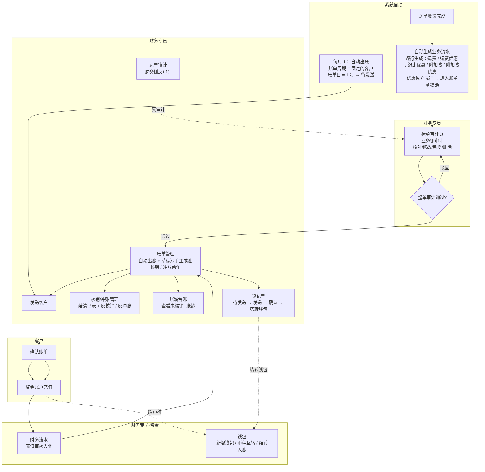
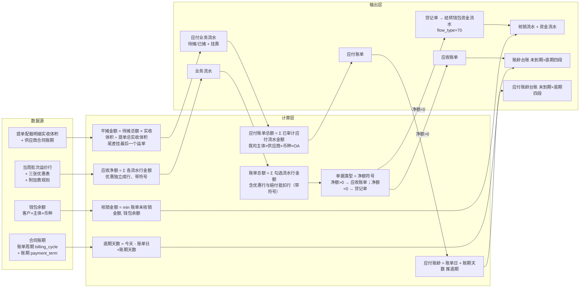
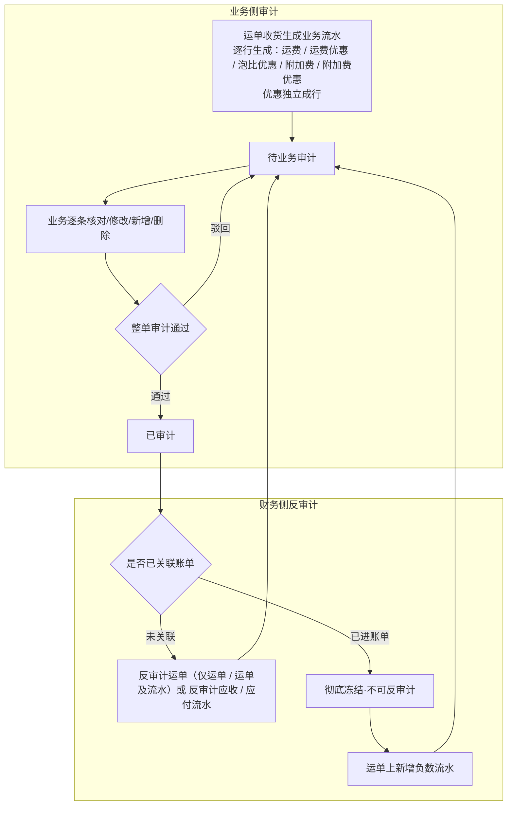
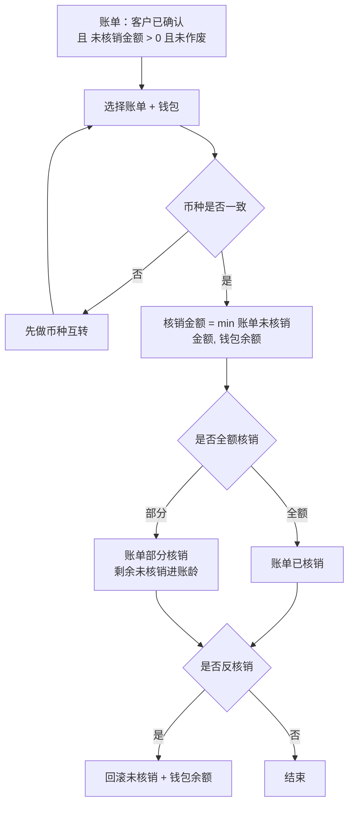

# 需求定义卡片 (RDD) — 财务模块

> **原始需求**：财务是飞点 TMS 的消费方，实现多主体独立核算 + 钱进钱出闭环，消费订单/运单数据完成应收管理、资金账户与账龄管理。
> **文档版本**: v1.11（应收管理 + 资金账户 + 业务流水台账 + 提单平摊应付 + 应付账单 / 应付核销） | **日期**: 2026-09-23 | **作者**: 飞点产品
> **本期范围**：流程一~三「应收管理」+ 流程四「资金账户」+ **流程五「应付管理」（应付业务流水台账 + 应付账单 + 应付核销 + 应付账龄台账）**，共 3 个模块、22 项功能（**赔付入账记录 `credit_record` 随二期赔付管理立项**；**应付业务流水台账已铺开设计，并新增「提单平摊」来源：提单加应付费用 / 批量导入供应商应付流水 → 按实收体积平摊到运单，待摊 / 已摊两态 + 反分摊**；**应付账单按 我司主体 × 供应商 × 币种 × OA审批编号 归集已审计应付流水生成（账单周期固定每月 1 号自动出账），不发送确认、无冲账/贷记单，生成即核销，核销联动我司银行账户出款**）。
> **分期口径**：**应收管理（运单审计 / 应收业务流水 / 账单管理 / 贷记单 / 核销冲账管理 / 账龄台账）、应付管理（应付业务流水 / 应付账单 / 应付核销 / 应付账龄台账）、资金账户（资金账户管理 / 资金流水 / 财务流水）本期均已上线**；**销售成本（`flow_category=30`）= 应收流水物理复制**（费用类型「费用方向」含销售成本时自动复制，本期落地、不参与审计与成账）；**销售提成（提成计算）归二期**；应付对账（供应商对账单核对）、对账中心、毛利分析、开票、赔付管理与赔付入账记录（`credit_record`）归 Phase 2；实际成本核算归 Phase 3。
> **汇率口径**：汇率统一调用阿里汇率接口实时获取（人民币=1 基准），币种互转页以接口值预填、允许财务手工覆盖并留痕（接口汇率 + 实际采用汇率 + 汇率来源三者同存）；一期不记汇损，不自建汇率表。
> **★ 文档分工（去哪看）**：字段结构/类型/约束 → 数据设计；业务规则/校验/计算公式 → PRD；页面规格/字段校验/菜单 → PRD。本 RDD 独有：功能→AC 映射、业务全景与流程、分期与 MVP。本 RDD 字段表「类型」列已删，字段结构以数据设计为准。

## 1. 核心洞察 (Insight)

**真实痛点**：

当前飞点 5 家公司（广州飞点、深圳飞点、广东飞点、香港富力顿、墨链）税务上独立法人、实际一个家族，但财务核算完全依赖线下 Excel。客户打款与应收账单之间靠财务手工核对，钱进来不知道冲哪张账单；账期到了不知道哪些客户逾期、逾期多久；多主体、多币种的资金往来靠手工分账，极易混账。

计费依赖运价模块的当周批次公布价、三张优惠表与附加费规则，但运单收货完成后，应收金额、账单、核销、账龄这一整条链路没有系统承载，财务只能线下追着业务要数据、手工算账。

**JTBD**：

> `财务专员` 雇佣"财务模块"不是为了"记流水账"，而是为了：**当运单收货完成后，能在系统内完成业务流水审计→生成账单→收款核销→账龄跟踪的闭环，且每一笔钱都挂到具体主体和币种，不混账、可追溯。**

> `客户（货主端）` 雇佣"财务模块"不是为了"看数字"，而是为了：**当收到账单后，能在线上确认账单并充值，不用线下反复跟财务对账沟通。**

> `业务专员` 雇佣"财务模块"不是为了"录数据"，而是为了：**当运单收货后，能在「财务中心 → 运单审计」页对业务流水做业务审计（核对 / 修改 / 新增 / 删除），财务侧可反审计，权责清晰。**

**业务价值**：

| 维度 | 当前 | 目标 |
|------|------|------|
| 应收核算 | 线下 Excel 手工算账 | 运单收货自动生成业务流水（**一条费用项一行、优惠独立成行**），业务审计 + 财务反审计 |
| 账单管理 | 财务手工发账单，客户线下对账 | 流水先进**账单草稿池** → 财务聚合已审计流水生成账单 → 发送 → 客户线上确认 |
| 收款核销 | 钱进来手工找账单冲抵 | 钱包池化 + 同币种核销，min(未核销,余额) 防透支 |
| 账龄跟踪 | 人工追账，无逾期预警 | 系统按账单日+账期自动分段，未到期单列+逾期四段 |
| 资金账户 | 多主体多币种手工分账 | 钱包按 客户×主体×币种 隔离，币种互转闭环 |
| 主体隔离 | 打款可能跨主体混打 | 每笔钱强制挂具体主体，钱包层隔离 |
| 应付核算 | 供应商应付靠线下 Excel 手工记 | 应付业务流水（**提单平摊 + 人工添加**）→ 应付账单（我司主体 × 供应商 × 币种 × OA审批编号）→ 应付核销（付款给供应商，联动我司账户出款） |
| 应付账龄 | 供应商账期靠人工追 | 应付账单按账单日 + 账期天数推逾期，未到期单列 + 逾期四段（我司主体 × 供应商 × 币种） |

## 2. 业务全景图

### 2.1 角色与工作节奏

| 角色 | 核心任务 | 频率 |
|------|---------|------|
| 财务专员 | 反审计业务流水、生成账单、收款核销、反核销、币种互转、充值审核、提现 | 日频 |
| 业务专员 | 业务侧审计业务流水（**「财务中心 → 运单审计」页**）、确认业务流水 | 日频 |
| 客户（货主端） | 确认账单、发起充值 | 按需/账期周期 |
| 系统自动 | 运单收货自动生成业务流水、**每月 1 号自动出账**（账单周期 = 固定的客户）、账龄实时计算 | 实时 / 每月 1 号 |

### 2.2 端到端业务链路

```
【应收触发】
  创建每周报价 → 创建运单 → 运单收货完成 → 系统自动生成业务流水
  （运费取当周公布价；运费优惠 / 泡比优惠 / 附加费 / 附加费优惠逐行生成，优惠独立成行）→ 进入账单草稿池
      ↓
【业务审计】
  业务侧核对 / 修改 / 新增流水后**整单审计**（入口 = 「财务中心 → 运单审计」的运单详情 · 应收 / 应付 Tab）→ 财务在同一页可反审计
      ↓
【赔付抵扣 / 贷记单】（负数应收流水，一期口径）
  业务在运单费用 tab 手工新增一条**负数应收流水**（赔付抵扣，金额为负）→ 走运单审计 → 审计通过后进草稿池
  净额 > 0 → 负数流水作账单内「赔付抵扣 −N」随账单抵扣运费；净额 < 0 → 出**贷记单**（我司欠客户，见末尾「贷记单」）
      ↓
【账单生成】
  草稿池 = **已审计且未成账的流水**（逐条流水展示，不按运单聚合）
  ① 自动：**账单周期 = 固定** 的客户由系统**每月 1 号**自动出账（账单日 = 1 号）→ 直接进「待发送」
  ② 手工：财务在「账单管理 → 草稿池」点「生成账单」→ 弹窗里**逐级选 客户 → 我司主体 → 币种 锁定一个组合**，该组合下全部可成账流水**默认全选**（可逐条取消）；只想出其中几条时，先在草稿池**勾选**再进弹窗（快路径）
      ↓
【发送客户】
  财务在「待发送」点「发送客户」→ 客户在货主端「账单管理」确认（异议走线下/工单，财务作废重开）
      ↓
【充值】
  客户在货主端「资金账户」发起充值（金额+币种+打款账户+支付时间+凭证）→ 财务在「财务流水」核对银行流水审核入池
      ↓
【核销 / 冲账】
  财务在「账单管理 → 已发送」Tab 点行内「核销」从钱包扣款冲账单（同币种，min(未核销,余额)，可部分核销/反核销；**核销只动客户钱包、不动我司账户**（现金在充值时已入账）；**结清记录（核销 + 冲账）与反核销 / 反冲账在独立菜单「核销/冲账管理」**）
  客户不付、钱包没钱 → 财务点行内「冲账」认亏平账（坏账冲销，可反冲账）
      ↓
【账龄】
  「账龄台账」按 客户×主体×币种 展示未核销余额 + 账龄四段（未到期单列）
      ↓
【资金账户】
  钱包开通（入驻自动人民币 + 财务手工开通其他币种）→ 币种互转（跨币种核销前）→ 提现
      ↓
【贷记单】（净额 < 0 的负数应收，我司欠客户）
  生成 → 进「待发送」→ 发送客户 → 客户确认（发送满 7 天未确认自动确认）→ 财务「结转钱包」结清（钱包 += |净额|，入钱包即终态、不可撤销；不进核销 / 账龄）
      ↓
【应付触发】
  ① 提单平摊：舱位管理「添加应付费用」/ 应付业务流水「新增应付业务流水」提单级录入落「待摊」→ 按实收体积平摊到运单（已摊）
  ② 人工添加：运单审计「添加应付」/ 应付业务流水手工新增（source=人工添加，走运单审计）
      ↓
【应付审计】
  提单平摊已摊行 → 提单审计（提单级 + 流水级，见 PRD R76）；人工添加 → 运单审计
      ↓
【应付账单】
  应付账单管理按 我司主体 × 供应商 × 币种 × OA审批编号 归集「已审计」应付流水生成供应商账单（不发送确认、无冲账/贷记单）
      ↓
【应付核销】
  应付账单管理「核销」付款给供应商 → 联动我司银行账户出款 → 应付核销管理（付款日志 + 反核销）
      ↓
【应付账龄】
  应付账龄台账按 我司主体 × 供应商 × 币种 展示未结清 + 账龄四段
```

### 2.3 实体依赖关系

```
应收业务流水 (ArFlow) — 应收侧聚合根
  ├── N:1 应收账单 (ArBill)
  ├── N:1 运单 (Waybill) ← 外部引用（运单模块）
  ├── N:1 客户 (Customer) ← 外部引用（客商中心）
  ├── N:1 主体 (Entity) ← 外部引用（基础资料）
  └── 赔付行 = 一条**负数应收流水**（赔付抵扣，金额为负），随账单抵扣运费
      （赔付行是 ArFlow 的一种，不是独立实体：审计、进池、成账、抵扣链路与普通流水完全一致）

应收账单 (ArBill)
  ├── 1:N 应收业务流水 (ArFlow)
  ├── 1:N 收款核销流水 (ArWriteoff)
  └── 备注：**一个运单可关联多张账单**（成账颗粒度 = 流水级；后续新审计通过的流水、赔付抵扣流水天然进下一期）

客户钱包 (CustomerWallet) — 资金侧聚合根
  ├── N:1 客户 (Customer) ← 外部引用
  ├── N:1 主体 (Entity) ← 外部引用
  └── 1:N 资金流水 (WalletFlow)

资金流水 (WalletFlow)
  ├── 1:1 充值申请 (RechargeApply)
  ├── 1:1 收款核销流水 (ArWriteoff)
  └── 1:2 币种互转 (CurrencyTransfer)

我方银行账户 (BankAccount) — N:1 主体，被充值申请引用；同时作为**我司主体资金账户**（「资金账户管理 → 我司账户」）= 双边资金流水的**我司侧落账账户**
币种互转 (CurrencyTransfer) — 1:2 资金流水（转出/转入）
账龄台账 — 纯视图，基于应收账单实时计算，不建表
```

### 2.4 核心业务流程图（泳道图）



### 2.5 核心数据流图



---

## 3. 流程一：应收业务流水与审计（日频）

> **触发**：运单收货完成（**一次性生成**：字段匹配型 + 字段&公式型附加费随收货完成生成、人工添加型由业务手工新增） **频率**：实时自动生成 + 日频审计 **前置依赖**：运单模块收货状态与货物参数、超级运价当周批次运价行 + 三张优惠表 + 附加费规则、客商中心合同账期与客户等级

**3.1 应收业务流水 (ArFlow)** — 运单收货自动生成的逐票应收，粒度=运单，**一条费用项一行（优惠独立成行）**，按费用类型×币种可拆多条

> **As a** 财务专员 **I want to** 运单收货后系统自动生成应收业务流水 **So that** 每票运单的应收金额有系统记录、可追溯

| 字段 | 必填 | 说明 |
|------|------|------|
| 运单号 | ✅ | 引用运单模块，粒度=运单 |
| 客户 | ✅ | 引用客商中心 |
| 主体 | ✅ | 5 账套之一，强制挂主体 |
| 业务流水大类 | ✅ | 应收 / 应付 / 销售成本；**应收（10）、应付（20）均已上线**，**销售成本（30）= 应收流水物理复制**（费用类型「费用方向」含销售成本时自动复制、不参与审计与成账）；销售提成（提成计算）归二期 |
| 流水种类 | ✅ | 运费 / 运费优惠 / 泡比优惠 / 附加费 / 附加费优惠 / 手工新增 —— **一条费用项生成一条流水，优惠独立成行** |
| 费用类型 | ✅ | 引用头程管理费用类型字典（运费/周六派送费/超重费/地址附加费/商品附加费/报关费/库内贴标费…），同方向唯一。**取值来源按流水种类**：运费行=预置费用类型「运费」；运费优惠 / 泡比优惠行=**优惠规则上配置的费用类型**；附加费行与附加费优惠行=**该附加费规则计价明细「应收」行的费用类型** |
| 币种 | ✅ | 运费币种来自报价，附加费币种来自附加费规则，可跨币种 |
| 单价 | ✅ | 本行单价（带符号）：运费行=当周公布价、附加费行=应收单价、优惠行=优惠值（负=减钱、正=加价）；手工新增行：附加费必填（金额 = 单价 × 计费量）、非附加费**选填**（填了 → 金额 = 单价 × 计费量；未填 → 直接填金额） |
| 计价单位 | ✅ | 票 / 箱 / KG / m³ / 数量。**来源跟着规则走**：运费 / 运费优惠 / 泡比优惠行 = 运单所关联服务组合的计费方式；附加费 / 附加费优惠行 = 该条附加费规则的计价单位。**新增应收 / 销售成本手工流水时必填**；应付流水无计价单位（不落此字段） |
| 计费量 | 否 | 计费数量（重量/体积/箱数/张数）；按票计费=1；关联附加费规则按数量计费时由业务填写；非附加费手工新增行计费量必填 |
| 金额 | ✅ | **金额口径分两种**：附加费 = 单价 × 计费量（自动算）；非附加费手工新增 = 计费量必填、单价选填（填了单价 → 金额 = 单价 × 计费量自动算；未填单价 → 直接填金额）。**带符号**：费用行为正；优惠行为负=减钱 / 正=加价。**运单应收净额与账单金额 = 各行金额的代数和** |
| 汇率 | ✅ | 调阿里汇率接口实时获取，人民币=1，不参与金额计算 |
| 描述 | 否 | **面向客户的说明**（货主端可见），如「超重超长按实测尺寸计收」 |
| 备注 | 否 | **仅内部可见**（货主端不展示） |
| 拣货时间 | 否 | **该行所属运单的收货完成时间**（运单级属性落在行上）：收货完成生成时直接写入（含人工添加行）；人工添加时后端取运单收货完成时间写入。**两端均展示**（为空显示「—」） |
| 创建日期 | ✅ | 该行创建时间，**后端自动写入**（系统生成=生成时间 / 人工新增=提交时间）；**前端不展示**（两端一致），仅后台追溯与取数用 |
| 来源类型 | ✅ | 10 系统自动计算（收货/拣货/重算生成）/ 20 人工添加 —— **决定该行的可编辑字段范围**（系统自动行仅可改 描述 / 备注，人工添加行可改全部字段） |
| 数据来源 | ✅ | 报价 / 规则名 / 人工添加（只记第一次来源，后续变更不变）；**货主端不展示** |
| 来源规则 | 否 | 命中的规则类型 + 规则ID + **规则名快照**（运价行 / 运费优惠规则 / 泡比优惠规则 / 附加费规则 / 附加费优惠规则），**用于运单审计下钻「这笔钱是哪条规则给的」**；手工新增留空。**员工端列表不展示、收进行详情；货主端不展示** |
| 创建人 | ✅ | 系统生成显示「系统自动」、人工添加显示操作人；**货主端不展示** |
| — | — | **到期日期 / 账单日 / 账期天数 / 签约账期与天数·号 均为「账单」级字段**（见流程二账单实体表），**流水上不存**；不在运单费用流水页展示（员工端与货主端一致） |
| 审计状态 | ✅ | **待业务审计 / 已审计（只有两态）** |
| 业务审计人/时间 | 否 | 业务侧「运单审计」页整单审计留痕 |
| 财务审计人/时间 | 否 | 财务侧「运单审计」反审计留痕 |
| 关联账单ID | 否 | 生成账单后回填（流水级关联，可跨期跨年） |

> 应收业务流水业务规则见 PRD §6.1：R01（计费触发点）/ R02（流水取价）/ R03（流水构成与费用类型）/ R04（金额与应收净额）/ R05（数量计费）/ R06（数据来源）/ R07·R08·R10（审计与反审计）/ R51（优惠取数）/ R52（一次性生成）/ R53（重算与冻结）/ R54（幂等去重）/ R55（计价单位来源）/ R56（取数入参）/ R57（到期日算法）/ R58（编辑字段范围）/ R59（拣货时间与创建日期）/ R60（手工新增）/ R61（两层审计与冻结边界）/ R62（多币种折合）/ R70·R72（贷记单）。

**相关 AC**：`AC1-生成` `AC2-审计` `AC3-反审计` `AC4-费用调整`

**3.2 核心场景（反审计规则，以是否关联账单为界）**

```
场景：业务流水纠错（财务反审计）
  1. 未关联账单 → 可反审计运单（仅运单 / 运单及流水）或按方向反审计应收 / 应付流水 → 业务直改后重新审计
  2. 已进账单 → **彻底冻结、不可反审计** → 要冲减则在运单上**新增一条负数流水**（走运单审计）
                  → 于**下一期账单**抵扣，原账单金额不追溯
```

**3.3 关键操作流程图（单审计 + 反审计）**



**3.4 业务流水台账（应收 / 应付两个菜单）**

> **As a** 财务专员 **I want to** 在一个页面按流水本身（而非按运单 / 账单容器）查全量业务流水 **So that** 对账 / 查账 / 追溯不用再跨「运单审计 → 草稿池 → 账单详情」三处拼

**定位**：员工端**全量台账**，跨容器（**待审计 / 已审计未成账 / 已进账单 / 作废释放**）全量展示，**能筛能钻**；**应收台账另承载「新增流水 / 导入（文件）/ 删除」三个写动作 + 勾选批量「审计 / 反审计」**（新增流水 = 批量把流水导入运单、同运单审计「新增流水」R60；导入 = 上传文件批量导入流水、R75；删除 = 删流水、同运单审计「删除」R61，**已进账单 / 已审计不可删**；审计 / 反审计 = 勾选流水批量审计 / 反审计、同运单审计「流水级审计 / 反审计」R61，**已关联账单不可审计 / 反审计、未审计可审计不可反审计**）。成账 / 结算仍各归原位。**分工**：同一张 `ar_flow` 按三种维度打开、各司其职 —— 运单审计（按运单，改账 + 审计）、草稿池（按出账，成账工作台）、应收业务流水（按流水本身，全量查账 + 批量导 / 删 / 补 + 勾选批量审计）；草稿池是本页的「已审计 + 未成账」子集、任务是出账，与本页「字段有重叠、任务不同、不合并」。

**两个菜单**：
- **应收业务流水**（`flow_category = 10 应收`）：一期即有全量数据；工具栏「**新增流水 / 导入 / 审计 / 反审计 / 导出 / 删除**」+ 行操作「**详情**」
- **应付业务流水**（`flow_category = 20 应付`）：**应付管理台账页**，**一期承载「提单平摊」应付来源**（待摊 / 已摊两态）；工具栏「**新增应付业务流水 / 批量导入分摊 / 导出 / 删除**」+ 行操作「**详情**」

**查询维度**（应收台账）：客户昵称 / 客户编号 / 我司主体 / 币种 / 费用类型 / 审计状态 / 账单状态（未成账 / 已进账单）/ 运单号 / 客户单号 / 拣货时间区间

**列表列**：流水号 → 运单号 → 客户编号 → 客户昵称 → 客户名称 → 销售代表 → 我司主体 → 账单编号 → 费用类型 → 审计状态 → 币种 → 汇率 → 单价 → 计价单位 → 计费量 → 金额（带符号）→ 创建人 → 备注 → 描述 → 拣货时间 → 创建时间；来源规则 / 数据来源收进「行详情」

**查询维度（应付台账）**：供应商 / 运单号 / 费用类型 / OA审批编号 / 币种 / 账单状态 / 提单号 / 转单号 / 业务时间

**列表列（应付台账）**：流水号 → OA审批编号 → 供应商 → 运单号 → 提单号 → 费用类型 → 审计状态 → 转单号 → 币种 → 汇率 → 费用（原币金额）→ 费用（本币金额）→ 备注 → 描述 → 账单编号 → 创建人 → 业务时间→ 创建时间；**转单号 = 运单关联的快递主单号**、**业务时间 = 业务发生日期（YYYY-MM-DD）**

**下钻**：运单号 → 运单审计详情；账单号 → 账单详情；行详情 → 来源规则（「这笔钱哪条规则给的」）；工具栏「审计 / 反审计」= 勾选流水的流水级批量审计 / 反审计（R61）

**数据**：直接查 `ar_flow`，**不建新表、不建新状态机**；与运单审计（写 + 审计）、草稿池（成账）、账单详情（结算）各管一摊，**互不取代**；应收台账的「新增流水 / 导入（文件）/ 删除 / 勾选批量审计与反审计」复用 R60 / R61 / R75，不新增状态机

**相关 AC**：`AC23-应收业务流水台账` `AC24-应付业务流水台账` `AC25-提单平摊应付`

**3.5 提单平摊应付（应付业务流水的来源之一）**

> **As a** 财务专员 **I want to** 把按提单（整柜）向供应商结算的应付费用（海运费 / 港杂费等）按实收体积平摊到该提单下各运单 **So that** 每个运单能归集到应摊的应付成本、应付业务流水不用逐票手工录入

**定位**：应付业务流水除「运单审计 / 应付业务流水页手工新增」外，新增「提单平摊」来源 —— 财务先在提单（舱位管理）上记一笔提单级应付费用（**待摊**），再按「各运单实收体积 ÷ 提单总实收体积」批量平摊到运单，生成运单级应付流水（**已摊**）。**金额守恒、只出现一次**：待摊与已摊不并存计金额。

**两条录入路径**：
- **路径 A（提单手工加）**：提单页「财务信息」手工加应付费用（费用类型 × 总额 / 币种 / 汇率 / 供应商 / OA审批编号）→ **默认「自动平摊」保存即摊到运单（可关，关后点「批量平摊」）** → 生成运单应付流水。
- **路径 B（批量导入）**：「应付业务流水」菜单批量导入供应商应付流水到提单（Excel 粒度 = 提单号 × 费用类型 × 金额 / 币种）→ 自动批量分摊 → 生成运单应付流水。

> 平摊 / 反分摊规则见 PRD R76（平摊原子性、三道前置、反分摊条件）。

**数据**：复用 `ar_flow`（`flow_category = 20` + 分摊状态「待摊 / 已摊」），`source_type = 30 提单平摊`，不建新表；平摊取数来源 = 头程管理「提单配载明细」实收体积（见数据设计「提单平摊应付」节）。

**审计归属与冻结边界**：见财务 PRD **R76**（审计归属看 `source_type` + 分摊状态、两层审计、平摊 / 撤销平摊三道前置、挂靠编辑权限、成账口径的完整规则）。

## 4. 流程二：账单生成与客户确认（账期周期）

> **触发**：① 系统每月 1 号自动出账（账单周期 = 固定的客户）② 财务手工成账（账单周期 = 不固定的客户） **频率**：每月 / 按需 **前置依赖**：流程一已审计的业务流水

**4.1 应收账单 (ArBill)** — 系统自动出账或财务手工聚合**已审计**流水，**客户 + 我司主体 + 币种** 各一张（不跨币种折合）

> **As a** 财务专员 **I want to** 聚合已锁定流水生成账单并发送客户 **So that** 客户能确认应收金额

| 字段 | 必填 | 说明 |
|------|------|------|
| 账单号 | ✅ | 唯一，规则 `AR-{主体代码}-{年月}-{5 位序号}`，**序号零填充 5 位、按 主体 × 账期月 每月从 `00001` 重置**（主体代码：广州GZ/深圳SZ/广东GD/香港HK/墨链ML） |
| 客户 | ✅ | 引用客商中心 |
| 主体 | ✅ | 5 账套之一 |
| 币种 | ✅ | 同币种聚合 |
| 账单日 | ✅ | 自动出账 = **每月 1 号**（跑批日）；手工出账 = 财务指定，**默认生成当月自然月末** |
| 到期日期 | ✅ | **最后支付日**，按「签约账期 + 合同天数/号」推导 —— 按月类取账单月（账单日所在月 + 结算月）的第 N 号、按天类 = 账单日 + N − 1 天；事件型推不出 → 不允许出账（见业务规则⑨） |
| 账期天数 | ✅ | 账单级快照 = **到期日 − 账单日 + 1**（账龄台账按 账单日+账期天数 起算，公式不变）；由到期日反推，**仅供账龄、页面不展示** |
| 签约账期 + 天数/号 | ✅ | 生成账单时从合同快照：签约账期（101 月结 / 102 双月结 / 103 三月结 / 201 周结 / 202 到港前结 / 203 签收月结 / 204 到海外仓结 / 205 签收结）+「天数/号」；**账单页「账期」列 = `{签约账期}+{天数/号}`**（如 `月结+15`、`月结+30`；**「天数/号」是合同上的数字字段（1–31），只有数字、没有「月末 / 月初」这类文字值**；`0` / 空 = 未填 → 账期视为未完善，不允许出账） |
| 生成来源 | ✅ | 系统自动（每月 1 号跑批）/ 财务手工（草稿池勾选成账） |
| 账单总额 | ✅ | Σ 勾选流水各行金额（代数和，含优惠行、赔付抵扣行的带符号金额） |
| 已核销金额 | ✅ | 核销累加，默认 0 |
| 未核销金额 | ✅ | 账单总额 − 已核销 |
| 发送状态 | ✅ | 未发送 / 已发送 |
| 确认状态 | ✅ | 未确认 / 已确认 |
| 核销状态 | ✅ | 未核销 / 部分核销 / 已核销 / 已反核销 |
| 作废标记 | ✅ | 正常 / 已作废（终态） |
| 生成人/时间 | 否 | 财务操作留痕 |
| 发送时间 | 否 | 发送客户时间 |
| 客户确认时间 | 否 | 货主端确认回填 |
| 作废人/时间 | 否 | 财务作废留痕 |
| 作废原因 | 否 | 作废时可填，备查 |

> 账单业务规则见 PRD R11（草稿池与成账）/ R12（账单号）/ R13（账单金额）/ R14（账单日·账期·到期日）/ R15（发送）/ R16（确认）/ R17（Tab 归类）/ R63（作废重开）/ R66（待发送编辑）/ R65（自动出账）/ R71（导出）/ R69（批量发送）/ R72（单据类型）；已进账单费用调整见 R09。

**相关 AC**：`AC5-生成` `AC5a-作废与重开` `AC5b-自动出账` `AC6-发送` `AC7-确认` `AC20-账单导出`

## 5. 流程三：收款核销与账龄台账（日频）

> **落点**：核销的入口在「**账单管理 → 已发送**」Tab 的行内「核销」按钮（+ 工具栏「批量核销」）；**结清记录（核销 + 冲账）与反核销 / 反冲账在独立菜单「核销/冲账管理」**（原独立菜单「收款核销」已下线，见 PRD §5.3 / §5.13）。

> **触发**：客户打款入池、财务核销 **频率**：日频 **前置依赖**：流程二已确认账单、流程四钱包余额

**5.1 结清记录 (ArWriteoff)** — 财务核销/冲账/反核销/反冲账记录，留痕可审计

> **As a** 财务专员 **I want to** 从钱包扣款冲抵账单 **So that** 账单未核销金额减少、钱账对应

| 字段 | 必填 | 说明 |
|------|------|------|
| 账单号 | ✅ | 被核销账单 |
| 钱包 | ✅ | 扣款钱包（客户×主体×币种） |
| 币种 | ✅ | 强制同币种 |
| 核销金额 | ✅ | min(账单未核销金额, 钱包余额) |
| 核销类型 | ✅ | 核销 / 反核销 |
| 核销前/后账单未核销金额 | ✅ | 留痕 |
| 核销前/后钱包余额 | ✅ | 留痕 |
| 操作人/时间 | ✅ | 财务 |
| 关联资金流水ID | 否 | 核销→资金流水联动 |
| 被反核销 / 反冲账的原结清ID | 否 | 反核销 / 反冲账指向原结清记录 |

> 核销业务规则见 PRD R67（前置条件）/ R18（币种约束）/ R19（金额上限）/ R20（结果）/ R21（维度流转）/ R22（资金流水）/ R23（反核销）/ R68（批量核销）。

**5.2 账龄台账** — 纯视图，不建表，基于应收账单实时计算

| 字段 | 必填 | 说明 |
|------|------|------|
| 维度 | ✅ | 客户 × 主体 × 币种 |
| 未核销总额 | ✅ | Σ 未核销金额 |
| 未到期金额 | ✅ | 单列 |
| 逾期 0-30/31-60/61-90/90+ | ✅ | 逾期四段 |

> 账龄业务规则见 PRD R24（范围）/ R25（分段）/ R26（维度），起算公式见 PRD §7.5。

**相关 AC**：`AC8-核销` `AC9-部分核销` `AC10-反核销` `AC11-账龄`

**5.3 关键操作流程图（收款核销决策）**



**5.4 冲账（坏账冲销）**

> **As a** 财务专员 **I want to** 把客户不付、钱包没钱、收不回来的烂账认亏平掉 **So that** 未核销金额清 0、账龄不再虚高

> 冲账 / 反冲账业务规则见 PRD R73（尾款冲账）/ R74（反冲账）；准入同核销见 R67。

**相关 AC**：`AC21-冲账` `AC22-反冲账`

## 6. 流程四：资金账户与钱包（日频）

> **触发**：客户入驻、充值、跨币种结算、提现 **频率**：日频/按需 **前置依赖**：客商中心入驻、阿里汇率接口（实时汇率）、我方银行账户

**6.1 客户钱包 (CustomerWallet)** — 钱包 = 客户 × 主体 × 币种，钱进池子即混同，只认币种余额

> **As a** 财务专员 **I want to** 管理客户钱包并做币种互转 **So that** 多主体多币种的资金隔离且可跨币种结算

| 字段 | 必填 | 说明 |
|------|------|------|
| 客户 | ✅ | 引用客商中心 |
| 主体 | ✅ | 5 账套之一 |
| 币种 | ✅ | 联合唯一 (客户,主体,币种) |
| 账户名称 | ✅ | 全局唯一；格式=账号编号+空格+币种代码 |
| 余额 | ✅ | 不可透支，乐观锁控制 |
| 开通方式 | ✅ | 系统自动（合同签约完成）/ 财务手工；员工端列表展示 |
| 开通时间 | ✅ | 钱包创建时间 |
| 是否默认钱包 | ✅ | 系统字段；**员工端与货主端均不展示**（后台保留），二期在线付款的「默认支付钱包」预留 |

> 钱包业务规则见 PRD R27（唯一性）/ R28（账户名称）/ R29（自动开通）/ R30（池化）/ R46（手工开通主体边界）/ R47（币种边界）/ R48（生命周期与合同解耦）/ R49（默认币种）/ R50（解约主体提示）。

**6.2 我方银行账户 (BankAccount)** — 每主体各自开户，一主体可多账户

| 字段 | 必填 | 说明 |
|------|------|------|
| 主体 | ✅ | 每主体可多账户 |
| 账户名称 | ✅ | 开户名 |
| 账号 | ✅ | 全局唯一，创建后不可修改 |
| 开户行 | ✅ | — |
| SWIFT/BIC | 否 | 境外打款用，非人民币账户建议填写 |
| 币种 | ✅ | 单币种账户 |
| 账面余额 | ✅ | 财务手工维护的账面余额，非银行实时余额，默认 0 |
| 用户是否可见 | ✅ | 是 → 客户在货主端充值的打款账户下拉可见该账户 |
| 是否默认 | ✅ | 客户打款默认账户；同一主体+币种仅一个，且必须可见 |
| 状态 | ✅ | 启用 / 停用 |

> 银行账户业务规则见 PRD R39（账号唯一 / 停用 / 默认打款账户 / 可见开关）；账面余额随双边资金流水自动核算，口径见 PRD §7.8。

**6.3 资金流水 (WalletFlow)** — 钱包资金进出痕迹，事实记录不可改（出错靠反向流水）；**双边记账**（客户钱包侧 + 我司账户侧）

| 字段 | 必填 | 说明 |
|------|------|------|
| 流水编号 | ✅ | 唯一，规则 `WF + yyyyMMdd + 3位序号`（跨流水类型统一序列、按发生顺序递增） |
| 钱包 | ✅ | 关联钱包 |
| 流水类型 | ✅ | 充值/充值退回/提现/**收款核销/收款核销撤销**/转汇/**贷记单入账**/**冲账/冲账撤销** |
| 币种 | ✅ | 同钱包币种 |
| 入账金额 | ✅ | 正=入、负=出 |
| 变动前/后余额 | ✅ | 留痕 |
| 我司账户 | 否 | **双边记账的我司侧落账账户**（bank_account）；核销/冲账/转汇/贷记单结转为空 |
| 我司账户入账金额 | 否 | 正=入负=出；仅充值/代充/提现/充值退回非 0 |
| 我司账户余额（前/后） | 否 | 留痕；我司账户余额 = 时间最新一条 |
| 关联充值/核销/转汇 | 否 | 按流水类型挂载：充值/充值退回↔充值申请，**收款核销/收款核销撤销**↔收款核销单（1:1），转汇↔币种互转（1:2 出/入两条） |
| 支付时间 | 否 | 客户实际打款时间，仅充值/代充落值（货主端充值审核通过时由充值申请回填、代充财务录入）；其余类型支付时间 = 创建时间，不单独存 |
| 操作人/时间 | ✅ | — |

**6.4 币种互转 (CurrencyTransfer)** — 独立表，记录转出/转入两币 + 汇率

| 字段 | 必填 | 说明 |
|------|------|------|
| 转汇单号 | ✅ | 唯一，规则 TR+yyyyMMdd+序号 |
| 转出钱包/币种/金额 | ✅ | 转出侧 |
| 转入钱包/币种/金额 | ✅ | 转入侧 |
| 接口汇率 | ✅ | 阿里汇率接口实时返回值，留痕不可改 |
| 汇率 | ✅ | 实际采用汇率，默认=接口汇率，可财务手工覆盖 |
| 汇率来源 | ✅ | 接口实时 / 手工覆盖 |

> 币种互转业务规则见 PRD R36（互转）/ R37（汇率留痕）；公式见 PRD §7.6。

**6.5 充值申请 (RechargeApply)** — 客户货主端发起，财务审核入池

| 字段 | 必填 | 说明 |
|------|------|------|
| 客户/主体/币种 | ✅ | 充到哪个钱包 |
| 金额 | ✅ | — |
| 打款账户 | ✅ | 引用我方银行账户 |
| 打款凭证 | ✅ | 银行回单截图/PDF |
| 支付时间 | ✅ | 客户实际打款时间（到账日） |
| 状态 | ✅ | 待审核/已通过/已驳回 |
| 审核人/时间 | 否 | 财务线下核对银行流水后审核留痕 |
| 关联资金流水 | 否 | 审核通过后生成充值流水 |

> 充值 / 提现 / 代充业务规则见 PRD R31（充值申请）/ R32（审核通过）/ R33（驳回）/ R34（代客户充值）/ R35（客户提现）。

**6.6 货主端资金账户页（主体×币种表格）**

> 客户在货主端「资金账户」查看资金账户总览，维度 = 主体 × 币种。页面分页签：账户余额 / 资金流水 / 充值记录；合同签约完成时系统自动开通的人民币钱包（余额 0）也展示。

| 字段 | 说明 |
|------|------|
| 账户主体 | 生成钱包时的合同签约主体 |
| 币种 | 钱包币种；默认人民币（各主体统一，含香港富力顿），其他币种由财务手工开通 |
| 账户名称 | 账号编号 + 币种代码，全局唯一 |
| 余额 | 充值金额 − 核销扣减后的剩余金额 |
| 未核销金额 | 客户已确认账单但财务未核销的账单总金额 |
| 待确认账单 | 财务已出账单但客户未确认的账单总金额 |
| 实际金额 | 余额 − 未核销金额；负数红色带负号，正数正常色 |

**6.7 赔付（理赔）抵扣**

> 我司赔付给客户的金额（超时赔付 / 丢件赔付 / 货损赔偿）**不打款到客户银行账户**，而是以一条**负数应收流水**随账单抵扣运费。

**触发（一期手工）**：业务在运单费用 tab **手工新增一条负数应收流水**（费用类型选超时赔付 / 丢件赔付 / 货损赔偿等赔付类费用类型），金额填**负数**。

> 赔付（理赔）抵扣业务规则见 PRD R40。

**相关 AC**：`AC5-生成` `AC5a-作废与重开` `AC5b-自动出账` `AC18-赔付抵扣`
---

## 7. 流程五：应付管理（应付账单 + 应付核销 + 应付账龄，账期周期）

> **落点**：应付管理 = 应付业务流水（§3.4 台账 + §3.5 提单平摊）→ 应付账单（归集生成）→ 应付核销（付款给供应商）→ 应付账龄（催付视图）。**应付流水本身的台账与提单平摊正文见 §3.4 / §3.5**，本节收敛「应付账单 / 应付核销 / 应付账龄」三个环节的实体与规则。

> **触发**：供应商应付流水已审计待成账 → 归集生成应付账单 → 付款核销 **频率**：账期周期（固定账期供应商每月 1 号自动出账）**前置依赖**：流程一~四应收 / 资金账户、头程管理提单平摊应付、客商中心供应商有效合同

**7.1 应付账单 (ApBill)** — 供应商账单，我司应付给供应商的归集单据

> **As a** 财务专员 **I want to** 按 我司主体 × 供应商 × 币种 × OA审批编号 归集「已审计」应付流水生成一张供应商账单 **So that** 应付给供应商的钱有单据凭证、能核销付款、能算账龄

| 字段 | 必填 | 说明 |
|------|------|------|
| 账单号 | ✅ | `AP-{主体代码}-{yyyyMM}-{5 位序号}`，每月按我司主体从 00001 重置 |
| 供应商 | ✅ | 应付流向的供应商 |
| 我司主体 | ✅ | 归集键之一，来源 = 供应商有效合同签约主体 |
| 币种 | ✅ | 不跨币种折合 |
| OA审批编号 | ✅ | 归集键之一，对应财务 OA 审批单 |
| 生成来源 | ✅ | 系统自动（每月 1 号跑批）/ 财务手工（「生成应付账单」弹窗 4 维归集） |
| 账单日 / 到期日 | ✅ | 自动出账 = 1 号；手工默认当月月末；到期日 = 账单日 + 供应商合同账期 |
| 账期快照 | 条件 | 签约账期 + 天数/号，生成时从供应商合同快照；账期段为空不允许出账 |
| 账单金额 / 已核销 / 未结清 | ✅ | 账单金额 = Σ 明细应付流水金额（正数）；未结清金额 = 账单金额 − 已核销金额，= 0 即已核销 |
| 核销状态 | ✅ | 未核销 / 部分核销 / 已核销（按未结清金额派生） |
| 作废标记 | ✅ | 正常 / 已作废（终态，仅未核销可作废） |

> 应付账单业务规则见 PRD R77（生成归集）/ R82（自动出账）/ R83（明细增删）/ R80（作废）。

**相关 AC**：`AC26-应付账单生成` `AC26b-应付业务流水挂我司主体` `AC26c-应付账单自动生成` `AC28-应付账单作废` `AC28b-应付账单明细增删`

**7.2 应付核销 (ApWriteoff)** — 付款给供应商的留痕（核销单）

> **As a** 财务专员 **I want to** 对已生成的应付账单付款给供应商并留痕 **So that** 应付结清、我司银行账户出款有据可查、可反核销纠错

| 字段 | 必填 | 说明 |
|------|------|------|
| 核销单号 | ✅ | `APW + YYYYMMDD + 序号`（与应收核销 WO 分列两套序列） |
| 应付账单 | ✅ | 关联 `ap_bill`，一个账单可多次部分核销 |
| 出款账户 | ✅ | 我司银行账户，按「我司主体 × 币种」过滤启用 |
| 核销金额 | ✅ | ≤ 未结清金额 且 ≤ 出款账户余额（不可透支），默认 = 未结清金额 |
| 类型 | ✅ | 核销 / 已反核销 |
| 四快照 | ✅ | 核销前后账单未结清金额 + 出款账户余额（留痕闭合校验） |
| 凭证 / 备注 | 否 | 银行转账回单 / 内部留痕 |

> 应付核销 / 反核销业务规则见 PRD R78（核销联动资金账户）/ R79（反核销）。

**相关 AC**：`AC27-应付核销 + 反核销`

**7.3 应付账龄台账** — 我司欠供应商的账龄视图（实时，不建表）

> **As a** 财务专员 **I want to** 按 我司主体 × 供应商 × 币种 看未结清应付账单的账龄 **So that** 催付 / 安排付款有优先级依据

> 应付账龄口径见 PRD R84（判据 / 分桶 / 维度）。

**相关 AC**：`AC26d-应付账龄台账`

**核心场景**：

- **月结自动出账**：供应商合同 `billing_cycle = 固定` → 每月 1 号 00:30 系统跑批，按 主体×供应商×币种×OA 归集「已审计 + 未成账」应付流水 → 生成应付账单（账单日 = 1 号）→ 财务在「应付账单管理 → 待核销」核对 → 行内「核销」选我司出款账户付款 → 账单未结清金额减少、账户余额扣减 → 未结清金额 = 0 即已核销、自动出账龄。
- **付款纠错**：付款后发现金额错误 → 财务在「应付核销管理」行内「反核销」→ 账单未结清金额回补、账户余额回补、新增一条「已反核销」记录 → 重新核销正确金额。

## 8. 验收标准总览 (AC)

### 流程一：应收业务流水与审计
#### AC1 生成

运单收货完成后，系统自动生成应收业务流水——**运费 / 运费优惠 / 泡比优惠 / 各命中附加费 / 各命中附加费优惠逐行生成**（优惠独立成行、费用类型取优惠配置的费用类型），金额 = 单价 × 计费量；同时写入**拣货时间**（运单收货完成时间，收货完成直接写入）与**创建日期**（后端自动，运单费用流水页不展示、账单草稿池展示）并留痕**来源类型 / 来源规则（含规则名快照）/ 创建人**；流水全部进入**账单草稿池**（到期日期是账单级字段，在账单生成时按 AC5b 口径推算）
#### AC2 审计

业务侧逐条核对/修改/新增/删除后整单审计通过，该方向流水统一锁定为已审计 + 写运单级标记（整票不允许再新增该方向费用）；流水级审计（勾选逐条）只动该条、不动运单标记
#### AC3 反审计

仅财务可反审计；运单级按方向 × 深度（「仅运单」只反标记、原流水仍锁定，「运单及流水」反标记 + 该方向流水回待业务审计）、流水级勾选逐条反审计；已进账单的流水不可反审计；业务需通过工单或线下申请
#### AC4 已进账单的费用调整

已进账单的流水**彻底冻结、不可反审计**（反审计被阻断并提示）；冲减靠在该运单**新增一条负数流水**（走运单审计）→ 进草稿池 → **下一期账单抵扣**；原账单金额**不追溯调整**
#### AC23 应收业务流水台账

「应收业务流水」菜单按 客户 / 我司主体 / 币种 / 费用类型 / 审计状态 / 账单状态（未成账 / 已进账单）/ 运单号 / 客户单号 / 拣货时间 全维度筛选，**跨容器全量**展示（待审计 / 已审计未成账 / 已进账单 / 作废释放全部流水），列表给出 金额合计 + 按币种小计；运单号可跳「运单审计」详情、账单号可跳「账单管理」详情、行详情可看来源规则；**工具栏「新增流水」批量把流水导入运单（运单「应收」已整票审计的不可新增）、「导入」上传文件批量导入流水（R75，失败行不落库）、「删除」勾选删流水（已进账单 / 已审计不可勾选不可删）、「导出」纯读导出 + 「审计 / 反审计」勾选批量（已关联账单不可勾选，未审计可审计不可反审计、已审计可反审计不可删）**（R60 / R61 / R75）
#### AC24 应付业务流水台账

「应付业务流水」菜单展示 `flow_category = 20 应付` 全量流水（**18 个业务字段**：流水号 / OA审批编号 / 供应商 / 运单号 / 提单号 / 费用类型 / 审计状态 / 转单号 / 币种 / 汇率 / 费用（原币金额）/ 费用（本币金额）/ 备注 / 描述 / 账单编号 / 创建人 / 业务时间/ 创建时间）+ 工具栏「新增应付业务流水 / 批量导入分摊 / 导出 / 删除」（**新增同运单审计、批量导入分摊见 AC25、导出校验勾选、删除仅限待业务审计**）

#### AC25 提单平摊应付

应付业务流水新增「提单平摊」来源：① **提单手工加**（提单页「财务信息」加应付费用 → 批量平摊）；② **应付业务流水新增**（提单级录入落待摊 → 平摊）；③ **批量导入**（应付业务流水菜单导入供应商应付流水到提单 → 自动批量分摊）。平摊按「各运单实收体积 ÷ 提单总实收体积」分摊提单级应付总额，**尾差挂最后一个运单、该条描述备注「含尾差」**；生成运单应付流水（`source_type = 30 提单平摊`、`amortize_status = 已摊`、审计状态 = **待审计**、走提单审计）；**反分摊** = 该流水未审计（流水级）+ 未关联账单的平摊流水可批量删除、退回提单「待摊」改金额重摊；**金额守恒、待摊与已摊不并存计金额**。**审计归属看 `source_type` + 分摊状态**（`source_type=30` 已摊行走提单审计、待摊行不可审计；`source_type=20 人工添加` 走运单审计，运单审计「添加应付」填了提单号仍属 20、仍走运单审计）；**提单审计两层**（提单级管新增 / 平摊、流水级管撤销 / 删除）；**提单侧只读镜像**（待摊行提单侧可改删、已摊 / 挂靠行提单侧只读、改删回运单侧）

### 流程二：账单生成与客户确认
#### AC5 生成

账单管理两条路径 —— ① **自动出账**：账单周期 = 固定的客户由系统每月 1 号自动生成账单并直接进「待发送」（见 AC5b）；② **手工成账**：账单周期 = 不固定的客户由财务在「账单管理 → 草稿池」（**流水级列表**）点「生成账单」→ 弹窗里**逐级选 客户 → 我司主体 → 币种 锁定一个组合**，该组合下全部可成账流水**默认全选**、可逐条取消（要只出其中几条时，在弹窗里逐条取消勾选 —— **草稿池不设勾选列**）。草稿池 = 已审计且未关联账单的流水，**未审计流水不进池、也不给未审提示**；**不跨币种折合**（混币种运单拆多张账单）；账单号唯一、手工出账账单日默认生成当月自然月末；合同账期段为空 / 推不出到期日时**不允许出账**（阻断，**不做补录**）。**待发送阶段可编辑账单**（账单还没发给客户，尚未形成对客承诺）：删流水（只剩 1 条时不给删）/ 从草稿池**加流水**（同客户 × 主体 × 币种、已审计未成账）/**改账单日期**（改动只进草稿 → 到期日**实时预览 + 未保存标记** → 点弹窗底部「保存」才落库，同步重算到期日与账期天数，跨月则账单号按新账期月重新分配）；三种编辑都在**操作时间线**留一条记录（事件「编辑账单」，只记时间 / 操作人 / 动作类型，不记增减了几条流水）；已发送后只能作废重开
#### AC5a 作废与重开

未核销账单可作废 —— **作废弹窗内「作废原因」必填**（留空或纯空格阻断「请填写作废原因」），确认后作废人 / 作废时间 / 作废原因落到账单上并在**账单详情的「操作时间线」**可见 → 其下流水释放回草稿池、可重新组账（生成新账单号）；**已有核销记录（部分核销 / 已核销）的账单作废被阻断**并提示先反核销；作废后账单不出现在货主端、不进账龄台账、账单号不回收；**已进账单的费用调整**按「原金额不追溯 + 新增负数流水 + 下期抵扣」执行
#### AC5b 自动出账

账单周期 = 固定（月结 / 双月结 / 三月结）的客户**每月 1 号**由系统自动出账，账单日 = 1 号、生成来源 = 系统自动、**发送状态 = 未发送 / 确认状态 = 未确认 / 核销状态 = 未核销 / 作废标记 = 正常**，**直接出现在「待发送」（无需财务确认）**；账单周期 = 不固定（周结 / 到港前结 / 签收月结 / 到海外仓结 / 签收结）的客户**不参与自动出账**；组内无可成账流水 → 不生成 0 元空账单；合同账期段为空或 `payment_term` 不为 101/102/103 → **跳过该组、页面不给提示**（该组流水留在草稿池，「账期」列实时显示「待补录」）；同 客户×主体×币种 同月重复跑批**不产生第二张账单**（幂等）；**月结/双月结/三月结只影响账单月**（账单日所在月 +0 / +1 / +2 个月），到期日 = 该账单月的「天数/号」号，不影响每月出账一次的频率
#### AC6 发送

账单可发送给客户；**「待发送」Tab 支持按客户批量发送**（选一个客户 → 该客户名下待发送账单默认全选 → 可逐条取消 → 二次确认列出账单号 → 逐张转「已发送」并写发送时间）；**发送不可撤回**，发错只能作废重开
#### AC7 确认

客户在货主端确认账单，异议走线下/工单；财务处置异议的方式 = **作废账单并重新出账**（见 AC5a），作废账单不下发客户
#### AC20 账单导出

「账单管理 → 已发送」Tab **先在列表勾选要导出的账单**（未勾选时「导出」按钮置灰 + 悬浮「请先在列表勾选要导出的账单」，勾选后按钮恢复可用（**按钮文案恒为「导出」，不带张数**）；**其余 Tab 与查询区都没有这个按钮**）→ 弹窗里**只选模板分类**（常规模板 / 出口退税模板，**页面上没有口径说明文字**）→ 确认后**只提交任务**、页面不等待；「后台任务」出现一条**导出**任务（模块 = 账单管理、结果 = `导出 X 张账单（{模板分类}），成功 Y 张，失败 Z 张`），完成后可**下载导出结果**（**结果 = 一个 zip，内含 X 个账单 Excel、一张账单一个文件**；**只勾 1 张时直出 xlsx 不打包**；有失败时包内另附「导出失败清单.xlsx」；**结果文件保留 7 天**）；**导出范围 = 勾选的这批账单**（勾选前置、可跨客户、勾选仅对当前列表有效）；**一张账单一个 Excel、不按客户合并**；导出前后账单的发送 / 确认 / 核销 / 作废状态**全部不变**

### 流程三：收款核销与账龄台账（核销入口 = 账单管理「已发送」Tab 的行内「核销」按钮 + 工具栏「批量核销」；结清记录（核销 + 冲账）与反核销 / 反冲账在独立菜单「核销/冲账管理」）
#### AC8 核销

① 单笔：在「账单管理 → 已发送」Tab 点行内「核销」；② **批量**：工具栏「批量核销」→ 弹窗**空态起步、不预选钱包**（确认按钮置灰 + 悬浮原因）→ 逐级选 客户 → 我司主体 → 币种**主动锁定**一本钱包 → 按**到期日期从早到晚**列出该钱包每张可核销账单的「钱包可用余额（本单前）/ 本次核销 / 核销结果」→ 确认后顺序核销，钱包不足的单部分核销或本次不核销→ 弹窗（默认金额 = min(未核销金额, 钱包余额)）→ 二次确认后账单已核销金额增加、未核销金额减少、钱包余额扣减、生成一条核销记录；**核销强制同币种、钱包不可透支**；**客户未确认的账单「核销」按钮置灰**（核销前置 = 客户已确认，见业务规则⓪）
#### AC9 部分核销

支持部分核销/一对多/多对一，多打留余额、少打留未核销
#### AC10 反核销

在「**核销/冲账管理**」菜单点 `type = 核销` 行的「反核销」→ 二次确认后回滚账单已核销/未核销金额、回补钱包余额、该条记录类型置「已反核销」；**已反核销的行不再显示「反核销」**；核销与反核销全程留日志
#### AC11 账龄

按账单日+账期天数起算，未到期单列+逾期四段，客户×主体×币种三维度，分币种不折算；**只有已发送账单参与**（待发送账单不计入账龄、作废不计入；已发送未确认照常计入）
#### AC21 冲账

客户已确认的待核销应收账单（未核销金额 > 0），客户不付、钱包没钱 → 财务在「账单管理 → 已发送」点行内「冲账」→ 填金额（默认 = 未核销全额）+ 必填原因 → 二次确认 → 账单未核销金额清 0、核销状态置「已冲账」、自动出账龄、写一条「冲账」账面流水（flow_type 80、不动钱包余额）+ 操作时间线留痕；客户未确认的账单「冲账」按钮置灰（准入同核销）
#### AC22 反冲账

在「核销/冲账管理」菜单点冲账记录行内「反冲账」→ 二次确认后账单回未核销 / 部分核销、未核销金额回补、重新进账龄、写「冲账撤销」账面流水（flow_type 90）

### 流程四：资金账户与钱包
#### AC12 钱包开通

合同**签约完成**时系统自动开通「客户×主体×人民币」钱包（余额 0，开通方式=系统自动），开户完成不触发；财务可手工补开其他币种钱包（同客户+主体+币种不重复），手工开通时**主体仅限该客户签约过的主体**（含已过期/已解约）、币种仅限未开通的，未签约主体一律阻断；合同过期/解约不影响钱包任何操作；账户名称全局唯一（账号编号+币种代码）
#### AC13 充值

客户货主端发起充值（金额+币种+打款账户+支付时间+凭证），财务核对银行流水审核入池；财务亦可在「客户充值」操作台代客户手工入池（线下打款到账后），代充不产生充值申请单
#### AC14 币种互转

财务手工互转；汇率调阿里汇率接口实时获取并以接口值预填，可手工覆盖（接口汇率/实际采用汇率/汇率来源三者留痕）；一期汇损暂不记
#### AC15 提现

财务在操作台直接为客户提现，钱包余额扣减，不可透支
#### AC16 银行账户

我方银行账户按主体维护，账号唯一且创建后不可修改、单币种、可设默认打款账户；「用户是否可见」= 是 才出现在客户充值的打款账户下拉中；默认账户唯一且必须可见；停用账户自动置为不可见并取消默认
#### AC17 资金流水

资金流水**双边记账**——一条流水同时记「客户钱包侧」与「我司账户侧」（充值/代充/提现/充值退回双边，核销/冲账/转汇/贷记单结转不动我司账户）；员工端资金流水页拆「**客户 / 公司**」两个 Tab：客户 Tab = 客户钱包流水、公司 Tab = 我司账户流水（充值/代充入账、提现/充值退回出账）；每条带唯一**流水编号**（`WF + yyyyMMdd + 序号`）、变动前后余额与关联单据；事实记录不可改不可删，出错靠反向流水
#### AC19 贷记单结转

组合净额 < 0 的账单成为**贷记单**（不参与核销 / 不进账龄 / 不计未核销金额；**照常发送客户、货主端可见并可确认**，满 7 天自动确认）→ 客户确认后财务「结转钱包」→ 写一条「贷记单入账」资金流水、客户钱包余额增加 → 之后可正常核销或提现；**结转即终态、没有「撤销入账」**（纠错走运单侧反向流水、下期抵扣）；**贷记单生成后先进「待发送」**（可改内容、可整张作废），**客户已确认后作废入口置灰**（纠错走运单侧反向流水）
#### AC18 赔付（理赔）抵扣

业务在运单费用 tab 手工新增**负数应收流水**（费用类型选超时赔付/丢件赔付/货损赔偿等赔付类，金额为负）→ 走运单审计 → 审计通过后进账单草稿池 → 随勾选（或按月自动出账）进账单，在账单明细里以**负数行**抵扣运费；**赔付不打款到客户银行账户**；「放在下一个账单抵扣」由流水生成时点实现（本期账单已生成后再产生的赔付自然落下一期），同一运单因此可关联多张账单

### 流程五：应付管理（应付业务流水台账 + 应付账单 + 应付核销 + 应付账龄）
#### AC26 应付账单生成

财务按 **我司主体 × 供应商 × 币种 × OA审批编号** 归集「已审计 + 未成账」的应付流水生成一张供应商账单（`ap_bill`）：生成弹窗逐级选 供应商 → 我司主体 → 币种 → OA审批编号 锁定组合 → 组内可成账应付流水默认全选 → 确认生成（账单号 `AP-{主体代码}-{yyyyMM}-{5 位序号}`、`bill_amount` = Σ 应付流水金额、核销状态 = 未核销）；**成账前置 = 每条应付流水满足「已审计」（流水级）**——提单平摊已摊行、普通应付流水均看 `audit_status = 已审计`；未满足「已审计」的流水不进候选；**不发送供应商确认、无冲账、无贷记单**

#### AC26b 应付业务流水挂我司主体

供应商签约后有其「我司签约主体」，应付业务流水在**新增（运单审计「添加应付」/ 应付业务流水「新增应付业务流水」/ 舱位管理「添加应付费用」三入口）与批量导入分摊**时均需指定「我司主体」（必填下拉）：**可选项 = 该供应商有效合同（已签署 + 有效期内 + 未解约）的签约主体（我司合同抬头）**；供应商无有效合同 → 下拉为空、阻断新增（提示先到供应商管理签约）；「新增应付业务流水」弹窗同时补「业务时间」（必填，默认当天）；应付业务流水主列表新增「我司主体」列 + 查询区「我司主体」筛选

#### AC26c 应付账单自动生成

供应商合同「账单周期 = 固定」的，系统**每月 1 号自动生成应付账单**：按「我司主体 × 供应商 × 币种 × OA审批编号」归集「已审计 + 未成账」应付流水生成账单（账单日 = 1 号、到期日按供应商合同账期推导）；**幂等键 = 我司主体 × 供应商 × 币种 × OA审批编号 × 账期月**；账期段为空（`payment_term` / `days_or_date` 未填）的供应商不自动出账、留财务手工

#### AC26d 应付账龄台账

基于 `ap_bill` 实时计算「未作废 + 未结清金额 > 0」的账单，按 `账单日 + 账期天数` 推逾期天数 → 未到期 + 逾期 0-30 / 31-60 / 61-90 / 90+；维度 = 我司主体 × 供应商 × 币种；分币种不折算；核销（付款）后 `unpaid_amount = 0` 自动出账龄

#### AC27 应付核销 + 反核销

「应付账单管理 → 待核销」行内「核销」→ 选出款账户（我司银行账户，**按「我司主体 × 币种」过滤启用**）+ 核销金额（默认 = 未结清）→ 校验金额 ≤ 未结清 且 ≤ 出款账户余额（不可透支）→ 付款后账单未结清金额递减、出款账户余额同步扣减、写 `wallet_flow`（`flow_type = 100 支付供应商`）与 `ap_writeoff`（四快照）；部分核销 → 账单「部分核销」、补足 → 「已核销」；「应付核销管理」行内「反核销」→ 账单未结清金额回补、账户余额回补、写 `flow_type = 110`、原记录置「已反核销」+ 新增一条「已反核销」记录

#### AC28 应付账单作废

未核销的应付账单可作废 —— 作废原因必填 → 确认后 `void_status = 已作废`（终态、账单号不回收）、其下流水 `ap_bill_id` 置空释放回可成账池；部分核销 / 已核销账单不显示作废入口（须先反核销）

#### AC28b 应付账单明细增删（未核销）

仅「未核销」账单可增删应付明细：**新增** = 从「同 我司主体 × 供应商 × 币种 × OA审批编号」下、已审计 + 未成账的应付流水里勾选加入（维度与账单完全一致、账单金额重算、账单号不变）；**删除** = 明细移除 → 流水释放回可成账池、金额重算、至少保留 1 条；部分核销 / 已核销账单不可增删；增删进「操作时间线」留痕

## 9. NFR（非功能性需求）

- **性能**：账龄台账实时计算，账单量万级内查询响应 < 1s
- **并发**：钱包余额扣减（核销/提现/互转）必须乐观锁，防超扣
- **幂等**：流水自动生成按「运单 × 流水种类 × 费用类型 × 来源规则」去重；运单信息变更**重扫覆盖**已有行而非追加；**人工添加行永久豁免重扫**，业务审计后冻结、进账单后彻底冻结
- **数据保留**：业务流水、账单、核销、资金流水永久留存（软删除，不物理删除）
- **精度**：所有金额 Decimal(20,6)，禁止 Float/Double；币种不折算混总
- **安全**：反审计、反核销仅财务角色可操作；跨租户数据隔离（tenant_id）
- **外部依赖**：汇率调阿里汇率接口实时获取；接口超时/异常时降级为「手工填写 + 来源=手工覆盖」，不阻断币种互转

## 10. 计算示例

**示例一：核销金额 min 公式**

```
输入: {账单未核销金额 = ¥1280.50, 钱包余额 = ¥3719.50}

Step 1 [流程三] — 核销金额计算:
          核销金额 = min(账单未核销金额, 钱包余额) = min(1280.50, 3719.50) = ¥1280.50
          → 核销后：账单未核销金额 = 0，钱包余额 = 3719.50 - 1280.50 = ¥2439.00

场景变体（钱包不足）:
  输入 {账单未核销金额 = ¥5000, 钱包余额 = ¥3200}
          → 核销金额 = min(5000, 3200) = ¥3200（部分核销）
          → 账单未核销金额 = 1800 进账龄，钱包余额 = 0
```

**示例二：自动出账与账龄起算口径**

```
输入: {自动出账账单日 = 2026-09-01, 合同账期 = 月结(101) + 天数/号 15, 今天 = 2026-10-12}

Step 1 [流程二] — 账期与到期日:
          签约账期 + 天数/号 = 月结+15 → 账单月 9 月的第 15 号 → 到期日 = 09-15（= 账单日 09-01 所在月 + 0，取 15 号）
          账期天数快照 = 到期日 − 账单日 + 1 = 15 天

Step 2 [流程三] — 账期边界:
          账期内 = 09-01 ~ 09-15（含首日，共 15 天），最后支付日 = 09-15
          逾期第1天 = 09-16（= 账单日 + 账期天数）

Step 3 — 逾期天数:
          逾期天数 = 10-12 − 10-01 = 11 天 → 归属「逾期 0-30天」
```

**示例三：跨币种结算（核销永远同币种）**

```
场景: 账单人民币 ¥1280.50，客户要求用比索结算

Step 1 [流程四] — 财务开通比索钱包（新增钱包）
Step 2 [流程四] — 客户充值比索 → 财务审核入池
Step 3 [流程四] — 币种互转: 比索 → 人民币
          汇率 = 1元 = 7.8比索（调阿里汇率接口实时获取，页面预填，可手工覆盖）
          转出 ₱10000 → 转入 ¥1282.05
Step 4 [流程三] — 人民币钱包核销人民币账单 ¥1280.50（同币种闭合）
```

## 11. 功能清单

> 基于 5 条业务流程，共 **3 个模块、21 项功能、28 条 AC**。P0 = MVP，P1 = 二期，P2 = 三期。

**模块 A：应收管理**

| 编号 | 功能 | 优先级 | AC |
|------|------|--------|-----|
| A1 | 业务流水生成（运单收货自动 · 逐条费用项各一行） | P0 | AC1 |
| A2 | 业务审计 + 财务反审计 | P0 | AC2/AC3 |
| A3 | 反审计 / 费用调整（负数流水下期抵扣） | P0 | AC3/AC4 |
| A4 | 账单生成（**每月 1 号自动出账** + 草稿池手工成账；草稿池为流水级、只含已审计流水） | P0 | AC5/AC5b |
| A5 | 账单发送 + 客户确认 | P0 | AC6/AC7 |
| A6 | 收款核销（同币种/部分/反核销；**核销动作在「账单管理」页、反核销在「核销/冲账管理」页**） | P0 | AC8/AC9/AC10 |
| A11 | **冲账（坏账冲销）**（客户不付、钱包没钱 → 财务认亏平账：写「冲账」账面流水 + 留痕 + 出账龄；可反冲账） | P0 | AC21/AC22 |
| A9 | **贷记单**（`bill_type = 贷记(20)`：待发送/已发送/已结转/已作废 → 发送客户 → 客户确认 → 「结转钱包」结清；**独立菜单**，不进核销/账龄） | P0 | AC19 |
| A10 | **核销/冲账管理**（核销 + 冲账操作日志 + 反核销 / 反冲账；**独立菜单**，另一张表 `ar_writeoff`） | P0 | AC10 |
| A7 | 账龄台账 | P0 | AC11 |
| A8 | **账单导出**（「已发送」Tab 工具栏 → 选模板分类 → 提交导出任务，进度与结果在「后台任务」；**一期为可演示链路**） | P0 | AC20 |
| A12 | **应收业务流水台账**（跨容器全量、能筛能钻：客户/主体/币种/费用类型/审计状态/账单状态/运单号/时间 全维度筛选 + 下钻运单/账单/来源规则 + **工具栏新增流水 / 导入（文件）/ 审计 / 反审计（勾选批量）/ 删除 / 导出**） | P0 | AC23 |

**模块 B：资金账户**

| 编号 | 功能 | 优先级 | AC |
|------|------|--------|-----|
| B1 | 钱包开通（**合同签约完成自动** + 财务手工补开币种） | P0 | AC12 |
| B2 | 充值审核 + 代客户充值 | P0 | AC13 |
| B3 | 币种互转 | P0 | AC14 |
| B4 | 客户提现 | P0 | AC15 |
| B5 | 我方银行账户管理 | P0 | AC16 |
| B6 | 资金流水查询 | P0 | AC17 |

**模块 C：应付管理**

| 编号 | 功能 | 优先级 | AC |
|------|------|--------|-----|
| A13 | **应付业务流水台账**（**主列表含「我司主体」列 + 工具栏「新增应付业务流水 / 生成应付账单 / 批量导入分摊 / 删除」**；含「提单平摊」待摊 / 已摊两态；新增 / 导入指定我司主体） | P0 | AC24/AC25/AC26b |
| C1 | **应付账单管理**（**我司主体 × 供应商 × 币种 × OA审批编号** 归集「已审计」应付流水生成供应商账单；账单周期固定每月 1 号自动出账；**不发送确认、无冲账/贷记单**；生成即核销 + 未核销可作废 + 未核销明细可增删） | P0 | AC26/AC26c/AC28/AC28b |
| C2 | **应付核销管理**（付款给供应商的核销日志：出款账户（按我司主体 × 币种）/ 四快照 + 反核销；**联动我司银行账户出款**） | P0 | AC27 |
| C3 | **应付账龄台账**（我司主体 × 供应商 × 币种维度，未到期 + 逾期 0-30 / 31-60 / 61-90 / 90+ 分桶） | P0 | AC26d |

**分期汇总**

| 分期 | 模块范围 | 功能数 |
|------|----------|--------|
| **Phase 1 (MVP)** | 应收管理（A1-A12）+ 资金账户（B1-B6）+ **应付管理（A13 应付业务流水台账 + C1 应付账单 + C2 应付核销 + C3 应付账龄台账）** | **22** |
| **Phase 2** | 应付对账（供应商对账单核对）、对账中心、毛利分析、开票、**赔付管理与赔付入账记录（`credit_record`）**、**导出文件生成（按财务模板逐账单出 Excel，含出口退税模板缺失字段补齐）** | +N |
| **Phase 3** | 实际成本核算（实际成本 vs 成本预估对账） | +N |

## 12. MVP 方案与建议

**MVP 方案（Phase 1 — 应收 + 应付 + 资金账户闭环）**

```
财务模块
├── 应收管理（账期周期）
│   ├── 业务流水生成（自动 · 一条费用项一行、优惠独立成行）
│   ├── 业务审计 + 财务反审计（运单审计）
│   ├── 应收业务流水台账（跨容器全量、能筛能钻；含新增流水 / 导入 / 删除 / 勾选批量审计与反审计）
│   ├── 账单草稿池 → 账单生成 + 发送 + 客户确认
│   ├── 收款核销（同币种 + 反核销）
│   ├── 贷记单（负数账单 → 结转钱包）
│   ├── 核销/冲账管理（核销 + 冲账日志 + 反核销 / 反冲账）
│   └── 账龄台账（未到期 + 逾期四段）
├── 应付管理
│   ├── 应付业务流水台账（提单平摊待摊 / 已摊 + 人工添加；新增 / 生成账单 / 批量导入分摊 / 删除）
│   ├── 应付账单管理（我司主体 × 供应商 × 币种 × OA审批编号 归集已审计流水生成；生成即核销 + 未核销可作废）
│   ├── 应付核销管理（付款给供应商 + 反核销，联动我司银行账户出款）
│   └── 应付账龄台账（我司主体 × 供应商 × 币种，未到期 + 逾期四段）
├── 资金账户管理（日频）— 双 Tab
│   ├── 我司账户（按主体维护，含 用户是否可见 / 默认打款账户 / 启用停用）
│   ├── 客户资金账户（客户×主体×币种钱包，**合同签约完成自动开通人民币** + 财务手工补开其他币种）
│   ├── 币种互转（阿里汇率接口实时 + 手工覆盖留痕）
│   ├── 充值审核 + 代客户充值
│   ├── 客户提现
│   ├── 资金流水查询
│   └── 赔付抵扣（业务手工新增负数应收流水 → 随账单抵扣运费）
└── 审计 & 留痕
    ├── 核销/反核销日志
    └── 反审计留痕
```

**MVP 明确不做**：
- 在线付款（未来在线付款只加支付渠道，钱包不动）
- 进账↔核销关系表（在线付款上线后再做）
- 银行流水自动识别入账（二期）
- 自动核销（二期）
- 线上账单异议（异议走线下/工单）
- 汇率配置维护与汇率历史表（汇率调阿里汇率接口实时获取，不做本地维护）
- 汇损记账（跨币种互转一期直接转，不记汇损）
- 导出文件生成（一期只做「账单导出」的可演示链路：选模板分类 → 提交 → 后台任务可见 → 结果可下载；**真实套模板逐账单出 Excel 留二期**，随对账中心统一实现）

**理想方案（Phase 2-3）**
- **Phase 2**：应付对账（供应商对账单核对）、对账中心（账实+账账）、毛利分析（基于成本预估）、开票、在线付款 + 核销关系表、自动核销、银行流水自动识别
- **Phase 3**：实际成本核算（实际成本 vs 成本预估对账）

**专家建议**：
① 钱包层隔离主体（客户×主体×币种），从源头拦住跨主体混打，比事后对账纠错成本低
② 核销永远同币种，跨币种先互转，避免汇率折算导致的账实不符；一期互转不记汇损，降低复杂度
③ 账龄台账用实时视图而非快照表，一期账单量不大，实时算足够且无延迟
④ 资金流水为事实记录不可改，出错靠反向流水（充值退回/核销撤销），不做红冲，保证审计链路完整
⑤ 汇率统一走阿里汇率接口实时获取：互转页以接口值预填、允许财务手工覆盖，接口汇率 + 实际采用汇率 + 汇率来源三者同存。既满足审计留痕，也省掉自建汇率表与人工维护成本，避免口径分歧；接口异常时降级为「手工填写 + 来源=手工覆盖」，不阻断业务

### 下一步

**应收 + 应付 + 资金账户三模块已全部上线（RDD v1.11）**：需求对齐完成（3 模块 22 项功能）、数据设计（13 表 + 6 视图 + ER 图 + 状态机）、PRD v1.11（开发唯一真相源）、原型（货主端 2 页 + 员工端 13 页）。汇率取数口径已定（阿里汇率接口实时获取）；**应收流水生成口径已细化到逐行**（一条费用项一行、优惠独立成行，见 §3.1 与 AC1）；**应付已闭环**（提单平摊 + 人工添加 → 应付账单 → 应付核销 → 应付账龄，见流程五）。

下一步：
① **销售提成（提成比例 / 归属销售 / 结算）口径待讨论**（归二期；本期已落地「销售成本流水」= 应收流水物理复制，见 PRD R86）
② **Phase 2 展开对齐**：应付对账（供应商对账单核对）、对账中心、毛利分析、开票、赔付管理与赔付入账记录（`credit_record`）、导出文件生成
③ **Phase 3**：实际成本核算（实际成本 vs 成本预估对账）
