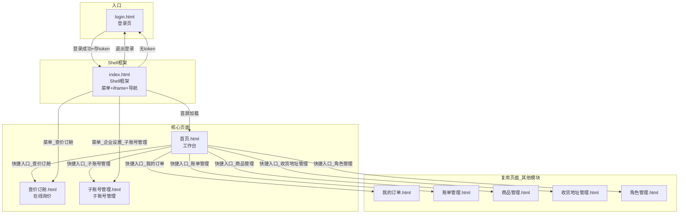

# 产品需求文档 (PRD) -- 货主端

---

## 0. 文档基础信息

- 文档标题：货主端（Shipper Portal）
- 版本号：v1.2
- 状态：草稿
- 作者：AI PM（v1.2: 货主端×客商中心数据融合 — 跨模块接口+登录校验链+融合业务规则）
- 评审人：产品/研发/测试/业务代表
- 计划里程碑：评审待定 / 提测待定 / 上线待定

### 0.1 变更记录

| 版本 | 变更日期 | 变更内容 | 变更人 |
|------|---------|---------|--------|
| v1.0 | 2026-06-06 | 初稿，基于 Demo 反向生成 | AI PM |
| v1.2 | 2026-06-06 | 货主端×客商中心数据融合：新增 §13 跨模块接口契约+登录校验链+融合业务规则(R-F01~R-F08)+融合验收标准+失败降级策略；登录/下单增加 customer.status 实时校验 | AI PM（融合） |

### 0.2 关联链接

- 用户需求(RDD)：`drafts/货主端/2026-06-06-用户需求.md`
- 数据设计：`drafts/货主端/2026-06-06-数据设计.md`
- 需求背景：无（货主端基于整体 TMS 架构规划）
- 原型：`demo/货主端-demo/`（login.html / 首页.html / 查价订舱.html / 子账号管理.html / index.html）

### 0.3 评审记录

| 日期 | 参会人 | 主要问题/结论 | 待办 |
|------|--------|-------------|------|

---

## 1. 需求定义

### 1.1 背景与现状

当前货主（跨境卖家）的查价、订舱完全依赖人工沟通：在微信群询问销售报价，销售翻 Excel 查找后回复，货主确认后再口头下单。单次询价耗时 30 分钟到半天不等。货主无法自助获取报价，也无法自助管理企业内部的操作人员账号权限。

货主端的目标是为跨境卖家提供一个自助门户：登录后可在线查价、下单订舱、管理企业内部子账号，大幅降低对客服/销售的依赖，提升下单效率。

### 1.2 目标与成功口径

- 目标：货主能在 30 秒内自助完成多渠道比价，企业管理员能自助管理子账号
- 成功口径：
  - 单次询价耗时从 30 分钟降至 30 秒（数据来源：询价日志分析，评估窗口：上线后 4 周）
  - 子账号自助管理覆盖率 100%（不再需要客服代创建账号）

### 1.3 范围与边界

- In Scope（本期 P0）：
  - 登录认证（账号密码登录 + Token 校验 + 退出）
  - 首页工作台（指标卡片 + 快捷入口）
  - 查价订舱（货物参数输入 + 多渠道报价展示）
  - 子账号管理（列表/新增/编辑/冻结/分配角色）
  - 页面框架 Shell（侧边菜单 + iframe 路由 + 顶部导航 + 标签页）
- Out of Scope：
  - 订舱下单完整流程（依赖运单模块）
  - 询价历史记录（二期）
  - 忘记密码自助找回（MVP 通过客服重置）
  - 企业自助注册（MVP 通过员工端邀请入驻）
  - 商品管理/收货地址管理/VAT管理/角色管理（复用其他模块实体和接口，不在本 PRD 重复定义）

### 1.4 影响范围

- 影响角色：货主运营、货主财务、企业管理员（货主侧）
- 依赖系统：员工端-客商中心（企业客户数据）、员工端-超级运价（运价数据）、员工端-系统设置（角色定义）

---

## 2. 枚举字典

> 所有枚举字段的键值对集中定义，研发以此为准。与 数据设计 Schema 中的 TinyInt 值保持一致。

| 枚举名 | 值 | 常量名 | 中文 | 适用实体/字段 |
|--------|----|--------|------|-------------|
| Gender | 10 | MALE | 男 | sub_account.gender |
| Gender | 20 | FEMALE | 女 | sub_account.gender |
| SubAccountStatus | 10 | NORMAL | 正常 | sub_account.status |
| SubAccountStatus | 20 | FROZEN | 已冻结 | sub_account.status |
| BillingUnit | 10 | KG | 公斤 | 查价参数 / 报价结果 |
| BillingUnit | 20 | CBM | 立方米 | 查价参数 / 报价结果 |
| TransportMode | SEA | SEA | 海运 | 查价参数.运输方式 |
| TransportMode | AIR | AIR | 空运 | 查价参数.运输方式 |
| TaxMethod | -- | TAX_INCLUDED | 包税 | 查价参数.包税方式 |
| TaxMethod | -- | TAX_EXCLUDED | 不包税 | 查价参数.包税方式 |
| ProductType | POWDER | POWDER | 粉末 | 查价参数.产品类型 |
| ProductType | LIQUID | LIQUID | 液体 | 查价参数.产品类型 |
| ProductType | BATTERY | BATTERY | 带电 | 查价参数.产品类型 |

---

## 3. 状态机

### 3.1 子账号状态流转

```
[正常] ──{冻结}──> [已冻结]
  ^                  |
  └──{启用}──────────┘
```

| 当前状态 | 操作 | 目标状态 | 触发角色 | 校验条件 |
|---------|------|---------|---------|---------|
| 正常 | 冻结 | 已冻结 | 企业管理员 | 二次确认弹窗；不能冻结自己 |
| 已冻结 | 启用 | 正常 | 企业管理员 | 二次确认弹窗 |

---

## 4. 功能清单与页面映射

| 模块 | 功能点 | 优先级 | 对应页面 | 页面类型 |
|------|--------|--------|---------|---------|
| 框架 Shell | 侧边菜单 + iframe 路由 | P0 | index.html | Shell 框架 |
| 框架 Shell | 顶部导航 + 面包屑 + 退出登录 | P0 | index.html | Shell 框架 |
| 框架 Shell | Token 校验与登录拦截 | P0 | index.html | Shell 框架 |
| 登录认证 | 账号密码登录 | P0 | login.html | 登录页 |
| 登录认证 | 记住密码 + 表单校验 | P0 | login.html | 登录页 |
| 首页 | 业务指标卡片（4个） | P0 | 首页.html | 工作台 |
| 首页 | 快捷入口网格（7个） | P0 | 首页.html | 工作台 |
| 查价订舱 | 货物参数输入表单 | P0 | 查价订舱.html | 查询页 |
| 查价订舱 | 多渠道报价结果展示 | P0 | 查价订舱.html | 查询页 |
| 查价订舱 | 未匹配渠道提示 | P0 | 查价订舱.html | 查询页 |
| 子账号管理 | 子账号列表 + 搜索（4条件+7列，不展示ROOT） | P0 | 子账号管理.html | 列表页 |
| 子账号管理 | 新增/编辑子账号（邮箱非必填+手机号数字校验） | P0 | 子账号管理.html | 列表页+弹窗 |
| 子账号管理 | 冻结/启用子账号（ROOT保护） | P0 | 子账号管理.html | 列表页 |
| 子账号管理 | 分配角色资源（ROOT+启用角色范围） | P0 | 子账号管理.html | 列表页+弹窗 |
| 子账号管理 | 修改子账号密码 | P0 | 子账号管理.html | 列表页+弹窗 |
| 角色管理 | 角色列表 + 搜索（角色名称/角色类型，不展示ROOT） | P0 | 角色管理.html | 列表页 |
| 角色管理 | 新增/编辑角色（角色代码+角色名称） | P0 | 角色管理.html | 列表页+弹窗 |
| 角色管理 | 分配资源（权限树，同员工端，ROOT范围上限） | P0 | 角色管理.html | 列表页+弹窗 |
| 角色管理 | 冻结/启用角色（ROOT保护） | P0 | 角色管理.html | 列表页 |

### 4.1 页面导航关系图



---

## 5. 页面规格

### 5.1 登录页 (login.html)

**页面信息**：
- 路径：`/login.html`
- 类型：登录页
- 访问角色：所有货主用户（含子账号）

**布局**：左右分栏
- 左侧：品牌视觉区（背景图 + 品牌标语 + 数据看板装饰卡片）
- 右侧：登录表单区（360px 宽，居中）

**字段表**：

| 字段名 | 中文名 | 类型 | 必填 | 默认值 | 校验规则 | 数据来源 | 备注 |
|--------|--------|------|------|--------|---------|---------|------|
| username | 账号 | 文本 | ✅ | -- | 必填；长度>=3 | 用户输入 | 支持账号或邮箱 |
| password | 密码 | 文本 | ✅ | -- | 必填；长度>=6 | 用户输入 | 支持显示/隐藏切换 |
| rememberMe | 记住密码 | Boolean | -- | false | -- | 前端 localStorage | 非敏感令牌，仅记住账号 |

**交互行为**：
- [登录]：点击"立即登录"按钮或回车键 -> 前端表单校验 -> 校验通过后调用登录接口 -> Loading 状态 -> 成功后：
  1. `localStorage.setItem('shipper_token', token)`
  2. `localStorage.setItem('shipper_username', username)`
  3. Toast 提示"登录成功！正在跳转..."
  4. 1 秒后跳转 `index.html`
- [登录失败]：接口返回错误 -> Toast 提示错误信息（如"账号或密码错误"） -> 不跳转
- [记住密码]：勾选后，下次访问自动填充账号（存在 localStorage）
- [忘记密码]：点击跳转忘记密码页（MVP 可暂时无功能，仅链接占位）
- [注册]：底部"立即免费注册"链接（MVP 可暂时无功能）

**关联接口**：
- 登录：`POST /api/shipper/auth/login` (body: {username, password}) -> {token, username, customer_id}

---

### 5.2 首页工作台 (首页.html)

**页面信息**：
- 路径：`/首页.html`（通过 index.html Shell 的 iframe 加载）
- 类型：工作台
- 访问角色：所有已登录货主用户
- 前置条件：`localStorage.shipper_token` 存在

**区域一：欢迎语**

| 字段名 | 中文名 | 类型 | 数据来源 | 备注 |
|--------|--------|------|---------|------|
| username | 当前用户名 | 文本 | `localStorage.shipper_username` | 展示"欢迎回来，{username}！" |
| subtitle | 副标题 | 文本 | 静态 | "这里是您的专属物流工作台。" |

**区域二：指标卡片（4 个）**

| 卡片 | 指标名 | 数据来源 | 备注 |
|------|--------|---------|------|
| 卡片1 | 待发货订单 | 后端统计接口 | 数值 + 标签 |
| 卡片2 | 运输中订单 | 后端统计接口 | 数值 + 标签 |
| 卡片3 | 待付账单 | 后端统计接口 | 数值 + 标签 |
| 卡片4 | 本月发货量(KG) | 后端统计接口 | 数值 + 标签 |

**区域三：快捷入口（7 个）**

| 入口 | 跳转目标 | 说明 |
|------|---------|------|
| 查价订舱 | `查价订舱.html` | 核心功能，卡片可点击 |
| 我的订单 | `我的订单.html` | 订单中心（其他模块） |
| 账单管理 | `账单管理.html` | 财务中心（其他模块） |
| 商品管理 | `商品管理.html` | 基础资料（引用） |
| 收货地址管理 | `收货地址管理.html` | 基础资料（引用） |
| 角色管理 | `角色管理.html` | 企业设置（引用） |
| 子账号管理 | `子账号管理.html` | 企业设置（本期） |

**交互行为**：
- [快捷入口点击]：通过 `window.parent.postMessage({ type: 'navigate', url: url }, '*')` 通知 Shell 框架切换 iframe 页面

**关联接口**：
- 指标统计：`GET /api/shipper/dashboard/stats` -> {pendingOrders, inTransitOrders, pendingBills, monthlyVolume}

---

### 5.3 查价订舱 (查价订舱.html) -- 核心功能

**页面信息**：
- 路径：`/查价订舱.html`
- 类型：查询页（参数输入 + 结果展示）
- 访问角色：所有已登录货主用户
- 前置依赖：员工端已完成运价配置（当前周批次状态 = CURRENT）

**区域一：查询参数表单**

| 字段名 | 中文名 | 类型 | 必填 | 默认值 | 校验规则 | 数据来源 | 备注 |
|--------|--------|------|------|--------|---------|---------|------|
| destCountry | 目的国 | 单选下拉 | ✅ | US | -- | 系统可用国家列表 | 如美国(US)/英国(UK) |
| warehouse | 目的仓点 | 单选下拉(可搜索) | ✅ | ONT8 | -- | FBA 仓点列表 | 如 ONT8/LAX9/LGB8/SBD1 |
| pieces | 件数 | Integer | ✅ | 3 | >=1 | 用户输入 | 数字输入框 |
| unitWeight | 单件重量(kg) | Decimal(10,1) | ✅ | 60 | >=0.1 | 用户输入 | 精度 0.1kg |
| length | 长(cm) | Integer | ✅ | 60 | >=1 | 用户输入 | 尺寸-长 |
| width | 宽(cm) | Integer | ✅ | 60 | >=1 | 用户输入 | 尺寸-宽 |
| height | 高(cm) | Integer | ✅ | 60 | >=1 | 用户输入 | 尺寸-高 |
| billingUnits | 计费方式 | 多选复选框 | ✅ | ['KG'] | 至少选一项 | 系统枚举 | KG / CBM |
| transportMode | 运输方式 | 单选下拉 | -- | 不限 | -- | 系统枚举 | 海运(sea)/空运(air) |
| taxMethod | 包税方式 | 单选下拉 | -- | 不限 | -- | 系统枚举 | 包税/不包税 |
| pickupRegion | 交货地 | 单选下拉 | ✅ | 珠三角 | -- | 系统枚举 | 珠三角/汕头/义乌 |
| productType | 产品类型 | 单选下拉 | -- | 选填 | -- | 系统枚举 | 粉末(powder)/液体(liquid)/带电(battery) |

**区域二：报价结果表格**（查询后展示）

| 列名 | 字段名 | 类型 | 说明 |
|------|--------|------|------|
| 渠道 | channel | 文本 | 如"美森360"、"EX456" |
| 计价 | billing | 文本 | "KG" 或 "CBM" |
| 公布价 | price | 文本 | 基础运价单价，如"10.0 元/KG" |
| 附加费 | surcharges | 文本数组 | 逐条展示，如"粉末+1.5/KG(优惠后1.0)" |
| 最终报价 | finalPrice | 文本(加粗) | 公布价 + 附加费 - 优惠，如"11.0 元/KG" |
| 船期 | sailing | 文本 | 截关->开船 + 航程，如"1/28->2/8 航程11天" |
| 最快提取 | pickup | 文本 | 预计最快提取日期，如"2/10" |

**区域三：未匹配渠道提示**（条件展示）

- 展示条件：存在渠道无法匹配到当前仓点的报价
- 展示形式：`el-alert` type="info"，不可关闭
- 文案："以下渠道暂无 {warehouse} 的报价记录：{渠道名列表}。如需询价请联系客服。"

**区域四：免责声明**（查询后展示）

- 文案："*本报价为预估参考，不含成本底价和盈亏标识。实际结算以运单为准。"

**交互行为**：
- [查询报价]：点击按钮 -> 前端必填校验（目的国/目的仓点/件数/单件重量/尺寸/交货地不能为空） -> 调用后端查价接口 -> 返回结果渲染表格
- [结果展示]：查询成功后显示报价结果卡片 + 未匹配渠道提示（如有）+ 免责声明
- [计费方式切换]：勾选 KG/CBM 影响后端匹配逻辑（KG 按实重+体积重取大，CBM 按材积）
- [产品类型选填]：选择粉末/液体/带电时，后端叠加对应的特殊货物附加费

**关联接口**：
- 查价：`POST /api/shipper/inquiry/price` (body: 全部查询参数) -> {results: [{channel, billing, price, surcharges, finalPrice, sailing, pickup, channelCode, batchNo}], unmatchedChannels: [string]}

---

### 5.4 子账号管理 (子账号管理.html)

**页面信息**：
- 路径：`/子账号管理.html`
- 类型：列表页（搜索 + 表格 + 分页 + 弹窗）
- 访问角色：企业管理员
- 前置依赖：角色已在系统设置模块定义
- **列表过滤规则**：默认不展示 ROOT 账号（`is_root=true`的记录）

**区域一：搜索条件**

| 字段名 | 中文名 | 类型 | 必填 | 校验规则 | 备注 |
|--------|--------|------|------|---------|------|
| account | 账号 | 文本 | — | — | 模糊搜索 |
| email | 邮箱 | 文本 | — | — | 模糊搜索 |
| name | 姓名 | 文本 | — | — | 模糊搜索 |
| phone | 手机号 | 文本 | — | — | 模糊搜索 |

**按钮**：搜索、重置、新增子账号

**区域二：子账号列表（7列）**

| 列名 | 字段名 | 类型 | 说明 |
|------|--------|------|------|
| 账号 | account | 文本 | 登录用户名 |
| 姓名 | name | 文本 | 姓氏+名字 |
| 性别 | gender | 文本 | 男/女 |
| 手机号 | phone | 文本 | — |
| 邮箱 | email | 文本 | 超长省略 + tooltip |
| 状态 | status | 标签 | 正常(绿色tag) / 已冻结(红色tag) |
| 操作 | — | 按钮组 | 编辑 / 分配资源 / 冻结或启用 / 修改密码 |

**弹窗一：新增/编辑子账号**

| 字段名 | 中文名 | 类型 | 必填 | 默认值 | 校验规则 | 备注 |
|--------|--------|------|------|--------|---------|------|
| account | 账号 | 文本 | ✅ | — | 同企业内唯一 | 登录用户名 |
| lastName | 姓 | 文本 | ✅ | — | — | — |
| firstName | 名 | 文本 | ✅ | — | — | — |
| gender | 性别 | 单选 | ✅ | 男 | — | 男/女 |
| phone | 手机号 | 文本 | ✅ | — | 仅限数字 | type="number" |
| email | 邮箱 | 文本 | — | — | — | 非必填 |

**弹窗二：分配资源（角色）**

| 区域 | 内容 | 说明 |
|------|------|------|
| 账号信息(只读) | 账号 + 姓名 | 确认操作对象 |
| 角色选择 | 多选下拉 | 选项范围：ROOT角色 + 所有启用状态的角色 |
| 提示文字 | "子账号的系统权限将由所选角色的权限组合决定" | 静态提示 |

**弹窗三：修改密码**（新增）

| 字段名 | 中文名 | 类型 | 必填 | 校验规则 | 备注 |
|--------|--------|------|------|---------|------|
| newPassword | 新密码 | 文本(password) | ✅ | 长度>=6 | 支持显示/隐藏切换 |
| confirmPassword | 确认密码 | 文本(password) | ✅ | 与新密码一致 | 不一致时标红提示 |

**交互行为**：
- [搜索]：输入搜索条件 -> 点击搜索 -> 列表过滤
- [重置]：清空所有搜索条件
- [新增]：点击"新增子账号" -> 弹窗标题"新增子账号" -> 表单置空 -> 填写（邮箱非必填） -> 确定 -> 列表新增 -> Toast "新增子账号成功"
- [编辑]：点击编辑 -> 弹窗标题"编辑子账号" -> 回填当前数据 -> 修改 -> 确定 -> 列表更新 -> Toast "编辑子账号成功"
- [冻结]：点击正常账号的"冻结" -> `ElMessageBox.confirm`(type: warning) 二次确认："确定要冻结账号 [{account}] 吗？" -> 确认后状态变"已冻结" -> 标签变红 -> Toast 成功
- [启用]：点击已冻结账号的"启用" -> 二次确认："确定要启用账号 [{account}] 吗？" -> 确认后状态变"正常" -> 标签变绿 -> Toast 成功
- [分配资源]：点击"分配资源" -> 弹窗展示账号+姓名(只读) + 角色多选(ROOT+启用角色) -> 选择角色 -> 确定 -> Toast "成功为账号 [{account}] 分配角色"
- [修改密码]：点击"修改密码" -> 弹窗 -> 输入新密码+确认 -> 确定 -> Toast "密码修改成功"
- [保存校验]：必填字段为空 -> Toast 提示"请完善必填信息"
- [ROOT账号保护]：企业管理员不能冻结/删除自己（ROOT账号）

**关联接口**：
- 列表查询：`GET /api/shipper/sub-account/list` (params: {account, email, name, phone, page, pageSize}) -> {list: [], total: N}
- 新增：`POST /api/shipper/sub-account` (body: {account, lastName, firstName, gender, phone, email})
- 编辑：`PUT /api/shipper/sub-account/{id}` (body: 同新增)
- 冻结/启用：`PATCH /api/shipper/sub-account/{id}/status` (body: {status: 10|20})
- 分配角色：`PUT /api/shipper/sub-account/{id}/roles` (body: {roleIds: [1,2,3]})
- 修改密码：`PUT /api/shipper/sub-account/{id}/password` (body: {newPassword})

---

### 5.5 Shell 框架 (index.html)

**页面信息**：
- 路径：`/index.html`
- 类型：Shell 框架（侧边菜单 + 顶部导航 + iframe 路由 + 标签页）
- 访问角色：所有已登录货主用户
- 加载首屏：`首页.html`

**侧边菜单结构**：

```
首页（首页.html）
查价订舱（查价订舱.html）
订单中心
  ├── 我的订单（我的订单.html）
  ├── 草稿箱（草稿箱.html）
  └── 异常订单（异常订单.html）
财务中心
  ├── 账单管理（账单管理.html）
  ├── 发票管理（发票管理.html）
  └── 充值与流水（充值与流水.html）
基础资料
  ├── 商品管理（商品管理.html）
  ├── 收货地址管理（收货地址管理.html）
  └── VAT管理（VAT管理.html）
企业设置
  ├── 角色管理（角色管理.html）
  └── 子账号管理（子账号管理.html）
```

**顶部导航**：
- 左侧：折叠按钮 + 面包屑导航
- 右侧：全屏按钮 + 通知图标(badge=3) + 用户下拉(个人中心/企业认证/退出登录)

**标签页**：
- 当前打开页面名称（单标签页展示，后续可扩展为多标签）

**Token 校验逻辑**（研发重点）：
1. `index.html` 加载时，立即检查 `localStorage.getItem('shipper_token')`
2. 若 token 不存在或为空 -> `ElMessage.warning('请先登录')` -> `window.location.href = 'login.html'`
3. 若 token 存在 -> 正常渲染 Shell 框架，加载 `首页.html` 到 iframe

**退出登录逻辑**：
1. 点击"退出登录"
2. `localStorage.removeItem('shipper_token')`
3. `localStorage.removeItem('shipper_username')`
4. `ElMessage.success('已退出登录')`
5. 500ms 后 `window.location.href = 'login.html'`

**iframe 跨页面路由**：
- Shell 框架监听 `window.message` 事件
- 当收到 `{ type: 'navigate', url: '...' }` 时：
  1. 更新 `activeMenu` 为 url 的 base 部分
  2. 更新 `currentIframeSrc` 为完整 url

---

### 5.6 角色管理-货主端 (角色管理.html)

**页面信息**：
- 路径：`/角色管理.html`
- 类型：列表页（搜索 + 表格 + 分页 + 弹窗）
- 访问角色：企业管理员
- 前置依赖：企业已完成入驻，ROOT角色已自动生成
- **列表过滤规则**：默认不展示 ROOT 角色（系统内置，不可管理）

**区域一：搜索条件**

| 字段名 | 中文名 | 类型 | 必填 | 备注 |
|--------|--------|------|------|------|
| roleName | 角色名称 | 文本 | — | 模糊搜索 |
| roleType | 角色类型 | Select(multiple) | — | — |

**按钮**：搜索、重置、新增角色

**区域二：角色列表（5列）**

| 列名 | 字段名 | 类型 | 说明 |
|------|--------|------|------|
| 角色名称 | roleName | 文本 | — |
| 角色代码 | roleCode | 文本 | 唯一标识 |
| 状态 | status | 标签 | 正常(绿色tag) / 已冻结(红色tag) |
| 备注 | remark | 文本 | 超长省略+tooltip |
| 操作 | — | 按钮组 | 编辑 / 分配资源 / 冻结或启用 |

**弹窗一：新增/编辑角色**

| 字段名 | 中文名 | 类型 | 必填 | 校验规则 | 备注 |
|--------|--------|------|------|---------|------|
| roleCode | 角色代码 | 文本 | ✅ | 同企业内唯一 | 唯一标识 |
| roleName | 角色名称 | 文本 | ✅ | — | — |

**弹窗二：分配资源**（内容同员工端分配资源）

| 区域 | 内容 | 说明 |
|------|------|------|
| 角色信息(只读) | 角色名称 + 角色代码 | 确认操作对象 |
| 资源权限树 | 三级权限树（菜单/页面/按钮） | 内容同员工端分配资源 |
| 权限范围约束 | 可选资源范围 = ROOT角色拥有的全部资源 | 不可超出ROOT权限范围 |

**交互行为**：
- [搜索]：输入角色名称/角色类型 -> 点击搜索 -> 列表过滤
- [重置]：清空所有搜索条件
- [新增]：点击"新增角色" -> 弹窗 -> 填写角色代码+角色名称 -> 确定 -> 列表新增 -> Toast "新增角色成功"
- [编辑]：点击编辑 -> 弹窗回填 -> 修改 -> 确定 -> 列表更新 -> Toast "编辑角色成功"
- [分配资源]：点击"分配资源" -> 弹窗展示角色信息(只读) + 资源权限树 -> 勾选资源 -> 确定 -> Toast "成功为角色 [{roleName}] 分配资源"
- [冻结]：点击正常角色的"冻结" -> `ElMessageBox.confirm`(type: warning) 二次确认 -> ROOT角色不可冻结，返回错误提示 -> 其他角色执行冻结
- [启用]：点击已冻结角色的"启用" -> 二次确认 -> 执行启用
- [角色资源上限]：分配资源时，可勾选的资源范围上限 = ROOT角色的资源权限，超出部分置灰不可选

**关联接口**：
- 列表查询：`GET /api/shipper/role/list` (params: {roleName, roleType, page, pageSize}) -> {list: [], total: N}
- 新增：`POST /api/shipper/role` (body: {roleCode, roleName})
- 编辑：`PUT /api/shipper/role/{id}` (body: {roleName})
- 冻结/启用：`PATCH /api/shipper/role/{id}/status` (body: {status: 10|20})
- 分配资源：`PUT /api/shipper/role/{id}/resources` (body: {resourceIds: [1,2,3]})
- 获取ROOT资源树：`GET /api/shipper/role/root-resources` -> {resourceTree}

---

## 6. 业务规则

| 编号 | 触发点 | 条件/公式 | 输出 | 异常处理 |
|------|--------|----------|------|---------|
| R01 | 登录成功 | 后端验证通过 | localStorage 存 token + username，跳转 index.html | 接口报错 -> Toast 提示错误信息 |
| R02 | Shell 框架加载 | `localStorage.shipper_token` 为空 | 跳转 login.html | -- |
| R03 | 退出登录 | 主动点击 | 清除 token + username，跳转 login.html | -- |
| R04 | 查价-计费重量 | 计费重量 = MAX(实际重量, 体积重)；体积重 = 长x宽x高 / 6000 | 用于运价行重量段匹配 | -- |
| R05 | 查价-渠道初筛 | transportMode 不为空 -> 筛选匹配运输方式的渠道 | 缩小匹配范围 | transportMode 为空 -> 不限，全量渠道匹配 |
| R06 | 查价-最终报价 | 最终报价 = 公布价 + SUM(附加费) - SUM(运费优惠) | 展示在结果表格 | 若计算异常 -> 该渠道不返回或标记异常 |
| R07 | 查价-未匹配渠道 | 某渠道在当前仓点无运价行 -> 归入 unmatchedChannels | Alert 提示货主 | -- |
| R08 | 查价-报价有效期 | 报价基于当前周批次 (weekly_schedule_batch.status = CURRENT) | 页面底部标注"本报价为预估参考" | 周批次过期 -> 无 CURRENT 批次 -> 查价返回空或提示系统维护中 |
| R09 | 子账号-新增校验 | account 同企业内唯一 | 后端校验 -> 重复则返回错误 | 前端 Toast 提示"账号已存在" |
| R10 | 子账号-冻结确认 | 状态从"正常"变为"已冻结" | 二次确认弹窗 | 用户取消 -> 不执行 |
| R11 | 子账号-权限 | 子账号权限 = 所分配角色权限的并集 | 后端鉴权中间件处理 | 无权限操作 -> 返回 403 |
| R12 | 登录-表单校验 | username 不为空且长度>=3；password 不为空且长度>=6 | 前端 element-plus form rules | 校验失败 -> 标红字段 + 提示信息 |
| R13 | 子账号-ROOT保护 | is_root=true 的记录不在列表中展示 | 后端查询默认过滤 | — |
| R14 | 子账号-角色可选范围 | ROOT角色 + 所有 status=10 的角色 | 分配角色下拉动态计算 | — |
| R15 | 子账号-登录方式 | 支持账号或邮箱登录 | 后端登录接口同时匹配 account 和 email | — |
| R16 | 子账号-手机号校验 | phone 仅限数字 | 前端 type="number" + 后端正则 | 非数字 -> Toast |
| R17 | 角色-ROOT自动生成 | 客户入驻时自动创建 role_code='ROOT' 的角色 | 拥有全部资源权限 | — |
| R18 | 角色-ROOT保护 | ROOT角色不可冻结/删除/编辑角色代码 | 列表不展示ROOT，接口层校验 | — |
| R19 | 角色-资源上限 | 新建角色的资源范围不可超出ROOT角色的资源 | 分配资源弹窗中超出部分置灰 | 后端保存时二次校验 |
| R20 | 角色-冻结不影响已分配 | 角色冻结后，已分配该角色的子账号权限不变 | 冻结仅阻止新分配 | — |

---

## 7. 计算公式

### 7.1 计费重量计算

```
变量定义:
  实际重量 = 单件重量(kg) x 件数（来源：查价参数.unitWeight x 查价参数.pieces）
  体积重 = (长 x 宽 x 高) / 6000 x 件数（来源：查价参数.length/width/height/pieces）

公式:
  计费重量 = MAX(实际重量, 体积重)

精度: 计费重量保留 1 位小数
```

### 7.2 最终报价计算

```
变量定义:
  公布价单价 = 运价行公布价（来源：price_table_row.published_price）
  附加费合计 = SUM(各附加费规则.费用) - SUM(各附加费优惠)（来源：surcharge_rule + surcharge_discount）
  运费优惠合计 = SUM(各运费优惠规则.优惠金额)（来源：freight_discount）

公式:
  最终报价 = 公布价单价 + 附加费合计 - 运费优惠合计

精度: Decimal(18,2)，单位：元/计价单位
```

---

## 8. 权限矩阵

| 操作 | 企业管理员(货主) | 货主运营 | 货主财务 |
|------|:---:|:---:|:---:|
| 登录 | ✅ | ✅ | ✅ |
| 首页工作台 | ✅ | ✅ | ✅ |
| 查价订舱 | ✅ | ✅ | ❌ |
| 子账号管理 | ✅ | ❌ | ❌ |
| 角色管理（引用） | ✅ | ❌ | ❌ |
| 商品管理（引用） | ✅ | ✅ | ❌ |
| 收货地址管理（引用） | ✅ | ✅ | ❌ |
| VAT管理（引用） | ✅ | ✅ | ❌ |
| 我的订单 | ✅ | ✅ | ❌ |
| 账单管理 | ✅ | ❌ | ✅ |

> 权限矩阵由角色定义驱动，上表为预置角色的默认权限。实际权限以系统设置模块的角色配置为准。

---

## 9. 接口清单

| 接口 | 方法 | 路径 | 触发页面 | 请求参数 | 返回字段 | 失败处理 |
|------|------|------|---------|---------|---------|---------|
| 登录 | POST | /api/shipper/auth/login | login.html | {username, password} | {token, username, customer_id} | Toast 错误信息 |
| 首页统计 | GET | /api/shipper/dashboard/stats | 首页.html | -- | {pendingOrders, inTransitOrders, pendingBills, monthlyVolume} | 卡片显示"--" |
| 查价 | POST | /api/shipper/inquiry/price | 查价订舱.html | {destCountry, warehouse, pieces, unitWeight, length, width, height, billingUnits, transportMode, taxMethod, pickupRegion, productType} | {results: [{channel, billing, price, surcharges, finalPrice, sailing, pickup, channelCode, batchNo}], unmatchedChannels} | Toast 提示系统异常 |
| 子账号列表 | GET | /api/shipper/sub-account/list | 子账号管理.html | {account, email, name, phone, page, pageSize} | {list: [{id, account, name, gender, phone, email, status}], total} | Toast 提示查询失败 |
| 新增子账号 | POST | /api/shipper/sub-account | 子账号管理.html | {account, lastName, firstName, gender, phone, email} | {id} | Toast 提示失败原因 |
| 编辑子账号 | PUT | /api/shipper/sub-account/{id} | 子账号管理.html | 同新增 | -- | Toast 提示失败原因 |
| 冻结/启用 | PATCH | /api/shipper/sub-account/{id}/status | 子账号管理.html | {status: 10\|20} | -- | Toast 提示失败原因 |
| 分配角色 | PUT | /api/shipper/sub-account/{id}/roles | 子账号管理.html | {roleIds: [1,2,3]} | -- | Toast 提示失败原因 |
| 角色列表 | GET | /api/shipper/role/list | 子账号管理.html, 角色管理.html | {roleName, roleType, page, pageSize} | {list: [{id, roleCode, roleName, status, remark}], total} | 默认过滤ROOT角色 |
| 新增角色 | POST | /api/shipper/role | 角色管理.html | {roleCode, roleName} | {id} | 角色代码重复->Toast |
| 编辑角色 | PUT | /api/shipper/role/{id} | 角色管理.html | {roleName} | — | — |
| 冻结/启用角色 | PATCH | /api/shipper/role/{id}/status | 角色管理.html | {status: 10\|20} | — | ROOT角色->拦截 |
| 分配角色资源 | PUT | /api/shipper/role/{id}/resources | 角色管理.html | {resourceIds: [1,2,3]} | — | 超出ROOT范围->拦截 |
| 获取ROOT资源树 | GET | /api/shipper/role/root-resources | 角色管理.html | — | {resourceTree} | 分配资源弹窗初始化 |
| 修改子账号密码 | PUT | /api/shipper/sub-account/{id}/password | 子账号管理.html | {newPassword} | — | — |

---

## 10. 错误提示文案汇总

| 编号 | 触发条件 | 文案 | 类型 |
|------|---------|------|------|
| E01 | 账号为空 | "请输入账号" | 阻断 |
| E02 | 账号长度不足 | "账号长度不能小于3位" | 阻断 |
| E03 | 密码为空 | "请输入密码" | 阻断 |
| E04 | 密码长度不足 | "密码长度不能小于6位" | 阻断 |
| E05 | 登录失败（账号或密码错误） | "账号或密码错误" | 阻断 |
| E06 | 未登录直接访问 index.html | "请先登录" | 警告 |
| E07 | 退出登录 | "已退出登录" | 提示 |
| E08 | 查价参数不完整 | "请完善必填字段" | 阻断 |
| E09 | 子账号必填字段不完整 | "请完善必填信息" | 警告 |
| E10 | 子账号密码必填（新增时） | "请输入密码" | 阻断 |
| E11 | 账号已存在（新增时） | "账号已存在" | 阻断 |
| E12 | 冻结确认 | "确定要冻结账号 [{account}] 吗？" | 警告(二次确认) |
| E13 | 启用确认 | "确定要启用账号 [{account}] 吗？" | 警告(二次确认) |
| E14 | 登录成功 | "登录成功！正在跳转..." | 提示 |
| E15 | 新增子账号成功 | "新增子账号成功" | 提示 |
| E16 | 编辑子账号成功 | "编辑子账号成功" | 提示 |
| E17 | 冻结/启用成功 | "已{冻结/启用}该账号" | 提示 |
| E18 | 分配角色成功 | "成功为账号 [{account}] 分配角色" | 提示 |
| E19 | 手机号格式错误 | "手机号仅限数字" | 阻断 |
| E20 | 密码修改成功 | "密码修改成功" | 提示 |
| E21 | 确认密码不一致 | "两次输入的密码不一致" | 阻断 |
| E22 | ROOT角色不可操作 | "ROOT角色为系统内置，不可冻结/删除" | 阻断 |
| E23 | 资源超出ROOT权限 | "所选资源超出ROOT角色权限范围" | 阻断 |
| E24 | 新增角色成功 | "新增角色成功" | 提示 |
| E25 | 编辑角色成功 | "编辑角色成功" | 提示 |
| E26 | 成功为角色分配资源 | "成功为角色 [{roleName}] 分配资源" | 提示 |
| E27 | 角色代码已存在 | "该角色代码已存在" | 阻断 |

---

## 11. 验收标准

| 编号 | 验收项 | 验收方式 | 通过标准 | 关联 AC |
|------|--------|---------|---------|---------|
| A01 | 登录成功流程 | 手动 | 输入正确账号密码 -> Toast"登录成功" -> 跳转 index.html -> 首页展示用户名 | AC-L1 |
| A02 | Token 拦截 | 手动 | 清除 localStorage token -> 访问 index.html -> 自动跳转 login.html | AC-L3 |
| A03 | 登录表单校验 | 手动 | 用户名为空 -> 失去焦点提示"请输入账号"；密码为空 -> 提示"请输入密码" | AC-L5 |
| A04 | 退出登录 | 手动 | 点击退出 -> Toast -> 清除 token -> 跳转 login.html | AC-L4 |
| A05 | 首页指标展示 | 手动 / 接口 | 加载首页 -> 4 张指标卡片均展示数值 | AC-D1 |
| A06 | 查价正常流程 | 手动 / 接口 | 输入完整货物参数 -> 点击查询 -> 表格展示 N 条渠道报价（渠道/计价/公布价/附加费/最终报价/船期/最快提取） | AC-P1 |
| A07 | 查价必填校验 | 手动 | 目的国/仓点/件数/重量/尺寸/交货地任一为空 -> 前端阻止查询 | AC-P2 |
| A08 | 未匹配渠道提示 | 手动 | 某些渠道无当前仓点报价 -> Alert 提示渠道名 + 仓点 | AC-P3 |
| A09 | 附加费展示 | 手动 | 选择粉末产品类型 -> 附加费列展示"粉末+1.5/KG(优惠后1.0)" | AC-P4 |
| A10 | 子账号新增 | 手动 | 新增弹窗填写完整信息 -> 确定 -> 列表新增一行 -> Toast 成功 | AC-S1 |
| A11 | 子账号搜索 | 手动 | 输入账号/姓名等 -> 搜索 -> 列表过滤 | AC-S2 |
| A12 | 子账号冻结 | 手动 | 点击冻结 -> 二次确认 -> 状态变"已冻结" -> 标签变红 | AC-S3 |
| A13 | 分配角色 | 手动 | 点击分配资源 -> 选择角色 -> 确定 -> Toast 成功 | AC-S4 |

---

---

## 13. 数据融合：货主端 × 客商中心

> **核心原则**：客商中心是客户主数据的 System of Record，货主端通过 `customer_id` 外键关联，不冗余存储客户字段。客户状态变更由客商中心推送，货主端被动同步 + 登录时实时校验双重保障。

### 13.1 融合业务规则

| 编号 | 触发点 | 条件/公式 | 输出 | 异常处理 |
|------|--------|----------|------|---------|
| R-F01 | 货主端登录 Step3 | 调用 GET /api/customer/{customer_id}/status | service_status=20(已冻结)→拒绝登录，提示"您的企业账户已被冻结，请联系客服" | 接口超时(>2s)→允许登录但记录告警 |
| R-F02 | 货主端下单 | 调用 GET /api/customer/{customer_id}/status | sign_status=10(未签署)→提示"请先完成合同签约"；sign_status=40(已过期)→提示"合同已过期，请联系销售续约" | — |
| R-F03 | 接收 create-root | POST /api/shipper/sub-account/create-root 被调用 | 创建ROOT子账号(account='admin')+ROOT角色+邮件通知 | customer_id已存在→幂等返回已有记录 |
| R-F04 | 接收 batch-freeze | POST /api/shipper/sub-account/batch-freeze 被调用 | 该customer下所有子账号 status→20(已冻结) | 已冻结跳过 |
| R-F05 | 接收 batch-enable | POST /api/shipper/sub-account/batch-enable 被调用 | 该customer下所有子账号 status→10(正常) | 已启用跳过 |
| R-F06 | ROOT角色保护 | is_root=true | 货主端列表中不展示ROOT账号；前端隐藏冻结按钮；后端接口拦截 | 返回错误 "ROOT账号不可冻结" |
| R-F07 | ROOT权限范围 | ROOT角色拥有货主端全部资源 | 新建角色资源范围不可超出ROOT | 分配资源弹窗中超出部分置灰 |
| R-F08 | 首页欢迎语 | 登录后调用 GET /api/customer/{customer_id}/profile | 展示"欢迎回来，{customer_name}！" | 接口失败→展示"欢迎回来！"（不含企业名） |

### 13.2 跨模块接口清单（货主端提供）

| 接口 | 方法 | 路径 | 调用方 | 幂等性 | 超时 | 说明 |
|------|------|------|--------|--------|------|------|
| 创建ROOT子账号 | POST | /api/shipper/sub-account/create-root | 客商中心 | ✅ customer_id去重 | 5s | 入驻审核通过/手工创建+生成账户/转客户时调用 |
| 批量冻结子账号 | POST | /api/shipper/sub-account/batch-freeze | 客商中心 | ✅ 已冻结跳过 | 3s | 客户冻结时调用 |
| 批量启用子账号 | POST | /api/shipper/sub-account/batch-enable | 客商中心 | ✅ 已启用跳过 | 3s | 客户启用时调用 |

### 13.3 跨模块接口清单（货主端调用）

| 接口 | 方法 | 路径 | 提供方 | 超时 | 说明 |
|------|------|------|--------|------|------|
| 查询客户状态 | GET | /api/customer/{id}/status | 客商中心 | 2s | 登录/下单时实时校验 service_status + sign_status |
| 查询客户信息 | GET | /api/customer/{id}/profile | 客商中心 | 2s | 首页加载时获取企业名称 |

### 13.4 完整登录校验链

```
POST /api/shipper/auth/login { username, password }

Step 1 — 本地认证:
  SELECT * FROM sub_account WHERE (account = :username OR email = :username)
  → 不存在 → 401 "账号或密码错误"
  → bcrypt.compare(password, password_hash) → 不匹配 → 401 "账号或密码错误"

Step 2 — 子账号状态:
  sub_account.status != 10 → 403 "账号已被冻结"
  sub_account.is_deleted = true → 401 "账号不存在"

Step 3 — 跨模块校验（客商中心）:
  GET /api/customer/{sub_account.customer_id}/status
  → service_status != 10 → 403 "您的企业账户已被冻结，请联系客服"
  → 超时(>2s) → 降级: 允许登录，记录 warn 日志，但标记 session 为 "degraded"

Step 4 — 签发 Token:
  JWT payload: { sub: sub_account_id, customer_id, is_root, degraded: bool }
  expire: 24h
  返回: { token, username, customer_name }
```

### 13.5 登录取 Token 后的下单校验

```
POST /api/shipper/order/create { ... }

Step 1 — Token 校验（JWT 中间件）:
  → Token 无效/过期 → 401

Step 2 — 子账号状态:
  sub_account.status != 10 → 403 "账号已被冻结"

Step 3 — 跨模块校验（客商中心）★ 必须同步校验:
  GET /api/customer/{customer_id}/status
  → service_status != 10 → 403 "您的企业账户已被冻结，请联系客服"
  → sign_status = 10(未签署) → 403 "请先完成合同签约后再下单"
  → sign_status = 40(已过期) → 403 "合同已过期，请联系销售续约后再下单"
  → 超时(>2s) → 拒绝下单 "系统繁忙，请稍后重试"
  → sign_status = 30(已签署) AND service_status = 10 → 允许下单

注意: 下单时不允许降级（登录可降级，下单必须同步校验通过）
```

### 13.6 融合验收标准

| 编号 | 验收项 | 验收方式 | 通过标准 | 关联 AC |
|------|--------|---------|---------|---------|
| A-F01 | ROOT账户自动创建 | 自动化 | 客商中心入驻审核通过→货主端 sub_account 表出现 is_root=true 记录→ROOT角色自动创建→邮件发送 | AC-L1 |
| A-F02 | 客户冻结→登录阻断 | 手动 | 客商中心冻结客户→该客户子账号全部 status=20→货主端登录被拒(403) | AC-S3 |
| A-F03 | 客户启用→恢复登录 | 手动 | 客商中心启用客户→子账号 status 恢复为10→货主端可正常登录 | AC-S3 |
| A-F04 | 未签署合同→下单被阻 | 手动 | 客户 sign_status=未签署→下单接口返回403+提示签约 | — |
| A-F05 | 已过期合同→下单被阻 | 手动 | 客户 sign_status=已过期→下单接口返回403+提示续约 | — |
| A-F06 | 已签署合同→下单正常 | 手动 | 客户 sign_status=已签署+service_status=正常→下单接口正常 | — |
| A-F07 | 登录降级策略 | 自动化 | 客商中心接口超时→允许登录但限制下单→记录告警日志 | — |
| A-F08 | ROOT账户幂等 | 自动化 | 重复调用 create-root 同一 customer_id→不创建重复子账号→返回已有 account | — |

### 13.7 错误提示文案补充

| 编号 | 触发条件 | 文案 | 类型 |
|------|---------|------|------|
| E28 | 企业已冻结（登录时） | "您的企业账户已被冻结，请联系客服" | 阻断 |
| E29 | 未签署合同（下单时） | "请先完成合同签约后再下单" | 阻断 |
| E30 | 合同已过期（下单时） | "合同已过期，请联系销售续约后再下单" | 阻断 |
| E31 | 系统繁忙（跨模块超时） | "系统繁忙，请稍后重试" | 阻断 |
| E32 | ROOT账号不可冻结 | "ROOT账号为系统内置，不可冻结" | 阻断 |
| E33 | 首页欢迎语降级 | "欢迎回来！"（不含企业名，接口超时时使用） | 提示 |

---

## 12. 附录

- 术语表：
  - **货主端 (Shipper Portal)**：面向跨境卖家的自助门户
  - **Shell 框架**：index.html，提供侧边菜单 + iframe 路由 + 顶部导航的统一容器
  - **周批次**：超级运价模块的概念，每周一个运价快照，状态 CURRENT 表示当前生效
  - **FBA 仓点**：Amazon Fulfillment Center 代码，如 ONT8/LAX9
  - **ROOT账户**：企业入驻时自动生成的主账号（account='admin'），拥有货主端全部权限
- 原型链接：`demo/货主端-demo/`
- 用户需求(RDD)（完整业务流程+字段表）：`drafts/货主端/2026-06-06-用户需求.md`
- 数据设计（完整 Schema+ER 图）：`drafts/货主端/2026-06-06-数据设计.md`

---
