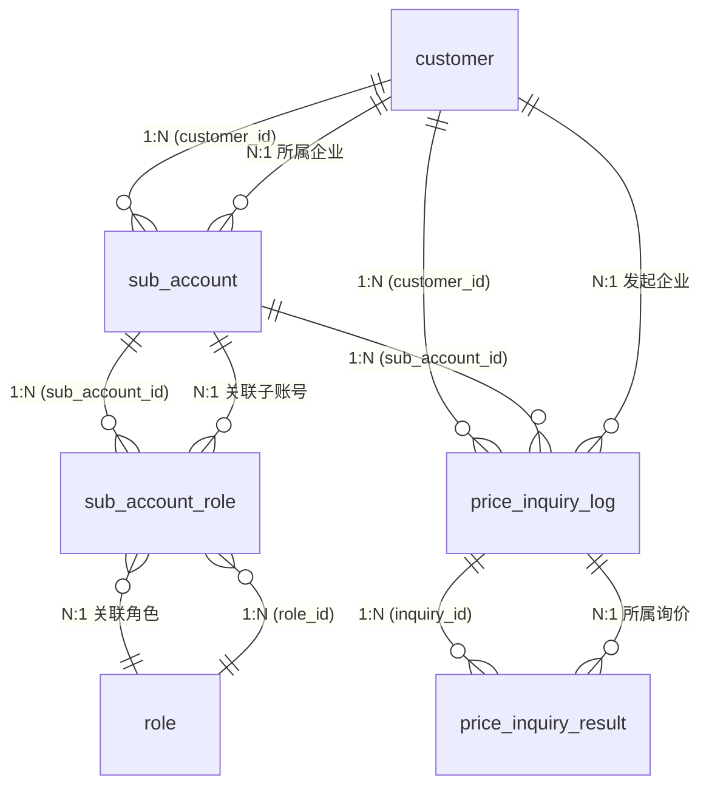

# 核心方案设计草稿 -- 货主端模块

> Phase 2：方案架构 | 基于 RDD v1.2 | 2026-06-06（v1.2: 货主端×客商中心数据融合 — 跨模块接口契约+登录校验链+同步机制）

---

## 1. 实体 x 表映射

| # | RDD 实体 | 表名 | 类型 | 说明 |
|---|---------|------|------|------|
| 1 | 子账号 | `sub_account` | 主表 | 企业内子账号管理 |
| 2 | 子账号-角色关联 | `sub_account_role` | 关联表 | N:N，子账号与角色的关联 |
| 3 | 询价记录 | `price_inquiry_log` | 主表 | 二期，记录每次货主询价 |
| 4 | 询价结果行 | `price_inquiry_result` | 主表 | 二期，记录每次询价返回的报价行 |
| -- | 企业/客户 | `customer` | 引用 | 客商中心模块，不在本模块建表 |
| -- | 商品 | `product` | 引用 | 基础资料模块，不在本模块建表 |
| -- | 收货地址 | `shipping_address` | 引用 | 基础资料模块，不在本模块建表 |
| -- | VAT 记录 | `vat_record` | 引用 | 头程管理模块，不在本模块建表 |
| -- | 角色 | `role` | 引用 | 系统设置模块，不在本模块建表 |
| -- | 服务渠道 | `service_channel` | 引用 | 超级运价模块，查价时关联 |
| -- | 服务组合 | `service_combination` | 引用 | 超级运价模块，查价时关联 |
| -- | 运价行 | `price_table_row` | 引用 | 超级运价模块，查价时关联 |
| -- | 附加费规则 | `surcharge_rule` | 引用 | 超级运价模块，查价时关联 |
| -- | 运费优惠规则 | `freight_discount` | 引用 | 超级运价模块，查价时关联 |
| -- | 周船期批次 | `weekly_schedule_batch` | 引用 | 超级运价模块，查价时关联 |

---

## 2. 逐表字段清单

### 2.1 子账号 `sub_account`

> **设计说明**：货主企业内部的员工登录账号。每个子账号属于一个企业（customer），可分配多个角色。登录认证通过 `sub_account` + 密码完成。

| 字段名 (En) | 字段名 (Cn) | 类型 (Type) | 必填 | 约束/索引 | 枚举/备注 |
|:---|:---|:---|:---|:---|:---|
| `id` | 主键 | BigInt | Yes | **PK** | 雪花ID |
| `tenant_id` | 租户ID | String | Yes | Index | SaaS 数据隔离 |
| `customer_id` | 所属企业ID | BigInt | Yes | **Index, FK -> customer.id** | 关联客商中心的企业客户 |
| `account` | 账号 | String(64) | Yes | **Unique (customer_id + account)** | 登录用户名，同企业内唯一。支持账号或邮箱登录 |
| `is_root` | 是否ROOT账号 | Boolean | Yes | — | Default: false。客户入驻时自动生成的admin账号为true，列表不展示
| `password_hash` | 密码哈希 | String(128) | Yes | -- | bcrypt 哈希，不存明文 |
| `last_name` | 姓 | String(32) | Yes | -- | -- |
| `first_name` | 名 | String(32) | Yes | -- | -- |
| `full_name` | 姓名（全名） | String(64) | Yes | -- | 姓+名拼接，冗余存储便于搜索和展示 |
| `gender` | 性别 | TinyInt | Yes | -- | 10:男, 20:女 |
| `phone` | 手机号 | String(20) | Yes | -- | -- |
| `email` | 邮箱 | String(128) | No | -- | -- |
| `status` | 状态 | TinyInt | Yes | Index | 10:正常, 20:已冻结 |
| `last_login_at` | 最后登录时间 | DateTime | No | -- | 记录最近一次登录 |
| `created_at` | 创建时间 | DateTime | Yes | -- | 自动生成 |
| `created_by` | 创建人 | String | Yes | -- | 当前用户（企业管理员） |
| `updated_at` | 更新时间 | DateTime | Yes | -- | 自动维护 |
| `updated_by` | 更新人 | String | Yes | -- | 当前用户 |
| `is_deleted` | 软删除标识 | Boolean | Yes | -- | Default: false |
| `version` | 乐观锁版本 | Int | Yes | -- | 并发控制，每次更新 +1 |

**关联关系**:
- `Many-to-One` with `customer` (通过 `customer_id` -> `customer.id`)
- `One-to-Many` with `sub_account_role` (通过 `id` -> `sub_account_id`)

### 2.2 子账号-角色关联 `sub_account_role`

> **设计说明**：N:N 关联表，记录每个子账号被分配了哪些角色。子账号权限 = 所分配角色权限的并集。

| 字段名 (En) | 字段名 (Cn) | 类型 (Type) | 必填 | 约束/索引 | 枚举/备注 |
|:---|:---|:---|:---|:---|:---|
| `id` | 主键 | BigInt | Yes | **PK** | 雪花ID |
| `tenant_id` | 租户ID | String | Yes | Index | SaaS 数据隔离 |
| `sub_account_id` | 子账号ID | BigInt | Yes | **Index, FK -> sub_account.id** | 关联子账号 |
| `role_id` | 角色ID | BigInt | Yes | **Index, FK -> role.id** | 关联系统设置模块的角色 |
| `created_at` | 创建时间 | DateTime | Yes | -- | 自动生成 |
| `created_by` | 创建人 | String | Yes | -- | 当前用户 |

**关联关系**:
- `Many-to-One` with `sub_account` (通过 `sub_account_id`)
- `Many-to-One` with `role` (通过 `role_id`)

### 2.3 询价记录 `price_inquiry_log`（二期）

> **设计说明**：记录货主每次询价的参数和匹配结果概要，用于趋势分析和热门渠道统计。本期 MVP 不建表。

| 字段名 (En) | 字段名 (Cn) | 类型 (Type) | 必填 | 约束/索引 | 枚举/备注 |
|:---|:---|:---|:---|:---|:---|
| `id` | 主键 | BigInt | Yes | **PK** | 雪花ID |
| `tenant_id` | 租户ID | String | Yes | Index | SaaS 数据隔离 |
| `customer_id` | 货主企业ID | BigInt | Yes | Index | 关联企业客户 |
| `sub_account_id` | 操作人ID | BigInt | No | -- | 哪个子账号发起的询价 |
| `inquiry_params` | 查询参数 | JSON | Yes | -- | 快照所有输入参数（目的国/仓点/件数/重量/尺寸/计费方式等） |
| `result_count` | 返回结果数 | Int | Yes | -- | 匹配到的渠道数量 |
| `unmatched_channels` | 未匹配渠道 | JSON | No | -- | 记录未匹配的渠道列表 |
| `inquiry_at` | 询价时间 | DateTime | Yes | Index | -- |
| `created_at` | 创建时间 | DateTime | Yes | -- | 自动生成 |

### 2.4 询价结果行 `price_inquiry_result`（二期）

> **设计说明**：记录每次询价返回的每条渠道报价明细，用于追溯"当时给货主报了什么价"。本期 MVP 不建表。

| 字段名 (En) | 字段名 (Cn) | 类型 (Type) | 必填 | 约束/索引 | 枚举/备注 |
|:---|:---|:---|:---|:---|:---|
| `id` | 主键 | BigInt | Yes | **PK** | 雪花ID |
| `tenant_id` | 租户ID | String | Yes | Index | -- |
| `inquiry_id` | 询价记录ID | BigInt | Yes | **Index, FK -> price_inquiry_log.id** | -- |
| `channel_code` | 渠道编码 | String(64) | Yes | -- | 关联 service_channel |
| `channel_name` | 渠道名称 | String(128) | Yes | -- | 快照，如"美森360" |
| `billing_unit` | 计价单位 | TinyInt | Yes | -- | 10:KG, 20:CBM |
| `base_price` | 公布价 | Decimal(18,2) | Yes | -- | 基础运价单价（元/单位） |
| `surcharge_detail` | 附加费明细 | JSON | Yes | -- | 逐条快照附加费名称+原始单价+优惠后单价 |
| `final_price` | 最终报价 | Decimal(18,2) | Yes | -- | 公布价 + 附加费 - 优惠 |
| `sailing_info` | 船期信息 | String(256) | Yes | -- | 快照"截关日->开船日 + 航程天数" |
| `pickup_date` | 最快提取 | String(64) | Yes | -- | 预计最快提取日期 |
| `batch_no` | 运价批次号 | String(64) | Yes | -- | 关联 weekly_schedule_batch |
| `created_at` | 创建时间 | DateTime | Yes | -- | 自动生成 |

---

## 3. ER 关系图



---

## 4. 关键设计说明

### 4.1 软删除策略
- `sub_account` 采用软删除（`is_deleted`），冻结不等于删除，冻结是状态变更
- `sub_account_role` 不需软删除，分配/取消分配直接物理删除行（关联表无业务依赖）
- `price_inquiry_log` / `price_inquiry_result`（二期）不软删除，按保留期限定时清理

### 4.2 乐观锁
- `sub_account` 需要 `version` 字段：企业管理员 A 编辑子账号的同时，管理员 B 也可能操作
- `sub_account_role` 不需要乐观锁：角色分配是覆盖式操作，不存在并发冲突问题

### 4.3 JSON 字段使用场景
- `price_inquiry_log.inquiry_params`：查询参数为可变结构（计费方式是多选、产品类型可选等），用 JSON 快照比建多个可空字段更灵活
- `price_inquiry_log.unmatched_channels`：未匹配渠道列表，JSON 数组即可
- `price_inquiry_result.surcharge_detail`：附加费明细包含名称+原始价格+优惠后价格，结构灵活，用 JSON 快照

### 4.4 纯逻辑实体说明
- 登录凭证（LoginCredential）：无独立表，基于 `sub_account` + 密码哈希 + 后端 token 机制
- 货物查询参数（InquiryParams）：无独立表，前端表单 -> 后端接口参数，仅二期 `price_inquiry_log` 中做 JSON 快照
- 报价结果行（PriceInquiryResult）：一期无独立表，后端实时计算返回，不持久化。二期 `price_inquiry_result` 表落地

### 4.5 查价接口的运价数据来源
查价订舱接口需要跨模块查询超级运价的数据，依赖关系如下：
- 渠道/组合匹配：查询 `service_channel` + `service_combination`
- 运价行匹配：查询 `price_table_row`（当前周批次 `weekly_schedule_batch.status = CURRENT`）
- 附加费匹配：查询 `surcharge_rule` + `surcharge_discount`
- 运费优惠：查询 `freight_discount`
- 以上均为**只读查询**，货主端不写入运价相关表

### 4.6 与共享实体的引用关系

| 货主端页面 | 引用实体 | 来源表 | 来源模块 | 引用方式 |
|-----------|---------|--------|---------|---------|
| 商品管理 | 商品 | `product` | 基础资料 | 按 `customer_id` 过滤，CRUD |
| 收货地址管理 | 收货地址 | `shipping_address` | 基础资料 | 按 `customer_id` 过滤，CRUD |
| VAT管理 | VAT 记录 | `vat_record` | 头程管理 | 按 `customer_id` 过滤，CRUD |
| 角色管理 | 角色 | `role` | 系统设置 | 按 `customer_id` 过滤，定义角色权限 |
| 子账号管理 | 子账号 | `sub_account` | 货主端（本期新建） | 本模块主表 |
| 子账号管理 | 角色 | `role` | 系统设置 | 分配角色时引用 `role.id` |

### 4.7 密码与认证设计
- 密码存储：`sub_account.password_hash` 使用 bcrypt 哈希，不存明文
- Token 机制：登录成功后后端签发 JWT token，前端存 `localStorage.shipper_token`
- Token 有效期：24 小时，过期后自动跳转登录页
- 企业管理员（主账号）的登录凭证通过 `customer` 表关联的账号体系管理（客商中心模块），与子账号体系分离
- 子账号支持账号或邮箱登录：登录接口同时匹配 `account` 和 `email` 字段
- 企业管理员可为子账号修改密码：`PUT /api/shipper/sub-account/{id}/password`

### 4.8 ROOT 账号与 ROOT 角色（新增）
- **ROOT 账号**：客户入驻时自动生成，`account='admin'`，`is_root=true`，不可冻结/删除
- **ROOT 角色**：客户入驻时自动生成，`role_code='ROOT'`，拥有货主端全部资源权限，不可冻结/删除
- **列表过滤**：子账号列表查询时默认过滤 `is_root=true` 的记录，ROOT 账号不展示在管理列表
- **角色可选范围**：分配角色时，可选角色 = ROOT角色 + 所有 `status=正常(10)` 的角色
- **资源范围上限**：新建角色的资源范围不可超出 ROOT 角色拥有的资源（后端校验）
- **角色表复用**：货主端角色与员工端角色共用 `role` 表，通过 `tenant_id` 隔离；货主端的角色 `customer_id` 指向所属企业

### 4.9 角色表补充说明（货主端视角）
- 货主端角色管理直接使用系统设置的 `role` 表
- 角色资源权限树内容与员工端分配资源一致（菜单/页面/按钮三级）
- 角色冻结不影响已分配该角色的子账号——冻结仅阻止新分配，已有权限保持不变

---

## 5. 枚举值集中定义

| 枚举名 | 值 | 常量名 | 中文 | 适用实体 |
|--------|----|--------|------|---------|
| Gender | 10 | MALE | 男 | sub_account |
| Gender | 20 | FEMALE | 女 | sub_account |
| SubAccountStatus | 10 | NORMAL | 正常 | sub_account |
| SubAccountStatus | 20 | FROZEN | 已冻结 | sub_account |
| BillingUnit | 10 | KG | 公斤 | price_inquiry_result |
| BillingUnit | 20 | CBM | 立方米 | price_inquiry_result |

---

## 6. 跨模块数据融合：货主端 × 客商中心

> **设计原则**：货主端是客户主数据的 Consumer，不冗余存储客户字段（仅通过 `customer_id` 外键关联）。所有客户生命周期事件由客商中心通过接口推送到货主端。货主端登录时实时校验客户状态作为双重保障。

### 6.1 数据归属与引用关系

```
客商中心（System of Record）
  customer                          ← 客户主数据唯一源
    ├── customer_name               → 货主端首页欢迎语
    ├── service_status (10/20)      → 货主端登录准入校验
    ├── sign_status (10/20/30/40)   → 货主端下单准入校验
    └── customer_level (SS~G)       → 货主端展示（暂不控制权限）

货主端（Consumer）
  sub_account.customer_id ──FK──→ customer.id
    ├── is_root = true            → 由客商中心入驻事件触发创建
    ├── status (10=正常/20=已冻结) → 与 customer.service_status 联动
    └── 不存储 customer_name      → 通过接口实时查询

  角色 (role) — 引用系统设置模块
    └── role_code = 'ROOT'        → 由客商中心入驻事件触发创建
```

### 6.2 跨模块同步数据流

**SF1 — ROOT账户创建（接收方）**：

```
客商中心调用: POST /api/shipper/sub-account/create-root
  body: { customer_id, customer_name, contact_email, contact_phone }

货主端处理:
  1. 幂等检查: SELECT * FROM sub_account WHERE customer_id=X AND is_root=true
     → 已存在 → 返回已有记录（不重复创建）
  2. 创建 ROOT 子账号:
     INSERT INTO sub_account (
       customer_id, account='admin', is_root=true,
       password_hash=bcrypt(random_password),
       last_name='管理员', first_name='',
       full_name='管理员', gender=10, phone=contact_phone,
       email=contact_email, status=10
     )
  3. 创建 ROOT 角色（若不存在）:
     INSERT INTO role (role_code='ROOT', role_name='主账号默认角色', ...)
     ON CONFLICT (tenant_id, role_code) DO NOTHING
  4. 关联 ROOT 角色:
     INSERT INTO sub_account_role (sub_account_id, role_id)
  5. 发送邮件: 账号+密码+登录地址
  6. 返回: { sub_account_id, account, temp_password }
```

**SF2 — 批量冻结（接收方）**：

```
客商中心调用: POST /api/shipper/sub-account/batch-freeze
  body: { customer_id }

货主端处理:
  UPDATE sub_account SET status = 20, updated_at = NOW()
  WHERE customer_id = X AND is_deleted = false AND status = 10
  → 返回 { frozen_count: N }
```

**SF3 — 批量启用（接收方）**：

```
同 SF2，status: 20→10
```

**SF4 — 登录状态校验（调用方）**：

```
货主端登录时:
  1. 校验 sub_account 是否存在且未冻结
  2. 调用 GET /api/customer/{customer_id}/status
     → 返回: { service_status, sign_status, customer_name }
  3. service_status = 20 (已冻结) → 拒绝登录
  4. 缓存 customer_name 到 Redis (TTL=1h)，减少重复调用
```

### 6.3 跨模块接口契约

| 接口 | 方法 | 路径 | 提供方 | 调用方 | 幂等性 | 超时 |
|------|------|------|--------|--------|--------|------|
| 创建ROOT子账号 | POST | /api/shipper/sub-account/create-root | 货主端 | 客商中心 | ✅ customer_id去重 | 5s |
| 批量冻结子账号 | POST | /api/shipper/sub-account/batch-freeze | 货主端 | 客商中心 | ✅ 已冻结跳过 | 3s |
| 批量启用子账号 | POST | /api/shipper/sub-account/batch-enable | 货主端 | 客商中心 | ✅ 已启用跳过 | 3s |
| 查询客户状态 | GET | /api/customer/{id}/status | 客商中心 | 货主端 | — | 2s |
| 查询客户信息 | GET | /api/customer/{id}/profile | 客商中心 | 货主端 | — | 2s |

### 6.4 登录校验链（完整）

```
货主端登录 POST /api/shipper/auth/login
  ↓
Step 1: 验证账号密码
  → 匹配 sub_account.account 或 sub_account.email
  → bcrypt.compare(password, password_hash)
  → 失败 → 401 "账号或密码错误"
  ↓
Step 2: 校验子账号状态
  → sub_account.status != 10 → 403 "账号已被冻结"
  → sub_account.is_deleted = true → 401 "账号不存在"
  ↓
Step 3: 校验企业客户状态（跨模块调用）
  → GET /api/customer/{customer_id}/status
  → service_status != 10 → 403 "您的企业账户已被冻结，请联系客服"
  → 超时(>2s) → 降级: 允许登录但记录告警日志
  ↓
Step 4: 签发 JWT token
  → payload: { sub_account_id, customer_id, is_root }
  → expire: 24h
  → 返回: { token, username, customer_name }
```

### 6.5 失败降级策略

- **create-root 调用失败**（客商中心侧）：客商中心异步重试3次(10s/30s/60s)，仍失败进入 pending_sync 队列，定时任务补推
- **batch-freeze/enable 调用失败**：不回滚客商中心操作，记录异常日志+运维告警
- **GET /api/customer/{id}/status 超时**：允许登录（降级），但限制下单（必须同步校验通过才能下单），记录告警日志

### 6.6 共享实体字段变更同步

| 场景 | 客商中心变更 | 货主端影响 | 同步机制 |
|------|------------|-----------|---------|
| 客户名称变更 | customer.customer_name 更新 | 首页欢迎语需反映最新名称 | 货主端每次登录/刷新时实时查询 |
| 客户冻结 | customer.service_status: 10→20 | 所有子账号冻结+禁止登录 | batch-freeze 推送 + 登录时实时校验 |
| 客户启用 | customer.service_status: 20→10 | 所有子账号恢复登录 | batch-enable 推送 + 登录时实时校验 |
| 合同签约完成 | customer.sign_status: 20→30 | 下单限制解除 | 下单时实时查询 sign_status |
| 合同过期 | customer.sign_status: 30→40 | 下单时提示续约 | 下单时实时查询 sign_status |
| 客户等级变更 | customer_level 更新 | 暂不联动 | 未来如需按等级差异化定价，再补充 |

---
> 执行完成后，若修改了任何设计文件，自动执行 project-rule 文件联动规则，确保关联文件一致性。
