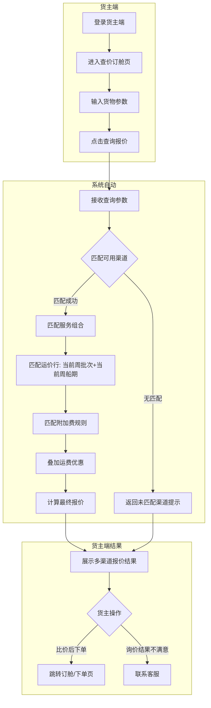
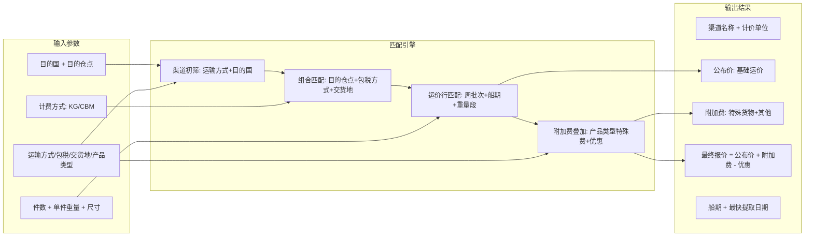

# 需求定义卡片 (RDD) -- 货主端

> **原始需求**：货主（跨境卖家）需要一个自助门户，能在线查价、下单订舱、管理子账号，减少对客服/销售的依赖，提升下单效率。
> **文档版本**: v1.2 | **日期**: 2026-06-06 | **作者**: AI PM（货主端×客商中心数据融合：客户状态准入+冻结联动+ROOT账户自动接收+合同签约门禁）

***

## 1. 核心洞察 (Insight)

### 真实痛点

货主（跨境卖家）当前查价和订舱完全依赖人工沟通：在微信群问销售"ONT8 这周什么价"，销售翻 Excel 回复，货主再口头确认下单。一个询价到成交的闭环耗时 30 分钟到半天不等。货主无法自助获取报价，也无法自助管理企业内部谁有权限操作（子账号）。

更深层的痛点是：**货主看不到报价的构成**。公布价、附加费、最终报价的计算逻辑对货主是黑盒，导致信任成本高。货主需要知道"这个价格是怎么算出来的"才能放心下单。

作为企业的管理员，货主还需要管理内部谁可以查价、谁可以下单，而不是所有人都用同一个账号登录。

### JTBD（待办任务）

> **货主（跨境卖家运营）**雇佣"货主端"不是为了"看一个网页"，而是为了：**当需要发货到 FBA 仓库时，能在 30 秒内获得所有可用渠道的完整报价，直接下单订舱，不用在微信等销售回复。**

> **企业管理员**雇佣"子账号管理"不是为了"创建账号"，而是为了：**让团队里不同职能的人（运营/财务/客服）各用各的账号，操作权限可控，离职即冻结。**

### 业务价值：**HIGH**

| 维度 | 当前 | 目标 |
|------|------|------|
| 单次询价耗时 | 30 分钟（微信群 -> 销售翻 Excel -> 回复） | 30 秒（自助输入货物参数 -> 即时返回多渠道报价） |
| 报价透明度 | 黑盒（货主看不到附加费和计算过程） | 透明（公布价 + 附加费 + 最终报价明细展示） |
| 子账号管理 | 无（多人共用一个账号或找客服代操作） | 企业管理员自助创建/冻结/分配角色 |
| 下单转化率 | 低（沟通成本高，货主可能流失到竞对） | 高（自助查价 -> 一键订舱，路径短） |

***

## 2. 业务全景图

### 2.1 角色与工作节奏

| 角色 | 核心任务 | 频率 |
|------|---------|------|
| **货主运营** | 在线查价、下单订舱、查看订单状态、管理商品/地址/VAT | 日频（多次） |
| **货主财务** | 查看账单、发票、充值流水 | 周频 |
| **企业管理员（货主侧）** | 管理子账号、分配角色、企业认证 | 低频（建一次，人员变动时维护） |
| **客服/销售（员工端）** | 处理异常订单、确认订舱、对接货主需求 | 日频 |

### 2.2 端到端业务链路

```
【登录认证】
  货主登录 -> token 校验 -> 企业信息加载 -> 首页工作台
      |
【查价订舱】（高频核心）
  输入货物参数 -> 系统匹配渠道/组合/运价行 -> 多渠道路由报价 -> 货主比价 -> 下单订舱
      |
【订单跟踪】（本期引用，页面入口已预留）
  我的订单 -> 查看运单状态 -> 异常订单处理
      |
【财务管理】（本期引用，页面入口已预留）
  账单管理 -> 发票管理 -> 充值流水
      |
【企业设置】
  子账号管理 -> 新增/编辑/冻结/分配角色
  角色管理（引用系统设置模块）
```

### 2.3 实体依赖关系

```
企业/货主 (聚合根 -- 引用客户管理模块)
  ├── 1:N 子账号 (sub_account) -- 本期新建
  │     └── N:N 角色 (引用系统设置模块 -- role)
  ├── 1:N 商品 (引用基础资料模块 -- product)
  ├── 1:N 收货地址 (引用基础资料模块 -- shipping_address)
  ├── 1:N VAT 记录 (引用头程管理模块 -- vat_record)
  └── 1:N 询价记录 (price_inquiry) -- 本期新建
        └── 1:N 报价结果行 (price_inquiry_result) -- 本期新建
```

### 2.4 查价订舱核心流程图（泳道图）



### 2.5 核心数据流图 -- 查价报价链路



---

> 以下按 **4 条业务流程** 组织，每条流程包含：流程概述 -> 实体字段定义 -> 业务规则 -> 核心场景 -> 相关 AC。

### 3. 流程一：登录认证（一次性 / 每次会话）

> **触发**：货主访问货主端任何页面 **频率**：每次会话 **前置依赖**：企业已在员工端完成入驻和客户建档

**3.1 登录凭证 (LoginCredential)** -- 货主端登录认证信息

> **As a** 货主 **I want to** 用账号密码登录货主端 **So that** 安全访问企业专属的物流工作台

| 字段 | 类型 | 必填 | 说明 |
|------|------|------|------|
| 用户名/邮箱 | 文本 | ✅ | 支持账号或邮箱登录 |
| 密码 | 文本 | ✅ | 最少6位 |
| 记住密码 | Boolean | -- | 前端 localStorage 存储，非敏感令牌 |

**业务规则**：
- R01：登录成功后，后端返回 token，前端存入 `localStorage`（key: `shipper_token`）
- R02：`index.html`（Shell 框架）加载时检查 `localStorage.shipper_token`，不存在则跳转 `login.html`
- R03：登录成功后存储 `shipper_username` 到 localStorage，首页和 Shell 框架展示用户名
- R04：退出登录时清除 `shipper_token` 和 `shipper_username`，跳回登录页
- R05：登录失败 3 次后锁定账号 15 分钟（本期 MVP 可简化为前端提示）

**相关 AC**：`AC-L1` `AC-L2` `AC-L3`

### 4. 流程二：首页工作台（每次登录后首屏）

> **触发**：登录后自动跳转 **频率**：每次登录 **前置依赖**：登录认证通过

**4.1 工作台首页 (Dashboard)** -- 货主登录后的导航枢纽

> **As a** 货主 **I want to** 登录后看到业务概览和快捷入口 **So that** 快速了解待办事项，一键跳转到常用功能

| 区域 | 内容 | 说明 |
|------|------|------|
| 欢迎语 | "欢迎回来，{企业名称}" | 从 localStorage 读取 |
| 指标卡片 ×4 | 待发货订单 / 运输中订单 / 待付账单 / 本月发货量(KG) | 数据来自后端统计接口 |
| 快捷入口 ×7 | 查价订舱 / 我的订单 / 账单管理 / 商品管理 / 收货地址管理 / 角色管理 / 子账号管理 | 点击跳转到对应页面 |

**业务规则**：
- R06：指标卡片数据从后端实时查询（非 Mock 硬编码）
- R07：快捷入口点击通过 `postMessage` 通知 Shell 框架切换 iframe 页面

**相关 AC**：`AC-D1` `AC-D2`

### 5. 流程三：查价订舱（日频 -- 核心功能）

> **触发**：货主有发货需求时主动查询 **频率**：日频（多次） **前置依赖**：员工端已完成运价配置（渠道/组合/运价行/附加费/优惠），且当前周批次已发布

**5.1 货物查询参数 (InquiryParams)** -- 货主输入的货物信息，用于匹配运价

> **As a** 货主运营 **I want to** 输入货物参数后一键查询所有可用渠道报价 **So that** 快速比价并选择最优渠道下单

| 字段 | 类型 | 必填 | 说明 |
|------|------|------|------|
| 目的国 | Enum(单选) | ✅ | 美国(US)/英国(UK) 等，来自系统可用国家列表 |
| 目的仓点 | Enum(单选，可搜索) | ✅ | FBA 仓点代码如 ONT8/LAX9/LGB8/SBD1 |
| 件数 | Integer | ✅ | >=1，本次发货箱数 |
| 单件重量(kg) | Decimal(10,1) | ✅ | >=0.1，单箱重量，精度0.1kg |
| 尺寸-长(cm) | Integer | ✅ | >=1 |
| 尺寸-宽(cm) | Integer | ✅ | >=1 |
| 尺寸-高(cm) | Integer | ✅ | >=1 |
| 计费方式 | Enum(多选) | ✅ | KG/CBM，默认勾选 KG |
| 运输方式 | Enum(单选) | -- | 海运(sea)/空运(air)，不限时传空 |
| 包税方式 | Enum(单选) | -- | 包税/不包税，不限时传空 |
| 交货地 | Enum(单选) | ✅ | 珠三角/汕头/义乌 等 |
| 产品类型 | Enum(单选) | -- | 粉末(powder)/液体(liquid)/带电(battery)，普通货物不选 |

**5.2 报价结果行 (PriceInquiryResult)** -- 系统匹配后返回的单条渠道报价

> **As a** 系统 **I want to** 根据货物参数自动匹配可用渠道并计算报价 **So that** 货主看到完整的多渠道比价结果

| 字段 | 类型 | 必填 | 说明 |
|------|------|------|------|
| 渠道名称 | 文本 | ✅ | 如"美森360"、"EX456" |
| 计价单位 | Enum | ✅ | KG / CBM |
| 公布价 | Decimal(18,2) | ✅ | 基础运价单价，如"10.0 元/KG" |
| 附加费明细 | JSON数组 | ✅ | 逐条列出附加费项，含名称+单价+优惠后单价 |
| 最终报价 | Decimal(18,2) | ✅ | 公布价 + 附加费 - 优惠，如"11.0 元/KG" |
| 船期 | 文本 | ✅ | 截关日->开船日 + 航程天数，如"1/28->2/8 航程11天" |
| 最快提取 | 文本 | ✅ | 预计最快提取日期，如"2/10" |
| 渠道编码 | 文本 | ✅ | 内部渠道唯一标识，用于下单时关联 |
| 运价批次号 | 文本 | ✅ | 当前报价引用的周批次，用于追溯 |

**业务规则**：
- R08：查询时系统根据目的国+运输方式初筛可用渠道
- R09：渠道匹配后，按目的仓点+包税方式+交货地进一步匹配服务组合
- R10：匹配运价行时，取当前生效的周批次（status=CURRENT）下的运价行
- R11：计费重量 = MAX(实际重量, 体积重)。体积重 = 长×宽×高 / 6000（cm³/kg）。当用户勾选 CBM 时，按材积计费
- R12：附加费匹配：如果货主选择了产品类型（粉末/液体/带电），叠加对应的特殊货物附加费，并应用附加费优惠
- R13：最终报价 = 公布价单价 + SUM(附加费单价) - SUM(适用的运费优惠)
- R14：匹配不到的渠道在结果区顶部以 Alert 提示，列出未匹配渠道名称，建议联系客服
- R15：报价结果标注"本报价为预估参考，实际结算以运单为准"
- R16：报价有效期为当前周批次生效期间（本周）

**5.3 询价记录 (PriceInquiryLog)** -- 记录每次货主询价的参数和结果（二期）

> **As a** 运营主管 **I want to** 查看货主询价历史 **So that** 分析热门渠道/目的仓的询价趋势

| 字段 | 类型 | 必填 | 说明 |
|------|------|------|------|
| 询价时间 | DateTime | ✅ | 查询时间 |
| 货主ID | String | ✅ | 关联企业/货主 |
| 查询参数 | JSON | ✅ | 快照所有输入参数 |
| 返回结果数 | Integer | ✅ | 匹配到的渠道数量 |
| 未匹配渠道 | JSON | -- | 记录未匹配的渠道列表 |

> **标记**：二期功能，本期 MVP 仅展示即时报价，不记录历史。

**核心场景**：
```
场景：正常查价
  1. 货主输入货物参数 -> 点击"查询报价" -> 系统返回3条渠道报价
  2. 货主对比 公布价/附加费/最终报价/船期 -> 选择最优渠道 -> 点击下单（跳转订舱页）

场景：部分渠道不匹配
  1. 货主查询 ONT8 仓点 -> 系统匹配到美森360/美森432/EX456
  2. 快船600、奥克兰744 无 ONT8 报价 -> Alert 提示未匹配渠道
  3. 货主可选择现有的3条，或联系客服咨询未匹配渠道

场景：查询参数不完整
  1. 货主未填必填字段 -> 前端校验阻止查询 -> 标红未填字段
```

**相关 AC**：`AC-P1` `AC-P2` `AC-P3` `AC-P4` `AC-P5`

### 6. 流程四：子账号管理（低频 -- 企业管理员）

> **触发**：企业需要新增/调整/冻结员工账号 **频率**：人员变动时 **前置依赖**：企业已在员工端完成入驻，角色已在系统设置模块定义

**6.1 子账号列表 (SubAccountList)** -- 企业内部的员工登录账号管理

> **As a** 企业管理员 **I want to** 创建和管理子账号 **So that** 团队成员各用各的账号，权限可控，离职即冻结

**查询条件**：

| 字段 | 类型 | 说明 |
|------|------|------|
| account | 文本输入 | 账号（模糊搜索） |
| email | 文本输入 | 邮箱（模糊搜索） |
| name | 文本输入 | 姓名（模糊搜索） |
| phone | 文本输入 | 手机号（模糊搜索） |

**按钮**：搜索、重置、新增子账号

**主列表字段（7列）**：

| 列 | 字段 | 说明 |
|----|------|------|
| 1 | 账号 | 登录用户名 |
| 2 | 姓名 | 姓+名拼接 |
| 3 | 性别 | 男 / 女 |
| 4 | 手机号 | — |
| 5 | 邮箱 | 超长省略+tooltip |
| 6 | 状态 | 正常 / 已冻结 |
| 7 | 操作 | 编辑 / 分配资源 / 冻结或启用 |

**6.2 新增/编辑子账号弹窗**：

| 字段 | 类型 | 必填 | 说明 |
|------|------|------|------|
| 账号 | 文本 | ✅ | 唯一，登录用户名（同企业内不重复） |
| 姓 | 文本 | ✅ | 姓氏 |
| 名 | 文本 | ✅ | 名字 |
| 性别 | Enum(单选) | ✅ | 男 / 女 |
| 手机号 | 文本 | ✅ | 手机号码（仅限数字） |
| 邮箱 | 文本 | — | 电子邮箱（非必填） |

**6.3 分配资源弹窗**：
- 展示当前账号信息（账号+姓名，只读）
- 角色多选下拉（可选范围：ROOT角色 + 所有启用状态的角色）
- 提示文字："子账号的系统权限将由所选角色的权限组合决定"

**业务规则**：
- R17：子账号搜索支持：账号、邮箱、姓名、手机号模糊搜索
- R18：新增子账号时，账号唯一性校验（同企业内不重复）
- R19：新增子账号时，账号+姓+名+性别+手机号为必填，邮箱非必填
- R20：冻结子账号需二次确认弹窗（`ElMessageBox.confirm`，type: warning）
- R21：冻结后子账号无法登录，状态标签变红显示"已冻结"
- R22：启用冻结账号同样需二次确认
- R23：分配资源弹窗展示当前选中账号信息（账号+姓名），角色多选
- R24：子账号权限 = 所分配角色的权限并集
- R25：角色列表来自系统设置模块的角色管理（`role` 实体），货主端只做引用和分配
- R26：企业管理员不能冻结自己
- R27：列表中不展示ROOT账号（ROOT账号由系统在客户入驻时自动创建，不可删除/冻结）
- R28：角色可选范围 = ROOT角色 + 所有启用状态的角色
- R29：子账号登录支持账号或邮箱两种方式
- R30：企业管理员可为子账号修改密码

**相关 AC**：`AC-S1` `AC-S2` `AC-S3` `AC-S4` `AC-S5` `AC-S6`

### 7. 流程五：角色管理 — 货主端（低频 — 企业管理员）

> **触发**：企业需要定义内部角色的权限范围 **频率**：人员变动时（建立一次，很少改动）**前置依赖**：企业已完成入驻，ROOT角色已自动生成

**7.1 角色列表 (ShipperRoleList)** -- 货主端企业管理员定义的角色

> **As a** 企业管理员 **I want to** 管理企业内部角色 **So that** 为不同职能的子账号分配差异化权限

**查询条件**：

| 字段 | 类型 | 说明 |
|------|------|------|
| roleName | 文本输入 | 角色名称（模糊搜索） |
| roleType | 多选 | 角色类型 |

**按钮**：搜索、重置、新增角色

**主列表字段（5列）**：

| 列 | 字段 | 说明 |
|----|------|------|
| 1 | 角色名称 | — |
| 2 | 角色代码 | 唯一标识 |
| 3 | 状态 | 正常 / 已冻结 |
| 4 | 备注 | 超长省略+tooltip |
| 5 | 操作 | 编辑 / 分配资源 / 冻结或启用 |

**7.2 新增/编辑角色弹窗**：

| 字段 | 类型 | 必填 | 说明 |
|------|------|------|------|
| roleCode | 文本 | ✅ | 角色代码，唯一 |
| roleName | 文本 | ✅ | 角色名称 |

**7.3 分配资源弹窗**：
- 展示当前角色信息（角色名称+角色代码，只读）
- 资源权限树（内容同员工端分配资源，包含菜单/页面/按钮级别权限）
- 货主端角色资源范围由ROOT账号角色决定——ROOT角色拥有全部资源，新建角色资源范围不可超出ROOT权限

**业务规则**：
- R31：每家客户入驻时，系统自动生成ROOT账户（账号=admin）和ROOT角色（角色代码=ROOT）
- R32：ROOT角色拥有货主端全部资源权限，不可删除、不可冻结
- R33：新建角色的资源范围不可超出ROOT角色拥有的资源
- R34：角色代码全局唯一（同企业内）
- R35：冻结角色需二次确认，被冻结角色不影响已分配的子账号权限
- R36：分配资源弹窗内容同员工端分配资源（菜单/页面/按钮三级权限树）
- R37：角色列表不展示ROOT角色（ROOT角色为系统内置，不可管理）

**相关 AC**：`AC-R1` `AC-R2` `AC-R3` `AC-R4`

### 8. 共享实体引用（本期不重复定义）

> 以下实体已在其他模块中完整定义。货主端复用同一套实体和后端接口，仅在前端提供操作入口。

| 实体 | 所属模块 | 货主端页面 | 说明 |
|------|---------|-----------|------|
| 商品 (product) | 基础资料 | 商品管理 | 货主维护自有商品库 |
| 收货地址 (shipping_address) | 基础资料 | 收货地址管理 | 货主维护发货/退货地址 |
| VAT 记录 (vat_record) | 头程管理 | VAT管理 | 货主自助管理 VAT 税号 |
| 角色 (role) | 系统设置 | 角色管理 | 货主管理员定义子账号角色权限 |
| 企业/客户 (customer) | 客商中心 | -- | 货主所属企业的基本信息 |

---

### 8. 验收标准总览 (AC)

**流程一：登录认证**
- [ ] **AC-L1-登录成功**：输入正确账号密码 -> 点击登录 -> 后端验证通过 -> 返回 token -> 前端存 localStorage -> 跳转 index.html -> 首页展示用户名
- [ ] **AC-L2-登录失败**：输入错误账号密码 -> 前端提示"账号或密码错误" -> 不跳转
- [ ] **AC-L3-Token校验**：直接访问 index.html -> 检查 localStorage.shipper_token -> 无 token -> 自动跳转 login.html
- [ ] **AC-L4-退出登录**：点击退出登录 -> 清除 token 和 username -> 跳回 login.html
- [ ] **AC-L5-表单校验**：用户名为空或长度<3 -> 失去焦点时提示；密码为空或长度<6 -> 失去焦点时提示

**流程二：首页工作台**
- [ ] **AC-D1-指标卡片**：首页展示 4 张指标卡片（待发货订单/运输中订单/待付账单/本月发货量） -> 数据来自后端统计接口
- [ ] **AC-D2-快捷入口**：7 个快捷入口卡片可点击 -> 跳转到对应页面（查价订舱/我的订单/账单管理/商品管理/收货地址管理/角色管理/子账号管理）

**流程三：查价订舱**
- [ ] **AC-P1-正常查价**：输入完整货物参数 -> 点击查询报价 -> 返回 N 条渠道报价结果 -> 展示渠道/计价/公布价/附加费/最终报价/船期/最快提取
- [ ] **AC-P2-必填校验**：目的国/目的仓点/件数/单件重量/尺寸/交货地任一为空 -> 前端阻止查询 -> 标红未填字段
- [ ] **AC-P3-部分渠道未匹配**：查询 ONT8 仓点 -> 某些渠道无此仓点报价 -> Alert 提示"以下渠道暂无 {仓点} 的报价记录：{渠道名}。如需询价请联系客服"
- [ ] **AC-P4-附加费透明展示**：选择粉末产品类型 -> 报价结果中附加费列展示"粉末+1.5/KG(优惠后1.0)" -> 货主看到附加费明细和优惠后金额
- [ ] **AC-P5-报价免责声明**：报价结果区底部有文字："*本报价为预估参考，不含成本底价和盈亏标识。实际结算以运单为准"

**流程四：子账号管理**
- [ ] **AC-S1-新增子账号**：点击新增 -> 弹窗填写账号/姓/名/性别/手机号/邮箱(非必填) -> 点击确定 -> 列表新增一行 -> 状态为"正常"
- [ ] **AC-S2-搜索子账号**：输入账号/邮箱/姓名/手机号任一条件 -> 点击搜索 -> 列表过滤匹配项
- [ ] **AC-S3-冻结子账号**：点击正常账号的冻结按钮 -> 弹窗二次确认 -> 确认后状态变为"已冻结" -> 标签变红
- [ ] **AC-S4-分配资源**：点击分配资源 -> 弹窗展示账号信息 + 角色多选(ROOT角色+所有启用角色) -> 选择角色 -> 确定 -> 提示成功
- [ ] **AC-S5-编辑子账号**：点击编辑 -> 弹窗回填当前信息 -> 修改字段 -> 确定 -> 列表更新
- [ ] **AC-S6-ROOT账号保护**：列表中不展示ROOT账号，ROOT账号不可被冻结/删除

**流程五：角色管理-货主端**
- [ ] **AC-R1-新增角色**：点击新增 -> 弹窗填写角色代码+角色名称 -> 确定 -> 列表新增
- [ ] **AC-R2-角色列表**：支持角色名称/角色类型搜索，列表展示角色名称/角色代码/状态/备注/操作
- [ ] **AC-R3-分配资源**：点击分配资源 -> 弹窗展示角色信息+资源权限树(同员工端) -> 选择资源 -> 确定
- [ ] **AC-R4-角色冻结**：冻结角色需二次确认，ROOT角色不可冻结

---

### 9. NFR（非功能性需求）

- **性能**：查价接口响应时间 < 2 秒（含多渠道匹配+报价计算）
- **并发**：支持 50 个货主同时查价
- **数据保留**：询价记录（二期）保留 90 天，子账号记录长期保留
- **精度**：金额精度 Decimal(18,2)，重量精度 Decimal(10,1)，尺寸整数 cm
- **安全**：登录 token 有效期 24 小时，超时自动退出；子账号权限隔离（只能看自己企业的数据）

### 10. 功能清单

> 基于 5 条业务流程，共 **5 个页面、21 项功能**。P0 = MVP，P1 = 二期。

**页面 A：登录页**

| 编号 | 功能 | 优先级 | AC |
|------|------|--------|-----|
| A1 | 账号密码登录 | P0 | AC-L1, AC-L2, AC-L5 |
| A2 | Token 校验 + 自动跳转 | P0 | AC-L3 |
| A3 | 记住密码 | P0 | -- |
| A4 | 退出登录 | P0 | AC-L4 |

**页面 B：首页工作台**

| 编号 | 功能 | 优先级 | AC |
|------|------|--------|-----|
| B1 | 业务指标卡片（4个） | P0 | AC-D1 |
| B2 | 快捷入口网格（7个） | P0 | AC-D2 |

**页面 C：查价订舱**

| 编号 | 功能 | 优先级 | AC |
|------|------|--------|-----|
| C1 | 货物参数输入表单 | P0 | AC-P2 |
| C2 | 多渠道报价结果展示 | P0 | AC-P1, AC-P4 |
| C3 | 未匹配渠道提示 | P0 | AC-P3 |
| C4 | 报价免责声明 | P0 | AC-P5 |
| C5 | 询价历史记录 | P1 | -- |

**页面 D：子账号管理**

| 编号 | 功能 | 优先级 | AC |
|------|------|--------|-----|
| D1 | 子账号列表 + 搜索（4条件+7列） | P0 | AC-S2 |
| D2 | 新增子账号（邮箱非必填+数字手机号） | P0 | AC-S1, AC-S5 |
| D3 | 冻结/启用子账号 | P0 | AC-S3 |
| D4 | 分配角色资源（ROOT+启用角色范围） | P0 | AC-S4 |
| D5 | ROOT账号保护（列表不展示+不可操作） | P0 | AC-S6 |
| D6 | 修改子账号密码 | P0 | -- |
| D7 | 子账号支持账号/邮箱登录 | P0 | -- |

**页面 E：角色管理-货主端**

| 编号 | 功能 | 优先级 | AC |
|------|------|--------|-----|
| E1 | 角色列表 + 搜索（角色名称/角色类型） | P0 | AC-R2 |
| E2 | 新增角色（角色代码+角色名称） | P0 | AC-R1 |
| E3 | 编辑角色 | P0 | -- |
| E4 | 分配资源（资源权限树，同员工端） | P0 | AC-R3 |
| E5 | 冻结/启用角色（ROOT不可冻结） | P0 | AC-R4 |
| E6 | ROOT角色自动生成+保护 | P0 | -- |

**分期汇总**

| 分期 | 页面范围 | 功能数 |
|------|----------|--------|
| **Phase 1 (MVP)** | 登录 / 首页 / 查价订舱 / 子账号管理 / 角色管理-货主端 | **21** |
| **Phase 2** | 询价历史记录 | +1 |

### 11. MVP 方案与建议

**MVP 方案（Phase 1 -- 货主自助查价 + 子账号管理）**

```
货主端
├── 登录认证
│   ├── 账号密码登录
│   ├── Token 校验与自动跳转
│   └── 退出登录
├── 首页工作台
│   ├── 4指标卡片
│   └── 7快捷入口（含本期新页面 + 复用页面）
├── 查价订舱 ★ 核心
│   ├── 货物参数表单（11个字段）
│   ├── 多渠道报价结果（7列）
│   └── 未匹配渠道提示
└── 企业设置
    ├── 子账号管理（列表7列/新增邮箱非必填/编辑/冻结/分配角色(ROOT+启用角色范围)/修改密码/列表不展示ROOT账号）
    └── 角色管理-货主端（列表5列/新增角色代码+名称/编辑/分配资源树/冻结(ROOT保护)/ROOT角色自动生成）
```

**MVP 明确不做**：
- 询价历史记录（二期，需要日志存储 + 趋势分析）
- 订舱下单完整流程（本期仅查价，下单链路依赖运单模块）
- 忘记密码自助找回（MVP 可通过客服重置）
- 企业自助注册（MVP 通过员工端邀请入驻）
- 商品管理/收货地址管理/VAT管理（已有 Demo 页面，复用其他模块实体，不在此重复生成文档）

**专家建议**：

1. **查价页是货主端"首页之后的第一个按钮"**：建议在首页工作台将查价订舱卡片放在第一个位置（左上角），并用强调色突出，降低核心路径的点击成本。Demo 中已按此设计。

2. **报价有效期明确标注**：货主需要知道"这个报价能用多久"。Demo 中已标注"报价有效期为本周"，正式上线后建议关联周批次生效时间，如"本报价有效期至 2026-06-13（周日）"。

3. **附加费透明化是信任基石**：Demo 中附加费展示了"粉末+1.5/KG(优惠后1.0)"的格式，既展示了原始价格也展示了优惠后价格，货主能感受到"公开透明"。建议后端计算时保留原始附加费和优惠后金额两个字段。

4. **子账号角色粒度建议先粗后细**：MVP 提供"财务角色/业务角色/客服角色"三个预置角色即可，后续根据货主反馈再细化权限粒度。角色定义在系统设置模块完成，货主端只做分配。

### 下一步

当前阶段：Phase 1（需求洞察）已完成 + Phase 1.5（数据融合）已完成。下一步进入 Phase 2（方案架构），生成融合后的数据设计文档。

---

## 12. 数据融合：货主端 × 客商中心

> **融合原则**：客商中心是客户主数据的唯一真相源（System of Record），货主端作为客户自助操作端，通过 `customer_id` 关联客户主数据，不冗余存储客户字段。所有客户生命周期事件由客商中心驱动，货主端被动同步。

### 12.1 融合角色定位

| 模块 | 角色 | 数据职责 |
|------|------|---------|
| **客商中心** | System of Record | 客户主数据唯一源：创建/冻结/启用/签约状态/等级变更均在此发起 |
| **货主端** | Consumer | 接收客户主数据变更，提供自助服务入口；子账号/角色管理在本模块 |

### 12.2 关键融合链路

**链路F1 — 客户入驻→ROOT账户自动接收**：
```
客商中心: 入驻审核通过 → 创建 customer 记录
  → 调用货主端 POST /api/shipper/sub-account/create-root
  → 货主端:
    1. 创建 ROOT 子账号 (is_root=true, account='admin')
    2. 创建 ROOT 角色 (role_code='ROOT', 拥有全部权限)
    3. 发送邮件通知客户（含账号+密码+登录地址）
  → 客户可使用 ROOT 账户登录货主端
```

**链路F2 — 客户冻结→货主端登录阻断**：
```
客商中心: 冻结客户 (service_status: 正常→已冻结)
  → 调用货主端 POST /api/shipper/sub-account/batch-freeze
  → 货主端: 该客户下所有 sub_account.status → 已冻结
  → 货主端登录时实时校验:
    - GET /api/customer/{id}/status → service_status=已冻结 → 拒绝登录
    - sub_account.status=已冻结 → 拒绝登录
  → 双重校验确保安全
```

**链路F3 — 客户启用→货主端恢复访问**：
```
客商中心: 启用客户 → 调用 batch-enable → 子账号恢复 → 可正常登录
```

**链路F4 — 合同签约状态→下单准入**：
```
货主端查价订舱/下单时校验:
  - GET /api/customer/{id}/status → sign_status
  - sign_status = 未签署 → 可登录+查价，但下单时提示"请先完成合同签约"
  - sign_status = 已签署 → 全功能可用
  - sign_status = 已过期 → 可查价，下单时提示"合同已过期，请联系销售续约"
```

**链路F5 — 转客户→ROOT账户接收**：
```
客商中心: 供应商转客户 → 创建 customer 记录
  → 调用 create-root → 货主端创建 ROOT 账户
  → 邮件通知（含账号密码）
```

### 12.3 融合业务规则

| 编号 | 触发点 | 条件/公式 | 输出 | 异常处理 |
|------|--------|----------|------|---------|
| R-F01 | 货主端登录 | 校验 customer.service_status | service_status=已冻结→拒绝登录，提示"您的企业账户已被冻结，请联系客服" | — |
| R-F02 | 货主端登录 | 校验 customer.sign_status | 均可登录（查价不限制） | — |
| R-F03 | 货主端下单 | 校验 customer.sign_status | sign_status=未签署→提示"请先完成合同签约"；sign_status=已过期→提示"合同已过期，请联系销售续约" | — |
| R-F04 | 接收客商中心冻结指令 | batch-freeze 接口调用 | 该 customer 下所有 sub_account.status→已冻结 | — |
| R-F05 | 接收客商中心启用指令 | batch-enable 接口调用 | 该 customer 下所有 sub_account.status→正常 | — |
| R-F06 | 接收ROOT账户创建指令 | create-root 接口调用 | 创建子账号+ROOT角色+邮件通知 | customer_id 已存在→幂等返回已有记录 |
| R-F07 | ROOT角色资源范围 | ROOT角色拥有货主端全部资源权限 | 新建角色的资源范围不可超出ROOT | 分配资源弹窗中超出部分置灰 |
| R-F08 | 企业管理员不可冻结ROOT | is_root=true + 当前登录用户 | 前端隐藏冻结按钮 + 后端接口校验 | 返回错误 "ROOT账号不可冻结" |

### 12.4 跨模块接口依赖（货主端视角）

| # | 方向 | 接口 | 提供方 | 触发时机 | 说明 |
|---|------|------|--------|---------|------|
| IF1 | 接收 | `POST /api/shipper/sub-account/create-root` | 客商中心 | 入驻审核通过/手工创建+生成账户/转客户 | 创建ROOT子账号+ROOT角色+邮件通知 |
| IF2 | 接收 | `POST /api/shipper/sub-account/batch-freeze` | 客商中心 | 客户冻结 | 按customer_id批量冻结子账号 |
| IF3 | 接收 | `POST /api/shipper/sub-account/batch-enable` | 客商中心 | 客户启用 | 按customer_id批量启用子账号 |
| IF4 | 调用 | `GET /api/customer/{id}/status` | 客商中心 | 货主端登录/下单 | 实时查询customer.service_status+sign_status |
| IF5 | 调用 | `GET /api/customer/{id}/profile` | 客商中心 | 货主端首页加载 | 获取企业名称用于欢迎语 |

### 12.5 不一致处理标注

| # | 不一致点 | 客商中心 | 货主端 | 处理 |
|---|---------|---------|--------|------|
| D1 | 联系人邮箱必填 | 客户联系人.email 为必填 | 子账号.email 为非必填 | **待确认**：ROOT账户的邮箱来自客户联系人（is_account_receiver=true），该邮箱必填；手动创建的子账号邮箱非必填 |
| D2 | ROOT冻结 | R25说"关联账户同步冻结" | 货主端说ROOT不可冻结 | **已解决**：ROOT不可被企业管理员**单独**冻结（前端隐藏按钮），但随客户冻结联动是系统级操作，不受此限制 |
| D3 | 角色表归属 | 客商中心不管理角色 | 货主端角色表引用系统设置模块 | **已对齐**：角色统一由系统设置模块管理，货主端只做引用和分配 |

---
> **输出原则**：先搭结构再填内容。数据实体是骨架，Epic 是血肉，功能清单是索引。
