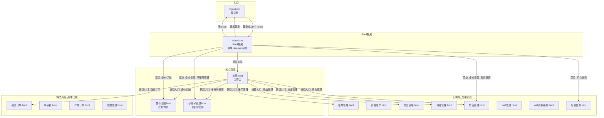

# 产品需求文档 (PRD) -- 货主端

---

## 0. 文档基础信息

- 文档标题：货主端（Shipper Portal）
- 版本号：v1.3
- 状态：草稿
- 作者：AI PM（v1.3: 整体刷新 — 对齐现行原型 12 页 + 「超级运价」2026-09-12 定稿优惠三表口径：优惠对象类型一期同时开放客户等级/客户特批、泡比优惠进入 Phase 1、超重超长拣货触发（未决项 E9 如实标注））
- 上一版：v1.2（货主端×客商中心数据融合 — 跨模块接口+登录校验链+融合业务规则）
- 评审人：产品/研发/测试/业务代表
- 计划里程碑：评审待定 / 提测待定 / 上线待定

### 0.1 关联链接

- 用户需求(RDD)：`drafts/货主端/2026-09-12-用户需求.md`
- 数据设计：`drafts/货主端/2026-09-12-数据设计.md`
- 需求背景：无（货主端基于整体 TMS 架构规划）
- 原型：`demo/货主端-demo/` — 实际存在 12 页：`index.html`(Shell) / `login.html` / `首页.html` / `查价订舱.html` / `子账号管理.html` / `角色管理.html` / `商品管理.html` / `地址管理.html` / `VAT管理.html` / `VAT资料新增.html` / `账单管理.html` / `资金账户.html` / `后台任务.html`
- 上游口径依据（★ 2026-09-12 新增）：
  - `drafts/超级运价/2026-09-12-PRD.md`（PRD V2.25）— 重点 §5.11 / §5.12 / §5.13 / §7.4
  - `drafts/超级运价/2026-09-12-用户需求.md`（RDD v5.7）
  - `drafts/超级运价/2026-09-12-数据设计.md`（v5.7）
  - `drafts/客商中心/2026-08-21-用户需求.md`

### 0.2 ⚠️ 原型待建页面（菜单已挂、页面文件不存在）

| 菜单项 | 所属菜单 | 原型状态 |
|--------|---------|---------|
| 我的订单（`我的订单.html`） | 订单中心 | ⚠️ **菜单已挂、页面待建** |
| 草稿箱（`草稿箱.html`） | 订单中心 | ⚠️ **菜单已挂、页面待建** |
| 异常订单（`异常订单.html`） | 订单中心 | ⚠️ **菜单已挂、页面待建** |
| 发票管理（`发票管理.html`） | 财务中心 | ⚠️ **菜单已挂、页面待建** |

> **说明**：`index.html` 侧边菜单与 `首页.html` 快捷入口均已挂上以上 4 项，但 `demo/货主端-demo/` 下**没有对应的 HTML 文件**。本文档**不把它们写成已完成的功能**，也不计入功能数。

---

## 1. 需求定义

### 1.1 背景与现状

当前货主（跨境卖家）的查价、订舱完全依赖人工沟通：在微信群询问销售报价，销售翻 Excel 查找后回复，货主确认后再口头下单。单次询价耗时 30 分钟到半天不等。货主无法自助获取报价，也无法自助管理企业内部的操作人员账号权限。

货主端的目标是为跨境卖家提供一个自助门户：登录后可在线查价、下单订舱、管理企业内部子账号，大幅降低对客服/销售的依赖，提升下单效率。

> **★ 变更（2026-09-12）**：查价的"透明度"要求升级——超级运价定稿后，报价由 **公布价 → 运费优惠 → 泡比优惠 → 附加费/附加费优惠 → 最终报价** 五段构成，且优惠对象类型一期同时开放**客户等级**与**客户特批**（特批 > 等级、不叠加）。货主端必须把这条计算链完整、可追溯到规则名地展示出来，否则会出现"同仓同货不同价、客户看不懂"的信任问题。

### 1.2 目标与成功口径

- 目标：货主能在 30 秒内自助完成多渠道比价，企业管理员能自助管理子账号
- 成功口径：
  - 单次询价耗时从 30 分钟降至 30 秒（数据来源：询价日志分析，评估窗口：上线后 4 周）
  - 子账号自助管理覆盖率 100%（不再需要客服代创建账号）
  - **（★ 2026-09-12 新增）报价构成可解释率 100%**：任一报价都能在费用明细中追溯到每条优惠的规则名与**优惠值（带符号）**；货主不需要问客服"为什么是这个价"

### 1.3 范围与边界

- In Scope（本期 P0）：
  - 登录认证（账号密码登录 + Token 校验 + 退出）
  - 首页工作台（指标卡片 + 快捷入口）
  - **查价订舱**（基础查询 + 包裹信息 + 查询筛选 + 按专线分组结果 + 费用明细 + 运输详情 + 超重超长提示条）
  - 子账号管理（列表/新增/编辑/冻结/分配资源）
  - 角色管理-货主端（列表/新增/编辑/分配资源/冻结）
  - **页面框架 Shell**（侧边菜单 + iframe 路由 + 顶部导航 + 标签页）
  - **后台任务**（任务列表 + 搜索）
- Out of Scope（本期不做，或复用其他模块）：
  - 订舱下单完整流程（依赖运单模块）
  - 询价历史记录（二期）
  - 忘记密码自助找回（MVP 通过客服重置）
  - 企业自助注册（MVP 通过员工端邀请入驻）
  - **⚠️ 我的订单 / 草稿箱 / 异常订单 / 发票管理**（菜单已挂、页面待建，见 §0.2）
  - 商品管理 / 地址管理 / VAT管理 / VAT资料新增 / 账单管理 / 资金账户（复用其他模块实体和接口，本 PRD 仅登记页面与功能点，不重复定义字段规格）
  - **三张优惠表中二期才开放的能力**：运费优惠/泡比优惠的**折扣率**、「**单次有效**」有效期类型、浮动优惠（优惠券/满减/限时活动）、叠加顺序可配。**★ 2026-09-12 补充**：**折扣率是乘数**（`<1` 折扣、`=1` 原价、`>1` 加价；一期 `0.01 ≤ 率 ≤ 1`，不支持加价），计算仍为 **`金额 × 率`**；**本次「优惠值正负号翻转」只作用于固定减免**（负数=减钱、正数=加价），**不改变折扣率口径**
  - **飞书审批流对接**（一期仅人工录入审批编号，系统内不做审批状态机）

### 1.4 影响范围

- 影响角色：货主运营、货主财务、企业管理员（货主侧）
- 依赖系统：员工端-客商中心（企业客户数据、客户等级）、员工端-超级运价（服务组合/运价行/附加费规则/运费优惠/泡比优惠/附加费优惠）、员工端-系统设置（角色定义）

---

## 2. 枚举字典

> 所有枚举字段的键值对集中定义，研发以此为准。与 数据设计 Schema 中的 TinyInt 值保持一致。

| 枚举名 | 值 | 常量名 | 中文 | 适用实体/字段 |
|--------|----|--------|------|-------------|
| Gender | 10 | MALE | 男 | sub_account.gender |
| Gender | 20 | FEMALE | 女 | sub_account.gender |
| SubAccountStatus | 10 | NORMAL | 正常 | sub_account.status |
| SubAccountStatus | 20 | FROZEN | 已冻结 | sub_account.status |
| BillingUnit | 10 | KG | 公斤 | 查价参数 / 报价结果.计价 |
| BillingUnit | 20 | CBM | 立方米(m³) | 查价参数 / 报价结果.计价 |
| TransportMode | SEA | SEA | 海运 | 渠道专线映射.运输方式 |
| TransportMode | AIR | AIR | 空运 | 渠道专线映射.运输方式 |
| LastMileMethod | TRUCK | 卡派 | 卡派 | 渠道专线映射.尾程派送 |
| LastMileMethod | EXPRESS | 快递派 | 快递派 | 渠道专线映射.尾程派送 |
| TaxMethod | 10 | TAX_INCLUDED | 包税 | 查价筛选.包税方式 |
| TaxMethod | 20 | TAX_EXCLUDED | 不包税 | 查价筛选.包税方式 |
| **TrunkLine** | — | `海卡` | 海卡（海运+卡派） | 查价筛选.渠道专线 / 结果分组 |
| **TrunkLine** | — | `海派` | 海派（海运+快递派） | 查价筛选.渠道专线 / 结果分组 |
| **TrunkLine** | — | `空卡` | 空卡（空运+卡派） | 查价筛选.渠道专线 / 结果分组 |
| **TrunkLine** | — | `空派` | 空派（空运+快递派） | 查价筛选.渠道专线 / 结果分组 |
| **ProductType** | — | `粉末` | 粉末 | 查价筛选.货物属性 |
| **ProductType** | — | `液体` | 液体 | 查价筛选.货物属性 |
| **ProductType** | — | `带电` | 带电 | 查价筛选.货物属性 |
| **ProductType** | — | `超大` | 超大 | 查价筛选.货物属性 |
| **ProductType** | — | `超重` | 超重 | 查价筛选.货物属性 |
| **ProductType** | — | `易碎` | 易碎 | 查价筛选.货物属性 |
| **ProductType** | — | `普货` | 普货 | 查价筛选.货物属性 |
| **DiscountTargetType** | 10 | CUSTOMER_SPECIAL | **客户特批** | 三张优惠表.优惠对象类型（**一期开放**） |
| **DiscountTargetType** | 20 | CUSTOMER_LEVEL | **客户等级** | 三张优惠表.优惠对象类型（**一期开放**） |
| **DiscountMode** | 10 | RATE | 折扣率（乘数） | 三张优惠表.优惠方式（**二期开放**）。**★ 2026-09-12 口径**：`<1` 折扣、`=1` 原价、`>1` 加价；一期 `0.01 ≤ 率 ≤ 1`（不支持加价）；计算 = **`金额 × 率`**（乘数语义，**不是金额增减**，**不受本次符号翻转影响**） |
| **DiscountMode** | 20 | FIXED | 固定减免 | 三张优惠表.优惠方式（**一期仅此项**）。**★ 2026-09-12 口径（符号翻转）**：**优惠值为带符号调整量**——**负数 = 减钱（正向优惠）**、**正数 = 加价（反向优惠）**；计算 = **`金额 + 优惠值`**（~~旧：`金额 − 优惠值`，即优惠值为正数表示减钱~~ 作废）；显示：负 → `-¥X`、正 → `+¥X`、0 → "全免" |
| **ValidityType** | 10 | PERMANENT | 永久有效 | 三张优惠表.有效期类型（**一期**） |
| **ValidityType** | 20 | FIXED_PERIOD | 固定期限 | 三张优惠表.有效期类型（**一期**） |
| **ValidityType** | 30 | SINGLE_USE | 单次有效 | 三张优惠表.有效期类型（**二期**） |
| **FeeDirection** | 10 | RECEIVABLE | 应收 | 三张优惠表.费用方向（**一期固定**） |
| **FeeDirection** | 20 | PAYABLE | 应付 | 三张优惠表.费用方向（**二期开放**） |
| **RoleType** | — | `系统默认` | 系统默认 | 角色管理.角色类型 |
| **RoleType** | — | `自定义` | 自定义 | 角色管理.角色类型 |
| **ZipPrefixZone** | — | `8xxxx` | 8 开头邮编区 | 查价.邮编（快递派加价 0） |
| **ZipPrefixZone** | — | `9xxxx` | 9 开头邮编区 | 查价.邮编（快递派加价 0.3/KG、40/m³） |
| **ZipPrefixZone** | — | `其他` | 其他邮编区 | 查价.邮编（快递派加价 0.15/KG、20/m³） |
| **SurchargeTagType** | 20 | SURCHARGE_TAG | 附加费标识 | `surcharge_rule.tag_id` → 基础资料-标识管理 `tag.id`（**单选且必选**，以单值存储；原 `tag_ids` 数组多选已废弃） |

> **★ 变更（2026-09-12）**：
> 1. ~~ProductType 仅 POWDER / LIQUID / BATTERY 三项~~ **作废**——原型查价「货物属性」为 **7 项**：粉末 / 液体 / 带电 / **超大 / 超重** / 易碎 / 普货（与商品管理-商品属性枚举一致）。
> 2. ~~TransportMode 由查价参数直接选择~~ **变更**——原型不再直接选运输方式，改为选**渠道专线**（运输方式 + 尾程派送的组合），运输方式由专线推导。
> 3. 新增 `DiscountTargetType` / `DiscountMode` / `ValidityType` / `FeeDirection` 四组优惠枚举，与超级运价 PRD §5.11 完全一致。
> 4. 新增 `RoleType` / `ZipPrefixZone` / `SurchargeTagType`。
> 5. **附加费标识（`tag_id`）**：超级运价定稿口径为 **单选且必选**（不分动作类型），引用基础资料-标识管理 `tag.id`（仅 `tag_type=20` 附加费标识且状态正常）；原 `tag_ids` 数组多选**已废弃**。⚠️ 超级运价 PRD 写 `小整数`、其数据设计写 `长整数`（上游文档内部不一致，货主端不对接该字段配置，仅记录）。
> 6. **★ 2026-09-12：优惠值正负号翻转（覆盖旧约定）** —— 固定减免的优惠值改为「**负数 = 减钱（正向优惠）、正数 = 加价（反向优惠）**」（~~原「正数=减价、负数=加价」~~ **作废**）；计算由 ~~`原金额 − 优惠值`~~ 改为 **`结果金额 = 原金额 + 优惠值`**；显示口径：负 → `-¥X`（减钱）、正 → `+¥X`（加价）、0 → 「全免」；附加费优惠的固定减免上限由 ~~`优惠值 ≤ 应收单价`~~ 改为 **`|优惠值| ≤ 应收单价`**（绝对值比较）。**折扣率（`DiscountMode=10 RATE`）口径不变**（乘数，计算仍为 `金额 × 率`）。

---

## 3. 状态机

### 3.1 子账号状态流转

```
[正常] ──{冻结}──> [已冻结]
  ^                  |
  └──{启用}──────────┘
```

| 当前状态 | 操作 | 目标状态 | 触发角色 | 校验条件 |
|---------|------|---------|---------|---------|
| 正常 | 冻结 | 已冻结 | 企业管理员 | 二次确认弹窗；不能冻结自己 |
| 已冻结 | 启用 | 正常 | 企业管理员 | 二次确认弹窗 |

### 3.2 角色状态流转

```
[正常] ──{冻结}──> [已冻结]
  ^                  |
  └──{启用}──────────┘
```

| 当前状态 | 操作 | 目标状态 | 触发角色 | 校验条件 |
|---------|------|---------|---------|---------|
| 正常 | 冻结 | 已冻结 | 企业管理员 | 二次确认弹窗；**ROOT 角色不可冻结**；冻结不影响已分配该角色的子账号权限 |
| 已冻结 | 启用 | 正常 | 企业管理员 | 二次确认弹窗 |

### 3.3 优惠规则状态流转（★ 2026-09-12 新增，引用超级运价口径）

```
[生效中] ──{固定期限到期}──> [已失效]
```

| 当前状态 | 操作/触发 | 目标状态 | 说明 |
|---------|----------|---------|------|
| 生效中(10) | 固定期限到期 | 已失效(20) | 系统自动维护，货主端不可改 |
| 生效中(10) | 手动修改 | — | ⚠️ **不可手动修改**（系统自动维护）；货主端只读消费 |

> **说明**：三张优惠表的 `status` 由超级运价侧系统自动维护，货主端**不提供任何优惠配置入口**，仅在查价时按 `status=生效中` 过滤参与匹配。二期「单次有效」被非取消运单引用后自动失效，一期不开放该有效期类型。
>
> **★ 变更（2026-09-12，优惠值正负号翻转）**：优惠规则的**金额语义**与状态无关但需一并明确——**固定减免（`DiscountMode=20`）的优惠值为带符号调整量**（负数=减钱、正数=加价，计算 `金额 + 优惠值`）；**折扣率（`DiscountMode=10`）为乘数**（计算 `金额 × 率`，`<1` 折扣 / `=1` 原价 / `>1` 加价，一期 `0.01 ≤ 率 ≤ 1` 不支持加价）。~~旧口径「固定减免正数=减价、负数=加价，计算 `金额 − 优惠值`」~~ 作废。

---

## 4. 功能清单与页面映射

> **★ 变更（2026-09-12）**：本表按**现行原型实际页面**重排——新增 账单管理 / 资金账户 / 后台任务 / 商品管理 / 地址管理 / VAT管理 / VAT资料新增；`收货地址管理` 改名 **地址管理**；`充值与流水` 改名 **资金账户**；查价订舱按实际能力拆为 12 行；4 个待建页面单独列出**不计入功能数**。

| 模块 | 功能点 | 优先级 | 对应页面 | 页面类型 |
|------|--------|--------|---------|---------|
| 框架 Shell | 侧边菜单 + iframe 路由 | P0 | index.html | Shell 框架 |
| 框架 Shell | 顶部导航 + 面包屑 + 退出登录 | P0 | index.html | Shell 框架 |
| 框架 Shell | Token 校验与登录拦截 | P0 | index.html | Shell 框架 |
| 登录认证 | 账号密码登录 | P0 | login.html | 登录页 |
| 登录认证 | 记住密码 + 表单校验 | P0 | login.html | 登录页 |
| 首页 | 业务指标卡片（4个） | P0 | 首页.html | 工作台 |
| 首页 | 快捷入口网格（7个） | P0 | 首页.html | 工作台 |
| 查价订舱 | 基础查询（国家/仓库代码/交货地/邮编 + 互斥联动） | P0 | 查价订舱.html | 查询页 |
| 查价订舱 | 包裹信息（简易录入 / 多件装箱 + 汇总含泡比） | P0 | 查价订舱.html | 查询页 |
| 查价订舱 | 查询条件筛选（渠道专线/货物属性/包税方式） | P0 | 查价订舱.html | 查询页 |
| 查价订舱 | 按专线分组的多组合报价结果（10 列） | P0 | 查价订舱.html | 查询页 |
| 查价订舱 | 费用明细五段式计算链 | P0 | 查价订舱.html | 弹窗 |
| 查价订舱 | 运输详情（当周船期×交货地截单矩阵） | P0 | 查价订舱.html | 弹窗 |
| 查价订舱 | 运费优惠匹配（特批>等级，不叠加） | P0 | 查价订舱.html | 查询页 |
| 查价订舱 | 泡比优惠匹配（取阈值最大档，仅 KG） | P0 | 查价订舱.html | 查询页 |
| 查价订舱 | 附加费优惠匹配（与运费优惠独立） | P0 | 查价订舱.html | 查询页 |
| 查价订舱 | 超重超长拣货实测提示条 | P0 | 查价订舱.html | 查询页 |
| 查价订舱 | 报价免责声明 | P0 | 查价订舱.html | 查询页 |
| 子账号管理 | 子账号列表 + 搜索（4条件+7列，不展示ROOT） | P0 | 子账号管理.html | 列表页 |
| 子账号管理 | 新增/编辑子账号（邮箱非必填+手机号数字校验） | P0 | 子账号管理.html | 列表页+弹窗 |
| 子账号管理 | 冻结/启用子账号（ROOT保护） | P0 | 子账号管理.html | 列表页 |
| 子账号管理 | 分配角色资源（ROOT+启用角色范围） | P0 | 子账号管理.html | 列表页+弹窗 |
| 子账号管理 | 修改子账号密码 | P0 | 子账号管理.html | 列表页+弹窗 |
| 角色管理 | 角色列表 + 搜索（角色名称/角色类型，不展示ROOT） | P0 | 角色管理.html | 列表页 |
| 角色管理 | 新增/编辑角色（角色代码+角色名称） | P0 | 角色管理.html | 列表页+弹窗 |
| 角色管理 | 分配资源（权限树，同员工端，ROOT范围上限） | P0 | 角色管理.html | 列表页+弹窗 |
| 角色管理 | 冻结/启用角色（ROOT保护） | P0 | 角色管理.html | 列表页 |
| 后台任务 | 后台任务列表 + 搜索（任务编号/模块名称/任务状态/任务结果） | P0 | 后台任务.html | 列表页 |
| 账单管理（引用） | 待确认账单 / 已确认账单 / 账单明细 | P0 | 账单管理.html | 标签页列表 |
| 资金账户（引用） | 账户余额 / 资金流水 / 充值 | P0 | 资金账户.html | 标签页列表 |
| 商品管理（引用） | 货主自有商品库维护 | P0 | 商品管理.html | 列表页 |
| 地址管理（引用） | 发货/退货地址维护 | P0 | 地址管理.html | 列表页 |
| VAT管理（引用） | VAT 税号自助管理 + VAT资料新增 | P0 | VAT管理.html / VAT资料新增.html | 列表页+表单页 |

**⚠️ 菜单已挂、页面待建（不计入功能数）**

| 菜单项 | 所属菜单 | 原型状态 |
|--------|---------|---------|
| 我的订单（`我的订单.html`） | 订单中心 | 菜单已挂、页面待建 |
| 草稿箱（`草稿箱.html`） | 订单中心 | 菜单已挂、页面待建 |
| 异常订单（`异常订单.html`） | 订单中心 | 菜单已挂、页面待建 |
| 发票管理（`发票管理.html`） | 财务中心 | 菜单已挂、页面待建 |

### 4.1 页面导航关系图

> **★ 变更（2026-09-12）**：按现行原型 `index.html` 菜单重绘——`我的订单/草稿箱/异常订单/发票管理` 标注为**待建（虚线）**；`充值与流水` 改为 `资金账户`；补 `地址管理 / VAT管理 / 后台任务`。



---

## 5. 页面规格

### 5.1 登录页 (login.html)

**页面信息**：
- 路径：`/login.html`
- 类型：登录页
- 访问角色：所有货主用户（含子账号）

**布局**：左右分栏
- 左侧：品牌视觉区（背景图 + 品牌标语 + 数据看板装饰卡片）
- 右侧：登录表单区（360px 宽，居中）

**字段表**：

| 字段名 | 中文名 | 类型 | 必填 | 默认值 | 校验规则 | 数据来源 | 备注 |
|--------|--------|------|------|--------|---------|---------|------|
| username | 账号 | 文本 | ✅ | -- | 必填；长度>=3 | 用户输入 | 支持账号或邮箱 |
| password | 密码 | 文本 | ✅ | -- | 必填；长度>=6 | 用户输入 | 支持显示/隐藏切换 |
| rememberMe | 记住密码 | Boolean | -- | false | -- | 前端 localStorage | 非敏感令牌，仅记住账号 |

**交互行为**：
- [登录]：点击"立即登录"按钮或回车键 -> 前端表单校验 -> 校验通过后调用登录接口 -> Loading 状态 -> 成功后：
  1. `localStorage.setItem('shipper_token', token)`
  2. `localStorage.setItem('shipper_username', username)`
  3. Toast 提示"登录成功！正在跳转..."
  4. 1 秒后跳转 `index.html`
- [登录失败]：接口返回错误 -> Toast 提示错误信息（如"账号或密码错误"） -> 不跳转
- [记住密码]：勾选后，下次访问自动填充账号（存在 localStorage）
- [忘记密码]：点击跳转忘记密码页（MVP 可暂时无功能，仅链接占位）
- [注册]：底部"立即免费注册"链接（MVP 可暂时无功能）

**关联接口**：
- 登录：`POST /api/shipper/auth/login` (body: {username, password}) -> {token, username, customer_id, customer_name}

---

### 5.2 首页工作台 (首页.html)

**页面信息**：
- 路径：`/首页.html`（通过 index.html Shell 的 iframe 加载）
- 类型：工作台
- 访问角色：所有已登录货主用户
- 前置条件：`localStorage.shipper_token` 存在

**区域一：欢迎语**

| 字段名 | 中文名 | 类型 | 数据来源 | 备注 |
|--------|--------|------|---------|------|
| username | 当前用户名 | 文本 | `localStorage.shipper_username` | 展示"欢迎回来，{username}！"；无值时降级为"客户企业名称" |
| subtitle | 副标题 | 文本 | 静态 | "这里是您的专属物流工作台。" |

**区域二：指标卡片（4 个）**

| 卡片 | 指标名 | 数据来源 | 备注 |
|------|--------|---------|------|
| 卡片1 | 待发货订单 | 后端统计接口 | 数值 + 标签（原型演示值 12） |
| 卡片2 | 运输中订单 | 后端统计接口 | 数值 + 标签（原型演示值 5） |
| 卡片3 | 待付账单 | 后端统计接口 | 数值 + 标签（原型演示值 2） |
| 卡片4 | 本月发货量(KG) | 后端统计接口 | 数值 + 标签（原型演示值 1,250） |

**区域三：快捷入口（7 个）**

| 入口 | 跳转目标 | 说明 |
|------|---------|------|
| 查价订舱 | `查价订舱.html` | 核心功能，卡片可点击 |
| 我的订单 | `我的订单.html` | ⚠️ **菜单已挂、页面待建** |
| 账单管理 | `账单管理.html` | 财务中心（引用） |
| 商品管理 | `商品管理.html` | 基础资料（引用） |
| **地址管理** | `地址管理.html` | 基础资料（引用）**★ 2026-09-12：原名"收货地址管理"** |
| 角色管理 | `角色管理.html` | 企业设置 |
| 子账号管理 | `子账号管理.html` | 企业设置（本期） |

**交互行为**：
- [快捷入口点击]：通过 `window.parent.postMessage({ type: 'navigate', url: url }, '*')` 通知 Shell 框架切换 iframe 页面

**关联接口**：
- 指标统计：`GET /api/shipper/dashboard/stats` -> {pendingOrders, inTransitOrders, pendingBills, monthlyVolume}

---

### 5.3 查价订舱 (查价订舱.html) -- 核心功能

**页面信息**：
- 路径：`/查价订舱.html`
- 类型：查询页（查询条件 + 结果展示，上下结构）
- 访问角色：所有已登录货主用户
- 前置依赖：员工端已完成运价配置（当前周批次状态 = CURRENT）；超级运价侧已配置三张优惠表
- **不展示**：成本底价、利润、盈亏标识（`caller=shipper` 字段过滤）

#### 区域一：基础查询（第一行）

| 字段名 | 中文名 | 类型 | 必填 | 默认值 | 校验规则 | 数据来源 | 备注 |
|--------|--------|------|------|--------|---------|---------|------|
| destCountry | 国家 | 单选下拉 | ✅ | 空 | 必填 | 系统可用国家列表 | placeholder="请选择国家"，原型取值：美国 |
| warehouse | 仓库代码 | 下拉搜索 | 条件必填 | 空 | 可清空；**与邮编互斥** | FBA 仓点列表 | ONT8 / LAX9 / LGB8 / SBD1 / DFW6 / SMF3 |
| deliveryRegion | 交货地(收货仓) | 单选下拉 | -- | 空 | 可清空 | 交货地列表 | 珠三角 / 汕头 / 义乌 / 宁波。未选时含拖车费影响因素（有交货地）的组合不返回 |
| zip | 邮编(快递派) | 文本输入 | 条件必填 | 空 | 可清空；**与仓库代码互斥** | 用户输入 | 仅快递派组合生效，按前缀 8xxxx/9xxxx/其他 计价 |
| — | 包裹信息 | 内联面板触发 | ✅ | 空 | 必填 | 用户输入 | 空时显示"请输入包裹信息"；有数据时摘要显示 `总重KG、总体积m³、件数` |
| — | [查询报价] | 按钮 | -- | — | — | — | 触发七步匹配引擎 |

> **必填校验口径**：`国家` 必填（提示"请选择国家"）；`仓库代码 或 邮编` **至少填一个**（均空提示"请选择仓库代码或填写邮编"）；`包裹信息` 必填（空提示"请填写包裹信息"并自动展开包裹面板）。

#### 区域二：包裹信息内联面板（非弹窗）

- 顶部「简易录入 / 多件装箱」切换，`el-radio-button`，**默认简易录入**
- **简易录入**：总重量(kg) + 总体积(m³) 两个数字输入框，`controls-position="right"`，precision 分别为 1 / 3
- **多件装箱**：表格列 `件数* / 长(cm)* / 宽(cm)* / 高(cm)* / 单件实重(kg)* / 操作`（操作 = 复制 / 删除），**无序号列、无均件速填**；底部「+ 添加规格」按钮
- **汇总条**：总件数（多件装箱时） / 总实重 / 总体积 / 总材重（多件装箱且有尺寸时） / **泡比 = 总实重 ÷ 总体积（kg/m³）**
- 精度：重量 0.1KG，体积 0.001m³，尺寸 0.1cm

#### 区域三：查询条件筛选（第二行，随查询一起提交）

| 筛选项 | 控件 | 枚举来源 | 说明 |
|--------|------|---------|------|
| 渠道专线 | 多选复选框 | 海卡 / 海派 / 空卡 / 空派 | 控制结果分组；**与邮编联动**（填邮编自动切快递派专线，清空切回卡派专线） |
| 货物属性 | 下拉多选 | 粉末 / 液体 / 带电 / 超大 / 超重 / 易碎 / 普货 | 命中附加费规则（placeholder="不限"） |
| 包税方式 | 下拉多选 | 包税 / 不包税 | 过滤组合（placeholder="不限"） |
| [重置筛选] | 文本按钮 | — | 恢复筛选默认值 |

**渠道专线映射**：

| 专线 | 运输方式 | 尾程派送 |
|------|---------|---------|
| 海卡 | 海运 | 卡派 |
| 海派 | 海运 | 快递派 |
| 空卡 | 空运 | 卡派 |
| 空派 | 空运 | 快递派 |

#### 区域四：结果区顶部 —— 超重超长提示条（★ 2026-09-12 新增）

- 位置：报价结果区**上方**，`el-alert` type="warning" show-icon :closable="false"
- 标题：「**超重超长费用将在拣货实测后计算**」
- 正文：「以下报价依据您填写的箱数 / 尺寸 / 重量**预估**得出。其中**超重、超长**类附加费需以**货物入仓后拣货实测的尺寸与重量**为最终判定依据，**实际费用以实测结果为准**（可能高于或低于此处预估值）。」

> **★ E9 已定（2026-09-12，产品确认）**：**★ E9 已定（2026-09-12，产品确认）**：查价阶段**能否**算出「超重超长」**取决于包裹信息的录入方式**，不是"算不算"的问题 ——① **按单箱录入**（填了长/宽/高）→ **可以算**：超重超长按公式判定（该规则计价单位**仅按箱**）、**体积重 = 长×宽×高 ÷ 计泡系数** → **在查价结果中作预估展示**；② **按总体重量与体积录入**（无单箱长宽高）→ **算不出，不展示该项**。**正式计费仍以「拣货实测」为准**（客户自填尺寸仅供预估），故结果区提示条**保留**并继续声明"以拣货实测为准"；**规则口径不变**：「字段&公式」型规则的**正式触发与费用流水生成仍在「拣货」节点**，查价阶段只是**预估展示、不落库、不进账单**。

#### 区域五：结果区二次筛选

| 筛选项 | 控件 | 说明 |
|--------|------|------|
| 服务组合 | 输入框（可清空） | 按服务组合名称模糊匹配 |
| 目的港 | 下拉（可清空） | 长滩港 / 洛杉矶港 / 奥克兰港 / 洛杉矶机场 |
| 计费方式 | 多选复选框 | KG / m³ |

#### 区域六：报价结果表格（10 列，按专线分组折叠，默认展开）

> **★ 变更（2026-09-12）**：结果表列**完全重排**，与超级运价 PRD §5.13「货主端在线询价结果表列」逐列对齐。**本页无「优惠后」列**（「优惠后」仅运营端 §5.12 有）。
>
> **★ 变更（2026-09-12）：优惠值正负号翻转（覆盖旧约定，本页与全文统一）**
> - 固定减免的**优惠值本身带符号**：**负数 = 减钱（正向优惠）**；**正数 = 加价（反向优惠）**。旧约定「~~正数=减价、负数=加价~~」**全部作废**。
> - 计算方式随之改变：**`结果金额 = 原金额 + 优惠值`**（~~原 `原金额 − 优惠值`~~ 作废）。
> - 显示口径：优惠值为负 → **`-¥X`（减钱）**；为正 → **`+¥X`（加价）**；为 0 → **「全免」**。
> - 上限校验：附加费优惠的固定减免上限由 ~~`优惠值 ≤ 应收单价`~~ 改为 **`|优惠值| ≤ 应收单价`**（绝对值比较）。
> - **折扣率不变**（乘数：`<1` 折扣、`=1` 原价、`>1` 加价；一期 `0.01 ≤ 率 ≤ 1` 不支持加价；计算仍是 `金额 × 率`）。
> - 本文档所有「减免额」表述统一改称 **「优惠值（带符号）」**。

| # | 列名 | 字段名 | 类型 | 宽度 | 说明 |
|---|------|--------|------|------|------|
| 1 | 服务组合 | channel | 文本 | min-width 230 | 完整组合名，如"美森360-海运-卡派-KG-包税-散货" |
| 2 | 交货地 | regions | 文本 | min-width 120 | 顿号分隔，如"珠三角、汕头、义乌、宁波" |
| 3 | 计价 | billing | 文本 | 50 | "KG" 或 "m³" |
| 4 | 公布价 | price | 文本 | 95 | 如"¥10.0/KG"；未匹配运价行显示"—" |
| 5 | 运费优惠 | discRule | 文本 | 125 | 规则名 + **优惠值**（带符号：负=减钱显示 `-¥X`、正=加价显示 `+¥X`、为 0 显示"全免"），如"特批·深圳市XX科技 -¥1.50"；无命中显示"—" |
| 6 | 泡比优惠 | ddRule | 文本 | 120 | 规则名 + **优惠值**（带符号，如"泡比500≥400 -¥1.0"，值为负即减钱）；无命中显示"—"；**仅 KG 计价行** |
| 7 | 附加费 | surcharges | 文本数组 | min-width 150 | 逐条展示**优惠后金额 = 应收单价 + 附加费优惠值**，如"粉末品名加收 +¥1.50/KG"；无则显示"无" |
| 8 | 附加费优惠 | scDiscs | 文本数组 | min-width 140 | 逐条"附加费名 · 规则名 优惠值"（带符号：负=减钱显示 `-¥X`、正=加价显示 `+¥X`、为 0 显示"全免"）；无则显示"—" |
| 9 | 最终报价 | finalPrice | 文本加粗 | 105 | 按 **`(公布价 + 运费优惠值 + 泡比优惠值) + (附加费合计 + 附加费优惠值合计)`** 计算，如"¥10.0/KG"；未匹配运价行显示橙色"暂未报价" |
| 10 | 操作 | — | 按钮 | 110，fixed right | **[查看运输详情]** |

**结果分组**：
- 按渠道专线分组（海卡 / 海派 / 空卡 / 空派），分组头显示「分组名 + N 个报价」标签 + 展开/收起
- **默认展开**；点击分组头可收起
- 筛选后无结果时展示"当前筛选条件下无匹配报价"

#### 区域七：费用明细弹窗（五段式计算链）

点击费用明细（原型中通过结果行展开触发）后按以下五段展示：

| 段 | 表头 | 内容 |
|----|------|------|
| ① | 公布价 | 匹配重量段 + 公布价 |
| ② | 运费优惠 | 命中规则的「规则名 + **优惠值**（为负显示 `-¥X/单位`、为正显示 `+¥X/单位`、为 0 显示"全免"）」→ **优惠后公布价 = 公布价 + 运费优惠值**；无命中显示"当前客户无运费优惠" |
| ③ | 附加费 | 逐条「附加费名 + 原价 +¥X（附加费优惠值标注，带符号）→ +¥Y」+ **附加费合计 = Σ(附加费原价 + 附加费优惠值)**；无则显示"无附加费" |
| ④ | 泡比优惠 | 命中规则的「规则名 + **优惠值**，为负显示 `-¥X/单位`」；未命中显示"未命中泡比优惠（实重÷体积 < 阈值）" |
| ⑤ | 最终报价 | 最终报价（~~公布价-运费优惠+附加费-泡比优惠~~ **★ 2026-09-12**：`(公布价 + 运费优惠值 + 泡比优惠值) + (附加费合计 + 附加费优惠值合计)`）+ 计费量 + **估算运费** |

> **★ 变更（2026-09-12，符号翻转）**：上表五段链中每条优惠的金额一律为**带符号优惠值**——为负显示 `-¥X`（减钱）、为正显示 `+¥X`（加价）、为 0 显示"全免"；每一段的「优惠后」金额一律按 **`原金额 + 优惠值`** 计算（~~旧口径 `原金额 − 优惠值`~~ 作废）。
>
> 弹窗底部提示："*不含成本底价和盈亏标识，估算运费为演示参考，实际结算以运单为准"

#### 区域八：运输详情弹窗（当周船期 × 各交货地截单矩阵）

- 标题：「运输详情 — {服务组合}」
- 行 = 当周该渠道关联航线的每条船期；固定列 = `船期名 / ETD / ETA / 最快提取`；动态列 = 该服务组合覆盖的每个交货地一列（列头「{交货地} 截单」）
- 取值：截单日 = `sailing_schedule.cutoff_times[交货地]`；某船期未覆盖某交货地则该格显示"—"
- **兜底**：该渠道未绑定航线或当周无船期时，弹窗显示"当周暂无船期"
- 底部说明："※ 截单日为该交货地最晚收货/截单时间，请在对应日期前将货交至该地。"

#### 区域九：免责声明

- 文案："*本报价为预估参考，不含成本底价和盈亏标识。实际结算以运单为准。"

#### 交互行为

- [查询报价]：点击按钮 -> 前端必填校验（国家 / 仓库代码或邮编 / 包裹信息） -> 调用报价查询接口 -> 返回结果按专线分组渲染
- [仓库代码↔邮编互斥]：填邮编 -> 自动清空仓库代码并提示"仓库代码与邮编不能同时存在，已清空仓库代码" + 专线自动切快递派；填仓库代码 -> 自动清空邮编并提示 + 专线自动切回卡派
- [包裹面板切换]：简易录入 ↔ 多件装箱，切换后按当前模式重算总重/总体积
- [添加规格 / 复制 / 删除]：多件装箱支持添加规格行、复制当前行、删除行（至少保留 1 行）
- [结果二次筛选]：仅前端过滤已返回结果，不重新请求接口
- [货物属性多选]：选中的属性命中附加费规则时叠加对应加收并应用附加费优惠（**附加费优惠值为带符号调整量**，`附加费优惠后金额 = 应收单价 + 附加费优惠值`）
- [运费优惠]：按 客户特批 > 客户等级 匹配，**只取一条参与计算**；命中金额为**带符号优惠值**（负数=减钱、正数=加价）
- [泡比优惠]：泡比 ≥ 密度阈值命中，**多条命中取阈值最大一档**，**仅作用于 KG 计价行**；命中金额同为**带符号优惠值**
- [附加费优惠]：绑定附加费规则匹配，**与运费优惠独立计算**；命中金额同为**带符号优惠值**，其固定减免上限按 **`|优惠值| ≤ 应收单价`** 校验
- [超重超长]：**★ E9 已定（2026-09-12）** —— **按单箱录入（有多件装箱的长/宽/高）时**，查价阶段**即计算并展示**超重超长与体积重（预估）；**按总体重量与体积录入时算不出、不展示**。正式计费仍以**拣货实测**为准，预估**不落库、不进账单**

#### 关联接口

- 报价查询：`POST /api/freight-rate/query`，**`caller=shipper` 置于请求体**（统一报价接口，2026-09-12 D4 定案）；详见 §9 接口清单
  - 请求（示意）：`{ country, warehouseCode | zip, deliveryRegion, cargoMode, cargoSimple{weight,volume} | cargoItems[{qty,l,w,h,wt}], trunkLines[], productTypes[], taxMethods[], caller:'shipper' }`
  - 返回（示意）：按专线分组的 `results[{ serviceCombinationCode, deliveryRegions[], billingUnit, publishedPrice, freightDiscount{ruleName,amount(带符号优惠值：负=减钱、正=加价)}, densityDiscount{ruleName,amount(带符号优惠值)}, surcharges[{name,amount,after}], surchargeDiscounts[{ruleName,amount(带符号优惠值)}], finalPrice, sailings[{routeName,etd,eta,fastestPickup,cutoffTimes{交货地:日期}}] }]`
  - **不返回**：成本底价、利润、盈亏标识

---

### 5.4 子账号管理 (子账号管理.html)

**页面信息**：
- 路径：`/子账号管理.html`
- 类型：列表页（搜索 + 表格 + 分页 + 弹窗）
- 访问角色：企业管理员
- 前置依赖：角色已在系统设置模块定义
- **列表过滤规则**：默认不展示 ROOT 账号（`is_root=true`的记录）

**区域一：搜索条件**

| 字段名 | 中文名 | 类型 | 必填 | 校验规则 | 备注 |
|--------|--------|------|------|---------|------|
| account | 账号 | 文本 | — | — | 模糊搜索 |
| email | 邮箱 | 文本 | — | — | 模糊搜索 |
| name | 姓名 | 文本 | — | — | 模糊搜索 |
| phone | 手机号 | 文本 | — | — | 模糊搜索 |

**按钮**：搜索、重置、新增子账号

**区域二：子账号列表（7列）**

| 列名 | 字段名 | 类型 | 说明 |
|------|--------|------|------|
| 账号 | account | 文本 | 登录用户名 |
| 姓名 | name | 文本 | 姓氏+名字 |
| 性别 | gender | 文本 | 男/女 |
| 手机号 | phone | 文本 | — |
| 邮箱 | email | 文本 | 超长省略 + tooltip |
| 状态 | status | 标签 | 正常(绿色tag) / 已冻结(红色tag) |
| 操作 | — | 按钮组 | 编辑 / 分配资源 / 冻结或启用（+ 修改密码，**见下方原型现状**） |

> **⚠️ 原型现状（2026-09-12 核对）**：`子账号管理.html` 操作列**当前只有 编辑 / 分配资源 / 冻结(启用)**，**没有「修改密码」按钮**。「修改密码」为文档侧设计口径，原型待补齐。

**弹窗一：新增/编辑子账号**

| 字段名 | 中文名 | 类型 | 必填 | 默认值 | 校验规则 | 备注 |
|--------|--------|------|------|--------|---------|------|
| account | 账号 | 文本 | ✅ | — | 同企业内唯一 | 登录用户名 |
| lastName | 姓 | 文本 | ✅ | — | — | — |
| firstName | 名 | 文本 | ✅ | — | — | — |
| gender | 性别 | 单选 | ✅ | 男 | — | 男/女 |
| phone | 手机号 | 文本 | ✅ | — | 仅限数字 | `type="number"` |
| email | 邮箱 | 文本 | — | — | — | **非必填**（原型无必填星标） |

**弹窗二：分配资源（角色）**

| 区域 | 内容 | 说明 |
|------|------|------|
| 账号信息(只读) | 账号 + 姓名 | 确认操作对象 |
| 角色选择 | 多选下拉 | 选项范围：ROOT角色 + 所有启用状态的角色 |
| 提示文字 | "子账号的系统权限将由所选角色的权限组合决定" | 静态提示 |

**弹窗三：修改密码**（文档侧设计口径，原型待补齐）

| 字段名 | 中文名 | 类型 | 必填 | 校验规则 | 备注 |
|--------|--------|------|------|---------|------|
| newPassword | 新密码 | 文本(password) | ✅ | 长度>=6 | 支持显示/隐藏切换 |
| confirmPassword | 确认密码 | 文本(password) | ✅ | 与新密码一致 | 不一致时标红提示 |

**交互行为**：
- [搜索]：输入搜索条件 -> 点击搜索 -> 列表过滤
- [重置]：清空所有搜索条件
- [新增]：点击"新增子账号" -> 弹窗标题"新增子账号" -> 表单置空 -> 填写（**邮箱非必填**） -> 确定 -> 列表新增 -> Toast "新增子账号成功"
- [编辑]：点击编辑 -> 弹窗标题"编辑子账号" -> 回填当前数据 -> 修改 -> 确定 -> 列表更新 -> Toast "编辑子账号成功"
- [冻结]：点击正常账号的"冻结" -> `ElMessageBox.confirm`(type: warning) 二次确认："确定要冻结账号 [{account}] 吗？" -> 确认后状态变"已冻结" -> 标签变红 -> Toast 成功
- [启用]：点击已冻结账号的"启用" -> 二次确认："确定要启用账号 [{account}] 吗？" -> 确认后状态变"正常" -> 标签变绿 -> Toast 成功
- [分配资源]：点击"分配资源" -> 弹窗展示账号+姓名(只读) + 角色多选(ROOT+启用角色) -> 选择角色 -> 确定 -> Toast "成功为账号 [{account}] 分配角色"
- [修改密码]：点击"修改密码" -> 弹窗 -> 输入新密码+确认 -> 确定 -> Toast "密码修改成功"
- [保存校验]：必填字段为空 -> Toast 提示"请完善必填信息"
- [ROOT账号保护]：企业管理员不能冻结/删除自己（ROOT账号）

**关联接口**：
- 列表查询：`GET /api/shipper/sub-account/list` (params: {account, email, name, phone, page, pageSize}) -> {list: [], total: N}
- 新增：`POST /api/shipper/sub-account` (body: {account, lastName, firstName, gender, phone, email})
- 编辑：`PUT /api/shipper/sub-account/{id}` (body: 同新增)
- 冻结/启用：`PATCH /api/shipper/sub-account/{id}/status` (body: {status: 10|20})
- 分配角色：`PUT /api/shipper/sub-account/{id}/roles` (body: {roleIds: [1,2,3]})
- 修改密码：`PUT /api/shipper/sub-account/{id}/password` (body: {newPassword})

---

### 5.5 Shell 框架 (index.html)

**页面信息**：
- 路径：`/index.html`
- 类型：Shell 框架（侧边菜单 + 顶部导航 + iframe 路由 + 标签页）
- 访问角色：所有已登录货主用户
- 加载首屏：`首页.html`

**侧边菜单结构（★ 2026-09-12 按现行原型 `index.html` 重排）**：

```
首页（首页.html）
查价订舱（查价订舱.html）
订单中心
  ├── 我的订单（我的订单.html）        ⚠️ 菜单已挂、页面待建
  ├── 草稿箱（草稿箱.html）            ⚠️ 菜单已挂、页面待建
  └── 异常订单（异常订单.html）        ⚠️ 菜单已挂、页面待建
财务中心
  ├── 资金账户（资金账户.html）        ★ 原「充值与流水」改名
  ├── 账单管理（账单管理.html）
  └── 发票管理（发票管理.html）        ⚠️ 菜单已挂、页面待建
基础资料
  ├── 商品管理（商品管理.html）
  ├── 地址管理（地址管理.html）        ★ 原「收货地址管理」改名
  └── VAT管理（VAT管理.html）          （另有 VAT资料新增.html 二级表单页）
企业设置
  ├── 角色管理（角色管理.html）
  └── 子账号管理（子账号管理.html）
后台任务（后台任务.html）              ★ 2026-09-12 新增：顶层菜单项
```

> **⚠️ 差异说明**：原 PRD 菜单写「充值与流水（充值与流水.html）」，原型实际为 **资金账户（资金账户.html）**，且无 `充值与流水.html` 文件。**以原型为准**。

**顶部导航**：
- 左侧：折叠按钮 + 面包屑导航（首页 / {一级菜单} / {二级菜单}）
- 右侧：全屏按钮 + 通知图标(badge=3) + 用户下拉(个人中心/企业认证/退出登录)

**标签页**：
- 当前打开页面名称（单标签页展示，后续可扩展为多标签）

**Token 校验逻辑**（研发重点）：
1. `index.html` 加载时，立即检查 `localStorage.getItem('shipper_token')`
2. 若 token 不存在或为空 -> `ElMessage.warning('请先登录')` -> `window.location.href = 'login.html'`
3. 若 token 存在 -> 正常渲染 Shell 框架，加载 `首页.html` 到 iframe

**退出登录逻辑**：
1. 点击"退出登录"
2. `localStorage.removeItem('shipper_token')`
3. `localStorage.removeItem('shipper_username')`
4. `ElMessage.success('已退出登录')`
5. 500ms 后 `window.location.href = 'login.html'`

**iframe 跨页面路由**：
- Shell 框架监听 `window.message` 事件
- 当收到 `{ type: 'navigate', url: '...' }` 时：
  1. 更新 `activeMenu` 为 url 的 base 部分（去 query）
  2. 更新 `currentIframeSrc` 为完整 url

---

### 5.6 角色管理-货主端 (角色管理.html)

**页面信息**：
- 路径：`/角色管理.html`
- 类型：列表页（搜索 + 表格 + 分页 + 弹窗）
- 访问角色：企业管理员
- 前置依赖：企业已完成入驻，ROOT角色已自动生成
- **列表过滤规则**：默认不展示 ROOT 角色（系统内置，不可管理）

**区域一：搜索条件**

| 字段名 | 中文名 | 类型 | 必填 | 备注 |
|--------|--------|------|------|------|
| roleName | 角色名称 | 文本 | — | 模糊搜索 |
| roleType | 角色类型 | 单选下拉 | — | **取值：系统默认 / 自定义**（原型口径） |

**按钮**：搜索、重置、新增角色

**区域二：角色列表（5列）**

| 列名 | 字段名 | 类型 | 说明 |
|------|--------|------|------|
| 角色名称 | roleName | 文本 | — |
| 角色代码 | roleCode | 文本 | 唯一标识 |
| 状态 | status | 标签 | 正常(绿色tag) / 已冻结(红色tag) |
| 备注 | remark | 文本 | 超长省略+tooltip |
| 操作 | — | 按钮组 | 编辑 / 分配资源 / 冻结或启用 |

**弹窗一：新增/编辑角色**

| 字段名 | 中文名 | 类型 | 必填 | 校验规则 | 备注 |
|--------|--------|------|------|---------|------|
| roleCode | 角色代码 | 文本 | ✅ | 同企业内唯一 | 唯一标识 |
| roleName | 角色名称 | 文本 | ✅ | — | — |

**弹窗二：分配资源**（内容同员工端分配资源）

| 区域 | 内容 | 说明 |
|------|------|------|
| 角色信息(只读) | 角色名称 + 角色代码 | 确认操作对象 |
| 资源权限树 | 三级权限树（菜单/页面/按钮） | 内容同员工端分配资源 |
| 权限范围约束 | 可选资源范围 = ROOT角色拥有的全部资源 | 不可超出ROOT权限范围 |

**交互行为**：
- [搜索]：输入角色名称/角色类型 -> 点击搜索 -> 列表过滤
- [重置]：清空所有搜索条件
- [新增]：点击"新增角色" -> 弹窗 -> 填写角色代码+角色名称 -> 确定 -> 列表新增 -> Toast "新增角色成功"
- [编辑]：点击编辑 -> 弹窗回填 -> 修改 -> 确定 -> 列表更新 -> Toast "编辑角色成功"
- [分配资源]：点击"分配资源" -> 弹窗展示角色信息(只读) + 资源权限树 -> 勾选资源 -> 确定 -> Toast "成功为角色 [{roleName}] 分配资源"
- [冻结]：点击正常角色的"冻结" -> `ElMessageBox.confirm`(type: warning) 二次确认 -> ROOT角色不可冻结，返回错误提示 -> 其他角色执行冻结
- [启用]：点击已冻结角色的"启用" -> 二次确认 -> 执行启用
- [角色资源上限]：分配资源时，可勾选的资源范围上限 = ROOT角色的资源权限，超出部分置灰不可选

**关联接口**：
- 列表查询：`GET /api/shipper/role/list` (params: {roleName, roleType, page, pageSize}) -> {list: [], total: N}
- 新增：`POST /api/shipper/role` (body: {roleCode, roleName})
- 编辑：`PUT /api/shipper/role/{id}` (body: {roleName})
- 冻结/启用：`PATCH /api/shipper/role/{id}/status` (body: {status: 10|20})
- 分配资源：`PUT /api/shipper/role/{id}/resources` (body: {resourceIds: [1,2,3]})
- 获取ROOT资源树：`GET /api/shipper/role/root-resources` -> {resourceTree}

---

### 5.7 后台任务 (后台任务.html) -- ★ 2026-09-12 新增章节

**页面信息**：
- 路径：`/后台任务.html`
- 类型：列表页（搜索 + 表格）
- 访问角色：所有已登录货主用户
- 用途：查看货主端触发的异步任务（如批量导出、批量操作）的执行状态与结果

**区域一：搜索条件**

| 字段名 | 中文名 | 类型 | 必填 | 备注 |
|--------|--------|------|------|------|
| taskNo | 任务编号 | 文本 | — | 模糊搜索 |
| moduleName | 模块名称 | 文本 | — | 模糊搜索 |
| taskStatus | 任务状态 | 单选下拉 | — | 可清空 |

**区域二：任务列表**

| 列名 | 类型 | 说明 |
|------|------|------|
| 任务编号 | 文本 | — |
| 模块名称 | 文本 | — |
| 任务状态 | 标签 | — |
| 任务结果 | 文本 | 成功/失败及失败原因 |
| 操作 | 按钮组 | 查看/重试（按状态显示） |

> **⚠️ 待确认**：后台任务记录的**实体归属模块**尚未在超级运价或客商中心文档中定义，本 PRD 仅登记页面与功能点，字段清单待回填。

---

### 5.8 引用其他模块的页面（本 PRD 不重复定义字段规格）

| 页面 | 现行原型文件 | 归属 | 本 PRD 处理 |
|------|-------------|------|-----------|
| 商品管理 | `商品管理.html` | 基础资料 | 仅登记页面与功能点 |
| 地址管理 | `地址管理.html` | 基础资料 | 仅登记页面与功能点 |
| VAT管理 / VAT资料新增 | `VAT管理.html` / `VAT资料新增.html` | 头程管理 | 仅登记页面与功能点 |
| 账单管理 | `账单管理.html` | 财务/账单模块（**归属待确认**） | 仅登记页面与功能点 |
| 资金账户 | `资金账户.html` | 财务/账单模块（**归属待确认**） | 仅登记页面与功能点 |

> **⚠️ 菜单已挂、页面待建**：`我的订单.html` / `草稿箱.html` / `异常订单.html` / `发票管理.html` 在原型中**没有对应文件**，本 PRD 不为其编写页面规格。

---

## 6. 业务规则

| 编号 | 触发点 | 条件/公式 | 输出 | 异常处理 |
|------|--------|----------|------|---------|
| R01 | 登录成功 | 后端验证通过 | localStorage 存 token + username，跳转 index.html | 接口报错 -> Toast 提示错误信息 |
| R02 | Shell 框架加载 | `localStorage.shipper_token` 为空 | 跳转 login.html | -- |
| R03 | 退出登录 | 主动点击 | 清除 token + username，跳转 login.html | -- |
| R04 | 查价-计费重量 | 计费重量 = MAX(总实重, 总材重)；总材重 = Σ(长×宽×高 ÷ 6000 × 件数)；总体积 = Σ(长×宽×高 ÷ 1,000,000)；泡比 = 总实重 ÷ 总体积 | 用于运价行重量段匹配 + 泡比优惠命中判定 | -- |
| R05 | 查价-渠道初筛 | 选中的渠道专线（海卡/海派/空卡/空派）过滤可用渠道 | 缩小匹配范围 | 未勾选任何专线 -> 不限，全量渠道匹配 |
| **R05a** | **查价-仓库代码与邮编互斥** | 填邮编 -> 自动清空仓库代码 + 专线切快递派；填仓库代码 -> 自动清空邮编 + 专线切回卡派 | 保证组合匹配口径唯一 | 两者同时存在 -> 前端提示并强制清空其一 |
| **R05b** | **查价-交货地过滤** | 未选交货地 -> 有交货地影响因素（拖车费）的组合不返回；已选 -> 仅返回覆盖该交货地的组合 | 明确可选组合范围 | -- |
| **R05c** | **查价-邮编前缀匹配** | 快递派组合按邮编前缀（`8xxxx`/`9xxxx`/其他）匹配加价，不使用仓库组 | 影响公布价 | 无邮编 -> 快递派组合不返回 |
| R06 | 查价-最终报价 | **★ 变更（2026-09-12，符号翻转后重写）：最终报价 = (公布价 + 运费优惠值 + 泡比优惠值) + (附加费合计 + 附加费优惠值合计)**，其中 优惠值为**带符号调整量**（负数=减钱、正数=加价），故公式内一律用「**加**」；「附加费合计」= Σ附加费应收单价，「附加费优惠值合计」= Σ附加费优惠值。~~① 旧：最终报价 = 公布价 + SUM(附加费) − SUM(运费优惠)；② 曾写「公布价 − 运费优惠 + 附加费(优惠后) − 泡比优惠」——数值等价但**顺序会让泡比优惠跨界抵扣附加费**；③ 2026-09-12 上一版：(公布价 − 运费优惠 − 泡比优惠) + 附加费净额，其中 附加费净额 = Σ(附加费 − 附加费优惠)——该写法把优惠当成正数量、靠减号实现减钱，**与新符号约定不符，作废**~~。**★ 硬约束（2026-09-12 产品确认，口径不变）**：**泡比优惠只作用于运费侧，不得抵扣附加费**——即必须先算完运费侧（公布价 + 运费优惠值 + 泡比优惠值），再单独加附加费侧（附加费合计 + 附加费优惠值合计）；不得把泡比优惠放到最后去抵附加费。与「任一费用项最终金额不得为负」同源 | 展示在结果表格 | 若计算异常 -> 该组合不返回或标记异常 |
| **R06a** | **查价-运费优惠匹配** | **客户特批 > 客户等级，高覆盖低、不叠加**：同一客户同时命中时**只取特批那一条参与计算，不是两条累加**；同一组合+同一对象类型+同一目标最多一条生效规则。**★ 2026-09-12**：命中值为**带符号优惠值**（负数=减钱、正数=加价），计算结果为 **`优惠后公布价 = 公布价 + 运费优惠值`** | 优惠后公布价（= 公布价 + 运费优惠值）+ 结果行「运费优惠」列（带符号展示：负 `-¥X` / 正 `+¥X` / 0「全免」） | 无命中 -> 展示"—" |
| **R06b** | **查价-泡比优惠匹配** | 泡比 = 总实重(kg) ÷ 总体积(m³)；**泡比 ≥ 密度阈值命中**；**多条命中取阈值最大那一档（不叠加）**；**仅作用于 KG 计价结果行**；**与运费优惠叠加**（~~原「泡比优惠属二期」作废~~）。**★ 2026-09-12**：命中值为**带符号优惠值**（负数=减钱、正数=加价） | 最终报价的**运费侧加项**（优惠值为负即等于减钱）+ 结果行「泡比优惠」列（带符号展示） | 泡比 < 所有阈值 -> 展示"—" |
| **R06c** | **查价-附加费优惠匹配** | 绑定附加费规则 + 折扣率/固定减免；对象类型一期同时开放客户等级与客户特批（优先级同 R06a）；**与运费优惠独立计算**。**★ 2026-09-12**：**固定减免时命中值为带符号优惠值**（负数=减钱、正数=加价），**`附加费优惠后单价 = 应收单价 + 附加费优惠值`**；折扣率时仍为 **`应收单价 × 率`** | 附加费优惠后单价 + 结果行「附加费优惠」列（带符号展示） | 无命中 -> 展示"—" |
| **R06d** | **查价-优惠上限截断** | 任一费用项的最终金额**不得为负**：~~`Σ(该费用项全部优惠) ≤ 该费用项金额`~~ **★ 变更（2026-09-12）：优惠值带符号，比较须取绝对值** —— `Σ\|该费用项全部优惠值\| ≤ 该费用项金额`；**附加费优惠的固定减免上限同理由「`优惠值 ≤ 应收单价`」改为「`\|优惠值\| ≤ 应收单价`」**，超出按比例截断到 0 | 费用项最终金额 | 报价与落库两侧口径一致，避免报价 0 元、落库负金额 |
| **R06e** | **查价-成本/利润隐藏** | `caller=shipper` 时接口**不返回**成本底价、利润、盈亏标识 | 结果表不出成本相关列 | 未登录 + caller=shipper -> 401 |
| R07 | 查价-未匹配 | 某组合在当前仓点/邮编无运价行 -> 不返回该组合 | 结果区提示"当前筛选条件下无匹配报价" | -- |
| R08 | 查价-报价有效期 | 报价基于当前周批次 (weekly_schedule_batch.status = CURRENT) | 页面底部标注"本报价为预估参考" | 周批次过期 -> 无 CURRENT 批次 -> 查价返回空或提示系统维护中 |
| **R08a** | **查价-超重超长提示** | 结果区上方固定展示 warning 提示条，声明超重超长以**拣货实测**为准（**★ E9 已定 2026-09-12**：单箱录入时可算作预估展示、总体录入不算；预估不落库不进账单） | 提示条 | 提示条**保留**（口径已定，非未决项） |
| **R08b** | **查价-接口超时** | 报价查询接口超时（3s） | 提示"系统繁忙，请稍后重试" | **不降级返回缓存价**（价格时效性要求高） |
| R09 | 子账号-新增校验 | account 同企业内唯一 | 后端校验 -> 重复则返回错误 | 前端 Toast 提示"账号已存在" |
| R10 | 子账号-冻结确认 | 状态从"正常"变为"已冻结" | 二次确认弹窗 | 用户取消 -> 不执行 |
| R11 | 子账号-权限 | 子账号权限 = 所分配角色权限的并集 | 后端鉴权中间件处理 | 无权限操作 -> 返回 403 |
| R12 | 登录-表单校验 | username 不为空且长度>=3；password 不为空且长度>=6 | 前端 element-plus form rules | 校验失败 -> 标红字段 + 提示信息 |
| R13 | 子账号-ROOT保护 | is_root=true 的记录不在列表中展示 | 后端查询默认过滤 | — |
| R14 | 子账号-角色可选范围 | ROOT角色 + 所有 status=10 的角色 | 分配角色下拉动态计算 | — |
| R15 | 子账号-登录方式 | 支持账号或邮箱登录 | 后端登录接口同时匹配 account 和 email | — |
| R16 | 子账号-手机号校验 | phone 仅限数字 | 前端 type="number" + 后端正则 | 非数字 -> Toast |
| **R16a** | **子账号-邮箱非必填** | 邮箱为非必填字段（必填项仅 账号/姓/名/性别/手机号） | 保存时邮箱可为空 | — |
| R17 | 角色-ROOT自动生成 | 客户入驻时自动创建 role_code='ROOT' 的角色 | 拥有全部资源权限 | — |
| R18 | 角色-ROOT保护 | ROOT角色不可冻结/删除/编辑角色代码 | 列表不展示ROOT，接口层校验 | — |
| R19 | 角色-资源上限 | 新建角色的资源范围不可超出ROOT角色的资源 | 分配资源弹窗中超出部分置灰 | 后端保存时二次校验 |
| R20 | 角色-冻结不影响已分配 | 角色冻结后，已分配该角色的子账号权限不变 | 冻结仅阻止新分配 | — |
| **R21** | **优惠规则-货主端只读** | 三张优惠表由超级运价侧配置，货主端**不提供任何配置入口**。**★ 2026-09-12**：规则的「优惠方式」决定金额语义——**固定减免（`DiscountMode=20`）为带符号调整量**（负数=减钱、正数=加价，计算 `金额 + 优惠值`）；**折扣率（`DiscountMode=10`）为乘数**（计算 `金额 × 率`，`<1` 折扣 / `=1` 原价 / `>1` 加价，一期 `0.01 ≤ 率 ≤ 1` 不支持加价） | 查价时按 `status=生效中` 过滤参与匹配 | 优惠规则缺失 -> 该列展示"—"，不阻断报价 |
| **R22** | **优惠规则-有效期** | 一期仅 `永久有效` / `固定期限`；**「单次有效」属二期** | 到期自动失效 | 过期规则不参与匹配 |
| **R23** | **优惠规则-飞书审批编号** | **一期人工录入，不对接飞书审批流**；优惠对象类型=客户特批时必填，客户等级时为空 | 仅作追溯凭据 | 系统内不管理"审批中/已通过"状态 |

---

## 7. 计算公式

### 7.1 货物参数换算（查价 Step 0）

```
变量定义:
  单件实重(kg) = 多件装箱时逐行填写；简易录入时为总重量
  总实重(kg)   = Σ(单件实重 × 件数)；简易录入时 = 总重量
  单件材重(kg) = 长(cm) × 宽(cm) × 高(cm) ÷ 6000
  总材重(kg)   = Σ(单件材重 × 件数)
  单件体积(m³) = 长(cm) × 宽(cm) × 高(cm) ÷ 1,000,000
  总体积(m³)   = Σ(单件体积 × 件数)；简易录入时 = 总体积
  泡比(kg/m³)  = 总实重 ÷ 总体积          ★ 2026-09-12 新增
  计费重量(kg) = MAX(总实重, 总材重)
  计费体积(m³) = 总体积

精度: 重量 0.1KG；体积 0.001m³；尺寸 0.1cm
```

### 7.2 最终报价计算（★ 2026-09-12 重写；同日符号翻转后再次改写）

```
变量定义:
  公布价单价        = 运价行公布价（来源：price_table_row.price_每公斤/cbm）
                      = 每公斤成本 + 组合加成额 + 拖车费交货地组加价/KG
  运费优惠值        = 命中运费优惠规则的单条优惠值（来源：freight_discount）
                      ★ 2026-09-12 符号翻转：优惠值为带符号调整量
                        负数 = 减钱（正向优惠）；正数 = 加价（反向优惠）
                      ★ 客户特批 > 客户等级，高覆盖低、不叠加，只取一条
  泡比优惠值        = 命中泡比优惠规则的单条优惠值（来源：density_discount）
                      ★ 同为带符号调整量（负数=减钱、正数=加价）
                      ★ 泡比≥阈值，多条命中取阈值最大档（不叠加）；仅 KG 计价行
  附加费明细[i]     = 命中附加费规则的应收单价（来源：surcharge_rule）
  附加费优惠值[i]   = 命中附加费优惠规则的优惠值（来源：surcharge_discount），与运费优惠独立
                      ★ 固定减免时为带符号调整量（负数=减钱、正数=加价）；
                        折扣率时 优惠后单价 = 应收单价 × 率（乘数，口径不变）
  附加费优惠后合计  = Σ(附加费明细[i] + 附加费优惠值[i])

公式:
  最终报价 = (公布价单价 + 运费优惠值 + 泡比优惠值) + 附加费优惠后合计

约束:
  ① 任一费用项最终金额 ≥ 0（Σ|该费用项全部优惠值| ≤ 该费用项金额，超出按比例截断到 0）
     ★ 附加费优惠的固定减免上限：|优惠值| ≤ 应收单价（绝对值比较；原「优惠值 ≤ 应收单价」作废）
  ② 泡比优惠仅作用于 KG 计价结果行
  ③ 优惠对象为「客户特批」时必须有飞书审批编号（人工录入）

精度: Decimal(18,2)，单位：元/计价单位
```

> **★ 变更（2026-09-12）**：
> - ~~`最终报价 = 公布价单价 + 附加费合计 − 运费优惠合计`~~ **作废**。
> - 新增**泡比优惠**项与**附加费优惠**（作用于附加费单价，非金额级），并明确三条优惠的**匹配与不叠加规则**。
> - **★ 展示顺序已统一（2026-09-12，D5/D6 关闭）**：全系统统一为**分段式**写法 —— ~~**最终报价 = (公布价 − 运费优惠 − 泡比优惠) + 附加费净额**，其中 附加费净额 = Σ(附加费 − 附加费优惠)~~。**★ 硬约束（2026-09-12 产品确认）**：**泡比优惠只作用于运费侧，不得抵扣附加费**——即必须先算完运费侧，再单独加附加费侧；不得把泡比优惠放到最后去抵附加费。与「任一费用项最终金额不得为负」同源。超级运价 PRD §7.4 的 `最终报价 = 折扣后运费 + 优惠后附加费` 与此**完全等价**（`折扣后运费` 即 `公布价 + 运费优惠值 + 泡比优惠值`），**保留两种写法时以本条分段式为准**。
> - **★ 变更（2026-09-12）：优惠值正负号翻转（覆盖旧约定）** —— 固定减免的**优惠值改为带符号调整量**：**负数 = 减钱（正向优惠）**、**正数 = 加价（反向优惠）**（~~原「正数=减价、负数=加价」~~ 作废）；计算由 ~~`原金额 − 优惠值`~~ 改为 **`结果金额 = 原金额 + 优惠值`**，故分段式写法改写为 **`最终报价 = (公布价 + 运费优惠值 + 泡比优惠值) + (附加费合计 + 附加费优惠值合计)`**（**负数值即等于原来的减项**）。显示：优惠值为负 → `-¥X`、为正 → `+¥X`、为 0 → 「全免」。上限校验由 ~~`优惠值 ≤ 应收单价`~~ 改为 **`|优惠值| ≤ 应收单价`**（绝对值）。**折扣率为乘数，口径不变**（`金额 × 率`；`<1` 折扣、`=1` 原价、`>1` 加价，一期 `0.01 ≤ 率 ≤ 1` 不支持加价）。

---

## 8. 权限矩阵

| 操作 | 企业管理员(货主) | 货主运营 | 货主财务 |
|------|:---:|:---:|:---:|
| 登录 | ✅ | ✅ | ✅ |
| 首页工作台 | ✅ | ✅ | ✅ |
| 查价订舱 | ✅ | ✅ | ❌ |
| 子账号管理 | ✅ | ❌ | ❌ |
| 角色管理 | ✅ | ❌ | ❌ |
| 商品管理（引用） | ✅ | ✅ | ❌ |
| 地址管理（引用） | ✅ | ✅ | ❌ |
| VAT管理（引用） | ✅ | ✅ | ❌ |
| 我的订单（待建） | ✅ | ✅ | ❌ |
| 账单管理 | ✅ | ❌ | ✅ |
| 资金账户（引用） | ✅ | ❌ | ✅ |
| 后台任务 | ✅ | ✅ | ❌ |

> 权限矩阵由角色定义驱动，上表为预置角色的默认权限。实际权限以系统设置模块的角色配置为准。

---

## 9. 接口清单

| 接口 | 方法 | 路径 | 触发页面 | 请求参数 | 返回字段 | 失败处理 |
|------|------|------|---------|---------|---------|---------|
| 登录 | POST | /api/shipper/auth/login | login.html | {username, password} | {token, username, customer_id, customer_name} | Toast 错误信息 |
| 首页统计 | GET | /api/shipper/dashboard/stats | 首页.html | -- | {pendingOrders, inTransitOrders, pendingBills, monthlyVolume} | 卡片显示"--" |
| **报价查询** | **POST** | **`/api/freight-rate/query`**（统一报价接口；**`caller=shipper` 置于请求体**，2026-09-12 D4 定案）（~~原 `/api/shipper/inquiry/price`~~） | 查价订舱.html | {country, warehouseCode\|zip, deliveryRegion, cargoMode, cargoSimple\|cargoItems, trunkLines[], productTypes[], taxMethods[], caller:'shipper'} | 按专线分组：{results:[{serviceCombinationCode, deliveryRegions, billingUnit, publishedPrice, freightDiscount{ruleName,amount(带符号优惠值：负=减钱、正=加价)}, densityDiscount{ruleName,amount(带符号优惠值)}, surcharges[], surchargeDiscounts[](amount 同为带符号优惠值), finalPrice, sailings[]}]}；**不含成本底价/利润/盈亏标识** | 超时3s→Toast"系统繁忙，请稍后重试"（不降级返回缓存价） |
| 子账号列表 | GET | /api/shipper/sub-account/list | 子账号管理.html | {account, email, name, phone, page, pageSize} | {list: [{id, account, name, gender, phone, email, status}], total} | Toast 提示查询失败 |
| 新增子账号 | POST | /api/shipper/sub-account | 子账号管理.html | {account, lastName, firstName, gender, phone, email} | {id} | Toast 提示失败原因 |
| 编辑子账号 | PUT | /api/shipper/sub-account/{id} | 子账号管理.html | 同新增 | -- | Toast 提示失败原因 |
| 冻结/启用 | PATCH | /api/shipper/sub-account/{id}/status | 子账号管理.html | {status: 10\|20} | -- | Toast 提示失败原因 |
| 分配角色 | PUT | /api/shipper/sub-account/{id}/roles | 子账号管理.html | {roleIds: [1,2,3]} | -- | Toast 提示失败原因 |
| 修改子账号密码 | PUT | /api/shipper/sub-account/{id}/password | 子账号管理.html | {newPassword} | — | — |
| 角色列表 | GET | /api/shipper/role/list | 子账号管理.html, 角色管理.html | {roleName, roleType, page, pageSize} | {list: [{id, roleCode, roleName, status, remark}], total} | 默认过滤ROOT角色 |
| 新增角色 | POST | /api/shipper/role | 角色管理.html | {roleCode, roleName} | {id} | 角色代码重复->Toast |
| 编辑角色 | PUT | /api/shipper/role/{id} | 角色管理.html | {roleName} | — | — |
| 冻结/启用角色 | PATCH | /api/shipper/role/{id}/status | 角色管理.html | {status: 10\|20} | — | ROOT角色->拦截 |
| 分配角色资源 | PUT | /api/shipper/role/{id}/resources | 角色管理.html | {resourceIds: [1,2,3]} | — | 超出ROOT范围->拦截 |
| 获取ROOT资源树 | GET | /api/shipper/role/root-resources | 角色管理.html | — | {resourceTree} | 分配资源弹窗初始化 |
| **后台任务列表** | GET | /api/shipper/background-task/list | 后台任务.html | {taskNo, moduleName, taskStatus, page, pageSize} | {list: [], total} | **⚠️ 接口归属待确认** |

> **★ 变更（2026-09-12）**：
> 1. 查价接口由 `POST /api/shipper/inquiry/price` 改为**走超级运价统一报价 API**：**`POST /api/freight-rate/query`，`caller=shipper` 置于请求体**（2026-09-12 D4 定案），请求/返回结构按 §5.3 重写。
> 2. 新增「后台任务列表」接口占位（归属待确认）。

---

## 10. 错误提示文案汇总

| 编号 | 触发条件 | 文案 | 类型 |
|------|---------|------|------|
| E01 | 账号为空 | "请输入账号" | 阻断 |
| E02 | 账号长度不足 | "账号长度不能小于3位" | 阻断 |
| E03 | 密码为空 | "请输入密码" | 阻断 |
| E04 | 密码长度不足 | "密码长度不能小于6位" | 阻断 |
| E05 | 登录失败（账号或密码错误） | "账号或密码错误" | 阻断 |
| E06 | 未登录直接访问 index.html | "请先登录" | 警告 |
| E07 | 退出登录 | "已退出登录" | 提示 |
| E08 | 查价参数不完整 | "请完善必填字段" | 阻断 |
| E09 | 子账号必填字段不完整 | "请完善必填信息" | 警告 |
| E10 | 子账号密码必填（新增时） | "请输入密码" | 阻断 |
| E11 | 账号已存在（新增时） | "账号已存在" | 阻断 |
| E12 | 冻结确认 | "确定要冻结账号 [{account}] 吗？" | 警告(二次确认) |
| E13 | 启用确认 | "确定要启用账号 [{account}] 吗？" | 警告(二次确认) |
| E14 | 登录成功 | "登录成功！正在跳转..." | 提示 |
| E15 | 新增子账号成功 | "新增子账号成功" | 提示 |
| E16 | 编辑子账号成功 | "编辑子账号成功" | 提示 |
| E17 | 冻结/启用成功 | "已{冻结/启用}该账号" | 提示 |
| E18 | 分配角色成功 | "成功为账号 [{account}] 分配角色" | 提示 |
| E19 | 手机号格式错误 | "手机号仅限数字" | 阻断 |
| E20 | 密码修改成功 | "密码修改成功" | 提示 |
| E21 | 确认密码不一致 | "两次输入的密码不一致" | 阻断 |
| E22 | ROOT角色不可操作 | "ROOT角色为系统内置，不可冻结/删除" | 阻断 |
| E23 | 资源超出ROOT权限 | "所选资源超出ROOT角色权限范围" | 阻断 |
| E24 | 新增角色成功 | "新增角色成功" | 提示 |
| E25 | 编辑角色成功 | "编辑角色成功" | 提示 |
| E26 | 成功为角色分配资源 | "成功为角色 [{roleName}] 分配资源" | 提示 |
| E27 | 角色代码已存在 | "该角色代码已存在" | 阻断 |
| **E34** | **查价未选国家** | **"请选择国家"** | 阻断 |
| **E35** | **查价未填仓库代码也未填邮编** | **"请选择仓库代码或填写邮编"** | 阻断 |
| **E36** | **查价未填包裹信息** | **"请填写包裹信息"** | 阻断 + 自动展开包裹面板 |
| **E37** | **仓库代码与邮编同时存在** | **"仓库代码与邮编不能同时存在，已清空邮编" / "…已清空仓库代码"** | 警告（自动清空） |
| **E38** | **报价查询接口超时/不可用** | **"系统繁忙，请稍后重试"** | 阻断 |
| **E39** | **当前筛选条件下无匹配报价** | **"当前筛选条件下无匹配报价"** | 提示（空态） |
| **E40** | **该渠道当周无船期** | **"当周暂无船期"** | 提示（弹窗兜底） |

> **★ 变更（2026-09-12）**：新增 E34–E40 共 7 条查价相关文案。~~E08「查价参数不完整 → 请完善必填字段」~~ 已由 E34/E35/E36 三条更具体的提示替代。
> **★ 变更（2026-09-12，优惠值正负号翻转对文案的影响）**：本次翻转**不新增、不修改任何错误提示文案**（E01–E40 全部不变）。仅约束**金额类展示文案**——优惠值为负 → 显示 `-¥X`（减钱）、为正 → 显示 `+¥X`（加价）、为 0 → 显示「全免」；当优惠值绝对值超出对应费用项金额（含附加费优惠的 `|优惠值| ≤ 应收单价` 上限）时，按 R06d **按比例截断到 0**，**不产生报错文案**（不把口径问题暴露给货主）。

---

## 11. 验收标准

| 编号 | 验收项 | 验收方式 | 通过标准 | 关联 AC |
|------|--------|---------|---------|---------|
| A01 | 登录成功流程 | 手动 | 输入正确账号密码 -> Toast"登录成功" -> 跳转 index.html -> 首页展示用户名 | AC-L1 |
| A02 | Token 拦截 | 手动 | 清除 localStorage token -> 访问 index.html -> 自动跳转 login.html | AC-L3 |
| A03 | 登录表单校验 | 手动 | 用户名为空 -> 失去焦点提示"请输入账号"；密码为空 -> 提示"请输入密码" | AC-L5 |
| A04 | 退出登录 | 手动 | 点击退出 -> Toast -> 清除 token -> 跳转 login.html | AC-L4 |
| A05 | 首页指标展示 | 手动 / 接口 | 加载首页 -> 4 张指标卡片均展示数值 | AC-D1 |
| A06 | 查价正常流程 | 手动 / 接口 | 选国家+仓库代码+填包裹信息 -> 点击查询 -> 按专线分组展示结果，每行 10 列齐全 | AC-P1 |
| A07 | 查价必填校验 | 手动 | 国家/仓库代码或邮编/包裹信息缺失 -> 分别提示对应文案 -> 前端阻止查询 | AC-P2 |
| A08 | 仓库代码↔邮编互斥 | 手动 | 填邮编 -> 仓库代码清空 + 提示 + 专线切快递派；填仓库代码 -> 反向执行 | AC-P3 |
| A09 | 费用明细五段链 | 手动 | 打开费用明细 -> ①公布价 ②运费优惠(含优惠后公布价) ③附加费(含附加费优惠) ④泡比优惠 ⑤最终报价+估算运费；**无成本底价/盈亏标识**；**优惠值一律带符号展示**（负 `-¥X` / 正 `+¥X` / 0「全免」） | AC-P4 |
| A10 | 运输详情矩阵 | 手动 | 点[查看运输详情] -> 展示当周船期×各交货地截单矩阵；无船期展示"当周暂无船期" | AC-P5 |
| A11 | 运费优惠不叠加 | 手动 / 接口 | 客户同时命中特批与等级规则 -> 结果行「运费优惠」只展示特批一条 -> 最终报价按特批单条计算（即 `公布价 + 特批优惠值`，该优惠值为负、表示减钱） | AC-P6 |
| A12 | 泡比优惠取最大档 | 手动 / 接口 | 泡比同时命中两档阈值 -> 只取阈值最大档的**优惠值（负值，表示减钱）**参与计算（不叠加），且仅 KG 行展示 | AC-P7 |
| A13 | 超重超长提示条 | 手动 | 查询结果区上方展示 warning 提示条，文案含"拣货实测""实际费用以实测结果为准" | AC-P8 |
| A14 | 报价免责声明 | 手动 | 结果区展示"本报价为预估参考，不含成本底价和盈亏标识。实际结算以运单为准" | AC-P9 |
| A15 | 子账号新增 | 手动 | 新增弹窗填写完整信息（邮箱可留空） -> 确定 -> 列表新增一行 -> Toast 成功 | AC-S1 |
| A16 | 子账号搜索 | 手动 | 输入账号/姓名等 -> 搜索 -> 列表过滤 | AC-S2 |
| A17 | 子账号冻结 | 手动 | 点击冻结 -> 二次确认 -> 状态变"已冻结" -> 标签变红 | AC-S3 |
| A18 | 分配角色 | 手动 | 点击分配资源 -> 选择角色 -> 确定 -> Toast 成功 | AC-S4 |
| A19 | 角色管理列表与冻结 | 手动 | 角色列表 5 列齐全；冻结二次确认；ROOT 不可冻结 | AC-R2, AC-R4 |
| **A20** | **优惠值正负号口径（★ 2026-09-12 新增）** | **手动 / 接口** | **配置一条固定减免为「减钱」（优惠值负）与一条为「加价」（优惠值正）的规则 -> 结果行与费用明细分别显示 `-¥X` 与 `+¥X`；优惠值为 0 时显示"全免" -> 最终报价 = `(公布价 + 运费优惠值 + 泡比优惠值) + (附加费合计 + 附加费优惠值合计)` -> 附加费优惠的固定减免按 `\|优惠值\| ≤ 应收单价` 校验，超出按比例截断到 0** | **AC-P10** |

---

## 12. 附录

- 术语表：
  - **货主端 (Shipper Portal)**：面向跨境卖家的自助门户
  - **Shell 框架**：index.html，提供侧边菜单 + iframe 路由 + 顶部导航的统一容器
  - **周批次**：超级运价模块的概念，每周一个运价快照，状态 CURRENT 表示当前生效
  - **FBA 仓点**：Amazon Fulfillment Center 代码，如 ONT8/LAX9
  - **ROOT账户**：企业入驻时自动生成的主账号（account='admin'），拥有货主端全部权限
  - **渠道专线**：运输方式 + 尾程派送的组合（海卡/海派/空卡/空派），查价结果的**分组维度**
  - **泡比**：总实重(kg) ÷ 总体积(m³)，泡比优惠的命中依据
  - **优惠值（固定减免）**（★ 2026-09-12 新增）：三张优惠表命中后产出的**带符号调整量**——**负数 = 减钱（正向优惠）**、**正数 = 加价（反向优惠）**、0 = 全免；计算一律为 **`结果金额 = 原金额 + 优惠值`**；展示：负 → `-¥X`、正 → `+¥X`、0 → 「全免」。~~旧口径「正数=减价、负数=加价」（计算 `原金额 − 优惠值`）~~ **已作废**
  - **折扣率**（★ 2026-09-12 新增）：优惠方式之一（`DiscountMode=10`，二期开放），语义为**乘数**——`<1` 折扣、`=1` 原价、`>1` 加价；一期 `0.01 ≤ 率 ≤ 1`（不支持加价）；计算 = `金额 × 率`。**乘数语义，不是金额增减，不受「优惠值符号翻转」影响**
  - **运费优惠 / 泡比优惠 / 附加费优惠**：三张优惠表——运费优惠与泡比优惠只作用**运费侧**、附加费优惠只作用**附加费侧**；各自按「特批 > 等级」取一条（泡比优惠另按密度阈值取最大档），命中后产出**带符号优惠值**
  - **客户特批 / 客户等级**：三张优惠表的两种「优惠对象类型」，**一期同时开放**；匹配时**特批 > 等级，高覆盖低、不叠加**
  - **飞书审批编号**：优惠对象为"客户特批"时必填的追溯凭据，**一期人工录入，不对接飞书审批流**
- 原型链接：`demo/货主端-demo/`
- 用户需求(RDD)（完整业务流程+字段表）：`drafts/货主端/2026-09-12-用户需求.md`
- 数据设计（完整 Schema+ER 图）：`drafts/货主端/2026-09-12-数据设计.md`
- 上游口径（★ 2026-09-12 新增）：
  - `drafts/超级运价/2026-09-12-PRD.md` §5.11 优惠子表 / §5.12 运营端运价查询 / §5.13 货主端在线询价 / §7.4 最终报价计算
  - `drafts/客商中心/2026-08-21-用户需求.md`

---

---

## 13. 数据融合：货主端 × 客商中心

> **核心原则**：客商中心是客户主数据的 System of Record，货主端通过 `customer_id` 外键关联，不冗余存储客户字段。客户状态变更由客商中心推送，货主端被动同步 + 登录时实时校验双重保障。

### 13.1 融合业务规则

| 编号 | 触发点 | 条件/公式 | 输出 | 异常处理 |
|------|--------|----------|------|---------|
| R-F01 | 货主端登录 Step3 | 调用 GET /api/customer/{customer_id}/status | service_status=20(已冻结)→拒绝登录，提示"您的企业账户已被冻结，请联系客服" | 接口超时(>2s)→允许登录但记录告警 |
| R-F02 | 货主端下单 | 调用 GET /api/customer/{customer_id}/status | sign_status=10(未签署)→提示"请先完成合同签约"；sign_status=40(已过期)→提示"合同已过期，请联系销售续约" | — |
| R-F03 | 接收 create-root | POST /api/shipper/sub-account/create-root 被调用 | 创建ROOT子账号(account='admin')+ROOT角色+邮件通知（邮箱取自客户联系人，客商中心侧必填） | customer_id已存在→幂等返回已有记录 |
| R-F04 | 接收 batch-freeze | POST /api/shipper/sub-account/batch-freeze 被调用 | 该customer下所有子账号 status→20(已冻结) | 已冻结跳过 |
| R-F05 | 接收 batch-enable | POST /api/shipper/sub-account/batch-enable 被调用 | 该customer下所有子账号 status→10(正常) | 已启用跳过 |
| R-F06 | ROOT角色保护 | is_root=true | 货主端列表中不展示ROOT账号；前端隐藏冻结按钮；后端接口拦截 | 返回错误 "ROOT账号不可冻结" |
| R-F07 | ROOT权限范围 | ROOT角色拥有货主端全部资源 | 新建角色资源范围不可超出ROOT | 分配资源弹窗中超出部分置灰 |
| R-F08 | 首页欢迎语 | 登录后调用 GET /api/customer/{customer_id}/profile | 展示"欢迎回来，{customer_name}！" | 接口失败→展示"欢迎回来！"（不含企业名） |
| **R-F09** | **货主端查价** | **取当前客户 `customer_level` + `customer_id`，匹配三张优惠表** | **运费优惠/泡比优惠/附加费优惠 各按「客户特批 > 客户等级」取一条（不叠加）** | **客户状态接口超时→查价失败提示"系统繁忙，请稍后重试"（不降级返回无优惠价）** |

### 13.2 跨模块接口清单（货主端提供）

| 接口 | 方法 | 路径 | 调用方 | 幂等性 | 超时 | 说明 |
|------|------|------|--------|--------|------|------|
| 创建ROOT子账号 | POST | /api/shipper/sub-account/create-root | 客商中心 | ✅ customer_id去重 | 5s | 入驻审核通过/手工创建+生成账户/转客户时调用 |
| 批量冻结子账号 | POST | /api/shipper/sub-account/batch-freeze | 客商中心 | ✅ 已冻结跳过 | 3s | 客户冻结时调用 |
| 批量启用子账号 | POST | /api/shipper/sub-account/batch-enable | 客商中心 | ✅ 已启用跳过 | 3s | 客户启用时调用 |

### 13.3 跨模块接口清单（货主端调用）

| 接口 | 方法 | 路径 | 提供方 | 超时 | 说明 |
|------|------|------|--------|------|------|
| 查询客户状态 | GET | /api/customer/{id}/status | 客商中心 | 2s | 登录/下单/查价时实时校验 service_status + sign_status + **customer_level** |
| 查询客户信息 | GET | /api/customer/{id}/profile | 客商中心 | 2s | 首页加载时获取企业名称 |
| **报价查询** | **POST** | **`POST /api/freight-rate/query`**（`caller=shipper` 于请求体） | **超级运价** | **3s** | caller=shipper 字段过滤，不返回成本底价/利润/盈亏 |

### 13.4 完整登录校验链

```
POST /api/shipper/auth/login { username, password }

Step 1 — 本地认证:
  SELECT * FROM sub_account WHERE (account = :username OR email = :username)
  → 不存在 → 401 "账号或密码错误"
  → bcrypt.compare(password, password_hash) → 不匹配 → 401 "账号或密码错误"

Step 2 — 子账号状态:
  sub_account.status != 10 → 403 "账号已被冻结"
  sub_account.is_deleted = true → 401 "账号不存在"

Step 3 — 跨模块校验（客商中心）:
  GET /api/customer/{sub_account.customer_id}/status
  → service_status != 10 → 403 "您的企业账户已被冻结，请联系客服"
  → 超时(>2s) → 降级: 允许登录，记录 warn 日志，但标记 session 为 "degraded"

Step 4 — 签发 Token:
  JWT payload: { sub: sub_account_id, customer_id, is_root, degraded: bool }
  expire: 24h
  返回: { token, username, customer_name }
```

### 13.5 登录取 Token 后的下单校验

```
POST /api/shipper/order/create { ... }

Step 1 — Token 校验（JWT 中间件）:
  → Token 无效/过期 → 401

Step 2 — 子账号状态:
  sub_account.status != 10 → 403 "账号已被冻结"

Step 3 — 跨模块校验（客商中心）★ 必须同步校验:
  GET /api/customer/{customer_id}/status
  → service_status != 10 → 403 "您的企业账户已被冻结，请联系客服"
  → sign_status = 10(未签署) → 403 "请先完成合同签约后再下单"
  → sign_status = 40(已过期) → 403 "合同已过期，请联系销售续约后再下单"
  → 超时(>2s) → 拒绝下单 "系统繁忙，请稍后重试"
  → sign_status = 30(已签署) AND service_status = 10 → 允许下单

注意: 下单时不允许降级（登录可降级，下单必须同步校验通过）
```

### 13.6 融合验收标准

| 编号 | 验收项 | 验收方式 | 通过标准 | 关联 AC |
|------|--------|---------|---------|---------|
| A-F01 | ROOT账户自动创建 | 自动化 | 客商中心入驻审核通过→货主端 sub_account 表出现 is_root=true 记录→ROOT角色自动创建→邮件发送 | AC-L1 |
| A-F02 | 客户冻结→登录阻断 | 手动 | 客商中心冻结客户→该客户子账号全部 status=20→货主端登录被拒(403) | AC-S3 |
| A-F03 | 客户启用→恢复登录 | 手动 | 客商中心启用客户→子账号 status 恢复为10→货主端可正常登录 | AC-S3 |
| A-F04 | 未签署合同→下单被阻 | 手动 | 客户 sign_status=未签署→下单接口返回403+提示签约 | — |
| A-F05 | 已过期合同→下单被阻 | 手动 | 客户 sign_status=已过期→下单接口返回403+提示续约 | — |
| A-F06 | 已签署合同→下单正常 | 手动 | 客户 sign_status=已签署+service_status=正常→下单接口正常 | — |
| A-F07 | 登录降级策略 | 自动化 | 客商中心接口超时→允许登录但限制下单→记录告警日志 | — |
| A-F08 | ROOT账户幂等 | 自动化 | 重复调用 create-root 同一 customer_id→不创建重复子账号→返回已有 account | — |
| **A-F09** | **客户等级驱动报价** | **手动 / 接口** | **客户等级由 S 调为 A → 查价结果中「运费优惠/泡比优惠/附加费优惠」按新等级重新匹配 → 最终报价随之变化** | **AC-P6** |

### 13.7 错误提示文案补充

| 编号 | 触发条件 | 文案 | 类型 |
|------|---------|------|------|
| E28 | 企业已冻结（登录时） | "您的企业账户已被冻结，请联系客服" | 阻断 |
| E29 | 未签署合同（下单时） | "请先完成合同签约后再下单" | 阻断 |
| E30 | 合同已过期（下单时） | "合同已过期，请联系销售续约后再下单" | 阻断 |
| E31 | 系统繁忙（跨模块超时） | "系统繁忙，请稍后重试" | 阻断 |
| E32 | ROOT账号不可冻结 | "ROOT账号为系统内置，不可冻结" | 阻断 |
| E33 | 首页欢迎语降级 | "欢迎回来！"（不含企业名，接口超时时使用） | 提示 |

---

## 14. ⚠️ 待确认未决项汇总（★ 2026-09-12 新增）

> 以下为**货主端无法自行判定、需产品拍板**的口径冲突。本文档**如实记录，不自行选定结论**。

| # | 未决项 | 超级运价口径 | 货主端原型现状 | 候选方案 |
|---|--------|------------|--------------|---------|
| ~~E9~~ | ~~超重超长是否在查价阶段计算~~ | — | — | ✅ **已定（2026-09-12）**：改为**取决于录入方式** —— **按单箱录入**（有长宽高）→ 查价阶段**算得出**（超重超长按公式、体积重 = 长×宽×高÷计泡系数）并作**预估展示**；**按总体重量与体积录入** → **算不出、不展示**。**正式计费以拣货实测为准**，预估**不落库、不进账单**；规则正式触发仍在**拣货**节点 |
| ~~D4~~ | ~~报价查询接口路径~~ | — | — | ✅ **已定（2026-09-12，选「甲」）**：**全系统只保留一个统一报价接口** `POST /api/freight-rate/query`，各端以请求体 `caller` 区分（`operator` / `shipper` / `public`）；原 `GET /api/v1/quote/query?caller=...` 与 `POST /api/shipper/inquiry/price` **均作废** |
| ~~D5~~ | ~~优惠金额的展示顺序~~ | — | — | ✅ **已关闭（2026-09-12）**：由 D6 的结论定死 —— 泡比优惠不抵扣附加费，故必须分段：~~`(公布价 − 运费优惠 − 泡比优惠) + 附加费净额`~~。**★ 变更（2026-09-12，符号翻转）**：改写为 **`(公布价 + 运费优惠值 + 泡比优惠值) + (附加费合计 + 附加费优惠值合计)`**（优惠值带符号：负数=减钱、正数=加价，负数值即等于原来的减项）。已统一全文 |
| ~~D6~~ | ~~泡比优惠能否抵扣附加费~~ | — | — | ✅ **已定（2026-09-12 产品确认）：不抵扣** —— 泡比优惠只作用于运费侧、**不得抵扣附加费**，最终报价必须分段 ~~`(公布价 − 运费优惠 − 泡比优惠) + 附加费净额`~~；**★ 变更（2026-09-12，符号翻转）**：分段式写法改写为 **`(公布价 + 运费优惠值 + 泡比优惠值) + (附加费合计 + 附加费优惠值合计)`**（固定减免优惠值带符号：负数=减钱、正数=加价，负数值即等于原来的减项）；已写成硬约束（见 R06 / §7.2）。同源推广：运费优惠只作用运费、附加费优惠只作用附加费 |
| **D7** | **4 个待建页面** | — | 菜单已挂、页面文件不存在：`我的订单.html` / `草稿箱.html` / `异常订单.html` / `发票管理.html` | 是否本期建设？本文档如实标注「菜单已挂、页面待建」，**不计入已完成功能** |
| ~~D8~~ | ~~账单/资金账户/后台任务的实体归属~~ | — | — | ✅ **已定（2026-09-12 产品确认）**：按「**引用其他模块页面**」处理 —— **账单管理 / 资金账户 归「财务」模块**（实体见 `drafts/财务/2026-09-12-数据设计.md`），**后台任务 归「后台任务」模块**（见 `drafts/后台任务/`）。**货主端只做展示与调用，不定义实体** |
| ~~D9~~ | ~~子账号「修改密码」与「ROOT 保护」的原型缺失~~ | — | — | ✅ **已定（2026-09-12）**：**文档侧设计口径保留、原型标记为「待补」**，是否补齐原型由后续演示需要决定，**不阻塞文档定稿**。本文档已在 R13 / §5.4 就地标注「原型待补齐」 |

---
