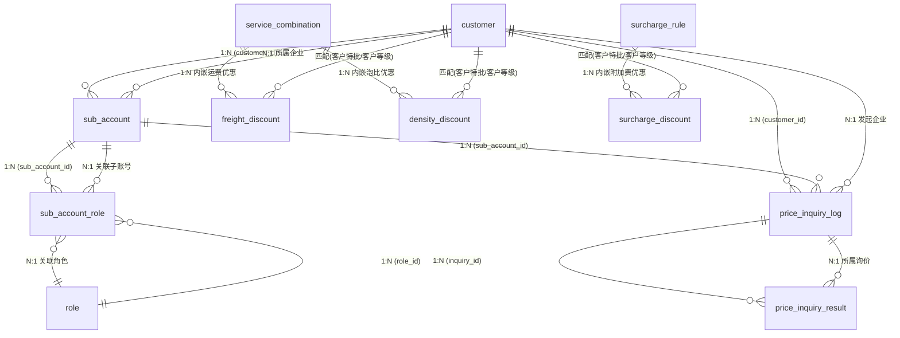

# 核心方案设计草稿 -- 货主端模块

> Phase 2：方案架构 | 基于 RDD v1.3 | **文档版本**：v1.3 | **日期**：2026-09-12 | **作者**：AI PM
>
> 变更历史见 `变更记录.md`（业务变更）与 `LOG.md`（工作日志）。

---

## 1. 实体 x 表映射

| # | RDD 实体 | 表名 | 类型 | 说明 |
|---|---------|------|------|------|
| 1 | 子账号 | `sub_account` | 主表 | 企业内子账号管理 |
| 2 | 子账号-角色关联 | `sub_account_role` | 关联表 | N:N，子账号与角色的关联 |
| 3 | 询价记录 | `price_inquiry_log` | 主表 | 二期，记录每次货主询价 |
| 4 | 询价结果行 | `price_inquiry_result` | 主表 | 二期，记录每次询价返回的报价行 |
| -- | 企业/客户 | `customer` | 引用 | 客商中心模块，不在本模块建表 |
| -- | 商品 | `product` | 引用 | 基础资料模块，不在本模块建表（货主端「商品管理」页） |
| -- | 收货地址 | `shipping_address` | 引用 | 基础资料模块，不在本模块建表（货主端「地址管理」页） |
| -- | VAT 记录 | `vat_record` | 引用 | 头程管理模块，不在本模块建表（货主端「VAT管理 / VAT资料新增」页） |
| -- | 角色 | `role` | 引用 | 系统设置模块，不在本模块建表 |
| -- | 服务渠道 | `service_channel` | 引用 | 超级运价模块，查价时关联 |
| -- | 服务组合 | `service_combination` | 引用 | 超级运价模块，查价时关联 |
| -- | 运价行 | `price_table_row` | 引用 | 超级运价模块，查价时关联 |
| -- | 附加费规则 | `surcharge_rule` | 引用 | 超级运价模块（菜单定名「费用与标识规则」），查价时关联 |
| -- | 运费优惠规则 | `freight_discount` | 引用 | 超级运价模块，查价时关联 |
| -- | **泡比优惠规则** | `density_discount` | 引用 | 超级运价模块，**一期启用**，查价时关联 |
| -- | 附加费优惠规则 | `surcharge_discount` | 引用 | 超级运价模块，查价时关联 |
| -- | 周船期批次 | `weekly_schedule_batch` | 引用 | 超级运价模块，查价时关联 |
| -- | 船期 | `sailing_schedule` | 引用 | 超级运价模块，查价时关联（运输详情弹窗的船期×截单矩阵） |

> 货主端对超级运价侧各表（含 `density_discount` 泡比优惠、`sailing_schedule` 船期）**全部为只读引用**，不落库运价侧任何表。

---

## 2. 逐表字段清单

### 2.1 子账号 `sub_account`

> **设计说明**：货主企业内部的员工登录账号。每个子账号属于一个企业（customer），可分配多个角色。登录认证通过 `sub_account` + 密码完成。

| 字段名 (En) | 字段名 (Cn) | 类型 (Type) | 必填 | 约束/索引 | 枚举/备注 |
|:---|:---|:---|:---|:---|:---|
| `id` | 主键 | BigInt | Yes | **PK** | 雪花ID |
| `tenant_id` | 租户ID | String | Yes | Index | SaaS 数据隔离 |
| `customer_id` | 所属企业ID | BigInt | Yes | **Index, FK -> customer.id** | 关联客商中心的企业客户 |
| `account` | 账号 | String(64) | Yes | **Unique (customer_id + account)** | 登录用户名，同企业内唯一。支持账号或邮箱登录 |
| `is_root` | 是否ROOT账号 | Boolean | Yes | — | Default: false。客户入驻时自动生成的admin账号为true，列表不展示
| `password_hash` | 密码哈希 | String(128) | Yes | -- | bcrypt 哈希，不存明文 |
| `last_name` | 姓 | String(32) | Yes | -- | -- |
| `first_name` | 名 | String(32) | Yes | -- | -- |
| `full_name` | 姓名（全名） | String(64) | Yes | -- | 姓+名拼接，冗余存储便于搜索和展示 |
| `gender` | 性别 | TinyInt | Yes | -- | 10:男, 20:女 |
| `phone` | 手机号 | String(20) | Yes | -- | -- |
| `email` | 邮箱 | String(128) | **No** | -- | **非必填**（与原型一致：新增子账号必填项仅 账号/姓/名/性别/手机号）。货主端手动创建的子账号邮箱非必填；客商中心侧「客户联系人邮箱」必填，二者不矛盾——ROOT 账号邮箱来自客户联系人（`is_account_receiver=true`，必填） |
| `status` | 状态 | TinyInt | Yes | Index | 10:正常, 20:已冻结 |
| `last_login_at` | 最后登录时间 | DateTime | No | -- | 记录最近一次登录 |
| `created_at` | 创建时间 | DateTime | Yes | -- | 自动生成 |
| `created_by` | 创建人 | String | Yes | -- | 当前用户（企业管理员） |
| `updated_at` | 更新时间 | DateTime | Yes | -- | 自动维护 |
| `updated_by` | 更新人 | String | Yes | -- | 当前用户 |
| `is_deleted` | 软删除标识 | Boolean | Yes | -- | Default: false |
| `version` | 乐观锁版本 | Int | Yes | -- | 并发控制，每次更新 +1 |

**关联关系**:
- `Many-to-One` with `customer` (通过 `customer_id` -> `customer.id`)
- `One-to-Many` with `sub_account_role` (通过 `id` -> `sub_account_id`)

> **⚠️ 原型现状**：现行原型 `子账号管理.html` 新增/编辑弹窗的必填标识为 **账号 / 姓 / 名 / 性别 / 手机号**（邮箱无必填星标），与上表一致；但原型列表中**没有「修改密码」按钮**、也**没有 `is_root` 过滤与「分配资源」下拉中的 ROOT 角色选项**（原型下拉为「财务角色/业务角色/客服角色」三个演示值）。上表 `is_root`、`password_hash` 为文档侧设计口径，原型待补齐。

### 2.2 子账号-角色关联 `sub_account_role`

> **设计说明**：N:N 关联表，记录每个子账号被分配了哪些角色。子账号权限 = 所分配角色权限的并集。

| 字段名 (En) | 字段名 (Cn) | 类型 (Type) | 必填 | 约束/索引 | 枚举/备注 |
|:---|:---|:---|:---|:---|:---|
| `id` | 主键 | BigInt | Yes | **PK** | 雪花ID |
| `tenant_id` | 租户ID | String | Yes | Index | SaaS 数据隔离 |
| `sub_account_id` | 子账号ID | BigInt | Yes | **Index, FK -> sub_account.id** | 关联子账号 |
| `role_id` | 角色ID | BigInt | Yes | **Index, FK -> role.id** | 关联系统设置模块的角色 |
| `created_at` | 创建时间 | DateTime | Yes | -- | 自动生成 |
| `created_by` | 创建人 | String | Yes | -- | 当前用户 |

**关联关系**:
- `Many-to-One` with `sub_account` (通过 `sub_account_id`)
- `Many-to-One` with `role` (通过 `role_id`)

### 2.3 询价记录 `price_inquiry_log`（二期）

> **设计说明**：记录货主每次询价的参数和匹配结果概要，用于趋势分析和热门渠道统计。本期 MVP 不建表。

| 字段名 (En) | 字段名 (Cn) | 类型 (Type) | 必填 | 约束/索引 | 枚举/备注 |
|:---|:---|:---|:---|:---|:---|
| `id` | 主键 | BigInt | Yes | **PK** | 雪花ID |
| `tenant_id` | 租户ID | String | Yes | Index | SaaS 数据隔离 |
| `customer_id` | 货主企业ID | BigInt | Yes | Index | 关联企业客户 |
| `sub_account_id` | 操作人ID | BigInt | No | -- | 哪个子账号发起的询价 |
| `inquiry_params` | 查询参数 | JSON | Yes | -- | 快照所有输入参数（国家/仓库代码/邮编/交货地/包裹信息/渠道专线筛选/货物属性/包税方式） |
| `result_count` | 返回结果数 | Int | Yes | -- | 匹配到的报价条数 |
| `unmatched_channels` | 未匹配渠道 | JSON | No | -- | 记录未匹配的渠道列表 |
| `inquiry_at` | 询价时间 | DateTime | Yes | Index | -- |
| `created_at` | 创建时间 | DateTime | Yes | -- | 自动生成 |

### 2.4 询价结果行 `price_inquiry_result`（二期）

> **设计说明**：记录每次询价返回的每条渠道报价明细，用于追溯"当时给货主报了什么价"。本期 MVP 不建表。

> **结果行口径**：字段与超级运价 PRD §5.13「货主端在线询价结果表列」逐列对齐，**不存在「优惠后」中间列**。
>
> **优惠金额口径**：三条优惠明细中的金额字段一律为**带符号优惠值**——**负数 = 减钱（正向优惠）**、**正数 = 加价（反向优惠）**；`final_price` = **`(公布价 + 运费优惠值 + 泡比优惠值) + (附加费合计 + 附加费优惠值合计)`**（优惠值本身为负数，负数值即等于减项）；附加费优惠的固定减免上限为 **`|优惠值| ≤ 应收单价`**。**折扣率**为乘数（`金额 × 率`）。

| 字段名 (En) | 字段名 (Cn) | 类型 (Type) | 必填 | 约束/索引 | 枚举/备注 |
|:---|:---|:---|:---|:---|:---|
| `id` | 主键 | BigInt | Yes | **PK** | 雪花ID |
| `tenant_id` | 租户ID | String | Yes | Index | -- |
| `inquiry_id` | 询价记录ID | BigInt | Yes | **Index, FK -> price_inquiry_log.id** | -- |
| `service_combination_code` | 服务组合 | String(128) | Yes | -- | 完整组合名（渠道-运输-尾程-计费-包税-服务类型），如"美森360-海运-卡派-KG-包税-散货" |
| `channel_code` | 渠道编码 | String(64) | Yes | -- | 关联 service_channel |
| `delivery_regions` | 交货地 | String(256) | No | -- | 服务组合覆盖的交货地列表，逗号分隔 |
| `billing_unit` | 计价 | TinyInt | Yes | -- | 10:KG, 20:CBM(m³) |
| `base_price` | 公布价 | Decimal(18,2) | Yes | -- | 基础运价单价（元/计价单位） |
| `freight_discount_detail` | 运费优惠 | JSON | No | -- | 命中规则名 + **优惠值**（带符号：负数=减钱、正数=加价、0=全免）；**客户特批 > 客户等级，高覆盖低不叠加** |
| `density_discount_detail` | 泡比优惠 | JSON | No | -- | 命中规则名 + **优惠值**（带符号：负数=减钱、正数=加价）；泡比≥阈值，**多条命中取阈值最大档**；**一期正常展示，仅 KG 计价行** |
| `surcharge_detail` | 附加费 | JSON | Yes | -- | 逐条快照附加费名称+原始单价+优惠后单价（**优惠后单价 = 应收单价 + 附加费优惠值**） |
| `surcharge_discount_detail` | 附加费优惠 | JSON | No | -- | 命中规则名 + **优惠值**（带符号：负数=减钱、正数=加价）；与运费优惠独立计算 |
| `final_price` | 最终报价 | Decimal(18,2) | Yes | -- | `(公布价 + 运费优惠值 + 泡比优惠值) + (附加费合计 + 附加费优惠值合计)`（优惠值本身为负数，负数值即等于减项） |
| `sailing_info` | 船期信息 | JSON | No | -- | 快照当周船期×各交货地截单矩阵（运输详情弹窗数据） |
| `pickup_date` | 最快提取 | String(64) | No | -- | 预计最快提取日期 |
| `batch_no` | 运价批次号 | String(64) | Yes | -- | 关联 weekly_schedule_batch |
| `created_at` | 创建时间 | DateTime | Yes | -- | 自动生成 |

---

## 3. ER 关系图



> 三张优惠表与父实体（服务组合 / 附加费规则）及客户主体的匹配关系如上；三张表均在**超级运价模块**，货主端只读匹配。

---

## 4. 关键设计说明

### 4.1 软删除策略
- `sub_account` 采用软删除（`is_deleted`），冻结不等于删除，冻结是状态变更
- `sub_account_role` 不需软删除，分配/取消分配直接物理删除行（关联表无业务依赖）
- `price_inquiry_log` / `price_inquiry_result`（二期）不软删除，按保留期限定时清理

### 4.2 乐观锁
- `sub_account` 需要 `version` 字段：企业管理员 A 编辑子账号的同时，管理员 B 也可能操作
- `sub_account_role` 不需要乐观锁：角色分配是覆盖式操作，不存在并发冲突问题

### 4.3 JSON 字段使用场景
- `price_inquiry_log.inquiry_params`：查询参数为可变结构（渠道专线多选、货物属性多选、包税方式多选、简易录入/多件装箱二选一等），用 JSON 快照比建多个可空字段更灵活
- `price_inquiry_log.unmatched_channels`：未匹配渠道列表，JSON 数组即可
- `price_inquiry_result.surcharge_detail`：附加费明细包含名称+原始价格+优惠后价格，结构灵活，用 JSON 快照
- `price_inquiry_result.freight_discount_detail` / `density_discount_detail` / `surcharge_discount_detail`：三张优惠表各自的命中规则名 + **优惠值（带符号：负数=减钱、正数=加价）**，用 JSON 快照，便于追溯"当时按哪条规则算的"
- `price_inquiry_result.sailing_info`：船期×截单矩阵为动态列结构（列数=覆盖的交货地数量），JSON 比固定列更合适

### 4.4 纯逻辑实体说明
- 登录凭证（LoginCredential）：无独立表，基于 `sub_account` + 密码哈希 + 后端 token 机制
- 货物查询参数（InquiryParams）：无独立表，前端表单 -> 后端接口参数，仅二期 `price_inquiry_log` 中做 JSON 快照
- 报价结果行（PriceInquiryResult）：一期无独立表，后端实时计算返回，不持久化。二期 `price_inquiry_result` 表落地

### 4.5 查价接口的运价数据来源
查价订舱接口需要跨模块查询超级运价的数据，依赖关系如下：
- 渠道/组合匹配：查询 `service_channel` + `service_combination`（专线 = 运输方式 + 尾程派送，组合筛选在查询前完成）
- 运价行匹配：查询 `price_table_row`（当前周批次 `weekly_schedule_batch.status = CURRENT`）；KG 路径按计费重量匹配 weight_tier，CBM 路径按计费体积匹配 weight_tier
- 附加费匹配：查询 `surcharge_rule` + `surcharge_discount`
- 运费优惠：查询 `freight_discount`
- **泡比优惠：查询 `density_discount`**（一期启用）
- 船期/截单：查询 `sailing_schedule`（运输详情弹窗的当周船期×各交货地截单矩阵）
- 以上均为**只读查询**，货主端不写入运价相关表

> **三层询价数据安全**（超级运价 PRD R27）：同一报价 API `POST /api/freight-rate/query`，请求体 `caller=shipper` 时**只返回公布价+优惠，不返回成本底价/利润/盈亏标识**；未登录 + `caller=shipper` → 401。

### 4.6 与共享实体的引用关系

| 货主端页面 | 引用实体 | 来源表 | 来源模块 | 引用方式 |
|-----------|---------|--------|---------|---------|
| 商品管理 | 商品 | `product` | 基础资料 | 按 `customer_id` 过滤，CRUD |
| 地址管理 | 收货地址 | `shipping_address` | 基础资料 | 按 `customer_id` 过滤，CRUD |
| VAT管理 / VAT资料新增 | VAT 记录 | `vat_record` | 头程管理 | 按 `customer_id` 过滤，CRUD |
| 角色管理 | 角色 | `role` | 系统设置 | 按 `customer_id` 过滤，定义角色权限 |
| 子账号管理 | 子账号 | `sub_account` | 货主端（本期新建） | 本模块主表 |
| 子账号管理 | 角色 | `role` | 系统设置 | 分配角色时引用 `role.id` |
| 账单管理 / 资金账户 | 账单、资金流水、充值记录 | 引用 | 财务/账单模块 | 只读展示 + 充值发起（原型已挂页，实体归属另行确认） |
| 后台任务 | 后台任务记录 | 引用 | 系统/任务中心 | 只读查询任务编号/模块/状态/结果 |

> 账单管理 / 资金账户 **归「财务」模块**（实体见 `drafts/财务/2026-09-14-数据设计.md`）、后台任务 **归「后台任务」模块**（见 `drafts/后台任务/`）——均按「**引用其他模块页面**」处理，**货主端不定义实体**，上表按引用登记即可。

### 4.7 密码与认证设计
- 密码存储：`sub_account.password_hash` 使用 bcrypt 哈希，不存明文
- Token 机制：登录成功后后端签发 JWT token，前端存 `localStorage.shipper_token`
- Token 有效期：24 小时，过期后自动跳转登录页
- 企业管理员（主账号）的登录凭证通过 `customer` 表关联的账号体系管理（客商中心模块），与子账号体系分离
- 子账号支持账号或邮箱登录：登录接口同时匹配 `account` 和 `email` 字段
- 企业管理员可为子账号修改密码：`PUT /api/shipper/sub-account/{id}/password`
  - **⚠️ 原型现状（文档口径 vs 原型实现）**：`子账号管理.html` 列表操作列**当前只有 编辑 / 分配资源 / 冻结(启用)**，**没有「修改密码」按钮**——本项为文档侧设计口径，原型待补齐

### 4.8 ROOT 账号与 ROOT 角色
- **ROOT 账号**：客户入驻时自动生成，`account='admin'`，`is_root=true`，不可冻结/删除
- **ROOT 角色**：客户入驻时自动生成，`role_code='ROOT'`，拥有货主端全部资源权限，不可冻结/删除
- **列表过滤**：子账号列表查询时默认过滤 `is_root=true` 的记录，ROOT 账号不展示在管理列表
- **角色可选范围**：分配角色时，可选角色 = ROOT角色 + 所有 `status=正常(10)` 的角色
- **资源范围上限**：新建角色的资源范围不可超出 ROOT 角色拥有的资源（后端校验）
- **角色表复用**：货主端角色与员工端角色共用 `role` 表，通过 `tenant_id` 隔离；货主端的角色 `customer_id` 指向所属企业

> **⚠️ 原型现状（文档口径 vs 原型实现）**：`子账号管理.html` / `角色管理.html` 的演示数据中**未体现 `is_root` 过滤、ROOT 角色保护、资源范围上限**；分配资源下拉为「财务角色/业务角色/客服角色」三个演示值。本节为后端设计口径，原型待补齐。

### 4.9 角色表补充说明（货主端视角）
- 货主端角色管理直接使用系统设置的 `role` 表
- 角色资源权限树内容与员工端分配资源一致（菜单/页面/按钮三级）
- 角色冻结不影响已分配该角色的子账号——冻结仅阻止新分配，已有权限保持不变
- **角色类型枚举（原型口径）**：`系统默认` / `自定义`（`角色管理.html` 搜索条件的下拉取值）

### 4.10 优惠三表匹配口径（货主端只读消费）

> 货主端**不配置、不落库**任何优惠规则，只在查价时按当前登录客户匹配并展示；本节口径与「超级运价」一致。
>
> **优惠金额口径**：固定减免的**优惠值本身带符号**——**负数 = 减钱（正向优惠）**、**正数 = 加价（反向优惠）**；计算为 **`结果金额 = 原金额 + 优惠值`**；显示：负 → `-¥X`、正 → `+¥X`、0 → 「全免」；附加费优惠的固定减免上限为 **`|优惠值| ≤ 应收单价`**（绝对值比较）。**折扣率**为乘数语义（`<1` 折扣、`=1` 原价、`>1` 加价；一期 `0.01 ≤ 率 ≤ 1` 不支持加价），计算为 **`金额 × 率`**。

**三张优惠表：运费优惠 `freight_discount` / 泡比优惠 `density_discount` / 附加费优惠 `surcharge_discount`**

| 维度 | 运费优惠 | 泡比优惠 | 附加费优惠 |
|:---|:---|:---|:---|
| 父实体 | 服务组合 | 服务组合 | 附加费规则 |
| 优惠对象类型 | **一期同时开放**：10 客户特批 / 20 客户等级 | 同左 | 同左 |
| 目标 | 特批→客户（多选）；等级→客户等级（多选） | 同左 | 同左 |
| 优先级 | **客户特批 > 客户等级，高覆盖低、不叠加** | 同左 | 同左 |
| 优惠方式 | 一期仅 20 固定减免（**优惠值为带符号调整量**：负数=减钱、正数=加价；计算 `金额 + 优惠值`） | 同左 | 折扣率（**乘数**：`金额 × 率`；`<1` 折扣、`=1` 原价、`>1` 加价；一期 `0.01 ≤ 率 ≤ 1` 不支持加价）/ 固定减免（同左，**带符号优惠值**） |
| 命中维度 | 组合 + 对象 | 组合 + 对象 + **密度阈值**（泡比 ≥ 阈值；多条命中取阈值最大档，不叠加） | 附加费规则 + 对象 |
| 叠加关系 | **运费优惠 × 泡比优惠叠加** | 与运费优惠叠加 | **与运费优惠独立计算** |
| 有效期 | 一期：永久有效 / 固定期限 | 同左 | 同左 |
| 飞书审批编号 `approval_no` | **客户特批时必填**；等级时为空。**一期人工录入，不对接飞书审批流**（不做审批单同步、不做「审批中/已通过」状态机），仅作追溯凭据 | 同左 | 同左 |
| 费用方向 | 固定 10 应收 | 固定 10 应收 | 固定 10 应收 |

**匹配伪代码（货主端侧消费口径）**：

```
# 0. 优惠值符号约定
#    固定减免 discount_value：负数 = 减钱（正向优惠）；正数 = 加价（反向优惠）
#    结果金额 = 原金额 + discount_value
#    折扣率 rate 为乘数：<1 折扣 / =1 原价 / >1 加价（一期 0.01 ≤ rate ≤ 1，不支持加价）
#    折扣率计算 = 金额 × rate
#    显示：discount_value < 0 → "-¥X"；> 0 → "+¥X"；= 0 → "全免"

# 1. 运费优惠（特批 > 等级，取一条）
候选 = { d ∈ freight_discount | d.combination_id = 当前组合 且 d.status=生效 }
特批命中 = 候选.where(target_type=10 客户特批 且 当前客户 ∈ d.target_customers)
等级命中 = 候选.where(target_type=20 客户等级 且 当前客户等级 ∈ d.target_levels)
运费优惠 = 特批命中.第一条() ?? 等级命中.第一条() ?? 无     # 只取一条，不累加
运费优惠值 = 运费优惠.discount_value                       # 带符号：负数=减钱、正数=加价

# 2. 泡比优惠（特批 > 等级，再按密度阈值取最大档；仅 KG 计价行）
泡比 = 总实重(kg) ÷ 总体积(m³)
候选 = { d ∈ density_discount | d.combination_id = 当前组合 且 泡比 ≥ d.density_threshold }
泡比优惠 = 候选.按(对象优先级, density_threshold 降序).第一条() ?? 无   # 多条命中取阈值最大档，不叠加
泡比优惠值 = 泡比优惠.discount_value                       # 带符号，同上

# 3. 附加费优惠（按附加费规则逐条匹配，与运费优惠独立）
对每条命中的附加费规则 r：
  候选 = { d ∈ surcharge_discount | d.rule_id = r.id 且 d.status=生效 }
  特批命中 = 候选.where(target_type=10 且 当前客户 ∈ d.target_customers)
  等级命中 = 候选.where(target_type=20 且 当前客户等级 ∈ d.target_levels)
  附加费优惠 = 特批命中.第一条() ?? 等级命中.第一条() ?? 无
  附加费优惠值 = 附加费优惠.discount_value                 # 带符号（固定减免时）
  附加费优惠后单价 = r.应收单价 + 附加费优惠值
  # 折扣率时：附加费优惠后单价 = r.应收单价 × 附加费优惠.rate（乘数）

# 4. 最终报价（超级运价 PRD §7.4 的「折扣后运费 + 优惠后附加费」与此等价）
最终报价 = (公布价 + 运费优惠值 + 泡比优惠值) + (Σ附加费原价 + Σ附加费优惠值)
         # 分段式：先算完运费侧（公布价 + 运费优惠值 + 泡比优惠值），再单独加附加费侧
约束：
  a. 任一费用项最终金额不得为负（优惠上限截断 R31）——优惠值带符号，比较按绝对值
     Σ|该费用项全部优惠值| ≤ 该费用项金额，超出按比例截断到 0
  b. 附加费优惠的固定减免上限：|附加费优惠值| ≤ 应收单价（绝对值比较）
  c. 泡比优惠只作用于运费侧，不得抵扣附加费
```

> **超重超长在查价阶段的参与方式**：查价阶段**能否**算出「超重超长」**取决于包裹信息的录入方式** —— ① **按单箱录入**（填了长/宽/高）→ **可以算**：超重超长按公式判定（该规则计价单位**仅按箱**）、**体积重 = 长×宽×高 ÷ 计泡系数** → **在查价结果中作预估展示**；② **按总体重量与体积录入**（无单箱长宽高）→ **算不出，不展示该项**。**正式计费以「拣货实测」为准**（客户自填尺寸仅供预估），故结果区提示条**保留**并声明"以拣货实测为准"；「字段&公式」型规则的**正式触发与费用流水生成在「拣货」节点**，查价阶段只是**预估展示、不落库、不进账单**。
>
> **费用叠加顺序**：货主端口径为 **`(公布价 + 运费优惠值 + 泡比优惠值) + (附加费合计 + 附加费优惠值合计)`**，与超级运价 PRD §7.4 的 `最终报价 = 折扣后运费 + 优惠后附加费` **完全等价**（`折扣后运费` 即 `公布价 + 运费优惠值 + 泡比优惠值`）；全系统同一写成法。

---

## 5. 枚举值集中定义

| 枚举名 | 值 | 常量名 | 中文 | 适用实体 |
|--------|----|--------|------|---------|
| Gender | 10 | MALE | 男 | sub_account |
| Gender | 20 | FEMALE | 女 | sub_account |
| SubAccountStatus | 10 | NORMAL | 正常 | sub_account |
| SubAccountStatus | 20 | FROZEN | 已冻结 | sub_account |
| BillingUnit | 10 | KG | 公斤 | price_inquiry_result |
| BillingUnit | 20 | CBM | 立方米(m³) | price_inquiry_result |
| **DiscountTargetType** | 10 | CUSTOMER_SPECIAL | **客户特批** | freight_discount / density_discount / surcharge_discount |
| **DiscountTargetType** | 20 | CUSTOMER_LEVEL | **客户等级** | freight_discount / density_discount / surcharge_discount |
| **DiscountMode** | 10 | RATE | 折扣率（二期开放；**乘数**：`<1` 折扣、`=1` 原价、`>1` 加价；一期 `0.01 ≤ 率 ≤ 1` 不支持加价；计算 `金额 × 率`） | 三张优惠表 |
| **DiscountMode** | 20 | FIXED | 固定减免（一期；**优惠值为带符号调整量**：负数=减钱、正数=加价；计算 `金额 + 优惠值`） | 三张优惠表 |
| **ValidityType** | 10 | PERMANENT | 永久有效（一期） | 三张优惠表 |
| **ValidityType** | 20 | FIXED_PERIOD | 固定期限（一期） | 三张优惠表 |
| **ValidityType** | 30 | SINGLE_USE | 单次有效（二期） | 三张优惠表 |
| **FeeDirection** | 10 | RECEIVABLE | 应收（一期固定） | 三张优惠表 |
| **FeeDirection** | 20 | PAYABLE | 应付（二期开放） | 三张优惠表 |
| **SurchargeTagType** | 20 | SURCHARGE_TAG | 附加费标识 | `surcharge_rule.tag_id` → 基础资料-标识管理 `tag.id` |

> **优惠枚举要点**：① `DiscountTargetType` **一期同时开放 10 与 20**；② `DiscountMode` 一期仅 20；③ `ValidityType` 一期 10/20；④ `FeeDirection` 固定 10。⑤ `DiscountMode` 的**金额语义**：`10 RATE` 为**乘数**（`金额 × 率`；`<1` 折扣、`=1` 原价、`>1` 加价；一期 `0.01 ≤ 率 ≤ 1` 不支持加价）；`20 FIXED` 为**带符号调整量**（**负数=减钱、正数=加价**；`金额 + 优惠值`；显示负 `-¥X` / 正 `+¥X` / 0「全免」；上限按 `|优惠值| ≤ 应收单价` 校验）。

---

## 6. 跨模块数据融合：货主端 × 客商中心

> **设计原则**：货主端是客户主数据的 Consumer，不冗余存储客户字段（仅通过 `customer_id` 外键关联）。所有客户生命周期事件由客商中心通过接口推送到货主端。货主端登录时实时校验客户状态作为双重保障。

### 6.1 数据归属与引用关系

```
客商中心（System of Record）
  customer                          ← 客户主数据唯一源
    ├── customer_name               → 货主端首页欢迎语
    ├── service_status (10/20)      → 货主端登录准入校验
    ├── sign_status (10/20/30/40)   → 货主端下单准入校验
    └── customer_level (SS~G)       → 三张优惠表「客户等级」匹配的输入
                                      （客户特批 > 客户等级）

货主端（Consumer）
  sub_account.customer_id ──FK──→ customer.id
    ├── is_root = true            → 由客商中心入驻事件触发创建
    ├── status (10=正常/20=已冻结) → 与 customer.service_status 联动
    └── 不存储 customer_name      → 通过接口实时查询

  角色 (role) — 引用系统设置模块
    └── role_code = 'ROOT'        → 由客商中心入驻事件触发创建
```

> **`customer_level` 的用途**：**三张优惠表「客户等级」维度的匹配输入**（不控制权限）。

### 6.2 跨模块同步数据流

**SF1 — ROOT账户创建（接收方）**：

```
客商中心调用: POST /api/shipper/sub-account/create-root
  body: { customer_id, customer_name, contact_email, contact_phone }

货主端处理:
  1. 幂等检查: SELECT * FROM sub_account WHERE customer_id=X AND is_root=true
     → 已存在 → 返回已有记录（不重复创建）
  2. 创建 ROOT 子账号:
     INSERT INTO sub_account (
       customer_id, account='admin', is_root=true,
       password_hash=bcrypt(random_password),
       last_name='管理员', first_name='',
       full_name='管理员', gender=10, phone=contact_phone,
       email=contact_email, status=10
     )
     -- contact_email 来自客商中心「客户联系人.邮箱」，该字段在客商中心侧必填
     --   （is_account_receiver=true），因此 ROOT 账号邮箱必有值；
     --   这与"货主端手动创建的子账号邮箱非必填"不矛盾（见 §2.1）
  3. 创建 ROOT 角色（若不存在）:
     INSERT INTO role (role_code='ROOT', role_name='主账号默认角色', ...)
     ON CONFLICT (tenant_id, role_code) DO NOTHING
  4. 关联 ROOT 角色:
     INSERT INTO sub_account_role (sub_account_id, role_id)
  5. 发送邮件: 账号+密码+登录地址
  6. 返回: { sub_account_id, account, temp_password }
```

**SF2 — 批量冻结（接收方）**：

```
客商中心调用: POST /api/shipper/sub-account/batch-freeze
  body: { customer_id }

货主端处理:
  UPDATE sub_account SET status = 20, updated_at = NOW()
  WHERE customer_id = X AND is_deleted = false AND status = 10
  → 返回 { frozen_count: N }
```

**SF3 — 批量启用（接收方）**：

```
同 SF2，status: 20→10
```

**SF4 — 登录状态校验（调用方）**：

```
货主端登录时:
  1. 校验 sub_account 是否存在且未冻结
  2. 调用 GET /api/customer/{customer_id}/status
     → 返回: { service_status, sign_status, customer_name }
  3. service_status = 20 (已冻结) → 拒绝登录
  4. 缓存 customer_name 到 Redis (TTL=1h)，减少重复调用
```

### 6.3 跨模块接口契约

| 接口 | 方法 | 路径 | 提供方 | 调用方 | 幂等性 | 超时 |
|------|------|------|--------|--------|--------|------|
| 创建ROOT子账号 | POST | /api/shipper/sub-account/create-root | 货主端 | 客商中心 | ✅ customer_id去重 | 5s |
| 批量冻结子账号 | POST | /api/shipper/sub-account/batch-freeze | 货主端 | 客商中心 | ✅ 已冻结跳过 | 3s |
| 批量启用子账号 | POST | /api/shipper/sub-account/batch-enable | 货主端 | 客商中心 | ✅ 已启用跳过 | 3s |
| 查询客户状态 | GET | /api/customer/{id}/status | 客商中心 | 货主端 | — | 2s |
| 查询客户信息 | GET | /api/customer/{id}/profile | 客商中心 | 货主端 | — | 2s |
| **报价查询** | **POST** | **`/api/freight-rate/query`**（统一报价接口；请求体 **`caller=shipper`**） | **超级运价** | **货主端** | — | **3s** |

> **全系统只保留一个统一报价接口** `POST /api/freight-rate/query`，各端以请求体 `caller` 区分（`operator` / `shipper` / `public`）。

### 6.4 登录校验链（完整）

```
货主端登录 POST /api/shipper/auth/login
  ↓
Step 1: 验证账号密码
  → 匹配 sub_account.account 或 sub_account.email
  → bcrypt.compare(password, password_hash)
  → 失败 → 401 "账号或密码错误"
  ↓
Step 2: 校验子账号状态
  → sub_account.status != 10 → 403 "账号已被冻结"
  → sub_account.is_deleted = true → 401 "账号不存在"
  ↓
Step 3: 校验企业客户状态（跨模块调用）
  → GET /api/customer/{customer_id}/status
  → service_status != 10 → 403 "您的企业账户已被冻结，请联系客服"
  → 超时(>2s) → 降级: 允许登录但记录告警日志
  ↓
Step 4: 签发 JWT token
  → payload: { sub_account_id, customer_id, is_root }
  → expire: 24h
  → 返回: { token, username, customer_name }
```

### 6.5 失败降级策略

- **create-root 调用失败**（客商中心侧）：客商中心异步重试3次(10s/30s/60s)，仍失败进入 pending_sync 队列，定时任务补推
- **batch-freeze/enable 调用失败**：不回滚客商中心操作，记录异常日志+运维告警
- **GET /api/customer/{id}/status 超时**：允许登录（降级），但限制下单（必须同步校验通过才能下单），记录告警日志
- **报价查询接口超时/不可用**（3s）：查价页提示"系统繁忙，请稍后重试"，**不降级返回缓存价**（价格时效性要求高，返回过期价会造成客诉）

### 6.6 共享实体字段变更同步

| 场景 | 客商中心变更 | 货主端影响 | 同步机制 |
|------|------------|-----------|---------|
| 客户名称变更 | customer.customer_name 更新 | 首页欢迎语需反映最新名称 | 货主端每次登录/刷新时实时查询 |
| 客户冻结 | customer.service_status: 10→20 | 所有子账号冻结+禁止登录 | batch-freeze 推送 + 登录时实时校验 |
| 客户启用 | customer.service_status: 20→10 | 所有子账号恢复登录 | batch-enable 推送 + 登录时实时校验 |
| 合同签约完成 | customer.sign_status: 20→30 | 下单限制解除 | 下单时实时查询 sign_status |
| 合同过期 | customer.sign_status: 30→40 | 下单时提示续约 | 下单时实时查询 sign_status |
| **客户等级变更** | **customer_level 更新** | **直接影响查价结果**——三张优惠表按「客户等级」匹配的规则可能命中/失效，报价随之变化 | **查价时实时取当前等级**（不缓存等级；`customer` 状态接口每次查价同步调用） |

---

## 7. 不一致处理标注

| # | 不一致点 | 超级运价 / 客商中心口径 | 货主端原型现状 | 处理 |
|---|---------|----------------------|--------------|------|
| E9 | 超重超长是否在查价阶段计算 | — | — | **按单箱录入**（询价结果行含长/宽/高）时可算并作**预估展示**（`surcharge_amount` 计入预估、体积重 = 长×宽×高÷计泡系数）；**按总体重量与体积录入**时不计算、不展示。预估**不落库为应付依据**，正式计费以**拣货实测**为准 |
| D1 | 联系人邮箱必填 | 客商中心：客户联系人.email 必填 | 货主端子账号.email 非必填（原型必填项仅 账号/姓/名/性别/手机号） | ROOT 账号邮箱来自客户联系人（`is_account_receiver=true`，必填）；**手动创建的子账号邮箱非必填**。二者不矛盾，非缺陷 |
| D2 | ROOT冻结 | 客商中心 R25"关联账户同步冻结" | 货主端"ROOT不可冻结" | ROOT 不可被企业管理员**单独**冻结（前端隐藏按钮），但随客户冻结联动是系统级操作，不受此限制 |
| D3 | 角色表归属 | 客商中心不管理角色 | 货主端角色表引用系统设置模块 | 角色统一由系统设置模块管理，货主端只做引用和分配 |
| D4 | 报价查询接口路径 | — | — | 统一为 `POST /api/freight-rate/query`，`caller=shipper` 置于请求体 |
| D5 | 优惠后金额的展示顺序 | 超级运价 §7.4：`最终报价 = 折扣后运费 + 优惠后附加费`（先算折扣后运费，再加附加费净额） | 原型费用明细弹窗的金额写法未按符号口径改造 | 货主端统一按 **`(公布价 + 运费优惠值 + 泡比优惠值) + (附加费合计 + 附加费优惠值合计)`** 表述，与超级运价 §7.4 **完全等价**（`折扣后运费` = `公布价 + 运费优惠值 + 泡比优惠值`）；⚠️ 原型 HTML 仍待按该口径改造（原型改造不在文档范围内） |
| D6 | 附加费与泡比优惠的叠加口径 | 超级运价 §7.4：`折扣后运费 = 公布价 + Σ运费优惠值 + Σ泡比优惠值`（固定减免已是带符号值，用加号） | 原型需按同一口径改造 | 正确口径为 `finalUnit = (公布价 + 运费优惠值 + 泡比优惠值) + (scTotal + 附加费优惠值合计)`——先算完**运费侧**，再单独加**附加费侧**。⚠️ 若把泡比优惠放在最后扣减、**跨段抵扣附加费**，即与「泡比优惠只作用运费侧、不得抵扣附加费」硬约束冲突（**属口径错误，不只是展示顺序问题**） |
| D7 | 原型缺页 | — | 菜单已挂、**页面文件不存在**：`我的订单.html` / `草稿箱.html` / `异常订单.html` / `发票管理.html` | **如实标注为「菜单已挂、页面待建」**，不计入已完成功能；本期不建设，**后续做到该块时自然补充** |

---
> 执行完成后，若修改了任何设计文件，自动执行 project-rule 文件联动规则，确保关联文件一致性。
