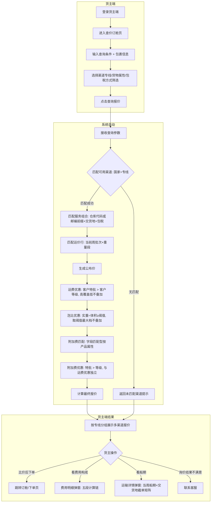
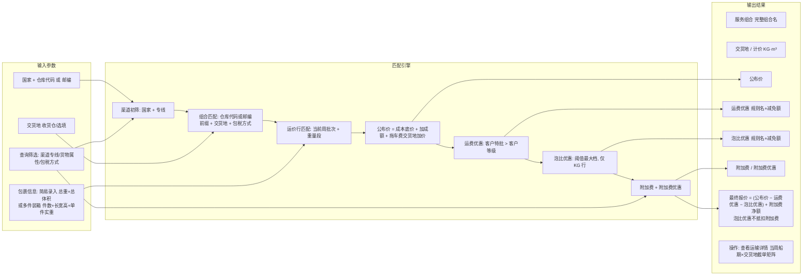

# 需求定义卡片 (RDD) -- 货主端

> **原始需求**：货主（跨境卖家）需要一个自助门户，能在线查价、下单订舱、管理子账号，减少对客服/销售的依赖，提升下单效率。
> **文档版本**: v1.3 | **日期**: 2026-09-12 | **作者**: AI PM（v1.3 整体刷新：对齐现行原型（12 页）+「超级运价」2026-09-12 定稿优惠三表口径 + 泡比优惠进入 Phase 1 + 未决项 E9 如实标注）
> 上一版：v1.2（2026-06-06，货主端×客商中心数据融合：客户状态准入+冻结联动+ROOT账户自动接收+合同签约门禁）

***

## 1. 核心洞察 (Insight)

### 真实痛点

货主（跨境卖家）当前查价和订舱完全依赖人工沟通：在微信群问销售"ONT8 这周什么价"，销售翻 Excel 回复，货主再口头确认下单。一个询价到成交的闭环耗时 30 分钟到半天不等。货主无法自助获取报价，也无法自助管理企业内部谁有权限操作（子账号）。

更深层的痛点是：**货主看不到报价的构成**。公布价、附加费、优惠、最终报价的计算逻辑对货主是黑盒，导致信任成本高。货主需要知道"这个价格是怎么算出来的"才能放心下单。

> **★ 变更（2026-09-12）**：报价构成的透明度要求从"公布价 + 附加费 + 最终报价"三要素，**升级为五段式**：公布价 → 运费优惠 → 附加费（含附加费优惠）→ 泡比优惠 → 最终报价。原因是超级运价定稿后**泡比优惠进入 Phase 1**、**优惠对象类型一期同时开放客户等级与客户特批**，货主会看到"我为什么比隔壁贵 1 块钱"的差异，必须能解释到具体规则名。

作为企业的管理员，货主还需要管理内部谁可以查价、谁可以下单，而不是所有人都用同一个账号登录。

### JTBD（待办任务）

> **货主（跨境卖家运营）**雇佣"货主端"不是为了"看一个网页"，而是为了：**当需要发货到 FBA 仓库时，能在 30 秒内获得所有可用渠道的完整报价，直接下单订舱，不用在微信等销售回复。**

> **企业管理员**雇佣"子账号管理"不是为了"创建账号"，而是为了：**让团队里不同职能的人（运营/财务/客服）各用各的账号，操作权限可控，离职即冻结。**

### 业务价值：**HIGH**

| 维度 | 当前 | 目标 |
|------|------|------|
| 单次询价耗时 | 30 分钟（微信群 -> 销售翻 Excel -> 回复） | 30 秒（自助输入货物参数 -> 即时返回多渠道报价） |
| 报价透明度 | 黑盒（货主看不到附加费和计算过程） | 透明（公布价 + 运费优惠 + 附加费/附加费优惠 + 泡比优惠 + 最终报价 五段明细） |
| 子账号管理 | 无（多人共用一个账号或找客服代操作） | 企业管理员自助创建/冻结/分配角色 |
| 下单转化率 | 低（沟通成本高，货主可能流失到竞对） | 高（自助查价 -> 一键订舱，路径短） |

***

## 2. 业务全景图

### 2.1 角色与工作节奏

| 角色 | 核心任务 | 频率 |
|------|---------|------|
| **货主运营** | 在线查价、下单订舱、查看订单状态、管理商品/地址/VAT | 日频（多次） |
| **货主财务** | 查看账单、资金账户与流水 | 周频 |
| **企业管理员（货主侧）** | 管理子账号、分配角色、企业认证 | 低频（建一次，人员变动时维护） |
| **客服/销售（员工端）** | 处理异常订单、确认订舱、对接货主需求 | 日频 |

> **★ 变更（2026-09-12）**：「货主财务」的核心任务由"查看账单、**发票**、**充值流水**"改为"查看账单、**资金账户与流水**"——现行原型财务中心二级菜单为 **资金账户 / 账单管理 / 发票管理**（发票管理页待建），无独立「充值流水」页。

### 2.2 端到端业务链路

```
【登录认证】
  货主登录 -> token 校验 -> 企业信息加载 -> 首页工作台
      |
【查价订舱】（高频核心）
  输入查询条件（国家/仓库代码或邮编/交货地/包裹信息 + 专线·属性·包税筛选）
    -> 系统七步匹配引擎（渠道 -> 组合 -> 运价行重量段 -> 公布价 -> 运费优惠 -> 附加费 -> 泡比优惠）
    -> 按专线分组多渠道路由报价 -> 货主比价 -> 下单订舱
      |
【订单跟踪】（菜单已挂、页面待建）
  我的订单 -> 草稿箱 -> 异常订单
      |
【财务管理】（原型已挂页）
  资金账户（账户余额/资金流水/充值）-> 账单管理 -> 发票管理（页面待建）
      |
【基础资料】（原型已挂页）
  商品管理 / 地址管理 / VAT管理（+VAT资料新增）
      |
【企业设置】
  子账号管理 -> 新增/编辑/冻结/分配资源
  角色管理 -> 列表/编辑/分配资源权限树
  |
【后台任务】（原型已挂页）
  任务编号/模块/状态/结果 查询与重试
```

> **★ 变更（2026-09-12）**：
> 1. **订单跟踪**由"页面入口已预留"改为如实标注 **「菜单已挂、页面待建」**——`我的订单.html` / `草稿箱.html` / `异常订单.html` **三个页面文件在原型中不存在**。
> 2. **财务管理**由"充值与流水"改为"**资金账户**（含账户余额/资金流水/充值三个 Tab）"，并标注 `发票管理.html` 待建。
> 3. **基础资料**补 `VAT资料新增.html`，`收货地址管理` 改名为原型实际的 **地址管理**。
> 4. **新增后台任务页**（原型已实现）。
> 5. 查价链路由"5 步匹配（渠道/组合/运价行/附加费/运费优惠）"细化为**七步匹配引擎 + 泡比优惠**。

### 2.3 实体依赖关系

```
企业/货主 (聚合根 -- 引用客户管理模块)
  ├── 1:N 子账号 (sub_account) -- 本期新建
  │     └── N:N 角色 (引用系统设置模块 -- role)
  ├── 1:N 商品 (引用基础资料模块 -- product)
  ├── 1:N 收货地址 (引用基础资料模块 -- shipping_address)
  ├── 1:N VAT 记录 (引用头程管理模块 -- vat_record)
  ├── 1:N 询价记录 (price_inquiry) -- 本期新建（二期落库）
  │     └── 1:N 报价结果行 (price_inquiry_result) -- 本期新建（二期落库）
  └── 1:N 账单/资金流水 (**引用财务模块** ✅ 2026-09-12 已定)
```

### 2.4 查价订舱核心流程图（泳道图）

> **★ 变更（2026-09-12）**：补入**运费优惠（特批>等级）→ 泡比优惠（阈值最大档）→ 附加费优惠**三条优惠支线，以及**超重超长的拣货触发标注**。



> **★ E9 已定（2026-09-12）**：上图中的「附加费匹配」覆盖字段匹配型（如粉末/液体/带电加收）；**超重/超长属「字段&公式」型**——**★ E9 已定（2026-09-12，产品确认）**：查价阶段**能否**算出「超重超长」**取决于包裹信息的录入方式**，不是"算不算"的问题 ——① **按单箱录入**（填了长/宽/高）→ **可以算**：超重超长按公式判定（该规则计价单位**仅按箱**）、**体积重 = 长×宽×高 ÷ 计泡系数** → **在查价结果中作预估展示**；② **按总体重量与体积录入**（无单箱长宽高）→ **算不出，不展示该项**。**正式计费仍以「拣货实测」为准**（客户自填尺寸仅供预估），故结果区提示条**保留**并继续声明"以拣货实测为准"；**规则口径不变**：「字段&公式」型规则的**正式触发与费用流水生成仍在「拣货」节点**，查价阶段只是**预估展示、不落库、不进账单**。
> **超重/超长属"字段&公式"型，超级运价定稿口径为「仅在拣货节点触发、需拣货实测尺寸重量、运价查询阶段不计算」**，但**货主端原型当前仍在查价阶段依客户自填尺寸/属性计算并展示**。二者冲突，**待产品确认**，详见 §13 不一致处理标注 E9。

### 2.5 核心数据流图 -- 查价报价链路

> **★ 变更（2026-09-12）**：输出结果由 5 项扩为完整结果表列；新增泡比优惠与附加费优惠分支。



---

> 以下按 **4 条业务流程** 组织，每条流程包含：流程概述 -> 实体字段定义 -> 业务规则 -> 核心场景 -> 相关 AC。

### 3. 流程一：登录认证（一次性 / 每次会话）

> **触发**：货主访问货主端任何页面 **频率**：每次会话 **前置依赖**：企业已在员工端完成入驻和客户建档

**3.1 登录凭证 (LoginCredential)** -- 货主端登录认证信息

> **As a** 货主 **I want to** 用账号密码登录货主端 **So that** 安全访问企业专属的物流工作台

| 字段 | 类型 | 必填 | 说明 |
|------|------|------|------|
| 用户名/邮箱 | 文本 | ✅ | 支持账号或邮箱登录 |
| 密码 | 文本 | ✅ | 最少6位 |
| 记住密码 | Boolean | -- | 前端 localStorage 存储，非敏感令牌 |

**业务规则**：
- R01：登录成功后，后端返回 token，前端存入 `localStorage`（key: `shipper_token`）
- R02：`index.html`（Shell 框架）加载时检查 `localStorage.shipper_token`，不存在则跳转 `login.html`
- R03：登录成功后存储 `shipper_username` 到 localStorage，首页和 Shell 框架展示用户名
- R04：退出登录时清除 `shipper_token` 和 `shipper_username`，跳回登录页
- R05：登录失败 3 次后锁定账号 15 分钟（本期 MVP 可简化为前端提示）

**相关 AC**：`AC-L1` `AC-L2` `AC-L3`

### 4. 流程二：首页工作台（每次登录后首屏）

> **触发**：登录后自动跳转 **频率**：每次登录 **前置依赖**：登录认证通过

**4.1 工作台首页 (Dashboard)** -- 货主登录后的导航枢纽

> **As a** 货主 **I want to** 登录后看到业务概览和快捷入口 **So that** 快速了解待办事项，一键跳转到常用功能

| 区域 | 内容 | 说明 |
|------|------|------|
| 欢迎语 | "欢迎回来，{企业名称}！" | 从 localStorage 读取（`shipper_username`），无值时降级为「客户企业名称」 |
| 副标题 | "这里是您的专属物流工作台。" | 静态文案 |
| 指标卡片 ×4 | 待发货订单 / 运输中订单 / 待付账单 / 本月发货量(KG) | 数据来自后端统计接口（原型为演示固定值 12/5/2/1,250） |
| 快捷入口 ×7 | 查价订舱 / 我的订单 / 账单管理 / 商品管理 / **地址管理** / 角色管理 / 子账号管理 | 点击跳转到对应页面 |

> **★ 变更（2026-09-12）**：快捷入口第 5 项由「收货地址管理」改为原型实际的 **「地址管理」**（`地址管理.html`）。「我的订单」入口指向的 `我的订单.html` **页面文件不存在**（菜单与入口已挂、页面待建）。

**业务规则**：
- R06：指标卡片数据从后端实时查询（非 Mock 硬编码）
- R07：快捷入口点击通过 `postMessage({type:'navigate', url})` 通知 Shell 框架切换 iframe 页面

**相关 AC**：`AC-D1` `AC-D2`

### 5. 流程三：查价订舱（日频 -- 核心功能）

> **触发**：货主有发货需求时主动查询 **频率**：日频（多次） **前置依赖**：员工端已完成运价配置（渠道/组合/运价行/附加费/三张优惠表），且当前周批次已发布

**5.1 货物查询参数 (InquiryParams)** -- 货主输入的查询条件与包裹信息，用于匹配运价

> **As a** 货主运营 **I want to** 输入查询条件与包裹信息后一键查询所有可用渠道报价 **So that** 快速比价并选择最优渠道下单

**第一行 -- 基础查询（区域一）**

| 字段 | 类型 | 必填 | 说明 |
|------|------|------|------|
| 国家 | Enum(单选下拉) | ✅ | placeholder="请选择国家"，默认空。原型可选值：美国 |
| 仓库代码 | Enum(单选，可搜索) | 条件必填 | placeholder="请选择仓库代码"，可清空。FBA 仓点代码：ONT8 / LAX9 / LGB8 / SBD1 / DFW6 / SMF3。**与邮编互斥** |
| 交货地（收货仓） | Enum(单选) | -- | placeholder="收货仓(交货地·选填)"，可清空。原型可选值：珠三角 / 汕头 / 义乌 / 宁波。未选时有交货地影响因素（拖车费）的组合不返回 |
| 邮编（快递派） | 文本 | 条件必填 | placeholder="邮编(快递派)"，可清空。**仅快递派组合生效**，按邮编前缀（8xxxx / 9xxxx / 其他）计价；**与仓库代码互斥** |
| 包裹信息 | 内联面板（非弹窗） | ✅ | 空时显示"请输入包裹信息"；有数据时摘要显示 `总重KG、总体积m³、件数` |
| 查询报价 | 按钮 | -- | 触发七步匹配引擎 |

> **必填校验口径（原型）**：`国家` 必填；`仓库代码 或 邮编` **至少填一个**（两者均空则提示"请选择仓库代码或填写邮编"）；`包裹信息` 必填。

**包裹信息内联面板（区域二）**

- 顶部「简易录入 / 多件装箱」切换，**默认简易录入**
- **简易录入**：总重量(kg) + 总体积(m³)，`controls-position="right"`，precision 分别为 1 / 3
- **多件装箱**：表列 `件数* / 长(cm)* / 宽(cm)* / 高(cm)* / 单件实重(kg)* / 操作(复制·删除)`，无序号列；底部「+ 添加规格」+ 汇总（总件数/总实重/总体积/总材重/泡比）
- 汇总项 **泡比 = 总实重 ÷ 总体积**（kg/m³），是泡比优惠的命中依据

**查询条件筛选（区域三，随查询一起提交）**

| 筛选项 | 类型 | 说明 |
|--------|------|------|
| 渠道专线 | Enum(多选复选框) | 海卡 / 海派 / 空卡 / 空派。专线 = 运输方式 + 尾程派送组合 |
| 货物属性 | Enum(多选下拉) | 粉末 / 液体 / 带电 / 超大 / 超重 / 易碎 / 普货（沿用商品管理-商品属性枚举） |
| 包税方式 | Enum(多选下拉) | 包税 / 不包税 |
| 重置筛选 | 文字按钮 | 恢复筛选默认值 |

**渠道专线映射**

| 专线 | 运输方式 | 尾程派送 |
|------|---------|---------|
| 海卡 | 海运 | 卡派 |
| 海派 | 海运 | 快递派 |
| 空卡 | 空运 | 卡派 |
| 空派 | 空运 | 快递派 |

**5.2 报价结果行 (PriceInquiryResult)** -- 系统匹配后返回的单条组合报价

> **As a** 系统 **I want to** 根据查询条件与包裹信息自动匹配可用组合并按优惠链计算报价 **So that** 货主看到完整的多渠道比价结果

> **★ 变更（2026-09-12）**：结果行字段按下表**完全重排**，与「超级运价」PRD §5.13「货主端在线询价结果表列」逐列对齐。**无「优惠后」列**（该列仅运营端 §5.12 有）。

| # | 列名 | 类型 | 数据来源 | 说明 |
|---|------|------|---------|------|
| 1 | 服务组合 | 文本 | `service_combination.code` | 完整组合名，如"美森360-海运-卡派-KG-包税-散货" |
| 2 | 交货地 | 文本 | 组合覆盖的交货地列表 | 顿号分隔，如"珠三角、汕头、义乌、宁波" |
| 3 | 计价 | Enum | 运价行匹配 | KG / m³ |
| 4 | 公布价 | Decimal(18,2) | `price_table_row.price_每公斤/cbm` | 含拖车费交货地加价与邮编快递派加价，如"¥10.0/KG" |
| 5 | 运费优惠 | 文本 | `freight_discount` | 规则名 + 减免额；**一期按 客户特批 > 客户等级 匹配，高覆盖低不叠加**；无命中显示"—" |
| 6 | 泡比优惠 | 文本 | `density_discount` | 规则名 + 减免额；**一期正常展示**（~~二期列恒空~~ 作废）；泡比≥阈值**取阈值最大档、不叠加**，**仅 KG 计价行**；无命中显示"—" |
| 7 | 附加费 | 文本数组 | `surcharge_rule` | 逐条展示，如"粉末品名加收 +¥1.50/KG"；无则显示"无" |
| 8 | 附加费优惠 | 文本数组 | `surcharge_discount` | 逐条展示"附加费名 · 规则名 减免额"；无则显示"—" |
| 9 | 最终报价 | Decimal(18,2) 加粗 | 计算链 | `公布价 − 运费优惠 + 附加费(优惠后) − 泡比优惠`；未匹配到运价行时显示"暂未报价" |
| 10 | 操作 | 按钮组 | — | **[查看运输详情]**（弹窗：当周船期×各交货地截单矩阵） |

**结果区分组与筛选**

- 报价**按渠道专线分组折叠**（海卡 / 海派 / 空卡 / 空派），分组头显示「分组名 + N 个报价」，点击可收起/展开，**默认展开**
- 结果区顶部二级筛选（仅前端过滤已返回结果）：**服务组合名称**（输入框，模糊匹配）、**目的港**（下拉：长滩港/洛杉矶港/奥克兰港/洛杉矶机场）、**计费方式**（多选 KG/m³）
- 筛选后无结果时展示"当前筛选条件下无匹配报价"

**费用明细弹窗（五段式计算链）**

| 段 | 内容 |
|----|------|
| ① 公布价 | 匹配重量段 + 公布价 |
| ② 运费优惠 | 命中的运费优惠（规则名 + -¥X/单位）→ **优惠后公布价** |
| ③ 附加费 | 逐条「附加费原价 +（附加费优惠）→ 优惠后」+ **附加费合计（优惠后）** |
| ④ 泡比优惠 | 命中的泡比优惠（规则名 + 泡比≥阈值 -¥X/单位）；未命中显示"未命中泡比优惠（实重÷体积 < 阈值）" |
| ⑤ 最终报价 | 最终报价（公布价-运费优惠+附加费-泡比优惠）+ 计费量 + 估算运费 |

> 弹窗底部提示："*不含成本底价和盈亏标识，估算运费为演示参考，实际结算以运单为准"

**运输详情弹窗（当周船期 × 各交货地截单矩阵）**

- 行 = 当周该渠道关联航线的每条船期；固定列 = 船期名 / ETD / ETA / 最快提取；动态列 = 该组合覆盖的每个交货地一列（列头「{交货地} 截单」）
- 某船期未覆盖某交货地则该格显示"—"；该渠道当周无船期时弹窗显示"当周暂无船期"
- 底部说明："截单日为该交货地最晚收货/截单时间，请在对应日期前将货交至该地"

**区域：超重超长提示条（★ 2026-09-12 新增）**

- 位置：报价结果区**上方**，`el-alert` type=warning，不可关闭
- 标题：「超重超长费用将在拣货实测后计算」
- 正文：「以下报价依据您填写的箱数 / 尺寸 / 重量**预估**得出。其中**超重、超长**类附加费需以**货物入仓后拣货实测的尺寸与重量**为最终判定依据，**实际费用以实测结果为准**（可能高于或低于此处预估值）。」

**业务规则**：
- R08：查询时系统按 **国家 + 渠道专线** 初筛可用渠道
- R09：渠道匹配后，按 **仓库代码或邮编前缀 + 交货地 + 包税方式** 进一步匹配服务组合
  - **R09a（新增）**：`仓库代码` 与 `邮编` **互斥**——填其一自动清空另一个并提示；填邮编时渠道专线自动切到快递派（海派/空派），清空邮编时自动切回卡派（海卡/空卡）
  - **R09b（新增）**：未选交货地时，**存在交货地影响因素（拖车费）的组合不返回**；选了交货地则仅返回覆盖该交货地的组合
  - **R09c（新增）**：快递派组合按**邮编前缀**匹配（`8xxxx` / `9xxxx` / 其他），不匹配仓库组；无邮编则快递派组合不返回
- R10：匹配运价行时，取当前生效的周批次（status=CURRENT）下的运价行；KG 路径按计费重量匹配重量段，CBM 路径按计费体积匹配重量段
- R11：计费重量 = MAX(总实重, 总材重)。总材重 = Σ(长×宽×高 ÷ 6000 × 件数)；总体积 = Σ(长×宽×高 ÷ 1,000,000)
- R12：附加费匹配：货主选择的货物属性命中附加费规则（**字段匹配型**）后叠加对应加收，并应用附加费优惠
  - **R12a**：「超重件加收」「超重超长」属 **"字段&公式"型**附加费。**★ E9 已定（2026-09-12）**：**按单箱录入（有长宽高）时查价阶段即可算出并作预估展示**（体积重 = 长×宽×高 ÷ 计泡系数）；**按总体重量与体积录入时算不出、不展示**。正式计费以**拣货实测**为准；预估**不落库、不进账单**
- R13：**最终报价 = (公布价 − 运费优惠 − 泡比优惠) + 附加费净额**，其中 附加费净额 = Σ(附加费 − 附加费优惠)。**★ 硬约束（2026-09-12 产品确认）**：**泡比优惠只作用于运费侧，不得抵扣附加费**——即必须先算完运费侧（公布价 − 运费优惠 − 泡比优惠），再单独加附加费净额；不得把泡比优惠放到最后去抵附加费。与「任一费用项最终金额不得为负」同源
  - ~~R13（旧）：最终报价 = 公布价单价 + SUM(附加费单价) − SUM(适用的运费优惠)~~
- **R13a（新增）**：**运费优惠**匹配口径——`客户特批 > 客户等级`，**高覆盖低、不叠加**：同一客户同时命中特批与等级规则时**只取特批那一条参与计算，不是两条累加**；同一组合+同一对象类型+同一目标最多一条生效规则
- **R13b（新增）**：**泡比优惠**匹配口径——货物泡比 = 总实重(kg) ÷ 总体积(m³)，**泡比 ≥ 密度阈值命中**；**多条命中取阈值最大那一档（不叠加）**；**仅作用于 KG 计价结果行**；**与运费优惠叠加**（~~原「泡比优惠属二期」作废~~）
- **R13c（新增）**：**附加费优惠**匹配口径——绑定附加费规则 + 折扣率/固定减免；对象类型一期同时开放客户等级与客户特批（优先级同运费优惠）；**与运费优惠独立计算**
- **R13d（新增）**：**优惠上限截断**——任一费用项的最终金额不得为负（`Σ该费用项全部优惠 ≤ 该费用项金额`），超出按比例截断到 0
- R14：匹配不到的渠道在结果区提示（"当前筛选条件下无匹配报价"）
- R15：报价结果区标注"本报价为预估参考，不含成本底价和盈亏标识。实际结算以运单为准"
- R16：报价有效期为当前周批次生效期间（本周）
- **R16a（新增）**：货主端不返回**成本底价、利润、盈亏标识**字段（`caller=shipper` 字段过滤）
- **R16b（新增）**：查价接口超时（3s）时提示"系统繁忙，请稍后重试"，**不降级返回缓存价**

**5.3 询价记录 (PriceInquiryLog)** -- 记录每次货主询价的参数和结果（二期）

> **As a** 运营主管 **I want to** 查看货主询价历史 **So that** 分析热门渠道/目的仓的询价趋势

| 字段 | 类型 | 必填 | 说明 |
|------|------|------|------|
| 询价时间 | DateTime | ✅ | 查询时间 |
| 货主ID | String | ✅ | 关联企业/货主 |
| 查询参数 | JSON | ✅ | 快照所有输入参数（国家/仓库代码/邮编/交货地/包裹信息/专线·属性·包税筛选） |
| 返回结果数 | Integer | ✅ | 匹配到的报价条数 |
| 未匹配渠道 | JSON | -- | 记录未匹配的渠道列表 |

> **标记**：二期功能，本期 MVP 仅展示即时报价，不记录历史。

**核心场景**：
```
场景：正常查价
  1. 货主选国家 + 仓库代码 -> 展开包裹信息填总重/总体积 -> 勾选渠道专线/货物属性/包税方式
  2. 点击"查询报价" -> 结果区按专线分组返回多条组合报价（含船期×截单矩阵）
  3. 货主对比 公布价/运费优惠/泡比优惠/附加费/附加费优惠/最终报价 -> 点[查看运输详情]看截单日
  4. 选中组合 -> 点击下单（跳转订舱页）

场景：仓库代码与邮编互斥
  1. 货主先填邮编 -> 系统自动清空仓库代码 + 渠道专线自动切到快递派（海派/空派）
  2. 货主再选仓库代码 -> 系统自动清空邮编 + 专线切回卡派（海卡/空卡）

场景：泡比优惠命中
  1. 货主填总重 5000kg、总体积 10m³ -> 泡比 = 500kg/m³
  2. 组合上配了 250 与 400 两档阈值，均命中 -> 取 400 那一档的减免额参与计算（不叠加）
  3. 结果行「泡比优惠」列展示"泡比500≥400 -¥1.0"

场景：客户特批覆盖客户等级
  1. 该客户等级为 S，组合上同时配了"S级 -¥1.0"与"特批(本客户) -¥1.5"
  2. 命中时**只取特批 -¥1.5** 参与计算（不是 -¥2.5）
  3. 结果行「运费优惠」列展示"特批·{客户名} -¥1.50"

场景：查询参数不完整
  1. 货主未选国家 -> 提示"请选择国家"
  2. 未填仓库代码也未填邮编 -> 提示"请选择仓库代码或填写邮编"
  3. 未填包裹信息 -> 提示"请填写包裹信息"并自动展开包裹面板
```

**相关 AC**：`AC-P1` `AC-P2` `AC-P3` `AC-P4` `AC-P5` `AC-P6` `AC-P7`

### 6. 流程四：子账号管理（低频 -- 企业管理员）

> **触发**：企业需要新增/调整/冻结员工账号 **频率**：人员变动时 **前置依赖**：企业已在员工端完成入驻，角色已在系统设置模块定义

**6.1 子账号列表 (SubAccountList)** -- 企业内部的员工登录账号管理

> **As a** 企业管理员 **I want to** 创建和管理子账号 **So that** 团队成员各用各的账号，权限可控，离职即冻结

**查询条件**：

| 字段 | 类型 | 说明 |
|------|------|------|
| account | 文本输入 | 账号（模糊搜索） |
| email | 文本输入 | 邮箱（模糊搜索） |
| name | 文本输入 | 姓名（模糊搜索） |
| phone | 文本输入 | 手机号（模糊搜索） |

**按钮**：搜索、重置、新增子账号

**主列表字段（7列）**：

| 列 | 字段 | 说明 |
|----|------|------|
| 1 | 账号 | 登录用户名 |
| 2 | 姓名 | 姓+名拼接 |
| 3 | 性别 | 男 / 女 |
| 4 | 手机号 | — |
| 5 | 邮箱 | 超长省略+tooltip |
| 6 | 状态 | 正常 / 已冻结 |
| 7 | 操作 | 编辑 / 分配资源 / 冻结或启用 |

> **⚠️ 原型现状（2026-09-12 核对）**：操作列**当前为 编辑 / 分配资源 / 冻结(启用) 三个按钮**，**无「修改密码」按钮**。文档侧 R30「企业管理员可为子账号修改密码」为设计口径，原型待补齐。

**6.2 新增/编辑子账号弹窗**：

| 字段 | 类型 | 必填 | 说明 |
|------|------|------|------|
| 账号 | 文本 | ✅ | 唯一，登录用户名（同企业内不重复） |
| 姓 | 文本 | ✅ | 姓氏 |
| 名 | 文本 | ✅ | 名字 |
| 性别 | Enum(单选) | ✅ | 男 / 女 |
| 手机号 | 文本 | ✅ | 手机号码（`type="number"`，仅限数字） |
| 邮箱 | 文本 | — | 电子邮箱（**非必填**） |

> **★ 已定结论（2026-09-12，原「待确认 D1」落定）**：货主端**手动创建的子账号邮箱非必填**，与原型一致（必填项仅 账号/姓/名/性别/手机号）；客商中心侧**「客户联系人邮箱」必填**。二者不矛盾——ROOT 账号邮箱取自客户联系人（`is_account_receiver=true`，客商中心侧必填），手动创建的子账号邮箱非必填。**此前的"不一致待确认"标注作废。**

**6.3 分配资源弹窗**：
- 展示当前账号信息（账号+姓名，只读）
- 角色多选下拉（可选范围：ROOT角色 + 所有启用状态的角色）
- 提示文字："子账号的系统权限将由所选角色的权限组合决定"

**业务规则**：
- R17：子账号搜索支持：账号、邮箱、姓名、手机号模糊搜索
- R18：新增子账号时，账号唯一性校验（同企业内不重复）
- R19：新增子账号时，账号+姓+名+性别+手机号为必填，**邮箱非必填**
- R20：冻结子账号需二次确认弹窗（`ElMessageBox.confirm`，type: warning）
- R21：冻结后子账号无法登录，状态标签变红显示"已冻结"
- R22：启用冻结账号同样需二次确认
- R23：分配资源弹窗展示当前选中账号信息（账号+姓名），角色多选
- R24：子账号权限 = 所分配角色的权限并集
- R25：角色列表来自系统设置模块的角色管理（`role` 实体），货主端只做引用和分配
- R26：企业管理员不能冻结自己
- R27：列表中不展示ROOT账号（ROOT账号由系统在客户入驻时自动创建，不可删除/冻结）
- R28：角色可选范围 = ROOT角色 + 所有启用状态的角色
- R29：子账号登录支持账号或邮箱两种方式
- R30：企业管理员可为子账号修改密码

**相关 AC**：`AC-S1` `AC-S2` `AC-S3` `AC-S4` `AC-S5` `AC-S6`

### 7. 流程五：角色管理 — 货主端（低频 — 企业管理员）

> **触发**：企业需要定义内部角色的权限范围 **频率**：人员变动时（建立一次，很少改动）**前置依赖**：企业已完成入驻，ROOT角色已自动生成

**7.1 角色列表 (ShipperRoleList)** -- 货主端企业管理员定义的角色

> **As a** 企业管理员 **I want to** 管理企业内部角色 **So that** 为不同职能的子账号分配差异化权限

**查询条件**：

| 字段 | 类型 | 说明 |
|------|------|------|
| roleName | 文本输入 | 角色名称（模糊搜索） |
| roleType | 单选下拉 | 角色类型（原型取值：**系统默认 / 自定义**） |

**按钮**：搜索、重置、新增角色

**主列表字段（5列）**：

| 列 | 字段 | 说明 |
|----|------|------|
| 1 | 角色名称 | — |
| 2 | 角色代码 | 唯一标识 |
| 3 | 状态 | 正常 / 已冻结 |
| 4 | 备注 | 超长省略+tooltip |
| 5 | 操作 | 编辑 / 分配资源 / 冻结或启用 |

**7.2 新增/编辑角色弹窗**：

| 字段 | 类型 | 必填 | 说明 |
|------|------|------|------|
| roleCode | 文本 | ✅ | 角色代码，唯一 |
| roleName | 文本 | ✅ | 角色名称 |

**7.3 分配资源弹窗**：
- 展示当前角色信息（角色名称+角色代码，只读）
- 资源权限树（内容同员工端分配资源，包含菜单/页面/按钮级别权限）
- 货主端角色资源范围由ROOT账号角色决定——ROOT角色拥有全部资源，新建角色资源范围不可超出ROOT权限

**业务规则**：
- R31：每家客户入驻时，系统自动生成ROOT账户（账号=admin）和ROOT角色（角色代码=ROOT）
- R32：ROOT角色拥有货主端全部资源权限，不可删除、不可冻结
- R33：新建角色的资源范围不可超出ROOT角色拥有的资源
- R34：角色代码全局唯一（同企业内）
- R35：冻结角色需二次确认，被冻结角色不影响已分配的子账号权限
- R36：分配资源弹窗内容同员工端分配资源（菜单/页面/按钮三级权限树）
- R37：角色列表不展示ROOT角色（ROOT角色为系统内置，不可管理）

**相关 AC**：`AC-R1` `AC-R2` `AC-R3` `AC-R4`

### 8. 共享实体引用（本期不重复定义）

> 以下实体已在其他模块中完整定义。货主端复用同一套实体和后端接口，仅在前端提供操作入口。

| 实体 | 所属模块 | 货主端页面 | 说明 |
|------|---------|-----------|------|
| 商品 (product) | 基础资料 | 商品管理 | 货主维护自有商品库（商品属性枚举供查价「货物属性」筛选复用） |
| 收货地址 (shipping_address) | 基础资料 | **地址管理** | 货主维护发货/退货地址 |
| VAT 记录 (vat_record) | 头程管理 | VAT管理 / VAT资料新增 | 货主自助管理 VAT 税号 |
| 角色 (role) | 系统设置 | 角色管理 | 货主管理员定义子账号角色权限 |
| 企业/客户 (customer) | 客商中心 | -- | 货主所属企业的基本信息；**客户等级用于三张优惠表「客户等级」匹配** |
| 费用/标识/优惠规则 | 超级运价 | 查价订舱（只读消费） | 服务组合/运价行/附加费规则/运费优惠/泡比优惠/附加费优惠 |
| 账单、资金流水、充值 | ✅ **归「财务」模块** | 账单管理 / 资金账户 | 原型已挂页；**2026-09-12 产品确认按「引用其他模块页面」处理**——实体见 `drafts/财务/2026-09-12-数据设计.md`，货主端只做展示与调用 |
| 后台任务记录 | ✅ **归「后台任务」模块** | 后台任务 | 原型已挂页；**2026-09-12 产品确认按「引用其他模块页面」处理**——实体见 `drafts/后台任务/`，货主端只做展示与调用 |

---

### 8. 验收标准总览 (AC)

**流程一：登录认证**
- [ ] **AC-L1-登录成功**：输入正确账号密码 -> 点击登录 -> 后端验证通过 -> 返回 token -> 前端存 localStorage -> 跳转 index.html -> 首页展示用户名
- [ ] **AC-L2-登录失败**：输入错误账号密码 -> 前端提示"账号或密码错误" -> 不跳转
- [ ] **AC-L3-Token校验**：直接访问 index.html -> 检查 localStorage.shipper_token -> 无 token -> 自动跳转 login.html
- [ ] **AC-L4-退出登录**：点击退出登录 -> 清除 token 和 username -> 跳回 login.html
- [ ] **AC-L5-表单校验**：用户名为空或长度<3 -> 失去焦点时提示；密码为空或长度<6 -> 失去焦点时提示

**流程二：首页工作台**
- [ ] **AC-D1-指标卡片**：首页展示 4 张指标卡片（待发货订单/运输中订单/待付账单/本月发货量） -> 数据来自后端统计接口
- [ ] **AC-D2-快捷入口**：7 个快捷入口卡片可点击 -> 跳转到对应页面（查价订舱/我的订单/账单管理/商品管理/**地址管理**/角色管理/子账号管理）

**流程三：查价订舱**
- [ ] **AC-P1-正常查价**：选国家+仓库代码+填包裹信息 -> 点击查询报价 -> 按专线分组返回组合报价 -> 每行展示 服务组合/交货地/计价/公布价/运费优惠/泡比优惠/附加费/附加费优惠/最终报价/操作
- [ ] **AC-P2-必填校验**：国家为空 -> 提示"请选择国家"；仓库代码与邮编均空 -> 提示"请选择仓库代码或填写邮编"；包裹信息为空 -> 提示"请填写包裹信息"
- [ ] **AC-P3-仓库代码/邮编互斥**：填邮编 -> 仓库代码自动清空且提示 + 专线自动切快递派；清空邮编 -> 专线自动切回卡派
- [ ] **AC-P4-费用明细五段链**：点开费用明细 -> 依次展示 ①公布价 ②运费优惠(含优惠后公布价) ③附加费(含附加费优惠) ④泡比优惠 ⑤最终报价+估算运费；**不展示成本底价与盈亏标识**
- [ ] **AC-P5-运输详情矩阵**：点击[查看运输详情] -> 弹窗展示当周船期 × 各交货地截单矩阵；无船期时展示"当周暂无船期"
- [ ] **AC-P6-运费优惠不叠加**：同一客户同时命中"客户特批"与"客户等级"规则 -> 结果行「运费优惠」**只展示特批那一条**，最终报价按特批单条计算（非两条累加）
- [ ] **AC-P7-泡比优惠取最大档**：泡比同时命中 250 与 400 两档阈值 -> 只取 400 档减免额参与计算（不叠加），且仅 KG 计价行展示
- [ ] **AC-P8-超重超长提示条**：查询结果区上方展示 warning 提示条"超重超长费用将在拣货实测后计算"，正文说明以拣货实测为准
- [ ] **AC-P9-报价免责声明**：报价结果区展示"本报价为预估参考，不含成本底价和盈亏标识。实际结算以运单为准"

**流程四：子账号管理**
- [ ] **AC-S1-新增子账号**：点击新增 -> 弹窗填写账号/姓/名/性别/手机号/邮箱(非必填) -> 点击确定 -> 列表新增一行 -> 状态为"正常"
- [ ] **AC-S2-搜索子账号**：输入账号/邮箱/姓名/手机号任一条件 -> 点击搜索 -> 列表过滤匹配项
- [ ] **AC-S3-冻结子账号**：点击正常账号的冻结按钮 -> 弹窗二次确认 -> 确认后状态变为"已冻结" -> 标签变红
- [ ] **AC-S4-分配资源**：点击分配资源 -> 弹窗展示账号信息 + 角色多选(ROOT角色+所有启用角色) -> 选择角色 -> 确定 -> 提示成功
- [ ] **AC-S5-编辑子账号**：点击编辑 -> 弹窗回填当前信息 -> 修改字段 -> 确定 -> 列表更新
- [ ] **AC-S6-ROOT账号保护**：列表中不展示ROOT账号，ROOT账号不可被冻结/删除

**流程五：角色管理-货主端**
- [ ] **AC-R1-新增角色**：点击新增 -> 弹窗填写角色代码+角色名称 -> 确定 -> 列表新增
- [ ] **AC-R2-角色列表**：支持角色名称/角色类型(系统默认/自定义)搜索，列表展示角色名称/角色代码/状态/备注/操作
- [ ] **AC-R3-分配资源**：点击分配资源 -> 弹窗展示角色信息+资源权限树(同员工端) -> 选择资源 -> 确定
- [ ] **AC-R4-角色冻结**：冻结角色需二次确认，ROOT角色不可冻结

---

### 9. NFR（非功能性需求）

- **性能**：查价接口响应时间 < 3 秒（含多渠道匹配+七步计算+三张优惠表匹配），超时提示"系统繁忙，请稍后重试"
- **并发**：支持 50 个货主同时查价
- **数据保留**：询价记录（二期）保留 90 天，子账号记录长期保留
- **精度**：金额精度 Decimal(18,2)，重量精度 Decimal(10,1)，体积精度 Decimal(10,3)，尺寸 1cm
- **安全**：登录 token 有效期 24 小时，超时自动退出；子账号权限隔离（只能看自己企业的数据）；**货主端接口不返回成本底价/利润/盈亏标识**（`caller=shipper` 字段过滤）
- **合规**：三张优惠表的「飞书审批编号」**一期人工录入、不对接飞书审批流**，系统内不管理审批状态，仅作追溯凭据

### 10. 功能清单

> 基于 5 条业务流程 + 原型已挂页面，共 **12 个页面、29 项功能**。P0 = MVP，P1 = 二期。

> **★ 变更（2026-09-12）**：功能清单由「5 个页面、21 项功能」扩为「**12 个页面、29 项功能**」——新增原型已实现的页面（账单管理/资金账户/后台任务/商品管理/地址管理/VAT管理/VAT资料新增），并对查价结果表列与优惠口径做了拆分。
> **📌 口径提示**：本模块 Phase 1 功能数 **29**，与「超级运价」侧 Phase 1 功能数 **59** 是**两个独立模块的计数，不可混用、不可相加**；引用超级运价范围时请注明"超级运价侧 59 项"。

**页面 A：登录页**

| 编号 | 功能 | 优先级 | AC |
|------|------|--------|-----|
| A1 | 账号密码登录 | P0 | AC-L1, AC-L2, AC-L5 |
| A2 | Token 校验 + 自动跳转 | P0 | AC-L3 |
| A3 | 记住密码 | P0 | -- |
| A4 | 退出登录 | P0 | AC-L4 |

**页面 B：首页工作台**

| 编号 | 功能 | 优先级 | AC |
|------|------|--------|-----|
| B1 | 业务指标卡片（4个） | P0 | AC-D1 |
| B2 | 快捷入口网格（7个） | P0 | AC-D2 |

**页面 C：查价订舱** ★ 核心

| 编号 | 功能 | 优先级 | AC |
|------|------|--------|-----|
| C1 | 基础查询（国家/仓库代码/交货地/邮编 + 互斥联动） | P0 | AC-P2, AC-P3 |
| C2 | 包裹信息（简易录入 / 多件装箱 + 汇总含泡比） | P0 | AC-P1 |
| C3 | 查询条件筛选（渠道专线/货物属性/包税方式） | P0 | AC-P1 |
| C4 | 按专线分组的多组合报价结果（10 列） | P0 | AC-P1 |
| C5 | 费用明细五段式计算链 | P0 | AC-P4 |
| C6 | 运输详情（当周船期×交货地截单矩阵） | P0 | AC-P5 |
| C7 | 运费优惠匹配（特批>等级，不叠加） | P0 | AC-P6 |
| C8 | 泡比优惠匹配（取阈值最大档，仅 KG） | P0 | AC-P7 |
| C9 | 附加费优惠匹配（与运费优惠独立） | P0 | AC-P4 |
| C10 | 超重超长拣货实测提示条 | P0 | AC-P8 |
| C11 | 报价免责声明 | P0 | AC-P9 |
| C12 | 询价历史记录 | P1 | -- |

**页面 D：子账号管理**

| 编号 | 功能 | 优先级 | AC |
|------|------|--------|-----|
| D1 | 子账号列表 + 搜索（4条件+7列） | P0 | AC-S2 |
| D2 | 新增子账号（邮箱非必填+数字手机号） | P0 | AC-S1, AC-S5 |
| D3 | 冻结/启用子账号 | P0 | AC-S3 |
| D4 | 分配角色资源（ROOT+启用角色范围） | P0 | AC-S4 |
| D5 | ROOT账号保护（列表不展示+不可操作） | P0 | AC-S6 |
| D6 | 修改子账号密码 | P0 | -- |
| D7 | 子账号支持账号/邮箱登录 | P0 | -- |

**页面 E：角色管理-货主端**

| 编号 | 功能 | 优先级 | AC |
|------|------|--------|-----|
| E1 | 角色列表 + 搜索（角色名称/角色类型） | P0 | AC-R2 |
| E2 | 新增角色（角色代码+角色名称） | P0 | AC-R1 |
| E3 | 编辑角色 | P0 | -- |
| E4 | 分配资源（资源权限树，同员工端） | P0 | AC-R3 |
| E5 | 冻结/启用角色（ROOT不可冻结） | P0 | AC-R4 |
| E6 | ROOT角色自动生成+保护 | P0 | -- |

**页面 F：财务中心（引用其他模块，原型已实现）**

| 编号 | 功能 | 优先级 | AC |
|------|------|--------|-----|
| F1 | 资金账户（账户余额 / 资金流水 / 充值） | P0 | -- |
| F2 | 账单管理（待确认账单 / 已确认账单 / 账单明细） | P0 | -- |

**页面 G：基础资料（引用其他模块，原型已实现）**

| 编号 | 功能 | 优先级 | AC |
|------|------|--------|-----|
| G1 | 商品管理 | P0 | -- |
| G2 | 地址管理 | P0 | -- |
| G3 | VAT管理 + VAT资料新增 | P0 | -- |

**页面 H：后台任务（原型已实现）**

| 编号 | 功能 | 优先级 | AC |
|------|------|--------|-----|
| H1 | 后台任务列表 + 搜索（任务编号/模块名称/任务状态/任务结果） | P0 | -- |

**菜单已挂、页面待建（不计入功能数）**

| 菜单项 | 原型状态 |
|--------|---------|
| 我的订单（`我的订单.html`） | ⚠️ **菜单已挂、页面待建** |
| 草稿箱（`草稿箱.html`） | ⚠️ **菜单已挂、页面待建** |
| 异常订单（`异常订单.html`） | ⚠️ **菜单已挂、页面待建** |
| 发票管理（`发票管理.html`） | ⚠️ **菜单已挂、页面待建** |

**分期汇总**

| 分期 | 页面范围 | 功能数 |
|------|----------|--------|
| **Phase 1 (MVP)** | 登录 / 首页 / 查价订舱(P0部分) / 子账号管理 / 角色管理-货主端 / 财务中心 / 基础资料 / 后台任务 | **29** |
| **Phase 2** | 询价历史记录 | +1 |
| **待定** | 我的订单 / 草稿箱 / 异常订单 / 发票管理（菜单已挂、页面待建） | 待评估 |

> **📌 与超级运价的计数关系**：「超级运价」侧 Phase 1 功能数为 **59**（含泡比优惠模块 M1–M4 由 P2 升 P0 后的 55 → 59）。货主端 Phase 1 为 **29**。两者**独立计数**，不是同一套功能清单。

### 11. MVP 方案与建议

**MVP 方案（Phase 1 -- 货主自助查价 + 子账号管理）**

```
货主端
├── 登录认证
│   ├── 账号密码登录
│   ├── Token 校验与自动跳转
│   └── 退出登录
├── 首页工作台
│   ├── 4指标卡片
│   └── 7快捷入口（含本期新页面 + 复用页面）
├── 查价订舱 ★ 核心
│   ├── 基础查询（国家/仓库代码/交货地/邮编 + 互斥联动）
│   ├── 包裹信息（简易录入 / 多件装箱，汇总含泡比）
│   ├── 查询条件筛选（渠道专线 / 货物属性 / 包税方式）
│   ├── 按专线分组的多组合报价结果（10 列，无「优惠后」列）
│   ├── 费用明细五段式计算链（公布价→运费优惠→附加费→泡比优惠→最终报价）
│   ├── 运输详情（当周船期 × 各交货地截单矩阵）
│   └── 超重超长拣货实测提示条
├── 财务中心（引用）: 资金账户 / 账单管理
├── 基础资料（引用）: 商品管理 / 地址管理 / VAT管理+VAT资料新增
├── 后台任务
└── 企业设置
    ├── 子账号管理（列表7列/新增邮箱非必填/编辑/冻结/分配角色(ROOT+启用角色范围)/修改密码/列表不展示ROOT账号）
    └── 角色管理-货主端（列表5列/新增角色代码+名称/编辑/分配资源树/冻结(ROOT保护)/ROOT角色自动生成）
```

**MVP 明确不做**：
- 询价历史记录（二期，需要日志存储 + 趋势分析）
- 订舱下单完整流程（本期仅查价，下单链路依赖运单模块）
- 忘记密码自助找回（MVP 可通过客服重置）
- 企业自助注册（MVP 通过员工端邀请入驻）
- 我的订单 / 草稿箱 / 异常订单 / 发票管理（**菜单已挂、页面待建**，本期不纳入）
- 三张优惠表中**二期才开放的能力**：运费优惠/泡比优惠的**折扣率**、「**单次有效**」有效期类型、浮动优惠（优惠券/满减/限时活动）、叠加顺序可配
- **飞书审批流对接**（一期仅人工录入审批编号）

**专家建议**：

1. **查价页是货主端"首页之后的第一个按钮"**：建议在首页工作台将查价订舱卡片放在第一个位置（左上角），并用强调色突出，降低核心路径的点击成本。Demo 中已按此设计。

2. **报价有效期明确标注**：货主需要知道"这个报价能用多久"。Demo 中已标注"报价有效期为本周"，正式上线后建议关联周批次生效时间，如"本报价有效期至 2026-09-19（周日）"。

3. **优惠透明化是信任基石**（★ 2026-09-12 更新）：费用明细弹窗按 **①公布价 → ②运费优惠 → ③附加费(含附加费优惠) → ④泡比优惠 → ⑤最终报价** 五段展示完整计算链，且每条优惠展示**规则名**（如"特批·{客户名} -¥1.50"、"泡比500≥400 -¥1.0"）。建议后端在报价结果中同时返回"原始价"与"优惠后价"两组字段，避免前端二次计算导致口径不一致。

4. **子账号角色粒度建议先粗后细**：MVP 提供"财务角色/业务角色/客服角色"三个预置角色即可，后续根据货主反馈再细化权限粒度。角色定义在系统设置模块完成，货主端只做分配。

5. **超重超长的口径必须在页面上讲清楚**（★ 2026-09-12 新增）：货主对"报价与账单不一致"极为敏感。无论最终选方案 A（查价阶段彻底不算）还是 B（保留为预估但不落库、不进账单），**都必须保留结果区上方的提示条**；若选 A，提示条应改为"超重超长费用在拣货实测后另行计算，本页不展示"。

### 下一步

当前阶段：Phase 1（需求洞察）+ Phase 1.5（数据融合）+ **2026-09-12 整体刷新**均已完成。待办：
1. ~~确认未决项 E9（超重超长是否在查价阶段计算）~~ ✅ **已定（2026-09-12）**：见 §5 R12a 与 §13 E9 行 —— 按单箱录入时可算作预估、按总体录入则不算；正式计费以拣货实测为准
2. 确认报价查询接口路径（D4）与「优惠后金额」展示顺序（D5/D6）
3. 补齐 4 个待建页面（我的订单 / 草稿箱 / 异常订单 / 发票管理）的取舍

---

## 12. 数据融合：货主端 × 客商中心

> **融合原则**：客商中心是客户主数据的唯一真相源（System of Record），货主端作为客户自助操作端，通过 `customer_id` 关联客户主数据，不冗余存储客户字段。所有客户生命周期事件由客商中心驱动，货主端被动同步。

### 12.1 融合角色定位

| 模块 | 角色 | 数据职责 |
|------|------|---------|
| **客商中心** | System of Record | 客户主数据唯一源：创建/冻结/启用/签约状态/等级变更均在此发起 |
| **货主端** | Consumer | 接收客户主数据变更，提供自助服务入口；子账号/角色管理在本模块 |
| **超级运价** | 运价真相源 | 服务组合/运价行/附加费规则/三张优惠表；货主端只读消费 |

> **★ 变更（2026-09-12）**：新增「超级运价」一行。**客户等级 `customer_level` 由客商中心维护，是三张优惠表「客户等级」维度的匹配输入**——等级变更会直接改变货主看到的报价。

### 12.2 关键融合链路

**链路F1 — 客户入驻→ROOT账户自动接收**：
```
客商中心: 入驻审核通过 → 创建 customer 记录
  → 调用货主端 POST /api/shipper/sub-account/create-root
  → 货主端:
    1. 创建 ROOT 子账号 (is_root=true, account='admin')
    2. 创建 ROOT 角色 (role_code='ROOT', 拥有全部权限)
    3. 发送邮件通知客户（含账号+密码+登录地址）
  → 客户可使用 ROOT 账户登录货主端
```

**链路F2 — 客户冻结→货主端登录阻断**：
```
客商中心: 冻结客户 (service_status: 正常→已冻结)
  → 调用货主端 POST /api/shipper/sub-account/batch-freeze
  → 货主端: 该客户下所有 sub_account.status → 已冻结
  → 货主端登录时实时校验:
    - GET /api/customer/{id}/status → service_status=已冻结 → 拒绝登录
    - sub_account.status=已冻结 → 拒绝登录
  → 双重校验确保安全
```

**链路F3 — 客户启用→货主端恢复访问**：
```
客商中心: 启用客户 → 调用 batch-enable → 子账号恢复 → 可正常登录
```

**链路F4 — 合同签约状态→下单准入**：
```
货主端查价订舱/下单时校验:
  - GET /api/customer/{id}/status → sign_status
  - sign_status = 未签署 → 可登录+查价，但下单时提示"请先完成合同签约"
  - sign_status = 已签署 → 全功能可用
  - sign_status = 已过期 → 可查价，下单时提示"合同已过期，请联系销售续约"
```

**链路F5 — 转客户→ROOT账户接收**：
```
客商中心: 供应商转客户 → 创建 customer 记录
  → 调用 create-root → 货主端创建 ROOT 账户
  → 邮件通知（含账号密码）
```

**链路F6 — 客户等级→查价优惠匹配**（★ 2026-09-12 新增）：
```
超级运价侧配置: 服务组合/附加费规则 上挂三张优惠表规则
  - target_type=20(客户等级) + target_levels=[S, A, ...]
  - target_type=10(客户特批) + target_customers=[具体客户ID]
货主端查价时:
  - 取当前登录客户的 customer_level 与 customer_id
  - 运费优惠 / 泡比优惠 / 附加费优惠 各自按 特批 > 等级 匹配（只取一条）
  - 结果行展示 规则名 + 减免额
→ 等级变更或特批新增/撤销会直接改变货主看到的报价
```

### 12.3 融合业务规则

| 编号 | 触发点 | 条件/公式 | 输出 | 异常处理 |
|------|--------|----------|------|---------|
| R-F01 | 货主端登录 | 校验 customer.service_status | service_status=已冻结→拒绝登录，提示"您的企业账户已被冻结，请联系客服" | — |
| R-F02 | 货主端登录 | 校验 customer.sign_status | 均可登录（查价不限制） | — |
| R-F03 | 货主端下单 | 校验 customer.sign_status | sign_status=未签署→提示"请先完成合同签约"；sign_status=已过期→提示"合同已过期，请联系销售续约" | — |
| R-F04 | 接收客商中心冻结指令 | batch-freeze 接口调用 | 该 customer 下所有 sub_account.status→已冻结 | — |
| R-F05 | 接收客商中心启用指令 | batch-enable 接口调用 | 该 customer 下所有 sub_account.status→正常 | — |
| R-F06 | 接收ROOT账户创建指令 | create-root 接口调用 | 创建子账号+ROOT角色+邮件通知 | customer_id 已存在→幂等返回已有记录 |
| R-F07 | ROOT角色资源范围 | ROOT角色拥有货主端全部资源权限 | 新建角色的资源范围不可超出ROOT | 分配资源弹窗中超出部分置灰 |
| R-F08 | 企业管理员不可冻结ROOT | is_root=true + 当前登录用户 | 前端隐藏冻结按钮 + 后端接口校验 | 返回错误 "ROOT账号不可冻结" |
| **R-F09** | **货主端查价** | **取当前客户 `customer_level` + `customer_id`，匹配三张优惠表** | **运费优惠/泡比优惠/附加费优惠 各按「客户特批 > 客户等级」取一条（不叠加）** | **客户状态接口超时→查价失败提示"系统繁忙，请稍后重试"（不降级返回无优惠价）** |

### 12.4 跨模块接口依赖（货主端视角）

| # | 方向 | 接口 | 提供方 | 触发时机 | 说明 |
|---|------|------|--------|---------|------|
| IF1 | 接收 | `POST /api/shipper/sub-account/create-root` | 客商中心 | 入驻审核通过/手工创建+生成账户/转客户 | 创建ROOT子账号+ROOT角色+邮件通知 |
| IF2 | 接收 | `POST /api/shipper/sub-account/batch-freeze` | 客商中心 | 客户冻结 | 按customer_id批量冻结子账号 |
| IF3 | 接收 | `POST /api/shipper/sub-account/batch-enable` | 客商中心 | 客户启用 | 按customer_id批量启用子账号 |
| IF4 | 调用 | `GET /api/customer/{id}/status` | 客商中心 | 货主端登录/下单/查价 | 实时查询customer.service_status+sign_status+customer_level |
| IF5 | 调用 | `GET /api/customer/{id}/profile` | 客商中心 | 货主端首页加载 | 获取企业名称用于欢迎语 |
| **IF6** | **调用** | **报价查询接口（路径待确认，见 §13 D4）** | **超级运价** | **货主端查价** | **`caller=shipper` 字段过滤：只返回公布价+优惠，不返回成本底价/利润/盈亏** |

### 12.5 不一致处理标注

| # | 不一致点 | 客商中心 / 超级运价 | 货主端 | 处理 |
|---|---------|---------|--------|------|
| D1 | 联系人邮箱必填 | 客商中心：客户联系人.email 为必填 | 子账号.email 为非必填 | **✅ 已定（2026-09-12）**：ROOT账户的邮箱来自客户联系人（is_account_receiver=true），该邮箱必填；**手动创建的子账号邮箱非必填**（与货主端原型现状一致）。**此项不再"待确认"** |
| D2 | ROOT冻结 | R25说"关联账户同步冻结" | 货主端说ROOT不可冻结 | **已解决**：ROOT不可被企业管理员**单独**冻结（前端隐藏按钮），但随客户冻结联动是系统级操作，不受此限制 |
| D3 | 角色表归属 | 客商中心不管理角色 | 货主端角色表引用系统设置模块 | **已对齐**：角色统一由系统设置模块管理，货主端只做引用和分配 |

### 12.6 ⚠️ 待确认未决项（本模块无法自行拍板）

| # | 未决项 | 超级运价口径 | 货主端原型现状 | 待产品确认的选项 |
|---|--------|------------|--------------|----------------|
| ~~E9~~ | ~~超重超长是否在查价阶段计算~~ | — | — | ✅ **已定（2026-09-12）**：**按单箱录入**（有长/宽/高）→ 查价阶段**可算并作预估展示**（超重超长按公式、体积重 = 长×宽×高÷计泡系数）；**按总体重量与体积录入** → **算不出、不展示**。正式计费**以拣货实测为准**，预估**不落库、不进账单**；规则的正式触发与流水生成**仍在拣货节点** |
| **D4** | **报价查询接口路径** | §5.12 写 `POST /api/freight-rate/query`；§R27 写 `GET /api/v1/quote/query?caller=shipper` | 原 PRD 写 `POST /api/shipper/inquiry/price` | 三个路径并存，需确认货主端对接的唯一接口 |
| ~~D5~~ | ~~优惠金额的展示顺序~~ | — | — | ✅ **已关闭（2026-09-12）**：由 D6 结论定死 —— 统一为分段式 `(公布价 − 运费优惠 − 泡比优惠) + 附加费净额` |
| ~~D6~~ | ~~泡比优惠能否抵扣附加费~~ | — | — | ✅ **已定（2026-09-12 产品确认）：不抵扣** —— 泡比优惠只作用于运费侧、**不得抵扣附加费**，最终报价必须分段 `(公布价 − 运费优惠 − 泡比优惠) + 附加费净额`；已写成硬约束（见 R06 / §7.2）。同源推广：运费优惠只作用运费、附加费优惠只作用附加费 | — |需前置定论 |
| **D7** | **4 个待建页面** | — | 菜单已挂、页面文件不存在：`我的订单.html` / `草稿箱.html` / `异常订单.html` / `发票管理.html` | 是否本期建设？本文档如实标注「菜单已挂、页面待建」，**不计入已完成功能** |

---
> **输出原则**：先搭结构再填内容。数据实体是骨架，Epic 是血肉，功能清单是索引。
