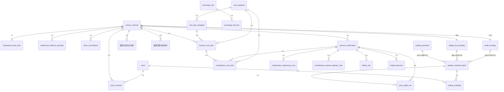
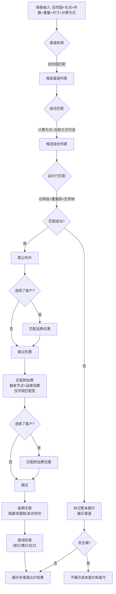
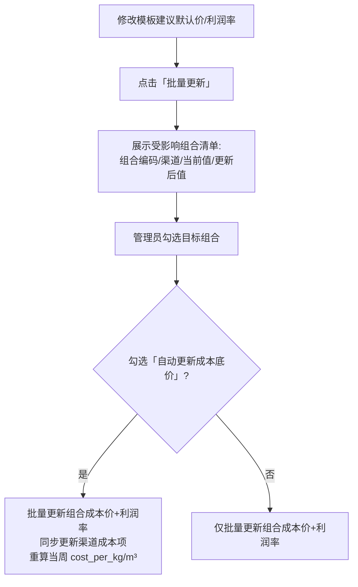
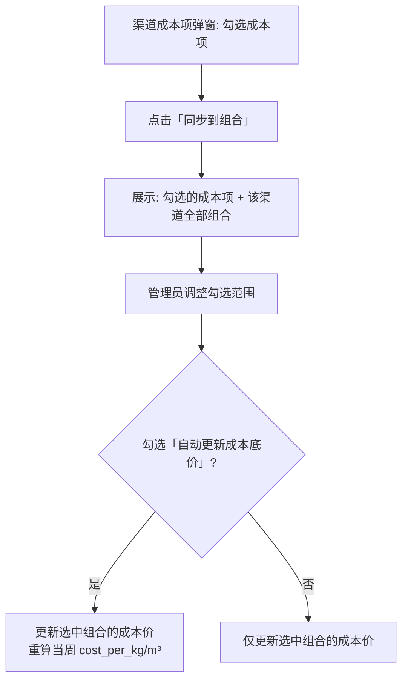
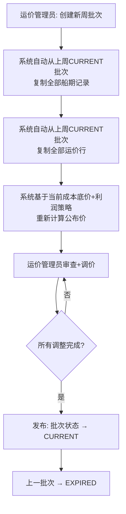
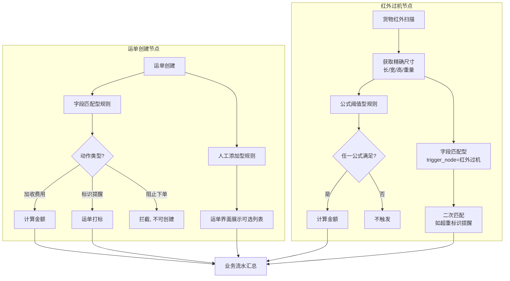

# 核心方案设计草稿 — 超级运价模块

> Phase 2：方案架构 | 基于 RDD v3.6 | 2026-05-27 | 更新 2026-06-06（全局实体抽象 + 利润策略重构 + 周批次快照模型）

---

## 1. 实体 × 表映射

| # | RDD 实体 | 表名 | 类型 | 说明 |
|---|---------|------|------|------|
| 1 | 服务渠道 | `service_channel` | 主表 | |
| 2 | 预估运输时效 | `estimated_transit_time` | 子表 | 1:1 挂 service_channel |
| 3 | 送仓预估时效 | `warehouse_delivery_estimate` | 子表 | 1:N 挂 service_channel |
| 4 | 理赔承诺时效 | `claim_commitment` | 子表 | 1:N 挂 service_channel |
| 5 | 港口 | — | 引用 | 基础数据模块，不在本模块建表 |
| 6 | 航线 | `route` | 主表 | |
| 7 | 航线-渠道关联 | `route_channel` | 关联表 | N:N |
| 8 | 周船期批次 | `weekly_schedule_batch` | 主表 | 每周快照容器：汇率 + 折算基准 + 重量段 + 默认利润率 |
| 9 | 船期 | `sailing_schedule` | 子表 | 1:N 挂 weekly_schedule_batch |
| 10 | 运价行 | `price_table_row` | 子表 | 挂 weekly_schedule_batch + combination |
| 11 | 成本段 | `cost_segment` | 主表 | 全局目录 |
| 12 | 成本项模板 | `cost_item_template` | 子表 | 1:N 挂 cost_segment，纯成本，不含利润字段 |
| 13 | 渠道成本项 | `channel_cost_item` | 子表 | 1:N 挂 service_channel，纯成本继承 |
| 14 | 服务组合 | `service_combination` | 主表 | 笛卡尔积生成 |
| 15 | 组合成本项 | `combination_cost_item` | 子表 | 1:N 挂 service_combination，纯成本执行 |
| 16 | 计费规则 | `billing_rule` | 子表 | 1:N 挂 service_combination |
| 17 | 附加费规则 | `surcharge_rule` | 主表 | |
| 18 | 运费优惠规则 | `freight_discount` | 子表 | 1:N 挂 service_combination，组合编辑弹窗内嵌管理 |
| 19 | 渠道派送仓点成本 | `渠道派送仓点成本` | 子表 | 1:N 挂 service_channel，卡派专用 |
| 20 | 组合派送仓点成本 | `combination_warehouse_cost` | 子表 | 1:N 挂 service_combination，卡派专用 |
| 21 | 渠道快递派送单价 | `渠道快递派送单价` | 子表 | 1:N 挂 service_channel，快递派专用 |
| 22 | 组合快递派送单价 | `combination_express_delivery_rate` | 子表 | 1:N 挂 service_combination，快递派专用 |
| 23 | 附加费优惠规则 | `surcharge_discount` | 子表 | 1:N 挂 surcharge_rule，附加费规则编辑弹窗内嵌管理 |
| 24 | 操作审计日志 | `audit_log` | 主表 | 二期 |
| 25 | 询价日志 | `query_log` | 主表 | 二期 |

**全局目录实体（独立于渠道/组合，运价管理员维护）**：

| # | RDD 实体 | 表名 | 类型 | 说明 |
|---|---------|------|------|------|
| G1 | 成本折算基准 | `loading_standard` | 主表 | 全局，Key = (运输方式, 尾程方式, 类型)；渠道/组合不存 |
| G2 | 重量段模板 | `weight_tier_template` | 主表 | 全局，Key = (运输方式, 计价单位)；渠道引用模板ID |
| G3 | 利润策略 | `profit_strategy` | 主表 | 全局，名称 + 百分比 + 适用范围；渠道引用策略ID |

> **核心原则**：配置层（渠道/组合）只存引用ID，不存具体值。执行层（周批次）做快照。变更下周生效，历史不受影响。

---

## 2. ER 图（核心）



---

## 3. 核心实体 Schema

> 以下 Schema 按 RDD Section 2 数据实体 + Epic 顺序列出。所有业务主表包含标准管理字段（id / tenant_id / created_at / created_by / updated_at / updated_by / is_deleted / version），下文仅标注业务字段。

### 3.1 服务渠道 `service_channel`

> 超级运价模块的聚合根。所有组合、成本、定价、优惠均挂在渠道之下。

| 字段名 | 中文名 | 类型 | 必填 | 约束/索引 | 备注 |
|--------|--------|------|------|----------|------|
| `name` | 渠道名称 | 字符串(50) | ✅ | | 如"美森360" |
| `origin_country` | 起运国 | 字符串(10) | ✅ | | 引用基础资料-国家 |
| `dest_countries` | 目的国 | 数组 | ✅ | | 多选，存储国家代码数组 |
| `transport_mode` | 运输方式 | 小整数 | ✅ | Index | 10:海运 20:空运 30:洲际火车 40:洲际卡车 |
| `last_mile_methods` | 尾程派送方式 | 数组 | ✅ | | 多选，如["卡派","快递派"] |
| `tax_methods` | 包税方式 | 数组 | ✅ | | 多选，如["包税","不包税"] |
| `billing_units` | 计费方式 | 数组 | ✅ | | 多选，如["KG","m³"] |
| `service_types` | 服务类型 | 数组 | ✅ | | 多选，如["散货","整柜"] |
| `need_claim` | 是否需要时效理赔 | 布尔 | ✅ | | |
| `fba_sync` | FBA运单同步 | 布尔 | ✅ | | 默认=false；控制是否向亚马逊推送 DW |
| `channel_type` | 渠道类型 | 小整数 | ✅ | | 10:全段服务（一期） 20:分段服务（三期预留） |
| `container_spec` | 集装箱规格参考 | 字符串(50) | | | 如"40HQ×1"，仅备注不参与计算 |
| `weight_tier_template_id` | 重量段模板 | 长整数 | ✅ | FK → weight_tier_template | 渠道创建时根据运输方式+计价单位自动匹配，可手动更换 |
| `profit_strategy_id` | 利润策略 | 长整数 | | FK → profit_strategy | 渠道创建时根据渠道类型自动匹配，可手动更换 |
| `status` | 状态 | 小整数 | ✅ | Index | 10:正常 20:已冻结；冻结后关联组合不参与运价查询 |

> **全局引用**：成本折算基准（`loading_standard`）、重量段模板（`weight_tier_template`）、利润策略（`profit_strategy`）均为全局独立实体。渠道只存引用ID，不存具体值。具体值在周批次创建时快照到批次表。

**子表**：见下方 3.1a ~ 3.1c。

---

### 3.1a 预估运输时效 `estimated_transit_time`

> 1:1 挂在 service_channel 下。控制是否向亚马逊推送 FBA 运单 DW 及对应的服务等级和运输天数。

| 字段名 | 中文名 | 类型 | 必填 | 约束/索引 | 备注 |
|--------|--------|------|------|----------|------|
| `channel_id` | 服务渠道 | 长整数 | ✅ | Unique, FK | 1:1 |
| `amazon_service_level` | 亚马逊服务等级 | 小整数 | 条件 | | 服务渠道.fba_sync=是时必填；10:标准 20:加急 30:快速 |
| `transport_min_days` | 运输最小天数 | 整数 | 条件 | | 服务渠道.fba_sync=是时必填 |
| `transport_max_days` | 运输最大天数 | 整数 | 条件 | | 服务渠道.fba_sync=是时必填，须 ≥ 最小天数 |

**业务规则**：`service_channel.fba_sync`=false 时，另三个字段不存储（非 disabled）。切换为 true 时必须重新填写，避免过期数据静默激活。

---

### 3.1b 送仓预估时效 `warehouse_delivery_estimate`

> 1:N 挂在 service_channel 下。分两阶段滚动更新 DW（运单创建→首次推送 / 提柜后→二次修正）。

| 字段名 | 中文名 | 类型 | 必填 | 约束/索引 | 备注 |
|--------|--------|------|------|----------|------|
| `channel_id` | 服务渠道 | 长整数 | ✅ | Index, FK | |
| `fba_warehouse_code` | FBA仓库代码 | 字符串(10) | ✅ | | 受目的国过滤，下拉仅展示 `仓库.country ∈ 渠道.目的国` |
| `sail_to_warehouse_days` | 开船至送仓（天） | 整数 | ✅ | | 第一阶段：DW = 开船日 + 此值 |
| `cabinet_to_warehouse_days` | 提柜至送仓（天） | 整数 | ✅ | | 第二阶段：DW = 提柜日 + 此值 |

**校验规则**：`cabinet_to_warehouse_days ≤ sail_to_warehouse_days`，否则阻止保存。
**唯一约束**：`UNIQUE(channel_id, fba_warehouse_code)`，同一渠道下同一 FBA 仓库不可重复配置。
**FBA仓库过滤**：仓库下拉仅展示 `仓库.country ∈ 服务渠道.目的国` 的仓库。
**目的国修改校验**：减少目的国时，如已有该国 FBA 仓库的时效配置，阻止操作。
**FBA运单同步联动**：`service_channel.fba_sync`=false 时，送仓预估时效配置不可编辑，已有数据清空。切换为 true 时必须重新填写，避免过期数据静默激活。

---

### 3.1c 理赔承诺时效 `claim_commitment`

> 1:N 挂在 service_channel 下。按派送方式 + FBA 仓库分组配置。运单模块根据实际送达天数 vs 理赔承诺时效自动判定是否需要理赔。

| 字段名 | 中文名 | 类型 | 必填 | 约束/索引 | 备注 |
|--------|--------|------|------|----------|------|
| `channel_id` | 服务渠道 | 长整数 | ✅ | Index, FK | |
| `delivery_method` | 派送方式 | 小整数 | ✅ | | 10:快递派 20:卡派；从渠道的尾程派送方式中取值 |
| `fba_warehouse_codes` | FBA仓库代码 | 数组 | 条件 | | 卡派必填（不同仓点可配不同理赔时效）；快递派非必填 |
| `claim_working_days` | 理赔时效（工作日） | 整数 | ✅ | | 实际送达天数 > 此值 → 触发理赔判定 |

**业务规则**：
- `service_channel.need_claim` = false → 理赔承诺时效配置不可编辑，已有数据清空
- 卡派未选仓库 → 阻止保存并提示"卡派必须指定 FBA 仓库"
- 同一仓点不可重复出现在多条理赔规则中

---

### 3.1d 成本折算基准 `loading_standard`（全局表，G1）

> 独立全局实体。按运输方式 × 尾程方式 × 基准类型定义。**渠道和组合不存此值**，运价维护时从全局表拉取并快照到周批次。

| 字段名 | 中文名 | 类型 | 必填 | 约束/索引 | 备注 |
|--------|--------|------|------|----------|------|
| `transport_mode` | 运输方式 | 小整数 | ✅ | | 10:海运 20:空运 30:洲际火车 40:洲际卡车 |
| `last_mile_method` | 尾程派送方式 | 小整数 | | | NULL=头程（不区分尾程）；仅 tail 行必填 |
| `standard_type` | 基准类型 | 小整数 | ✅ | | 10:头程 20:派送 |
| `kg_standard` | 公斤折算基准 | 整数 | ✅ | | 海运头程=12525 / 海运卡派=350 |
| `cbm_standard` | 方折算基准 | 小数(6,2) | ✅ | | 海运头程=75 / 海运卡派=1.8 |
| `is_enabled` | 是否启用 | 布尔 | ✅ | Default:1 | |

**唯一约束**：`UNIQUE(transport_mode, COALESCE(last_mile_method, 0), standard_type)`。

**预置数据**：
| 运输方式 | 尾程方式 | 类型 | KG基准 | 方基准 |
|----------|----------|------|--------|--------|
| 海运 | — | 头程 | 12525 | 75 |
| 海运 | 卡派 | 派送 | 350 | 1.8 |
| 空运 | — | 头程 | 6000 | — |

**折算公式**（运价维护时实时计算）：
```
头程 per KG  = 单价 × (USD项? 周批次汇率 : 1) ÷ 头程行.kg_standard
头程 per CBM = 单价 × (USD项? 周批次汇率 : 1) ÷ 头程行.cbm_standard
派送 per KG  = 仓点单价 × 周批次汇率 ÷ 派送行.kg_standard
派送 per CBM = 仓点单价 × 周批次汇率 ÷ 派送行.cbm_standard
成本底价 = 头程合计 + 派送段普通项 + MAX(派送段仓点成本 by 仓点)
```

---

### 3.2 航线 `route`

| 字段名 | 中文名 | 类型 | 必填 | 约束/索引 | 备注 |
|--------|--------|------|------|----------|------|
| `route_code` | 航线代码 | 字符串(20) | ✅ | | 如"AAC/AAC2" |
| `origin_港口代码` | 出发港代码 | 字符串(10) | ✅ | Index | 选择港口名称后自动带出 |
| `origin_port_name` | 出发港名称 | 字符串(50) | ✅ | | 下拉选择，来源：港口管理主数据 |
| `dest_港口代码` | 目的港代码 | 字符串(10) | ✅ | Index | 选择港口名称后自动带出 |
| `dest_port_name` | 目的港名称 | 字符串(50) | ✅ | | 下拉选择，来源：港口管理主数据 |
| `supplier_id` | 船司 | 字符串(20) | ✅ | | 下拉选择，引用 SRM 供应商，筛选 大类=干线运输供应商 & 明细=海运 |
| `estimated_transit_days` | 预计运输天数 | 整数 | | | 航线级别，船期可覆盖 |

**关联表** `route_channel`：`route_id` + `channel_id`（N:N）

**校验规则**：出发港和目的港不可相同（`origin_港口代码 ≠ dest_港口代码`），应用层阻止保存。

---

### 3.3 周船期批次 `weekly_schedule_batch`

| 字段名 | 中文名 | 类型 | 必填 | 约束/索引 | 备注 |
|--------|--------|------|------|----------|------|
| `batch_name` | 批次名称 | 字符串(30) | ✅ | | 如"2026-W05（1/26-2/1）" |
| `week_code` | 周次标识 | 字符串(10) | ✅ | **Unique** | ISO 周次，如"2026-W05" |
| `week_start` | 周起始日 | 日期 | ✅ | | |
| `week_end` | 周结束日 | 日期 | ✅ | | |
| `汇率` | USD→RMB 汇率 | 小数(10,4) | ✅ | | 新建批次时调用第三方汇率 API 自动拉取当日央行汇率并落库。运价管理员可覆盖 |
| `汇率_date` | 汇率生效日 | 日期 | ✅ | | 默认 = week_start，记录 API 拉取日期，用于审计追溯 |
| `status` | 状态 | 小整数 | ✅ | Index | 10:预告 20:当前 30:已过期 |
| `loading_snapshot` | 折算基准快照 | JSON | ✅ | | 创建时从 `loading_standard` 拉取，格式: `[{transport_mode, last_mile_method, standard_type, kg_standard, cbm_standard}]` |
| `weight_tier_snapshot` | 重量段快照 | JSON | ✅ | | 创建时从组合→渠道→模板拉取，按组合分组 |
| `profit_rate_snapshot` | 默认利润率快照 | JSON | ✅ | | 创建时从组合→利润策略拉取，按组合分组 |
| `remark` | 备注 | 字符串(200) | | | |

> **校验规则**：`week_end ≥ week_start`，否则阻止保存；`汇率 > 0`。
>
> **状态流转**：每周日 24:00，CURRENT→EXPIRED，PREVIEW→CURRENT。同时仅一条 CURRENT（应用层乐观锁 + DB 部分唯一索引 `UNIQUE(status) WHERE status=20` 兜底）。
>
> **周批次 = 执行层快照容器**：新建批次时从全局表（`loading_standard`、`weight_tier_template`、`profit_strategy`）拉取当前值，快照到本批次。快照后该批次独立于全局表——全局变更不影响已创建批次，下周新建时自动带新值。
>
> **生命周期**：预告（可编辑/可删除/可废弃）→ 当前（已发布，锁定不可改）→ 已过期（历史快照，不可删不可改）。
>
> **汇率作用域**：该批次下所有「美元换汇计算」型成本项统一使用此汇率计算 每公斤成本 / 每立方米成本。

---

### 3.4 船期 `sailing_schedule`

| 字段名 | 中文名 | 类型 | 必填 | 约束/索引 | 备注 |
|--------|--------|------|------|----------|------|
| `batch_id` | 周批次 | 长整数 | ✅ | Index, FK | |
| `route_id` | 航线 | 长整数 | ✅ | Index, FK | |
| `cutoff_times` | 截单时间 | 数组 | ✅ | | {"广州仓":"2026-02-01","汕头仓":"2026-02-01"} |
| `etd` | 预计开船时间 | 日期 | ✅ | | |
| `eta` | 预计到港时间 | 日期 | ✅ | | |
| `voyage_days` | 航程 | 整数 | ✅ | | ETD→ETA 自然日；ETD/ETA 变更时自动重算 |
| `fastest_pickup` | 最快提取/送仓时间 | 日期 | | | 开船后第 X 天 |

**批量导入**：支持 Excel 模板导入船期数据，按周批次维度批量写入 `sailing_schedule` 表。

---

### 3.5 重量段模板 `weight_tier_template`（全局表，G2）

> 独立全局实体。按运输方式 × 计价单位定义标准重量段。渠道通过 `weight_tier_template_id` 引用模板，渠道可在此基础上追加自定义段。

| 字段名 | 中文名 | 类型 | 必填 | 约束/索引 | 备注 |
|--------|--------|------|------|----------|------|
| `transport_mode` | 运输方式 | 小整数 | ✅ | | 10:海运 20:空运 30:洲际火车 40:洲际卡车 |
| `unit` | 计价单位 | 小整数 | ✅ | | 10:KG 20:m³ |
| `tier_name` | 段名称 | 字符串(20) | ✅ | | 如"8KG+"、"101KG+"、"2m³+" |
| `start_value` | 起始值 | 小数(10,2) | ✅ | | |
| `end_value` | 结束值 | 小数(10,2) | | | null=以上 |
| `sort_order` | 排序 | 整数 | ✅ | | 按从小到大排列 |
| `is_enabled` | 是否启用 | 布尔 | ✅ | Default:1 | |

**唯一约束**：`UNIQUE(transport_mode, unit, tier_name)`。

**预置数据**：
| 运输方式 | 计价单位 | 段名称 | 范围 |
|----------|----------|--------|------|
| 海运 | KG | 8KG+ | 8 ~ 101 |
| 海运 | KG | 101KG+ | 101 ~ ∞ |
| 海运 | m³ | 2m³+ | 2 ~ ∞ |
| 空运 | KG | 12KG+ | 12 ~ 21 |
| 空运 | KG | 21KG+ | 21 ~ 51 |
| 空运 | KG | 51KG+ | 51 ~ 101 |
| 空运 | KG | 101KG+ | 101 ~ ∞ |

**渠道引用扩展**：渠道创建时根据运输方式自动匹配模板默认段。渠道可追加自定义段（存储在 `channel_weight_tier_override` 子表，仅该渠道可见），不可删除模板原有段。

---

### 3.6 运价行 `price_table_row`

> **定价维度按尾程派送方式分叉**：卡派 → 仓库组；快递派 → 邮编前缀（逗号拼接）。`仓库组` 与 `zip_prefixes` 互斥。

| 字段名 | 中文名 | 类型 | 必填 | 约束/索引 | 备注 |
|--------|--------|------|------|----------|------|
| `batch_id` | 周批次 | 长整数 | ✅ | Index, FK | |
| `combination_id` | 服务组合 | 长整数 | ✅ | Index, FK | |
| `仓库组` | 仓库组 | 字符串(200) | 条件 | | 逗号分隔，如"ONT8,LAX9,LGB8"；尾程=卡派时必填 |
| `zip_prefixes` | 邮编前缀 | 字符串(100) | 条件 | | 尾程=快递派时必填，逗号拼接如 `8,9`；与 仓库组 互斥 |
| `weight_tier_id` | 重量段 | 长整数 | ✅ | FK | |
| `交货地` | 交货地 | 字符串(20) | ✅ | Index | 如"珠三角""汕头""义乌" |
| `price_每公斤` | 公布价-per-KG | 小数(10,2) | 条件 | | 计费方式含 KG 时必填 |
| `price_每立方米` | 公布价-per-CBM | 小数(10,2) | 条件 | | 计费方式含 CBM 时必填 |
| `待重算` | 待重算标记 | 布尔 | ✅ | Default:0 | 新建批次从上周复制后标记为 1；运价更新工作台展示"X 条待重算"提醒；运价管理员可一键触发重算后置 0 |

**设计说明**：仓库组用逗号存储（设计决策见 RDD）。参考签收时效和理赔时效不存储在运价行上——查询时从船期和理赔承诺时效实时计算。
**唯一约束**：`UNIQUE(batch_id, combination_id, COALESCE(仓库组, ''), COALESCE(zip_prefixes, ''), weight_tier_id, 交货地)`，同一周批次下不允许重复运价行。
**互斥校验**：应用层保证 `(仓库组 IS NOT NULL) XOR (zip_prefixes IS NOT NULL)`，保存时校验。

---

### 3.6b 邮编前缀

快递派运价行和快递派单价表中，`zip_prefixes` 字段直接存储逗号拼接的邮编前缀（如 `8,9`），匹配时用 `startswith` 逐一比对。不再维护独立的邮编区间组实体。

---

### 3.7 成本段 `cost_segment`（全局目录）

| 字段名 | 中文名 | 类型 | 必填 | 约束/索引 | 备注 |
|--------|--------|------|------|----------|------|
| `name` | 段名称 | 字符串(20) | ✅ | | 如"揽收段""干线运输段" |
| `is_enabled` | 是否启用 | 布尔 | ✅ | | 禁用后不可在新渠道中选择 |

> **与 Demo 对齐**：Demo 中使用状态枚举 `正常/已冻结`。本文档 `cost_segment` 保留 Boolean `is_enabled`，实现时以 Demo 为准。

---

### 3.8 成本项模板 `cost_item_template`（全局目录）

> 纯成本底座。利润策略（`profit_strategy`）为独立实体，由渠道/组合引用。

| 字段名 | 中文名 | 类型 | 必填 | 约束/索引 | 备注 |
|--------|--------|------|------|----------|------|
| `segment_id` | 成本段 | 长整数 | ✅ | Index, FK | |
| `name` | 项名称 | 字符串(30) | ✅ | | 如"海运费""报关费" |
| `formula_type` | 公式类型 | 小整数 | ✅ | | 10:人民币直接计算 20:美元换汇计算 |
| `default_price` | 建议默认价 | 小数(10,2) | ✅ | | 渠道关联时自动带出 |
| `currency` | 币种 | 小整数 | ✅ | | 10:RMB 20:USD |
| `sort_order` | 排序 | 整数 | ✅ | | |
| `is_enabled` | 是否启用 | 布尔 | ✅ | Default:1 | 禁用后新增渠道/组合不再出现 |
| `is_preset` | 是否预置项 | 布尔 | — | Default:0 | 1=预置项。仅派送段的仓点成本、快递派单价为预置项：不可禁用、不可删除、批量更新按钮隐藏、默认价置灰 |

**唯一约束**：`UNIQUE(segment_id, name)`，同一成本段下不可有同名模板。

> **不再包含** `profit_full` / `profit_segment` 字段。利润率由利润策略（`profit_strategy`）独立管理，成本项只关注成本本身。

---

### 3.8b 利润策略 `profit_strategy`（全局表，G3）

> 独立全局实体。定义默认利润率，被渠道/组合引用。全段服务引用全段策略，分段服务（三期）引用分段策略。

| 字段名 | 中文名 | 类型 | 必填 | 约束/索引 | 备注 |
|--------|--------|------|------|----------|------|
| `name` | 策略名称 | 字符串(30) | ✅ | | 如"全段默认利润率""分段默认利润率" |
| `profit_rate` | 默认利润率 | 小数(5,1) | ✅ | | 如 15 = 15% |
| `applicable_scope` | 适用范围 | 小整数 | ✅ | | 10:全段服务 20:分段服务 30:通用 |
| `is_enabled` | 是否启用 | 布尔 | ✅ | Default:1 | |

> **与 Demo 对齐**：Demo 中使用状态枚举 `正常/已冻结` 统一管理启用状态。本文档 `profit_strategy` 保留 Boolean `is_enabled`，实现时以 Demo 为准。

**预置数据**：
| 名称 | 利润率 | 适用范围 |
|------|--------|----------|
| 全段默认 | 15% | 全段服务 |
| 分段默认 | 18% | 分段服务 |

**使用方式**：
- 渠道创建时根据 `channel_type` 自动匹配对应 scope 的策略
- 组合创建时从渠道继承 `profit_strategy_id`
- 周批次创建时从组合引用拉取利润率 → 快照到批次
- 运价编辑时：默认利润率填充所有重量段（初始值一样），运价管理员逐行手工覆盖
- 策略变更下周新建批次时生效，不影响历史批次

### 3.9 渠道成本项 `channel_cost_item`（纯数据层）

| 字段名 | 中文名 | 类型 | 必填 | 约束/索引 | 备注 |
|--------|--------|------|------|----------|------|
| `channel_id` | 服务渠道 | 长整数 | ✅ | Index, FK | |
| `segment_id` | 成本段 | 长整数 | ✅ | FK | |
| `template_id` | 成本项模板 | 长整数 | ✅ | FK | |
| `单价` | 原始单价 | 小数(10,2) | ✅ | | 继承模板默认价，渠道可覆盖 |
| `currency` | 币种 | 小整数 | ✅ | | 继承模板币种 |
| `交货地` | 交货地 | 字符串(20) | 条件 | | 成本段=揽收段时必填；每个交货地单独一行 |
| `delivery_quote_source` | 派送报价来源 | 小整数 | 条件 | | 10:拆送价 20:组合一口价 30:整柜直送价 |
| `is_enabled` | 是否启用 | 布尔 | ✅ | Default:1 | 关闭后该渠道不适用此成本项，新生成组合时跳过 |

> 无独立管理页面，在服务渠道编辑页中配置。修改此处不自动影响已有组合。`is_enabled`=false 时，已有组合不受影响；新创建组合时不再复制被禁用的项。
> **不再包含利润字段**。利润率由利润策略独立管理，渠道通过 `profit_strategy_id` 引用。
> **揽收段按交货地拆行**：同一揽收成本项模板在不同交货地（珠三角/汕头/义乌）有不同单价时，拆为多行。每行 = `(channel_id, template_id, 交货地)` 唯一。服务组合创建时按行逐一复制。
**唯一约束**：`UNIQUE(channel_id, template_id, 交货地)`，同一渠道下同一成本项模板在同一交货地不可重复。

---

### 3.10 服务组合 `service_combination`

| 字段名 | 中文名 | 类型 | 必填 | 约束/索引 | 备注 |
|--------|--------|------|------|----------|------|
| `channel_id` | 服务渠道 | 长整数 | ✅ | Index, FK | |
| `combination_code` | 服务组合名称 | 字符串(50) | ✅ | **Unique** | 默认由维度自动拼接，支持手动修改 |
| `transport_mode` | 运输方式 | 小整数 | ✅ | | 继承自渠道 |
| `last_mile_method` | 尾程派送方式 | 小整数 | ✅ | | 10:卡派 20:快递派；笛卡尔积展开后的单值 |
| `tax_method` | 包税方式 | 小整数 | ✅ | | 10:包税 20:不包税 30:自主税号 40:自税递延；笛卡尔积展开后的单值 |
| `billing_unit` | 计费方式 | 小整数 | ✅ | | 10:KG 20:m³；笛卡尔积展开后的单值 |
| `service_type` | 服务类型 | 小整数 | ✅ | | 10:散货 20:整柜 |
| `weight_tier_template_id` | 重量段模板 | 长整数 | ✅ | FK | 从渠道继承 |
| `profit_strategy_id` | 利润策略 | 长整数 | | FK | 从渠道继承 |
| `status` | 状态 | 小整数 | ✅ | Index | 10:正常 20:已冻结；冻结后不在运价查询中出现 |

**设计说明**：服务组合由渠道属性笛卡尔积自动生成。`combination_code` 系统自动拼接。成本折算基准不存组合，运价维护时从全局表实时拉取。

---

### 3.11 组合成本项 `combination_cost_item`

| 字段名 | 中文名 | 类型 | 必填 | 约束/索引 | 备注 |
|--------|--------|------|------|----------|------|
| `combination_id` | 服务组合 | 长整数 | ✅ | Index, FK | |
| `channel_cost_item_id` | 来源渠道成本项 | 长整数 | | FK | 可追溯到渠道默认值 |
| `segment_id` | 成本段 | 长整数 | ✅ | FK | |
| `item_name` | 项名称 | 字符串(30) | ✅ | | 复制自模板 |
| `单价` | 原始单价 | 小数(10,2) | ✅ | | 继承渠道默认值 |
| `currency` | 币种 | 小整数 | ✅ | | |
| `每公斤成本` | 每公斤成本 | 小数(10,4) | | | 系统自动计算：USD项 = 单价 × 周批次.汇率 / KG基准 |
| `每立方米成本` | 每方成本 | 小数(10,4) | | | 系统自动计算：USD项 = 单价 × 周批次.汇率 / CBM基准 |
| `交货地` | 交货地 | 字符串(20) | 条件 | | 揽收段必填 |
| `is_enabled` | 是否启用 | 布尔 | ✅ | Default:1 | 禁用后计算时跳过 |
| `effective_from` | 生效时间 | DateTime | | | 一期预留 |

> **汇率来源**：不在此表存储独立汇率，统一读取所在周批次（weekly_schedule_batch）的 汇率。追溯时通过 batch_id → 汇率 还原计算过程。
>
> **派送段内部分类**：
> - **普通项**（如提拆派费）：不区分仓点/报价来源，复用本表，计算逻辑与头程成本项完全一致（按 head_kg/立方米折算基准 均摊）
> - **仓点项**（拆送价/组合一口价/整柜直送价）：使用独立的 `渠道派送仓点成本` / `combination_warehouse_cost` 管理，按仓点逐行定价后取 MAX
>
> 成本底价：
> ```
> 卡派:   头程共享 + 派送段普通项 + MAX(派送段仓点成本 by 仓点)
> 快递派: 头程共享 + 派送段普通项 + Σ(快递派单价 by weight_tier × zip_zone)
> ```
> 卡派仓点成本用 `tail_kg/立方米折算基准` 折算，快递派单价已是 per KG/m³ 不需额外折算。
>
> **异步重算策略**：汇率变更或 head/tail 基准变更时，不直接在请求线程中全量重算。改为：(1) 标记受影响行 `待重算=1`；(2) 后台任务逐批（每批 50 条）重算 每公斤成本/cbm + 建议公布价；(3) 前端轮询 `/api/recalculation-status`。失败时保留旧值并写入告警日志。

---

### 成本模型设计决策

> 以下原则约束成本模型的数据流向和实体归属，是跨模块一致性的基础。

**D1 — 数据流单向原则**

```
模板(全局) → 渠道(默认值) → 组合(执行值)
```

修改模板 → 可选推送到渠道和组合。修改渠道 → 可选推送到组合。**修改组合绝不反向同步回渠道或模板**。

**D2 — 交货地在渠道层，不在模板层**

揽收段同一成本项在不同交货地有不同单价时，拆为多行存储在 `channel_cost_item`（渠道层），而非 `cost_item_template`（模板层）。

**D3 — 成本项变更的同步边界**

- 模板建议默认价变更 → 可选推送到所有引用此模板的渠道和组合
- 渠道成本项变更 → 可选推送到该渠道下的组合；同步仅更新已有项价格，不新增不删除
- 组合成本项变更 → 仅影响该组合，不传播
- 卡派仓点/快递派单价遵循相同规则
- **同步后不自动更新运价表**：同步操作完成后，系统标记当前批次受影响运价行为"待重算"。运价管理员在工作台统一处理——[重算成本底价] 或 [已知晓，不调整]

**D4 — 快递派单价不折算**

卡派仓点成本需要用 `tail_kg_standard / tail_cbm_standard` 折算为 per KG/m³。快递派单价已是最终 per KG/m³ 价格，直接累加。

**D5 — 单价静态链 × 批次周期计算**

```
静态链（跨批次不变）：
  模板.单价 → 渠道.单价 → 组合.单价

周期计算（每批次独立）：
  从周批次读取: 汇率 + 折算基准快照 + 默认利润率快照
  成本底价 = 组合.单价 × batch.汇率 ÷ batch.折算基准
  初始公布价 = 成本底价 × (1 + batch.默认利润率)
```

- `单价` 走 D1-D3 的同步规则
- 汇率、折算基准、利润率均在周批次创建时快照，该批次内独立
- 成本单价变更后，系统自动标记当前批次受影响运价行为"待重算"
- 运价管理员在工作台触发重算：拉取组合最新单价 × 本批次汇率 ÷ 本批次折算基准
- **不再提供"同步后自动更新运价表"选项**——运价重算统一在工作台人工触发

---

### 3.11a 渠道派送仓点成本 `渠道派送仓点成本`

| 字段名 | 中文名 | 类型 | 必填 | 约束/索引 | 备注 |
|--------|--------|------|------|----------|------|
| `channel_id` | 服务渠道 | 长整数 | ✅ | Index, FK | |
| `fba_warehouse_codes` | 仓库代码 | 数组 | ✅ | | 多选，来源于头程管理-基础配置-平台仓库列表，如 `["ONT8","LAX9","LGB8"]`；同一仓库不可出现在多行 |
| `split_delivery_price` | 拆送价 | 小数(10,2) | 条件 | | 至少填一种报价方式 |
| `combo_flat_price` | 组合一口价 | 小数(10,2) | — | | 按板计费 |
| `fcl_direct_price` | 整柜直送价 | 小数(10,2) | — | | FCL 专用 |
| `currency` | 币种 | 小整数 | ✅ | | USD / RMB |
| `is_enabled` | 是否启用 | 布尔 | ✅ | Default:1 | |

### 3.11b 组合派送仓点成本 `combination_warehouse_cost`

| 字段名 | 中文名 | 类型 | 必填 | 约束/索引 | 备注 |
|--------|--------|------|------|----------|------|
| `combination_id` | 服务组合 | 长整数 | ✅ | Index, FK | |
| `source_channel_wh_cost_id` | 来源渠道仓点成本 | 长整数 | | FK | 可追溯到渠道级 |
| `fba_warehouse_codes` | 仓库代码 | 数组 | ✅ | | 多选，来源于头程管理-基础配置-平台仓库列表；同一仓库不可出现在多行 |
| `split_delivery_price` | 拆送价 | 小数(10,2) | 条件 | | |
| `combo_flat_price` | 组合一口价 | 小数(10,2) | — | | |
| `fcl_direct_price` | 整柜直送价 | 小数(10,2) | — | | |
| `currency` | 币种 | 小整数 | ✅ | | |
| `is_enabled` | 是否启用 | 布尔 | ✅ | Default:1 | |

---

### 3.11c 渠道快递派送单价 `渠道快递派送单价`

> 1:N 挂在 service_channel 下。快递派专用——快递承运商（UPS/FedEx 等）按重量段 × 邮编前缀给出的固定单价。

| 字段名 | 中文名 | 类型 | 必填 | 约束/索引 | 备注 |
|--------|--------|------|------|----------|------|
| `channel_id` | 服务渠道 | 长整数 | ✅ | Index, FK | |
| `weight_tier_id` | 重量段 | 长整数 | ✅ | FK | 快递派专用重量段（如 0.5KG+/1KG+/2m³+），计价单位从 weight_tier.unit 推导 |
| `zip_prefixes` | 邮编前缀 | 字符串(100) | ✅ | | 逗号拼接如 `8,9`，匹配时 startswith |
| `单价` | 单价 | 小数(10,2) | ✅ | | per KG 或 per m³，视 weight_tier.unit 而定 |
| `currency` | 币种 | 小整数 | ✅ | | 10:RMB 20:USD |

**唯一约束**：`UNIQUE(channel_id, weight_tier_id, zip_prefixes)`。

### 3.11d 组合快递派送单价 `combination_express_delivery_rate`

> 1:N 挂在 service_combination 下。从渠道级复制，组合可覆盖单价。

| 字段名 | 中文名 | 类型 | 必填 | 约束/索引 | 备注 |
|--------|--------|------|------|----------|------|
| `combination_id` | 服务组合 | 长整数 | ✅ | Index, FK | |
| `source_channel_rate_id` | 来源渠道单价 | 长整数 | | FK | 可追溯到渠道级 |
| `weight_tier_id` | 重量段 | 长整数 | ✅ | FK | |
| `zip_prefixes` | 邮编前缀 | 字符串(100) | ✅ | | 逗号拼接如 `8,9`，匹配时 startswith |
| `单价` | 单价 | 小数(10,2) | ✅ | | |
| `currency` | 币种 | 小整数 | ✅ | | |
| `is_enabled` | 是否启用 | 布尔 | ✅ | Default:1 | |

**唯一约束**：`UNIQUE(combination_id, weight_tier_id, zip_prefixes)`。

---

### 3.12 计费规则 `billing_rule`

统一表格挂在服务组合上。首行为通用规则（`rule_type=10`，不可删除），可追加特殊规则（`rule_type=20`，按客户匹配覆盖通用值）。**1:N**。

| 字段名 | 中文名 | 类型 | 必填 | 约束/索引 | 备注 |
|--------|--------|------|------|----------|------|
| `combination_id` | 服务组合 | 长整数 | ✅ | Index, FK | |
| `rule_type` | 对象类型 | 小整数 | ✅ | | 10:通用 20:特殊规则 |
| `target_customers` | 目标 | 数组 | 条件 | | rule_type=20 时必填；多选客户ID；同一客户不可出现在多条规则中 |
| `volume_factor` | 计泡系数 | 整数 | ✅ | | 计费方式=KG 时默认 6000；计费方式=m³ 时默认 363 |
| `weight_method` | 计重方式 | 小整数 | ✅ | | 10:按实重 20:按材重 30:取大 |
| `weight_precision` | 计重精度 | 小数(2,1) | | | 下拉枚举：1（向上取整）/ 0.1（保留一位小数）/ 0.01（保留两位小数）；KG 默认 1，m³ 默认 0.1 |
| `dimension_precision` | 尺寸精度 | 小数(2,1) | | | 下拉枚举：1（向上取整）/ 0.1（保留一位小数）/ 0.01（保留两位小数）；默认 1 |
| `min_box_weight` | 最低箱收费重 | 小数(6,2) | | | |
| `min_shipment_weight` | 最低票收费重 | 小数(6,2) | | | |
| `min_pieces` | 最小承运件数 | 整数 | | | |
| `max_pieces` | 最大承运件数 | 整数 | | | |

> 约束：同一客户不可在同一组合的多条特殊规则中出现。优先级：特殊规则 > 通用规则。同一客户命中多条特殊规则时取第一条。

---

### 3.13 利润策略（已移除，见 §3.8b `profit_strategy`）

利润策略已从成本项内联字段重构为独立全局实体 `profit_strategy`（见 §3.8b）。成本项模板（§3.8）、渠道成本项（§3.9）、组合成本项（§3.11）均不再包含利润字段。

---

### 3.14 附加费规则 `surcharge_rule`

| 字段名 | 中文名 | 类型 | 必填 | 约束/索引 | 备注 |
|--------|--------|------|------|----------|------|
| `name` | 规则名称 | 字符串(50) | ✅ | **Unique** | |
| `rule_type` | 规则类型 | 小整数 | ✅ | | 10:字段匹配 20:公式阈值 30:人工添加 |
| `action_type` | 动作类型 | 小整数 | ✅ | | 10:加收费用 20:标识提醒 30:阻止下单 |
| `trigger_node` | 触发节点 | 小整数 | ✅ | | 10:运单创建 20:红外过机 |
| `discountable_level` | 可优惠级别 | 小整数 | 条件 | | 10:可全免(服务型) 20:部分可优惠(成本型) 30:不可优惠(代收代缴型)；影响附加费优惠校验 |
| `scope_type` | 生效范围 | 小整数 | — | | V1 固定=10(全局)；预留 20(指定渠道) |
| `scope_ids` | 生效范围ID列表 | 数组 | — | | V1 为空；预留字段 |
| `pricing_rows` | 计价明细 | 数组 | 条件 | | 动作类型=加收费用时必填。每行=一条费用线：fee_direction(10:应收/20:应付)、fee_label(FK→费用类型)、pricing_unit(10-50:按票/按箱/按KG/按m³/按数量)、price(支持负数)、currency(取值来源于基础资料-币种接口)。可配多行 |
| `status` | 状态 | 小整数 | ✅ | | 10:正常 20:已冻结；大列表控制，弹窗不展示 |
| `match_conditions` | 字段匹配条件 | 数组 | 条件 | | 规则类型=字段匹配时必填 |
| `formula_list` | 公式列表 | 数组 | 条件 | | 规则类型=公式阈值时必填。两条公式 OR 关系。可用变量：长/宽/高(cm)、单箱重量(kg)、SKU数量 |
| `supplier_cost_price` | 供应商成本单价 | 小数(10,2) | | | 二期预留 |
| `supplier_id` | 关联供应商 | 字符串(20) | | | 二期预留 |

**设计说明**：三种规则类型的专属配置分别存储在 JSON 字段中（`match_conditions` / `formula_list` / `manual_input_fields`），不拆分子表，因为每种类型配置结构固定且不需要独立查询。

---

### 3.15 运费优惠规则 `freight_discount`（内嵌于服务组合编辑弹窗管理）

规则直接挂在服务组合上，无适用范围字段（天然绑定所在组合）。**1:N**。

| 字段名 | 中文名 | 类型 | 必填 | 约束/索引 | 备注 |
|--------|--------|------|------|----------|------|
| `combination_id` | 服务组合 | 长整数 | ✅ | Index, FK | |
| `target_type` | 优惠对象类型 | 小整数 | ✅ | | 10:客户特批 20:客户等级 |
| `target_levels` | 目标客户等级 | 数组 | 条件 | FK → 客商中心-等级管理 | target_type=20 时必填；多选 |
| `target_customers` | 目标客户 | 数组 | 条件 | FK → 客商中心-客户管理 | target_type=10 时必填；多选 |
| `discount_mode` | 优惠方式 | 小整数 | ✅ | | 10:折扣率 20:固定减免 |
| `discount_value` | 优惠值 | 小数(6,4) | ✅ | | 折扣率模式：0.01~9.99；固定减免模式：元，支持负数 |
| `validity_type` | 有效期类型 | 小整数 | ✅ | | 10:永久有效 20:固定期限 30:单次有效 |
| `valid_from` | 有效期起 | 日期 | 条件 | | |
| `valid_to` | 有效期止 | 日期 | 条件 | | |
| `approval_no` | 飞书审批编号 | 字符串(30) | 条件 | | 客户特批时必填 |
| `status` | 状态 | 小整数 | 自动 | | 10:生效中 20:已失效。系统自动维护：固定期限到期 → 20；单次有效被非取消运单引用 → 20。不可手动修改 |

> **业务规则**：客户特批优先级高于客户等级。同组合上两条规则命中同一客户时，特批覆盖等级。
>
> **唯一性约束**：应用层校验 `UNIQUE(combination_id, target_type, target_levels/target_customers) WHERE status=10`。同一组合 + 同一对象类型 + 同一目标最多一条生效规则。

---

### 3.16 附加费优惠规则 `surcharge_discount`（内嵌于附加费规则编辑弹窗管理）

规则直接挂在附加费规则上，无适用范围字段（天然绑定所在规则）。**1:N**。与运费优惠独立配置。字段及约束同 §3.15，差异：`surcharge_rule_id` 替代 `combination_id`。

> **唯一性约束**：应用层校验 `UNIQUE(surcharge_rule_id, target_type, target_levels/target_customers) WHERE status=10`。同一规则 + 同一对象类型 + 同一目标最多一条生效规则。

### 3.17 审计日志 `audit_log`（二期）

| 字段名 | 中文名 | 类型 | 必填 | 约束/索引 | 备注 |
|--------|--------|------|------|----------|------|
| `operator_id` | 操作人 | 字符串(20) | ✅ | Index | |
| `operated_at` | 操作时间 | DateTime | ✅ | Index | |
| `entity_type` | 变更对象 | 字符串(30) | ✅ | | 实体类型 |
| `entity_id` | 变更对象ID | 字符串(20) | ✅ | Index | |
| `field_name` | 变更字段 | 字符串(30) | ✅ | | |
| `old_value` | 旧值 | Text | | | |
| `new_value` | 新值 | Text | | | |

> 审计日志不可物理删除。不设软删除标识，保留 ≥ 2 年。

---

### 3.18 询价日志 `query_log`（二期）

| 字段名 | 中文名 | 类型 | 必填 | 约束/索引 | 备注 |
|--------|--------|------|------|----------|------|
| `operator_id` | 操作人 | 字符串(20) | ✅ | Index | |
| `queried_at` | 查询时间 | DateTime | ✅ | Index | |
| `query_params` | 查询条件 | 数组 | ✅ | | 目的国/仓点/件数/重量/尺寸/产品类型/交货地/客户 |
| `results` | 返回结果 | 数组 | ✅ | | 命中渠道列表 + 各渠道报价 |

> 一期仅记录不做分析。软删除后可清理，保留 ≥ 1 年。

---

## 4. 外部接口依赖

超级运价模块依赖以下基础资料/外部模块的接口，本模块不维护这些数据，仅通过接口调用：

| 依赖模块 | 接口用途 | 调用场景 |
|---------|---------|---------|
| 基础资料-国家 | 获取国家列表 | 服务渠道.起运国/目的国下拉、港口.国家下拉 |
| 基础资料-邮编库 | 查询邮编是否偏远 | 附加费规则：邮编∈偏远地区列表 |
| 商业地址接口 | 传入地址 → 返回商业/私人/偏远 | 附加费规则：地址类型匹配 |
| SRM 供应商管理 | 获取干线运输供应商列表 | 航线.船司下拉 |
| 港口主数据 | 获取港口列表（名称+代码） | 航线.出发港/目的港下拉 |
| 仓库列表 | 获取本地仓库列表（代码+名称+邮编） | 船期.截单时间按仓库、附加费.本地仓、交货地下拉 |
| 商品管理 | 获取 SKU 属性标签 | 附加费规则：SKU属性匹配 |
| 客户管理 | 获取客户信息（编号+等级） | 运费优惠、附加费优惠、运价查询 |
| 等级管理 | 获取客户等级列表 | 运费优惠、附加费优惠 |

---

## 5. 关键设计决策

| 决策 | 方案 | 原因 |
|------|------|------|
| 仓库组存储 | 逗号分隔 String | 分组稳定，避免过度设计独立表 |
| 附加费三类型 | 单表 + JSON 子字段 | 共享字段多，子配置不需要独立查询 |
| 渠道成本项无管理页 | 纯数据层 | 避免额外页面，在渠道编辑页内嵌配置 |
| 运价行挂周批次 | batch_id 外键 | 与船期同生命周期，查询/复制/归档一致 |
| 港口/国家/船司 | 引用外部模块 | 不在超级运价内维护主数据 |

---

## 6. 核心业务流程

### 6.1 运价查询完整链路



### 6.2 成本批量更新流程

两个入口，同一数据链路：

**路径 A：模板「批量更新」**（成本管理 → 成本项模板 → 点击「批量更新」）



**路径 B：渠道「同步到组合」**（服务渠道 → 成本项弹窗 → 勾选 → 「同步到组合」）



> **关键约束**：两个路径均为「仅更新已有项」——只修改组合中已存在的成本项，不新增或删除。禁用项不可同步。仓点成本/快递派单价有独立同步按钮，且按组合尾程派送方式过滤（卡派仅同步仓点成本，快递派仅同步快递派单价）。

### 6.3 新建周批次（每周运维入口）



### 6.4 附加费规则匹配（分节点）



---

## 7. 风险探测报告

| 风险维度 | 场景描述 | 风险等级 | 建议解决方案 |
|---------|---------|---------|------------|
| **并发冲突** | 运价管理员 A 和 B 同时修改同一条运价行 | P1 | 乐观锁 version 字段，后提交者提示"数据已被他人修改" |
| **并发冲突** | 成本批量更新时，某组合正在被另一个管理员单独调价 | P1 | 更新前校验 version，冲突的组合跳过并在结果中标注 |
| **数据一致性** | 批量更新中途失败（部分组合更新成功、部分失败） | P0 | ≤50 条时单事务执行（全部回滚）；>50 条时分批提交（每批 50 条独立事务），失败批次在结果报告中标注，运价管理员可单独重试 |
| **数据一致性** | 删除已被渠道引用的成本项模板 | P0 | 删除前校验引用计数，有关联渠道时禁止删除，提示"已被 X 个渠道引用" |
| **数据一致性** | 周批次从上周复制时，某个渠道已被删除 | P1 | 复制时校验渠道状态，已删除渠道的运价行不复制 |
| **逆向异常** | 运价已发布到 CURRENT 批次，发现错误需要撤回 | P2 | 一期不做版本回滚（Phase 3），运价管理员手动覆盖正确的价格 |
| **逆向异常** | 特批价生效后客户关系终止，优惠需要立即失效 | P1 | 提供"手动过期"按钮，运价管理员可提前终止优惠规则 |
| **权限安全** | 销售查看运价时通过接口参数猜出成本底价 | P0 | 货主端接口不返回 每公斤成本/每立方米成本；运营端接口校验角色权限 |
| **权限安全** | 运价管理员 A 修改了运价管理员 B 配置的渠道 | P1 | 暂不做操作级权限隔离（一期 5-10 人团队），依赖审计日志追溯 |
| **时间边界** | 周批次自动流转时（周日 24:00），有人正在编辑本周运价 | P2 | 流转前检查是否有未保存的编辑，弹窗提示"系统即将切换批次" |
| **时间边界** | `effective_from` 到期自动切换时，存在未完成的运单 | P2 | 一期手动切换，运价管理员确认当前无在途业务后操作 |

---

## 8. 信息架构（IA 设计）

### 8.1 菜单结构

```
├── 🏠 运价更新工作台（每周运维入口）
│   ├── 顶部：批次选择器 + 指标卡
│   ├── Tab 1: 本周船期（只读，链接到航线&船期页编辑）
│   └── Tab 2: 本周运价（可编辑：新增/编辑运价行 + 批量调价 + 发布）
│
├── 🔍 查价订舱
│   ├── 运营端运价查询
│   └── 货主端在线询价
│
├── 📋 基础配置
│   ├── 服务渠道
│   │   ├── 渠道列表
│   │   ├── 运输时效配置（预估/送仓/理赔）
│   │   └── 重量段配置
│   ├── 航线 & 船期（主数据 + 船期录入）
│   │   ├── 航线管理
│   │   ├── 周船期批次（全量，含历史追溯）
│   │   └── 船期维护（在批次内录入/编辑船期）
│   ├── 成本管理
│   │   ├── 成本段（全局目录）
│   │   ├── 成本项模板（全局目录）
│   │   └── 渠道成本项（渠道编辑页内嵌）
│   └── 计费规则（组合编辑页内嵌）
│
├── 🔄 运价运维
│   └── 服务组合管理
│
├── ⚙️ 规则引擎
│   └── 附加费规则
│
├── 📊 审计与日志（二期）
│   ├── 操作审计日志（二期）
│   └── 询价日志（二期）
│
└── ⚙️ 企业设置（基础资料模块）
    ├── 港口管理
    ├── 仓库列表
    ├── 客户管理
    ├── 等级管理
    └── 商品管理
```

> **两页分工原则**：航线&船期页 = 主数据 + 全量批次历史 + 船期录入（"写"操作）；工作台 = 本周运维，对照船期调运价 + 发布（"用"操作）。船期和运价共享同一个周批次（`weekly_schedule_batch`），不是各管各的周期。工作台的船期 Tab 只读，点击"编辑船期 →"跳转到航线&船期页编辑。

### 8.2 页面清单

| 页面名称 | 所属菜单 | 对应实体/功能 | 类型 |
|---------|---------|-------------|------|
| 运价更新工作台-首页 | 首页 | 周船期批次 + 运价行（船期 Tab 只读，运价 Tab 可编辑 + 发布） | 工作台 |
| 运营端运价查询 | 查价订舱 | Epic 7 匹配引擎 | 查询页 |
| 货主端在线询价 | 查价订舱 | Epic 7（隐藏成本底价） | 查询页 |
| 服务渠道列表 | 基础配置 | ServiceChannel | 列表页 |
| 服务渠道详情/编辑 | 基础配置 | ServiceChannel + 时效配置 + 重量段 + 渠道成本项（不含派送仓点成本） | 编辑页 |
| 航线 & 船期 | 路线管理 | Route + WeeklyScheduleBatch + SailingSchedule（航线 CRUD + 全量批次列表 + 船期录入/编辑） | 列表页 |
| 成本项模板管理 | 基础配置 | CostSegment + CostItemTemplate（全局目录） | 列表页 |
| 服务组合列表 | 运价运维 | ServiceCombination（勾选后批量设置运费优惠） | 列表页 |
| 服务组合详情/编辑 | 运价运维 | 统一计费规则表 + 运费优惠规则 + 组合成本项（含利润策略覆盖） | 编辑页 |
| 附加费规则列表 | 规则引擎 | SurchargeRule（勾选后批量设置附加费优惠） | 列表页 |
| 附加费规则新增/编辑 | 规则引擎 | SurchargeRule（三类型表单 + 内嵌附加费优惠编辑） | 编辑页 |
| 操作审计日志（二期） | 审计与日志 | AuditLog | 列表页 |
| 询价日志（二期） | 审计与日志 | QueryLog | 列表页 |