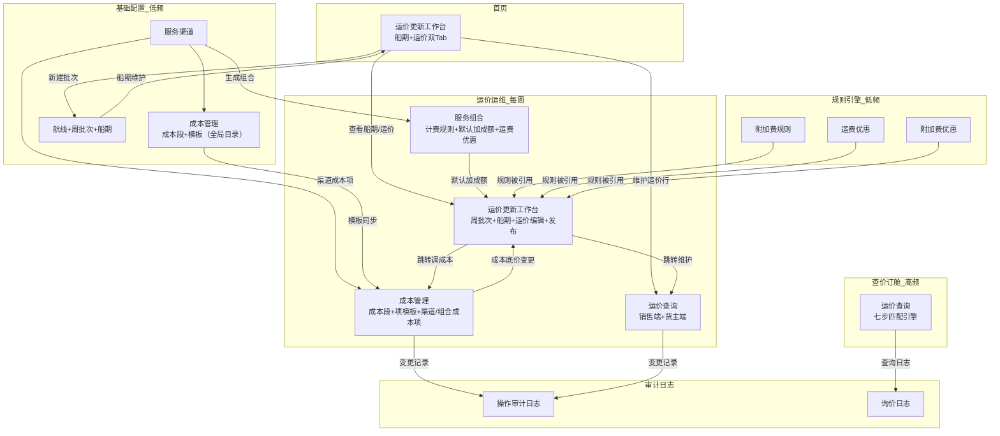

# 超级运价模块 — 产品需求文档 (PRD)

> **文档类型**：PRD | **版本**：V2.17 | **状态**：草稿 | **日期**：2026-07-23
> **作者**：AI PM + 飞点业务团队
> **评审人**：产品/研发/测试/业务代表

### 0.1 变更记录

| 版本 | 变更日期 | 变更内容 | 变更人 |
|------|---------|---------|--------|
| V1.0 | 2026-05-28 | 初稿，基于 RDD v3.4 + Architecture | AI PM |
| V2.15 | 2026-07-20 | 揽收段装柜费+拖车费标记为预置项；服务渠道/组合成本项弹窗拆分揽收段为独立「按交货地分别定价」区域 | AI PM |
| V2.16 | 2026-07-21 | 装柜费取消交货地影响因素改为统一价；新增交货地组合实体；运价矩阵加入交货地组维度 | AI PM |
| V2.0 | 2026-05-30 | 升级为开发版，基于 RDD v4.0 + Architecture | AI PM |
| V2.1 | 2026-06-06 | 全局实体抽象 + 利润策略重构 + 周批次快照模型 + 成本底价计算对齐 | AI PM |
| V2.2 | 2026-06-11 | surcharge_rule 增加 tag_ids 字段，引用基础资料标识管理（附加费标识类型）；编辑页增加附加费标识选择区块 | AI PM |
| V2.3 | 2026-07-03 | 新增泡比优惠 density_discount 实体；一期全优惠统一固定减免（运费/泡比/附加费）；折扣率+叠加顺序可配+硬拦截移至二期 | AI PM |
| V2.4 | 2026-07-06 | 航线关联渠道新增过滤规则：渠道下拉按航线港口国家过滤（出发港→起运国，目的港→目的国） | AI PM |
| V2.5 | 2026-07-07 | 航程改为航线快照取值（只读），ETD+航程→ETA自动计算；截单日期必须早于ETD校验 | AI PM |
| V2.6 | 2026-07-08 | 运价查询【运输详情】改为「当周船期 × 各交货地截单」矩阵 | AI PM |
| V2.7 | 2026-07-08 | 服务渠道新增「关联航线」多选+保存强校验≥1；渠道↔航线双向维护 `route_channel`；航线"船司"改名"供应商"并按港口类型过滤；双向对称过滤（港口类型+国家） | AI PM |
| V2.14 | 2026-07-17 | 周批次：新增已作废状态(40)；预告+当前均可作废；去手动发布按钮，系统按日期自动流转；汇率改为多币种数组（JSON快照）；新建弹窗改为Tab结构（折算基准快照+汇率快照） | AI PM |
| V2.13 | 2026-07-17 | 计费规则：计重精度→收费重精度；去尺寸精度；新增计重方式（按票/按箱） | AI PM |
| V2.12 | 2026-07-13 | 附加费规则去「触发节点」字段（系统自动确定）+ 去「批量设置附加费优惠」功能；RDD/数据设计/PRD 同步 | AI PM |
| V2.11 | 2026-07-13 | 重量段模板去「排序」字段（新增/编辑界面+数据表+列表页均移除 sort_order） | AI PM |
| V2.10 | 2026-07-13 | 计费规则「收费重方式」与「计费方式」级联：KG→实重(10)/材重(20)/实重材重取大(30)，m³→重量方数(40)/体积(50)/重量方数体积取大(60)；weight_method 枚举新增 40/50/60 | AI PM |
| V2.9 | 2026-07-13 | 成本项模板「公式类型」改为「是否换汇」（是/否），根据币种自动派生不可编辑；建议默认价+币种与是否换汇交换位置；新增界面去启用默认价开关，主列表改为只读标签 | AI PM |
| V2.8 | 2026-07-10 | 利润模型改固定加成额（元/计价单位）；砍掉 `profit_strategy` 全局利润策略池实体，改为服务组合字段 `default_markup`；公布价=成本+加成额；盈亏灯统一"只判运费侧"——工作台=加成额 vs（最大运费优惠+最大泡比优惠）、销售查询=运费净利、附加费不并入、客户/货主端无灯（R07/BPR-1 同步）；删利润策略页 | AI PM |

### 0.2 关联链接

- RDD：`drafts/超级运价/2026-07-23-用户需求.md`
- Architecture：`drafts/超级运价/2026-07-23-数据设计.md`
- 需求背景：`analysis/超级运价需求调研/超级运价需求背景.md`
- 原型：`demo/员工端-demo/, demo/货主端-demo/`

### 0.3 评审记录

| 日期 | 参会人 | 主要问题/结论 | 待办 |
|------|--------|-------------|------|
| — | — | 待评审 | — |

---

## 1. 需求定义

### 1.1 背景与现状

飞点跨境物流作为亚马逊 FIST 承运商，当前外采新智慧 TMS 系统仅能承载业务数据记录，无法做成本计算、利润分析、运价管理。核心瓶颈是"成本→报价"链路全部依赖人工 Excel。

**现状**：
- 140 个服务组合 × 5 段成本 × 每段 3-5 个成本细项，海运费每周变动时逐一换算 KG/CBM 成本价，单组合约 10 分钟
- 公布价靠手工维护，船期和运价在 Excel 不同 Sheet 中维护
- 附加费靠人工判定——商品属性、地址类型、邮编、超重超长等数据源分散在不同系统
- 优惠折扣靠人算，成本底价不可追溯（Excel 覆盖即丢失），不同销售给同一客户报价可能不一致

### 1.2 目标与成功口径

**目标**：当船公司周一发来新海运费时，运价管理员 30 分钟内完成 140+ 组合成本更新和对客公布价刷新；销售 5 秒内给客户含所有优惠的最终报价。

**成功口径**：

| 指标 | 当前 | 目标 | 数据来源 | 评估窗口 |
|------|------|------|---------|---------|
| 单组合成本核算 | 10 分钟 | 1 分钟 | 系统日志 | 上线后第 2 周 |
| 全量运价更新 | 1 天 | 0.5 天 | 系统日志 | 上线后第 2 周 |
| 成本可追溯性 | 无 | 100% | 审计日志 | 持续 |
| 运价查询响应 | — | < 3 秒 | 接口耗时 | 持续 |

### 1.3 范围与边界

**In Scope（Phase 1 MVP，56 项功能）**：
- 服务渠道管理 + 时效配置（预估/送仓/理赔）
- 航线 & 船期管理（周批次 + 船期维护）
- 成本管理（四层成本模型、成本自动计算、批量更新模板→渠道→组合、渠道同步到组合）
- 服务组合 + 计费规则 + 默认加成额（组合字段 `default_markup`）
- 运价表四维矩阵定价
- 附加费规则引擎（三类型 + 三动作 + 两节点）
- 运费优惠 + 泡比优惠（一期新增）+ 附加费优惠（全固定减免，一期）
- 运价查询（运营端 + 货主端）
- 操作审计日志 + 询价日志（二期）

**Out of Scope**：
- 分段服务（Phase 3）
- 运营端在线报价（Phase 2）
- 利润分析仪表盘（Phase 3）
- 销售提成计算（CRM 模块）
- 供应商账单对接（SRM 模块）

### 1.4 影响范围

- 影响角色：运价管理员、销售、运营主管、客户（货主）
- 影响模块：TMS 超级运价（新建模块）
- 依赖系统：基础资料（国家/邮编/港口/仓库）、SRM 供应商、商品管理、客户管理、等级管理

---

## 2. 枚举字典 ★ 研发必读

> 与 Architecture Schema 中 TinyInt 值严格一致。研发实现时以此表为准。
>
> Demo 原型中使用中文标签展示，生产环境 API 使用本表定义的小整数。两者语义一致，仅展示形式不同。

### 2.1 运输方式

| 值 | 常量名 | 中文 | 适用表 |
|----|--------|------|--------|
| 10 | 海运 | 海运 | 服务渠道表, 服务组合 |
| 20 | 空运 | 空运 | 服务渠道表, 服务组合 |
| 30 | 洲际火车 | 洲际火车 | 服务渠道表, 服务组合 |
| 40 | 洲际卡车 | 洲际卡车 | 服务渠道表, 服务组合 |

### 2.2 尾程派送方式

| 值 | 常量名 | 中文 |
|----|--------|------|
| 10 | 卡派 | 卡派 |
| 20 | 快递派 | 快递派 |

### 2.3 包税方式

| 值 | 常量名 | 中文 |
|----|--------|------|
| 10 | 包税 | 包税 |
| 20 | 不包税 | 不包税 |
| 30 | 自主税号 | 自主税号 |
| 40 | 自税递延 | 自税递延 |

### 2.4 计费方式

| 值 | 常量名 | 中文 |
|----|--------|------|
| 10 | 公斤 | 重量 KG |
| 20 | 立方米 | 体积 m³ |

### 2.5 服务类型

| 值 | 常量名 | 中文 |
|----|--------|------|
| 10 | 散货 | 散货 |
| 20 | 整柜 | 整柜 |

### 2.6 渠道类型

| 值 | 常量名 | 中文 | 备注 |
|----|--------|------|------|
| 10 | 全段服务 | 全段服务 | 一期默认 |
| 20 | 分段服务 | 分段服务 | 三期预留 |

### 2.7 实体状态

| 枚举名 | 值 | 常量名 | 中文 | 适用实体 |
|--------|----|--------|------|---------|
| 渠道状态 | 10 | 正常 | 正常 | 服务渠道表 |
| 渠道状态 | 20 | 已冻结 | 已冻结 | 服务渠道表 |
| 组合状态 | 10 | 正常 | 正常 | 服务组合 |
| 组合状态 | 20 | 已冻结 | 已冻结 | 服务组合 |
| 批次状态 | 10 | 预告 | 预告 | 周批次表 |
| 批次状态 | 20 | 当前 | 当前 | 周批次表 |
| 批次状态 | 30 | 已过期 | 已过期 | 周批次表 |
| 规则状态 | 10 | 正常 | 正常 | 附加费规则, 运费优惠规则, 附加费优惠规则 |
| 规则状态 | 20 | 已冻结 | 已冻结 | 附加费规则 |
| 规则状态 | 20 | 已失效 | 已失效 | 运费优惠规则, 附加费优惠规则 |
| 成本段状态 | 10 | 正常 | 正常 | 成本段 |
| 成本段状态 | 20 | 已冻结 | 已冻结 | 成本段 |

### 2.8 附加费规则枚举

| 枚举名 | 值 | 常量名 | 中文 |
|--------|----|--------|------|
| 规则类型 | 10 | 字段匹配 | 字段匹配 |
| 规则类型 | 20 | 公式阈值 | 公式阈值 |
| 规则类型 | 30 | 人工添加 | 人工添加 |
| 动作类型 | 10 | 加收费用 | 加收费用 |
| 动作类型 | 20 | 标识提醒 | 标识提醒 |
| 动作类型 | 30 | 阻止下单 | 阻止下单 |
| 费用方向 | 10 | 应收 | 应收 |
| 费用方向 | 20 | 应付 | 应付 |
| 可优惠级别 | 10 | 可全免 | 可全免 |
| 可优惠级别 | 20 | 部分可优惠 | 部分可优惠 |
| 可优惠级别 | 30 | 不可优惠 | 不可优惠 |
| 范围类型 | 10 | 全局 | 全局 |
| 范围类型 | 20 | 指定渠道 | 指定渠道 |
| 范围类型 | 30 | 指定组合 | 指定组合 |
| 计价单位 | 10 | 按票 | 按票 |
| 计价单位 | 20 | 按箱 | 按箱 |
| 计价单位 | 30 | 每公斤 | 按 KG |
| 计价单位 | 40 | 每立方米 | 按 m³ |
| 计价单位 | 50 | 按数量 | 按数量 |

### 2.9 优惠规则枚举

| 枚举名 | 值 | 常量名 | 中文 | 备注 |
|--------|----|--------|------|------|
| 对象类型 | 10 | 客户特批 | 客户特批 | 泡比优惠/运费优惠/附加费优惠通用 |
| 对象类型 | 20 | 客户等级 | 客户等级 | |
| 优惠方式 | 10 | 折扣率 | 折扣率 | **二期开放**：运费优惠、泡比优惠、附加费优惠 |
| 优惠方式 | 20 | 固定减免 | 固定减免 | **一期唯一**：所有优惠仅此方式 |
| 有效期类型 | 10 | 永久有效 | 永久有效 | |
| 有效期类型 | 20 | 固定期限 | 固定期限 | |
| 有效期类型 | 30 | 单次有效 | 单次有效 | |
| — | — | — | **业务规则**：客户特批优先级高于客户等级，不单独存字段。泡比优惠与运费优惠叠加 |

### 2.10 其他枚举

| 枚举名 | 值 | 常量名 | 中文 | 说明 |
|--------|----|--------|------|------|
| 亚马逊服务等级 | 10 | 标准 | 标准 | 亚马逊服务等级 |
| 亚马逊服务等级 | 20 | 加急 | 加急 | |
| 亚马逊服务等级 | 30 | 快速 | 快速 | |
| 是否换汇 | 10 | 否 | 否（RMB直接计算） | 成本项模板，由币种自动派生 |
| 是否换汇 | 20 | 是 | 是（USD换汇计算） | |
| 币种 | — | — | 取值来源于基础资料-币种接口 | |
| 不可加利润 | — | false | 否 | 代收代缴项（税金）不可加利润 |
| 不可加利润 | — | true | 是 | 该成本项为代收代缴（如税金），不计入加成基数 |
| 派送报价来源 | 10 | 拆送价 | 拆送价 | 派送段 |
| 派送报价来源 | 20 | 组合一口价 | 组合一口价 | |
| 派送报价来源 | 30 | 整柜直送价 | 整柜直送价 | |
| 收费重方式 | 10 | 实重 | 实重 | 计费规则，计费方式=KG时可选 |
| 收费重方式 | 20 | 材重 | 材重 | 计费方式=KG时可选 |
| 收费重方式 | 30 | 实重材重取大 | 实重材重取大 | 计费方式=KG时可选 |
| 收费重方式 | 40 | 重量方数 | 重量方数 | 计费方式=m³时可选 |
| 收费重方式 | 50 | 体积 | 体积 | 计费方式=m³时可选 |
| 收费重方式 | 60 | 重量方数体积取大 | 重量方数体积取大 | 计费方式=m³时可选 |
| 计重方式 | 10 | 按票 | 按票 | 计费规则，默认值 |
| 计重方式 | 20 | 按箱 | 按箱 | |

---

## 3. 状态机 ★ 研发必读

### 3.1 服务渠道 `服务渠道表.status`

```
正常(正常=10) ──{冻结}──→ 已冻结(已冻结=20)
已冻结(已冻结=20) ──{解冻}──→ 正常(正常=10)
```

| 当前状态 | 操作 | 目标状态 | 触发角色 | 校验条件 |
|---------|------|---------|---------|---------|
| 正常 | 冻结 | 已冻结 | 运价管理员 | — |
| 已冻结 | 解冻 | 正常 | 运价管理员 | — |

> 冻结后级联影响：该渠道下所有服务组合同步变更为已冻结。启用时弹窗确认是否一并启用关联组合，可选"启用渠道及关联组合"或"仅启用渠道"。

### 3.2 周船期批次 `周批次表.status`

```
预告(预告=10) ──{系统定时}──→ 当前(当前=20) ──{周日24:00}──→ 已过期(已过期=30)
    │                    │                              (终态)
    └──{作废}──→ 已作废(40) └──{作废}──→ 已作废(40) (终态)
```

| 当前状态 | 操作 | 目标状态 | 触发角色 | 校验条件 |
|---------|------|---------|---------|---------|
| 预告 | 系统定时 | 当前 | 系统 | 每周日 24:00 自动流转；同一时刻仅一条 当前 |
| 当前 | 定时到期 | 已过期 | 系统 | 每周日 24:00 自动流转 |
| 预告 | 作废 | 已作废 | 运价管理员 | 数据保留，不可恢复 |
| 当前 | 作废 | 已作废 | 运价管理员 | 数据保留，不可恢复 |

> 约束：同时仅一条 当前（应用层乐观锁 + DB 部分唯一索引 `UNIQUE(status) WHERE status=20`）。不再支持手动发布到当前，系统按日期自动流转。

### 3.3 运费优惠规则 `运费优惠规则.status`

```
正常(正常=10) ──{到期/单次引用}──→ 已失效(已失效=20) (终态)
```

| 当前状态 | 操作 | 目标状态 | 触发角色 | 校验条件 |
|---------|------|---------|---------|---------|
| 正常 | 固定期限到期 | 已失效 | 系统定时任务 | valid_to ≤ 当前日期 |
| 正常 | 单次有效被运单引用 | 已失效 | 系统 | 有非取消的运单关联此优惠规则后自动失效 |

> 到期前 7 天系统推送提醒给运价管理员。已失效后运价查询不再展示，但历史运单仍可追溯原优惠。

### 3.4 附加费规则 `附加费规则.status`

```
正常(正常=10) ──{冻结}──→ 已冻结(已冻结=20)
已冻结(已冻结=20) ──{解冻}──→ 正常(正常=10)
```

> 已被运单引用的规则不可删除，只能冻结。

### 3.5 服务组合 `服务组合.status`

```
正常(正常=10) ──{冻结}──→ 已冻结(已冻结=20)
已冻结(已冻结=20) ──{解冻}──→ 正常(正常=10)
```

> 冻结后不在运价查询中出现，不计入公布价批量更新范围。

---

## 4. 功能清单与页面映射

| 模块 | 功能点 | 优先级 | 对应页面 | 页面类型 |
|------|--------|--------|---------|---------|
| 服务渠道 | 渠道创建/编辑/冻结解冻+时效配置+重量段+渠道成本项 | P0 | 服务渠道列表 / 服务渠道编辑 | 列表页+编辑页 |
| 航线管理 | 航线创建/编辑/N:N关联渠道 | P0 | 航线列表 | 列表页+编辑弹窗 |
| 周船期批次 | 按周创建/复制/状态流转 | P0 | 周船期批次列表 | 列表页 |
| 船期维护 | 在周批次下录入/编辑/Excel批量导入 | P0 | 船期维护 | 编辑页 |
| 成本段 | 全局目录CRUD+冻结/解冻 | P0 | 成本段管理 | 列表页+编辑弹窗 |
| 成本项模板 | 全局目录CRUD+冻结/解冻。派送段仓点成本/快递派单价为预置项：不可冻结、不可删除、批量更新隐藏、默认价置灰 | P0 | 成本项模板管理 | 列表页+编辑弹窗 |
| 服务组合 | 笛卡尔积生成/编辑/冻结解冻；编辑弹窗内维护默认加成额 + 运费优惠；列表勾选批量设置 | P0 | 服务组合列表 / 组合编辑 | 列表页+编辑弹窗 |
| 计费规则 | 统一表格：通用+客户等级/特批覆盖（按对象类型区分） | P0 | 组合编辑页内嵌 | 内嵌表格 |
| 默认加成额 | 服务组合字段 `default_markup`，固定金额（元/计价单位）。新建运价行起步种子，工作台逐重量段覆盖 | P0 | 组合编辑页内嵌 | service_combination.default_markup |
| 运价表维护 | 交货地组 ×仓库组/邮编前缀矩阵定价(KG/CBM双计价) | P0 | 运价表维护 | 编辑页 |
| 附加费规则 | 三类型+三动作CRUD；编辑弹窗内维护附加费优惠 | P0 | 附加费规则列表 / 附加费规则编辑 | 列表页+编辑弹窗 |
| 运费优惠 | 客户等级/特批CRUD（内嵌于服务组合编辑弹窗） | P0 | 服务组合编辑弹窗内嵌 | 内嵌编辑表 |
| 附加费优惠 | 绑定附加费规则CRUD（内嵌于附加费规则编辑弹窗） | P0 | 附加费规则编辑弹窗内嵌 | 内嵌编辑表 |
| 运价查询(运营端) | 反向匹配引擎+成本底价+盈亏标识 | P0 | 运营端运价查询 | 查询页 |
| 货主端在线询价 | 反向匹配(隐藏成本底价和盈亏) | P0 | 货主端在线询价 | 查询页 |
| 运价更新工作台 | 船期+运价同屏 | P0 | 运价更新工作台-首页 | 工作台 |
| 操作审计日志（二期） | 变更留痕+不可删除 | P2 | 操作审计日志 | 列表页 |
| 询价日志（二期） | 查询记录(二期) | P2 | 询价日志 | 列表页 |

**依赖与前置**：
- 基础资料模块：国家、港口、邮编库、仓库列表需已上线
- SRM 供应商管理：干线运输供应商需已维护
- 商品管理：SKU 属性标签需已启用
- 客户管理、等级管理：需已上线

---

### 4.1 页面导航关系图

> 14 个原型页面之间的跳转关系、数据流向、角色入口。



> **角色入口**：运价管理员 → 首页工作台 / 运价运维四页；销售 → 运价查询；管理员 → 基础配置 + 规则引擎。

---

## 5. 页面规格 ★ 研发必读

### 5.1 运价更新工作台（首页）

**页面信息**：
- 路径：首页 → 运价更新工作台
- 类型：工作台
- 访问角色：运价管理员

**页面结构**：双 Tab 页——「本周船期」+「本周运价行」。默认展示当前 当前 批次数据。

**本周船期 Tab**：

| 列名 | 数据来源 | 格式 |
|------|---------|------|
| 航线 | route.route_code + origin_port_name → dest_port_name (supplier) | 如"CLX 上海→长滩(MATSON)" |
| 截单时间（按本地仓） | sailing_schedule.cutoff_times | JSON 渲染为多行 |
| ETD | sailing_schedule.etd | 日期 |
| ETA | sailing_schedule.eta | 日期 |
| 航程 | sailing_schedule.voyage_days | X天 |
| 最快提取 | sailing_schedule.fastest_pickup | 日期 |

**交互**：船期 Tab 为只读展示，供运价管理员对照船期调运价。点击「编辑船期 →」跳转至「航线 & 船期」页面进行船期的录入/编辑/批量导入。船期和运价共享同一周批次。

**本周运价 Tab**（两级折叠视图）：
主表行 = 服务组合 × 交货地组，列 = 服务组合 | 交货地 | 操作（编辑按钮）。展开后按派送方式分化：卡派子表 = 仓库组 × 重量段（含成本底价列，同一仓库组下各重量段成本相同），快递派子表 = 邮编前缀 × 重量段（无独立成本底价列，成本因重量段而异故嵌入每格）。成本底价引用自成本管理（只读）。公布价 = 成本底价 + 加成额 + 拖车费交货地组加价/KG，运价管理员点击主表行「编辑」按钮弹出矩阵编辑弹窗，可调整该交货地组下各仓库组/邮编前缀的每重量段加成额或公布价，两者双向联动。定价维度由服务组合的尾程派送方式自动确定（卡派→仓库组，快递派→邮编前缀）。加成额起步值取自服务组合 `default_markup`。

**关联接口**：
- 查询：`GET /api/weekly-batch/当前` 返回批次+船期+运价行
- 复制：`POST /api/weekly-batch/copy-from-last`
- 创建批次：`POST /api/weekly-batch`

---

### 5.2 服务渠道列表 / 编辑

**列表页字段**：

| 列名 | 数据来源 | 格式 |
|------|---------|------|
| 渠道名称 | 服务渠道表.name | 原样 |
| 运输方式 | 服务渠道表.transport_mode | 枚举渲染 |
| 目的国 | 服务渠道表.dest_countries | JSON 数组渲染 |
| 计费方式 | 服务渠道表.billing_units | JSON 数组渲染 |
| 关联航线 | route_channel 关联（反向查询） | 航线代码标签列表；无关联航线时为红色"未关联"标识 |
| 状态 | 服务渠道表.status | 正常/已冻结，带状态标签 |

**编辑页**：多 Tab 结构——
- Tab「基本信息」：渠道字段表 + **「关联航线」多选**（仅展示航线代码，必填≥1）+ 预估运输时效（见下方字段表）
- Tab「送仓预估时效」：1:N 子表（delivery_method, warehouse_or_zip, sail_to_warehouse_days, cabinet_to_warehouse_days）。派送方式与渠道尾程派送方式级联；卡派→仓库下拉，快递派→邮编文本输入
- Tab「理赔承诺时效」：1:N 子表（delivery_method, fba_warehouse_codes, claim_working_days）。卡派按仓点配置，快递派渠道级一行（不区分仓点）
- Tab「重量段」：多选模板下拉框（按运输方式+计费方式联动过滤，海运+KG→海运KG模板、空运+KG→空运KG模板，未选时展示全部），支持多选合并。模板段不可删，可追加自定义段（unit, tier_name, start_value, end_value）。编辑模式应用模板时弹出确认框防误覆盖。
- Tab「成本项」：渠道成本项配置（继承全局模板，可覆盖单价/冻结）

**基本信息字段表**：

| 字段名 | 中文名 | 类型 | 必填 | 默认值 | 校验规则 | 数据来源 |
|--------|--------|------|------|--------|---------|---------|
| name | 渠道名称 | 字符串(50) | ✅ | — | 长度 1-50 | 手动输入 |
| origin_country | 起运国 | 字符串(10) | ✅ | — | — | 基础资料-国家（单选） |
| dest_countries | 目的国 | 数组 | ✅ | — | 至少选 1 个 | 基础资料-国家（多选） |
| transport_mode | 运输方式 | 小整数 | ✅ | — | — | 枚举：10/20/30/40 |
| route_codes | 关联航线 | N:N（`route_channel`） | ✅ | — | **保存时强校验 ≥1 条**（渠道必须绑航线） | 关联表；过滤：港口类型（海港航线↔海运渠道、非海港↔非海运）+ 国家（出发港国=起运国、目的港国∈目的国）；下拉与回显仅展示航线代码；运输方式/国家变更时自动裁剪不可用选项 |
| last_mile_methods | 尾程派送方式 | 数组 | ✅ | — | 至少选 1 个 | 多选：10/20 |
| tax_methods | 包税方式 | 数组 | ✅ | — | 至少选 1 个 | 多选：10/20/30/40 |
| billing_units | 计费方式 | 数组 | ✅ | — | 至少选 1 个 | 多选：10/20 |
| service_types | 服务类型 | 数组 | ✅ | — | 至少选 1 个 | 多选：10/20 |
| need_claim | 是否需要时效理赔 | 布尔 | ✅ | false | — | 开关 |
| fba_sync | FBA运单同步 | 布尔 | ✅ | false | — | 开关 |
| channel_type | 渠道类型 | 小整数 | ✅ | 10 | 一期固定=10 | 枚举 |
| container_spec | 集装箱规格参考 | 文本 | 否 | 默认空 | 一期固定为通用 | — |
| status | 状态 | 小整数 | ✅ | 10 | — | 枚举 |

**交互行为**：
- [保存]：仅保存渠道，不生成组合。**校验关联航线 ≥1 条**，否则阻止并提示"请至少关联一条航线（渠道必须绑定航线才能提供船期）"
- [保存并生成服务组合]：保存渠道 + 笛卡尔积生成组合 + 逐一复制渠道成本项。派送段按组合尾程派送方式过滤：卡派组合仅复制仓点成本，快递派组合仅复制快递派单价。**同样校验关联航线 ≥1 条**
- [冻结]：二次确认弹窗 → 渠道及关联组合同步变更为已冻结
- [启用]：弹窗提示"是否需要一并启用关联服务组合？"→ 两个按钮："启用渠道及关联组合" / "仅启用渠道"
- 目的国减少校验：如已有该国 FBA 仓库时效配置，阻止并提示"需先清理该国仓库的时效配置后，方可移除此目的国"
- 关联航线过滤变更：运输方式切换（海运↔非海运）或国家变更时，系统自动裁剪已选航线列表（移除不再符合条件的项），避免静默保存失效绑定

**关联接口**：
- 查询列表：`GET /api/service-channels`
- 创建：`POST /api/service-channel`（body 含子表）
- 编辑：`PUT /api/service-channel/{id}`
- 生成组合：`POST /api/service-channel/{id}/generate-combinations`
- 冻结/解冻：`PUT /api/service-channel/{id}/status`

---

### 5.3 航线列表

**列表页字段**：

| 列名 | 数据来源 | 格式 |
|------|---------|------|
| 航线代码 | route.route_code | 如"AAC/AAC2" |
| 出发港 | route.origin_port_name(origin_港口代码) | "上海港(shg)" |
| 目的港 | route.dest_port_name(dest_港口代码) | "长滩港(uslax)" |
| 供应商 | route.supplier_id | 引用 SRM 渲染名称；**（原"船司"改名）** |
| 预计运输天数 | route.estimated_transit_days | 天 |
| 关联渠道 | route_channel 关联 | 渠道名称标签列表（**渠道侧编辑入口已开放，渠道与航线侧均可编辑**） |

**新增/编辑弹窗字段表**：

| 字段名 | 中文名 | 类型 | 必填 | 校验规则 | 数据来源 |
|--------|--------|------|------|---------|---------|
| route_code | 航线代码 | 字符串(20) | ✅ | — | 手动输入，默认空可编辑 |
| origin_港口代码 | 出发港代码 | 字符串(10) | ✅ | 与目的港不可相同 | 港口主数据（选择名称后自动带出） |
| origin_port_name | 出发港名称 | 字符串(50) | ✅ | — | 港口主数据下拉 |
| dest_港口代码 | 目的港代码 | 字符串(10) | ✅ | — | 港口主数据（选择名称后自动带出） |
| dest_port_name | 目的港名称 | 字符串(50) | ✅ | — | 港口主数据下拉 |
| supplier_id | 供应商 | 字符串(20) | ✅（原"船司"，位置置于目的港之后） | — | SRM（筛选 大类=干线运输供应商 & 明细按港口类型条件过滤：海港→含"海运"，非海港→含"非海运"；航线的港口类型由出发港决定） |
| estimated_transit_days | 预计运输天数 | 整数 | — | ≥ 0 | 手动输入 |
| channel_ids | 关联渠道 | 数组 | — | 双向对称过滤：① 港口类型（海港航线↔海运渠道、非海港↔非海运渠道）② 国家（出发港.国家=渠道.起运国 AND 目的港.国家∈渠道.目的国） | 服务渠道多选；保存后写入 `route_channel`（与渠道侧共享同一张关联表） |
| status | 状态 | 小整数 | ✅ | 10 | 10:正常 20:已冻结 |
| route_ref_id | **关联渠道编辑入口** | `route_channel` | — | 渠道侧与航线侧**双向可编辑**同一张关联表；渠道侧强校验≥1；航线侧出发港变更时自动裁剪不再符合港口类型+国家的渠道 | — |

**关联接口**：
- 查询：`GET /api/routes`
- 创建：`POST /api/route`
- 编辑：`PUT /api/route/{id}`

---

### 5.4 船期维护

**页面信息**：在周批次详情页内，按航线分别录入本周船期。

**字段表**：

| 字段名 | 中文名 | 类型 | 必填 | 校验规则 | 说明 |
|--------|--------|------|------|---------|------|
| route_id | 航线 | 长整数 | ✅ | — | 下拉选航线 |
| cutoff_times | 截单时间 | 数组 | ✅ | 至少 1 个仓库；截单日期 < ETD | {"仓库名称":"日期"} |
| etd | 预计开船时间(ETD) | 日期 | ✅ | — | 日期选择器；变更时自动重算 ETA |
| eta | 预计到港时间(ETA) | 日期 | ✅ | — | 只读，ETD + 航程自动计算 |
| voyage_days | 航程 | 整数 | ✅ | — | 新增时从航线.预计运输天数快照取值，只读 |
| fastest_pickup | 最快提取/送仓 | 日期 | — | ≥ ETA | 日期选择器 |

**交互**：[批量导入] 按钮 → 下载 Excel 模板 → 上传 → 按 batch_id 批量写入 sailing_schedule 表。

**关联接口**：
- 查询周批次下船期：`GET /api/weekly-batch/{batch_id}/schedules`
- 保存：`POST /api/sailing-schedule` / `PUT /api/sailing-schedule/{id}`
- 批量导入：`POST /api/sailing-schedule/import`

---

### 5.5 成本段 / 成本项模板管理

**成本段列表**：

| 字段名 | 中文名 | 类型 | 必填 |
|--------|--------|------|------|
| name | 段名称 | 字符串(20) | ✅ |
| status | 状态 | 小整数 | ✅ | 10:正常 20:已冻结

**成本项模板列表**：

| 字段名 | 中文名 | 类型 | 必填 | 校验规则 |
|--------|--------|------|------|---------|
| 段级_id | 所属成本段 | 长整数 | ✅ | — |
| name | 项名称 | 字符串(30) | ✅ | 同段下不可重名 UNIQUE(段级_id, name) |
| formula_type | 是否换汇 | 小整数 | ✅ | 10:否(RMB) 20:是(USD)，界面根据币种自动派生、不可编辑 |
| default_price | 建议默认价 | 小数(10,2) | ✅ | ≥ 0 |
| 币种 | 币种 | 小整数 | ✅ | 10:RMB 20:USD |
| sort_order | 排序 | 整数 | ✅ | — |
| is_preset | 是否预置项 | 布尔 | 是 | 默认false | 揽收段(装柜费/拖车费)+派送段(仓点成本/快递派单价)为预置项：不可禁用、不可删除、批量更新隐藏 |
| status | 状态 | 小整数 | ✅ | Default:10；冻结不物理删除 |

**渠道成本项字段表**（服务渠道 Tab「成本项」内，继承全局模板可覆盖）：

| 字段名 | 中文名 | 类型 | 必填 | 默认值 | 校验规则 |
|--------|--------|------|------|--------|---------|
| template_id | 引用模板 | 长整数 | ✅ | — | FK → cost_item_template |
| 单价 | 单价 | 小数(10,2) | ✅ | 继承模板默认价 | ≥ 0，可覆盖 |
| 币种 | 币种 | 小整数 | ✅ | 继承模板 | 10:RMB 20:USD |
| status | 状态 | 小整数 | ✅ | 继承模板 | 10:正常 20:已冻结 |
| delivery_quote_source | 派送报价来源 | 小整数 | 条件 | — | 10:拆送价 20:组合一口价 30:整柜直送价；仅派送段适用 |

**关联接口**：
- 成本段 CRUD：`GET/POST/PUT /api/cost-segments`
- 模板 CRUD：`GET/POST/PUT /api/cost-item-templates`
- 冻结：`PUT /api/cost-项级-template/{id}/freeze`
- 删除校验：被渠道引用时禁止删除，提示"已被 X 个渠道引用"

---

### 5.6 服务组合列表 / 编辑

**列表页字段**：

| 列名 | 数据来源 | 格式 |
|------|---------|------|
| 组合名称 | 服务组合.组合级_code | 自动拼接 |
| 服务渠道 | 服务组合.channel_id → name | 渲染渠道名称 |
| 运输方式 | transport_mode | 枚举渲染 |
| 尾程派送 | last_mile_method | 枚举渲染 |
| 计费方式 | billing_unit | 枚举渲染 |
| 包税方式 | tax_method | 枚举渲染 |
| 服务类型 | service_type | 枚举渲染 |
| 状态 | status | 正常/已冻结 |

**编辑弹窗**：包含三个折叠区域 ——
- 「基本信息」：组合基础字段（名称/渠道/运输方式/尾程派送/计费方式/包税方式/服务类型/状态）
- 「计费规则」：统一表格，首行为通用规则（不可删除）+ 可追加特殊规则行（按客户匹配覆盖）；见 5.7
- 「运费优惠规则」：可编辑的优惠规则表格，支持客户等级/客户特批两种对象类型；见 5.8
- 「成本项」：组合成本项列表（继承自渠道，可覆盖单价/冻结）

**关联接口**：
- 查询组合：`GET /api/service-combinations?channel_id={id}`
- 编辑：`PUT /api/service-组合级/{id}`（含子表）
- 冻结/解冻：`PUT /api/service-组合级/{id}/status`

---

### 5.7 计费规则（组合编辑弹窗内嵌，统一表格）

挂在服务组合上，首行为通用规则（不可删除），可追加特殊规则行按客户匹配覆盖。**1:N**。

| 字段名 | 中文名 | 类型 | 必填 | 默认值 | 校验规则 |
|--------|--------|------|------|--------|---------|
| rule_type | 对象类型 | 小整数 | ✅ | 10(通用) / 20(特殊规则) | 首行固定=10 |
| target_customers | 目标 | 数组 | 条件 | — | rule_type=20 时必填；多选客户；同一客户不可在多条规则中出现 |
| volume_factor | 计泡系数 | 整数 | ✅ | KG=6000 / m³=363 | > 0 |
| weight_method | 收费重方式 | 小整数 | ✅ | KG=30(实重材重取大) / m³=40(重量方数) | 由计费方式级联：KG→10/20/30，m³→40/50/60 |
| weighing_method | 计重方式 | 小整数 | ✅ | 10(按票) | 10:按票 20:按箱 |
| weight_precision | 收费重精度 | 枚举 | — | KG=1 / m³=0.1 | 下拉：1/0.1/0.01 |
| min_box_weight | 最低箱收费重 | 小数(6,2) | — | — | ≥ 0 |
| min_shipment_weight | 最低票收费重 | 小数(6,2) | — | — | ≥ 0 |
| min_pieces | 最小承运件数 | 整数 | — | — | ≥ 0，空=不限制 |
| max_pieces | 最大承运件数 | 整数 | — | — | ≥ min_pieces，空=不限制 |

> **优先级**：特殊规则 > 通用规则。同一客户命中多条特殊规则时取第一条。

---

### 5.8 默认加成额（服务组合字段）

利润为服务组合上的字段 `default_markup`（固定金额，元/计价单位），不再有独立的全局利润策略实体，也不是成本项内联字段。成本和利润分离——成本管理只管成本，利润在组合上以固定加成额表达。

| 字段名 | 中文名 | 类型 | 必填 | 校验规则 |
|--------|--------|------|------|---------|
| default_markup | 默认加成额 | 小数(10,2) | | 元/计价单位。组合 billing_unit=KG→元/KG，m³→元/m³；默认 0 |

**数据流**：服务组合维护 `default_markup`（单位随计价方式）→ 新建运价行时取组合加成额作起步值 → 运价编辑：公布价 = 成本底价 + 加成额 + 拖车费交货地组加价/KG，运价管理员逐行覆盖（所有重量段初始值相同）。

> **设计决策**：把命名利润策略池降级为组合字段。1) 利润只是起步种子，运价员每周手工推翻，池的复用价值极低；2) 加成额单位随组合计价方式，存组合上单位天然确定；3) 与一期固定减免优惠口径统一，盈亏色标可精确做"加成额 − 最大优惠额"。

---

### 5.9 运价维护（工作台运价 Tab）

**页面信息**：运价更新工作台内嵌，本周运价 Tab。两级折叠视图：主表行 = 服务组合 × 交货地组，列 = 服务组合 | 交货地 | 公布价范围 | 操作（编辑按钮）。展开子表按派送方式分化——卡派：仓库组 | 成本底价 | 最大优惠 | 各重量段（利润额+公布价+成本）；快递派：邮编前缀 | 最大优惠 | 各重量段（成本+利润额+公布价，成本嵌入每格无独立列）。盈亏色标（同单位相减，精确，只判运费侧）：加成额≥最大优惠额→绿、0<加成额<最大优惠额→红（给满优惠会亏）、加成额≤0→灰。**最大优惠 = 该组合最大运费优惠额 + 最大泡比优惠额**（两者都挂组合、都减运费、叠加，取最坏情况；元/计价单位）。附加费不进工作台灯。

**新建运价行**：选择服务组合，定价维度自动确定（卡派→仓库组多选，快递派→邮编前缀输入）。仓库组从组合关联仓库中多选，交货地组多选。创建时自动校验唯一性（组合+仓库组+交货地组不可重复）。装柜费为统一价（¥1,200/票），归入 headItems 主表展示；拖车费为唯一受交货地影响的揽收段成本项，按预定义的交货地组合分别定价；同一交货地组下拖车费单价相同的合并为一行、不同则拆行。

**编辑弹窗**：上半部展示成本底价参照（头程合计 + 派送MAX，只读）。下方「展开成本明细 ▼」默认展开，可查看完整演算过程（头程按段逐项 + 派送段报价来源比较/快递派查表），按组合计费方式仅展示 KG 或 m³ 单列。下半部逐重量段表格：成本底价 | 加成额（可编辑） | 公布价（可编辑）。调整加成额 → 公布价自动重算（成本+加成额+拖车费交货地组加价）；直接修改公布价 → 加成额自动反算（公布价-成本-拖车费交货地组加价），双向联动。

**成本明细展开面板**：
- 默认展开，点击可收起。按服务组合的计费方式仅展示 KG 或 m³ 单列
- 头程明细表：成本段 / 成本项 / 原始单价 / 计价单位 / 每KG（或每m³），底部合计头程汇总
- 卡派：派送段按仓点逐行展示三种报价来源（拆送价/组合一口价/整柜直送价），取 MAX 标记绿色高亮
- 快递派：派送段按重量段 × 邮编前缀查表，直接累加不比较
- 底部绿色公式条：成本底价 = 头程 + 派送普通项 + 派送MAX/快递合计

**新建周批次**：从全局表快照折算基准（头程+派送全部行）+ 重量段 + 汇率。可选「从上周复制」——骨架重生+决策继承：用本周启用航线/组合笛卡尔积铺底→匹配旧批次→命中则继承加成额/公布价（成本底价用本周 costRefMap 重算），未命中用组合默认加成额初始化并标记「新增」，已停用的航线/组合/成本项自动移除。复制后全部标记待重算。加成额取组合默认加成额起步值，不随批次快照。发布后锁定不可编辑。

**待重算**：成本单价变更 → 自动标记当前批次运价行为待重算 → 工作台提醒条 → [重算成本底价] 或 [已知晓不调整]。

---


### 5.10 附加费规则列表 / 编辑

**列表页字段**：规则名称、规则类型(字段匹配/公式阈值/人工添加)、动作类型(加收/标识/阻止)、生效范围、计价单位、状态

**编辑页**：按 rule_type 渲染不同表单区块——
- 通用区（所有类型共享字段，见下表）
- 条件配置区（按 rule_type 动态渲染：字段匹配→条件组 JSON / 公式阈值→公式列表 JSON，双公式 OR 关系，变量为长宽高/单箱重量/SKU数量 / 人工添加→输入字段 JSON）
- 附加费标识区（详见下方"附加费标识字段"）

**通用字段表**：

| 字段名 | 中文名 | 类型 | 必填 | 校验规则 |
|--------|--------|------|------|---------|
| name | 规则名称 | 字符串(50) | ✅ | 唯一 Unique |
| rule_type | 规则类型 | 小整数 | ✅ | 10/20/30 |
| action_type | 动作类型 | 小整数 | ✅ | 10/20/30 |
| discountable_level | 可优惠级别 | 小整数 | 条件 | action_type=10 时必填。10:可全免(服务型)/20:部分可优惠(成本型)/30:不可优惠(代收代缴型)；影响附加费优惠校验 |
| scope_type | 生效范围 | 小整数 | ✅ | 10/20/30 |
| scope_ids | 生效范围ID列表 | 数组 | 条件 | scope_type=20时取正常的服务渠道名称；scope_type=30时取服务组合 |
| pricing_rows | 计价明细 | 数组 | 条件 | action_type=10 时必填。每行=一条费用线，含 fee_direction/fee_label/pricing_unit/price/currency |
| status | 状态 | 小整数 | ✅ | 10/20；大列表控制，弹窗不展示 |
| tag_ids | 附加费标识 | 数组 | — | 多选，引用基础资料-标识管理 `tag.id`；下拉仅展示 `tag_type`=20(附加费标识) 且 status=10(正常) 的标识 |

**附加费标识字段说明**：
- 位置：规则弹窗"执行动作"区块下方，独立分区（④ 附加费标识）
- 可选范围：仅 `tag_type`=20（附加费标识）且状态=正常的标识
- 用途：当动作类型=标识提醒时，规则触发后自动为运单打上所选标识；当动作类型=加收费用时，标识也会打在运单上供后续费用归类
- `tag_ids` 以 JSON 数组存储（如 `[1, 4]`）

**交互**：已被运单引用的规则→[删除]按钮隐藏，仅显示[冻结]。

**关联接口**：
- CRUD：`GET/POST/PUT /api/surcharge-rules`
- 冻结/解冻：`PUT /api/surcharge-rule/{id}/status`

---

### 5.11 运费优惠 / 附加费优惠规则（内嵌于父实体编辑弹窗）

运费优惠规则在**服务组合编辑弹窗**内直接维护，附加费优惠规则在**附加费规则编辑弹窗**内直接维护。均无独立页面。两种优惠均支持从列表页批量设置。

**运费优惠编辑字段表**（内嵌于服务组合编辑弹窗）：

| 字段名 | 中文名 | 类型 | 必填 | 校验规则 |
|--------|--------|------|------|---------|
| combination_id | 服务组合 | 长整数 | ✅ | FK，规则天然绑定所在组合 |
| target_type | 优惠对象类型 | 小整数 | ✅ | 10:客户特批 20:客户等级 |
| target_levels | 目标客户等级 | 数组 | 条件 | target_type=20 时必填；多选，下拉取值来源于客商中心-等级管理 |
| target_customers | 目标客户 | 数组 | 条件 | target_type=10 时必填；多选，下拉取值来源于客商中心-客户管理（正常客户） |
| discount_mode | 优惠方式 | 小整数 | ✅ | 10:折扣率 20:固定减免 |
| discount_value | 优惠值 | 小数(6,4) | ✅ | 折扣率 0.01~9.99；固定减免支持负数（负数=加价） |
| validity_type | 有效期类型 | 小整数 | ✅ | 10:永久有效 20:固定期限 30:单次有效 |
| valid_from | 有效期起 | 日期 | 条件 | validity_type=20 时必填 |
| valid_to | 有效期止 | 日期 | 条件 | validity_type=20 时必填，≥ valid_from |
| approval_no | 飞书审批编号 | 字符串(30) | 条件 | target_type=10(客户特批)时必填 |
| status | 状态 | 小整数 | 自动 | 10:正常 20:已失效。系统自动维护：固定期限到期→20；单次有效被非取消运单引用→20。不可手动修改 |

**附加费优惠编辑字段表**（内嵌于附加费规则编辑弹窗，共享 target/validity 逻辑，差异字段如下）：

| 字段名 | 中文名 | 类型 | 必填 | 校验规则 |
|--------|--------|------|------|---------|
| surcharge_rule_id | 目标附加费规则 | 长整数 | ✅ | FK → 附加费规则；天然绑定所在规则 |
| target_type | 优惠对象类型 | 小整数 | ✅ | 10:客户特批 20:客户等级 |
| target_levels | 目标客户等级 | 数组 | 条件 | target_type=20 时必填；多选 |
| target_customers | 目标客户 | 数组 | 条件 | target_type=10 时必填；多选 |
| discount_mode | 优惠方式 | 小整数 | ✅ | 10:折扣率 20:固定减免 |
| discount_value | 优惠值 | 小数(6,4) | ✅ | 可全免→无下限；部分可优惠→≥成本价；不可优惠→拒建 |
| validity_type | 有效期类型 | 小整数 | ✅ | 10:永久有效 20:固定期限 30:单次有效 |
| valid_from | 有效期起 | 日期 | 条件 | validity_type=20 时必填 |
| valid_to | 有效期止 | 日期 | 条件 | validity_type=20 时必填 |
| approval_no | 飞书审批编号 | 字符串(30) | 条件 | target_type=10(客户特批)时必填 |
| status | 状态 | 小整数 | 自动 | 10:生效中 20:已失效。系统自动维护 |

> **业务规则**：客户特批优先级高于客户等级（高覆盖低，不叠加）。同一父实体 × 同一对象类型 × 同一目标唯一。运费优惠与附加费优惠独立计算，互不影响。

**批量设置**：
- 运费优惠：服务组合列表页勾选多条组合 → 「批量设置运费优惠」→ 配置对象类型/优惠方式/优惠值/有效期 → 一次保存

**关联接口**：
- 运费优惠 CRUD：通过组合编辑接口 `PUT /api/service-combinations/{id}` 含子表
- 附加费优惠 CRUD：通过规则编辑接口 `PUT /api/surcharge-rules/{id}` 含子表

---

### 5.12 运价查询（运营端）

**页面信息**：
- 路径：查价订舱 → 运营端运价查询
- 类型：查询页
- 访问角色：运价管理员、销售、运营主管

**页面布局 — 上下结构**：

```
┌─ 上：查询栏 ──────────────────────────────────┐
│ [请选择国家 ▾] [请选择仓库代码 ▾] [包裹信息摘要] [查询报价] │
├──────────────┬────────────────────────────────┤
│ 下左：筛选    │ 下右：二次筛选 + 结果              │
│              │ ┌ 服务组合[___] 目的港[▾] ────┐  │
│ 渠道专线 ☑    │ ├────────────────────────────┤  │
│ □ 海卡 □ 海派 │ │ ┌─ 海卡 N个报价 ──[收起]──┐ │  │
│ □ 空卡 □ 空派 │ │ │ 渠道│计价│公布价│…│操作  │ │  │
│ 货物属性 [多选]│ │ └────────────────────────┘  │  │
│ 包税方式 [多选]│ │ ┌─ 海派 M个报价 ──[收起]──┐ │  │
│              │ │ │ …                         │ │  │
│              │ │ └────────────────────────┘  │  │
└──────────────┴────────────────────────────────┘
```

**上 — 查询栏**：
| 字段 | 必填 | 控件 | 说明 |
|------|------|------|------|
| 国家 | ✅ | 下拉单选，placeholder="请选择国家"，默认空 | 过滤渠道 |
| 仓库代码 | ✅ | 下拉搜索，placeholder="请选择仓库代码"，默认空 | FBA 仓库代码 |
| 包裹信息 | ✅ | 点击弹窗 | 空时显示"点击填写包裹信息"，有数据时摘要显示件数·总重·体积 |
| 查询报价 | — | 按钮 | 触发七步匹配引擎 |

**包裹信息弹窗**：
- 多件装箱表，列：件数 / 长(cm) / 宽(cm) / 高(cm) / 单件实重(kg) / 操作(删除)
- 无序号列，无均件速填
- 输入框 controls-position="right"（仅右侧上下加减按钮）
- 底部 + 添加规格 按钮 + 汇总（总件数/总实重/总体积/总材重）

**下左 — 筛选面板**（高度自适应，无底部留白）：
| 筛选项 | 控件 | 枚举来源 | 说明 |
|--------|------|---------|------|
| 渠道专线 | 多选复选框 | 海卡 / 海派 / 空卡 / 空派 | 专线 = 运输方式 + 尾程派送组合；控制右侧分组显隐 |
| 货物属性 | 下拉多选 | 商品管理-商品属性枚举（粉末/液体/带电/超大/超重/易碎/普货） | 命中附加费规则 |
| 包税方式 | 下拉多选 | 包税 / 不包税 | 过滤组合 |

**渠道专线映射**：
| 专线 | 运输方式 | 尾程派送 |
|------|---------|---------|
| 海卡 | 海运 | 卡派 |
| 海派 | 海运 | 快递派 |
| 空卡 | 空运 | 卡派 |
| 空派 | 空运 | 快递派 |

**下右 — 二次筛选（固定不滚动）+ 结果（自适应滚动）**：
- **顶部二次筛选**：服务组合名称（输入框，模糊匹配）+ 目的港（下拉）+ 计费方式（多选：KG/m³）
- **下方结果**：`overflow-y:auto` 独立滚动，按渠道专线分组折叠

| 列名 | 数据来源 | 格式 | 可见角色 |
|------|---------|------|------|
| 渠道 | 服务渠道表.name | 原样 | 全部 |
| 计价方式 | 运价行匹配 | KG / CBM | 全部 |
| 公布价 | price_table_row.price_每公斤/cbm | 两位小数 + 盈亏标识 | 全部 |
| 成本底价 | cost_item.每公斤成本 | 两位小数 | 运价管理员、运营主管 |
| 运费优惠 | 运费优惠规则 | 规则名 | 全部 |
| 优惠后 | 公布价 − 运费优惠（固定减免） | 两位小数 | 全部 |
| 附加费 | 附加费匹配结果 | 逐件检查超重超长 | 全部 |
| 最终报价 | 优惠后 + 附加费净额 | 两位小数 | 全部 |
| 盈亏 | 运费净利（公布价−运费优惠−泡比优惠−成本，只判运费侧，附加费不并入） | 盈利/薄利/亏本 | 全部（货主端除外） |
| 船期/运输 | sailing_schedule | ETD→ETA 航程X天 | 全部 |
| 最快提取 | fastest_pickup | 日期 | 全部 |
| 操作 | — | [费用明细] [运输详情] | 全部 |

**关联接口**：`POST /api/freight-rate/query`（body 含 cargo_items + 专线/属性/包税筛选，返回按专线分组的比价结果）

**【运输详情】弹窗 — 当周船期 × 各交货地截单矩阵**：

点击结果行【运输详情】，弹出该渠道当周全部船期及各交货地截单时间，供销售/客户判断交货节点。

- **矩阵结构**：行 = 当周该渠道关联航线的每条船期；列 = 固定列（船期名 / ETD / ETA / 最快提取）+ 动态列（该服务组合覆盖的每个交货地一列，列头「{交货地} 截单」）
- **取值**：截单日 = `sailing_schedule.cutoff_times[交货地]`；同一交货地截单=最晚收货，仅一个日期；某船期未覆盖某交货地则该格显示「—」
- **兜底**：该渠道未绑定航线或当周无船期时，弹窗显示「当周暂无船期」（服务渠道→航线一期未做强校验，此处兜底）
- **底部说明**：截单日为该交货地最晚收货/截单时间，提醒客户在对应日期前将货交至该地

| 矩阵列 | 数据来源 | 说明 |
|--------|---------|------|
| 船期 | sailing_schedule.route_name | 当周该渠道关联航线每条船期 |
| ETD / ETA | sailing_schedule.etd / eta | 出发/到达 |
| 最快提取 | sailing_schedule.fastest_pickup | 目的地最快可提货日 |
| {交货地} 截单 | sailing_schedule.cutoff_times[交货地] | 动态列，按服务组合覆盖交货地展开 |


---

### 5.13 货主端在线询价

与运营端布局一致（上查询栏 + 下左右布局 + 包裹弹窗）。前端差异：
- **不展示**：成本底价列、盈亏标识、盈亏标签列
- **操作列**：仅 [费用明细]，不含成本底价和加成额
- **底部提示**："本报价为预估参考，不含成本底价和盈亏标识。实际结算以运单为准"
- 接口层面：不返回 每公斤成本、不返回盈亏标识字段

---

### 5.14 操作审计日志 / 询价日志

均为只读列表页，不支持编辑/删除。

**审计日志列表字段**：操作人、操作时间、变更对象(entity_type)、变更对象ID(entity_id)、变更字段(field_name)、旧值(old_value)、新值(new_value)

**询价日志列表字段**：操作人、查询时间、查询条件(query_params 可展开)、返回结果(results 可展开)

**关联接口**：
- 审计日志：`GET /api/audit-logs?entity_type={}&entity_id={}&date_from={}&date_to={}`
- 询价日志：`GET /api/query-logs?operator_id={}&date_from={}&date_to={}`

---

### 5.15 折算基准列表

**页面信息**：独立列表页，管理头程/派送 KG/CBM 折算基准。基准类型（head/tail）为顶层维度——选"头程"时仅展示头程 KG/CBM，尾程方式置灰不可编辑；选"派送"时仅展示派送 KG/CBM，尾程方式必填（卡派/快递派）。

**列表页字段**：

| 列名 | 数据来源 | 格式 |
|------|---------|------|
| 基准类型 | loading_standard.standard_type | 10:头程 20:派送 |
| 运输方式 | loading_standard.transport_mode | 枚举渲染 |
| 尾程方式 | loading_standard.last_mile_method | 枚举；head行置灰为空；tail行必填（卡派/快递派） |
| KG折算标准 | loading_standard.kg_standard | 数值；尾程=快递派时非必填 |
| CBM折算标准 | loading_standard.cbm_standard | 数值；尾程=快递派时非必填 |
| 状态 | loading_standard.status | 正常/已冻结 |

**新增/编辑弹窗字段表**：

| 字段名 | 中文名 | 类型 | 必填 | 校验规则 | 数据来源 |
|--------|--------|------|------|---------|---------|
| transport_mode | 运输方式 | 小整数 | ✅ | — | 枚举：10/20/30/40 |
| last_mile_method | 尾程方式 | 小整数 | — | — | 枚举：10/20 |
| standard_type | 类型 | 小整数 | ✅ | — | 10:头程 20:派送 |
| kg_standard | KG折算标准 | 小数(10,2) | ✅ | > 0 | 手动输入 |
| cbm_standard | CBM折算标准 | 小数(10,2) | ✅ | > 0 | 手动输入 |
| status | 状态 | 小整数 | ✅ | Default:10 | 10:正常 20:已冻结 |

**交互**：CRUD via dialog。变更时触发 R20 基准变更传播（见业务规则）。

**关联接口**：
- 查询：`GET /api/loading-standards`
- 创建：`POST /api/loading-standard`
- 编辑：`PUT /api/loading-standard/{id}`

---

### 5.16 重量段模板列表

**页面信息**：独立列表页，定义各运输方式下的重量段区间。

**列表页字段**：

| 列名 | 数据来源 | 格式 |
|------|---------|------|
| 模板名称 | weight_tier_template.name | 原样 |
| 运输方式 | weight_tier_template.transport_mode | 枚举渲染 |
| 计价单位 | weight_tier_template.billing_unit | 枚举渲染 |
| 重量段(起-止) | weight_tier_template.start_value ~ end_value | 数值区间 |
| 状态 | weight_tier_template.status | 正常/已冻结 |

**新增/编辑弹窗字段表**：

| 字段名 | 中文名 | 类型 | 必填 | 校验规则 | 数据来源 |
|--------|--------|------|------|---------|---------|
| name | 模板名称 | 字符串(30) | ✅ | — | 手动输入 |
| transport_mode | 运输方式 | 小整数 | ✅ | — | 枚举：10/20/30/40 |
| billing_unit | 计价单位 | 小整数 | ✅ | — | 枚举：10:KG 20:CBM |
| start_value | 起始值 | 小数(10,2) | ✅ | ≥ 0，不可与同模板其他行重叠 | 手动输入 |
| end_value | 结束值 | 小数(10,2) | ✅ | > start_value | 手动输入 |
| status | 状态 | 小整数 | ✅ | Default:10 | 10:正常 20:已冻结 |

**交互**：CRUD via dialog。同一模板下重量段区间不可重叠，段间需无缝衔接。

**关联接口**：
- 查询：`GET /api/weight-tier-templates`
- 创建：`POST /api/weight-tier-template`
- 编辑：`PUT /api/weight-tier-template/{id}`

---

## 6. 业务规则 ★ 研发必读

| 编号 | 触发点 | 条件/公式 | 输出 | 异常处理 |
|------|--------|----------|------|---------|
| R01 | 成本计算 | `每公斤成本 = 单价 × 汇率 ÷ 折算基准(KG)`（USD换汇）；或 `每公斤成本 = 单价 ÷ 折算基准(KG)`（RMB直接） | combination_cost_item.每公斤成本/每立方米成本 | 汇率未填时阻断计算 |
| R02 | 公布价生成 | `公布价 = 成本底价 + 加成额 + 拖车费交货地组加价/KG`（加成额，元/计价单位，取自组合 default_markup 作起步值，可逐行覆盖；拖车费交货地组加价按所选交货地组查表）；KG/CBM 分别计算 | price_table_row.price_每公斤/cbm | — |
| R03 | 运价查询-重量段匹配 | KG路径→计费重量匹配 weight_tier(KG)的 start≤x<end；CBM路径→计费体积匹配 weight_tier(CBM) | 公布价 | 无匹配→标记"暂未报价" |
| R04 | 运费优惠优先级与唯一性 | 二级优先级：客户特批 > 客户等级，高覆盖低不叠加；同一组合+同一对象类型+同一目标最多一条生效规则 | 优惠后运费 | — |
| R05 | 附加费匹配 | 字段匹配型自动比对(AND组内/OR组间)；命中后按计价单位×单价计算 | 附加费明细 | — |
| R06 | 附加费优惠 | 绑定附加费规则 + 折扣率/固定减免；与运费优惠独立计算 | 优惠后附加费 | 不可优惠→拒绝创建优惠 |
| R07 | 底线检查（只判运费侧） | 运费净利=公布价−运费优惠−泡比优惠−成本；绿：运费净利≥成本×5%；黄：0≤运费净利<成本×5%；红：运费净利<0。附加费不并入判定（仅展示）。仅销售/运营端展示，货主端不展示 | 盈亏标识 | 红灯→运价管理员录入时弹窗确认 |
| R08 | 成本批量更新 | 改模板default_price→查引用此模板的channel_cost_item→找到combination_cost_item→展示清单→勾选（可选择成本项+组合）→仅更新已有项单价（不新增不删除）→可选"自动重算预告批次"→重算每公斤成本/cbm。仓点/快递单价同步同理 | 重算公布价 | ≤50条单事务；>50条分批(50条/批)独立事务 |
| R09 | 计费规则客户覆盖 | billing_rule.rule_type=20 时 target_customers 对应客户→覆盖对应字段；NULL字段→继承 rule_type=10 通用规则默认值 | 合并后计费规则 | 同一组合下同一客户不可多条 |
| R10 | 包税联动 | 组合.tax_method=包税(10)→关务段税金项 status=10(正常)；≠包税→税金项 status=20(已冻结) | 成本计算正常/冻结 | — |
| R11 | FBA仓库过滤 | 仓库下拉仅展示 `warehouse.country ∈ channel.dest_countries` | 下拉选项 | — |
| R12 | DW滚动更新 | 阶段1：DW = 开船日 + sail_to_warehouse_days；阶段2：DW = 提柜日 + cabinet_to_warehouse_days | 推送亚马逊 | cabinet > sail → 阻止保存 |
| R13 | 周批次唯一当前 | 发布前检查：`SELECT COUNT(*) FROM batch WHERE status=20` == 0；发布时将原当前→已过期 | 状态流转 | 并发→乐观锁version，后提交者提示"数据已被他人修改" |
| R14 | 渠道冻结/启用级联 | 冻结：channel.status→已冻结 → 所有关联组合→已冻结。启用：弹窗确认，可选"启用渠道及关联组合"或"仅启用渠道" | 渠道+组合状态 | — |
| R15 | 附加费规则删除保护 | 已被运单引用的规则→隐藏[删除]，仅显示[冻结] | 按钮状态 | — |
| R16 | 组合成本项来源追溯 | combination_cost_item.channel_cost_项级_id → channel_cost_项级.template_id → cost_项级_template | 成本追溯链路 | 中间被删 → channel_cost_项级_id=NULL 但 项级_name 保留 |
| R17 | 运价行-快递派匹配 | 快递派组合不匹配仓库组，改为匹配邮编前缀（输入邮编 startswith zip_prefixes 逗号拆分逐一匹配） | 公布价 | 无匹配→标记"暂未报价" |
| R18 | 派送段成本计算 | 每公斤成本 = 头程共享 + 派送段普通项(提拆派费等) + 派送段仓点MAX(拆送,组合一口价,整柜直送)；快递派→派送段仓点=0 | 成本底价 | — |
| R19 | 运价行互斥校验 | 仓库组 与 zip_prefixes 必须且只能填一个（XOR），保存时应用层校验 | — | 校验失败→"仓库组和邮编前缀必须且只能填一个" |
| R20 | 基准变更传播 | head/tail_kg/立方米折算基准 变更 → 标记该渠道下所有组合成本项 待重算=1 → 后台异步逐批（50条/批）重算 每公斤成本/cbm + 建议公布价 → 完成后清标记 | 新 每公斤成本/cbm | 失败时保留旧值 + 写入告警日志 + 通知运价管理员 |
| R21 | 周批次复制防脱节 | 新建周批次「从上周复制」采用骨架重生策略（本周架构笛卡尔积→匹配旧批次→继承决策/初始化新增），已停用的航线/组合/成本项自动移除，新增自动标记「新增」绿色标签；全部运价行标记待重算=1；工作台展示变更摘要 | 骨架重生 + 变更摘要 + 提醒条 | — |
| R22 | 汇率变更异步化 | 汇率变更 → 标记该批次下所有 USD 成本项 待重算=1 → 后台异步逐批重算 → 前端轮询 `/api/recalculation-status` | 重算状态（pending/running/done/failed） | 同步模式下 2100+ 次计算可能导致请求超时 |
| R23 | 快递派单价匹配 | 输入货物计费重量/体积 → 匹配 weight_tier → 输入目的邮编 startswith zip_prefixes 逐一匹配 → 取单价 | 快递派送成本 per KG/m³ | 无匹配→"未覆盖此邮编" |
| R24 | 快递派单价复制 | 组合生成时从 渠道快递派单价 逐行复制到 组合快递派单价，仅复制到快递派组合；组合级可覆盖单价或冻结行 | 组合快递派单价 | — |

> **RDD 对照**：PRD R01~R24 与 RDD BPR-1~BPR-5 的对应关系：R06→BPR-4（可优惠性校验）、R07→BPR-1（价格底线管控）、R13→BPR-2（应收应付关联）、R16→BPR-5（漏收检查）。BPR-3 未定义。完整对照见 RDD。

---

## 7. 计算公式 ★ 研发必读

### 7.1 货物参数换算（运价查询 Step 0）

```
变量:
  piece_weight_kg = 单件重量(KG)            (输入)
  length_cm, width_cm, height_cm = 尺寸(cm)  (输入)
  pieces = 件数                              (输入)
  volume_factor = 计泡系数                    (来源: billing_rule.volume_factor, 默认6000)

公式:
  单件材重(kg)  = length_cm × width_cm × height_cm ÷ volume_factor
  单件体积(m³)  = length_cm × width_cm × height_cm ÷ 1,000,000
  总实重(kg)   = piece_weight_kg × pieces
  总材重(kg)   = 单件材重 × pieces
  总体积(m³)   = 单件体积 × pieces
  计费重量(kg) = MAX(总实重, 总材重)   (当 weight_method=30 取大时)
  计费体积(m³) = 总体积

精度: 重量 0.1KG；体积 0.001m³；尺寸 1cm
```

### 7.2 成本底价计算（流程三）

```
变量:
  combination_cost_item.单价         = 原始单价
  combination_cost_item.币种           = 币种 (10:RMB / 20:USD)
  batch.汇率                      = 汇率（取自当前周批次）
  combination_cost_item.status         = 状态(10:正常 20:已冻结)
  batch.loading_snapshot = 头程折算基准 + 派送折算基准（从全局表 loading_standard 快照到周批次，如 12525 / 75 / 350 / 1.8）

头程共享 每公斤:
  Σ( 非派送段正常项的 单价 × (if USD: 批次汇率 else 1) ) ÷ 批次快照.head_kg_standard

头程共享 每立方米:
  Σ( 非派送段正常项的 单价 × (if USD: 批次汇率 else 1) ) ÷ 批次快照.head_cbm_standard

派送段普通项 每公斤（提拆派费等，不区分仓点）:
  Σ( 派送段非仓点正常项的 单价 × (if USD: 批次汇率 else 1) ) ÷ 批次快照.head_kg_standard

派送段仓点 每公斤（卡派专属；快递派此项为 0）:
  拆送价 per KG = 拆送单价 × 批次汇率 ÷ 批次快照.tail_kg_standard
  组合一口价 per KG = 组合一口价 × 批次汇率 ÷ 批次快照.tail_kg_standard
  整柜直送 per KG = 直送单价 × 批次汇率 ÷ 批次快照.tail_kg_standard
  拆送价 per CBM = 拆送单价 × 批次汇率 ÷ 批次快照.tail_cbm_standard
  组合一口价 per CBM = 组合一口价 × 批次汇率 ÷ 批次快照.tail_cbm_standard
  整柜直送 per CBM = 直送单价 × 批次汇率 ÷ 批次快照.tail_cbm_standard
  → 散货卡派 = MAX(拆送价, 组合一口价)
  → 整柜 = 整柜直送价

最终成本底价(组合, 仓点):
  每公斤成本  = 头程共享 每公斤 + 派送段普通项 每公斤 + 派送段仓点 每公斤(该仓点)
  每立方米成本 = 头程共享 每立方米 + 派送段普通项 每立方米 + 派送段仓点 每立方米(该仓点)

快递派: 派送段仓点项 = 0；派送段快递派单价 = Σ(匹配 weight_tier × zip_zone 的 单价)。快递派单价已是 per KG/m³，不折算
卡派:   派送段仓点项 = MAX(拆送价, 组合一口价, 整柜直送价) per 仓点，用批次快照.tail_kg_standard / tail_cbm_standard 折算
快递派: 运价行按邮编前缀匹配公布价（不使用仓库组）

精度: 0.0001 (每公斤成本/cbm 内部) → 0.01 (公布价展示)
```

### 7.3 公布价生成（流程四）

```
固定加成额:
  published_每公斤  = 每公斤成本 + service_combination.default_markup + 拖车费交货地组加价/KG
  published_每立方米 = 每立方米成本 + service_combination.default_markup + 拖车费交货地组加价/m³

加成额单位随组合计价方式（KG→元/KG，m³→元/m³）；default_markup 作起步值，运价员逐重量段覆盖。
拖车费交货地组加价按所选交货地组查表取值，KG/CBM 分别计算，互不干扰。结果写入 price_table_row。
```

### 7.4 最终报价计算（流程八，Step 5+6+7+8）

```
运费部分:
  折扣后运费 = published_per_unit × Π(运费折扣率_i) + Σ(运费固定减免_j)
  (乘法叠加，先折扣率后固定减免)

附加费部分:
  附加费金额 = pricing_unit × 单价 × 计费量
    按票: 计费量 = 1
    按箱: 计费量 = 箱数
    按KG: 计费量 = 计费重量
    按CBM: 计费量 = 计费体积
    按数量: 计费量 = 人工填入数量
  优惠后附加费 = Σ( 附加费金额_k × Π(附加费折扣率_i) + Σ(附加费固定减免_j) )

最终报价 = 折扣后运费 + 优惠后附加费

底线检查:
  margin = 最终报价 / cost_per_unit - 1
  margin ≥ 0.05 → 绿灯
  0 ≤ margin < 0.05 → 黄灯
  margin < 0 → 红灯
```

---

## 8. 权限矩阵

| 操作 | 运价管理员 | 销售 | 运营主管 | 客户(货主) |
|------|----------|------|---------|----------|
| 服务渠道 CRUD | ✅ | ❌ | 仅查看 | ❌ |
| 航线 CRUD | ✅ | ❌ | 仅查看 | ❌ |
| 周批次/船期 CRUD | ✅ | ❌ | 仅查看 | ❌ |
| 成本段/模板 CRUD | ✅ | ❌ | 仅查看 | ❌ |
| 服务组合 CRUD | ✅ | ❌ | 仅查看 | ❌ |
| 运价行编辑 | ✅ | ❌ | ❌ | ❌ |
| 附加费规则 CRUD | ✅ | ❌ | 仅查看 | ❌ |
| 优惠规则 CRUD | ✅ | ❌ | 仅查看 | ❌ |
| 运营端运价查询 | ✅ | ✅ | ✅ | ❌ |
| 货主端在线询价 | ❌ | ❌ | ❌ | ✅ |
| 审计日志查看 | ❌ | ❌ | ✅ | ❌ |
| 询价日志查看 | ❌ | ❌ | ✅ | ❌ |
| 公布价 | 可编辑 | 只读 | 只读 | 不可见 |
| 成本底价 | 可编辑 | 不可见 | 只读 | 不可见 |

---

## 9. 接口清单

| 接口 | 方法 | 路径 | 触发页面 | 关键参数 | 失败处理 |
|------|------|------|---------|---------|---------|
| 查询服务渠道列表 | GET | `/api/service-channels` | 渠道列表 | ?status= | — |
| 创建服务渠道 | POST | `/api/service-channel` | 渠道编辑 | body 含子表(时效/重量段/成本项) | 校验失败返回错误字段 |
| 编辑服务渠道 | PUT | `/api/service-channel/{id}` | 渠道编辑 | body 含子表 | version 乐观锁 |
| 生成服务组合 | POST | `/api/service-channel/{id}/generate-combinations` | 渠道编辑 | — | 笛卡尔积防重复 |
| 冻结/解冻渠道 | PUT | `/api/service-channel/{id}/status` | 渠道列表 | {status:10/20} | 级联检查 |
| 航线 CRUD | GET/POST/PUT | `/api/routes` | 航线列表 | — | 引用校验 |
| 周批次查询 | GET | `/api/weekly-batches` | 周批次列表 | ?status= | — |
| 创建周批次 | POST | `/api/weekly-batch` | 首页 | {week_code, week_start, week_end} | week_code 唯一 |
| 发布周批次 | PUT | `/api/weekly-batch/{id}/publish` | 首页 | — | 当前 唯一校验 |
| 船期 CRUD | GET/POST/PUT | `/api/sailing-schedules` | 船期维护 | ?batch_id= | — |
| 批量导入船期 | POST | `/api/sailing-schedule/import` | 船期维护 | Excel file | 回传错误行号 |
| 成本段 CRUD | GET/POST/PUT | `/api/cost-segments` | 成本段管理 | — | 引用计数校验删除 |
| 成本项模板 CRUD | GET/POST/PUT | `/api/cost-item-templates` | 模板管理 | ?段级_id= | UNIQUE(段级_id,name) |
| 服务组合 CRUD | GET/POST/PUT | `/api/service-combinations` | 组合列表 | ?channel_id= | — |
| 运价表查询/编辑 | GET/PUT | `/api/price-table-rows` | 运价表维护 | ?batch_id= | UNIQUE 五维校验 |
| 附加费规则 CRUD | GET/POST/PUT | `/api/surcharge-rules` | 附加费规则列表 | — | 引用校验删除 |
| 运费优惠 CRUD | GET/POST/PUT | `/api/freight-discounts` | 优惠规则列表 | — | — |
| 附加费优惠 CRUD | GET/POST/PUT | `/api/surcharge-discounts` | 优惠规则列表 | — | 可优惠性校验 |
| 运价查询 | POST | `/api/freight-rate/query` | 运价查询 | 查询条件 JSON | 3s 超时 |
| 成本批量更新 | POST | `/api/cost-item-levels/batch-update` | 工作台 | {template_id, new_price, 组合级_ids} | 部分失败返回清单 |
| 审计日志查询 | GET | `/api/audit-logs` | 审计日志 | ?entity_type=&date_from= | — |
| 询价日志查询 | GET | `/api/query-logs` | 询价日志 | ?operator_id=&date_from= | — |

---

## 10. 错误提示文案汇总

| 编号 | 触发条件 | 文案 | 类型 |
|------|---------|------|------|
| E01 | 送仓时效 提柜>开船 | "提柜至送仓天数不可超过开船至送仓" | 阻断 |
| E02 | 出发港=目的港 | "出发港和目的港不能相同" | 阻断 |
| E03 | 周结束日<周起始日 | "周结束日不得早于周起始日" | 阻断 |
| E04 | 卡派理赔未选仓库 | "卡派必须指定 FBA 仓库" | 阻断 |
| E05 | 目的国减少有该国时效配置 | "需先清理该国仓库的时效配置后，方可移除此目的国" | 阻断 |
| E06 | 删除被引用的成本项模板 | "已被 X 个渠道引用，不可删除" | 阻断 |
| E07 | 并发编辑冲突 | "数据已被他人修改，请刷新后重试" | 阻断 |
| E08 | 同一仓点重复理赔规则 | "同一仓点不可重复出现在多条理赔规则中" | 阻断 |
| E09 | 同一客户多条计费覆盖 | "同一客户不可出现在多条规则中" | 阻断 |
| E10 | 附加费优惠-不可优惠 | "此附加费规则为不可优惠，无法创建优惠" | 阻断 |
| E11 | 附加费优惠-部分可优惠 | "此附加费为成本型，优惠后不低于成本价" | 警告 |
| E12 | 红灯亏本确认 | "此报价低于成本底价，确定放行？" | 警告(弹窗确认) |
| E13 | 到期预警 | "优惠规则「{name}」即将于 {date} 到期" | 提示 |
| E14 | 无匹配运价行 | "暂未报价" | 提示(标记) |
| E15 | 周批次自动流转检查 | "系统即将切换批次，请保存当前编辑" | 警告 |

---

## 11. 验收标准

| 编号 | 验收项 | 验收方式 | 通过标准 | 关联 AC |
|------|--------|---------|---------|---------|
| A01 | 渠道创建+时效配置 | 手动操作 | 创建渠道→填写全部Tab→保存→重新打开数据一致 | AC0a~AC0g |
| A02 | 航线管理+港口引用 | 手动操作 | 创建航线→选出发港自动带出代码→选目的港→选供应商（按港口类型过滤明细）→关联渠道→保存 | AC0h, AC0p |
| A03 | 周批次+船期维护 | 手动操作 | 新建批次→录入船期→发布→自动当前→原批次已过期 | AC0i~AC0k |
| A04 | 重量段配置 | 手动操作 | 配置KG段+CBM段→段间无间隙→保存 | AC0l |
| A05 | 成本自动计算 | 手动+比对 | 录入成本项单价→系统计算每公斤成本/cbm→与Excel手工结果偏差<0.01元 | AC1 |
| A06 | 笛卡尔积生成组合 | 手动操作 | 选择"生成组合"→正确生成(运输×派送×计费×包税×服务型)全部组合 | AC2 |
| A07 | 派送段取MAX | 构造数据 | 同一仓点录3个来源→成本底价取MAX值→可追溯来源 | AC4 |
| A08 | 公布价刷新 | 操作+计时 | 改成本项→1分钟内关联组合公布价重算 | AC5 |
| A09 | 批量更新 | 手动操作 | 改模板默认价→展示受影响清单→勾选→批量刷 | AC6 |
| A10 | 附加费三类型CRUD | 手动操作 | 各类型创建→保存→列表筛选 | AC7~AC12 |
| A11 | 运费优惠叠加 | 构造数据 | 同一客户配2条规则→查价→折扣率乘法+固定减免加法 | AC13~AC14 |
| A12 | 优惠生命周期 | 操作+等待 | 固定期限到期→自动过期；单次有效引用→自动过期 | AC15 |
| A13 | 价格底线三色 | 构造数据 | 构造绿/黄/红场景→查询展示对应标识 | AC17 |
| A14 | 运价查询 < 3秒 | 压测 | 全量渠道正常条件下查询 | AC22 |
| A15 | 无匹配标记"暂未报价" | 构造数据 | 输入未配置仓点→展示渠道+标记→不屏蔽 | AC0o, AC22 |
| A16 | 费用明细完整拆解 | 手动操作 | 查询结果→展开→公布价→优惠→附加费→最终报价 | AC23 |
| A17 | 货物参数匹配 | 手动操作 | 输入件数+重量+尺寸→系统自动计算总重/材重/计费重/体积 | AC24 |
| A18 | 审计日志不可删除 | 操作检查 | 审计列表页→无[删除]按钮/接口 | AC25, AC27 |
| A19 | 询价日志记录 | 手动操作 | 执行查询→询价日志中出现对应记录 | AC29 |
| A20 | 权限生效 | 角色切换 | 销售账号→无法编辑运价/看不到成本底价 | — |

> **RDD AC 对照**：以下 RDD 验收标准无独立 PRD Axx 映射，已在流程设计中覆盖或归入二期：AC3, AC3a, AC4a, AC5a~AC5i, AC7a, AC28, AC0r, AC0s, AC0t。AC22 无对应 PRD Axx（已合并至 A19 运价查询）。

---

## 12. 附录

- **术语表**：
  - FBA (Fulfillment by Amazon) — 亚马逊物流服务
  - FIST (Freight Inbound & Shipper Tool) — 亚马逊承运商考核系统
  - DW (Delivery Window) — 预计送达时段
  - ETD (Estimated Time of Departure) — 预计开船时间
  - ETA (Estimated Time of Arrival) — 预计到港时间
  - SKU (Stock Keeping Unit) — 库存量单位
  - SRM (Supplier Relationship Management) — 供应商关系管理
  - JTBD (Jobs To Be Done) — 待办任务

- **完整数据模型**：见 `drafts/超级运价/2026-06-05-数据设计.md`
- **完整业务流程 + 字段表**：见 `drafts/超级运价/2026-06-05-用户需求.md`
- **原型**：见 `demo/员工端-demo/, demo/货主端-demo/`
- **AC 清单**：见 `prds/超级运价/AC-Checklist.md`
