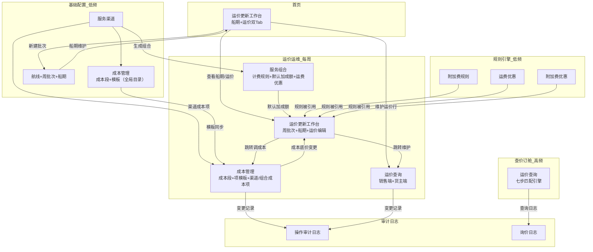
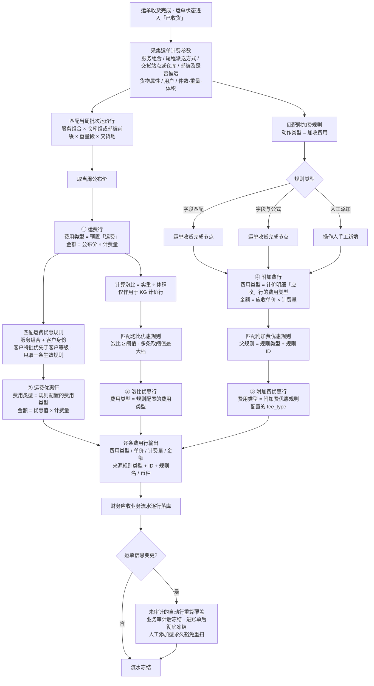

# 超级运价模块 — 产品需求文档 (PRD)

> **文档类型**：PRD | **版本**：V2.28 | **状态**：草稿 | **日期**：2026-09-23
> **作者**：AI PM + 飞点业务团队
> **评审人**：产品/研发/测试/业务代表
>
> 变更历史见 `变更记录.md`（业务变更）与 `LOG.md`（工作日志）。

### 0.1 关联链接

- RDD：`drafts/超级运价/2026-09-23-用户需求.md`
- Architecture：`drafts/超级运价/2026-09-23-数据设计.md`
- 需求背景：`analysis/超级运价需求调研/超级运价需求背景.md`
- 原型：`demo/员工端-demo/, demo/货主端-demo/`

---

## 1. 需求定义

### 1.1 背景与现状

飞点跨境物流作为亚马逊 FIST 承运商，当前外采新智慧 TMS 系统仅能承载业务数据记录，无法做成本计算、利润分析、运价管理。核心瓶颈是"成本→报价"链路全部依赖人工 Excel。

**现状**：
- 140 个服务组合 × 5 段成本 × 每段 3-5 个成本细项，海运费每周变动时逐一换算 KG/CBM 成本价，单组合约 10 分钟
- 公布价靠手工维护，船期和运价在 Excel 不同 Sheet 中维护
- 附加费靠人工判定——商品属性、地址类型、邮编、超重超长等数据源分散在不同系统
- 优惠折扣靠人算，成本底价不可追溯（Excel 覆盖即丢失），不同销售给同一客户报价可能不一致

### 1.2 目标与成功口径

**目标**：当船公司周一发来新海运费时，运价管理员 30 分钟内完成 140+ 组合成本更新和对客公布价刷新；销售 5 秒内给客户含所有优惠的最终报价。

**成功口径**：

| 指标 | 当前 | 目标 | 数据来源 | 评估窗口 |
|------|------|------|---------|---------|
| 单组合成本核算 | 10 分钟 | 1 分钟 | 系统日志 | 上线后第 2 周 |
| 全量运价更新 | 1 天 | 0.5 天 | 系统日志 | 上线后第 2 周 |
| 成本可追溯性 | 无 | 100% | 审计日志 | 持续 |
| 运价查询响应 | — | < 3 秒 | 接口耗时 | 持续 |

### 1.3 范围与边界

**In Scope（Phase 1 MVP，69 项功能；统计口径 = 功能清单表 P0 行逐行计数）**：
- 服务渠道管理 + 时效配置（预估/送仓/理赔）
- 航线 & 船期管理（周批次 + 船期维护）
- 成本管理（四层成本模型、成本自动计算、批量更新模板→渠道→组合、渠道同步到组合）
- 服务组合 + 计费规则 + 默认加成额（组合字段 `default_markup`）
- 运价表四维矩阵定价
- 附加费规则引擎（三类型：字段匹配 / 字段&公式 / 人工添加；两动作：加收费用 / 标识提醒）
- 运费优惠（一期纯固定减免） + 泡比优惠（一期：泡比/密度阈值阶梯 + 固定减免，与运费优惠叠加） + 附加费优惠（折扣率/固定减免，作用在「应收」单价上）；**三张优惠表一期均开放「客户等级 + 客户特批」两种对象类型**
- 运价查询（运营端 + 货主端）
- 操作审计日志 + 询价日志（二期）

**Out of Scope**：
- 分段服务（Phase 3）
- 运营端在线报价（Phase 2）
- 利润分析仪表盘（Phase 3）
- 销售提成计算（CRM 模块）
- 供应商账单对接（SRM 模块）

### 1.4 影响范围

- 影响角色：运价管理员、销售、运营主管、客户（货主）
- 影响模块：TMS 超级运价（新建模块）
- 依赖系统：基础资料（国家/邮编/港口/仓库）、SRM 供应商、商品管理、客户管理、等级管理

---

## 2. 枚举字典 ★ 研发必读

> 与 Architecture Schema 中 TinyInt 值严格一致。研发实现时以此表为准。
>
> Demo 原型中使用中文标签展示，生产环境 API 使用本表定义的小整数。两者语义一致，仅展示形式不同。

### 2.1 运输方式

| 值 | 常量名 | 中文 | 适用表 |
|----|--------|------|--------|
| 10 | 海运 | 海运 | 服务渠道表, 服务组合 |
| 20 | 空运 | 空运 | 服务渠道表, 服务组合 |
| 30 | 洲际火车 | 洲际火车 | 服务渠道表, 服务组合 |
| 40 | 洲际卡车 | 洲际卡车 | 服务渠道表, 服务组合 |

### 2.2 尾程派送方式

| 值 | 常量名 | 中文 |
|----|--------|------|
| 10 | 卡派 | 卡派 |
| 20 | 快递派 | 快递派 |

### 2.3 包税方式

| 值 | 常量名 | 中文 |
|----|--------|------|
| 10 | 包税 | 包税 |
| 20 | 不包税 | 不包税 |
| 30 | 自主税号 | 自主税号 |
| 40 | 自税递延 | 自税递延 |

### 2.4 计费方式

| 值 | 常量名 | 中文 |
|----|--------|------|
| 10 | 公斤 | 重量 KG |
| 20 | 立方米 | 体积 m³ |

### 2.5 服务类型

| 值 | 常量名 | 中文 |
|----|--------|------|
| 10 | 散货 | 散货 |
| 20 | 整柜 | 整柜 |

### 2.6 渠道类型

| 值 | 常量名 | 中文 | 备注 |
|----|--------|------|------|
| 10 | 全段服务 | 全段服务 | 一期默认 |
| 20 | 分段服务 | 分段服务 | 三期预留 |

### 2.7 实体状态

| 枚举名 | 值 | 常量名 | 中文 | 适用实体 |
|--------|----|--------|------|---------|
| 渠道状态 | 10 | 正常 | 正常 | 服务渠道表 |
| 渠道状态 | 20 | 已冻结 | 已冻结 | 服务渠道表 |
| 组合状态 | 10 | 正常 | 正常 | 服务组合 |
| 组合状态 | 20 | 已冻结 | 已冻结 | 服务组合 |
| 批次状态 | 10 | 预告 | 预告 | 周批次表 |
| 批次状态 | 20 | 当前 | 当前 | 周批次表 |
| 批次状态 | 30 | 已过期 | 已过期 | 周批次表 |
| 批次状态 | 40 | 已作废 | 已作废 | 周批次表 |
| 规则状态 | 10 | 正常 | 正常 | 附加费规则, 运费优惠规则, 泡比优惠规则, 附加费优惠规则 |
| 规则状态 | 20 | 已冻结 | 已冻结 | 附加费规则 |
| 规则状态 | 20 | 已失效 | 已失效 | 运费优惠规则, 泡比优惠规则, 附加费优惠规则 |
| 成本段状态 | 10 | 正常 | 正常 | 成本段 |
| 成本段状态 | 20 | 已冻结 | 已冻结 | 成本段 |

### 2.8 附加费规则枚举

| 枚举名 | 值 | 常量名 | 中文 |
|--------|----|--------|------|
| 规则类型 | 10 | 字段匹配 | 字段匹配 |
| 规则类型 | 20 | 公式阈值 | 公式阈值（保留枚举定义、当前不使用） |
| 规则类型 | 50 | 人工添加 | 人工添加 |
| 规则类型 | 40 | 字段&公式 | 字段&公式 |
| 动作类型 | 10 | 加收费用 | 加收费用 |
| 动作类型 | 20 | 标识提醒 | 标识提醒 |
| 动作类型 | 30 | 阻止下单 | 阻止下单（保留枚举定义、当前不使用） |
| 费用方向 | 10 | 应收 | 应收 |
| 费用方向 | 20 | 应付 | 应付 |
| 范围类型 | 10 | 全局 | 全局 |
| 范围类型 | 20 | 指定渠道 | 指定渠道 |
| 范围类型 | 30 | 指定组合 | 指定组合 |
| 计价单位 | 10 | 按票 | 按票 |
| 计价单位 | 20 | 按箱 | 按箱 |
| 计价单位 | 30 | 每公斤 | 按 KG |
| 计价单位 | 40 | 每立方米 | 按 m³ |
| 计价单位 | 50 | 按数量 | 按数量 |

> **附加费规则枚举口径**：
> - **规则类型三态**：`field`(10) 字段匹配 / `fieldFormula`(40) 字段&公式 / `manual`(50) 人工添加。**20:公式阈值 保留枚举定义、当前不使用**，能力并入 40:字段&公式。
> - **动作类型两态**：`10:加收费用` / `20:标识提醒`（`30:阻止下单` 保留枚举定义、当前不使用）；**规则类型=人工添加时仅「加收费用」可选**（人工添加型由操作员手动触发、只加收费用，无「命中后提醒」场景，「标识提醒」直接隐藏不展示）。
> - **优惠上限以数值约束表达**：不设 `可优惠级别`（`discountable_level`）字段——上限由「**`|优惠值| ≤ 计价明细应收行单价`**」（**绝对值比较**，否则负数永远通不过校验）承担（超出→优惠后单价为负 → 拦截）；「不可优惠」这类业务政策改为靠**不建优惠规则**实现，二期可选落到「基础资料-费用类型」加「是否可优惠」标记。

### 2.9 优惠规则枚举

| 枚举名 | 值 | 常量名 | 中文 | 备注 |
|--------|----|--------|------|------|
| 对象类型 | 10 | 客户特批 | 客户特批 | **一期开放**——属"额外单次优惠"场景；一期以**人工录入审批编号**（`approval_no`）作追溯凭据，**不对接飞书审批流**。三张优惠表通用；`target_type=10` 时 `target_customers` 与 `approval_no` 均必填 |
| 对象类型 | 20 | 客户等级 | 客户等级 | **一期可用**（10:客户特批同期开放）。`target_type=20` 时 `target_levels` 必填、`approval_no` 为空 |
| 优惠方式 | 10 | 折扣率 | 折扣率 | **一期仅「附加费优惠」可用**（运费优惠/泡比优惠二期开放，一期两者均为纯固定减免）。语义为**乘数**：0.01\~9.99，<1=折扣（0.9=九折）、=1=原价、>1=加价（1.5=加价 50%）；**一期仅附加费优惠使用，取值收紧为 0.01\~1.00（一期不支持加价）**，>1 加价二期开放。落库字段 `discount_rate` 小数(6,4) |
| 优惠方式 | 20 | 固定减免 | 固定减免 | **一期全部优惠均支持**。单位=元/计价单位（KG→元/KG，m³→元/m³），与「默认加成额」同口径；**负数=减钱（正向优惠）、正数=加价（反向优惠）**（计算为 `原金额 + 优惠值`；见本节下方「优惠值正负号铁律」）。落库字段 `discount_adjustment` 小数(10,2) |
| 优惠性质 | 10 | 固定优惠 | 固定优惠 | **一期唯一**：命中即生效，无需领取，有到期/被引用两种失效路径 |
| 优惠性质 | 20 | 浮动优惠 | 浮动优惠 | **二期·营销模块**：需领取，带配额/预算与核销状态机（优惠券、满减、限时活动） |
| 有效期类型 | 10 | 永久有效 | 永久有效 | **一期可用** |
| 有效期类型 | 20 | 固定期限 | 固定期限 | **一期可用** |
| 有效期类型 | 30 | 单次有效 | 单次有效 | **一期不开放（二期）**——同属"额外单次优惠"场景。枚举值保留定义 |
| 费用方向 | 10 | 应收 | 应收 | **一期固定值**：运费优惠/泡比优惠的费用方向前端置灰不可编辑 |
| 费用方向 | 20 | 应付 | 应付 | **一期不开放（二期）** |
| — | — | — | — | **业务规则**：**一期即可匹配客户等级与客户特批（`target_type` 10/20 双开），有效期仅有永久有效/固定期限，费用方向固定应收**；**客户特批优先级高于客户等级，高覆盖低不叠加，特批命中即覆盖等级规则（一期即生效）**；**唯一性：同一父实体 × 同一对象类型 × 同一目标最多一条生效规则**（客户特批比客户ID、客户等级比等级ID，两个命名空间互不冲突）；**★ 特批劣于等级时怎么办**：**仍按「特批覆盖等级」执行**——「特批」是**一客一议的特殊价，可能更优也可能更差**（业务上存在"因风险收紧、把该客户的等级优惠取消掉"的场景；若一律取优，特批就失去了"收紧"能力）；但**配置时须给出警示**：当特批值劣于该客户所属等级的优惠时，提示「该特批比 X 级更差 ¥Y，客户将按更差的执行，请确认是否故意」。**★ 泡比优惠另加「同一密度阈值」维度**——其唯一性键为 父实体 × **密度阈值** × 对象类型 × 目标，故同一目标在不同阈值档可各配一条（这正是「阶梯」的语义，不可一刀切为一条）；**泡比优惠一期启用，与运费优惠叠加**（多条泡比命中取阈值最大档，不叠加）。任一费用项最终金额不得为负（**`费用项金额 + Σ(带符号优惠值) ≥ 0`，等价 `\|Σ(负向优惠值)\| ≤ 该费用项金额`**；按代数和判定、强制截断，与红灯预警放行不同）。完整冲突矩阵见数据设计 §3.19 |
> **★ 优惠值正负号铁律**：**固定减免**（`discount_mode=20`）是**带符号调整量**——**负数 = 减钱（正向优惠）、正数 = 加价（反向优惠）**；系统按 **`结果金额 = 原金额 + 优惠值`** 计算。**折扣率**（`discount_mode=10`）**是乘数、不是金额增减**：`<1` = 折扣、`=1` = 原价、`>1` = 加价，计算为 `金额 × 率`；一期仅附加费优惠可用且收紧为 `0.01 ≤ 率 ≤ 1`（**一期不支持加价**）。**上限校验**：附加费优惠的固定减免上限为「**`|优惠值| ≤ 应收单价`**」（**绝对值比较**，否则负数永远通不过校验）。**显示口径**：优惠值为负 → `-¥X`（减钱）；为正 → `+¥X`（加价）；优惠后金额为 0（费用被全额抵扣）→ 显示「全免」。

### 2.10 其他枚举

| 枚举名 | 值 | 常量名 | 中文 | 说明 |
|--------|----|--------|------|------|
| 亚马逊服务等级 | 10 | 标准 | 标准 | 亚马逊服务等级 |
| 亚马逊服务等级 | 20 | 加急 | 加急 | |
| 亚马逊服务等级 | 30 | 快速 | 快速 | |
| 是否换汇 | 10 | 否 | 否（RMB直接计算） | 成本项模板，由币种自动派生 |
| 是否换汇 | 20 | 是 | 是（USD换汇计算） | |
| 币种 | — | — | 取值来源于基础资料-币种接口 | |
| 不可加利润 | — | false | 否 | 代收代缴项（税金）不可加利润 |
| 不可加利润 | — | true | 是 | 该成本项为代收代缴（如税金），不计入加成基数 |
| 派送报价来源 | 10 | 拆送价 | 拆送价 | 派送段 |
| 派送报价来源 | 20 | 组合一口价 | 组合一口价 | |
| 派送报价来源 | 30 | 整柜直送价 | 整柜直送价 | |
| 收费重方式 | 10 | 实重 | 实重 | 计费规则，计费方式=KG时可选 |
| 收费重方式 | 20 | 材重 | 材重 | 计费方式=KG时可选 |
| 收费重方式 | 30 | 实重材重取大 | 实重材重取大 | 计费方式=KG时可选 |
| 收费重方式 | 40 | 重量方数 | 重量方数 | 计费方式=m³时可选 |
| 收费重方式 | 50 | 体积 | 体积 | 计费方式=m³时可选 |
| 收费重方式 | 60 | 重量方数体积取大 | 重量方数体积取大 | 计费方式=m³时可选 |
| 计重方式 | 10 | 按票 | 按票 | 计费规则，默认值 |
| 计重方式 | 20 | 按箱 | 按箱 | |

### 2.11 渠道专线（专线 = 运输方式 + 尾程派送）

> 运价查询的结果分组维度。专线为派生枚举，不单独建表，由运输方式 × 尾程派送方式组合而成。

| 值 | 常量名 | 中文 | 运输方式 | 尾程派送 |
|----|--------|------|---------|---------|
| 10 | 海卡 | 海卡 | 海运 | 卡派 |
| 20 | 海派 | 海派 | 海运 | 快递派 |
| 30 | 空卡 | 空卡 | 空运 | 卡派 |
| 40 | 空派 | 空派 | 空运 | 快递派 |

### 2.12 货物属性

> 运价查询「货物属性」筛选枚举，命中附加费规则。**来源：商品管理-货物属性（技术配置文件，前台可配）**。本模块不硬编码枚举值，取值以商品管理实际配置为准。

### 2.13 客户等级

> 来源：客商中心-等级管理。运价查询优惠匹配时客户特批优先级高于客户等级（**一期即生效**：特批命中即覆盖等级规则，高覆盖低、不叠加）。

| 值 | 常量名 | 中文 |
|----|--------|------|
| 10 | SS | SS |
| 20 | S | S |
| 30 | A | A |
| 40 | B | B |
| 50 | C | C |
| 60 | D | D |
| 70 | E | E |
| 80 | F | F |
| 90 | G | G |

---

## 3. 状态机 ★ 研发必读

### 3.1 服务渠道 `服务渠道表.status`

```
正常(正常=10) ──{冻结}──→ 已冻结(已冻结=20)
已冻结(已冻结=20) ──{解冻}──→ 正常(正常=10)
```

| 当前状态 | 操作 | 目标状态 | 触发角色 | 校验条件 |
|---------|------|---------|---------|---------|
| 正常 | 冻结 | 已冻结 | 运价管理员 | — |
| 已冻结 | 解冻 | 正常 | 运价管理员 | — |

> 冻结后级联影响：该渠道下所有服务组合同步变更为已冻结。启用时弹窗确认是否一并启用关联组合，可选"启用渠道及关联组合"或"仅启用渠道"。

### 3.2 周船期批次 `周批次表.status`

```
预告(预告=10) ──{系统定时}──→ 当前(当前=20) ──{周日24:00}──→ 已过期(已过期=30)
    │                    │                              (终态)
    └──{作废}──→ 已作废(40) └──{作废}──→ 已作废(40) (终态)
```

| 当前状态 | 操作 | 目标状态 | 触发角色 | 校验条件 |
|---------|------|---------|---------|---------|
| 预告 | 系统定时 | 当前 | 系统 | 每周日 24:00 自动流转；同一时刻仅一条 当前 |
| 当前 | 定时到期 | 已过期 | 系统 | 每周日 24:00 自动流转 |
| 预告 | 作废 | 已作废 | 运价管理员 | 数据保留，不可恢复 |
| 当前 | 作废 | 已作废 | 运价管理员 | 数据保留，不可恢复 |

> 约束：同时仅一条 当前（应用层乐观锁 + DB 部分唯一索引 `UNIQUE(status) WHERE status=20`）。不再支持手动发布到当前，系统按日期自动流转。

### 3.3 运费优惠规则 `运费优惠规则.status`

```
正常(正常=10) ──{到期/单次引用}──→ 已失效(已失效=20) (终态)
```

| 当前状态 | 操作 | 目标状态 | 触发角色 | 校验条件 |
|---------|------|---------|---------|---------|
| 正常 | 固定期限到期 | 已失效 | 系统定时任务 | valid_to ≤ 当前日期 |
| 正常 | 单次有效被运单引用 | 已失效 | 系统 | 有非取消的运单关联此优惠规则后自动失效（**★ 二期**——一期 `validity_type=30` 未开放，本路径一期不发生） |

> 到期前 7 天系统推送提醒给运价管理员。已失效后运价查询不再展示，但历史运单仍可追溯原优惠。

### 3.4 附加费规则 `附加费规则.status`

```
正常(正常=10) ──{冻结}──→ 已冻结(已冻结=20)
已冻结(已冻结=20) ──{解冻}──→ 正常(正常=10)
```

> 已被运单引用的规则不可删除，只能冻结。

### 3.5 服务组合 `服务组合.status`

```
正常(正常=10) ──{冻结}──→ 已冻结(已冻结=20)
已冻结(已冻结=20) ──{解冻}──→ 正常(正常=10)
```

> 冻结后不在运价查询中出现，不计入公布价批量更新范围。

---

## 4. 功能清单与页面映射

| 模块 | 功能点 | 优先级 | 对应页面 | 页面类型 |
|------|--------|--------|---------|---------|
| 服务渠道 | 渠道创建/编辑/冻结解冻+时效配置+重量段+渠道成本项 | P0 | 服务渠道列表 / 服务渠道编辑 | 列表页+编辑页 |
| 航线管理 | 航线创建/编辑/N:N关联渠道 | P0 | 航线列表 | 列表页+编辑弹窗 |
| 周船期批次 | 按周创建/复制/状态流转 | P0 | 周船期批次列表 | 列表页 |
| 船期维护 | 在周批次下录入/编辑/Excel批量导入 | P0 | 船期维护 | 编辑页 |
| 成本段 | 全局目录CRUD+冻结/解冻 | P0 | 成本段管理 | 列表页+编辑弹窗 |
| 成本项模板 | 全局目录CRUD+冻结/解冻。拖车费/仓点成本/快递派单价为预置项：不可冻结、不可删除、批量更新隐藏；编辑时仅名称可修改，其余字段不可编辑 | P0 | 成本项模板管理 | 列表页+编辑弹窗 |
| 服务组合 | 笛卡尔积生成/编辑/冻结解冻；编辑弹窗内维护默认加成额；运费优惠 + 泡比优惠由列表操作列「优惠」按钮打开的独立优惠弹窗维护；优惠为独立子资源接口，保存与父实体不是同一次请求 | P0 | 服务组合列表 / 组合编辑 | 列表页+编辑弹窗 |
| 计费规则 | 统一表格：通用+客户等级/特批覆盖（按对象类型区分） | P0 | 组合编辑页内嵌 | 内嵌表格 |
| 默认加成额 | 服务组合字段 `default_markup`，固定金额（元/计价单位）。新建运价行起步种子，工作台逐重量段覆盖 | P0 | 组合编辑页内嵌 | service_combination.default_markup |
| 运价表维护 | 交货地组 ×仓库组/邮编前缀矩阵定价(KG/CBM双计价) | P0 | 运价表维护 | 编辑页 |
| 附加费规则 | 三类型(字段匹配/字段&公式/人工添加)+两动作(加收费用/标识提醒)CRUD；附加费优惠由列表操作列「优惠」按钮打开的独立优惠弹窗维护 | P0 | 费用与标识规则列表 / 费用与标识规则编辑 | 列表页+编辑弹窗 |
| 运费优惠 | 客户等级/客户特批CRUD（一期双开；由服务组合主列表操作列「优惠」按钮打开的独立优惠弹窗维护） | P0 | 组合优惠配置弹窗 | 弹窗（列表操作列入口） |
| 泡比优惠 | 泡比/密度阈值阶梯 + 固定减免，客户等级/客户特批（由服务组合主列表操作列「优惠」按钮打开的独立优惠弹窗维护）；**一期启用**（模块 M，P0） | P0 | 组合优惠配置弹窗 | 弹窗（列表操作列入口） |
| 附加费优惠 | 绑定附加费规则CRUD：客户等级/客户特批（一期双开；由费用与标识规则列表操作列「优惠」按钮打开的独立优惠弹窗维护） | P0 | 附加费优惠配置弹窗 | 弹窗（列表操作列入口） |
| 运价查询(运营端) | 反向匹配引擎+成本底价+盈亏标识 | P0 | 运营端运价查询 | 查询页 |
| 货主端在线询价 | 反向匹配(隐藏成本底价和盈亏) | P0 | 货主端在线询价 | 查询页 |
| 公开运费计算器 | 免登录查基础公布价；登录匹配客户专属优惠 | P0 | 公开运费计算器（独立分享页） | 查询页 |
| 运价更新工作台 | 船期+运价同屏 | P0 | 运价更新工作台-首页 | 工作台 |
| 操作审计日志（二期） | 变更留痕+不可删除 | P2 | 操作审计日志 | 列表页 |
| 询价日志（二期） | 查询记录(二期) | P2 | 询价日志 | 列表页 |

**依赖与前置**：
- 基础资料模块：国家、港口、邮编库、仓库列表需已上线
- SRM 供应商管理：干线运输供应商需已维护
- 商品管理：SKU 属性标签需已启用
- 客户管理、等级管理：需已上线

---

### 4.1 页面导航关系图

> 14 个原型页面之间的跳转关系、数据流向、角色入口。



> **角色入口**：运价管理员 → 首页工作台 / 运价运维四页；销售 → 运价查询；管理员 → 基础配置 + 规则引擎。

---

## 5. 页面规格 ★ 研发必读

### 5.1 运价更新工作台（首页）

**页面信息**：
- 路径：首页 → 运价更新工作台
- 类型：工作台
- 访问角色：运价管理员

**页面结构**：双 Tab 页——「本周船期」+「本周运价行」。默认展示当前 当前 批次数据。

**批次栏**：绿色渐变条显示批次名称（可点击链接，弹出基本信息卡片：批次名称/周次/状态/日期范围 + 汇率快照表格 + 折算基准数组表格 + 船期条数/运价分组数/运价行总数统计）、批次下拉选择器、新建周批次按钮、作废按钮。

**本周船期 Tab**：

| 列名 | 数据来源 | 格式 |
|------|---------|------|
| 航线 | route.route_code + origin_port_name → dest_port_name (supplier) | 如"CLX 上海→长滩(MATSON)" |
| 截单时间（按交货地） | sailing_schedule.cutoff_times | JSON 渲染为多行 |
| ETD | sailing_schedule.etd | 日期 |
| ETA | sailing_schedule.eta | 日期 |
| 航程 | sailing_schedule.voyage_days | X天 |
| 最快提取 | sailing_schedule.fastest_pickup | 日期 |

**交互**：船期 Tab 为只读展示，供运价管理员对照船期调运价。点击「编辑船期 →」跳转至「航线 & 船期」页面进行船期的录入/编辑/批量导入。船期和运价共享同一周批次。

**本周运价 Tab**（两级折叠视图）：
主表行 = 服务组合 × 交货地组，列 = 服务组合 | 交货地 | 操作（编辑按钮）。展开后按派送方式分化：卡派子表 = 仓库组 × 重量段（含成本底价列，同一仓库组下各重量段成本相同），快递派子表 = 邮编前缀 × 重量段（无独立成本底价列，成本因重量段而异故嵌入每格）。成本底价引用自成本管理（只读）。公布价 = 成本底价 + 加成额 + 拖车费交货地组加价/KG，运价管理员点击主表行「编辑」按钮弹出矩阵编辑弹窗，可调整该交货地组下各仓库组/邮编前缀的每重量段加成额或公布价，两者双向联动。定价维度由服务组合的尾程派送方式自动确定（卡派→仓库组，快递派→邮编前缀）。加成额起步值取自服务组合 `default_markup`。

**关联接口**：
- 查询：`GET /api/weekly-batch/当前` 返回批次+船期+运价行
- 复制：`POST /api/weekly-batch/copy-from-last`
- 创建批次：`POST /api/weekly-batch`

---

### 5.2 服务渠道列表 / 编辑

**列表页字段**：

| 列名 | 数据来源 | 格式 |
|------|---------|------|
| 服务渠道 | 服务渠道表.name | 原样 |
| 运输方式 | 服务渠道表.transport_mode | 枚举渲染 |
| 包税方式 | 服务渠道表.tax_methods | 枚举渲染（多选，如「包税 / 不包税」） |
| 服务类型 | 服务渠道表.service_types | 枚举渲染（如「散货 / 整柜」） |
| 计费方式 | 服务渠道表.billing_units | JSON 数组渲染 |
| 尾程派送方式 | 服务渠道表.last_mile_methods | 枚举渲染（多选，如「卡派 / 快递派」） |
| 关联航线 | route_channel 关联（反向查询） | 航线代码标签列表；无关联航线时为红色"未关联"标识 |
| 状态 | 服务渠道表.status | 正常/已冻结，带状态标签 |
| 操作 | — | 编辑 / 冻结·启用 |

> **「目的国」不在列表展示**（`dest_countries` 仍在编辑弹窗维护，用于航线过滤与时效配置）

**编辑页**：多 Tab 结构——
- Tab「基本信息」：渠道字段表 + **「关联航线」多选**（仅展示航线代码，必填≥1）+ 预估运输时效（见下方字段表）
- Tab「送仓预估时效」：1:N 子表（delivery_method, warehouse_or_zip, sail_to_warehouse_days, cabinet_to_warehouse_days）。派送方式与渠道尾程派送方式级联；卡派→仓库下拉，快递派→邮编文本输入
- Tab「理赔承诺时效」：1:N 子表（delivery_method, fba_warehouse_codes, claim_working_days）。卡派按仓点配置，快递派渠道级一行（不区分仓点）
- Tab「重量段」：单段选择器，按运输方式+计费方式从模板中筛选尚未绑定的独立重量段，选中后自动绑定至渠道。绑定段参数由模板定义、不可编辑，可删除（操作列为删除按钮，二次确认后级联删除服务渠道及关联组合中快递派单价引用该重量段的费率行）。
- Tab「成本项」：渠道成本项配置（继承全局模板，可覆盖单价/冻结）

**基本信息字段表**：

| 字段名 | 中文名 | 类型 | 必填 | 默认值 | 校验规则 | 数据来源 |
|--------|--------|------|------|--------|---------|---------|
| name | 渠道名称 | 字符串(50) | ✅ | — | 长度 1-50 | 手动输入 |
| origin_country | 起运国 | 字符串(10) | ✅ | — | — | 基础资料-国家（单选） |
| dest_countries | 目的国 | 数组 | ✅ | — | 至少选 1 个 | 基础资料-国家（多选） |
| transport_mode | 运输方式 | 小整数 | ✅ | — | — | 枚举：10/20/30/40 |
| route_codes | 关联航线 | N:N（`route_channel`） | ✅ | — | **保存时强校验 ≥1 条**（渠道必须绑航线） | 关联表；过滤：港口类型（海港航线↔海运渠道、非海港↔非海运）+ 国家（出发港国=起运国、目的港国∈目的国）；下拉与回显仅展示航线代码；运输方式/国家变更时自动裁剪不可用选项 |
| last_mile_methods | 尾程派送方式 | 数组 | ✅ | — | 至少选 1 个 | 多选：10/20 |
| tax_methods | 包税方式 | 数组 | ✅ | — | 至少选 1 个 | 多选：10/20/30/40 |
| billing_units | 计费方式 | 数组 | ✅ | — | 至少选 1 个 | 多选：10/20 |
| service_types | 服务类型 | 数组 | ✅ | — | 至少选 1 个 | 多选：10/20 |
| need_claim | 是否需要时效理赔 | 布尔 | ✅ | false | — | 开关 |
| fba_sync | FBA运单同步 | 布尔 | ✅ | false | — | 开关 |
| channel_type | 渠道类型 | 小整数 | ✅ | 10 | 一期固定=10 | 枚举 |
| container_spec | 集装箱规格参考 | 文本 | 否 | 默认空 | 一期固定为通用 | — |
| status | 状态 | 小整数 | ✅ | 10 | — | 枚举 |

**交互行为**：
- [保存]：仅保存渠道，不生成组合。**校验关联航线 ≥1 条**，否则阻止并提示"请至少关联一条航线（渠道必须绑定航线才能提供船期）"
- [保存并生成服务组合]：保存渠道 + 笛卡尔积生成组合 + 逐一复制渠道成本项。派送段按组合尾程派送方式过滤：卡派组合仅复制仓点成本，快递派组合仅复制快递派单价。**同样校验关联航线 ≥1 条**
- [冻结]：二次确认弹窗 → 渠道及关联组合同步变更为已冻结
- [启用]：弹窗提示"是否需要一并启用关联服务组合？"→ 两个按钮："启用渠道及关联组合" / "仅启用渠道"
- 目的国减少校验：如已有该国 FBA 仓库时效配置，阻止并提示"需先清理该国仓库的时效配置后，方可移除此目的国"
- 关联航线过滤变更：运输方式切换（海运↔非海运）或国家变更时，系统自动裁剪已选航线列表（移除不再符合条件的项），避免静默保存失效绑定

**关联接口**：
- 查询列表：`GET /api/service-channels`
- 创建：`POST /api/service-channel`（body 含子表）
- 编辑：`PUT /api/service-channel/{id}`
- 生成组合：`POST /api/service-channel/{id}/generate-combinations`
- 冻结/解冻：`PUT /api/service-channel/{id}/status`

---

### 5.3 航线列表

**列表页字段**：

| 列名 | 数据来源 | 格式 |
|------|---------|------|
| 航线代码 | route.route_code | 如"AAC/AAC2" |
| 出发港 | route.origin_port_name(origin_port_code) | "上海港(shg)" |
| 目的港 | route.dest_port_name(dest_port_code) | "长滩港(uslax)" |
| 供应商 | route.supplier_id | 引用 SRM 渲染名称 |
| 预计运输天数 | route.estimated_transit_days | 天 |
| 关联渠道 | route_channel 关联 | 渠道名称标签列表（**渠道侧编辑入口已开放，渠道与航线侧均可编辑**） |

**新增/编辑弹窗字段表**：

| 字段名 | 中文名 | 类型 | 必填 | 校验规则 | 数据来源 |
|--------|--------|------|------|---------|---------|
| route_code | 航线代码 | 字符串(20) | ✅ | — | 手动输入，默认空可编辑 |
| origin_port_code | 出发港代码 | 字符串(10) | ✅ | 与目的港不可相同 | 港口主数据（选择名称后自动带出） |
| origin_port_name | 出发港名称 | 字符串(50) | ✅ | — | 港口主数据下拉 |
| dest_port_code | 目的港代码 | 字符串(10) | ✅ | — | 港口主数据（选择名称后自动带出） |
| dest_port_name | 目的港名称 | 字符串(50) | ✅ | — | 港口主数据下拉 |
| supplier_id | 供应商 | 字符串(20) | ✅（原"船司"，位置置于目的港之后） | — | SRM（筛选 大类=干线运输供应商 & 明细按港口类型条件过滤：海港→含"海运"，非海港→含"非海运"；航线的港口类型由出发港决定） |
| estimated_transit_days | 预计运输天数 | 整数 | — | ≥ 0 | 手动输入 |
| channel_ids | 关联渠道 | 数组 | — | 双向对称过滤：① 港口类型（海港航线↔海运渠道、非海港↔非海运渠道）② 国家（出发港.国家=渠道.起运国 AND 目的港.国家∈渠道.目的国） | 服务渠道多选；保存后写入 `route_channel`（与渠道侧共享同一张关联表） |
| status | 状态 | 小整数 | ✅ | 10 | 10:正常 20:已冻结 |
| route_ref_id | **关联渠道编辑入口** | `route_channel` | — | 渠道侧与航线侧**双向可编辑**同一张关联表；渠道侧强校验≥1；航线侧出发港变更时自动裁剪不再符合港口类型+国家的渠道 | — |

**关联接口**：
- 查询：`GET /api/routes`
- 创建：`POST /api/route`
- 编辑：`PUT /api/route/{id}`

---

### 5.4 船期维护

**页面信息**：在周批次详情页内，按航线分别录入本周船期。

**字段表**：

| 字段名 | 中文名 | 类型 | 必填 | 校验规则 | 说明 |
|--------|--------|------|------|---------|------|
| route_id | 航线 | 长整数 | ✅ | — | 下拉选航线 |
| cutoff_times | 截单时间 | 数组 | ✅ | 至少 1 个仓库；截单日期 < ETD | {"仓库名称":"日期"} |
| etd | 预计开船时间(ETD) | 日期 | ✅ | — | 日期选择器；变更时自动重算 ETA |
| eta | 预计到港时间(ETA) | 日期 | ✅ | — | 只读，ETD + 航程自动计算 |
| voyage_days | 航程 | 整数 | ✅ | — | 新增时从航线.预计运输天数快照取值，只读 |
| fastest_pickup | 最快提取/送仓 | 日期 | — | ≥ ETA | 日期选择器 |

**交互**：[批量导入] 按钮 → 下载 Excel 模板 → 上传 → 按 batch_id 批量写入 sailing_schedule 表。

**关联接口**：
- 查询周批次下船期：`GET /api/weekly-batch/{batch_id}/schedules`
- 保存：`POST /api/sailing-schedule` / `PUT /api/sailing-schedule/{id}`
- 批量导入：`POST /api/sailing-schedule/import`

---

### 5.5 成本段 / 成本项模板管理

**成本段列表**：

| 字段名 | 中文名 | 类型 | 必填 |
|--------|--------|------|------|
| name | 段名称 | 字符串(20) | ✅ |
| status | 状态 | 小整数 | ✅ |

**成本项模板列表**：

| 字段名 | 中文名 | 类型 | 必填 | 校验规则 |
|--------|--------|------|------|---------|
| segment_id | 所属成本段 | 长整数 | ✅ | — |
| name | 项名称 | 字符串(30) | ✅ | 同段下不可重名 UNIQUE(segment_id, name) |
| formula_type | 是否换汇（派生字段） | 小整数 | 自动 | 10:否(RMB直接计算) 20:是(USD换汇计算)；**由币种自动派生，列表与编辑弹窗均不展示** |
| default_price | 建议默认价 | 小数(10,2) | ✅ | ≥ 0 |
| 币种 | 币种 | 小整数 | ✅ | 10:RMB 20:USD |
| sort_order | 排序 | 整数 | ✅ | — |
| is_preset | 是否预置项 | 布尔 | 是 | Default:false；拖车费(揽收段)+仓点成本(派送段)+快递派单价(派送段)为预置项：不可禁用、不可删除、批量更新隐藏、编辑时仅成本项名称可修改 |
| status | 状态 | 小整数 | ✅ | Default:10；冻结不物理删除 |

> **成本项模板列表展示列**：成本项 / 建议默认价 / **启用默认价**（显示「已启用 / 未启用」）/ 状态 / 操作 —— 成本项按所属成本段分组展示（左侧成本段列表 + 右侧该段成本项表格）；「是否换汇」为派生字段、不在列表与编辑弹窗展示。
> **新增 / 编辑成本项弹窗字段**：成本项名称 / 建议默认价 / 币种（三个字段；换汇标记由币种自动派生，无独立输入项）。

**渠道成本项字段表**（服务渠道 Tab「成本项」内，继承全局模板可覆盖）：

| 字段名 | 中文名 | 类型 | 必填 | 默认值 | 校验规则 |
|--------|--------|------|------|--------|---------|
| template_id | 引用模板 | 长整数 | ✅ | — | FK → cost_item_template |
| 单价 | 单价 | 小数(10,2) | ✅ | 继承模板默认价 | ≥ 0，可覆盖 |
| 币种 | 币种 | 小整数 | ✅ | 继承模板 | 10:RMB 20:USD |
| status | 状态 | 小整数 | ✅ | 继承模板 | 10:正常 20:已冻结 |
| delivery_quote_source | 派送报价来源 | 小整数 | 条件 | — | 10:拆送价 20:组合一口价 30:整柜直送价；仅派送段适用 |

**关联接口**：
- 成本段 CRUD：`GET/POST/PUT /api/cost-segments`
- 模板 CRUD：`GET/POST/PUT /api/cost-item-templates`
- 冻结：`PUT /api/cost-item-template/{id}/freeze`
- 删除校验：被渠道引用时禁止删除，提示"已被 X 个渠道引用"

---

### 5.6 服务组合列表 / 编辑

**列表页字段**：

| 列名 | 数据来源 | 格式 |
|------|---------|------|
| 组合名称 | service_combination.combination_code | 自动拼接 |
| 服务渠道 | 服务组合.channel_id → name | 渲染渠道名称 |
| 运输方式 | transport_mode | 枚举渲染 |
| 尾程派送 | last_mile_method | 枚举渲染 |
| 计费方式 | billing_unit | 枚举渲染 |
| 包税方式 | tax_method | 枚举渲染 |
| 服务类型 | service_type | 枚举渲染 |
| 状态 | status | 正常/已冻结 |

**编辑弹窗**：包含**两个**折叠区域 ——
- 「基本信息」：组合基础字段（名称/渠道/运输方式/尾程派送/计费方式/包税方式/服务类型/状态）
- 「计费规则」：统一表格，首行为通用规则（不可删除）+ 可追加特殊规则行（按客户匹配覆盖）；见 5.7

**优惠配置（独立优惠弹窗）**：优惠规则不设置在新增/编辑弹窗内，由主列表操作列的「优惠」按钮打开独立「优惠配置」弹窗维护（操作列顺序：编辑 / 优惠 / 成本项 / 冻结·启用）。**新增组合须先保存、列表中有了该行，才能在列表里配优惠**——
- 弹窗标题：`{服务组合代码} - 优惠配置`，宽 1280px
- 顶部信息条：服务组合 / 服务渠道 / 计费方式 / 状态
- **两个 Tab**：「运费优惠(N)」「泡比优惠(N)」，角标为该类生效中条数
- **运费优惠 Tab**：`+ 添加规则` + 可编辑表格 + 空态 + 多行提示；列 = 对象类型 / 目标 / 优惠方式 / 优惠值 / 有效期 / 有效期起止（条件列，仅当存在「固定期限」行时出现）/ 审批编号（条件列，仅当存在客户特批行时出现）/ 状态 / 费用方向 / 费用类型 / 删除
- **泡比优惠 Tab**：列同运费优惠，另在「目标」之后增加**密度阈值**列；当该组合计费方式 ≠ KG 时，Tab 顶部提示「该组合按 m³ 计费，泡比优惠只作用于按 KG 计价的运价行，配置后对该组合不生效」
- **已失效的优惠行也会载入**，灰化只读（不可编辑、无删除按钮），且**不占用唯一性名额**
- 组合状态 ≠「正常」（已冻结）时：顶部提示「该服务组合已冻结，优惠规则仅可查看，不可编辑」，底部只剩「关闭」
- 底部：取消 / 保存优惠

**批量添加优惠（工具栏入口）**：工具栏「新增服务组合」旁新增「批量添加优惠」按钮，打开独立弹窗，用于**一条优惠规则批量挂到多个服务组合**（对应数据模型 `scope_combo_ids` 多组合数组）——
- 弹窗标题：`批量添加优惠`，宽 1180px
- **作用范围（服务组合）**：多选服务组合（必填，至少 1 个），选项 = 全部服务组合，支持全选 / 反全选
- **两个 Tab**：「运费优惠」「泡比优惠」，各自 `+ 添加规则` + 可编辑表格 + 空态；列与单个组合优惠弹窗一致（运费：对象类型 / 目标 / 优惠方式 / 优惠值 / 有效期 / 有效期起止 / 审批编号 / 费用类型 / 删除；泡比另在「目标」后加「密度阈值」）
- **保存**：校验作用范围非空 + 规则字段完整（复用单个组合优惠弹窗校验口径）→ 每条规则按目标展开、`scope_combo_ids` = 选中的全部组合，批量写入（一条优惠挂多个组合）
- 底部：取消 / 保存

**关联接口**：
- 查询组合：`GET /api/service-combinations?channel_id={id}`
- 编辑：`PUT /api/service-combinations/{id}`（body 只含组合业务字段 + 计费规则子表；**不含优惠子表**——优惠为独立子资源，见 §5.11）
- 冻结/解冻：`PUT /api/service-combination/{id}/status`

---

### 5.7 计费规则（组合编辑弹窗内嵌，统一表格）

挂在服务组合上，首行为通用规则（不可删除），可追加特殊规则行按客户匹配覆盖。**1:N**。

| 字段名 | 中文名 | 类型 | 必填 | 默认值 | 校验规则 |
|--------|--------|------|------|--------|---------|
| rule_type | 对象类型 | 小整数 | ✅ | 10(通用) / 20(特殊规则) | 首行固定=10 |
| target_customers | 目标 | 数组 | 条件 | — | rule_type=20 时必填；多选客户；同一客户不可在多条规则中出现 |
| volume_factor | 计泡系数 | 整数 | ✅ | KG=6000 / m³=363 | > 0 |
| weight_method | 收费重方式 | 小整数 | ✅ | KG=30(实重材重取大) / m³=40(重量方数) | 由计费方式级联：KG→10/20/30，m³→40/50/60 |
| weighing_method | 计重方式 | 小整数 | ✅ | 10(按票) | 10:按票 20:按箱 |
| weight_precision | 收费重精度 | 枚举 | — | KG=1 / m³=0.1 | 下拉：1/0.1/0.01 |
| min_box_weight | 最低箱收费重 | 小数(6,2) | — | — | ≥ 0 |
| min_shipment_weight | 最低票收费重 | 小数(6,2) | — | — | ≥ 0 |
| min_pieces | 最小承运件数 | 整数 | — | — | ≥ 0，空=不限制 |
| max_pieces | 最大承运件数 | 整数 | — | — | ≥ min_pieces，空=不限制 |

> **优先级**：特殊规则 > 通用规则。同一客户命中多条特殊规则时取第一条。

---

### 5.8 默认加成额（服务组合字段）

利润为服务组合上的字段 `default_markup`（固定金额，元/计价单位），不再有独立的全局利润策略实体，也不是成本项内联字段。成本和利润分离——成本管理只管成本，利润在组合上以固定加成额表达。

| 字段名 | 中文名 | 类型 | 必填 | 校验规则 |
|--------|--------|------|------|---------|
| default_markup | 默认加成额 | 小数(10,2) | | 元/计价单位。组合 billing_unit=KG→元/KG，m³→元/m³；默认 0 |

**数据流**：服务组合维护 `default_markup`（单位随计价方式）→ 新建运价行时取组合加成额作起步值 → 运价编辑：公布价 = 成本底价 + 加成额 + 拖车费交货地组加价/KG，运价管理员逐行覆盖（所有重量段初始值相同）。

> **设计决策**：把命名利润策略池降级为组合字段。1) 利润只是起步种子，运价员每周手工推翻，池的复用价值极低；2) 加成额单位随组合计价方式，存组合上单位天然确定；3) 与一期固定减免优惠口径统一，盈亏色标可精确做"加成额 − 最大优惠额"（**「最大优惠额」取绝对值口径**，即 `Σ|负向优惠值|`）。

---

### 5.9 运价维护（工作台运价 Tab）

**页面信息**：运价更新工作台内嵌，本周运价 Tab。两级折叠视图：主表行 = 服务组合 × 交货地组，列 = 服务组合 | 交货地 | 操作（编辑按钮）。展开子表按派送方式分化——卡派：仓库组 | 成本底价 | 最大优惠 | 各重量段（利润额+公布价+成本）；快递派：邮编前缀 | 最大优惠 | 各重量段（成本+利润额+公布价，成本嵌入每格无独立列）。盈亏色标（同单位相减，精确，只判运费侧）：加成额≥最大优惠额→绿、0<加成额<最大优惠额→红（给满优惠会亏）、加成额≤0→灰。**最大优惠 = 该组合最大运费优惠额 + 最大泡比优惠额**（一期；两者都挂组合、都作用运费、叠加，取最坏情况；元/计价单位。**「最大优惠额」取绝对值口径**，即 `Σ|负向优惠值|`，优惠值带符号、负数 = 减钱）。附加费不进工作台灯。

**新建运价行**：选择服务组合，定价维度自动确定（卡派→仓库组多选，快递派→邮编前缀输入）。仓库组从组合关联仓库中多选，交货地组多选。创建时自动校验唯一性（组合+仓库组+交货地组不可重复）。装柜费为统一价（¥1,200/票），归入 headItems 主表展示；拖车费为唯一受交货地影响的揽收段成本项，按预定义的交货地组合分别定价；同一交货地组下拖车费单价相同的合并为一行、不同则拆行。

**编辑弹窗**：上半部展示成本底价参照（头程合计 + 派送MAX，只读）。下方「展开成本明细 ▼」默认展开，可查看完整演算过程（头程按段逐项 + 派送段报价来源比较/快递派查表），按组合计费方式仅展示 KG 或 m³ 单列。下半部逐重量段表格：成本底价 | 加成额（可编辑） | 公布价（可编辑）。调整加成额 → 公布价自动重算（成本+加成额+拖车费交货地组加价）；直接修改公布价 → 加成额自动反算（公布价-成本-拖车费交货地组加价），双向联动。

**成本明细展开面板**：
- 默认展开，点击可收起。按服务组合的计费方式仅展示 KG 或 m³ 单列
- 头程明细表：成本段 / 成本项 / 原始单价 / 计价单位 / 每KG（或每m³），底部合计头程汇总
- 卡派：派送段按仓点逐行展示三种报价来源（拆送价/组合一口价/整柜直送价），取 MAX 标记绿色高亮
- 快递派：派送段按重量段 × 邮编前缀查表，直接累加不比较
- 底部绿色公式条：成本底价 = 头程 + 派送普通项 + 派送MAX/快递合计

**新建周批次**：从全局 `loading_standard` 表拉取全部启用行快照为数组（每行含运输方式/基准类型/尾程方式/KG基准/CBM基准），弹窗「折算基准快照」Tab 以可编辑表格展示（KG/CBM基准可直接修改，快递派行锁定为1不可编辑），支持运价管理员针对本周覆盖全局默认值。+ 汇率。可选「从上周复制」——骨架重生+决策继承：用本周启用航线/组合笛卡尔积铺底→匹配旧批次→命中则继承加成额/公布价（成本底价用本周 costRefMap 重算），未命中用组合默认加成额初始化并标记「新增」，已停用的航线/组合/成本项自动移除。复制后全部标记待重算。加成额取组合默认加成额起步值，不随批次快照。系统定时生效后锁定不可编辑。

**待重算**：成本单价变更 → 自动标记当前批次运价行为待重算 → 工作台提醒条 → [重算成本底价] 或 [已知晓不调整]。点击任一按钮弹出弹窗，列出带 ⚠ 的服务组合（服务组合 × 交货地），可勾选多选；确定后仅对选中的服务组合执行「重算」或「已知晓」，未选中的保持待重算。

---


### 5.10 费用与标识规则列表 / 编辑

**页面信息**：菜单位置「费用与标识规则」（唯一入口，规则配置统一在本页）

**列表页字段**：规则名称、类型(字段匹配/字段&公式/人工添加)、动作(加收费用/标识提醒)、**触发条件/公式**、计价（取计价明细行）、**费用类型**（取计价明细行）、**费用方向**（一期恒「应收」）、状态、操作。**「生效范围」不在列表展示**（`scope_type` 一期固定「全局」，字段保留、页面不展示）

**编辑页**：按 rule_type 渲染不同表单区块——
- 通用区（所有类型共享字段，见下表）
- 条件配置区（按 rule_type 动态渲染：**字段匹配 → 维度条件列表（AND，≥1 条必填）** / **字段&公式 → 维度条件（仅「服务组合」多选，最多 1 条，可为空）＋ 公式条件列表（OR，≥1 条必填）** / 人工添加 → 无触发条件）
- 附加费标识区（详见下方"附加费标识字段"）

> **★ 编辑态的「骨架置灰」（R37）**：**编辑已有规则**时，**规则类型 / 动作类型 / 维度（条件行的 `dim`）三项置灰不可改**，且**条件行不可增删**（新增行必然要选维度，维度锁了它就没意义）；三项置灰处给一句骨架说明条、增删按钮再各给一条悬浮说明（**置灰必有原因**）。**新增态不锁** —— 不选规则类型就建不出规则。**可改的是「参数级」内容**：规则名称 / 条件取值 / 公式表达式 / 计价明细 / 附加费标识 / 优惠 —— 参数随业务调整而改，**骨架只在新规则上定**。

**优惠配置（独立优惠弹窗）**：附加费优惠不设置在本弹窗内，由主列表操作列的「优惠」按钮打开独立「附加费优惠配置」弹窗维护（弹窗标题 `{规则名称} - 附加费优惠配置`，宽 1180px）——
- **动作类型 = 加收费用 的规则才有优惠可配**；动作类型 = 标识提醒 的规则列表操作列「优惠」入口**置灰不可点**，hover 提示「「标识提醒」型规则不产生费用，无附加费优惠可配」
- 顶部信息条：规则类型 / 动作类型 / **应收单价** / 状态 + 「优惠在费用生成时实时取数，此处改动只影响后续报价与费用流水，不追溯已生成数据」
- 信息条下方口径提示：「优惠值口径：锚定应收单价 ¥X —— 固定减免的绝对值不得超过应收单价；折扣率取 0.01~1（一期不支持加价）」
- 规则未配置「应收」费用行时：提示「该规则未配置「应收」费用行，无可作用的量纲，无法配置优惠」
- 单表（无 Tab），列同 §5.11 附加费优惠字段表；**已失效行同样载入并灰化只读**（不可编辑、无删除按钮）
- 规则已冻结（状态 ≠ 正常）时：提示「该规则已冻结，优惠规则仅可查看，不可编辑」，底部只剩「关闭」
- 底部：取消 / 保存优惠

**规则类型（三态）× 触发条件 × 计价单位**：

| 值 | 常量名 | 名称 | 触发条件 | 计价单位 |
|:--:|:---|:---|:---|:---|
| 10 | field | 字段匹配 | 维度条件（AND，**≥1 条必填**） | 按票 / 按KG / 按m³ / 按箱 |
| 40 | fieldFormula | 字段&公式 | **维度条件（仅「服务组合」多选，最多 1 条，可为空）＋ 公式条件（OR，≥1 条必填）** | **仅按箱** |
| 50 | manual | 人工添加 | 无（操作员在运单界面手动触发） | 仅按数量 |

> 规则类型为三态，`20:公式阈值` 保留枚举定义、当前不使用，能力并入 `40:字段&公式`。

**触发节点**（后台预置，**原型不展示、数据库保留**）：

| 规则类型 | 触发节点 |
|:---|:---|
| 字段匹配 | 运单收货完成 |
| 字段&公式 | **运单收货完成** |
| 人工添加 | 人工触发 |

> **费用类型引用约束**：同一费用类型最多只能被一条「人工添加型」附加费规则（`rule_type=50`）的计价明细「应收」行引用；字段匹配 / 字段&公式型不限制。

- 通用：**运单信息变更 → 重新扫描费用规则**
- 冻结边界：收货完成前随意重扫 / 收货后~业务审计前可重扫并留痕 / **业务审计后冻结** / **进账单后冻结** / **人工添加型费用永远豁免重扫**

**字段匹配型 — 维度 × 取值**：

每条条件 = 一个维度 + 取值；条件之间为「且」关系。**维度与取值均必填**（保存时逐行校验：第 N 行条件：请选择维度 / 请选择取值）。**取值一律下拉选择，不允许自由输入**。

| # | 维度 | 取值 | 选择方式 | 取值来源 |
|:--:|:---|:---|:---|:---|
| 1 | 尾程派送方式 | 快递派 / 卡派 | 单选 | 枚举 |
| 2 | 地址类型 | 商业地址 / 私人地址 | 单选 | 第三方接口判定 |
| 3 | SKU属性 | 粉末 / 液体 / 带电 | 单选 | 商品管理-货物属性 |
| 4 | 是否FBA运单 | 是 / 否 | 单选 | 运单 |
| 5 | 报关方式 | 普通报关 / 9710 / 9810 / 1010 / 1039 | 单选 | 枚举 |
| 6 | 自送标识 | 是 / 否 | 单选 | 运单 |
| 7 | 出口先查后装模式 | 是 / 否 | 单选 | 运单（运单管理-出口先查后装模式） |
| 8 | 邮编 | 是（第三方接口判定） | 单选 | 第三方接口 |
| 9 | **交货站点** | 仓库名称（如 花都仓 / 白云仓） | **多选** | **仓库列表-本地仓 的仓库名称**（与「交货地」同一主数据）；取值来源 `demo/员工端-demo/仓库列表_主列表.html` 的「**本地仓**」Tab 的**仓库名称**（该页有多个 Tab，只取「本地仓」这一个 Tab） |
| 10 | **服务组合** | 服务组合名称 | **多选** | 超级运价-服务组合（启用中） |
| 11 | **用户** | 客户名称 | **多选** | 客商中心-客户管理（正常客户） |

> **维度设计说明**：① **「服务组合」维度**（多选）——支持"仅某几个组合才加收"的场景；② **不设「用户等级」维度**（等级优惠统一走优惠规则 §5.11，同一语义不留两个入口）；③ **「交货站点」**维度与「交货地」同一主数据，取值**下拉多选**；④ 「用户」取值**下拉多选**；⑤ 维度/取值**均必填**；⑥ 上表 11 个维度为**「字段匹配」型**可用集合，选择方式为多选的维度（9/10/11）可多值；⑦ **「字段&公式」型维度条件只能是「服务组合」（多选，最多 1 行，可为空）**，其余维度不可选；⑧ **「出口先查后装模式」**取值 是 / 否，**字段取自运单**（运单管理内的运单字段）——用于对"报关/装柜前先查验"的运单加收，与「自送标识」「是否FBA运单」同属**运单级业务开关**。

**字段&公式型 — 运算符支持**：

- **公式条件**：多条 **OR** 关系；**「字段&公式」时必填**（**≥1 条**，保存时逐条查空）
- **可用变量**：**长、宽、高、重量、材积重**。**材积重**（体积重的**统称**）——**货箱上的「材重」与「重量方数」都属于材积重**，按计费方式取其一：**按 KG 计费** → 取货箱**材重**（`长×宽×高 ÷ 计泡系数`，原型计泡系数 6000）；**按 m³ 计费** → 取货箱**重量方数**（`实重 ÷ 计方系数`，原型计方系数 363）。公式中直接引用该值即可
- **算术运算符**：`+` `-` `*` `/` `(` `)`
- **比较运算符**：`>` `<` `>=` `<=` `=`
- 公式示例：`(长+宽)*2+高 > 300`、`长*宽*高/6000 > 20`、`(长+宽+高)*2 >= 265`
- 运行时校验：公式解析失败 / 含未声明变量 → 阻止保存并提示

**通用字段表**：

| 字段名 | 中文名 | 类型 | 必填 | 校验规则 |
|--------|--------|------|------|---------|
| name | 规则名称 | 字符串(50) | ✅ | 唯一 Unique |
| rule_type | 规则类型 | 小整数 | ✅ | 10:字段匹配 40:字段&公式 50:人工添加（20:公式阈值 保留定义、不可选） |
| action_type | 动作类型 | 小整数 | ✅ | 10:加收费用 20:标识提醒（30:阻止下单 保留定义、不可选）；**规则类型=人工添加时仅 10:加收费用 可选** |
| scope_type | 生效范围 | 小整数 | ✅ | 10/20/30 |
| scope_ids | 生效范围ID列表 | 数组 | 条件 | scope_type=20时取正常的服务渠道名称；scope_type=30时取服务组合 |
| pricing_rows | 计价明细 | 数组 | 条件 | action_type=10 时必填。**费用方向固定「应收」（`fee_direction` 恒 10）**，一期**仅 1 行**（应付方向二期拓展）；约束：**同一费用方向最多 1 行**。每行含 fee_direction/fee_label/pricing_unit/price/currency（明细列：费用方向(只读) / 费用类型 / 计价单位 / 单价 / 币种），**「计价单位」在明细行内**（规则级不设该字段） |
| status | 状态 | 小整数 | ✅ | 10/20；大列表控制，弹窗不展示 |
| tag_id | 附加费标识 | **长整数** | ✅ | **单选，必选**（不分动作类型）。引用基础资料-标识管理 `tag.id`；下拉仅展示 `tag_type`=20(附加费标识) 且 status=10(正常) 的标识 |

**附加费标识字段说明**：
- 位置：规则弹窗"执行动作"区块下方，独立分区（③ 附加费标识）
- 可选范围：仅 `tag_type`=20（附加费标识）且状态=正常的标识
- 用途：当动作类型=标识提醒时，规则触发后自动为运单打上所选标识；当动作类型=加收费用时，标识也会打在运单上供后续费用归类；**人工添加型规则被手工触发时同样打标** —— 财务「添加应收」选中该规则后，保存时按 `tag_id` 为运单打标（与自动命中口径一致，同标识不重复打）
- **`tag_id` 单选**，以单值存储（如 `4`）
- **同一标识可被多条规则共用**（**不设跨规则唯一性约束**）—— 同一业务原因要产生多笔应收时（如「出口先查后装」既要**加收运费单价**、又要**加收报关费 150 元/票**），按现有能力拆成两条规则配置即可；两条规则指向**同一个标识**，运单上仍只出现一枚标
- **打标幂等去重（R36）**：打标前按 **去重键 = 运单 + 标识** 判重，**同一运单上同一标识只打一次** —— 多条共用该标识的规则同时命中、或人工添加与自动命中撞在同一标识上，都**不重复打、不报错**；**规则命中与流水留痕不受影响**

**交互**：已被运单引用的规则→[删除]按钮隐藏，仅显示[冻结]。

**关联接口**：
- CRUD：`GET/POST/PUT /api/surcharge-rules`
- 冻结/解冻：`PUT /api/surcharge-rule/{id}/status`

---

### 5.11 运费优惠 / 泡比优惠 / 附加费优惠规则（独立优惠弹窗 · 入口：列表操作列「优惠」）

运费优惠规则与泡比优惠规则通过**服务组合主列表操作列的「优惠」按钮**打开**独立优惠配置弹窗**维护（弹窗内分「运费优惠」「泡比优惠」两个 Tab）；附加费优惠规则通过**费用与标识规则主列表操作列的「优惠」按钮**打开**独立优惠配置弹窗**维护。**均无独立页面，形态仍是弹窗，入口在父实体主列表的操作列。** 三张优惠表与读写接口**均为独立子资源**（不经父实体编辑接口提交，见下方「关联接口」），保存时机与父实体**不是同一次请求**。**泡比优惠一期启用**（见下方字段表）。

> **⚠️ 优惠值落库字段**：拆为 `discount_rate`（小数 6,4，折扣率乘数）+ `discount_adjustment`（小数 10,2，优惠值），由 `discount_mode` 决定写哪个。共用一个 `小数(6,4)` 字段不可行——整数位仅 2 位、上限 99.9999，而 m³ 组合加成额即 250 元/m³、附加费应收单价固定减免为数百元级，**一期即会溢出**；且「率」与「额」混在同一字段会让二期「叠加顺序可配」无法按优惠额排序。**固定减免字段名取 `discount_adjustment`**（中文仍叫「**优惠值**」）—— 原因：`amount`/「额」在取正数时表示的其实是**加价**，名实不符；**未采用 `discount_value` 是因为该名字已被更早的废弃字段占用**（同名两义会造成误读）。**`discount_rate`（折扣率乘数）名字不变。页面不变**（本就是「优惠方式」+「优惠值」两列），详见数据设计 §3.15 优惠值字段口径。
>
> **⭐ 演进路线**：一期优惠**已按独立营销模块落地**——三张独立优惠表 + 独立子资源接口，只是**不建独立菜单与配置页面**，配置入口挂在父实体主列表操作列（以独立弹窗承载）；二期营销模块补齐独立菜单与配置页面、浮动优惠（券/满减/限时）与统一主表收敛，迁移映射见数据设计 §3.20。业务侧说明见 RDD §9.0，冲突与叠加矩阵见数据设计 §3.19。

**运费优惠编辑字段表**（独立优惠配置弹窗 · 入口：服务组合列表操作列「优惠」）：

| 字段名 | 中文名 | 类型 | 必填 | 校验规则 |
|--------|--------|------|------|---------|
| combination_id | 服务组合 | 长整数 | ✅ | FK，规则天然绑定所在组合 |
| target_type | 优惠对象类型 | 小整数 | ✅ | **一期同时开放 10(客户特批) / 20(客户等级)** |
| target_levels | 目标客户等级 | 数组 | 条件 | target_type=20 时必填；多选，下拉取值来源于客商中心-等级管理。**一期开放** |
| target_customers | 目标客户 | 数组 | 条件 | **一期开放**（target_type=10 时必填）；多选，下拉取值来源于客商中心-客户管理（正常客户） |
| discount_mode | 优惠方式 | 小整数 | ✅ | 10:折扣率(乘数) 20:固定减免。**一期仅 20**，二期开放 10 |
| discount_rate | 折扣率(乘数) | 小数(6,4) | 条件 | discount_mode=10 时必填；0.01~9.99，<1=折扣(0.9=九折)、=1=原价、>1=加价。**一期不使用** |
| discount_adjustment | 优惠值 | 小数(10,2) | 条件 | discount_mode=20 时必填；元/计价单位，与组合 default_markup 同口径，**带符号调整量：负数=减钱、正数=加价**（计算为 `原金额 + 优惠值`） |
| validity_type | 有效期类型 | 小整数 | ✅ | **一期仅 10(永久有效) / 20(固定期限)**；30(单次有效) 二期开放 |
| valid_from | 有效期起 | 日期 | 条件 | validity_type=20 时必填 |
| valid_to | 有效期止 | 日期 | 条件 | validity_type=20 时必填，≥ valid_from |
| approval_no | 飞书审批编号 | 字符串(30) | 条件 | **一期必填**（target_type=10 客户特批时）；target_type=20 时为空。**一期为人工录入审批编号，不对接飞书审批流**（不做审批单同步、不做「审批中/已通过」状态机），审批编号仅作追溯凭据。**UI 必须有「审批编号」列：仅当存在客户特批行时该列出现，非特批行显示「—」** |
| fee_direction | 费用方向 | 小整数 | 固定 | **一期固定 10(应收)，前端置灰不可编辑**；20(应付) 二期开放 |
| fee_type | 费用类型 | 字符串(64) | ✅ | 取值来源基础资料-费用类型；优惠作用的目标费用类型 |
| status | 状态 | 小整数 | 自动 | 10:正常 20:已失效。系统自动维护：固定期限到期→20；单次有效被非取消运单引用→20（**二期**）。不可手动修改 |

**泡比优惠编辑字段表**（独立优惠配置弹窗 · 入口：服务组合列表操作列「优惠」）：

> **分期口径**：泡比优惠**整体在 Phase 1**——一期即出现该入口并录入数据。一期口径：**泡比/密度阈值阶梯 + 固定减免 + 客户等级/客户特批 + 永久有效/固定期限 + 费用方向固定应收 + 审批编号（特批时）**；匹配口径 货物泡比 = 实重(kg) ÷ 体积(m³)，**泡比 ≥ 阈值命中，多条命中取阈值最大那一档（不叠加）**，与**运费优惠叠加**。模块 M（M1–M4）优先级 **P0**，Phase 1 功能数 **69**。

| 字段名 | 中文名 | 类型 | 必填 | 校验规则 |
|--------|--------|------|------|---------|
| combination_id | 服务组合 | 长整数 | ✅ | FK，规则天然绑定所在组合 |
| target_type | 优惠对象类型 | 小整数 | ✅ | **一期两者均开放**：10:客户特批 / 20:客户等级 |
| target_levels | 目标客户等级 | 数组 | 条件 | target_type=20 时必填；多选，来源客商中心-等级管理。**一期开放** |
| target_customers | 目标客户 | 数组 | 条件 | target_type=10 时必填；多选，来源客商中心-客户管理（正常客户）。**一期开放** |
| density_threshold | 密度阈值 | 整数 | ✅ | 如 250、300；泡比≥阈值命中，多条取阈值最大 |
| discount_mode | 优惠方式 | 小整数 | ✅ | **一期固定 = 20(固定减免)**；10(折扣率) 二期开放 |
| discount_rate | 折扣率(乘数) | 小数(6,4) | 条件 | discount_mode=10 时必填；口径同 5.11 运费优惠 |
| discount_adjustment | 优惠值 | 小数(10,2) | 条件 | discount_mode=20 时必填；元/计价单位，**负数=减钱、正数=加价** |
| validity_type | 有效期类型 | 小整数 | ✅ | **一期 10:永久有效 / 20:固定期限可用**；30(单次有效) **仍属二期**（一期不开放） |
| valid_from | 有效期起 | 日期 | 条件 | validity_type=20 时必填 |
| valid_to | 有效期止 | 日期 | 条件 | validity_type=20 时必填 |
| approval_no | 飞书审批编号 | 字符串(30) | 条件 | **一期必填**（target_type=10 客户特批时；target_type=20 时为空）。★ **一期为人工录入审批编号，不对接飞书审批流**（不做审批单同步、不做「审批中/已通过」状态机），审批编号仅作追溯凭据。**UI 必须有「审批编号」列：仅当存在客户特批行时该列出现，非特批行显示「—」** |
| fee_direction | 费用方向 | 小整数 | 固定 | **固定 10(应收)，前端置灰不可编辑** |
| fee_type | 费用类型 | 字符串(64) | ✅ | 取值来源基础资料-费用类型；优惠作用的目标费用类型 |
| status | 状态 | 小整数 | 自动 | 10:生效中 20:已失效。系统自动维护 |

**附加费优惠编辑字段表**（独立优惠配置弹窗 · 入口：费用与标识规则列表操作列「优惠」，共享 target/validity 逻辑，差异字段如下）：

> **★ 一期口径**：**动作类型 = 加收费用 的规则才有优惠可配**（动作类型 = 标识提醒 的规则列表操作列「优惠」入口**置灰不可点**，hover 提示「「标识提醒」型规则不产生费用，无附加费优惠可配」）。**优惠量纲 = 计价明细「应收」行的单价**（优惠作用在单价上，不是金额级）。

> **★ 优惠子表不展示「优惠后单价」预览列**：优惠编辑表格只有 **对象类型 / 目标 / 优惠方式 / 优惠值 / 有效期 / 有效期起止 / 状态 / 费用方向 / 费用类型** 九列，**不提供「优惠后单价」实时预览**。原因是「优惠后单价」是 **计费时点的计算口径**（`单价 × Π(折扣率) + Σ(固定减免值)`，见 §7.4；固定减免值为**带符号调整量**，负=减钱、正=加价），不是可配置字段：① 同一等级可能命中多条规则，单行预览给不出终值；② 折扣率与固定减免的运算顺序影响结果，页面预览易与计费引擎产生第二套口径；③ 页面只需保证**输入本身合规**（**`|优惠值| ≤ 应收单价`**（**绝对值比较**，否则负数永远通不过校验）、折扣率 `0.01~1`、无应收行拒绝配置），**结果一律由计费引擎算**。运价管理员想看效果请走运价查询结果表（§5.12 的「附加费优惠」列）。

> **★ 优惠子表的「审批编号」是条件列**：该列**仅当子表存在客户特批行（`target_type=10`）时该列才出现**，非特批行显示「—」。除该条件列外，优惠编辑表格固定 9 列（对象类型 / 目标 / 优惠方式 / 优惠值 / 有效期 / 有效期起止 / 状态 / 费用方向 / 费用类型）。三张优惠表（运费 / 泡比 / 附加费）口径一致。

| 字段名 | 中文名 | 类型 | 必填 | 校验规则 |
|--------|--------|------|------|---------|
| fee_rule_type | 父规则类型 | 小整数 | ✅ | 10:运费/其他费用规则（**预留，一期不启用**）；**20:附加费规则（一期恒取此值）** |
| fee_rule_id | 父规则 ID | 长整数 | ✅ | 一期即 `surcharge_rule.id`；**泛化父实体引用**（`fee_rule_type` + `fee_rule_id`）——新增同类费用规则类型可复用同一张优惠表，无需再建表。**页面不变**：UI 上仍是「目标附加费规则」，优惠天然绑定所在规则 |
| target_type | 优惠对象类型 | 小整数 | ✅ | **一期同时开放 10(客户特批) / 20(客户等级)** |
| target_levels | 目标客户等级 | 数组 | 条件 | target_type=20 时必填；多选，来源客商中心-等级管理。**一期开放** |
| target_customers | 目标客户 | 数组 | 条件 | **一期开放**（target_type=10 时必填）；多选，来源客商中心-客户管理（正常客户） |
| discount_mode | 优惠方式 | 小整数 | ✅ | 10:折扣率(乘数) 20:固定减免。**一期两种均可用——本表是一期唯一同时使用两个优惠值字段的优惠表** |
| discount_rate | 折扣率(乘数) | 小数(6,4) | 条件 | discount_mode=10 时必填；**一期 0.01 ≤ 率 ≤ 1（不支持加价）**，乘数口径同 §5.11 运费优惠 |
| discount_adjustment | 优惠值 | 小数(10,2) | 条件 | discount_mode=20 时必填；**量纲=元/计价单位，作用在「应收」行单价上**。校验：**`\|优惠值\| ≤ 应收单价`**（**绝对值比较**，否则负数永远通不过校验；超出则优惠后单价为负 → 拦截）。固定减免为**带符号调整量：负数=减钱、正数=加价** |
| validity_type | 有效期类型 | 小整数 | ✅ | **一期仅 10(永久有效) / 20(固定期限)**；30(单次有效) 二期开放 |
| valid_from | 有效期起 | 日期 | 条件 | validity_type=20 时必填 |
| valid_to | 有效期止 | 日期 | 条件 | validity_type=20 时必填 |
| approval_no | 飞书审批编号 | 字符串(30) | 条件 | **一期必填**（target_type=10 客户特批时）；target_type=20 时为空。**UI 必须有「审批编号」列，仅当存在客户特批行时该列出现，非特批行显示「—」**。★ **一期边界：审批编号为人工录入，不对接飞书审批流**（不做审批单同步、不做「审批中/已通过」状态机），仅作追溯凭据 |
| fee_direction | 费用方向 | 小整数 | 固定 | **一期固定 10(应收)，前端置灰不可编辑**；20(应付) 二期开放 |
| fee_type | 费用类型 | 字符串(64) | ✅ | 取值来源基础资料-费用类型；优惠作用的目标费用类型。**打开优惠弹窗默认带出所属附加费规则计价明细「应收」行的费用类型，可改** |
| status | 状态 | 小整数 | 自动 | 10:生效中 20:已失效。系统自动维护；**一期只有「固定期限到期」一条自动失效路径** |


> **业务规则**：**一期即可匹配客户等级与客户特批**；**唯一性：同一父实体 × 同一对象类型 × 同一目标最多一条生效规则**（客户特批比客户ID、客户等级比等级ID，两个命名空间互不冲突）；**★ 特批劣于等级时怎么办**：**仍按「特批覆盖等级」执行**——「特批」是**一客一议的特殊价，可能更优也可能更差**（业务上存在"因风险收紧、把该客户的等级优惠取消掉"的场景；若一律取优，特批就失去了"收紧"能力）；但**配置时须给出警示**：当特批值劣于该客户所属等级的优惠时，提示「该特批比 X 级更差 ¥Y，客户将按更差的执行，请确认是否故意」。**★ 泡比优惠另加「同一密度阈值」维度**——其唯一性键为 父实体 × **密度阈值** × 对象类型 × 目标，故同一目标在不同阈值档可各配一条（这正是「阶梯」的语义，不可一刀切为一条）。**优先级：客户特批 > 客户等级，高覆盖低不叠加，特批命中即覆盖等级规则（一期即生效）**——同一父实体同时存在特批规则与等级规则时，只取命中的特批规则参与计算。**泡比优惠与运费优惠叠加**；泡比优惠多条命中取阈值最大那一档（不叠加）。运费优惠与附加费优惠独立计算，互不影响。**费用方向固定应收**（运费优惠 / 泡比优惠 / 附加费优惠三张优惠表均固定应收、前端置灰）。**优惠配置前置校验**：所属附加费规则**无应收计价明细行 → 拒绝配置优惠**；优惠额度上限由「**`|优惠值| ≤ 应收单价`**」（**绝对值比较**，否则负数永远通不过校验）承担，「不可优惠」这类业务政策改为靠**不建优惠规则**实现（二期可选落到「基础资料-费用类型」加「是否可优惠」标记）。

**关联接口**（优惠为独立子资源，不经父实体编辑接口提交）：

- **运费优惠**：`GET/PUT /api/service-combinations/{id}/freight-discounts`
- **泡比优惠**：`GET/PUT /api/service-combinations/{id}/density-discounts`
- **附加费优惠**：`GET/PUT /api/surcharge-rules/{id}/discounts`
- **为什么拆开（运费 vs 泡比）**：两张表**字段与校验口径本就不同**——泡比优惠多「密度阈值」维度（唯一性键多一维、匹配按阈值取最大档）、且只作用于 KG 计价行；拆开后各自读写互不影响，也避免「一张表保存失败连带另一张」的半成功态。二期营销模块迁移时同样是逐表收敛。
- **为什么独立**：优惠由父实体主列表操作列的「优惠」按钮打开**独立弹窗**维护，**保存时机与父实体不是同一次请求**——若塞进父实体 PUT，改一次优惠会连带覆盖父实体其他字段（并发风险）；且二期营销模块迁移时，**独立子资源更好收敛**。
- **父实体接口不再含优惠子表**：组合编辑接口 `PUT /api/service-combinations/{id}` 与规则编辑接口 `PUT /api/surcharge-rules/{id}` 的 body 只含各自业务字段。

---

### 5.12 运价查询（运营端）

**页面信息**：
- 路径：查价订舱 → 运营端运价查询
- 类型：查询页
- 访问角色：运价管理员、销售、运营主管

**页面布局 — 上下结构**（查询条件统一收进顶部，无左侧筛选面板）：

```
┌─ 上：查询区 ─────────────────────────────────────┐
│ [国家▾] [仓库▾] [客户▾] [包裹信息摘要]  [查询报价] │
│ 渠道专线 ☑☑☑☑  货物属性[多选]  包税方式[多选] [重置]│
├─────────────────────────────────────────────────┤
│ 下：结果区                                       │
│ ┌ 服务组合[___] 目的港[▾] 计费方式 ☑KG ☑m³ ─────┐ │
│ ├──────────────────────────────────────────────┤ │
│ │ ┌─ 海卡 N个报价 ───────[展开 ▼]────────────┐  │ │
│ │ │ 渠道│计价│公布价│运费优惠│优惠后│附加费│…  │  │ │
│ │ └─────────────────────────────────────────┘  │ │
│ │ ┌─ 海派 M个报价 ───────[展开 ▼]────────────┐  │ │
│ │ │ …                                         │  │ │
│ │ └─────────────────────────────────────────┘  │ │
└─────────────────────────────────────────────────┘
```

**上 — 查询区**（两行：基础查询 + 查询条件筛选）：

第一行 — 基础查询：
| 字段 | 必填 | 控件 | 说明 |
|------|------|------|------|
| 国家 | ✅ | 下拉单选，placeholder="请选择国家"，默认空 | 过滤渠道 |
| 仓库代码 | 否 | 下拉搜索，placeholder="请选择仓库代码"，默认空，可清空 | FBA 仓库代码；与邮编互斥，填仓库代码自动清空邮编 |
| 交货地(收货仓) | 否 | 下拉单选，默认空，可清空 | 拖车费按交货地计价（来源仓库列表-本地仓，如花都仓、白云仓），计入成本底价与公布价；选交货地则仅返回覆盖该交货地的组合，未选则有交货地影响因素(拖车费)的组合不返回 |
| 邮编(快递派) | 否 | 输入框，默认空 | 仅快递派组合生效；快递派单价按邮编前缀计价，计入成本底价；无邮编则快递派组合不返回，填邮编则卡派组合不返回；与仓库代码互斥（填邮编自动清空仓库代码） |
| 当前客户 | 否 | 下拉单选，placeholder="当前客户（影响优惠）"，默认空 | 决定运费优惠/泡比优惠/附加费优惠匹配对象（客户特批优先级高于客户等级，**一期即生效**）。选中后**自动带出该客户的等级**到下一行 |
| **客户等级** | 否 | 下拉单选（SS/S/A~G 共 9 级），placeholder="客户等级（影响优惠）"，默认空；**已选「当前客户」时置灰**（等级由该客户带出） | 优惠按「客户特批 **>** 客户等级」匹配。**只选等级、不选客户 → 只匹配等级优惠，不匹配任何客户特批**（销售按等级报价用）；选客户 → 等级自动带出、且特批优先覆盖等级。**只设「当前客户」一个条件时，销售按等级报价拿不到干净结果**，故单列本条件 |
| 包裹信息 | ✅ | 点击展开内联面板 | 空时显示"请输入包裹信息"，有数据时摘要显示件数·总重·体积 |
| 查询报价 | — | 按钮 | 触发七步匹配引擎 |

第二行 — 查询条件筛选（查询前筛选，随查询一起提交）：
| 筛选项 | 控件 | 枚举来源 | 说明 |
|--------|------|---------|------|
| 渠道专线 | 多选复选框 | 海卡 / 海派 / 空卡 / 空派 | 专线 = 运输方式 + 尾程派送组合；控制结果分组；与邮编联动（填邮编自动切快递派专线，清空切回卡派专线） |
| 货物属性 | 下拉多选 | 商品管理-商品属性枚举（粉末/液体/带电/超大/超重/易碎/普货） | 命中附加费规则 |
| 包税方式 | 下拉多选 | 包税 / 不包税 | 过滤组合 |
| 重置筛选 | — | 文本按钮 | 恢复筛选默认值 |

**包裹信息内联面板**（点击包裹信息摘要展开，非弹窗）：
- 顶部「简易录入 / 多件装箱」切换，默认简易录入
- 简易录入：总重量(kg) + 总体积(m³) 两个输入框，系统按仓库组/重量/方数匹配重量段报价
- 多件装箱：表列 件数 / 长(cm) / 宽(cm) / 高(cm) / 单件实重(kg) / 操作(复制/删除)，无序号列、无均件速填
- 输入框 controls-position="right"（仅右侧上下加减按钮）
- 底部 + 添加规格 按钮 + 汇总（总件数/总实重/总体积/总材重/泡比）

**渠道专线映射**：
| 专线 | 运输方式 | 尾程派送 |
|------|---------|---------|
| 海卡 | 海运 | 卡派 |
| 海派 | 海运 | 快递派 |
| 空卡 | 空运 | 卡派 |
| 空派 | 空运 | 快递派 |

**下 — 结果区（二次筛选固定 + 结果自适应滚动）**：
- **顶部二次筛选**（结果过滤，仅前端过滤已返回结果）：服务组合名称（输入框，模糊匹配）+ 目的港（下拉）+ 计费方式（多选：KG/m³）
- **下方结果**：`overflow-y:auto` 独立滚动，按渠道专线分组折叠，**默认展开**，分组头显示「分组名 + N 个报价」，点击可收起

| 列名 | 数据来源 | 格式 | 可见角色 |
|------|---------|------|------|
| 服务组合 | 服务组合表.code（渠道-运输-尾程-计费-包税-服务类型） | 完整组合名 | 全部 |
| 交货地 | 服务组合覆盖的交货地列表（影响因素） | 逗号分隔（花都仓、白云仓等） | 全部 |
| 计价方式 | 运价行匹配 | KG / m³ | 全部 |
| 公布价 | price_table_row.price_每公斤/cbm | 两位小数 + 盈亏标识 | 全部 |
| 运费优惠 | 运费优惠规则（一期：按 客户特批 > 客户等级 匹配） | 规则名 + 优惠值（负数=减钱、正数=加价） | 全部 |
| 泡比优惠 | 泡比优惠规则（**一期正常展示**：实重÷体积≥阈值取最高档，多条不叠加） | 规则名 + 优惠值（仅 KG；负数=减钱、正数=加价） | 全部 |
| 优惠后 | 公布价 + 运费优惠值 + 泡比优惠值（一期；泡比优惠只作用于 KG 计价行；优惠值为带符号调整量，负=减钱、正=加价） | 两位小数 | 全部 |
| 附加费 | 附加费匹配结果（优惠后净额） | 逐件检查超重超长 | 全部 |
| 附加费优惠 | 附加费优惠规则（一期：按 客户特批 > 客户等级 匹配） | 规则名 + 优惠值（负数=减钱、正数=加价） | 全部 |
| 最终报价 | 优惠后 + 附加费净额（泡比优惠已计入「优惠后」列） | 两位小数 | 全部 |
| 操作 | — | [费用明细] [运输详情] | 全部 |


> **★ 列值 vs 显示文案（防研发踩坑）**：本表「运费优惠 / 泡比优惠 / 附加费优惠」三列的**字段值 = 原始带符号优惠值**（例如 `-0.5`，即减 0.5）；**展示文案由前端按 `负 → -¥X`、`正 → +¥X`、`0 → 无优惠` 格式化**。**不要把列值直接当文案渲染** —— 优惠值本身已带负号，再套一层 `-¥` 会渲染出 `--¥0.5` 这种双重负号。

> **列精简说明**：成本底价、盈亏不再作为结果表独立列，折叠进【费用明细】弹窗展示。费用明细弹窗按 ①公布价(含成本底价) → ②运费优惠 → ③附加费(含附加费优惠) → ④泡比优惠 → ⑤最终报价+估算运费 → ⑥利润/盈亏 六段展示完整计算链。成本底价查本周运价成本快照（costRefMap），利润/盈亏在最终报价后计算（一期含运费优惠/泡比优惠/附加费优惠；优惠值为**带符号调整量**——负数=减钱、正数=加价）。

**关联接口**：`POST /api/freight-rate/query`（body 含 cargo_items + 专线/属性/包税筛选，返回按专线分组的比价结果）

**【运输详情】弹窗 — 当周船期 × 各交货地截单矩阵**：

点击结果行【运输详情】，弹出该渠道当周全部船期及各交货地截单时间，供销售/客户判断交货节点。

- **矩阵结构**：行 = 当周该渠道关联航线的每条船期；列 = 固定列（船期名 / ETD / ETA / 最快提取）+ 动态列（该服务组合覆盖的每个交货地一列，列头「{交货地} 截单」）
- **取值**：截单日 = `sailing_schedule.cutoff_times[交货地]`；同一交货地截单=最晚收货，仅一个日期；某船期未覆盖某交货地则该格显示「—」
- **兜底**：该渠道未绑定航线或当周无船期时，弹窗显示「当周暂无船期」（服务渠道→航线已在渠道侧保存时强校验 ≥1 条，但所绑航线当周可能仍未排船期，此处兜底）
- **底部说明**：截单日为该交货地最晚收货/截单时间，提醒客户在对应日期前将货交至该地

| 矩阵列 | 数据来源 | 说明 |
|--------|---------|------|
| 船期 | sailing_schedule.route_name | 当周该渠道关联航线每条船期 |
| ETD / ETA | sailing_schedule.etd / eta | 出发/到达 |
| 最快提取 | sailing_schedule.fastest_pickup | 目的地最快可提货日 |
| {交货地} 截单 | sailing_schedule.cutoff_times[交货地] | 动态列，按服务组合覆盖交货地展开 |


---

### 5.13 货主端在线询价

与运营端布局一致（上查询区两行 + 下结果区 + 简易/多件装箱切换 + 服务组合列）。前端差异：
- **当前客户**：无客户下拉框，后台默认当前登录客户（caller=shipper 自动识别，不可切换）
- **仓库代码/邮编/渠道专线联动**：同运营端（仓库代码与邮编互斥、填邮编切快递派专线、清空切卡派专线）
- **结果表列**：服务组合/交货地/计价/公布价/运费优惠/泡比优惠（**一期正常展示**）/附加费/附加费优惠/最终报价/操作（无「优惠后」列）
- **报价分组**：按专线分组，默认展开
- **不展示**：成本底价、盈亏
- **操作列**：仅 [查看运输详情]（弹窗展示船期）
- **底部提示**："本报价为预估参考，不含成本底价和盈亏标识。实际结算以运单为准"
- 接口层面：不返回 每公斤成本、不返回盈亏标识字段（caller=shipper）

---

### 5.14 公开运费计算器（独立分享页）

**页面信息**：
- 路径：`https://flytrans.com/calculator`（独立页面，不挂在 TMS 任何框架内；员工端「头程管理 → 运价管理 → 公开计算器」菜单新窗口打开，供运价管理员预览/取分享链接）
- 类型：查询页（轻量版）
- 访问角色：任何人（免登录）；点击「立即登录」跳转货主端登录界面

**定位**：货主端「在线询价」的轻量版，面向未登录散客与新媒体/销售分享场景。走同一报价引擎（`POST /api/freight-rate/query`，caller=public/shipper 置于请求体），仅 caller 与登录状态不同。

**页面结构**：
- 顶部导航：品牌标识 + 「访客模式」标签（公开页纯免登录，无模拟登录入口）
- Hero 区：标题「美国 FBA 海运费计算器」+ 副标题「免登录可用」
- 查询区：目的国 + 仓库代码 + 交货地(收货仓) + 邮编(快递派) + 包裹重量(kg) + 包裹体积(m³) + 货物属性（多选，触发附加费）+ 包税方式（多选）+ 查询按钮
- 结果区：平铺表格（不分左右、不分组折叠）
- 底部引导 + 页脚

**查询区字段**：
| 字段 | 必填 | 控件 | 说明 |
|------|------|------|------|
| 目的国 | ✅ | 下拉单选 | 过滤渠道 |
| 仓库代码 | 否 | 下拉搜索，可清空 | FBA 仓库代码；与邮编互斥（填仓库代码自动清空邮编） |
| 交货地(收货仓) | 否 | 下拉单选，可清空 | 拖车费按交货地计价计入公布价；选交货地仅返回覆盖该地的组合 |
| 邮编(快递派) | 否 | 输入框 | 仅快递派组合生效，按邮编前缀计价计入公布价；与仓库代码互斥（填邮编自动清空仓库代码） |
| 包裹重量 | ✅ | 数字输入 | 单件总重，KG 计价渠道匹配重量段 |
| 包裹体积 | 否 | 数字输入 | CBM 计价渠道匹配用 |
| 货物属性 | 否 | 下拉多选 | 命中附加费规则 |
| 包税方式 | 否 | 下拉多选 | 包税 / 不包税，过滤服务组合 |

> **轻量差异**：不支持多件装箱（那是货主端在线询价的高级功能），仅单件重量+体积输入。

**结果表列**：
| 列名 | 说明 |
|------|------|
| 服务组合 | 完整组合名（渠道-运输-尾程-计费-包税-服务类型） |
| 交货地 | 该组合覆盖的交货地列表（逗号分隔） |
| 公布价 | 基础公布价 + 拖车费(交货地) + 快递派单价(邮编)，免登录无优惠 |
| 附加费 | 附加费匹配结果（免登录无附加费优惠） |
| 最终报价 | 公布价 + 附加费 |
| 船期 | 「查看」链接，点击弹窗展示当周船期 × 各交货地截单矩阵 |

**数据安全（同 R27/R28）**：
- 公开页纯免登录（caller=public）：基础公布价（含拖车费/快递派）+ 附加费 + 船期，无优惠、无成本/盈亏
- 「立即登录」跳转货主端登录界面，登录后走货主端在线询价（caller=shipper，含专属优惠）
- 不暴露成本底价和盈亏灯

**底部引导**：
- 未登录：提示「登录后查看您的专属优惠价（运费优惠 + 泡比优惠）」+ [立即登录] [联系销售]
- 登录后：提示「已为您匹配 VIP 专属优惠」+ [联系销售]

**限流**：同 IP 每分钟 >10 次 → 限流（R28）。

**关联 AC**：AC35 AC36

---

### 5.15 操作审计日志 / 询价日志

均为只读列表页，不支持编辑/删除。

**审计日志列表字段**：操作人、操作时间、变更对象(entity_type)、变更对象ID(entity_id)、变更字段(field_name)、旧值(old_value)、新值(new_value)

**询价日志列表字段**：操作人、查询时间、查询条件(query_params 可展开)、返回结果(results 可展开)

**关联接口**：
- 审计日志：`GET /api/audit-logs?entity_type={}&entity_id={}&date_from={}&date_to={}`
- 询价日志：`GET /api/query-logs?operator_id={}&date_from={}&date_to={}`

---

### 5.16 折算基准列表

**页面信息**：独立列表页，管理头程/派送 KG/CBM 折算基准。基准类型（head/tail）为顶层维度——选"头程"时仅展示头程 KG/CBM，尾程方式置灰不可编辑；选"派送"时仅展示派送 KG/CBM，尾程方式必填（卡派/快递派）。

**列表页字段**：

| 列名 | 数据来源 | 格式 |
|------|---------|------|
| 基准类型 | loading_standard.standard_type | 10:头程 20:派送 |
| 运输方式 | loading_standard.transport_mode | 枚举渲染 |
| 尾程方式 | loading_standard.last_mile_method | 枚举；head行置灰为空；tail行必填（卡派/快递派） |
| KG折算标准 | loading_standard.kg_standard | 数值；尾程=快递派时默认值=1且字段置灰不可修改 |
| CBM折算标准 | loading_standard.cbm_standard | 数值；尾程=快递派时默认值=1且字段置灰不可修改 |
| 状态 | loading_standard.status | 正常/已冻结 |

**新增/编辑弹窗字段表**：

| 字段名 | 中文名 | 类型 | 必填 | 校验规则 | 数据来源 |
|--------|--------|------|------|---------|---------|
| transport_mode | 运输方式 | 小整数 | ✅ | — | 枚举：10/20/30/40 |
| last_mile_method | 尾程方式 | 小整数 | — | — | 枚举：10/20 |
| standard_type | 类型 | 小整数 | ✅ | — | 10:头程 20:派送 |
| kg_standard | KG折算标准 | 小数(10,2) | ✅ | > 0；尾程=快递派时强制=1且字段置灰 | 手动输入 |
| cbm_standard | CBM折算标准 | 小数(10,2) | ✅ | > 0；尾程=快递派时强制=1且字段置灰 | 手动输入 |
| status | 状态 | 小整数 | ✅ | Default:10 | 10:正常 20:已冻结 |

**交互**：CRUD via dialog。尾程方式选择「快递派」时，KG折算标准和CBM折算标准自动设为1且字段置灰（快递派成本单价已是 per KG/m³，除以1即原值不变）。变更时触发 R20 基准变更传播（见业务规则）。

**关联接口**：
- 查询：`GET /api/loading-standards`
- 创建：`POST /api/loading-standard`
- 编辑：`PUT /api/loading-standard/{id}`

---

### 5.17 重量段模板列表

**页面信息**：独立列表页，定义各运输方式下的重量段区间。

**列表页字段**：

| 列名 | 数据来源 | 格式 |
|------|---------|------|
| 段名称 | weight_tier_template.tier_name | 原样 |
| 运输方式 | weight_tier_template.transport_mode | 枚举渲染 |
| 计价单位 | weight_tier_template.unit | 枚举渲染 |
| 起始值 | weight_tier_template.start_value | 数值 |
| 结束值 | weight_tier_template.end_value | 数值；null 显示「以上」 |
| 状态 | weight_tier_template.status | 正常/已冻结 |

**新增/编辑弹窗字段表**：

| 字段名 | 中文名 | 类型 | 必填 | 校验规则 | 数据来源 |
|--------|--------|------|------|---------|---------|
| tier_name | 段名称 | 字符串(20) | ✅ | 同模板下不可重名 | 手动输入 |
| transport_mode | 运输方式 | 小整数 | ✅ | — | 枚举：10/20/30/40 |
| unit | 计价单位 | 小整数 | ✅ | — | 枚举：10:KG 20:m³ |
| start_value | 起始值 | 小数(10,2) | ✅ | ≥ 0，不可与同模板其他行重叠 | 手动输入 |
| end_value | 结束值 | 小数(10,2) | — | > start_value；留空 = 以上（不限上限） | 手动输入 |
| status | 状态 | 小整数 | ✅ | Default:10 | 10:正常 20:已冻结 |

**交互**：CRUD via dialog。同一模板下重量段区间不可重叠，段间需无缝衔接。新增/编辑时校验区间不与同运输方式+计价单位下的启用段重叠；启用冻结段时同样去重校验，重叠则阻止并提示「X重量段已存在，请勿重复」。编辑时「运输方式」「计价单位」只读不可修改（避免影响已引用该模板的渠道重量段）。

**关联接口**：
- 查询：`GET /api/weight-tier-templates`
- 创建：`POST /api/weight-tier-template`
- 编辑：`PUT /api/weight-tier-template/{id}`

---

## 6. 业务规则 ★ 研发必读

| 编号 | 触发点 | 条件/公式 | 输出 | 异常处理 |
|------|--------|----------|------|---------|
| R01 | 成本计算 | `每公斤成本 = 单价 × 汇率 ÷ 折算基准(KG)`（USD换汇）；或 `每公斤成本 = 单价 ÷ 折算基准(KG)`（RMB直接） | combination_cost_item.每公斤成本/每立方米成本 | 汇率未填时阻断计算 |
| R02 | 公布价生成 | `公布价 = 成本底价 + 加成额 + 拖车费交货地组加价/KG`（加成额，元/计价单位，取自组合 default_markup 作起步值，可逐行覆盖；拖车费交货地组加价按所选交货地组查表）；KG/CBM 分别计算 | price_table_row.price_每公斤/cbm | — |
| R03 | 运价查询-重量段匹配 | KG路径→计费重量匹配 weight_tier(KG)的 start≤x<end；CBM路径→计费体积匹配 weight_tier(CBM) | 公布价 | 无匹配→不显示该组合 |
| R04 | 运费优惠优先级与唯一性 | **一期即生效**：二级优先级 客户特批 > 客户等级，高覆盖低不叠加（特批命中即覆盖等级规则，只取特批规则参与计算）；同一父实体+同一对象类型+同一目标最多一条生效规则（客户特批比客户ID、客户等级比等级ID，两个命名空间互不冲突） | 优惠后运费 | — |
| R05 | 附加费匹配 | **字段匹配**：维度条件自动比对（AND，≥1 条必填）；**字段&公式**：维度条件（仅「服务组合」，最多 1 条）＋ 公式条件（OR，≥1 条必填），在**收货完成**节点比对；**人工添加**：运单界面人工触发。命中后按计价明细行「应收」单价 × 计价量计算 | 附加费明细 | 维度/公式条件为空→阻止保存 |
| R06 | 附加费优惠 | 绑定附加费规则 + 折扣率/固定减免（**动作类型=加收费用 的规则才有优惠可配**；动作类型=标识提醒 的规则列表操作列「优惠」入口置灰不可点）；**对象类型一期同时开放 客户等级 与 客户特批**（优先级与唯一性同 R04：特批 > 等级，高覆盖低不叠加）；**优惠量纲=计价明细「应收」行单价**（单价级：优惠后单价 = 单价 × Π(折扣率) + Σ(固定减免值)，固定减免值为**带符号调整量**、负=减钱），与运费优惠独立计算 | 优惠后附加费 | 无应收行→拒绝配置优惠；**`\|优惠值\| > 应收单价`**（优惠后单价为负）→拦截（**绝对值比较**） |
| R07 | 底线检查（只判运费侧） | **一期**：运费净利=公布价+运费优惠值+泡比优惠值−成本（优惠值为带符号调整量，负=减钱、正=加价）；绿：运费净利≥成本×5%；黄：0≤运费净利<成本×5%；红：运费净利<0。附加费不并入判定（仅展示）。仅销售/运营端展示，货主端不展示 | 盈亏标识 | 红灯→运价管理员录入时弹窗确认 |
| R08 | 成本批量更新 | 改模板default_price→查引用此模板的channel_cost_item→找到combination_cost_item→展示清单→勾选（可选择成本项+组合）→仅更新已有项单价（不新增不删除）→可选"自动重算预告批次"→重算每公斤成本/cbm。仓点/快递单价同步同理 | 重算公布价 | ≤50条单事务；>50条分批(50条/批)独立事务 |
| R09 | 计费规则客户覆盖 | billing_rule.rule_type=20 时 target_customers 对应客户→覆盖对应字段；NULL字段→继承 rule_type=10 通用规则默认值 | 合并后计费规则 | 同一组合下同一客户不可多条 |
| R10 | 包税联动 | 组合.tax_method=包税(10)→关务段税金项 status=10(正常)；≠包税→税金项 status=20(已冻结) | 成本计算正常/冻结 | — |
| R11 | FBA仓库过滤 | 仓库下拉仅展示 `warehouse.country ∈ channel.dest_countries` | 下拉选项 | — |
| R12 | DW滚动更新 | 阶段1：DW = 开船日 + sail_to_warehouse_days；阶段2：DW = 提柜日 + cabinet_to_warehouse_days | 推送亚马逊 | cabinet > sail → 阻止保存 |
| R13 | 周批次唯一当前 | 系统定时流转前检查：`SELECT COUNT(*) FROM batch WHERE status=20` == 0；流转时将原当前→已过期 | 状态流转 | 并发→乐观锁version，后提交者提示"数据已被他人修改" |
| R14 | 渠道冻结/启用级联 | 冻结：channel.status→已冻结 → 所有关联组合→已冻结。启用：弹窗确认，可选"启用渠道及关联组合"或"仅启用渠道" | 渠道+组合状态 | — |
| R15 | 附加费规则删除保护 | 已被运单引用的规则→隐藏[删除]，仅显示[冻结] | 按钮状态 | — |
| R16 | 组合成本项来源追溯 | combination_cost_item.channel_cost_item_id → channel_cost_item.template_id → cost_item_template | 成本追溯链路 | 中间被删 → channel_cost_item_id=NULL 但 item_name 保留 |
| R17 | 运价行-快递派匹配 | 快递派组合不匹配仓库组，改为匹配邮编前缀（输入邮编 startswith zip_prefixes 逗号拆分逐一匹配） | 公布价 | 无匹配→不显示该组合 |
| R18 | 派送段成本计算 | 每公斤成本 = 头程共享 + 派送段普通项(提拆派费等) + 派送段仓点MAX(拆送,组合一口价,整柜直送)；快递派→派送段仓点=0 | 成本底价 | — |
| R19 | 运价行互斥校验 | 仓库组 与 zip_prefixes 必须且只能填一个（XOR），保存时应用层校验 | — | 校验失败→"仓库组和邮编前缀必须且只能填一个" |
| R20 | 基准变更传播 | head/tail_kg/立方米折算基准 变更 → 标记该渠道下所有组合成本项 待重算=1 → 后台异步逐批（50条/批）重算 每公斤成本/cbm + 建议公布价 → 完成后清标记 | 新 每公斤成本/cbm | 失败时保留旧值 + 写入告警日志 + 通知运价管理员 |
| R21 | 周批次复制防脱节 | 新建周批次「从上周复制」采用骨架重生策略（本周架构笛卡尔积→匹配旧批次→继承决策/初始化新增），已停用的航线/组合/成本项自动移除，新增自动标记「新增」绿色标签；全部运价行标记待重算=1；工作台展示变更摘要 | 骨架重生 + 变更摘要 + 提醒条 | — |
| R22 | 汇率变更异步化 | 汇率变更 → 标记该批次下所有 USD 成本项 待重算=1 → 后台异步逐批重算 → 前端轮询 `/api/recalculation-status` | 重算状态（pending/running/done/failed） | 同步模式下 2100+ 次计算可能导致请求超时 |
| R23 | 快递派单价匹配 | 输入货物计费重量/体积 → 匹配 weight_tier → 输入目的邮编 startswith zip_prefixes 逐一匹配 → 取单价 | 快递派送成本 per KG/m³ | 无匹配→"未覆盖此邮编" |
| R24 | 快递派单价复制 | 组合生成时从 渠道快递派单价 逐行复制到 组合快递派单价，仅复制到快递派组合；组合级可覆盖单价或冻结行 | 组合快递派单价 | — |
| R25 | 成本Excel导入 | 四种导入统一在工作台入口：(1)普通成本项→更新模板default_price→R08传播；(2)拖车费→更新delivery_group；(3)卡派仓点→更新渠道仓点成本→D0a同步；(4)快递派单价→更新渠道快递单价→D0a同步。空单元格=不更新，仅更新已有项不新增不删除，≤50单事务/>50分批 | 更新成本+标记待重算 | 匹配失败行跳过并报告 |
| R26 | 加成额导入 | 工作台入口，按 组合+仓库组或邮编+重量段+交货地组 匹配 price_table_row，更新加成额。导入后公布价=成本底价+新加成额双向联动 | 更新加成额→公布价联动 | 匹配失败行跳过并报告 |
| R27 | 三层询价数据安全 | **同一报价 API（`POST /api/freight-rate/query`，`caller` 置于请求体）**，caller=operator返回完整数据+成本+利润+盈亏灯；caller=shipper返回公布价+优惠无成本/利润；caller=public返回基础公布价无优惠。货主端和公开端不暴露成本底价 | 按角色过滤字段 | 未登录+caller=shipper→401 |
| R28 | 公开计算器分享 | 独立页面 https://flytrans.com/calculator，免登录查基础公布价+附加费；登录后自动识别客户身份匹配运费优惠 + 泡比优惠（一期）。同URL覆盖公开和直客两场景 | 统一分享链接 | 同IP每分钟>10次→限流 |
| R29 | 渠道成本项删除级联 | 有影响因素的成本项（拖车费交货地行 / 卡派仓点成本行 / 快递派单价费率行）在服务渠道中删除 → 点击保存时自动查找关联服务组合中对应的成本明细行（按成本项名称 + 影响因素匹配）→ 同步删除组合侧对应行 | 组合成本项同步删除 | 删除为硬删除，不保留快照 |
| R30 | 重量段删除级联 | 服务渠道中删除重量段时二次确认 → 同步删除服务渠道及关联服务组合中「快递派单价」引用该重量段（按段名称匹配）的费率行 | 快递派单价同步删除 | 删除为硬删除，不保留快照 |
| R31 | 优惠上限截断（强制） | 任一费用项的最终金额**不得为负**：**`该费用项金额 + Σ(带符号优惠值) ≥ 0`，等价 `\|Σ(负向优惠值)\| ≤ 该费用项金额`**（按代数和判定），**超出则对「负向（减钱）优惠总量」按比例截断到 0**（正向加价不受截断约束）。**附加费优惠为一期唯一单价级优惠**：**`\|优惠值\| ≤ 计价明细「应收」行单价`**（**绝对值比较**），优惠后单价不得为负，且**配置时即前置拦截**（**`\|优惠值\|` > 应收单价** / 无应收行）。与 R07 红灯**仅预警放行**是两回事，不可合并实现 | 费用项最终金额 | 截断须在报价与落库两侧一致，避免报价 0 元、落库负金额 |
| R32 | 优惠冲突判定 | 按数据设计 §3.19 矩阵执行。**一期**：同一父实体 × 同一对象类型 × 同一目标唯一命中（客户特批比客户ID、客户等级比等级ID，两个命名空间互不冲突；**泡比优惠另加「同一密度阈值」维度**，故同一目标可按不同阈值各配一条阶梯）；**客户特批 > 客户等级（高覆盖低，互斥不叠加，特批命中即覆盖等级规则）**；**运费优惠 × 泡比优惠叠加，泡比多条命中取阈值最大档（不叠加）**；附加费优惠与运费优惠独立计算。**★ 二期**：单次有效、折扣率、浮动优惠与叠加顺序可配接入 | 优惠后各费用项 | 二期浮动优惠接入时只追加矩阵行，不改判定入口 |
| R33 | 优惠父实体删除保护 | 服务组合 / 附加费规则删除前校验是否存在生效中的优惠规则，存在则阻断并提示。**优惠表的父实体外键禁止 `ON DELETE CASCADE`** | 删除结果 | 防止静默丢优惠历史，二期迁移依赖此约束 |
| R34 | 计费取数入参 | 财务调 `POST /api/pricing/calc`（生成应收流水 / 重算）时 | 入参分五组：**调用上下文**（`trigger` 10收货完成 / 30运单信息变更、`changedFields[]`、`batchId`）、**运单与身份**（`waybillId` / `waybillNo` / `customerId` / `entityId`）、**服务与路径**（`combinationId` / `deliverySite` / `destWarehouseCode` / `zipCode` / `addressType` / `isRemoteZip`）、**货物参数**（`packageMode` / `boxes[]` 含收货过机实测值 / `totalWeight` / `totalVolume` / `cargoAttrs[]` / `skuList[]` / `pieces` / `boxCount`）、**业务开关**（`isFbaWaybill` / `selfDelivery` / `customsMode` / `exportInspectFirst`）。**运单只传自身字段**——尾程派送方式 / 计费方式 / 包税方式 / 客户等级 / 可用优惠规则**一律服务端按 `combinationId`、`customerId` 反查** | 缺必填参数 → 拒绝并回传缺失字段名；无匹配运价行 → 返回「暂未报价」；参数清单与每类行的依赖见 §7.5 |
| R35 | 运单参数变更 → 重算 | 运单信息变更事件（事件需带**变更字段清单**） | 由**财务侧 `POST /api/finance/ar-flows/recalculate`** 发起，内部**整单重跑 `calc`** 并按去重键覆盖未审计自动行；**哪些字段变更要重算见 §7.5 变更重算矩阵**：服务组合（五类全部重算）、目的仓 / 邮编、交货地、每箱实际过机数据（→ 收费重）、整单收费重、件数 / 箱数、泡比（→ 泡比优惠）、货物属性（SKU）、地址类型 / 偏远、报关方式、自送标识、是否 FBA、出口先查后装模式、客户 ID（→ 优惠 + 用户维度附加费）、我司主体（换合同）、单箱 / 总体录入；备注 / 附件 / 联系人 / 运单号不触发重算 | 已审计 / 已进账单的行**不覆盖**（只能红冲）；`source_type=20` 人工添加型永久豁免 |

| R36 | 附加费标识打标去重（幂等） | 任一规则命中并需要为运单打标时（自动命中，或财务「添加应收」选中的「人工添加型」规则） | 打标前按**去重键 = 运单 + 标识（`waybill_id` + `tag_id`）**判重：该运单已存在该标识 → **跳过打标、不报错、不产生第二条打标记录**；**多条规则共用同一标识且同时命中**（如「出口先查后装」按现有能力拆成的「加收运费单价」「加收报关费」两条规则）→ **只打一枚** | 运单上该标识仅一枚；**规则命中与流水留痕不受影响** —— 每条命中规则的应收流水仍各自带 `source_rule_id` / `source_rule_name`；**同一 `tag_id` 允许被多条规则共用**，不设跨规则唯一性约束 |

| R37 | **规则骨架落库后不可改（编辑态置灰）** | 财务在「费用与标识规则」列表点「编辑」打开已有规则 | **编辑态**下三项一律**置灰不可改**：① `rule_type`（规则类型）② `action_type`（动作类型）③ 条件行的**维度 `dim`**；且**条件行不可增删**（新增行必然要选维度）。**新增态不锁** —— 不选规则类型就建不出规则。**可改的是「参数级」内容**：规则名称 / 条件取值 / 公式表达式 / 计价明细 / 附加费标识 / 优惠。置灰处须给出骨架说明 + 增删按钮的悬浮说明（置灰必有原因） | 保存后 `rule_type` / `action_type` / 条件维度与打开时一致；要变更只能新建规则 |

> **RDD 对照**：PRD R01~R28 与 RDD BPR-1~BPR-5 的对应关系：R06→BPR-4（「`|优惠值| ≤ 应收单价`」（**绝对值比较**）+「无应收行拒配」）、R07→BPR-1（价格底线管控）、R13→BPR-2（应收应付关联）、R16→BPR-5（漏收检查）。BPR-3 未定义。完整对照见 RDD。

---

## 7. 计算公式 ★ 研发必读

### 7.1 货物参数换算（运价查询 Step 0）

```
变量:
  piece_weight_kg = 单件重量(KG)            (输入)
  length_cm, width_cm, height_cm = 尺寸(cm)  (输入)
  pieces = 件数                              (输入)
  volume_factor = 计泡系数                    (来源: billing_rule.volume_factor, 默认6000)

公式:
  单件材重(kg)  = length_cm × width_cm × height_cm ÷ volume_factor
  单件体积(m³)  = length_cm × width_cm × height_cm ÷ 1,000,000
  总实重(kg)   = piece_weight_kg × pieces
  总材重(kg)   = 单件材重 × pieces
  总体积(m³)   = 单件体积 × pieces
  计费重量(kg) = MAX(总实重, 总材重)   (当 weight_method=30 取大时)
  计费体积(m³) = 总体积

精度: 重量 0.1KG；体积 0.001m³；尺寸 1cm
```

### 7.2 成本底价计算（流程三）

```
变量:
  combination_cost_item.单价         = 原始单价
  combination_cost_item.币种           = 币种 (10:RMB / 20:USD)
  batch.汇率                      = 汇率（取自当前周批次）
  combination_cost_item.status         = 状态(10:正常 20:已冻结)
  batch.loading_snapshot = 折算基准数组（从全局表 loading_standard 拉取全部启用行快照到周批次，每行含 transport_mode / standard_type / last_mile_method / kg_standard / cbm_standard）。计算时按服务组合的运输方式匹配对应 head(standard_type=10) 和 tail(standard_type=20) 行取值

头程共享 每公斤:
  Σ( 非派送段正常项的 单价 × (if USD: 批次汇率 else 1) ) ÷ 批次快照[transport_mode=组合运输方式, standard_type=10].kg_standard

头程共享 每立方米:
  Σ( 非派送段正常项的 单价 × (if USD: 批次汇率 else 1) ) ÷ 批次快照[transport_mode=组合运输方式, standard_type=10].cbm_standard

派送段普通项 每公斤（提拆派费等，不区分仓点）:
  Σ( 派送段非仓点正常项的 单价 × (if USD: 批次汇率 else 1) ) ÷ 批次快照[transport_mode=组合运输方式, standard_type=10].kg_standard

派送段仓点 每公斤（卡派专属；快递派此项为 0）:
  拆送价 per KG = 拆送单价 × 批次汇率 ÷ 批次快照[transport_mode=组合运输方式, standard_type=20, last_mile=卡派].kg_standard
  组合一口价 per KG = 组合一口价 × 批次汇率 ÷ 批次快照[transport_mode=组合运输方式, standard_type=20, last_mile=卡派].kg_standard
  整柜直送 per KG = 直送单价 × 批次汇率 ÷ 批次快照[transport_mode=组合运输方式, standard_type=20, last_mile=卡派].kg_standard
  拆送价 per CBM = 拆送单价 × 批次汇率 ÷ 批次快照[transport_mode=组合运输方式, standard_type=20, last_mile=卡派].cbm_standard
  组合一口价 per CBM = 组合一口价 × 批次汇率 ÷ 批次快照[transport_mode=组合运输方式, standard_type=20, last_mile=卡派].cbm_standard
  整柜直送 per CBM = 直送单价 × 批次汇率 ÷ 批次快照[transport_mode=组合运输方式, standard_type=20, last_mile=卡派].cbm_standard
  → 散货卡派 = MAX(拆送价, 组合一口价)
  → 整柜 = 整柜直送价

最终成本底价(组合, 仓点):
  每公斤成本  = 头程共享 每公斤 + 派送段普通项 每公斤 + 派送段仓点 每公斤(该仓点)
  每立方米成本 = 头程共享 每立方米 + 派送段普通项 每立方米 + 派送段仓点 每立方米(该仓点)

快递派: 派送段仓点项 = 0；派送段快递派单价 = Σ(匹配 weight_tier × zip_zone 的 单价)。快递派单价已是 per KG/m³，折算基准=1（除以1即原值不变）
卡派:   派送段仓点项 = MAX(拆送价, 组合一口价, 整柜直送价) per 仓点，用批次快照[transport_mode=组合运输方式, standard_type=20, last_mile=卡派] 折算
快递派: 运价行按邮编前缀匹配公布价（不使用仓库组）

精度: 0.0001 (每公斤成本/cbm 内部) → 0.01 (公布价展示)
```

### 7.3 公布价生成（流程四）

```
固定加成额:
  published_每公斤  = 每公斤成本 + service_combination.default_markup + 拖车费交货地组加价/KG
  published_每立方米 = 每立方米成本 + service_combination.default_markup + 拖车费交货地组加价/m³

加成额单位随组合计价方式（KG→元/KG，m³→元/m³）；default_markup 作起步值，运价员逐重量段覆盖。
拖车费交货地组加价按所选交货地组查表取值，KG/CBM 分别计算，互不干扰。结果写入 price_table_row。
```

### 7.4 最终报价计算（流程八，Step 5+6+7+8）

```
运费部分（一期：运费优惠 + 泡比优惠，均纯固定减免；固定减免为带符号调整量，负=减钱、正=加价）:
  折扣后运费 = published_per_unit + Σ(运费固定减免值_j) + Σ(泡比固定减免值_k)
    泡比命中判定: 泡比 = 总实重(kg) ÷ 总体积(m³)；泡比 ≥ density_threshold 才命中；泡比优惠仅作用于 KG 计价结果行
    多条命中: 取 density_threshold 最大的一条（不叠加）
  ★ 二期（+折扣率 +单次有效）: 折扣后运费 = published_per_unit × Π(运费折扣率_i) + Σ(运费固定减免值_j) + Σ(泡比固定减免值_k)

附加费部分（附加费优惠为单价级，且仅动作类型=加收费用时可配）:
  应收单价 = 计价明细「应收」行单价（fee_direction 恒 10，一期仅 1 行）
  附加费金额 = 应收单价 × 计费量
    按票: 计费量 = 1
    按箱: 计费量 = 箱数
    按KG: 计费量 = 计费重量
    按CBM: 计费量 = 计费体积
    按数量: 计费量 = 人工填入数量
  计价单位受规则类型约束: 字段匹配→按票/按KG/按m³/按箱；字段&公式→仅按箱；人工添加→仅按数量
  优惠后单价 = 应收单价 × Π(附加费折扣率_i) + Σ(附加费固定减免值_j)　（固定减免值为带符号调整量，负=减钱、正=加价）
    约束: 0.01 ≤ 折扣率 ≤ 1（一期不支持加价）；**固定减免逐条 `|优惠值| ≤ 应收单价`**（**绝对值比较**，否则负数永远通不过校验）；优惠后单价 ≥ 0，否则拒绝配置
  优惠后附加费 = Σ( 优惠后单价_k × 计费量_k )

最终报价 = (公布价 + 运费优惠值 + 泡比优惠值) + 优惠后附加费
即 最终报价 = 折扣后运费 + 优惠后附加费（两种写法等价；**★ 硬约束：泡比优惠只作用于运费侧、不得抵扣附加费**，故必须分段计算，不得把泡比优惠放到附加费之后）

  约束:
    - 固定减免为带符号调整量：负数 = 减钱、正数 = 加价
    - 折扣率按乘数作用：`金额 × 率`（口径不变，一期仅附加费优惠可用且 0.01 ≤ 率 ≤ 1）
    - 泡比优惠只作用于运费侧、不得抵扣附加费（同源：运费优惠只作用运费、附加费优惠只作用附加费）
    - 任一费用项最终金额不得为负；附加费侧 `|附加费优惠值| ≤ 该附加费金额`

底线检查:
  margin = 最终报价 / cost_per_unit - 1
  margin ≥ 0.05 → 绿灯
  0 ≤ margin < 0.05 → 黄灯
  margin < 0 → 红灯
```

**计费输出形态（同一次计算，两种用途）**：

- **查价试算**（`caller=operator/shipper/public`）→ 逐条费用行返回页面展示，**不落库**；
- **应收流水生成**（运单收货完成，财务模块调用 `POST /api/pricing/calc`）→ 同一套逐条费用行**逐行落库**到应收业务流水 `ar_flow`。

**逐行口径（一条费用项一行，优惠独立成行）**：

| 流水行 | 费用类型来源 | 计价单位 | 单价 | 计费量 | 金额 |
|:---|:---|:---|:---|:---|:---|
| ① 运费行 | 基础资料-费用类型预置「运费」 | **运单关联服务组合的计费方式**（KG / m³） | 当周公布价 | KG→计费重量 / m³→计费体积 | 公布价 × 计费量 |
| ② 运费优惠行 | `freight_discount.fee_type` | **同①** | 优惠值（带符号，负=减钱） | 同① | 优惠值 × 计费量 |
| ③ 泡比优惠行 | `density_discount.fee_type` | **同①（仅 KG）** | 优惠值（带符号） | 同①（**仅作用于 KG 计价行**） | 优惠值 × 计费量 |
| ④ 附加费行 | 附加费规则计价明细「应收」行的费用类型 | **该附加费规则的计价单位**（按票 / 按箱 / 按KG / 按m³ / 按数量） | 应收单价 | 按票=1 / 按箱=箱数 / 按KG=计费重量 / 按m³=计费体积 / 按数量=人工填入 | 应收单价 × 计费量 |
| ⑤ 附加费优惠行 | 附加费优惠规则配置的 `fee_type` | **同④** | 优惠值（单价级、带符号） | 同④ | 优惠值 × 计费量 |

> 逐行展开后与上式等价：`最终报价 = ① + ② + ③ + ④ + ⑤`。每条流水**留痕来源规则（规则类型 + 规则 ID + 规则名）**，运单审计可下钻回答「这单为什么减了 3 元、是哪条规则给的」。触发节点与重扫冻结边界见 §7.5。
>
> **★「计价单位」不是独立配置项，而是跟着规则走**：运费侧（①运费 / ②运费优惠 / ③泡比优惠）取**运单所关联服务组合的计费方式**（KG 或 m³），附加费侧（④附加费 / ⑤附加费优惠）取**该条附加费规则的计价单位**。**优惠值的量纲 = 元 / 计价单位**（与公布价、应收单价同口径），故一律 `金额 = 单价 × 计费量`——**不存在"整票金额级"的优惠值**。

---

### 7.5 计费生成链路与变更重算（收货完成 → 应收流水）★ 研发必读

> 本节收敛「收货完成逐行生成应收流水」与「运单信息变更重算」的完整业务规则（原散落在数据设计 §6.4/6.5/6.6，现统一到此）。数据层（表结构 / 接口字段）仍见数据设计 §3.14 / §4。

**（1）计费取数链路**



**（2）附加费匹配三类型触发节点**（详见 R05 / R06；附加费表结构见数据设计 §3.14）

- **字段匹配型** → 运单收货完成节点，维度条件自动比对（AND，≥1 条必填）；
- **字段&公式型**（超重超长）→ 运单收货完成节点（按箱取收货过机实测 长/宽/高/重量/材积重，公式条件任一满足即命中）；
- **人工添加型** → 操作人手工新增（运单界面可选列表，人工触发）。

**（3）共性口径**（逐行口径表见 §7.4）

- **优惠独立成行**：优惠行不并入父行金额，应收业务流水里逐条可见 —— 运单审计可下钻回答「这单为什么减了 3 元、是哪条规则给的、减在哪个费用项上」。
- **优惠实时匹配**：三张优惠规则表在费用生成时点按当周批次（公布价 / 汇率 / 折算基准）+ 运单承载的客户身份（客户 ID / 客户等级）重新匹配，不读查价结果。
- **计价单位跟着规则走**：运费侧取服务组合的计费方式（KG / m³），附加费侧取该条附加费规则的计价单位；优惠值量纲 = 元 / 计价单位。
- **匹配优先级**：运费优惠与泡比优惠均按「客户特批 > 客户等级，高覆盖低不叠加」；泡比优惠多条命中取阈值最大档，且只作用运费侧、不得抵扣附加费（见 R04 / R32）。
- **上限与截断**：任一费用项最终金额不得为负（Σ ≥ 0），超出则对负向优惠总量按比例截断，报价侧与落库侧一致（见 R31）。
- **重扫**：运单信息变更 → 未审计的自动行重算覆盖；业务审计后冻结、进账单后彻底冻结；人工添加型永久豁免重扫。

**（4）计费取数入参清单**（`POST /api/pricing/calc`；见 R34）

> **★ 参数来源原则**：运单只传「运单自身字段」；尾程派送方式 / 计费方式（KG / m³）/ 包税方式 / 可用优惠规则 / 客户等级 / 客户特批名单一律由服务端按 `combinationId`、`customerId` 反查 —— 不让运单传，避免同一口径在两处维护后打架。

| 分组 | 参数 | 用途 | 来源 |
|:---|:---|:---|:---|
| **调用上下文** | `trigger`（10 收货完成 / 30 运单信息变更）、`changedFields[]`（trigger=30 时传）、`batchId` | 决定生成／重算哪些节点的行；`batchId` 缺省取 CURRENT 批次 | 调用方（财务） |
| **运单与身份** | `waybillId`、`waybillNo`、`customerId`、`entityId` | 流水归属主体与客户；`customerId` → 服务端反查客户等级 | 运单 |
| **服务与路径** | `combinationId`、`deliverySite`（交货地 = 本地仓名）、`destWarehouseCode`（目的仓）、`zipCode`、`addressType`（商业 / 私人）、`isRemoteZip`（是否偏远） | 运价行匹配（仓库组 / 邮编前缀 / 交货地组）；附加费维度 2 / 8 / 9 | 运单（地址类型、偏远由第三方判定后回写运单） |
| **货物参数** | `packageMode`（单箱 / 总体录入）、`boxes[]{ boxNo, qty, weight, l, w, h, pickWeight, pickL, pickW, pickH, volumeWeight }`、`totalWeight`、`totalVolume`、`pieces`、`boxCount`、`cargoAttrs[]`、`skuList[]` | 计费量、重量段、泡比（实重 ÷ 体积）、公式变量（长 / 宽 / 高 / 重量 / 材积重） | 运单（`pick*` 为收货过机实测值） |
| **业务开关** | `isFbaWaybill`、`selfDelivery`（自送标识）、`customsMode`（报关方式）、`exportInspectFirst`（出口先查后装模式） | 附加费维度 4 / 5 / 6 / 7 | 运单 |

**（5）每类流水行的参数依赖**

| 流水行 | 关键入参 | 服务端反查项 |
|:---|:---|:---|
| ① 运费 | `combinationId` + 目的仓 / 邮编 + `deliverySite` + 计费量 | 计费方式、重量段划分、公布价、拖车费（交货地加价） |
| ② 运费优惠 | `combinationId` + `customerId` | 客户等级、命中规则（特批 > 等级） |
| ③ 泡比优惠 | 同② + **实重 ÷ 体积** | 同上（仅 KG 计价行生成该行） |
| ④ 附加费 | 字段匹配型：11 个维度（尾程=派生、地址类型、SKU属性、是否FBA、报关方式、自送标识、出口先查后装模式、邮编偏远、交货站点、服务组合、用户）；字段&公式型：长 / 宽 / 高 / 重量 / 材积重 | 应收单价、计价单位、规则触发节点 |
| ⑤ 附加费优惠 | **所属附加费规则** + `customerId` | 客户等级、附加费优惠规则配置的 `fee_type` |

**（6）运单变量变更 → 重算矩阵**（见 R35）

> **★ 重算方式**：由财务侧接口 `POST /api/finance/ar-flows/recalculate` 发起（运单模块只发「运单信息变更」事件，不直接写财务流水）；内部调一次 `calc` 整单重跑，按「运单 × 流水种类 × 费用类型 × 来源规则」去重键覆盖未审计的自动行（不新增行）。

| 变更字段 | 是否重算 | 受影响的行 |
|:---|:---:|:---|
| **服务组合** | ✅ | **五类全部**（尾程 / 计费方式变化 → 泡比优惠行可能新增或消失） |
| **目的仓仓库代码 / 邮编** | ✅ | 运费行（仓库组 ↔ 邮编前缀）；邮编、地址类型维度附加费行 |
| **交货地（交货站点）** | ✅ | 运费行（交货地组 / 拖车费）；交货站点维度附加费行 |
| **每箱实际过机数据**（每箱过机实测 重量 / 长宽高 → 材积重 / 重量方数） | ✅ | 收费重 → 运费行、优惠行（金额 = 优惠值 × 计费量）、按KG / 按m³计费的附加费行、字段&公式型附加费行；**重量段可能跳档** |
| **整单收费重**（计费重量 / 计费体积） | ✅ | 运费行、优惠行、按KG / 按m³计费的附加费行（直接计费量） |
| **件数 / 箱数** | ✅ | 按箱 / 按数量计费的附加费行 |
| **泡比（实重 ÷ 体积）** | ✅ | 泡比优惠行（跨密度阈值档可能换档） |
| **货物属性（SKU属性）** | ✅ | 对应附加费行**新增 / 移除** |
| **收货地址 → 地址类型 / 偏远** | ✅ | 地址类型、邮编维度附加费行 |
| **报关方式** | ✅ | 对应附加费行 |
| **自送标识** | ✅ | 对应附加费行 |
| **是否 FBA** | ✅ | 对应附加费行 |
| **出口先查后装模式** | ✅ | 对应附加费行 |
| **客户 ID** | ✅（需权限） | 优惠行（服务端按新 ID 反查 等级 / 特批 重匹配）、用户维度附加费行 |
| **我司主体** | ✅ | 整单重算（换合同：币种 / 账期随新合同快照刷新） |
| **单箱 / 总体录入** | ✅ | 计费量取法 → 运费行、优惠行 |
| 备注 / 附件 / 联系人 / 运单号 | ❌ | 不触发重算 |

**（7）冻结边界**（与财务数据设计 §4.7 一致）：未审计的自动行**覆盖**；来源类型=人工添加（20）**永久豁免**；业务审计后冻结（只能人工调整或红冲）；已进账单彻底冻结（只能红冲）。**快照边界**：币种与账期来自合同快照，除「我司主体变更」外不随重算重推；客户等级 / 特批名单 / 优惠规则变更只影响后续生成，存量流水不追改（优惠在生成时点逐行落库即快照）。

---

## 8. 权限矩阵

| 操作 | 运价管理员 | 销售 | 运营主管 | 客户(货主) |
|------|----------|------|---------|----------|
| 服务渠道 CRUD | ✅ | ❌ | 仅查看 | ❌ |
| 航线 CRUD | ✅ | ❌ | 仅查看 | ❌ |
| 周批次/船期 CRUD | ✅ | ❌ | 仅查看 | ❌ |
| 成本段/模板 CRUD | ✅ | ❌ | 仅查看 | ❌ |
| 服务组合 CRUD | ✅ | ❌ | 仅查看 | ❌ |
| 运价行编辑 | ✅ | ❌ | ❌ | ❌ |
| 附加费规则 CRUD | ✅ | ❌ | 仅查看 | ❌ |
| 优惠规则 CRUD | ✅ | ❌ | 仅查看 | ❌ |
| 运营端运价查询 | ✅ | ✅ | ✅ | ❌ |
| 货主端在线询价 | ❌ | ❌ | ❌ | ✅ |
| 公开运费计算器 | — | — | — | ✅（登录客户专属价；未登录访客基础价） |
| 审计日志查看 | ❌ | ❌ | ✅ | ❌ |
| 询价日志查看 | ❌ | ❌ | ✅ | ❌ |
| 公布价 | 可编辑 | 只读 | 只读 | 不可见 |
| 成本底价 | 可编辑 | 不可见 | 只读 | 不可见 |

---

## 9. 接口清单

| 接口 | 方法 | 路径 | 触发页面 | 关键参数 | 失败处理 |
|------|------|------|---------|---------|---------|
| 查询服务渠道列表 | GET | `/api/service-channels` | 渠道列表 | ?status= | — |
| 创建服务渠道 | POST | `/api/service-channel` | 渠道编辑 | body 含子表(时效/重量段/成本项) | 校验失败返回错误字段 |
| 编辑服务渠道 | PUT | `/api/service-channel/{id}` | 渠道编辑 | body 含子表 | version 乐观锁 |
| 生成服务组合 | POST | `/api/service-channel/{id}/generate-combinations` | 渠道编辑 | — | 笛卡尔积防重复 |
| 冻结/解冻渠道 | PUT | `/api/service-channel/{id}/status` | 渠道列表 | {status:10/20} | 级联检查 |
| 航线 CRUD | GET/POST/PUT | `/api/routes` | 航线列表 | — | 引用校验 |
| 周批次查询 | GET | `/api/weekly-batches` | 周批次列表 | ?status= | — |
| 创建周批次 | POST | `/api/weekly-batch` | 首页 | {week_code, week_start, week_end} | week_code 唯一 |
| 船期 CRUD | GET/POST/PUT | `/api/sailing-schedules` | 船期维护 | ?batch_id= | — |
| 批量导入船期 | POST | `/api/sailing-schedule/import` | 船期维护 | Excel file | 回传错误行号 |
| 成本段 CRUD | GET/POST/PUT | `/api/cost-segments` | 成本段管理 | — | 引用计数校验删除 |
| 成本项模板 CRUD | GET/POST/PUT | `/api/cost-item-templates` | 模板管理 | ?segment_id= | UNIQUE(segment_id, name) |
| 服务组合 CRUD | GET/POST/PUT | `/api/service-combinations` | 组合列表 | ?channel_id= | — |
| 运价表查询/编辑 | GET/PUT | `/api/price-table-rows` | 运价表维护 | ?batch_id= | UNIQUE 五维校验 |
| 附加费规则 CRUD | GET/POST/PUT | `/api/surcharge-rules` | 费用与标识规则列表 | — | 引用校验删除 |
| 运费优惠查询/保存 | GET/PUT | `/api/service-combinations/{id}/freight-discounts` | 组合优惠配置弹窗 · 运费优惠 Tab | body 含 `freight_discounts[]`（独立子资源；父实体接口不含优惠子表） | version 乐观锁；保存即全量替换该子表 |
| 泡比优惠查询/保存 | GET/PUT | `/api/service-combinations/{id}/density-discounts` | 组合优惠配置弹窗 · 泡比优惠 Tab | body 含 `density_discounts[]`；唯一性键另含「密度阈值」维度 | version 乐观锁；保存即全量替换该子表 |
| 附加费优惠查询/保存 | GET/PUT | `/api/surcharge-rules/{id}/discounts` | 附加费优惠配置弹窗 | body 含 `surcharge_discounts[]`（独立子资源；父实体接口不含优惠子表） | **`\|优惠值\|` > 应收单价**（**绝对值比较**）/ 无应收行→拒绝配置 |
| 计费取数（被财务调用） | POST | `/api/pricing/calc` | 财务 - 收货完成生成应收流水 / 运单信息变更重算 | 入参五组（调用上下文 / 运单与身份 / 服务与路径 / 货物参数 / 业务开关）**见 §7.5**；**运单只传自身字段**，尾程派送方式 / 计费方式 / 包税方式 / 客户等级等由服务端反查 | 出参 = 逐条费用行（费用类型 / 单价 / 计价单位 / 计费量 / 金额 / 来源规则类型+ID+规则名 / 币种）；缺必填参数 → 回传缺失字段名；无匹配运价行 → 返回「暂未报价」；与 `POST /api/freight-rate/query` 共用同一套计算内核 |
| 运价查询 | POST | `/api/freight-rate/query` | 运价查询 | 查询条件 JSON | 3s 超时 |
| 成本批量更新 | POST | `/api/cost-item-levels/batch-update` | 工作台 | {template_id, new_price, combination_ids} | 部分失败返回清单 |
| 导入普通成本项 | POST | `/api/cost-item-templates/import` | 工作台 | Excel file | 回传错误行号 |
| 导入拖车费 | POST | `/api/delivery-groups/import` | 工作台 | Excel file | 回传错误行号 |
| 导入卡派仓点成本 | POST | `/api/channel-warehouse-costs/import` | 工作台 | Excel file | 回传错误行号 |
| 导入快递派单价 | POST | `/api/channel-express-rates/import` | 工作台 | Excel file | 回传错误行号 |
| 导入加成额 | POST | `/api/price-table-rows/import-markup` | 工作台 | Excel file | 回传错误行号 |

> **★ 统一报价接口**：全系统**只保留一个统一报价接口** `POST /api/freight-rate/query`，**各端以请求体中的 `caller` 参数区分**（`operator` 员工端 / `shipper` 货主端 / `public` 公开计算器），`caller` 同时控制返回字段（见 R27）。用 POST 而非 GET：参数多且含嵌套包裹明细。
| 审计日志查询 | GET | `/api/audit-logs` | 审计日志 | ?entity_type=&date_from= | — |
| 询价日志查询 | GET | `/api/query-logs` | 询价日志 | ?operator_id=&date_from= | — |

> **★ 计费取数与查价共用同一套计算内核**：`POST /api/pricing/calc`（应收流水生成，**逐行落库**）与 `POST /api/freight-rate/query`（查价试算，**不落库**）走同一套运价行匹配 + 优惠匹配 + 上限截断逻辑，差别只在 caller 与是否落库。逐行口径见 §7.4，完整链路见 §7.5。

---

## 10. 错误提示文案汇总

| 编号 | 触发条件 | 文案 | 类型 |
|------|---------|------|------|
| E01 | 送仓时效 提柜>开船 | "提柜至送仓天数不可超过开船至送仓" | 阻断 |
| E02 | 出发港=目的港 | "出发港和目的港不能相同" | 阻断 |
| E03 | 周结束日<周起始日 | "周结束日不得早于周起始日" | 阻断 |
| E04 | 卡派理赔未选仓库 | "卡派必须指定 FBA 仓库" | 阻断 |
| E05 | 目的国减少有该国时效配置 | "需先清理该国仓库的时效配置后，方可移除此目的国" | 阻断 |
| E06 | 删除被引用的成本项模板 | "已被 X 个渠道引用，不可删除" | 阻断 |
| E07 | 并发编辑冲突 | "数据已被他人修改，请刷新后重试" | 阻断 |
| E08 | 同一仓点重复理赔规则 | "同一仓点不可重复出现在多条理赔规则中" | 阻断 |
| E09 | 同一客户多条计费覆盖 | "同一客户不可出现在多条规则中" | 阻断 |
| E10 | 附加费优惠-无应收行 | "该附加费规则无应收计价明细行，无法配置优惠" | 阻断 |
| E11 | 附加费优惠-优惠值超上限 | "优惠值的绝对值不可大于应收单价（优惠后单价不得为负）" | 阻断 |
| E12 | 红灯亏本确认 | "此报价低于成本底价，确定放行？" | 警告(弹窗确认) |
| E13 | 到期预警 | "优惠规则「{name}」即将于 {date} 到期" | 提示 |
| E14 | 无匹配运价行 | 不显示该组合 | 过滤 |
| E15 | 周批次自动流转检查 | "系统即将切换批次，请保存当前编辑" | 警告 |

---

## 11. 验收标准

| 编号 | 验收项 | 验收方式 | 通过标准 | 关联 AC |
|------|--------|---------|---------|---------|
| A01 | 渠道创建+时效配置 | 手动操作 | 创建渠道→填写全部Tab→保存→重新打开数据一致 | AC0a~AC0g |
| A02 | 航线管理+港口引用 | 手动操作 | 创建航线→选出发港自动带出代码→选目的港→选供应商（按港口类型过滤明细）→关联渠道→保存 | AC0h, AC0p |
| A03 | 周批次+船期维护 | 手动操作 | 新建批次→录入船期→周日 24:00 系统自动流转→当前→原批次已过期 | AC0i~AC0k |
| A04 | 重量段配置 | 手动操作 | 配置KG段+CBM段→段间无间隙→保存 | AC0l |
| A05 | 成本自动计算 | 手动+比对 | 录入成本项单价→系统计算每公斤成本/cbm→与Excel手工结果偏差<0.01元 | AC1 |
| A06 | 笛卡尔积生成组合 | 手动操作 | 选择"生成组合"→正确生成(运输×派送×计费×包税×服务型)全部组合 | AC2 |
| A07 | 派送段取MAX | 构造数据 | 同一仓点录3个来源→成本底价取MAX值→可追溯来源 | AC4 |
| A08 | 公布价刷新 | 操作+计时 | 改成本项→1分钟内关联组合公布价重算 | AC5 |
| A09 | 批量更新 | 手动操作 | 改模板默认价→展示受影响清单→勾选→批量刷 | AC6 |
| A10 | 附加费三类型CRUD（字段匹配/字段&公式/人工添加） | 手动操作 | 三类型各创建→保存→列表筛选；字段&公式公式条件为空时阻止保存；动作类型仅两值可选 | AC7~AC12 |
| A11 | 运费优惠叠加 | 构造数据 | **一期**：同一客户命中客户特批 + 客户等级两条规则 → 查价 → **特批覆盖等级（不叠加）**；固定减免按 `原金额 + 优惠值` 计算（**负数=减钱、正数=加价**）；**★ 二期**：折扣率乘法 + 固定减免加法（一期运费优惠仅固定减免）| AC13~AC14 |
| A12 | 优惠生命周期 | 操作+等待 | **一期**：固定期限到期→自动过期（一期只有这一条自动失效路径）。**★ 二期**：单次有效被运单引用→自动过期（`validity_type=30` 一期未开放） | AC15 |
| A13 | 价格底线三色 | 构造数据 | 构造绿/黄/红场景→查询展示对应标识 | AC17 |
| A14 | 运价查询 < 3秒 | 压测 | 全量渠道正常条件下查询 | AC22 |
| A15 | 无匹配不显示 | 构造数据 | 输入未配置仓点→不显示该组合 | AC0o, AC22 |
| A16 | 费用明细完整拆解 | 手动操作 | 查询结果→展开→公布价→优惠→附加费→最终报价 | AC23 |
| A17 | 货物参数匹配 | 手动操作 | 输入件数+重量+尺寸→系统自动计算总重/材重/计费重/体积 | AC24 |
| A18 | 审计日志不可删除 | 操作检查 | 审计列表页→无[删除]按钮/接口 | AC25, AC27 |
| A19 | 询价日志记录 | 手动操作 | 执行查询→询价日志中出现对应记录 | AC29 |
| A20 | 权限生效 | 角色切换 | 销售账号→无法编辑运价/看不到成本底价 | — |
| A21 | 规则骨架编辑态置灰 | 手动操作 | 打开任一已有规则的「编辑」→ **规则类型 / 动作类型 / 维度 三项置灰不可点**、条件行「+ 添加条件 / ✕」置灰且悬浮给出原因；改「取值 / 计价明细 / 附加费标识」仍可正常保存；**新建规则时三项均可自由选择** | AC7~AC12 |
| A22 | 批量添加优惠 | 手动操作 | 工具栏「批量添加优惠」→ 勾选多个服务组合 → 运费优惠 Tab 添加规则并填全字段 → 保存 → 该规则批量挂到所有选中组合（单个组合「优惠」弹窗可见、scope 含全部选中组合）；泡比优惠同理；未选组合 / 未填规则时保存被拦截 | AC13, AC13a |

> **RDD AC 对照**：以下 RDD 验收标准无独立 PRD Axx 映射，已在流程设计中覆盖或归入二期：AC0m, AC0n, AC0q, AC0r, AC0s, AC0t, AC0u, AC0v, AC3, AC4a, AC5a~AC5f, AC5h, AC5i, AC28。

---

## 12. 附录

- **术语表**：
  - FBA (Fulfillment by Amazon) — 亚马逊物流服务
  - FIST (Freight Inbound & Shipper Tool) — 亚马逊承运商考核系统
  - DW (Delivery Window) — 预计送达时段
  - ETD (Estimated Time of Departure) — 预计开船时间
  - ETA (Estimated Time of Arrival) — 预计到港时间
  - SKU (Stock Keeping Unit) — 库存量单位
  - SRM (Supplier Relationship Management) — 供应商关系管理
  - JTBD (Jobs To Be Done) — 待办任务

- **完整数据模型**：见 `drafts/超级运价/2026-09-23-数据设计.md`
- **完整业务流程 + 字段表**：见 `drafts/超级运价/2026-09-23-用户需求.md`
- **原型**：见 `demo/员工端-demo/, demo/货主端-demo/`
- **AC 清单**：见 `prds/超级运价/AC-Checklist.md`
