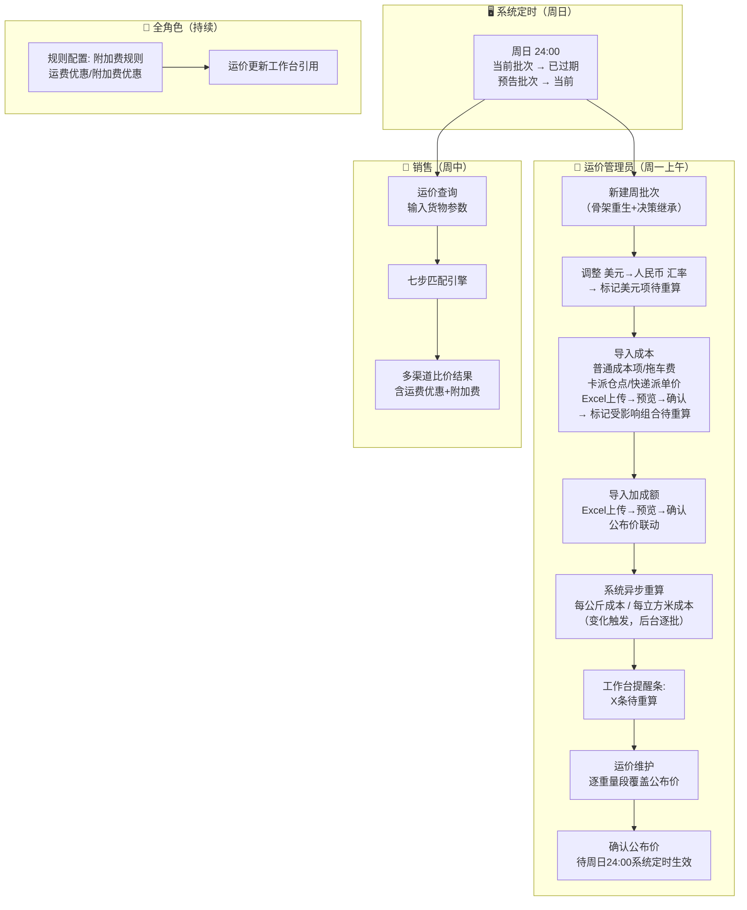

# 需求定义卡片 (RDD) — 超级运价模块

> **原始需求**：从0-1搭建TMS跨境物流系统，超级运价是第一块核心模块。当前外采新智慧TMS等同于"线上记事本"，无法做成本计算、利润分析、运价管理。
>
> **文档版本**：v5.10 | **日期**：2026-09-23 | **作者**：AI PM + 飞点业务团队
>
> 变更历史见 `变更记录.md`（业务变更）与 `LOG.md`（工作日志）。
>
> **★ 文档分工（去哪看）**：字段数据库类型 / 约束 → 数据设计 §3 Schema；业务规则 / 校验 / 计算公式 → PRD §6 / §7；页面规格 / 字段校验 / 菜单 → PRD §4 / §5。本 RDD 独有：功能 → AC 映射（§15）、业务全景与流程、分期与 MVP 方案。本 RDD 字段表的「类型」列为 UI 控件类型速览，字段结构以数据设计为准。

***

## 1. 核心洞察 (Insight)

### 真实痛点

飞点跨境物流作为亚马逊 FIST 承运商，当前的**核心瓶颈不是"没有系统"，而是"成本→报价"这条链路的计算全部依赖人工 Excel**。140个服务组合、每个组合 5 段成本、每段 3-5 个成本细项，每次海运费变动（几乎每周一次），运价管理员需要逐一手工换算 KG/CBM 成本价，一个组合耗时约 10 分钟，且存在汇率换算错误、公式引用错误的风险。

更深层的痛点是：**成本底价不可追溯**。当老板质疑"为什么这个报价这么低"时，没人能快速说清楚原始单价从哪里来、汇率是多少、公式怎么算的。

### JTBD（待办任务）

> **运价管理员**雇佣"超级运价"不是为了"管理成本"，而是为了：**当船公司周一早上发来新的海运费时，能在 30 分钟内完成全部 140+ 个服务组合的成本更新和对客公布价刷新，且每一分钱的变动都可追溯。**

> **销售**雇佣"超级运价"不是为了"查价格"，而是为了：**在客户微信群问"ONT8 这周什么价"时，5 秒内给出包含所有优惠的最终报价，不用切到 Excel 翻找，不用问运价管理员确认。**

### 业务价值：**HIGH**

| 维度      | 当前              | 目标               |
| ------- | --------------- | ---------------- |
| 单组合成本核算 | 10 分钟（手工 Excel） | 1 分钟（系统自动计算）     |
| 全量运价更新  | 1 天（逐一修改）       | 0.5 天（批量更新）      |
| 成本可追溯性  | 无（Excel 覆盖即丢失）  | 100%（二期：操作审计日志完整留痕） |
| 报价一致性   | 低（销售各自 Excel）   | 高（统一公布价 + 优惠规则）  |

***

## 2. 业务全景图

### 2.1 角色与工作节奏

| 角色 | 核心任务 | 频率 |
|------|---------|------|
| **运价管理员** | 维护渠道/成本/运价/船期/优惠规则，每周一批量更新 | 配置低频 + 运维周频 |
| **销售** | 运价查询，输入货物参数获取多渠道比价 | 日频（多次） |
| **运营主管** | 审查成本变动审计、盈亏底线 | 按需 |

### 2.2 端到端业务链路

```
【一次性配置】
  服务渠道 → 重量段 → 时效配置 → 航线 → 全局成本目录
      ↓
【按渠道配置】
  笛卡尔积生成组合 → 渠道成本项继承 → 计费规则 → 组合默认加成额
      ↓
【每周运维】
  周船期批次 → 船期录入 → 成本导入(Excel四类) → 加成额导入 → 运价行维护 → 成本重算 → 公布价刷新 → 周日24:00系统定时生效
      ↓
【销售查询】
  输入货物参数 → 渠道初筛 → 组合匹配 → 运价行匹配 → 附加费匹配 → 优惠叠加 → 最终报价
      ↓
【运单收货完成】
  计费取数（与运价查询共用同一计算内核） → 逐行生成应收业务流水 → 财务落账
  一条费用项一行 · 优惠独立成行（运费优惠 / 泡比优惠 / 附加费优惠各占一行）
      ↓
【持续治理】
  操作审计日志（二期） → 询价日志（二期） → 数据飞轮（二期）
```

### 2.3 实体依赖关系

```
服务渠道 (聚合根)
  ├── 1:1 预估运输时效
  ├── 1:N 送仓预估时效
  ├── 1:N 理赔承诺时效
  ├── 1:N 重量段
  ├── 1:N 渠道成本项 ← 成本段 ← 成本项模板
  ├── 1:N 渠道派送仓点成本 (渠道派送仓点成本)  ← 卡派专用
  ├── 1:N 渠道快递派送单价 (渠道快递派送单价) ← 快递派专用
  ├── 1:N 服务组合 → 1:N 计费规则（统一表格：通用 + 特殊规则）
  │                  ├── 1:N 组合成本项 ← 渠道成本项
  │                  ├── 1:N 运费优惠规则（独立优惠弹窗 · 列表操作列「优惠」入口）
  │                  ├── 1:N 泡比优惠规则（密度阈值阶梯，独立优惠弹窗 · 列表操作列「优惠」入口）
  │                  ├── 1:N 组合派送仓点成本 ← 渠道派送仓点成本
  │                  ├── 1:N 组合快递派送单价 ← 渠道快递派送单价
  │                  └── 1:N 运价行 → 周船期批次
  └── N:N 航线 ← 港口(引用)
              └── 1:N 船期 → 周船期批次

全局实体（独立于渠道/组合）：
  ├── 成本折算基准 (loading_standard) ← 渠道/组合不存，周批次快照
  └── 重量段模板 (weight_tier_template) ← 渠道引用模板ID

利润加成额 (default_markup) ← 存于服务组合，单位随计价方式（元/KG 或 元/m³）

附加费规则（独立模块）→ 1:N 附加费优惠规则（独立优惠弹窗 · 列表操作列「优惠」入口）
```

### 2.4 周运维总流程（泳道图）

> 以运价管理员的视角，覆盖每周一「收到新海运费 → 更新成本底价 → 刷新公布价 → 周日24:00定时生效」的完整链路。纵向按角色/时段分泳道。



> **关键数据传递**：周批次汇率 → USD 成本项折算；渠道 head/tail 折算基准 → 头程/派送均摊；组合默认加成额 → 建议公布价（成本底价+加成额）；运费优惠/附加费规则 → 最终报价。

---

## 3. 流程一：服务渠道与时效配置

> **触发**：运价管理员开通新服务渠道时。
> **频率**：低频（新增渠道时）。
> **前置依赖**：基础资料-国家、FBA 仓库列表已维护。

### 3.1 服务渠道 (ServiceChannel)

服务渠道是超级运价模块的**聚合根**。所有组合、成本、定价、优惠均挂在渠道之下。渠道配置是定价引擎运转的前提。

> **As a** 运价管理员
> **I want to** 创建一个服务渠道，定义其运输方式、尾程派送、包税方式等基本属性
> **So that** 后续的服务组合生成、成本核算、运价查询均有统一的渠道框架约束

| 字段      | 必填 | 说明                                          |
| ------- | -- | ------------------------------------------- |
| 服务渠道名称  | ✅  | 如"美森360"                                    |
| 起运国     | ✅  | 下拉选项调用基础资料-国家接口；如"中国"                       |
| 目的国     | ✅  | 下拉选项调用基础资料-国家接口；如"美国""英国"，**控制 FBA 仓库下拉范围** |
| 运输方式    | ✅  | 海运/空运/洲际火车/洲际卡车                             |
| 关联航线    | ✅  | 引用航线（写入 `route_channel` 关联表），下拉与回显**仅展示航线代码**。**渠道保存 / 保存并生成服务组合时强校验≥1条航线**（渠道必须绑定航线才能在运价查询提供船期）。可选范围双重过滤：① 港口类型——海运渠道仅可选海港航线，非海运渠道仅可选非海港航线；② 国家——出发港国 = 起运国 且 目的港国 ∈ 目的国 |
| 尾程派送方式  | ✅  | 卡派/快递派                                      |
| 包税方式    | ✅  | 包税/不包税/自主税号/自税递延                            |
| 计费方式    | ✅  | 重量KG/体积m³                                   |
| 服务类型    | ✅  | 散货/整柜                                       |
| 时效理赔    | ✅  | Y/N；默认否；控制是否需要时效理赔                           |
| FBA运单同步 | ✅  | Y/N；默认=否；控制是否向亚马逊推送 DW                       |
| container\_spec | 否 | 集装箱规格参考，一期固定为通用 |
| 状态      | ✅  | `正常` / `已冻结`；冻结后级联冻结所有关联服务组合；启用时弹窗确认是否一并启用关联组合           |

> **约束**：渠道创建后，该渠道下服务组合的"运输方式、尾程派送方式、计费方式、服务类型、包税方式"受此约束。渠道冻结后级联冻结所有关联服务组合。启用时弹窗提示"是否需要一并启用关联服务组合？"，可选"启用渠道及关联组合"或"仅启用渠道"。
>
> **关联航线（渠道↔航线 N:N，双向维护）**：航线与服务渠道为 N:N 关系，绑定关系存于独立关联表 `route_channel`，**渠道侧与航线侧均可编辑同一张关联表**（同一份数据、两个入口，不存在双向同步问题）。新增航线时从航线侧一次勾选多个渠道；新增渠道时从渠道侧一次选择多条航线。**校验卡在渠道侧**：渠道保存 / 保存并生成组合时校验其在 `route_channel` 中≥1条航线，否则阻止（破解"先建渠道才能去航线关联"的死锁——渠道建时直接选航线）。
>
> **成本折算基准**：全局独立表 `loading_standard`，按（基准类型: 头程/派送, 运输方式, 尾程方式）定义。渠道和组合不存此值，周批次创建时快照。详见 §5.1。

> 业务规则见 PRD R11（FBA 仓库过滤）；目的国减少时的阻断校验见 PRD §5.2「服务渠道」交互行为。

**相关 AC**：`AC0a` `AC0f` `AC0g`

---

### 3.2 预估运输时效 (EstimatedTransitTime)

挂在服务渠道上，**1:1** 关系。向亚马逊推送预计送达时段（DW），直接影响 FIST 考核的 DW 准确率。

| 字段      | 必填   | 说明                              |
| ------- | ---- | ------------------------------- |
| 服务渠道    | ✅    |                                 |
| 亚马逊服务等级 | 条件必填 | `标准` / `加急` / `快速`；FBA运单同步=是时必填 |
| 运输最小天数  | 条件必填 | 单位：天；FBA运单同步=是时必填               |
| 运输最大天数  | 条件必填 | 单位：天；FBA运单同步=是时必填，须 ≥ 运输最小天数    |

> 字段校验见 PRD §5.2「服务渠道」编辑页（FBA运单同步=否时预估运输时效只读、三字段不存储）；验收见 RDD AC0b。

**相关 AC**：`AC0b`

---

### 3.3 送仓预估时效 (WarehouseDeliveryEstimate)

挂在服务渠道上，**1:N**。分两阶段滚动更新 DW。

| 字段       | 必填 | 说明                                       |
| -------- | -- | ---------------------------------------- |
| 服务渠道     | ✅  |                                          |
| 派送方式     | ✅  | 与服务渠道.尾程派送方式级联。卡派、快递派各自独立配置行 |
| 仓库代码/邮编开头 | ✅  | 卡派：多选下拉选择FBA仓库代码，受目的国过滤；快递派：文本框，填入邮编开头，英文逗号拼接 |
| 开船至送仓（天） | ✅  | 第一阶段：运单创建时，DW = 开船日 + 此值，首次推送给亚马逊        |
| 提柜至送仓（天） | ✅  | 第二阶段：提柜后，DW = 提柜日 + 此值，重新预估并更新至亚马逊       |

**DW 滚动更新**：

```
第一阶段（运单创建时）：
  DW = 开船日 + 开船至送仓（天） → 首次推送给亚马逊
第二阶段（运单提柜后）：
  DW = 提柜日 + 提柜至送仓（天） → 重新预估并更新至亚马逊
第三阶段（运营登记后）临时方案：
  海外仓给运营 DW 时间窗 → 运营登记飞书表格
  → 系统每天定时拉取（根据 提单号 + 仓点代码 匹配）
  → 调用 Amazon API 修改 DW
  → 推送失败（BLOCK）→ 错误日志记录飞书表格
  → 持续重试至 DW 时间窗最后一天
```

> **业务价值**：前两阶段基于物流节点推算，第三阶段基于海外仓实际反馈做最终修正。三阶段滚动更新能显著提升 DW 准确率——这是 FIST Elite 承运商的核心考核指标。

> **临时方案说明**：第三阶段当前依赖飞书表格作为数据中间层（第三方 SaaS 系统非开源，无法直接对接）。新 TMS 上线后，ship track 有独立模块，取数源从"飞书表格"切换为"新 TMS"，主流程不变。

> 校验规则见 PRD R12（DW 滚动更新：cabinet > sail 阻止保存）；FBA运单同步=否时送仓时效不可编辑见 PRD §5.2。

**相关 AC**：`AC0c` `AC0d`

---

### 3.4 理赔承诺时效 (ClaimCommitment)

挂在服务渠道上，**1:N**。运单模块根据实际送达天数 vs 理赔承诺时效自动判定是否需要理赔。

| 字段        | 必填   | 说明                                          |
| --------- | ---- | ------------------------------------------- |
| 服务渠道      | ✅    |                                             |
| 派送方式      | ✅    | `快递派` / `卡派`；从服务渠道的尾程派送方式中取值                |
| FBA仓库代码   | 条件必填 | 卡派必填（不同仓点可配置不同理赔时效）；快递派不适用（渠道级，不区分仓点） |
| 理赔时效（工作日） | ✅    | 单位：工作日；实际送达天数 > 此值 → 触发理赔判定                 |

> 字段校验见 PRD §5.2「服务渠道」编辑页（理赔承诺时效：需时效理赔=N 时不可编辑、卡派必选仓库、同仓点不重复、快递派仅一条）；验收见 RDD AC0e。

**相关 AC**：`AC0e`

---

### 3.5 重量段配置 (WeightTier)

挂在服务渠道上，该渠道下所有组合共享。按计价单位分别定义分段阶梯。

| 字段   | 必填     | 说明                                                               |
| ---- | ------ | ---------------------------------------------------------------- |
| 服务渠道 | ✅      |                                                                  |
| 计价单位 | ✅      | `KG` / `m³`；与服务渠道.计费方式联动——计费方式含 KG 则必须配置 KG 段，含 m³ 则必须配置 m³ 段 |
| 段名称  | ✅      | 如"8KG+"、"101KG+"、"2m³+"                                         |
| 起始值  | ✅      | 该段起始值（含）；KG 单位为 KG，m³ 单位为 m³                                    |
| 结束值  | <br /> | 该段结束值（不含）；null = 以上                                              |

示例：

```
美森360：
  KG 段:  8KG+（8~101KG）、101KG+（101KG 以上）
  m³ 段: 2m³+（2m³ 以上）
美国空运240：
  KG 段:  12KG+（12~21KG）、21KG+（21~51KG）、51KG+（51~101KG）、101KG+（101KG 以上）
国际快递（UPS/DHL）：
  KG 段:  23kg+（23~47kg）、47-72kg、73-99kg
```

**重量段模板**：系统预置常见重量段组合作为模板（如"海运/KG — 8KG+, 101KG+"、"海运/m³ — 2m³+"等），模板按 `计价单位` 分类。服务渠道编辑时，重量段选择器根据该渠道已选的 `运输方式 + 计费方式` 联动过滤可选段——仅展示匹配模板中尚未绑定的独立重量段。选择后自动绑定至渠道，绑定段参数由模板定义、不可编辑，可删除。**删除重量段时二次确认，删除后同步删除服务渠道及关联服务组合中快递派成本项引用该重量段的成本细项（按段名称匹配，硬删除不保留快照）。**

**相关 AC**：`AC0l`

---

## 4. 流程二：航线与船期管理（每周运维）

> **触发**：船公司每周一更新船期，运价管理员同步维护。
> **频率**：周频。
> **前置依赖**：港口主数据（基础资料模块）、SRM 供应商管理。

### 4.1 港口 (Port) — 引用实体

港口数据属于基础数据模块，不在超级运价内维护。超级运价通过 `port_code` 引用。

| 字段   | 说明                         |
| ---- | -------------------------- |
| 港口名称 | 如"上海港"、"长滩港"               |
| 港口代码 | 唯一标识，如 `USLAX`、`CNSGH`     |
| 国家   | 下拉选项调用基础资料-国家接口；如"中国"、"美国" |
| 类型   | 出发港 / 目的港                  |

---

### 4.2 航线 (Route)

航线是连接"报价端"和"亚马逊推送端"的关键桥梁——提单绑定航线，运单绑定提单，运单推送到亚马逊 FIST 时从提单→航线获取港口代码。

| 字段     | 必填     | 说明                                                                                                                            |
| ------ | ------ | ----------------------------------------------------------------------------------------------------------------------------- |
| 航线代码   | ✅      | 船司分配的航线代码，如 `AAC/AAC2`、`CLX`、`SEA/SEA3`。同一船司的同一港口对可能有多条航线代码，不能用出发港+目的港拼接                                                 |
| 出发港代码  | ✅      | 选择港口名称后自动带出，如 `shg`                                                                                                          |
| 出发港名称  | ✅      | 下拉选择，数据来源：基础资料-港口管理列表                                                                                                            |
| 目的港代码  | ✅      | 选择港口名称后自动带出，如 `ctg`                                                                                                           |
| 目的港名称  | ✅      | 下拉选择，数据来源：基础资料-港口管理列表                                                                                                            |
| 供应商    | ✅      | 下拉选择，数据来源：SRM 供应商管理，过滤条件 供应商大类="干线运输供应商" AND 供应商明细**按港口类型条件过滤**：港口类型=海港 → 仅可选明细含"海运"的供应商；港口类型=非海港 → 仅可选明细含"非海运"（空运/铁路/公路等）的供应商。航线的港口类型由所选出发港决定；UI 位置置于目的港之后） |
| 预计运输天数 | <br /> | 配置在航线级别。船期新增时作为航程快照默认值（一次性取值），保存后独立存储，不随航线变更                                                                           |

**关联链路**：航线 N:N 关联服务渠道（用于报价展示），1:N 关联提单（运单推送 FIST 时自动获取港口代码）。

**关联渠道过滤规则（双向对称）**：航线↔服务渠道为 N:N，绑定关系存于独立关联表 `route_channel`，**两侧均可编辑同一张表**（渠道侧选航线、航线侧选渠道，同一份数据两个入口）。可选范围过滤双向对称，同时校验港口类型与国家：① **港口类型**——海港航线仅可关联海运渠道，非海港航线仅可关联非海运渠道；② **国家**——出发港.国家 = 服务渠道.起运国 AND 目的港.国家 ∈ 服务渠道.目的国。仅展示同时满足的对象。**强校验卡在渠道侧**（渠道保存/生成组合时校验≥1航线），航线侧解绑渠道若导致某启用态渠道变为 0 航线应提醒。

```
港口主数据 → 航线 → 服务渠道（N:N，用于报价展示）
               └→ 提单（1:N，提单绑定一条航线）
                    └→ 运单（1:N，运单绑定一张提单）
                         └→ Amazon FIST 推送
                              ├ 干线出发事件 → 取 航线.出发港代码
                              └ 干线到达事件 → 取 航线.目的港代码
```

> 一个提单只绑定一条航线。Amazon FIST 推送时，运单通过提单→航线直接拿到港口代码，无需在运单层面重复维护。

> 校验规则（出发港 ≠ 目的港）见 PRD §5.3「航线」新增/编辑弹窗字段表。

**相关 AC**：`AC0h` `AC0p`

---

### 4.3 周船期批次 (WeeklyScheduleBatch)

运价管理员的工作粒度是"周"——每周一早上同步更新所有航线的本周船期和运价。周船期批次是按周汇总的主列表，作为「运价更新工作台」的核心入口。

| 字段   | 必填     | 说明                                     |
| ---- | ------ | -------------------------------------- |
| 批次名称 | ✅      | 如 "2026-W05（1/26-2/1）"                 |
| 周次标识 | ✅      | ISO 周次，如 `2026-W05`，唯一索引               |
| 周起始日 | ✅      | 周一日期                                   |
| 周结束日 | ✅      | 周日日期                                   |
| 状态   | ✅      | 预告(10) / 当前(20) / 已过期(30) / 已作废(40) |
| 汇率快照 | ✅ | 格式: `[{from:"USD", to:"RMB", rate:7.2500}]`。新建批次时在「汇率快照」Tab 中配置，支持多币种对。默认预填 USD→RMB，可追加/删除 |
| 备注   | <br /> |                                        |

**批次快照**：新建批次时从全局表快照以下数据写入批次（格式为 JSON，该批次内独立，不受全局后续变更影响）—— 折算基准（`loading_standard`：头程 KG/CBM + 派送 KG/CBM，全部行快照）、汇率（运价管理员手动配置）、重量段模板（`weight_tier_template`）。利润加成额不快照，新建运价行时从服务组合 `default_markup` 取起步值。新建弹窗分为基本信息 +「折算基准快照」Tab +「汇率快照」Tab。

> 业务规则见 PRD R13（周批次唯一当前 / 状态流转 / 乐观锁）；汇率作用域与重算见 PRD R22；周批次校验与作废见 PRD §3.2 状态机。

**运价更新工作台 — 船期 Tab**（只读）：

```
运价更新工作台 — 本周船期（2026-W05）
航线                   截单时间（按交货地）              ETD     ETA     航程  最快提取
CLX  上海→长滩(MATSON)  花都仓:2/1 白云仓:2/1 花都仓:1/30  2月5日  2月16日  11天  2月17日
MAX  上海→长滩(MATSON)  花都仓:2/2 白云仓:2/2           2月6日  2月17日  11天  2月18日
SEA  盐田→长滩          花都仓:1/31 白云仓:1/31          2月4日  2月15日  11天  2月16日

[编辑船期 →]（跳转至航线&船期页维护）
```

> 船期 Tab 只读展示，船期的录入/编辑/导入统一在「航线 & 船期」页面操作。两页分工：工作台做运维对照和运价调整，航线页面做船期主数据维护。

**相关 AC**：`AC0i`

---

### 4.4 船期 (SailingSchedule)

每条船期记录挂在周批次下，关联一条航线。

| 字段           | 必填     | 说明                                                   |
| ------------ | ------ | ---------------------------------------------------- |
| 周批次          | ✅      |                                                      |
| 航线           | ✅      |                                                      |
| 截单时间         | ✅      | 按交货地配置，格式 `{"花都仓":"2月1日","白云仓":"2月1日"}`，交货地引用仓库列表-交货地的"仓库名称"。校验：截单日期 < ETD |
| 预计开船时间 (ETD) | ✅      |                                                      |
| 预计到港时间 (ETA) | ✅      |                                                      |
| 航程（自然日）      | ✅      | 新增时默认取关联航线.预计运输天数（只读快照），保存后独立存储。ETD + 航程 → ETA 自动计算       |
| 最快提取/送仓时间    | <br /> | ≥ ETA，到港后方可提取                                           |

**双视角展示**：

- **运维视角**（周批次主列表）：本周有哪些船
- **追溯视角**（航线历史）：点击航线名称展开该航线过去/未来的船期变化

```
航线 CLX 上海→长滩 历史船期：
周次           截单时间                          ETD      ETA      航程  最快提取
2026-W03      花都仓:1/17 白云仓:1/17           1月21日  2月1日    11天  2月3日
2026-W04      花都仓:1/24 白云仓:1/24           1月28日  2月8日    11天  2月10日
2026-W05(当前) 花都仓:2/1 白云仓:2/1 花都仓:1/30  2月5日   2月16日   11天  2月18日
2026-W06(预告) 花都仓:2/8 白云仓:2/8             2月12日  2月23日   11天  2月25日
```

> **维护频率**：每周维护，与运价更新同频。

**相关 AC**：`AC0j` `AC0k`

---

## 5. 流程三：成本底价管理（Epic 1）

> **触发**：服务渠道配置完成后，运价管理员配置该渠道的成本结构。
> **频率**：渠道级配置低频（新建渠道时）；组合级成本项每周随海运费波动更新。
> **前置依赖**：服务渠道已创建、全局成本目录已预置。

### 5.1 成本模型（四层结构 + 周期计算）

```
【静态层 — 单价 跨批次不变，走同步规则】
成本段（全局目录）  →  成本项模板（全局目录，挂段）  →  渠道成本项（渠道选择+定价）  →  组合成本项（继承+覆盖）
Level 1: 定义段名       Level 2: 定义项名+公式+建议价    Level 3: 选哪些段/项+默认价    Level 4: 继承后可调价/禁用
全局复用，可CRUD        全局复用，可CRUD              每个渠道独立配置              每个组合独立维护

【周期层 — 每公斤成本/cbm 每批次独立计算】
组合.单价 × 批次汇率 ÷ 折算基准 = 每公斤成本/cbm
同一组合在不同周批次：单价 相同，汇率不同 → 成本底价不同
单价 变更后标记 待重算，后台异步重算
```

```
> 折算基准来源：全局表 `loading_standard`。头程成本项用 head 行，派送仓点用 tail 行。运价维护时从批次快照取值。

成本底价：
  卡派:   头程共享 + 派送段普通项 + MAX(卡派仓点成本 by 仓点)
  快递派: 头程共享 + 派送段普通项 + Σ(快递派单价 by weight_tier × zip_zone)

头程共享成本（非派送段，所有仓点共用）：
  揽收段 + 干线运输段 + 关务段 + 仓储段 + ...
  → 按头程行 公斤折算基准 / 立方米折算基准 均摊为 每公斤 和 每立方米 单价
  ⚠ 例外：揽收段内的拖车费按 交货地组 定价，各交货地组独立计费，不共享（见下方「拖车费」）

拖车费（揽收段，按交货地组独立）：
  拖车费是揽收段的预置成本项，但不是统一价——它绑定 交货地组合（delivery_group）。
  每个交货地组定义了两个字段：
    ├── 拖车费单价 (truck_fee)：该交货地组的拖车基准单价（元）
    └── 拖车费加价 (sc_rmb)：相对基准的加价（元），可为负数
  → 拖车费总额 = truck_fee + sc_rmb
  → 按 头程公斤折算基准 / 头程立方米折算基准 均摊为 per KG 和 per m³
  → 最终以"每 KG/m³ 加价"形式显示在运价行交货地列

  因此成本底价按交货地不同——交货地不同 → 拖车费不同 → 头程成本不同 → 成本底价与公布价随之不同。
  示例：花都仓长途拖车（truck_fee=1500 + sc_rmb=200 = 1700元）> 花都仓（truck_fee=1200 + sc_rmb=0 = 1200元），花都仓头程成本更高。

派送段普通项（所有仓点共用，与头程成本项逻辑一致）：
  提拆派费等不区分仓点、不区分报价来源的派送段成本项
  → 按 头程公斤折算基准 / 头程立方米折算基准 均摊为 每公斤 和 每立方米 单价

卡派仓点成本（按仓点独立）：
  每个平台仓库代码有三种供应商报价来源：
    ├── 拆送价（按每箱派送）
    ├── 组合一口价（按整板派送）
    └── 整柜直送价（仅整柜适用）
  → 取 MAX(拆送价, 组合一口价) 作为散货卡派的派送段仓点成本底价
  → 用 tail_kg/立方米折算基准 折算为 每公斤 / 每立方米

快递派单价（重量段 × 邮编区间）：
  快递承运商（UPS/FedEx）按重量段 × 邮编区间给出 per KG/m³ 单价
  → 已是最终单价，直接累加，不需要额外折算
  → 匹配: 输入货物重量/体积 → 匹配 weight_tier(KG/m³) × 目的邮编 → 邮编前缀 → 取单价

最终成本底价：
  卡派:   头程共享 + 派送段普通项 + MAX(卡派仓点成本 by 仓点)
  快递派: 头程共享 + 派送段普通项 + Σ(快递派单价 by weight_tier × zip_zone)
             粒度：服务组合 × (平台仓库代码 / 邮编前缀)
```

#### 5.1.1 成本→定价数据流图

> 四层漏斗：原始数据经过成本折算 → 汇总 → 定价 → 报价，每层标注计算公式与数据来源。

```mermaid
flowchart TD
    subgraph 第一层_原始数据["① 原始数据输入"]
        direction LR
        S1["成本项原始单价<br>（人民币/美元）"] 
        S2["周批次汇率<br>（美元→人民币）"]
        S3["折算基准<br>头程 KG/CBM + 派送 KG/CBM"]
        S4["卡派仓点报价<br>拆送价 / 组合一口价 / 整柜直送价"]
        S5["快递派单价表<br>重量段 × 邮编前缀"]
    end

    subgraph 第二层_成本折算["② 成本折算（每公斤 / 每立方米）"]
        direction LR
        T1["头程项 = 单价 ×（美元?汇率:1）÷ 头程折算基准"]
        T2["派送普通项 = 单价 × 汇率 ÷ 头程折算基准"]
        T3["卡派仓点 = 仓点报价 × 汇率 ÷ 派送折算基准<br>→ 同一仓点取 MAX（拆送/组合/整柜）"]
        T4["快递派 = 直接累加匹配行单价<br>（已是 每公斤/每立方米，不折算）"]
    end

    subgraph 第三层_成本底价["③ 成本底价"]
        direction LR
        U1["头程合计 = Σ 启用项（揽收+干线+关务+仓储）"]
        U2["派送合计 = 派送普通项 + MAX（卡派仓点）/ Σ（快递派单价）"]
        U3["成本底价/KG = 头程合计/KG + 派送合计/KG"]
        U3b["成本底价/立方米 = 头程合计/立方米 + 派送合计/立方米"]
    end

    subgraph 第四层_定价["④ 公布价"]
        direction LR
        V1["公布价 = 成本底价 + 重量段加成额（元/计价单位），加成额与公布价双向联动"]
    end

    subgraph 第五层_报价["⑤ 最终报价"]
        direction LR
        W1["运费优惠 = 固定减免（一期，元/计价单位）；折扣率二期"]
        W2["附加费 = 命中规则 × 计价单位 + 附加费优惠值（带符号调整量：负=减钱、正=加价）"]
        W3["泡比优惠 = 泡比达标后固定减免（仅 KG 组合）"]
        W4["最终报价 = (公布价 + 运费优惠值 + 泡比优惠值) + 附加费净额（优惠值为带符号调整量：负=减钱、正=加价）"]
    end

    第一层_原始数据 --> 第二层_成本折算
    第二层_成本折算 --> 第三层_成本底价
    第三层_成本底价 --> 第四层_定价
    第四层_定价 --> 第五层_报价
```



> **追溯链路**：最终报价可逐层下钻 → 公布价来源（加成额联动/手动覆盖）→ 组合默认加成额 → 成本底价（头程合计 + 派送段）→ 每公斤成本（原始单价 × 汇率 ÷ 折算基准）→ 批次汇率 + 本批次快照的折算基准。

---

### 5.2 成本段 (CostSegment) — 全局目录

系统预置 5 个常用段，运价管理员可新增、禁用。一期预置：揽收段、干线运输段、关务段、仓储段、派送段。

| 字段   | 必填 | 说明            |
| ---- | -- | ------------- |
| 段名称  | ✅  | 如"揽收段""干线运输段" |
| 是否启用 | ✅  | 禁用后不可在新渠道中选择  |

---

### 5.3 成本项模板 (成本项Template) — 全局目录

挂在成本段下，定义该段可用的成本项名称、建议默认价、币种。换汇由币种自动派生（无独立「是否换汇」字段）。渠道选择成本项时自动带出默认价，可覆盖。运价管理员可自行新增、编辑、启用/禁用成本项。利润不在此配置——见组合默认加成额（§6.3）。

| 字段    | 必填 | 说明                   |
| ----- | -- | -------------------- |
| 成本段   | ✅  |                      |
| 项名称   | ✅  | 如"海运费""港杂费""国内报关费"    |
| 建议默认价 | ✅  | 跨渠道通用的默认单价，渠道关联时可覆盖  |
| 币种    | ✅  | `RMB` / `USD`；换汇由币种自动派生（RMB→直接计算，非RMB→换汇计算），无独立「是否换汇」字段 |
| 排序    | ✅  | 控制展示顺序               |
| 是否启用  | ✅  | 默认启用。禁用后新增渠道/组合时不再出现；已有引用不受影响，不物理删除。派送段的仓点成本和快递派单价为预置项，不可禁用 |

> 全局目录预置 5 段 13 个成本项，其中**预置项共 3 个**：揽收段 1 个（拖车费）、派送段 2 个（仓点成本、快递派单价）；**其余成本段（干线运输段 / 关务段 / 仓储段）无预置项**，由运价管理员自行新增。分布：揽收段 2 项、干线运输段 2 项、关务段 3 项、仓储段 3 项、派送段 3 项。

> **利润与成本分离**：成本项只关注成本本身，利润为服务组合上的「默认加成额」（`default_markup`），单位随组合计价方式（元/KG 或 元/m³）。

> **加成额存储策略**：加成额存于服务组合，不再有独立利润策略实体。运价编辑时用组合默认加成额初始填充公布价（公布价=成本底价+加成额），运价员逐重量段手工覆盖。

**预置项**：揽收段下「拖车费」和派送段下「仓点成本（卡派）」「快递派单价（快递派）」共三个成本项为系统预置项。装柜费为普通成本项但同样不可禁用、不可删除，受统一价管理。

| 规则 | 揽收段（拖车费） | 派送段（仓点成本/快递派单价） |
|------|----------------------|---------------------------|
| 不可禁用 | ✅ 启用开关置灰 | ✅ 启用开关置灰 |
| 不可删除 | ✅ 操作列无删除按钮 | ✅ 操作列无删除按钮 |
| 批量更新按钮隐藏 | ❌ 支持批量更新（装柜费/拖车费均可） | ✅ 不参与模板级批量更新 |
| 建议默认价 | 可编辑（不同交货地组合有不同基础价） | 置灰显示"—"（实际定价在子表中维护） |

> **展示形式**：拖车费是唯一受「交货地」影响的揽收段成本项，在渠道成本项弹窗和组合成本项弹窗中从主表格拆出，作为独立的「拖车费 · 按交货地分别定价」区域展示。装柜费为统一价（¥1,200/票），归入主表与干线/关务/仓储/派送项并列。交货地组合（如"花都仓+白云仓""花都仓"）在拖车费成本项中预定义，每个组合有独立的拖车费单价。

#### 5.3.1 批量更新 — 数据流转

**触发**：运价管理员在成本项模板中修改建议默认价后，点击「批量更新」。

**数据流**：

```
成本管理（模板）        服务渠道成本项         服务组合成本项         当周运价表
┌──────────────┐     ┌──────────────┐     ┌──────────────┐     ┌──────────────┐
│ 修改建议默认价  │     │ 更新渠道覆盖价  │     │ 更新组合成本价  │     │ 标记成本底价   │
│ （成本单价）   │ ──→ │ （若渠道未覆盖）│ ──→ │ （勾选的组合）  │ ──→ │ 待重算（工作台人工触发重算）│
└──────────────┘     └──────────────┘     └──────────────┘     └──────────────┘
```

**步骤**：

1. 点击「批量更新」→ 弹出对话框，展示原建议默认价，运价管理员输入新值
2. 系统查询该成本项模板关联的所有服务组合（通过 模板 → 渠道成本项 → 组合成本项 追溯），展示清单：组合编码、所属渠道、当前成本价、更新后值
3. 运价管理员勾选需要同步的组合（默认全选），确认更新
4. 系统批量更新选中组合的成本项单价，并标记受影响组合当前批次的成本底价「待重算」——成本底价重算统一在运价工作台人工触发（见 §7.4 / PRD R20-R22）
5. 同步时同时更新对应的渠道成本项（避免渠道与组合断层）

> 批量更新业务规则见 PRD R08（仅更新已有项 / 渠道跟随 / 可勾选 / 重算触发 / 预置项排除）；删除级联见 PRD R29（渠道成本项）/ R30（重量段）。

---

### 5.4 渠道成本项 (Channel成本项) — 渠道级默认值

服务渠道从全局目录中选择要使用的段和项时，系统自动创建渠道成本项记录。选中项自动带出模板的建议默认价，渠道可覆盖。**渠道成本项是纯数据层实体**——在服务渠道列表页通过「成本项」按钮弹窗完成调价和启停（非独立页面）。服务组合创建时从此复制。

> **默认规则**：新建服务渠道时，默认关联全局目录中的所有成本段和成本项，默认单价继承模板建议默认价。运价管理员只需关闭不适用的项或覆盖单价。

| 字段     | 必填   | 说明                                    |
| ------ | ---- | ------------------------------------- |
| 服务渠道   | ✅    | 系统自动关联                                |
| 成本段    | ✅    | 继承自渠道选择                               |
| 成本项模板  | ✅    | 继承自渠道选择                               |
| 模板默认价 | 只读   | 展示模板建议默认价（含币种），供渠道覆盖时对照              |
| 原始单价   | ✅    | 继承模板建议默认价，渠道可覆盖（如美森海运费 5.2 vs 快船 3.0） |
| 币种     | ✅    | 继承模板币种，可覆盖                            |
| 是否启用  | ✅    | 默认启用；关闭后该渠道不适用此成本项，新生成组合时跳过        |
| 交货地组   | 条件必填 | 成本段=揽收段且为拖车费时必填；每个交货地组单独一行，同一(template, group)唯一 |
| delivery\_quote\_source | 条件 | 10:拆送价 20:组合一口价 30:整柜直送价；派送报价来源 |

> **利润与成本分离**：成本项只关注成本本身，利润为服务组合上的「默认加成额」（`default_markup`）。
>
> **拖车费按交货地组拆行**：拖车费是唯一受交货地影响的揽收段成本项，按预定义的交货地组合（如"花都仓+白云仓""花都仓"）拆为多行存储。每行 = `(channel_id, template_id, 交货地组)` 唯一。装柜费为统一价成本项，不拆行。服务组合创建时按行逐一复制。
>
> **派送段不适用本条**：派送段成本为仓点级三维定价（拆送价 / 组合一口价 / 整柜直送价），使用独立的「派送仓点成本」实体管理，见 5.6。
>
> 渠道成本项是"默认值"，不是"共享引用"。修改此处不会自动影响已有组合——需通过批量更新流程主动推送。

#### 5.4.1 同步到组合 — 数据流转

**触发**：运价管理员在服务渠道的成本项弹窗中勾选成本项后，点击「同步到组合」。

**数据流**：

```
服务渠道成本项          服务组合成本项           当周运价表
┌──────────────┐     ┌──────────────┐     ┌──────────────┐
│ 勾选成本项    │     │ 更新组合中已有  │     │ 重算成本底价   │
│ + 勾选目标组合 │ ──→ │ 成本项的价格    │ ──→ │ per KG/m³    │
└──────────────┘     └──────────────┘     └──────────────┘
```

**步骤**：

1. 渠道成本项弹窗中勾选需要同步的成本项（可多选），点击顶部「同步到组合」
2. 弹出同步弹窗，上半部分展示勾选的成本项清单（可再调整），下半部分展示该渠道的所有服务组合（默认全选）
3. 运价管理员确认勾选范围后点击「确认同步」
4. 系统逐一更新：每个勾选成本项的渠道覆盖价 → 写入对应组合中已有该成本项的行；禁用的成本项不可选择
5. 同步完成后标记受影响组合当前批次的成本底价「待重算」，成本底价重算统一在运价工作台人工触发

> 同步到组合业务规则见 PRD R08（仅更新已有项 / 禁用项不可选 / 按交货地组匹配 / 仓点·快递派独立 / 更新计数透明）。

---

### 5.5 组合成本项 (Combination成本项) — 组合级实际值

服务组合创建时从渠道成本项**逐一复制**。每个组合可独立：覆盖单价、禁用不适用的项。成本底价计算时仅统计启用的项。

| 字段              | 必填     | 说明                       |
| --------------- | ------ | ------------------------ |
| 服务组合            | ✅      |                          |
| 来源渠道成本项         | <br /> | 可追溯到渠道级的哪个默认项            |
| 成本段             | ✅      |                          |
| 成本项名称           | ✅      | 复制自模板                    |
| 原始单价            | ✅      | 继承渠道默认值，可单独覆盖            |
| 币种              | ✅      | `RMB` / `USD`            |
| cost\_per\_kg   | <br /> | 系统自动计算：`单价 × (if USD: 批次汇率 else 1) ÷ 头程行.公斤折算基准` |
| cost\_per\_cbm  | <br /> | 系统自动计算：`单价 × (if USD: 批次汇率 else 1) ÷ 头程行.立方米折算基准` |

> 成本计算公式见 PRD §7.2（成本底价计算，含换算示例与精度）。
| 交货地             | pickup\_region          | 条件必填   | 成本段=揽收段时必填；从渠道成本项继承，每个交货地一行 |
| 是否启用            | 布尔                 | ✅      | 默认启用；禁用后该组合不适用此成本项，计算时跳过 |
| effective\_from | DateTime                | <br /> | 未来生效时间；一期预留字段，原型不展示       |

> **派送段不适用本条**：派送段成本分三类——普通项复用本表，卡派仓点使用 `组合派送仓点成本`，快递派单价使用 `组合快递派送单价`。详见 §5.6。

---

### 5.6 派送段 — 普通项 + 卡派仓点 + 快递派单价

派送段成本分三类：
- **普通项**（如提拆派费）：不区分仓点/快递，复用 Combination成本项，计算逻辑与头程成本项一致
- **卡派仓点成本** (WarehouseDeliveryCost)：**按平台仓库代码逐行定价**，每个仓库代码独立设置三种报价方式。仅尾程=卡派时有效
- **快递派单价** (ExpressDeliveryRate)：**重量段 × 邮编前缀 → 固定单价** 的查表结构。快递公司给定每 KG/m³ 价格，系统按条件匹配取出，直接累加不进折算。仅尾程=快递派时有效

成本底价 = 头程共享成本 + 派送段普通项 + MAX(仓点拆送价, 仓点组合一口价, 仓点整柜直送价)。快递派的派送段仓点项为 0（快递派不按仓点定价）。

**渠道级派送仓点成本表** `渠道派送仓点成本`：

| 字段 | 必填 | 说明 |
|------|------|------|
| 服务渠道 | ✅ | |
| 仓库代码 | ✅ | 多选，来源于头程管理-基础配置-平台仓库列表（**所有平台仓库，不限 FBA**），如 `["ONT8","LAX9","LGB8"]`；同一仓库不可出现在多行 |
| 拆送价 | 条件必填 | 按 KG/m³ 计费，至少填一种报价方式 |
| 组合一口价 | — | 按板计费 |
| 整柜直送价 | — | 整柜一口价，FCL 专用 |
| 币种 | ✅ | `USD` / `RMB` |
| 是否启用 | ✅ | 默认启用 |

**组合级派送仓点成本表** `组合派送仓点成本`：
- 服务组合创建时从渠道级**逐一复制**，组合级可覆盖。派送段按尾程派送方式过滤：卡派组合仅复制仓点成本，快递派组合仅复制快递派单价
- **开关行为**：渠道成本项弹窗中，派送段整段开关可自由启用/禁用，不受渠道尾程派送方式限制。组合成本项弹窗中同理。禁用后成本明细表格置灰保留（不隐藏），不可编辑
- 字段同渠道级，增加 `来源渠道仓点成本ID`

> **成本底价计算（AC4 修正）**：对选定仓库组内的每个仓点，取 MAX(拆送价, 组合一口价, 整柜直送价) 为该仓点的派送成本。仓库组整体派送成本 = MAX(组内各仓点派送成本)。头程共享成本 + 派送成本 = 成本底价。

> **派送段内部分类**：派送段成本分三类 —— (a) **普通项**（如提拆派费）：不区分仓点/快递，复用 Combination成本项；(b) **卡派仓点项**（拆送价/组合一口价/整柜直送价）：使用独立的 组合派送仓点成本 管理；(c) **快递派单价**（重量段 × 邮编区间 → 固定单价，查表取值，不折算）：使用独立的 组合快递派送单价 管理。
>
**渠道级快递派送单价表** `渠道快递派送单价`：

| 字段 | 必填 | 说明 |
|------|------|------|
| 服务渠道 | ✅ | |
| 重量段 | ✅ | 快递派专用重量段，计价单位从 weight_tier.unit 推导 |
| 邮编前缀 | ✅ | 如美西区(8xxx,9xxx) |
| 单价 | ✅ | per KG 或 per m³ |
| 币种 | ✅ | USD / RMB |

**组合级快递派送单价表** `组合快递派送单价`：
- 服务组合创建时从渠道级逐一复制，组合级可覆盖。派送段按尾程派送方式过滤：卡派组合仅复制仓点成本，快递派组合仅复制快递派单价
- 字段同渠道级，增加 `来源渠道单价ID`

> **唯一约束**：`UNIQUE(channel_id, weight_tier_id, 邮编前缀)` / `UNIQUE(combination_id, weight_tier_id, 邮编前缀)`。
>
> **与卡派仓点成本的对比**：卡派仓点成本用 tail_kg/立方米折算基准 折算（÷350/÷1.8），快递派单价已经是 per KG/m³ 的最终单价，直接累加到成本底价，不需要额外折算。
>
> 成本底价公式见 PRD §7.2（卡派取 MAX、快递派累加）。

**运维频率**：头程成本项（海运费等）每周随船期波动，派送仓点成本和快递派单价变动频率较低，统一在「成本管理」页面集中管理。

---

### 5.7 成本管理页（独立页面）

> **设计决策**：成本管理作为独立的成本项模板管理页面，集中维护全局成本目录（利润不在此配置，见服务组合的默认加成额 §6.3）。

页面功能：
- 左侧成本段列表（5 段），右侧成本项表格（成本项、建议默认价、**启用默认价**、状态、编辑/批量更新）
- 新增/编辑成本项：成本项名称、建议默认价、币种（换汇标记由币种自动派生，无独立输入项）
- 预置项（拖车费/仓点成本/快递派单价）：不可禁用、不可删除、批量更新隐藏、编辑时仅名称可修改，其余字段不可编辑
- 批量更新：修改建议默认价 → 展示受影响组合清单（勾选同步）→ 标记受影响组合成本底价待重算
- 模板修改后通过「批量更新」推送到选中组合（仅更新已有项，不新增不删除）
- 派送段仓点成本/快递派单价在服务渠道级别维护，渠道变更后可按项同步到组合

---

### 5.8 核心场景：成本全生命周期

**0. 初始化全局目录（一次性）**
系统预置 5 个成本段 + 常用成本项模板（装柜费、拖车费、海运费、港杂费、国内报关费、国外清关费、税金、国内存储费、国外存储费、库内操作费、目的港提还柜费等），运价管理员可后续新增/禁用段和项。

**1. 创建渠道 → 配置成本**
创建服务渠道 → 从全局目录选择关联的成本段 + 成本项 → 为选中的项设置默认单价和币种 → 保存后即成为该渠道的"渠道成本项"。

**2. 生成组合 → 继承成本项**
选择"保存并生成服务组合" → 笛卡尔积生成组合 → 每个组合逐一复制渠道成本项（默认启用），派送段按尾程派送方式过滤（卡派仅复制仓点成本、快递派仅复制快递派单价）→ 运价管理员进入组合：禁用不适用的项 + 覆盖单价。

**3. 单个组合修改（精细调价）**
进入 服务组合 → 组合成本项列表 → 修改某成本项的原始单价 → 系统重算 cost\_per\_kg / cost\_per\_cbm → 仅影响这一个组合。

**4. 批量更新（海运费涨价）**
进入 成本项模板 → 修改"海运费"的建议默认价 → 系统提示"是否同步到已关联此模板项的服务渠道和组合？"→ 展示受影响组合清单（同步组合时自动更新父渠道）（通过渠道成本项追溯）→ 运价管理员勾选需要同步的组合（默认全选，可取消勾选）→ 一键批量刷新选中组合的成本项单价，同时自动更新对应父渠道成本项（避免渠道与组合断层）→ 标记受影响组合成本底价待重算。

```
组合清单展示：
组合名称                    当前价  新价   公布价   勾选
美森360-KG-卡派-包税-散货   5.2    5.8    10.0    ☑
美森360-m³-卡派-包税-散货  5.2    5.8    1480    ☑
美森360-KG-快递派-包税-散货   5.2    5.8    12.0    ☐（正在谈价）
```

> 成本项 `effective_from` 字段为一期预留（原型不展示），二期实现定时自动切换。

**相关 AC**：`AC1` `AC2` `AC3` `AC4` `AC5` `AC6` `AC28`

---

### 5.9 成本 Excel 导入

> **触发**：船公司/代理周一早上发来新报价 Excel，运价管理员需批量更新成本项价格。
> **入口**：工作台 `[导入成本 ▼]` 下拉菜单，统一收拢四类成本导入。
> **通用流程**：下载模板（预填当前值）→ 运价管理员填新价格 → 上传 → 系统识别变更行 → 预览变更清单（受影响组合数）→ 确认 → 执行更新 + 触发传播 + 标记受影响运价行待重算。

**导入规则**：
- 空单元格 = 不更新该字段
- 按匹配键定位，匹配不到的行跳过并在报告中标注
- 不新增不删除记录，仅更新已有项的价格
- 错误处理：≤50 条单事务；>50 条分批提交（50 条/批）
- 预置项/不适用列在模板中灰显不可填

#### 5.9.1 普通成本项导入

**更新目标**：`cost_item_template.default_price`
**传播**：R08 → 渠道 → 组合

| 列 | 说明 | 可编辑 |
|:---|:---|:---:|
| 成本段 | 匹配 `cost_segment.name` | ❌ |
| 成本项名称 | 匹配 `cost_item_template.name` | ❌ |
| 币种 | 当前币种 | ❌ |
| 当前建议默认价 | 当前值，供对照 | ❌ |
| 新建议默认价 | 填入新价格 | ✅ |

> 模板不含预置项（拖车费、仓点成本、快递派单价），预置项走各自专用导入。

#### 5.9.2 拖车费导入

**更新目标**：`delivery_group.truck_fee`、`delivery_group.sc_rmb`
**传播**：组合成本项通过拖车费模板关联交货地组 → 自动引用更新后的值

| 列 | 说明 | 可编辑 |
|:---|:---|:---:|
| 交货地组 | 匹配 `delivery_group.name` | ❌ |
| 包含交货地 | `delivery_group.regions`，供参考 | ❌ |
| 当前拖车费单价 | `truck_fee` 当前值 | ❌ |
| 当前拖车费加价 | `sc_rmb` 当前值 | ❌ |
| 新拖车费单价 | 更新 `truck_fee` | ✅ |
| 新拖车费加价 | 更新 `sc_rmb` | ✅ |

#### 5.9.3 卡派仓点成本导入

**更新目标**：`渠道派送仓点成本` 的三种报价（拆送价、组合一口价、整柜直送价）
**传播**：D0a → 组合派送仓点成本

| 列 | 说明 | 可编辑 |
|:---|:---|:---:|
| 渠道名称 | 匹配 `service_channel.name` | ❌ |
| 平台仓库代码 | 单个仓库代码，匹配 `warehouse_codes` 数组 | ❌ |
| 币种 | 当前币种 | ❌ |
| 当前-拆送价 / 当前-一口价 / 当前-直送价 | 当前值，`—` = 未填 | ❌ |
| 新-拆送价 / 新-一口价 / 新-直送价 | 至少填一种 | ✅ |

> 数据设计中 `warehouse_codes` 是数组（同行多仓点价格相同时合并）。导入时 Excel 每行一个仓库代码，系统自动处理同行合并/拆行。

#### 5.9.4 快递派单价导入

**更新目标**：`渠道快递派送单价.单价`
**传播**：D0a → 组合快递派送单价

| 列 | 说明 | 可编辑 |
|:---|:---|:---:|
| 渠道名称 | 匹配 `service_channel.name` | ❌ |
| 重量段 | 匹配 `weight_tier.tier_name`（如 `1KG+`） | ❌ |
| 邮编前缀 | 匹配 `zip_prefixes` | ❌ |
| 币种 | 当前币种 | ❌ |
| 当前单价 | 当前值 | ❌ |
| 新单价 | 更新值 | ✅ |

**相关 AC**：`AC30` `AC31` `AC32` `AC33`

---

## 6. 流程四：服务组合、计费规则与默认加成额（Epic 2 + 3）

> **触发**：渠道成本项配置完成后，运价管理员创建服务组合并配置计费和默认加成额。
> **频率**：渠道级配置低频；组合级默认加成额调整按需。
> **前置依赖**：服务渠道已创建、重量段已配置、渠道成本项已配置。

### 6.1 服务组合 (ServiceCombination)

服务组合是具体向客户售卖的产品（Price SKU），由渠道属性笛卡尔积自动生成。

| 字段     | 必填 | 说明               |
| ------ | -- | ---------------- |
| 服务组合名称 | ✅  | 默认由维度自动拼接，支持手动修改 |
| 服务渠道   | ✅  | 关联的服务渠道          |
| 运输方式   | ✅  | 受渠道约束            |
| 尾程派送方式 | ✅  | 受渠道约束            |
| 计费方式   | ✅  | 受渠道约束            |
| 包税方式   | ✅  | 受渠道约束            |
| 服务类型   | ✅  | 受渠道约束            |
| 状态     | ✅  | `正常` / `已冻结`     |

**生成规则**：

- 笛卡尔积 = 运输方式 × 尾程派送方式 × 计费方式 × 包税方式 × 服务类型（取自渠道已配置的维度值）
- 手动创建时，各维度可选项受渠道约束 —— 只能从该渠道已配置的维度值中选择
- 笛卡尔积生成的组合提供"正常/已冻结"开关，冻结后不在运价查询中显示

---

### 6.2 计费规则 (BillingRule)

挂在服务组合上，统一表格维护：首行为通用计费规则（对象类型=通用，不可删除），可追加特殊规则覆盖通用值（按客户匹配）。**1:N**，未命中特殊规则的客户使用通用规则。

| 字段     | 必填     | 说明                                                       |
| ------ | ------ | -------------------------------------------------------- |
| 对象类型   | ✅      | `通用`（首行固定，不可删除）/ `特殊规则` |
| 目标     | 条件必填 | 对象类型=特殊规则时必填；多选客户；同一客户不可出现在多条规则中 |
| 计泡系数   | ✅      | 计费方式为重量KG时，计泡系数默认6000；计费方式为体积m³时，计泡系数默认363               |
| 收费重方式  | ✅      | 由计费方式级联过滤：KG→`实重`(10)/`材重`(20)/`实重材重取大`(30)；m³→`重量方数`(40)/`体积`(50)/`重量方数体积取大`(60)。默认：KG=实重材重取大(30)，m³=重量方数(40) |
| 计重方式   | ✅      | `按票`(10) / `按箱`(20)；默认按票 |
| 收费重精度   | ✅      | 下拉选择：`1（向上取整）` / `0.1（保留一位小数）` / `0.01（保留两位小数）`；KG 默认 1，m³ 默认 0.1 |
| 最低箱收费重 | <br /> | 单箱最低计费重量（KG/m³）；箱重不足此值时按此值计费；空 = 不限制                    |
| 最低票收费重 | <br /> | 整票最低计费重量（KG/m³）；总重不足此值时按此值计费；空 = 不限制                    |
| 最小承运件数 | <br /> | 低于此件数不可承运；空 = 不限制                                        |
| 最大承运件数 | <br /> | 高于此件数不可承运；空 = 不限制                                        |

> **优先级**：特殊规则 > 通用规则。同一客户命中多条特殊规则时取第一条。主要用于运单计算运费。

---

### 6.3 默认加成额 (Default Markup)

**利润为服务组合上的一个字段「默认加成额」**（`default_markup`），不作为成本项的内联字段，也不再有独立的全局利润策略实体。成本和利润分离——成本管理只管成本，利润在组合上以固定加成额表达。

| 字段 | 说明 |
|------|------|
| 默认加成额 | 固定金额，元/计价单位。组合计费=KG → 元/KG；计费=m³ → 元/m³ |
| 归属 | 服务组合（`service_combination.default_markup`），单位随组合 `billing_unit` |

> **为什么用固定加成额而非利润率？** 一期所有优惠（运费优惠、泡比优惠）均为固定减免（元/计价单位），利润用同一口径（额）才能与优惠直接相减做盈亏判断，避免"率 vs 额"混算。且每个组合只有一种计价方式，加成额单位天然确定。

**数据流**：
```
服务组合.default_markup（运价管理员在组合上维护，单位随计价方式）
  → 新建运价行时取组合默认加成额作起步值
    → 运价编辑：公布价 = 成本底价 + 加成额
      → 运价管理员调整加成额或直接修改公布价，双向联动（加成额=公布价-成本）
```

> **设计决策：为什么把利润策略池降级为组合字段？**
> 1. 利润只是"起步种子"——运价员每周逐重量段手工推翻，命名策略池的复用价值极低
> 2. 加成额单位跟随组合计价方式，存在组合上单位天然确定，无需 KG/m³ 双字段
> 3. 成本和利润仍然分离：加成额是组合的利润字段，不混进成本项
> 4. 与一期固定减免优惠口径统一，盈亏色标可精确做"加成额 − 最大优惠额"（**「最大优惠额」取绝对值口径**，即 `Σ|负向优惠值|`）

---

### 6.4 核心场景

1. 创建服务渠道 → 系统自动匹配重量段模板
2. 创建服务渠道 → 选择"保存并生成服务组合" → 系统自动创建组合（可设默认加成额）
3. 运价管理员在服务组合上维护默认加成额（元/计价单位）
4. 周批次创建时：快照折算基准 + 重量段到批次（加成额不快照，取自组合）
5. 运价编辑：组合默认加成额填充所有重量段（初始值相同），运价管理员逐行覆盖
6. 成本单价变更 → 自动标记"待重算" → 工作台人工触发重算

**相关 AC**：`AC2` `AC3` `AC5`

---

## 7. 流程五：运价表与矩阵定价

> **触发**：每周船期更新后，运价管理员维护本周运价行。
> **频率**：周频。与船期同频更新。
> **前置依赖**：服务组合已生成、重量段已配置、周批次已创建。

### 7.1 运价行 (PriceTableRow)

公布价不是单一数字，而是**仓库组/邮编前缀 × 重量段 × 交货地（可多选）**的矩阵。每条运价行对应一个"价格 SKU"，卡派用仓库组，快递派用邮编前缀。定价维度由服务组合的尾程派送方式自动确定（卡派→仓库组多选，快递派→邮编前缀），新建时不可手动切换。运价行挂在周船期批次下，与船期同频每周维护。运价查询时只取 CURRENT 批次的运价行。新建运价行时校验唯一性：同一（服务组合 + 仓库组/邮编前缀 + 交货地）不可重复。

> **定价维度按尾程派送方式分叉**：卡派 → 仓库组定价；快递派 → 邮编前缀定价。`仓库组` 和 `邮编前缀` 互斥，同一条运价行只能使用其中一种。

| 字段           | 必填   | 说明                 |
| ------------ | ---- | ------------------ |
| 周批次          | ✅    | 所属周船期批次；与船期同频每周更新  |
| 服务组合         | ✅    |                    |
| 仓库组          | 条件必填 | 尾程=卡派时必填；如 `ONT8,LAX9,LGB8` |
| 邮编前缀        | 条件必填 | 尾程=快递派时必填；如 `8,9`，匹配时 startswith |
| 重量段          | ✅    | 渠道级定义的重量段          |
| 交货地组         | ✅    | 引用拖车费成本项预定义的交货地组合（如"花都仓+白云仓""花都仓"）。新建运价行时按交货地组 × weight_tier 逐一生成 |
| 公布价-per\_KG  | 条件必填 | 若计费方式含 KG；调整加成额 → 公布价自动重算，直接改公布价 → 加成额自动反算          |
| 公布价-per\_m³ | 条件必填 | 若计费方式含 m³；同上双向联动         |
| 加成额 | ✅ | 元/计价单位。默认取组合 default_markup。每重量段独立。与公布价双向联动，编辑弹窗中后修改的值覆盖先修改的值 |
| 待重算    | ✅ | 默认=true。新建批次「从上周复制」后全部标记为 true；成本单价变更后标记为 true。工作台提醒"X 条待重算"，运价管理员逐行确认后可清除 |

> **从上周复制（骨架重生+决策继承）**：新建周批次时，用本周启用航线/组合笛卡尔积铺底作为骨架 → 匹配旧批次 → 命中则继承加成额/公布价（成本底价用本周 costRefMap 重算），未命中用组合默认加成额初始化并标记「新增」。失效航线/组合/成本项从新批次中自动移除。复制后全部标记待重算。查询时只取 CURRENT 批次。
>
> **不是存储字段**：`参考签收时效` 和 `理赔时效` 不存储在运价行上，查询时自动计算：
> - **参考签收时效** = 当前周船期.最快提取/送仓时间 换算为自然日范围
> - **理赔时效** = 通过 运价行.服务组合 → 服务渠道 → 理赔承诺时效，按派送方式 + FBA仓库匹配取值

### 7.1b 邮编前缀

快递派的定价粒度是邮编前缀。在快递派单价费率表中，`邮编前缀` 字段直接存储逗号拼接的前缀（如 `8,9` 表示 8xxxx+9xxxx）。运价查询时用 `startswith` 逐一匹配。不再作为独立实体管理。

> 快递派不涉及仓点派送成本：快递承运商（UPS/FedEx）给出重量段 × 邮编区间的固定 per KG/m³ 单价，系统查表匹配后直接累加到成本底价，不折算。数据存储在独立的 `组合快递派送单价` 表中（二维查表结构），不使用 组合派送仓点成本。

### 7.2 与成本底价的关系

> 成本底价与运价行关系见 PRD §7.2（成本底价计算）；运价行匹配公式见 PRD §7.1。

> **设计决策**：仓库组用逗号存而非独立表——当前分组稳定，15 个渠道约需 50-80 个仓库组，逗号方案简单够用。未来如果需要仓库组独立管理（如改名、移动仓点），再迁移至独立表。

### 7.3 核心场景

**运价查询时的匹配逻辑**（Step 3 of 流程八）：
- 卡派：根据仓库代码匹配 `仓库组`（逗号 contains）
- 快递派：根据目的邮编 startswith 匹配 `邮编前缀`
- 根据计费方式(KG/m³)匹配对应单位的重量段
- 根据交货地组匹配 `delivery_group`
- 无匹配运价行时标记"暂未报价"并展示渠道（二期进入在线询价流程），不屏蔽渠道

**拖车费按交货地组**：拖车费有 delivery_group 参数，系统根据交货地组取对应拖车费单价。**成本底价因此按交货地组不同**——花都仓等远途交货地的拖车成本高，成本底价与公布价高于花都仓。装柜费为统一价不再受交货地影响。交货地组合在拖车费成本项中预定义，运价行按交货地组逐一生成（实务示例：美森 花都仓+白云仓基准组、花都仓+白云仓组、花都仓组三行）。

**相关 AC**：`AC0m` `AC0n` `AC0o` `AC0q`

---

### 7.4 运价更新工作台 — 运价 Tab（两级折叠视图）

运价更新工作台是每周运价运维的核心入口，双 Tab 结构：**本周船期** + **本周运价**。运价 Tab 采用两级折叠视图：**主表行 = 服务组合 × 交货地组**，展开后显示该交货地组下的各仓点/邮编前缀的运价明细。盈亏色标（同单位相减，精确，**只判运费侧**）：加成额≥最大优惠额→🟢、0<加成额<最大优惠额→🔴（给满优惠会亏）、加成额≤0→⬛（公布价低于成本）。一期「最大优惠」= 最大运费优惠额 + 最大泡比优惠额（两者都挂组合、都作用于运费、且叠加，取最坏情况；**「最大优惠额」取绝对值口径**，即 `Σ|负向优惠值|`）。附加费不进工作台盈亏灯（附加费是运单级触发，不属于运价行）。

**页面结构**：

```
┌─────────────────────────────────────────────────────────────┐
│ 批次选择栏  USD→RMB 汇率展示  [新建] [从上周复制]      │
├─────────────────────────────────────────────────────────────┤
│ [本周船期]  [本周运价]                                       │
├─────────────────────────────────────────────────────────────┤
│ 主行（收起状态）：每行 = 服务组合 + 交货地组                    │
│ ┌──────────────────────────┬────────────┬────┐              │
│ │服务组合                   │交货地       │操作│              │
│ ├──────────────────────────┼────────────┼────┤              │
│ │美森360-海运-卡派-KG-包税   │花都仓+白云仓│编辑│              │
│ ├──────────────────────────┴────────────┴────┤              │
│ │▶ 展开 → 卡派：仓库组 + 成本底价 + 最大优惠 + 各重量段  │        │
│ │  仓库组    成本底价  最大优惠  8KG+      100KG+      │        │
│ │  ONT8,LAX9 6.85/KG  减2.5     利润2.96   利润3.96   │        │
│ │                               公布价9.0  公布价10.5  │        │
│ │                               成本7.33   成本7.33    │        │
│ │  LGB8      6.65/KG  减2.5     利润3.35   利润4.85   │        │
│ │                               公布价10.0 公布价11.5  │        │
│ │                               成本6.65   成本6.65    │        │
│ ├──────────────────────────────────────────────────┤        │
│ │▶ 展开 → 快递派：邮编前缀 + 最大优惠 + 各重量段           │        │
│ │  邮编前缀  最大优惠  1KG+             3KG+               │        │
│ │  8,9      减2.0     成本15.51        成本14.81          │        │
│ │                      利润额2.49       利润额1.49         │        │
│ │                      公布价18.00      公布价16.30        │        │
│ └──────────────────────────────────────────────────┘        │
└─────────────────────────────────────────────────────────────┘
```

**主表列**：服务组合 | 交货地 | 操作（编辑按钮）

**展开子表列（卡派）**：仓库组 | 成本底价 | 最大优惠 | 各重量段（利润额 + 公布价 + 成本底价）

**展开子表列（快递派）**：邮编前缀 | 最大优惠 | 各重量段（成本 + 利润额 + 公布价；成本因重量段而异故嵌入每格，无独立成本底价列）

**数据来源**：
- 成本底价引用自成本管理页计算值（只读）
- 公布价 = 成本底价 + 加成额，加成额从组合默认加成额取种子值
- 运价管理员在工作台逐重量段维护公布价，加成额自动反算
- 拖车费按交货地组不同，交货地组差价以"每KG/m³加价"形式显示在主表交货地列

**编辑方式**：点击主表行的「编辑」按钮，弹出矩阵编辑弹窗，展示该组合+交货地组下的所有仓库组/邮编前缀 × 重量段矩阵，支持逐格修改利润额或公布价（双向联动）。

**一期范围**：成本底价只读引用 + 公布价范围展示 + 重量段展开明细 + 加成额计算。默认加成额在服务组合上配置，工作台可逐重量段覆盖。客户报价预览、利润预警、批量调价二期实现。

**工作台定位**：工作台是周运维唯一入口——船期 Tab 只读（编辑跳转到航线&船期页），运价 Tab 支持全量运价行 CRUD + 逐重量段调价 + 骨架重生式复制。船期和运价共享同一周批次。

**相关 AC**：`AC5a` `AC5i`

---

### 7.5 加成额 Excel 导入

> **触发**：成本导入完成后，运价管理员需要批量调整各组合×重量段×交货地组的加成额（利润空间）。
> **入口**：工作台 `[导入加成额]` 按钮。

**更新目标**：`price_table_row.加成额`
**联动**：保存后 `公布价 = 成本底价 + 新加成额`（KG 和 m³ 独立计算）

| 列 | 说明 | 可编辑 |
|:---|:---|:---:|
| 组合名称 | 匹配 `combination_code` | ❌ |
| 仓库组/邮编 | 卡派 = `仓库组`，快递派 = `zip_prefixes` | ❌ |
| 重量段 | 匹配 `weight_tier.tier_name` | ❌ |
| 交货地组 | 匹配 `delivery_group.name`，`—` = 不适用 | ❌ |
| 当前加成额KG / 当前加成额m³ | 当前值，`—` = 该计价单位不适用 | ❌ |
| 新加成额KG / 新加成额m³ | 填入新值；KG 列仅计费方式含 KG 的组合可填，m³ 同理 | ✅ |

**匹配键**：`组合名称 + 仓库组/邮编 + 重量段 + 交货地组`
**校验**：导入后校验——计费方式含 KG 的组合加成额-KG 必填，含 m³ 的组合加成额-m³ 必填。导入时允许空=不改。

**相关 AC**：`AC34`

---

## 8. 流程六：附加费规则引擎（Epic 4）

> **触发**：运价管理员根据业务需求定义和维护附加费规则。
> **频率**：配置低频，新增规则时按需操作。
> **前置依赖**：商品管理（SKU属性）、基础资料-邮编库、商业地址接口。
> **菜单**：仅 **「费用与标识规则」一个菜单**（能力统一并入本菜单）。

### 8.1 规则类型概述

附加费规则按匹配方式分为三种类型：

| 值 | 类型 | 触发条件 | 计价单位 |
|:--:|:---|:---|:---|
| 10 | **字段匹配** | 维度条件（AND，**≥1 条必填**） | 按票 / 按KG / 按m³ / 按数量 |
| 40 | **字段&公式** | **维度条件（仅「服务组合」多选，最多 1 条，可为空）＋ 公式条件（OR，≥1 条必填）** | **仅按箱** |
| 50 | **人工添加** | 无（操作员在运单界面手动触发） | 仅按数量 |

> **说明**：阈值比较属于公式的一部分，不单独设规则类型；触发条件与计价单位**由规则类型自动决定**，用户不单独配。三种类型的典型场景见 §8.8 列举案例。 **★ 骨架落库后不可改**：规则**编辑态**下「规则类型 / 动作类型 / 维度」置灰不可修改（条件行也不可增删）—— 三者是规则的**骨架**，改它们等于换成另一条规则，会让已配取值、计价明细、优惠与已生成的费用流水全部失去对应关系；**新增态可自由选**。需变更请新建规则（见 PRD R37）。

---

### 8.2 通用字段

三种类型共享的字段：

| 字段       | 必填   | 说明                                                           |
| -------- | ---- | ------------------------------------------------------------ |
| 规则名称     | ✅    | 唯一标识，如"粉末品名加收"                                               |
| 规则类型     | ✅    | `字段匹配` / `字段&公式` / `人工添加`（**三态**，见 §8.1）                          |
| 动作类型     | ✅    | `加收费用`（收费）/ `标识提醒`（运单打标不收费）。**两态**；（附加费规则不再是"拦截"能力的载体；若业务需要"不符合条件不让下单"，另找位置，记为遗留待确认） |
| 附加费标识    | ✅    | **单选 + 必选**（不分动作类型）。取值来源 基础资料-标识管理的「附加费标识」类型                          |
| 生效范围     | —    | V1 仅 `全局`；`scope_type` 字段预留，未来扩展 `指定渠道` |
| 生效范围ID列表 | —    | V1 为空；预留字段 |
| 计价明细     | 条件必填 | 动作类型=加收费用时必填。**费用方向固定 `应收`（前端只读）、一期仅 1 行**（应付方向二期拓展）。每行=一条费用线，含：费用方向(只读)、费用类型(取值来源头程管理-基础配置-费用类型)、**计价单位**(`按票`/`按箱`/`按KG`/`按m³`/`按数量`，**在明细行内**，非规则级字段)、单价(支持负数)、币种(取值来源于基础资料-币种接口)。匹配时按运单计费方式自动选取对应行 |
| 状态       | ✅    | `正常` / `已冻结`，大列表控制，弹窗不展示                                 |

> **说明**：优惠额度上限不设独立字段，直接由 §9.2 的「**`|优惠值| ≤ 应收单价`**」（绝对值比较，否则负数永远通不过校验）承担，"不可优惠"这类政策改为靠不建优惠规则实现（见 PRD R06 / R31）。

---

### 8.3 字段匹配型 — 专属字段

| 字段     | 必填 | 说明                                                                                                                                                                |
| ------ | -- | ----------------------------------------------------------------------------------------------------------------------------------------------------------------- |
| 维度条件   | ✅  | 多条维度条件之间为 **「且」(AND)**；**≥1 条必填**（无维度条件不可保存）                                                                                                                        |
| 维度     | ✅  | 见下方「维度 × 取值」表。**每条条件必填** |
| 取值     | ✅  | 见下方「维度 × 取值」表。**每条条件必填**；**取值一律下拉选择，不允许自由输入** |

**维度 × 取值**（每条条件 = 一个维度 + 一个或多个取值；全部条件为「且」关系）：

| # | 维度 | 取值 | 选择方式 | 取值来源 |
|:--:|:---|:---|:---|:---|
| 1 | 尾程派送方式 | 快递派 / 卡派 | 单选 | 枚举 |
| 2 | 地址类型 | 商业地址 / 私人地址 | 单选 | 第三方接口判定 |
| 3 | SKU属性 | 粉末 / 液体 / 带电 | 单选 | 商品管理-货物属性 |
| 4 | 是否FBA运单 | 是 / 否 | 单选 | 运单 |
| 5 | 报关方式 | 普通报关 / 9710 / 9810 / 1010 / 1039 | 单选 | 枚举 |
| 6 | 自送标识 | 是 / 否 | 单选 | 运单 |
| 7 | 出口先查后装模式 | 是 / 否 | 单选 | 运单（运单管理-出口先查后装模式） |
| 8 | 邮编 | 是（第三方接口判定） | 单选 | 第三方接口 |
| 9 | **交货站点** | 仓库名称，如 花都仓 / 白云仓 | **多选** | **仓库列表-本地仓 的仓库名称**（与「交货地」同一主数据）；取值来源 `demo/员工端-demo/仓库列表_主列表.html` 的「**本地仓**」Tab 的**仓库名称**（该页有多个 Tab，只取「本地仓」这一个 Tab） |
| 10 | **服务组合** | 服务组合名称，如 `美森360-海运-卡派-KG-包税-散货` | **多选** | 超级运价-服务组合（启用中） |
| 11 | **用户** | 客户名称 | **多选** | 客商中心-客户管理（正常客户） |

> **维度设计说明**：
> - **「服务组合」维度**：多选，来源超级运价-服务组合——支持"仅某几个组合才加收"的场景。
> - **不设「用户等级」维度**——等级优惠统一走优惠规则（§9），不应混进附加费的触发条件；同一语义保留两个入口会打架且难排查。
> - **「交货站点」取值来源**锁定为 `demo/员工端-demo/仓库列表_主列表.html` 的「**本地仓**」Tab 的仓库名称（与「交货地」同一主数据），**不依赖「末端管理」模块**（末端管理是最后一公里派送域，与"交货站点"不是同一概念；该模块立项时再回归检查）。
> - **维度、取值全部必填**，保存时逐行校验（第 N 行条件：请选择维度 / 请选择取值）。
> - **取值一律下拉选择**——自由输入会造成"粉末/粉未"这类同义异写，匹配静默失效。
> - **「出口先查后装模式」**：取值 **是 / 否**，字段**取自运单**（运单管理内的运单字段）——用于对"报关/装柜前先查验"的运单加收，与「自送标识」「是否FBA运单」同属运单级业务开关。

匹配逻辑：逐一比对字段值与运单/货物数据，全部命中后按计价单位×单价计算。**触发节点 = 运单收货完成**（由规则类型自动决定，后台预置，见 §8.7）。

---

### 8.4 字段&公式型 — 专属字段

| 字段   | 必填 | 说明                                                                              |
| ---- | -- | ------------------------------------------------------------------------------- |
| 维度条件 | —  | **仅「服务组合」多选，最多 1 条，可为空**（其他维度不开放——公式型靠公式筛场景，不靠维度） |
| 公式列表 | ✅  | **「字段&公式」型必填（≥1 条）**。多条公式 OR 关系（任一满足即触发）。每条公式 = 表达式 + 比较符 + 阈值，如 `(长+宽)*2+高 > 300` |
| 可用变量 | —  | **长、宽、高、重量、材积重** |
| 算术运算符 | —  | **`+` `-` `*` `/` `(` `)`** |
| 比较运算符 | —  | **`>` `<` `>=` `<=` `=`** |
| 计价单位 | —  | **仅 `按箱`**（判定依据是收货过机实测尺寸/重量，天然按箱计） |

> **公式示例**：`(长+宽)*2+高 > 300`、`长*宽*高/6000 > 20`、`(长+宽+高)*2 >= 265`
>
> **「材积重」（体积重的统称）**：**货箱上的「材重」与「重量方数」都属于材积重**，按计费方式取其一：**按 KG 计费** → 取货箱**材重**（`长×宽×高 ÷ 计泡系数`，原型计泡系数 6000）；**按 m³ 计费** → 取货箱**重量方数**（`实重 ÷ 计方系数`，原型计方系数 363）。公式中直接引用该值即可。
>
> **为什么括号必须支持**：超重超长的判定式天然含括号（`(长+宽)*2+高`），若只开放四则运算而不支持 `( )`，运算优先级会算错，运价管理员只能靠手工展开变形——极易配错。

匹配逻辑：**触发节点 = 运单收货完成**（按箱取收货过机实测尺寸/重量，由规则类型自动决定，见 §8.7）；取运单货物参数代入公式，依次计算，任一公式满足阈值即触发，然后按 按箱 × 单价计算。

---

### 8.5 人工添加型 — 专属字段

| 字段     | 必填 | 说明                                       |
| ------ | -- | ---------------------------------------- |
| 计价单位   | —  | **仅 `按数量`**                                |
| — | —  | 无其他专属字段。操作员在运单界面手动触发此规则后，系统按计价明细自动计算费用。如"贴标费"——操作员勾选后输入张数（计价单位=按数量），系统按 单价×张数 计算 |

匹配逻辑：无自动触发（**触发节点 = 人工触发**）。运单界面展示该规则，操作员勾选并填入数量后，按 按数量 × 人工填入数量 × 单价计算。**人工添加型费用永远豁免重扫**（见 §8.7）。

---

### 8.6 计价单位

| 计价单位   | 计算公式                    | 适用类型        | 示例           |
| ------ | ----------------------- | ----------- | ------------ |
| 按票     | 单价 × 1                  | 字段匹配        | 报关费 160元/票   |
| 按箱     | 单价 × 箱数                 | **仅 字段&公式** | 超重费 200元/箱   |
| 按KG    | 单价 × 计费重量               | 字段匹配        | 粉末加收 1.5元/KG |
| 按m³   | 单价 × 计费体积               | 字段匹配        | —            |
| 按数量    | 单价 × 数量（人工添加型为人工填入数量）   | 字段匹配 / 人工添加 | 贴标费 2元/张     |

> **计价单位由规则类型锁定**——`字段匹配` 取 按票 / 按KG / 按m³ / 按数量；`字段&公式` **仅按箱**；`人工添加` **仅按数量**。该字段落在**计价明细行内**，不是规则级字段（见 §8.2）。

---

### 8.7 核心场景：规则匹配（触发节点由规则类型自动决定）

> **触发节点为后台预置，原型不展示、数据库保留**——节点由**规则类型自动决定**，用户不配。

| 规则类型 | 触发节点 |
|:---|:---|
| 字段匹配 | 运单收货完成 |
| 字段&公式 | **运单收货完成**（按箱取收货过机实测尺寸/重量） |
| 人工添加 | 人工触发 |

**运单收货完成时触发**

1. **字段匹配型**：过滤正常 + 生效范围匹配 → 逐一比对维度条件与运单/货物数据 → 动作类型=加收费用 → 计算金额；=标识提醒 → 运单打标（打「附加费标识」）
2. **字段&公式型**：收货过机获取实测尺寸/重量（按箱）→ 过滤正常 → 代入公式 → 任一命中计算金额

**人工触发**

3. **人工添加型**：过滤正常 → 在运单界面展示可选列表 → 操作员勾选并填数量 → 按 按数量 计算

**通用：运单信息变更 → 重新扫描费用规则**

4. 运单信息变更（含收货过机实测尺寸/重量）时，按各规则类型的触发节点**重新扫描全部费用规则**——字段匹配型与字段&公式型已在收货完成时一次性生成，之后只随「重新扫描」复核（如超重标识提醒）；能否重扫以**冻结边界**为准：

| 时点 | 重扫规则 |
|:---|:---|
| 收货完成前 | 随意重扫 |
| 收货后 ~ 业务审计前 | 可重扫并**留痕** |
| 业务审计后 | **冻结**（只能红冲或人工调整） |
| 进账单后 | **冻结** |
| 人工添加型费用 | **永远豁免重扫** |

**汇总**：各节点结果合并后**逐条生成应收业务流水**——一条费用项一行，**优惠独立成行**（优惠不并入父行金额；运费/泡比/附加费优惠行的费用类型均取自该条优惠规则配置的 `fee_type`）。完整取数链路见 `2026-09-23-PRD.md` §7.5。

**打标去重（同一标识只打一次）**

5. 规则命中后为运单打「附加费标识」时，按 **运单 + 标识** 判重：**同一运单上同一标识只打一次**。同一业务原因拆成多条规则并**共用同一标识**时（如「出口先查后装」的**加收运费单价**与**加收报关费 150 元/票**各一条规则、同指向「出口查验」），两条同时命中也只打一枚标；人工添加型规则的打标与自动命中撞在同一标识上同样不重复打。**同一标识允许被多条规则共用**（不设跨规则唯一性约束）；**规则命中与流水留痕不受影响** —— 每条命中规则的应收流水仍各自带来源规则留痕（见 PRD R36）。

**人工添加操作（运单界面）**：操作员打开运单 → 看到"附加费-人工添加"区域 → 展示可选规则列表（如：贴标费 2元/张、周六派送 50元/票）→ 勾选"贴标费"并填入张数 3 → 系统计算 2×3 = 6元 → 提交运单，附加费一并写入。

### 8.8 列举案例

> 以下为帮助理解三种规则类型的示例，非系统预置，运价管理员按实际业务自行配置。

| 规则示例   | 类型   | 触发条件 / 公式                         | 计价  | 费用方向    |
| ------ | ---- | --------------------------------- | --- | ------- |
| 粉末加收   | 字段匹配 | SKU属性=粉末                            | 按KG | 应收(+)   |
| 超重超长   | 字段&公式 | (长+宽)×2+高>300 **或** 长+宽×2+高×2>265 | 按箱  | 应收(+)   |
| 商业地址加收 | 字段匹配 | 尾程派送=快递派 **且** 地址类型=商业            | 按票  | 应收(+)   |
| 私人地址加收 | 字段匹配 | 尾程派送=快递派 **且** 地址类型=私人            | 按票  | 应收(+)   |
| 偏远邮编加收 | 字段匹配 | 邮编∈偏远地区列表                         | 按票  | 应收(+)   |
| 客户自送减收 | 字段匹配 | 自送标记=是                            | 按KG | 应收(-, 单价为负) |
| 贴标费    | 人工添加 | 运单界面勾选"贴标" + 填张数                  | 按数量 | 应收(+)   |

> 运单示例：美森360 → ONT8，尾程=卡派，产品=粉末，邮编=92345
> - 粉末加收命中、偏远邮编命中（均属字段匹配型 → 运单收货完成节点）、超重超长命中（字段&公式型 → 收货完成节点，按箱取收货过机实测数据）
> - 商业/私人地址不命中（尾程=卡派，规则限定快递派）
> - 运单界面勾选贴标并填 3 张

**相关 AC**：`AC7` `AC8` `AC9` `AC10` `AC11` `AC12`

---

## 9. 流程七：运费优惠、泡比优惠、附加费优惠

> **触发**：运价管理员在服务组合 / 费用与标识规则主列表点操作列的「优惠」按钮，打开独立优惠配置弹窗，为客户等级或客户特批配置优惠规则。
> **频率**：按需配置。
> **前置依赖**：等级管理、客户管理（客商中心-启用客户）、附加费规则已配置。
>
> **管理方式**：运费优惠与泡比优惠**由服务组合主列表操作列的「优惠」按钮打开独立优惠配置弹窗维护**（与组合绑定，无独立页面）。附加费优惠规则**由费用与标识规则主列表操作列的「优惠」按钮打开独立优惠配置弹窗维护**（与规则绑定，无独立页面）。
>
> **一期优惠方式统一**：一期所有优惠（运费优惠、泡比优惠、附加费优惠的固定减免）仅支持**固定减免**；附加费优惠另支持折扣率。折扣率在运费优惠、泡比优惠上放入二期。
>

### 9.0 优惠体系演进路线（★ 先读本节）

> 本节说明**一期优惠的表与接口为什么已经独立、而配置入口复用父实体列表**，以及**二期营销模块补齐什么**。目的是让技术选型看清一期与二期的边界。
> 数据模型见 `2026-09-23-数据设计.md` §3.20（统一模型目标态 + 迁移映射）；冲突与叠加矩阵见 PRD §6.1。

**一期优惠已按独立营销模块落地——三张优惠表独立建表、接口是独立子资源接口（不随父实体 PUT 提交），只是不建独立菜单与配置页面，配置入口挂在父实体主列表操作列的「优惠」按钮上，打开独立优惠配置弹窗。** 优惠天然只作用于单一组合/单一费用项，一期不建独立菜单是为了省掉一整套菜单 + 权限 + 关联配置；**承载形态上没有与父实体耦合**——保存时机与父实体不是同一次请求，父实体编辑接口也不含优惠子表，二期迁移只需在既有表与接口上补菜单与统一主表，不需要重构。

**演进路线**：

```
Phase 1（现状）—— 固定优惠已是独立营销模块形态：独立三张优惠表 + 独立子资源接口
  运费优惠             → 服务组合主列表操作列「优惠」→ 独立优惠配置弹窗
  附加费优惠           → 费用与标识规则主列表操作列「优惠」→ 独立优惠配置弹窗
  泡比优惠             → 服务组合主列表操作列「优惠」→ 独立优惠配置弹窗
  优惠方式：运费/泡比仅固定减免；附加费支持折扣率 + 固定减免
  优惠对象：客户等级 + 客户特批；有效期：永久有效 / 固定期限（无单次有效）
  接口：GET/PUT /api/service-combinations/{id}/freight-discounts（运费优惠）、GET/PUT /api/service-combinations/{id}/density-discounts（泡比优惠）、GET/PUT /api/surcharge-rules/{id}/discounts（附加费优惠）—— 三类优惠各自独立子资源
  落库：应收业务流水 ar_flow 逐行留痕（优惠独立成行 + 来源规则留痕）
  ✗ 无独立菜单与配置页面（仅此一项复用父实体列表入口）  ✗ 无活动/券核销

Phase 2 —— 营销模块补齐（表与接口一期已独立，无需重构）
  优惠性质拆两个正交维度：
    ├─ 固定优惠（= 一期三张表的能力，迁移过来）
    └─ 浮动优惠（= 新增：优惠券、满减、限时活动）
  补齐独立菜单与配置页面
  统一主表承载（§3.20 目标态）
  新增：配额/预算、领取与核销、叠加顺序可配、是否可叠加开关
  补齐：优惠落库明细 discount_apply_log（承载「同一费用项多条优惠的叠加运算顺序」与「券核销」；一期 ar_flow 已有逐行留痕）
```

**关键区分：「固定减免 vs 折扣率」≠「固定 vs 浮动」**

| | 含义 | 归属 |
|:---|:---|:---|
| 优惠方式 | **怎么算**：折扣率（乘法）／固定减免（**带符号加法**——优惠值为负=减钱、为正=加价） | 一期已有，二期恢复折扣率 |
| 优惠性质 | **确不确定**：固定（命中即生效，无需领取）/ 浮动（需领取，有配额与核销） | 一期全为固定，浮动二期新增 |

> **为什么必须现在分清**：浮动优惠比固定优惠**多两个状态机**——「配额/预算消耗」和「领取 → 锁定 → 已使用 → 核销/过期/作废」。一期三张表没有任何字段能承接这两个状态机。若二期才发现，代价是重做主表 + 补历史数据；现在写清，代价只是本节文字。
>
> **一期不需要为此新增任何字段**：迁移所需的「优惠性质 / 优惠类别 / 绑定对象类型」三个维度**全部可由源表名和父实体外键机械推导**，二期迁移是纯数据搬运（详见数据设计 §3.20.3）。**唯一必须一期遵守的硬约束**：优惠表的父实体外键不得设 `ON DELETE CASCADE`，删组合/删规则前应校验并阻断生效中的优惠。

> **⚠️ 两个已知缺口（一期接受，二期闭环）**：
> 1. **叠加运算顺序无明细** —— 应收业务流水 `ar_flow` **逐行落库、优惠独立成行并带来源规则留痕**，能回答「这单为什么减了 3 元、哪条规则给的」；仍缺的是「同一费用项上多条优惠的叠加运算顺序」明细与「浮动优惠（券/满减/限时）的核销载体」（数据设计 §3.20.4）；
> 2. **报价不留痕** —— 查价时点的优惠是实时算的、不落库，而收货时**重新匹配一次**，中间规则可能已变；运单也不存报价。客户拿查价截图对质时无法举证（数据设计 §3.20.5）。
>
> 二期由 `query_log`（查价留痕）+ `discount_apply_log`（叠加运算顺序与券核销明细）+ 运单报价快照三件套闭环。

**二期营销模块的范围（提前锁定，避免做成半成品）**：

| 能力 | 二期是否做 | 说明 |
|:---|:---:|:---|
| 优惠规则统一配置菜单 | ✅ | 收敛一期三张优惠表，统一列表/编辑 |
| 固定优惠（运费/泡比/附加费） | ✅ | 一期能力迁移 |
| 泡比优惠 | ❌ | 一期已实现，二期无此项 |
| 单次有效 | ✅ | 二期首次实现（有效期类型） |
| 浮动优惠：优惠券 | ✅ | 券模板 + 券实例 + 领取 + 核销 |
| 浮动优惠：满减 / 限时活动 | ✅ | 活动主表 + 时间窗 + 预算 |
| 折扣率优惠方式 | ✅ | 与固定减免并存 |
| 叠加顺序可配 / 是否可叠加开关 | ✅ | 落地冲突矩阵（RDD §9.3） |
| 优惠落库明细（叠加运算顺序 + 券核销） | ✅ | 一期 `ar_flow` 已逐行留痕（含优惠行与来源规则），缺叠加运算顺序与券核销载体 |
| 智能推荐 / 预算优化 / ROI 分析 | ❌（Phase 3） | 营销深化，非优惠引擎本身 |

### 9.1 运费优惠规则（独立优惠弹窗 · 入口：服务组合列表操作列「优惠」）

规则直接挂在服务组合上，在独立优惠配置弹窗的「运费优惠」Tab 中统一表格维护。**1:N**。

| 字段        | 必填   | 说明                                                    |
| --------- | ---- | ----------------------------------------------------- |
| 优惠对象类型    | ✅    | **一期同时开放 `客户等级` / `客户特批`** |
| 目标客户等级    | 条件必填 | 优惠对象=客户等级时必填；多选，下拉取值来源于客商中心-等级管理                              |
| 目标客户      | 条件必填 | 优惠对象=客户特批时必填；多选，下拉取值来源于客商中心-客户管理（启用客户）                              |
| 优惠方式      | ✅    | 一期仅`固定减免`（**带符号加法**：每计价单位按优惠值加减——负数=减钱、正数=加价）。二期恢复`折扣率`（乘法，如 0.9 = 九折）  |
| 优惠值       | ✅    | **数据层拆两个字段**：`discount_rate` 小数(6,4) / `discount_adjustment` 小数(10,2)，由「优惠方式」决定写哪个。一期固定减免只用 `discount_adjustment`：元/计价单位，**带符号调整量——负数=减钱、正数=加价**（计算为 `原金额 + 优惠值`）。二期折扣率只用 `discount_rate`：0.01\~9.99 乘数              |
| 有效期类型     | ✅    | **一期 `永久有效` / `固定期限`**；`单次有效` **二期开放**                              |
| 有效期起      | 条件必填 | 类型=固定期限时必填                                            |
| 有效期止      | 条件必填 | 类型=固定期限时必填                                            |
| 飞书审批编号    | 条件必填 | 优惠对象=客户特批时必填，用于审批追溯。**一期边界**：审批在线下（飞书）完成，系统只记录审批编号，不对接飞书审批流、不做审批状态管理（无「审批中 / 已通过」状态机），仅作追溯凭据                                   |
| 费用方向      | 固定   | **前端固定 `应收`，不可编辑**（优惠只作用于应收侧，不开放应付）                                    |
| 费用类型      | ✅    | 取值来源基础资料-费用类型。优惠作用的目标费用类型                                    |
| 状态        | 自动   | `生效中` / `已失效`。系统自动维护：①固定期限到期（有效期止 < 今日）自动变更为已失效；②单次有效：有非取消的运单关联此优惠规则后自动变更为已失效（**二期**，一期不产生该状态）。不可手动修改               |

> **「单次有效」为什么放二期**：它属于"**额外单次优惠**"场景（一客一议、需飞书审批、用一次即失效），一期不具备审批流对接与单次核销的承载能力；一期只做**可持续的等级优惠**（永久有效 / 固定期限）。
>
> **三张优惠表共用同一套枚举**（`target_type` / `validity_type`）：
> - 一期已开放 `客户特批`，二级优先级（客户特批 > 客户等级，高覆盖低、不叠加）一期即生效；
> - 一期无 `单次有效` → `status` 的自动失效只剩「固定期限到期」一条路径；
> - 数据层枚举值**保留定义**（`target_type=10`、`validity_type=30`），仅一期不开放录入，二期直接复用，不需要改表。

> **设计决策**：规则直接挂在组合上，无适用范围字段（天然绑定所在组合）。一期目标为**客户等级多选 + 客户特批多选**——一条规则可覆盖多个等级或多个客户。匹配优先级 客户特批 > 客户等级（高覆盖低，不叠加）。

---

### 9.1b 泡比优惠规则（独立优惠弹窗 · 入口：服务组合列表操作列「优惠」）

泡比优惠基于货物密度（泡比 = 实重 kg ÷ 体积 m³）给予阶梯式固定减免。规则直接挂在服务组合上，在独立优惠配置弹窗的「泡比优惠」Tab 中统一表格维护。**1:N**。

| 字段        | 必填   | 说明                                                    |
| --------- | ---- | ----------------------------------------------------- |
| 优惠对象类型    | ✅    | `客户等级` / `客户特批`                                       |
| 目标客户等级    | 条件必填 | 优惠对象=客户等级时必填；多选，下拉取值来源于客商中心-等级管理                              |
| 目标客户      | 条件必填 | 优惠对象=客户特批时必填；多选，下拉取值来源于客商中心-客户管理（启用客户）                              |
| 密度阈值      | ✅    | 如 250、300。泡比 ≥ 阈值时命中该档。多条命中取阈值最大那条 |
| 优惠方式      | —    | 一期仅`固定减免`（不可切换）    |
| 优惠值       | ✅    | **数据层拆两个字段**：`discount_rate` / `discount_adjustment`（口径同 §9.1）。一期固定减免只用 `discount_adjustment`：元/计价单位，**负数=减钱、正数=加价**                                 |
| 有效期类型     | ✅    | **一期 `永久有效` / `固定期限`**；`单次有效` **二期开放**                              |
| 有效期起      | 条件必填 | 类型=固定期限时必填                                            |
| 有效期止      | 条件必填 | 类型=固定期限时必填                                            |
| 飞书审批编号    | 条件必填 | 优惠对象=客户特批时必填，用于审批追溯。**一期边界**：审批线下完成，系统只记录编号、不对接飞书审批流、不管理审批状态                                   |
| 费用方向      | ✅    | **一期固定 `应收`、前端只读不可编辑**（应付方向二期拓展）。优惠作用的目标费用方向                                    |
| 费用类型      | ✅    | 取值来源基础资料-费用类型。优惠作用的目标费用类型                                    |
| 状态        | 自动   | `生效中` / `已失效`。系统自动维护：①固定期限到期自动变更为已失效；②单次有效（**二期**，一期不产生该状态）：有非取消的运单关联此优惠规则后自动变更为已失效。不可手动修改  |

**匹配逻辑**：
- 运价查询时，输入货物重量(kg) + 体积(m³) → 系统计算泡比 = 重量 / 体积
- 泡比 ≥ 密度阈值 → 命中该档
- 多条规则都命中（如 250 和 300 都满足）→ 取阈值最大那条（优惠最高档）
- 客户身份匹配按优先级：客户特批 > 客户等级（高覆盖低，不叠加）
- **仅作用于按 KG 计价的组合与运价行**——组合计费方式为 m³ 时该优惠不生效（不生成泡比优惠行）
- 泡比优惠与运费优惠**叠加**，不互斥

**分期**：
| 项 | 一期 | 二期 |
|:---|:---|:---|
| **是否开放** | ✅ 开放 | ✅ 开放 |
| 优惠方式 | 固定减免 | 固定减免 + 折扣率 |
| 优惠对象类型 | 客户等级 + 客户特批 | 客户等级 + 客户特批 |
| 有效期类型 | 永久有效 / 固定期限 | 永久有效 / 固定期限 / 单次有效 |
| 叠加方式 | 与运费优惠叠加（档位不叠加，取阈值最大档） | 与运费优惠叠加；顺序可配 + 是否可叠加开关 |

> **设计决策**：泡比优惠独立于运费优惠——前者回答"货的密度好不好，该不该奖励"，后者回答"客户是谁，该给什么折扣"。两者维度正交，理应叠加。

---

### 9.2 附加费优惠规则（独立优惠弹窗 · 入口：费用与标识规则列表操作列「优惠」）

规则直接挂在附加费规则上，在独立优惠配置弹窗中单表统一维护。**1:N**。与运费优惠独立配置，不按组合维度区分。**动作类型 = `加收费用` 的规则才有优惠可配**；动作类型 = `标识提醒` 的规则**列表操作列的「优惠」入口置灰不可点**（不收钱就无所谓优惠）。

| 字段      | 必填   | 说明                                         |
| ------- | ---- | ------------------------------------------ |
| 优惠对象类型  | ✅    | **一期同时开放 `客户等级` / `客户特批`**（同 §9.1） |
| 目标客户等级  | 条件必填 | 优惠对象=客户等级时必填；多选，下拉取值来源于客商中心-等级管理                              |
| 目标客户    | 条件必填 | 优惠对象=客户特批时必填；多选，下拉取值来源于客商中心-客户管理（启用客户）                              |
| 优惠方式    | ✅    | `折扣率` / `固定减免`（如粉末加收 1.5 → 固定减免 **-0.5** = 实收 1.0） |
| 优惠值     | ✅    | **量纲 = 所属规则计价明细「应收」行的单价**。固定减免：元/计价单位，**`\|优惠值\| ≤ 应收单价`**（**绝对值比较**，否则负数永远通不过校验；固定减免为带符号调整量，负=减钱、正=加价）；折扣率：**`0.01 ≤ 率 ≤ 1`**（一期不加价）。**无应收行 → 拒绝配置优惠**（缺少上限锚点即无法校验）。**数据层拆两个字段**：`discount_rate` 小数(6,4) / `discount_adjustment` 小数(10,2)，由「优惠方式」决定写哪个。**附加费优惠是一期唯一同时使用两个字段的优惠表**                 |
| 有效期类型   | ✅    | **一期 `永久有效` / `固定期限`**；`单次有效` **二期开放**                   |
| 有效期起    | 条件必填 | 类型=固定期限时必填                                 |
| 有效期止    | 条件必填 | 类型=固定期限时必填                                 |
| 飞书审批编号  | 条件必填 | 优惠对象=客户特批时必填。**一期边界**：审批在线下（飞书）完成，系统只记录编号、不对接飞书审批流、不管理审批状态，仅作追溯凭据                               |
| 状态      | 自动   | `生效中` / `已失效`。系统自动维护：①固定期限到期自动变更为已失效；②单次有效：有非取消的运单关联此优惠规则后自动变更为已失效（**二期**，一期不产生该状态）。不可手动修改                              |

> **上限口径**：附加费优惠的额度上限直接对比**计价明细「应收」行的单价**：固定减免 **`|优惠值| ≤ 应收单价`**（绝对值比较，否则负数永远通不过校验）、折扣率 `0.01 ≤ 率 ≤ 1`；无应收行时拒绝配置优惠。「不可优惠」类政策改为**不建优惠规则**（见 §8.2 / §9.3）。

> **设计决策**：规则直接挂在附加费规则上，无适用范围字段（天然绑定所在规则）。一期目标为**客户等级多选 + 客户特批多选**——一条规则可覆盖多个等级或多个客户。优先级 客户特批 > 客户等级（高覆盖低，不叠加）。与运费优惠独立计算，互不交叉。

---

### 9.3 业务规则（权威正文见 PRD §2.9 优惠值正负号铁律 / §6.1 冲突与叠加矩阵 / §3.3 状态机 / R04·R06·R31·R32）

> 优惠优先级 / 唯一性 / 正负号铁律见 PRD §2.9（优惠值正负号铁律）+ §6.1（冲突与叠加矩阵）+ R04（优先级与唯一性）+ R32（冲突判定）。
>
> **设计理由**：折扣率与固定减免拆为两个字段（`discount_rate` / `discount_adjustment`），因共用一个小数(6,4) 字段整数位仅 2 位、上限 99.9999，而 m³ 组合加成额即 250 元/m³、附加费单价数百元级，一期即会溢出；字段名取 `discount_adjustment` 而非 `discount_value`，因该名已被更早的废弃字段占用（同名两义）。

> 优惠生命周期（生效 / 失效状态机、到期提醒、飞书审批录入）见 PRD §3.3（运费优惠规则状态机）。

> 价格底线管控（盈亏灯）见 PRD R07（绿/黄/红灯判定与行为）；盈亏灯分工与「红灯不拦截」设计理由见 PRD §6.1。

> 可优惠性校验（优惠上限 / 不可优惠政策）见 PRD R06 / R31；「为什么用应收单价做上限」设计理由见 PRD §2.9。

> 最终报价计算公式见 PRD §7.4（最终报价计算，含分段计算与底线检查）。

> 应收流水落库口径（一条费用项一行、优惠独立成行、来源规则留痕）见 PRD §7.4（逐行口径）+ §7.5（计费生成链路）。

### 9.4 案例还原

> 客户：VIP 等级，产品粉末，货物 60KG / 0.2m³ → 泡比 = 60/0.2 = 300
> 美森360 ONT8 卡派，公布价 12元/KG
>
> 运费部分（一期：运费优惠 + 泡比优惠）：
> - 运费优惠：VIP 等级固定减免 → 优惠值 -0.5元/KG（= 减钱）→ 12 + (-0.5) = 11.5元/KG
> - 泡比优惠：泡比 300 ≥ 300 命中"重货优惠" → 优惠值 -0.8元/KG（叠加后：12 + (-0.8) + (-0.5) = 10.7元/KG）
>
> 附加费部分：
> - 粉末加收：+1.5元/KG
> - VIP 附加费优惠：粉末附加费优惠值 -0.5元/KG（= 减钱）
> - 实际粉末附加费：1.5 + (-0.5) = 1.0元/KG
>
> 最终报价 = 10.7 + 1.0 = 11.7元/KG
> 底线检查：成本底价 10元/KG，利润率 = (11.7-10)/10 = 17%，绿灯 🟢

**相关 AC**：`AC13` `AC14` `AC15` `AC16` `AC17` `AC18` `AC19` `AC20` `AC21`

---

## 10. 流程八：运价查询 — 反向匹配引擎（Epic 7）

> **触发**：销售收到客户询价时，输入货物参数查询。
> **频率**：日频（多次）。
> **前置依赖**：所有配置端数据已就绪（渠道/组合/成本/运价行/船期/优惠/附加费）。
> **性能要求**：< 3 秒。

### 10.1 查询入口

**基础查询（第一行）**：

| 参数 | 必填 | 说明 |
|------|------|------|
| 目的国 | ✅ | 下拉单选，过滤服务渠道.目的国（如"美国"） |
| 仓库代码 | 否 | 下拉搜索，FBA 仓库代码（ONT8/LAX9/LGB8 等）；与邮编互斥，填仓库代码自动清空邮编 |
| 交货地(收货仓) | 否 | 下拉单选，拖车费按交货地计价（来源仓库列表-本地仓，如花都仓、白云仓），计入成本底价与公布价 |
| 邮编(快递派) | 否 | 输入框，仅快递派组合生效；快递派单价按邮编前缀计价；无邮编则快递派组合不返回，填邮编则卡派组合不返回；与仓库代码互斥 |
| 当前客户 | 否 | 下拉单选，决定运费优惠/泡比优惠/附加费优惠匹配对象（客户特批优先级高于客户等级）；选中后自动带出该客户等级 |
| **客户等级** | 否 | 下拉单选（SS/S/A~G 共 9 级），已选「当前客户」时置灰并由其带出。**只选等级不选客户 → 只匹配等级优惠、不匹配客户特批**；选客户 → 特批优先覆盖等级。解决"销售按等级报价不准"的问题 |
| 包裹信息 | ✅ | 点击展开内联面板（简易录入 / 多件装箱，见下） |
| 查询报价 | — | 按钮，触发七步匹配引擎 |

**查询条件筛选（第二行，随查询一起提交）**：

| 筛选项 | 控件 | 枚举 | 说明 |
|--------|------|------|------|
| 渠道专线 | 多选复选 | 海卡 / 海派 / 空卡 / 空派 | 专线 = 运输方式 + 尾程派送组合；控制结果分组；与邮编联动（填邮编切快递派专线，清空切回卡派专线） |
| 货物属性 | 下拉多选 | 来源商品管理-货物属性（技术配置文件，前台可配） | 命中附加费规则 |
| 包税方式 | 下拉多选 | 包税 / 不包税 | 过滤服务组合 |

**包裹信息内联面板（简易录入 / 多件装箱 双模式）**：

- 简易录入：总重量(kg) + 总体积(m³) 两个输入框，按仓库组/重量/方数匹配重量段
- 多件装箱：表列 件数 / 长(cm) / 宽(cm) / 高(cm) / 单件实重(kg) / 操作(复制/删除)，底部 +添加规格 + 汇总（总件数/总实重/总体积/总材重/泡比）

**渠道专线映射**：

| 专线 | 运输方式 | 尾程派送 |
|------|---------|---------|
| 海卡 | 海运 | 卡派 |
| 海派 | 海运 | 快递派 |
| 空卡 | 空运 | 卡派 |
| 空派 | 空运 | 快递派 |

> 尺寸换算公式见 PRD §7.1（货物参数换算，含精度）。

> 一期不做渠道过滤（承运范围等），仅通过运价行矩阵匹配价格。无法匹配时标记"暂未报价"而非屏蔽渠道。二期在线询价承接无报价场景。

---

### 10.2 七步匹配流程

```
Step 1 — 渠道专线初筛
  Filter: 服务渠道.目的国 contains 输入的目的国（必须）
  Filter: 渠道专线 ∈ 勾选专线（海卡/海派/空卡/空派；专线 = 运输方式 + 尾程派送）
  Filter（可选）: 包税方式
  → 候选渠道列表

Step 2 — 组合匹配
  对每个候选渠道，找到其所有生效中服务组合
  Filter: 计费方式 + 包税方式 + 尾程派送（受专线约束）
  Filter: 尾程=快递派时必须有邮编；尾程=卡派时必须有仓库代码（不可填邮编）
  → 候选组合列表（选包税时关务段税金成本项启用，不选包税则税金项禁用）

Step 3 — 运价行匹配
  对每个候选组合：
    Filter: 运价行.周批次 = 当前周（仅查本周运价）
    Filter: 卡派 → 仓库组 contains 输入的仓库代码；快递派 → 邮编前缀 startswith 输入的邮编
    Filter: 重量段 match（KG 时匹配计费重量，m³ 时匹配计费体积；简易录入按总重/总方数，多件装箱按逐件汇总）
    Filter: 交货地 = 输入的交货地
    → 取匹配的运价行.公布价
    → 未匹配：标记"暂未报价"

Step 4 — 附加费匹配
  对命中的组合，匹配附加费规则：
    Filter: 货物属性匹配字段匹配型附加费（如"粉末"→ +1.5元/KG）
    → 计算附加费明细并展示
  注：超重超长等「字段&公式」型附加费的**正式触发在「运单收货完成」节点**（按箱取收货过机实测尺寸/重量）。查价阶段**能否**算出「超重超长」**取决于包裹信息的录入方式**，不是"算不算"的问题 ——① **按单箱录入**（填了长/宽/高）→ **可以算**：超重超长按公式判定（该规则计价单位**仅按箱**）、**体积重 = 长×宽×高 ÷ 计泡系数** → **在查价结果中作预估展示**；② **按总体重量与体积录入**（无单箱长宽高）→ **算不出，不展示该项**。**正式计费仍以「收货过机实测」为准**（客户自填尺寸仅供预估），故结果区提示条**保留**并继续声明"以收货过机实测为准"；**规则口径不变**：「字段&公式」型规则的**正式触发与费用流水生成在「运单收货完成」节点**，查价阶段只是**预估展示、不落库、不进账单**。

Step 5 — 优惠匹配（若选择了客户）
  5a — 运费优惠：按客户身份取最高优先级命中规则（客户特批 > 客户等级，高覆盖低、不叠加）→ 固定减免
  5b — 附加费优惠：独立计算
  5c — 泡比优惠：计算泡比 = 货物实重(kg) ÷ 总体积(m³)，匹配所有命中档位，取阈值最大那条 → 固定减免；与运费优惠**叠加**

Step 6 — 船期关联 + 签收时效
  对每个命中渠道，查询当前周船期批次中该渠道关联航线的船期（可能多条）：
    结果行「船期/运输」列汇总展示：目的港 · 当周N班
    展示 最快提取/送仓时间
    → 参考签收时效 = 船期.最快提取/送仓时间 换算为自然日范围
    → 点【运输详情】展开「当周船期 × 各交货地截单」矩阵：
        行 = 当周每条船期（ETD/ETA/最快提取）
        列 = 该服务组合覆盖的每个交货地，取 船期.截单时间[交货地]
        兜底：所绑航线当周未排船期 → 显示"当周暂无船期"（渠道→航线已在服务渠道侧强校验 ≥1 条，但所绑航线当周可能仍未排船期）

Step 7 — 底线检查
  成本底价 = 头程共享 + 派送段(该仓点)
  盈亏标识 = 绿 / 黄 / 红灯
```

---

### 10.3 查询结果展示

结果按**渠道专线**（海卡 / 海派 / 空卡 / 空派）分组折叠展示，默认展开，分组头显示「专线名 + N 个报价」。结果区顶部提供二次筛选（服务组合名称 / 目的港 / 计费方式 KG·m³），仅前端过滤已返回结果。

| 列 | 说明 |
|:---|:---|
| 服务组合 | 完整组合名（渠道-运输-尾程-计费-包税-服务类型） |
| 交货地 | 该组合覆盖的交货地列表（花都仓、白云仓等） |
| 计价方式 | KG / m³ |
| 公布价 | 运价行单价，两位小数 |
| 运费优惠 | 按「客户特批 > 客户等级」匹配的带符号优惠值（负=减钱、正=加价） |
| 泡比优惠 | 实重÷体积≥阈值取最高档（仅 KG；一期正常展示） |
| 优惠后 | 公布价 + 运费优惠 + 泡比优惠 |
| 附加费 | 货物属性命中附加费规则后的净额 |
| 附加费优惠 | 附加费优惠规则匹配结果（带符号优惠值） |
| 最终报价 | 优惠后 + 附加费净额 + 附加费优惠 |
| 操作 | [费用明细] [运输详情] |

> **盈亏不进结果表**：成本底价与利润/盈亏不再作为结果表独立列，折叠进【费用明细】弹窗展示（六段：①公布价(含成本底价) → ②运费优惠 → ③附加费(含附加费优惠) → ④泡比优惠 → ⑤最终报价+估算运费 → ⑥利润/盈亏）。【运输详情】弹窗展示当周船期 × 各交货地截单矩阵（船期名 / ETD / ETA / 最快提取 / 各交货地截单）。
>
> **一期不做**：按价格排序、按时效排序、仅看最快/最便宜——这些在二期加入。一期保证"能查出来、数据准"。

**相关 AC**：`AC22` `AC23` `AC24`

---

### 10.4 三层询价体系

同一套报价引擎（`POST /api/freight-rate/query`），通过请求体 `caller` 参数控制返回字段，服务三个端：

| | 运营端 | 货主端 | 公开计算器 |
|:---|:---:|:---:|:---:|
| 谁用 | 内部销售 | 已注册货主 | 任何人 |
| 是否登录 | 是 | 是 | 否（登录后升权） |
| 公布价 | ✅ | ✅ | ✅ |
| 成本底价 | ✅ | — | — |
| 盈亏灯 | ✅ | — | — |
| 运费优惠 | 匹配客户等级/客户特批 | 匹配当前货主 | 登录后匹配，未登录不展示 |
| 泡比优惠 | 匹配泡比阈值 + 客户等级/客户特批 | 匹配泡比阈值 + 当前货主 | 登录后匹配，未登录不展示 |
| 附加费 | ✅ | ✅ | ✅ |
| 船期 | ✅ | ✅ | ✅ |

> **数据安全**：成本底价和盈亏灯仅运营端可见。货主端和公开计算器不暴露成本信息。

> **货主端客户识别**：货主端在线询价**无「当前客户」与「客户等级」两个下拉框**——后台默认取当前登录货主身份（`caller=shipper` 自动识别）及其等级匹配优惠，不可手动切换。**这两个条件是员工端运价查询专有**（供销售代客报价 / 按等级试算用）。公开计算器（`caller=public`）两者都没有。

### 10.5 分享链接与公开运费计算器

**链接**：`https://flytrans.com/calculator` —— 新媒体发公众号/社群/朋友圈、销售发客户群，统一用这一个链接。

**页面行为**：

| 访问者 | 看到什么 |
|:---|:---|
| 免登录 | 输入货物参数 → 基础公布价 + 附加费。底部提示"登录查看您的专属优惠价" |
| 登录（已注册客户） | 输入货物参数 → 基础公布价 + 附加费 + 该客户的运费优惠 + 泡比优惠 |
| 登录（非客户身份） | 同免登录 |

**页面设计**：独立页面，不挂在 TMS 货主端框架内。输入：目的国 → 仓库 → 包裹重量/尺寸。输出：各渠道公布价 + 附加费 + 船期。底部引导"如需精准报价（含专属优惠），请联系销售"。

**分享场景**：
- 公众号文章："美国FBA运费更新！" → 文末贴链接
- 社群："谁要美国海运报价？点这个直接查"
- 朋友圈海报：二维码 → 扫码打开计算器
- 销售 1v1："张总，这周运价更新了，点链接看你的专属价"

> **与货主端查价订舱的关系**：货主端 `查价订舱.html` 是已登录货主的完整询价入口（含多件装箱等高级功能）。公开计算器是轻量版，面向未登录散客和分享场景。二者走同一报价引擎，仅 caller 和登录状态不同。

**相关 AC**：`AC35` `AC36`

---

## 11. 流程九：审计与数据飞轮（Epic 8）— 二期

> **一期不做**。操作审计日志和询价日志均为二期范围，一期仅需在数据库预留对应表结构。
> **触发**：所有变更和查询自动记录。
> **频率**：持续。
> **前置依赖**：无。

### 11.1 操作审计日志 (AuditLog)

| 字段     | 必填     | 说明                                      |
| ------ | ------ | --------------------------------------- |
| 操作人    | ✅      |                                         |
| 操作时间   | ✅      |                                         |
| 变更对象   | ✅      | 被修改的实体类型，如 `成本项`、`FreightDiscount` |
| 变更对象ID | ✅      | 被修改记录的主键                                |
| 变更字段   | ✅      | 如"单价""折扣率"                              |
| 旧值     | <br /> | 变更前的值                                   |
| 新值     | <br /> | 变更后的值                                   |

> 审计日志不可物理删除，保留 ≥ 2 年。

### 11.2 询价日志 (QueryLog)

| 字段   | 必填 | 说明                           |
| ---- | -- | ---------------------------- |
| 操作人  | ✅  | 发起查询的销售                      |
| 查询时间 | ✅  |                              |
| 查询条件 | ✅  | 目的国/仓库代码/邮编/交货地/货物属性/包税方式/客户/包裹信息 |
| 返回结果 | ✅  | 命中渠道列表 + 各渠道最终报价             |

> 一期仅记录不做分析。日志数据是二期询价分析仪表盘和三期智能定价的基础燃料。

**相关 AC**：`AC25` `AC27` `AC29`

---

## 12. 验收标准总览 (AC)

### 流程一：服务渠道与时效配置

- [ ] **AC0a-渠道基础字段**：创建服务渠道时必填起运国(单选)、目的国(多选)、运输方式、尾程派送、包税方式、计费方式、服务类型、是否需要时效理赔
- [ ] **AC0b-预估运输时效**：FBA运单同步=是 → 亚马逊服务等级/运输最小天数/运输最大天数三个字段必填；FBA运单同步=否 → 三个字段不存储
- [ ] **AC0c-DW滚动更新**：第一阶段（运单创建）用"开船至送仓"推算 DW 并推送；第二阶段（提柜后）用"提柜至送仓"重新推算 DW 并更新推送
- [ ] **AC0d-送仓时效校验**：提柜至送仓 ≤ 开船至送仓，否则阻止保存
- [ ] **AC0e-理赔时效**：是否需要时效理赔=N 时理赔承诺时效 Tab 不可编辑；=Y 时卡派必须指定 FBA 仓库
- [ ] **AC0f-FBA仓库过滤**：送仓时效/理赔时效中的 FBA 仓库下拉仅展示 `仓库.country ∈ 服务渠道.目的国` 的仓库
- [ ] **AC0g-目的国修改校验**：减少目的国时，如已有该国 FBA 仓库的时效配置，阻止操作
- [ ] **AC0l-重量段配置**：服务渠道可自定义重量段阶梯，不同渠道可有不同阶梯；删除重量段二次确认，级联删除服务渠道及关联组合中引用该重量段的快递派单价费率行

### 流程二：航线与船期

- [ ] **AC0h-航线管理**：支持创建航线（航线代码默认为空可编辑/出发港/目的港引用港口主数据/**供应商**引用SRM/预计运输天数）。**供应商**（原"船司"，位置置于目的港之后）按港口类型过滤：海港航线仅可选明细含"海运"的供应商，非海港航线仅可选明细含"非海运"的供应商。服务渠道 N:N 关联航线（`route_channel` 关联表，**渠道侧与航线侧双向可编辑**），双向对称过滤：① 港口类型（海港航线↔海运渠道、非海港航线↔非海运渠道）② 国家（出发港.国家=渠道.起运国 AND 目的港.国家∈渠道.目的国）
- [ ] **AC0v-渠道关联航线强校验**：服务渠道编辑弹窗含「关联航线」多选（仅展示航线代码），可选范围按港口类型+国家双重过滤（海运渠道→海港航线、非海运→非海港航线；出发港国=起运国、目的港国∈目的国）；**渠道「保存」与「保存并生成服务组合」两个入口均强校验关联航线≥1条**，未关联则阻止并提示；渠道列表新增「关联航线」列，未关联渠道显示红色"未关联"标识
- [ ] **AC0i-周船期批次**：按周创建船期批次，同一时刻仅一条 CURRENT 批次；支持「从上周复制」（骨架重生+决策继承：本周启用航线/组合笛卡尔积铺底→匹配旧批次→继承加成额/公布价，已停用的航线/组合/成本项自动移除，新增自动标记）；状态按 PREVIEW → CURRENT → EXPIRED 自动流转
- [ ] **AC0j-船期管理**：船期挂在周批次下，关联航线，含截单时间(按交货地)、ETD、ETA、航程；支持 Excel 批量导入船期
- [ ] **AC0k-船期双视角**：周批次主列表（运维视角）+ 航线历史（追溯视角），运价查询结果展示 CURRENT 周该渠道关联航线的船期
- [ ] **AC0u-运价查询船期截单矩阵**：运价查询结果【运输详情】展开「当周船期 × 各交货地截单」矩阵——行为该渠道关联航线的当周每条船期（ETD/ETA/最快提取），列为该服务组合覆盖的各交货地，取值为 船期.截单时间[交货地]；截单日=该交货地最晚收货，仅一个日期；渠道未绑航线/当周无船期时兜底显示"当周暂无船期"（渠道→航线已在服务渠道侧做保存强校验≥1，但所绑航线当周可能仍未排船期，故保留兜底）
- [ ] **AC0p-提单航线关联**：提单绑定航线后，运单推送亚马逊 FIST 时自动从 提单→航线 获取出发港代码和目的港代码

### 流程三/四/五：运价表、成本、定价

- [ ] **AC0m-运价行维护**：运价行挂在周批次下，按 (服务组合, 仓库组/邮编前缀, 重量段, 交货地) 四维维护公布价，支持 KG/m³ 双计价。卡派用 仓库组，快递派用 邮编前缀，两者互斥。建新批次时「从上周复制」采用骨架重生策略：本周启用组合笛卡尔积铺底→匹配旧批次 key→命中则继承加成额/公布价（成本底价用本周 costRefMap 重算），未命中则用组合默认加成额初始化并标记「新增」，已停用的航线/组合/成本项自动移除。复制后全部标记 `待重算=true`
- [ ] **AC0n-运价行匹配**：卡派 → 根据仓库代码匹配 仓库组（逗号 contains）；快递派 → 根据邮编匹配 邮编前缀（邮编前缀 startswith）。按计价单位匹配对应重量段、按交货地匹配
- [ ] **AC0o-未匹配处理**：无匹配运价行时标记"暂未报价"并展示渠道（二期进入在线询价流程），不屏蔽渠道
- [ ] **AC0q-交货地成本**：揽收段成本项按交货地拆行存储，同一 (channel, template, 交货地) 唯一。服务组合创建时按行逐一复制。运价查询时根据客户输入的交货地匹配对应成本行
- [ ] **AC0t-成本折算基准**：全局表 `loading_standard` 独立维护，Key = (基准类型: head/tail, 运输方式, 尾程方式: head时为空)。基准类型=head 时仅维护头程 KG/CBM 基准，尾程方式置灰不可编辑；基准类型=tail 时仅维护派送 KG/CBM 基准，尾程方式必填（卡派/快递派）。尾程方式=快递派时 KG/CBM 基准非必填（快递派单价已是 per KG/m³，不需要折算）。渠道和组合不存此值。周批次创建时快照到批次表，运价维护时从批次快照取值计算。变更后下周新建批次时生效
- [ ] **AC1-成本自动计算**：头程 每公斤成本 = 单价 × (USD?汇率:1) ÷ 头程公斤折算基准；头程 每立方米成本 = 单价 × (USD?汇率:1) ÷ 头程立方米折算基准；派送 每公斤成本 = 仓点单价 × 汇率 ÷ 派送公斤折算基准；派送 每立方米成本 = 仓点单价 × 汇率 ÷ 派送立方米折算基准。偏差 < 0.01 元。成本底价 = Σ头程启用项 + Σ派送段普通项 + MAX(派送段仓点成本 by 仓点)
- [ ] **AC2-组合生成**：选择"保存并生成服务组合"后，笛卡尔积正确生成所有组合，并从渠道成本项逐一复制到组合成本项（含揽收段按交货地的多行、派送段普通项）。派送段仓点成本仅复制到卡派组合，快递派单价仅复制到快递派组合。默认启用
- [ ] **AC3-启用/禁用**：禁用的服务组合不在运价查询结果中出现，不计入公布价批量更新范围。已禁用的组合其运价行仍保留在历史批次中但不参与当前周匹配
- [ ] **AC4-派送段 MAX**：派送段仓点成本（拆送价/组合一口价/整柜直送价）按仓点取 MAX，且能追溯到取的是哪个来源。派送段普通项（提拆派费等）不参与 MAX，直接累加
- [ ] **AC5-公布价刷新**：成本底价变更后，关联服务组合的公布价在 1 分钟内完成重算。汇率变更时采用"标记脏数据 → 后台异步重算 → 前端轮询状态"的方式，避免同步大事务阻塞
- [ ] **AC6-批量更新**：修改成本项模板建议默认价后，提示是否同步，展示受影响组合清单（当前单价/新单价/公布价），管理员勾选后批量刷新
- [ ] **AC28-成本项未来生效**：成本项单价支持 `生效时间` 字段，修改时可指定生效时间。一期手动切换，二期定时自动切换
- [ ] **AC4a-派送仓点成本维护**：渠道/组合级支持按平台仓库代码逐行维护派送段三种报价方式（拆送价 / 组合一口价 / 整柜直送价），成本底价取 MAX
- [ ] **AC5a-运价更新工作台**：提供统一定价视图，单页展示完整定价链（成本底价 → 组合加成额 → 建议公布价 → 公布价 → 运费优惠 → 附加费 → 客户报价预览）
- [ ] **AC5b-加成额 inline 编辑**：运价更新工作台支持 inline 编辑加成额（元/计价单位），修改后自动重算公布价（公布价=成本底价+加成额）
- [ ] **AC5c-利润预警**：公布价低于成本底价时红色高亮，利润率 < 5% 时黄色高亮，支持按预警类型筛选
- [ ] **AC5d-客户报价预览**：hover 展示不同客户等级（VIP / 普通 / 无优惠）的最终报价拆解（公布价 → 优惠后 → 附加费 → 最终）
- [ ] **AC5e-批量调价**：支持对所有组合按固定金额或百分比批量调整公布价
- [ ] **AC5f-快递派定价维度**：尾程=快递派时，运价行使用 邮编前缀（逗号拼接前缀如 8,9）替代 仓库组。快递派组合无仓点派送成本，派送段成本来自快递承运商费率（作为派送段普通成本项维护）。运价查询时根据目的邮编 startswith 匹配 邮编前缀
- [ ] **AC5h-基准变更传播**：head_kg/立方米折算基准 或 tail_kg/立方米折算基准 变更时，标记该渠道下所有组合为"待重算"，后台异步逐批重算 每公斤成本/cbm + 建议公布价。重算完成后更新标记。失败时保留旧值并告警
- [ ] **AC5i-周批次复制提醒**：新建周批次从上周复制后，全部运价行标记 `待重算=true`。工作台顶部展示变更摘要（航线/运价行新增/失效数量），新增行打「新增」绿色标签。提醒条"X 条运价行待复核"。运价管理员可一键触发批量重算
- [ ] **AC0r-汇率管理**：周批次维护 USD→RMB 汇率，新建批次从上周复制。汇率变更后标记该批次下所有使用 USD 的成本项为"待重算"（标记脏数据），后台异步重算 每公斤成本 / 每立方米成本（含头程+派送段），前端轮询状态。变更原因记录审计日志（二期）
- [ ] **AC0s-汇率追溯**：成本底价计算明细中展示所用汇率及汇率生效日。追溯链：最终报价 → 公布价 → 组合加成额 → 每公斤成本/cbm → 单价 × 汇率 ÷ standard → 批次汇率。完整还原"这个报价为什么这么低"

### 流程六：附加费规则引擎

- [ ] **AC7-规则CRUD**：支持三种规则类型（字段匹配/字段&公式/人工添加）+ **两种动作类型**（加收费用/标识提醒；**规则类型=人工添加时仅「加收费用」可选、「标识提醒」隐藏不展示**）；通用字段含「附加费标识」单选必选
- [ ] **AC7a-附加费标识打标去重**：同一标识**可被多条规则共用**（不设跨规则唯一性约束）；打标按 **运单 + 标识** 幂等判重，**同一运单同一标识只打一次** —— 多条共用该标识的规则同时命中、或人工添加与自动命中撞标，均不重复打、不报错；**规则命中与流水来源规则留痕不受影响**
- [ ] **AC8-字段匹配型匹配**：**运单收货完成**节点触发（节点由规则类型自动决定），按维度条件逐一比对（尾程派送方式/SKU属性/地址类型/邮编/是否FBA运单/报关方式/自送标识/**出口先查后装模式**/**交货站点**/**服务组合**/**用户**），多条维度条件之间为 **「且」(AND)** 且 **≥1 条必填**；**维度与取值均必填**，取值一律下拉选择（交货站点/服务组合/用户支持多选）
- [ ] **AC9-字段&公式型匹配**：**收货完成**节点触发，提取运单货物参数(长/宽/高/重量，收货过机实测)，计算表达式值与阈值比对，支持多公式 OR 且**公式条件 ≥1 条必填**；维度条件仅「服务组合」（最多 1 条，可为空），计价单位仅按箱
- [ ] **AC10-五种计价单位**：支持 按票/按箱/按KG/按m³/按数量，计算金额精度 0.01 元
- [ ] **AC11-人工添加型**：规则类型=人工添加的在运单界面展示，操作员勾选并填数量后按 按数量 计算
- [ ] **AC12-客户自送优惠**：字段匹配型规则，费用方向固定=应收（只读），单价填负数，自送标记=是时自动生成负值应收记录

### 流程七：运费优惠、泡比优惠、附加费优惠

- [ ] **AC13-运费优惠CRUD**：支持创建客户等级优惠和客户特批优惠，含有效期（一期：永久有效 / 固定期限，★ 二期 + 单次有效）、固定减免（一期）、对象类型（一期：客户等级 / 客户特批）、特批时必填飞书审批编号（人工录入，不对接飞书审批流）。二期恢复折扣率
- [ ] **AC13a-泡比优惠CRUD**：支持创建泡比优惠规则，含密度阈值、优惠值（固定减免）、优惠对象类型（客户等级/客户特批）、有效期（一期：永久有效/固定期限）。多条规则命中取阈值最大那一档（档位不叠加）
- [ ] **AC13b-泡比匹配**：运价查询时计算货物泡比 = 实重(kg) ÷ 体积(m³)，泡比 ≥ 阈值命中；多条命中取阈值最大那一档，与运费优惠叠加
- [ ] **AC13c-批量添加优惠**：工具栏「批量添加优惠」→ 勾选多个服务组合 → 运费优惠 / 泡比优惠 Tab 添加规则 → 保存 → 每条规则按目标展开、`scope_combo_ids` = 全部选中组合，批量写入；单个组合「优惠」弹窗可见该规则；未选组合 / 未填规则时保存被拦截
- [ ] **AC14-优惠匹配**：同一客户命中多条运费优惠规则时，取最高优先级那条（客户特批优先级高于客户等级，高覆盖低、不叠加；同一父实体 × 同一对象类型 × 同一目标最多一条）。泡比优惠与运费优惠叠加、不互斥。
- [ ] **AC15-特批价生命周期**：一期支持 永久有效/固定期限 两种有效期类型（★ 二期：+ 单次有效）；固定期限到期自动失效；二期：单次有效首次引用后自动失效
- [ ] **AC16-到期预警**：固定期限类型到期前 7 天，系统向运价管理员推送提醒
- [ ] **AC17-价格底线管控**：**运费优惠 + 泡比优惠**叠加后，运价查询和特批价录入时展示盈亏标识（绿/黄/红），一期仅预警不拦截。
- [ ] **AC18-飞书审批追溯**：特批价规则关联飞书审批编号，作为追溯凭据。**一期为人工录入编号，不对接飞书审批流、不提供审批记录跳转**；审批在线下完成
- [ ] **AC19-附加费优惠CRUD**：创建附加费优惠规则，绑定目标附加费规则，优惠方式支持 `固定减免` + `折扣率`（均为**一期**；折扣率限 `0.01 ≤ 率 ≤ 1` 不加价，见 §9.2），**含费用方向（一期固定应收）与费用类型（来源基础资料-费用类型，默认带出所属规则计价明细「应收」行的费用类型、可改）**，与运费优惠独立配置。运费优惠的折扣率仍放二期
- [ ] **AC20-可优惠性校验**：数值约束由 **「`\|优惠值\| ≤ 计价明细『应收』行单价」** 承担（**绝对值比较**；固定减免 `|优惠值| ≤ 应收单价`、折扣率 `0.01 ≤ 率 ≤ 1`）；**无应收行 → 拒绝配置优惠**；「不可优惠」类政策改为不建优惠规则，二期可选落到「基础资料-费用类型」
- [ ] **AC21-独立叠加**：附加费优惠与运费优惠、泡比优惠独立计算，互不交叉影响

### 流程八：运价查询

- [ ] **AC22-运价查询**：销售输入条件（目的国+仓库代码/邮编+货物属性+交货地+客户可选）后，3 秒内返回多渠道比价 + 船期+最快提取 + 盈亏标识
- [ ] **AC23-费用明细**：查询结果展示公布价 → 运费优惠明细 → 泡比优惠明细 → 折扣后运费 → 附加费明细(含优惠) → 最终报价的完整拆解
- [ ] **AC24-货物参数匹配**：输入件数+单件重量+长宽高后，系统自动计算总实重/总材重/总体积/计费重量/计费体积，匹配重量段并展示附加费

### 流程九：审计与日志（二期）

- [ ] **AC25-审计日志**（二期）：所有成本底价、运费优惠、附加费规则、特批价的变更留痕，包含 operator\_id、timestamp、field\_name、old\_value、new\_value
- [ ] **AC27-审计日志不可删除**（二期）：所有审计记录物理不可删，仅支持查看和导出
- [ ] **AC29-询价日志**（二期）：每次运价查询记录 operator\_id、timestamp、查询条件、返回结果。一期仅记录，不做分析

### 成本导入

- [ ] **AC30-普通成本项导入**：工作台下载模板（含成本段/成本项名称/币种/当前建议默认价）→ 填新价格 → 上传预览变更清单 → 确认后更新模板 default_price → 触发 R08 传播 → 标记受影响运价行待重算。空单元格=不更新，预置项不出现在模板中
- [ ] **AC31-拖车费导入**：工作台下载模板（含交货地组/当前拖车费单价/当前加价）→ 填新值 → 上传预览 → 确认后更新 delivery_group.truck_fee/sc_rmb。按交货地组名称匹配
- [ ] **AC32-卡派仓点成本导入**：工作台下载模板（含渠道/平台仓库代码/三种报价当前值）→ 填新值 → 上传预览 → 确认后更新 渠道派送仓点成本 → 触发 D0a 同步到组合。按 渠道名称+平台仓库代码 匹配。每行至少填一种报价方式
- [ ] **AC33-快递派单价导入**：工作台下载模板（含渠道/重量段/邮编前缀/当前单价）→ 填新值 → 上传预览 → 确认后更新 渠道快递派送单价 → 触发 D0a 同步到组合。按 渠道名称+重量段+邮编前缀 匹配

### 加成额导入

- [ ] **AC34-加成额导入**：工作台下载模板（含组合名称/仓库组或邮编/重量段/交货地组/当前加成额）→ 填新值 → 上传预览 → 确认后更新 price_table_row.加成额 → 公布价=成本底价+新加成额自动联动。按 组合+仓库组或邮编+重量段+交货地组 匹配

### 询价出口与分享链接

- [ ] **AC35-三层询价体系**：**同一报价 API（`POST /api/freight-rate/query`）**，请求体 caller=operator 返回完整数据（含成本/利润/盈亏灯），caller=shipper 返回公布价+优惠（无成本/利润），caller=public 返回基础公布价（无优惠）。货主端和公开计算器不暴露成本底价和盈亏灯
- [ ] **AC36-公开运费计算器与分享链接**：独立页面 https://flytrans.com/calculator，免登录可查基础公布价+附加费+船期；登录后自动识别客户身份匹配运费优惠 + 泡比优惠；底部引导未登录用户联系销售。新媒体和销售统一分享此链接。

---

## 13. NFR（非功能性需求）

- **性能**：运价查询（含优惠计算）响应时间 < 3 秒；汇率变更触发重算采用"标记脏数据 → 后台异步逐批重算 → 前端轮询"模式，单批 ≤ 50 条独立事务；批量更新 14 个组合 < 1 分钟
- **并发**：一期支持 5-10 个运营人员同时操作，无需考虑高并发。周批次状态流转使用乐观锁（version 字段），后提交者提示"数据已被他人修改"
- **数据保留**：审计日志保留 ≥ 2 年（2 年后按年月分区归档至冷存储，生产表仅保留近 6 个月热数据）；运价历史版本保留 ≥ 1 年
- **精度**：金额精度 0.01 元（CNY/USD）；重量精度 0.1KG；尺寸精度 1CM；每公斤成本/cbm 内部计算精度 0.0001
- **安全**：成本底价仅运价管理员可编辑；公布价销售只读；审计日志不可物理删除（软标记 is_deleted，前端不可见但 DB 保留）

---

## 14. 计算示例：最终报价完整链路

```
输入: {货物属性=粉末, 目的国=美国, 仓库代码=ONT8, 件数=3, 单件60KG, 尺寸60×60×60cm, 交货地=花都仓, 客户=VIP}
          换算: 单件材重=60×60×60÷6000=36kg, 单件体积=0.216m³
                总实重=180kg, 总材重=108kg, 总体积=0.648m³
                KG路径: 计费重量=180kg → 匹配101KG+段 → 取公布价-每公斤
                m³路径: 计费体积=0.648m³ → 匹配2m³+段 → 取公布价-per_m³

Step 1 渠道初筛(流程八): 目的国=美国 → 候选渠道: [美森360, 美森432, EX456, ...]
          仓点=ONT8 → 卡派: 匹配运价行仓库组；快递派: 匹配邮编前缀

Step 2 成本底价(流程三):
          参数: 头程公斤折算基准=12525, 派送公斤折算基准=350, 汇率=7.25
          头程共享 每公斤 = Σ(头程启用项 × (USD?rate:1) ÷ 12525)
          派送段普通项 每公斤（如目的港提还柜费）= USD项 × 汇率 ÷ 头程公斤折算基准
          卡派仓点 每公斤 = 仓点单价 × 汇率 ÷ 派送公斤折算基准
          派送ONT8: 拆送 30×7.25÷350=0.62, 组合 1980×7.25÷350=41.01
          → MAX = 41.01/KG (组合一口价)
          每公斤成本 = 头程共享 + 派送段普通项 + MAX(仓点成本)

Step 3 公布价(流程四+五):
          默认加成额: 美森360 组合级固定加成 +2元/KG
          系统生成: 每公斤成本 + 2 = 建议公布价，运价管理员可手动覆盖
          匹配: 仓库组"ONT8,LAX9,LGB8" contains ONT8 ✅
                重量段: 总重量=180KG → 匹配 101KG+ 段
                交货地=花都仓
          → 取运价行公布价

Step 4 运费优惠 + 泡比优惠(流程七):
          60KG / 0.2m³ → 泡比 = 300
          运费优惠: VIP 固定减免 → 优惠值 -0.5元/KG（= 减钱）
          泡比优惠: 命中 300 档 → 优惠值 -0.8元/KG（= 减钱）（一期启用；多条命中取阈值最大那一档，不叠加）
          优惠后价格 = 公布价 + (-0.5) + (-0.8) = 公布价 + (-1.3)元/KG（固定减免为带符号调整量，按「原金额 + 优惠值」计算）
Step 5 底线检查(流程七): 优惠后价格 vs 成本底价 → 绿🟢/黄🟡/红🔴

Step 6 附加费匹配(流程六): 货物属性=粉末 → 命中"粉末品名加收" +1.5/KG

Step 7 附加费优惠(流程七): VIP附加费固定减免 优惠值 -0.5元/KG → 1.5 + (-0.5) = 1.0/KG

Step 8 最终报价 = (公布价 + 运费优惠值 + 泡比优惠值) + 附加费净额

多渠道对比（一期，含泡比优惠）:
  渠道     公布价   运费优惠值 泡比优惠值 附加费   最终报价   盈亏   船期
  美森360  10.0/KG  -0.5/KG   -0.8/KG   +1.0    9.7/KG    🟢  1/28→2/8(11天)
  美森432  9.7/KG   -0.5/KG   -0.8/KG   +1.0    9.4/KG    🟢  1/29→2/9(11天)
  EX456    5.6/KG   —         —         +1.0    6.6/KG    🟢  1/28→2/11(14天)

  > **算法**：最终报价 = (公布价 + 运费优惠值 + 泡比优惠值) + 附加费净额（优惠值带符号，负数 = 减钱）。美森360 = 10.0 + (-0.5) + (-0.8) + 1.0 = **9.7**；美森432 = 9.7 + (-0.5) + (-0.8) + 1.0 = **9.4**；EX456 无匹配优惠、无附加费 = 5.6 + 1.0 = **6.6**。

```

> **落库形态（运单收货完成）**：以上各费用与优惠**逐条生成应收业务流水、优惠独立成行**——费用类型：运费 / 泡比优惠 / 附加费优惠均取各优惠规则配置的 `fee_type`；单价 = 优惠值（带符号），**金额 = 单价 × 计费量**，应收净额 = 各行金额代数和（口径见 §9.3）。

---

## 15. 功能清单

> 基于 9 条业务流程，共 **13 个模块、72 项功能**（**Phase 1 = 69 项（P0）**；二期 3 项 = 模块 K 审计与日志）。P0 = MVP 必做，P1 = 二期，P2 = 三期。
>
> **★ 统计口径**：功能数 = **本清单表内逐行计数**（一行一个功能点，按其优先级列归属分期）；正文与分期汇总的数字均以此为准，改清单必须同步本行与 §15 分期汇总。

### 模块 A：服务渠道与时效配置

| 编号 | 功能 | 优先级 | AC |
| -- | --- | --- | -- |
| A1 | 服务渠道创建 — 起运国/目的国/运输方式/尾程派送/包税方式/计费方式/服务类型/needClaim；自动关联全局重量段模板 | P0 | AC0a |
| A2 | 预估运输时效 — FBA运单同步/亚马逊服务等级/运输最小-最大天数，FBA同步=否时不存储 | P0 | AC0b |
| A3 | 送仓预估时效 — 按 FBA 仓库配置，DW 两阶段滚动更新 | P0 | AC0c |
| A4 | 送仓时效校验 — 提柜至送仓 ≤ 开船至送仓 | P0 | AC0d |
| A5 | 理赔承诺时效 — 按派送方式+FBA仓库配置，needClaim=N 时不可编辑 | P0 | AC0e |
| A6 | FBA仓库×目的国校验 — 仓库下拉过滤、修改目的国时清理校验 | P0 | AC0f, AC0g |

### 模块 B：航线 & 船期表

| 编号 | 功能 | 优先级 | AC |
| -- | --- | --- | -- |
| B1 | 航线管理 — 航线代码/出发港/目的港(引用港口主数据)/供应商(引用SRM，按港口类型过滤)/预计运输天数；N:N 双向关联渠道 | P0 | AC0h |
| B2 | 周船期批次 — 按周创建/从上周复制，PREVIEW→CURRENT→EXPIRED 自动流转 | P0 | AC0i |
| B3 | 船期维护 — 录入截单时间(分仓库)/ETD/ETA/航程/最快提取；支持 Excel 批量导入 | P0 | AC0j |
| B4 | 船期双视角 — 周批次主列表（运维）+ 航线历史（追溯） | P0 | AC0k |
| B5 | 提单关联航线 — 提单绑定航线+船期，运单推送 FIST 时自动获取港口代码 | P0 | AC0p |

### 模块 C：运价表 & 矩阵定价

| 编号 | 功能 | 优先级 | AC |
| -- | --- | --- | -- |
| C1 | 重量段配置 — 服务渠道自定义重量段阶梯 | P0 | AC0l |
| C2 | 运价行维护 — 四维维护公布价（卡派用 仓库组 / 快递派用 邮编前缀），KG/m³ 双计价，建新批次时骨架重生式复制并标记 待重算 | P0 | AC0m, AC5i |
| C3 | 运价行匹配 — 卡派按仓点匹配 仓库组 / 快递派按邮编匹配 邮编前缀；按计价单位匹配重量段/按交货地匹配 | P0 | AC0n, AC5f |
| C4 | 未匹配处理 — 无匹配运价行标记"暂未报价"并展示渠道 | P0 | AC0o |
| C5 | 交货地成本 — 揽收段成本项按 交货地 拆行存储，组合创建时按行复制 | P0 | AC0q |
| C6 | 运价更新工作台 — 统一视图整合成本底价→组合加成额→公布价→运费优惠→附加费→客户报价；顶部展示 待重算 提醒条 | P0 | AC5a~AC5e, AC5i |
| C8 | 基准变更传播 — head/tail 基准变更时标记脏数据 → 后台异步逐批重算 → 失败告警 | P1 | AC5h |
| C9 | 重量段模板管理（全局目录）— 按运输方式 + 计价单位维护重量段阶梯（起始值 / 结束值），供服务渠道与运价行引用 | P0 | AC0l |

### 模块 D：成本底价管理

| 编号 | 功能 | 优先级 | AC |
| -- | --- | --- | -- |
| D0 | 成本段 & 项模板（全局目录）— 预置 5 段+常用项；运价管理员可新增/禁用段和项（软禁用，已有引用不受影响）| P0 | — |
| D0a | 派送段批量同步 — 全局仓点参考价/快递派单价变更后可同步到组合；渠道级「同步到组合」按钮弹出组合选择框（含全选/取消，保护特谈价） | P0 | — |
| D1 | 渠道成本项配置 — 服务渠道从全局目录选择段+项，设置默认单价和币种。揽收段按交货地拆多行（「＋交货地」），已占用交货地标灰。派送段提供「同步到组合」（弹出组合选择框） | P0 | AC0q |
| D1a | 派送仓点成本（渠道级）— 按平台仓库代码逐行维护三种报价方式，渠道创建时从全局参考价默认继承 | P0 | AC4a |
| D1b | 派送段普通项（渠道级）— 不区分仓点/快递的派送段费用，复用成本项模板逻辑 | P0 | — |
| D2 | 服务组合自动生成 — 笛卡尔积生成 + 从渠道成本项逐一复制（含揽收段多行、派送段普通项；派送段仓点成本仅复制到卡派组合、快递派单价仅复制到快递派组合），默认启用 | P0 | AC2 |
| D3 | 组合成本项管理 — 组合级可覆盖单价、禁用不适用的项（含派送仓点成本覆盖） | P0 | — |
| D4 | 成本自动计算 — 人民币直接计算/美元换汇计算公式，仅计算启用项，精度 0.01 元 | P0 | AC1 |
| D5 | 派送段多来源报价 — 拆送价/组合一口价/整柜直送价，成本底价取 MAX，可追溯来源 | P0 | AC4 |
| D6 | 公布价自动刷新 — 成本底价变更后 1 分钟内重算公布价 | P0 | AC5 |
| D7 | 批量更新 — 修改成本项模板建议默认价 → 提示同步 → 展示受影响组合 → 勾选批量刷新 | P0 | AC6 |
| D8 | 成本项未来生效 — effective\_from 字段，一期手动切换 | P0 | AC28 |
| D9 | 普通成本项导入 — 工作台下载模板 → 填新价格 → 上传预览 → 更新模板 default_price → R08 传播 | P0 | AC30 |
| D10 | 拖车费导入 — 工作台下载模板 → 填新值 → 上传预览 → 更新 delivery_group.truck_fee/sc_rmb | P0 | AC31 |
| D11 | 卡派仓点成本导入 — 工作台下载模板 → 填新值 → 上传预览 → 更新渠道派送仓点成本 → D0a 同步 | P0 | AC32 |
| D12 | 快递派单价导入 — 工作台下载模板 → 填新值 → 上传预览 → 更新渠道快递派送单价 → D0a 同步 | P0 | AC33 |
| D13 | 折算基准管理（全局目录）— 维护 KG / m³ 折算基准，供成本折算与计费共用 | P0 | — |

### 模块 E：服务组合与计费

| 编号 | 功能 | 优先级 | AC |
| -- | --- | --- | -- |
| E1 | 计费规则配置 — 统一表格（通用 + 特殊规则），首行通用不可删除 + 可追加客户级覆盖行；计泡系数/计重方式/计重精度/尺寸精度/最低箱收费重/最低票收费重/最小最大件数 | P0 | — |

### 模块 F：默认加成额与公布价

| 编号 | 功能 | 优先级 | AC |
| -- | --- | --- | -- |
| F1 | 默认加成额配置 — 服务组合字段 `default_markup`，固定金额（元/计价单位），单位随组合计价方式，新建运价行时作起步种子 | P0 | AC5b |
| F2 | 公布价 KG/m³ 双计价展示 — 运价更新工作台（运价 Tab） | P0 | — |
| F3 | 公布价与加成额双向联动 — 成本底价 + 加成额，每重量段独立加成额，调整加成额→公布价自动重算，修改公布价→加成额自动反算 | P0 | AC5b |
| F4 | 利润预核算 — 公布价 vs 成本底价，实时加成额展示 + 绿/黄/红盈亏色标（加成额 vs 最大优惠额） | P0 | AC5c |
| F5 | 加成额导入 — 工作台下载模板 → 填新值 → 上传预览 → 更新 price_table_row.加成额 → 公布价联动 | P0 | AC34 |

### 模块 G：附加费规则引擎

| 编号 | 功能 | 优先级 | AC |
| -- | --- | --- | -- |
| G1 | 规则 CRUD — 三种规则类型（字段匹配/字段&公式/人工添加）+ 两种动作类型（加收费用/标识提醒），含通用+类型专属配置与「附加费标识」单选必选；附加费优惠由列表操作列「优惠」按钮打开的独立优惠弹窗维护（动作类型=加收费用 的规则才可配，标识提醒型规则入口置灰） | P0 | AC7 |
| G2 | 字段匹配型匹配 — 运单收货完成节点触发，按维度条件逐一比对（多条 AND，≥1 条必填） | P0 | AC8 |
| G3 | 字段&公式型匹配 — 收货完成节点提取收货过机实测尺寸/重量，计算表达式并与阈值比对（公式 OR 且 ≥1 条必填；维度仅服务组合、最多 1 条；计价单位仅按箱） | P0 | AC9 |
| G4 | 人工添加型匹配 — 运单界面展示可选手动规则，操作员勾选并填数量后按 按数量 计算 | P0 | AC11 |
| G5 | 五种计价单位 — 按票/按箱/按KG/按m³/按数量 | P0 | AC10 |
| G6 | 客户自送优惠 — 字段匹配型，费用方向固定应收（只读）、单价为负，自动生成负值应收 | P0 | AC12 |

### 模块 H：运费优惠（独立优惠弹窗 · 入口：服务组合列表操作列「优惠」）

| 编号 | 功能 | 优先级 | AC |
| -- | --- | --- | -- |
| H1 | 运费优惠 CRUD — 客户等级/客户特批，优惠方式固定减免（一期），含有效期 | P0 | AC13 |
| H2 | 优惠匹配 — 客户特批优先级高于客户等级，高覆盖低，不叠加 | P0 | AC14 |
| H3 | 特批价生命周期 — 一期 永久有效/固定期限（★ 二期：+ 单次有效），到期自动失效 | P0 | AC15 |
| H4 | 到期预警 — 固定期限到期前 7 天推送提醒 | P0 | AC16 |
| H5 | 价格底线管控 — 运费优惠 + 泡比优惠叠加后绿/黄/红灯，一期仅预警 | P0 | AC17 |
| H6 | 飞书审批追溯 — 特批价关联飞书审批编号（一期人工录入，不对接飞书审批流） | P0 | AC18 |
| H7 | 批量添加优惠 — 工具栏「批量添加优惠」按钮打开弹窗，勾选多个服务组合 + 配规则（运费 / 泡比双 Tab），保存后每条规则批量挂到所有选中组合 | P0 | AC13, AC13a |

### 模块 M：泡比优惠

| 编号 | 功能 | 优先级 | AC |
| -- | --- | --- | -- |
| M1 | 泡比优惠 CRUD — 密度阈值 + 固定减免 + 客户等级/客户特批 + 有效期 | **P0** | AC13a |
| M2 | 泡比匹配 — 货物泡比 ≥ 阈值命中，多条取阈值最大那一档（档位不叠加） | **P0** | AC13b |
| M3 | 叠加计算 — 泡比优惠 + 运费优惠叠加 | **P0** | AC14 |
| M4 | 底线管控 — 叠加后利润低于阈值 → 预警 | **P0** | AC17 |

### 模块 I：附加费优惠（独立优惠弹窗 · 入口：费用与标识规则列表操作列「优惠」）

| 编号 | 功能 | 优先级 | AC |
| -- | --- | --- | -- |
| I1 | 附加费优惠 CRUD — 绑定目标附加费规则，优惠方式可选折扣率/固定减免，含费用方向（固定应收）+ 费用类型（来源基础资料-费用类型），对象类型支持客户等级/客户特批，与运费优惠独立 | P0 | AC19 |
| I2 | 可优惠性上限校验 — 上限由「`\|优惠值\| ≤ 计价明细应收行单价`」（**绝对值比较**，否则负数永远通不过校验）承担，无应收行拒绝配置优惠 | P0 | AC20 |
| I3 | 独立叠加 — 附加费优惠与运费优惠独立计算，互不交叉 | P0 | AC21 |

### 模块 J：运价查询

| 编号 | 功能 | 优先级 | AC |
| -- | --- | --- | -- |
| J1 | 反向匹配引擎 — 输入目的地+计费方式+交货地 → 多渠道比价+船期+最快提取+盈亏标识 | P0 | AC22 |
| J2 | 货主端在线询价 — 输入货物参数 → 多渠道比价+公布价+附加费（不展示成本底价和盈亏） | P0 | — |
| J3 | 费用明细拆解 — 公布价→运费优惠→折扣后→**泡比优惠**→附加费明细(含优惠)→最终报价 | P0 | AC23 |
| J4 | 货物参数匹配 — 输入单件重量/尺寸 → 系统算总重+材重+匹配重量段+附加费 | P0 | AC24 |
| J5 | 三层询价体系 — 同一报价 API，caller 参数控制返回字段；运营端完整数据，货主端无成本/盈亏，公开端无优惠 | P0 | AC35 |
| J6 | 公开运费计算器与分享链接 — 独立页面，免登录查基础公布价，登录自动匹配客户优惠；统一分享链接供新媒体和销售使用 | P0 | AC36 |

### 模块 K：审计与日志（二期）

| 编号 | 功能 | 优先级 | AC |
| -- | --- | --- | -- |
| K1 | 操作审计日志 — 全字段变更留痕，不可物理删除 | P2 | AC25, AC27 |
| K3 | 询价日志 — 记录每次查询条件和返回结果，一期仅记录不做分析 | P2 | AC29 |

### 模块 L：运价更新工作台（跨模块聚合）

| 编号 | 功能 | 优先级 | AC |
| -- | --- | --- | -- |
| L1 | 工作台首页 — 本周船期 + 本周运价行同屏展示，船期/运价双 Tab。船期 Tab 只读 | P0 | 建议1 |
| L2 | 新建周批次 — 从全局快照折算基准+重量段；可选从上周骨架重生式复制（船期+运价行）。系统定时生效后锁定 | P0 | AC0i |
| L3 | 待重算机制 — 成本单价变更后自动标记，工作台展示提醒条，两个出口：重算 / 已知晓；点击后弹窗列出带 ⚠ 服务组合可多选，仅对选中项执行 | P0 | AC6 |

### 分期汇总

| 分期 | 模块 | 功能数 |
| -- | --- | -- |
| **Phase 1 (MVP)** | A~L 全部 P0 项（含泡比优惠 M1-M4） | **69** |
| **Phase 2** | 运营端在线报价 / 询价数据分析 / BPR-2 应收应付关联 / BPR-5 漏收检查 / 价格底线硬拦截 | **+5**（「优惠折扣率恢复」「叠加顺序可配」「是否可叠加开关」三项**移入独立模块「营销模块」**，见下行） |
| **Phase 2** | **营销模块（独立模块立项）** — 优惠规则统一配置；固定优惠（运费/泡比/附加费；一期三张优惠表与接口已独立，二期收敛迁移到统一主表）；**浮动优惠（优惠券、满减、限时活动）**；折扣率优惠方式；**单次有效**（一期不做）；叠加顺序可配 / 是否可叠加开关；优惠落库明细 | **待该模块 RDD 时拆解** |
| **Phase 3** | 分段服务 / 利润分析仪表盘 / 运价版本回滚 / 营销深化（智能推荐、预算优化、ROI 分析） | +5 |

> **营销模块为什么在 Phase 2**：若排到 Phase 3，二期做出来的优惠体系只有率和固定减免、没有活动与券，是**半成品**；因此**营销模块整体放在 Phase 2**，Phase 3 只保留营销**深化**能力（智能推荐/预算优化/ROI 分析）。演进路线详见 §9.0，数据模型详见 `2026-09-23-数据设计.md` §3.20。

---

## 16. MVP 方案与建议

### MVP 方案（Phase 1 — 核心定价引擎）

```
运营端 超级运价模块
├── 服务渠道配置（基础）
│   ├── 服务渠道管理 → 起运国/目的国/运输方式/尾程/包税/计费/服务类型
│   ├── 预估运输时效 → FBA同步/服务等级/运输最小-最大天数
│   ├── 送仓预估时效 → 按FBA仓库，两阶段DW滚动更新
│   └── 理赔承诺时效 → 按派送方式+FBA仓库，needClaim 联动
│
├── 航线 & 船期表（每周维护）
│   ├── 航线管理 → 编码/出发港/目的港/供应商(SRM引用，按港口类型过滤)
│   ├── 周船期批次 → 按周创建/从上周复制/状态自动流转
│   ├── 船期维护 → 在周批次下录入各航线船期
│   └── 提单关联 → 提单绑定航线+船期
│
├── 基础配置（建一次，很少动）
│   └── 成本段 & 成本项模板 → 全局目录，可自定义，预置 5 段
│
├── 运价运维（每周操作）
│   ├── 服务组合管理 → 生成/编辑/启用禁用 组合
│   ├── 运价更新工作台 → 船期（只读）+ 运价 CRUD
│   └── 计费规则配置 → 统一表格（通用 + 特殊规则）
│
├── 附加费规则引擎（菜单：仅「费用与标识规则」一个菜单）
│   ├── 附加费规则定义 → 三种规则类型（字段匹配 / 字段&公式 / 人工添加）+ 触发条件 + 计价公式 + 费用方向（固定应收）
│   ├── 条件配置器 → 维度条件（AND，≥1 条必填）+ 公式条件（OR，≥1 条必填；字段&公式型）
│   ├── 触发节点（后台预置，原型不展示）→ 字段匹配=运单收货完成 / 字段&公式=运单收货完成 / 人工添加=人工触发；运单信息变更触发重扫（业务审计后、进账单后冻结）
│   └── 人工附加费入口 → 运单界面手动添加 & 填数量自动计算
│
├── 优惠管理（入口：父实体主列表操作列「优惠」→ 独立优惠配置弹窗）
│   ├── 运费优惠规则 → 服务组合主列表操作列「优惠」→ 独立优惠配置弹窗维护，客户等级优惠 / 客户特批价，固定减免
│   ├── 泡比优惠规则 → 服务组合主列表操作列「优惠」→ 独立优惠配置弹窗维护，密度阈值 + 固定减免 + 对象类型（客户等级/客户特批）
│   ├── 附加费优惠规则 → 费用与标识规则主列表操作列「优惠」→ 独立优惠配置弹窗维护，绑定附加费规则 + 固定减免 + 对象类型（客户等级/客户特批）
│   └── 价格底线管控 → 绿灯/黄灯/红灯，盈亏可视，一期仅预警
│
├── 运价查询（运营端 + 货主端）
│   ├── 运营端 → 输入货物属性 → 多渠道比价 + 成本底价 + 盈亏标识 + 船期
│   ├── 货主端 → 多渠道比价 + 公布价 + 附加费（不展示成本底价和盈亏）
│   ├── 费用明细完整拆解
│   └── 无匹配运价行 → 标记"暂未报价"（二期进入在线报价流程）
│
└── 审计 & 导入（二期）
    ├── 操作审计日志（二期） → 全字段变更留痕，不可删除
```

**MVP 明确不做**：

- 分段服务（三期，业务模型未定型）
- 运营端在线报价（二期，匹配不到报价时运价管理员报价）
- 利润分析仪表盘（三期）
- 销售提成计算（划归 CRM 模块）
- 供应商账单对接（划归 SRM 模块）
- 附加费应收-应付毛利率分析（BPR-2，二期）
- 人工附加费自动漏收检查（BPR-5，二期）

### 理想方案（Phase 2-3）

- **Phase 2**：运营端在线报价 + 询价数据沉淀分析 + 应收-应付关联分析 + 人工附加费漏收自动检查 + 价格底线硬拦截 + **独立模块「营销模块」**（一期三张优惠表与接口已独立、入口复用父实体列表；二期补独立菜单与配置页面：固定优惠收敛迁移 + 浮动优惠/优惠券、折扣率、叠加顺序可配与是否可叠加、优惠落库明细）
- **Phase 3**：分段服务子模块 + 利润分析仪表盘 + 运价版本管理与回滚 + 营销深化（智能推荐、预算优化、ROI 分析）

> 口径与 §15 分期汇总一致。「独立促销引擎」「价格底线硬拦截」均归 Phase 2。

### 专家建议

**建议 1：把"运价更新工作台"做成 MVP 的门面功能**

这是每周使用频率最高的入口。核心路径：

```
登录 → 运价更新工作台（首页）
     → 本周船期主列表（展示所有航线本周船期一览）
     → 看到"本周待更新成本项"列表（海运费标红）
     → 批量修改 → 展示受影响组合 → 勾选 → 一键重算
     → 同一页面中可切换"船期"和"运价"两个 Tab
```

**设计原则**：高频操作 ≤ 2 步，低频配置可接受 3-4 步。船期和运价在同一工作台维护，因为二者是同频的。

**建议 2：预留附加费供应商成本字段**

一期在附加费规则预留两个字段：`默认供应商成本单价` (Decimal) + `关联供应商` (supplier\_id)，留空用于二期。二期成本预估公式：

```
预估毛利 = 总收入 - 头程+派送成本 - Σ(附加费默认供应商成本 × 计费量)
```

---

## 17. 下一步

本 RDD 已定稿至 v5.10，配套产出为 `2026-09-23-数据设计.md`（数据模型与接口）与 `2026-09-23-PRD.md`（页面与接口规格）；后续演进见 §15 分期汇总与 §16 理想方案。
