# 核心方案设计草稿 — 超级运价模块

> Phase 2：方案架构 | 基于产品文档 | 2026-09-24 | **文档版本**：v5.11 ｜ 变更历史见 `变更记录.md`（业务变更）与 `LOG.md`（工作日志）。

---

## 1. 实体 × 表映射

| # | 实体 | 表名 | 类型 | 说明 |
|---|---------|------|------|------|
| 1 | 服务渠道 | `service_channel` | 主表 | |
| 2 | 预估运输时效 | `estimated_transit_time` | 子表 | 1:1 挂 service_channel |
| 3 | 送仓预估时效 | `warehouse_delivery_estimate` | 子表 | 1:N 挂 service_channel |
| 4 | 理赔承诺时效 | `claim_commitment` | 子表 | 1:N 挂 service_channel |
| 5 | 港口 | — | 引用 | 基础数据模块，不在本模块建表 |
| 6 | 航线 | `route` | 主表 | |
| 7 | 航线-渠道关联 | `route_channel` | 关联表 | N:N |
| 8 | 周船期批次 | `weekly_schedule_batch` | 主表 | 每周快照容器：汇率 + 折算基准 + 重量段 |
| 9 | 船期 | `sailing_schedule` | 子表 | 1:N 挂 weekly_schedule_batch |
| 10 | 运价行 | `price_table_row` | 子表 | 挂 weekly_schedule_batch + combination |
| 11 | 成本段 | `cost_segment` | 主表 | 全局目录 |
| 12 | 成本项模板 | `cost_item_template` | 子表 | 1:N 挂 cost_segment，纯成本，不含利润字段 |
| 13 | 渠道成本项 | `channel_cost_item` | 子表 | 1:N 挂 service_channel，纯成本继承 |
| 14 | 服务组合 | `service_combination` | 主表 | 笛卡尔积生成 |
| 15 | 组合成本项 | `combination_cost_item` | 子表 | 1:N 挂 service_combination，纯成本执行 |
| 16 | 计费规则 | `billing_rule` | 子表 | 1:N 挂 service_combination |
| 17 | 附加费规则 | `surcharge_rule` | 主表 | |
| 17a | 泡比优惠规则 | `density_discount` | 子表 | 1:N 挂 service_combination，密度阈值阶梯，独立优惠弹窗管理（入口：服务组合主列表操作列「优惠」）；**一期正式启用、正式建表并录入数据** |
| 18 | 运费优惠规则 | `freight_discount` | 子表 | 1:N 挂 service_combination，独立优惠弹窗管理（入口：服务组合主列表操作列「优惠」）；一期仅固定减免、客户特批与客户等级均开放、仅永久有效/固定期限 |
| 19 | 渠道派送仓点成本 | `channel_warehouse_cost` | 子表 | 1:N 挂 service_channel，卡派专用 |
| 20 | 组合派送仓点成本 | `combination_warehouse_cost` | 子表 | 1:N 挂 service_combination，卡派专用 |
| 21 | 渠道快递派送单价 | `channel_express_delivery_rate` | 子表 | 1:N 挂 service_channel，快递派专用 |
| 22 | 组合快递派送单价 | `combination_express_delivery_rate` | 子表 | 1:N 挂 service_combination，快递派专用 |
| 23 | 附加费优惠规则 | `surcharge_discount` | 子表 | 1:N 挂**父费用规则**（泛化引用 `fee_rule_type` + `fee_rule_id`，一期 `fee_rule_type` 恒 20:附加费规则），独立优惠弹窗管理（入口：费用与标识规则主列表操作列「优惠」） |
| 24 | 操作审计日志 | `audit_log` | 主表 | 二期 |
| 25 | 询价日志 | `query_log` | 主表 | 二期 |
| 26 | 交货地组合 | `delivery_group` | 主表 | 关联拖车费成本项模板和运价行；定义各交货地的拖车费单价和加价 |
| 27 | 营销活动 | `marketing_campaign` | 主表 | 二期 · 营销模块 |
| 28 | 优惠规则（统一主表） | `marketing_rule` | 主表 | 二期 · 营销模块；收敛一期 `freight_discount` / `density_discount` / `surcharge_discount` |
| 29 | 优惠对象 | `marketing_rule_target` | 子表 | 二期 · 营销模块，1:N 挂 `marketing_rule` |
| 30 | 优惠条件 | `marketing_rule_condition` | 子表 | 二期 · 营销模块，1:N 挂 `marketing_rule` |
| 31 | 券模板 | `coupon_template` | 主表 | 二期 · 营销模块 |
| 32 | 券实例（领取记录） | `coupon_instance` | 主表 | 二期 · 营销模块 |
| 33 | 优惠落库明细 | `discount_apply_log` | 主表 | 二期 · 营销模块；一期缺口见 §3.20.4 |

> **一期优惠三表已是独立的营销模块落地形态**：`freight_discount` / `density_discount` / `surcharge_discount` **独立建表**，并配**独立子资源接口**（不随父实体 PUT 提交，见 §4），只是**不建独立菜单与配置页面**，配置入口复用父实体主列表操作列的「优惠」按钮（打开独立优惠配置弹窗）；二期营销模块在同一批表上补齐独立菜单与配置页面、浮动优惠与统一主表收敛，迁移映射见 §3.20.3。
>
> **一期 → 二期无需新增任何预留字段**（三个新维度全可由源表名机械推导），但有一条硬约束：三张表的父实体外键**禁止 `ON DELETE CASCADE`**（见 §3.20.3 末尾）。

**全局目录实体（独立于渠道/组合，运价管理员维护）**：

| # | 实体 | 表名 | 类型 | 说明 |
|---|---------|------|------|------|
| G1 | 成本折算基准 | `loading_standard` | 主表 | 全局，Key = (基准类型, 运输方式, 尾程方式)；渠道/组合不存。head 行尾程方式为空；tail 行尾程方式必填 |
| G2 | 重量段模板 | `weight_tier_template` | 主表 | 全局，Key = (运输方式, 计价单位)；渠道引用模板ID |

> **核心原则**：配置层（渠道/组合）只存引用ID，不存具体值。执行层（周批次）做快照。变更下周生效，历史不受影响。

---

## 2. ER 图（核心）

```mermaid
erDiagram
    service_channel ||--o| estimated_transit_time : "1:1"
    service_channel ||--o{ warehouse_delivery_estimate : "1:N"
    service_channel ||--o{ claim_commitment : "1:N"
    service_channel ||--o{ channel_cost_item : "1:N"
    service_channel ||--o{ channel_warehouse_cost : "1:N"
    service_channel ||--o{ channel_express_delivery_rate : "1:N"
    service_channel ||--o{ route_channel : "1:N"
    service_channel ||--o{ service_combination : "1:N"
    service_channel }o--|| weight_tier_template : "引用"

    route ||--o{ route_channel : "1:N"
    route ||--o{ sailing_schedule : "1:N"

    weekly_schedule_batch ||--o{ sailing_schedule : "1:N"
    weekly_schedule_batch ||--o{ price_table_row : "1:N"

    cost_segment ||--o{ cost_item_template : "1:N"
    cost_item_template ||--o{ channel_cost_item : "1:N"
    channel_cost_item ||--o{ combination_cost_item : "1:N"

    service_combination ||--o{ combination_cost_item : "1:N"
    service_combination ||--o{ combination_warehouse_cost : "1:N"
    service_combination ||--o{ combination_express_delivery_rate : "1:N"
    service_combination ||--o{ billing_rule : "1:N"
    service_combination ||--o{ freight_discount : "1:N"
    service_combination ||--o{ density_discount : "1:N"
    service_combination ||--o{ price_table_row : "1:N"

    surcharge_rule ||..o{ surcharge_discount : "1:N · 泛化引用 fee_rule_type=20 + fee_rule_id"

    cost_segment ||--o{ channel_cost_item : "1:N"
    cost_segment ||--o{ combination_cost_item : "1:N"
    
    loading_standard ||--o{ weekly_schedule_batch : "周批次快照引用"
    weight_tier_template ||--o{ weekly_schedule_batch : "周批次快照引用"

    delivery_group ||--o{ price_table_row : "运价行引用交货地组"
    delivery_group }o--|| cost_item_template : "拖车费模板关联交货地组"
```



**揽收段成本关系说明**：
- **装柜费**：统一价，不受交货地影响，不再按交货地拆行
- **拖车费**：通过 `delivery_group`（交货地组合）管理不同交货地的拖车费单价和加价，`cost_item_template`（拖车费模板）关联 `delivery_group`，运价行引用 `delivery_group` 获取对应拖车费

---

## 3. 核心实体 Schema

> 以下 Schema 按产品文档 Section 2 数据实体 + Epic 顺序列出。所有业务主表包含标准管理字段（id / tenant_id / created_at / created_by / updated_at / updated_by / is_deleted / version），下文仅标注业务字段。
>
> 字段的业务含义与需求背景见产品文档 §3-11；页面校验规则与交互见产品文档 §5。本 Schema 是字段结构（类型 / 约束 / 枚举值）的唯一权威。

### 3.1 服务渠道 `service_channel`

> 超级运价模块的聚合根。所有组合、成本、定价、优惠均挂在渠道之下。

| 字段名 | 中文名 | 类型 | 必填 | 约束/索引 | 备注 |
|--------|--------|------|------|----------|------|
| `name` | 渠道名称 | 字符串(50) | ✅ | | 如"美森360" |
| `origin_country` | 起运国 | 字符串(10) | ✅ | | 引用基础资料-国家 |
| `dest_countries` | 目的国 | 数组 | ✅ | | 多选，存储国家代码数组 |
| `transport_mode` | 运输方式 | 小整数 | ✅ | Index | 10:海运 20:空运 30:洲际火车 40:洲际卡车 |
| `last_mile_methods` | 尾程派送方式 | 数组 | ✅ | | 多选，如["卡派","快递派"] |
| `tax_methods` | 包税方式 | 数组 | ✅ | | 多选，如["包税","不包税"] |
| `billing_units` | 计费方式 | 数组 | ✅ | | 多选，如["KG","m³"] |
| `service_types` | 服务类型 | 数组 | ✅ | | 多选，如["散货","整柜"] |
| `need_claim` | 是否需要时效理赔 | 布尔 | ✅ | | |
| `fba_sync` | FBA运单同步 | 布尔 | ✅ | | 默认=false；控制是否向亚马逊推送 DW |
| `channel_type` | 渠道类型 | 小整数 | ✅ | | 10:全段服务（一期） 20:分段服务（三期预留） |
| `container_spec` | 集装箱规格参考 | 字符串(50) | | | 如"40HQ×1"，仅备注不参与计算 |
| `weight_tier_template_id` | 重量段模板 | 长整数 | ✅ | FK → weight_tier_template | 渠道创建时根据运输方式+计价单位自动匹配，可手动更换 |
| `status` | 状态 | 小整数 | ✅ | Index | 10:正常 20:已冻结；冻结后级联冻结关联组合；启用时弹窗确认是否一并启用关联组合 |

> **全局引用**：成本折算基准（`loading_standard`）、重量段模板（`weight_tier_template`）为全局独立实体。渠道只存引用ID，不存具体值。具体值在周批次创建时快照到批次表。利润加成额存于服务组合（见 §3.10 `default_markup`），不再有独立利润策略实体。

> **关联航线**：服务渠道与航线为 N:N，不在 `service_channel` 表存字段，绑定关系存于关联表 `route_channel`（见 §3.2）。服务渠道编辑弹窗提供「关联航线」多选入口（仅展示航线代码），保存时强校验 `route_channel` 中该渠道 ≥1 条航线。

**子表**：见下方 3.1a ~ 3.1c。

---

### 3.1a 预估运输时效 `estimated_transit_time`

> 1:1 挂在 service_channel 下。控制是否向亚马逊推送 FBA 运单 DW 及对应的服务等级和运输天数。

| 字段名 | 中文名 | 类型 | 必填 | 约束/索引 | 备注 |
|--------|--------|------|------|----------|------|
| `channel_id` | 服务渠道 | 长整数 | ✅ | Unique, FK | 1:1 |
| `amazon_service_level` | 亚马逊服务等级 | 小整数 | 条件 | | 服务渠道.fba_sync=是时必填；10:标准 20:加急 30:快速 |
| `transport_min_days` | 运输最小天数 | 整数 | 条件 | | 服务渠道.fba_sync=是时必填 |
| `transport_max_days` | 运输最大天数 | 整数 | 条件 | | 服务渠道.fba_sync=是时必填，须 ≥ 最小天数 |

**业务规则**：`service_channel.fba_sync`=false 时，另三个字段不存储（非 disabled）。切换为 true 时必须重新填写，避免过期数据静默激活。

---

### 3.1b 送仓预估时效 `warehouse_delivery_estimate`

> 1:N 挂在 service_channel 下。分两阶段滚动更新 DW（运单创建→首次推送 / 提柜后→二次修正）。

| 字段名 | 中文名 | 类型 | 必填 | 约束/索引 | 备注 |
|--------|--------|------|------|----------|------|
| `channel_id` | 服务渠道 | 长整数 | ✅ | Index, FK | |
| `delivery_method` | 派送方式 | 枚举 | ✅ | | 卡派/快递派，与服务渠道.尾程派送方式级联 |
| `warehouse_or_zip` | 仓库代码/邮编开头 | 数组 | ✅ | | 卡派：FBA仓库代码多选，受目的国过滤；快递派：邮编开头，逗号拼接 |
| `sail_to_warehouse_days` | 开船至送仓（天） | 整数 | ✅ | | 第一阶段：DW = 开船日 + 此值 |
| `cabinet_to_warehouse_days` | 提柜至送仓（天） | 整数 | ✅ | | 第二阶段：DW = 提柜日 + 此值 |

**校验规则**：`cabinet_to_warehouse_days ≤ sail_to_warehouse_days`，否则阻止保存。
**唯一约束**：`UNIQUE(channel_id, delivery_method, warehouse_or_zip)`，同一渠道下同派送方式的同一仓库/邮编不可重复配置。
**仓库过滤**：卡派时下拉仅展示 `仓库.country ∈ 服务渠道.目的国` 的仓库；快递派时文本框自由输入邮编开头。
**目的国修改校验**：减少目的国时，如已有该国 FBA 仓库的时效配置，阻止操作。
**FBA运单同步联动**：`service_channel.fba_sync`=false 时，送仓预估时效配置不可编辑，已有数据清空。切换为 true 时必须重新填写，避免过期数据静默激活。

---

### 3.1c 理赔承诺时效 `claim_commitment`

> 1:N 挂在 service_channel 下。按派送方式 + FBA 仓库分组配置。运单模块根据实际送达天数 vs 理赔承诺时效自动判定是否需要理赔。

| 字段名 | 中文名 | 类型 | 必填 | 约束/索引 | 备注 |
|--------|--------|------|------|----------|------|
| `channel_id` | 服务渠道 | 长整数 | ✅ | Index, FK | |
| `delivery_method` | 派送方式 | 小整数 | ✅ | | 10:卡派 20:快递派；从渠道的尾程派送方式中取值 |
| `fba_warehouse_codes` | FBA仓库代码 | 数组 | 条件 | | 卡派必填（不同仓点可配不同理赔时效）；快递派不适用 |
| `claim_working_days` | 理赔时效（工作日） | 整数 | ✅ | | 实际送达天数 > 此值 → 触发理赔判定 |

**业务规则**：
- `service_channel.need_claim` = false → 理赔承诺时效配置不可编辑，已有数据清空
- 卡派未选仓库 → 阻止保存并提示"卡派必须指定 FBA 仓库"
- 同一仓点不可重复出现在多条卡派理赔规则中
- 快递派仅可配置一条（渠道级，不区分仓点）

---

### 3.1d 成本折算基准 `loading_standard`（全局表，G1）

> 独立全局实体。按运输方式 × 尾程方式 × 基准类型定义。**渠道和组合不存此值**，运价维护时从全局表拉取并快照到周批次。

| 字段名 | 中文名 | 类型 | 必填 | 约束/索引 | 备注 |
|--------|--------|------|------|----------|------|
| `transport_mode` | 运输方式 | 小整数 | ✅ | | 10:海运 20:空运 30:洲际火车 40:洲际卡车 |
| `last_mile_method` | 尾程派送方式 | 小整数 | | | NULL=头程（不区分尾程）；仅 tail 行必填 |
| `standard_type` | 基准类型 | 小整数 | ✅ | | 10:头程 20:派送 |
| `kg_standard` | 公斤折算基准 | 整数 | 条件必填 | | 尾程=快递派时默认=1且置灰（快递派单价已是per KG/m³，除以1即原值不变）；否则必填。海运头程=12525 / 海运卡派=350 |
| `cbm_standard` | 方折算基准 | 小数(6,2) | 条件必填 | | 尾程=快递派时默认=1且置灰；否则必填。海运头程=75 / 海运卡派=1.8 |
| `is_enabled` | 是否启用 | 布尔 | ✅ | Default:1 | |

**唯一约束**：`UNIQUE(transport_mode, COALESCE(last_mile_method, 0), standard_type)`。

**预置数据**：
| 运输方式 | 尾程方式 | 类型 | KG基准 | 方基准 |
|----------|----------|------|--------|--------|
| 海运 | — | 头程 | 12525 | 75 |
| 海运 | 卡派 | 派送 | 350 | 1.8 |
| 空运 | — | 头程 | 6000 | — |

**折算公式**（运价维护时实时计算）：
```
头程 per KG  = 单价 × (USD项? 周批次汇率 : 1) ÷ 头程行.kg_standard
头程 per CBM = 单价 × (USD项? 周批次汇率 : 1) ÷ 头程行.cbm_standard
派送 per KG  = 仓点单价 × 周批次汇率 ÷ 派送行.kg_standard
派送 per CBM = 仓点单价 × 周批次汇率 ÷ 派送行.cbm_standard
成本底价 = 头程合计 + 派送段普通项 + MAX(派送段仓点成本 by 仓点)
```

---

### 3.2 航线 `route`

| 字段名 | 中文名 | 类型 | 必填 | 约束/索引 | 备注 |
|--------|--------|------|------|----------|------|
| `route_code` | 航线代码 | 字符串(20) | ✅ | | 如"AAC/AAC2" |
| `origin_port_code` | 出发港代码 | 字符串(10) | ✅ | Index | 选择港口名称后自动带出 |
| `origin_port_name` | 出发港名称 | 字符串(50) | ✅ | | 下拉选择，来源：港口管理主数据 |
| `dest_port_code` | 目的港代码 | 字符串(10) | ✅ | Index | 选择港口名称后自动带出 |
| `dest_port_name` | 目的港名称 | 字符串(50) | ✅ | | 下拉选择，来源：港口管理主数据 |
| `supplier_id` | 供应商 | 字符串(20) | ✅ | | 下拉选择，引用 SRM 供应商，筛选 大类=干线运输供应商 & **明细按港口类型条件过滤**：港口类型=海港→明细含"海运"；港口类型=非海港→明细含"非海运"。UI 位置置于目的港之后 |
| `estimated_transit_days` | 预计运输天数 | 整数 | | | 航线级别，船期可覆盖 |

**关联表** `route_channel`：`route_id` + `channel_id`（N:N）。**编辑入口双向**——服务渠道侧「关联航线」多选与航线侧「关联渠道」多选写入同一张表（同一份数据、两个 UI 入口，无双向同步问题）。**表结构不变**。

**渠道关联过滤规则（双向对称）**：航线↔渠道互选时均按以下双条件过滤：① **港口类型**——海港航线仅可关联海运渠道，非海港航线仅可关联非海运渠道（航线港口类型取自出发港 `port.type`）；② **国家**——`航线.出发港.country = 渠道.起运国` AND `航线.目的港.country ∈ 渠道.目的国`。**强校验卡在渠道侧**：服务渠道保存 / 保存并生成组合时校验其在 `route_channel` 中 ≥1 条航线，否则阻止。

**校验规则**：出发港和目的港不可相同（`origin_port_code ≠ dest_port_code`），应用层阻止保存。

---

### 3.3 周船期批次 `weekly_schedule_batch`

| 字段名 | 中文名 | 类型 | 必填 | 约束/索引 | 备注 |
|--------|--------|------|------|----------|------|
| `batch_name` | 批次名称 | 字符串(30) | ✅ | | 如"2026-W05（1/26-2/1）" |
| `week_code` | 周次标识 | 字符串(10) | ✅ | **Unique** | ISO 周次，如"2026-W05" |
| `week_start` | 周起始日 | 日期 | ✅ | | |
| `week_end` | 周结束日 | 日期 | ✅ | | |
| `status` | 状态 | 小整数 | ✅ | Index | 10:预告 20:当前 30:已过期 40:已作废 |
| `exchange_rate_snapshot` | 汇率快照 | JSON | ✅ | | 创建时快照，格式: `[{from:"USD", to:"RMB", rate:7.2500}]`。支持多币种对 |
| `loading_snapshot` | 折算基准快照 | JSON | ✅ | | 创建时从 `loading_standard` 拉取全部行快照，支持运价管理员在弹窗中针对本周覆盖 KG/CBM 基准值（快递派行锁定为 1 不可编辑）。格式: `[{transport_mode, last_mile_method, standard_type, kg_standard, cbm_standard}]`。头程和派送各自独立快照，均写入批次 |
| `weight_tier_snapshot` | 重量段快照 | JSON | ✅ | | 创建时从组合→渠道→模板拉取，按组合分组 |
| `remark` | 备注 | 字符串(200) | | | |

> **校验规则**：`week_end ≥ week_start`，否则阻止保存；汇率快照至少一条，每条 `rate > 0`。
>
> **状态流转**：系统按日期自动流转——每周日 24:00，CURRENT→EXPIRED，下一 PREVIEW→CURRENT。同时仅一条 CURRENT（应用层乐观锁 + DB 部分唯一索引 `UNIQUE(status) WHERE status=20` 兜底）。**不再支持手动发布到当前**。
>
> **作废**：预告和当前批次均可作废（status→40:已作废）。作废后数据保留，批次不可再用于运价查询或运维操作。
>
> **周批次 = 执行层快照容器**：新建批次时从全局表（`loading_standard`、`weight_tier_template`）拉取当前值，快照到本批次。汇率在新建弹窗「汇率快照」Tab 中配置（支持多币种对），快照后独立于外部汇率变动。利润加成额不快照到批次，新建运价行时从服务组合 `default_markup` 取起步值。
>
> **生命周期**：预告（可编辑/可作废）→ 当前（锁定不可改，可作废）→ 已过期（历史快照，不可删不可改）→ 已作废（终态，不可恢复）。
>
> **汇率作用域**：该批次下所有换汇计算型成本项按 `原始币种→目标币种` 匹配对应汇率行，计算 每公斤成本 / 每立方米成本。

---

### 3.4 船期 `sailing_schedule`

| 字段名 | 中文名 | 类型 | 必填 | 约束/索引 | 备注 |
|--------|--------|------|------|----------|------|
| `batch_id` | 周批次 | 长整数 | ✅ | Index, FK | |
| `route_id` | 航线 | 长整数 | ✅ | Index, FK | |
| `cutoff_times` | 截单时间 | 数组 | ✅ | | {"花都仓":"2026-02-01","白云仓":"2026-02-01"}；校验：截单日期 < ETD；运价查询【运输详情】按交货地读取此字段渲染船期×截单矩阵 |
| `etd` | 预计开船时间 | 日期 | ✅ | | |
| `eta` | 预计到港时间 | 日期 | ✅ | | |
| `voyage_days` | 航程 | 整数 | ✅ | | 新增时从航线.预计运输天数快照取值（只读）；ETD + 航程 → ETA 自动计算 |
| `fastest_pickup` | 最快提取/送仓时间 | 日期 | | | ≥ ETA，到港后方可提取 |

**批量导入**：支持 Excel 模板导入船期数据，按周批次维度批量写入 `sailing_schedule` 表。

---

### 3.5 重量段模板 `weight_tier_template`（全局表，G2）

> 独立全局实体。按运输方式 × 计价单位定义标准重量段。渠道通过模板选择器引用模板全部段，或通过单段选择器从匹配模板中选取未绑定的独立重量段进行绑定。绑定段参数由模板定义，不可修改。

| 字段名 | 中文名 | 类型 | 必填 | 约束/索引 | 备注 |
|--------|--------|------|------|----------|------|
| `transport_mode` | 运输方式 | 小整数 | ✅ | | 10:海运 20:空运 30:洲际火车 40:洲际卡车 |
| `unit` | 计价单位 | 小整数 | ✅ | | 10:KG 20:m³ |
| `tier_name` | 段名称 | 字符串(20) | ✅ | | 如"8KG+"、"101KG+"、"2m³+" |
| `start_value` | 起始值 | 小数(10,2) | ✅ | | |
| `end_value` | 结束值 | 小数(10,2) | | | null=以上 |
| `is_enabled` | 是否启用 | 布尔 | ✅ | Default:1 | |

**唯一约束**：`UNIQUE(transport_mode, unit, tier_name)`。

**区间不重叠校验**：同（transport_mode, unit）下，启用段的 `[start_value, end_value)` 区间不可重叠（应用层校验）。启用冻结段时同样去重，若存在重叠的启用段则阻止并提示「X重量段已存在，请勿重复」。

**预置数据**：
| 运输方式 | 计价单位 | 段名称 | 范围 |
|----------|----------|--------|------|
| 海运 | KG | 8KG+ | 8 ~ 101 |
| 海运 | KG | 101KG+ | 101 ~ ∞ |
| 海运 | m³ | 2m³+ | 2 ~ ∞ |
| 空运 | KG | 12KG+ | 12 ~ 21 |
| 空运 | KG | 21KG+ | 21 ~ 51 |
| 空运 | KG | 51KG+ | 51 ~ 101 |
| 空运 | KG | 101KG+ | 101 ~ ∞ |

**渠道引用扩展**：渠道创建时根据运输方式自动匹配模板默认段。渠道编辑页面提供单段选择器，按渠道已选的 `运输方式 + 计费方式` 筛选匹配模板中尚未绑定的独立重量段，选中后自动绑定至渠道。绑定段参数由模板定义、不可编辑，可删除。删除重量段时二次确认，同步级联删除渠道及组合快递派单价中引用该重量段（按段名称匹配）的费率行，硬删除不保留快照。

---

### 3.6 运价行 `price_table_row`

> **定价维度按尾程派送方式分叉**：卡派 → 仓库组；快递派 → 邮编前缀（逗号拼接）。`仓库组` 与 `zip_prefixes` 互斥。

| 字段名 | 中文名 | 类型 | 必填 | 约束/索引 | 备注 |
|--------|--------|------|------|----------|------|
| `batch_id` | 周批次 | 长整数 | ✅ | Index, FK | |
| `combination_id` | 服务组合 | 长整数 | ✅ | Index, FK | |
| `warehouse_group` | 仓库组 | 字符串(200) | 条件 | | 逗号分隔，如"ONT8,LAX9,LGB8"；尾程=卡派时必填 |
| `zip_prefixes` | 邮编前缀 | 字符串(100) | 条件 | | 尾程=快递派时必填，逗号拼接如 `8,9`；与 warehouse_group 互斥 |
| `weight_tier_id` | 重量段 | 长整数 | ✅ | FK | |
| `delivery_group_id` | 交货地组 | 长整数 | ✅ | Index, FK → delivery_group | 引用交货地组合，拖车费单价和加价从此关联获取 |
| `price_per_kg` | 公布价-per-KG | 小数(10,2) | 条件 | | 计费方式含 KG 时必填 |
| `price_per_cbm` | 公布价-per-CBM | 小数(10,2) | 条件 | | 计费方式含 CBM 时必填 |
| `markup` | 利润加成额 | 小数(10,2) | ✅ | Default:组合.default_markup | 元/计价单位（KG→元/KG，m³→元/m³）；每重量段独立；与公布价双向联动 |
| `pending_recalc` | 待重算标记 | 布尔 | ✅ | Default:0 | 新建批次「从上周复制」（骨架重生+决策继承）后全部标记为 1；运价更新工作台展示"X 条待重算"提醒；运价管理员逐行确认后可清除 |

**设计说明**：仓库组用逗号存储（设计决策见产品文档）。参考签收时效和理赔时效不存储在运价行上——查询时从船期和理赔承诺时效实时计算。公布价与加成额双向联动：调整加成额→公布价自动重算（公布价=cost+加成额），直接修改公布价→加成额自动反算（加成额=公布价-cost）。后操作覆盖前操作。
**唯一约束**：`UNIQUE(batch_id, combination_id, COALESCE(warehouse_group, ''), COALESCE(zip_prefixes, ''), weight_tier_id, delivery_group_id)`，同一周批次下不允许重复运价行。
**互斥校验**：应用层保证 `(warehouse_group IS NOT NULL) XOR (zip_prefixes IS NOT NULL)`，保存时校验。

---

### 3.6b 邮编前缀

快递派运价行和快递派单价表中，`zip_prefixes` 字段直接存储逗号拼接的邮编前缀（如 `8,9`），匹配时用 `startswith` 逐一比对。不再维护独立的邮编区间组实体。

---

### 3.7 成本段 `cost_segment`（全局目录）

| 字段名 | 中文名 | 类型 | 必填 | 约束/索引 | 备注 |
|--------|--------|------|------|----------|------|
| `name` | 段名称 | 字符串(20) | ✅ | | 如"揽收段""干线运输段" |
| `status` | 状态 | 小整数 | ✅ | | 10:正常 20:已冻结；冻结后不可在新渠道中选择 |

> **与 Demo/产品文档 对齐**：成本段状态统一为枚举 `status`（10:正常 20:已冻结），与产品文档 §2.7「成本段状态」一致。

---

### 3.8 成本项模板 `cost_item_template`（全局目录）

> 纯成本底座。利润加成额存于服务组合（`service_combination.default_markup`），成本项只关注成本本身。

| 字段名 | 中文名 | 类型 | 必填 | 约束/索引 | 备注 |
|--------|--------|------|------|----------|------|
| `segment_id` | 成本段 | 长整数 | ✅ | Index, FK | |
| `name` | 项名称 | 字符串(30) | ✅ | | 如"海运费""报关费" |
| `formula_type` | 是否换汇 | 小整数 | ✅ | | 10:否(RMB直接计算) 20:是(USD换汇计算)；**由币种自动派生，列表与编辑弹窗均不展示** |
| `default_price` | 建议默认价 | 小数(10,2) | ✅ | | 渠道关联时自动带出 |
| `currency` | 币种 | 小整数 | ✅ | | 10:RMB 20:USD |
| `sort_order` | 排序 | 整数 | ✅ | | |
| `is_enabled` | 是否启用 | 布尔 | ✅ | Default:1 | 禁用后新增渠道/组合不再出现 |
| `is_preset` | 是否预置项 | 布尔 | — | Default:0 | 1=预置项。揽收段的拖车费 + 派送段的仓点成本、快递派单价为预置项：不可禁用、不可删除、批量更新按钮隐藏、编辑时仅成本项名称可修改（默认价/币种/是否换汇均不可编辑）。装柜费为普通成本项管理（仍保留不可禁用、不可删除属性） |

**唯一约束**：`UNIQUE(segment_id, name)`，同一成本段下不可有同名模板。

> **不再包含** `profit_full` / `profit_segment` 字段。利润加成额存于服务组合（`default_markup`），成本项只关注成本本身。

---

### 3.8b 交货地组合 `delivery_group`

> 独立实体，定义拖车费在不同交货地的单价和加价。被成本项模板（拖车费）和运价行引用。

| 字段名 | 中文名 | 类型 | 必填 | 约束/索引 | 备注 |
|--------|--------|------|------|----------|------|
| `delivery_group_id` | 组合ID | 长整数 | ✅ | PK, Auto | |
| `name` | 组合名称 | 字符串(30) | ✅ | **Unique** | 如"花都仓+白云仓" |
| `regions` | 交货地列表 | 字符串(200) | ✅ | | 逗号分隔，如"花都仓,白云仓" |
| `sc_rmb` | 拖车费加价 | 小数(10,2) | ✅ | Default:0 | 相对基准的加价（元），可为负数 |
| `truck_fee` | 拖车费单价 | 小数(10,2) | ✅ | | 该交货地组的拖车费基准单价（元） |
| `sort` | 排序 | 整数 | ✅ | | 控制列表展示顺序 |

**关联关系**：
- `cost_item_template`：拖车费成本项模板通过 `delivery_group_id` FK 关联，一个拖车费模板可关联多个交货地组（不同交货地组不同单价）
- `price_table_row`：运价行通过 `delivery_group_id` FK 关联，查询时从此获取拖车费单价和加价，参与成本底价计算

**唯一约束**：`UNIQUE(name)`，交货地组合名称不可重复。

---

### 3.9 渠道成本项 `channel_cost_item`（纯数据层）

| 字段名 | 中文名 | 类型 | 必填 | 约束/索引 | 备注 |
|--------|--------|------|------|----------|------|
| `channel_id` | 服务渠道 | 长整数 | ✅ | Index, FK | |
| `segment_id` | 成本段 | 长整数 | ✅ | FK | |
| `template_id` | 成本项模板 | 长整数 | ✅ | FK | |
| `单价` | 原始单价 | 小数(10,2) | ✅ | | 继承模板默认价，渠道可覆盖 |
| `currency` | 币种 | 小整数 | ✅ | | 继承模板币种 |
| `交货地` | 交货地 | 字符串(20) | 条件 | | 成本段=揽收段时必填；每个交货地单独一行 |
| `delivery_quote_source` | 派送报价来源 | 小整数 | 条件 | | 10:拆送价 20:组合一口价 30:整柜直送价 |
| `is_enabled` | 是否启用 | 布尔 | ✅ | Default:1 | 关闭后该渠道不适用此成本项，新生成组合时跳过 |

> 无独立管理页面，在服务渠道编辑页中配置。修改此处不自动影响已有组合。`is_enabled`=false 时，已有组合不受影响；新创建组合时不再复制被禁用的项。
> **不再包含利润字段**。利润加成额存于服务组合（`default_markup`），成本项只关注成本本身。
> **揽收段按交货地拆行**：同一揽收成本项模板在不同交货地（花都仓/白云仓/花都仓）有不同单价时，拆为多行。每行 = `(channel_id, template_id, 交货地)` 唯一。服务组合创建时按行逐一复制。**装柜费为统一价，不受交货地影响**，每个渠道仅一行；拖车费按交货地组（`delivery_group`）拆行。因此**成本底价按交货地不同**——交货地不同 → 揽收段提货/拖车单价不同 → 成本底价与公布价随之不同（如花都仓因长途拖车，头程成本高于花都仓）。**交货地分组随渠道而异**：同一渠道下若多个交货地揽收单价相同则在运价行中合并为一行，不同则拆行（实务示例：美森 花都仓+白云仓同价合并、花都仓单独；快船三地合并；快递三地各异）。
**唯一约束**：`UNIQUE(channel_id, template_id, 交货地)`，同一渠道下同一成本项模板在同一交货地不可重复。

---

### 3.10 服务组合 `service_combination`

| 字段名 | 中文名 | 类型 | 必填 | 约束/索引 | 备注 |
|--------|--------|------|------|----------|------|
| `channel_id` | 服务渠道 | 长整数 | ✅ | Index, FK | |
| `combination_code` | 服务组合名称 | 字符串(50) | ✅ | **Unique** | 默认由维度自动拼接，支持手动修改 |
| `transport_mode` | 运输方式 | 小整数 | ✅ | | 继承自渠道 |
| `last_mile_method` | 尾程派送方式 | 小整数 | ✅ | | 10:卡派 20:快递派；笛卡尔积展开后的单值 |
| `tax_method` | 包税方式 | 小整数 | ✅ | | 10:包税 20:不包税 30:自主税号 40:自税递延；笛卡尔积展开后的单值 |
| `billing_unit` | 计费方式 | 小整数 | ✅ | | 10:KG 20:m³；笛卡尔积展开后的单值 |
| `service_type` | 服务类型 | 小整数 | ✅ | | 10:散货 20:整柜 |
| `weight_tier_template_id` | 重量段模板 | 长整数 | ✅ | FK | 从渠道继承 |
| `default_markup` | 默认加成额 | 小数(10,2) | | Default:0 | 元/计价单位（billing_unit=10/KG→元/KG，20/m³→元/m³）。运价行起步利润种子，运价员逐行覆盖 |
| `status` | 状态 | 小整数 | ✅ | Index | 10:正常 20:已冻结；冻结后不在运价查询中出现 |

**设计说明**：服务组合由渠道属性笛卡尔积自动生成。`combination_code` 系统自动拼接。成本折算基准不存组合，运价维护时从全局表实时拉取。

---

### 3.11 组合成本项 `combination_cost_item`

| 字段名 | 中文名 | 类型 | 必填 | 约束/索引 | 备注 |
|--------|--------|------|------|----------|------|
| `combination_id` | 服务组合 | 长整数 | ✅ | Index, FK | |
| `channel_cost_item_id` | 来源渠道成本项 | 长整数 | | FK | 可追溯到渠道默认值 |
| `segment_id` | 成本段 | 长整数 | ✅ | FK | |
| `item_name` | 项名称 | 字符串(30) | ✅ | | 复制自模板 |
| `单价` | 原始单价 | 小数(10,2) | ✅ | | 继承渠道默认值 |
| `currency` | 币种 | 小整数 | ✅ | | |
| `cost_per_kg` | 每公斤成本 | 小数(10,4) | | | 系统自动计算：USD项 = 单价 × 周批次.汇率 / KG基准 |
| `cost_per_cbm` | 每方成本 | 小数(10,4) | | | 系统自动计算：USD项 = 单价 × 周批次.汇率 / CBM基准 |
| `交货地` | 交货地 | 字符串(20) | 条件 | | 揽收段必填 |
| `is_enabled` | 是否启用 | 布尔 | ✅ | Default:1 | 禁用后计算时跳过 |
| `effective_from` | 生效时间 | DateTime | | | 一期预留 |

> **汇率来源**：不在此表存储独立汇率，统一读取所在周批次（weekly_schedule_batch）的 汇率。追溯时通过 batch_id → 汇率 还原计算过程。
>
> **派送段内部分类**：
> - **普通项**（如提拆派费）：不区分仓点/报价来源，复用本表，计算逻辑与头程成本项完全一致（按 head_kg/立方米折算基准 均摊）
> - **仓点项**（拆送价/组合一口价/整柜直送价）：使用独立的 `channel_warehouse_cost` / `combination_warehouse_cost` 管理，按仓点逐行定价后取 MAX
>
> 成本底价：
> ```
> 卡派:   头程共享 + 派送段普通项 + MAX(派送段仓点成本 by 仓点)
> 快递派: 头程共享 + 派送段普通项 + Σ(快递派单价 by weight_tier × zip_zone)
> ```
> 卡派仓点成本用 `tail_kg/立方米折算基准` 折算，快递派单价已是 per KG/m³ 不需额外折算。
>
> **异步重算策略**：汇率变更或 head/tail 基准变更时，不直接在请求线程中全量重算。改为：(1) 标记受影响行 `待重算=1`；(2) 后台任务逐批（每批 50 条）重算 每公斤成本/cbm + 建议公布价；(3) 前端轮询 `/api/recalculation-status`。失败时保留旧值并写入告警日志。

---

### 成本模型设计决策

> 以下原则约束成本模型的数据流向和实体归属，是跨模块一致性的基础。

**D1 — 数据流单向原则**

```
模板(全局) → 渠道(默认值) → 组合(执行值)
```

修改模板 → 可选推送到渠道和组合。修改渠道 → 可选推送到组合。**修改组合绝不反向同步回渠道或模板**。

**D2 — 交货地在渠道层，不在模板层**

揽收段同一成本项在不同交货地有不同单价时，拆为多行存储在 `channel_cost_item`（渠道层），而非 `cost_item_template`（模板层）。**装柜费为统一价，不受交货地影响**，无需拆行；拖车费通过 `delivery_group`（交货地组合）管理不同交货地的单价和加价。

**D3 — 成本项变更的同步边界**

- 模板建议默认价变更 → 可选推送到所有引用此模板的渠道和组合
- 渠道成本项变更 → 可选推送到该渠道下的组合；同步仅更新已有项价格，不新增不删除
- 组合成本项变更 → 仅影响该组合，不传播
- 卡派仓点/快递派单价遵循相同规则
- **同步后不自动更新运价表**：同步操作完成后，系统标记当前批次受影响运价行为"待重算"。运价管理员在工作台统一处理——[重算成本底价] 或 [已知晓，不调整]

**D3a — 成本项删除的级联同步**

- **渠道成本项明细删除**：有影响因素的成本项（拖车费交货地行 / 卡派仓点成本行 / 快递派单价费率行）在服务渠道中删除后，点击保存时自动查找关联服务组合中对应的成本明细行（按成本项名称 + 影响因素匹配）→ 同步硬删除组合侧对应行，不保留快照
- **重量段删除级联**：在服务渠道中删除重量段时二次确认，删除后同步删除服务渠道及关联服务组合中「快递派单价」引用该重量段（按段名称匹配）的费率行，硬删除不保留快照
- 删除级联与 D3 更新同步区分：更新同步"仅更新已有项不新增不删除"；删除同步为硬删除，不保留快照

**D4 — 快递派单价不折算**

卡派仓点成本需要用 `tail_kg_standard / tail_cbm_standard` 折算为 per KG/m³。快递派单价已是最终 per KG/m³ 价格，直接累加。

**D5 — 单价静态链 × 批次周期计算**

```
静态链（跨批次不变）：
  模板.单价 → 渠道.单价 → 组合.单价

周期计算（每批次独立）：
  从周批次读取: 汇率 + 折算基准快照
  成本底价 = 组合.单价 × batch.汇率 ÷ batch.折算基准
  公布价 = 成本底价 + 组合.default_markup**；加成额与公布价双向联动（改加成额→公布价重算，改公布价→加成额反算）
```

- `单价` 走 D1-D3 的同步规则
- 汇率、折算基准在周批次创建时快照，该批次内独立；加成额取自服务组合，不随批次快照
- 成本单价变更后，系统自动标记当前批次受影响运价行为"待重算"
- 运价管理员在工作台触发重算：拉取组合最新单价 × 本批次汇率 ÷ 本批次折算基准
- **不再提供"同步后自动更新运价表"选项**——运价重算统一在工作台人工触发

---

### 3.11a 渠道派送仓点成本 `channel_warehouse_cost`

| 字段名 | 中文名 | 类型 | 必填 | 约束/索引 | 备注 |
|--------|--------|------|------|----------|------|
| `channel_id` | 服务渠道 | 长整数 | ✅ | Index, FK | |
| `warehouse_codes` | 仓库代码 | 数组 | ✅ | | 多选，来源于头程管理-基础配置-平台仓库列表（**所有平台仓库，不限 FBA**），如 `["ONT8","LAX9","LGB8"]`；同一仓库不可出现在多行 |
| `split_delivery_price` | 拆送价 | 小数(10,2) | 条件 | | 至少填一种报价方式 |
| `combo_flat_price` | 组合一口价 | 小数(10,2) | — | | 按板计费 |
| `fcl_direct_price` | 整柜直送价 | 小数(10,2) | — | | FCL 专用 |
| `currency` | 币种 | 小整数 | ✅ | | USD / RMB |
| `is_enabled` | 是否启用 | 布尔 | ✅ | Default:1 | |

### 3.11b 组合派送仓点成本 `combination_warehouse_cost`

| 字段名 | 中文名 | 类型 | 必填 | 约束/索引 | 备注 |
|--------|--------|------|------|----------|------|
| `combination_id` | 服务组合 | 长整数 | ✅ | Index, FK | |
| `source_channel_wh_cost_id` | 来源渠道仓点成本 | 长整数 | | FK | 可追溯到渠道级 |
| `warehouse_codes` | 仓库代码 | 数组 | ✅ | | 多选，来源于头程管理-基础配置-平台仓库列表（**所有平台仓库，不限 FBA**）；同一仓库不可出现在多行 |
| `split_delivery_price` | 拆送价 | 小数(10,2) | 条件 | | |
| `combo_flat_price` | 组合一口价 | 小数(10,2) | — | | |
| `fcl_direct_price` | 整柜直送价 | 小数(10,2) | — | | |
| `currency` | 币种 | 小整数 | ✅ | | |
| `is_enabled` | 是否启用 | 布尔 | ✅ | Default:1 | |

---

### 3.11c 渠道快递派送单价 `channel_express_delivery_rate`

> 1:N 挂在 service_channel 下。快递派专用——快递承运商（UPS/FedEx 等）按重量段 × 邮编前缀给出的固定单价。

| 字段名 | 中文名 | 类型 | 必填 | 约束/索引 | 备注 |
|--------|--------|------|------|----------|------|
| `channel_id` | 服务渠道 | 长整数 | ✅ | Index, FK | |
| `weight_tier_id` | 重量段 | 长整数 | ✅ | FK | 快递派专用重量段（如 0.5KG+/1KG+/2m³+），计价单位从 weight_tier.unit 推导 |
| `zip_prefixes` | 邮编前缀 | 字符串(100) | ✅ | | 逗号拼接如 `8,9`，匹配时 startswith |
| `单价` | 单价 | 小数(10,2) | ✅ | | per KG 或 per m³，视 weight_tier.unit 而定 |
| `currency` | 币种 | 小整数 | ✅ | | 10:RMB 20:USD |

**唯一约束**：`UNIQUE(channel_id, weight_tier_id, zip_prefixes)`。

### 3.11d 组合快递派送单价 `combination_express_delivery_rate`

> 1:N 挂在 service_combination 下。从渠道级复制，组合可覆盖单价。

| 字段名 | 中文名 | 类型 | 必填 | 约束/索引 | 备注 |
|--------|--------|------|------|----------|------|
| `combination_id` | 服务组合 | 长整数 | ✅ | Index, FK | |
| `source_channel_rate_id` | 来源渠道单价 | 长整数 | | FK | 可追溯到渠道级 |
| `weight_tier_id` | 重量段 | 长整数 | ✅ | FK | |
| `zip_prefixes` | 邮编前缀 | 字符串(100) | ✅ | | 逗号拼接如 `8,9`，匹配时 startswith |
| `单价` | 单价 | 小数(10,2) | ✅ | | |
| `currency` | 币种 | 小整数 | ✅ | | |
| `is_enabled` | 是否启用 | 布尔 | ✅ | Default:1 | |

**唯一约束**：`UNIQUE(combination_id, weight_tier_id, zip_prefixes)`。

---

### 3.12 计费规则 `billing_rule`

统一表格挂在服务组合上。首行为通用规则（`rule_type=10`，不可删除），可追加特殊规则（`rule_type=20`，按客户匹配覆盖通用值）。**1:N**。

| 字段名 | 中文名 | 类型 | 必填 | 约束/索引 | 备注 |
|--------|--------|------|------|----------|------|
| `combination_id` | 服务组合 | 长整数 | ✅ | Index, FK | |
| `rule_type` | 对象类型 | 小整数 | ✅ | | 10:通用 20:特殊规则 |
| `target_customers` | 目标 | 数组 | 条件 | | rule_type=20 时必填；多选客户ID；同一客户不可出现在多条规则中 |
| `volume_factor` | 计泡系数 | 整数 | ✅ | | 计费方式=KG 时默认 6000；计费方式=m³ 时默认 363 |
| `weight_method` | 收费重方式 | 小整数 | ✅ | | 由计费方式级联：KG→10=实重 20=材重 30=实重材重取大；m³→40=重量方数 50=体积 60=重量方数体积取大。默认：KG=30，m³=40 |
| `weighing_method` | 计重方式 | 小整数 | ✅ | | 10:按票 20:按箱；默认 10 |
| `weight_precision` | 收费重精度 | 小数(2,1) | | | 下拉枚举：1（向上取整）/ 0.1（保留一位小数）/ 0.01（保留两位小数）；KG 默认 1，m³ 默认 0.1 |
| `min_box_weight` | 最低箱收费重 | 小数(6,2) | | | |
| `min_shipment_weight` | 最低票收费重 | 小数(6,2) | | | |
| `min_pieces` | 最小承运件数 | 整数 | | | |
| `max_pieces` | 最大承运件数 | 整数 | | | |

> 约束：同一客户不可在同一组合的多条特殊规则中出现。优先级：特殊规则 > 通用规则。同一客户命中多条特殊规则时取第一条。

---

### 3.13 利润加成额（存于服务组合 `default_markup`）

利润不再是独立实体或成本项内联字段，而是服务组合上的 `default_markup`（见 §3.10），单位跟随组合计价方式（元/KG 或 元/m³）。成本项模板（§3.8）、渠道成本项（§3.9）、组合成本项（§3.11）均不含利润字段；成本与利润彻底分离。

---

### 3.14 附加费规则 `surcharge_rule`

| 字段名 | 中文名 | 类型 | 必填 | 约束/索引 | 备注 |
|--------|--------|------|------|----------|------|
| `name` | 规则名称 | 字符串(50) | ✅ | **Unique** | |
| `rule_type` | 规则类型 | 小整数 | ✅ | | 10:字段匹配 40:字段&公式 50:人工添加。**20:公式阈值 保留枚举定义、当前不使用，能力并入 40:字段&公式** |
| `action_type` | 动作类型 | 小整数 | ✅ | | 10:加收费用 20:标识提醒（30:阻止下单 保留枚举定义、当前不使用）；**规则类型=人工添加时仅 10:加收费用 可选** |
| `scope_type` | 生效范围 | 小整数 | — | | V1 固定=10(全局)；预留 20(指定渠道) |
| `scope_ids` | 生效范围ID列表 | 数组 | — | | V1 为空；预留字段 |
| `pricing_rows` | 计价明细 | 数组 | 条件 | | 动作类型=加收费用时必填。每行 = `{dir, feeLabel, pu, price, currency}`——fee_direction(费用方向，**一期固定 10:应收**；20:应付二期拓展)、fee_label(FK→费用类型)、pu 计价单位(10-50:按票/按箱/按KG/按m³/按数量)、price(支持负数)、currency(取值来源于基础资料-币种接口)。**一期仅 1 行**，约束「同一费用方向最多 1 行」；`pu` 仍在行内，不上升为规则级字段。`pu` 按规则类型受限：字段匹配=按票/按KG/按m³/按箱，字段&公式=**仅按箱**，人工添加=仅按数量 |
| `status` | 状态 | 小整数 | ✅ | | 10:正常 20:已冻结；大列表控制，弹窗不展示 |
| `node` | 触发节点 | 小整数 | 自动 | | **后台预置派生值，原型不展示、数据结构保留**，取值随规则类型固定：字段匹配=10(运单收货完成) / 字段&公式=10(运单收货完成) / 人工添加=50(人工触发) |
| `match_conditions` | 字段匹配条件 | 数组 | 条件 | | 每行 = `{dim, val}`，**`dim` 与 `val` 均必填**，**取值一律下拉、不允许自由输入**。**规则类型=字段匹配时必填 ≥1 条**（多条 AND 关系）；**规则类型=字段&公式时 `dim` 只能是 `combination`，且最多 1 行、可为空**；人工添加型不适用（无触发条件，操作员在运单界面手动触发）。`dim` 取值（字段匹配共 11 个）：`lastMile` 尾程派送方式(单选) / `address` 地址类型(单选) / `sku` SKU属性(单选) / `isFba` 是否FBA运单(单选) / `customsMode` 报关方式(单选) / `selfDelivery` 自送标识(单选) / `exportInspectFirst` 出口先查后装模式(单选) / `zip` 邮编(单选) / **`warehouse` 交货站点(多选)** / **`combination` 服务组合(多选)** / **`user` 用户(多选)**。`warehouse` 取「仓库列表-本地仓」的仓库名称；`warehouse` / `combination` / `user` 三个维度 `val` 为数组（多选），其余为单值字符串；不设「用户等级」维度（等级优惠统一走优惠规则） |
| `formula_list` | 公式列表 | 数组 | 条件 | | **规则类型=字段&公式时必填（≥1 条，逐条查空）**；公式间 OR 关系。可用变量：**长、宽、高、重量、材积重**。**材积重**（体积重的**统称**）——**货箱上的「材重」与「重量方数」都属于材积重**，按计费方式取其一：**按 KG 计费** → 取货箱**材重**（`长×宽×高 ÷ 计泡系数`，原型计泡系数 6000）；**按 m³ 计费** → 取货箱**重量方数**（`实重 ÷ 计方系数`，原型计方系数 363）。公式中直接引用该值即可。**支持算术运算符 `+` `-` `*` `/` `(` `)` 与比较运算符 `>` `<` `>=` `<=` `=`**（超重超长判定式天然含括号，故括号必须支持） |
| `tag_id` | 附加费标识 | 长整数 | ✅ | FK → 基础资料-标识管理 | **单选且必选**（不分动作类型），引用 `tag.id`，仅可选 `tag_type`=20(附加费标识) 且 status=10(正常) 的标识。动作类型=标识提醒时，触发后自动为运单打上该标识。**同一 `tag_id` 允许被多条规则共用**（不设跨规则唯一性约束）——同一业务原因要产生多笔应收时按规则拆条配置、共用一个标识即可；**打标落库按 `UNIQUE(waybill_id, tag_id)` 幂等**，同标识只打一次，命中多条共用同一标识的规则不重复打，规则命中与流水 `source_rule_id` 留痕均不受影响 |
| `supplier_cost_price` | 供应商成本单价 | 小数(10,2) | | | 二期预留 |
| `supplier_id` | 关联供应商 | 字符串(20) | | | 二期预留 |

**设计说明**：三种规则类型的专属配置分别存储在 JSON 字段中（`match_conditions` / `formula_list` / `manual_input_fields`），不拆分子表，因为每种类型配置结构固定且不需要独立查询。`tag_id` 为单值标识 ID。三种类型的计价单位口径：字段匹配=按票/按KG/按m³/按箱，**字段&公式=仅按箱**，人工添加=仅按数量。**骨架字段落库后不可变更**：`rule_type` / `action_type` / `match_conditions[].dim` 在规则创建后**不可修改**（编辑态前端置灰，**后端一并拒绝变更**），要改只能**新建规则** —— 已生成的费用流水靠 `source_rule_id` / `source_rule_name` 留痕，规则语义一变就答不出「这笔钱当时是按什么规则收的」。**费用类型引用约束**：同一费用类型（`fee_label`）最多只能被一条「人工添加型」附加费规则（`rule_type=50`）的计价明细「应收」行引用；字段匹配 / 字段&公式型不限制。

> **触发节点（后台预置，原型不展示、数据结构保留）**：触发节点 `node` 由规则类型派生、不在前端表单出现——字段匹配 → 运单收货完成；**字段&公式 → 运单收货完成**（按箱取收货过机实测数据）；人工添加 → 人工触发。**通用规则：运单信息变更 → 重新扫描费用规则**。重扫冻结边界：收货完成前随意重扫 / 收货后 → 业务审计前可重扫并留痕 / **业务审计后冻结**（只能红冲或人工调整）/ **进账单后彻底冻结** / **人工添加型费用永远豁免重扫**。
>
> **数值上限约束**：优惠额度上限由「**`|优惠值| ≤ 应收单价`**」（**绝对值比较**，否则负数永远通不过校验）承担（见 §3.16）；「不可优惠」这类业务政策改为**靠不建优惠规则**实现，二期可选落到「基础资料-费用类型」上加「是否可优惠」标记。

---

### 3.15 运费优惠规则 `freight_discount`（独立优惠弹窗管理 · 入口：服务组合主列表操作列「优惠」）

规则直接挂在服务组合上，无适用范围字段（天然绑定所在组合）。**1:N**。

| 字段名 | 中文名 | 类型 | 必填 | 约束/索引 | 备注 |
|--------|--------|------|------|----------|------|
| `combination_id` | 服务组合 | 长整数 | ✅ | Index, FK | |
| `target_type` | 优惠对象类型 | 小整数 | ✅ | | 10:客户特批 20:客户等级。**一期同时开放 10 与 20**；三张优惠表口径统一一致，见 §3.15b / §3.16 |
| `target_levels` | 目标客户等级 | 数组 | 条件 | FK → 客商中心-等级管理 | target_type=20 时必填；多选。**一期开放** |
| `target_customers` | 目标客户 | 数组 | 条件 | FK → 客商中心-客户管理 | target_type=10 时必填；多选。**一期开放** |
| `discount_mode` | 优惠方式 | 小整数 | ✅ | | 10:折扣率(乘数) 20:固定减免。一期仅支持 20(固定减免)，二期恢复 10(折扣率)。**决定 `discount_rate` / `discount_adjustment` 取哪个** |
| `discount_rate` | 折扣率(乘数) | 小数(6,4) | 条件 | | `discount_mode`=10 时必填。0.01\~9.99：<1=折扣(0.9=九折)，=1=原价，>1=加价(1.5=加价 50%)。一期不使用，二期开放 |
| `discount_adjustment` | 优惠值 | 小数(10,2) | 条件 | | `discount_mode`=20 时必填。单位=元/计价单位（KG→元/KG，m³→元/m³），与组合 `default_markup`、运价行 `markup` 同口径；**带符号调整量：负数=减钱、正数=加价**（计算为 `原金额 + 优惠值`） |
| `validity_type` | 有效期类型 | 小整数 | ✅ | | **一期仅 10(永久有效) / 20(固定期限)**；30(单次有效) 二期开放（枚举保留定义） |
| `valid_from` | 有效期起 | 日期 | 条件 | | |
| `valid_to` | 有效期止 | 日期 | 条件 | | |
| `approval_no` | 飞书审批编号 | 字符串(30) | 条件 | | `target_type`=10(客户特批) 时必填；=`20`(客户等级) 时为空。**一期启用**。**★ 一期边界**：一期为**人工录入审批编号，不对接飞书审批流**（无审批单表、无审批状态机、无回调）；审批编号仅作追溯凭据，**不做外键关联、不做唯一性校验** |
| `fee_direction` | 费用方向 | 小整数 | 固定 | | **一期固定=10(应收)，前端置灰不可编辑**（优惠只作用于应收侧）。20(应付) 二期开放 |
| `fee_type` | 费用类型 | 字符串(64) | ✅ | FK → 基础资料-费用类型 | 优惠作用的目标费用类型，取值来源基础资料-费用类型 |
| `status` | 状态 | 小整数 | 自动 | | 10:生效中 20:已失效。系统自动维护：固定期限到期 → 20；单次有效被非取消运单引用 → 20（**二期**）。不可手动修改。**一期只有「固定期限到期」一条自动失效路径** |

> **业务规则**：客户特批优先级高于客户等级，**高覆盖低、不叠加**，特批命中即覆盖等级规则。同组合上两条规则命中同一客户时，特批覆盖等级。**★ 特批劣于等级时怎么办**：**仍按「特批覆盖等级」执行**——「特批」是**一客一议的特殊价，可能更优也可能更差**（业务上存在"因风险收紧、把该客户的等级优惠取消掉"的场景；若一律取优，特批就失去了"收紧"能力）；但**配置时须给出警示**：当特批值劣于该客户所属等级的优惠时，提示「该特批比 X 级更差 ¥Y，客户将按更差的执行，请确认是否故意」。
>
> **唯一性约束**：应用层校验 `UNIQUE(combination_id, target_type, target_levels/target_customers) WHERE status=10(生效中)`。同一组合 + 同一对象类型 + 同一目标最多一条生效规则。**★ 命名空间按 `target_type` 分离**：客户特批按客户ID（`target_customers`）去重、客户等级按等级ID（`target_levels`）去重，**两者互不冲突**（不是同一命名空间）——同一组合下可同时存在一条命中某客户的客户特批规则与一条命中该客户所属等级的客户等级规则，命中时按「特批 > 等级」取特批。

> **⚠️ 优惠值字段口径（三张优惠表共用）**：优惠值**必须拆为 `discount_rate` + `discount_adjustment` 两个字段**，由 `discount_mode` 决定取哪个。若三张表共用一个 `discount_value`（`小数(6,4)`），**一期即会溢出**：整数位仅 2 位、上限 99.9999，而
> - m³ 组合的 `default_markup` 即 250 元/m³（见 §3.10），优惠 100 元/m³ 属常规量级 → 溢出；
> - 附加费优惠一期**同时支持折扣率与固定减免**，且"可全免"意味着优惠额 = 整个费用项（报关费/税费级别，数百元）→ 溢出；
> - 同表内其他金额字段统一为 `小数(10,2)`，财务侧规范为 `Decimal(20,6)`，`小数(6,4)` 与两者均不一致。
>
> **字段命名**：固定减免字段取 `discount_adjustment`（中文仍叫「**优惠值**」）—— `amount`/「额」取正数时表示的是**加价**，名实不符；**未用 `discount_value` 是因该名已被 §3.15 更早的废弃字段占用**（同名两义会误读）。`discount_rate` 不变。
>
> 拆字段的第二个理由：二期"叠加顺序可配 / 是否可叠加"需要**按优惠额排序与比较**，率与额混在同一字段会造成量纲混算。拆开后 `discount_adjustment` 始终是可直接相加的金额，`discount_rate` 是乘数。
>
> **注意**：这是字段级拆分，**不改动原型**（页面本就是「优惠方式」+「优惠值」两列，仅后端按 mode 落不同列）。
>
> **优惠值正负号口径**：固定减免是**带符号调整量**——**负数 = 减钱（正向优惠）、正数 = 加价（反向优惠）**；计算为 **`结果金额 = 原金额 + 优惠值`**。**`discount_rate`（折扣率）是乘数、不是金额增减**，计算为 `金额 × 率`（`<1` 折扣 / `=1` 原价 / `>1` 加价；一期仅附加费优惠可用且 `0.01 ≤ 率 ≤ 1`）。**上限校验**：附加费优惠的固定减免上限为「**`|优惠值| ≤ 应收单价`**」（**绝对值比较**，否则负数永远通不过校验）。**显示口径**：优惠值为负 → `-¥X`（减钱）；为正 → `+¥X`（加价）；优惠后金额为 0（费用被全额抵扣）→ 显示「全免」。

---

### 3.15b 泡比优惠规则 `density_discount`（**一期正式启用、正式建表并录入数据**，独立优惠弹窗管理 · 入口：服务组合主列表操作列「优惠」）

> 下表枚举口径与 §3.15 保持一致（同属优惠规则族）。

规则直接挂在服务组合上，基于货物泡比（实重 kg ÷ 体积 m³）的阶梯式固定减免。**1:N**。

| 字段名 | 中文名 | 类型 | 必填 | 约束/索引 | 备注 |
|--------|--------|------|------|----------|------|
| `combination_id` | 服务组合 | 长整数 | ✅ | Index, FK | |
| `target_type` | 优惠对象类型 | 小整数 | ✅ | | 10:客户特批 20:客户等级。**一期同时开放 10 与 20**；三表共用同一套枚举，一期口径与 §3.15 / §3.16 完全一致 |
| `target_levels` | 目标客户等级 | 数组 | 条件 | FK → 客商中心-等级管理 | target_type=20 时必填；多选，**一期开放** |
| `target_customers` | 目标客户 | 数组 | 条件 | FK → 客商中心-客户管理 | target_type=10 时必填；多选，**一期开放** |
| `density_threshold` | 密度阈值 | 整数 | ✅ | | 如 250、300。泡比 ≥ 阈值时命中。多条命中取阈值最大那条 |
| `discount_mode` | 优惠方式 | 小整数 | — | | 固定=20(固定减免) |
| `discount_rate` | 折扣率(乘数) | 小数(6,4) | 条件 | | `discount_mode`=10 时必填；口径见 §3.15 优惠值字段口径 |
| `discount_adjustment` | 优惠值 | 小数(10,2) | 条件 | | `discount_mode`=20 时必填；元/计价单位，**带符号调整量：负数=减钱、正数=加价**。口径见 §3.15 |
| `validity_type` | 有效期类型 | 小整数 | ✅ | | **10:永久有效 20:固定期限 30:单次有效**；三表共用同一套枚举，**一期仅开放 10/20**（30 二期开放） |
| `valid_from` | 有效期起 | 日期 | 条件 | | |
| `valid_to` | 有效期止 | 日期 | 条件 | | |
| `approval_no` | 飞书审批编号 | 字符串(30) | 条件 | | `target_type`=10(客户特批) 时必填，=`20` 时为空。三表共用同一套口径：**一期启用**。**★ 一期边界**：一期仅**人工录入审批编号，不对接飞书审批流**，**不做外键关联、不做唯一性校验** |
| `fee_direction` | 费用方向 | 小整数 | 固定 | | **固定=10(应收)，前端置灰不可编辑**；20(应付) 不开放 |
| `fee_type` | 费用类型 | 字符串(64) | ✅ | FK → 基础资料-费用类型 | 优惠作用的目标费用类型，取值来源基础资料-费用类型 |
| `status` | 状态 | 小整数 | 自动 | | 10:生效中 20:已失效。系统自动维护 |

> **匹配逻辑**（**一期**）：运价查询时计算货物泡比 = 实重(kg) ÷ 体积(m³)，泡比 ≥ 密度阈值 → 命中该档。多条命中**取阈值最大那条（不是叠加）**。客户身份匹配按优先级：**客户特批 > 客户等级，高覆盖低、不叠加，特批命中即覆盖等级规则**。泡比优惠与运费优惠**叠加**（见产品文档 §6.1 第 3 行）。

> **唯一性约束**：应用层校验 `UNIQUE(combination_id, density_threshold, target_type, target_levels/target_customers) WHERE status=10(生效中)`。同一组合 + 同一密度阈值 + 同一对象类型 + 同一目标最多一条生效规则。**★ 命名空间按 `target_type` 分离**：客户特批按客户ID（`target_customers`）去重、客户等级按等级ID（`target_levels`）去重，**两者互不冲突**。

---

### 3.16 附加费优惠规则 `surcharge_discount`（独立优惠弹窗管理 · 入口：费用与标识规则主列表操作列「优惠」）

规则挂在**父费用规则**上，采用**泛化父实体引用**：`fee_rule_type` + `fee_rule_id`，无适用范围字段（天然绑定所在规则）。**1:N**。与运费优惠独立配置。一期支持折扣率(10) + 固定减免(20) 两种优惠方式。字段及约束同 §3.15，差异：以 `fee_rule_type` + `fee_rule_id` 替代 `combination_id`，`discount_mode` 一期可选 10(折扣率) / 20(固定减免)。**仅当所属附加费规则的动作类型=10(加收费用) 时本表才出现且可配置；动作类型=20(标识提醒) 时整块隐藏**。

**字段差异（相对 §3.15）**：

| 字段名 | 中文名 | 类型 | 必填 | 约束/索引 | 备注 |
|--------|--------|------|------|----------|------|
| `fee_rule_type` | 父规则类型 | 小整数 | ✅ | Index | 10:运费/其他费用规则（**预留，一期不启用**） 20:附加费规则（**一期恒取此值**） |
| `fee_rule_id` | 父规则 ID | 长整数 | ✅ | Index | 一期即 `surcharge_rule.id`。**泛化引用不建数据库级外键**——跨父规则类型无法声明单表 FK，改由应用层在父实体删除前校验并阻断（见 §3.20.3 末尾硬约束） |
| `fee_direction` | 费用方向 | 小整数 | 固定 | | **一期固定=10(应收)，前端置灰不可编辑**（优惠只作用于应收侧）。20(应付) 二期开放 |
| `fee_type` | 费用类型 | 字符串(64) | ✅ | FK → 基础资料-费用类型 | 优惠作用的目标费用类型，取值来源基础资料-费用类型；**打开优惠弹窗默认带出所属附加费规则计价明细「应收」行的费用类型，可改** |


> **为什么泛化父实体引用**：优惠作用的对象是「某条费用规则」，而费用规则的类型会随业务扩展（运费规则、其他费用规则）增加——泛化后新增同类费用规则类型可**复用同一张优惠表，无需再建表**；一期 `fee_rule_type` 取值恒为 20(附加费规则)。**页面与原型不受影响**——UI 上仍是「目标附加费规则」这一列，优惠天然绑定所在规则，用户不感知父规则类型字段。

> **客户特批同步开放**：附加费优惠与 §3.15 / §3.15b 一致——`target_type` **一期同时开放 10(客户特批) / 20(客户等级)**、`target_customers` **一期开放**（`target_type=10` 时必填）、`approval_no` **一期启用**（`target_type=10` 时必填，一期仅人工录入审批编号、不对接飞书审批流，不做外键关联与唯一性校验）；唯一性约束命名空间按 `target_type` 分离（客户特批按客户ID、客户等级按等级ID，互不冲突）。
>
> **枚举口径**：`validity_type` **一期仅 10/20**（无单次有效，30 留二期）。三张优惠表共用同一套 `target_type` / `validity_type` 枚举，口径必须一致。

> **⚠️ 优惠量纲 = 计价明细「应收」行的单价**：附加费优惠的优惠值口径**锚定所属规则 `pricing_rows` 中费用方向=10(应收) 那一行的 `price`**（一期仅 1 行，见 §3.14）。
> - **固定减免**：**`|优惠值| ≤ 应收单价`**（**绝对值比较**，否则负数永远通不过校验；固定减免为带符号调整量，负=减钱、正=加价）；**超出则优惠后单价为负 → 拦截**（与产品文档 R31「任一费用项最终金额不得为负」同源）。
> - **折扣率**：`0.01 ≤ 率 ≤ 1`（**一期不支持加价**，>1 拒绝）。
> - **无应收行 → 拒绝配置优惠**（无可作用的量纲）。

> **⚠️ 一期唯一同时使用两个优惠值字段的表**：运费优惠一期只有固定减免（只用 `discount_adjustment`；泡比优惠一期亦只有固定减免，同样只用 `discount_adjustment`），而附加费优惠一期即需 `discount_rate` 与 `discount_adjustment` 并存——这正是 `discount_value`（`小数(6,4)`）必须拆分的原因（见 §3.15 优惠值字段口径）。

> **唯一性约束**：应用层校验 `UNIQUE(fee_rule_type, fee_rule_id, target_type, target_levels/target_customers) WHERE status=10(生效中)`。同一规则 + 同一对象类型 + 同一目标最多一条生效规则。**★ 命名空间按 `target_type` 分离**：客户特批按客户ID（`target_customers`）去重、客户等级按等级ID（`target_levels`）去重，**两者互不冲突**。

### 3.17 审计日志 `audit_log`（二期）

| 字段名 | 中文名 | 类型 | 必填 | 约束/索引 | 备注 |
|--------|--------|------|------|----------|------|
| `operator_id` | 操作人 | 字符串(20) | ✅ | Index | |
| `operated_at` | 操作时间 | DateTime | ✅ | Index | |
| `entity_type` | 变更对象 | 字符串(30) | ✅ | | 实体类型 |
| `entity_id` | 变更对象ID | 字符串(20) | ✅ | Index | |
| `field_name` | 变更字段 | 字符串(30) | ✅ | | |
| `old_value` | 旧值 | Text | | | |
| `new_value` | 新值 | Text | | | |

> 审计日志不可物理删除。不设软删除标识，保留 ≥ 2 年。

---

### 3.18 询价日志 `query_log`（二期）

| 字段名 | 中文名 | 类型 | 必填 | 约束/索引 | 备注 |
|--------|--------|------|------|----------|------|
| `operator_id` | 操作人 | 字符串(20) | ✅ | Index | |
| `queried_at` | 查询时间 | DateTime | ✅ | Index | |
| `query_params` | 查询条件 | 数组 | ✅ | | 目的国/仓库代码/邮编/交货地/货物属性/包税方式/客户/包裹信息 |
| `results` | 返回结果 | 数组 | ✅ | | 命中渠道列表 + 各渠道报价 |

> 一期仅记录不做分析。软删除后可清理，保留 ≥ 1 年。

---

### 3.19 优惠冲突与叠加矩阵 → 见产品文档 §6.1 / R32

> 优惠冲突判定、叠加关系与优惠上限约束已迁入超级运价产品文档 **§6.1 冲突与叠加矩阵**（业务规则唯一权威在产品文档）。本节不再保留矩阵正文。

---

### 3.20 优惠规则统一模型（二期 · 营销模块目标态）

> **本节是目标态设计，一期不建表。** 一期已落地的是 §3.15 / §3.15b / §3.16 三张优惠子表——它们**已是一期营销模块的独立表**（独立建表 + 独立子资源接口，见 §4），只是**不建独立菜单与配置页面**，配置入口复用父实体主列表操作列的「优惠」按钮（打开独立优惠配置弹窗）；二期营销模块在同一批表上补齐独立菜单与配置页面，并把三张表 + 新增的浮动优惠一起收敛到统一模型。
>
> 目的：让开发在一期就知道技术选型的边界——**优惠的归属是「营销模块」，不是父实体的子数据**：表与接口已是独立子资源，父实体只提供配置入口与优惠作用对象的范围；不要把「优惠挂在父实体上」理解成优惠必须随父实体一起读写。

#### 3.20.1 两个正交维度（先分清，否则二期必然返工）

「固定减免 vs 折扣率」是**优惠方式**（计算方法）；「固定 vs 浮动」是**优惠性质**（确定性）。两者正交，不可混用同一组枚举。

| | 固定优惠（一期已实现） | 浮动优惠（二期新增） |
|:---|:---|:---|
| 绑定对象 | 服务组合 / 附加费规则 | 营销活动 / 券模板 |
| 触发方式 | 身份 + 货物属性命中即生效，无需领取 | 需领取或系统发放，带券码 |
| 边际条件 | 无 | **总量 / 预算 / 配额 / 时间窗** |
| 状态机 | 生效中 → 已失效（到期 / 被运单引用） | 多出 **领取 → 锁定 → 已使用 → 核销 / 过期 / 作废** |
| 是否落库 | 一期应收流水 `ar_flow` **逐行留痕**（含优惠行与来源规则）；缺「同一费用项上多条优惠的叠加运算顺序」明细（见 §3.20.4） | **必须核销落库**（券核销载体） |

一期表**没有任何字段能承接"配额"与"核销"两个状态机**——这是二期最大的结构性缺口。

#### 3.20.2 目标态表清单

| # | 实体 | 表名 | 类型 | 说明 |
|:--:|:---|:---|:---|:---|
| M1 | 营销活动 | `marketing_campaign` | 主表 | 活动编码/名称/性质(固定/浮动)/时间窗/预算/状态 |
| M2 | 优惠规则 | `marketing_rule` | 主表 | **统一主表**：固定 + 浮动、运费 + 泡比 + 附加费 + 券，全部收敛于此 |
| M3 | 优惠对象 | `marketing_rule_target` | 子表 | 1:N 挂 `marketing_rule`；把一期数组字段 `target_levels` / `target_customers` 拆行 |
| M4 | 优惠条件 | `marketing_rule_condition` | 子表 | 1:N 挂 `marketing_rule`；密度阈值/单量/金额门槛/货物属性/邮编/时间窗 |
| M5 | 券模板 | `coupon_template` | 主表 | 券面额类型/门槛/总量/单人限领/领取后有效天数 |
| M6 | 券实例（领取记录） | `coupon_instance` | 主表 | 券码/所属客户/领取时间/状态/核销运单 |
| M7 | 优惠落库明细 | `discount_apply_log` | 主表 | **每条优惠对每张运单/每个费用项的应用记录**，含来源规则与券实例 |

**`marketing_rule` 关键字段（相对一期三表的增量）**：

| 字段 | 说明 |
|:---|:---|
| `rule_nature` | 10:固定 20:浮动 —— **一期无此字段，二期恒为 10 由迁移推导** |
| `rule_category` | 10:运费 20:泡比 30:附加费 40:券 50:满减 —— 一期由源表名推导 |
| `bind_type` / `bind_scope_ids` | 10:服务组合 20:附加费规则 30:全局 40:活动 50:客户级；`bind_scope_ids` 为**范围数组**，替代一期单值硬外键 |
| `campaign_id` | 浮动优惠归属活动；一期为空 |
| `priority` / `stack_group` / `is_stackable` | 叠加顺序与互斥分组，落地产品文档 §6.1 冲突矩阵 |
| `max_discount_value` | 单条规则优惠上限 |
| `total_quota` / `used_quota` / `budget_amount` / `used_amount` | 浮动优惠的配额与预算（固定优惠留空） |
| `priority` 排序口径 | 按 `priority` 升序依次应用；同 `stack_group` 内至多生效一条 |

#### 3.20.3 一期 → 二期字段级迁移映射

| 一期表.字段 | 二期目标 | 处理 |
|:---|:---|:---|
| `freight_discount` 整表 | `marketing_rule` | `rule_category`=10，`rule_nature`=10 固定 |
| `density_discount` 整表 | `marketing_rule` + `marketing_rule_condition` | `rule_category`=20；`density_threshold` → `condition_type`=10。泡比优惠一期已正式建表并录入数据，二期需把一期存续数据迁移到目标态 |
| `surcharge_discount` 整表 | `marketing_rule` | `rule_category`=30，`bind_type`=20 |
| `combination_id` | `bind_type`=10 + `bind_scope_ids`=`[combination_id]` | 单值硬外键 → 范围数组 |
| `fee_rule_type` + `fee_rule_id` | `bind_type` = 由 `fee_rule_type` 映射（20:附加费规则）+ `bind_scope_ids` = `[fee_rule_id]` | 泛化引用 → 单值 `bind_type` + 范围数组；一期 `fee_rule_type` 恒 20 |
| `target_type` + `target_levels` + `target_customers` | `marketing_rule_target` 拆行 | 数组字段拍平为子表行，`target_type` 扩 30:客户标签 40:全部客户。**一期已开放 10(客户特批) 与 20(客户等级) 两者** |
| `discount_mode` / `discount_rate` / `discount_adjustment` | 同名同义保留 | §3.15 的两字段口径直接沿用 |
| `validity_type` / `valid_from` / `valid_to` / `approval_no` / `fee_direction` / `fee_type` / `status` | 同名同义保留 | 直接搬。**一期 `validity_type` 只出现 10/20、`fee_direction` 恒 10；`approval_no` 在客户特批规则上必填、客户等级规则上为空** |
| （一期无） | `discount_apply_log` | 一期缺口，见 §3.20.4 |

> **结论：一期三张表不需要新增任何"预留字段"。** `rule_nature` / `rule_category` / `bind_type` 三个维度**全部可由源表名机械推导**，迁移是纯 UNION + 数组拆行，无信息损失，也不存在"补历史数据"的脏活。
>
> **但有一条硬约束必须一期就遵守**：三张表的父实体引用（`combination_id` / `fee_rule_type` + `fee_rule_id`）**禁止级联删除**——父实体（服务组合 / 附加费规则）删除前应**校验是否存在生效中的优惠规则并阻断**（`surcharge_discount` 为泛化引用、不建数据库级外键，该校验由应用层承担），否则二期迁移与日常运维都会静默丢优惠历史。

#### 3.20.4 已知缺口：优惠落库明细不完整

一期优惠已进入应收业务流水 `ar_flow`：**一条费用项一行、优惠独立成行**，每行带**来源规则留痕（规则类型 + 规则 ID + 规则名）**，故「这单减了多少钱、是哪条规则给的、减在哪个费用项上」可下钻回答（逐行取数口径见超级运价产品文档计算公式 §4）。仍未覆盖的部分：

- **同一费用项上多条优惠的叠加运算顺序无明细**——`ar_flow` 逐行记的是「每条规则各减多少」，不记「规则 A 与规则 B 谁先算、如何合成」；
- 报价的优惠部分对客户仍是黑盒，与货主端产品文档「报价透明度」的目标冲突；
- **浮动优惠（券/满减/限时活动）没有核销载体**——二期必须有。

**处置（本期决策）**：一期不预建 `discount_apply_log` 表——`ar_flow` 的**逐行留痕 + 来源规则**已能承担一期的追溯需要；缺口记录在此，二期营销模块落地时一并建 `discount_apply_log`（M7）承载叠加运算顺序与券核销，并把一期历史数据判定为**不回溯**（一期的逐行流水与来源规则字段保持不变，不做反推拆解）。

#### 3.20.5 已知缺口：报价不留痕（优惠被算两次，且中间会变）

> **这是 §3.20.4 之外的第二类缺口，性质不同：前者是"落库明细不完整"，这里是"算的时候和看的时候不一致"。**
>
> **★ 优惠取数口径**：费用流水生成时，优惠值**从三张优惠规则表实时匹配得出**——即 `freight_discount`（运费优惠）/ `density_discount`（泡比优惠）/ `surcharge_discount`（附加费优惠），按**当周批次（公布价、汇率、折算基准）+ 运单承载的客户身份（客户ID / 客户等级）**在**费用生成时点**重新匹配计算。**因此"查价时点看到的优惠金额不具约束力"**——查价是实时试算，不落库、不参与后续计费；流水与账单一律以**费用生成时点的重算结果**为准。没有"查价快照"载体，这是当前模型的唯一可行口径（二期由 `query_log` + `discount_apply_log` + 运单报价快照三件套闭环）。

**现状链路**（已核实）：

| 时点 | 动作 | 是否落库 |
|:---|:---|:---|
| ① 查价 | 货主端「查价订舱」/ 员工端「运价查询」实时匹配优惠 → 结果表展示 公布价/运费优惠/附加费/最终报价 | ❌ **结果不落库**（`query_log` 为二期） |
| ② 收货完成 | 财务按**当周报价表**生成应收业务流水，优惠**重新匹配一次**，**逐行落库（含优惠行与来源规则）** | ✅ 逐行落 `ar_flow`（口径见超级运价产品文档计算公式 §4） |

**三个放大器**：

1. **优惠规则会变** —— `freight_discount.status` 有「固定期限到期自动失效」，运价管理员也可随时改值/停用；
2. **优惠规则不随周批次快照** —— 周批次只快照**汇率 / 折算基准 / 重量段**（见 §3.3 与 §6.3），优惠规则是**实时读当前配置**；
3. **运单不存报价** —— 已核实 `drafts/头程管理/` 三份文档中 `报价 / 公布价 / 保价 / 锁价 / 优惠` 出现 **0 次**，运单上没有"下单时约定价"字段。

**后果**：客户周三查价看到「等级优惠 −1.5，最终 10.5」，周五收货时那条规则被改过/停了/到期了 → 财务按收货时点算出 12，**且系统里找不到"客户当时看到的报价"**。客户拿截图对质无法举证。员工端运价查询同理（销售在微信报的价 vs 后来账单）。**这在一期就存在，不需要等二期**；而货主端产品文档 的核心洞察恰是「报价透明是信任基石」——信任的前提是**报价能复现**。

**处置（本期决策）**：

- **一期接受该缺口**，不做改造（属范围外）。
- **二期闭环三件套**：① 超级运价 `query_log`（询价日志，二期）记录查价入参 + 结果；② 营销模块 `discount_apply_log`（M7）记录命中规则；③ 运单补「报价快照」字段（下单时冻结）。
- **可选的轻量缓解（未采纳，保留选项）**：把优惠规则也纳入**周批次快照**，使一周内查价与收货取到同一套优惠配置。代价是改动周批次快照范围 + 优惠读取口径，属范围变更。

> **优惠取数口径已定**：流水生成时优惠**从三张优惠规则表实时匹配**得出（不读查价结果——系统里不存在"查价快照"载体），并**逐行落库**、每行带来源规则留痕。完整链路与节点/重扫规则见财务产品文档「流程一：应收业务流水与审计」，逐行口径见超级运价产品文档计算公式 §4。

---

## 4. 外部接口依赖

超级运价模块依赖以下基础资料/外部模块的接口，本模块不维护这些数据，仅通过接口调用：

| 依赖模块 | 接口用途 | 调用场景 |
|---------|---------|---------|
| 基础资料-国家 | 获取国家列表 | 服务渠道.起运国/目的国下拉、港口.国家下拉 |
| 基础资料-邮编库 | 查询邮编是否偏远 | 附加费规则：邮编∈偏远地区列表 |
| 商业地址接口 | 传入地址 → 返回商业/私人/偏远 | 附加费规则：地址类型匹配 |
| SRM 供应商管理 | 获取干线运输供应商列表（按港口类型过滤明细：海运/非海运） | 航线.供应商下拉 |
| 港口主数据 | 获取港口列表（名称+代码） | 航线.出发港/目的港下拉 |
| 仓库列表 | 获取交货地列表（代码+名称+邮编）+ **本地仓仓库名称列表**（附加费「**交货站点**」维度取值） | 船期.截单时间按交货地、附加费「**交货站点**」维度、交货地下拉。**★ 来源页面：`仓库列表_主列表.html` 的「本地仓」Tab，不依赖「末端管理」** |
| 商品管理 | 获取 SKU 属性标签 | 附加费规则：SKU属性匹配 |
| 客户管理 | 获取客户信息（编号+等级）+ **启用客户列表**（客户特批「目标客户」多选下拉） | 运费优惠、**泡比优惠**、附加费优惠、运价查询 |
| 等级管理 | 获取客户等级列表 | 运费优惠、**泡比优惠**、附加费优惠 |

> **本模块对外提供的接口**：

| 调用方 | 接口 | 用途 | 说明 |
|---------|---------|---------|---------|
| 财务模块 | `POST /api/pricing/calc` | 运单收货完成 → 生成应收业务流水 `ar_flow` 时取数 | **计费取数接口**：入参 = 运单计费参数（服务组合 / 尾程派送方式 / 交货站点或仓库 / 邮编及是否偏远 / 货物属性 / 用户 / 件数·重量·体积）；出参 = **逐条费用行**（费用类型 / 单价 / 计费量 / 金额 / 来源规则类型 + ID / 币种）。与运价查询 `POST /api/freight-rate/query` **共用同一套计算内核**，差别只在 caller 与是否落库（查价试算不落库、应收流水逐行落库）；完整业务规则（计费取数链路 / 参数依赖 / 变更重算矩阵）见财务产品文档「流程一：应收业务流水与审计」 |
| 前端（员工端） | `GET/PUT /api/service-combinations/{id}/freight-discounts` | 组合优惠配置弹窗 · 运费优惠 Tab 读 / 写 | **独立子资源**：提交 `freight_discount` 子表；**不经父实体 `PUT /api/service-combinations/{id}`** |
| 前端（员工端） | `GET/PUT /api/service-combinations/{id}/density-discounts` | 组合优惠配置弹窗 · 泡比优惠 Tab 读 / 写 | **独立子资源**：提交 `density_discount` 子表（唯一性键另含「密度阈值」）；**不经父实体编辑接口**。与运费优惠拆为两个资源：两表字段与校验口径不同，拆开后互不影响 |
| 前端（员工端） | `GET/PUT /api/surcharge-rules/{id}/discounts` | 附加费优惠配置弹窗读 / 写 | **独立子资源**：提交 `surcharge_discount` 子表；**不经父实体 `PUT /api/surcharge-rules/{id}`** |

---

## 5. 建模约定（表结构设计理由）

> 以下为表结构建模理由（回答「表为什么这样设计」），业务规则见产品文档 §6。

| 约定 | 说明 | 理由 |
|------|------|------|
| 仓库组存储 | 逗号分隔 String | 分组稳定，避免过度设计独立表 |
| 附加费三类型 | 单表 + JSON 子字段 | 共享字段多，子配置不需要独立查询 |
| 渠道成本项无管理页 | 纯数据层 | 避免额外页面，在渠道编辑页内嵌配置 |
| 运价行挂周批次 | batch_id 外键 | 与船期同生命周期，查询/复制/归档一致 |
| 港口/国家/供应商 | 引用外部模块 | 不在超级运价内维护主数据 |


---

## 枚举字典 ★ 研发必读

> 与 Architecture Schema 中 TinyInt 值严格一致。研发实现时以此表为准。
>
> Demo 原型中使用中文标签展示，生产环境 API 使用本表定义的小整数。两者语义一致，仅展示形式不同。

### 2.1 运输方式

| 值 | 常量名 | 中文 | 适用表 |
|----|--------|------|--------|
| 10 | 海运 | 海运 | 服务渠道表, 服务组合 |
| 20 | 空运 | 空运 | 服务渠道表, 服务组合 |
| 30 | 洲际火车 | 洲际火车 | 服务渠道表, 服务组合 |
| 40 | 洲际卡车 | 洲际卡车 | 服务渠道表, 服务组合 |

### 2.2 尾程派送方式

| 值 | 常量名 | 中文 |
|----|--------|------|
| 10 | 卡派 | 卡派 |
| 20 | 快递派 | 快递派 |

### 2.3 包税方式

| 值 | 常量名 | 中文 |
|----|--------|------|
| 10 | 包税 | 包税 |
| 20 | 不包税 | 不包税 |
| 30 | 自主税号 | 自主税号 |
| 40 | 自税递延 | 自税递延 |

### 2.4 计费方式

| 值 | 常量名 | 中文 |
|----|--------|------|
| 10 | 公斤 | 重量 KG |
| 20 | 立方米 | 体积 m³ |

### 2.5 服务类型

| 值 | 常量名 | 中文 |
|----|--------|------|
| 10 | 散货 | 散货 |
| 20 | 整柜 | 整柜 |

### 2.6 渠道类型

| 值 | 常量名 | 中文 | 备注 |
|----|--------|------|------|
| 10 | 全段服务 | 全段服务 | 一期默认 |
| 20 | 分段服务 | 分段服务 | 三期预留 |

### 2.7 实体状态

| 枚举名 | 值 | 常量名 | 中文 | 适用实体 |
|--------|----|--------|------|---------|
| 渠道状态 | 10 | 正常 | 正常 | 服务渠道表 |
| 渠道状态 | 20 | 已冻结 | 已冻结 | 服务渠道表 |
| 组合状态 | 10 | 正常 | 正常 | 服务组合 |
| 组合状态 | 20 | 已冻结 | 已冻结 | 服务组合 |
| 批次状态 | 10 | 预告 | 预告 | 周批次表 |
| 批次状态 | 20 | 当前 | 当前 | 周批次表 |
| 批次状态 | 30 | 已过期 | 已过期 | 周批次表 |
| 批次状态 | 40 | 已作废 | 已作废 | 周批次表 |
| 规则状态 | 10 | 正常 | 正常 | 附加费规则, 运费优惠规则, 泡比优惠规则, 附加费优惠规则 |
| 规则状态 | 20 | 已冻结 | 已冻结 | 附加费规则 |
| 规则状态 | 20 | 已失效 | 已失效 | 运费优惠规则, 泡比优惠规则, 附加费优惠规则 |
| 成本段状态 | 10 | 正常 | 正常 | 成本段 |
| 成本段状态 | 20 | 已冻结 | 已冻结 | 成本段 |

### 2.8 附加费规则枚举

| 枚举名 | 值 | 常量名 | 中文 |
|--------|----|--------|------|
| 规则类型 | 10 | 字段匹配 | 字段匹配 |
| 规则类型 | 20 | 公式阈值 | 公式阈值（保留枚举定义、当前不使用） |
| 规则类型 | 50 | 人工添加 | 人工添加 |
| 规则类型 | 40 | 字段&公式 | 字段&公式 |
| 动作类型 | 10 | 加收费用 | 加收费用 |
| 动作类型 | 20 | 标识提醒 | 标识提醒 |
| 动作类型 | 30 | 阻止下单 | 阻止下单（保留枚举定义、当前不使用） |
| 费用方向 | 10 | 应收 | 应收 |
| 费用方向 | 20 | 应付 | 应付 |
| 范围类型 | 10 | 全局 | 全局 |
| 范围类型 | 20 | 指定渠道 | 指定渠道 |
| 范围类型 | 30 | 指定组合 | 指定组合 |
| 计价单位 | 10 | 按票 | 按票 |
| 计价单位 | 20 | 按箱 | 按箱 |
| 计价单位 | 30 | 每公斤 | 按 KG |
| 计价单位 | 40 | 每立方米 | 按 m³ |
| 计价单位 | 50 | 按数量 | 按数量 |

> **附加费规则枚举口径**：
> - **规则类型三态**：`field`(10) 字段匹配 / `fieldFormula`(40) 字段&公式 / `manual`(50) 人工添加。**20:公式阈值 保留枚举定义、当前不使用**，能力并入 40:字段&公式。
> - **动作类型两态**：`10:加收费用` / `20:标识提醒`（`30:阻止下单` 保留枚举定义、当前不使用）；**规则类型=人工添加时仅「加收费用」可选**（人工添加型由操作员手动触发、只加收费用，无「命中后提醒」场景，「标识提醒」直接隐藏不展示）。
> - **优惠上限以数值约束表达**：不设 `可优惠级别`（`discountable_level`）字段——上限由「**`|优惠值| ≤ 计价明细应收行单价`**」（**绝对值比较**，否则负数永远通不过校验）承担（超出→优惠后单价为负 → 拦截）；「不可优惠」这类业务政策改为靠**不建优惠规则**实现，二期可选落到「基础资料-费用类型」加「是否可优惠」标记。

### 2.9 优惠规则枚举

| 枚举名 | 值 | 常量名 | 中文 | 备注 |
|--------|----|--------|------|------|
| 对象类型 | 10 | 客户特批 | 客户特批 | **一期开放**——属"额外单次优惠"场景；一期以**人工录入审批编号**（`approval_no`）作追溯凭据，**不对接飞书审批流**。三张优惠表通用；`target_type=10` 时 `target_customers` 与 `approval_no` 均必填 |
| 对象类型 | 20 | 客户等级 | 客户等级 | **一期可用**（10:客户特批同期开放）。`target_type=20` 时 `target_levels` 必填、`approval_no` 为空 |
| 优惠方式 | 10 | 折扣率 | 折扣率 | **一期仅「附加费优惠」可用**（运费优惠/泡比优惠二期开放，一期两者均为纯固定减免）。语义为**乘数**：0.01\~9.99，<1=折扣（0.9=九折）、=1=原价、>1=加价（1.5=加价 50%）；**一期仅附加费优惠使用，取值收紧为 0.01\~1.00（一期不支持加价）**，>1 加价二期开放。落库字段 `discount_rate` 小数(6,4) |
| 优惠方式 | 20 | 固定减免 | 固定减免 | **一期全部优惠均支持**。单位=元/计价单位（KG→元/KG，m³→元/m³），与「默认加成额」同口径；**负数=减钱（正向优惠）、正数=加价（反向优惠）**（计算为 `原金额 + 优惠值`；见本节下方「优惠值正负号铁律」）。落库字段 `discount_adjustment` 小数(10,2) |
| 优惠性质 | 10 | 固定优惠 | 固定优惠 | **一期唯一**：命中即生效，无需领取，有到期/被引用两种失效路径 |
| 优惠性质 | 20 | 浮动优惠 | 浮动优惠 | **二期·营销模块**：需领取，带配额/预算与核销状态机（优惠券、满减、限时活动） |
| 有效期类型 | 10 | 永久有效 | 永久有效 | **一期可用** |
| 有效期类型 | 20 | 固定期限 | 固定期限 | **一期可用** |
| 有效期类型 | 30 | 单次有效 | 单次有效 | **一期不开放（二期）**——同属"额外单次优惠"场景。枚举值保留定义 |
| 费用方向 | 10 | 应收 | 应收 | **一期固定值**：运费优惠/泡比优惠的费用方向前端置灰不可编辑 |
| 费用方向 | 20 | 应付 | 应付 | **一期不开放（二期）** |
| — | — | — | — | **业务规则**：**一期即可匹配客户等级与客户特批（`target_type` 10/20 双开），有效期仅有永久有效/固定期限，费用方向固定应收**；**客户特批优先级高于客户等级，高覆盖低不叠加，特批命中即覆盖等级规则（一期即生效）**；**唯一性：同一父实体 × 同一对象类型 × 同一目标最多一条生效规则**（客户特批比客户ID、客户等级比等级ID，两个命名空间互不冲突）；**★ 特批劣于等级时怎么办**：**仍按「特批覆盖等级」执行**——「特批」是**一客一议的特殊价，可能更优也可能更差**（业务上存在"因风险收紧、把该客户的等级优惠取消掉"的场景；若一律取优，特批就失去了"收紧"能力）；但**配置时须给出警示**：当特批值劣于该客户所属等级的优惠时，提示「该特批比 X 级更差 ¥Y，客户将按更差的执行，请确认是否故意」。**★ 泡比优惠另加「同一密度阈值」维度**——其唯一性键为 父实体 × **密度阈值** × 对象类型 × 目标，故同一目标在不同阈值档可各配一条（这正是「阶梯」的语义，不可一刀切为一条）；**泡比优惠一期启用，与运费优惠叠加**（多条泡比命中取阈值最大档，不叠加）。任一费用项最终金额不得为负（**`费用项金额 + Σ(带符号优惠值) ≥ 0`，等价 `\|Σ(负向优惠值)\| ≤ 该费用项金额`**；按代数和判定、强制截断，与红灯预警放行不同）。完整冲突矩阵见 §6.1 冲突与叠加矩阵 |
> **★ 优惠值正负号铁律**：**固定减免**（`discount_mode=20`）是**带符号调整量**——**负数 = 减钱（正向优惠）、正数 = 加价（反向优惠）**；系统按 **`结果金额 = 原金额 + 优惠值`** 计算。**折扣率**（`discount_mode=10`）**是乘数、不是金额增减**：`<1` = 折扣、`=1` = 原价、`>1` = 加价，计算为 `金额 × 率`；一期仅附加费优惠可用且收紧为 `0.01 ≤ 率 ≤ 1`（**一期不支持加价**）。**上限校验**：附加费优惠的固定减免上限为「**`|优惠值| ≤ 应收单价`**」（**绝对值比较**，否则负数永远通不过校验）。**显示口径**：优惠值为负 → `-¥X`（减钱）；为正 → `+¥X`（加价）；优惠后金额为 0（费用被全额抵扣）→ 显示「全免」。

### 2.10 其他枚举

| 枚举名 | 值 | 常量名 | 中文 | 说明 |
|--------|----|--------|------|------|
| 亚马逊服务等级 | 10 | 标准 | 标准 | 亚马逊服务等级 |
| 亚马逊服务等级 | 20 | 加急 | 加急 | |
| 亚马逊服务等级 | 30 | 快速 | 快速 | |
| 是否换汇 | 10 | 否 | 否（RMB直接计算） | 成本项模板，由币种自动派生 |
| 是否换汇 | 20 | 是 | 是（USD换汇计算） | |
| 币种 | — | — | 取值来源于基础资料-币种接口 | |
| 不可加利润 | — | false | 否 | 代收代缴项（税金）不可加利润 |
| 不可加利润 | — | true | 是 | 该成本项为代收代缴（如税金），不计入加成基数 |
| 派送报价来源 | 10 | 拆送价 | 拆送价 | 派送段 |
| 派送报价来源 | 20 | 组合一口价 | 组合一口价 | |
| 派送报价来源 | 30 | 整柜直送价 | 整柜直送价 | |
| 收费重方式 | 10 | 实重 | 实重 | 计费规则，计费方式=KG时可选 |
| 收费重方式 | 20 | 材重 | 材重 | 计费方式=KG时可选 |
| 收费重方式 | 30 | 实重材重取大 | 实重材重取大 | 计费方式=KG时可选 |
| 收费重方式 | 40 | 重量方数 | 重量方数 | 计费方式=m³时可选 |
| 收费重方式 | 50 | 体积 | 体积 | 计费方式=m³时可选 |
| 收费重方式 | 60 | 重量方数体积取大 | 重量方数体积取大 | 计费方式=m³时可选 |
| 计重方式 | 10 | 按票 | 按票 | 计费规则，默认值 |
| 计重方式 | 20 | 按箱 | 按箱 | |

### 2.11 渠道专线（专线 = 运输方式 + 尾程派送）

> 运价查询的结果分组维度。专线为派生枚举，不单独建表，由运输方式 × 尾程派送方式组合而成。

| 值 | 常量名 | 中文 | 运输方式 | 尾程派送 |
|----|--------|------|---------|---------|
| 10 | 海卡 | 海卡 | 海运 | 卡派 |
| 20 | 海派 | 海派 | 海运 | 快递派 |
| 30 | 空卡 | 空卡 | 空运 | 卡派 |
| 40 | 空派 | 空派 | 空运 | 快递派 |

### 2.12 货物属性

> 运价查询「货物属性」筛选枚举，命中附加费规则。**来源：商品管理-货物属性（技术配置文件，前台可配）**。本模块不硬编码枚举值，取值以商品管理实际配置为准。

### 2.13 客户等级

> 来源：客商中心-等级管理。运价查询优惠匹配时客户特批优先级高于客户等级（**一期即生效**：特批命中即覆盖等级规则，高覆盖低、不叠加）。

| 值 | 常量名 | 中文 |
|----|--------|------|
| 10 | SS | SS |
| 20 | S | S |
| 30 | A | A |
| 40 | B | B |
| 50 | C | C |
| 60 | D | D |
| 70 | E | E |
| 80 | F | F |
| 90 | G | G |

---


---

## 接口契约（字段级）

| 接口 | 方法 | 路径 | 触发页面 | 关键参数 | 失败处理 |
|------|------|------|---------|---------|---------|
| 查询服务渠道列表 | GET | `/api/service-channels` | 渠道列表 | ?status= | — |
| 创建服务渠道 | POST | `/api/service-channel` | 渠道编辑 | body 含子表(时效/重量段/成本项) | 校验失败返回错误字段 |
| 编辑服务渠道 | PUT | `/api/service-channel/{id}` | 渠道编辑 | body 含子表 | version 乐观锁 |
| 生成服务组合 | POST | `/api/service-channel/{id}/generate-combinations` | 渠道编辑 | — | 笛卡尔积防重复 |
| 冻结/解冻渠道 | PUT | `/api/service-channel/{id}/status` | 渠道列表 | {status:10/20} | 级联检查 |
| 航线 CRUD | GET/POST/PUT | `/api/routes` | 航线列表 | — | 引用校验 |
| 周批次查询 | GET | `/api/weekly-batches` | 周批次列表 | ?status= | — |
| 创建周批次 | POST | `/api/weekly-batch` | 首页 | {week_code, week_start, week_end} | week_code 唯一 |
| 船期 CRUD | GET/POST/PUT | `/api/sailing-schedules` | 船期维护 | ?batch_id= | — |
| 批量导入船期 | POST | `/api/sailing-schedule/import` | 船期维护 | Excel file | 回传错误行号 |
| 成本段 CRUD | GET/POST/PUT | `/api/cost-segments` | 成本段管理 | — | 引用计数校验删除 |
| 成本项模板 CRUD | GET/POST/PUT | `/api/cost-item-templates` | 模板管理 | ?segment_id= | UNIQUE(segment_id, name) |
| 服务组合 CRUD | GET/POST/PUT | `/api/service-combinations` | 组合列表 | ?channel_id= | — |
| 运价表查询/编辑 | GET/PUT | `/api/price-table-rows` | 运价表维护 | ?batch_id= | UNIQUE 五维校验 |
| 附加费规则 CRUD | GET/POST/PUT | `/api/surcharge-rules` | 费用与标识规则列表 | — | 引用校验删除 |
| 运费优惠查询/保存 | GET/PUT | `/api/service-combinations/{id}/freight-discounts` | 组合优惠配置弹窗 · 运费优惠 Tab | body 含 `freight_discounts[]`（独立子资源；父实体接口不含优惠子表） | version 乐观锁；保存即全量替换该子表 |
| 泡比优惠查询/保存 | GET/PUT | `/api/service-combinations/{id}/density-discounts` | 组合优惠配置弹窗 · 泡比优惠 Tab | body 含 `density_discounts[]`；唯一性键另含「密度阈值」维度 | version 乐观锁；保存即全量替换该子表 |
| 附加费优惠查询/保存 | GET/PUT | `/api/surcharge-rules/{id}/discounts` | 附加费优惠配置弹窗 | body 含 `surcharge_discounts[]`（独立子资源；父实体接口不含优惠子表） | **`\|优惠值\|` > 应收单价**（**绝对值比较**）/ 无应收行→拒绝配置 |
| 计费取数（被财务调用） | POST | `/api/pricing/calc` | 财务 - 收货完成生成应收流水 / 运单信息变更重算 | 入参五组（调用上下文 / 运单与身份 / 服务与路径 / 货物参数 / 业务开关）**见财务产品文档「流程一」R1.16**；**运单只传自身字段**，尾程派送方式 / 计费方式 / 包税方式 / 客户等级等由服务端反查 | 出参 = 逐条费用行（费用类型 / 单价 / 计价单位 / 计费量 / 金额 / 来源规则类型+ID+规则名 / 币种）；缺必填参数 → 回传缺失字段名；无匹配运价行 → 返回「暂未报价」；与 `POST /api/freight-rate/query` 共用同一套计算内核 |
| 运价查询 | POST | `/api/freight-rate/query` | 运价查询 | 查询条件 JSON | 3s 超时 |
| 成本批量更新 | POST | `/api/cost-item-levels/batch-update` | 工作台 | {template_id, new_price, combination_ids} | 部分失败返回清单 |
| 导入普通成本项 | POST | `/api/cost-item-templates/import` | 工作台 | Excel file | 回传错误行号 |
| 导入拖车费 | POST | `/api/delivery-groups/import` | 工作台 | Excel file | 回传错误行号 |
| 导入卡派仓点成本 | POST | `/api/channel-warehouse-costs/import` | 工作台 | Excel file | 回传错误行号 |
| 导入快递派单价 | POST | `/api/channel-express-rates/import` | 工作台 | Excel file | 回传错误行号 |
| 导入加成额 | POST | `/api/price-table-rows/import-markup` | 工作台 | Excel file | 回传错误行号 |

> **★ 统一报价接口**：全系统**只保留一个统一报价接口** `POST /api/freight-rate/query`，**各端以请求体中的 `caller` 参数区分**（`operator` 员工端 / `shipper` 货主端 / `public` 公开计算器），`caller` 同时控制返回字段（见 R27）。用 POST 而非 GET：参数多且含嵌套包裹明细。
| 审计日志查询 | GET | `/api/audit-logs` | 审计日志 | ?entity_type=&date_from= | — |
| 询价日志查询 | GET | `/api/query-logs` | 询价日志 | ?operator_id=&date_from= | — |

> **★ 计费取数与查价共用同一套计算内核**：`POST /api/pricing/calc`（应收流水生成，**逐行落库**）与 `POST /api/freight-rate/query`（查价试算，**不落库**）走同一套运价行匹配 + 优惠匹配 + 上限截断逻辑，差别只在 caller 与是否落库。逐行口径见超级运价产品文档计算公式 §4，完整链路见财务产品文档「流程一」。

---
