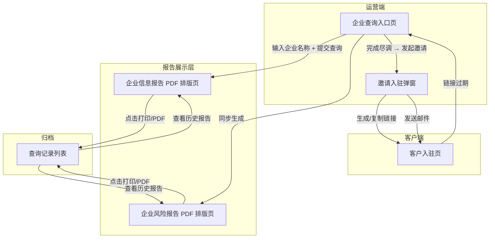

# 产品需求文档 (PRD) — 邀请入驻

---

## 0. 文档基础信息

- **文档标题**：邀请入驻 — 企业尽调 + 邀请触达
- **版本号**：v1.0
- **状态**：草稿
- **作者**：AI PM
- **评审人**：产品 / 研发 / 测试 / 业务代表
- **计划里程碑**：评审 待定 / 提测 待定 / 上线 待定

### 0.1 变更记录

| 版本 | 变更日期 | 变更内容 | 变更人 |
|------|---------|---------|--------|
| v0.1 | 2026-06-06 | 初稿，基于 Demo 反向生成 | AI PM |
| v1.0 | 2026-06-06 | 新增邀请入驻弹窗（链接/邮件双通道）、客户入驻过期逻辑、邀请记录表 | AI PM |

### 0.2 关联链接

- 用户需求(RDD)：`drafts/邀请入驻/2026-06-06-用户需求.md`
- 数据设计：`drafts/邀请入驻/2026-06-06-数据设计.md`
- 需求背景：无（新模块）
- 原型：
  - `demo/员工端-demo/企业信息报告_PDF排版.html`
  - `demo/员工端-demo/企业风险报告_PDF排版.html`

### 0.3 评审记录

| 日期 | 参会人 | 主要问题/结论 | 待办 |
|------|--------|-------------|------|

---

## 1. 需求定义

### 1.1 背景与现状

当前跨境物流平台在邀请新商家/服务商入驻时，运营人员需要手动到天眼查等第三方平台逐个查询目标企业的工商信息和风险状况，再将关键信息摘抄到 Excel 或飞书文档中形成简易尽调报告。单家企业尽调耗时 15-30 分钟，且报告格式因人而异，缺乏标准化和可追溯性。

本模块将企业尽调流程标准化：运营人员在系统内输入企业名称或信用代码，系统自动调用天眼查 API 获取工商信息和风险数据，生成 A4 版式 PDF 报告（企业信息报告 + 企业风险报告），支持一键打印和归档。

### 1.2 目标与成功口径

- **目标**：将单家企业尽调耗时从 15-30 分钟降低到 2 分钟以内，形成标准化归档报告
- **成功口径**：运营人员从输入企业名称到拿到两份完整 PDF 报告的总耗时（含打印），目标 ≤ 120 秒；评估周期为功能上线后 1 个月

### 1.3 范围与边界

- **In Scope（本期 P0）**：
  - 企业信息查询（输入名称/信用代码 → 获取工商信息）
  - 企业风险扫描（自动附带，按分类展示风险明细）
  - 报告打印/PDF 导出（A4 竖版，浏览器打印）
  - 报告归档（查询记录 + PDF 文件存储）
  - 链接邀请（生成专属链接 + 复制含品牌前缀文案）
  - 邮件邀请（填写邮箱 + 模板邮件发送，含域名切换）
  - 邀请记录管理（创建/查看/状态追踪/过期自动流转）
- **Out of Scope**：
  - 客户自助入驻表单页（二期，P1）
  - 批量企业查询（二期）
  - 风险对比分析（二期）
  - 自定义报告模板（二期）
  - 非天眼查数据源接入（二期）

### 1.4 影响范围

- **影响角色**：运营尽调人员、审批管理者
- **依赖系统**：天眼查 API（工商信息接口 + 风险扫描接口）

---

## 2. 枚举字典

> 所有枚举字段的键值对集中定义，研发以此为准。与数据设计 Schema 中的 TinyInt 值保持一致。

| 枚举名 | 值 | 常量名 | 中文 | 适用实体/字段 |
|--------|----|--------|------|-------------|
| LookupStatus | 10 | PENDING | 查询中 | `enterprise_lookup_log.lookup_status` |
| LookupStatus | 20 | SUCCESS | 成功 | `enterprise_lookup_log.lookup_status` |
| LookupStatus | 30 | FAILED | 失败 | `enterprise_lookup_log.lookup_status` |
| ReportType | 10 | INFO_REPORT | 企业信息报告 | `enterprise_report_file.report_type` |
| ReportType | 20 | RISK_REPORT | 企业风险报告 | `enterprise_report_file.report_type` |
| CategoryName | 10 | SELF_RISK | 自身风险 | `enterprise_risk_category.category_name` |
| CategoryName | 20 | PERIPHERAL_RISK | 周边风险 | `enterprise_risk_category.category_name` |
| CategoryName | 30 | WARNING_ALERT | 预警提醒 | `enterprise_risk_category.category_name` |
| CategoryName | 40 | HISTORICAL_RISK | 历史风险 | `enterprise_risk_category.category_name` |
| RiskLevel | 10 | HIGH | 高风险 | `enterprise_risk_detail.risk_level` |
| RiskLevel | 20 | WARNING | 警示 | `enterprise_risk_detail.risk_level` |
| RiskLevel | 30 | INFO | 提示信息 | `enterprise_risk_detail.risk_level` |
| RiskType | 1 | SERIOUS_ILLEGAL | 严重违法 | `enterprise_risk_detail.risk_type` |
| RiskType | 3 | DISHONEST_EXECUTEE | 失信被执行人 | `enterprise_risk_detail.risk_type` |
| RiskType | 5 | EXECUTEE | 被执行人 | `enterprise_risk_detail.risk_type` |
| RiskType | 6 | ADMIN_PENALTY | 行政处罚 | `enterprise_risk_detail.risk_type` |
| RiskType | 7 | ABNORMAL_OPERATION | 经营异常 | `enterprise_risk_detail.risk_type` |
| RiskType | 8 | COURT_DOCUMENT | 裁判文书 | `enterprise_risk_detail.risk_type` |
| RiskType | 9 | EQUITY_PLEDGE | 股权出质 | `enterprise_risk_detail.risk_type` |
| RiskType | 10 | CHATTEL_MORTGAGE | 动产抵押 | `enterprise_risk_detail.risk_type` |
| RiskType | 11 | TAX_ARREARS | 欠税公告 | `enterprise_risk_detail.risk_type` |
| RiskType | 13 | COURT_ANNOUNCEMENT | 开庭公告 | `enterprise_risk_detail.risk_type` |
| RiskType | 14 | COURT_NOTICE | 法院公告 | `enterprise_risk_detail.risk_type` |
| RiskType | 15 | LEGAL_PERSON_CHANGE | 法人变更 | `enterprise_risk_detail.risk_type` |
| RiskType | 20 | CAPITAL_CHANGE | 出资情况变更 | `enterprise_risk_detail.risk_type` |
| RiskType | 21 | EQUITY_FREEZE | 股权冻结 | `enterprise_risk_detail.risk_type` |
| RiskType | 27 | CASE_FILING | 立案信息 | `enterprise_risk_detail.risk_type` |
| RiskType | 41 | EXTERNAL_GUARANTEE | 对外担保 | `enterprise_risk_detail.risk_type` |
| RiskType | 71 | DISHONEST_EXECUTEE_HIST | 失信被执行人(历史) | `enterprise_risk_detail.risk_type` |
| RiskType | 72 | EXECUTEE_HIST | 被执行人(历史) | `enterprise_risk_detail.risk_type` |
| RiskType | 102 | COURT_DOCUMENT_HIST | 裁判文书(历史) | `enterprise_risk_detail.risk_type` |
| InvitationType | 10 | LINK | 链接邀请 | `invitation_record.invitation_type` |
| InvitationType | 20 | EMAIL | 邮件邀请 | `invitation_record.invitation_type` |
| InvitationStatus | 10 | PENDING | 待接受 | `invitation_record.status` |
| InvitationStatus | 20 | ACCEPTED | 已接受 | `invitation_record.status` |
| InvitationStatus | 30 | EXPIRED | 已过期 | `invitation_record.status` |
| InvitationStatus | 40 | CANCELLED | 已取消 | `invitation_record.status` |
| DomainBrand | FEIDIAN | FEIDIAN | 飞点 | `invitation_record.domain_brand` |
| DomainBrand | MOLIAN | MOLIAN | 墨链 | `invitation_record.domain_brand` |

---

## 3. 状态机

### 3.1 查询状态流转

```
[查询中 10] ──{API 调用成功}──→ [成功 20]
     │
     └──{API 超时/报错}──→ [失败 30]
```

| 当前状态 | 操作 | 目标状态 | 触发角色 | 校验条件 |
|---------|------|---------|---------|---------|
| — | 发起查询 | 10 (查询中) | 运营人员 | 输入企业名称或信用代码 |
| 10 (查询中) | API 返回成功 | 20 (成功) | 系统 | API HTTP 200 + 数据解析通过 |
| 10 (查询中) | API 超时/异常 | 30 (失败) | 系统 | API 超时 5s 或返回错误码 |

### 3.2 邀请状态流转

```
[待接受 10] ──{客户提交入驻}──→ [已接受 20]
      │
      ├──{超过有效期}──→ [已过期 30]
      │
      └──{运营取消}──→ [已取消 40]
```

| 当前状态 | 操作 | 目标状态 | 触发角色 | 校验条件 |
|---------|------|---------|---------|---------|
| — | 发起邀请 | 10 (待接受) | 运营人员 | 链接邀请：自动生成；邮件邀请：邮箱格式校验通过 |
| 10 (待接受) | 客户提交入驻信息 | 20 (已接受) | 客户 | 邀请链接有效（未过期、未被取消） |
| 10 (待接受) | 超过有效期（14天） | 30 (已过期) | 系统定时任务 | `NOW() > expires_at` |
| 10 (待接受) | 运营手动取消 | 40 (已取消) | 运营人员 | 仅待接受状态可取消 |

---

## 4. 功能清单与页面映射

| 模块 | 功能点 | 优先级 | 对应页面 | 页面类型 |
|------|--------|--------|---------|---------|
| 邀请入驻 | 企业信息查询 | P0 | 企业查询入口页 | 表单+结果页 |
| 邀请入驻 | 企业信息报告展示 | P0 | 企业信息报告_PDF排版 | 报告页 |
| 邀请入驻 | 企业风险报告展示 | P0 | 企业风险报告_PDF排版 | 报告页 |
| 邀请入驻 | 报告打印/PDF导出 | P0 | 两份报告页（内嵌打印按钮） | 操作按钮 |
| 邀请入驻 | 链接邀请（生成+复制） | P0 | 邀请入驻弹窗 → 通过链接邀请 Tab | 弹窗/表单 |
| 邀请入驻 | 邮件邀请（填写邮箱+发送） | P0 | 邀请入驻弹窗 → 通过邮箱邀请 Tab | 弹窗/表单 |

### 4.1 页面导航关系图



---

## 5. 页面规格

### 5.1 企业查询入口页

**页面信息**：
- **路径**：运营端 → 邀请入驻 → 企业尽调
- **类型**：表单 + 结果页
- **访问角色**：运营尽调人员

**字段表**：

| 字段名 | 中文名 | 类型 | 必填 | 默认值 | 校验规则 | 数据来源 | 备注 |
|--------|--------|------|------|--------|---------|---------|------|
| query_keyword | 企业名称/信用代码 | 文本输入框 | ✅ | — | 至少2个字符，信用代码需恰好18位 | 用户输入 | 支持模糊转为精确查询（优先匹配信用代码） |
| submit_btn | 查询按钮 | 按钮 | — | — | — | — | 点击发起查询，查询中按钮置为 loading 状态 |

**交互行为**：
- [触发查询]：输入企业名称（≥2字符）或信用代码（18位），点击"查询"按钮。按钮进入 loading 状态，禁止重复点击
- [查询成功]：跳转至报告展示页面，同步展示企业信息报告和企业风险报告（Tab 切换或并排展示）
- [查询失败]：Toast 提示错误信息（如"API 调用失败，请稍后重试"或"未找到该企业信息"），按钮恢复可用
- [查询中]：显示骨架屏或加载动画，超时 5 秒后自动提示失败

**关联接口**：
- 查询：`POST /api/enterprise/lookup` (body: { keyword: String })

---

### 5.2 企业信息报告 PDF 排版页

**页面信息**：
- **路径**：运营端 → 邀请入驻 → 企业信息报告
- **类型**：报告展示页（A4 排版）
- **访问角色**：运营尽调人员、审批管理者

**整体布局**：
- A4 纸张容器（宽 800px，A4 比例）
- 蓝色主色调（`#0066cc`）
- 三个内容区块：页眉 + 企业头 + 详情区

**区域一 — 页眉**：

| 元素 | 说明 |
|------|------|
| 报告标题 | 固定"企业信用信息报告"，字号 24px，粗体，蓝色 |
| 生成时间 | 动态显示当前时间，格式"YYYY年M月D日" |
| 数据来源 | 固定"数据来源：天眼查API对接" |

**区域二 — 企业头**：

| 字段名 | 中文名 | 类型 | 说明 |
|--------|--------|------|------|
| company_name | 企业名称 | 文本 | 28px 粗体，黑色 |
| reg_status | 企业状态 | 标签 | 彩色标签 badge。存续/在业=蓝底蓝字，注销=灰底灰字，吊销=红底红字 |
| tags | 企业标签 | 标签组 | 绿色圆角标签，逗号分隔后逐个渲染 |
| legal_person_name | 法定代表人 | 汇总卡片 | 汇总栏卡片内字段 |
| reg_capital | 注册资本 | 汇总卡片 | 汇总栏卡片内字段 |
| estiblish_time | 成立日期 | 汇总卡片 | 格式化 YYYY-MM-DD |
| percentile_score | 天眼评分 | 汇总卡片 | 红色字体，百分制保留两位小数 |

**区域三 — 工商基本信息（表格）**：

| 行 | 字段1(中文) | 字段1(key) | 字段2(中文) | 字段2(key) |
|:---|:---|:---|:---|:---|
| 1 | 统一社会信用代码 | credit_code | 企业名称 | name |
| 2 | 法定代表人 | legal_person_name | 企业状态 | reg_status |
| 3 | 注册资本 | reg_capital | 实收注册资金 | actual_capital |
| 4 | 成立日期 | estiblish_time(格式化) | 核准日期 | approved_time(格式化) |
| 5 | 注册号 | reg_number | 组织机构代码 | org_number |
| 6 | 纳税人识别号 | tax_number | 企业类型 | company_org_type |
| 7 | 营业期限 | from_time 至 to_time(格式化, null 显示"无固定期限") | — | colspan=3 |
| 8 | 登记机关 | reg_institute | — | colspan=3 |
| 9 | 注册地址 | reg_location | — | colspan=3 |
| 10 | 经营范围 | business_scope | — | colspan=3，max-height 150px，溢出隐藏 |

**区域四 — 行业与规模信息（表格）**：

| 行 | 字段1(中文) | 字段1(key) | 字段2(中文) | 字段2(key) |
|:---|:---|:---|:---|:---|
| 1 | 所属行业 | industry | 国民经济行业分类 | category > category_middle |
| 2 | 人员规模 | staff_num_range | 参保人数 | social_staff_num + "人" |
| 3 | 行政区划 | base + city + district 拼接 | 经济功能区 | economic_zone |
| 4 | 规上企业 | above_scale(默认"否") | — | colspan=3 |

**区域五 — 附加与变更信息（表格）**：

| 行 | 字段1(中文) | 字段1(key) | 字段2(中文) | 字段2(key) |
|:---|:---|:---|:---|:---|
| 1 | 企业简称 | alias | 英文名 | english_name |
| 2 | 曾用名 | history_names | — | colspan=3 |
| 3 | 股票信息 | bond_name (bond_num) - bond_type | — | 条件渲染: bond_name 或 bond_num 存在时显示 |
| 4 | 注销/吊销记录 | cancel_date(注销日期: 日期，原因: cancel_reason) / revoke_date(吊销日期: 日期，原因: revoke_reason) | — | 条件渲染: cancel_date 或 revoke_date 存在时显示 |

**交互行为**：
- [打印/PDF]：页面顶部显示"保存为 PDF / 打印"按钮（class: no-print，打印时自动隐藏）。点击调用 `window.print()`
- [加载状态]：数据加载中显示骨架屏，数据为空时各字段显示"—"
- [打印样式]：
  - A4 竖版 `@page { size: A4 portrait; margin: 1.5cm; }`
  - 确保背景色和边框打印：`-webkit-print-color-adjust: exact; print-color-adjust: exact;`
  - 表格分区避免跨页：`.section { page-break-inside: avoid; }`
  - 打印时隐藏 `.no-print` 元素，移除 A4 容器阴影

**关联接口**：
- 数据获取：`GET /api/enterprise/info/{lookup_id}` (返回企业工商信息完整 JSON)

---

### 5.3 企业风险报告 PDF 排版页

**页面信息**：
- **路径**：运营端 → 邀请入驻 → 企业风险报告
- **类型**：报告展示页（A4 排版）
- **访问角色**：运营尽调人员、审批管理者

**整体布局**：
- A4 纸张容器（宽 800px）
- 红色主色调（`#d9363e`）
- 浅红背景色（`#fff1f0`）
- 五个内容层级：页眉 + 企业概览头 + 风险分类区块 + 风险明细表格 + 空状态

**区域一 — 页眉**：

| 元素 | 说明 |
|------|------|
| 报告标题 | 固定"企业风险全景洞察报告"，字号 24px，粗体，红色，含警告图标 |
| 查询主体 | 显示被查询企业名称 |
| 生成时间 | 动态显示当前时间，格式"YYYY年M月D日 HH:mm" |

**区域二 — 企业概览**：
- 居中卡片，浅红背景（`#fff1f0`），红色边框
- 企业名称（24px 粗体）
- 风险总数提示："系统共扫描出相关风险信息 **N** 条"

**区域三 — 风险分类区块（循环渲染）**：

| 属性 | 说明 |
|------|------|
| 分类标题 | 分类名称（自身风险/周边风险/预警提醒/历史风险） |
| 条目计数 | "共 N 条"灰色标签 |
| 排序 | 固定顺序：自身风险 > 周边风险 > 预警提醒 > 历史风险 |

**区域四 — 风险明细（每个分类下的子列表）**：

每个风险类型为一组，包含：

| 元素 | 说明 |
|------|------|
| 风险标签 badge | 高风险=红底红字, 警示=黄底黄字, 提示信息=蓝底蓝字 |
| 风险类型名称 | 根据 risk_type 枚举映射为中文 |
| 条目计数 | "(N 条)" |
| 明细表格 | 列：序号 / 关联公司 / 标题案由 / 描述详情 |
| 关联公司 | 自身风险时为空，显示灰色"自身信息"占位；周边风险时显示具体公司名 |
| 左侧色条 | 高风险=红色 `#cf1322`, 警示=橙色 `#faad14`, 提示信息=蓝色 `#1890ff` |

**空状态处理**：

| 场景 | 展示内容 |
|------|---------|
| 某个分类无风险 | 灰色虚线边框区域，显示"未发现该类别的风险信息" |
| 全部无风险 | 居中大区域，绿色勾选图标 + "太棒了，未查询到任何企业风险记录" |

**交互行为**：
- [打印/PDF]：页面顶部显示"保存风险报告为 PDF"按钮（class: no-print）。点击调用 `window.print()`
- [打印样式]：同企业信息报告，额外增加 `.risk-category { page-break-inside: avoid; }` 和 `.detail-table { page-break-inside: avoid; }`
- [空状态]：API 返回空数据时自动展示对应空状态
- [风险等级映射]：API 返回的 tag 字符串（"高风险"/"警示"/"提示信息"）映射为对应的颜色和样式 class

**关联接口**：
- 数据获取：`GET /api/enterprise/risk/{lookup_id}` (返回企业风险完整 JSON)

---

### 5.4 邀请入驻弹窗

**页面信息**：
- **路径**：运营端 → 邀请入驻 → 发起邀请（弹窗）
- **类型**：弹窗/表单（双 Tab）
- **访问角色**：运营尽调人员
- **触发方式**：在企业查询入口页或报告页点击"发起邀请"按钮，弹出 Modal

**整体布局**：
- Modal 弹窗，宽度 640px
- 顶部标题"邀请入驻"
- Tab 切换栏：通过链接邀请 | 通过邮箱邀请
- 底部操作区：返回 + 主操作按钮（复制/发送）

---

#### 5.4.1 Tab 1 — 通过链接邀请

**字段表**：

| 字段名 | 中文名 | 类型 | 必填 | 默认值 | 校验规则 | 数据来源 | 备注 |
|--------|--------|------|------|--------|---------|---------|------|
| invitation_link | 专属邀请链接 | 只读文本框 | ✅ | 系统自动生成 | — | 后端 `POST /api/invitation/generate` | 格式: `{base_url}/invite/{uuid}`，不可编辑 |
| expires_hint | 有效期提示 | 静态文本 | — | "链接有效期14天" | — | 系统配置 | 灰色小字显示在链接输入框下方 |
| copy_btn | 复制邀请链接 | 按钮 | — | — | — | — | 点击复制链接到剪贴板，复制内容含前缀文案 |
| cancel_btn | 返回 | 按钮 | — | — | — | — | 关闭弹窗，不保存 |

**交互行为**：
- [弹窗打开]：自动调用 `POST /api/invitation/generate` 生成专属邀请链接，链接输入框展示生成的 URL，页面加载时显示骨架屏
- [复制链接]：点击"复制邀请链接"按钮，将以下内容写入剪贴板：
  ```
  【**】诚挚的邀请您入驻【{domain_name}】跨境供应链系统，点击链接处理：{invitation_link}
  ```
  其中 `{domain_name}` 根据当前访问域名自动替换为"飞点"或"墨链"。复制成功后 Toast 提示"邀请链接已复制"
- [幂等设计]：同一运营人员对同一企业（相同 lookup_id）再次打开弹窗时，若已有有效邀请记录（status=待接受，未过期），复用已有链接而非生成新链接
- [返回]：关闭弹窗，不做任何保存操作。已生成的链接在后台记录中保留

---

#### 5.4.2 Tab 2 — 通过邮箱邀请

**字段表**：

| 字段名 | 中文名 | 类型 | 必填 | 默认值 | 校验规则 | 数据来源 | 备注 |
|--------|--------|------|------|--------|---------|---------|------|
| invitee_email | 受邀者邮箱 | 文本框(邮箱) | ✅ | — | 标准邮箱格式校验（含 @ 和有效域名） | 用户输入 | 输入框 placeholder: "请输入受邀者邮箱地址" |
| sender_display | 发件人 | 只读文本 | ✅ | 系统默认虚拟邮箱地址 | — | 系统配置 | 不可编辑 |
| email_subject | 邮件主题 | 只读文本 | ✅ | 根据域名自动生成 | — | 系统生成 | 飞点域名 → "飞点跨境供应链入驻邀请"；墨链域名 → "墨链跨境供应链入驻邀请" |
| email_content | 邮件内容 | 只读文本域(多行) | ✅ | 完整模板 | — | 系统模板 | 占位符 `[邀请链接]` 发送时替换 |
| send_btn | 发送 | 按钮 | — | — | — | — | 校验邮箱后发送；发送中按钮置为 loading |
| cancel_btn | 返回 | 按钮 | — | — | — | — | 关闭弹窗，不保存 |

**邮件内容模板**（研发实现时以此为准）：

```
尊敬的客户：
您好！

非常荣幸能邀请贵司入驻我们的供应链服务平台。

为了让您更便捷地完成入驻流程，我们为您准备了专属邀请链接：[邀请链接]

请您点击链接，按照页面指引填写企业信息、上传相关资质文件。我们已为您附上《客户档案表》，请参考填写以确保信息准确。

在入驻过程中，如您有任何疑问或需要协助，请问直接在该邮件上回复，请联系您的专属销售：[发送邀请人的公司邮箱地址]

期待与贵司建立长期稳定的合作，携手拓展跨境业务，共创价值！

顺颂商祺！
```

**交互行为**：
- [弹窗打开]：加载邮件模板，`[邀请链接]` 和 `[发送邀请人的公司邮箱地址]` 以占位符形式展示在文本域中，用户不可编辑
- [发送]：点击"发送"按钮前：
  1. 校验受邀者邮箱格式（前端 + 后端双重校验），不通过时输入框下方红色提示"请输入有效的邮箱地址"
  2. 调用 `POST /api/invitation/generate` 生成邀请链接（若尚未生成）
  3. 将 `[邀请链接]` 替换为实际邀请链接，将 `[发送邀请人的公司邮箱地址]` 替换为当前运营人员的公司邮箱
  4. 调用邮件发送服务
  5. 发送成功后 Toast 提示"邀请邮件已发送"，弹窗关闭
  6. 发送失败时 Toast 提示"邮件发送失败，请稍后重试"，弹窗保持打开
- [按钮状态]：发送中按钮显示 loading 动画，禁止重复点击
- [返回]：关闭弹窗，不做保存

**关联接口**：
- 生成邀请链接：`POST /api/invitation/generate` (body: `{ lookup_id?: BigInt, invitation_type: 10|20 }`) → `{ id, invitation_link, invite_token, expires_at }`
- 发送邮件邀请：`POST /api/invitation/send-email` (body: `{ invitation_id: BigInt, invitee_email: String }`) → `{ success: Boolean }`

---

## 6. 业务规则

| 编号 | 触发点 | 条件/公式 | 输出 | 异常处理 |
|------|--------|----------|------|---------|
| R01 | 发起查询 | 输入企业名称（≥2字符）或信用代码（18位） | 发起 API 请求 | 输入不符合格式时，按钮置灰不可点击，输入框下方红色提示"请输入至少2个字符"或"信用代码需为18位" |
| R02 | API 调用 | 调用天眼查工商 API + 风险 API | 返回企业信息 + 风险数据 | 超时 5s 返回"查询超时，请稍后重试"；HTTP 非 200 返回"API 调用失败(错误码:xxx)" |
| R03 | 天眼评分展示 | `score_display = Math.floor(percentile_score / 100)` 保留两位小数 | 页面上显示"XX.XX 分"，红色字体 | percentile_score 为 null 时显示"—" |
| R04 | 日期格式化 | 毫秒时间戳 → `YYYY-MM-DD` | 显示日期字符串 | 时间戳为 null/0/undefined 时显示"—" |
| R05 | 营业期限结束 | to_time 为空时 | 显示"无固定期限" | — |
| R06 | 企业状态标签 | reg_status 包含"注销"→ 灰色标签；包含"吊销"→ 红色标签；其他 → 蓝色标签 | 对应 CSS class | reg_status 为空时不显示标签 |
| R07 | 股票信息行 | bond_name 或 bond_num 任一存在 | 显示股票信息行 | 两者均无时不渲染该行 |
| R08 | 注销/吊销行 | cancel_date 或 revoke_date 任一存在 | 显示注销/吊销记录行。cancel_date 存在时显示"注销日期: YYYY-MM-DD (原因: xxx)"；revoke_date 存在时显示"吊销日期: YYYY-MM-DD (原因: xxx)" | 两者均无时不渲染该行 |
| R09 | 风险总数计算 | `total_count = SUM(各category.count)` | 页面显示总数 | — |
| R10 | 风险分类排序 | 自身风险(sort=10) > 周边风险(sort=20) > 预警提醒(sort=30) > 历史风险(sort=40) | 页面按固定顺序展示 | — |
| R11 | 风险明细排序 | 分类内按风险等级排序：高风险(10) > 警示(20) > 提示信息(30) | 页面按优先级展示 | — |
| R12 | 关联公司为空 | detail.companyName 为空或空字符串 | 显示灰色"自身信息"占位 | — |
| R13 | 打印行为 | 用户点击"保存为 PDF / 打印" | 调用 `window.print()`，浏览器原生打印对话框 | — |
| R14 | 打印样式隐藏 | 打印时 | 所有 `.no-print` 元素 `display: none` | — |
| R15 | 背景色打印 | 打印时 | `-webkit-print-color-adjust: exact; print-color-adjust: exact;` | 确保表格边框、标签颜色在 PDF 中正确渲染 |
| R16 | 邀请链接生成 | 调用 `POST /api/invitation/generate` | 生成 UUID 格式的 invite_token，拼接 `{base_url}/invite/{token}` | 生成失败返回 500 |
| R17 | 链接有效期 | 创建时间 + 14天 | `expires_at = NOW() + 14 days` | — |
| R18 | 复制链接 | 用户点击"复制邀请链接" | 剪贴板内容 = 前缀文案 + 链接，前缀中的品牌名根据域名切换 | `navigator.clipboard.writeText()` 失败时降级为 `execCommand('copy')` |
| R19 | 链接幂等 | 同一运营人员对同一企业再次请求邀请 | 若存在有效邀请（待接受 + 未过期），复用已有链接；否则生成新链接 | — |
| R20 | 邮件占位符替换 | 发送邮件前 | `[邀请链接]` → 实际链接；`[发送邀请人的公司邮箱地址]` → 当前运营人员公司邮箱 | 任一占位符未替换时阻断发送 |
| R21 | 邮件主题域名切换 | 邮件邀请 Tab 加载时 | 飞点域名 → "飞点跨境供应链入驻邀请"；墨链域名 → "墨链跨境供应链入驻邀请" | 从 `window.location.hostname` 或系统配置判断 |
| R22 | 链接有效性校验 | 客户点击邀请链接访问入驻页 | 校验：link 存在 + status=待接受 + 未过期 + 未被取消 | 任一不满足 → 展示对应错误页 |
| R23 | 链接过期展示 | 链接过期时 | 页面展示"邀请链接已过期，请联系您的专属销售重新发送入驻邀请链接"，表单隐藏 | 不展示任何操作入口 |
| R24 | 链接已使用 | 同一链接二次访问 | 展示"该邀请链接已被使用"，不可重复提交 | status 已变为 已接受 |
| R25 | 邀请状态过期流转 | 定时任务每小时执行 | `UPDATE invitation_record SET status = 30 WHERE status = 10 AND expires_at < NOW()` | 更新失败时记录日志并重试 |

---

## 7. 权限矩阵

| 操作 | 运营尽调人员 | 审批管理者 | 系统管理员 |
|------|:---:|:---:|:---:|
| 企业查询入口 | ✅ | ✅ | ✅ |
| 查看企业信息报告 | ✅ | ✅ | ✅ |
| 查看企业风险报告 | ✅ | ✅ | ✅ |
| 打印/导出 PDF | ✅ | ✅ | ✅ |
| 查看查询历史记录 | ✅ | ✅ | ✅ |

---

## 8. 接口清单

| 接口 | 方法 | 路径 | 触发页面 | 请求参数 | 返回字段 | 失败处理 |
|------|------|------|---------|---------|---------|---------|
| 发起企业查询 | POST | /api/enterprise/lookup | 企业查询入口页 | `{ keyword: String }` | `{ lookup_id, status, company_name, credit_code }` | 超时5s返回500；未找到返回404 |
| 获取企业信息 | GET | /api/enterprise/info/{lookup_id} | 企业信息报告页 | `lookup_id` (path) | 完整 EnterpriseInfo JSON（见数据设计§2.2） | 记录不存在返回404 |
| 获取企业风险 | GET | /api/enterprise/risk/{lookup_id} | 企业风险报告页 | `lookup_id` (path) | 完整 RiskReport JSON（含 categories 和 details） | 记录不存在返回404 |
| 生成报告文件 | POST | /api/enterprise/report/generate | 报告页(打印时触发) | `{ lookup_id, report_type: 10|20 }` | `{ file_id, file_path }` | 生成失败返回500，提示"报告生成失败" |
| 获取报告文件 | GET | /api/enterprise/report/{file_id}/download | 归档列表 | `file_id` (path) | PDF 文件流 | 文件不存在返回404 |
| 生成邀请链接 | POST | /api/invitation/generate | 邀请入驻弹窗 | `{ lookup_id?: BigInt, invitation_type: 10\|20 }` | `{ id, invitation_link, invite_token, expires_at }` | 生成失败返回500 |
| 发送邮件邀请 | POST | /api/invitation/send-email | 邀请入驻弹窗 → 邮箱邀请 Tab | `{ invitation_id: BigInt, invitee_email: String }` | `{ success: Boolean }` | 邮件服务不可用返回500 |
| 校验邀请链接 | GET | /api/invitation/validate/{token} | 客户入驻页（客户端） | `token` (path) | `{ valid: Boolean, status, expires_at, error_msg? }` | token 不存在返回404 |

---

## 9. 错误提示文案汇总

| 编号 | 触发条件 | 文案 | 类型 |
|------|---------|------|------|
| E01 | 输入框为空时点击查询 | "请输入企业名称或统一社会信用代码" | 阻断 |
| E02 | 输入字符数不足（<2） | "请输入至少2个字符" | 阻断 |
| E03 | 信用代码格式错误（非18位） | "统一社会信用代码需为18位" | 阻断 |
| E04 | API 调用超时（>5s） | "查询超时，请稍后重试" | 阻断 |
| E05 | API 返回错误码 | "API 调用失败（错误码：{code}），请联系管理员" | 阻断 |
| E06 | 未找到企业信息 | "未找到该企业信息，请检查企业名称或信用代码是否正确" | 阻断 |
| E07 | 报告文件生成失败 | "报告生成失败，请稍后重试" | 阻断 |
| E08 | 报告文件不存在 | "报告文件不存在或已被删除" | 阻断 |
| E09 | 数据为空 | 各字段显示"—"占位符 | 提示 |
| E10 | 无风险数据 | "太棒了，未查询到任何企业风险记录" / "未发现该类别的风险信息" | 提示 |
| E11 | 邀请链接生成失败 | "邀请链接生成失败，请稍后重试" | 阻断 |
| E12 | 邮箱格式不合法 | "请输入有效的邮箱地址" | 阻断 |
| E13 | 邮箱为空时点击发送 | "请输入受邀者邮箱地址" | 阻断 |
| E14 | 邮件发送失败 | "邮件发送失败，请稍后重试" | 阻断 |
| E15 | 邀请链接已过期 | "邀请链接已过期，请联系您的专属销售重新发送入驻邀请链接" | 阻断 |
| E16 | 邀请链接已被使用 | "该邀请链接已被使用" | 阻断 |

---

## 10. 验收标准

| 编号 | 验收项 | 验收方式 | 通过标准 | 关联 AC |
|------|--------|---------|---------|---------|
| A01 | 输入企业名称发起查询 | 手动 | 输入≥2字符后点击查询，5秒内返回企业信息报告 | AC01 |
| A02 | 输入信用代码发起查询 | 手动 | 输入18位信用代码，成功查询 | AC01 |
| A03 | 企业信息报告展示完整字段 | 手动 | 报告包含工商基本信息+行业规模+附加变更，空字段显示"—" | AC02 |
| A04 | 企业状态标签颜色正确 | 手动 | 存续=蓝色、注销=灰色、吊销=红色 | AC03 |
| A05 | 天眼评分格式化正确 | 手动 | 万分制转为百分制，保留两位小数 | AC04 |
| A06 | 风险报告同步生成 | 手动 | 查询企业信息后，风险报告同步可用，展示四大分类 | AC11, AC12 |
| A07 | 风险等级颜色区分 | 手动 | 高风险=红色、警示=橙色、提示信息=蓝色 | AC13 |
| A08 | 空状态展示正确 | 手动 | 无分类数据时显示"未发现"；全局无数据时显示"太棒了" | AC14 |
| A09 | 风险明细表格展示 | 手动 | 含序号、关联公司、标题、描述四列 | AC15 |
| A10 | 打印功能正常 | 手动 | 点击按钮触发浏览器打印对话框，A4 竖版，无操作按钮 | AC21 |
| A11 | 打印样式不跨页断裂 | 手动 | 表格行和风险分类区块不在跨页处断裂 | AC22 |
| A12 | 报告文件归档 | 手动/自动化 | 打印后归档表有记录，可重新下载 | AC23 |
| A13 | 链接邀请 Tab 展示 | 手动 | 弹窗打开后"通过链接邀请"Tab 展示只读链接、"复制邀请链接"按钮、"返回"按钮，链接有效期14天提示 | AC31 |
| A14 | 复制链接含前缀 | 手动 | 点击复制链接后，粘贴内容包含前缀文案 + 邀请链接，品牌名（飞点/墨链）根据域名切换 | AC32, AC35 |
| A15 | 邮箱邀请 Tab 展示 | 手动 | "通过邮箱邀请"Tab 展示受邀者邮箱输入框、发件人（只读）、邮件主题（只读，含域名切换）、邮件内容模板（只读） | AC33 |
| A16 | 邮件发送成功 | 手动 | 填写合法邮箱后点击发送，Toast 提示"邀请邮件已发送"，邀请记录创建成功，占位符已替换 | AC34 |
| A17 | 链接过期提示 | 手动 | 访问已过期邀请链接（修改系统时间或直接查过期记录），展示过期提示文案，表单隐藏 | AC42 |
| A18 | 链接已使用提示 | 手动 | 对已接受的邀请链接二次访问，展示"该邀请链接已被使用" | AC43 |
| A19 | 链接幂等复用 | 手动/自动化 | 同一运营人员对同一企业二次打开链接邀请 Tab，复用已有有效链接而非生成新链接 | AC35 |
| A10 | 打印功能正常 | 手动 | 点击按钮触发浏览器打印对话框，A4 竖版，无操作按钮 | AC21 |
| A11 | 打印样式不跨页断裂 | 手动 | 表格行和风险分类区块不在跨页处断裂 | AC22 |
| A12 | 报告文件归档 | 手动/自动化 | 打印后归档表有记录，可重新下载 | AC23 |

---

## 11. 附录

### 术语表

| 术语 | 解释 |
|------|------|
| 天眼查 | 第三方企业工商信息查询平台，提供企业工商信息 API 和风险扫描 API |
| 尽调报告 | 尽职调查报告，在入驻审批前对目标企业进行的背景调查文档 |
| A4 竖版 | 国际标准纸张尺寸 210mm x 297mm，纵向排版 |
| PDF 排版 | 面向打印/PDF 导出的静态页面布局，区别于交互式 CRUD 页面 |

### 原型链接

- 企业信息报告 Demo：`demo/员工端-demo/企业信息报告_PDF排版.html`
- 企业风险报告 Demo：`demo/员工端-demo/企业风险报告_PDF排版.html`

### 上游文档

- 用户需求(RDD)（完整业务流程+字段表）：`drafts/邀请入驻/2026-06-06-用户需求.md`
- 数据设计（完整 Schema+ER 图）：`drafts/邀请入驻/2026-06-06-数据设计.md`

---

## 质量检查

- [x] 文档基础信息是否完整（版本/状态/评审人）？
- [x] 业务规则是否编号（R01-R15）？
- [x] 验收标准是否可测试？
- [x] 条件必填章节是否已填写或标注"无"？
- [x] 权限矩阵是否覆盖所有角色？
- [x] 异常处理是否覆盖（含16条错误提示文案）？
- [x] 枚举字典是否覆盖所有枚举字段（含邀请新增枚举）？
- [x] 页面规格是否覆盖两份报告的所有区域布局 + 邀请入驻弹窗双Tab？
- [x] 邀请邮件模板是否完整（含占位符替换规则）？
- [x] 链接过期/已使用的异常处理是否覆盖？
