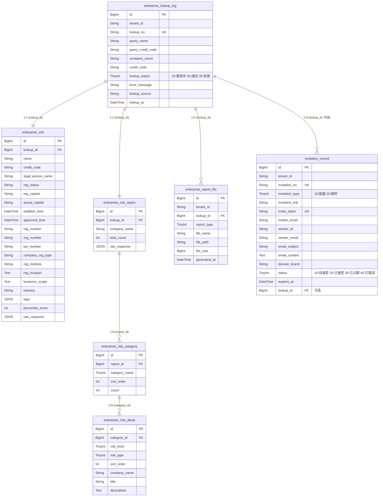

# 数据设计 — 邀请入驻

> **文档版本**: v2.0 | **日期**: 2026-06-06 | **作者**: AI PM
> **上游文档**: `2026-06-06-用户需求.md` (v2.0，含企业尽调 + 邀请触达)

---

## 一、实体清单 x 表映射

| 实体名称 | 对应表/子表 | 映射方式 | 说明 |
|----------|------------|---------|------|
| 企业工商信息 | `enterprise_info` | 独立表 | 从天眼查 API 返回的企业工商数据快照，以查询记录为聚合根存储 |
| 企业风险扫描 | `enterprise_risk_report` | 独立表 | 一次查询对应一条风险报告汇总 |
| 风险分类 | `enterprise_risk_category` | 1:N 子表 | 通过 `report_id` 关联报告，存储四大分类 |
| 风险明细 | `enterprise_risk_detail` | 1:N 子表 | 通过 `category_id` 关联分类，存储每条具体风险 |
| 查询记录 | `enterprise_lookup_log` | 聚合根表 | 每次查询生成一条记录，关联工商信息和风险报告 |
| 报告文件 | `enterprise_report_file` | 独立表 | PDF 文件存储路径/URL，关联查询记录 |
| 邀请记录 | `invitation_record` | 独立表 | 记录每次邀请操作（链接/邮件），含链接、过期时间、状态 |
| 企业标签 | `enterprise_tag` | 纯逻辑实体 | 嵌入 `enterprise_info.tags` 的 JSON 数组字段，不建独立表 |
| 风险类型枚举 | — | 枚举字典 | 代码层常量定义，不建表 |

---

## 二、逐表字段清单

### 2.1 查询记录表

**表名**: `enterprise_lookup_log` | **对应实体**: QueryLog

> **设计说明**: 记录每次企业查询的元信息，作为聚合根关联工商信息和风险报告。是审计追溯的核心表。

| 字段名 (En) | 字段名 (Cn) | 类型 (Type) | 必填 | 约束/索引 | 枚举/备注 |
|:---|:---|:---|:---|:---|:---|
| `id` | 主键 | BigInt | Yes | **PK** | 雪花ID |
| `tenant_id` | 租户ID | String(32) | Yes | Index | SaaS 数据隔离 |
| `lookup_no` | 查询编号 | String(32) | Yes | **Unique** | 规则: LU+yyyyMMdd+6位SEQ |
| `query_name` | 查询名称 | String(200) | Yes | — | 用户输入的企业名称 |
| `query_credit_code` | 查询信用代码 | String(18) | — | Index | 用户输入的信用代码（可选） |
| `company_name` | 企业名称 | String(200) | Yes | — | API 返回的正式企业全称 |
| `credit_code` | 统一信用代码 | String(18) | Yes | — | API 返回的信用代码，用于缓存 key |
| `lookup_status` | 查询状态 | TinyInt | Yes | Index | 10:查询中, 20:成功, 30:失败 |
| `error_message` | 错误信息 | String(500) | — | — | 查询失败时的错误详情 |
| `lookup_source` | 数据来源 | String(50) | Yes | — | 固定值: "tianyancha" |
| `lookup_at` | 查询时间 | DateTime | Yes | — | 查询发起时间 |
| `created_at` | 创建时间 | DateTime | Yes | — | 自动生成 |
| `created_by` | 创建人 | String(64) | Yes | — | 当前运营人员 |
| `updated_at` | 更新时间 | DateTime | Yes | — | 自动维护 |
| `updated_by` | 更新人 | String(64) | Yes | — | 当前用户 |
| `is_deleted` | 软删除标识 | Boolean | Yes | — | Default: false |
| `version` | 乐观锁版本 | Int | Yes | — | 并发控制，每次更新 +1 |

**关联关系**:
- `One-to-One` with `enterprise_info` (通过 `id` → `lookup_id`)
- `One-to-One` with `enterprise_risk_report` (通过 `id` → `lookup_id`)
- `One-to-Many` with `enterprise_report_file` (通过 `id` → `lookup_id`)

---

### 2.2 企业工商信息表

**表名**: `enterprise_info` | **对应实体**: EnterpriseInfo

> **设计说明**: 存储从天眼查 API 返回的企业工商信息完整快照。每条记录属于一次查询，不跨查询共享（每次查询取最新数据）。

| 字段名 (En) | 字段名 (Cn) | 类型 (Type) | 必填 | 约束/索引 | 枚举/备注 |
|:---|:---|:---|:---|:---|:---|
| `id` | 主键 | BigInt | Yes | **PK** | 雪花ID |
| `lookup_id` | 查询记录ID | BigInt | Yes | **FK**, Index | 关联 `enterprise_lookup_log.id` |
| `name` | 企业名称 | String(200) | Yes | — | API 返回的全称 |
| `credit_code` | 统一社会信用代码 | String(18) | Yes | Index | 18位 |
| `legal_person_name` | 法定代表人 | String(100) | — | — | — |
| `reg_status` | 企业状态 | String(20) | — | — | "存续"/"在业"/"注销"/"吊销" |
| `reg_capital` | 注册资本 | String(50) | — | — | 如"20000万人民币" |
| `actual_capital` | 实收注册资金 | String(50) | — | — | 如"20000万人民币" |
| `estiblish_time` | 成立日期 | DateTime | — | — | 毫秒时间戳 |
| `approved_time` | 核准日期 | DateTime | — | — | 毫秒时间戳 |
| `from_time` | 营业期限起 | DateTime | — | — | 毫秒时间戳 |
| `to_time` | 营业期限止 | DateTime | — | — | 无固定期限时为 null |
| `reg_number` | 注册号 | String(50) | — | — | — |
| `org_number` | 组织机构代码 | String(20) | — | — | — |
| `tax_number` | 纳税人识别号 | String(20) | — | — | — |
| `company_org_type` | 企业类型 | String(100) | — | — | 如"有限责任公司（法人独资）" |
| `reg_institute` | 登记机关 | String(200) | — | — | — |
| `reg_location` | 注册地址 | String(500) | — | — | — |
| `business_scope` | 经营范围 | Text | — | — | 长文本 |
| `industry` | 所属行业 | String(100) | — | — | 一级分类 |
| `category` | 国民经济分类 | String(100) | — | — | 总分类路径 |
| `category_middle` | 国民经济细分 | String(100) | — | — | 二级分类 |
| `staff_num_range` | 人员规模 | String(50) | — | — | 如"10000人以上" |
| `social_staff_num` | 参保人数 | Int | — | — | — |
| `base` | 省 | String(20) | — | — | 如"京" |
| `city` | 市 | String(50) | — | — | 如"北京市" |
| `district` | 区 | String(50) | — | — | 如"海淀区" |
| `economic_zone` | 经济功能区 | String(200) | — | — | — |
| `above_scale` | 规上企业 | String(10) | — | — | "是"/"否" |
| `alias` | 企业简称 | String(100) | — | — | — |
| `english_name` | 英文名 | String(200) | — | — | — |
| `history_names` | 曾用名 | Text | — | — | 逗号分隔 |
| `bond_name` | 股票名称 | String(100) | — | — | — |
| `bond_num` | 股票代码 | String(20) | — | — | — |
| `bond_type` | 股票类型 | String(20) | — | — | A股/港股/美股 |
| `cancel_date` | 注销日期 | DateTime | — | — | — |
| `cancel_reason` | 注销原因 | String(200) | — | — | — |
| `revoke_date` | 吊销日期 | DateTime | — | — | — |
| `revoke_reason` | 吊销原因 | String(200) | — | — | — |
| `tags` | 企业标签 | JSON | — | — | 数组: ["高新技术企业","专精特新",...] |
| `percentile_score` | 天眼评分 | Int | — | — | 万分制原始值（如 9980） |
| `is_micro_ent` | 是否小微企业 | TinyInt | — | — | 0:否, 1:是 |
| `raw_response` | 原始API响应 | JSON | — | — | 完整的 API 原始返回，用于问题排查 |
| `created_at` | 创建时间 | DateTime | Yes | — | 自动生成 |

> **设计说明**: 该表不含标准字段 `updated_at`/`is_deleted`/`version`，因为企业信息为 API 快照，一次写入后不再修改。

**关联关系**:
- `Many-to-One` with `enterprise_lookup_log` (通过 `lookup_id`)

---

### 2.3 企业风险报告表

**表名**: `enterprise_risk_report` | **对应实体**: EnterpriseRiskReport

> **设计说明**: 存储一次风险查询的汇总信息，包括风险条目总数。具体风险明细通过子表存储。

| 字段名 (En) | 字段名 (Cn) | 类型 (Type) | 必填 | 约束/索引 | 枚举/备注 |
|:---|:---|:---|:---|:---|:---|
| `id` | 主键 | BigInt | Yes | **PK** | 雪花ID |
| `lookup_id` | 查询记录ID | BigInt | Yes | **FK**, Index | 关联 `enterprise_lookup_log.id` |
| `company_name` | 查询企业 | String(200) | Yes | — | 被查询企业全称 |
| `total_count` | 风险总数 | Int | Yes | — | 所有分类条目合计 |
| `raw_response` | 原始API响应 | JSON | — | — | 完整的 API 原始返回 |
| `created_at` | 创建时间 | DateTime | Yes | — | 自动生成 |

**关联关系**:
- `Many-to-One` with `enterprise_lookup_log` (通过 `lookup_id`)
- `One-to-Many` with `enterprise_risk_category` (通过 `id` → `report_id`)

---

### 2.4 风险分类表

**表名**: `enterprise_risk_category` | **对应实体**: RiskCategory

> **设计说明**: 存储一次风险报告下的四大分类（自身/周边/预警/历史），每条记录含该分类的条目计数。

| 字段名 (En) | 字段名 (Cn) | 类型 (Type) | 必填 | 约束/索引 | 枚举/备注 |
|:---|:---|:---|:---|:---|:---|
| `id` | 主键 | BigInt | Yes | **PK** | 雪花ID |
| `report_id` | 报告ID | BigInt | Yes | **FK**, Index | 关联 `enterprise_risk_report.id` |
| `category_name` | 分类名称 | TinyInt | Yes | — | 10:自身风险, 20:周边风险, 30:预警提醒, 40:历史风险 |
| `sort_order` | 排序 | Int | Yes | — | 10/20/30/40，固定排序 |
| `count` | 条目数 | Int | Yes | — | 该分类下风险明细总数 |
| `created_at` | 创建时间 | DateTime | Yes | — | 自动生成 |

**关联关系**:
- `Many-to-One` with `enterprise_risk_report` (通过 `report_id`)
- `One-to-Many` with `enterprise_risk_detail` (通过 `id` → `category_id`)

---

### 2.5 风险明细表

**表名**: `enterprise_risk_detail` | **对应实体**: RiskDetail

> **设计说明**: 存储每一条具体的风险记录。关联风险分类，存储风险等级、类型和详细描述。

| 字段名 (En) | 字段名 (Cn) | 类型 (Type) | 必填 | 约束/索引 | 枚举/备注 |
|:---|:---|:---|:---|:---|:---|
| `id` | 主键 | BigInt | Yes | **PK** | 雪花ID |
| `category_id` | 分类ID | BigInt | Yes | **FK**, Index | 关联 `enterprise_risk_category.id` |
| `risk_level` | 风险等级 | TinyInt | Yes | — | 10:高风险, 20:警示, 30:提示信息 |
| `risk_type` | 风险类型 | TinyInt | Yes | Index | 枚举值见下表 |
| `sort_order` | 排序 | Int | Yes | — | 明细在报告中的展示顺序 |
| `company_name` | 关联公司 | String(200) | — | — | 周边风险时填关联公司名，自身风险时为空 |
| `title` | 标题 | String(500) | Yes | — | 风险事件标题或案由 |
| `description` | 描述 | Text | Yes | — | 详细描述（案号、金额、日期等） |
| `created_at` | 创建时间 | DateTime | Yes | — | 自动生成 |

**风险类型枚举**:

| 值 | 常量名 | 中文名 |
|:---|:---|:---|
| 1 | SERIOUS_ILLEGAL | 严重违法 |
| 3 | DISHONEST_EXECUTEE | 失信被执行人 |
| 5 | EXECUTEE | 被执行人 |
| 6 | ADMIN_PENALTY | 行政处罚 |
| 7 | ABNORMAL_OPERATION | 经营异常 |
| 8 | COURT_DOCUMENT | 裁判文书 |
| 9 | EQUITY_PLEDGE | 股权出质 |
| 10 | CHATTEL_MORTGAGE | 动产抵押 |
| 11 | TAX_ARREARS | 欠税公告 |
| 13 | COURT_ANNOUNCEMENT | 开庭公告 |
| 14 | COURT_NOTICE | 法院公告 |
| 15 | LEGAL_PERSON_CHANGE | 法人变更 |
| 20 | CAPITAL_CHANGE | 出资情况变更 |
| 21 | EQUITY_FREEZE | 股权冻结 |
| 27 | CASE_FILING | 立案信息 |
| 41 | EXTERNAL_GUARANTEE | 对外担保 |
| 71 | DISHONEST_EXECUTEE_HIST | 失信被执行人(历史) |
| 72 | EXECUTEE_HIST | 被执行人(历史) |
| 102 | COURT_DOCUMENT_HIST | 裁判文书(历史) |

**风险等级枚举**:

| 值 | 常量名 | 中文 | 前端颜色 |
|:---|:---|:---|:---|
| 10 | HIGH | 高风险 | #cf1322 (红) |
| 20 | WARNING | 警示 | #faad14 (橙) |
| 30 | INFO | 提示信息 | #1890ff (蓝) |

**关联关系**:
- `Many-to-One` with `enterprise_risk_category` (通过 `category_id`)

---

### 2.6 报告文件表

**表名**: `enterprise_report_file` | **对应实体**: ReportFile

> **设计说明**: 存储生成的 PDF 报告文件元信息。文件本身可存储于对象存储（OSS/COS），表中记录路径。

| 字段名 (En) | 字段名 (Cn) | 类型 (Type) | 必填 | 约束/索引 | 枚举/备注 |
|:---|:---|:---|:---|:---|:---|
| `id` | 主键 | BigInt | Yes | **PK** | 雪花ID |
| `tenant_id` | 租户ID | String(32) | Yes | Index | SaaS 数据隔离 |
| `lookup_id` | 查询记录ID | BigInt | Yes | Index | 关联 `enterprise_lookup_log.id` |
| `report_type` | 报告类型 | TinyInt | Yes | — | 10:企业信息报告, 20:企业风险报告 |
| `file_name` | 文件名 | String(200) | Yes | — | 如"企业信用信息报告_北京小米科技_20260606.pdf" |
| `file_path` | 文件路径 | String(500) | Yes | — | OSS 存储路径 |
| `file_size` | 文件大小 | BigInt | — | — | 字节数 |
| `generated_at` | 生成时间 | DateTime | Yes | — | PDF 生成时间 |
| `created_at` | 创建时间 | DateTime | Yes | — | 自动生成 |
| `created_by` | 创建人 | String(64) | Yes | — | 生成报告的操作人 |
| `updated_at` | 更新时间 | DateTime | Yes | — | 自动维护 |
| `updated_by` | 更新人 | String(64) | Yes | — | 当前用户 |
| `is_deleted` | 软删除标识 | Boolean | Yes | — | Default: false |
| `version` | 乐观锁版本 | Int | Yes | — | 并发控制 |

---

### 2.7 邀请记录表

**表名**: `invitation_record` | **对应实体**: InvitationRecord

> **设计说明**: 记录每次邀请操作（链接邀请/邮件邀请）的完整信息，支持状态追踪和过期校验。是邀请入驻触达阶段的核心表。

| 字段名 (En) | 字段名 (Cn) | 类型 (Type) | 必填 | 约束/索引 | 枚举/备注 |
|:---|:---|:---|:---|:---|:---|
| `id` | 主键 | BigInt | Yes | **PK** | 雪花ID |
| `tenant_id` | 租户ID | String(32) | Yes | Index | SaaS 数据隔离 |
| `invitation_no` | 邀请编号 | String(32) | Yes | **Unique** | 规则: INV+yyyyMMdd+6位SEQ |
| `invitation_type` | 邀请方式 | TinyInt | Yes | Index | 10:链接邀请, 20:邮件邀请 |
| `invitation_link` | 专属邀请链接 | String(500) | Yes | Index | 格式: {base_url}/invite/{uuid} |
| `invite_token` | 链接Token | String(64) | Yes | **Unique** | UUID，用于链接校验和幂等 |
| `invitee_email` | 受邀者邮箱 | String(200) | 条件 | — | 邮件邀请时必填，链接邀请时为空 |
| `sender_id` | 发送人ID | String(64) | Yes | — | 当前运营人员 |
| `sender_email` | 发送人邮箱 | String(200) | Yes | — | 用于邮件模板占位符替换 |
| `sender_display` | 邮件发件人 | String(200) | 条件 | — | 邮件邀请时填写，默认虚拟邮箱地址 |
| `email_subject` | 邮件主题 | String(200) | 条件 | — | 邮件邀请时生成，根据域名切换品牌名 |
| `email_content` | 邮件内容 | Text | 条件 | — | 邮件邀请时使用完整模板（含占位符替换后内容） |
| `domain_brand` | 域名品牌 | String(20) | Yes | — | 飞点 / 墨链，根据当前部署域名记录 |
| `status` | 邀请状态 | TinyInt | Yes | Index | 10:待接受, 20:已接受, 30:已过期, 40:已取消 |
| `expires_at` | 过期时间 | DateTime | Yes | Index | 创建时间 + 14天 |
| `accepted_at` | 接受时间 | DateTime | — | — | 客户提交入驻信息的时间 |
| `created_at` | 创建时间 | DateTime | Yes | — | 自动生成 |
| `created_by` | 创建人 | String(64) | Yes | — | 当前运营人员 |
| `updated_at` | 更新时间 | DateTime | Yes | — | 自动维护 |
| `updated_by` | 更新人 | String(64) | Yes | — | 当前用户 |
| `is_deleted` | 软删除标识 | Boolean | Yes | — | Default: false |
| `version` | 乐观锁版本 | Int | Yes | — | 并发控制，每次更新 +1 |

**关联关系**:
- `Many-to-One` with `enterprise_lookup_log` (通过 `lookup_id`，可选关联企业尽调查询记录)

> 补充字段：若需关联尽调查询，加 `lookup_id` BigInt FK 关联 `enterprise_lookup_log.id`。MVP 阶段可为空，二期补齐关联。

### 2.8 枚举表汇总

以下枚举不建独立表，以代码常量/字典表形式维护：

| 枚举名 | 适用字段 | 说明 |
|--------|---------|------|
| ReportType | `enterprise_report_file.report_type` | 10:企业信息报告, 20:企业风险报告 |
| LookupStatus | `enterprise_lookup_log.lookup_status` | 10:查询中, 20:成功, 30:失败 |
| CategoryName | `enterprise_risk_category.category_name` | 10:自身风险, 20:周边风险, 30:预警提醒, 40:历史风险 |
| RiskLevel | `enterprise_risk_detail.risk_level` | 10:高风险, 20:警示, 30:提示信息 |
| RiskType | `enterprise_risk_detail.risk_type` | 1-102, 详见上表 |
| InvitationType | `invitation_record.invitation_type` | 10:链接邀请, 20:邮件邀请 |
| InvitationStatus | `invitation_record.status` | 10:待接受, 20:已接受, 30:已过期, 40:已取消 |
| DomainBrand | `invitation_record.domain_brand` | FEIDIAN:飞点, MOLIAN:墨链 |

---

## 三、ER 关系图

---

## 四、关键设计说明

### 软删除策略
- **需要软删除的表**：`enterprise_lookup_log`（查询记录）、`enterprise_report_file`（报告文件）、`invitation_record`（邀请记录）—— 审计需要，删除后仍可从回收站恢复
- **不需要软删除的表**：`enterprise_info`、`enterprise_risk_report`、`enterprise_risk_category`、`enterprise_risk_detail` —— 这些是 API 快照数据，跟随查询记录的生命周期，查询记录软删除时连带隐藏，无需独立软删除

### 乐观锁
- **需要 version 字段的表**：`enterprise_lookup_log`、`enterprise_report_file`、`invitation_record` —— 查询状态可能由后台任务更新（异步查询场景），报告文件可能被重新生成覆盖，邀请状态可能由客户接受操作触发更新
- **不需要 version 字段的表**：`enterprise_info`、`enterprise_risk_report`、`enterprise_risk_category`、`enterprise_risk_detail` —— 写入后不可变

### JSON 字段使用场景
- `enterprise_info.tags`：企业标签（如"高新技术企业"）个数不固定，用 JSON 数组比建关联表更轻量
- `enterprise_info.raw_response`：存储天眼查 API 完整返回，用于排查数据问题和未来字段扩展
- `enterprise_risk_report.raw_response`：同理，存储风险 API 原始返回

### 纯逻辑实体说明
- **企业标签 (EnterpriseTag)**：嵌入 `enterprise_info.tags` JSON 字段，不建独立表
- **风险类型枚举 (RiskTypeEnum)**：代码层常量，不建表

### 数据生命周期
- 查询记录 (`enterprise_lookup_log`) 创建后，关联数据（info / risk_report / category / detail）同步写入
- 所有 API 快照数据为不可变数据，一次写入后不再修改
- 报告文件 (`enterprise_report_file`) 在用户触发打印/PDF 时生成
- 邀请记录 (`invitation_record`) 在运营人员发起邀请时创建，状态随客户行为（接受/过期）流转
- 邀请过期由定时任务检查 `expires_at < NOW()` 且状态为"待接受"，自动更新为"已过期"
- 软删除查询记录时，前端不展示，但数据库保留完整链路（审计合规）

### 索引设计建议
- `enterprise_lookup_log.credit_code`：高频查询条件（判断是否已有缓存）
- `enterprise_info.lookup_id`：查询记录 → 企业信息的关联查询
- `enterprise_risk_category.report_id`：报告 → 分类列表的关联查询
- `enterprise_risk_detail.category_id`：分类 → 明细列表的关联查询
- `enterprise_risk_detail.risk_type`：按风险类型筛选（如只看"失信被执行人"）
- `invitation_record.invite_token`：客户点击邀请链接时的高频查询（唯一索引）
- `invitation_record.status` + `invitation_record.expires_at`：定时任务过期扫描的联合索引
- `invitation_record.invitation_type`：按邀请方式筛选
