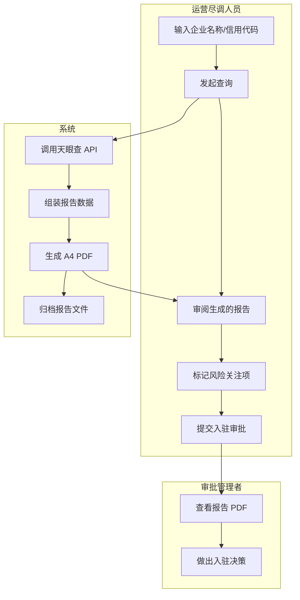
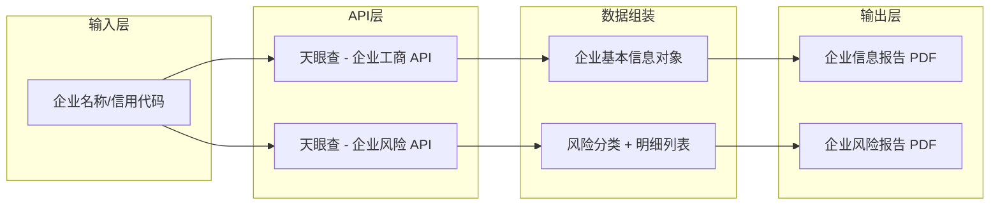
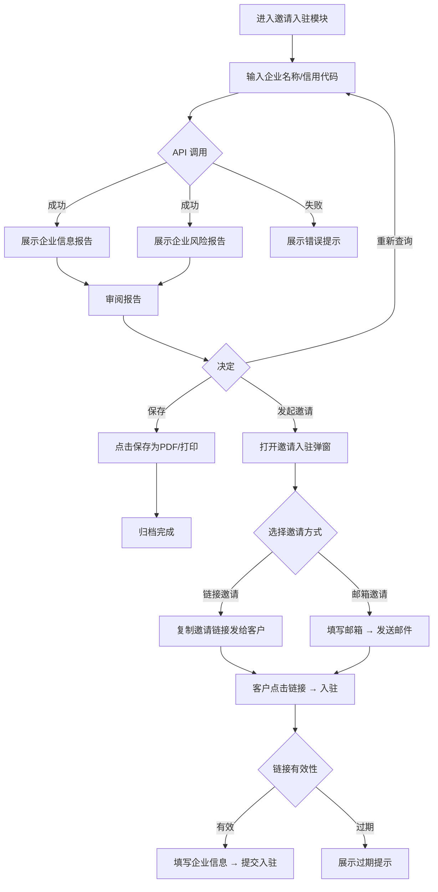

# 需求定义卡片 (RDD) — 邀请入驻

> **原始需求**：运营人员邀请新商家/服务商入驻平台，包含企业尽调（查工商+风险+生成报告）和邀请触达（链接/邮件邀请+客户自主入驻）两阶段。
> **文档版本**: v2.0 | **日期**: 2026-06-06 | **作者**: AI PM

---

## 1. 核心洞察 (Insight)

**真实痛点**：

当前跨境物流平台邀请新商家/服务商入驻时，运营人员需要手动到天眼查、企查查等第三方平台逐个查询目标企业的工商信息和风险状况，然后将关键信息摘抄到 Excel 或飞书文档中，形成简易的尽调报告。这个过程存在三个核心痛点：

1. **信息碎片化**：工商信息、风险信息分散在多个第三方平台的多个页面，运营人员需要反复切换、手动汇总，单家企业尽调耗时 15-30 分钟。
2. **格式不统一**：每个运营人员的摘抄习惯不同，有的截屏、有的复制文字、有的只记几个要点，导致尽调材料质量参差不齐，管理者难以快速判断。
3. **缺乏追溯**：尽调结论依赖个人判断，没有标准化的报告存档，事后无法回溯"当时为什么通过了这家企业"，审计合规风险高。

**JTBD**：

> `运营尽调人员` 雇佣"邀请入驻"不是为了"查企业信息"，而是为了：**当收到入驻申请或主动拓客时，能在 2 分钟内获取一份标准化的企业尽调报告（含工商信息 + 风险扫描），直接用于入驻决策和审批留档，不用手动在多家第三方网站之间反复切换摘抄。**

> `审批管理者` 雇佣"邀请入驻"不是为了"审批流程"，而是为了：**当需要做出入驻决策时，能基于统一格式的 PDF 报告快速判断企业资质和风险等级，不用逐份对比运营人员不同格式的手工笔记。**

**业务价值**：

| 维度 | 当前 | 目标 |
|------|------|------|
| 单家企业尽调耗时 | 15-30 分钟 | ≤ 2 分钟 |
| 报告格式 | 因人而异（截屏/文字/表格） | 统一 A4 PDF |
| 决策可追溯性 | 无标准存档 | 每次查询生成报告，永久归档 |
| 数据来源 | 手动跨平台切换 | 单一入口，API 自动聚合 |

---

## 2. 业务全景图

### 2.1 角色与工作节奏

| 角色 | 核心任务 | 频率 |
|------|---------|------|
| 运营尽调人员 | 收到入驻申请后，查询企业信息并生成尽调报告 | 日频（每天 5-10 家企业） |
| 审批管理者 | 审阅尽调报告，做出入驻决策 | 日频 |

### 2.2 端到端业务链路

```
【一次性配置】（当前阶段不需要 —— 天眼查 API Key 由系统管理员在后台配置）
      ↓
【按需查询】
  输入企业名称 → 系统调用天眼查 API → 返回工商 + 风险数据 → 生成 PDF 报告
      ↓
【决策审批】
  运营审阅报告 → 标记风险项 → 提交入驻审批 → 管理者决策
      ↓
【归档留存】
  报告 PDF 存档 → 关联企业档案 → 审计可追溯
```

### 2.3 实体依赖关系

```
查询记录 (聚合根)
  ├── 1:1 企业工商信息（来自天眼查 API）
  ├── 1:1 企业风险扫描结果（来自天眼查 API）
  │     └── 1:N 风险分类
  │           └── 1:N 风险明细条目
  └── 1:1 报告生成记录（PDF 文件引用）
```

### 2.4 核心业务流程图（泳道图）



### 2.5 核心数据流图



---

## 3. 流程一：企业信息查询（日频）

> **触发**：运营人员需要评估目标企业资质时，输入企业名称或信用代码发起查询
> **频率**：日频
> **前置依赖**：天眼查 API 已配置并可用

### 3.1 企业工商信息 (EnterpriseInfo)

> **As a** 运营尽调人员 **I want to** 输入企业名称后一键获取完整工商信息 **So that** 无需手动在第三方网站逐项查询

| 字段 | 类型 | 必填 | 说明 |
|------|------|------|------|
| 企业名称 | 文本 | ✅ | 企业全称，来自 API 返回 |
| 统一社会信用代码 | 文本(18位) | ✅ | 18位统一社会信用代码 |
| 法定代表人 | 文本 | ✅ | 法定代表人姓名 |
| 企业状态 | 枚举 | ✅ | 存续/在业/注销/吊销 |
| 注册资本 | 文本 | — | 如"20000万人民币"，含币种 |
| 实收注册资金 | 文本 | — | 如"20000万人民币" |
| 成立日期 | 日期 | — | 企业成立日期 |
| 核准日期 | 日期 | — | 最后一次工商核准日期 |
| 营业期限起 | 日期 | — | 营业期限起始日期 |
| 营业期限止 | 日期/文本 | — | 到期日期或"无固定期限" |
| 注册号 | 文本 | — | 工商注册号 |
| 组织机构代码 | 文本 | — | 组织机构代码 |
| 纳税人识别号 | 文本 | — | 税务登记号 |
| 企业类型 | 文本 | — | 如"有限责任公司（法人独资）" |
| 登记机关 | 文本 | — | 工商登记机关全称 |
| 注册地址 | 文本 | — | 完整注册地址 |
| 经营范围 | 长文本 | — | 多行文本，完整经营范围 |
| 所属行业 | 文本 | — | 一级行业分类 |
| 国民经济行业分类 | 文本 | — | 二级/三级分类路径 |
| 人员规模 | 文本 | — | 如"10000人以上" |
| 参保人数 | 整数 | — | 社保缴纳人数 |
| 行政区划-省 | 文本 | — | 如"京" |
| 行政区划-市 | 文本 | — | 如"北京市" |
| 行政区划-区 | 文本 | — | 如"海淀区" |
| 经济功能区 | 文本 | — | 如"中关村国家自主创新示范区" |
| 规上企业 | 文本 | — | "是"/"否" |
| 企业简称 | 文本 | — | 常用简称 |
| 英文名 | 文本 | — | 英文全称 |
| 曾用名 | 文本 | — | 历史名称，逗号分隔 |
| 股票名称 | 文本 | — | 上市股票简称 |
| 股票代码 | 文本 | — | 上市股票代码 |
| 股票类型 | 文本 | — | 如 A股/港股/美股 |
| 注销日期 | 日期 | — | 注销发生日期 |
| 注销原因 | 文本 | — | 注销原因说明 |
| 吊销日期 | 日期 | — | 吊销发生日期 |
| 吊销原因 | 文本 | — | 吊销原因说明 |
| 企业标签 | 文本(数组) | — | 如"高新技术企业,专精特新,独角兽企业" |
| 天眼评分 | 整数 | — | 万分制评分（如 9980） |
| 数据来源 | 文本 | ✅ | 固定值"天眼查API" |
| 查询时间 | 日期时间 | ✅ | 本次查询的时间戳 |

**业务规则**：
- R01：企业名称或信用代码为必填查询条件，至少输入其一
- R02：查询结果来自天眼查 API 实时返回，不本地缓存（每次查询均为最新数据）
- R03：天眼评分原始为万分制整数，报告中展示时转换为百分制（除以 100，保留两位小数）
- R04：企业状态为"注销"或"吊销"时，报告中以不同颜色标签区分（蓝色=存续/在业，灰色=注销，红色=吊销）
- R05：日期字段统一格式化为"YYYY-MM-DD"，原始数据为毫秒时间戳

**相关 AC**：`AC01` `AC02` `AC03`

---

## 4. 流程二：企业风险扫描（日频）

> **触发**：与流程一同步执行，查询企业工商信息时自动附带风险扫描
> **频率**：日频
> **前置依赖**：天眼查 API 已配置，流程一的企业工商信息查询已触发

### 4.1 企业风险扫描结果 (EnterpriseRisk)

> **As a** 运营尽调人员 **I want to** 查看统一格式的企业风险全景报告 **So that** 快速识别目标企业的法律/经营/信用风险

| 字段 | 类型 | 必填 | 说明 |
|------|------|------|------|
| 查询企业名称 | 文本 | ✅ | 被查询的目标企业 |
| 风险总数 | 整数 | ✅ | 所有风险类别合计条目数 |
| 风险分类列表 | 数组 | ✅ | 按类别分组，每组含名称/计数/风险项 |

**风险分类 (RiskCategory)**：

| 字段 | 类型 | 必填 | 说明 |
|------|------|------|------|
| 分类名称 | 枚举 | ✅ | 自身风险 / 周边风险 / 预警提醒 / 历史风险 |
| 分类计数 | 整数 | ✅ | 该分类下的风险条目总数 |
| 风险项列表 | 数组 | ✅ | 该分类下具体的风险条目 |

**风险项 (RiskItem)**：

| 字段 | 类型 | 必填 | 说明 |
|------|------|------|------|
| 风险等级 | 枚举 | ✅ | 高风险 / 警示 / 提示信息 |
| 风险类型 | 枚举(整数) | ✅ | 见表后枚举字典 |
| 类型合计 | 整数 | ✅ | 该类型的条目数 |
| 明细列表 | 数组 | ✅ | 具体风险明细 |

**风险明细 (RiskDetail)**：

| 字段 | 类型 | 必填 | 说明 |
|------|------|------|------|
| 序号 | 整数 | ✅ | 明细序号 |
| 关联公司 | 文本 | — | 风险关联公司名称（自身风险时为空） |
| 标题 | 文本 | ✅ | 风险事件标题/案由 |
| 描述 | 文本 | ✅ | 详细描述（含案号、金额、日期等） |

**风险类型枚举字典**：

| 值 | 常量名 | 中文 |
|----|--------|------|
| 1 | SERIOUS_ILLEGAL | 严重违法 |
| 3 | DISHONEST_EXECUTEE | 失信被执行人 |
| 5 | EXECUTEE | 被执行人 |
| 6 | ADMIN_PENALTY | 行政处罚 |
| 7 | ABNORMAL_OPERATION | 经营异常 |
| 8 | COURT_DOCUMENT | 裁判文书 |
| 9 | EQUITY_PLEDGE | 股权出质 |
| 10 | CHATTEL_MORTGAGE | 动产抵押 |
| 11 | TAX_ARREARS | 欠税公告 |
| 13 | COURT_ANNOUNCEMENT | 开庭公告 |
| 14 | COURT_NOTICE | 法院公告 |
| 15 | LEGAL_PERSON_CHANGE | 法人变更 |
| 20 | CAPITAL_CHANGE | 出资情况变更 |
| 21 | EQUITY_FREEZE | 股权冻结 |
| 27 | CASE_FILING | 立案信息 |
| 41 | EXTERNAL_GUARANTEE | 对外担保 |
| 71 | DISHONEST_EXECUTEE_HIST | 失信被执行人(历史) |
| 72 | EXECUTEE_HIST | 被执行人(历史) |
| 102 | COURT_DOCUMENT_HIST | 裁判文书(历史) |

**风险等级枚举**：

| 值 | 中文 | 颜色 | 说明 |
|----|------|------|------|
| HIGH | 高风险 | 红色 #cf1322 | 严重法律/信用风险 |
| WARNING | 警示 | 橙色 #faad14 | 中等风险，需关注 |
| INFO | 提示信息 | 蓝色 #1890ff | 信息提示，风险较低 |

**业务规则**：
- R05：风险扫描与工商查询为同步操作，查询后同时返回两份报告
- R06：风险总数为所有风险分类的条目数合计
- R07：风险分类按固定顺序展示：自身风险 → 周边风险 → 预警提醒 → 历史风险
- R08：每个风险分类下按风险等级排序（高风险 > 警示 > 提示信息）
- R09：风险等级从 API 返回的 tag 字段映射
- R10：关联公司为空时，明细中显示"自身信息"占位
- R11：某个风险分类无数据时，显示"未发现该类别的风险信息"空状态
- R12：全部风险总数为 0 时，展示"太棒了，未查询到任何企业风险记录"空状态

**相关 AC**：`AC11` `AC12` `AC13` `AC14` `AC15`

---

## 5. 流程三：报告生成与打印（按需）

> **触发**：查询完成后，运营人员点击"保存为 PDF / 打印"按钮
> **频率**：按需
> **前置依赖**：流程一、二的查询已完成

### 5.1 报告生成 (ReportGeneration)

> **As a** 运营尽调人员 **I want to** 将查询结果一键保存为 A4 PDF 或直接打印 **So that** 形成标准化归档材料用于审批和审计

| 字段 | 类型 | 必填 | 说明 |
|------|------|------|------|
| 报告类型 | 枚举 | ✅ | 企业信息报告 / 企业风险报告 |
| 报告标题 | 文本 | ✅ | 如"企业信用信息报告" |
| 生成时间 | 日期时间 | ✅ | 报告生成时间戳 |
| 数据来源 | 文本 | ✅ | 固定"天眼查API对接" |
| 查询主体 | 文本 | ✅ | 被查询企业全称 |
| 页面尺寸 | 枚举 | ✅ | A4 竖版 (210mm x 297mm) |

**业务规则**：
- R13：报告为静态 PDF 排版页面，打印样式通过 CSS `@media print` 控制
- R14：A4 页面宽度固定 800px，A4 比例约 1:1.414
- R15：打印时隐藏操作按钮区域（`no-print` class）
- R16：表格行避免跨页断裂（`page-break-inside: avoid`）
- R17：企业信息报告的页眉为蓝色基调（#0066cc），风险报告为红色基调（#d9363e）

**相关 AC**：`AC21` `AC22` `AC23`

---

## 6. 流程四：邀请入驻弹窗（按需）

> **触发**：运营人员完成企业尽调后，决定向目标企业发送入驻邀请
> **频率**：日频
> **前置依赖**：流程一/二的查询已确认目标企业符合入驻条件

### 6.1 邀请记录 (InvitationRecord) — 记录每次邀请操作的完整信息，含链接和邮件两种触达方式

> **As a** 运营人员 **I want to** 通过链接或邮件方式向目标企业发送入驻邀请 **So that** 客户能便捷地进入入驻流程并完成企业信息填报

| 字段 | 类型 | 必填 | 说明 |
|------|------|------|------|
| 邀请方式 | 枚举 | ✅ | 链接邀请 / 邮件邀请 |
| 专属邀请链接 | 文本(URL) | ✅ | 系统自动生成的唯一邀请链接，有效期14天 |
| 受邀者邮箱 | 文本(邮箱) | 条件 | 邮件邀请时必填，链接邀请时为空 |
| 发送人 | 文本 | ✅ | 当前操作运营人员的系统账号/邮箱 |
| 邮件发件人 | 文本 | 条件 | 邮件邀请时显示，默认虚拟邮箱地址 |
| 邮件主题 | 文本 | 条件 | 邮件邀请时自动生成，根据当前域名切换"飞点跨境供应链入驻邀请"或"墨链跨境供应链入驻邀请" |
| 邮件内容 | 长文本 | 条件 | 邮件邀请时使用完整模板（含邀请链接动态替换） |
| 链接有效期 | 整数(天) | ✅ | 固定14天 |
| 过期时间 | 日期时间 | ✅ | 创建时间 + 14天 |
| 邀请状态 | 枚举 | ✅ | 待接受 / 已接受 / 已过期 / 已取消 |
| 生成时间 | 日期时间 | ✅ | 邀请创建时间戳 |

**Tab 1 — 通过链接邀请**：

| Tab 字段 | 类型 | 必填 | 说明 |
|----------|------|------|------|
| 专属邀请链接 | 只读文本框 | ✅ | 系统自动生成，不可编辑 |
| 返回按钮 | 按钮 | — | 关闭弹窗，不保存 |
| 复制邀请链接 | 按钮 | — | 复制链接到剪贴板，复制时自动增加前缀：`【**】诚挚的邀请您入驻【飞点/墨链】跨境供应链系统，点击链接处理：{链接}` |

**Tab 2 — 通过邮箱邀请**：

| Tab 字段 | 类型 | 必填 | 说明 |
|----------|------|------|------|
| 受邀者邮箱 | 文本框(邮箱) | ✅ | 手动输入，需校验邮箱格式 |
| 发件人 | 只读文本 | ✅ | 默认虚拟邮箱地址，不可编辑 |
| 邮件主题 | 只读文本 | ✅ | 根据当前域名自动切换——飞点："飞点跨境供应链入驻邀请"；墨链："墨链跨境供应链入驻邀请" |
| 邮件内容 | 只读文本域(多行) | ✅ | 展示完整模板内容，占位符 `[邀请链接]` 在发送前自动替换为实际链接，`[发送邀请人的公司邮箱地址]` 替换为当前运营人员邮箱 |
| 发送按钮 | 按钮 | — | 校验邮箱格式后发送邮件 |
| 返回按钮 | 按钮 | — | 关闭弹窗，不保存 |

**邮件内容模板**：

```
尊敬的客户：
您好！

非常荣幸能邀请贵司入驻我们的供应链服务平台。

为了让您更便捷地完成入驻流程，我们为您准备了专属邀请链接：[邀请链接]

请您点击链接，按照页面指引填写企业信息、上传相关资质文件。我们已为您附上《客户档案表》，请参考填写以确保信息准确。

在入驻过程中，如您有任何疑问或需要协助，请问直接在该邮件上回复，请联系您的专属销售：[发送邀请人的公司邮箱地址]

期待与贵司建立长期稳定的合作，携手拓展跨境业务，共创价值！

顺颂商祺！
```

**业务规则**：
- R16：专属邀请链接首次生成后，在有效期内保持不变；过期后需重新生成
- R17：邀请链接格式：`{base_url}/invite/{uuid}`，uuid 为系统生成的唯一标识
- R18：邮件邀请时，`[邀请链接]` 占位符在邮件发送前替换为实际链接
- R19：复制链接时自动拼接前缀文案：`【**】诚挚的邀请您入驻【{domain_name}】跨境供应链系统，点击链接处理：{link}`，其中 `{domain_name}` 根据当前访问域名显示"飞点"或"墨链"
- R20：邮件主题中的品牌名（飞点/墨链）根据系统部署域名自动切换
- R21：链接有效期固定为14天，不可配置；到期前3天系统自动标记为即将过期

**相关 AC**：`AC31` `AC32` `AC33` `AC34` `AC35`

---

## 7. 流程五：客户入驻流程（按需）

> **触发**：客户点击邀请链接进入入驻页面
> **频率**：按需
> **前置依赖**：运营人员已生成有效的邀请链接或邮件

### 7.1 客户入驻 (CustomerOnboarding) — 客户通过邀请链接自主完成企业信息填报

> **As a** 受邀客户 **I want to** 通过邀请链接填写企业信息和上传资质文件 **So that** 完成入驻申请流程

**过期处理**：

| 场景 | 展示内容 |
|------|---------|
| 链接有效期内 | 正常展示入驻表单，客户可填写企业信息和上传资质文件 |
| 链接已过期 | 页面展示过期提示："邀请链接已过期，请联系您的专属销售重新发送入驻邀请链接"，表单隐藏，所有操作禁用 |

**业务规则**：
- R22：系统校验邀请链接的有效性（存在 + 未过期 + 未被取消），任一条件不满足则拒绝访问
- R23：过期提示为纯展示页面，不含表单，不提供任何操作入口
- R24：客户提交入驻信息后，邀请记录状态变更为"已接受"
- R25：同一邀请链接仅可被一个客户使用（首次提交后状态变更，再次访问提示"该邀请链接已被使用"）

**相关 AC**：`AC41` `AC42` `AC43`

---

## 8. 验收标准总览 (AC)

### 流程一：企业信息查询
- [ ] **AC01-企业查询入口**：运营端提供企业信息查询入口，支持输入企业名称或统一社会信用代码
- [ ] **AC02-工商信息展示**：查询成功后，按 A4 报告模板展示企业完整工商信息（含全部字段）
- [ ] **AC03-状态标签区分**：企业状态标签按存续/注销/吊销以不同颜色区分
- [ ] **AC04-天眼评分格式化**：天眼评分从万分制转换为百分制显示，保留两位小数

### 流程二：企业风险扫描
- [ ] **AC11-风险扫描触发**：查询企业信息时自动附带风险扫描，同步返回结果
- [ ] **AC12-风险分类展示**：风险按自身风险/周边风险/预警提醒/历史风险分组展示
- [ ] **AC13-风险等级颜色**：高风险(红)/警示(橙)/提示信息(蓝)以不同颜色和图标区分
- [ ] **AC14-空状态处理**：某个分类无风险时展示空状态提示；全部无风险时展示全局空状态
- [ ] **AC15-风险明细表格**：每条风险展示序号、关联公司、标题、描述

### 流程三：报告生成与打印
- [ ] **AC21-保存为PDF**：点击"保存为 PDF/打印"按钮，调用浏览器打印功能
- [ ] **AC22-打印样式**：打印时隐藏按钮区域，A4 竖版排版，表格不跨页断裂
- [ ] **AC23-报告归档**：生成的报告 PDF 存档，关联查询记录

### 流程四：邀请入驻弹窗
- [ ] **AC31-链接邀请Tab**：弹窗包含"通过链接邀请"Tab，展示只读专属邀请链接，含"复制邀请链接"和"返回"按钮
- [ ] **AC32-复制链接前缀**：点击复制链接时，剪贴板内容自动包含前缀文案，品牌名（飞点/墨链）根据当前域名切换
- [ ] **AC33-邮箱邀请Tab**：弹窗包含"通过邮箱邀请"Tab，展示受邀者邮箱输入框（必填）、发件人（只读）、邮件主题（只读，含域名切换）、邮件内容（只读模板）
- [ ] **AC34-邮件发送**：点击发送按钮，校验邮箱格式，成功后Toast提示"邀请邮件已发送"，`[邀请链接]` 和 `[发送邀请人的公司邮箱地址]` 占位符已替换
- [ ] **AC35-链接有效期**：链接有效期为14天，过期时间 = 创建时间 + 14天，邀请记录状态自动流转

### 流程五：客户入驻流程
- [ ] **AC41-链接有效访问**：有效期内点击邀请链接，正常展示入驻表单
- [ ] **AC42-链接过期提示**：过期链接展示"邀请链接已过期，请联系您的专属销售重新发送入驻邀请链接"，隐藏表单
- [ ] **AC43-链接已使用**：同一链接被二次访问时，提示"该邀请链接已被使用"

### 关键操作流程图



---

## 9. NFR（非功能性需求）

- **性能**：单次查询（工商+风险）API 响应时间 ≤ 3 秒，报告渲染 ≤ 1 秒
- **并发**：同时最多 5 个运营人员并发查询
- **数据保留**：查询记录和报告 PDF 永久保留（审计需要）
- **安全**：仅运营角色和审批管理员可访问此功能
- **打印**：支持 A4 竖版打印，颜色精确还原（`print-color-adjust: exact`）

---

## 10. 功能清单

> 基于 5 条业务流程，共 **1 个模块、8 项功能**。P0 = MVP，P1 = 二期。

**模块：邀请入驻**

| 编号 | 功能 | 优先级 | AC |
|------|------|--------|-----|
| F1 | 企业信息查询（输入名称/信用代码，获取工商信息） | P0 | AC01, AC02, AC03, AC04 |
| F2 | 企业风险扫描（自动附带，按分类展示风险明细） | P0 | AC11, AC12, AC13, AC14, AC15 |
| F3 | 报告打印/PDF导出（浏览器打印，A4 排版） | P0 | AC21, AC22 |
| F4 | 报告归档存储（查询记录 + PDF 文件保留） | P0 | AC23 |
| F5 | 链接邀请（生成专属链接 + 复制含前缀文案） | P0 | AC31, AC32, AC35 |
| F6 | 邮件邀请（填写邮箱 + 模板邮件发送） | P0 | AC33, AC34 |
| F7 | 邀请记录管理（创建/查看/状态追踪） | P0 | AC35 |
| F8 | 客户入驻（点击链接 → 填写企业信息 → 提交） | P1 | AC41, AC42, AC43 |

### 分期汇总

| 分期 | 模块范围 | 功能数 |
|------|----------|--------|
| **Phase 1 (MVP)** | 企业信息查询 + 风险扫描 + 报告打印归档 + 链接/邮件邀请 + 邀请记录 | **7** |
| **Phase 2** | 客户自助入驻表单页、批量企业查询、风险对比分析、自定义报告模板 | +4 |
| **Phase 3** | 风险预警自动推送、报告过期提醒、多数据源对接 | +3 |

---

## 11. MVP 方案与建议

**MVP 方案（Phase 1 — 企业尽调 + 邀请触达）**

```
运营端 邀请入驻
├── 企业查询入口
│   ├── 输入企业名称或信用代码
│   └── 发起查询（调用天眼查 API）
├── 企业信息报告（A4 PDF）
│   ├── 工商基本信息
│   ├── 行业与规模信息
│   └── 附加与变更信息
├── 企业风险报告（A4 PDF）
│   ├── 自身风险
│   ├── 周边风险
│   ├── 预警提醒
│   └── 历史风险
├── 报告管理
│   ├── 保存为 PDF / 直接打印
│   └── 报告自动归档
└── 邀请入驻弹窗
    ├── Tab: 通过链接邀请（生成链接 + 复制含前缀文案）
    └── Tab: 通过邮箱邀请（填写邮箱 + 模板邮件发送）
```

**MVP 明确不做**：
- 客户自助入驻表单页（二期，P1，需要前端客户端页面 + 文件上传）
- 批量企业查询（二期，需要后台任务队列）
- 风险对比分析（二期，需要多企业数据聚合）
- 自定义报告模板（二期，需要模板引擎）
- 非天眼查数据源（二期，需要抽象数据源接口）

**专家建议**：
1. **利用浏览器原生打印能力**：不需要引入第三方 PDF 库，直接用 `window.print()` + `@media print` CSS 即可生成专业 A4 报告。这大幅降低了 MVP 开发成本。
2. **报告模板化设计**：两份报告的布局结构一致（页眉 + 企业头 + 详情区块），差异仅在字段内容和配色。建议抽象公共报告模板组件，两份报告只需填充数据 + 切换主题色。
3. **API 数据缓存策略**：MVP 阶段每次查询实时调用 API，但建议在 API 层设计缓存 key（以信用代码为 key，缓存 24 小时），为后续批量查询和成本控制做准备。
4. **邀请链接前缀通过配置管理**：`【**】诚挚的邀请您入驻【飞点/墨链】跨境供应链系统` 中的品牌名根据域名动态切换，建议将前缀模板抽离为系统配置项（`invitation.copy_prefix_template`），避免硬编码在前后端代码中。
5. **邀请链接做幂等设计**：同一运营人员对同一企业多次生成邀请时，若前一条邀请仍在有效期内，复用已有链接而非生成新链接，避免客户收到多条不同链接。

---

## 下一步

当前完成了 RDD v2.0，新增邀请入驻弹窗（链接/邮箱双通道）+ 客户入驻流程（含过期逻辑）。下一步需要：
1. 同步更新数据设计（新增 invitation_record 表）
2. 同步更新 PRD（新增邀请入驻弹窗页面规格）

---

> **输出说明**：v1.0 基于员工端 Demo 中两份 PDF 排版页面反向提取字段和交互逻辑。v2.0 基于 Excel"邀请入驻弹窗"和"客户入驻流程"sheet 补充了邀请触达（链接/邮件双通道）和客户入驻过期逻辑。模块名称"邀请入驻"覆盖运营端的企业尽调 + 邀请触达两个阶段。
