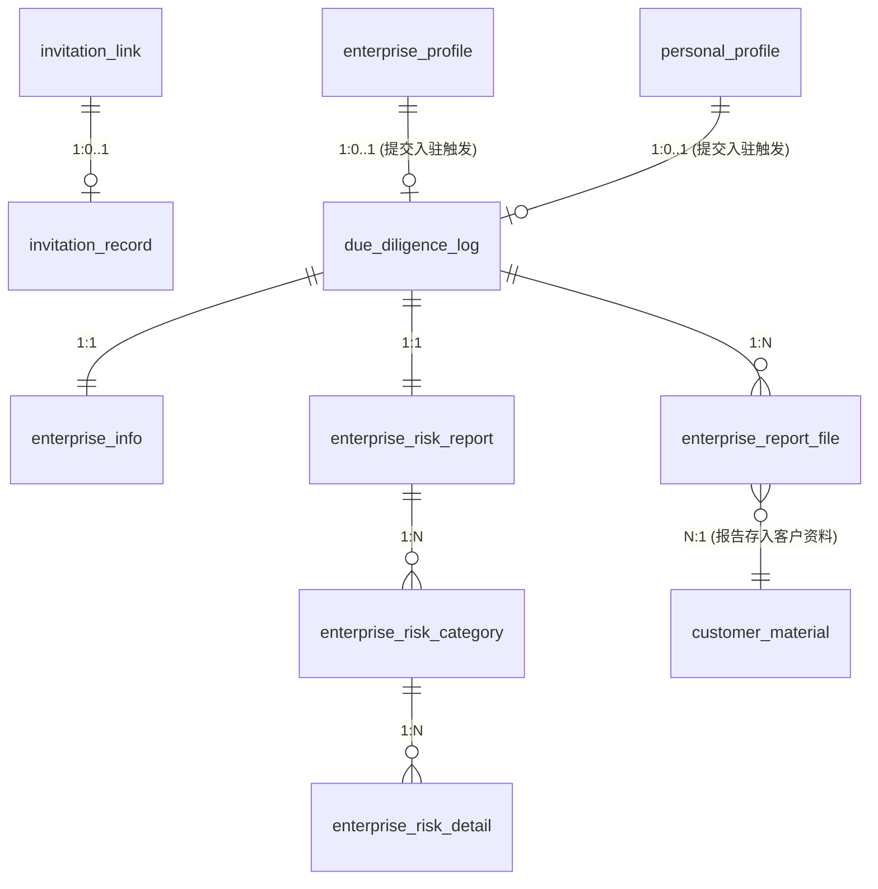

# 数据设计 — 邀请入驻

> **文档版本**: v3.0 | **日期**: 2026-06-16 | **作者**: AI PM（v3.0: 企业尽调从手工查询表改为客户提交档案后自动触发的快照表）
> **上游文档**: `2026-06-16-用户需求.md`（v3.0，邀请触达 + 系统自动尽调）

---

## 一、实体清单 x 表映射

| 实体名称 | 对应表/子表 | 映射方式 | 说明 |
|----------|------------|---------|------|
| 邀请记录 | `invitation_record` | 独立表 | 销售生成的邀请链接/邮件记录，含token、过期时间、状态 |
| 邀请链接 | `invitation_link` | 独立表 | 与客商中心共用，详见客商中心数据设计 §表13 |
| 企业工商信息 | `enterprise_info` | 独立表 | 客户提交入驻后系统自动调用天眼查返回的工商数据快照 |
| 企业风险报告 | `enterprise_risk_report` | 独立表 | 一次尽调对应一条风险报告汇总 |
| 风险分类 | `enterprise_risk_category` | 1:N 子表 | 通过 `report_id` 关联报告 |
| 风险明细 | `enterprise_risk_detail` | 1:N 子表 | 通过 `category_id` 关联分类 |
| 尽调触发记录 | `due_diligence_log` | 聚合根表 | 客户提交入驻时自动创建，关联工商信息和风险报告，记录触发来源（profile_id） |
| 报告文件 | `enterprise_report_file` | 独立表 | 尽调 PDF 文件存储，关联触发记录 + 存入 customer_material |

---

## 二、逐表字段清单

### 表1: `invitation_record` | 对应实体: 邀请记录 (InvitationRecord)

> **设计说明**: 与客商中心 `invitation_link` 表关联。记录每次邀请操作（链接邀请/邮件邀请），含邀请方式、邮件内容、状态追踪。

| 字段名 (En) | 字段名 (Cn) | 类型 (Type) | 必填 | 约束/索引 | 枚举/备注 |
|:---|:---|:---|:---|:---|:---|
| `id` | 主键 | BigInt | Yes | **PK** | 雪花ID |
| `tenant_id` | 租户ID | String(32) | Yes | Index | SaaS 数据隔离 |
| `link_id` | 关联链接ID | BigInt | Yes | **FK**, Index | 关联 `invitation_link.id` |
| `invite_method` | 邀请方式 | TinyInt | Yes | — | 10:链接邀请, 20:邮件邀请 |
| `recipient_email` | 受邀者邮箱 | String(200) | 条件 | — | 邮件邀请时必填 |
| `sender` | 发送人 | String(100) | Yes | — | 当前销售账号 |
| `email_subject` | 邮件主题 | String(200) | 条件 | — | 根据域名自动切换 |
| `email_body` | 邮件正文 | Text | 条件 | — | 含邀请链接模板 |
| `status` | 邀请状态 | TinyInt | Yes | Index | 10:待接受, 20:已接受, 30:已过期, 40:已取消 |
| `created_at` | 生成时间 | DateTime | Yes | — | — |
| `expire_time` | 过期时间 | DateTime | Yes | — | 创建时间 + 14天 |
| `updated_at` | 更新时间 | DateTime | Yes | — | — |
| `is_deleted` | 软删除标识 | Boolean | Yes | — | Default: false |

### 表2: `due_diligence_log` | 对应实体: 尽调触发记录 (DueDiligenceLog)

> **设计说明**: V3.0 重构。客户提交入驻档案时系统自动创建此记录，替代旧版手工查询日志。关联 `enterprise_profile.id` 或 `personal_profile.id` 作为触发来源。

| 字段名 (En) | 字段名 (Cn) | 类型 (Type) | 必填 | 约束/索引 | 枚举/备注 |
|:---|:---|:---|:---|:---|:---|
| `id` | 主键 | BigInt | Yes | **PK** | 雪花ID |
| `tenant_id` | 租户ID | String(32) | Yes | Index | SaaS 数据隔离 |
| `profile_type` | 档案类型 | TinyInt | Yes | — | 10:企业档案, 20:自然人档案 |
| `profile_id` | 档案ID | BigInt | Yes | Index | 关联 enterprise_profile.id 或 personal_profile.id |
| `customer_id` | 客户ID | BigInt | — | Index | 关联 customer.id（入驻审核通过后回填） |
| `company_name` | 企业名称 | String(200) | Yes | — | 查询企业全称 |
| `credit_code` | 信用代码 | String(18) | — | — | 企业查询时使用 |
| `lookup_status` | 查询状态 | TinyInt | Yes | — | 10:成功, 20:部分成功, 30:失败 |
| `trigger_source` | 触发来源 | TinyInt | Yes | — | 固定: 10:客户提交入驻（V3.0） |
| `created_at` | 触发时间 | DateTime | Yes | — | — |
| `is_deleted` | 软删除标识 | Boolean | Yes | — | Default: false |

### 表3: `enterprise_info` | 对应实体: 企业工商信息 (EnterpriseInfo)

> **设计说明**: 存储天眼查 API 返回的企业工商数据快照。通过 `diligence_id` 关联尽调触发记录。数据不可编辑，仅供查阅。

| 字段名 (En) | 字段名 (Cn) | 类型 (Type) | 必填 | 约束/索引 | 枚举/备注 |
|:---|:---|:---|:---|:---|:---|
| `id` | 主键 | BigInt | Yes | **PK** | 雪花ID |
| `tenant_id` | 租户ID | String(32) | Yes | Index | — |
| `diligence_id` | 尽调记录ID | BigInt | Yes | **FK**, **Unique** | 1:1 关联 due_diligence_log.id |
| `company_name` | 企业名称 | String(200) | Yes | — | — |
| `credit_code` | 统一社会信用代码 | String(18) | Yes | — | — |
| `legal_person` | 法定代表人 | String(50) | Yes | — | — |
| `company_status` | 企业状态 | String(20) | Yes | — | 存续/在业/注销/吊销 |
| `registered_capital` | 注册资本 | String(50) | — | — | 如"20000万人民币" |
| `established_date` | 成立日期 | Date | — | — | — |
| `registered_address` | 注册地址 | String(500) | — | — | — |
| `business_scope` | 经营范围 | Text | — | — | — |
| `insured_count` | 参保人数 | Int | — | — | — |
| `enterprise_tags` | 企业标签 | JSON | — | — | 如["高新技术企业","专精特新"] |
| `tianyan_score` | 天眼评分 | Int | — | — | 万分制原始值，展示时÷100 |
| `data_source` | 数据来源 | String(50) | Yes | — | 固定"天眼查API" |
| `queried_at` | 查询时间 | DateTime | Yes | — | — |
| `created_at` | 创建时间 | DateTime | Yes | — | — |
| `is_deleted` | 软删除标识 | Boolean | Yes | — | Default: false |

### 表4: `enterprise_risk_report` | 对应实体: 企业风险报告 (EnterpriseRiskReport)

| 字段名 (En) | 字段名 (Cn) | 类型 (Type) | 必填 | 约束/索引 | 枚举/备注 |
|:---|:---|:---|:---|:---|:---|
| `id` | 主键 | BigInt | Yes | **PK** | 雪花ID |
| `tenant_id` | 租户ID | String(32) | Yes | Index | — |
| `diligence_id` | 尽调记录ID | BigInt | Yes | **FK**, **Unique** | 1:1 关联 due_diligence_log.id |
| `company_name` | 查询企业名称 | String(200) | Yes | — | — |
| `total_risk_count` | 风险总数 | Int | Yes | — | 所有风险类别合计条目数 |
| `created_at` | 创建时间 | DateTime | Yes | — | — |
| `is_deleted` | 软删除标识 | Boolean | Yes | — | Default: false |

### 表5: `enterprise_risk_category` | 对应实体: 风险分类

| 字段名 (En) | 字段名 (Cn) | 类型 (Type) | 必填 | 约束/索引 | 枚举/备注 |
|:---|:---|:---|:---|:---|:---|
| `id` | 主键 | BigInt | Yes | **PK** | 雪花ID |
| `tenant_id` | 租户ID | String(32) | Yes | Index | — |
| `report_id` | 报告ID | BigInt | Yes | **FK**, Index | 关联 enterprise_risk_report.id |
| `category_name` | 分类名称 | TinyInt | Yes | — | 10:自身风险, 20:周边风险, 30:预警提醒, 40:历史风险 |
| `category_count` | 分类计数 | Int | Yes | — | 该分类下风险条目总数 |
| `sort_order` | 排序 | Int | — | — | 固定顺序: 自身→周边→预警→历史 |
| `created_at` | 创建时间 | DateTime | Yes | — | — |
| `is_deleted` | 软删除标识 | Boolean | Yes | — | Default: false |

### 表6: `enterprise_risk_detail` | 对应实体: 风险明细

| 字段名 (En) | 字段名 (Cn) | 类型 (Type) | 必填 | 约束/索引 | 枚举/备注 |
|:---|:---|:---|:---|:---|:---|
| `id` | 主键 | BigInt | Yes | **PK** | 雪花ID |
| `tenant_id` | 租户ID | String(32) | Yes | Index | — |
| `category_id` | 分类ID | BigInt | Yes | **FK**, Index | 关联 enterprise_risk_category.id |
| `risk_level` | 风险等级 | TinyInt | Yes | — | 10:高风险, 20:警示, 30:提示信息 |
| `risk_type` | 风险类型 | Int | Yes | — | 详见枚举字典（失信被执行人/行政处罚/经营异常等） |
| `seq_no` | 序号 | Int | — | — | 明细序号 |
| `related_company` | 关联公司 | String(200) | — | — | 自身风险时为空 |
| `title` | 标题 | String(500) | Yes | — | 风险事件标题/案由 |
| `description` | 描述 | Text | Yes | — | 含案号、金额、日期等 |
| `created_at` | 创建时间 | DateTime | Yes | — | — |
| `is_deleted` | 软删除标识 | Boolean | Yes | — | Default: false |

### 表7: `enterprise_report_file` | 对应实体: 报告文件

| 字段名 (En) | 字段名 (Cn) | 类型 (Type) | 必填 | 约束/索引 | 枚举/备注 |
|:---|:---|:---|:---|:---|:---|
| `id` | 主键 | BigInt | Yes | **PK** | 雪花ID |
| `tenant_id` | 租户ID | String(32) | Yes | Index | — |
| `diligence_id` | 尽调记录ID | BigInt | Yes | **FK**, Index | 关联 due_diligence_log.id |
| `material_id` | 客户资料ID | BigInt | — | Index | 关联 customer_material.id，报告自动存入客户资料 |
| `report_type` | 报告类型 | TinyInt | Yes | — | 10:企业信息报告, 20:企业风险报告 |
| `file_name` | 文件名 | String(200) | Yes | — | 如"企业信用信息报告_XX公司.pdf" |
| `file_url` | 文件地址 | String(500) | Yes | — | — |
| `page_size` | 页面尺寸 | String(20) | — | — | 固定"A4竖版" |
| `created_at` | 生成时间 | DateTime | Yes | — | — |
| `is_deleted` | 软删除标识 | Boolean | Yes | — | Default: false |

---

## 三、ER 关系图

---

## 四、关键设计说明

### 触发机制（V3.0 重构）
- 旧版：销售手工输入企业名称 → 点击查询 → 创建 `enterprise_lookup_log`
- 新版：客户提交 `enterprise_profile`（status=20 待审核） → 系统自动创建 `due_diligence_log` → 调用天眼查 API → 填充 `enterprise_info` + `enterprise_risk_report`

### 降级策略
- 天眼查 API 调用失败 → `due_diligence_log.lookup_status = 30` → Toast 提示但不阻断入驻 → 定时任务扫描 status=30 的记录 → 自动补采

### 数据快照
- `enterprise_info` 和 `enterprise_risk_report` 为查询时刻的快照数据，不可编辑
- 客户再次提交入驻（被拒绝后重提）→ 创建新的 `due_diligence_log` → 重新调用 API → 生成新快照

### 与客商中心数据融合
- 尽调 PDF 通过 `enterprise_report_file.material_id` 关联 `customer_material` 表
- `customer_material.material_type = 30`（天眼查风险信息PDF），来源 `FileSource = 40`（天眼查生成）
