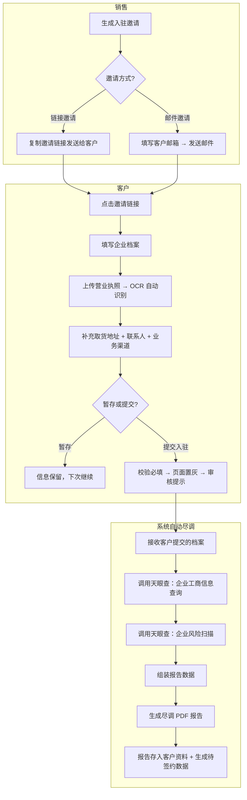
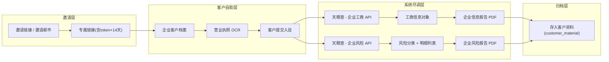

# 需求定义卡片 (RDD) — 邀请入驻

> **原始需求**：销售通过链接或邮件向目标客户发送入驻邀请，客户点击后自助填写企业档案，提交后系统自动触发天眼查尽调并生成 PDF 报告。
> **文档版本**: v3.0 | **日期**: 2026-06-16 | **作者**: AI PM（v3.0: 流程重构——企业尽调从销售手工查询改为客户提交档案后系统自动触发）

---

## 1. 核心洞察 (Insight)

**真实痛点**：

当前飞点跨境供应链的客户入驻流程中，销售发送邀请链接后，客户填写档案并提交。但企业尽调（天眼查工商信息+风险扫描+PDF报告生成）应在**客户提交档案时由系统自动触发**，而非销售手动到第三方平台逐家查询。

**JTBD**：

> `销售` 雇佣"邀请入驻"不是为了"查企业信息"，而是为了：**生成专属邀请链接或邮件发送给客户，客户自助完成后系统自动完成尽调，无需人工介入。**

> `客户` 雇佣"邀请入驻"不是为了"配合销售做尽调"，而是为了：**收到链接后一次会话内完成档案填写和提交，剩下的审核流程由系统自动完成。**

**业务价值**：

| 维度 | 当前（手工） | 目标 |
|------|------|------|
| 企业尽调触发 | 销售手工输入企业名称查询 | 客户提交档案后系统自动触发 |
| 尽调耗时 | 15-30 分钟/家 | 系统自动，无需人工等待 |
| 报告生成 | 销售手工截图摘抄 | 系统自动生成 PDF，永久归档 |
| 入驻邀请 | 微信发送链接，无追踪 | 链接+邮件双通道，状态可追踪 |

---

## 2. 业务全景图

### 2.1 角色与工作节奏

| 角色 | 核心任务 | 频率 |
|------|---------|------|
| 销售代表 | 生成入驻链接/发送邀请邮件，跟踪邀请状态 | 日频 |
| 客户（企业/自然人） | 点击邀请链接，填写档案并提交入驻 | 一次性 |
| 系统 | 客户提交后自动触发 OCR、天眼查接口、生成 PDF 报告 | 自动 |

### 2.2 端到端业务链路

```
【邀请触达】
  销售生成专属邀请链接/发送邮件 → 链接含14天有效期
      ↓
【客户自助填写】（详见 客商中心 RDD §4）
  客户点击链接 → 上传营业执照(触发OCR) → 填写取货地址+联系人+业务渠道
  → 支持暂存退出，下次恢复
      ↓
【客户提交入驻】
  客户点击"入驻" → 校验必填 → 页面置灰 + 审核提示
      ↓
【系统自动尽调】（本模块核心）
  系统自动调用天眼查 API：企业工商信息 + 风险扫描 → 生成 PDF 报告
  → 报告存入客户资料 → 待签约数据生成
      ↓
【后续流程】（详见 客商中心 RDD）
  签约 → 开户 → 激活
```

### 2.3 实体依赖关系

```
邀请记录 (InvitationRecord) — 聚合根
  ├── 1:1 专属邀请链接 (含token + 14天有效期)
  ├── 1:1 邮件发送记录 (条件，仅邮件邀请时)
  └── 1:1 邀请状态追踪

企业客户档案 (EnterpriseProfile) — 详见 客商中心 RDD
  ├── 营业执照 → OCR 自动填充公司名称/注册号/信用代码
  ├── 取货地址 + 联系人 + 业务渠道
  └── 提交入驻 → 触发天眼查自动尽调

系统自动尽调结果
  ├── 1:1 企业工商信息（天眼查 API 返回）
  ├── 1:1 企业风险扫描结果（天眼查 API 返回）
  └── 1:1 尽调 PDF 报告（系统自动生成，存入客户资料）
```

### 2.4 核心业务流程图（泳道图）



### 2.5 核心数据流图



---

## 3. 流程一：邀请触达（销售日频操作）

> **触发**：销售完成客户初步沟通后，向目标客户发送入驻邀请
> **频率**：日频
> **前置依赖**：目标客户已确认意向

### 3.1 专属邀请链接 (InvitationLink)

> **As a** 销售代表 **I want to** 生成专属入驻链接发送给客户 **So that** 客户能自助完成档案填写

| 字段 | 类型 | 必填 | 说明 |
|------|------|------|------|
| 受邀客户名称 | 文本 | — | 目标客户企业名称 |
| 专属邀请链接 | 文本(URL) | ✅ | 系统自动生成，含唯一token，格式 `{base_url}/invite/{uuid}` |
| 链接有效期 | 整数(天) | ✅ | 固定 14 天 |
| 过期时间 | 日期时间 | ✅ | 生成时间 + 14 天 |
| 邀请方式 | 枚举 | ✅ | 链接邀请 / 邮件邀请 |
| 邀请状态 | 枚举 | ✅ | 待接受 / 已接受 / 已过期 |

**业务规则**：
- R01：链接首次生成后在 14 天有效期内保持不变，过期后需重新生成
- R02：过期后客户点击链接提示"链接已过期，请联系您的销售代表重新发送入驻邀请"
- R03：链接被使用后（客户已提交入驻），不可再次使用
- R04：销售可选择"复制邀请链接"或"发送邮件"两种触达方式

### 3.2 邮件邀请 (EmailInvitation)

> **As a** 销售代表 **I want to** 通过邮件方式向客户发送入驻邀请 **So that** 客户在邮箱中直接获取链接

| 字段 | 类型 | 必填 | 说明 |
|------|------|------|------|
| 受邀者邮箱 | 邮箱 | ✅ | 客户邮箱地址 |
| 发件人 | 文本 | ✅ | 系统默认虚拟邮箱，不可编辑 |
| 邮件主题 | 文本 | ✅ | 根据域名自动切换："飞点跨境供应链入驻邀请" 或 "墨链跨境供应链入驻邀请" |
| 邮件正文 | 长文本 | ✅ | 含专属邀请链接的完整模板，占位符 `{邀请链接}` 发送前替换 |

**邮件正文模板**：

```
尊敬的客户：
      您好！
      非常荣幸能邀请贵司入驻我们的供应链服务平台。
      为了让您更便捷地完成入驻流程，我们为您准备了专属邀请链接：[邀请链接]
      请您点击链接，按照页面指引填写企业信息、上传相关资质文件。我们已为您附上《客户档案表》，请参考填写以确保信息准确。
      在入驻过程中，如您有任何疑问或需要协助，请勿直接在该邮件上回复，请联系您的专属销售：【发送邀请人的公司邮箱地址】
      期待与贵司建立长期稳定的合作，携手拓展跨境业务，共创价值！
      顺颂商祺！
```

**业务规则**：
- R05：邮件主题中的品牌名（飞点/墨链）根据系统部署域名自动切换
- R06：`{邀请链接}` 占位符在邮件发送前替换为实际链接
- R07：复制链接时自动拼接前缀：`诚挚的邀请您入驻{飞点/墨链}跨境供应链系统，点击链接处理：{link}`

---

## 4. 流程二：客户自助填写档案（客户一次性操作）

> **触发**：客户点击邀请链接进入
> **频率**：一次性
> **前置依赖**：有效的邀请链接
> **详细字段定义**：参见 客商中心 RDD §4（企业客户档案）和 §5（自然人客户档案）

### 4.1 客户操作概要

```
客户点击链接
  → 校验 token 有效性 + 14 天过期
  → 如已有暂存草稿 → 恢复表单
  → 企业客户：
      上传营业执照 → OCR 自动识别（公司名称/注册号/信用代码）
      补充：取货地址 + 联系人(3固定角色) + 业务渠道
  → 自然人客户：
      上传身份证 → OCR 自动识别（姓名/身份证号）
      补充：联系地址 + 取货地址 + 联系人 + 业务渠道
  → 支持"暂存并退出"（下次打开链接恢复）
  → 点击"入驻" → 校验必填 → 提交
```

**业务规则**（引用自 客商中心 RDD）：
- 营业执照 OCR → 自动回填公司名称、注册号码、统一社会信用代码，可手动修改
- 统一社会信用代码全局唯一校验，重复时提示
- 身份证号全局唯一校验，重复时提示
- 暂存并退出 = 信息暂存为草稿快照，下次打开链接恢复
- 提交后页面置灰，显示"您的入驻申请已提交，我们将在1-3个工作日内完成审核"

---

## 5. 流程三：系统自动尽调（客户提交后自动触发）

> **触发**：客户在入驻端点击"入驻"提交企业档案
> **频率**：每次客户提交入驻时自动执行
> **前置依赖**：客户已提交企业档案（含营业执照/信用代码）

### 5.1 企业工商信息自动查询

> **As a** 系统 **I want to** 在客户提交入驻后自动调用天眼查 API 获取企业工商信息 **So that** 运营无需手动查询

查询参数：客户档案中的**企业名称**或**统一社会信用代码**。

返回字段（天眼查 API 自动返回）：

| 字段 | 类型 | 说明 |
|------|------|------|
| 企业名称 | 文本 | 企业全称 |
| 统一社会信用代码 | 文本(18位) | 18位统一社会信用代码 |
| 法定代表人 | 文本 | 法定代表人姓名 |
| 企业状态 | 枚举 | 存续/在业/注销/吊销 |
| 注册资本 | 文本 | 如"20000万人民币" |
| 成立日期 | 日期 | 企业成立日期 |
| 注册地址 | 文本 | 完整注册地址 |
| 经营范围 | 长文本 | 完整经营范围 |
| 参保人数 | 整数 | 社保缴纳人数 |
| 企业标签 | 文本(数组) | 如"高新技术企业,专精特新" |
| 天眼评分 | 整数 | 万分制评分，展示时转为百分制 |
| 数据来源 | 文本 | 固定"天眼查API" |
| 查询时间 | 日期时间 | 本次查询时间戳 |

**业务规则**：
- R08：企业状态为"注销"或"吊销"时，报告以不同颜色标签区分（蓝色=存续/在业，灰色=注销，红色=吊销）
- R09：天眼评分原始为万分制，报告中转为百分制（÷100，保留两位小数）
- R10：日期字段统一格式化为"YYYY-MM-DD"
- R11：天眼查 API 调用失败时降级处理：提示"企业风险信息获取失败，不影响入驻提交，稍后系统将自动补采"，入驻流程不阻断

### 5.2 企业风险自动扫描

> **As a** 系统 **I want to** 在客户提交入驻后自动调用天眼查风险 API **So that** 运营能基于统一的风险报告做入驻决策

返回字段：

| 字段 | 类型 | 说明 |
|------|------|------|
| 查询企业名称 | 文本 | 被查询企业 |
| 风险总数 | 整数 | 所有风险类别合计条目数 |
| 风险分类列表 | 数组 | 自身风险 / 周边风险 / 预警提醒 / 历史风险 |

**风险等级枚举**：

| 等级 | 颜色 | 说明 |
|------|------|------|
| 高风险 | 红色 #cf1322 | 严重法律/信用风险 |
| 警示 | 橙色 #faad14 | 中等风险，需关注 |
| 提示信息 | 蓝色 #1890ff | 信息提示，风险较低 |

**业务规则**：
- R12：风险扫描与工商查询同步执行
- R13：风险分类按固定顺序展示：自身风险 → 周边风险 → 预警提醒 → 历史风险
- R14：每个分类下按风险等级排序（高风险 > 警示 > 提示信息）
- R15：全部风险总数为 0 时展示"未查询到任何企业风险记录"
- R16：某个分类无数据时展示空状态

### 5.3 尽调报告自动生成

> **As a** 系统 **I want to** 将天眼查返回数据自动生成 PDF 报告并存入客户资料 **So that** 运营和审批人员可在客户管理中直接查看

| 字段 | 类型 | 说明 |
|------|------|------|
| 报告类型 | 枚举 | 企业信息报告 / 企业风险报告 |
| 报告标题 | 文本 | 如"企业信用信息报告" |
| 生成时间 | 日期时间 | 报告生成时间戳 |
| 数据来源 | 文本 | 固定"天眼查API" |
| 查询主体 | 文本 | 被查询企业全称 |
| 页面尺寸 | 枚举 | A4 竖版 |

**业务规则**：
- R17：尽调报告为静态 A4 PDF，可通过 CSS `@media print` 打印
- R18：企业信息报告页眉蓝色基调（#0066cc），风险报告红色基调（#d9363e）
- R19：报告生成后自动存入 `customer_material` 表（material_type=天眼查风险信息PDF）
- R20：报告永久归档，关联企业档案，审计可追溯

---

## 6. 验收标准总览 (AC)

**流程一：邀请触达**
- [ ] **AC01-链接生成**：销售可生成唯一入驻链接，含token + 14天有效期
- [ ] **AC02-链接过期**：过期链接点击提示"链接已过期，请联系您的销售代表重新发送入驻邀请"
- [ ] **AC03-邮件邀请**：销售可填写客户邮箱，发送含专属链接的入驻邀请邮件，主题根据域名自动切换
- [ ] **AC04-复制链接**：复制链接时自动拼接前缀文案，含品牌名

**流程二：客户自助填写**
- [ ] **AC05-暂存恢复**：客户填写部分信息可暂存退出，再次打开链接自动恢复
- [ ] **AC06-营业执照OCR**：上传营业执照 → 自动识别公司名称/注册号/信用代码，可手动修改
- [ ] **AC07-入驻提交**：点击入驻 → 校验必填 → 页面置灰 + 审核提示
- [ ] **AC08-唯一校验**：信用代码/身份证号重复时阻止提交

**流程三：系统自动尽调**
- [ ] **AC09-自动触发**：客户提交入驻后系统自动调用天眼查，无需销售手工操作
- [ ] **AC10-工商信息**：返回企业名称/信用代码/法人/状态/注册资本/成立日期/经营范围/参保人数/企业标签/天眼评分
- [ ] **AC11-风险扫描**：返回自身风险/周边风险/预警提醒/历史风险四类，按等级排序
- [ ] **AC12-PDF报告**：自动生成企业信息报告 + 风险报告两份 PDF，存入客户资料
- [ ] **AC13-降级策略**：天眼查 API 失败时提示但不阻断入驻，稍后自动补采
- [ ] **AC14-报告归档**：报告永久关联企业档案，审计可追溯

---

## 7. 功能清单

| 编号 | 功能 | 优先级 | AC |
|------|------|--------|-----|
| A1 | 专属邀请链接生成 | P0 | AC01 |
| A2 | 链接过期校验与提示 | P0 | AC02 |
| A3 | 邮件邀请发送 | P0 | AC03 |
| A4 | 复制链接（含前缀拼接） | P0 | AC04 |
| A5 | 客户暂存并恢复 | P0 | AC05 |
| A6 | 营业执照OCR自动填充 | P0 | AC06 |
| A7 | 入驻提交+校验+置灰 | P0 | AC07 |
| A8 | 信用代码/身份证号唯一校验 | P0 | AC08 |
| A9 | 天眼查工商信息自动查询 | P0 | AC09 AC10 |
| A10 | 天眼查风险自动扫描 | P0 | AC11 |
| A11 | 尽调PDF报告自动生成 | P0 | AC12 AC14 |
| A12 | 天眼查降级策略 | P0 | AC13 |

---

> **关联文档**：企业客户档案字段详情见 `客商中心/2026-06-16-用户需求.md` §4；自然人客户档案见 §5。
